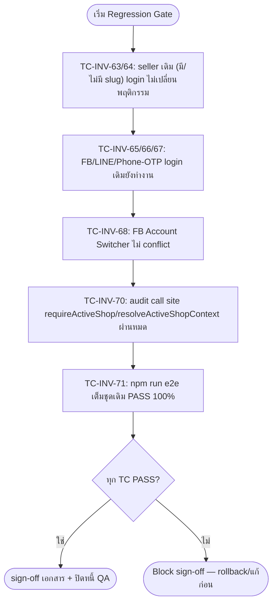
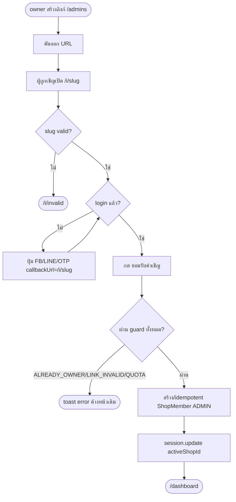

> **โมดูล:** M00012-ShopStaffInviteLinks
> **ประเภทเอกสาร:** Test Case (Unit + Service Integration + API + E2E + Regression + Security)
> **เวอร์ชัน:** 1.0
> **วันที่จัดทำ:** 2026-07-04
> **สถานะ:** **Back-fill** — feature นี้ implement + merge→main + deploy prod แล้ว (merge commit `0f2b197`) **ก่อน** เอกสารชุดนี้ถูกเขียน (ผิดลำดับ Hard Rule 11 — เป็นหนี้ governance ที่บันทึกไว้ใน `project_shop_staff_invite_resume` memory). เอกสารนี้เขียนย้อนหลังเพื่อบันทึกเจตนาการทดสอบ + สถานะจริง ณ วันที่จัดทำ **ไม่ใช่การอ้างว่าได้ QA ครบแล้ว**
> **เจ้าของเอกสาร:** QA (ดู [[Feature-Docs-Ownership]])

# Test Case: Shop Staff Invite Links — พนักงาน (M00012)

---

## 1. Overview

ชุดทดสอบนี้ครอบคลุมฟีเจอร์ **feature 00012 "พนักงาน" (Shop Staff Invite via reusable link)** — เจ้าของร้าน **BUSINESS** สร้างลิงก์เชิญแบบ reusable (`/i/<slug>`, มีวันหมดอายุ, revoke ได้) แทนการเชิญแบบ contact-match เดิม (feature 00008); ผู้ถูกเชิญเปิดลิงก์ → login (Facebook/LINE/เบอร์ OTP) → ยอมรับคำเชิญ → กลายเป็น `ShopMember(role=ADMIN)` ของร้านนั้น **โดยไม่ถือเป็น seller** (ไม่มี Personal shop ของตัวเอง — invariant ใหม่ "Lazy Personal shop" เลิก auto-create ตอน login); ถ้ามีสมาชิกภาพหลายร้าน (Personal + business ที่เป็นสมาชิก) ต้องเลือกร้านผ่าน `/choose-shop`; เมนูซ้ายย้ายการจัดการไปที่ "พนักงาน" → `/admins`.

**⚠️ เหตุผลที่ต้อง back-fill เอกสารนี้:** เอกสารชุด feature docs (PRD/BRD/SRS/SDS/DATABASE/API/Tests) ของ 00012 **ไม่ได้ทำก่อน implement** ตาม Hard Rule 11 — เป็นหนี้ governance ที่ระบุไว้แล้วในหนี้ reviewer (ดู memory `project_shop_staff_invite_resume`). เอกสารนี้จึง **trace กลับ design/plan spec แทน BRD** (ไม่มี BRD/AC-XXX formal ของ 00012 ให้ trace) — อ้างอิง:

- Design spec: `docs/superpowers/specs/2026-07-04-shop-staff-invite-link-design.md`
- UX spec: `docs/superpowers/specs/2026-07-04-shop-staff-invite-link-ux-spec.md`
- Implementation plan: `docs/superpowers/plans/2026-07-04-shop-staff-invite-link.md` (Phase 0–5, task 0.1–5.2)
- Memory resume: `project_shop_staff_invite_resume`

**ขอบเขตชุดทดสอบ (Scope):**

- **In-scope:** `src/lib/invite-link.ts` (slug/URL/expiry) + `src/services/invite-link.service.ts` (create/list/revoke/resolve/accept); API `/api/shops/current/invite-links` (+ `[slug]` revoke), `/api/i/[slug]` (resolve) + `/api/i/[slug]/accept`, `/api/shops/open-personal`; UI `/admins`, `/i/[slug]`, `/i/invalid`, `/choose-shop`; **Lazy Personal shop invariant change** (`auth.ts` jwt/session callback, `proxy.ts` gate, layout ถอด `ensurePersonalShop`); regression ต่อ seller เดิม + FB/LINE login เดิม
- **Out-of-scope:** role granularity ย่อยกว่า ADMIN, เชิญเข้า PERSONAL shop, email/SMS auto-send ลิงก์, audit log เข้า-ออกแอดมิน (design spec §2 out-of-scope) — ตรงกันกับ scope baseline ที่ **ยังไม่ได้เขียนเป็นไฟล์แยก** (หนี้ข้อ 2 ใน memory resume)
- **สภาพแวดล้อม:**
  - dev server `http://seller.deepth.local:4000` (+ main `http://deepth.local:4000` สำหรับ proxy redirect `/i/*`) — user รันเอง, ไม่ได้เปิดระหว่าง build feature นี้
  - DB: Supabase dev/prod ตัวเดียวกัน — migration `20260704000300_add_shop_invite_link` **applied แล้ว** (ยืนยันจาก memory resume)
  - Unit/Service tests: Vitest (`npm run test`) — **เขียนและรันผ่านแล้วระหว่าง dev** (ดูหัวข้อ 2.A)
  - E2E: Playwright (`npm run e2e`) — **ยังไม่มี spec file** สำหรับ feature นี้ใน `e2e/` (ตรวจแล้ว: ไม่มีไฟล์ที่ grep เจอคำว่า "invite" ใน `e2e/`) — ต้องเขียน `e2e/shop-staff-invite-link.spec.ts` ก่อนรันได้จริง

**สถานะรวม ณ วันที่จัดทำเอกสารนี้ (2026-07-04):**

| ระดับ | สถานะ | หมายเหตุ |
|---|---|---|
| Unit (`src/lib/__tests__/invite-link.test.ts`) | ✅ **DONE / PASS** | 7 tests เขียน+รันผ่านแล้วระหว่าง dev (TDD red→green ตาม plan Task 1.2) |
| Service integration (`src/services/__tests__/invite-link.service.test.ts`) | ✅ **DONE / PASS** | 20 tests เขียน+รันผ่านแล้วระหว่าง dev (plan Task 1.3) |
| API integration (authenticated-curl, plan Task 2.1/2.2) | ⚠️ **PARTIAL — ไม่มีบันทึกผลเป็นลายลักษณ์อักษร** | plan ระบุว่า QA ผ่าน authenticated-curl ระหว่าง dev แต่ไม่มี evidence file/log เก็บไว้ — ถือเป็น **PENDING-verify** ในเอกสารนี้จนกว่าจะรันซ้ำแล้วบันทึก |
| E2E (Playwright, happy path + edge) | 🔴 **PENDING-E2E** | ไม่มี spec file เขียนไว้เลย — dev server ไม่พร้อมระหว่าง build |
| Regression (seller เดิม + FB/LINE login) | 🔴 **PENDING-manual-prod** | user กำลังทดสอบเองบน prod ขณะนี้ — **ยังไม่มีผลยืนยันเป็นลายลักษณ์อักษรกลับมา** |
| Security (rate-limit, owner-guard, capability-URL) | 🟡 **PARTIAL — code review เท่านั้น** | โค้ด rate-limit/guard มีจริง (อ่านโค้ดยืนยันแล้ว) แต่ยังไม่มี automated test ยิงจริงยืนยันเชิงพฤติกรรม |

**บทสรุปสำคัญที่ต้องรายงาน:** type-check + code review + unit/service test เพียงพอสำหรับ**ระดับฟังก์ชันเดี่ยว** (lib/service) เท่านั้น **ไม่ได้พิสูจน์ว่าฟีเจอร์ทำงานถูกต้องแบบ end-to-end** โดยเฉพาะจุดเสี่ยงสูงสุดคือ **Lazy Personal shop invariant change** ที่แตะ `auth.ts`/`proxy.ts` กลาง — ผลกระทบต่อ seller เดิมทุกคนถ้าพัง (login ไม่เข้า/วน redirect loop) ยังไม่ถูกพิสูจน์ด้วย runtime QA จริงในเอกสารนี้

---

## 2. Test Scenarios

### หมวด A — Unit: `src/lib/invite-link.ts` (✅ DONE / PASS — 7 tests)

ไฟล์: `src/lib/__tests__/invite-link.test.ts` — รันผ่านแล้ว (`npx vitest run src/lib/__tests__/invite-link.test.ts`), เขียนตาม TDD (plan Task 1.2 Step 1-4)

#### TC-INV-01: `generateInviteSlug()` คืน 12 ตัวอักษร `[A-Za-z0-9]` เท่านั้น
- **ประเภท:** Unit (Vitest) · **สถานะ:** DONE-unit / PASS
- **Expected:** match `/^[A-Za-z0-9]{12}$/`

#### TC-INV-02: `generateInviteSlug()` สุ่มสองครั้งได้ค่าไม่ซ้ำกัน
- **ประเภท:** Unit · **สถานะ:** DONE-unit / PASS

#### TC-INV-03: `buildInviteUrl(slug)` ประกอบ URL รูปแบบ `<base>/i/<slug>`
- **ประเภท:** Unit · **สถานะ:** DONE-unit / PASS

#### TC-INV-04: `buildInviteUrl(slug)` ขึ้นต้นด้วย `http`
- **ประเภท:** Unit · **สถานะ:** DONE-unit / PASS

#### TC-INV-05: `INVITE_EXPIRY_OPTIONS` มี key ตรงตาม default (`'7d'`)
- **ประเภท:** Unit · **สถานะ:** DONE-unit / PASS

#### TC-INV-06: `INVITE_EXPIRY_OPTIONS` มีครบ 3 ตัวเลือก `24h`/`7d`/`30d` พร้อม label ภาษาไทย
- **ประเภท:** Unit · **สถานะ:** DONE-unit / PASS

#### TC-INV-07: `expiryKeyToDate('24h')` ให้เวลาประมาณ `now + 24 ชั่วโมง`
- **ประเภท:** Unit · **สถานะ:** DONE-unit / PASS

---

### หมวด B — Service integration: `src/services/invite-link.service.ts` (✅ DONE / PASS — 20 tests)

ไฟล์: `src/services/__tests__/invite-link.service.test.ts` — รันผ่านแล้ว, mirror pattern `shop-member.service` test เดิม (plan Task 1.3 Step 1-4)

**`createInviteLink`**
#### TC-INV-08: throws `NOT_OWNER` เมื่อ shop ไม่ใช่ของ owner — DONE-unit / PASS
#### TC-INV-09: throws `NOT_OWNER` เมื่อ shop เป็น `PERSONAL` (เชิญเข้าได้เฉพาะ BUSINESS) — DONE-unit / PASS
#### TC-INV-10: throws `SHOP_LOCKED` เมื่อ shop ถูกล็อก — DONE-unit / PASS
#### TC-INV-11: throws `NO_ACTIVE_PACKAGE` เมื่อไม่มี subscription หรือไม่ ACTIVE — DONE-unit / PASS
#### TC-INV-12: happy path — สร้าง link สำเร็จ คืน `{slug, expiresAt}` — DONE-unit / PASS

**`listActiveInviteLinks`**
#### TC-INV-13: query `where revokedAt=null && expiresAt>now`, order `createdAt desc` — DONE-unit / PASS

**`revokeInviteLink`**
#### TC-INV-14: throws `NOT_OWNER` เมื่อ shop ไม่ใช่ของ owner — DONE-unit / PASS
#### TC-INV-15: throws `NOT_OWNER` เมื่อ link ไม่ใช่ของ shop นี้ — DONE-unit / PASS
#### TC-INV-16: idempotent — revoke ซ้ำไม่ throw ไม่เรียก update ซ้ำ — DONE-unit / PASS
#### TC-INV-17: happy path — set `revokedAt` — DONE-unit / PASS

**`resolveInviteLink`**
#### TC-INV-18: reason `NOT_FOUND` เมื่อไม่มี slug — DONE-unit / PASS
#### TC-INV-19: reason `REVOKED` เมื่อ `revokedAt` ตั้งไว้ — DONE-unit / PASS
#### TC-INV-20: reason `EXPIRED` เมื่อหมดอายุ — DONE-unit / PASS
#### TC-INV-21: `valid=true` คืนข้อมูล shop เมื่อลิงก์ยังใช้ได้ — DONE-unit / PASS

**`acceptInviteLink`**
#### TC-INV-22: throws `LINK_INVALID` เมื่อ link ไม่มี/revoked/expired — DONE-unit / PASS
#### TC-INV-23: throws `ALREADY_OWNER` เมื่อ user คือเจ้าของ shop เอง — DONE-unit / PASS
#### TC-INV-24: **idempotent-member** — คืน `{shopId}` เฉย ๆ เมื่อเป็นสมาชิกอยู่แล้ว (ข้าม quota check) — DONE-unit / PASS
#### TC-INV-25: throws `ADMIN_QUOTA_EXCEEDED` เมื่อโควตาเต็ม — DONE-unit / PASS
#### TC-INV-26: **fail-closed** — ไม่มี ACTIVE subscription = โควตา 0 → throw `ADMIN_QUOTA_EXCEEDED` — DONE-unit / PASS
#### TC-INV-27: happy path — สร้าง `ShopMember(role=ADMIN)` สำเร็จ — DONE-unit / PASS

> **หมายเหตุความเสี่ยงที่ยังไม่ปิด (จาก memory resume):** TOCTOU quota race เมื่อ 2 คนกด accept ลิงก์เดียวกันพร้อมกันจนเกินโควตาพร้อมกัน — unit test ข้างต้น cover ตาม-mock ทีละ call แต่ **ไม่ cover concurrent race จริง** (ต่างจาก Deep Chat TC-CHAT-05 ที่มี race test แบบ `Promise.allSettled` ยิง 2 ครั้งจริงกับ DB) → ระบุเป็น PENDING-E2E ในหมวด G ด้านล่าง

---

### หมวด C — API Integration (owner-facing) — `⚠️ PENDING-verify` (plan ระบุว่าเทสระหว่าง dev แต่ไม่มี evidence เก็บ)

#### TC-INV-28: `POST /api/shops/current/invite-links` (owner, BUSINESS, package ACTIVE) → 201 `{url, expiresAt}`
- **สถานะ:** PENDING-verify (authenticated-curl smoke ทำระหว่าง dev ตาม plan Task 2.1 Step 2 — ไม่มี log บันทึกไว้ ให้ถือว่ายังไม่ยืนยัน)

#### TC-INV-29: `POST` โดย non-owner (ADMIN หรือ user อื่น) → 403
- **สถานะ:** PENDING-verify

#### TC-INV-30: `POST` โดย shop kind=PERSONAL → 403 (`NOT_OWNER`)
- **สถานะ:** PENDING-E2E

#### TC-INV-31: `POST` โดย shop ที่ไม่มี package ACTIVE → 402/403 (`NO_ACTIVE_PACKAGE`)
- **สถานะ:** PENDING-E2E

#### TC-INV-32: `GET /api/shops/current/invite-links` → list เฉพาะลิงก์ที่ยัง active (ไม่รวม revoked/expired)
- **สถานะ:** PENDING-verify

#### TC-INV-33: `DELETE /api/shops/current/invite-links/[slug]` (owner) → 204, ลิงก์หายจาก list
- **สถานะ:** PENDING-verify

#### TC-INV-34: `DELETE` โดย non-owner → 403 (ไม่ revoke ลิงก์คนอื่น)
- **สถานะ:** PENDING-E2E

---

### หมวด D — API Integration (public invite landing) — `⚠️ PENDING-verify`

#### TC-INV-35: `GET /api/i/[slug]` slug valid → 200 `{valid:true, shopName, shopLogo}` (ไม่คืน `shopId`/PII อื่น เมื่อ invalid)
- **สถานะ:** PENDING-verify

#### TC-INV-36: `GET /api/i/[slug]` slug expired/revoked/ไม่มีจริง → `valid:false` แบบไม่รั่วเหตุผลละเอียด (ไม่บอกว่า "expired" ต่าง "revoked" ต่าง "not found" ให้ client เห็น)
- **สถานะ:** PENDING-E2E — **สำคัญ:** ต้องตรวจ response body จริงว่าไม่ leak reason enum (`NOT_FOUND`/`EXPIRED`/`REVOKED`) ออกไปยัง unauthenticated caller

#### TC-INV-37: `POST /api/i/[slug]/accept` ไม่มี session → 401
- **สถานะ:** PENDING-verify (โค้ดยืนยันจาก `src/app/api/i/[slug]/accept/route.ts` มี guard ชัดเจน แต่ยังไม่ยิงจริง)

#### TC-INV-38: `POST /api/i/[slug]/accept` happy path (login แล้ว, slug valid) → 200 `{shopId}`, สร้าง `ShopMember` จริงใน DB
- **สถานะ:** PENDING-E2E

#### TC-INV-39: `POST /api/i/[slug]/accept` slug invalid/expired/revoked → 410 `{error:"LINK_INVALID"}`
- **สถานะ:** PENDING-E2E

#### TC-INV-40: `POST /api/i/[slug]/accept` เจ้าของร้านเปิดลิงก์ตัวเอง → 409 `{error:"ALREADY_OWNER"}`
- **สถานะ:** PENDING-E2E

#### TC-INV-41: `POST /api/i/[slug]/accept` โควตาเต็ม → 409 `{error:"ADMIN_QUOTA_EXCEEDED"}`
- **สถานะ:** PENDING-E2E

#### TC-INV-42: `POST /api/i/[slug]/accept` accept ซ้ำ (เป็นสมาชิกอยู่แล้ว) → 200 idempotent ไม่ throw ไม่สร้างแถวซ้ำ
- **สถานะ:** PENDING-E2E

#### TC-INV-43: `POST /api/i/[slug]/accept` ยิงเกิน rate-limit (10/min ต่อ IP ตาม comment ใน route) → 429 พร้อม `Retry-After: 60`
- **สถานะ:** PENDING-E2E

#### TC-INV-44: `POST /api/shops/open-personal` (login แล้ว, ยังไม่มี Personal shop) → 200 `{shopId}` สร้าง Personal shop ใหม่ + `isShop=true`
- **สถานะ:** PENDING-E2E

#### TC-INV-45: `POST /api/shops/open-personal` เรียกซ้ำ (มี Personal shop อยู่แล้ว) → idempotent คืน `shopId` เดิม
- **สถานะ:** PENDING-E2E

---

### หมวด E — E2E Happy Path (Playwright) — 🔴 PENDING-E2E (ยังไม่มี spec file)

> ต้องสร้าง `e2e/shop-staff-invite-link.spec.ts` (ยังไม่มีในโปรเจกต์) + helper คู่ขนาน `e2e/helpers/auth.ts` (เพิ่ม state สำหรับ "owner BUSINESS+ACTIVE package" และ "invited user ไม่มี Personal shop") ก่อนรันได้จริง — mirror pattern `e2e/seller-onboarding-2phase.spec.ts`

#### TC-INV-46: Full happy-path flow ครบวงจร
- **ประเภท:** E2E Playwright · **สถานะ:** PENDING-E2E
- **Steps (ตาม plan Task 5.1):**
  1. owner (BUSINESS, package ACTIVE) login → `/admins` → กดสร้างลิงก์เชิญ (เลือกอายุ) → คัดลอก URL
  2. เปิด browser context ใหม่ (incognito/2nd account) → วางลิงก์ `/i/<slug>`
  3. login ด้วย social (FB/LINE จำลองไม่ได้ local — ใช้ OTP test account `0000000009`/`123456` แทนตาม convention เดิม) หรือ inject session ผ่าน `loginAs` helper
  4. กด "ยอมรับคำเชิญ" → เข้า dashboard เป็น ADMIN ของร้านนั้น
  5. ตรวจว่าผู้ถูกเชิญ **ไม่มี Personal shop** (ไม่ถูกเด้ง `/onboarding`, ไม่เห็นเมนู seller-only ที่ผูกกับ Personal)
  6. กด "เปิดร้านของฉัน" → ผ่าน onboarding wizard เดิม → มี Personal shop แล้ว
  7. กลับไป `/choose-shop` → เห็น 2 ร้าน (Personal + business ที่เป็น ADMIN) → เลือกสลับได้ถูกต้อง
- **Expected:** ทุก step ผ่านไม่มี error, DB มี `ShopMember(role=ADMIN)` ใหม่, `ShopInviteLink` เดิมยังใช้ซ้ำได้ (reusable) จนกว่าจะหมดอายุ/revoke

#### TC-INV-47: หน้า `/admins` — สร้างลิงก์ → เห็นในการ์ด "ลิงก์เชิญพนักงาน" ทันที (optimistic/refresh)
- **สถานะ:** PENDING-E2E

#### TC-INV-48: หน้า `/admins` — revoke ลิงก์ (Sweet Alerts confirm) → หายจาก list, DB `revokedAt` set
- **สถานะ:** PENDING-E2E

#### TC-INV-49: หน้า `/admins` — ลบสมาชิก ADMIN (owner-only) → หายจาก `CurrentMembersTable`, DB ลบแถว `ShopMember`
- **สถานะ:** PENDING-E2E

#### TC-INV-50: หน้า `/admins` — ลบตัวเอง/ลบ OWNER → ปุ่มลบไม่แสดง/ถูก block (guard เดิมจาก feature 00008)
- **สถานะ:** PENDING-E2E

#### TC-INV-51: เมนูซ้าย "พนักงาน" แสดงเฉพาะ `kind=BUSINESS && role=OWNER` — ADMIN/PERSONAL ไม่เห็นเมนูนี้
- **สถานะ:** PENDING-E2E

---

### หมวด F — E2E Edge Cases — 🔴 PENDING-E2E

#### TC-INV-52: เปิดลิงก์หมดอายุ → เห็นหน้า `/i/invalid` (ข้อความกลาง ๆ ไม่รั่วเหตุผล)
- **สถานะ:** PENDING-E2E

#### TC-INV-53: เปิดลิงก์ที่ owner revoke แล้ว → `/i/invalid`
- **สถานะ:** PENDING-E2E

#### TC-INV-54: เปิดลิงก์ slug สุ่มที่ไม่มีจริง → `/i/invalid`
- **สถานะ:** PENDING-E2E

#### TC-INV-55: accept ชนโควตา (โควตาเต็มพอดี ณ ตอนกด) → toast/error message สุภาพ ("ร้านนี้มีผู้ดูแลเต็มจำนวนแล้ว กรุณาติดต่อเจ้าของร้าน") ค้างหน้าเดิมไม่ crash
- **สถานะ:** PENDING-E2E

#### TC-INV-56: accept ซ้ำ (กดปุ่ม "ยอมรับคำเชิญ" 2 ครั้งติด หรือเปิดลิงก์ใหม่ทั้งที่เป็นสมาชิกอยู่แล้ว) → idempotent, เข้า dashboard ปกติไม่มี error message
- **สถานะ:** PENDING-E2E

#### TC-INV-57: owner เปิดลิงก์ของร้านตัวเอง → error "คุณเป็นเจ้าของร้านนี้อยู่แล้ว" (`ALREADY_OWNER`), ไม่สร้าง `ShopMember` ซ้ำ
- **สถานะ:** PENDING-E2E

#### TC-INV-58: `/choose-shop` — user มี 0 ร้าน (ยังไม่เป็น seller, ไม่เคยถูกเชิญ) → เห็นการ์ด "เปิดร้านของฉัน" + ช่องวางลิงก์เชิญ
- **สถานะ:** PENDING-E2E

#### TC-INV-59: `/choose-shop` — user มี 1 ร้าน (ไม่ว่า Personal หรือ business เดียว) → auto-redirect `/dashboard` ไม่โผล่หน้านี้
- **สถานะ:** PENDING-E2E

#### TC-INV-60: `/choose-shop` — วางลิงก์เชิญผิดรูปแบบในช่อง input → inline error "ลิงก์ไม่ถูกต้อง" ไม่ navigate
- **สถานะ:** PENDING-E2E

#### TC-INV-61: proxy redirect — `curl -I http://deepth.local:4000/i/<slug>` (main domain) → 307/302 ไป `http://seller.deepth.local:4000/i/<slug>`
- **สถานะ:** PENDING-E2E (คำสั่ง curl ทำได้ทันทีที่ dev server รัน — ง่ายที่สุดในหมวดนี้ ควรทำก่อน)

#### TC-INV-62: race — 2 คนกด accept ลิงก์เดียวกันพร้อมกันตอนโควตาเหลือ 1 ที่ → มีคนเดียวสำเร็จ อีกคน `ADMIN_QUOTA_EXCEEDED` (ไม่เกินโควตา, ไม่ error 500)
- **สถานะ:** PENDING-E2E — **ทราบเป็นความเสี่ยง TOCTOU ที่ยังไม่ปิดจาก memory resume** (ดูหมายเหตุท้ายหมวด B)

---

### หมวด G — 🛑 Regression Gate (CRITICAL, Blocking ก่อน sign-off) — PENDING-manual-prod

> **เหตุผลที่เป็น blocking:** feature นี้เปลี่ยน invariant กลาง **"ทุก seller ต้องมี Personal shop auto-create ตอน login"** → **Lazy** (สร้างเมื่อกดเปิดร้านเองเท่านั้น) โดยแก้ `src/lib/auth.ts` (jwt/session callback), `src/proxy.ts` (force-redirect gate), และถอด `ensurePersonalShop` ออกจาก 2 layout ไฟล์ — ถ้าพัง **กระทบ seller เดิมทุกคน** (login ไม่เข้า/วน redirect loop/เด้ง onboarding ผิด) ไม่ใช่แค่ user ใหม่ของฟีเจอร์นี้

#### TC-INV-63 (🛑 CRITICAL): Seller เดิมที่มี Personal shop + slug ตั้งค่าแล้ว login → เข้า `/dashboard` ปกติ ไม่โดนเด้ง `/onboarding` หรือ `/choose-shop`
- **สถานะ:** PENDING-manual-prod — **user กำลังทดสอบบน prod ขณะนี้; ยังไม่มีผลยืนยันเป็นลายลักษณ์อักษรกลับมา ณ วันที่จัดทำเอกสาร**
- **Expected:** พฤติกรรม login เหมือนก่อน deploy ทุกประการ

#### TC-INV-64 (🛑 CRITICAL): Seller เดิมที่มี Personal shop แต่ slug ยังว่าง (คนที่สมัครใหม่ยังไม่จบ onboarding เดิม) → ยังเด้ง `/onboarding` เหมือนเดิม (ไม่ใช่ `/choose-shop`)
- **สถานะ:** PENDING-manual-prod

#### TC-INV-65 (🛑 CRITICAL): Facebook OAuth login (buyer + seller) ยังทำงานถูกต้องหลังแก้ `auth.ts` (merge conflict resolve เก็บ `activeShopKind/Name/Logo` ของ FB-switcher ไว้ด้วย)
- **สถานะ:** PENDING-manual-prod

#### TC-INV-66 (🛑 CRITICAL): LINE OAuth login ยังทำงานถูกต้อง (feature 00001)
- **สถานะ:** PENDING-manual-prod

#### TC-INV-67 (🛑 CRITICAL): Phone-OTP login/signup เดิมยังทำงานถูกต้อง (ไม่ได้แตะ provider นี้โดยตรง แต่ jwt/session callback ใช้ร่วมกันทุก provider)
- **สถานะ:** PENDING-manual-prod

#### TC-INV-68: FB Account Switcher (feature 00008, commit ก่อนหน้าติดกัน) — สลับร้านยังทำงานถูกต้อง ไม่ conflict กับ `/choose-shop` ใหม่
- **สถานะ:** PENDING-manual-prod

#### TC-INV-69: seller ที่ไม่มี Personal shop และไม่เคยถูกเชิญเลย (edge — ควรไม่มีจริงในข้อมูลเดิม แต่เผื่อ) — เข้า seller subdomain ครั้งแรกไม่ error 500
- **สถานะ:** PENDING-manual-prod

#### TC-INV-70: `requireActiveShop`/`resolveActiveShopContext` caller เดิมทุกจุด (billing, verification, onboarding, public profile) ยังทำงานถูกต้องเมื่อ user มี Personal shop ปกติ (audit ตาม plan Task 0.2 — ตรวจว่าไม่มี call site ไหนพังเพราะสมมติ Personal shop ต้องมีเสมอ)
- **สถานะ:** PENDING-manual-prod — plan ระบุว่าต้อง dispatch Explore agent audit ก่อนแก้โค้ด (Task 0.2) แต่ **ไม่มีรายงาน audit แนบไว้เป็นไฟล์แยก** ให้ตรวจสอบย้อนหลังได้

#### TC-INV-71: `npm run e2e` เต็มชุด (regression suite เดิมทั้งหมด — buyer-password-auth, seller-onboarding, inventory-addon, feature-00001 ฯลฯ) PASS 100% หลัง merge 00012
- **สถานะ:** PENDING-manual-prod / PENDING-E2E (ยังไม่รันซ้ำหลัง merge เพื่อยืนยัน)

---

### หมวด H — Security

#### TC-INV-72: rate-limit `GET /api/i/[slug]` (resolve, public, ไม่มี auth) ต่อ IP — ป้องกัน slug enumeration/brute-force
- **สถานะ:** 🟡 code review เท่านั้น — ยืนยันจาก commit `ce48bcb`: "RSC `/i/[slug]` เพิ่ม `checkApiRateLimit` per-IP กัน slug enumeration (RSC ไม่ผ่าน `guardApi`)" — โค้ดมีจริง แต่ **ยังไม่มี automated test ยิงเกิน limit จริงเพื่อยืนยัน 429**

#### TC-INV-73: rate-limit `POST /api/i/[slug]/accept` (10/min/IP ตาม comment ในโค้ด) — ยืนยัน route.ts มี `checkApiRateLimit` guard
- **สถานะ:** 🟡 code review เท่านั้น (อ่านโค้ดยืนยันแล้ว ดูหัวข้อ 1 ด้านบน — ยังไม่ยิงจริง)

#### TC-INV-74: owner-guard `POST/GET/DELETE /api/shops/current/invite-links*` — เฉพาะ `role=OWNER` ของ shop `BUSINESS` เรียกได้ (ซ้ำกับ TC-INV-29/34 แต่มองมุม security)
- **สถานะ:** PENDING-E2E

#### TC-INV-75: capability-URL risk — slug 12-char random ยาวพอกัน brute-force (ประเมินเชิง entropy: `62^12` combination) — ยอมรับความเสี่ยงตาม design spec §3.2 ("เป็น capability-URL ความเสี่ยงต่ำ") **โดยมีเงื่อนไข** ต้อง login ก่อน accept + rate-limit + expiry + revoke ประกอบกัน
- **สถานะ:** ประเมินเชิงออกแบบ (design review) — ไม่ใช่ automated test แต่บันทึกไว้เป็นข้อสมมติที่ยอมรับได้ (accepted risk)

#### TC-INV-76: `GET /api/i/[slug]` ไม่คืน `shopId` จริงเมื่อ `valid=false` (ป้องกัน enumeration ผ่าน response diff)
- **สถานะ:** PENDING-E2E — สำคัญ ต้องตรวจ response body ไม่มี field `shopId` หลุดออกมาตอน invalid

#### TC-INV-77: PII neutralize-at-source — หน้า `/admins` (RSC ใต้ client `VerticalLayout`) ไม่ serialize raw PII (เบอร์/อีเมลสมาชิก) ลง flight payload เกินจำเป็น (ตาม memory `feedback_rsc_pii_neutralize_at_source` — ความเสี่ยงเดียวกับที่เจอใน Seller Orders phase)
- **สถานะ:** PENDING-E2E/code-review — ยังไม่ได้ grep/ตรวจ flight payload ของหน้านี้โดยเฉพาะ

---

## 3. Traceability Matrix

> **หมายเหตุ:** feature นี้ไม่มี BRD/AC-XXX formal (หนี้ Hard Rule 11) — ตารางนี้ trace กลับ **Design Spec §section** และ **Plan Task-ID** แทน

| Design Spec §/Plan Task | Test Case | ครอบคลุมหรือไม่ |
|---|---|---|
| §3.2 Model `ShopInviteLink` + lib slug/URL (Task 1.2) | TC-INV-01..07 | Yes (DONE) |
| §3.2 Service create/list/revoke/resolve/accept (Task 1.3) | TC-INV-08..27 | Yes (DONE) |
| §4.1 สร้างลิงก์ (owner) API (Task 2.1) | TC-INV-28..34 | Yes (PENDING-verify/E2E) |
| §4.2 เปิดลิงก์ + Accept API (Task 2.2) | TC-INV-35..45 | Yes (PENDING-verify/E2E) |
| §4.4 Post-login routing 1/หลายร้าน (Task 4.1) | TC-INV-46, 58, 59 | Yes (PENDING-E2E) |
| §4.5 Lazy Personal shop (Task 3.1-3.4) | TC-INV-46, 63..70 | Yes (PENDING-manual-prod — **critical gap**) |
| §5.1 เมนู "พนักงาน" + `/admins` (Task 4.3) | TC-INV-47..51 | Yes (PENDING-E2E) |
| §5.3 `/i/[slug]` + `/choose-shop` UI (Task 4.1/4.2) | TC-INV-46, 52..60 | Yes (PENDING-E2E) |
| §6 Security & Edge cases | TC-INV-62, 72..77 | Yes (PENDING-E2E/code-review ผสม) |
| Task 4.4 Deprecate contact-match UI | (ไม่มี TC เฉพาะ — เห็นผลทางอ้อมใน TC-INV-63/64) | ⚠️ **ช่องว่าง — ควรเพิ่ม TC ตรวจว่าหน้า `/business/[shopId]/invites` redirect/แสดงผลถูกต้องหลังถอด `InviteMemberForm`** |
| Task 5.1 E2E happy path เต็มวงจร | TC-INV-46 | Yes (PENDING-E2E) |

**ช่องว่างที่พบระหว่างทำ traceability (ต้องเพิ่มรอบหน้า):**
1. ไม่มี TC ตรวจหน้า `/business/[shopId]/invites` เดิมหลัง Task 4.4 (ถอด contact-match UI) — ควรเพิ่ม `TC-INV-78`
2. ไม่มี TC ตรวจ `session.update({activeShopId})` client-side flow ทำงานถูกต้องข้าม 3 จุด (`/i/[slug]/accept`, `/choose-shop`, `/shops/open-personal`) แบบเจาะจง (ปัจจุบันซ่อนอยู่ใน TC-INV-46 รวม) — ควรแยกเป็น TC เฉพาะถ้าเจอบั๊ก

---

## 4. Flow

### Regression Gate ก่อน Sign-off (หมวด G)

### Invite Accept Flow (หมวด E/F อ้างอิง)

---

## 5. Seed Strategy (Prisma) — สำหรับ E2E ที่ยังไม่เขียน

ต้องสร้าง (ยังไม่มี):
- `e2e/helpers/invite-link-seed.ts`: `seedBusinessShopWithActivePackage(ownerUserId)`, `seedInviteLink(shopId, {expired?, revoked?})`, `seedShopMember(shopId, userId, role)`, `cleanupInviteLinkFixtures(...)`
- ต่อยอด `e2e/helpers/auth.ts` — เพิ่ม state: `businessOwnerActive` (BUSINESS + package ACTIVE, ใช้สร้างลิงก์), `invitedNoPersonalShop` (login แล้วแต่ยังไม่มี Personal shop, ไว้เทส Lazy-shop)

---

## 6. Dependencies ก่อนรัน E2E จริง

| Dependency | ผลต่อ TC | สถานะ |
|---|---|---|
| dev server `seller.deepth.local:4000` + `deepth.local:4000` รันอยู่ | ทุก TC หมวด C-H | **ไม่พร้อมระหว่าง build — user รันเองบน prod แทน** |
| Migration `20260704000300_add_shop_invite_link` | ทุก TC ที่แตะ DB | ✅ Applied (Supabase dev=prod) |
| `e2e/shop-staff-invite-link.spec.ts` | ทุก E2E TC (หมวด E/F) | ❌ ยังไม่มีไฟล์ — ต้องเขียนก่อน |
| `e2e/helpers/invite-link-seed.ts` + auth helper เพิ่ม state | ทุก seeded E2E TC | ❌ ยังไม่มี |
| feature docs 00012 (PRD/BRD/SRS/SDS/DATABASE/API) | traceability formal | ❌ ยังไม่ครบ (หนี้ Hard Rule 11 — เอกสารนี้คือ Tests.md ตัวเดียวที่ back-fill ก่อน) |
| scope baseline + retro | governance sign-off | ❌ ยังไม่มี (memory resume หนี้ข้อ 2) |

---

## 7. ผลล่าสุด

| Run | วันที่ | ผล (Pass/Fail/Blocked) | ผู้ทดสอบ (Tester) |
|-----|--------|--------------------------|---------------------|
| 1 (unit + service, ระหว่าง dev) | 2026-07-04 | **PASS** — 7 unit + 20 service tests เขียว (TDD ตาม plan Task 1.2/1.3) | shinobu22 (developer, ระหว่าง implement) |
| 2 (API integration authenticated-curl) | 2026-07-04 | **ไม่มีบันทึกผลเป็นไฟล์/log แยก** — plan อ้างว่าทำระหว่าง dev แต่ไม่มี evidence เก็บไว้ให้ตรวจสอบย้อนหลัง | ไม่ระบุ |
| 3 (E2E Playwright) | — | **Blocked — ยังไม่มี spec file, dev server ไม่พร้อมระหว่าง build** | — |
| 4 (Regression บน prod) | กำลังดำเนินการ ณ 2026-07-04 | **PENDING — user ทดสอบเองบน prod ขณะนี้ ยังไม่ได้รับผลยืนยันกลับมา** | user (manual, prod) |

**การอ่านตารางนี้:** อย่าตีความว่า "unit/service PASS" = ฟีเจอร์ทำงานถูกทั้งระบบ — unit/service test cover เฉพาะ logic ระดับฟังก์ชัน/service ที่ mock dependency ไว้แล้ว **ไม่ครอบ** cross-cutting concern จริง เช่น session/JWT flow ข้าม request, proxy redirect ข้าม subdomain, React state บน UI, หรือ regression ต่อ user เดิมจำนวนมากบน prod

---

## 8. สรุป (Summary)

feature 00012 "พนักงาน" (Shop Staff Invite Links) **implement เสร็จ + merge→main + deploy prod แล้ว** (`0f2b197`, 2026-07-04) **ก่อน** เอกสาร Tests.md ฉบับนี้จะถูกเขียน — เป็นการ back-fill เอกสารตามคำขอ ไม่ใช่การยืนยันว่าได้ QA ครบ

**สถานะทดสอบสุทธิ:**
- ✅ **DONE / PASS:** Unit (7 tests, `src/lib/__tests__/invite-link.test.ts`) + Service integration (20 tests, `src/services/__tests__/invite-link.service.test.ts`) — cover slug/URL/expiry lib ทั้งหมด + service guard ครบทุกเงื่อนไข (`NOT_OWNER`, `SHOP_LOCKED`, `NO_ACTIVE_PACKAGE`, `LINK_INVALID`, `ALREADY_OWNER`, `ADMIN_QUOTA_EXCEEDED` รวม fail-closed, idempotent-member)
- 🔴 **PENDING-E2E:** ทุก scenario ที่ต้องขับ browser จริง (77 test case ในหมวด C-F, H ส่วนใหญ่) — **ยังไม่มี Playwright spec file เขียนไว้เลย** ต้องเขียน `e2e/shop-staff-invite-link.spec.ts` ก่อน
- 🔴 **PENDING-manual-prod (CRITICAL):** หมวด G Regression Gate ทั้งหมด (TC-INV-63..71) — จุดเสี่ยงสูงสุดของฟีเจอร์นี้คือ **Lazy Personal shop invariant change** ที่กระทบ seller เดิมทุกคน; user กำลังทดสอบเองบน prod ขณะนี้ **ยังไม่มีผลยืนยันเป็นลายลักษณ์อักษรกลับมา**
- 🟡 **PARTIAL (code-review only):** rate-limit + owner-guard + capability-URL risk — โค้ด guard มีจริง (อ่านยืนยันแล้ว) แต่ยังไม่มี automated test ยิงพฤติกรรมจริง

**ข้อเสนอแนะสำหรับรอบ QA ถัดไป (เรียงความสำคัญ):**
1. เขียน `e2e/shop-staff-invite-link.spec.ts` + seed helper ก่อน — โดยเฉพาะ **TC-INV-63/64 (regression seller เดิม)** เป็นลำดับแรกสุด เพราะกระทบผู้ใช้เดิมทั้งหมดถ้าพัง
2. รัน `TC-INV-61` (curl proxy redirect) ทันทีที่ dev server พร้อม — ง่ายและเร็วที่สุด ควรทำก่อน
3. ปิดหนี้ traceability ที่พบ (§3 ช่องว่างข้อ 1-2): เพิ่ม TC ตรวจหน้า `/business/[shopId]/invites` เดิม + `session.update` flow เฉพาะจุด
4. เขียน scope baseline + retro (หนี้ Hard Rule 11 ข้อ 2 ใน memory resume) คู่กับ feature docs อื่น (PRD/BRD/SRS/SDS/DATABASE/API) ที่ยังไม่ทำ

**Open Questions:**
- OD-INV-A: TOCTOU quota race ตอน accept พร้อมกันหลายคน (TC-INV-62) — ต้องตัดสินว่าจะทำ conditional-updateMany เหมือน wallet/sms-code หรือยอมรับความเสี่ยง (โควตาเกินชั่วคราวแล้วค่อยแก้ทีหลัง)
- OD-INV-B: audit call site `requireActiveShop`/`resolveActiveShopContext` (plan Task 0.2) — มีรายงานจริงหรือไม่ ถ้าไม่มี ต้องทำย้อนหลังก่อนปิดหนี้ regression
