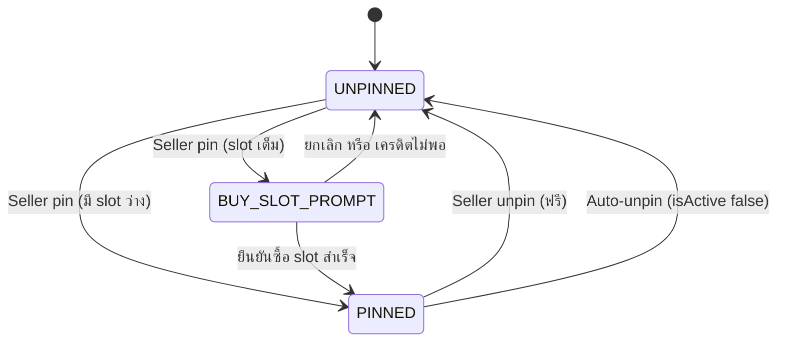
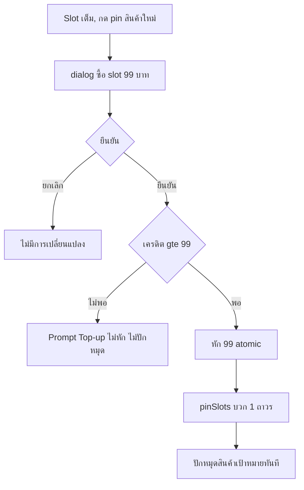
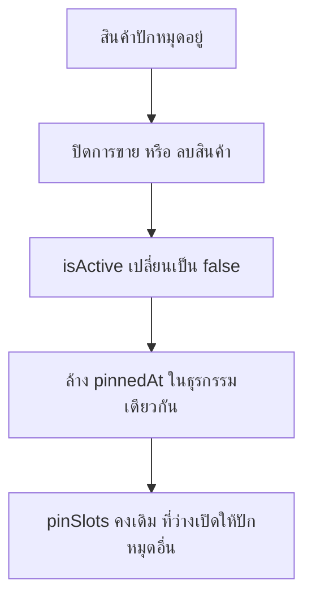
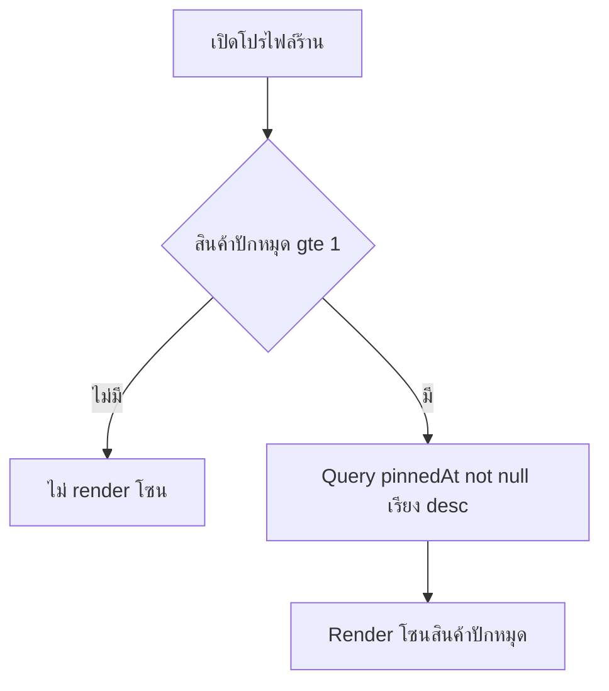

> **โมดูล:** M00013-PinProducts
> **ประเภทเอกสาร:** Business Requirements Document (BRD) - NON-TECHNICAL
> **เวอร์ชัน:** 1.0
> **วันที่จัดทำ:** 2026-07-04
> **สถานะ:** Draft — เนื้อหาอิง design ที่ user อนุมัติแล้ว 100%; รอ sign-off formal ก่อนส่งต่อ SRS/SDS/DATABASE/API/Tests
> **เจ้าของเอกสาร:** BA (ดู [[Feature-Docs-Ownership]])

# BRD: Pin Products (Business Requirements Document)

---

## 1. บทนำ

### 1.1 วัตถุประสงค์ของเอกสาร
1. กำหนด Functional Requirements ระดับ non-technical สำหรับระบบปักหมุดสินค้าเด่น + slot system แบบซื้อได้ถาวร
2. กำหนดขอบเขต (pin/unpin, ซื้อ slot, การแสดงผล, auto-unpin) และข้อจำกัด (ไม่มี reorder/refund/analytics ใน MVP)
3. อธิบายเงื่อนไข Given/When/Then สำหรับ QA — โดยเฉพาะจุดที่กระทบหน้าโปรไฟล์ที่เพิ่ง redesign (2026-07-04)
4. สร้างความเข้าใจร่วมระหว่างทีมธุรกิจและทีมพัฒนาก่อน implement

### 1.2 ขอบเขตของระบบ
ระบบให้ seller เลือกสินค้าเด่นมาแสดงในโซน "สินค้าปักหมุด" บนโปรไฟล์สาธารณะ ผ่านสิทธิ์ (slot) ที่ทุกร้านมี 1 slot ฟรี ซื้อเพิ่มถาวรที่ ฿99/slot หักผ่าน SellerWallet เดิม แทนที่ logic ชั่วคราว "3 ชิ้นแรกของร้าน"

**Input:** คำสั่ง pin/unpin จากหน้า products list; ซื้อ slot (ยืนยัน dialog); event เปลี่ยน `isActive` (deactivate/ลบ)
**Output:** `Product.pinnedAt`; `Shop.pinSlots`; `WalletTransaction` (DEDUCT, `reason=PIN_SLOT`); โซน "สินค้าปักหมุด" ที่อัปเดต; ข้อความปฏิเสธ/prompt top-up เมื่อเครดิตไม่พอ
**ระบบที่เกี่ยวข้อง:** `SellerWallet` + `wallet.service`, Product service, Seller Products List (Paces), โปรไฟล์สาธารณะ `/u/`, `/b/`, Paces Sweet Alerts, Admin Wallet Transaction

### 1.3 กลุ่มผู้ใช้งาน

| กลุ่มผู้ใช้ | บทบาท | สิทธิ์ |
|-----------|--------|-------|
| **Seller — มี Slot ว่าง** | เจ้าของร้าน | pin เพิ่มได้ทันทีไม่มีค่าใช้จ่ายจนกว่า slot เต็ม |
| **Seller — Slot เต็ม** | เจ้าของร้าน | pin เพิ่มได้เมื่อ unpin ตัวอื่นก่อน (ฟรี) หรือซื้อ slot (฿99) |
| **Seller — เครดิตไม่พอ** | เจ้าของร้าน | ถูกปฏิเสธซื้อ slot + prompt เติมเงิน |
| **Admin** | ดูแล WalletTransaction | เห็นรายการซื้อ pin slot แยก label ชัด |
| **ผู้เยี่ยมชม (buyer/public)** | ผู้ดูโปรไฟล์ | เห็นโซนปักหมุด (ถ้ามี) เรียง pinnedAt ล่าสุด |

---

## 2. ความต้องการหลัก (Functional Requirements)

### 2.1 Pin Slot Ownership & Purchase

#### FR-PIN-01: ทุกร้านได้รับ 1 Pin Slot ฟรีอัตโนมัติ
> ในฐานะ Seller ฉันต้องการ slot ปักหมุดฟรีตั้งแต่เปิดร้าน เพื่อทดลองใช้โดยไม่ต้องเสียเงินก่อน
- [ ] `[FR-PIN-01-AC-01]` **Given** ร้านใหม่ **When** สร้างสำเร็จ **Then** `Shop.pinSlots = 1` โดย default
- [ ] `[FR-PIN-01-AC-02]` **Given** ร้านเดิมก่อน deploy **When** migration รันสำเร็จ **Then** ทุกร้าน backfill `pinSlots = 1` ไม่มี null/0

#### FR-PIN-02: ซื้อ Pin Slot เพิ่มถาวร ฿99
> ในฐานะ Seller ที่ใช้ slot ฟรีครบ ฉันต้องการซื้อ slot เพิ่มถาวร ฿99 เพื่อปักหมุดมากกว่า 1 ชิ้นพร้อมกัน
- [ ] `[FR-PIN-02-AC-01]` **Given** เครดิต ≥ ฿99 **When** ยืนยันซื้อ **Then** หัก ฿99 atomic → `WalletTransaction` (DEDUCT, `reason=PIN_SLOT`, amount=99) → `pinSlots +1` ถาวร
- [ ] `[FR-PIN-02-AC-02]` **Given** เครดิต < ฿99 **When** ยืนยัน **Then** ปฏิเสธ + prompt top-up (ไม่หักบางส่วน ไม่เพิ่ม slot)
- [ ] `[FR-PIN-02-AC-03]` slot ที่ซื้อ **ไม่มีวันหมดอายุและไม่มี refund** ใน MVP
- [ ] `[FR-PIN-02-AC-04]` ไม่มี UI/endpoint ให้ลด `pinSlots` (ไม่มี downgrade)

### 2.2 Pin / Unpin Management

#### FR-PIN-03: Toggle Pin/Unpin จากหน้า Seller Products List
> ในฐานะ Seller ฉันต้องการ toggle เดียวจากหน้ารายการสินค้า เพื่อจัดการได้เร็ว
- [ ] `[FR-PIN-03-AC-01]` **Given** เจ้าของร้าน/สินค้าจริง **When** กด toggle ปักหมุดสินค้าที่ยังไม่ปัก และจำนวนปักหมุด < `pinSlots` **Then** ปักหมุดทันที (`pinnedAt = now()`)
- [ ] `[FR-PIN-03-AC-02]` **Given** สินค้าปักหมุดอยู่ **When** กด toggle ยกเลิก **Then** `pinnedAt` = null ทันที ไม่มีค่าใช้จ่าย
- [ ] `[FR-PIN-03-AC-03]` **Given** ไม่ใช่เจ้าของ **When** เรียก pin/unpin ผ่าน API ตรง **Then** ปฏิเสธที่ server-side
- [ ] `[FR-PIN-03-AC-04]` การนับจำนวนปักหมุดเทียบ `pinSlots` ต้อง atomic กัน race

#### FR-PIN-04: Slot-Full Guard + Buy-Slot Inline Dialog
> ในฐานะ Seller ที่ปักหมุดครบ slot ฉันต้องการเห็นทางเลือกซื้อ slot ทันทีเมื่อพยายามปักหมุดใหม่
- [ ] `[FR-PIN-04-AC-01]` **Given** จำนวนปักหมุด = `pinSlots` (เต็ม) **When** กด toggle ปักหมุดสินค้าใหม่ (ไม่ใช่ unpin) **Then** แสดง dialog "ซื้อ slot เพิ่ม ฿99?" ก่อน (ไม่ปักหมุดทันที)
- [ ] `[FR-PIN-04-AC-02]` **Given** ยืนยันซื้อ + เครดิต ≥ ฿99 **When** ยืนยัน **Then** หัก ฿99 + `pinSlots +1` + ปักหมุดสินค้าเป้าหมาย ในธุรกรรมเดียว (atomic)
- [ ] `[FR-PIN-04-AC-03]` **Given** ยืนยันแต่เครดิต < ฿99 **When** ยืนยัน **Then** ปฏิเสธ + prompt top-up; ไม่ปักหมุด; `pinSlots` ไม่เปลี่ยน
- [ ] `[FR-PIN-04-AC-04]` **Given** ยกเลิก dialog **When** ปิดโดยไม่ยืนยัน **Then** ไม่มีการเปลี่ยนแปลง

#### FR-PIN-05: Re-pin / Swap ฟรีไม่จำกัด
> ในฐานะ Seller ฉันต้องการเปลี่ยนสินค้าปักหมุดบ่อยเท่าที่ต้องการโดยไม่มีค่าใช้จ่าย
- [ ] `[FR-PIN-05-AC-01]` **Given** unpin A แล้ว pin C แทน **When** สำเร็จทั้งสอง **Then** ไม่มี `WalletTransaction` ใหม่จากการสลับ
- [ ] `[FR-PIN-05-AC-02]` ไม่จำกัดจำนวนครั้งของการสลับใน slot เดิมต่อวัน/เดือน

### 2.3 Public Profile Rendering

#### FR-PIN-06: แสดงโซนเรียงตาม pinnedAt ล่าสุดก่อน
> ในฐานะผู้เยี่ยมชม ฉันต้องการเห็นสินค้าที่ร้านปักหมุดจริง เรียงที่ร้านเพิ่งเลือกก่อน
- [ ] `[FR-PIN-06-AC-01]` **Given** ร้านมีสินค้าปักหมุด ≥1 **When** เปิด `/u/` หรือ `/b/` **Then** เห็นโซน "สินค้าปักหมุด" เรียง `pinnedAt` มากไปน้อย
- [ ] `[FR-PIN-06-AC-02]` แทนที่ logic interim ("3 ชิ้นแรก") ทั้งหมด — ไม่มี fallback แสดงสินค้าที่ไม่ได้ปักหมุดในโซนนี้
- [ ] `[FR-PIN-06-AC-03]` ไม่มี UI ให้ใครจัดลำดับในโซนนี้เอง

#### FR-PIN-07: ซ่อนโซนทั้งหมดเมื่อไม่มีสินค้าปักหมุด
> ในฐานะผู้เยี่ยมชม ฉันไม่ต้องการเห็นโซนว่างเมื่อร้านยังไม่ปักหมุด
- [ ] `[FR-PIN-07-AC-01]` **Given** สินค้าปักหมุด = 0 **When** เปิดโปรไฟล์ **Then** โซนไม่ถูก render (ไม่ใช่ empty state การ์ดว่าง)
- [ ] `[FR-PIN-07-AC-02]` การซ่อนต้องไม่กระทบ tab/anchor navigation อื่น (สืบทอด "ซ่อนแท็บที่ section ไม่ render")

### 2.4 Auto-Unpin Lifecycle

#### FR-PIN-08: Auto-Unpin เมื่อสินค้าถูก Deactivate หรือ ลบ
> ในฐานะระบบ ฉันต้องถอดสินค้าที่ไม่ active ออกจากปักหมุดอัตโนมัติ
- [ ] `[FR-PIN-08-AC-01]` **Given** สินค้าปักหมุดอยู่ **When** ปิดการขาย (`isActive` true→false) **Then** `pinnedAt` = null ในธุรกรรมเดียวกับการอัปเดต `isActive`
- [ ] `[FR-PIN-08-AC-02]` **Given** สินค้าปักหมุดอยู่ **When** "ลบ" (soft-delete `isActive=false`, `product.service.ts::deleteProduct`) **Then** ผลเดียวกับ AC-01
- [ ] `[FR-PIN-08-AC-03]` **Given** auto-unpin เกิด **When** ตรวจ `Shop.pinSlots` **Then** คงเดิม (ไม่ลด) — ลดแค่จำนวนปักหมุดปัจจุบัน
- [ ] `[FR-PIN-08-AC-04]` auto-unpin ไม่สร้าง `WalletTransaction`

### 2.5 Admin Visibility

#### FR-PIN-09: Admin เห็น Label แยกชัดสำหรับซื้อ Pin Slot
> ในฐานะ Admin ฉันต้องการเห็นรายการซื้อ pin slot แยกชัด เพื่อวินิจฉัย billing
- [ ] `[FR-PIN-09-AC-01]` **Given** มีการหักซื้อ pin slot (`reason=PIN_SLOT`) **When** Admin เปิด WalletTransaction **Then** เห็น label ภาษาไทยระบุชัดว่าเป็นซื้อสล็อตปักหมุด (ไม่ปนกับ SMS/Inventory/Business Package)
- [ ] `[FR-PIN-09-AC-02]` Transaction เก่าก่อน launch ไม่ถูก relabel ย้อนหลัง

---

## 3. Business Flows

### 3.1 Pin/Unpin State Machine ต่อสินค้า

### 3.2 ซื้อ Pin Slot เพิ่ม (Slot เต็ม)

### 3.3 Auto-Unpin

### 3.4 Render โซนบนโปรไฟล์

---

## 4. Use Case Scenarios

**Scenario 1 (Best Case):** ร้านใหม่ `pinSlots=1` → กดปักหมุด A (0<1) → ปักหมุดทันที → โปรไฟล์โชว์โซนพร้อม A

**Scenario 2 (ซื้อเพิ่มสำเร็จ):** `pinSlots=1`, A ปักหมุดอยู่, เครดิต ฿150 → กด pin B → slot เต็ม → dialog → ยืนยัน → หัก ฿99 (เหลือ ฿51) → `pinSlots=2` → B ปักหมุดทันที; WalletTransaction DEDUCT reason=PIN_SLOT ครบ

**Scenario 3 (เครดิตไม่พอ):** `pinSlots=1`, A ปักหมุด, เครดิต ฿50 → กด pin B → dialog → ยืนยัน → ฿50<฿99 → ปฏิเสธ + prompt top-up; ไม่หัก ไม่ปักหมุด; A/pinSlots ไม่เปลี่ยน

**Scenario 4 (Auto-Unpin):** A ปักหมุด `pinSlots=1` เต็ม → ลบ A (soft-delete `isActive=false`) → ล้าง `pinnedAt` A อัตโนมัติในธุรกรรมเดียว → A หายจากโซน, slot ว่าง 1, `pinSlots` คงเดิม=1, ปักหมุดสินค้าอื่นแทนได้ทันทีไม่ต้องซื้อ slot

**Scenario 5 (Regression):** ร้าน B ไม่เคยปักหมุด → เปิด `/u/` → ไม่เห็นโซน "สินค้าปักหมุด" เลย (ไม่ใช่โซนว่าง), ส่วนอื่นปกติเหมือนก่อนมีฟีเจอร์

---

## 5. ความต้องการด้านคุณภาพ (Quality Requirements)
- **ความถูกต้อง:** จำนวนปักหมุด ≤ `pinSlots` เสมอ 100% แม้ concurrent; หัก ฿99 ตรงเสมอ
- **ความรวดเร็ว:** Query โซนปักหมุดเร็วเทียบเท่า query สินค้าเดิม (index บน `Product.pinnedAt`)
- **ความน่าเชื่อถือ:** ซื้อ slot atomic 100% (ไม่ double/หักโดยไม่เพิ่ม slot); auto-unpin ในธุรกรรมเดียวกับ `isActive` เสมอ
- **ความปลอดภัย:** pin/unpin/ซื้อ slot ยืนยัน scope ownership server-side ทุกครั้ง
- **Usability:** dialog ซื้อ slot ระบุ "ถาวร ไม่มีการคืนเงิน" ก่อนยืนยัน; แจ้ง auto-unpin ชัดว่ามาจากปิด/ลบสินค้า

---

## 6. ข้อจำกัด (Constraints)
- **ธุรกิจ:** ไม่มี manual reorder, refund/downgrade, cross-shop pin, pin ใน buyer app, analytics, bulk pin/unpin ใน MVP
- **เทคนิค:** เพิ่ม `Shop.pinSlots` (Int, default 1) + `Product.pinnedAt` (DateTime, nullable) แบบ additive; reuse `wallet.service` เดิม; แก้ query โปรไฟล์จาก interim เป็น `pinnedAt not null order by pinnedAt desc`

---

## 7. กฎทางธุรกิจ (Business Rules — SSOT)

### 7.1 Pricing & Slot
- **BR-PIN-01 (Free Slot Default):** ทุกร้าน `pinSlots=1` default (ร้านใหม่ + backfill ร้านเดิม)
- **BR-PIN-02 (ราคาคงที่ถาวร):** ฿99/slot, flat, ไม่มี proration/หมดอายุ, ไม่ใช่ subscription
- **BR-PIN-03 (No Refund/Downgrade):** ไม่มีทางลด/คืนเงิน slot ใน MVP
- **BR-PIN-04 (Billing Source):** หักผ่าน SellerWallet เดิมเท่านั้น

### 7.2 Pin/Unpin Behavior
- **BR-PIN-05 (Slot Cap):** จำนวนปักหมุดพร้อมกัน ≤ `pinSlots` เสมอ, atomic
- **BR-PIN-06 (Free Swap):** Unpin→pin อื่นแทน ไม่มีค่าใช้จ่าย ไม่จำกัดครั้ง ตราบไม่เกิน cap
- **BR-PIN-07 (Slot-Full Purchase Flow):** ปักหมุดขณะ slot เต็ม (ไม่ใช่สลับ) ต้องผ่าน dialog ยืนยันซื้อก่อน — ยืนยันสำเร็จ = หัก+เพิ่ม slot+ปักหมุด ในธุรกรรมเดียว
- **BR-PIN-08 (Ownership Guard):** pin/unpin/ซื้อ slot เฉพาะเจ้าของจริง บังคับ service layer

### 7.3 Ordering & Rendering
- **BR-PIN-09 (No Manual Reorder):** ลำดับ = `pinnedAt` desc เสมอ ไม่มี UI จัดเอง
- **BR-PIN-10 (Hide When Empty):** ร้านที่ `pinnedAt not null` = 0 แถว ไม่ render โซนเลย

### 7.4 Lifecycle & Auto-Unpin
- **BR-PIN-11 (Auto-Unpin on Inactive):** `isActive` true→false (ปิด/ลบ) ขณะปักหมุด → ล้าง `pinnedAt` ในธุรกรรมเดียว; `pinSlots` ไม่ลด; ไม่มี `WalletTransaction`

### 7.5 Access Control & Admin
- **BR-PIN-12 (Backend-only):** pin/unpin/ซื้อ slot จากหลังบ้าน seller (Paces) เท่านั้น ไม่มีใน `/api/app/*` ใน MVP
- **BR-PIN-13 (Admin Label):** `WalletTransaction.reason=PIN_SLOT` มี label ไทยแยกชัดในหน้า admin; ธุรกรรมเก่าไม่ถูก relabel ย้อนหลัง

---

## 8. อภิธานศัพท์ (Glossary)

| คำศัพท์ | ความหมาย |
|---------|----------|
| **Pin Slot** | สิทธิ์ปักหมุด 1 ชิ้น เก็บที่ `Shop.pinSlots` |
| **Pinned Product** | สินค้าที่ `pinnedAt` ไม่เป็น null |
| **Auto-Unpin** | ล้าง `pinnedAt` อัตโนมัติเมื่อ deactivate/ลบ |
| **`PIN_SLOT`** | machine-key ของ `WalletTransaction.reason` สำหรับซื้อ slot |
| **Re-pin / Swap** | Unpin เดิมแล้ว pin อื่นแทนโดยไม่มีค่าใช้จ่าย |

---

## 9. Scope Traceability (สำหรับ Scope Baseline Gate 0)

| S-id | ขอบเขต | FR | Acceptance สรุป |
|------|--------|-----|-----------------|
| **S-1** | Free slot default (`Shop.pinSlots=1`, backfill) | FR-PIN-01 | ทุกร้าน `pinSlots ≥ 1` |
| **S-2** | ซื้อ pin slot ฿99 ถาวร ผ่าน wallet | FR-PIN-02 | หัก atomic, ไม่มี refund/downgrade |
| **S-3** | Toggle pin/unpin ในหน้า seller products list | FR-PIN-03 | ownership guard + slot cap atomic |
| **S-4** | Slot-full guard + inline buy-slot dialog (atomic ซื้อ+ปักหมุด) | FR-PIN-04 | dialog → confirm → deduct+slot+pin ขั้นตอนเดียว |
| **S-5** | Re-pin/swap ฟรีไม่จำกัด | FR-PIN-05 | ไม่มี WalletTransaction จากการสลับ |
| **S-6** | Render โซนบน `/u/` + `/b/` เรียง `pinnedAt` desc | FR-PIN-06 | แทน logic interim ทั้งหมด |
| **S-7** | ซ่อนโซนเมื่อไม่มีสินค้าปักหมุด | FR-PIN-07 | ไม่ render empty state |
| **S-8** | Auto-unpin เมื่อ `isActive` true→false | FR-PIN-08 | ล้าง `pinnedAt` ธุรกรรมเดียว, `pinSlots` คงเดิม |
| **S-9** | Admin label สำหรับ `reason=PIN_SLOT` | FR-PIN-09 | ไม่ relabel ย้อนหลัง |

**OOS candidates:** manual reorder, refund/downgrade, cross-shop pin, pin ใน buyer app, analytics, bulk pin/unpin, free trial/ส่วนลด — อ้างอิง PRD §5

---

**หมายเหตุ:** ภาพรวม/personas/KPI ดู [[PRD]]. Technical spec ดู [[SRS]] (ยังไม่เริ่ม — รอ sign-off).
