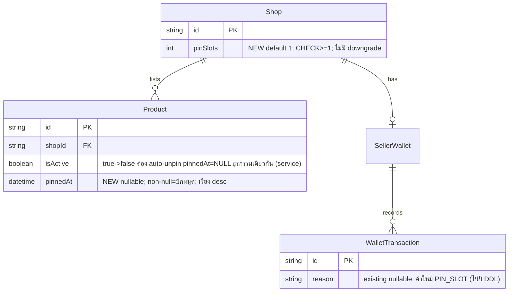

> **โมดูล:** M00013-PinProducts · **เจ้าของ:** safepay-database
> Additive only — เพิ่ม 1 column+1 CHECK บน `Shop`, 1 column+1 index บน `Product`, ไม่มี DDL บน `WalletTransaction`. ไม่ drop/rename อะไร ปลอดภัยกับ shared prod DB (pattern เดียวกับ 00003/00009)

## 1. Changes required

| Model | Field ใหม่ | Type | Null | Default | Constraint |
|---|---|---|---|---|---|
| `Shop` | `pinSlots` | `Int` | NO | `1` | `CHECK(pinSlots >= 1)` NOT VALID→VALIDATE |
| `Product` | `pinnedAt` | `DateTime?` | YES | NULL | ไม่มี CHECK (nullable timestamp) |
| `WalletTransaction` | (ไม่มี DDL) | — | — | — | ค่าใหม่ `reason = "PIN_SLOT"` — documented only (column `String?` มีอยู่แล้ว) |

**เหตุผล `pinSlots >= 1` ไม่ใช่ `>= 0`:** BR-PIN-01 (free slot 1 ตลอดกาล) + BR-PIN-03 (ไม่มี downgrade) ⇒ ค่าต่ำสุดที่ระบบยอมรับได้ตลอดอายุร้าน = 1 เสมอ; CHECK เป็น safety-net กันบั๊ก service layer ที่เผลอ decrement

## 2. Prisma schema diff (แก้ `prisma/schema.prisma`)

### `model Shop` — เพิ่มก่อน relation block
```prisma
  // --- Pin Products (feature 00013, additive) ---
  // pinSlots: จำนวน slot ปักหมุดที่ร้านมีสิทธิ์ใช้พร้อมกัน. ทุกร้านเริ่ม 1 (free slot, BR-PIN-01);
  // ซื้อเพิ่มถาวรทีละ 1 ที่ ฿99 ผ่าน SellerWallet (BR-PIN-02); ไม่มี downgrade ใน MVP (BR-PIN-03).
  // 🛑 invariant "count(Product.pinnedAt ไม่ null ต่อ shop) <= pinSlots" enforce ที่ service layer
  // เท่านั้น (atomic เหมือน wallet.service) — DB ไม่มี cross-row CHECK แบบนี้.
  // CHECK(pinSlots >= 1) enforce ด้วยมือใน migration SQL (NOT VALID+VALIDATE เพราะ Shop มี row จริงบน prod)
  pinSlots Int @default(1)
```

### `model Product` — เพิ่มถัดจาก `lowStockThreshold` + แก้ `@@index`
```prisma
  // pinnedAt: Pin Products (feature 00013) — non-NULL = สินค้าถูกปักหมุด, เรียงแสดงผล pinnedAt desc
  // (BR-PIN-09 no manual reorder); NULL = ไม่ปักหมุด. Auto-unpin (กลับเป็น NULL) ต้องเกิดในธุรกรรม
  // เดียวกับตอน isActive true→false เสมอ (BR-PIN-11 — service layer, product.service deleteProduct/updateProduct).
  // จำนวนปักหมุดต่อ shop <= Shop.pinSlots (enforce service layer เท่านั้น — ไม่มี DB constraint ข้ามแถว)
  pinnedAt          DateTime?
```
```prisma
  @@index([shopId, stockQty])
  @@index([shopId, pinnedAt]) // Pin Products (00013) — query "pinnedAt not null ORDER BY pinnedAt desc" ต่อ shop (FR-PIN-06)
```

### `model WalletTransaction` — แก้ comment (ไม่มี DDL)
```prisma
  // reason: ... | "PIN_SLOT" [feature 00013, NEW — ซื้อ pin slot ฿99 ถาวร, ไม่มี DDL แค่ค่าใหม่]); NULL = row เก่า
  reason       String?
```

## 3. ER note


## 4. Migration

**โฟลเดอร์** (Controller ใส่ timestamp จริง `YYYYMMDDHHMMSS` ตอน apply):
`prisma/migrations/<TIMESTAMP>_add_pin_products_schema/migration.sql`

```sql
-- Migration: add_pin_products_schema | Feature: M00013-PinProducts | 2026-07-04
-- SAFETY: additive only. Shop.pinSlots NOT NULL DEFAULT 1 บน table ที่มี row จริง — Postgres 11+
--   เติม default ให้ทุก row เดิมแบบ metadata-only (ไม่ rewrite table, ไม่ lock ยาว). Product.pinnedAt
--   nullable ไม่มี default — row เดิมได้ NULL (= ไม่ปักหมุด) อัตโนมัติ (zero-regression).

-- 1) Shop.pinSlots — NOT NULL DEFAULT 1 (ครอบร้านเดิมทุกแถวอัตโนมัติ, FR-PIN-01-AC-02)
ALTER TABLE "Shop" ADD COLUMN "pinSlots" INTEGER NOT NULL DEFAULT 1;

-- CHECK NOT VALID (fast, ไม่สแกน) แล้ว VALIDATE แยก (ไม่บล็อก write) — Shop มี row จริงบน prod
ALTER TABLE "Shop" ADD CONSTRAINT "Shop_pinSlots_min1" CHECK ("pinSlots" >= 1) NOT VALID;
ALTER TABLE "Shop" VALIDATE CONSTRAINT "Shop_pinSlots_min1";

-- 2) Product.pinnedAt — nullable, ไม่มี default (NULL = ไม่ปักหมุด)
ALTER TABLE "Product" ADD COLUMN "pinnedAt" TIMESTAMP(3);

-- CreateIndex — query "pinnedAt IS NOT NULL ORDER BY pinnedAt DESC" ต่อ shop (FR-PIN-06)
CREATE INDEX "Product_shopId_pinnedAt_idx" ON "Product"("shopId", "pinnedAt");

-- 3) WalletTransaction.reason — ไม่มี DDL (column TEXT NULL มีอยู่แล้วจาก 00003); ค่า "PIN_SLOT" ใช้ได้ทันที
```

**หมายเหตุ `ADD COLUMN ... DEFAULT 1`:** Postgres ≥11 เติม default ให้ row เดิมแบบ metadata-only (ไม่ rewrite ตาราง) — Supabase = PG16 จึงปลอดภัย ไม่ต้องมี backfill `UPDATE` แยก

### วิธี apply (รอ user ยืนยัน — ห้าม migrate dev)
```bash
# 1. แก้ prisma/schema.prisma ตาม diff §2
# 2. สร้าง prisma/migrations/<timestamp>_add_pin_products_schema/migration.sql
npx prisma validate
npx dotenv -e .env.local -- npx prisma migrate deploy   # apply เฉพาะ pending → Supabase shared DB
npx prisma generate
# restart dev server (Prisma client เก่าไม่รู้จัก field ใหม่ → session/500)
```
🛑 **ห้าม `prisma migrate dev`** (shared dev=prod DB มี orphaned migration นอก git → เสนอ reset = ลบข้อมูลทั้ง DB)

## 5. Indexes
| Table | Columns | Type | Rationale |
|---|---|---|---|
| `Product` | `(shopId, pinnedAt)` | BTREE composite | query โซนปักหมุด: `WHERE shopId=? AND pinnedAt IS NOT NULL ORDER BY pinnedAt DESC` (FR-PIN-06); leading `shopId` equality ตัด scope; dataset เล็ก (slot-limit) ไม่ต้อง partial index ใน MVP |

ไม่แตะ `@@index([shopId, stockQty])` เดิม (คนละ query pattern)

## 6. Constraints + Invariant
| Constraint | Table | Definition | หมายเหตุ |
|---|---|---|---|
| `Shop_pinSlots_min1` | `Shop` | `CHECK (pinSlots >= 1)` | NOT VALID→VALIDATE; กัน service-bug ลด slot ต่ำกว่า free ขั้นต่ำ |

🛑 **Invariant ที่ DB ไม่ enforce (ต้อง service layer):** `count(Product.pinnedAt IS NOT NULL ต่อ shopId) <= Shop.pinSlots` — เป็น cross-row aggregate ข้าม 2 table, Postgres CHECK ไม่รองรับ; enforce ด้วย atomic guard ใน transaction (FR-PIN-03-AC-04, BR-PIN-05). Monitoring query:
```sql
SELECT s.id AS "shopId", s."pinSlots", count(p.id) AS pinned_count
FROM "Shop" s JOIN "Product" p ON p."shopId" = s.id AND p."pinnedAt" IS NOT NULL
GROUP BY s.id, s."pinSlots" HAVING count(p.id) > s."pinSlots";
-- คืนแถวใด ๆ = บั๊ก service layer (ปักหมุดเกิน quota)
```

## 7. Query impact (สำหรับ developer)
- `product.service.ts::getProductsByShop` — **ไม่แก้** (grid สินค้าทั้งหมด)
- เพิ่ม `getPinnedProductsByShop(shopId)`:
  ```ts
  prisma.product.findMany({
    where: { shopId, isActive: true, pinnedAt: { not: null } },
    orderBy: { pinnedAt: 'desc' },
    select: { id: true, name: true, price: true, images: true, pinnedAt: true }
  })
  ```
- `src/views/pages/user-profile/profile/index.tsx::splitPinnedProducts` (interim `slice(0,3)`) — **แทนที่ทั้งหมด** ด้วยผล query ข้างบน (FR-PIN-06-AC-02); ซ่อนโซนถ้าไม่มี (FR-PIN-07)
- `product.service.ts::deleteProduct` (~L356 `update isActive:false`) + `updateProduct` (~L291 เมื่อ `isActive===false`) — **เพิ่ม `pinnedAt: null`** ในอ็อบเจ็กต์ `data` เดียวกัน = auto-unpin atomic (BR-PIN-11)
- ซื้อ slot (`pinSlots+1` + deduct wallet + pin เป้าหมาย) ต้องอยู่ใน `prisma.$transaction` เดียว reuse `wallet.service` (BR-PIN-07)

## 8. Rollback
| Step | Rollback SQL | ผลกระทบ |
|---|---|---|
| `Shop.pinSlots` + CHECK | `DROP CONSTRAINT Shop_pinSlots_min1; DROP COLUMN pinSlots;` | ⚠️ data loss ถ้ามีร้านซื้อ slot แล้ว (billing history) |
| `Product.pinnedAt` + index | `DROP INDEX ...; DROP COLUMN pinnedAt;` | ⚠️ เสียสถานะปักหมุดทุกร้าน |
| `reason='PIN_SLOT'` | ไม่มี DDL rollback | ต่ำสุด |

Rollback ทันทีหลัง apply (ก่อนมี data) = ปลอดภัย; หลัง launch = data loss กระทบ billing → export `reason='PIN_SLOT'` count ก่อน

## 9. Verify query
**ก่อน deploy:** `SELECT count(*) FROM "Shop";` (baseline)
**หลัง deploy (ต้องผ่านทั้งคู่):**
```sql
SELECT count(*) FROM "Shop" WHERE "pinSlots" IS NULL OR "pinSlots" < 1;  -- = 0 (FR-PIN-01-AC-02)
SELECT count(*) FROM "Product" WHERE "pinnedAt" IS NOT NULL;             -- = 0 (ยังไม่มีใครปักหมุด)
```

## 10. Risks
1. CHECK validate บน `Shop` ที่มี row จริง — mitigated NOT VALID+VALIDATE (เหมือน 00003)
2. Cross-row invariant ไม่มี DB enforce — พึ่ง service atomic 100%; QA ต้องมี race-condition test (FR-PIN-03-AC-04)
3. Auto-unpin ไม่ atomic ถ้า dev แก้ `updateProduct`/`deleteProduct` ไม่ครบทั้ง 2 จุด → "inactive แต่ยังปักหมุด"
4. Migration apply auto ผ่าน vercel build (`migrate deploy`) เมื่อ push main → ต้องผ่าน `prisma validate` ก่อน merge
5. Interim cutover: ถ้าลืมลบ `.slice(0,3)` → double zone / fallback ผิด FR-PIN-06-AC-02
