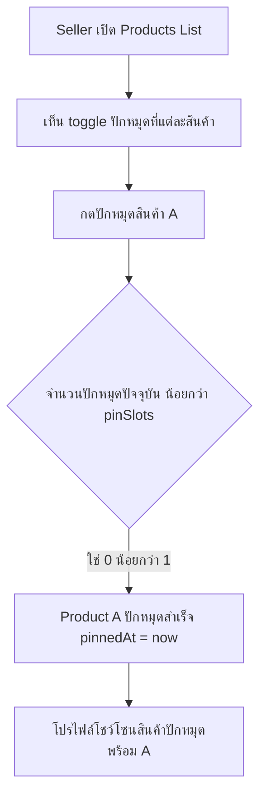
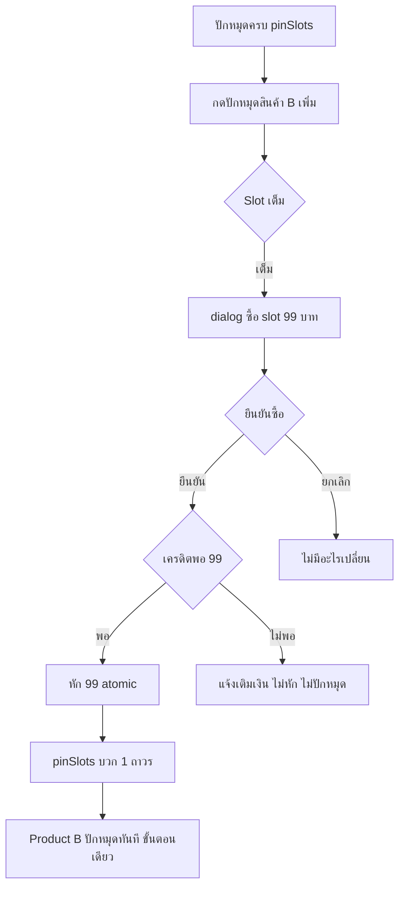
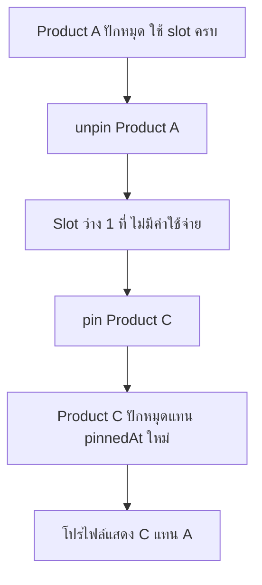
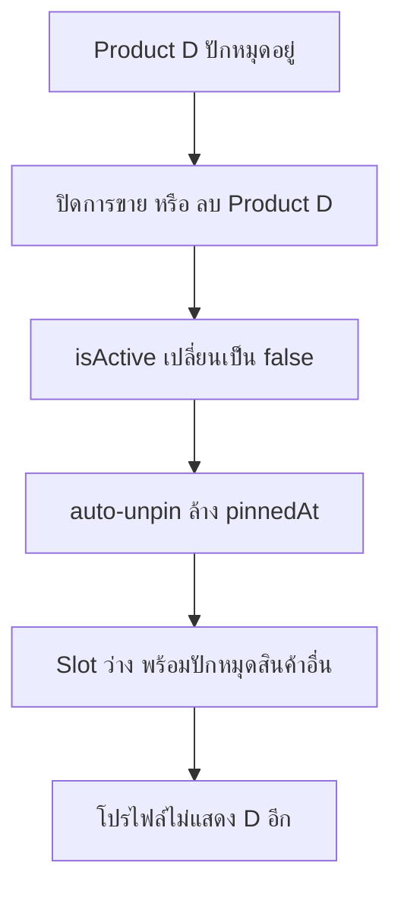
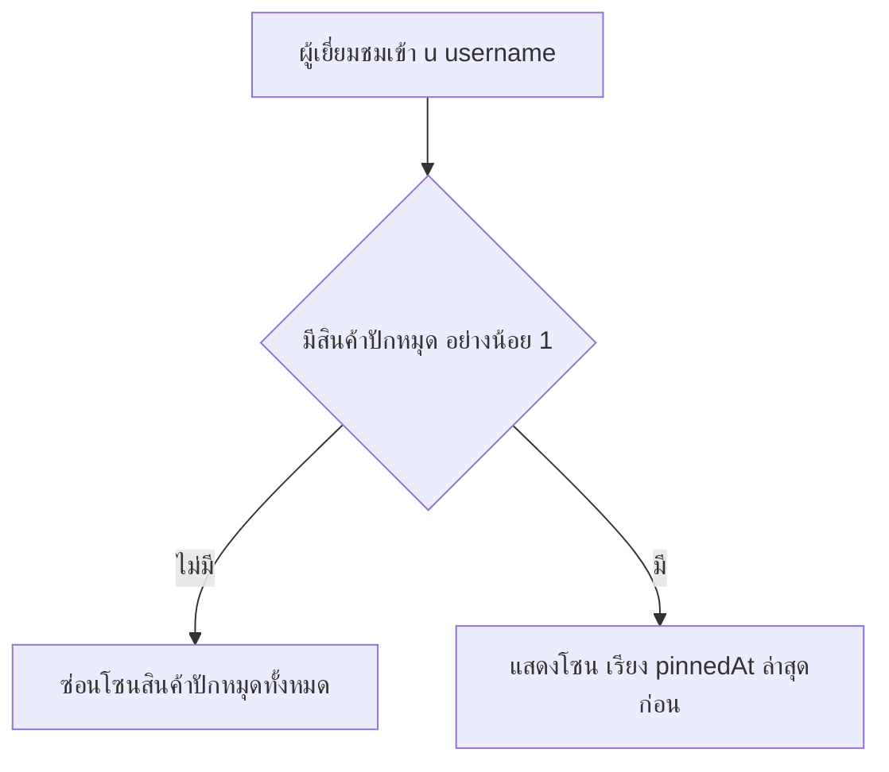

> **โมดูล:** M00013-PinProducts
> **ประเภทเอกสาร:** Product Requirements Document (PRD)
> **เวอร์ชัน:** 1.0
> **วันที่จัดทำ:** 2026-07-04
> **สถานะ:** Draft — เนื้อหาอิง design ที่ user อนุมัติแล้ว 100% (2026-07-04); รอ sign-off formal ก่อนส่งต่อ SRS/SDS/DATABASE/API/Tests
> **เจ้าของเอกสาร:** BA + PO + PM (ดู [[Feature-Docs-Ownership]])

---

# PRD: Pin Products (ปักหมุดสินค้าเด่นบนโปรไฟล์ร้าน)

---

## Executive Summary

Pin Products คือฟีเจอร์ให้ seller "ปักหมุด" สินค้าเด่นของร้านให้โผล่ในโซน **"สินค้าปักหมุด"** บนหน้าโปรไฟล์ร้านสาธารณะ (`/u/[username]` และ `/b/[slug]`) แทนที่ logic ชั่วคราวเดิม (แสดง 3 ชิ้นแรกของร้านเสมอ ตาม `docs/superpowers/specs/2026-07-04-profile-redesign-design.md` D5/Out-of-scope) ด้วยข้อมูลปักหมุดจริงที่ seller เลือกเอง ทุกร้านได้ **1 slot ปักหมุดฟรี** และซื้อ slot เพิ่มได้ถาวรที่ **฿99/slot** หักผ่าน SellerWallet เดิม (โครงสร้างเดียวกับ SMS/Deep Stock/Deep Stock Pro) เป้าหมายทางธุรกิจคือเพิ่ม conversion ให้ร้าน (สินค้าเด่นถูกเห็นก่อนเสมอ) พร้อม monetize ผ่านการซื้อ slot เพิ่มแบบ one-time ไม่ผูก subscription ทำให้ seller ตัดสินใจซื้อง่าย (ไม่ต้องกังวลเรื่องต่ออายุ/ยกเลิก)

---

## 1. Business Goals & KPIs

### 1.1 เป้าหมายทางธุรกิจ

| เป้าหมาย | รายละเอียด |
|----------|-----------|
| **เพิ่ม Conversion ผ่านการดันสินค้าเด่น** | สินค้าที่ seller อยากขายที่สุด (มาร์จิ้นดี/สต็อกเยอะ/โปรโมชัน) โผล่หน้าแรกของโปรไฟล์เสมอ แทนที่จะจมอยู่ในลิสต์รวม |
| **Monetize ผ่าน Slot System แบบ One-time** | สร้างรายได้เพิ่มโดยไม่ต้องเพิ่ม subscription ใหม่ — ใช้ psychology "ซื้อที่ทางถาวร" แทน "จ่ายรายเดือน" ลดแรงต้านการตัดสินใจซื้อ |
| **ปิดหนี้ Interim ของ Profile Redesign (2026-07-04)** | แทนที่ placeholder "3 ชิ้นแรกเสมอ" ด้วยข้อมูลจริงที่ seller ควบคุมได้ — ตรงกับหลักการ "ห้ามเลขปลอม/ข้อมูลปลอม" ของแพลตฟอร์ม |
| **รักษาความง่ายของการจัดการ (Zero Manual Reorder Overhead)** | seller ไม่ต้องมาคอยจัดลำดับสินค้าปักหมุดเอง — ระบบเรียงให้อัตโนมัติตามเวลาที่ปักหมุดล่าสุด |

### 1.2 ตัวชี้วัดความสำเร็จ (KPIs)

| KPI | คำอธิบาย | เป้าหมาย |
|-----|----------|---------|
| **Pin Adoption Rate** | % ของร้านที่ active (มีสินค้า ≥1) ที่ปักหมุดสินค้าอย่างน้อย 1 ชิ้น (ใช้ free slot) | วัด baseline เดือนแรกหลัง launch |
| **Paid Slot Purchase Rate** | % ของร้านที่ใช้ free slot เต็มแล้ว ที่ตัดสินใจซื้อ slot เพิ่ม ≥1 ครั้ง | ≥ 10% |
| **Slot Revenue** | ผลรวม ฿99 × จำนวนธุรกรรม `reason=PIN_SLOT` ทั้งหมด | Baseline เดือนแรกหลัง launch |
| **Re-pin Engagement** | ค่าเฉลี่ยจำนวนครั้งที่ร้านสลับสินค้าใน slot เดิม (unpin→pin ฟรี) ต่อเดือน | วัด trend |
| **Zero Regression บนหน้าโปรไฟล์เดิม** | หน้า `/u/[username]`/`/b/[slug]` ไม่มี error/behavior เพี้ยนหลังเปลี่ยนจาก interim (3 ชิ้นแรก) เป็นข้อมูลปักหมุดจริง | Regression QA ผ่าน 100% |

---

## 2. User Personas (กลุ่มผู้ใช้งาน)

### 2.1 Seller ที่อยากดันยอดขายสินค้าเด่น (primary target)
มีสินค้าหลายชิ้น อยากให้สินค้าที่ทำกำไรดี/สต็อกเยอะ/มีโปรโมชันโผล่หน้าโปรไฟล์ก่อนเสมอ; ต้องการปักหมุดได้ทันทีจากหน้า products list, เปลี่ยนสินค้าปักหมุดได้บ่อยตามแคมเปญ/ฤดูกาลโดยไม่มีต้นทุนเพิ่ม, ซื้อ slot เพิ่มได้ทันทีถ้าอยากปักหมุดพร้อมกันหลายชิ้น. จุดปวด: สินค้าเด่นจมอยู่ในลิสต์ยาว ลูกค้าเห็นสินค้าที่ไม่อยากดันก่อน

### 2.2 Seller ทั่วไปที่ยังไม่เคยปักหมุด (baseline / zero-regression target)
เพิ่งเปิดร้าน/ไม่เคยสนใจฟีเจอร์นี้; ต้องการใช้งานร้านตามปกติ ไม่ถูกบังคับต้องปักหมุด; เห็นว่ามี 1 slot ฟรีเมื่อพร้อม; ถ้าไม่ปักหมุดอะไรเลย โปรไฟล์ต้องไม่โชว์โซนเปล่า. จุดปวด: กลัวฟีเจอร์ใหม่ทำโปรไฟล์ดูรก/มีช่องว่างแปลก ๆ

### 2.3 ผู้เยี่ยมชมโปรไฟล์ร้าน (buyer / public)
เข้าดูโปรไฟล์ร้านก่อนตัดสินใจ; ต้องการเห็นสินค้าที่ร้านแนะนำจริง ไม่ใช่สุ่มจาก 3 ชิ้นแรก; ถ้าร้านไม่มีสินค้าปักหมุด ต้องไม่เห็นโซนเปล่า. จุดปวด: เห็นโซน "แนะนำ" ที่จริงเป็นสินค้าสุ่ม ทำให้ไม่น่าเชื่อถือ (ขัด mission ของ Deep)

### 2.4 Admin (Wallet / Support)
ดูแล WalletTransaction/TopUpRequest อยู่แล้ว (สืบทอด 00003/00009); ต้องแยกแยะได้ว่ารายการหักเครดิตไหนเป็นการซื้อ pin slot เมื่อ seller สอบถาม billing. จุดปวด: ถ้า label ไม่แยก จะวินิจฉัย billing ช้า

---

## 3. Business Requirements

### 3.1 Free & Purchasable Pin Slots (Monetization)
- ทุกร้านได้รับ **1 slot ปักหมุดฟรี** อัตโนมัติ; ซื้อเพิ่มได้ทีละ 1 ในราคา **฿99/slot ถาวร** หักจาก SellerWallet.balance
- Slot ที่ซื้อ **ถาวร ไม่มีวันหมดอายุ ไม่ใช่ subscription**; **ไม่มี refund และไม่มี downgrade**; เครดิตไม่พอ → ปฏิเสธ + ชวนเติมเงิน (ไม่หักบางส่วน)
- เหตุผล: โมเดล one-time ถาวรลดแรงต้านการตัดสินใจซื้อเทียบ subscription เหมาะกับ purchase ขนาดเล็ก (฿99)

### 3.2 Pin / Unpin จากหน้า Products List หลังบ้าน
- ปักหมุด/ยกเลิกจาก **toggle ในหน้า products list** (seller/Paces) โดยตรง ไม่ต้องมีหน้าจัดการแยก
- ทำงานเฉพาะเจ้าของร้าน/สินค้าจริง (scope ownership ที่ service layer); จำนวนปักหมุดพร้อมกัน **≤ pinSlots** เสมอ (atomic กัน race)

### 3.3 Slot-Full Handling & Buy-Slot Flow
- กดปักหมุดขณะ slot เต็ม → เสนอซื้อ slot เพิ่มแบบ inline ทันที (ไม่ใช่แค่ error)
- แสดง dialog "ซื้อ slot เพิ่ม ฿99?" — ยืนยันแล้วหักเงิน + เพิ่ม slot ถาวร + ปักหมุดสินค้าเป้าหมายในขั้นตอนเดียว; เครดิตไม่พอ → ชวนเติมเงิน (ไม่ปักหมุด ไม่หักบางส่วน)

### 3.4 การแสดงผลโซน "สินค้าปักหมุด" บนโปรไฟล์สาธารณะ
- แสดงเฉพาะสินค้าที่ปักหมุดจริง เรียงตาม `pinnedAt` ล่าสุดก่อน; ร้านไม่ปักหมุดอะไรเลย = **ไม่เห็นโซนนี้** (ซ่อนทั้งโซน ไม่ใช่การ์ดว่าง)
- **ไม่มี manual reorder**; แทนที่ logic interim ("3 ชิ้นแรก") ทั้งหมด — ไม่ fallback กลับไปโชว์สินค้าทั่วไปเมื่อไม่มีสินค้าปักหมุด
- เหตุผล: ตอบหลักการ "ห้ามข้อมูลไม่จริง" (ตรงกับ Honesty Decisions D6 ของ profile redesign)

### 3.5 Auto-Unpin เมื่อสินค้าถูกปิดการขาย/ลบ
- สินค้าปักหมุดที่ถูก deactivate หรือ ลบ (soft-delete ผ่าน `isActive=false`, อ้างอิง `product.service.ts::deleteProduct`) ต้อง **auto-unpin ทันที** และคืน slot
- เกิดทุกครั้งที่ `isActive` true→false; ไม่ลด `pinSlots` (แค่ลดจำนวนปักหมุดปัจจุบัน เปิดที่ว่าง)

### 3.6 การแสดงผลฝั่ง Admin (Wallet Transaction)
- Admin เห็นรายการหักเครดิตซื้อ pin slot แยก label ชัดในหน้า WalletTransaction เดิม (สืบทอด pattern 00003/00009)

---

## 4. Business Rules & Constraints

### 4.1 กฎทางธุรกิจหลัก

| กฎ | คำอธิบาย |
|----|----------|
| **1 Slot ฟรีต่อร้าน** | ทุกร้านได้ 1 slot ปักหมุดฟรีโดย default |
| **ราคาคงที่ ฿99/slot ถาวร** | ไม่มี proration, ไม่ใช่ subscription, ไม่มีวันหมดอายุ |
| **ไม่มี Refund/Downgrade** | จำนวน slot ไม่ลดลงเองใน MVP ไม่ว่ากรณีใด |
| **สลับสินค้าใน Slot ฟรีไม่จำกัด** | Unpin→Pin ตัวใหม่ ไม่มีค่าใช้จ่ายเพิ่ม ตราบใดที่จำนวนปักหมุดรวม ≤ pinSlots |
| **ไม่มี Manual Reorder** | ลำดับแสดงผลคำนวณจาก `pinnedAt` desc เสมอ ไม่มี UI จัดลำดับเอง |
| **ซ่อนโซนเมื่อว่าง** | ร้านไม่ปักหมุดอะไรเลย = ไม่แสดงโซน "สินค้าปักหมุด" บนโปรไฟล์ |
| **Auto-Unpin เมื่อสินค้าไม่ active** | Deactivate/ลบสินค้าที่ปักหมุดอยู่ = ถูกถอดออกจากปักหมุดทันที คืนที่ว่างอัตโนมัติ |
| **จำกัดเฉพาะหลังบ้าน Seller** | Pin/unpin ทำได้จากหน้า seller products list (Paces) เท่านั้น ไม่มีใน buyer app API |

### 4.2 เงื่อนไข Slot & Pinned State

| สถานะ | เงื่อนไข | ผลลัพธ์ |
|-------|---------|--------|
| **จำนวนปักหมุด < pinSlots** | มี slot ว่าง | ปักหมุดสินค้าใหม่ได้ทันที ไม่มีค่าใช้จ่าย |
| **จำนวนปักหมุด = pinSlots (เต็ม)** | ไม่มี slot ว่าง | กดปักหมุดเพิ่ม → เสนอซื้อ slot ฿99 (inline) |
| **เครดิตไม่พอ ฿99** | ตอนพยายามซื้อ slot | ปฏิเสธ + ชวนเติมเงิน ไม่ปักหมุด ไม่หักเงิน |
| **สินค้าปักหมุดถูก deactivate/ลบ** | `isActive` true→false | Auto-unpin ทันที คืนที่ว่างให้ slot |
| **ร้านไม่มีสินค้าปักหมุดเลย** | จำนวนปักหมุด = 0 | ซ่อนโซน "สินค้าปักหมุด" บนโปรไฟล์ทั้งหมด |

---

## 5. Out of Scope (นอกขอบเขต)

| หัวข้อ | คำอธิบาย |
|--------|----------|
| **Manual Reorder** | เรียงตาม `pinnedAt` desc เสมอ (Phase 2 candidate) |
| **Refund / Downgrade Slot** | ไม่มีทางลด/คืนเงิน slot ที่ซื้อแล้วใน MVP (Phase 2) |
| **ปักหมุดข้ามร้าน (Cross-shop Pin)** | ปักหมุดได้เฉพาะสินค้าของร้านตัวเอง |
| **Pin ใน Buyer App (`/api/app/*`)** | จำกัดที่หลังบ้าน seller (Paces) เท่านั้นใน MVP |
| **Analytics ของสินค้าปักหมุด** | ไม่วัด view/click/conversion เฉพาะของสินค้าปักหมุดใน MVP (Phase 2) |
| **Bulk Pin/Unpin** | Toggle ทีละสินค้าเท่านั้น |
| **Free Trial / โปรโมชันซื้อ Slot** | ไม่มีส่วนลด/แถม slot ใน MVP |

---

## 6. Risks & Mitigation

### 6.1 ความเสี่ยงทางธุรกิจ

| ความเสี่ยง | ผลกระทบ | ระดับ | แนวทางแก้ไข |
|-----------|---------|-------|-------------|
| Seller เข้าใจผิดว่าซื้อ slot แล้ว refund ได้ | Complaint/dispute | กลาง | confirm dialog ระบุชัด "ถาวร ไม่มีการคืนเงิน" ก่อนยืนยัน |
| Seller ปักหมุดสินค้าที่ไม่ active แล้วสับสน (auto-unpin) | เข้าใจว่าเป็นบั๊ก | ต่ำ-กลาง | แจ้ง toast ทันทีที่ auto-unpin ตอน deactivate/ลบ |
| Slot Purchase Rate ต่ำกว่าคาด | Slot Revenue ต่ำกว่าเป้า | กลาง | ไม่ใช่ blocking risk — ยอมรับใน MVP วัด trend ก่อน Phase 2 |

### 6.2 ความเสี่ยงทางเทคนิค

| ความเสี่ยง | ผลกระทบ | แนวทางแก้ไข |
|-----------|---------|-------------|
| Race condition ปักหมุดพร้อมกัน 2 request จนเกิน pinSlots | ปักหมุดเกิน quota | ตรวจนับปักหมุดปัจจุบันภายใน transaction เดียวกับ toggle (atomic เหมือน `wallet.service`) |
| Wallet deduction ใช้ infra เดียวกับ SMS/Deep Stock | บั๊กจุดร่วมกระทบหลายฟีเจอร์ | Reuse `wallet.service` ที่เทสแล้ว ไม่เขียน deduct ใหม่ |
| Migration เพิ่ม `Shop.pinSlots` ต้อง backfill=1 | ร้านเดิมอาจไม่มี slot ฟรี | `@default(1)` ระดับ column + verify DB ก่อน/หลัง deploy ว่าทุกแถว ≥1 |
| หน้าโปรไฟล์เปลี่ยนจาก interim เป็นข้อมูลจริง | Regression หน้า `/u/`, `/b/` ที่เพิ่ง redesign | Regression QA ครอบ acceptance ของ profile redesign spec (D5) ควบคู่ |

---

## 7. Glossary

| คำศัพท์ | ความหมาย |
|---------|----------|
| **Pin Slot** | สิทธิ์ปักหมุดสินค้า 1 ชิ้น เก็บที่ `Shop.pinSlots` |
| **Pinned Product** | สินค้าที่ `Product.pinnedAt` ไม่เป็น null |
| **Pinned Zone / สินค้าปักหมุด** | โซนบนโปรไฟล์สาธารณะที่แสดงเฉพาะ Pinned Product |
| **Auto-Unpin** | ถอดสินค้าออกจากปักหมุดอัตโนมัติเมื่อ deactivate/ลบ |
| **Re-pin / Swap** | Unpin สินค้าเดิมแล้ว pin สินค้าอื่นแทนโดยไม่มีค่าใช้จ่าย |
| **`PIN_SLOT`** | ค่า machine-key ของ `WalletTransaction.reason` สำหรับซื้อ slot |

---

## 8. Success Metrics

| ตัวชี้วัด | ค่าที่คาดหวัง | วิธีวัด |
|----------|---------------|--------|
| **Free Slot Backfill Correctness** | ร้านเดิมทุกร้านมี `pinSlots ≥ 1` หลัง deploy | DB query ก่อน/หลัง migration |
| **Zero Regression บนโปรไฟล์เดิม** | ไม่มี behavior เพี้ยนนอกจากเปลี่ยนแหล่งข้อมูลโซนปักหมุด | Regression suite เทียบ acceptance ของ profile redesign spec |
| **Slot Limit Correctness** | จำนวนปักหมุดไม่เกิน `pinSlots` แม้ concurrent | Unit/integration test race condition |
| **Auto-Unpin Correctness** | สินค้า deactivate/ลบขณะปักหมุด ถูกถอดใน transaction เดียว 100% | Test ทุก entry point ที่ set `isActive=false` |
| **Wallet Deduction Correctness** | หัก ฿99/slot ถูกต้อง ไม่ double/partial-deduct | Unit test reuse `wallet.service` |

---

## 9. Dependencies & Assumptions

### 9.1 Dependencies

| ระบบ/ส่วนประกอบ | ความสัมพันธ์ |
|-----------------|-------------|
| **`SellerWallet` + `wallet.service`** | หัก ฿99/slot ผ่าน atomic deduct เดิม |
| **`WalletTransaction`** | บันทึกซื้อ slot ด้วย `reason=PIN_SLOT` |
| **`Product` model** | เพิ่ม field `pinnedAt` |
| **`Shop` model** | เพิ่ม field `pinSlots` |
| **Seller Products List (Paces)** | จุดเดียวที่มี toggle pin/unpin |
| **หน้าโปรไฟล์สาธารณะ `/u/`, `/b/`** | จุดแสดงผลโซน "สินค้าปักหมุด" — แทน interim logic |
| **Paces Sweet Alerts** | dialog ยืนยัน "ซื้อ slot เพิ่ม ฿99?" |
| **`docs/PRD.md`** | ต้อง sync เพิ่มฟีเจอร์นี้เข้า feature overview หลัง sign-off |

### 9.2 Assumptions
- **Flow ซื้อ slot ตอน slot เต็มเป็นขั้นตอนเดียว (atomic):** ยืนยัน dialog → หักเงิน+เพิ่ม `pinSlots`+ปักหมุดสินค้าเป้าหมายทันที (ตรงกับ design ที่ user เลือก "inline ตอน pin เต็ม")
- MVP รองรับ toggle ทีละสินค้า ไม่มี bulk
- **Free slot ที่ระดับ Shop** — ร้านที่มีหลาย Shop (00008) แต่ละ Shop มี `pinSlots` แยกกัน
- Auto-unpin ไม่สร้าง `WalletTransaction` (ไม่ใช่ billing event)

---

## 10. Appendix — User Journeys

### 10.1 ปักหมุดสินค้าแรกด้วย Free Slot

### 10.2 Slot เต็มแล้วซื้อเพิ่ม

### 10.3 สลับสินค้าใน Slot ฟรี

### 10.4 Auto-Unpin เมื่อปิด/ลบสินค้า

### 10.5 ร้านไม่ปักหมุดอะไรเลย

---

**หมายเหตุ:** Functional Requirements / User Story / Acceptance Criteria ดู [[BRD]]. Technical specification ดู [[SRS]] (ยังไม่เริ่ม — รอ sign-off PRD/BRD).
