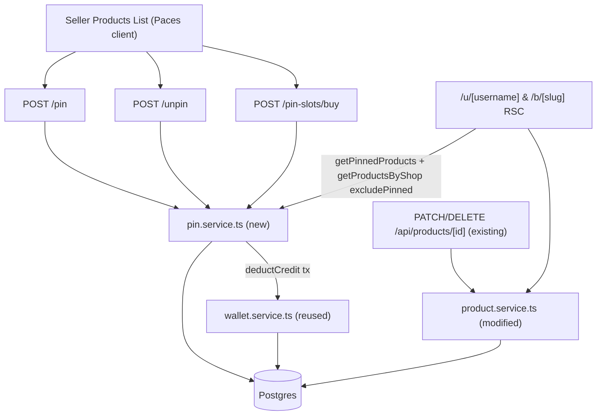
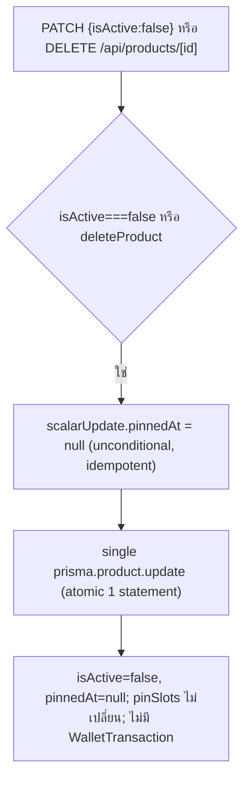
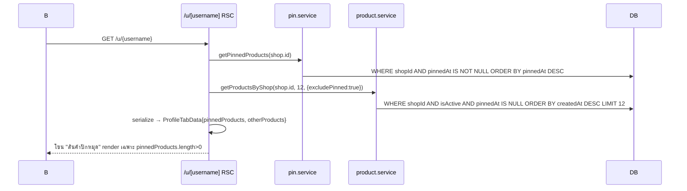

> **โมดูล:** M00013-PinProducts · **ประเภท:** SDS · **สถานะ:** Draft

# SDS: Pin Products

## 1. ขอบเขต
ออกแบบ implement: `pin.service.ts` ใหม่, `product.service.ts` 2 จุดแก้ (auto-unpin + `getProductsByShop` param), 3 route ใหม่, Valibot 1 schema, registry เดิมเพิ่ม key, Seller Products List UI, Public Profile (2 page.tsx + 2 view). นอกขอบเขต: DB schema (safepay-database), exact CSS (safepay-ux ออก Design Spec แยกตอน implement — Hard Rule 8; SDS ระบุ component ที่แตะ + data flow).

## 2. Architecture
Service-layer เดิม (Route Handler → service → Prisma), synchronous, 1 request/1 tx. ไม่มี framework/queue/cron ใหม่.


## 3. Component Design
| Component | หน้าที่ | Dependency |
|-----------|---------|------------|
| `pin.service.ts` | pin/unpin/buy + atomic slot-cap + pin queries | Prisma, `wallet.service::deductCredit`, `WALLET_REASON`, `PIN_SLOT_PRICE` |
| `product.service.ts` (แก้) | auto-unpin hook, `getProductsByShop` เพิ่ม `opts.excludePinned` | Prisma |
| `POST /pin` `/unpin` `/pin-slots/buy` | auth+ownership → service → error-map → JSON | next-auth, `requireActiveShop`, pin.service, (buy: `BuyPinSlotSchema`) |
| Seller Products List (`ProductsListing.tsx`, `data.ts`, page.tsx) | toggle + "ปักหมุด N/M" + Sweet Alert + pacesToast | sweetalert2, paces-toast |
| `/u/`, `/b/` page.tsx | fetch getPinnedProducts + getProductsByShop(excludePinned) | pin.service, product.service |
| `profile/index.tsx` | ลบ splitPinnedProducts; ProfileTabData มี pinnedProducts+otherProducts; ซ่อนโซนเมื่อ pinned=0 | — |
| `views/pages/user-profile/index.tsx` | tab visibility ใช้ pinnedProducts/otherProducts length | — |

### pin.service contract
- `pinProduct(shopId, productId)` → `{product, pinState}` | throws `PinProductNotFoundError`(404), `PinProductInactiveError`(400), `NoPinSlotError`(409)
- `unpinProduct(shopId, productId)` → `{product, pinState}` | throws `PinProductNotFoundError`
- `buyPinSlotAndPin(shopId, productId)` → `{product, pinState}` | throws above + `INSUFFICIENT_CREDIT`(402, จาก deductCredit)
- `getPinnedProducts(shopId)` → `Product[]` (pinnedAt not null, isActive, desc)
- `getPinState(shopId)` → `{pinSlots, pinnedCount}`

## 4. Data Flow

### 4.1 Pin (มี slot ว่าง)
```mermaid
sequenceDiagram
    participant UI; participant R as POST /pin; participant S as pin.service; participant DB
    UI->>R: POST /api/seller/products/{id}/pin
    R->>R: getServerSession → requireActiveShop
    R->>S: pinProduct(shop.id, id)
    S->>DB: $transaction; SELECT Shop FOR UPDATE; findFirst Product {id,shopId}
    alt ไม่พบ/ไม่ใช่ของร้าน
        S-->>R: PinProductNotFoundError 404
    else isActive=false
        S-->>R: PinProductInactiveError 400
    else pinnedAt set แล้ว
        S-->>R: {product,pinState} idempotent
    else ปักหมุดใหม่
        S->>DB: count pinnedAt not null
        alt count >= pinSlots
            S-->>R: NoPinSlotError 409
        else count < pinSlots
            S->>DB: UPDATE pinnedAt=now; COMMIT
            S-->>R: {product,pinState}
        end
    end
```

### 4.2 Slot เต็ม → ซื้อ+ปักหมุด (atomic, ล้ม=rollback ทั้งหมด)
```mermaid
sequenceDiagram
    participant UI; participant Swal; participant R as POST /pin-slots/buy; participant S as pin.service; participant W as wallet.service; participant DB
    UI->>Swal: pinnedCount==pinSlots → dialog ยืนยัน
    Swal->>R: preConfirm → POST {productId}
    R->>R: auth + requireActiveShop + Valibot
    R->>S: buyPinSlotAndPin(shop.id, productId)
    S->>DB: $transaction; SELECT Shop FOR UPDATE; findFirst Product (ownership+isActive)
    alt pinnedAt set แล้ว (idempotent)
        S-->>R: {product,pinState} ไม่หักซ้ำ
    else ซื้อจริง
        S->>W: deductCredit(shopId,99,productId,desc,'PIN_SLOT',tx)
        alt เครดิตไม่พอ
            W-->>S: throw INSUFFICIENT_CREDIT
            S->>DB: ROLLBACK
            R-->>Swal: 402 showValidationMessage
        else พอ
            S->>DB: UPDATE Shop pinSlots+1; UPDATE Product pinnedAt=now; COMMIT
            R-->>Swal: 200
            Swal-->>UI: pacesToast.success + router.refresh
        end
    end
```

### 4.3 Auto-Unpin


### 4.4 Render โปรไฟล์


## 5. Integration Points
| จุด | ประเภท | Contract | เมื่อล่ม |
|-----|--------|----------|---------|
| `deductCredit` | internal reuse | function ใน `$transaction` เดียว (tx param) | throw อื่นที่ไม่ใช่ INSUFFICIENT → 500 generic |
| `requireActiveShop` | internal reuse | คืน `ActiveShop\|null` | null → 404 |
| Seller UI ↔ 3 route | internal REST/JSON same-origin | CSRF Origin ผ่าน guardApi เดิม (ไม่แก้ proxy) | error → pacesToast/Sweet Alert |

idempotency: `pinProduct`/`buyPinSlotAndPin` เช็ค `pinnedAt` ก่อน → retry ปลอดภัย (ไม่ double-charge/pin).

## 6. Technical Decisions
- **TD-001 Row-lock แทน conditional-updateMany:** `pinProduct`/`buyPinSlotAndPin` เปิด `$transaction` และบรรทัดแรกยิง `tx.$queryRaw` SELECT id FROM "Shop" WHERE id=${shopId} FOR UPDATE ก่อนนับ pinnedCount. เหตุผล: cap เป็น cross-row aggregate (COUNT ข้ามหลาย Product row) ต่างจาก single-row `balance` ของ wallet → conditional-updateMany เกิด write-skew ภายใต้ READ COMMITTED. row-lock ที่ Shop (1 แถว/ร้าน) serialize ทุก mutation ของร้าน. ตัดทิ้ง Serializable (ต้อง retry เอง, ไม่คุ้ม contention ต่ำ) + denormalized pinnedCount (drift surface). ผล: DEV ใช้ interactive `$transaction`, QA test 2 concurrent Promise.all.
- **TD-002 getProductsByShop เพิ่ม optional param:** `opts?:{excludePinned?:boolean}` param ที่ 3 (เดิม shopId, take?) — 6 call-site เดิม backward-compat 100%. ต้องเป็น `opts?` optional (ไม่งั้น break 6 call-site).
- **TD-003 pin.service เป็นเจ้าของ read query:** `getPinnedProducts`/`getPinState` อยู่ pin.service (pin domain) ไม่ใช่ product.service (กัน product.service โตเกิน + ผสม concern).
- **TD-004 reuse registry เดิม:** เพิ่ม `WALLET_REASON.PIN_SLOT`+label ใน `inventory-addon.ts` (de-facto SSOT, SMS_ORDER_LINK ก็อยู่; admin topups lookup ตรง → ไม่แก้ UI). ตัดทิ้งสร้าง `lib/wallet-reasons.ts` (over-engineer).
- **TD-005 ownership ผ่าน requireActiveShop + DAL scope:** route ใหม่ใช้ `requireActiveShop` (รองรับ PERSONAL+BUSINESS member) + service verify `findFirst({where:{id,shopId}})` แทน `product.shop.userId===session.user.id` แบบเดิมของ `/api/products/[id]` (debt ไม่รองรับ BUSINESS member). ไม่กระทบ route เดิม.

## 7. Traceability
TFR-01→migration · 02→TD-004+Flow4.2 · 03→TD-001+Flow4.1 · 04→TD-001+Flow4.2 · 05→pin.service · 06→TD-002/003+Flow4.4 · 07→views/user-profile · 08→Flow4.3 · 09→TD-004 · NFR-atomic→TD-001 · NFR-security→TD-005

## 8. ลำดับ build ที่แนะนำ
1. **safepay-database**: schema diff + migration SQL + apply (user ยืนยัน)
2. `pin.service.ts` + `lib/pin-products.ts` + `inventory-addon.ts` (เพิ่ม key)
3. `product.service.ts` auto-unpin hook (2 ฟังก์ชัน)
4. 3 route + `BuyPinSlotSchema`
5. Seller UI (toggle+indicator+Sweet Alert) — ผ่าน **safepay-ux** ก่อน (Hard Rule 8)
6. Public Profile (2 page.tsx + 2 view) — **atomic commit เดียว** (breaking type change ข้าม 4 ไฟล์)

**Open Questions:** ไม่มี
