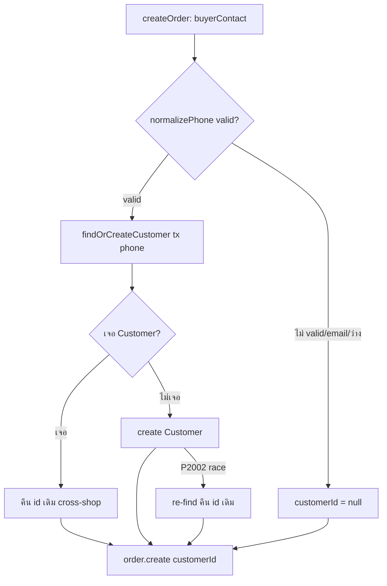

# 00014 — Customer Directory · SDS
รายละเอียด design + task breakdown: `docs/superpowers/plans/2026-07-04-customer-directory.md` (8 tasks)

## Flow (Mermaid)

- customer resolution อยู่ใน `$transaction` เดียวกับ order.create (atomic; rollback พร้อมกัน)
