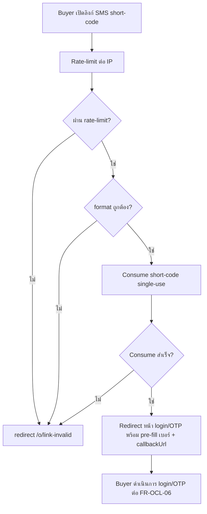
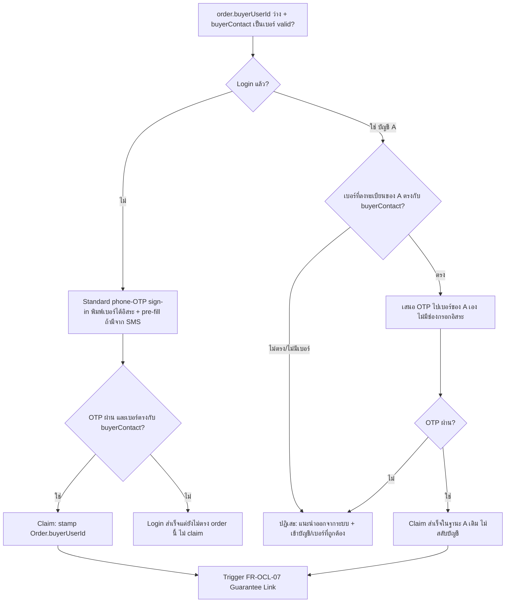
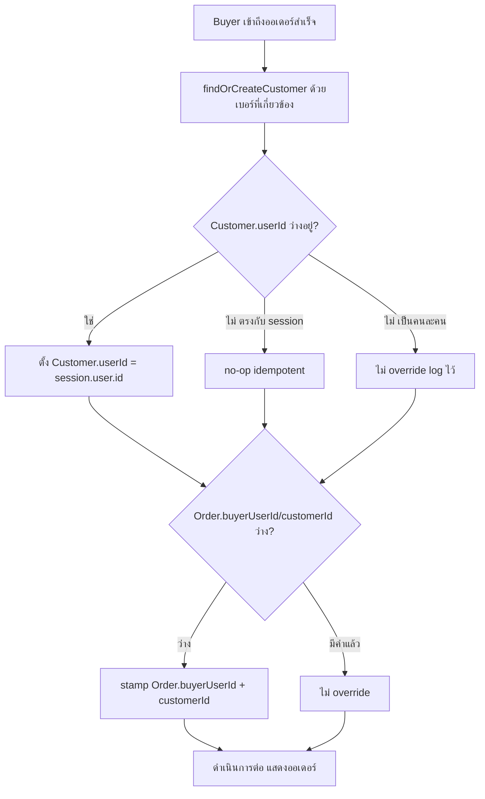
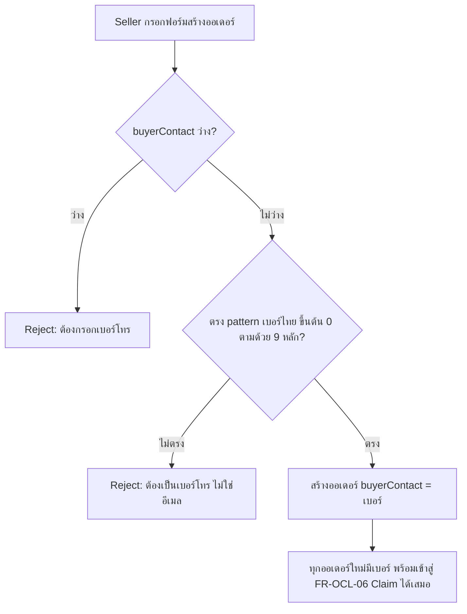
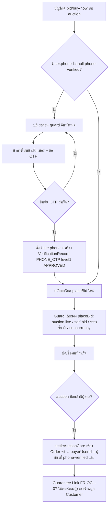
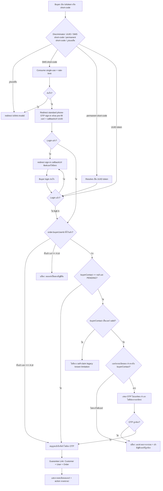
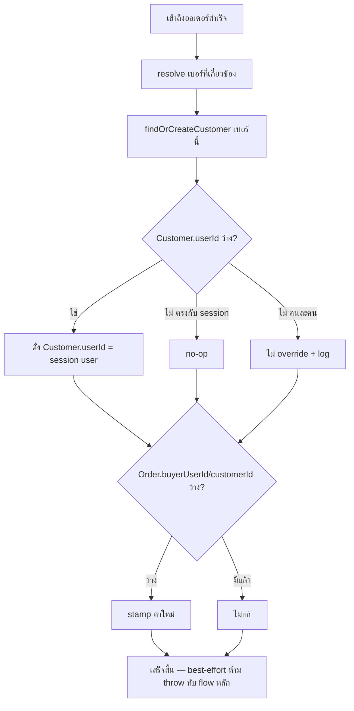

> **โมดูล:** M00015-OrderClaimForcedLogin
> **ประเภทเอกสาร:** Business Requirements Document (BRD) — NON-TECHNICAL
> **เวอร์ชัน:** 1.0
> **วันที่จัดทำ:** 2026-07-07
> **สถานะ:** Draft
> **เจ้าของเอกสาร:** BA (ดู [[Feature-Docs-Ownership]])

# BRD: Order Claim & Forced Login (Business Requirements Document)

---

## 1. บทนำ

### 1.1 วัตถุประสงค์ของเอกสาร

เอกสารนี้มีวัตถุประสงค์เพื่อ:
1. กำหนด Functional Requirements ระดับ non-technical สำหรับการเปลี่ยนกติกาการเข้าถึงหน้า order สาธารณะ `/o/{token}` จาก "guest-open" เป็น "บังคับ login ทุกกรณี" พร้อมกลไก gate ตรงตัวตนด้วย `buyerUserId`, Phone-OTP claim fallback ที่ผูกกับเบอร์ของบัญชีตัวเองเท่านั้น (ห้าม identity switch), การบังคับกรอกเบอร์โทรตอนสร้างออเดอร์ (phone-required, ฝั่ง seller manual-create) และการบังคับบัญชี phone-verified ก่อนวางบิดได้ (ฝั่ง auction/bid)
2. กำหนดขอบเขตการทำงาน ลำดับขั้นตอน และกฎที่ระบบบังคับ รวมถึง Resolved Decisions ที่ต้องนำไปใช้ (จาก PRD §10.4)
3. ระบุเงื่อนไขการรับงาน (Acceptance Criteria) แบบ Given/When/Then ที่ทีม QA สามารถนำไปสร้าง Test Case ได้โดยตรง
4. สร้างความเข้าใจร่วมกันระหว่างทีมธุรกิจและทีมพัฒนา ก่อนเริ่ม implement feature

### 1.2 ขอบเขตของระบบ

**ระบบ Order Claim & Forced Login** คือกลไกควบคุมการเข้าถึงหน้า order สาธารณะ (`/o/{token}`, SMS short-code 12 ตัวอักษร, permanent short-code 8 ตัวอักษร) ให้บังคับ login/พิสูจน์ตัวตนก่อนเห็นข้อมูลหรือกระทำการใด ๆ กับออเดอร์ พร้อมกลไก derive แบบ runtime ว่าออเดอร์มีเจ้าของผูกแล้วหรือยัง (`Order.buyerUserId`): ถ้าผูกแล้ว gate ตรงตัวตน (ไม่ต้อง OTP), ถ้ายังว่าง buyer ต้อง Phone-OTP claim ด้วย**เบอร์ของบัญชีตัวเองเท่านั้น** (ห้ามสลับบัญชี) และการันตีว่าทุกการเข้าถึงสำเร็จจะผูก `User` + `Customer` กลาง เข้ากับออเดอร์เสมอ นอกจากนี้ การสร้างออเดอร์ของ seller (manual order-create) ต้องบังคับกรอกเบอร์โทรลูกค้าเสมอ เพื่อให้ออเดอร์ใหม่ทุกใบมี path เข้าสู่ claim ได้แน่นอน — และ**ฝั่งประมูล (auction/bid) ก็ถูกแตะด้วยเช่นกัน**: บัญชีต้อง phone-verified (ผ่าน OTP) ก่อนวางบิด/buy-now ได้ เพื่อรับประกันว่าออเดอร์ auction-win ทุกใบมีทั้ง `buyerUserId` และเบอร์ที่ยืนยันแล้วผูกอยู่เสมอ (ปิดวงจรตัวตนให้ครบทั้ง 2 เส้นทางที่ออเดอร์เกิดขึ้นได้)

**เข้าสู่ระบบ (Input):**
- Token (UUID v4) / SMS short-code (12 ตัวอักษร) / permanent short-code (8 ตัวอักษร) จาก URL `/o/{token}`
- Session ปัจจุบันของ buyer (ถ้ามี) — `session.user.id`, `.phone` (resolve แยก)
- ข้อมูลออเดอร์จาก DB: `buyerContact`, `buyerUserId`, `customerId`, `status`
- OTP 6 หลัก — ผูกกับเบอร์ของบัญชีที่ login อยู่เท่านั้น (กรณี claim fallback ขณะ login อยู่) หรือเบอร์ที่พิมพ์อิสระ (กรณี standard sign-in ขณะยังไม่ login)
- ฟอร์มสร้างออเดอร์ของ seller: `buyerContact` (บังคับเป็นเบอร์โทรไทย valid เสมอ)
- คำขอ bid/buy-now บน auction: `auctionId`, `amount`, สถานะ `User.phone` ของบัญชีผู้ขอ (ต้องไม่ null ก่อนดำเนินการต่อ)

**ออกจากระบบ (Output):**
- Redirect ไปหน้า sign-in พร้อม `callbackUrl` (กรณีไม่ login) หรือกลับสู่ `/o/{token}` (กรณีสำเร็จ)
- `Customer` record (สร้างใหม่ถ้าจำเป็น) ที่มี `userId` ผูกกับผู้ใช้ที่ claim สำเร็จ
- `Order.buyerUserId` และ `Order.customerId` ที่ถูก stamp
- Session ที่พา buyer เข้าถึงรายละเอียดออเดอร์ได้ (เมื่อ owner-match/claim สำเร็จ)
- Validation error ตอน seller สร้างออเดอร์ (ถ้า `buyerContact` ว่าง/ไม่ใช่เบอร์)
- Reject + prompt เพิ่ม/ยืนยันเบอร์ (ถ้าบัญชีพยายาม bid/buy-now โดยยังไม่ phone-verified)

**ระบบที่เกี่ยวข้อง:**
- NextAuth (`src/lib/auth.ts`) — providers ทั้งหมด (Facebook/LINE/Instagram/phone-OTP/username-password), session/redirect callback
- `order.service.ts` — `getOrderByToken`, `confirmOrder`, `checkOrderPhone`
- `customer.service.ts` — `findOrCreateCustomer` (feature 00014)
- `user.service.ts` — `linkBuyerHistory`
- `sms-code.service.ts` + `lib/sms-unlock-cookie.ts` + endpoint `/api/o/sms/[code]` — SMS short-code consume (ปรับพฤติกรรมจาก auto-unlock → pre-fill)
- `proxy.ts` — subdomain routing (buyer main domain)
- `OrderCreateForm.tsx` (yup) + `CreateOrderSchema` (valibot, `src/lib/validations.ts`) — validation บังคับเบอร์โทรตอนสร้างออเดอร์ (ใหม่, in-scope)
- `src/services/auction.service.ts` (`placeBid`, `settleAuctionCore`) + 4 entry route (`src/app/api/auctions/[id]/bid`, `src/app/api/app/auctions/[id]/bid`, `src/app/api/auctions/[id]/buy-now`, `src/app/api/app/auctions/[id]/buy-now`) — ต้องเพิ่ม guard phone-verified ก่อน bid (ใหม่, in-scope, C6)
- `src/lib/otp.ts` (`verifyOtp`) + `POST /api/account/set-phone` — reuse สำหรับ flow เพิ่ม/ยืนยันเบอร์ที่ยังไม่มี

### 1.3 กลุ่มผู้ใช้งาน

| กลุ่มผู้ใช้ | บทบาท | สิทธิ์การใช้งาน |
|-----------|--------|----------------|
| **เจ้าของออเดอร์ที่ผูกแล้ว (Owner-Matched)** | มี `User` account ที่ `order.buyerUserId === session.user.id` (จาก claim ก่อนหน้า หรือชนะประมูล) | Login วิธีใดก็ได้ → เข้าถึงออเดอร์ทันที ไม่ต้อง OTP |
| **เจ้าของยังว่าง (Unclaimed by User)** | `order.buyerUserId` ยังว่าง, `buyerContact` เป็นเบอร์ | ถ้ายังไม่ login → login ปกติด้วยเบอร์นั้น; ถ้า login อยู่แล้ว → ต้องยืนยัน OTP ด้วยเบอร์ของบัญชีตัวเองให้ตรงกับ `buyerContact` |
| **Seller (บังคับกรอกเบอร์ตอนสร้างออเดอร์ — เปลี่ยนจากเดิม)** | สร้างออเดอร์ + ส่งลิงก์เดิมทุกช่องทาง | ต้องกรอก `buyerContact` เป็นเบอร์โทรไทย valid เสมอ (ห้ามว่าง/อีเมล) — ผลลัพธ์คือ Customer Directory สมบูรณ์ขึ้น |
| **Buyer คนแรกที่ claim ออเดอร์ที่ยังไม่มีเจ้าของ** | ออเดอร์ `buyerContact == null` + `PENDING` (ส่วนใหญ่เป็น legacy/auction data) | Login สำเร็จ (วิธีใดก็ได้) = claim ได้ทันที ไม่ต้อง OTP |
| **ผู้บิด (Bidder) — บังคับ Phone-Verified ก่อน Bid** | บัญชีที่ login แล้วต้องการวางบิด/buy-now บน auction | `User.phone` ต้องไม่ null (ยืนยันผ่าน OTP แล้ว) ก่อนบิดได้ — ไม่งั้นถูกบล็อกและนำทางไปเพิ่ม/ยืนยันเบอร์ก่อน |

---

## 2. ความต้องการหลัก (Functional Requirements)

### 2.1 Force Login Gate และการยกเลิก Guest-Bypass

#### FR-OCL-01: Force Login Gate บน `/o/{token}`

**User Story:**
> ในฐานะแพลตฟอร์ม Deep ฉันต้องการบังคับให้ buyer login ก่อนเข้าถึงหน้า order สาธารณะทุกกรณี เพื่อไม่ให้มีออเดอร์ใดถูกดู/ยืนยันโดยไม่มีตัวตนผูกอยู่

**Acceptance Criteria:**
- [ ] `[FR-OCL-01-AC-01]` **Given** buyer ไม่ได้ login **When** เปิด `/o/{uuid-token}` **Then** ระบบ redirect ไปหน้า sign-in พร้อม `callbackUrl` ชี้กลับมาที่ `/o/{uuid-token}` เดิม — ไม่มีข้อมูลออเดอร์ใด ๆ ถูกส่งลง response ก่อนหน้านั้น
- [ ] `[FR-OCL-01-AC-02]` **Given** buyer login สำเร็จผ่านหน้า sign-in ที่มี `callbackUrl` **When** login เสร็จ **Then** ระบบพา buyer กลับไปหน้า `/o/{token}` เดิมโดยอัตโนมัติ
- [ ] `[FR-OCL-01-AC-03]` กติกานี้ใช้กับออเดอร์ทุกสถานะ (`PENDING`/`SHIPPED`/`CONFIRMED`/`CANCELLED`) — ไม่มีสถานะใดที่ยกเว้นให้ guest ดูได้
- [ ] `[FR-OCL-01-AC-04]` **Given** token ที่ไม่ตรง pattern UUID/short-code ใด ๆ **When** เปิด URL **Then** redirect ไป `/o/link-invalid` (uniform error — ไม่บอกว่า token มีอยู่จริงหรือไม่) เหมือนพฤติกรรมเดิม

**Business Flow:**
1. Buyer เปิด URL `/o/{token}`
2. ระบบตรวจ session ก่อนทำสิ่งใด (ก่อน query order PII)
3. ไม่มี session → redirect sign-in + `callbackUrl`
4. มี session → ไปต่อกระบวนการ derive/match (FR-OCL-04/05/06)

#### FR-OCL-02: ยกเลิก Guest Confirm / SMS Auto-Unlock Cookie

**User Story:**
> ในฐานะแพลตฟอร์ม Deep ฉันต้องการตัดกลไกที่ buyer ยืนยันออเดอร์ได้โดยไม่มีบัญชี เพื่อให้ทุกการยืนยันเป็นการกระทำของตัวตนจริงเสมอ

**Acceptance Criteria:**
- [ ] `[FR-OCL-02-AC-01]` **Given** ระบบเดิมเคย set signed cookie (`smsUnlock`) หลัง consume SMS short-code **When** ปรับใช้กติกาใหม่ **Then** cookie นี้ไม่ถูกใช้เพื่ออนุมัติสิทธิ์เข้าถึงออเดอร์อีกต่อไป (ไม่มี "initialUnlocked"/"smsUnlocked" ที่ข้าม login ได้)
- [ ] `[FR-OCL-02-AC-02]` **Given** buyer ที่เคย unlock ผ่าน SMS แบบ guest ในระบบเดิม **When** ทดสอบ flow ใหม่ **Then** buyer คนเดียวกันต้อง login/OTP ก่อนเห็นรายละเอียดออเดอร์เสมอ — ไม่มี fast-path ข้าม
- [ ] `[FR-OCL-02-AC-03]` Permanent 8-char short-code (share link) ยัง resolve ไปยัง UUID token ตามปกติ แล้วเข้า Force Login Gate (ไม่เคย auto-unlock อยู่แล้ว จึงไม่มีการเปลี่ยนแปลงพฤติกรรมส่วนนี้)

#### FR-OCL-03: SMS Short-code กลายเป็น Phone Pre-fill Convenience

**User Story:**
> ในฐานะ buyer ที่ได้รับลิงก์ SMS จาก seller ฉันต้องการให้เบอร์โทรของฉันถูกกรอกไว้ล่วงหน้าในหน้ายืนยันตัวตน เพื่อไม่ต้องพิมพ์ซ้ำ แม้ว่าตอนนี้ต้อง login ก่อนเข้าถึงออเดอร์แล้วก็ตาม

**Acceptance Criteria:**
- [ ] `[FR-OCL-03-AC-01]` **Given** buyer เปิดลิงก์ SMS short-code ที่ยัง valid (ไม่หมดอายุ/ไม่เคยใช้) **When** ระบบ consume short-code สำเร็จ **Then** ระบบ redirect ไปหน้า login/OTP พร้อมค่าพรีฟิลเบอร์ (เบอร์เดียวกับที่ seller ระบุตอนส่ง SMS) และ `callbackUrl` กลับไปยัง order UUID
- [ ] `[FR-OCL-03-AC-02]` **Given** short-code consume สำเร็จ + buyer ยังไม่มีสิทธิ์ **When** เห็นหน้า OTP ที่ pre-fill เบอร์ **Then** buyer ยังต้องกด "ขอ OTP" และกรอกรหัสให้ถูกต้องก่อนเข้าถึงออเดอร์ได้ (พรีฟิลไม่ใช่การอนุมัติสิทธิ์)
- [ ] `[FR-OCL-03-AC-03]` **Given** short-code หมดอายุ/เคยใช้ไปแล้ว/ผิดรูปแบบ **When** เปิดลิงก์ **Then** ระบบยังคง redirect เข้าสู่ flow login ปกติได้ (ไม่มี pre-fill) — ไม่ hard-error แบบบล็อกทั้งหมด (ต่างจาก uniform-error ของ token/order ไม่พบ)
- [ ] `[FR-OCL-03-AC-04]` การ consume short-code ยังคงเป็น single-use (mark `usedAt`) เหมือนเดิม — ป้องกัน replay ของลิงก์เดียวกัน แม้จะไม่ได้ให้สิทธิ์อนุมัติแล้วก็ตาม
- [ ] `[FR-OCL-03-AC-05]` Rate-limit ต่อ IP บน endpoint consume short-code (`/api/o/sms/[code]`) ยังทำงานเหมือนเดิมทุกประการ

**Business Flow:**



**Example:**
```
Seller ส่ง SMS ไปเบอร์ 081-234-5678 พร้อมลิงก์ /o/ABCDEFGHJKLM (short-code)
Buyer กดลิงก์ → consume สำเร็จ → redirect ไป /auth/verify-otp?phone=0812345678&callbackUrl=/o/{uuid}
Buyer เห็นเบอร์ 081-234-5678 กรอกไว้แล้ว → กด "ขอ OTP" → กรอกรหัส → สำเร็จ → กลับไป /o/{uuid}
```

---

### 2.2 Runtime Derivation และการจับคู่ลูกค้าเดิม

#### FR-OCL-04: Derive ลูกค้าเดิม/ใหม่ที่ Runtime (ไม่มี Flag ใหม่)

**User Story:**
> ในฐานะระบบ ฉันต้องพิจารณาว่า buyer เป็นลูกค้าเดิมหรือใหม่จากข้อมูลจริงที่มีอยู่ทุกครั้งที่มีการเข้าถึง ไม่ใช่จาก flag ที่ตั้งไว้ล่วงหน้า เพื่อไม่ให้ข้อมูลเก่าไม่ตรงกับความจริงปัจจุบัน

**Acceptance Criteria:**
- [ ] `[FR-OCL-04-AC-01]` ระบบต้อง**ไม่**มี field/column ใหม่ใน schema เพื่อเก็บสถานะ "มีเจ้าของแล้ว/ยังว่าง" — Prisma schema ของฟีเจอร์นี้ไม่มี migration ใหม่ (validate โดย DATABASE.md)
- [ ] `[FR-OCL-04-AC-02]` **Given** buyer เข้าถึง `/o/{token}` **When** ระบบประมวลผล **Then** การตัดสิน "มีเจ้าของแล้ว/ยังว่าง" คำนวณจาก query สดทุกครั้ง (`Order.buyerUserId`, เบอร์ที่ลงทะเบียนของ `session.user`, `Order.customerId`) ไม่ cache/persist ผลลัพธ์นี้ไว้
- [ ] `[FR-OCL-04-AC-03]` Seller ไม่ต้องเลือก/ติ๊กอะไรเพิ่มเติมตอนสร้างออเดอร์เพื่อบอกว่า buyer เป็นลูกค้าเก่าหรือใหม่ — มีแค่การกรอกเบอร์ (บังคับตาม FR-OCL-09) ที่เปลี่ยนไปจากเดิม ไม่ใช่ flag แยกต่างหาก

#### FR-OCL-05: เจ้าของออเดอร์ที่ผูกแล้ว — Gate ตรงตัวตนด้วย `buyerUserId` (ไม่ต้อง OTP)

**User Story:**
> ในฐานะ buyer ที่เป็นเจ้าของออเดอร์นี้อยู่แล้ว (เคย claim สำเร็จ หรือชนะประมูล) ฉันต้องการ login ด้วยวิธีที่ตัวเองสะดวก แล้วเข้าถึงออเดอร์ได้ทันทีโดยไม่ต้องพิสูจน์ตัวตนซ้ำผ่าน OTP

**Acceptance Criteria:**
- [ ] `[FR-OCL-05-AC-01]` **Given** `order.buyerUserId` ตั้งไว้แล้ว **When** buyer login สำเร็จด้วยวิธีใดก็ได้ (Facebook / username+password / phone-OTP / LINE / Instagram เมื่อเปิดใช้) แล้วเปิด `/o/{token}` **Then** ระบบตรวจ `session.user.id === order.buyerUserId` — ถ้าตรง อนุญาตเข้าถึงทันที **ไม่ต้องผ่าน OTP**
- [ ] `[FR-OCL-05-AC-02]` **Given** `order.buyerUserId` ตั้งไว้แล้วแต่**ไม่ตรง**กับ `session.user.id` ปัจจุบัน **When** buyer เปิด `/o/{token}` **Then** ระบบ**บล็อกทันที** พร้อมข้อความ "ออเดอร์นี้เป็นของบัญชีอื่น — ออกจากระบบแล้วเข้าด้วยบัญชีที่ถูกต้อง" — **ไม่เสนอ OTP ให้พิสูจน์สิทธิ์แทน**
- [ ] `[FR-OCL-05-AC-03]` Rule นี้ครอบคลุมทั้งออเดอร์ชนะประมูล (auction-win, สร้างพร้อม `buyerUserId` ของผู้ชนะตั้งแต่ต้น) และออเดอร์ที่เคย claim ผ่าน Phone-OTP มาก่อน (FR-OCL-06) — ใช้เงื่อนไขเดียวกันทั้งหมด
- [ ] `[FR-OCL-05-AC-04]` **ไม่มี**การตรวจ email หรือ `Customer.userId` แยกต่างหากในขั้นนี้อีกต่อไป — `Order.buyerUserId` เป็นแหล่งความจริงเดียวว่าใครเป็นเจ้าของ
- [ ] `[FR-OCL-05-AC-05]` การตรวจสอบทั้งหมดทำที่ server-side (RSC/route handler) — ไม่รับค่าจาก client มาตัดสินสิทธิ์
- [ ] `[FR-OCL-05-AC-06]` **Given** ตรงกัน (`session.user.id === order.buyerUserId`) **When** เข้าถึงออเดอร์ **Then** ระบบ trigger FR-OCL-07 (Guarantee Link) ทันที (โดยทั่วไปเป็น no-op เพราะผูกไว้แล้ว)

**Business Flow:**
1. Buyer login สำเร็จ (วิธีใดก็ได้) → มี session
2. ระบบตรวจว่า `order.buyerUserId` ตั้งไว้แล้วหรือไม่
3. ถ้าตั้งแล้ว: ตรวจ `session.user.id === order.buyerUserId` → ตรง = อนุญาต + trigger guarantee-link (no-op); ไม่ตรง = บล็อกทันที ไม่เสนอ OTP
4. ถ้ายังไม่ตั้ง (`buyerUserId` ว่าง) → ส่งต่อ FR-OCL-06 (Phone-OTP Claim Fallback)

---

### 2.3 ลูกค้าใหม่ / บัญชีไม่ตรง — Phone-OTP Claim Fallback

#### FR-OCL-06: เจ้าของยังว่าง — OTP ผูกกับเบอร์ของบัญชีตัวเอง (ไม่มีช่องกรอกเบอร์อิสระ)

**User Story:**
> ในฐานะ buyer ที่ออเดอร์ยังไม่มีเจ้าของ (`buyerUserId` ว่าง) ฉันต้องการยืนยันเบอร์โทรของตัวเองผ่าน OTP เพื่อ claim ออเดอร์ในขั้นตอนเดียว โดยไม่มีความเสี่ยงว่าจะถูกสลับไปเป็นบัญชีอื่น หรือมีใครมาแอบอ้างสวมสิทธิ์เบอร์ของฉัน

**Acceptance Criteria:**

**Happy path — ยังไม่ login เลย (standard phone-OTP sign-in พิมพ์เบอร์ได้อิสระ เพราะเป็น "login" ไม่ใช่ order-claim box):**
- [ ] `[FR-OCL-06-AC-01]` **Given** buyer ไม่ login เลย **When** `order.buyerUserId` ว่าง และ `order.buyerContact` เป็นเบอร์โทร valid **Then** ระบบ redirect ไปหน้า sign-in มาตรฐาน (standard phone-OTP sign-in — พิมพ์เบอร์ได้อิสระ, pre-fill ได้ตาม FR-OCL-03 ถ้ามาจากลิงก์ SMS) พร้อม `callbackUrl`
- [ ] `[FR-OCL-06-AC-02]` **Given** buyer login สำเร็จผ่าน OTP ด้วยเบอร์ที่ตรงกับ `order.buyerContact` เป๊ะ **When** กลับมาที่ `/o/{token}` **Then** ระบบสร้าง `User` ใหม่ (ถ้ายังไม่มีบัญชีเบอร์นี้) และเนื่องจาก `buyerUserId` ยังว่างอยู่ ระบบ claim ออเดอร์ทันที (stamp `Order.buyerUserId`)

**Login อยู่แล้ว (บัญชี A) — เสนอ OTP ไปเบอร์ของ A เองเท่านั้น:**
- [ ] `[FR-OCL-06-AC-03]` **Given** buyer login อยู่แล้วด้วยบัญชี A **When** `order.buyerUserId` ว่าง และ `order.buyerContact` เป็นเบอร์โทร valid **Then** ระบบเสนอยืนยัน OTP ที่ส่งไปยัง**เบอร์ที่ลงทะเบียนของบัญชี A เองเท่านั้น** (fixed, non-editable, แสดงเบอร์ A ให้เห็น) — **ไม่มี input ให้พิมพ์เบอร์อื่น**
- [ ] `[FR-OCL-06-AC-04]` **Given** A ยืนยัน OTP ผ่านสำเร็จ (เบอร์ของ A เอง) และเบอร์นั้น `=== order.buyerContact` **When** ระบบตรวจ **Then** claim สำเร็จ**ในฐานะบัญชี A เดิม** — stamp `Order.buyerUserId = A.id` — ไม่มีการสลับบัญชีใด ๆ
- [ ] `[FR-OCL-06-AC-05]` **Given** เบอร์ที่ลงทะเบียนของ A **ไม่ตรง**กับ `order.buyerContact` หรือ A **ไม่มีเบอร์ลงทะเบียนเลย** **When** ระบบตรวจ **Then** **ปฏิเสธ** (ไม่มีทาง claim ด้วยบัญชีนี้) — แสดงคำแนะนำ "ออกจากระบบแล้วเข้าด้วยบัญชี/เบอร์ที่ถูกต้อง"

**No Identity Switch — ห้ามสลับบัญชีโดยเด็ดขาด (แทนที่ FR-OCL-06-AC-04 เดิมทั้งหมด):**
- [ ] `[FR-OCL-06-AC-06]` ระบบ**ห้าม**พาบัญชีที่ login ค้างอยู่ (A) ไปเป็นบัญชีอื่น (เช่น B ที่เป็นเจ้าของเบอร์จริงของออเดอร์) โดยอัตโนมัติในทุกกรณี — ไม่มี "สลับ session" เกิดขึ้นจากขั้นตอนบนหน้าออเดอร์นี้เลย ถ้าเบอร์ไม่ตรง = บล็อก (AC-05) ไม่ resolve ไปบัญชีอื่นเด็ดขาด
- [ ] `[FR-OCL-06-AC-07]` แทนที่พฤติกรรมเดิม (`OrderAccessBlock` hard-block ทันทีแบบไม่มีทางไปต่อ) ด้วยเส้นทางนี้ — เสนอ OTP ผูกเบอร์ตัวเองก่อนเสมอเมื่อ `buyerUserId` ว่างและ A มีเบอร์ตรงกับ `buyerContact`; ถ้าไม่ตรงตั้งแต่แรกก็ปฏิเสธทันทีตาม AC-05 โดยไม่ต้องเสนอ OTP ที่รู้อยู่แล้วว่าจะไม่ผ่าน

**Optimization (defer รายละเอียดไป SRS):**
- [ ] `[FR-OCL-06-AC-08]` **Given** session เพิ่งผ่านการ authenticate ด้วย phone-OTP บนเบอร์ที่ตรงกับ `order.buyerContact` ในขั้นตอนเดียวกัน (เช่น มาจาก flow ไม่ login → OTP → callback กลับมาที่ออเดอร์ ตาม AC-01/02) **When** ระบบประมวลผล **Then** ระบบ**อาจข้าม** claim-OTP ซ้ำได้ (ไม่บังคับให้กรอก OTP สองรอบติดกัน) — เงื่อนไข exact ของ time-window/implementation ให้กำหนดใน SRS

**Known limitation — ออเดอร์ Legacy (email/ว่าง):**
- [ ] `[FR-OCL-06-AC-09]` **Given** `order.buyerContact` เป็นอีเมลหรือว่าง (legacy data ก่อนบังคับเบอร์ตาม FR-OCL-09, ไม่ผ่าน `normalizePhone`) **When** `order.buyerUserId` ว่างอยู่ **Then** ระบบ**ไม่มี**ทาง self-claim ผ่าน OTP ให้ (ไม่มีเบอร์ให้ยืนยัน) — ปฏิบัติตาม known limitation ที่ระบุใน PRD §5/§6 (เกิดได้เฉพาะข้อมูลเก่า ไม่ใช่ออเดอร์ใหม่)

**Business Flow:**



#### FR-OCL-08: Unclaimed Order — First-Claim-Wins (Edge Case)

**User Story:**
> ในฐานะ buyer ที่เปิดออเดอร์ที่ยังไม่มีใครเป็นเจ้าของ ฉันต้องการเข้าถึงและยืนยันออเดอร์ได้ทันทีที่ login สำเร็จ โดยไม่ต้องผ่านขั้นตอน OTP เพิ่มเติม (เพราะไม่มีเบอร์ให้เทียบ)

**Acceptance Criteria:**
- [ ] `[FR-OCL-08-AC-01]` **Given** `order.buyerContact == null` และ `order.status == PENDING` **When** buyer login สำเร็จ (วิธีใดก็ได้) และเปิด `/o/{token}` **Then** ระบบอนุญาตเข้าถึงทันที ไม่ต้องผ่าน Phone-OTP Claim
- [ ] `[FR-OCL-08-AC-02]` **Given** claim สำเร็จตามเงื่อนไขนี้ **When** ระบบประมวลผลต่อ **Then** trigger FR-OCL-07 (Guarantee Link) โดยใช้เบอร์ของบัญชีที่ login (ถ้ามี) เพื่อสร้าง/ผูก `Customer`
- [ ] `[FR-OCL-08-AC-03]` เงื่อนไขนี้ใช้ได้เฉพาะ `status == PENDING` เท่านั้น — ออเดอร์ที่ `SHIPPED`/`CONFIRMED`/`CANCELLED` ที่ `buyerContact == null` (ถ้ามีในข้อมูลเก่า) ไม่เข้าเงื่อนไขนี้ (ถือเป็น edge case ที่ไม่ควรเกิดตาม state machine ปัจจุบัน — ไม่ต้อง handle พิเศษเพิ่ม)
- [ ] `[FR-OCL-08-AC-04]` หลัง FR-OCL-09 (บังคับเบอร์ตอนสร้างออเดอร์) มีผล เคสนี้จะเกิดน้อยลงมาก — ที่เหลือส่วนใหญ่คือออเดอร์ legacy (ก่อน launch) เท่านั้น ไม่ใช่เส้นทางปกติของออเดอร์ใหม่

---

### 2.4 การันตี User + Customer Link

#### FR-OCL-07: Guarantee Link แบบ Best-Effort หลังทุกการเข้าถึงสำเร็จ

**User Story:**
> ในฐานะแพลตฟอร์ม Deep ฉันต้องการให้ทุกการเข้าถึง/claim ออเดอร์ที่สำเร็จ ผูก `User` และ `Customer` กลางเข้ากับออเดอร์นั้นเสมอ เพื่อให้ระบบ Trust/Reputation มีข้อมูลตัวตนที่ถูกต้องครบถ้วน

**Acceptance Criteria:**
- [ ] `[FR-OCL-07-AC-01]` **Given** buyer เข้าถึงออเดอร์สำเร็จ (ไม่ว่าผ่าน FR-OCL-05, FR-OCL-06, หรือ FR-OCL-08) **When** ระบบประมวลผลหลังอนุญาตสิทธิ์ **Then** ระบบเรียก `findOrCreateCustomer` (reuse จาก feature 00014) ด้วยเบอร์ที่เกี่ยวข้อง (ของ session user หรือ `order.buyerContact`) เพื่อให้แน่ใจว่ามี `Customer` record อยู่
- [ ] `[FR-OCL-07-AC-02]` **Given** `Customer` ที่ resolve ได้ยังไม่มี `userId` **When** ระบบประมวลผล **Then** ตั้งค่า `Customer.userId = session.user.id`
- [ ] `[FR-OCL-07-AC-03]` **Given** `Customer.userId` มีค่าอยู่แล้วและ**ตรง**กับ session user ปัจจุบัน **When** ระบบประมวลผล **Then** ไม่ต้องเขียนซ้ำ (idempotent — no-op)
- [ ] `[FR-OCL-07-AC-04]` **Given** `Customer.userId` มีค่าอยู่แล้วแต่**เป็นคนละคน**กับ session user ปัจจุบัน **When** ระบบประมวลผล **Then** ห้าม override ทับ — log ไว้เพื่อตรวจสอบ ไม่ auto-reassign เจ้าของ
- [ ] `[FR-OCL-07-AC-05]` **Given** `Order.buyerUserId` หรือ `Order.customerId` ยังเป็น null **When** ระบบประมวลผล **Then** stamp ค่าที่ resolve ได้ลงไป (ไม่ override ถ้ามีค่าอยู่แล้ว)
- [ ] `[FR-OCL-07-AC-06]` **Given** ขั้นตอน guarantee-link เกิด error ใด ๆ ระหว่างทาง (DB timeout, constraint violation ที่ไม่คาดคิด ฯลฯ) **When** เกิด error **Then** ระบบต้อง log error แบบละเอียดพอ debug ได้ แต่**ไม่ทำให้** การ login/เข้าถึงออเดอร์ของ buyer ล้มเหลวตามไปด้วย (pattern เดียวกับ post-confirm badge evaluation ที่มีอยู่แล้วในระบบ)
- [ ] `[FR-OCL-07-AC-07]` การเรียก guarantee-link ต้องทำงานถูกต้องแม้ถูกเรียกซ้ำหลายครั้ง (idempotent) เช่น buyer เปิดหน้าเดิมซ้ำหลายรอบ ไม่สร้าง `Customer` ซ้ำ ไม่ error จาก unique constraint

**Business Flow:**



---

### 2.5 Phone-Required at Order Creation (Seller-side, NOW IN SCOPE)

#### FR-OCL-09: บังคับเบอร์โทร (Phone-Required) ตอนสร้างออเดอร์

**User Story:**
> ในฐานะแพลตฟอร์ม Deep ฉันต้องการบังคับให้ seller กรอกเบอร์โทรลูกค้าเสมอตอนสร้างออเดอร์ด้วยตนเอง เพื่อให้ทุกออเดอร์ใหม่มีเบอร์ให้ยึด claim ได้แน่นอน ไม่มีเคส "ไม่มีเบอร์ให้เทียบ" เกิดใหม่อีก

**Acceptance Criteria:**
- [ ] `[FR-OCL-09-AC-01]` **Given** seller สร้างออเดอร์ผ่านฟอร์ม manual order-create (`OrderCreateForm.tsx`) **When** submit โดย**ไม่กรอก** `buyerContact` เลย (ว่าง) **Then** ระบบปฏิเสธ (validation error) — บังคับต้องกรอกเสมอ
- [ ] `[FR-OCL-09-AC-02]` **Given** seller กรอก `buyerContact` เป็น**อีเมล** **When** submit **Then** ระบบปฏิเสธ (validation error) — ต้องเป็นเบอร์โทรไทยเท่านั้น รูปแบบ `^0[0-9]{9}$`
- [ ] `[FR-OCL-09-AC-03]` **Given** seller กรอกเบอร์โทรไทยที่ถูกต้อง (10 หลัก ขึ้นต้นด้วย 0) **When** submit **Then** ระบบยอมรับและสร้างออเดอร์สำเร็จ
- [ ] `[FR-OCL-09-AC-04]` Validation ทำที่**ทั้งสองชั้น**: frontend (`OrderCreateForm.tsx` yup schema) และ backend (`CreateOrderSchema` valibot schema ใน `src/lib/validations.ts`) — ทั้งสอง schema ต้องใช้ pattern เดียวกัน
- [ ] `[FR-OCL-09-AC-05]` **Given** ออเดอร์ที่สร้างจากการชนะประมูล (auction-win, สร้างโดยระบบอัตโนมัติพร้อม `buyerUserId` ของผู้ชนะ) **When** ระบบสร้างออเดอร์ **Then** **ไม่ต้อง**ผ่าน validation นี้ — ไม่ใช่ manual order-create path ของ seller ไม่มีการกรอก `buyerContact` โดย seller เลย
- [ ] `[FR-OCL-09-AC-06]` **Given** กฎนี้เปลี่ยนแล้ว (phone-required) **When** ตรวจ Prisma schema **Then** **ไม่มี** migration ใหม่ — `Order.buyerContact` ยังคงเป็น `String?` เดิม (รองรับ legacy/auction record ที่ไม่มีค่า) การบังคับเป็นเพียง validation ชั้น application เท่านั้น

**Business Flow:**



**หมายเหตุ:** ออเดอร์ auction-win สร้างโดยระบบแยกต่างหาก (มี `buyerUserId` ผูกไว้แล้วตั้งแต่ต้น) — ไม่ผ่าน flow นี้ แต่ปิดช่องว่างเดียวกัน (ต้องมีเบอร์ผูกกับออเดอร์) ด้วยกลไกคนละจุด คือ FR-OCL-10 (§2.6) ที่บังคับบัญชีผู้บิด phone-verified ก่อนวางบิดได้

---

### 2.6 Phone-Verified Bid Gate (Auction-side, NOW IN SCOPE)

#### FR-OCL-10: บังคับบัญชี Phone-Verified ก่อน Bid (Auction)

**User Story:**
> ในฐานะแพลตฟอร์ม Deep ฉันต้องการบังคับให้บัญชีที่จะวางบิด/ซื้อทันที (buy-now) บน auction ต้องมีเบอร์โทรที่ยืนยันผ่าน OTP แล้วก่อนเสมอ เพื่อรับประกันว่าออเดอร์ auction-win ทุกใบมีทั้งเจ้าของ (`buyerUserId`) และเบอร์ที่ยืนยันแล้วผูกอยู่ ปิดวงจร "ทุกออเดอร์มีตัวตน+เบอร์" ให้ครบทั้งฝั่ง manual order-create (FR-OCL-09) และฝั่งประมูล

**Grounding (โค้ดที่ตรวจสอบแล้ว):**
- Enforcement point เดียว: `placeBid(auctionId, bidderId, amount)` ใน `src/services/auction.service.ts` (บรรทัด ~724) — เป็น choke point ของทั้ง bid ปกติและ buy-now (buy-now เรียก `placeBid()` ซ้ำภายใน ไม่มี logic แยก ดูคอมเมนต์ใน `src/app/api/auctions/[id]/buy-now/route.ts`)
- 4 entry route ที่เรียก `placeBid()`: `POST /api/auctions/[id]/bid` (เว็บ, session-auth), `POST /api/app/auctions/[id]/bid` (แอป, HMAC bearer ผ่าน `requireAppUser`), `POST /api/auctions/[id]/buy-now`, `POST /api/app/auctions/[id]/buy-now`
- **ปัจจุบัน `placeBid()` ไม่มีการตรวจเบอร์ใด ๆ เลย** — มีแค่ guard: auction live + ยังไม่หมดเวลา, ไม่ self-bid, amount >= currentPrice+bidIncrement (หรือ buy-now branch), conditional-update concurrency guard (R-SRS-1) — นี่คือ gap ที่ FR นี้ต้องปิด
- `settleAuctionCore()` (บรรทัด ~529) สร้าง `Order` ด้วย `buyerUserId: winner.bidderId` เสมอ แต่**ไม่เคย**ตั้งค่า `buyerContact` เลย (ไม่มีในฟิลด์ data ตอน `tx.order.create`) — ยืนยันว่าฝั่งประมูลต้องพึ่งพาเบอร์ของบัญชีผู้ชนะ ไม่ใช่ `buyerContact`
- "Phone-verified" ในระบบปัจจุบัน = `User.phone` ไม่ null — เพราะเป็นไปได้แค่ 2 ทางเท่านั้นที่ตั้งค่านี้ได้ ทั้งคู่บังคับผ่าน `verifyOtp()` (`src/lib/otp.ts`) ก่อนเสมอ: provider `phone-otp` ตอนสมัคร (`src/lib/auth.ts`) และ `POST /api/account/set-phone` (เพิ่มเบอร์ให้บัญชีที่มีอยู่แล้ว เช่น FB signup) — ทั้งสองสร้าง `VerificationRecord{type:"PHONE_OTP", level:1, status:"APPROVED"}` คู่กันเสมอ

**Acceptance Criteria:**

**(a) บัญชีไม่มีเบอร์ยืนยัน → บล็อก + นำทางไปเพิ่ม/ยืนยันเบอร์:**
- [ ] `[FR-OCL-10-AC-01]` **Given** บัญชีที่ login อยู่มี `User.phone == null` **When** พยายามวางบิด (`POST /api/auctions/[id]/bid` หรือ `/api/app/auctions/[id]/bid`) หรือกด buy-now (`POST /api/auctions/[id]/buy-now` หรือ `/api/app/auctions/[id]/buy-now`) **Then** ระบบ**ปฏิเสธก่อน**ตรวจ guard อื่นของ auction ทั้งหมด (live/self-bid/ราคา) — คืน error ที่ frontend แยกแยะได้ว่าต้องไปเพิ่มเบอร์ ไม่ใช่ error ทั่วไปของ auction
- [ ] `[FR-OCL-10-AC-02]` **Given** ระบบปฏิเสธตาม AC-01 **When** แสดงผลให้ผู้ใช้ **Then** ต้องนำทาง (prompt) ไปหน้า/flow เพิ่มเบอร์ + ยืนยัน OTP ก่อน (reuse pattern เดียวกับ `POST /api/account/set-phone`) — ไม่ใช่ dead-end error message เฉย ๆ

**(b) ยืนยันเบอร์สำเร็จ → บิดต่อได้ตามปกติ:**
- [ ] `[FR-OCL-10-AC-03]` **Given** บัญชีเพิ่งเพิ่ม+ยืนยันเบอร์ผ่าน OTP สำเร็จ (ตั้ง `User.phone` + สร้าง `VerificationRecord` PHONE_OTP level 1 APPROVED) **When** กลับมาวางบิด/buy-now ใหม่อีกครั้ง **Then** ระบบผ่าน guard นี้ทันที แล้วดำเนินการตาม guard เดิมของ `placeBid()` ต่อ (live/self-bid/ราคา/concurrency) ตามปกติ

**(c) บัญชี phone-verified อยู่แล้ว → บิดได้ปกติ ไม่มีขั้นตอนเพิ่ม:**
- [ ] `[FR-OCL-10-AC-04]` **Given** บัญชีที่ login อยู่มี `User.phone != null` อยู่แล้ว (ไม่ว่าจะสมัครผ่าน phone-OTP โดยตรง หรือเพิ่มเบอร์ทีหลังผ่าน set-phone) **When** วางบิด/buy-now **Then** ระบบข้าม guard นี้ไปเลย ไม่มี friction เพิ่มเติมใด ๆ เทียบกับพฤติกรรมเดิม

**ผลลัพธ์ที่รับประกัน:**
- [ ] `[FR-OCL-10-AC-05]` **Given** guard นี้บังคับใช้แล้ว **When** auction ปิดและมีผู้ชนะ (`settleAuctionCore` สร้าง `Order`) **Then** `winner.bidderId` (ซึ่งกลายเป็น `Order.buyerUserId`) การันตีว่ามี `User.phone` ที่ยืนยันแล้วเสมอ — guarantee-link (FR-OCL-07) จึงสร้าง/ผูก `Customer` ให้ออเดอร์ auction-win ได้สำเร็จทุกครั้งโดยใช้เบอร์นี้

**Business Flow:**



---

## 3. Acceptance Criteria สรุป

### 3.1 Force Login Gate

**เมื่อระบบทำงานถูกต้อง:**
- ✅ เปิด `/o/{token}` โดยไม่ login → redirect sign-in พร้อม `callbackUrl` เสมอ ไม่มี PII หลุดก่อนหน้านั้น
- ✅ Login สำเร็จผ่าน `callbackUrl` → กลับมาหน้าออเดอร์เดิมอัตโนมัติ
- ✅ กติกาใช้กับทุกสถานะออเดอร์ ไม่มีข้อยกเว้น
- ✅ Token format ผิด/ไม่พบ → uniform error `/o/link-invalid`

### 3.2 ยกเลิก Guest-Bypass + SMS Pre-fill

**เมื่อระบบทำงานถูกต้อง:**
- ✅ ไม่มี cookie/กลไกใดให้สิทธิ์เข้าถึงออเดอร์โดยไม่ผ่านบัญชีจริง
- ✅ SMS short-code ยัง consume ได้ (single-use, rate-limit) แต่ผลลัพธ์คือ pre-fill เบอร์ ไม่ใช่ auto-unlock
- ✅ Short-code หมดอายุ/ใช้แล้ว → ยัง fallback เข้า flow login ปกติได้ (ไม่ pre-fill)
- ✅ Permanent short-code (8 ตัว) resolve ไป UUID แล้วเข้า Force Login Gate ตามปกติ

### 3.3 Runtime Derivation + Gate ด้วย `buyerUserId`

**เมื่อระบบทำงานถูกต้อง:**
- ✅ ไม่มี field/flag ใหม่บอกสถานะเจ้าของ — คำนวณสดทุกครั้งจาก `Order.buyerUserId`
- ✅ `order.buyerUserId` ตั้งไว้แล้ว และตรงกับบัญชีที่ login → เข้าถึงได้ทันที ไม่ต้อง OTP (ครอบคลุม auction-win + เคย claim แล้ว)
- ✅ `order.buyerUserId` ตั้งไว้แล้ว แต่ไม่ตรงกับบัญชีที่ login → บล็อกทันที ไม่เสนอ OTP แทน

### 3.4 Phone-OTP Claim Fallback (ผูกเบอร์ตัวเอง) + Unclaimed Order

**เมื่อ `order.buyerUserId` ยังว่างอยู่:**
- ✅ `buyerContact` เป็นเบอร์ + ยังไม่ login → เข้า flow login ปกติ (พิมพ์เบอร์ได้อิสระ เพราะเป็น login ไม่ใช่ order-claim box)
- ✅ `buyerContact` เป็นเบอร์ + login อยู่แล้ว → เสนอ OTP ไปเบอร์ของบัญชีที่ login เองเท่านั้น (fixed, ไม่มีช่องกรอกอิสระ)
- ✅ เบอร์ของบัญชีที่ login ตรงกับ `order.buyerContact` + OTP ผ่าน → claim สำเร็จในฐานะบัญชีเดิม **ไม่มีการสลับบัญชี**
- ✅ เบอร์ของบัญชีที่ login ไม่ตรง (หรือไม่มีเบอร์) → ปฏิเสธ แนะนำออกจากระบบแล้วเข้าด้วยบัญชี/เบอร์ที่ถูกต้อง — ไม่ resolve ไปบัญชีอื่นอัตโนมัติ
- ✅ `buyerContact` เป็นอีเมล/ว่าง (legacy, ไม่มี `buyerUserId`) → ไม่มีทาง self-claim (known limitation เฉพาะข้อมูลเก่า)
- ✅ `buyerContact == null` + `PENDING` → login สำเร็จ = claim ได้ทันที ไม่ต้อง OTP

### 3.5 Guarantee Link

**เมื่อระบบทำงานถูกต้อง:**
- ✅ ทุกการเข้าถึงสำเร็จมี `Customer` + `Customer.userId` + `Order.buyerUserId` + `Order.customerId` ถูกผูก/stamp (best-effort, idempotent)
- ✅ Error ระหว่าง guarantee-link ไม่ทำให้ login/เข้าถึงออเดอร์ล้มเหลว
- ✅ `Customer.userId` ที่ผูกกับคนอื่นอยู่แล้วไม่ถูก override ทับ

### 3.6 Phone-Required at Order Creation (Seller-side)

**เมื่อระบบทำงานถูกต้อง:**
- ✅ Seller สร้างออเดอร์ (manual order-create) ต้องกรอกเบอร์โทรไทย valid เสมอ — ห้ามว่าง/อีเมล
- ✅ ออเดอร์ auction-win ไม่ผ่านการ validate นี้ (สร้างโดยระบบ ผูก `buyerUserId` อยู่แล้ว)
- ✅ Validation เป็น app-layer เท่านั้น — ไม่มี Prisma migration ใหม่

### 3.7 Phone-Verified Bid Gate (Auction-side)

**เมื่อระบบทำงานถูกต้อง:**
- ✅ บัญชีที่ `User.phone == null` ถูกบล็อกก่อนวางบิด/buy-now ทุกครั้ง (ที่ `placeBid()` ก่อน guard อื่นทั้งหมด) พร้อมนำทางไปเพิ่ม+ยืนยันเบอร์
- ✅ เพิ่ม+ยืนยันเบอร์สำเร็จ → บิด/buy-now ต่อได้ตามปกติ (ครอบคลุมทั้ง 4 entry route: bid/buy-now × เว็บ/แอป)
- ✅ บัญชีที่ phone-verified อยู่แล้วไม่มี friction เพิ่ม
- ✅ ผู้ชนะ auction ทุกคน (`Order.buyerUserId` ที่ `settleAuctionCore` stamp) รับประกันมีเบอร์ยืนยันแล้วเสมอ → Guarantee Link (FR-OCL-07) ผูก `Customer` ได้สำเร็จ

---

## 4. Business Flows (กระบวนการทำงาน)

### 4.1 Flow หลัก: การเข้าถึง `/o/{token}` ตั้งแต่ต้นจนจบ



### 4.2 Flow: Guarantee Link (รายละเอียด)



---

## 5. Use Case Scenarios (สถานการณ์การใช้งานจริง)

### Scenario 1: เจ้าของออเดอร์ที่ผูกแล้ว — Owner-Match ผ่าน `buyerUserId`

**ผู้เกี่ยวข้อง:** Buyer ที่เคย claim ออเดอร์นี้แล้ว (หรือชนะประมูล), Seller

**เงื่อนไขเริ่มต้น:**
- Order มี `order.buyerUserId` ผูกไว้แล้ว (จากการ claim ครั้งก่อน หรือจากระบบประมูลตอนสร้างออเดอร์ — ถ้าเป็นเคสประมูล บัญชีนี้ถูกบังคับ phone-verified มาแล้วก่อนวางบิดได้เลย ตาม FR-OCL-10)
- Buyer ยังไม่ได้ login ในเบราว์เซอร์นี้

**ขั้นตอน:**
1. Buyer เปิดลิงก์ `/o/{token}` จากแชท (หรือเปิดซ้ำ)
2. Redirect ไป sign-in พร้อม `callbackUrl`
3. Login ด้วย Facebook (บัญชีเดียวกับที่เป็นเจ้าของออเดอร์) สำเร็จ
4. กลับมาหน้าออเดอร์อัตโนมัติ

**ผลลัพธ์:**
- `session.user.id === order.buyerUserId` → เข้าถึงได้ทันที **ไม่ต้อง OTP**; Guarantee Link — กรณี auction-win ใช้เบอร์ที่ยืนยันแล้วของผู้ชนะสร้าง/ผูก `Customer` (มักเป็น no-op เพราะผูกไว้ตั้งแต่ settle แล้ว)

### Scenario 2: เจ้าของยังว่าง — Claim ผ่าน Phone-OTP จากลิงก์ SMS (ยังไม่มีบัญชี)

**ผู้เกี่ยวข้อง:** Buyer ที่ไม่เคยมีบัญชี, Seller ที่ส่ง SMS แบบเสียเครดิต

**เงื่อนไขเริ่มต้น:**
- Order มี `buyerContact` = เบอร์โทรที่ seller คีย์ตอนสร้างออเดอร์ (บังคับตาม FR-OCL-09) และ `order.buyerUserId` ยังว่างอยู่
- SMS ถูกส่งพร้อม short-code ผูกกับเบอร์เดียวกัน

**ขั้นตอน:**
1. Buyer กดลิงก์ SMS → consume short-code สำเร็จ
2. Redirect ไปหน้า **standard phone-OTP sign-in** พร้อม pre-fill เบอร์ (จุดเดียวที่พิมพ์เบอร์ได้อิสระ เพราะยังไม่ login)
3. กด "ขอ OTP" → กรอกรหัสที่ได้รับถูกต้อง

**ผลลัพธ์:**
- Authenticate สำเร็จ → สร้าง `User` ใหม่; เนื่องจาก `buyerUserId` ว่างและเบอร์ตรงกับ `order.buyerContact` เป๊ะ → claim ออเดอร์ทันที; `Customer` ถูกสร้าง/ผูก `userId`; `Order.buyerUserId`/`customerId` ถูก stamp

### Scenario 3: Login ค้างผิดบัญชี — บล็อก ไม่มี Identity Switch

**ผู้เกี่ยวข้อง:** Buyer ที่ login ค้างอยู่ด้วยบัญชี A ซึ่งไม่ใช่เจ้าของออเดอร์นี้

**เงื่อนไขเริ่มต้น:**
- Session ปัจจุบันคือบัญชี A
- Order เป็นของบัญชี B (`order.buyerUserId === B.id` แล้ว) หรือยังว่างแต่เบอร์ของ A ไม่ตรงกับ `order.buyerContact`

**ขั้นตอน:**
1. Buyer (login เป็น A) เปิด `/o/{token}`
2. กรณี `buyerUserId` ตั้งเป็น B แล้ว → ระบบ**บล็อกทันที** ("ออเดอร์นี้เป็นของบัญชีอื่น") ไม่เสนอ OTP
3. กรณี `buyerUserId` ยังว่าง แต่เบอร์ของ A ไม่ตรงกับ `buyerContact` → ระบบ**ไม่เสนอ OTP ให้พิมพ์เบอร์อื่น** — ปฏิเสธทันที พร้อมคำแนะนำ "ออกจากระบบแล้วเข้าด้วยบัญชี/เบอร์ที่ถูกต้อง"

**ผลลัพธ์:**
- A ต้อง logout แล้ว login/สมัครใหม่ด้วยบัญชี/เบอร์ของ B เอง (ผ่าน flow login ปกติ ไม่ใช่หน้าออเดอร์) จึงจะเข้าถึงได้ — **ไม่มีการสลับ session อัตโนมัติจากหน้าออเดอร์**

### Scenario 4: Unclaimed Order — First-Claim-Wins (ส่วนใหญ่เหลือแค่ Legacy/Auction)

**ผู้เกี่ยวข้อง:** Buyer คนแรกที่เปิดลิงก์

**เงื่อนไขเริ่มต้น:**
- Order (เก่า ก่อนบังคับเบอร์ตอนสร้าง — FR-OCL-09) ไม่มีเบอร์ลูกค้า (`buyerContact == null`), สถานะ `PENDING`

**ขั้นตอน:**
1. Buyer เปิดลิงก์ → ไม่ login → redirect sign-in
2. Login สำเร็จ (วิธีใดก็ได้)

**ผลลัพธ์:**
- อนุญาตเข้าถึงทันที ไม่ต้อง OTP; Guarantee-link ทำงานด้วยเบอร์ของบัญชีที่ login (ถ้ามี)

### Scenario 5: ออเดอร์ Legacy Email-only — Known Limitation

**ผู้เกี่ยวข้อง:** Buyer ที่ seller บันทึกไว้ด้วยอีเมล (ข้อมูลเก่าก่อนบังคับเบอร์ตอนสร้าง — FR-OCL-09; ไม่ใช่สถานะที่เกิดใหม่ได้อีก)

**เงื่อนไขเริ่มต้น:**
- `order.buyerContact` = อีเมลที่ไม่ผ่าน `normalizePhone` (ไม่ใช่เบอร์ไทย valid), `order.buyerUserId` ยังว่าง
- Buyer ไม่มีบัญชีที่ email ตรงกับ `buyerContact` นี้

**ขั้นตอน:**
1. Buyer เปิดลิงก์ → login (วิธีใดก็ได้)
2. `order.buyerUserId` ว่าง → ตรวจต่อว่า `buyerContact` เป็นเบอร์ไหม → ไม่ใช่ (เป็นอีเมล)

**ผลลัพธ์:**
- ไม่มีเส้นทาง self-claim ให้ — buyer ติดค้าง (ต้องติดต่อ seller offline หรือ login ด้วยอีเมลที่ตรงกับที่ seller บันทึกไว้จริง)

### Scenario 6: บัญชียังไม่ Phone-Verified พยายาม Bid — ถูกบล็อกจนกว่าจะเพิ่ม+ยืนยันเบอร์

**ผู้เกี่ยวข้อง:** Buyer ที่สมัครผ่าน Facebook (ยังไม่เคยตั้งเบอร์เลย), Seller เจ้าของ auction

**เงื่อนไขเริ่มต้น:**
- บัญชีที่ login อยู่มี `User.phone == null` (สมัครผ่าน Facebook อย่างเดียว ยังไม่เคยผ่าน `/api/account/set-phone`)
- Auction กำลัง live รับบิดอยู่

**ขั้นตอน:**
1. Buyer กด "เสนอราคา" (bid) บนหน้า auction — เรียก `POST /api/auctions/[id]/bid` (หรือ `/api/app/auctions/[id]/bid` บนแอป)
2. `placeBid()` ตรวจ `User.phone` ของ bidder **ก่อน**ตรวจ guard อื่นทั้งหมด (auction live/self-bid/ราคา) → พบว่าเป็น `null`
3. ระบบปฏิเสธคำขอ บอกว่าต้องเพิ่ม+ยืนยันเบอร์ก่อน → นำทางไปหน้าเพิ่มเบอร์
4. Buyer กรอกเบอร์ → ขอ OTP → กรอกรหัสถูกต้อง → ระบบตั้ง `User.phone` + สร้าง `VerificationRecord` (PHONE_OTP, level 1, APPROVED)
5. Buyer กด "เสนอราคา" ซ้ำอีกครั้ง

**ผลลัพธ์:**
- รอบแรก: ถูกบล็อกก่อนถึง guard ของ auction เลย (ไม่เสียโอกาสบิดผิดพลาดเพราะ auction ปิด/ราคาเปลี่ยนระหว่างที่ยังไม่มีเบอร์)
- รอบสอง (หลังยืนยันเบอร์แล้ว): ผ่าน guard นี้ทันที ดำเนินการ guard เดิมของ `placeBid()` ต่อตามปกติ — ถ้าบิดสำเร็จและชนะ auction ในภายหลัง ออเดอร์ที่เกิดขึ้นจะมี `buyerUserId` + เบอร์ยืนยันแล้วผูกอยู่แน่นอน

---

## 6. ความต้องการด้านคุณภาพ (Quality Requirements)

### 6.1 ความถูกต้องของข้อมูล
- การตรวจ `Order.buyerUserId` และเบอร์ของบัญชีที่ login อยู่ ต้องอ่านค่าล่าสุดจาก DB เสมอ ไม่ cache ข้ามการเข้าถึง
- Guarantee-link ต้อง idempotent เป๊ะ — เรียกซ้ำกี่ครั้งก็ได้ผลลัพธ์เดิม ไม่สร้างข้อมูลซ้ำซ้อน
- Validation `buyerContact` ตอนสร้างออเดอร์ (yup + valibot) ต้องใช้ pattern เบอร์ไทยเดียวกันทั้งสองชั้น ไม่ให้ frontend/backend ไม่ sync กัน

### 6.2 ความรวดเร็ว
- เพิ่ม query เพื่อ resolve `session.user.phone` และตรวจ match ได้ไม่เกิน 1-2 round-trip เพิ่มเติมต่อการเปิดหน้าออเดอร์ (เทียบเท่า overhead ที่ระบบเดิมมีอยู่แล้ว)
- Redirect chain (short-code → login/OTP → callback กลับ) ต้องไม่เกิน 3 hop ที่ผู้ใช้สังเกตเห็นได้ชัด
- Guard `User.phone` ใน `placeBid()` ต้องเป็นแค่ field ที่มีอยู่แล้วบน `User` record ที่ query มาแล้วในทรานแซคชัน (ไม่เพิ่ม round-trip ใหม่ต่างหาก) — ตรวจก่อน guard อื่นเพื่อ fail-fast

### 6.3 ความน่าเชื่อถือ
- Best-effort guarantee-link ต้องไม่ทำให้ transaction หลัก (login, ยืนยันออเดอร์) ล้มเหลว แม้ DB มีปัญหาชั่วคราว
- ทุก failure path ของ guarantee-link ต้องมี log ที่ระบุ order/customer ที่เกี่ยวข้องพอสำหรับ debug ภายหลัง

### 6.4 ความปลอดภัย
- ห้าม leak ข้อมูล PII ของออเดอร์ก่อนพิสูจน์สิทธิ์สำเร็จ (คงหลักการ RSC PII neutralize ที่มีอยู่แล้ว)
- Rate-limit และ single-use ของ SMS short-code ต้องคงเดิมทั้งหมด แม้เปลี่ยนพฤติกรรมปลายทาง
- Phone-OTP ต้อง reuse rate-limit/verify infra เดิม (ไม่สร้างช่องทางใหม่ที่ข้าม guard)
- Uniform error สำหรับ token ผิด/ไม่พบ ต้องคงเดิม (ไม่ leak การมีอยู่ของออเดอร์)
- หน้า claim-OTP ขณะ login อยู่ต้อง**ไม่มี** input ให้พิมพ์เบอร์อิสระ (ผูกกับเบอร์ของบัญชีที่ login เท่านั้น) — ป้องกันการ brute-force เบอร์ของบัญชีอื่นผ่านหน้าออเดอร์
- Phone-verified bid gate ต้อง reuse `verifyOtp()` เดิม (rate-limit/single-use) — ไม่สร้างช่องทางยืนยันเบอร์ใหม่ที่ข้าม guard เดิม

### 6.5 ความสะดวกในการใช้งาน (Usability)
- Pre-fill เบอร์จาก SMS short-code ต้องลด friction ได้จริง (ไม่ต้องพิมพ์เบอร์ซ้ำ)
- ข้อความเมื่อ login ผิดบัญชี ต้องสื่อสารชัดว่าต้อง "ออกจากระบบแล้วเข้าด้วยบัญชี/เบอร์ที่ถูกต้อง" ไม่ใช่ error ที่ทางตันแบบไม่มีทางออก
- ข้อความ error เมื่อบล็อก bid เพราะยังไม่ phone-verified ต้องแยกจาก error auction ทั่วไป (เช่น "ราคาต่ำไป"/"ปิดแล้ว") ชัดเจน พร้อมทางออก (ปุ่ม/ลิงก์ไปหน้าเพิ่มเบอร์) ไม่ใช่ error ทางตัน

---

## 7. ข้อจำกัด (Constraints)

### 7.1 ข้อจำกัดทางธุรกิจ
- Buyer ที่ปฏิเสธ login/OTP โดยสิ้นเชิง จะไม่มีทางถูกผูก Customer ได้เลย — seller ต้องจัดการ offline
- ออเดอร์ที่ `buyerContact` เป็นอีเมล/ว่าง (legacy, ก่อนบังคับเบอร์ตาม FR-OCL-09) ไม่มีกลไก self-claim ผ่าน OTP (ไม่มีเบอร์ให้ยืนยัน) — ไม่ใช่สถานะที่เกิดใหม่ได้อีก
- แตะฝั่ง seller เฉพาะชั้น validation ของฟอร์มสร้างออเดอร์ (บังคับกรอกเบอร์ — FR-OCL-09) — ไม่เปลี่ยนขั้นตอน/UX อื่นของการสร้างออเดอร์
- **แตะฝั่งประมูล (auction/bid) เพิ่มเติมจาก C6** — ฟีเจอร์นี้ไม่ใช่แค่ order-claim/seller-create อีกต่อไป แต่รวม guard ที่ bid entry point ด้วย (FR-OCL-10); บัญชีที่ไม่ยอมเพิ่ม/ยืนยันเบอร์เลยจะบิดบน auction ไม่ได้เลย — เป็น trade-off ที่ยอมรับ (เทียบเท่า trade-off buyer ที่ปฏิเสธ login/OTP ในข้อบนสุด)

### 7.2 ข้อจำกัดทางเทคนิค
- ไม่มี Prisma migration ใหม่ — ทุก field ที่ต้องใช้มีอยู่แล้ว (`Order.buyerUserId`/`customerId`/`buyerContact`, `Customer.userId`/`phone`, `VerificationRecord`); การบังคับเบอร์ตอนสร้างออเดอร์และการบังคับ phone-verified ก่อน bid เป็น validation ชั้น application ทั้งคู่
- Session (JWT strategy ของ NextAuth v4) ไม่มี `phone` ติดมาโดยตรงใน `session.user` — ต้อง resolve แยกด้วย query (ตาม pattern เดิม)
- ต้อง reuse `findOrCreateCustomer`, `linkBuyerHistory`, rate-limit OTP, CSRF guard (`guardApi`), `verifyOtp` ที่มีอยู่แล้ว ไม่สร้างกลไกใหม่ซ้ำซ้อน
- Endpoint `/api/o/sms/[code]` ต้องปรับ (ไม่ set unlock cookie อีกต่อไป, เปลี่ยนเป็น redirect พร้อม pre-fill hint) — รายละเอียด technical อยู่ใน SRS/SDS ของ feature นี้
- ต้องปรับ `OrderCreateForm.tsx` (yup) และ `CreateOrderSchema` (valibot, `src/lib/validations.ts`) ให้บังคับ `buyerContact` เป็นเบอร์ไทย `^0[0-9]{9}$` ทั้งสองชั้น (parity)
- ต้องปรับ `placeBid()` ใน `src/services/auction.service.ts` ให้เพิ่ม guard `User.phone != null` ก่อน guard อื่นทั้งหมด — กระทบ 4 entry route (bid/buy-now × เว็บ/แอป) ทันทีเพราะทุกเส้นทางเรียกผ่าน service เดียวกัน; ฝั่งแอปยังไม่มี endpoint "เพิ่ม/ยืนยันเบอร์" ที่ตรวจพบ — ต้องระบุใน SRS/SDS ว่าจะ reuse/สร้างใหม่อย่างไร

---

## 8. กฎทางธุรกิจ (Business Rules)

### 8.1 Force Login & Guest-Bypass Removal
- **BR-OCL-01:** เปิด `/o/{token}` โดยไม่ login = redirect sign-in พร้อม `callbackUrl` เสมอ ไม่มีข้อยกเว้นตามสถานะออเดอร์
- **BR-OCL-02:** ไม่มี cookie/mechanism ใดอนุมัติสิทธิ์เข้าถึงออเดอร์โดยไม่ผ่านบัญชีจริง (ตัด `smsUnlock` guest-bypass cookie ออกจากการอนุมัติสิทธิ์)
- **BR-OCL-03:** SMS short-code (12 ตัวอักษร) ยัง single-use + rate-limit เหมือนเดิม แต่ผลลัพธ์คือ pre-fill เบอร์บนหน้า login/OTP เท่านั้น ไม่ใช่การอนุมัติสิทธิ์

### 8.2 Runtime Derivation & Owner-Match
- **BR-OCL-04:** ห้ามเพิ่ม field/flag ใหม่เพื่อเก็บสถานะ "มีเจ้าของแล้ว/ยังว่าง" — คำนวณสดจาก `Order.buyerUserId`/`User.phone`/`Order.customerId` ทุกครั้ง
- **BR-OCL-05:** `order.buyerUserId` ตั้งไว้แล้ว และตรงกับ `session.user.id` เท่านั้น → เข้าถึงได้ทันที **ไม่ต้อง OTP** — ครอบคลุมออเดอร์ auction-win และออเดอร์ที่เคย claim ผ่าน Phone-OTP มาก่อน
- **BR-OCL-06:** `order.buyerUserId` ตั้งไว้แล้ว แต่**ไม่ตรง**กับ `session.user.id` ปัจจุบัน → **บล็อกทันที** ไม่เสนอ OTP ให้พิสูจน์สิทธิ์แทน

### 8.3 Phone-OTP Claim Fallback (ผูกเบอร์บัญชีตัวเอง — ห้าม Identity Switch)
- **BR-OCL-07:** `order.buyerUserId` ว่าง + `buyerContact` เป็นเบอร์ valid + session login อยู่ → ระบบเสนอ OTP ไปยัง**เบอร์ของบัญชีที่ login อยู่เองเท่านั้น** (fixed, ไม่มีช่องกรอกเบอร์อื่น) — ผ่าน = claim สำเร็จในฐานะบัญชีเดิม (**ห้าม identity switch โดยเด็ดขาด**)
- **BR-OCL-08:** เบอร์ของบัญชีที่ login อยู่**ไม่ตรง**กับ `buyerContact` (หรือไม่มีเบอร์ลงทะเบียนเลย) → ปฏิเสธ พร้อมคำแนะนำให้ออกจากระบบแล้วเข้าด้วยบัญชี/เบอร์ที่ถูกต้อง — ไม่มีทาง resolve ไปบัญชีอื่นโดยอัตโนมัติ
- **BR-OCL-09:** Buyer ที่ยังไม่ login เลย เข้าสู่ flow login ปกติ (standard phone-OTP sign-in) ซึ่งเป็นจุดเดียวที่พิมพ์เบอร์ได้อิสระ (เพราะเป็น "login" ไม่ใช่ "order-claim box") — หลัง login สำเร็จ กติกา BR-OCL-05/07/08 มีผลตามปกติ
- **BR-OCL-10:** ออเดอร์ที่ `buyerContact` เป็นอีเมลหรือว่าง (legacy data ก่อนบังคับเบอร์ตาม BR-OCL-16, ไม่มี `buyerUserId`) ไม่มี Phone-OTP fallback ให้ใช้ — known limitation เฉพาะข้อมูลเก่า

### 8.4 Unclaimed Order
- **BR-OCL-11:** `order.buyerContact == null` + `status == PENDING` → buyer คนแรกที่ login สำเร็จ (วิธีใดก็ได้) claim ได้ทันที ไม่ต้อง OTP (คงพฤติกรรม open-claim เดิม; ส่วนใหญ่เหลือเฉพาะ legacy/auction data หลัง BR-OCL-16)

### 8.5 Guarantee Link
- **BR-OCL-12:** ทุกการเข้าถึงสำเร็จ (owner-match/claim-OTP/unclaimed-claim) ต้องพยายามผูก `Customer` + `Customer.userId` + `Order.buyerUserId` + `Order.customerId` เสมอ
- **BR-OCL-13:** การผูกต้อง idempotent — เรียกซ้ำได้โดยไม่สร้างข้อมูลซ้ำหรือ error
- **BR-OCL-14:** Error ระหว่างการผูกต้อง**ไม่**ทำให้ login/เข้าถึงออเดอร์ล้มเหลว (best-effort, log แล้วดำเนินการต่อ)
- **BR-OCL-15:** `Customer.userId` ที่ผูกกับผู้ใช้อื่นอยู่แล้ว ห้าม override/reassign อัตโนมัติ

### 8.6 Phone-Required at Order Creation (Seller-side)
- **BR-OCL-16:** Seller สร้างออเดอร์ (manual order-create) ต้องกรอก `buyerContact` เป็นเบอร์โทรไทย valid เสมอ (`^0[0-9]{9}$`) — ห้ามว่าง/อีเมล; validation เป็น app-layer เท่านั้น (`OrderCreateForm.tsx` yup + `CreateOrderSchema` valibot) ไม่มี Prisma migration ใหม่; ไม่บังคับกับออเดอร์จากการชนะประมูล (สร้างโดยระบบด้วย `buyerUserId` อยู่แล้ว)

### 8.7 Phone-Verified Bid Gate (Auction-side)
- **BR-OCL-17:** บัญชีต้องมี `User.phone != null` (ยืนยันผ่าน OTP แล้ว) ก่อนวางบิด/buy-now บน auction ได้เสมอ — enforce ที่ service function `placeBid()` (`src/services/auction.service.ts`) ซึ่งครอบคลุมทั้ง 4 entry route (`POST /api/auctions/[id]/bid`, `POST /api/app/auctions/[id]/bid`, `POST /api/auctions/[id]/buy-now`, `POST /api/app/auctions/[id]/buy-now`); ไม่มีเบอร์ → บล็อกก่อน guard อื่นทั้งหมด + นำทางไปเพิ่ม/ยืนยันเบอร์ผ่าน OTP (reuse `verifyOtp()`); ไม่มี Prisma migration ใหม่ (ใช้ `User.phone` + `VerificationRecord` ที่มีอยู่แล้ว) — ผลลัพธ์คือผู้ชนะ auction ทุกคนมีเบอร์ยืนยันแล้วผูกกับ `Order.buyerUserId` เสมอ

---

## 9. อภิธานศัพท์ (Glossary)

| คำศัพท์ | ความหมาย |
|---------|----------|
| **Force Login Gate** | กติกาบังคับ login ก่อนเข้าถึง `/o/{token}` ทุกกรณี |
| **Guest-Bypass** | กลไกเดิมที่ให้ buyer ยืนยันออเดอร์ได้โดยไม่มีบัญชี — ถูกยกเลิก |
| **Owner-Match** | เงื่อนไข gate หลัก: `order.buyerUserId` ตั้งไว้แล้วและตรงกับ `session.user.id` → เข้าถึงได้ทันที ไม่ต้อง OTP |
| **Runtime Derivation** | การคำนวณสถานะ "มีเจ้าของแล้ว/ยังว่าง" สดทุกครั้งจาก `Order.buyerUserId` ไม่ใช้ flag ที่เก็บไว้ล่วงหน้า |
| **Phone-OTP Claim** | การยืนยันเบอร์ผ่าน OTP ที่ authenticate + claim สิทธิ์ออเดอร์พร้อมกัน — ผูกกับเบอร์ของบัญชีที่ login อยู่เท่านั้น (ไม่มีช่องกรอกอิสระ) หรือเบอร์ที่พิมพ์เองตอน login ปกติ (ถ้ายังไม่ login) |
| **No Identity Switch** | หลักการที่ระบบ**ห้าม**พาบัญชีที่ login ค้างอยู่ไปเป็นบัญชีอื่นโดยอัตโนมัติ แม้บัญชีอื่นจะเป็นเจ้าของเบอร์จริงของออเดอร์ก็ตาม — ต้อง logout แล้ว login เองเท่านั้น (แทนที่แนวคิด "Identity Switch" เดิมที่ถูกยกเลิก) |
| **Guarantee Link** | ขั้นตอน best-effort/idempotent ที่ผูก `Customer`+`User`+`Order` เข้าด้วยกันหลังทุกการเข้าถึงสำเร็จ |
| **Customer (กลาง)** | Entity ตัวตนลูกค้ากลาง keyed ด้วยเบอร์ (จาก feature 00014 Customer Directory) |
| **buyerContact** | Field เก็บช่องทางติดต่อผู้ซื้อของออเดอร์ — ออเดอร์ใหม่ (หลังฟีเจอร์นี้) บังคับเป็นเบอร์โทรไทยเสมอ; อีเมล/ว่าง เหลือเฉพาะข้อมูลเก่า (legacy) |
| **Phone-Required at Order Creation** | กฎบังคับ seller กรอก `buyerContact` เป็นเบอร์โทรไทย valid เสมอตอนสร้างออเดอร์ manual — ไม่บังคับกับออเดอร์ auction-win |
| **Phone-Verified Bid Gate** | กฎบังคับบัญชีต้องมี `User.phone` ยืนยันผ่าน OTP แล้วก่อนวางบิด/buy-now บน auction ได้ — enforce ที่ `placeBid()` (`src/services/auction.service.ts`); ปิดช่องว่างเดียวกับ Phone-Required at Order Creation แต่คนละจุด (ฝั่งประมูล) |
| **Unclaimed Order** | ออเดอร์ที่ `buyerContact == null` + สถานะ `PENDING` — ยังไม่มีเจ้าของ (ส่วนใหญ่เหลือเฉพาะ legacy/auction หลัง phone-required) |
| **SMS Short-code** | โค้ด 12 ตัวอักษรที่ฝังในลิงก์ SMS — เดิม auto-unlock ตอนนี้เหลือแค่ pre-fill |
| **Permanent Short-code** | โค้ด 8 ตัวอักษรสำหรับ copy/share link — resolve ไป UUID แล้วเข้า Force Login Gate |
| **callbackUrl** | Parameter NextAuth ที่พา user กลับไปหน้าเดิมหลัง login สำเร็จ |
| **Known Limitation** | ข้อจำกัดที่ยอมรับไว้ตั้งแต่แรก ไม่ใช่ bug ที่ต้องแก้ในเวอร์ชันนี้ (เช่น ออเดอร์ legacy email-only) |

---

## 10. สรุป

เอกสาร BRD นี้อธิบายความต้องการหลักของ **Order Claim & Forced Login** แบบไม่ใช่เทคนิค

**จุดเด่นของระบบ:**
- ตัดช่องโหว่ guest-bypass ที่ทำให้ออเดอร์ไม่มีตัวตนถาวรผูกอยู่ได้อีกต่อไป
- เจ้าของออเดอร์ที่ผูกแล้ว (auction-win/เคย claim) login วิธีไหนก็ได้ เข้าถึงได้ทันทีโดยไม่ต้อง OTP ซ้ำ
- เจ้าของยังว่างได้ขั้นตอนเดียวที่ authenticate + claim พร้อมกัน (ผ่าน Phone-OTP ผูกกับเบอร์ตัวเอง) แทนที่จะต้องสมัครสมาชิกแยก และไม่มีความเสี่ยงถูกสลับบัญชี/ถูกแอบอ้าง
- Pre-fill เบอร์จาก SMS short-code ยังรักษาความสะดวกเดิมไว้ แม้จะไม่ bypass login แล้ว
- บังคับกรอกเบอร์โทรตอนสร้างออเดอร์ (seller-side) ทำให้ทุกออเดอร์ใหม่มี path เข้าสู่ claim ได้แน่นอน ไม่มีเคส "ไม่มีเบอร์ให้ยึด" เกิดใหม่
- บังคับบัญชี phone-verified ก่อนวางบิดได้ (auction-side) ปิดช่องว่างเดียวกันที่ต้นทางของฝั่งประมูล — ผู้ชนะ auction ทุกคนมีเบอร์ยืนยันแล้วผูกกับออเดอร์เสมอ
- ไม่ต้องมี Prisma migration ใหม่ — ใช้โครงสร้างที่มีอยู่แล้วจาก Customer Directory (00014) และ Login & Onboarding (00001); ทั้ง phone-required และ phone-verified-bid-gate เป็น validation ชั้น application เท่านั้น

**ผลลัพธ์ที่คาดหวัง:**
- ≥ 95% ของออเดอร์ (ที่มีเบอร์ valid) มี `buyerUserId` + `customerId` ผูกอยู่หลังมีการเปิด/ยืนยัน
- ออเดอร์ที่ถูกยืนยันแบบ guest (ไม่มี `buyerUserId`) = 0 รายการใหม่หลัง launch
- `Customer.userId` link coverage เพิ่มขึ้นต่อเนื่อง (จาก 0% ที่เป็น Phase-2 stub เดิม)
- ออเดอร์ auction-win 100% มี `buyerUserId` + เบอร์ยืนยันแล้วของผู้ชนะผูกอยู่ (หลัง FR-OCL-10 บังคับใช้)

---

**หมายเหตุ:**
สำหรับความต้องการทางธุรกิจระดับภาพรวม/personas/KPI ดู [[PRD]] ของโมดูลนี้
สำหรับ technical specification (architecture/API/data/NFR) ดู [[SRS]] ของโมดูลนี้
