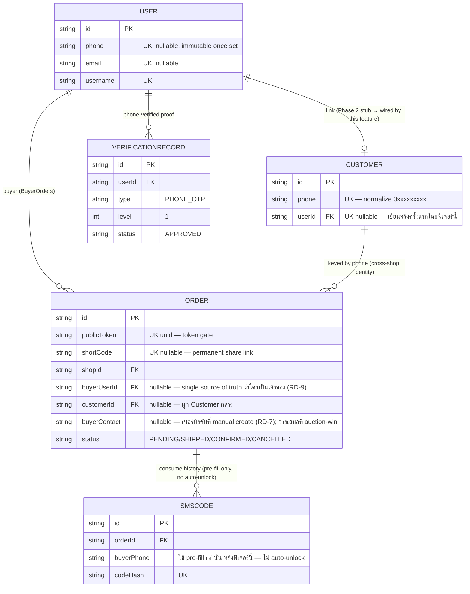

> **โมดูล:** M00015-OrderClaimForcedLogin
> **ประเภทเอกสาร:** DATABASE Design
> **เวอร์ชัน:** 1.1
> **วันที่จัดทำ:** 2026-07-07
> **สถานะ:** Draft — **verdict: ไม่ต้องมี Prisma migration ใหม่**
> **เจ้าของเอกสาร:** SA (safepay-database)

# DATABASE: Order Claim & Forced Login

---

## 1. Overview

ฟีเจอร์นี้ **ไม่เพิ่มตาราง/คอลัมน์ใหม่** — เป็นการ "wire" field ที่มีอยู่แล้ว (จาก feature 00001 Login & Onboarding และ 00014 Customer Directory) ให้ทำงานจริงเป็นครั้งแรก:

- **`Order.buyerUserId`** — ใช้เป็นเงื่อนไข gate หลัก (owner-match, RD-9)
- **`Order.customerId`** — ผูกกับ `Customer` กลาง (guarantee-link, RD-5)
- **`Order.buyerContact`** — เทียบกับเบอร์ของบัญชีที่ login (claim-OTP, RD-4/RD-8) และเปลี่ยนมาบังคับเป็นเบอร์เสมอที่ชั้น validation ตอนสร้างออเดอร์ (RD-7)
- **`Customer.userId`** — ถูกเขียนจริงเป็นครั้งแรก (เดิมเป็น Phase-2 stub ว่างเปล่า 100% ตาม 00014)
- **`User.phone`** + **`VerificationRecord{type:"PHONE_OTP", level:1}`** — ใช้เป็นนิยาม "phone-verified" สำหรับ bid-gate ใหม่ (RD-10)

งานของเอกสารนี้คือ **validate ข้อกล่าวอ้างใน PRD/BRD ว่า schema ปัจจุบันรองรับครบ** (§3 ของ task) ไม่ใช่ออกแบบตารางใหม่ — Store เดียว: PostgreSQL 16 (Supabase), ผ่าน Prisma ORM (`prisma/schema.prisma`), ไม่มี RLS (authorization อยู่ที่ `src/services/`)

- **เอกสารต้นทาง:** PRD/BRD ของฟีเจอร์นี้ (ไม่มี SDS แยก — PRD/BRD ระบุ business rule + FR ละเอียดพอที่ DATABASE.md ตรวจสอบ schema ได้ตรง)
- **Store ที่เกี่ยวข้อง:** PostgreSQL 16 (Supabase) — ตาราง `Order`, `Customer`, `User`, `VerificationRecord`, `SmsCode`
- **Engine:** PostgreSQL (InnoDB ไม่เกี่ยวข้อง — คนละ engine)

---

## 2. ERD



---

## 3. Tables (สถานะปัจจุบัน — ยืนยันจาก `prisma/schema.prisma` จริง)

ทุก field ที่ฟีเจอร์นี้ต้องใช้ **มีอยู่แล้ว** ก่อน feature เริ่ม — คัดลอกมาเฉพาะส่วนที่เกี่ยวข้อง

### 3.1 `Order` (PostgreSQL — `prisma/schema.prisma` บรรทัด ~323)

```prisma
model Order {
  id              String   @id @default(uuid())
  publicToken     String   @unique @default(uuid())
  shortCode       String?  @unique
  shopId          String
  buyerUserId     String?
  buyerContact    String?
  type            String   @default("PHYSICAL")
  totalAmount     Decimal  @db.Decimal(12, 2)
  status          String   @default("PENDING")
  fulfillmentMode String   @default("SHIPPED")
  ...
  customerId      String?
  ...
  auctionId       String?  @unique

  shop     Shop     @relation(fields: [shopId], references: [id])
  buyer    User?    @relation("BuyerOrders", fields: [buyerUserId], references: [id])
  customer Customer? @relation(fields: [customerId], references: [id], onDelete: SetNull)
  ...

  @@index([slipFileId])
  @@index([customerId])
}
```

- `buyerUserId String?` — nullable FK → `User.id` (onDelete `SetNull`), **ไม่มี `@@index` เดี่ยว** (ดู §4 — ประเด็นที่ต้อง flag)
- `customerId String?` — nullable FK → `Customer.id` (onDelete `SetNull`), **มี `@@index([customerId])` แล้ว** (จาก feature 00014)
- `buyerContact String?` — ยังคง `String?` เดิม; ฟีเจอร์นี้เปลี่ยนแค่ **validation ชั้น app** (บังคับเป็นเบอร์ไทยตอน manual-create) ไม่แตะ nullability ของคอลัมน์นี้เลย — ต้องคง nullable เพื่อรองรับ legacy record + auction-win order (ไม่มี `buyerContact` โดยดีไซน์)

### 3.2 `Customer` (PostgreSQL — `prisma/schema.prisma` บรรทัด ~375, จาก feature 00014)

```prisma
model Customer {
  id        String   @id @default(uuid())
  phone     String   @unique
  email     String?
  userId    String?  @unique
  createdAt DateTime @default(now())
  updatedAt DateTime @updatedAt

  user   User?   @relation(fields: [userId], references: [id], onDelete: SetNull)
  orders Order[]
}
```

- `phone String @unique` — SSOT identity, normalize ผ่าน `normalizePhone()` (`src/lib/phone.ts`) ก่อนเขียนเสมอ
- `userId String? @unique` — **"Phase 2 stub"** ที่ระบุไว้ตั้งแต่ 00014 (comment ในสคีมา: `// link → User (Phase 2, SetNull)`) — เดิม 0% ของ record มีค่านี้ (ตาม KPI baseline ใน PRD §1.2) ฟีเจอร์นี้คือจุดแรกที่เขียนค่านี้จริงเป็นวงกว้าง (ผ่าน guarantee-link, FR-OCL-07)

### 3.3 `User` (PostgreSQL — `prisma/schema.prisma` บรรทัด ~11)

```prisma
model User {
  id                 String   @id @default(uuid())
  ...
  phone              String?  @unique
  email              String?  @unique
  ...
  ordersAsBuyer      Order[]  @relation("BuyerOrders")
  customer           Customer? // feat 00014 — link Customer เมื่อสมัครเป็น buyer (Phase 2; nullable)
  verifications      VerificationRecord[]
  ...
}
```

- `phone String? @unique` — global unique; **immutable หลังตั้งครั้งเดียว** (business rule จาก feature seller-auth 2026-06-17, ไม่ใช่ DB constraint — enforce ที่ `POST /api/account/set-phone` ปฏิเสธถ้ามีแล้ว) เป็นเงื่อนไขที่ทำให้ RD-8 (No Identity Switch) ปลอดภัยทาง data-level: เบอร์เดียวมีเจ้าของบัญชีเดียวเสมอ ไม่มีทาง "แอบอ้าง" เบอร์คนอื่นผ่านการเขียนข้อมูลซ้อนได้
- `customer Customer?` — reverse-relation ของ `Customer.userId`, ไม่มีคอลัมน์จริงฝั่ง `User` (Prisma-managed relation field เท่านั้น)

### 3.4 `VerificationRecord` (PostgreSQL — `prisma/schema.prisma` บรรทัด ~171)

```prisma
model VerificationRecord {
  id             String    @id @default(uuid())
  userId         String
  shopId         String?
  type           String
  level          Int
  status         String    @default("PENDING")
  ...
  user User @relation(fields: [userId], references: [id], onDelete: Cascade)
  ...
  @@index([shopId])
}
```

- ไม่มี unique constraint บน `(userId, type, level)` — โค้ดจริง (`src/lib/auth.ts` บรรทัด ~247) กัน record ซ้ำด้วย application check (`findFirst({where:{userId,type:"PHONE_OTP",level:1}})` ก่อน create) ไม่ใช่ DB constraint — เป็น pattern เดิมที่ใช้อยู่แล้ว ฟีเจอร์นี้ reuse ตรง ๆ ไม่เพิ่ม constraint ใหม่
- "Phone-verified" (RD-10, §C6 ของ task) = `User.phone != null` เสมอคู่กับ `VerificationRecord{type:"PHONE_OTP", level:1, status:"APPROVED"}` — เพราะในโค้ดจริงมีแค่ 2 จุดที่ตั้ง `User.phone` ได้ (`phone-otp` provider ใน `src/lib/auth.ts`, และ `POST /api/account/set-phone`) และทั้งคู่เรียก `verifyOtp()` (`src/lib/otp.ts`) ก่อนเสมอ พร้อมสร้าง record คู่กัน — **ไม่มี code path ใดตั้ง `User.phone` โดยไม่ผ่าน OTP** จึงใช้ `User.phone != null` เป็น proxy ที่ปลอดภัยของ "phone-verified" ได้โดยไม่ต้อง join ตาราง `VerificationRecord` ทุกครั้งที่ `placeBid()` ตรวจ (query เดียวจาก session/`User` ก็พอ)

### 3.5 `SmsCode` (PostgreSQL — `prisma/schema.prisma` บรรทัด ~682)

```prisma
model SmsCode {
  id             String    @id @default(uuid())
  codeHash       String    @unique
  orderId        String
  buyerPhone     String
  expiresAt      DateTime
  usedAt         DateTime?
  deliveryStatus String    @default("PENDING")
  createdAt      DateTime  @default(now())

  order Order @relation(fields: [orderId], references: [id], onDelete: Cascade)

  @@index([codeHash])
  @@index([orderId])
  @@index([expiresAt])
}
```

- ไม่มีคอลัมน์ใดต้องเปลี่ยน — `usedAt` (single-use marker) และ `buyerPhone` ยังใช้ตรรกะเดิมทั้งหมด (§3.2/§3.3 PRD) มีแค่**ความหมายทางธุรกิจ**ของผลลัพธ์หลัง consume ที่เปลี่ยนจาก "auto-unlock cookie" เป็น "pre-fill redirect" — เป็นการเปลี่ยนที่ **endpoint/route layer** (`/api/o/sms/[code]`) ไม่ใช่ schema

---

## 4. Indexes

| Table | Columns | สถานะ | Rationale (query pattern) |
|-------|---------|-------|-----------------------------|
| `Order` | `publicToken` (`@unique`) | มีอยู่แล้ว | `getOrderByToken()`, `confirmOrder()` — lookup หลักของหน้า `/o/{token}` ทุกจุดเข้าถึง (owner-match, claim-OTP, unclaimed-claim ล้วนเริ่มจาก lookup นี้) |
| `Order` | `customerId` (`@@index`) | มีอยู่แล้ว (feat 00014) | guarantee-link เขียน `customerId` แต่ไม่ query filter ด้วย field นี้ในฟีเจอร์นี้โดยตรง — index นี้รองรับ use-case อื่น (customer directory) อยู่แล้ว |
| `Customer` | `phone` (`@unique`) | มีอยู่แล้ว | `findOrCreateCustomer(tx, phone)` — เรียกทุกครั้งที่ guarantee-link ทำงาน (FR-OCL-07) ผ่าน unique index อยู่แล้ว เร็วสุด |
| `Customer` | `userId` (`@unique`) | มีอยู่แล้ว | รองรับ "1 Customer ต่อ 1 User" — ใช้ตรวจ idempotency (`Customer.userId === session.user.id` ก่อนเขียนซ้ำ) |
| `User` | `phone` (`@unique`) | มีอยู่แล้ว | resolve เบอร์ของบัญชีที่ login (claim-OTP §3.6), ตรวจ phone-verified (bid-gate §3.11) |
| `VerificationRecord` | `shopId` (`@@index`) | มีอยู่แล้ว | ไม่เกี่ยวกับฟีเจอร์นี้โดยตรง (query ของฟีเจอร์นี้ใช้ `userId`+`type`+`level` ซึ่งยังไม่มี index ประกอบ — ดู observation ด้านล่าง) |
| `SmsCode` | `codeHash`/`orderId`/`expiresAt` | มีอยู่แล้ว | consume flow เดิมไม่เปลี่ยน — ยังใช้ index เดิมครบ |

**ไม่มี index ใหม่ที่ฟีเจอร์นี้ "ต้อง" เพิ่ม** เพราะทุก query pattern ใหม่ (owner-match, claim-OTP compare, guarantee-link) เป็นการเทียบค่าใน-memory หลัง fetch ด้วย unique key (`publicToken`/`phone`) อยู่แล้ว ไม่ใช่ query filter ใหม่บนคอลัมน์ที่ยังไม่มี index

**Observation (ไม่ใช่ scope ของฟีเจอร์นี้ — เป็น debt เดิม ให้ Controller พิจารณาแยก):**

1. **`Order.buyerUserId` ไม่มี `@@index`** — ตรวจสอบ migration ต้นทาง (`prisma/migrations/20260404084338_init/migration.sql`) แล้วยืนยันว่าไม่เคยมี index บนคอลัมน์นี้เลยตั้งแต่ init (Postgres provider ของ Prisma ไม่ auto-index scalar FK เหมือน MySQL) ฟังก์ชัน `getOrdersByBuyer(userId)` (`src/services/order.service.ts` บรรทัด ~488, ใช้แสดง "บัญชีของฉัน → ออเดอร์ของฉัน" อยู่แล้วก่อนฟีเจอร์นี้) query `where: { buyerUserId: userId }` แบบ sequential scan มาโดยตลอด ฟีเจอร์นี้**ไม่ได้เพิ่ม query pattern ใหม่**บนคอลัมน์นี้ (owner-match เทียบค่าหลัง fetch-by-token, ไม่ query filter) แต่จะ**เพิ่มความถี่ของการมี `buyerUserId` ไม่ null** (KPI Order-Identity Link Rate ≥95%) ทำให้ `getOrdersByBuyer` ถูกเรียกบ่อยขึ้นและ match แถวมากขึ้นเรื่อย ๆ ตามเวลา — เป็น debt เดิมที่ควรพิจารณาเพิ่ม `@@index([buyerUserId])` แยกเป็น migration ต่างหาก (ไม่ผูกกับฟีเจอร์นี้) หากพบว่า query ช้าจริงจากการวัด
2. **`VerificationRecord(userId, type, level)` ไม่มี composite index** — bid-gate ใหม่ (RD-10) ตรวจผ่าน `User.phone != null` เป็นหลัก (ไม่ query ตาราง `VerificationRecord` ที่ hot path ของ `placeBid()`) จึงไม่กระทบ แต่ endpoint เพิ่ม/ยืนยันเบอร์ (`POST /api/account/set-phone`) ที่มี `findFirst({where:{userId,type:"PHONE_OTP",level:1}})` อยู่แล้วก่อนฟีเจอร์นี้ (debt เดิมเช่นกัน, ความถี่ต่ำ — เรียกครั้งเดียวตอนตั้งเบอร์ ไม่ใช่ hot path)

ทั้งสองข้อ **ไม่บล็อกฟีเจอร์นี้** และ**ไม่อยู่ใน scope migration ของฟีเจอร์นี้** — ระบุไว้เพื่อความโปร่งใสเท่านั้น (rigor ตาม §hard rule "index ให้ field ที่ filter บ่อย")

---

## 5. Migration Plan

### 5.1 ลำดับการ Migrate

**ไม่มี** — ฟีเจอร์นี้ไม่มีการเปลี่ยนแปลง schema ใด ๆ ทั้งสิ้น (ดู §8 verdict) `npx prisma validate` ต้องผ่านโดยไม่มี diff เทียบกับ schema ปัจจุบัน

| ลำดับ | การเปลี่ยนแปลง | Submodule / Store | หมายเหตุ |
|-------|----------------|--------------------|----------|
| — | ไม่มี migration | — | ทุก field ที่ต้องใช้มีอยู่แล้ว — งาน implement คือแก้ **โค้ด service/route/form** เท่านั้น (`order.service.ts`, `customer.service.ts` (เพิ่มฟังก์ชัน link userId), `auction.service.ts`, `OrderCreateForm.tsx`, `validations.ts`, `/api/o/sms/[code]`, `/auth/sign-in`) |

### 5.2 Rollback

ไม่มี migration ให้ rollback — ถ้าต้อง revert ฟีเจอร์นี้ ก็ revert เฉพาะโค้ด service/route/UI เท่านั้น ข้อมูลที่ถูกเขียนระหว่างทาง (`Order.buyerUserId`/`customerId` ที่ถูก stamp, `Customer.userId` ที่ถูก link) เป็น**การเติมข้อมูลที่ถูกต้องอยู่แล้วตามดีไซน์เดิม** (fields เหล่านี้ถูกออกแบบมาให้เก็บค่านี้ตั้งแต่ 00014/00001) ไม่จำเป็นต้อง "ลบทิ้ง" หาก rollback ฟีเจอร์นี้ — การ revert แค่หยุดเขียนค่าเพิ่ม ไม่ต้อง cleanup ข้อมูลเก่า

### 5.3 ผลกระทบ (Impact)

- **Downtime:** ไม่มี (ไม่มี `ALTER TABLE`/lock)
- **Backward compatibility:** สมบูรณ์ — โค้ด/query เดิมที่อ่าน `Order.buyerContact`/`buyerUserId`/`customerId` (เช่น `getOrdersByShop`, `getOrdersByBuyer`, seller order detail) ไม่ต้องแก้ schema-side เลย
- **Data consistency:** guarantee-link (FR-OCL-07) เป็น best-effort/idempotent ที่ทำงานบนข้อมูลเดิม — เพิ่ม write path ใหม่ (`Customer.userId`) แต่ไม่เปลี่ยน shape ของข้อมูลเดิม

---

## 6. `Customer.userId` Write Path (ประเด็นหลักของฟีเจอร์นี้)

### 6.1 เดิม vs ใหม่

- **เดิม (00014):** `Customer.userId` เป็น "Phase 2 stub" — มี field ไว้แต่**ไม่มีโค้ดจุดใดเขียนค่านี้เลย** (0% coverage ตาม PRD §1.2 baseline)
- **ใหม่ (00015):** ฟีเจอร์นี้เพิ่มฟังก์ชัน guarantee-link (ต่อยอด/เรียกคู่กับ `findOrCreateCustomer` ที่มีอยู่แล้วใน `src/services/customer.service.ts`) ที่ทำ:
  1. resolve เบอร์ที่เกี่ยวข้อง (เบอร์ของ session user เอง หรือ `order.buyerContact` — ทั้งสองค่าเท่ากันเสมอ ณ จุดที่เรียก เพราะผ่าน gate มาแล้ว ดู §6.3)
  2. `findOrCreateCustomer(tx, phone)` → ได้ `customerId`
  3. อ่าน `Customer.userId` ปัจจุบัน — ถ้า `null` → `update({ userId: session.user.id })`; ถ้ามีค่าอยู่แล้วตรงกับ session → no-op; ถ้ามีค่าอยู่แล้วเป็นคนละคน → **ห้าม override**, log ไว้เฉย ๆ (FR-OCL-07-AC-04)
  4. stamp `Order.buyerUserId`/`Order.customerId` ถ้ายังว่าง (ไม่ override ถ้ามีค่าแล้ว)

### 6.2 `@unique` constraint — implication

- `Customer.userId String? @unique` หมายความว่า **1 Customer ↔ 1 User สูงสุด** (1:1 partial, เพราะ nullable) — Postgres treat `NULL` เป็น distinct หลายแถวได้ (หลาย `Customer` ที่ `userId IS NULL` พร้อมกันได้ ไม่ชน unique)
- เมื่อ `Customer.userId` ถูกตั้งเป็นค่าไม่ null ครั้งหนึ่งแล้ว **จะไม่มี `Customer` แถวอื่นตั้ง `userId` เดียวกันซ้ำได้อีก** (DB บังคับ) — ตรงกับ business rule "ห้าม override เจ้าของ" ระดับหนึ่ง (ถ้าพยายาม assign user เดียวกันให้ Customer คนละแถว → P2002 ทันที ไม่ใช่ silent bug)

### 6.3 ทำไม @unique ถึงถูกต้อง (ไม่ใช่ schema flaw) — วิเคราะห์ตาม task ข้อ 2

**คำถามของ task:** "A User อาจ map ไปหลาย phone-Customer ได้ถูกต้องหรือไม่ และ `@unique` ถูกต้องหรือไม่"

**คำตอบ: `@unique` ถูกต้องแล้ว ไม่ต้องแก้ ด้วยเหตุผลเชิงโครงสร้างข้อมูลที่มีอยู่แล้วในระบบ (ไม่ใช่แค่ business rule ของฟีเจอร์นี้):**

- `User.phone String? @unique` — **1 User มีเบอร์ได้แค่ 1 เบอร์เท่านั้น** (scalar field เดี่ยว ไม่ใช่ array/relation) และเบอร์นั้น **immutable หลังตั้งครั้งแรก** (business rule จาก feature seller-auth 2026-06-17 — enforce ที่ `POST /api/account/set-phone` ปฏิเสธ 409 ถ้ามีแล้ว ไม่ใช่ DB constraint แต่ effect เดียวกัน: เบอร์ของ User ไม่เคยเปลี่ยน)
- `Customer.phone String @unique` — 1 เบอร์ = 1 `Customer` แถวเท่านั้น (global, cross-shop)
- **ผลรวม:** เบอร์หนึ่งเบอร์ผูกกับ `User` ได้สูงสุด 1 คน และผูกกับ `Customer` ได้สูงสุด 1 แถว → ดังนั้น `Customer` แถวที่ตรงกับเบอร์ของ `User` X จะมีแค่แถวเดียวเสมอ ไม่มีทาง "หลาย Customer ชี้ user เดียวกัน" เกิดขึ้นได้ตามธรรมชาติของข้อมูล ไม่ว่าจะเรียก guarantee-link กี่ครั้ง กี่ order ก็ตาม — เพราะทุกครั้งที่ resolve เบอร์ (§6.1 ข้อ 1) ฟีเจอร์นี้ resolve จาก **เบอร์ของ session user เอง** เสมอ (ไม่ใช่เบอร์อื่นที่ไม่ใช่ของ user นั้น) ตามที่ยืนยันไว้ชัดเจนใน PRD §3.7: "เบอร์ที่ใช้ resolve/สร้าง `Customer`... คือเบอร์ที่ยืนยันแล้วของบัญชีผู้ชนะ ไม่ใช่ `order.buyerContact`" (auction-win) และ FR-OCL-06 (claim-OTP บังคับเบอร์ตรงกับเบอร์ของบัญชีที่ login เท่านั้น — RD-8 ห้าม identity switch)
- กล่าวอีกนัยหนึ่ง: **ฟีเจอร์นี้ไม่มี code path ใดที่พยายาม link `Customer` ของเบอร์ A เข้ากับ `User` B ที่ไม่ใช่เจ้าของเบอร์ A** — ทุก write path เขียน `userId = session.user.id` ลงใน `Customer` ที่ resolve จากเบอร์ของ session user คนนั้นเองเท่านั้น จึงไม่มีทางเกิด "1 User พยายามผูกกับ Customer หลายแถว (หลายเบอร์)" ในฟีเจอร์นี้ — ถ้าจะเกิดขึ้นได้ ต้องเป็นกรณีที่ `User.phone` เปลี่ยนได้ (ซึ่งระบบห้ามไว้แล้ว/immutable) หรือมี multi-phone-per-user model (ซึ่งไม่มีใน schema ปัจจุบันและไม่ใช่ scope ของฟีเจอร์นี้)

**สรุป:** ไม่มี conflict จริงให้ flag เป็น decision ของ Controller — `@unique` สอดคล้องกับ `User.phone @unique` + immutable-phone business rule อยู่แล้ว การออกแบบ 1:1 ถูกต้องตามสมมติฐานของระบบปัจจุบัน (ถ้าในอนาคตระบบรองรับ "1 User หลายเบอร์/หลาย Customer" — เช่น ผูกบัญชีธุรกิจหลายเบอร์ — จะต้องพิจารณาแก้ `@unique` ตอนนั้น แต่**ไม่ใช่ตอนนี้**)

### 6.4 Concurrency / P2002 considerations

| สถานการณ์ | วิเคราะห์ | ความเสี่ยงจริง |
|-----------|----------|----------------|
| 2 request พร้อมกันเรียก guarantee-link ให้ user เดียวกัน (เปิดออเดอร์ 2 แท็บพร้อมกัน) | ทั้งคู่ resolve เบอร์เดียวกัน (ของ user เดียวกัน) → `findOrCreateCustomer` คืน `customerId` เดียวกัน (unique index กันซ้ำ, P2002-safe อยู่แล้วตาม pattern เดิมใน `customer.service.ts`) → ทั้งคู่ update `userId` เป็นค่าเดียวกัน | ไม่มี — idempotent โดยธรรมชาติ (เขียนค่าเดิมซ้ำ ไม่ throw) |
| Race ระหว่าง create `Customer` ใหม่ (จาก `createOrder`) กับ guarantee-link (จากการเปิดออเดอร์) พร้อมกัน | `findOrCreateCustomer` มี catch P2002 → re-find อยู่แล้ว (โค้ดเดิม `src/services/customer.service.ts` บรรทัด 17-22) — reuse ตรง ๆ | ไม่มี — โค้ดเดิมจัดการแล้ว |
| พยายาม `update({ where:{id: customerA}, data:{ userId: X } })` ขณะ `Customer` แถวอื่น (`customerB`) มี `userId: X` อยู่แล้ว (แถวคนละเบอร์ชี้ user เดียวกัน) | ตาม §6.3 ไม่ควรเกิดขึ้นได้ในทางปฏิบัติ แต่ **ถ้าเกิด** (เช่น ข้อมูล legacy ที่หลุด/bug ในอนาคต) → Prisma throw `P2002` ทันที | ต้อง **catch P2002 แล้ว log + ข้ามการ set userId (ไม่ throw ทับ login)** — ตาม FR-OCL-07-AC-06 (best-effort, ห้าม fail login) guarantee-link function ต้อง wrap ทั้งก้อนด้วย try/catch เหมือน pattern เดิมของ post-confirm badge eval ใน `order.service.ts` บรรทัด ~251-264 |

**ข้อสรุปเชิง implementation (ส่งต่อให้ SDS/dev):** ฟังก์ชัน guarantee-link ใหม่ต้อง catch ทั้ง P2002 ของ `Customer.create` (มี pattern อยู่แล้ว) และ P2002 ของ `Customer.update({data:{userId}})` (ยังไม่มี pattern มาก่อน เพราะไม่เคยมีใครเขียนค่านี้) — เพิ่ม try/catch รอบการ set `userId` แยกจากการ resolve `customerId` เพื่อไม่ให้ error หนึ่งบล็อกอีกอันหนึ่ง

---

## 7. Phone-Required at Order Creation (C1) — ยืนยัน validation-only

- `Order.buyerContact` **ยังคงเป็น `String?`** (nullable) — ไม่มีการเปลี่ยนเป็น `String` (NOT NULL) เพราะต้องรองรับ:
  1. **Legacy records** (สร้างก่อนฟีเจอร์นี้ launch) ที่อาจเป็นอีเมล/ว่าง
  2. **Auction-win orders** ที่ `settleAuctionCore()` สร้าง `Order` โดยไม่เคยใส่ `buyerContact` เลย (ยืนยันจากโค้ดจริง — ไม่มี field นี้ใน `tx.order.create` data ของ auction settle path)
- การบังคับ "เป็นเบอร์ไทย valid เสมอ" (`^0[0-9]{9}$`) เกิดที่ **ชั้น application เท่านั้น** — สองจุด:
  1. Frontend: `OrderCreateForm.tsx` (yup schema)
  2. Backend: `CreateOrderSchema` (valibot, `src/lib/validations.ts`)
- **ไม่มี DB CHECK constraint ใหม่** — ตรงกับ RD-7/FR-OCL-09-AC-06 ที่ระบุชัดว่า "ไม่มี migration ใหม่" เหตุผลเพิ่มเติมทาง DB: ถ้าเพิ่ม CHECK constraint จะพัง insert ของ auction-win path (ที่ตั้งใจไม่มี `buyerContact`) ทันที — เป็นอีกเหตุผลเชิง data-integrity ที่ยืนยันว่า validation ต้องอยู่ที่ application layer ไม่ใช่ DB layer

---

## 8. Bid Phone-Gate (C6) — ยืนยันไม่ต้องมีตารางใหม่

"เบอร์ยืนยันแล้ว" (phone-verified) สำหรับ guard ใหม่ใน `placeBid()` แทนด้วย field ที่มีอยู่แล้ว 2 ตัวประกอบกัน (ไม่ต้องสร้าง flag ใหม่):

| สิ่งที่ต้องเช็ก | Field ที่ใช้ | เหตุผลที่พอ (ไม่ต้อง join `VerificationRecord`) |
|----------------|--------------|--------------------------------------------------|
| บัญชีมีเบอร์ยืนยันแล้วหรือยัง | `User.phone != null` | มีแค่ 2 code path ที่ตั้งค่านี้ได้ (`phone-otp` provider ใน `src/lib/auth.ts`, `POST /api/account/set-phone`) ทั้งคู่บังคับผ่าน `verifyOtp()` (`src/lib/otp.ts`) ก่อนเสมอ — ไม่มีทางตั้ง `User.phone` แบบไม่ผ่าน OTP ได้เลยในโค้ดปัจจุบัน |
| หลักฐานยืนยัน (audit trail) | `VerificationRecord{type:"PHONE_OTP", level:1, status:"APPROVED"}` | สร้างคู่กับการตั้ง `User.phone` เสมอ (ดู `src/lib/auth.ts` บรรทัด ~184, ~253) — ใช้เป็นหลักฐานประกอบ ไม่ใช่เงื่อนไข gate หลัก (gate หลักเช็กที่ `User.phone` พอ เพราะเร็วกว่า ไม่ต้อง query ตารางเพิ่ม) |

**ไม่มีตาราง/field ใหม่** — `placeBid()` เพิ่มแค่ 1 guard condition (`if (!bidder.phone) throw ...`) ก่อน guard เดิมทั้งหมด ไม่แตะ schema

---

## 9. Data Touchpoints (READ/WRITE ต่อ entity ต่อ step)

| Entity | Field | READ (จุดที่อ่าน) | WRITE (จุดที่เขียน) |
|--------|-------|--------------------|-----------------------|
| **Order** | `publicToken` | ทุก entry (`getOrderByToken`) — resolve order จาก URL | ไม่เขียน (ตั้งครั้งเดียวตอน create) |
| **Order** | `buyerUserId` | Owner-match gate (§3.5) — เทียบ `session.user.id` | Claim สำเร็จ (§3.6/§3.8) — stamp ถ้ายังว่าง; ไม่ override |
| **Order** | `buyerContact` | Claim-OTP compare (§3.6) — เทียบเบอร์ของบัญชีที่ login | Manual order-create (validation บังคับเบอร์, §3.10); ไม่เขียนซ้ำหลัง create |
| **Order** | `customerId` | Guarantee-link idempotency check | Guarantee-link (§3.7) — stamp ถ้ายังว่าง |
| **Order** | `status` | ทุก gate (unclaimed-order ต้อง `PENDING`, §3.8) | ไม่เขียนใน flow นี้ (เขียนที่ `confirmOrder`/state machine เดิม) |
| **Customer** | `phone` | `findOrCreateCustomer(tx, phone)` — resolve/สร้าง | สร้างใหม่ถ้ายังไม่มี (idempotent, P2002-safe เดิม) |
| **Customer** | `userId` | Idempotency check (ตรง/ไม่ตรง session) | **Guarantee-link เขียนครั้งแรก** (§6.1) — ถ้า `null` เท่านั้น; ห้าม override |
| **User** | `id` | Session (`session.user.id`) — ทุก gate | ไม่เขียนในฟีเจอร์นี้ |
| **User** | `phone` | Claim-OTP compare (§3.6), Bid-gate (§3.11) | เขียนผ่าน flow เดิม (`phone-otp` provider / `set-phone`) เท่านั้น — ฟีเจอร์นี้ไม่เพิ่มจุดเขียนใหม่ ใช้ path เดิม |
| **VerificationRecord** | `type`/`level`/`status` | ไม่ query โดยตรงใน bid-gate hot path (ใช้ `User.phone` แทน) | เขียนผ่าน flow เดิม (`verifyOtp()`) เท่านั้น — reuse |
| **SmsCode** | `buyerPhone` | Pre-fill redirect (§3.3) — ดึงเบอร์ไปใส่ query param ของหน้า login/OTP | ไม่เขียนเปลี่ยนแปลง (consume/`usedAt` ยังทำงานเหมือนเดิม) |
| **SmsCode** | `usedAt` | Single-use check (เดิม) | Consume (เดิม, ไม่เปลี่ยน) |

---

## 10. Legacy / Backfill Note

- ออเดอร์เก่าที่ `buyerContact` เป็นอีเมล/ว่าง และ **ไม่มี** `buyerUserId` ผูก — **ไม่มีทาง self-claim ผ่าน OTP ได้** (ไม่มีเบอร์ให้เทียบ) ตาม known limitation ที่ระบุชัดใน PRD §3.6/§4.2/§5 และ BRD FR-OCL-06-AC-09
- **ฟีเจอร์นี้ไม่มี backfill script** — ผู้ใช้ (Controller) เลือก "known-limit" ไม่ใช่ "cleanup" อย่างชัดเจน (ต่างจาก feature 00014 ที่มี `prisma/backfill-customers.ts` สำหรับ order ที่มีเบอร์แต่ยังไม่มี `customerId`)
- Order ที่ `buyerContact == null` + สถานะไม่ใช่ `PENDING` (ถ้ามีหลงเหลือในข้อมูลเก่า) ก็ไม่เข้าเงื่อนไข unclaimed-order เช่นกัน (FR-OCL-08-AC-03) — เป็นกลุ่มเดียวกับข้อจำกัดข้างต้น ไม่มี fix เพิ่มในฟีเจอร์นี้
- Seller ยังจัดการออเดอร์กลุ่มนี้แบบ offline ได้ตามปกติ (ไม่ใช่ระบบ block การทำงานของ order เดิม — แค่ buyer เจ้าของไม่สามารถเข้าถึงหน้า `/o/{token}` ผ่านตัวเองได้)

---

## 11. Retention / ข้อควรระวัง

- **Data Retention:** ไม่เปลี่ยนจากเดิม — `Order`/`Customer`/`User`/`VerificationRecord`/`SmsCode` ไม่มี retention job ใหม่จากฟีเจอร์นี้
- **PII / ข้อมูลอ่อนไหว:** `Order.buyerContact`, `Customer.phone`, `User.phone` เป็นเบอร์โทรจริง (PII) — ฟีเจอร์นี้**เพิ่มจุดอ่านเบอร์มากขึ้น** (owner-match/claim-OTP เทียบเบอร์ทุกครั้งที่เข้าหน้าออเดอร์) ต้องคง pattern PII-neutralize-at-source เดิม (RSC PII leak fix, 2026-06-06) — ห้าม serialize เบอร์เต็มลง flight payload ของ client component โดยไม่ mask; การเทียบเบอร์ต้องทำที่ server-side เท่านั้น (ตรงกับ FR-OCL-05-AC-05 อยู่แล้ว)
- **Performance:** ไม่มีความเสี่ยง hot-row ใหม่ — guarantee-link เป็น per-order operation เบา (2-3 query ต่อครั้ง, ผ่าน unique index ทั้งหมด) ความถี่ที่เพิ่มขึ้นคือจำนวนครั้งที่เรียก ไม่ใช่ query pattern หนักขึ้น ส่วน observation ใน §4 (`Order.buyerUserId` ไม่มี index) เป็น debt เดิมที่แยกพิจารณา
- **Consistency ข้าม store:** ไม่มี — store เดียว (PostgreSQL/Supabase) ทุกตารางที่เกี่ยวข้อง

---

## 12. Traceability

| Field/Entity ที่ตรวจสอบ | PRD/BRD Requirement | สถานะ |
|--------------------------|----------------------|-------|
| `Order.buyerUserId` (มีอยู่แล้ว, no `@@index`) | RD-9, FR-OCL-05 (owner-match gate) | Confirmed-existing |
| `Order.customerId` (มีอยู่แล้ว, `@@index`) | RD-5, FR-OCL-07 (guarantee-link) | Confirmed-existing |
| `Order.buyerContact` (คง `String?`) | RD-4/RD-7/RD-8, FR-OCL-06/FR-OCL-09 | Confirmed-existing, no schema change |
| `Customer.userId` (คง `@unique`, write path ใหม่) | RD-5, FR-OCL-07 (Customer-User link coverage KPI) | Confirmed-existing schema; **new write path (code, not schema)** |
| `Customer.phone` (`@unique`) | RD-5 | Confirmed-existing |
| `User.phone` (`@unique`, immutable) | RD-8, RD-10, FR-OCL-06/FR-OCL-10 | Confirmed-existing |
| `VerificationRecord{type,level,status}` | RD-10, FR-OCL-10 (phone-verified definition) | Confirmed-existing |
| `SmsCode.{buyerPhone,usedAt,codeHash}` | FR-OCL-02/FR-OCL-03 (pre-fill, single-use) | Confirmed-existing, behavior change ที่ route layer เท่านั้น |

---

## 13. สรุป (Summary)

**Verdict: ไม่ต้องมี Prisma migration ใหม่สำหรับฟีเจอร์ 00015 — Order Claim & Forced Login**

หลักฐาน:
1. ทุก field ที่ business logic ต้องใช้ (`Order.buyerUserId`/`customerId`/`buyerContact`, `Customer.userId`/`phone`, `User.phone`, `VerificationRecord{type,level,status}`) มีอยู่ครบใน `prisma/schema.prisma` จริงแล้ว ก่อนฟีเจอร์นี้เริ่ม (quote เต็มใน §3)
2. `Customer.userId @unique` ที่เดิมเป็น "Phase-2 stub" ว่างเปล่า ถูก **wire ให้เขียนจริงเป็นครั้งแรก** ผ่านฟังก์ชัน guarantee-link ใหม่ (โค้ด, ไม่ใช่ schema) — วิเคราะห์แล้วว่า `@unique` ยังถูกต้อง เพราะ `User.phone @unique` + immutable-phone ค้ำยันไว้อยู่แล้ว (§6.3) ไม่มี conflict จริงให้ยกเป็น decision ของ Controller
3. Phone-required ที่ order-create (C1/RD-7) และ phone-verified ที่ bid-gate (C6/RD-10) เป็น **validation ชั้น application ล้วน** — ยืนยันด้วยเหตุผลเชิง data-integrity เพิ่มเติมว่าการเพิ่ม DB CHECK จะพัง auction-win insert path ทันที (§7)
4. Legacy/unclaimed order ที่ไม่มีเบอร์ให้ยึด เป็น known limitation ที่ผู้ใช้เลือกรับไว้แล้ว (ไม่มี backfill ในฟีเจอร์นี้, §10)
5. Index ที่มีอยู่ (`publicToken`/`customerId`/`phone` ×2/`codeHash` ฯลฯ) ครอบคลุมทุก query pattern ใหม่ของฟีเจอร์นี้ — gap ที่พบ (`Order.buyerUserId` ไม่มี index) เป็น debt เดิมจาก init migration ไม่ใช่สิ่งที่ฟีเจอร์นี้สร้างขึ้น หรือจำเป็นต้อง fix เพื่อให้ฟีเจอร์นี้ทำงานถูกต้อง (flag ไว้ใน §4 สำหรับ Controller พิจารณาแยก)

**สิ่งที่ dev ต้องทำจริง (ไม่ใช่ migration):** เขียนฟังก์ชัน guarantee-link ใหม่ใน `src/services/customer.service.ts`/`order.service.ts` ที่เรียก `findOrCreateCustomer` + set `Customer.userId` (พร้อม try/catch P2002 ตาม §6.4), ปรับ gate logic ใน route/RSC ของ `/o/[token]`, ปรับ `placeBid()` guard ใหม่ (`auction.service.ts`), ปรับ `OrderCreateForm.tsx` + `CreateOrderSchema` (validation ชั้น app), และปรับ `/api/o/sms/[code]` ให้ redirect แทน set cookie

**Open Questions:**
- Controller พิจารณาว่าจะเปิด migration แยก (นอกฟีเจอร์นี้) เพื่อเพิ่ม `@@index([buyerUserId])` บน `Order` หรือไม่ — ไม่บล็อกฟีเจอร์นี้ แค่เป็น debt ที่จะยิ่งชัดขึ้นเมื่อ Order-Identity Link Rate เพิ่มตาม KPI (§4 observation #1)

---

## 14. ภาคผนวก — Phase 2 (2026-07-25)

### 14.1 `Shop.coverImage`

| ช่อง | ชนิด | ค่าว่างได้ | คำอธิบาย |
|---|---|---|---|
| `coverImage` | `TEXT` | ได้ | ภาพหน้าปกร้าน ใช้เป็นภาพนำของหน้าลิงก์คำสั่งซื้อ เก็บเป็นกุญแจไฟล์แบบเดียวกับ `logo` |

**ไฟล์ย้ายข้อมูล** `20260725130000_shop_cover_image` — `ALTER TABLE "Shop" ADD COLUMN "coverImage" TEXT;`

เขียนด้วยมือตามข้อตกลงฐานข้อมูลที่ใช้ร่วมกันระหว่างสภาพแวดล้อมพัฒนาและใช้งานจริง ห้ามสร้างด้วยคำสั่งอัตโนมัติเพราะมีวัตถุที่เครื่องมือมองไม่เห็นและจะถูกลบทิ้ง

เป็นการเพิ่มช่องล้วน ค่าว่างได้ ไม่มีค่าตั้งต้น จึงไม่ต้องเติมข้อมูลย้อนหลังและไม่กระทบข้อมูลเดิม ร้านที่ยังไม่อัปโหลดจะใช้โลโก้แทนที่ชั้นแสดงผล

**สถานะ:** ใช้กับฐานข้อมูลจริงแล้ว 2026-07-25 ยืนยันด้วยการสอบถามโครงสร้างตารางจริง

### 14.2 ผลกระทบจากการยกเลิกสถานะเข้าถึงแบบเปิด

ไม่มีการเปลี่ยนโครงสร้างตาราง แต่พฤติกรรมต่อข้อมูลเดิมเปลี่ยน

วัดจากฐานข้อมูลจริง ณ วันที่แก้: คำสั่งซื้อทั้งหมด 64 รายการ ไม่มีเบอร์ผูก 12 รายการ และเข้าถึงได้ด้วยเงื่อนไขเดิม 5 รายการ ทั้ง 5 รายการนี้จะพบหน้าที่แจ้งว่าไม่มีเบอร์ผูกและให้ติดต่อร้านโดยตรงแทน ยอมรับได้เพราะเป็นข้อมูลก่อนฟีเจอร์นี้และการเข้าถึงแบบเดิมพิสูจน์ตัวตนไม่ได้อยู่แล้ว

### 14.3 การเขียนข้อมูลตอนเชื่อมบัญชี

ย้ายแถวในตารางบัญชีช่องทางล็อกอินจากผู้ใช้ต้นทางไปยังผู้ใช้ปลายทาง ภายในรายการเปลี่ยนแปลงเดียว เฉพาะช่องทางที่ปลายทางยังไม่มี

**ไม่ลบผู้ใช้ต้นทาง** — แถวนั้นไม่มีข้อมูลและไม่มีช่องทางเข้าใช้งานเหลืออยู่แล้วจึงไม่เป็นอันตราย ส่วนการลบผู้ใช้มีการลบต่อเนื่องหลายทางซึ่งเสี่ยงกว่าประโยชน์ที่ได้ ปล่อยเป็นงานจัดเก็บภายหลัง
