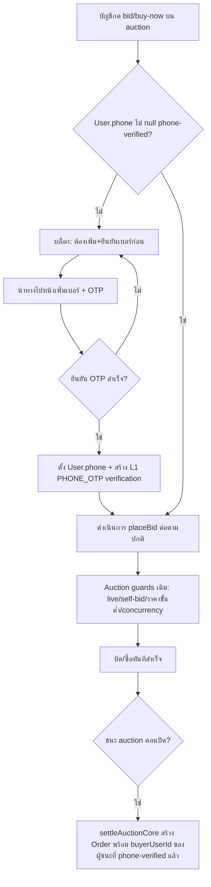
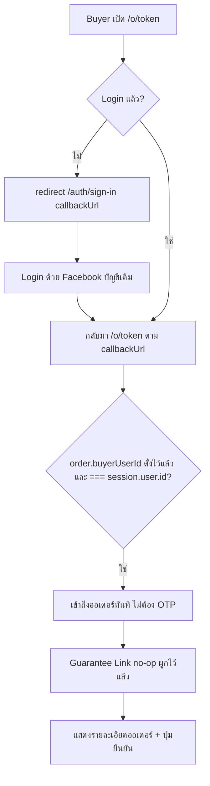
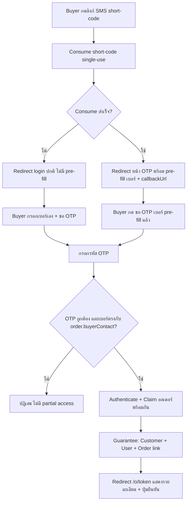
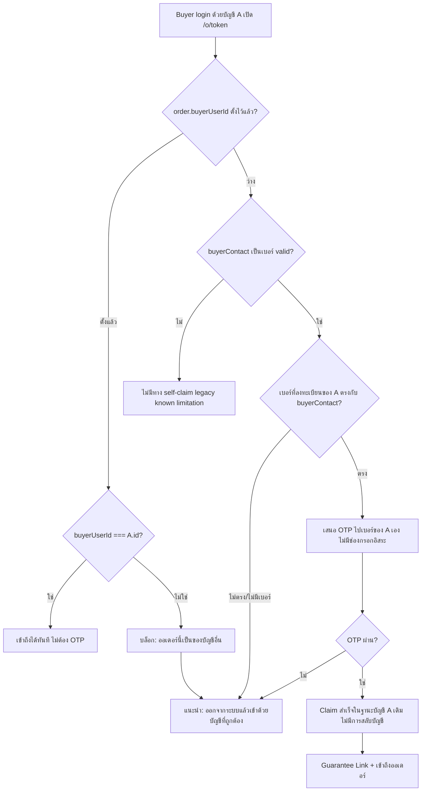

> **โมดูล:** M00015-OrderClaimForcedLogin
> **ประเภทเอกสาร:** Product Requirements Document (PRD)
> **เวอร์ชัน:** 1.0
> **วันที่จัดทำ:** 2026-07-07
> **สถานะ:** Draft
> **เจ้าของเอกสาร:** BA + PO + PM (ดู [[Feature-Docs-Ownership]])

# PRD: Order Claim & Forced Login

---

## Executive Summary

หน้า order สาธารณะ `/o/{token}` (ลิงก์ที่ seller ส่งให้ buyer หลังสร้างออเดอร์) เป็นจุดที่ buyer จำนวนมากเข้ามาโดย **ไม่เคยสมัครสมาชิก** — ระบบเดิมเปิดให้ดูและแม้แต่ "ยืนยันคำสั่งซื้อ" แบบ guest ได้เต็มรูปแบบ (phone-unlock ธรรมดา หรือ SMS short-code → HMAC cookie → guest confirm อัตโนมัติ) ผลคือออเดอร์จำนวนมากไม่เคยผูกกับตัวตนถาวร (`User`) เลย ทำให้ระบบ Trust/Reputation ที่เป็นหัวใจของ Deep (Buyer History Linking, Trust Score, ประวัติการซื้อ) ทำงานได้ไม่เต็มที่

ฟีเจอร์นี้เปลี่ยนกติกาการเข้าถึง `/o/{token}` เป็น **บังคับ login ทุกกรณี ไม่มี guest view/guest confirm อีกต่อไป** — SMS short-code เดิมที่เคยปลดล็อกอัตโนมัติ ลดบทบาทเหลือแค่ "พรีฟิลเบอร์โทร" เพื่อความสะดวก ไม่ใช่ทางลัดข้าม login นอกจากนี้ **การสร้างออเดอร์ของ seller ต้องบังคับกรอกเบอร์โทรลูกค้าเสมอ** (เลิกรับอีเมล/ปล่อยว่าง) เพื่อให้ออเดอร์ใหม่ทุกใบมีเบอร์ให้ยึดตั้งแต่ต้นทาง เมื่อ buyer เข้าถึงออเดอร์ ระบบตัดสินสิทธิ์จาก **`Order.buyerUserId`** เป็นหลัก: ถ้าออเดอร์ผูกกับผู้ใช้แล้ว (เช่น ชนะประมูล หรือเคย claim ไปแล้ว) — บัญชีที่ login ต้องเป็นเจ้าของเดิมเท่านั้นถึงจะเข้าได้ (ไม่ต้อง OTP ซ้ำ) บัญชีอื่นถูกบล็อกทันที; ถ้ายังไม่ผูก (`buyerUserId` ว่าง) และ `buyerContact` เป็นเบอร์ — บัญชีที่ login อยู่ต้องยืนยัน **OTP ไปยังเบอร์ของตัวเอง** เท่านั้น (เบอร์ fixed ไม่มีช่องกรอกเบอร์อื่น) ตรงกับ `buyerContact` ถึงจะ claim สำเร็จ **ไม่มีการสลับบัญชีอัตโนมัติ (identity switch)** อีกต่อไป — ถ้าไม่ตรงคือบล็อก พร้อมคำแนะนำให้ออกจากระบบแล้วเข้าด้วยบัญชี/เบอร์ที่ถูกต้อง (การพิมพ์เบอร์ได้อิสระมีที่เดียวคือหน้า sign-in ปกติตอนยังไม่ login) เคส `buyerContact` เป็นอีเมล/ว่าง เหลือเฉพาะ**ข้อมูลเก่า (legacy)** ก่อนบังคับเบอร์ — ไม่มีทาง self-claim เป็น known limitation ทุกครั้งที่เข้าถึงสำเร็จ ระบบจะ **การันตี** ว่ามี `User` + `Customer` (กลาง, keyed ด้วยเบอร์) ผูกกับออเดอร์นั้นเสมอ (best-effort, idempotent) ผลลัพธ์ทางธุรกิจ: ออเดอร์แทบทุกใบที่ buyer จริงมีปฏิสัมพันธ์ด้วยจะมีตัวตนถาวรผูกอยู่ — เหลือแค่ buyer ที่ปฏิเสธจะใช้ระบบเท่านั้นที่ไม่มี customer record (seller จัดการ offline เอง) การรื้อ UI ให้ทันสมัยเป็นเป้าหมายรองที่ถูกออกแบบแยกต่างหาก (UX spec) — เอกสารนี้โฟกัสที่กติกาตัวตน/flow/business rule เท่านั้น

---

## 1. Business Goals & KPIs

### 1.1 เป้าหมายทางธุรกิจ

| เป้าหมาย | รายละเอียด |
|----------|-----------|
| **ตัวตนถาวรทุกออเดอร์** | ทุกออเดอร์ที่ buyer จริงมีปฏิสัมพันธ์ด้วย (ดู/ยืนยัน) ต้องผูกกับ `User` และ `Customer` กลาง ไม่ปล่อยให้เป็น guest ที่ตามตัวไม่ได้อีกต่อไป |
| **ปิดช่องโหว่ Guest-Bypass** | ตัด flow ที่ buyer ยืนยันออเดอร์ได้โดยไม่มีบัญชีเลย (SMS auto-unlock cookie) — ทุกการยืนยัน = การกระทำของบัญชีจริง |
| **ต่อยอด Trust/Reputation ให้สมบูรณ์** | Trust Score, Buyer History Linking, ประวัติการซื้อ (FR-3, FR-8 ใน `docs/PRD.md`) ทำงานได้เต็มประสิทธิภาพเมื่อทุกออเดอร์มีเจ้าของจริง |
| **ลด Friction ของการ Login ด้วย Pre-fill** | แม้บังคับ login แต่ buyer ที่มาจากลิงก์ SMS ยังได้ความสะดวกเดิม (เบอร์ถูกกรอกให้ล่วงหน้า) ลดจำนวนครั้งที่ต้องพิมพ์เอง |
| **Runtime Derivation — ไม่เพิ่มภาระ Seller** | ไม่ต้องให้ seller ติ๊ก/เลือกว่า buyer เป็นลูกค้าเก่าหรือใหม่ ระบบตัดสินเองจากข้อมูลที่มีอยู่แล้ว |
| **ข้อมูลเบอร์ครบตั้งแต่ต้นทาง (Phone-Required)** | บังคับให้ seller กรอกเบอร์โทรลูกค้าเสมอตอนสร้างออเดอร์ (เลิกรับอีเมล/ปล่อยว่าง) เพื่อให้ทุกออเดอร์ใหม่มี path เข้าสู่ Phone-OTP Claim ได้เสมอ ไม่มีเคส "ไม่มีเบอร์ให้ยึด" เกิดใหม่อีก |

### 1.2 ตัวชี้วัดความสำเร็จ (KPIs)

| KPI | คำอธิบาย | เป้าหมาย |
|-----|----------|---------|
| **Order-Identity Link Rate** | % ออเดอร์ (ที่มีเบอร์/`buyerContact` เป็นเบอร์ valid) ที่มีทั้ง `buyerUserId` และ `customerId` ไม่ null หลังมีการเปิด/ยืนยันโดย buyer | ≥ 95% ภายใน 30 วันหลัง launch |
| **Guest-Confirm Elimination** | จำนวนออเดอร์ที่ถูกยืนยันโดยไม่มี `buyerUserId` (guest confirm) หลัง launch | 0 รายการใหม่ |
| **Login Completion Rate บนหน้า Order** | % ของ session ที่เปิด `/o/{token}` แล้ว login/OTP สำเร็จจนเห็นรายละเอียดออเดอร์ | ≥ 80% ภายใน 60 วัน (baseline วัดหลัง launch เดือนแรก) |
| **Customer-User Link Coverage** | % ของ `Customer` record ที่มี `userId` ไม่ null (เดิม MVP 00014 = 0% เพราะเป็น Phase 2 stub) | เพิ่มขึ้นต่อเนื่องทุกสัปดาห์หลัง launch |
| **OTP Claim Success Rate** | % ของ phone-OTP claim attempt ที่ผ่าน (เบอร์ที่ OTP ตรงกับ `order.buyerContact`) | ติดตามเป็น baseline (ไม่ตั้งเป้าตายตัวรอบแรก) |

---

## 2. User Personas (กลุ่มผู้ใช้งาน)

### 2.1 ลูกค้าเดิม (Existing/Returning Customer)

**ข้อมูลพื้นฐาน:**
- เคยมี `User` account ในระบบ Deep อยู่แล้ว (ไม่ว่าจะสมัครผ่าน Facebook, phone-OTP, หรือ username+password)
- เบอร์โทร หรืออีเมลของบัญชีตรงกับ `order.buyerContact` ที่ seller บันทึกไว้ตอนสร้างออเดอร์ (มักมาจาก feature Customer Directory — seller คีย์เบอร์ลูกค้าตอนสร้างออเดอร์)

**เป้าหมาย:**
- เปิดลิงก์ออเดอร์แล้วเข้าดู/ยืนยันได้เร็วที่สุด โดยใช้วิธี login ที่ตัวเองสะดวก (ไม่อยากถูกบังคับให้ใช้วิธีใดวิธีหนึ่งซ้ำ)

**ความต้องการ:**
- Login ด้วยวิธีไหนก็ได้ที่เคยตั้งไว้ (Facebook / username+password / phone-OTP) แล้วให้ระบบตรวจว่าเป็นเจ้าของออเดอร์นี้จริง — ถ้าเคย claim ไปแล้ว (`Order.buyerUserId` ตรงกับบัญชีตน) เข้าได้ทันทีไม่ต้องทำอะไรเพิ่ม; ถ้ายังไม่เคย claim แต่เป็นเบอร์ของตัวเอง แค่ยืนยัน OTP ไปที่เบอร์ตัวเองรอบเดียวก็เสร็จ ไม่ต้องพิมพ์เบอร์เอง

**จุดปวด (Pain Points):**
- ระบบเดิมต้อง phone-unlock ทุกครั้งแม้จะมีบัญชีอยู่แล้วและ login ค้างอยู่
- ถ้า login ผิดบัญชี (คนละคนกับเจ้าของออเดอร์) ต้องออกจากระบบแล้วเข้าใหม่ด้วยบัญชี/เบอร์ที่ถูกต้อง — ไม่มีทางลัดพิมพ์เบอร์คนอื่นแทนเพื่อ "สลับ" เข้าออเดอร์

### 2.2 ลูกค้าใหม่ (New Customer)

**ข้อมูลพื้นฐาน:**
- ยังไม่เคยมี `User` account ในระบบ Deep เลย
- seller คีย์เบอร์โทรของลูกค้าไว้ตอนสร้างออเดอร์เสมอ (`order.buyerContact` — บังคับเป็นเบอร์โทรตั้งแต่การสร้าง ไม่มีเคสว่าง/อีเมลอีกต่อไปสำหรับออเดอร์ใหม่)

**เป้าหมาย:**
- ดูรายละเอียดออเดอร์และยืนยันได้โดยไม่ต้องผ่านขั้นตอนซับซ้อน

**ความต้องการ:**
- ยืนยันตัวตนด้วยเบอร์ที่ seller บันทึกไว้ (OTP) แล้วเข้าถึงออเดอร์ได้ทันที — ขั้นตอนเดียวทำหน้าที่ทั้ง "สมัคร/login" และ "อ้างสิทธิ์ออเดอร์" พร้อมกัน
- ถ้ามาจากลิงก์ SMS ที่ seller ส่งให้ อยากให้เบอร์ถูกกรอกไว้ล่วงหน้า ไม่ต้องพิมพ์เอง

**จุดปวด (Pain Points):**
- ไม่อยากสมัครสมาชิกแบบเต็มรูปแบบ (กรอกชื่อ/ตั้ง password) แค่เพื่อดูออเดอร์ 1 รายการ
- กลัวว่าต้องผ่านหลายหน้าจอกว่าจะยืนยันออเดอร์ได้

### 2.3 Seller ผู้ส่งลิงก์ (Secondary)

**ข้อมูลพื้นฐาน:**
- สร้างออเดอร์แล้วส่งลิงก์ `/o/{token}` ให้ buyer ผ่านช่องทางต่าง ๆ (แชท, SMS แบบเสียเครดิต, หรือ copy ลิงก์เอง)

**เป้าหมาย:**
- อยากให้ buyer ยืนยันออเดอร์ได้จริง ไม่หลุดหาย และอยากให้ระบบจดจำลูกค้าของตัวเองในระยะยาว (ต่อยอด CRM/ Customer Directory)

**ความต้องการ:**
- Flow การส่งลิงก์ (SMS wallet, share link, copy link) ต้องยังทำงานเหมือนเดิมทุกอย่าง มีแค่ปลายทางที่ buyer เจอเปลี่ยนไป (ต้อง login)
- ตอนสร้างออเดอร์ ต้องกรอกเบอร์โทรลูกค้าเสมอ (บังคับ ไม่ใช่ตัวเลือก) — แลกกับการที่ลูกค้าจะมีตัวตนถาวรผูกได้แน่นอนขึ้น
- ถ้า buyer ปฏิเสธจะสมัคร ต้องยังจัดการออเดอร์ต่อได้ offline (โทร/แชทเอง) — ไม่ใช่ระบบไปบล็อกออเดอร์ทั้งหมด

**จุดปวด (Pain Points):**
- กลัวว่าบังคับ login แล้ว buyer จะหนีไม่ยืนยันออเดอร์ (ความเสี่ยงที่ต้อง mitigate ด้วย UX ที่ friction ต่ำ)
- ลูกค้าบางรายไม่มี/ไม่อยากให้เบอร์ตอน seller คีย์ออเดอร์ (เช่น walk-in) — ตอนนี้กรอกอีเมลหรือเว้นว่างแทนไม่ได้อีกต่อไป ต้องขอเบอร์จริงเสมอ

### 2.4 แพลตฟอร์ม Deep (Secondary — Platform Owner)

**ข้อมูลพื้นฐาน:**
- ต้องการข้อมูลตัวตนที่ทนทาน (durable identity) เพื่อขับเคลื่อน Trust Score, Badge, Customer Directory, และ CRM ในอนาคต

**เป้าหมาย:**
- ลดจำนวน "orphan order" ที่ไม่มีทางโยงกลับไปหาบุคคลจริงได้เลย

**ความต้องการ:**
- ทุก entry point ที่ buyer ปฏิสัมพันธ์กับออเดอร์ต้อง capture ตัวตนให้ได้มากที่สุดเท่าที่เป็นไปได้ โดยไม่ทำลาย conversion จนเกินจำเป็น

---

## 3. Business Requirements

### 3.1 Force Login Gate บน `/o/{token}`

**ความต้องการ:**
- การเปิด `/o/{token}` ขณะไม่ได้ login ต้อง redirect ไปหน้า sign-in ทันที พร้อม `callbackUrl` กลับมาที่ออเดอร์เดิม หลัง login สำเร็จ buyer ต้องถูกพากลับมาหน้าออเดอร์อัตโนมัติ
- กติกานี้ใช้กับ**ทุกสถานะออเดอร์** (PENDING/SHIPPED/CONFIRMED/CANCELLED) และทุก sub-action บนหน้านี้ (ดูรายละเอียด, ยืนยัน, ยกเลิก, แนบสลิป) — ไม่มีอีกแล้วที่ guest มองเห็นข้อมูลออเดอร์โดยไม่ login
- ห้ามส่งข้อมูล PII ของออเดอร์ใด ๆ ลงไปยัง response/flight payload ก่อนตรวจสอบสิทธิ์สำเร็จ (ต่อยอดหลักการเดิมที่เคย fix ไว้กับ RSC PII leak)

**Business Rules:**
- ไม่มี "guest view" อีกต่อไป ไม่ว่าจะเข้าทาง UUID token, SMS short-code, หรือ permanent short-code
- ต้องคง uniform error สำหรับ token/short-code ที่ผิดรูปแบบหรือไม่พบ (`/o/link-invalid`) เพื่อไม่ leak ว่าออเดอร์มีอยู่จริงหรือไม่

**เหตุผล:**
- ทุกการเข้าถึงต้องผูกกับตัวตนจริงตั้งแต่ก้าวแรก ไม่ใช่แค่ตอนกดยืนยัน — ลด surface area ที่จะเกิด "guest ที่ตามตัวไม่ได้"

### 3.2 ยกเลิก Guest Confirm / SMS Auto-Unlock เดิม

**ความต้องการ:**
- Flow เดิมที่ SMS short-code (12 ตัวอักษร) → consume → ตั้ง signed cookie → ข้าม phone-unlock อัตโนมัติ ("guest-confirm ผ่าน SMS") ต้อง**ยกเลิก**
- SMS short-code ยังใช้ตรวจสอบ/consume ได้เหมือนเดิม (single-use, ผูกกับเบอร์ที่ seller ส่งให้) แต่ผลลัพธ์เปลี่ยนจาก "ปลดล็อกอัตโนมัติ" เป็น "พรีฟิลเบอร์โทรบนหน้า login/OTP" เท่านั้น (ดู §3.3)
- Permanent 8-char short-code (ลิงก์ share ต่อได้) เดิมไม่เคย auto-unlock อยู่แล้ว — ไม่กระทบ ยังคง resolve ไปยัง UUID แล้วเข้า Force Login Gate ตามปกติ

**Business Rules:**
- ห้ามมี cookie หรือกลไกใด ๆ ที่ให้สิทธิ์เข้าถึงออเดอร์โดยไม่ผ่านการยืนยันตัวตนของบัญชีจริง (login/OTP)
- Endpoint consume SMS short-code (`/api/o/sms/{code}`) ยังคง rate-limit + single-use + uniform-error ตามเดิมทั้งหมด มีแค่ปลายทางเปลี่ยนจาก "set unlock cookie" เป็น "ส่งต่อไปหน้า login/OTP พร้อม hint เบอร์"

**เหตุผล:**
- กลไก guest-bypass คือช่องโหว่หลักที่ทำให้ออเดอร์จำนวนมากไม่มีตัวตนถาวร การตัดมันออกคือหัวใจของฟีเจอร์นี้

### 3.3 SMS Short-code กลายเป็น "พรีฟิลเบอร์โทร" (Convenience Only)

**ความต้องการ:**
- Buyer ที่เปิดลิงก์ SMS (short-code) ยังได้รับความสะดวกเดิมบางส่วน: เบอร์โทรที่ seller ระบุไว้ตอนส่ง SMS ถูกกรอกไว้ล่วงหน้าในช่อง OTP/login เพื่อลดการพิมพ์ซ้ำ
- Buyer ยังคงต้อง**ยืนยัน OTP จริง** ก่อนเข้าถึงออเดอร์ได้ — พรีฟิลไม่ใช่การอนุมัติสิทธิ์

**Business Rules:**
- การ consume short-code (single-use, mark เป็น used) ยังทำงานเหมือนเดิมเพื่อป้องกัน replay/ใช้ซ้ำของลิงก์ SMS แต่ **ไม่ผูกกับการอนุมัติสิทธิ์เข้าถึงออเดอร์อีกต่อไป**
- ถ้า short-code หมดอายุ/ใช้ไปแล้ว/ผิดรูปแบบ → buyer ยัง redirect เข้าสู่ flow login ปกติได้ (ไม่มี pre-fill) ไม่ error แบบ block ทั้งหมด — เพราะ pre-fill เป็นแค่ความสะดวก ไม่ใช่เงื่อนไขบังคับ

**เหตุผล:**
- รักษาประสบการณ์เดิมที่ buyer คุ้นเคย (ไม่ต้องพิมพ์เบอร์เอง) แต่ตัดช่องโหว่ความปลอดภัย/ตัวตนออกทั้งหมด

### 3.4 แยกลูกค้าเดิม/ใหม่ที่ Runtime (ไม่มี Flag ใหม่)

**ความต้องการ:**
- ระบบต้องพิจารณา "เจ้าของเดิม/ยังไม่มีเจ้าของ" ที่เวลาจริง (runtime) จากการมีอยู่ของ `Order.buyerUserId` และเบอร์ของบัญชีที่ login อยู่เทียบกับ `order.buyerContact` — **ไม่ใช่** flag ที่ seller ตั้งตอนสร้างออเดอร์ และ**ไม่ใช่** field ใหม่ใน schema
- ข้อยกเว้นเดียวที่แตะฝั่ง seller คือ**บังคับกรอกเบอร์โทร**ตอนสร้างออเดอร์ (ดู §3.10) — เป็น validation ชั้น input ไม่ใช่ flag บอกสถานะลูกค้า

**Business Rules:**
- ห้ามเพิ่ม field/flag ใหม่เพื่อเก็บสถานะ "ลูกค้าเก่า/ใหม่" — ทุกครั้งคำนวณสดจากข้อมูลที่มีอยู่ (`Order.buyerUserId`, `User.phone` ของบัญชีที่ login, `Order.customerId`)
- Seller ไม่ต้องเลือก/ติ๊กอะไรเพิ่มเติมตอนสร้างออเดอร์เพื่อบอกว่า buyer เป็นลูกค้าเก่าหรือใหม่ — มีแค่การกรอกเบอร์ (บังคับ) เท่านั้นที่เปลี่ยนไปจากเดิม (§3.10)

**เหตุผล:**
- Derivation แบบ runtime ทนต่อการเปลี่ยนแปลงของสถานะบัญชี (เช่น ลูกค้าสมัครสมาชิกหลังสร้างออเดอร์ไปแล้ว) โดยไม่ต้อง sync flag ให้ตรงเสมอ — ลดความเสี่ยง data drift

### 3.5 เจ้าของออเดอร์ที่ผูกแล้ว — Gate ตรงตัวตนด้วย `buyerUserId` (ไม่ต้อง OTP)

**ความต้องการ:**
- ถ้าออเดอร์มี `Order.buyerUserId` ผูกไว้แล้ว (จากการชนะประมูล ซึ่งระบบสร้างออเดอร์พร้อมผูกผู้ชนะไว้ตั้งแต่ต้น หรือจากการ claim สำเร็จมาก่อนหน้านี้) การเข้าถึงต้องพิจารณาแค่ข้อเดียว: **บัญชีที่ login อยู่ (`session.user.id`) ต้องตรงกับ `order.buyerUserId` เป๊ะ**
- ตรงกัน → อนุญาตเข้าถึงทันที **ไม่ต้องผ่าน OTP ซ้ำ** (ไม่ว่าจะ login ด้วยวิธีไหนก็ตาม — Facebook, username+password, phone-OTP ฯลฯ)
- ไม่ตรงกัน (login เป็นบัญชีอื่น) → **บล็อกทันที** พร้อมข้อความแนะนำ "ออเดอร์นี้เป็นของบัญชีอื่น — ออกจากระบบแล้วเข้าด้วยบัญชีที่ถูกต้อง" — **ไม่เสนอ OTP ให้พิสูจน์สิทธิ์แทน** เพราะเจ้าของถูกกำหนดตายตัวแล้ว

**Business Rules:**
- การตรวจทำที่ server-side เท่านั้น (ไม่ trust ค่าจาก client)
- Rule นี้ครอบคลุมทั้งออเดอร์ชนะประมูล (auction-win) และออเดอร์ที่เคย claim ผ่าน Phone-OTP มาก่อนหน้านี้แล้ว (§3.6) — เข้าเงื่อนไขเดียวกันหมด
- ไม่มีการตรวจ email หรือ `Customer.userId` แยกต่างหากอีกต่อไปในขั้นนี้ — ใช้ `buyerUserId` เป็นแหล่งความจริงเดียว (single source of truth) ว่าใครเป็นเจ้าของ

**เหตุผล:**
- เมื่อออเดอร์มีเจ้าของยืนยันแล้ว (ผ่าน OTP หรือระบบประมูล) ไม่มีเหตุผลต้องให้พิสูจน์ซ้ำทุกครั้ง — และไม่มีเหตุผลให้บัญชีอื่นมีสิทธิ์แทรกเข้ามาได้ผ่านช่องทางใด ๆ (RD-9)

### 3.6 เจ้าของยังว่าง — OTP ผูกกับเบอร์ของบัญชีตัวเอง (ไม่มีช่องกรอกเบอร์อิสระ)

**ความต้องการ:**
- เมื่อ `Order.buyerUserId` ยังว่างอยู่ และ `order.buyerContact` เป็นเบอร์โทร valid: ถ้า buyer **ยังไม่ login** จะเข้าสู่ flow **login ปกติ** (phone-OTP sign-in มาตรฐาน) ซึ่งเป็นจุดเดียวในทั้งฟีเจอร์นี้ที่พิมพ์เบอร์ได้อิสระ (เพราะเป็นการ "เข้าสู่ระบบ" ไม่ใช่ "กล่อง claim ออเดอร์")
- ถ้า buyer **login อยู่แล้ว** ด้วยบัญชี A: ระบบเสนอยืนยัน **OTP ที่ส่งไปยังเบอร์ที่ลงทะเบียนของบัญชี A เองเท่านั้น** — เบอร์นี้ fixed/ไม่แก้ไขได้ แสดงให้เห็นว่าเป็นเบอร์ของ A ไม่มีช่องให้พิมพ์เบอร์อื่นแทน
- ยืนยัน OTP ผ่าน + เบอร์ของ A ตรงกับ `order.buyerContact` เป๊ะ → claim สำเร็จ**ในฐานะบัญชี A เดิม** (stamp `buyerUserId = A.id`) — **ไม่มีการสลับบัญชีใด ๆ เกิดขึ้น**
- ถ้าเบอร์ของ A ไม่ตรงกับ `order.buyerContact` (หรือ A ไม่มีเบอร์ลงทะเบียนเลย) → **ปฏิเสธ** พร้อมคำแนะนำให้ออกจากระบบแล้ว login/สมัครใหม่ด้วยบัญชี/เบอร์ที่ถูกต้อง (ผ่าน flow login ปกติข้างต้น)
- (Optimization — รายละเอียดเงื่อนไข exact ให้กำหนดใน SRS) ถ้า session เพิ่งผ่านการ authenticate ด้วย phone-OTP บนเบอร์ที่ตรงกับ `order.buyerContact` ในขั้นตอนเดียวกัน (เช่น มาจาก flow ไม่ login → OTP → callback กลับมาที่ออเดอร์) ระบบ**อาจข้าม** claim-OTP ซ้ำได้ เพื่อไม่ให้ buyer ต้องกรอก OTP สองรอบติดกัน

**Business Rules:**
- **ห้าม identity switch โดยเด็ดขาด** — ระบบต้อง**ไม่**พาบัญชี A ไปเป็นบัญชีอื่น (เช่นบัญชี B ที่เป็นเจ้าของเบอร์จริงของออเดอร์) แม้ว่าจะรู้ว่าบัญชี B มีอยู่ก็ตาม เส้นทางเดียวสำหรับ B คือให้ A logout แล้ว B login เอง
- OTP ในกล่อง claim ต้องผูกกับเบอร์ของบัญชีที่ login อยู่เท่านั้น ไม่มี input ให้พิมพ์เบอร์อิสระในหน้านี้
- เนื่องจากเบอร์โทร (`User.phone`) เป็น unique ทั้งระบบ กติกานี้จึงไม่มีทาง "ขโมย" สิทธิ์เจ้าของเบอร์จริงคนอื่นได้ — เจ้าของเบอร์จริงต้อง login ด้วยบัญชีตัวเองเสมอ
- Rule นี้ใช้ไม่ได้กับออเดอร์ที่ `buyerContact` เป็นอีเมลหรือว่าง (ไม่มีเบอร์ให้ OTP) — เหลือเฉพาะข้อมูลเก่า (legacy) ก่อนบังคับเบอร์ที่สร้างออเดอร์ (§3.10) — ดู §5 Out of Scope / known limitation

**เหตุผล:**
- นี่คือกลไกหลักที่เปลี่ยน "ลูกค้าใหม่" หรือ "บัญชีที่ยังไม่ผูก" ให้กลายเป็นตัวตนถาวรได้ในขั้นตอนเดียว (authenticate + claim พร้อมกัน) โดยไม่เปิดช่องให้สลับ/แอบอ้างบัญชีอื่นผ่านหน้าออเดอร์ (RD-8)

### 3.7 การันตี User + Customer ผูกกับทุกออเดอร์ที่สำเร็จ

**ความต้องการ:**
- ทุกครั้งที่ buyer เข้าถึงออเดอร์สำเร็จ (ไม่ว่าจะผ่าน owner-match §3.5, OTP claim §3.6, หรือ unclaimed-claim §3.8) ระบบต้อง**การันตี**ว่า:
  1. มี `Customer` record (keyed ด้วยเบอร์) สำหรับเบอร์นั้นอยู่จริง (สร้างถ้ายังไม่มี — reuse logic เดิมจาก Customer Directory)
  2. `Customer.userId` ถูกตั้งเป็น user ที่กำลัง login อยู่ (ถ้ายังไม่เคยตั้ง — เดิมเป็น Phase-2 stub ที่ยังไม่ถูก wire)
  3. `Order.buyerUserId` และ `Order.customerId` ถูกตั้งค่า (ถ้ายังไม่มี)
- การดำเนินการนี้ต้องเป็น **idempotent** (ทำซ้ำได้โดยไม่พัง) และ **best-effort** — ถ้าขั้นตอนนี้ล้มเหลวด้วยเหตุผลใดก็ตาม ต้อง**ไม่ทำให้การ login/เข้าถึงออเดอร์ล้มเหลวตามไปด้วย** (log แล้วดำเนินการต่อ)
- **ออเดอร์ auction-win โดยเฉพาะ:** เนื่องจากบัญชีผู้บิดถูกบังคับ phone-verified ก่อน bid แล้ว (§3.11) เบอร์ที่ใช้ resolve/สร้าง `Customer` สำหรับเส้นทางนี้คือ**เบอร์ที่ยืนยันแล้วของบัญชีผู้ชนะ** (`winner.bidderId` → `User.phone`) ไม่ใช่ `order.buyerContact` (ซึ่งว่างเสมอในออเดอร์ auction) — การันตีนี้จึงสำเร็จได้แน่นอนทุกครั้งสำหรับออเดอร์ auction-win

**Business Rules:**
- ห้ามให้ error จากขั้นตอนผูกตัวตนไปบล็อก flow หลักของ buyer (pattern เดียวกับ post-confirm badge evaluation ที่ทำ best-effort อยู่แล้วในระบบ)
- ถ้า `Customer.userId` มีการผูกกับ user อื่นอยู่แล้ว (คนละคนกับ session ปัจจุบัน) ห้าม override ทับ — เก็บ log ไว้พิจารณา ไม่ auto-reassign เจ้าของ

**เหตุผล:**
- นี่คือ "จุดปิดวงจร" ของทั้งฟีเจอร์ — ถ้าไม่มีขั้นตอนนี้ การบังคับ login ก็ไม่ได้แปลว่าออเดอร์จะมีตัวตนถาวรผูกอยู่จริง

### 3.8 Edge Case — ออเดอร์ที่ยังไม่มีเจ้าของ (Unclaimed Order)

**ความต้องการ:**
- ออเดอร์ที่ `buyerContact == null` และสถานะยังเป็น `PENDING` (ยังไม่มีใคร claim) — buyer คนแรกที่ login สำเร็จ (ด้วยวิธีใดก็ได้) และเปิดลิงก์นี้ ถือเป็นเจ้าของออเดอร์ทันที (พฤติกรรม open-claim เดิมที่มีอยู่แล้ว คงไว้ไม่เปลี่ยน)
- หลัง §3.10 (บังคับเบอร์ตอนสร้างออเดอร์) มีผล เคสนี้จะเกิดน้อยลงมาก — ที่เหลือส่วนใหญ่คือออเดอร์เก่า (legacy, ก่อน launch) เท่านั้น ไม่ใช่เส้นทางปกติของออเดอร์ใหม่อีกต่อไป

**Business Rules:**
- เคสนี้ไม่ต้องผ่าน Phone-OTP Claim (§3.6) เพราะไม่มีเบอร์ให้เทียบ — แค่ login สำเร็จก็เพียงพอ
- เมื่อ claim สำเร็จ ต้องยัง apply §3.7 (การันตี User+Customer link) เหมือนเส้นทางอื่น ถ้ามีเบอร์ที่ resolve ได้จากบัญชีที่ claim (เช่น เบอร์ของบัญชีที่ login)

**เหตุผล:**
- รักษาพฤติกรรมเดิมที่ทดสอบแล้วว่าใช้งานได้ ไม่เพิ่มความซับซ้อนให้กับ edge case ที่ไม่มีข้อมูลเบอร์ให้ยึด

### 3.9 (Supporting Goal) การรื้อ UI — อยู่นอกเอกสารนี้

**ความต้องการ:**
- หน้า `/o/{token}` ปัจจุบันใช้ MUI inline-style ที่ไม่ตรง design system (Vuexy) เอกสารนี้**ไม่ได้กำหนด** รายละเอียดหน้าตาใหม่ — งาน UX/visual redesign เป็น deliverable แยก (UX spec + dev งานถัดไป) แต่ **contract ทางธุรกิจ/ตัวตน/flow ในเอกสารนี้คือสิ่งที่ทีม dev ฝั่ง frontend ต้องเรียกใช้เป็น backend contract**

**Business Rules:**
- Redesign ต้องเคารพ hard rule เดิมของโปรเจกต์ (Vuexy theme-copy, Anuphan font ฯลฯ) — อยู่นอกขอบเขต PRD/BRD นี้

**เหตุผล:**
- แยก concern ระหว่าง "กติกาตัวตน/business logic" (เอกสารนี้) กับ "หน้าตา UI" (UX spec แยก) เพื่อให้แต่ละฝ่ายรีวิวได้ตรงจุด

### 3.10 บังคับเบอร์โทร (Phone-Required) ตอนสร้างออเดอร์ — Seller-side (NOW IN SCOPE)

**ความต้องการ:**
- Seller สร้างออเดอร์ผ่านฟอร์ม manual order-create ต้องกรอก `buyerContact` เป็น**เบอร์โทรไทย valid เสมอ** (รูปแบบ `^0[0-9]{9}$`) — **ห้ามเว้นว่าง และห้ามกรอกเป็นอีเมล** อีกต่อไป (กลับกฎเดิมที่เคยยอมให้ทั้งเบอร์/อีเมล/ว่าง)
- ออเดอร์ที่เกิดจากการชนะประมูล (auction-win) สร้างโดยระบบอัตโนมัติพร้อม `buyerUserId` ของผู้ชนะไว้แล้ว **ไม่มี** การกรอก `buyerContact` โดย seller — กฎนี้ (validation ของฟอร์ม manual order-create) **ใช้ไม่ถึง**เส้นทางนั้น แต่ฝั่งประมูลปิดช่องว่างเดียวกันด้วยกลไกคนละจุด: บังคับให้บัญชีผู้บิดต้อง phone-verified **ก่อน** วางบิดได้ (ดู §3.11) — ผลคือออเดอร์ auction-win ก็รับประกันมีเบอร์ผูกอยู่เสมอเช่นกัน ผ่านบัญชีผู้ชนะแทนที่จะผ่าน `buyerContact`

**Business Rules:**
- Validation เป็น**ชั้น application เท่านั้น** — ปรับที่ `OrderCreateForm.tsx` (yup schema, frontend) และ `CreateOrderSchema` (valibot schema, backend) ให้บังคับ pattern เบอร์ไทย
- **ไม่มี Prisma migration ใหม่** — `Order.buyerContact` ยังเป็น `String?` เดิม (รองรับ legacy record ก่อนกฎนี้ และ auction order ที่ไม่มีค่านี้เลย)
- ทุกออเดอร์ใหม่ที่ seller สร้างเองหลังฟีเจอร์นี้ launch จะมี `buyerContact` เป็นเบอร์เสมอ → รับประกันว่ามี path เข้าสู่ Phone-OTP Claim ได้แน่นอน (§3.6) — ไม่มีเคส "email-only"/"ว่าง" เกิดใหม่อีก (เหลือเฉพาะข้อมูลเก่าก่อน launch)

**เหตุผล:**
- เดิมออเดอร์จำนวนหนึ่งไม่มีเบอร์เลย (กรอกอีเมลหรือปล่อยว่าง) ทำให้ไม่มีทาง claim ผ่าน OTP ได้ตั้งแต่ต้น การบังคับเบอร์ที่จุดสร้างคือการปิดช่องโหว่ที่ต้นทาง แทนที่จะพยายามแก้ปัญหาที่ปลายทางอย่างเดียว

### 3.11 บังคับบัญชี Phone-Verified ก่อน Bid (Auction) — NOW IN SCOPE

**ความต้องการ:**
- ก่อนบัญชีใดจะวางบิด (bid) หรือกดซื้อทันที (buy-now) บน auction ได้ บัญชีนั้นต้องมี**เบอร์โทรที่ยืนยันผ่าน OTP แล้ว** — ในระบบปัจจุบัน เงื่อนไขนี้เทียบเท่ากับ `User.phone` ไม่เป็น `null` เพราะ `User.phone` ถูกตั้งค่าได้แค่ 2 ทาง คือ provider `phone-otp` ตอนสมัคร (`src/lib/auth.ts`) หรือ endpoint `POST /api/account/set-phone` — ทั้งสองทางบังคับผ่าน `verifyOtp()` (`src/lib/otp.ts`) ก่อนเสมอ (พร้อมสร้าง `VerificationRecord` ประเภท `PHONE_OTP` level 1 status `APPROVED` คู่กัน)
- ถ้าบัญชียังไม่มีเบอร์ยืนยัน (`User.phone == null`) ระบบต้อง**บล็อกการ bid/buy-now ทันที** และนำทาง (prompt) ให้ไปเพิ่ม+ยืนยันเบอร์ผ่าน OTP ก่อน จึงจะวางบิดต่อได้
- Enforcement เกิดที่จุดเดียว: service function **`placeBid()`** ใน `src/services/auction.service.ts` ซึ่งเป็น choke point ของทั้ง bid ปกติและ buy-now ทั้งเว็บและแอป (buy-now เรียก `placeBid()` ภายในซ้ำ ไม่มี logic แยก) ครอบคลุม 4 entry route: `POST /api/auctions/[id]/bid`, `POST /api/app/auctions/[id]/bid`, `POST /api/auctions/[id]/buy-now`, `POST /api/app/auctions/[id]/buy-now`
- **สถานะโค้ดปัจจุบัน (ตรวจสอบแล้ว):** `placeBid()` ยังไม่มีการตรวจเบอร์เลย — มีแค่ guard auction live/หมดเวลา/self-bid/ราคาขั้นต่ำ/conditional-update concurrency — นี่คือ gap ที่ฟีเจอร์นี้ต้องปิด

**Business Rules:**
- Check เบอร์-ยืนยันต้องเกิด**ก่อน**ทุก guard อื่นของ `placeBid()` — ปฏิเสธด้วย error ที่ frontend แยกแยะได้ (นำทางไปหน้าเพิ่มเบอร์ ไม่ใช่แสดง error auction ทั่วไปอย่าง "ราคาต่ำไป"/"ปิดแล้ว")
- ผลลัพธ์: ผู้ชนะ auction ทุกคน (`winner.bidderId` ที่กลายเป็น `Order.buyerUserId` ใน `settleAuctionCore`, `src/services/auction.service.ts` บรรทัด ~529) จะมีเบอร์ยืนยันแล้วเสมอ — ปิดช่องว่างตัวตนของฝั่งประมูลให้ครบวงจร เทียบเท่าฝั่ง manual order-create (§3.10)
- Reuse flow เดิมทั้งหมด: `verifyOtp()` (`src/lib/otp.ts`), pattern เดียวกับ `POST /api/account/set-phone` (เว็บ) สำหรับเพิ่ม/ยืนยันเบอร์ — ฝั่งแอปยังไม่มี endpoint เทียบเท่าที่ตรวจพบตอนนี้ ต้องระบุ endpoint ที่แน่ชัดใน SRS/SDS ของ feature นี้
- ไม่มี Prisma migration ใหม่ — ใช้ `User.phone` และ `VerificationRecord` (type `PHONE_OTP`) ที่มีอยู่แล้ว

**เหตุผล:**
- ออเดอร์ auction-win สร้างด้วย `buyerUserId` (ผู้ชนะ) แต่**ไม่มี** `buyerContact` ที่ seller กรอกเอง (ค่า default ว่างเสมอในเส้นทางนี้) — ถ้าไม่บังคับเบอร์ที่บัญชีผู้บิด ก็ไม่มีทางรับประกันว่าออเดอร์ auction จะมี `Customer` (keyed ด้วยเบอร์) ผูกได้ที่ guarantee-link (§3.7) การบังคับ phone-verified ก่อน bid คือการปิด "ช่องว่างตัวตน" ที่ต้นทางของฝั่งประมูล คู่กับ §3.10 ที่ปิดช่องว่างของฝั่ง seller manual-create — ครบทั้ง 2 เส้นทางที่ออเดอร์เกิดขึ้นได้ในระบบ

---

## 4. Business Rules & Constraints

### 4.1 กฎทางธุรกิจหลัก

| กฎ | คำอธิบาย |
|----|----------|
| **Force Login เสมอ** | เปิด `/o/{token}` โดยไม่ login → redirect sign-in พร้อม `callbackUrl` กลับมาที่ออเดอร์ ไม่มี guest view/guest confirm อีกต่อไป ทุกสถานะออเดอร์ |
| **ตัด Guest-Bypass ทั้งหมด** | SMS auto-unlock cookie (`smsUnlock`) เดิมถูกยกเลิก — ไม่มีกลไกใดให้สิทธิ์เข้าถึงออเดอร์โดยไม่ผ่านบัญชีจริง |
| **SMS Short-code = พรีฟิลเท่านั้น** | Short-code ยัง consume/single-use ได้ แต่ผลลัพธ์คือ pre-fill เบอร์บนหน้า login/OTP ไม่ใช่การอนุมัติสิทธิ์ |
| **Derivation ที่ Runtime เท่านั้น** | ห้ามเพิ่ม flag/field ใหม่เพื่อบอกว่า buyer เป็นลูกค้าเก่า/ใหม่ — คำนวณสดทุกครั้งจาก `Order.buyerUserId`/`User.phone`/`Order.customerId` ที่มีอยู่ |
| **Gate ตรงตัวตนเมื่อผูกแล้ว (`buyerUserId`)** | `order.buyerUserId` ตั้งไว้แล้ว → เข้าได้ทันทีเฉพาะบัญชีที่ `session.user.id === buyerUserId` เท่านั้น ไม่ต้อง OTP; บัญชีอื่นบล็อกทันที ไม่เสนอ OTP แทน |
| **OTP ผูกกับเบอร์ของบัญชีตัวเองเท่านั้น (ไม่มีช่องกรอกอิสระ)** | `buyerUserId` ว่าง + login อยู่แล้ว → เสนอ OTP ไปเบอร์ที่ลงทะเบียนของบัญชีนั้นเอง (fixed) เท่านั้น — ต้องตรงกับ `order.buyerContact` เป๊ะ; **ห้าม identity switch** ไปบัญชีอื่นโดยเด็ดขาด |
| **พิมพ์เบอร์อิสระได้ที่ login ปกติเท่านั้น** | จุดเดียวที่พิมพ์เบอร์เองได้คือหน้า sign-in มาตรฐานตอนยังไม่ login (ไม่ใช่กล่อง claim บนหน้าออเดอร์) |
| **การันตี Link แบบ Best-Effort** | ทุกการเข้าถึงสำเร็จต้องพยายามผูก `Customer`+`User`+`Order.buyerUserId`+`Order.customerId` แต่ error ของขั้นตอนนี้ห้าม fail login หลัก |
| **Unclaimed Order คงพฤติกรรมเดิม** | `buyerContact == null` + `PENDING` → buyer คนแรกที่ login สำเร็จ claim ได้ทันที ไม่ต้อง OTP (ส่วนใหญ่เหลือเฉพาะ legacy/auction data) |
| **บังคับเบอร์โทรตอนสร้างออเดอร์ (Seller-side)** | Manual order-create ต้องกรอก `buyerContact` เป็นเบอร์ไทย valid เสมอ — ห้ามว่าง/อีเมล (validation ชั้น app เท่านั้น ไม่มี migration ใหม่); ไม่บังคับกับออเดอร์ auction-win |

### 4.2 ข้อจำกัดทางธุรกิจ

| ข้อจำกัด | รายละเอียด |
|---------|-----------|
| **ไม่มี Prisma Migration ใหม่** | ทุก field ที่ต้องใช้ (`Order.buyerUserId`, `Order.customerId`, `Order.buyerContact`, `Customer.userId`, `Customer.phone`) มีอยู่แล้วในระบบ (จาก 00014 Customer Directory) — การบังคับเบอร์ตอนสร้างออเดอร์ (§3.10) เป็น validation ชั้น application เท่านั้น ไม่แตะ schema |
| **Buyer ที่ปฏิเสธใช้ระบบ = ยอมรับว่าไม่มี Customer** | ถ้า buyer ไม่ยอม login/OTP เลย ออเดอร์นั้นไม่มีทางผูกตัวตนได้ — seller ต้องจัดการ offline เอง (ยอมรับความเสี่ยงนี้แต่แรก) |
| **ออเดอร์ที่ `buyerContact` เป็นอีเมล/ว่าง (Legacy เท่านั้น)** | ไม่มี Phone-OTP fallback ให้ใช้ — เคสนี้เกิดได้เฉพาะข้อมูลเก่าก่อนบังคับเบอร์ (§3.10) ไม่ใช่สถานะที่เกิดใหม่ได้อีก (ดู known limitation §5) |
| **แตะฝั่ง Seller เฉพาะชั้น Validation** | ฟีเจอร์นี้เปลี่ยนเฉพาะการบังคับกรอกเบอร์ตอนสร้างออเดอร์ (§3.10) — ไม่แตะขั้นตอน/UX อื่นของหน้าสร้างออเดอร์หรือรายการออเดอร์ฝั่ง seller |
| **ต้อง Reuse Infra เดิม** | Rate-limit OTP, CSRF guard (`guardApi`), `findOrCreateCustomer`, `linkBuyerHistory` ที่มีอยู่แล้ว — ไม่สร้างกลไกใหม่ซ้ำซ้อน |

### 4.3 ตารางการตัดสินใจ Access ตามเงื่อนไข

| สถานะ Session | เงื่อนไขออเดอร์ | ผลลัพธ์ |
|---------------|-----------------|---------|
| ไม่ login | ใด ๆ | Redirect sign-in พร้อม `callbackUrl` (login ปกติ พิมพ์เบอร์ได้อิสระถ้าใช้ phone-OTP) |
| Login แล้ว (บัญชี A) | `order.buyerUserId` ตั้งไว้แล้ว และ `=== A.id` | เข้าถึงได้ทันที **ไม่ต้อง OTP** (§3.5 — ครอบคลุม auction-win + เคย claim แล้ว) |
| Login แล้ว (บัญชี A) | `order.buyerUserId` ตั้งไว้แล้ว แต่ `!== A.id` | **บล็อกทันที** — "ออเดอร์นี้เป็นของบัญชีอื่น ออกจากระบบแล้วเข้าด้วยบัญชีที่ถูกต้อง" — ไม่เสนอ OTP (§3.5) |
| Login แล้ว (บัญชี A) | `buyerUserId` ว่าง + `buyerContact` เป็นเบอร์ + เบอร์ของ A ตรงกับ `buyerContact` | เสนอ OTP ไปเบอร์ของ A เอง (fixed) → ผ่าน = claim สำเร็จในฐานะ A เดิม ไม่มีการสลับบัญชี (§3.6) |
| Login แล้ว (บัญชี A) | `buyerUserId` ว่าง + `buyerContact` เป็นเบอร์ + เบอร์ของ A **ไม่ตรง**/A ไม่มีเบอร์ | **ปฏิเสธ** — แนะนำออกจากระบบแล้ว login ด้วยบัญชี/เบอร์ที่ถูกต้อง ไม่มีการ resolve ไปบัญชีอื่นอัตโนมัติ (§3.6) |
| Login แล้ว (บัญชี A) | `buyerUserId` ว่าง + `buyerContact` เป็นอีเมล/ว่าง (legacy, ไม่ใช่ unclaimed) | ไม่มีทาง self-claim — known limitation (§3.6) |
| ไม่มี session ตรงเงื่อนไข | `buyerContact == null` + `PENDING` | Login สำเร็จ (วิธีใดก็ได้) = claim ได้ทันที ไม่ต้อง OTP (§3.8) |

---

## 5. Out of Scope (นอกขอบเขต)

| หัวข้อ | คำอธิบาย |
|--------|----------|
| **Prisma Migration ใหม่** | ไม่มี field ใหม่ — schema ปัจจุบันรองรับครบ (validate โดย DATABASE.md ของ feature นี้); phone-required (§3.10) เป็น validation ชั้น application เท่านั้น |
| **UI/Visual Redesign เต็มรูปแบบ** | ออกแบบแยกเป็น UX spec + งาน dev ต่างหาก เอกสารนี้ให้แค่ backend/business contract |
| **Buyer ที่ปฏิเสธใช้ระบบ** | ยอมรับว่าจะไม่มี Customer ผูก — seller จัดการ offline (ไม่ใช่ bug ไม่ใช่สิ่งที่ต้อง "แก้") |
| **Central Customer สำหรับออเดอร์ Legacy Email-only** | ออเดอร์เก่า (ก่อนบังคับเบอร์) ที่ `buyerContact` เป็นอีเมลจะไม่มี `Customer` กลางผูกด้วย (ข้อจำกัดเดิมจาก Customer Directory, BR-CUST-04) — เป็น known limitation เฉพาะข้อมูลเก่า ไม่ใช่ scope ของ fix รอบนี้ และไม่ใช่สถานะที่เกิดใหม่ได้อีกหลัง §3.10 |
| **Seller-side Order Creation UX อื่น ๆ (นอกเหนือ Phone Validation)** | §3.10 แตะเฉพาะการบังคับกรอกเบอร์ (`buyerContact`) — ขั้นตอน/หน้าตา/ฟิลด์อื่นของฟอร์มสร้างออเดอร์ไม่เปลี่ยน |
| **Multi-provider Account Linking UI (Settings)** | ฟีเจอร์ผูกหลาย provider เข้าบัญชีเดียวมีอยู่แล้วจาก feature อื่น (Login & Onboarding FR-LO-16) — ไม่ใช่ scope ของฟีเจอร์นี้ |
| **การเปลี่ยนแปลง Rate-limit/CSRF Infra** | Reuse ของเดิมทั้งหมด ไม่ปรับ policy |
| **Analytics/Dashboard ของ Claim Funnel** | รายงานอัตราสำเร็จของ login/claim แบบ dashboard เป็น Phase 2 |
| **เงื่อนไข exact ของ skip-claim-OTP optimization** | การข้าม claim-OTP ซ้ำเมื่อเพิ่ง authenticate ด้วยเบอร์ตรงกัน (§3.6) เป็นแนวคิดระดับ PRD/BRD เท่านั้น — เงื่อนไข/implementation exact กำหนดใน SRS |

---

## 6. Risks & Mitigation (ความเสี่ยงและแนวทางแก้ไข)

### 6.1 ความเสี่ยงทางธุรกิจ

| ความเสี่ยง | ผลกระทบ | ระดับความรุนแรง | แนวทางแก้ไข |
|-----------|---------|-----------------|-------------|
| **Buyer เลิกกลางคันเพราะถูกบังคับ login** | Conversion ของการยืนยันออเดอร์ลดลง | สูง | Pre-fill เบอร์จาก SMS ลด friction; OTP claim เป็นขั้นตอนเดียวจบ (ไม่ต้องกรอกฟอร์มสมัครสมาชิกเต็มรูปแบบ); ติดตาม Login Completion Rate เป็น KPI |
| **Seller กังวลว่าลูกค้าจะหาย/บ่นเรื่อง login** | Seller ต่อต้านฟีเจอร์ ไม่อยากใช้ | กลาง | สื่อสารชัดเจนว่า flow SMS/copy link เดิมยังเหมือนเดิมทุกอย่างจนถึงปลายทาง — seller ยังจัดการ offline ได้ถ้า buyer ปฏิเสธ |
| **Seller/ลูกค้าบ่นว่าถูกบังคับกรอกเบอร์ตอนสร้างออเดอร์ (walk-in ไม่มีเบอร์)** | Seller อาจใส่เบอร์มั่ว/เบอร์ปลอมเพื่อผ่าน validation | กลาง | ยอมรับความเสี่ยงนี้ (trade-off ต่อการมีตัวตนถาวร) — เบอร์ผิดจะ fail ตอน OTP claim จริง ไม่ใช่ silent data corruption; ติดตามเป็น known risk ไม่ mitigate เพิ่มในรอบนี้ |
| **บัญชีที่ login ค้างผิดบัญชีสับสนว่าทำไมเข้าไม่ได้ทันที** | UX confusion เมื่อไม่มีเจ้าของ/ไม่ตรง แล้วโดนขอ OTP หรือบล็อก | กลาง | ข้อความอธิบายชัดเจน ("ต้องยืนยันด้วยเบอร์ของบัญชีตัวเอง" / "ออเดอร์นี้เป็นของบัญชีอื่น ออกจากระบบก่อน") — รายละเอียด UI อยู่ใน UX spec แยก |
| **ออเดอร์ legacy email-only เข้าไม่ได้เลยถ้าไม่ใช่เจ้าของอีเมลเดิม** | Buyer กลุ่มเล็ก (ข้อมูลเก่าก่อน launch) ที่ไม่มีเบอร์ผูกอาจติดค้าง | ต่ำ | ยอมรับเป็น known limitation เฉพาะข้อมูลเก่าในเอกสารนี้; seller จัดการ offline — ไม่เกิดเคสใหม่อีกหลัง §3.10 |
| **บัญชีที่ไม่มีเบอร์ (FB signup) บิด auction ไม่ได้จนกว่าจะยืนยันเบอร์** | ผู้ใช้ใหม่ที่ยังไม่เคยตั้งเบอร์อาจหลุดจาก funnel การประมูล กระทบ engagement/รายได้ auction ระยะสั้น | กลาง | Prompt ที่ชัดเจน+ทางลัดไปยืนยันเบอร์ (reuse `/api/account/set-phone` pattern); ยอมรับ trade-off นี้เพื่อปิดช่องว่างตัวตนฝั่งประมูล (§3.11); ติดตามอัตราการเลิกกลางคันตอนถูก prompt เป็น baseline |

### 6.2 ความเสี่ยงทางเทคนิค

| ความเสี่ยง | ผลกระทบ | แนวทางแก้ไข |
|-----------|---------|-------------|
| **Session JWT ไม่มี phone ติดมาโดยตรง** | ต้อง query DB เพิ่ม 1 ครั้งต่อ request เพื่อ resolve phone ของ session user (ต้องคง pattern เดิมที่หน้า `/o/[token]` ทำอยู่แล้ว) | ยอมรับ overhead เล็กน้อยนี้ (มีอยู่แล้วในโค้ดปัจจุบัน) — ไม่ต้องแก้ schema/JWT |
| **การลบ smsUnlock cookie กระทบ flag `canPromptAccount` เดิม** | Logic เดิมที่เสนอ "สร้างบัญชี" ให้ guest ที่ unlock ผ่าน SMS อาจกลายเป็น dead code หรือทำงานผิดพลาด | ตรวจสอบและปรับ/ตัด logic ที่พึ่งพา `smsUnlocked` ทั้งหมดตอน implement (ระบุใน SRS/SDS ของ feature นี้) |
| **Login ผิดบัญชีค้างอยู่ ทำให้ต้อง logout เอง** | Friction เพิ่มขึ้นตรงที่ต้อง logout+login ใหม่ด้วยมือ (ไม่มี auto-switch อีกต่อไปตาม RD-8) | ยอมรับ trade-off นี้เพื่อความปลอดภัย (ป้องกันการสลับบัญชีข้าม/แอบอ้าง) — ข้อความ UI ต้องชัดเจนว่าต้อง logout ก่อน |
| **Best-effort Link ล้มเหลวเงียบ ๆ** | ถ้า logging ไม่ครบ อาจตรวจสอบยากว่าทำไม order ไม่มี `customerId` | Log error ให้ชัดเจนทุกครั้งที่ link ล้มเหลว (pattern เดียวกับ post-confirm badge eval) เพื่อ debug/monitor ภายหลัง |
| **Validation ใหม่ (phone-required) แตะ 2 ชั้น (yup + valibot) ไม่ sync กัน** | Frontend ผ่านแต่ backend reject (หรือกลับกัน) ทำให้ UX ไม่ตรงกัน | ทั้งสอง schema ต้องใช้ pattern เดียวกัน (`^0[0-9]{9}$`) — ระบุชัดใน SRS/SDS ให้ตรวจสอบ parity ตอน implement |

---

## 7. Glossary (อภิธานศัพท์)

| คำศัพท์ | ความหมาย |
|---------|----------|
| **Force Login Gate** | กติกาที่บังคับให้ต้อง login ก่อนเข้าถึง `/o/{token}` ทุกกรณี ไม่มี guest view |
| **Guest-Bypass** | กลไกเดิมที่ให้ buyer ยืนยันออเดอร์ได้โดยไม่มีบัญชี (phone-unlock ธรรมดา หรือ SMS auto-unlock cookie) — ถูกยกเลิกในฟีเจอร์นี้ |
| **Owner-Match** | เงื่อนไข gate หลักของ buyer เดิม: `order.buyerUserId` ตั้งไว้แล้วและตรงกับ `session.user.id` ปัจจุบัน → เข้าถึงได้ทันที ไม่ต้อง OTP (ครอบคลุม auction-win + เคย claim สำเร็จมาก่อน) |
| **New Customer / เจ้าของยังว่าง** | Buyer ที่ออเดอร์ยัง**ไม่มี** `buyerUserId` ผูกไว้ — ต้องผ่าน Phone-OTP Claim ก่อนจึงจะกลายเป็นเจ้าของ |
| **Runtime Derivation** | การคำนวณสถานะ "มีเจ้าของแล้ว/ยังว่าง" สดทุกครั้งจาก `Order.buyerUserId`/`User.phone` ที่มีอยู่ (ไม่ใช้ flag ที่เก็บไว้ล่วงหน้า) |
| **Phone-OTP Claim** | กระบวนการยืนยันเบอร์ผ่าน OTP ที่ทำหน้าที่ authenticate + claim สิทธิ์ออเดอร์พร้อมกันในขั้นตอนเดียว — ผูกกับเบอร์ของบัญชีที่ login อยู่เท่านั้น (ไม่มีช่องกรอกอิสระ) หรือเบอร์ที่พิมพ์เองตอน login ปกติ (ถ้ายังไม่ login) |
| **No Identity Switch (RD-8)** | หลักการที่ระบบ**ห้าม**พาบัญชีที่ login ค้างอยู่ไปเป็นบัญชีอื่นโดยอัตโนมัติ แม้จะรู้ว่าบัญชีอื่นเป็นเจ้าของเบอร์จริงของออเดอร์ — เจ้าของบัญชีนั้นต้อง logout แล้ว login เองเท่านั้น |
| **Customer (กลาง)** | Entity ตัวตนลูกค้ากลาง keyed ด้วยเบอร์ (จาก feature 00014 Customer Directory) — cross-shop identity |
| **Customer.userId** | Field ที่ผูก `Customer` เข้ากับ `User` ที่สมัครเป็นสมาชิกจริง — เดิมเป็น Phase-2 stub ที่ยังไม่มีการ wire ให้ทำงาน จนกระทั่งฟีเจอร์นี้ |
| **buyerContact** | Field เก็บ "ช่องทางติดต่อผู้ซื้อ" ของออเดอร์ — ออเดอร์ใหม่ (หลังฟีเจอร์นี้) **บังคับเป็นเบอร์โทรไทยเสมอ** (§3.10); อีเมลหรือว่าง เหลือเฉพาะข้อมูลเก่า (legacy) ก่อนบังคับเบอร์ |
| **Phone-Required at Order Creation** | กฎที่บังคับให้ seller กรอก `buyerContact` เป็นเบอร์โทรไทย valid เสมอตอนสร้างออเดอร์ด้วยตนเอง (manual order-create) — ไม่บังคับกับออเดอร์ auction-win ที่สร้างโดยระบบ (§3.10) |
| **Unclaimed Order** | ออเดอร์ที่ `buyerContact == null` และสถานะยังเป็น `PENDING` — ยังไม่มีใครเป็นเจ้าของ (ส่วนใหญ่เหลือเฉพาะข้อมูลเก่า/auction หลัง §3.10) |
| **SMS Short-code (12 ตัวอักษร)** | โค้ดที่ฝังในลิงก์ SMS ที่ seller ส่ง (paid ฿1/SMS) — เดิม auto-unlock, ตอนนี้เหลือแค่ pre-fill เบอร์ |
| **Permanent Short-code (8 ตัวอักษร)** | โค้ดสั้นถาวรสำหรับ copy/share link — resolve ไปยัง UUID token แล้วเข้า Force Login Gate ตามปกติ (ไม่เคย auto-unlock) |
| **callbackUrl** | Parameter มาตรฐานของ NextAuth ที่บอกว่าหลัง login สำเร็จให้ redirect ไปหน้าไหน — ใช้พา buyer กลับมาที่ `/o/{token}` เดิม |
| **Best-effort Linking** | หลักการที่ error ระหว่างขั้นตอนผูกตัวตน (Customer/User/Order) ต้องไม่ทำให้ flow หลัก (login/เข้าถึงออเดอร์) ล้มเหลวตามไปด้วย |

---

## 8. Success Metrics (ตัวชี้วัดความสำเร็จ)

เมื่อระบบทำงานได้ดี ควรมีผลลัพธ์ดังนี้:

| ตัวชี้วัด | ค่าที่คาดหวัง | วิธีวัด |
|----------|---------------|--------|
| **Order-Identity Link Rate** | ≥ 95% ของออเดอร์ (buyerContact เป็นเบอร์ valid) ที่ถูกเปิด/ยืนยันมี `buyerUserId` + `customerId` ไม่ null | Query `Order` where `buyerContact` matches phone pattern AND (มีการ view/confirm แล้ว) → นับ % ที่ `buyerUserId`/`customerId` ไม่ null |
| **Guest-Confirm = 0** | ไม่มีออเดอร์ใหม่ (หลัง launch) ที่ถูก `CONFIRMED` โดย `buyerUserId == null` | Query `Order` where `status = CONFIRMED` AND `createdAt > launch_date` AND `buyerUserId IS NULL` → ต้องเป็น 0 |
| **Login Completion Rate** | ≥ 80% ของ session ที่เปิด `/o/{token}` แล้ว login/OTP สำเร็จ | วัดจาก event/log ที่ route ระดับ redirect sign-in vs. สำเร็จเข้าเห็นข้อมูลออเดอร์ (รายละเอียด metric ใน SRS) |
| **Customer-User Link Coverage เพิ่มขึ้นต่อเนื่อง** | Trend เพิ่มขึ้นทุกสัปดาห์ ไม่หยุดนิ่งที่ 0% เหมือนก่อน launch | Query `Customer` where `userId IS NOT NULL` เทียบ % ของ `Customer` ทั้งหมด รายสัปดาห์ |
| **Auction-Win Phone-Identity Coverage** | 100% ของออเดอร์ auction-win (หลัง §3.11 บังคับใช้) มี `buyerUserId` ที่ `User.phone` ไม่ null | Query `Order` where `auctionId IS NOT NULL` AND `createdAt > launch_date` → join `User` ตาม `buyerUserId` → นับ % ที่ `phone IS NOT NULL` (ต้องเป็น 100%) |

---

## 9. Dependencies & Assumptions

### 9.1 สิ่งที่ต้องพึ่งพา (Dependencies)

| ระบบ/ส่วนประกอบ | ความสัมพันธ์ |
|-----------------|-------------|
| **feature 00014 — Customer Directory** | ให้ `Customer` model, `findOrCreateCustomer`, `Order.customerId`, `Customer.userId` (Phase-2 stub) ที่ฟีเจอร์นี้เอามา wire ใช้งานจริง |
| **feature 00001 — Login & Onboarding** | ให้ provider ทั้งหมด (Facebook, LINE, Instagram, phone-OTP, username/password) ที่ลูกค้าเดิมใช้ login ได้ทุกวิธี |
| **`src/lib/auth.ts`** | NextAuth config — session callback (`session.user.phone` resolve แยก, `session.user.email`), phone-otp provider (authorize/create user), redirect callback (`callbackUrl` handling) |
| **`src/services/order.service.ts`** | `getOrderByToken`, `confirmOrder`, `checkOrderPhone` — ต้องปรับให้รองรับ derivation + link-guarantee |
| **`src/services/customer.service.ts`** | `findOrCreateCustomer` — reuse เพื่อ guarantee Customer record |
| **`src/services/user.service.ts`** | `linkBuyerHistory` — pattern เดิมของการ auto-link order/review เมื่อสมัครสมาชิกภายหลัง |
| **`src/lib/sms-unlock-cookie.ts` + `src/services/sms-code.service.ts`** | Logic เดิมของ SMS short-code — ต้องปรับ endpoint `/api/o/sms/[code]` ให้เปลี่ยนพฤติกรรมจาก auto-unlock เป็น pre-fill redirect |
| **`src/app/(paces)/seller/(dashboard)/orders/new/components/OrderCreateForm.tsx`** | ฟอร์มสร้างออเดอร์ฝั่ง seller (yup schema) — ต้องปรับให้บังคับ `buyerContact` เป็นเบอร์โทรไทย valid เสมอ (§3.10) |
| **`src/lib/validations.ts` (`CreateOrderSchema`)** | Valibot schema ฝั่ง backend สำหรับสร้างออเดอร์ — ต้องปรับ `buyerContact` จาก optional string ทั่วไป เป็น required + pattern เบอร์ไทย (§3.10) |
| **`src/services/auction.service.ts` (`placeBid`, `settleAuctionCore`)** | `placeBid()` (บรรทัด ~724) เป็น choke point ของ bid/buy-now ทั้งหมด — ต้องเพิ่ม guard บังคับ `User.phone` ไม่ null ก่อนดำเนินการต่อ (§3.11); `settleAuctionCore()` (บรรทัด ~529) สร้าง `Order` ด้วย `buyerUserId = winner.bidderId` โดยไม่มี `buyerContact` — เป็นเหตุผลที่ต้องพึ่งพา phone ของบัญชีผู้ชนะแทน (in-scope ใหม่จาก C6) |
| **`src/app/api/auctions/[id]/bid/route.ts`, `src/app/api/app/auctions/[id]/bid/route.ts`, `src/app/api/auctions/[id]/buy-now/route.ts`, `src/app/api/app/auctions/[id]/buy-now/route.ts`** | 4 entry route ที่เรียก `placeBid()` (เว็บ session-auth + แอป HMAC bearer, bid ปกติ + buy-now) — ทั้งหมด in-scope ของ §3.11 ผ่าน enforcement จุดเดียวที่ service layer |
| **`docs/PRD.md` FR-6 / FR-8 (ระบบรวม)** | Simple OMS + Buyer History Linking — ฟีเจอร์นี้ extend ไม่ replace หลักการเดิม |
| **`docs/SRS.md` FR-6.3 / FR-6.8 / FR-8** | สเปกเดิมของ phone-unlock confirm + SMS Order Link — ต้อง sync ให้ตรงกับกติกาใหม่ |

### 9.2 สมมติฐาน (Assumptions)

- ทุกออเดอร์ใหม่ที่ seller สร้างเองหลังฟีเจอร์นี้ launch จะมี `order.buyerContact` เป็นเบอร์โทรเสมอ (บังคับตาม §3.10) — เคส email-only/ว่าง เหลือเฉพาะข้อมูลเก่า (legacy) ก่อน launch เท่านั้น และยอมรับเป็น known limitation
- Session (`session.user`) มี `email` ติดมาจาก JWT/session callback ที่มีอยู่แล้ว แต่ `phone` ต้อง resolve แยกด้วย query (ตาม pattern เดิมในหน้า order ปัจจุบัน) — ใช้เพื่อตรวจ owner-match/claim-OTP เท่านั้น ไม่ใช้ email เป็นเงื่อนไขจับคู่แยกต่างหากอีกต่อไป
- "Login ได้ทุกวิธี" ครอบคลุมทุก provider ที่ NextAuth รองรับในระบบ (Facebook/password/phone-OTP/LINE/Instagram เมื่อเปิดใช้งาน) — ใช้ได้ทั้งสำหรับ owner-match (§3.5) และเป็นบัญชีที่ยืนยัน claim-OTP ของตัวเอง (§3.6)
- เบอร์โทร (`User.phone`) ยังคง unique ทั้งระบบ (ตาม schema ปัจจุบัน) — เป็นเงื่อนไขที่ทำให้ Phone-OTP Claim ปลอดภัย (พิสูจน์ความเป็นเจ้าของเบอร์ = ตัวตนที่แท้จริงเสมอ) และเป็นเหตุผลที่ไม่มี identity switch ต้องเกิดขึ้น (เจ้าของเบอร์จริงต้อง login เอง)
- UI/หน้าจอจริงของ login/OTP/pre-fill เป็นความรับผิดชอบของงาน UX spec + dev แยกต่างหาก — เอกสารนี้กำหนดแค่กติกาที่ backend ต้อง enforce

---

## 10. Appendix

### 10.1 ตัวอย่าง User Journey — Owner-Match ผ่าน `buyerUserId` (เคย claim แล้ว/ชนะประมูล)

**Scenario: Buyer ที่เป็นเจ้าของออเดอร์นี้อยู่แล้ว (เคย claim สำเร็จมาก่อน หรือชนะประมูล) login ด้วย Facebook แล้วเปิดลิงก์**

1. Order นี้มี `order.buyerUserId` ผูกไว้แล้ว (จากการ claim ครั้งก่อน หรือจากระบบประมูลตอนสร้างออเดอร์ — กรณีชนะประมูล บัญชีนี้ถูกบังคับ phone-verified มาแล้วตั้งแต่ก่อนวางบิด ตาม §3.11)
2. Buyer กดลิงก์ `/o/{token}` ที่ seller ส่งมาทางแชท (หรือเปิดซ้ำ)
3. ยังไม่ได้ login ในเซสชันนี้ → ระบบ redirect ไป `/auth/sign-in?callbackUrl=/o/{token}`
4. Buyer กด "เข้าสู่ระบบด้วย Facebook" (บัญชีเดียวกับที่เป็นเจ้าของออเดอร์) → OAuth สำเร็จ
5. ระบบสร้าง session → redirect กลับ `/o/{token}` ตาม `callbackUrl`
6. ระบบตรวจ: `session.user.id === order.buyerUserId` → ตรง → เข้าถึงได้ทันที **ไม่ต้อง OTP**
7. ระบบ guarantee link — กรณี auction-win ใช้เบอร์ที่ยืนยันแล้วของบัญชีผู้ชนะ (ไม่ใช่ `buyerContact` ซึ่งว่างเสมอ) ในการสร้าง/ผูก `Customer` (มักเป็น no-op เพราะผูกไว้ตั้งแต่ settle แล้ว)
8. Buyer เห็นรายละเอียดออเดอร์ → กดยืนยัน

### 10.2 ตัวอย่าง User Journey — ลูกค้าใหม่ Claim ผ่าน Phone-OTP (มาจากลิงก์ SMS)

**Scenario: Buyer ใหม่ (ไม่เคยมีบัญชี) ได้รับลิงก์ SMS จาก seller — เข้าสู่ flow login ปกติ (จุดเดียวที่พิมพ์เบอร์ได้อิสระ เพราะยังไม่ login)**

1. Buyer กดลิงก์ SMS (short-code 12 ตัวอักษร)
2. Endpoint consume short-code สำเร็จ (single-use, resolve order + เบอร์เป้าหมาย)
3. Redirect ไปหน้า **standard phone-OTP sign-in** พร้อม pre-fill เบอร์ที่ seller ส่ง SMS ไป + `callbackUrl` กลับไปที่ออเดอร์ (นี่คือหน้า login มาตรฐาน ไม่ใช่กล่อง claim บนหน้าออเดอร์)
4. Buyer กด "ขอ OTP" (เบอร์ถูกกรอกไว้แล้ว) → กรอกรหัส OTP ที่ได้รับ
5. OTP ถูกต้อง → ระบบ authenticate (สร้าง `User` ใหม่ถ้ายังไม่มี)
6. เนื่องจาก `order.buyerUserId` ยังว่างและเบอร์ที่ authenticate ตรงกับ `order.buyerContact` เป๊ะ → claim สิทธิ์ออเดอร์ทันที (stamp `Order.buyerUserId`)
7. ระบบ guarantee: สร้าง `Customer` (ถ้ายังไม่มี), ผูก `Customer.userId`, stamp `Order.customerId`
8. Redirect กลับ `/o/{token}` → Buyer เห็นรายละเอียดออเดอร์ → กดยืนยัน

### 10.3 ตัวอย่าง User Journey — Login ค้างผิดบัญชี → บล็อก → ต้องออกจากระบบแล้วสลับบัญชีเอง

**Scenario: Buyer login ค้างอยู่ด้วยบัญชี A ซึ่งไม่ใช่เจ้าของออเดอร์นี้ (ไม่มี identity switch อัตโนมัติ)**

1. Buyer login อยู่แล้วด้วยบัญชี A เปิด `/o/{token}`
2. ระบบตรวจ `order.buyerUserId`:
   - ถ้าตั้งไว้แล้วเป็นบัญชี B (คนละคนกับ A) → **บล็อกทันที** ("ออเดอร์นี้เป็นของบัญชีอื่น") ไม่เสนอ OTP
   - ถ้ายังว่าง → ระบบตรวจต่อว่าเบอร์ที่ลงทะเบียนของ A เองตรงกับ `order.buyerContact` หรือไม่
3. เบอร์ของ A ไม่ตรงกับ `order.buyerContact` (หรือ A ไม่มีเบอร์ลงทะเบียนเลย) → **ไม่เสนอ OTP ให้กรอกเบอร์อื่น** — ปฏิเสธทันที พร้อมคำแนะนำ "ออกจากระบบแล้วเข้าด้วยบัญชี/เบอร์ที่ถูกต้อง"
4. Buyer ต้อง logout แล้ว login/สมัครใหม่ด้วยบัญชี B เอง (ผ่านหน้า sign-in ปกติ — จุดเดียวที่พิมพ์เบอร์ได้อิสระ) จึงจะเข้าถึงออเดอร์นี้ได้

**ผลลัพธ์:** ไม่มีการสลับ session จากบัญชี A ไปเป็น B โดยอัตโนมัติในทุกกรณี — เจ้าของเบอร์จริงต้องยืนยันตัวตนด้วยบัญชีของตัวเองผ่าน flow login ปกติเท่านั้น

### 10.4 Resolved Decisions (ยืนยันโดย Controller/User แล้ว — 2026-07-07)

ทุกข้อด้านล่างคือ input บังคับสำหรับ BRD/SRS/SDS ของฟีเจอร์นี้ — ไม่ใช่ Open Decision ที่รอตัดสินใจอีกต่อไป

| # | เรื่อง | มติ |
|---|------|-----|
| **RD-1** | Force login | บังคับทุกกรณี ไม่มี guest view/guest confirm — SMS short-code เหลือแค่ pre-fill เบอร์ |
| **RD-2** | ลูกค้าเก่า/ใหม่ | derive ที่ runtime เท่านั้น ไม่มี flag/field ใหม่ ไม่ใช่ seller ตั้งค่า |
| **RD-3** | เจ้าของออเดอร์ที่ผูกแล้ว — login | ยืดหยุ่นได้ทุกวิธี (Facebook/password/phone-OTP/ฯลฯ) แต่จับคู่ด้วยเงื่อนไขเดียว: `session.user.id === order.buyerUserId` (ดู RD-9) — ไม่มี email-match/`Customer.userId`-match แยกต่างหากอีกต่อไป |
| **RD-4** | เจ้าของยังว่าง — Phone-OTP claim | บังคับ — เบอร์ที่ OTP ต้องตรงกับ `order.buyerContact` เป๊ะ และต้องเป็น**เบอร์ของบัญชีที่ login อยู่เอง** (ดู RD-8) ไม่ใช่เบอร์ที่พิมพ์อิสระ |
| **RD-5** | Guarantee link | ทุก login/claim สำเร็จต้องมี `Customer` + `Customer.userId` + `Order.buyerUserId` + `Order.customerId` — best-effort/idempotent ห้าม fail login |
| **RD-6** | Unclaimed order | `buyerContact == null` + `PENDING` → คนแรกที่ login สำเร็จ claim ได้ทันที (คงพฤติกรรมเดิม; ส่วนใหญ่เหลือเฉพาะ legacy/auction data หลัง RD-7) |
| **RD-7** | Phone-Required ตอนสร้างออเดอร์ | Seller manual order-create ต้องกรอก `buyerContact` เป็นเบอร์โทรไทย valid เสมอ (`^0[0-9]{9}$`) — ห้ามว่าง/อีเมล; ไม่บังคับกับออเดอร์ auction-win; validation ชั้น application เท่านั้น ไม่มี migration ใหม่ |
| **RD-8** | ห้าม Identity Switch — OTP ผูกเบอร์ตัวเอง | ยกเลิกพฤติกรรม "สลับบัญชีอัตโนมัติ" ทั้งหมด — OTP claim ต้องผูกกับเบอร์ของบัญชีที่ login อยู่เท่านั้น (fixed ไม่มีช่องกรอกอิสระ) เบอร์ไม่ตรง = ปฏิเสธ ไม่ resolve ไปบัญชีอื่น การพิมพ์เบอร์อิสระทำได้ที่หน้า login ปกติ (ยังไม่ login) เท่านั้น |
| **RD-9** | Gate ด้วย `buyerUserId` | เมื่อ `order.buyerUserId` ตั้งไว้แล้ว การเข้าถึงพิจารณาแค่ `session.user.id === buyerUserId` — ตรงเข้าได้ทันทีไม่ต้อง OTP, ไม่ตรงบล็อกทันทีไม่เสนอ OTP แทน |
| **RD-10** | บังคับ Phone-Verified ก่อน Bid (Auction) | บัญชีต้องมี `User.phone` ยืนยันผ่าน OTP แล้วก่อนวางบิด/buy-now ได้เสมอ — enforce ที่ `placeBid()` (`src/services/auction.service.ts`) ครอบคลุมทั้ง 4 entry route (bid/buy-now × เว็บ/แอป); ไม่มีเบอร์ → บล็อก + นำทางไปเพิ่ม/ยืนยันเบอร์ก่อน; ปิดช่องว่างตัวตนฝั่งประมูลคู่กับ RD-7 (ฝั่ง manual order-create) |

---

**หมายเหตุ:**
เอกสารนี้เป็นการบันทึกความต้องการทางธุรกิจ (Business Requirements) โดยไม่มีรายละเอียดทางเทคนิค
สำหรับ Functional Requirements / User Story / Acceptance Criteria ดู [[BRD]] ของโมดูลนี้
สำหรับ technical specification ดู [[SRS]] ของโมดูลนี้
