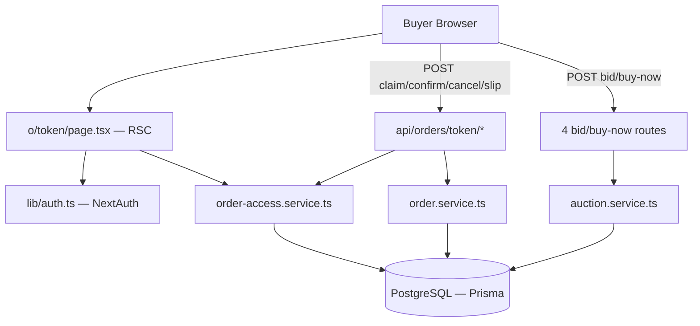
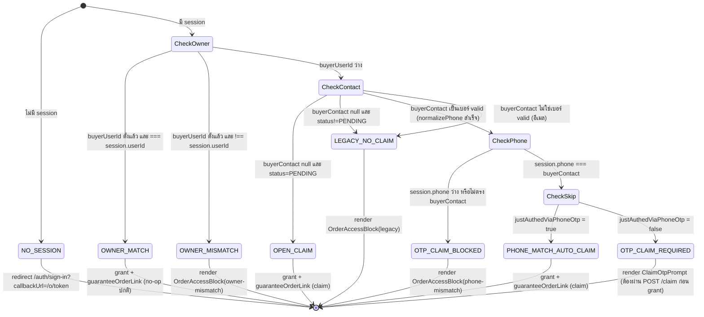
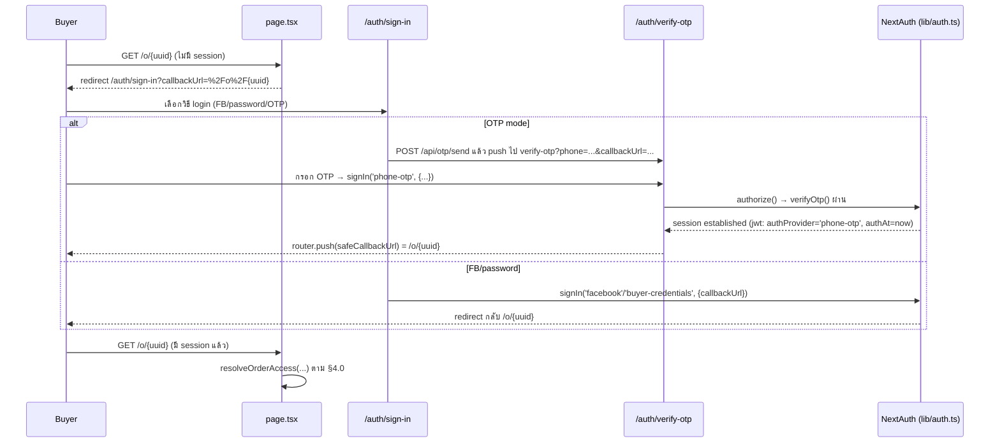
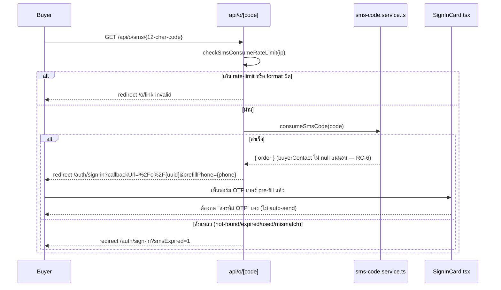
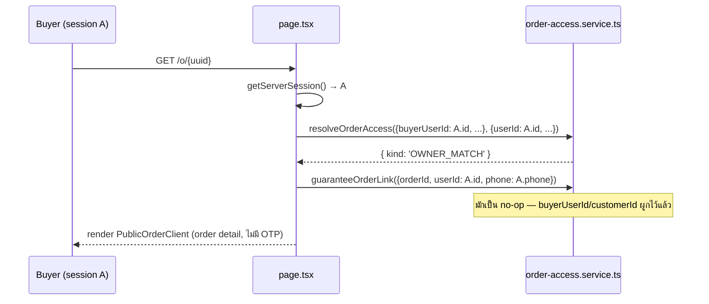
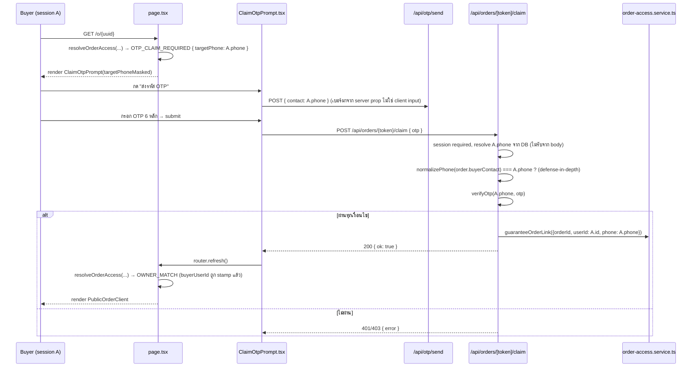
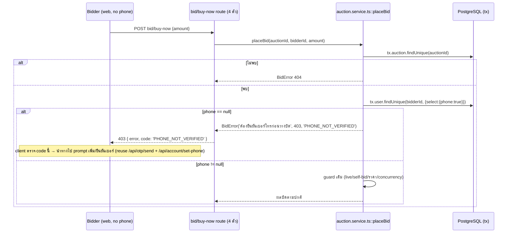
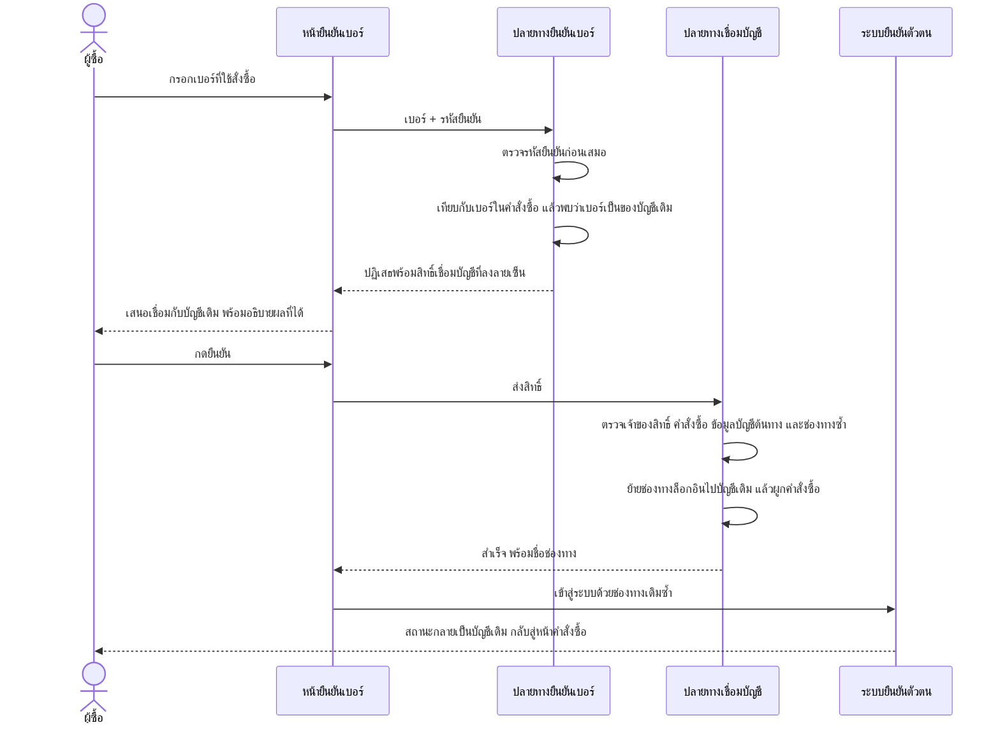

> **โมดูล:** M00015-OrderClaimForcedLogin
> **ประเภทเอกสาร:** System Design Spec (SDS)
> **เวอร์ชัน:** 1.1
> **วันที่จัดทำ:** 2026-07-07
> **สถานะ:** Draft
> **เจ้าของเอกสาร:** SA (ดู [[Feature-Docs-Ownership]])

# SDS: Order Claim & Forced Login (System Design Spec)

---

## 1. บทนำ & References

### 1.1 วัตถุประสงค์
เอกสารนี้ออกแบบ **การ implement จริง** ของ Order Claim & Forced Login ตาม [[SRS]] TFR-001…TFR-011: signature ของ function ใหม่/แก้ไข, sequence diagram ของทุก flow หลัก, และ **file-by-file change list** ที่ Controller ใช้ dispatch งานให้ `safepay-developer` ได้ทันที

### 1.2 ขอบเขตการออกแบบ
ในขอบเขต: `src/app/(marketing)/o/[token]/**`, `src/services/order-access.service.ts` (ใหม่), `src/services/order.service.ts`, `src/services/auction.service.ts`, `src/lib/auth.ts`, `src/lib/validations.ts`, `src/app/(marketing)/auth/sign-in/**`, `src/app/api/orders/**`, `src/app/api/o/sms/[code]/route.ts`, 4 bid/buy-now route, seller order-create form

นอกขอบเขต: pixel-level UI ของหน้าจอใหม่ (ต้องผ่าน `safepay-ux` ก่อน — เอกสารนี้ระบุแค่ prop contract/functional flow ที่ UI ต้องเรียกใช้)

### 1.3 เอกสารอ้างอิง

| เอกสาร | ความสัมพันธ์ |
|--------|-------------|
| [[SRS]] ของโมดูลนี้ | TFR-001…011 ที่ SDS นี้ realize |
| [[BRD]] ของโมดูลนี้ | FR-OCL-01…10 |
| `docs/conventions/rsc-mui-navigation.md` | ต้องใช้ LinkButton/LinkChip แทน `component={Link}` ใน server component ใด ๆ ที่แตะ (ไม่มีในฟีเจอร์นี้ — `page.tsx` ไม่ render Link โดยตรง) |

---

## 2. Architecture Overview

### 2.1 มุมมองสถาปัตยกรรม
Next.js 16 App Router — RSC สำหรับ access decision (server-only, ไม่มี client JS หนัก), client component เฉพาะส่วนที่ต้อง interactive (claim-OTP form, confirm/cancel button). Service layer แยกจาก API layer ตาม convention เดิมของโปรเจกต์ (`src/services/` ไม่ import จาก `src/app/api/`)



### 2.2 มุมมองการ Deploy
ไม่เปลี่ยน — Vercel serverless เดิม, Prisma connection pooling เดิม

---

## 3. Component Design

| Component | หน้าที่ (Responsibility) | Dependency |
|-----------|--------------------------|-----------|
| **`order-access.service.ts`** (ใหม่) | `resolveOrderAccess()` (pure) + `guaranteeOrderLink()` (I/O) — เดียวที่ตัดสิน+ผูกตัวตน | `src/lib/phone.ts`, `src/services/customer.service.ts`, Prisma |
| **`o/[token]/page.tsx`** | Discriminator + force-login redirect + orchestrate access decision + render ตาม decision | `next-auth`, `order-access.service.ts`, `order.service.ts::getOrderByToken` |
| **`ClaimOtpPrompt.tsx`** (ใหม่, client) | UI สำหรับ `OTP_CLAIM_REQUIRED` — เบอร์ fixed จาก prop, เรียก `/api/otp/send` แล้ว `/api/orders/[token]/claim` | `next-auth/react` ไม่ใช้ (ไม่ signIn ซ้ำ — แค่ verify claim) |
| **`OrderAccessBlock.tsx`** (แก้ไข) | เพิ่ม `reason: 'owner-mismatch' \| 'phone-mismatch' \| 'legacy'` prop → copy ต่างกัน 3 แบบ | ไม่เปลี่ยน dependency |
| **`PublicOrderClient.tsx`** (แก้ไข, ลดความซับซ้อนลงมาก) | ตัด stage `'lock'`, ตัด `PhoneUnlock`/`AccountPromptCard` ทั้งหมด — เหลือแค่ render `OrderDetailMobile` (เมื่อ grant) โดย confirm/cancel ไม่ส่ง `contact`/`smsUnlock` ใน body อีกต่อไป | — |
| **`api/orders/[token]/claim/route.ts`** (ใหม่) | รับ OTP, verify, เรียก `guaranteeOrderLink` | `lib/otp.ts::verifyOtp`, `order-access.service.ts` |
| **`auction.service.ts::placeBid`** (แก้ไข) | เพิ่ม phone-verified guard | Prisma tx เดิม |
| **`lib/auth.ts`** (แก้ไข) | เพิ่ม `token.authProvider`/`authAt` (jwt) + `session.user.justAuthedViaPhoneOtp` (session) | ไม่เปลี่ยน provider config |
| **`SignInCard.tsx`** (แก้ไข) | อ่าน `?prefillPhone=` → default OTP mode + defaultValue | — |
| **`SmsExpiredToast.tsx`** (ใหม่, client) | อ่าน `?smsExpired=1` → toast แจ้ง fallback | pattern เดียวกับ `OAuthErrorToast.tsx` |

---

## 4. Data Flow

### 4.0 `resolveOrderAccess()` — Signature และ Decision Table

```ts
// src/services/order-access.service.ts
export type OrderAccessInput = {
  orderId: string
  buyerUserId: string | null
  buyerContact: string | null   // raw จาก DB
  status: string                // 'PENDING' | 'SHIPPED' | 'CONFIRMED' | 'CANCELLED'
}

export type SessionInput = {
  userId: string | null         // null = ไม่มี session
  phone: string | null          // เบอร์ที่ resolve จาก DB ของ session user (null ถ้าไม่มี/ไม่มีเบอร์)
  justAuthedViaPhoneOtp: boolean
}

export type OrderAccessDecision =
  | { kind: 'NO_SESSION' }
  | { kind: 'OWNER_MATCH' }
  | { kind: 'OWNER_MISMATCH' }
  | { kind: 'OPEN_CLAIM' }
  | { kind: 'PHONE_MATCH_AUTO_CLAIM' }
  | { kind: 'OTP_CLAIM_REQUIRED'; targetPhone: string }
  | { kind: 'OTP_CLAIM_BLOCKED' }
  | { kind: 'LEGACY_NO_CLAIM' }

export function resolveOrderAccess(
  order: OrderAccessInput,
  session: SessionInput,
): OrderAccessDecision {
  if (!session.userId) return { kind: 'NO_SESSION' }

  if (order.buyerUserId != null) {
    return order.buyerUserId === session.userId
      ? { kind: 'OWNER_MATCH' }
      : { kind: 'OWNER_MISMATCH' }
  }

  if (order.buyerContact == null) {
    return order.status === 'PENDING'
      ? { kind: 'OPEN_CLAIM' }
      : { kind: 'LEGACY_NO_CLAIM' } // defensive — ไม่ควรเกิดตาม state machine ปัจจุบัน
  }

  const contactPhone = normalizePhone(order.buyerContact)
  if (!contactPhone) return { kind: 'LEGACY_NO_CLAIM' } // อีเมล/รูปแบบไม่ใช่เบอร์

  if (!session.phone || session.phone !== contactPhone) {
    return { kind: 'OTP_CLAIM_BLOCKED' }
  }

  return session.justAuthedViaPhoneOtp
    ? { kind: 'PHONE_MATCH_AUTO_CLAIM' }
    : { kind: 'OTP_CLAIM_REQUIRED', targetPhone: session.phone }
}
```

**State Diagram:**



### 4.1 `guaranteeOrderLink()` — Signature

```ts
// src/services/order-access.service.ts
export async function guaranteeOrderLink(params: {
  orderId: string
  userId: string
  phone: string | null
}): Promise<void> {
  try {
    if (!params.phone) return
    const normalized = normalizePhone(params.phone)
    if (!normalized) return

    await prisma.$transaction(async (tx) => {
      const customerId = await findOrCreateCustomer(tx, normalized) // reuse 00014
      const customer = await tx.customer.findUnique({ where: { id: customerId }, select: { userId: true } })

      if (customer && customer.userId == null) {
        try {
          await tx.customer.update({ where: { id: customerId }, data: { userId: params.userId } })
        } catch (e) {
          if (e instanceof Prisma.PrismaClientKnownRequestError && e.code === 'P2002') {
            console.error('[guaranteeOrderLink] Customer.userId conflict — ไม่ override', { customerId, userId: params.userId })
          } else throw e
        }
      } else if (customer && customer.userId !== params.userId) {
        console.error('[guaranteeOrderLink] Customer ผูกกับ user อื่นแล้ว — ไม่ override', { customerId, existingUserId: customer.userId })
      }

      await tx.order.updateMany({ where: { id: params.orderId, buyerUserId: null }, data: { buyerUserId: params.userId } })
      await tx.order.updateMany({ where: { id: params.orderId, customerId: null }, data: { customerId } })
    })
  } catch (e) {
    console.error('[guaranteeOrderLink] best-effort link failed', { orderId: params.orderId, userId: params.userId }, e)
  }
}
```

**หมายเหตุการออกแบบ:** ฟังก์ชันนี้รวมหน้าที่ "claim" (stamp `buyerUserId`) เข้ากับ "guarantee-link" ตาม BRD FR-OCL-07-AC-05 ที่ระบุชัดว่า guarantee-link ต้อง stamp `Order.buyerUserId` ถ้ายังว่าง — จึงไม่ต้องมีฟังก์ชัน `claimOrder()` แยกต่างหาก (ลด duplicate logic ระหว่าง 2 ฟังก์ชันที่ต้องเขียน field เดียวกัน)

### 4.2 Flow: Force-Login Round-Trip



### 4.3 Flow: SMS-code → Phone Pre-fill



**หมายเหตุ:** ไม่มี `Set-Cookie` อีกต่อไปในทุก branch ของ endpoint นี้ — ลบ import `SMS_UNLOCK_COOKIE`/`signSmsUnlock`

### 4.4 Flow: Logged-in Owner-Match (session ค้างอยู่, `buyerUserId` ตั้งแล้ว)



### 4.5 Flow: Logged-in OTP-Claim (session ค้างอยู่, `buyerUserId` ยังว่าง, เบอร์ตรง, นอก skip-window)



### 4.6 Flow: Bid Phone-Gate



**Grounding สำคัญ:** ทุก app-native user (Bearer token) ถูกสร้างผ่าน `POST /api/app/auth/verify-otp` → `upsertBuyerByPhone()` ซึ่งบังคับ `phone` เป็นคีย์เสมอ — **guard นี้จึงเป็น no-op เสมอสำหรับ 2 route ฝั่งแอป**; gap ที่ต้องมี prompt-UI จริง ๆ มีแค่ 2 route ฝั่งเว็บ (FB/LINE/IG signup ที่ยังไม่ตั้งเบอร์) — **ไม่ต้องสร้าง endpoint ใหม่ฝั่งแอป**

---

## 5. Integration Points

| จุดเชื่อม | ประเภท | Protocol/Contract | ความเสี่ยงเมื่อล่ม |
|-----------|--------|----------------------|---------------------|
| **`/api/otp/send`** (reuse) | internal | POST JSON `{contact, type:'phone'}` | rate-limit 3/10min ต่อเบอร์ shared กับ sign-in ปกติ — ยอมรับ |
| **`/api/account/set-phone`** (reuse) | internal | POST JSON `{phone, otp}` | ใช้เป็นปลายทางของ "prompt-to-verify-phone" บน bid flow ฝั่งเว็บ (ต้องสร้าง client component ใหม่ที่เรียก endpoint นี้ — ผ่าน `safepay-ux` gate ก่อน) |
| **`verifyOtp()` (`lib/otp.ts`)** (reuse) | internal | function call ตรง | attempts ≥3 หรือหมดอายุ → false (ไม่ throw) — caller (claim route) ต้องแปลงเป็น 401 |
| **`findOrCreateCustomer()` (00014)** (reuse) | internal | ต้องเรียกใน `$transaction` | P2002 race — already handled ภายในฟังก์ชันเดิม |
| **NextAuth JWT cookie** (แก้ไข) | internal | เพิ่ม field `authProvider`/`authAt` ใน token payload (encrypted, ไม่ expose raw ให้ client เห็นค่าตรง ๆ ยกเว้น derived boolean `justAuthedViaPhoneOtp`) | เพิ่ม field ใน JWT payload ไม่กระทบขนาด cookie อย่างมีนัยสำคัญ |

- **Timeout/Retry/Idempotency:** `guaranteeOrderLink` idempotent ตามออกแบบ §4.1; claim endpoint idempotent เมื่อ `buyerUserId` ตรงกับ session อยู่แล้ว (คืน 200 ok:true ทันทีไม่ต้อง verify OTP ซ้ำ — ดู API.md §4.3)
- **สัญญา API เต็ม:** ดู `API.md` ของโมดูลนี้

---

## 6. Technical Decisions

### TD-001: รวม "Claim" เข้ากับ "Guarantee Link" เป็นฟังก์ชันเดียว
- **ตัดสินใจ:** ไม่มี `claimOrder()` แยก — `guaranteeOrderLink()` ทำหน้าที่ stamp `buyerUserId` ด้วย
- **เหตุผล:** BRD FR-OCL-07-AC-05 ระบุชัดว่า guarantee-link ต้อง stamp `buyerUserId` — แยกฟังก์ชันจะ duplicate conditional-update logic บน field เดียวกัน
- **ทางเลือกที่ตัดทิ้ง:** แยก `claimOrder()` + `guaranteeOrderLink()` สองฟังก์ชัน — ตัดทิ้งเพราะเพิ่ม coupling (ต้องเรียกคู่กันเสมอ ไม่มี use-case ที่เรียกแยกจริง)
- **ผลกระทบ:** Developer เรียกฟังก์ชันเดียวจากทุก call site (page.tsx 3 จุด + claim route 1 จุด)

### TD-002: Skip-Window ผ่าน JWT field แทน query VerificationRecord
- **ตัดสินใจ:** เพิ่ม `token.authProvider`/`token.authAt` ใน jwt callback, คำนวณ `justAuthedViaPhoneOtp` boolean ใน session callback (window 5 นาที, ค่าคงที่ `PHONE_OTP_CLAIM_SKIP_WINDOW_MS` ใน `lib/auth.ts`)
- **เหตุผล:** ไม่เพิ่ม DB round-trip (JWT อยู่ใน cookie อยู่แล้ว), สอดคล้อง pattern เดิมของ `token.needsOnboarding`/`token.userId` ที่คำนวณใน jwt/session callback
- **ทางเลือกที่ตัดทิ้ง:** query `VerificationRecord.createdAt` ล่าสุดของ type PHONE_OTP — ตัดทิ้งเพราะต้อง query เพิ่มทุก request และไม่แม่นเท่า (VerificationRecord ถูกสร้างครั้งเดียวตอน signup ไม่ใช่ทุกครั้งที่ signIn ด้วย OTP ซ้ำ — จะ false-positive สำหรับ user เก่าที่เพิ่ง signIn ด้วย OTP แต่ record เก่ามาก)
- **ผลกระทบ:** ต้องแก้ `lib/auth.ts` jwt+session callback (additive, ไม่กระทบ field เดิม)

### TD-003: SMS-consume ล้มเหลว → sign-in เปล่า (ไม่ใช่ /o/link-invalid)
- **ตัดสินใจ:** ตาม instruction ของ Controller (PRD/BRD AC-03) — consume ล้มเหลว (expired/used/mismatch) → `redirect('/auth/sign-in?smsExpired=1')` แทน `/o/link-invalid`
- **เหตุผล:** "fall back to normal login, ไม่ hard-error" ตาม requirement ที่ user sign-off แล้ว
- **ทางเลือกที่ตัดทิ้ง:** คง `/o/link-invalid` เดิม (ตาม Mermaid diagram ใน BRD ซึ่งขัดกับ AC-03 prose) — ไม่เลือกเพราะ AC-03 prose คือ requirement ที่ signed-off จริง (diagram เป็นภาพประกอบที่คลาดเคลื่อน)
- **ผลกระทบ:** เพิ่ม component `SmsExpiredToast.tsx` (มิฉะนั้น buyer ไม่รู้ว่าเกิดอะไรขึ้น) — เป็น UX เสริมเล็กน้อย ไม่ผูกกับ order ใด ๆ (ไม่มี PII)

### TD-004: Downstream actions (confirm/cancel/slip) เปลี่ยนเป็น session+ownership check
- **ตัดสินใจ:** เลิกใช้ phone-contact parity เป็น authorization — ใช้ `session.user.id === order.buyerUserId` แทนทั้งหมด
- **เหตุผล:** Access Gate รับประกันแล้วว่า `buyerUserId` ตรงกับ session ก่อนที่ buyer จะเห็นปุ่มเหล่านี้ — การเช็ค phone ซ้ำที่ชั้น action เป็น redundant logic ที่เหลือจาก guest-model เดิม
- **ทางเลือกที่ตัดทิ้ง:** คง phone-parity ไว้เป็น defense-in-depth ชั้นที่สอง — ตัดทิ้งเพื่อความเรียบง่าย (ไม่ over-engineer) เพราะ session check แน่นกว่าอยู่แล้ว (server-verified JWT vs client-supplied string)
- **ผลกระทบ:** ลด client payload ของ confirm/cancel/slip (ไม่ต้องส่ง `contact`/`smsUnlock`), ลด code path ใน `order.service.ts`

---

## 7. Traceability

| SRS Requirement (TFR/NFR) | SDS Element | สถานะ |
|---------------------------|-------------|-------|
| TFR-001 | §4.2 Flow Force-Login Round-Trip | Draft |
| TFR-002 | TD-004, file-change list §8 | Draft |
| TFR-003 | §4.3 Flow SMS-code, TD-003 | Draft |
| TFR-004/005/006/008 | §4.0 `resolveOrderAccess` + state diagram | Draft |
| TFR-007 | §4.1 `guaranteeOrderLink`, TD-001 | Draft |
| TFR-009 | file-change list §8 (`validations.ts`, `OrderCreateForm.tsx`) | Draft |
| TFR-010 | §4.6 Flow Bid Phone-Gate | Draft |
| TFR-011 | TD-004, §4.5 | Draft |
| NFR-Security (PII gate) | §4.2 (order query ไม่ถูก serialize ก่อน decision) | Draft |

---

## 8. File-by-File Change List (สำหรับ Controller dispatch)

**ไฟล์ใหม่:**
- `src/services/order-access.service.ts` — `resolveOrderAccess()`, `guaranteeOrderLink()`
- `src/app/api/orders/[token]/claim/route.ts` — endpoint claim-OTP
- `src/app/(marketing)/o/[token]/ClaimOtpPrompt.tsx` — client component (ผ่าน `safepay-ux` ก่อน)
- `src/app/(marketing)/auth/sign-in/SmsExpiredToast.tsx` — client component เล็ก (pattern `OAuthErrorToast.tsx`)

**ไฟล์แก้ไข:**
- `src/app/(marketing)/o/[token]/page.tsx` — เรียก `resolveOrderAccess`/`guaranteeOrderLink`, redirect เมื่อไม่มี session, ลบ cookie-verify logic
- `src/app/(marketing)/o/[token]/PublicOrderClient.tsx` — ตัด stage `'lock'`, ตัด props `initialUnlocked`/`smsUnlocked`/`canPromptAccount`, confirm/cancel ไม่ส่ง `contact`
- `src/app/(marketing)/o/[token]/OrderAccessBlock.tsx` — เพิ่ม `reason` prop (3 variants)
- `src/services/order.service.ts` — `confirmOrder(publicToken, buyerUserId)` (ตัด `buyerContact` param, เพิ่ม `OrderOwnershipError`), `attachSlip(publicToken, fileId)` (ตัด `contact`), ลบ `checkOrderPhone()` (dead)
- `src/services/auction.service.ts` — `placeBid()` เพิ่ม phone guard, `BidError` เพิ่ม `code?: string` param
- `src/lib/auth.ts` — jwt callback เพิ่ม `token.authProvider`/`authAt`; session callback เพิ่ม `session.user.justAuthedViaPhoneOtp`
- `src/lib/validations.ts` — `CreateOrderSchema.buyerContact` required+regex; เพิ่ม `ClaimOrderSchema`; ลบ `ConfirmOrderSchema`/`UnlockOrderSchema` (dead หลังลบ route ที่ใช้)
- `src/app/api/o/sms/[code]/route.ts` — ตัด cookie set, เพิ่ม redirect prefill/`smsExpired`
- `src/app/api/orders/[token]/confirm/route.ts` — ตัด Path A/B, session+ownership เดียว
- `src/app/api/orders/[token]/cancel/route.ts` — buyer path เปลี่ยนเป็น session+ownership
- `src/app/api/orders/[token]/slip/route.ts` — ตัด `contact`/cookie, session+ownership
- `src/app/api/app/orders/[id]/confirm/route.ts` — เรียก `confirmOrder(token, auth.user.id)` (ตัด phone param)
- `src/app/api/auctions/[id]/bid/route.ts`, `src/app/api/app/auctions/[id]/bid/route.ts`, `src/app/api/auctions/[id]/buy-now/route.ts`, `src/app/api/app/auctions/[id]/buy-now/route.ts` — catch เพิ่ม `code: e.code` ใน response
- `src/app/(marketing)/auth/sign-in/SignInCard.tsx` — อ่าน `?prefillPhone=` → default OTP mode + defaultValue
- `src/app/(marketing)/auth/sign-in/page.tsx` — mount `SmsExpiredToast`
- `src/app/(paces)/seller/(dashboard)/orders/new/components/OrderCreateForm.tsx` — yup `buyerContact` required+regex
- `src/app/(paces)/seller/(dashboard)/orders/new/components/CustomerSelectBlock.tsx` — label/placeholder copy (เบอร์เท่านั้น)

**ไฟล์ลบ (dead code):**
- `src/lib/sms-unlock-cookie.ts`
- `src/app/(marketing)/o/[token]/PhoneUnlock.tsx`
- `src/app/(marketing)/o/[token]/AccountPromptCard.tsx`
- `src/app/api/orders/[token]/unlock/route.ts`
- `src/app/api/orders/[token]/buyer-phone/route.ts`

**Atomic-commit unit แนะนำ (สำหรับ Planner ต่อ):**
- Unit 1 (bundle): `order-access.service.ts` + `page.tsx` + `PublicOrderClient.tsx` + `OrderAccessBlock.tsx` + `ClaimOtpPrompt.tsx` + `claim/route.ts` + `lib/auth.ts` (ต้อง wire ครบพร้อมกัน tsc ถึงผ่าน — force-login gate ทั้งชุด)
- Unit 2 (bundle): `sms/[code]/route.ts` + `SignInCard.tsx` + `SmsExpiredToast.tsx` + `sign-in/page.tsx` (SMS pre-fill ทั้งชุด)
- Unit 3 (bundle): `order.service.ts` (confirmOrder/attachSlip) + `confirm/route.ts` + `cancel/route.ts` + `slip/route.ts` + `app/orders/[id]/confirm/route.ts` (downstream re-auth ทั้งชุด — ตัด Path A/B พร้อมกัน)
- Unit 4 (เดี่ยว, ไม่ผูกกับ unit อื่น): `validations.ts` + `OrderCreateForm.tsx` + `CustomerSelectBlock.tsx` (phone-required)
- Unit 5 (เดี่ยว): `auction.service.ts` + 4 bid/buy-now route (phone-verified bid gate)
- Unit 6 (cleanup, หลัง unit 1-3 merge แล้ว): ลบไฟล์ dead code ทั้งหมด

---

## 9. สรุป (Summary)

SDS นี้ออกแบบ Order Claim & Forced Login ด้วย pure-function decision core (`resolveOrderAccess`) แยกจาก I/O (`guaranteeOrderLink`), ลด client-side complexity ของ `/o/[token]` ลงมาก (ตัด PhoneUnlock/AccountPromptCard/lock-stage ทั้งหมดเพราะ force-login ย้ายความรับผิดชอบไปที่ redirect ระดับ server), และปิดช่องว่างตัวตนที่ auction bid gate โดยไม่ต้องสร้าง endpoint ใหม่ฝั่งแอป (ยืนยันจาก grounding ว่า app auth เป็น phone-only อยู่แล้ว)

**ลำดับการ build ที่แนะนำ:** Unit 1 (force-login core) → Unit 3 (downstream re-auth, ขึ้นกับ Unit 1 เพราะต้องมี `buyerUserId` ที่ guarantee ไว้แล้วก่อน confirm ทำงานถูกต้อง) → Unit 2 (SMS pre-fill, ขึ้นกับ Unit 1) → Unit 4/5 (independent, ทำคู่ขนานได้)

**Open Questions:**
- ค่า `PHONE_OTP_CLAIM_SKIP_WINDOW_MS` ที่แน่ชัด (เสนอ 5 นาที)
- UI ของ `ClaimOtpPrompt`/`OrderAccessBlock` 3 variants/prompt-to-verify-phone บน bid button — ส่งต่อ `safepay-ux` ก่อน developer เขียนโค้ด

---

## 10. ภาคผนวก — Phase 2 (2026-07-25)

### 10.1 ส่วนประกอบที่เพิ่ม

| ไฟล์ | หน้าที่ |
|---|---|
| `src/lib/account-merge-ticket.ts` | ออกและตรวจสิทธิ์เชื่อมบัญชี ลายเซ็น HMAC แยกโดเมนจากกลไกเชื่อมบัญชีเดิม |
| `src/app/api/orders/[token]/verify-phone/route.ts` | ยืนยันเบอร์ที่ใช้สั่งซื้อแล้วผูกเข้ากับตัวตน |
| `src/app/api/orders/[token]/link-account/route.ts` | ย้ายช่องทางล็อกอินไปยังบัญชีเดิม |
| `src/app/(marketing)/o/[token]/PhoneVerifyPrompt.tsx` | หน้ายืนยันเบอร์ รวมขั้นเสนอเชื่อมบัญชี |
| `src/app/(marketing)/auth/sign-in/OrderLinkShell.tsx` | เปลือกหน้าลิงก์คำสั่งซื้อ ภาพร้านเป็นภาพนำแล้วแผ่นเนื้อหาเลื่อนทับ |

### 10.2 ส่วนประกอบที่แก้

| ไฟล์ | การเปลี่ยนแปลง |
|---|---|
| `src/services/order-access.service.ts` | ยกเลิกสถานะเข้าถึงแบบเปิด เปลี่ยนสถานะที่เคยเป็นทางตันเป็นสถานะที่ไปต่อได้ |
| `src/services/order.service.ts` | เพิ่มการค้นข้อมูลสรุปสำหรับหน้าล็อกอิน พร้อมตัวแปลงที่อยู่รูปภาพ |
| `src/services/shop.service.ts` | คัดเฉพาะช่องที่อนุญาตก่อนปรับปรุงข้อมูลร้าน |
| `src/app/(marketing)/auth/sign-in/SignInCard.tsx` | สลับเปลือกตามที่มาของผู้ใช้ ส่วนเนื้อหาแบบฟอร์มใช้ร่วมกัน |
| `src/app/(paces)/seller/(dashboard)/shop/components/ShopForm.tsx` | เพิ่มการอัปโหลดภาพหน้าปก |
| `src/proxy.ts` | นำเส้นทางลิงก์คำสั่งซื้อออกจากรายการที่ถูกครอบด้วยเปลือกแอปมือถือ |

### 10.3 การตัดสินใจเชิงเทคนิค

**TD-20 ส่งต่อผลการพิสูจน์ด้วยสิทธิ์ที่ลงลายเซ็น แทนการขอรหัสยืนยันซ้ำ**
ในจังหวะที่ตรวจพบบัญชีเดิม ผู้ใช้เพิ่งพิสูจน์การครอบครองเบอร์ด้วยรหัสยืนยันไปแล้ว ซึ่งเป็นหลักฐานระดับเดียวกับที่ระบบใช้ตั้งรหัสผ่านใหม่ การขอซ้ำคือการพิสูจน์สิ่งเดิมสองรอบ ทางเลือกที่พิจารณาแล้วไม่เลือกคือให้ขอรหัสใหม่ ซึ่งเพิ่มความหงุดหงิดโดยไม่เพิ่มความปลอดภัย

**TD-21 ไม่ทำการเชื่อมผ่านการวนกลับของกระบวนการยืนยันตัวตนภายนอก**
กลไกเชื่อมบัญชีเดิมทำงานผ่านคุกกี้เจตนาแล้ววนผ่านผู้ให้บริการภายนอก แต่ที่นี่ช่องทางนั้นถูกผูกกับบัญชีต้นทางอยู่แล้ว กลไกเดิมจึงปฏิเสธด้วยกฎห้ามสลับบัญชี การย้ายที่ฝั่งเซิร์ฟเวอร์โดยตรงแล้วให้เข้าสู่ระบบซ้ำจึงตรงกว่าและตรวจสอบเงื่อนไขได้ครบกว่า

**TD-22 เปลือกแยกจากเนื้อหาแบบฟอร์ม**
หน้าล็อกอินมีสองหน้าตาแต่ตรรกะการเข้าสู่ระบบชุดเดียว จึงแยกเปลือกออกเป็นส่วนประกอบต่างหากและส่งเนื้อหาเข้าไป แทนการทำสองหน้าที่ต้องดูแลตรรกะซ้ำกันสองชุด

**TD-23 แปลงที่อยู่รูปภาพที่ชั้นบริการ ไม่ใช่ที่ชั้นแสดงผล**
ค่าที่เก็บมีสองรูปแบบปนกัน การแปลงที่จุดเดียวก่อนส่งออกทำให้ทุกผู้เรียกได้ค่าที่ใช้ได้ทันที และเป็นบทเรียนจากข้อผิดพลาดจริงในรอบนี้ที่เขียนแสดงรูปโดยสมมติว่าค่าที่เก็บเป็นที่อยู่เต็ม ทำให้รูปไม่ขึ้นทั้งหน้า

### 10.4 ลำดับเหตุการณ์ของการเชื่อมบัญชี


