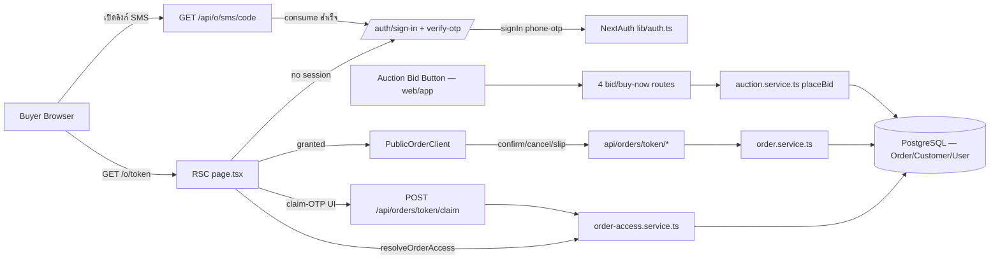
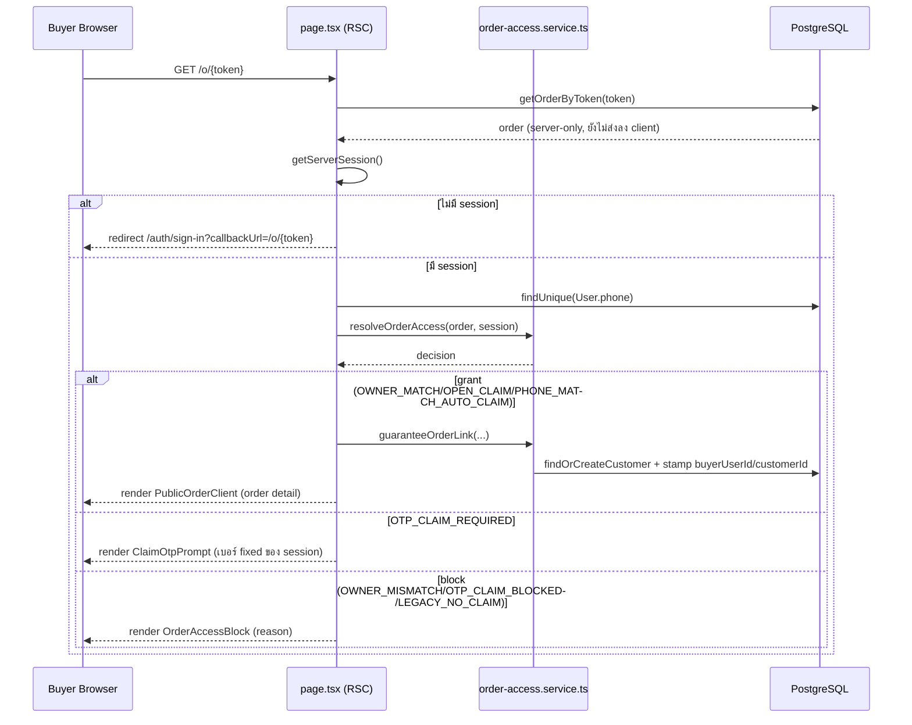
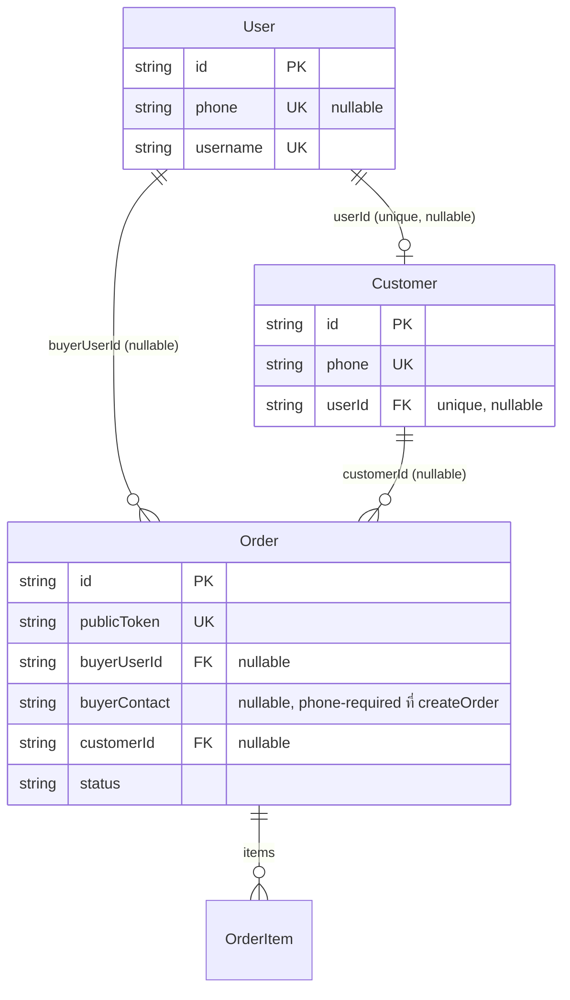

> **โมดูล:** M00015-OrderClaimForcedLogin
> **ประเภทเอกสาร:** Software Requirements Specification (SRS) — TECHNICAL
> **เวอร์ชัน:** 1.1
> **วันที่จัดทำ:** 2026-07-07
> **สถานะ:** Draft
> **เจ้าของเอกสาร:** SA (ดู [[Feature-Docs-Ownership]])

# SRS: Order Claim & Forced Login (Software Requirements Specification — Technical)

---

## 1. บทนำ (Introduction)

### 1.1 วัตถุประสงค์ของเอกสาร

เอกสารนี้แปลง Business Requirements ใน [[BRD]] (FR-OCL-01…10, BR-OCL-01…17) ให้เป็นข้อกำหนดเชิงเทคนิคที่ implement ได้ตรง: state machine ของ access gate, การเปลี่ยนแปลง routing/redirect, validation rules 2 ชั้น (yup/valibot), authorization matrix, enum/constant ที่ต้องใช้ และ data-touchpoints (อ่าน/เขียน field ไหนบ้าง — **ไม่มี schema change ใหม่** ตาม RD-7/RD-10 และ Out-of-Scope §5 ของ BRD; หากพบว่าจำเป็นต้องแตะ schema ระหว่าง implement ต้อง dispatch `safepay-database` ก่อน แต่ตามการวิเคราะห์โค้ดจริงในเอกสารนี้ **ไม่พบความจำเป็น**) ผู้อ่านหลักคือ Developer (`safepay-developer`), QA (`safepay-qa`), และ Reviewer (`safepay-reviewer`)

### 1.2 ขอบเขตเชิงระบบ (System Scope)

อยู่ในขอบเขต:
- Route/RSC page `src/app/(marketing)/o/[token]/page.tsx` และ client components ใต้โฟลเดอร์เดียวกัน (buyer/Vuexy)
- Route `src/app/api/o/sms/[code]/route.ts` (SMS short-code consume)
- Route group `src/app/api/orders/[token]/{confirm,cancel,slip,unlock,buyer-phone}/route.ts`
- Route `src/app/api/orders/route.ts` (POST create — validation layer เท่านั้น)
- Service `src/services/order.service.ts`, `src/services/auction.service.ts` (`placeBid`), และ service ใหม่ `src/services/order-access.service.ts`
- NextAuth config `src/lib/auth.ts` (jwt/session callback — เพิ่ม field ใหม่บน token/session เท่านั้น ไม่แตะ provider เดิม)
- Frontend auth pages `src/app/(marketing)/auth/sign-in/*` (เพิ่ม pre-fill parameter)
- 4 bid/buy-now route: `src/app/api/auctions/[id]/{bid,buy-now}/route.ts`, `src/app/api/app/auctions/[id]/{bid,buy-now}/route.ts`
- Seller order-create form: `src/app/(paces)/seller/(dashboard)/orders/new/components/{OrderCreateForm,CustomerSelectBlock}.tsx`, `src/lib/validations.ts`

นอกขอบเขตเชิงระบบ (อ้างอิง BRD §5/§7):
- Prisma schema/migration ใหม่ — ไม่มี
- UI visual redesign เต็มรูปแบบของ `/o/[token]` (เป็น deliverable ของ `safepay-ux` แยก ตาม Hard Rule 8) — เอกสารนี้กำหนด **contract ที่ frontend ต้องเรียกใช้** เท่านั้น
- Analytics dashboard ของ claim funnel
- Redis-backed rate-limit (ยังเป็น in-memory globalThis ตามเดิม — known-gap ที่ยอมรับแล้วจาก Phase ก่อนหน้า)

### 1.3 เอกสารอ้างอิง (References)

| เอกสาร | ความสัมพันธ์ |
|--------|-------------|
| [[PRD]] ของโมดูลนี้ | เป้าหมายธุรกิจ/KPI/personas ที่มาของ requirement |
| [[BRD]] ของโมดูลนี้ | FR-OCL-01…10, BR-OCL-01…17, Resolved Decisions RD-1…RD-10 — ทุก TFR ในเอกสารนี้ trace กลับ |
| `docs/SRS.md` §FR-6.3 | "Confirm = phone-unlock" เดิม — **ถูกแทนที่ทั้งหมด** ด้วย force-login + owner/OTP-claim gate (TFR-005/006/011) |
| `docs/SRS.md` §FR-6.8 | "SMS Order Link phone-bound auto-unlock" เดิม — **ถูกลดบทบาท** เหลือ pre-fill เท่านั้น (TFR-003) |
| `docs/SRS.md` §FR-8.1-8.4 | Buyer History Linking เดิม (`linkBuyerHistory`) — ฟีเจอร์นี้ **ต่อยอด** ด้วย Guarantee Link (TFR-007) ที่ wire `Customer.userId` ซึ่งเดิมเป็น Phase-2 stub ที่ไม่เคยถูกเขียนจริง |
| `docs/20 - Features/00014 - Customer Directory/{SRS,SDS}.md` | ที่มาของ `Customer` model, `findOrCreateCustomer`, `normalizePhone` ที่ฟีเจอร์นี้ reuse ตรง ๆ |

### 1.4 นิยามและตัวย่อ (Definitions & Acronyms)

| คำ/ตัวย่อ | ความหมาย |
|-----------|----------|
| **Access Gate** | ขั้นตอนตัดสินสิทธิ์เข้าถึงออเดอร์ที่ทำใน `resolveOrderAccess()` — pure function, ไม่มี I/O |
| **Guarantee Link** | ฟังก์ชัน `guaranteeOrderLink()` — best-effort/idempotent ผูก `Customer`+`Customer.userId`+`Order.buyerUserId`+`Order.customerId` (รวม "claim" ด้วย ตาม BRD FR-OCL-07-AC-05 ที่ระบุว่า guarantee-link ทำหน้าที่ stamp buyerUserId ด้วย) |
| **Owner-Match** | `order.buyerUserId` ตั้งแล้วและ `=== session.user.id` |
| **Claim-OTP** | การยืนยัน OTP ที่ผูกกับเบอร์ของบัญชีที่ login อยู่ (fixed, ไม่มีช่องกรอกอิสระ) เพื่อ claim ออเดอร์ที่ `buyerUserId` ยังว่าง |
| **Skip-Window** | ช่วงเวลา (5 นาที) หลัง sign-in ด้วย `phone-otp` ที่ระบบข้าม claim-OTP ซ้ำได้ถ้าเบอร์ตรงกับ `order.buyerContact` |
| **PII gate** | หลักการห้ามสร้าง/ส่งข้อมูลออเดอร์ (`PublicOrderData`) ลง RSC flight ก่อนตัดสินสิทธิ์สำเร็จ (ต่อยอดจาก RSC PII leak fix เดิมของ feature Seller Orders Phase B) |

---

## 2. ภาพรวมสถาปัตยกรรม (Architecture Overview)

### 2.1 บริบทระบบ (System Context)



### 2.2 องค์ประกอบหลัก (Components)

| Component | หน้าที่ | Submodule / Stack |
|-----------|---------|-------------------|
| **`o/[token]/page.tsx`** | RSC — discriminator (UUID/SMS-code/short-code/invalid), force-login redirect, เรียก `resolveOrderAccess`, เรียก `guaranteeOrderLink` เมื่อ grant, สร้าง `PublicOrderData` เฉพาะเมื่อ grant | Next.js 16 App Router RSC (Vuexy `(marketing)`) |
| **`order-access.service.ts`** (ใหม่) | `resolveOrderAccess()` (pure decision) + `guaranteeOrderLink()` (best-effort DB write) | `src/services/` (TypeScript, ไม่มี framework ใหม่) |
| **`order.service.ts`** | `confirmOrder`/`cancelOrder`/`attachSlip` — เปลี่ยนจาก phone-contact parity → session/`buyerUserId` ownership check | `src/services/` |
| **`auction.service.ts`** | `placeBid()` — เพิ่ม phone-verified guard ก่อน guard อื่นทั้งหมด | `src/services/` |
| **`lib/auth.ts`** | NextAuth callbacks — เพิ่ม `token.authProvider`/`token.authAt` (jwt) และ `session.user.justAuthedViaPhoneOtp` (session) | NextAuth v4 JWT strategy |
| **`api/o/sms/[code]/route.ts`** | เปลี่ยนจาก set signed cookie → redirect ไป sign-in พร้อม pre-fill/callbackUrl หรือ `smsExpired=1` | Route Handler (nodejs runtime) |
| **`api/orders/[token]/claim/route.ts`** (ใหม่) | Endpoint ใหม่สำหรับ interactive Claim-OTP | Route Handler |

### 2.3 มุมมองการ Deploy (Deployment View)

ไม่มีการเปลี่ยนแปลง — ยังเป็น Vercel serverless (Next.js 16), Postgres/Supabase เดิม, rate-limit ยังเป็น in-memory `globalThis` per-instance (known-gap เดิม, ไม่ใช่ scope ของฟีเจอร์นี้ที่จะแก้)

---

## 3. ข้อกำหนดเชิงฟังก์ชันเชิงเทคนิค (Technical Functional Requirements)

### TFR-001: Force Login Gate ที่ `/o/{token}`
- **Trace to:** FR-OCL-01
- **คำอธิบายเชิงเทคนิค:** ใน UUID branch ของ `page.tsx`, ก่อนสร้าง `PublicOrderData` ใด ๆ ต้อง `getServerSession(authOptions)` — ถ้า `null` → `redirect('/auth/sign-in?callbackUrl=' + encodeURIComponent('/o/' + token))` ทันที (Next.js `redirect()` throw — ไม่มี object ใด ๆ ถูก serialize ก่อนหน้านั้นนอกจาก order query ฝั่ง server ที่ไม่เคยถูกส่งเข้า JSX)
- **Precondition:** token match `UUID_V4_RE`, order query (`getOrderByToken`) คืนค่าไม่ null (ถ้า null → `notFound()` เดิม ไม่เปลี่ยน)
- **Postcondition:** ไม่มี session → 100% redirect ไป sign-in; มี session → ไปต่อ TFR-005/006/008
- **Error/Edge cases:** ครอบคลุมทุกสถานะออเดอร์ (PENDING/SHIPPED/CONFIRMED/CANCELLED) เหมือนกันหมด — ไม่มี branch แยกตามสถานะในขั้นนี้

### TFR-002: ลบ Guest-Bypass (SMS auto-unlock cookie)
- **Trace to:** FR-OCL-02
- **คำอธิบายเชิงเทคนิค:** ลบไฟล์ `src/lib/sms-unlock-cookie.ts` และทุก import ของมัน (`page.tsx`, `confirm/route.ts`, `slip/route.ts`, `buyer-phone/route.ts` — ไฟล์หลังถูกลบทั้งไฟล์). ลบ Path A (cookie branch) ออกจาก `confirm`/`slip` route ทั้งหมด — แทนที่ด้วย session+ownership check (ดู TFR-011)
- **Precondition:** ไม่มี route ใดเหลือ reference ถึง `SMS_UNLOCK_COOKIE`/`verifySmsUnlock`/`signSmsUnlock`
- **Postcondition:** ไม่มี cookie ใดในระบบให้สิทธิ์เข้าถึงออเดอร์โดยไม่ผ่านบัญชีจริง
- **Error/Edge cases:** `checkOrderPhone()` และ endpoint `POST /api/orders/[token]/unlock` ไม่มี caller เหลือ (PhoneUnlock.tsx ถูกลบ — TFR-005/006) → ลบทั้งฟังก์ชัน+route (dead code)

### TFR-003: SMS Short-code → Phone Pre-fill Redirect
- **Trace to:** FR-OCL-03
- **คำอธิบายเชิงเทคนิค:** `GET /api/o/sms/[code]` คง rate-limit (`checkSmsConsumeRateLimit`) + format check + `consumeSmsCode(code)` เหมือนเดิมทั้งหมด (single-use, RC-1/RC-2/RC-6/RC-8 ไม่เปลี่ยน) เปลี่ยนเฉพาะ**ผลลัพธ์เมื่อสำเร็จ**: แทนที่ `res.cookies.set(...)` ด้วย `NextResponse.redirect` ไปยัง `/auth/sign-in?callbackUrl=%2Fo%2F{order.publicToken}&prefillPhone={result.order.buyerContact}`. เมื่อ **consume ล้มเหลว** (ไม่พบ/หมดอายุ/ใช้แล้ว/phone-mismatch) — เปลี่ยนจาก redirect `/o/link-invalid` เดิม → redirect `/auth/sign-in?smsExpired=1` (ไม่มี `callbackUrl`/`prefillPhone` เพราะ resolve order ไม่ได้). rate-limit เกิน / format ผิด — **คงเดิม** redirect `/o/link-invalid` (ไม่ต้อง resolve order เลย จึงไม่มีข้อมูลให้ fallback ไปที่ sign-in ได้อย่างมีความหมาย และเป็น uniform-error เดิมที่ปลอดภัยกว่า)
- **Precondition:** `result.order.buyerContact` ไม่ null เสมอเมื่อ consume สำเร็จ (RC-6 lock-in รับประกัน)
- **Postcondition:** buyer เห็นฟอร์ม OTP ที่เบอร์ถูกกรอกไว้แล้ว แต่ยังต้องกด "ขอ OTP" + กรอกรหัสเอง (ไม่ auto-authenticate)
- **Error/Edge cases:** ถ้า `prefillPhone` ไม่ผ่าน `^0[0-9]{9}$` ที่ SignInCard (ไม่ควรเกิดเพราะมาจาก `Order.buyerContact` ที่ผ่าน validation ตอนสร้างแล้ว) → SignInCard treat เหมือนไม่มี pre-fill (defensive, ไม่ throw)

### TFR-004: Runtime Derivation (ไม่มี field ใหม่)
- **Trace to:** FR-OCL-04
- **คำอธิบายเชิงเทคนิค:** `resolveOrderAccess()` รับ input ที่ query สดทุกครั้ง (`order.buyerUserId`, `order.buyerContact`, `order.status`, `session.user.id`, session user's `phone` ที่ query แยกจาก DB — ตาม pattern เดิมที่ `page.tsx` ทำอยู่แล้ว) ไม่มี cache/persist ผลการตัดสินใจ
- **Precondition:** —
- **Postcondition:** เรียกซ้ำกี่ครั้งในสถานะ DB เดียวกัน ได้ผลลัพธ์เดียวกันเสมอ (pure function — unit-testable โดยไม่ต้อง mock DB)
- **Error/Edge cases:** ไม่มี Prisma migration ใหม่ (validate โดย DATABASE.md — ในกรณีนี้ไม่ต้อง dispatch `safepay-database` เพราะไม่แตะ schema)

### TFR-005: Owner-Match Gate (`buyerUserId`)
- **Trace to:** FR-OCL-05
- **คำอธิบายเชิงเทคนิค:** ใน `resolveOrderAccess()`, ถ้า `order.buyerUserId != null`:
  - `order.buyerUserId === session.userId` → decision `OWNER_MATCH` (grant, ไม่ต้อง OTP)
  - ไม่ตรง → decision `OWNER_MISMATCH` (block, render `OrderAccessBlock` reason=`owner-mismatch`)
  ไม่มีการตรวจ email/`Customer.userId` แยกในขั้นนี้เลย — `buyerUserId` เป็น single source of truth
- **Precondition:** `session.userId` resolve จาก `getServerSession` แล้ว (ไม่ trust ค่าจาก client)
- **Postcondition:** `OWNER_MATCH` → เรียก `guaranteeOrderLink()` ทันที (มักเป็น no-op เพราะผูกไว้แล้ว)
- **Error/Edge cases:** ครอบคลุมทั้ง auction-win (`settleAuctionCore` เซ็ต `buyerUserId=winner.bidderId` ตั้งแต่ต้น) และเคย claim ผ่าน claim-OTP มาก่อน — decision logic เดียวกันหมด ไม่แยก branch

### TFR-006: Phone-OTP Claim Fallback (No Identity Switch)
- **Trace to:** FR-OCL-06
- **คำอธิบายเชิงเทคนิค:** เมื่อ `order.buyerUserId == null`:
  1. `order.buyerContact` ผ่าน `normalizePhone()` ไม่ได้ (null/อีเมล) → decision `LEGACY_NO_CLAIM` (เว้นแต่เข้าเงื่อนไข TFR-008)
  2. `normalizePhone(order.buyerContact)` ได้ค่า (`contactPhone`) แต่ `session.phone == null` หรือ `session.phone !== contactPhone` → decision `OTP_CLAIM_BLOCKED`
  3. `session.phone === contactPhone` และ `session.justAuthedViaPhoneOtp === true` (skip-window) → decision `PHONE_MATCH_AUTO_CLAIM` (grant ทันที ไม่ขอ OTP ซ้ำ)
  4. `session.phone === contactPhone` และไม่เข้าเงื่อนไข skip → decision `OTP_CLAIM_REQUIRED` (render claim-OTP prompt; ต้องยิง `POST /api/orders/[token]/claim` ให้สำเร็จก่อนจึง grant)
  ทุกกรณีที่ decision เป็น block (`OTP_CLAIM_BLOCKED`) render `OrderAccessBlock` reason=`phone-mismatch` — ห้ามมี input พิมพ์เบอร์อิสระในหน้านี้เด็ดขาด (เบอร์ที่ใช้ยืนยันคือเบอร์ของ `session.user` เท่านั้น, resolve จาก DB ฝั่ง server, ไม่รับจาก client)
- **Precondition:** `session.phone` resolve จาก `prisma.user.findUnique({where:{id:session.userId},select:{phone:true}})` (pattern เดิม)
- **Postcondition:** `PHONE_MATCH_AUTO_CLAIM`/สำเร็จผ่าน claim endpoint → `guaranteeOrderLink()` stamp `Order.buyerUserId = session.userId` (ไม่ override ถ้ามีค่าแล้ว — กัน race)
- **Error/Edge cases:** race ระหว่าง 2 claim attempt พร้อมกัน (rare, session เดียวไม่ควรเกิด) → conditional update (`WHERE buyerUserId IS NULL`) กัน overwrite ผิด — attempt ที่สองเป็น no-op (idempotent), ไม่ error

### TFR-007: Guarantee Link (Best-Effort, Idempotent)
- **Trace to:** FR-OCL-07
- **คำอธิบายเชิงเทคนิค:** `guaranteeOrderLink({orderId, userId, phone})`:
  1. ถ้า `phone` เป็น null หรือ `normalizePhone(phone)` ล้มเหลว → return ทันที (no-op, ไม่มีเบอร์ให้ผูก)
  2. `$transaction`: `findOrCreateCustomer(tx, normalizedPhone)` (reuse feature 00014) → ถ้า `Customer.userId == null` → `update` เป็น `userId`; ถ้า P2002 (unique conflict — user นี้ผูกกับ Customer อื่นอยู่แล้ว) → catch, log, ไม่ throw; ถ้า `Customer.userId` เป็นคนอื่น → log, ไม่ override
  3. `order.updateMany({where:{id:orderId, buyerUserId:null}, data:{buyerUserId:userId}})` + `order.updateMany({where:{id:orderId, customerId:null}, data:{customerId}})` — 2 conditional update แยกกัน เพื่อ idempotent ระดับ field
  4. ทั้งฟังก์ชันห่อด้วย `try/catch` ชั้นนอกสุด — error ใด ๆ → `console.error` แล้ว **return เฉย ๆ ไม่ throw** (caller ไม่ต้อง try/catch เอง)
- **Precondition:** เรียกหลังตัดสินสิทธิ์สำเร็จเท่านั้น (`OWNER_MATCH`/`OPEN_CLAIM`/`PHONE_MATCH_AUTO_CLAIM`/claim endpoint สำเร็จ)
- **Postcondition:** idempotent เรียกซ้ำได้ไม่จำกัดโดยไม่มี error/ข้อมูลซ้ำ
- **Error/Edge cases:** `Customer.userId` เป็น `@unique` — ถ้า session user เคยผูกกับ Customer คนละเบอร์มาก่อน (ทางทฤษฎี ไม่ควรเกิดเพราะ `User.phone` unique + phone immutable) → P2002 ถูก catch แล้ว log ไว้ ไม่ทำให้ flow หลักพัง

### TFR-008: Unclaimed Order — First-Claim-Wins
- **Trace to:** FR-OCL-08
- **คำอธิบายเชิงเทคนิค:** ใน `resolveOrderAccess()`, `order.buyerUserId == null` และ `order.buyerContact == null` และ `order.status === 'PENDING'` → decision `OPEN_CLAIM` (grant ทันที ไม่ต้อง OTP) — ตรวจก่อน `LEGACY_NO_CLAIM` เสมอ (ลำดับความสำคัญ: `buyerContact===null && PENDING` มาก่อน "ไม่ผ่าน normalizePhone")
- **Precondition:** —
- **Postcondition:** grant + `guaranteeOrderLink({orderId, userId:session.userId, phone:session.phone ?? null})` (ถ้า session ไม่มีเบอร์ → no-op ที่ guarantee-link ตาม TFR-007 ข้อ 1)
- **Error/Edge cases:** ออเดอร์ที่ `buyerContact==null` แต่สถานะไม่ใช่ `PENDING` (ไม่ควรเกิดตาม state machine ปัจจุบัน) → ตกไปที่ `LEGACY_NO_CLAIM` (defensive, ไม่ crash)

### TFR-009: Phone-Required at Order Creation (2-Layer Validation)
- **Trace to:** FR-OCL-09
- **คำอธิบายเชิงเทคนิค:**
  - **Backend** (`src/lib/validations.ts`, `CreateOrderSchema`): เปลี่ยน `buyerContact: v.optional(v.string())` → `buyerContact: v.pipe(v.string(), v.regex(/^0[0-9]{9}$/, 'buyerContact ต้องเป็นเบอร์โทรไทย 10 หลัก ขึ้นต้นด้วย 0'))` (required, ไม่ optional อีกต่อไป)
  - **Frontend** (`OrderCreateForm.tsx`, yup `schema.buyerContact`): เปลี่ยนจาก `.optional().test('phone-or-email', ...)` → `.required('กรุณากรอกเบอร์โทรลูกค้า').matches(/^0[0-9]{9}$/, 'ต้องเป็นเบอร์ไทย 10 หลัก (0xxxxxxxxx)')`
  - ทั้งสอง schema ใช้ **pattern เดียวกันเป๊ะ** `^0[0-9]{9}$` (SSOT เดียวกับ `normalizePhone`/`toE164Thai`)
  - **ไม่กระทบ** `createOrder()` service — logic derive `customerId` จาก `normalizePhone(data.buyerContact)` เดิมยังทำงานเหมือนเดิม (ตอนนี้ `normalizePhone` จะสำเร็จเสมอเพราะ input ผ่าน regex แล้ว)
- **Precondition:** —
- **Postcondition:** ทุกออเดอร์ manual-create ใหม่มี `Order.buyerContact` เป็นเบอร์ valid เสมอ
- **Error/Edge cases:** ออเดอร์ auction-win **ไม่ผ่าน** schema นี้ (สร้างผ่าน `settleAuctionCore` โดยตรง ไม่ผ่าน `POST /api/orders`) — ไม่กระทบ

### TFR-010: Phone-Verified Bid Gate
- **Trace to:** FR-OCL-10
- **คำอธิบายเชิงเทคนิค:** ใน `placeBid(auctionId, bidderId, amount)` (`src/services/auction.service.ts`), เพิ่ม guard ทันทีหลัง auction not-found check (บรรทัด `if (!a) throw ...`) และ**ก่อน** guard สถานะ live/self-bid/ราคา:
  ```
  const bidder = await tx.user.findUnique({ where: { id: bidderId }, select: { phone: true } })
  if (!bidder?.phone) throw new BidError('ต้องยืนยันเบอร์โทรก่อนวางบิด', 403, 'PHONE_NOT_VERIFIED')
  ```
  `BidError` ต้องเพิ่ม optional param ที่ 3: `constructor(message: string, readonly status: number, readonly code?: string)`. 4 route handler (`bid`×2, `buy-now`×2) ต้อง include `code` ใน JSON response: `{ error: e.message, code: e.code }`
- **Precondition:** เช็คภายใน `$transaction` เดียวกับ guard อื่น (ไม่เปิด tx แยก)
- **Postcondition:** ผู้ชนะ auction ทุกคน (`winner.bidderId` ที่กลายเป็น `Order.buyerUserId` ใน `settleAuctionCore`) มี `User.phone != null` เสมอ
- **Error/Edge cases:** **Native app finding (ยืนยันจากโค้ด):** ทุกบัญชีที่มี app Bearer token ถูกสร้างผ่าน `POST /api/app/auth/verify-otp` → `upsertBuyerByPhone()` ซึ่งบังคับ `phone` เป็น primary key ของ user เสมอ (ไม่มี endpoint อื่นออก app token ได้) → **guard นี้เป็น no-op เสมอสำหรับผู้ใช้แอป** (ไม่มีทางที่ app user จะไม่มี phone) ช่องว่างจริงมีแค่ฝั่งเว็บ (`POST /api/auctions/[id]/bid`, `/buy-now`) สำหรับบัญชีที่ signup ผ่าน Facebook/LINE/Instagram โดยไม่เคยผ่าน `/api/account/set-phone` — **ไม่ต้องสร้าง endpoint ใหม่ฝั่งแอป** ตามที่ BRD ตั้งคำถามไว้ (§3.11) เพราะ gap ไม่มีอยู่จริงในทางปฏิบัติ; ฝั่งเว็บต้องมี prompt-to-verify UI (ดู SDS §3, Integration Point ใหม่ — ผ่าน `safepay-ux` gate)

### TFR-011: Downstream Action Re-Authorization (confirm/cancel/slip)
- **Trace to:** FR-OCL-02 (ผลข้างเคียงบังคับจากการลบ guest-bypass), FR-OCL-05/06 (สอดคล้องกับ access model ใหม่)
- **คำอธิบายเชิงเทคนิค:** เนื่องจากทุก buyer ที่เห็นปุ่ม confirm/cancel/attach-slip ผ่าน Access Gate มาแล้ว (`Order.buyerUserId` ถูก guarantee ให้ตรงกับ session เสมอ) จึง**เลิกใช้ phone-contact parity เป็น authorization mechanism**:
  - `confirmOrder(publicToken, buyerUserId)` — เปลี่ยน signature (ตัด `buyerContact` param), เช็ค `order.buyerUserId !== buyerUserId` → throw `OrderOwnershipError` (ใหม่, mapped → 403); ไม่ update `buyerContact` อีกต่อไป (เดิม overwrite ทุกครั้งซึ่งไม่จำเป็นแล้ว เพราะ buyerContact ถูก set ที่ต้นทาง/claim-time แล้ว)
  - `cancelOrder` — logic การหา `initiator` ย้ายมาอยู่ที่ route (`isOwner` เดิมสำหรับ seller คงไว้; buyer path เปลี่ยนจาก phone-parity → `session.user.id === order.buyerUserId`)
  - `attachSlip(publicToken, fileId)` — ตัด `contact` param; ownership check ทำที่ route (`session.user.id === order.buyerUserId`) ก่อนเรียก service
- **Precondition:** route ต้อง `getServerSession` ก่อนเสมอ (401 ถ้าไม่มี session — ยกเว้น cancel ฝั่ง seller ที่ยังไม่ต้องมี buyer session)
- **Postcondition:** ไม่มี route ใดรับ/parse `contact`/`smsUnlock` จาก client อีกต่อไป
- **Error/Edge cases:** app route `POST /api/app/orders/[id]/confirm` ต้องอัปเดตเรียก `confirmOrder(token, auth.user.id)` (ตัด `auth.user.phone` param) — `getOrderTokenForBuyer` ที่เรียกก่อนหน้าอยู่แล้วก็ scope ด้วย `buyerUserId` เหมือนกัน (double-guard)

---

## 4. ข้อกำหนดส่วนต่อประสาน (Interface / API Specification)

สัญญาเต็มอยู่ใน `API.md` ของโมดูลนี้ — สรุปเฉพาะ endpoint ที่เปลี่ยน:

### 4.1 API Endpoints (สรุป)

| Method | Path | คำอธิบาย | Auth |
|--------|------|----------|------|
| GET | `/o/{token}` | RSC — force-login gate + access resolve | NextAuth session (optional เข้าเพื่อตรวจ) |
| GET | `/api/o/sms/{code}` | Consume SMS short-code → redirect pre-fill/expired | Public (rate-limited) |
| POST | `/api/orders/{token}/claim` | **ใหม่** — ยืนยัน claim-OTP | NextAuth session (required) |
| POST | `/api/orders/{token}/confirm` | ยืนยันคำสั่งซื้อ | NextAuth session (required) |
| POST | `/api/orders/{token}/cancel` | ยกเลิกคำสั่งซื้อ | NextAuth session (seller: required; buyer: required — ไม่มี guest อีกต่อไป) |
| POST | `/api/orders/{token}/slip` | แนบสลิป | NextAuth session (required) |
| ~~POST /api/orders/{token}/unlock~~ | ลบ (dead code) | — | — |
| ~~GET /api/orders/{token}/buyer-phone~~ | ลบ (dead code) | — | — |
| POST | `/api/orders` | สร้างออเดอร์ (seller) | NextAuth session — validation `buyerContact` required |
| POST | `/api/auctions/{id}/bid`, `/api/app/auctions/{id}/bid`, `/api/auctions/{id}/buy-now`, `/api/app/auctions/{id}/buy-now` | วางบิด/ซื้อทันที | Session/Bearer — เพิ่ม error `PHONE_NOT_VERIFIED` |

### 4.2 Sequence ของ flow สำคัญ (ตัวอย่างหนึ่งเดียว — ที่เหลือดู SDS §4)



---

## 5. ข้อกำหนดด้านข้อมูล (Data Requirements)

### 5.1 Data Model / Entities (ไม่มี field ใหม่)

| Entity | Field ที่แตะ | อ่าน/เขียน |
|--------|-------------|-----------|
| **Order** | `buyerUserId` | อ่าน (access gate) + เขียน (guarantee-link, conditional `WHERE buyerUserId IS NULL`) |
| **Order** | `buyerContact` | อ่าน (access gate + confirm เดิม) — **เขียนเฉพาะที่ `createOrder`** (ไม่เขียนที่ `confirmOrder` อีกต่อไป — TFR-011) |
| **Order** | `customerId` | อ่าน/เขียน (guarantee-link, conditional) |
| **Order** | `status` | อ่านเท่านั้น (unclaimed check, ไม่เขียนใน access gate) |
| **Customer** | `phone` | อ่าน (findOrCreateCustomer key) |
| **Customer** | `userId` (`@unique`) | อ่าน/เขียน (guarantee-link, conditional, ไม่ override) |
| **User** | `phone` | อ่าน (access gate session-phone resolve, bid-gate) |
| **VerificationRecord** | — | ไม่แตะโดยตรง (guard ใช้ `User.phone` เป็น proxy ตามที่วิเคราะห์แล้วว่า phone ตั้งได้แค่ 2 ทางที่ทั้งคู่ผ่าน `verifyOtp()` เสมอ) |
| **JWT token (NextAuth, ไม่ใช่ DB)** | `authProvider`, `authAt` | เขียนที่ jwt callback (sign-in event เท่านั้น), อ่านที่ session callback → คำนวณ `justAuthedViaPhoneOtp` |

### 5.2 ความสัมพันธ์ (ERD — ไม่เปลี่ยนจาก schema ปัจจุบัน)



### 5.3 Migration / Data Lifecycle

**ไม่มี migration ใหม่** — ทุก field ที่ใช้มีอยู่แล้วจาก feature 00014 (Customer Directory) และ schema เดิม ยืนยันแล้วจากการอ่าน `prisma/schema.prisma` โดยตรง (`Order.buyerUserId`/`buyerContact`/`customerId`, `Customer.phone`/`userId`, `User.phone`) — ถ้า implement แล้วพบว่าต้องแตะ schema จริง (ไม่ควรเกิดตามการวิเคราะห์นี้) ต้อง dispatch `safepay-database` ก่อน

---

## 6. ข้อกำหนดที่ไม่ใช่ฟังก์ชัน (Non-Functional Requirements)

| ด้าน | ข้อกำหนด | เป้าหมายที่วัดได้ |
|------|----------|-------------------|
| **Performance** | เพิ่ม query สำหรับ resolve session phone + access decision | ≤ 2 round-trip เพิ่มเติมต่อการเปิดหน้าออเดอร์ (เทียบเท่า overhead เดิมที่มีอยู่แล้ว — ไม่เพิ่ม N+1) |
| **Performance (bid gate)** | guard `User.phone` ใน `placeBid()` | +1 indexed PK lookup ต่อ transaction เท่านั้น, ตรวจก่อน guard อื่นเพื่อ fail-fast (ไม่เสีย DB write เปล่าถ้าจะ reject อยู่แล้ว) |
| **Reliability** | Guarantee Link เป็น best-effort — error ต้องไม่ทำให้ login/access ล้มเหลว | 0% ของ failed guarantee-link ทำให้ buyer เห็น error page (ต้อง log 100% ของ failure) |
| **Reliability** | Idempotency ของ `guaranteeOrderLink` และ claim endpoint | เรียกซ้ำ N ครั้งในสถานะเดียวกัน = ผลลัพธ์เดียวกัน, ไม่มี unique-constraint error หลุดออกมา |
| **Security** | ไม่มี PII ของออเดอร์หลุดก่อนตัดสินสิทธิ์ | คง RSC PII gate เดิม (ไม่ build `PublicOrderData` ก่อน decision === grant) |
| **Security** | ไม่มี input พิมพ์เบอร์อิสระในกล่อง claim-OTP | เบอร์ resolve จาก DB (`session.user.id` → `User.phone`) เท่านั้น ไม่มี field รับเบอร์จาก client body ของ `POST /api/orders/[token]/claim` |
| **Security** | CSRF/rate-limit reuse | ทุก endpoint ใหม่/แก้ไข (`/claim`, `/confirm`, `/cancel`, `/slip`) ผ่าน `guardApi()` เดิมใน `proxy.ts` โดยไม่ต้องแก้ proxy — ไม่สร้าง bypass ใหม่ |
| **Security** | OTP verify reuse | `verifyOtp()` เดิม (rate-limit 3 attempts/OTP, single-use, hash-at-rest) — ไม่สร้างกลไก verify คู่ขนาน |
| **Observability** | ทุก failure path ของ guarantee-link ต้อง log พอ debug (order id, customer id ถ้ามี, เหตุผล) | grep `console.error` ครอบคลุม 100% ของ catch block ที่เกี่ยวข้อง |
| **Maintainability** | `resolveOrderAccess()` เป็น pure function แยกจาก I/O | unit-testable ด้วย Vitest โดยไม่ mock Prisma (input เป็น plain object ทั้งหมด) |

---

## 7. ข้อจำกัดทางเทคนิคและการพึ่งพา (Technical Constraints & Dependencies)

### 7.1 ข้อจำกัดทางเทคนิค
- ห้าม introduce framework ใหม่ — ใช้ NextAuth v4 JWT strategy, Valibot/Yup, Prisma ตามเดิม
- Session (`session.user`) ไม่มี `phone` โดยตรง — ต้อง query แยกทุกครั้ง (ยอมรับ overhead ตามที่ระบบเดิมทำอยู่แล้ว)
- `Customer.userId` เป็น `@unique` ที่ระดับ DB — guarantee-link ต้อง catch P2002 เสมอ (ไม่ assume ว่าจะไม่ชน)
- Rate-limit ยังเป็น in-memory `globalThis` (per-instance บน serverless) — known-gap เดิม ไม่ใช่ scope แก้ในฟีเจอร์นี้

### 7.2 การพึ่งพาภายนอก/ภายใน

| Dependency | ประเภท | ความเสี่ยง |
|------------|--------|------------|
| **`findOrCreateCustomer` (00014)** | internal | ถ้า service เปลี่ยน signature ในอนาคต ฟีเจอร์นี้ต้อง sync |
| **`verifyOtp`/`storeOtp`/`sendOtpViaSms` (`lib/otp.ts`)** | internal | rate-limit เดิม (3/10min) ใช้ร่วมกับ flow อื่นทั้งหมด (sign-in ปกติ + claim-OTP) — ถ้า buyer กด "ขอ OTP" ถี่จากทั้ง 2 ทาง อาจชน quota เดียวกันเร็วขึ้น (ยอมรับ, เป็น per-contact quota อยู่แล้ว) |
| **NextAuth `phone-otp` provider** | internal | เพิ่ม `token.authProvider`/`authAt` — ต้องไม่กระทบ provider อื่น (guard ด้วย `if (account)` เหมือน pattern เดิมของ `token.userId`) |
| **`guardApi()` (`proxy.ts`)** | internal | CSRF Origin-check + rate-limit ของ endpoint ใหม่ (`/claim`) อัตโนมัติ (mutation route, ไม่ใช่ `/api/app/*`) — ไม่ต้องแก้ proxy |

### 7.3 สมมติฐานทางเทคนิค (Assumptions)
- `Order.buyerContact` ที่เก็บไว้ผ่าน `normalizePhone` แล้วเสมอสำหรับออเดอร์ใหม่ (TFR-009) — access gate เปรียบเทียบ string ตรง ๆ ได้โดยไม่ต้อง re-normalize ทุกครั้ง (แต่จะ defensive normalize อีกชั้นเพื่อกัน legacy data ที่ไม่ผ่าน pattern)
- `session.user.id` เชื่อถือได้ 100% จาก `getServerSession` (NextAuth JWT verify แล้ว) — ไม่ trust ค่าใด ๆ จาก client body สำหรับ authorization

---

## 8. ความเสี่ยงเชิงสถาปัตยกรรม (Architectural Risks)

| ความเสี่ยง | ผลกระทบ | แนวทางลด |
|-----------|---------|----------|
| **SMS short-code consume ล้มเหลว → redirect ไป sign-in เปล่า (ไม่มี callbackUrl)** | Buyer เสียลิงก์กลับไปที่ order เดิม ต้องขอลิงก์ใหม่จาก seller | ยอมรับ trade-off (RC-2 no-oracle บังคับไม่ให้ resolve order เมื่อ consume fail) + เพิ่ม `smsExpired=1` toast แจ้ง buyer ให้เข้าใจสถานการณ์ (ไม่ใช่ error ทางตันเงียบ) |
| **Skip-window (5 นาที) ผิดเงื่อนไข edge case** | บัญชี A authenticate ผ่าน phone-otp เบอร์ X แล้วรีบเปิดออเดอร์ที่ `buyerContact` เป็นเบอร์ Y (คนละเบอร์) ภายใน window | ไม่กระทบ — skip-window ยังต้องผ่านเงื่อนไข `session.phone === order.buyerContact` เสมอก่อนถึงจะพิจารณา skip; ถ้าเบอร์ไม่ตรง จะตกไป `OTP_CLAIM_BLOCKED` ตามปกติไม่ว่า window จะอยู่ในช่วงไหน |
| **`Customer.userId` unique conflict (P2002)** | edge case ที่ user คนเดียวพยายามผูกกับ Customer 2 รายการ (ไม่ควรเกิดเพราะ phone immutable) | catch + log เท่านั้น ไม่ throw — ยอมรับเป็น known-limitation ที่ track ผ่าน log |
| **`placeBid()` เพิ่ม query กระทบ throughput ช่วง auction ร้อน (many concurrent bid)** | latency เพิ่มขึ้นเล็กน้อยต่อ bid | query เป็น indexed PK lookup (`User.id`) เร็วมาก, อยู่ใน tx เดียวกับที่ต้องเปิดอยู่แล้ว ไม่เพิ่ม connection ใหม่ |

---

## 9. Traceability Matrix

| BRD FR-ID | SRS TFR-ID | Component | สถานะ |
|-----------|------------|-----------|-------|
| FR-OCL-01 | TFR-001 | `o/[token]/page.tsx` | Draft |
| FR-OCL-02 | TFR-002, TFR-011 | `sms-unlock-cookie.ts` (ลบ), `confirm/cancel/slip/route.ts` | Draft |
| FR-OCL-03 | TFR-003 | `api/o/sms/[code]/route.ts`, `SignInCard.tsx` | Draft |
| FR-OCL-04 | TFR-004 | `order-access.service.ts::resolveOrderAccess` | Draft |
| FR-OCL-05 | TFR-005 | `order-access.service.ts::resolveOrderAccess` | Draft |
| FR-OCL-06 | TFR-006 | `order-access.service.ts`, `api/orders/[token]/claim/route.ts`, `ClaimOtpPrompt.tsx` | Draft |
| FR-OCL-07 | TFR-007 | `order-access.service.ts::guaranteeOrderLink` | Draft |
| FR-OCL-08 | TFR-008 | `order-access.service.ts::resolveOrderAccess` | Draft |
| FR-OCL-09 | TFR-009 | `validations.ts::CreateOrderSchema`, `OrderCreateForm.tsx` | Draft |
| FR-OCL-10 | TFR-010 | `auction.service.ts::placeBid` | Draft |
| — (derived) | TFR-011 | `order.service.ts`, `api/orders/[token]/{confirm,cancel,slip}` | Draft |

---

## 10. สรุป (Summary)

เอกสาร SRS นี้กำหนดข้อกำหนดเชิงเทคนิคของ **Order Claim & Forced Login** ครอบคลุม access-gate state machine (pure function `resolveOrderAccess`), การลบ guest-bypass (`sms-unlock-cookie.ts` + Path A ของ confirm/slip), SMS short-code pre-fill redirect, guarantee-link ที่ wire `Customer.userId` เป็นครั้งแรกจริงจัง, phone-required validation 2 ชั้นที่จุดสร้างออเดอร์, และ phone-verified bid gate ที่ `placeBid()` — ทั้งหมด**ไม่มี Prisma migration ใหม่**

**ขอบเขตที่ครอบคลุม:** RSC page + client components ของ `/o/[token]`, 5 API route ของ order actions (2 ลบ, 1 ใหม่, 2 แก้), 4 bid/buy-now route, NextAuth callback เพิ่ม field, seller order-create form validation

**ประเด็นที่ต้องตัดสินใจเพิ่ม (Open Questions):**
- ค่า skip-window ที่แน่ชัด (เอกสารนี้เสนอ 5 นาที — Product/QA อาจปรับหลังทดสอบจริง)
- UI/visual ของ `ClaimOtpPrompt`/`OrderAccessBlock` (3 reason variants)/prompt-to-verify-phone บน auction bid button — ต้องผ่าน `safepay-ux` gate ก่อน implement (Hard Rule 8) เพราะ SRS นี้กำหนดแค่ contract ทางเทคนิค

---

## 11. ภาคผนวก — Phase 2 (2026-07-25)

> ต่อท้าย ไม่แก้ §1–§10 ของ v1.0 · รองรับ FR-OCL-20..23 ใน [[BRD]] §11

### 11.1 การเปลี่ยนแปลงของ `resolveOrderAccess()`

ตารางการตัดสินใจฉบับปัจจุบัน (`src/services/order-access.service.ts`)

| `buyerUserId` | `buyerContact` | เบอร์ของบัญชีที่ล็อกอิน | ผลลัพธ์ | เปลี่ยนจาก v1.0 |
|---|---|---|---|---|
| ตรงกับผู้ใช้ | — | — | `OWNER_MATCH` | คงเดิม |
| เป็นของคนอื่น | — | — | `OWNER_MISMATCH` | คงเดิม |
| ว่าง | ว่าง | — | `LEGACY_NO_CLAIM` | **เปลี่ยน** จาก `OPEN_CLAIM` |
| ว่าง | มีเบอร์ | ไม่มี หรือคนละเบอร์ | `PHONE_VERIFY_REQUIRED` | **เปลี่ยนชื่อและความหมาย** จาก `OTP_CLAIM_BLOCKED` |
| ว่าง | มีเบอร์ | ตรงกัน | `OTP_CLAIM_REQUIRED` / `PHONE_MATCH_AUTO_CLAIM` | คงเดิม |

**TFR-20 ยกเลิก `OPEN_CLAIM`** — เดิมคำสั่งซื้อที่ไม่มีเบอร์และสถานะรอดำเนินการจะให้ผู้ที่ล็อกอินคนใดก็ได้เข้าถึงและกลายเป็นเจ้าของทันทีผ่าน `guaranteeOrderLink()` ผลคือลิงก์ที่ถูกส่งต่อในกลุ่มสนทนา ผู้ที่เปิดก่อนได้เป็นเจ้าของถาวร และเจ้าของตัวจริงจะพบสถานะไม่ตรงเจ้าของตลอดไปโดยแก้เองไม่ได้ ปิดได้อย่างปลอดภัยเพราะ TFR-009 บังคับเบอร์ครบทั้งชั้นหน้าและชั้นหลังตั้งแต่ v1.0 คำสั่งซื้อใหม่จึงไม่มีทางตกเงื่อนไขนี้ เหลือเพียงข้อมูลเก่าก่อนฟีเจอร์นี้

**TFR-21 `PHONE_VERIFY_REQUIRED`** — พาไปยังหน้ายืนยันเบอร์แทนหน้าที่ไปต่อไม่ได้ ส่วนประกอบรับเพียงรหัสอ้างอิงคำสั่งซื้อ ไม่รับข้อมูลคำสั่งซื้อใด ๆ เพราะยังไม่ผ่านการอนุญาต

### 11.2 ลำดับการตรวจสอบที่บังคับ (ข้อกำหนดความปลอดภัย)

**TFR-22** — ที่ปลายทางยืนยันเบอร์ การตรวจรหัสยืนยันต้องเกิด **ก่อน** การเปรียบเทียบเบอร์ที่กรอกกับเบอร์ในคำสั่งซื้อเสมอ

หากเปรียบเทียบก่อนแล้วตอบต่างกันระหว่างตรงและไม่ตรง ปลายทางนี้จะกลายเป็นเครื่องมือให้ผู้ที่ถือลิงก์ยิงเดาเบอร์ผู้ซื้อทีละเบอร์จนเจอ การบังคับพิสูจน์การครอบครองเบอร์ก่อนทำให้ผู้ถามได้คำตอบเฉพาะเบอร์ที่ตนควบคุมได้จริงเท่านั้น

**TFR-23** — หน้ายืนยันเบอร์ต้องไม่ส่งเบอร์ของคำสั่งซื้อไปยังฝั่งผู้ใช้ในทุกรูปแบบ ต่างจากหน้ายืนยันของ v1.0 ที่แสดงเบอร์แบบปิดบางส่วนได้ เพราะที่นั่นเป็นเบอร์ของบัญชีผู้ใช้เอง

### 11.3 สิทธิ์เชื่อมบัญชี

**TFR-24** — ใช้ลายเซ็นแบบ HMAC-SHA256 ด้วยความลับเดียวกับระบบยืนยันตัวตน แยกโดเมนด้วยคำนำหน้าเฉพาะ เพื่อไม่ให้สิทธิ์ของกลไกเชื่อมบัญชีเดิมถูกนำมาใช้ข้ามกัน อายุ 10 นาที ผูกกับผู้ใช้ต้นทาง ผู้ใช้ปลายทาง และรหัสคำสั่งซื้อ

**TFR-25** — ปลายทางเชื่อมบัญชีต้องตรวจครบทุกข้อก่อนดำเนินการ ได้แก่ สิทธิ์ต้องเป็นของผู้ที่ล็อกอินอยู่จริง คำสั่งซื้อต้องตรงกับที่ระบุในสิทธิ์ บัญชีต้นทางต้องไม่มีข้อมูลใด ๆ และบัญชีปลายทางต้องยังไม่มีช่องทางประเภทเดียวกันผูกอยู่

**TFR-26** — หลังย้ายช่องทางล็อกอินสำเร็จ สถานะการเข้าสู่ระบบเดิมยังชี้ไปยังบัญชีต้นทาง จึงต้องให้ผู้ใช้เข้าสู่ระบบด้วยช่องทางเดิมซ้ำอีกครั้งเพื่อให้สถานะกลายเป็นบัญชีปลายทาง ขั้นนี้ต้องเกิดอัตโนมัติโดยผู้ใช้ไม่ต้องกรอกอะไร

### 11.4 ข้อกำหนดข้อมูลที่แสดงก่อนยืนยันตัวตน

**TFR-27** — ชุดข้อมูลที่ส่งไปยังหน้าล็อกอินต้องเลือกเฉพาะช่องที่อนุญาตตั้งแต่ระดับคำสั่งค้นข้อมูล ไม่ใช่กรองตอนแสดงผล ประกอบด้วยชื่อร้าน ตัวตนร้าน หลักฐานความน่าเชื่อถือ ยอดเงิน เลขที่ และวันที่ ห้ามมีข้อมูลส่วนบุคคลของผู้ซื้อและห้ามมีรายการสินค้า

**TFR-28** — ค่าที่เป็นรูปภาพในฐานข้อมูลมีสองรูปแบบปนกันคือกุญแจไฟล์ในคลังเก็บ และที่อยู่เต็มจากแหล่งภายนอก ชั้นบริการต้องแปลงให้เป็นที่อยู่ที่ใช้แสดงได้จริงก่อนส่งออก

### 11.5 ความเสี่ยงที่ยังเปิดอยู่

| รหัส | ความเสี่ยง | สถานะ |
|---|---|---|
| R-20 | ยังไม่ได้พิสูจน์ว่ากระบวนการยืนยันตัวตนกับ Facebook ทำงานสำเร็จภายในหน้าต่างในแอปของ Messenger | **ยังไม่ทดสอบ** |
| R-21 | บัญชีต้นทางที่ถูกย้ายช่องทางออกไปแล้วยังคงค้างอยู่ในระบบโดยไม่มีวิธีเข้าใช้งาน | ยอมรับไว้ก่อน รอจัดเก็บภายหลัง |
| R-22 | ผู้ที่ควบคุมเบอร์ได้ย่อมเข้าถึงบัญชีที่ผูกเบอร์นั้นได้ ซึ่งเป็นความเสี่ยงเดิมของการเข้าสู่ระบบด้วยรหัสยืนยัน ไม่ได้เพิ่มขึ้นจากฟีเจอร์นี้ | ยอมรับ |
