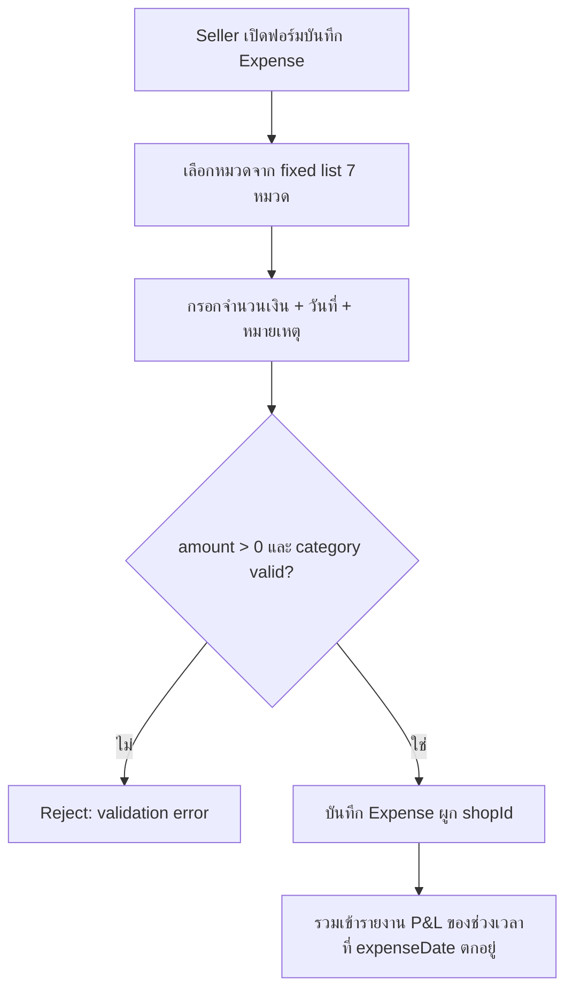
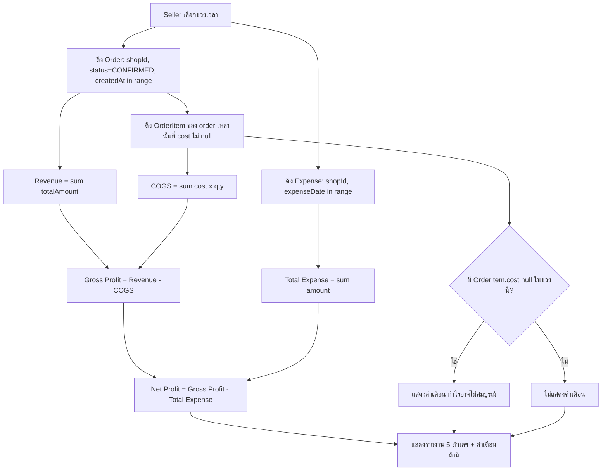
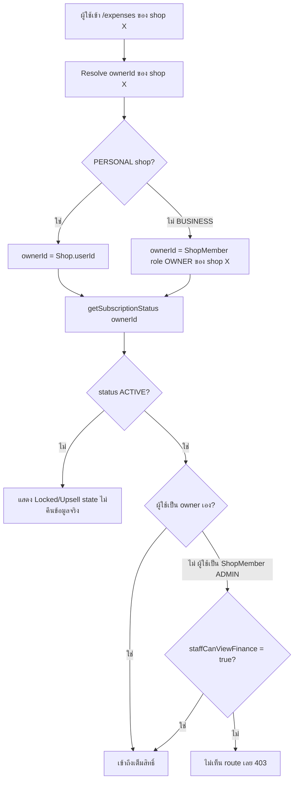
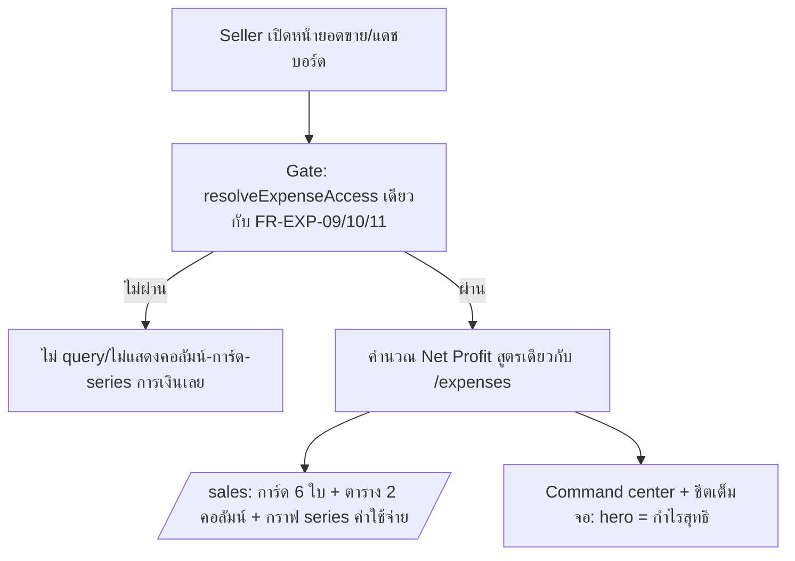
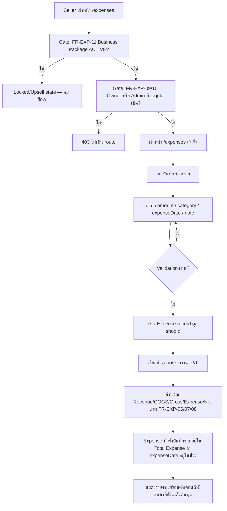
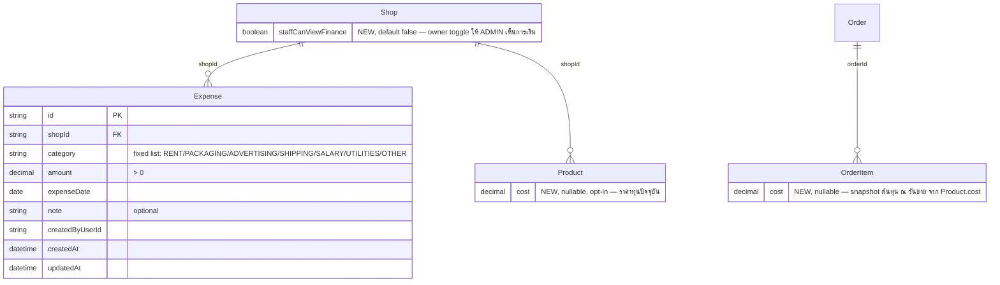

> **โมดูล:** M00016-ExpenseCostTracking
> **ประเภทเอกสาร:** Business Requirements Document (BRD) — NON-TECHNICAL
> **เวอร์ชัน:** 1.0
> **วันที่จัดทำ:** 2026-07-08
> **สถานะ:** Draft
> **เจ้าของเอกสาร:** BA (ดู [[Feature-Docs-Ownership]])

# BRD: บันทึกค่าใช้จ่าย + ตั้งต้นทุนสินค้า (Expense & Cost Tracking) (Business Requirements Document)

---

## 1. บทนำ

### 1.1 วัตถุประสงค์ของเอกสาร

เอกสารนี้มีวัตถุประสงค์เพื่อ:
1. กำหนด Functional Requirements ระดับ non-technical สำหรับการบันทึกค่าใช้จ่าย, การตั้ง/snapshot ต้นทุนสินค้า, และรายงานกำไรขาดทุนเต็มรูป (full P&L) บนหน้าใหม่ `/expenses`
2. กำหนดขอบเขตการทำงานของ fixed expense category, กฎการคำนวณ P&L, กฎ finance-visibility toggle, และกฎ gate ด้วย Business Package (bundled paid add-on)
3. ระบุเงื่อนไขการรับงาน (Acceptance Criteria) แบบ Given/When/Then ที่ทีม QA นำไปสร้าง Test Case ได้โดยตรง — โดยเฉพาะความถูกต้องของสูตร P&L และ authorization ต่อ shopId
4. สร้างความเข้าใจร่วมกันระหว่างทีมธุรกิจและทีมพัฒนา ก่อนเริ่ม implement feature

### 1.2 ขอบเขตของระบบ

**Expense & Cost Tracking** คือระบบที่ให้ Seller บันทึกรายการค่าใช้จ่ายดำเนินธุรกิจ (แยก 7 หมวดคงที่) และตั้งราคาทุนสินค้า (optional) ที่ถูก snapshot ลงในแต่ละ order item ตอนขายจริง เพื่อคำนวณรายงานกำไรขาดทุนเต็มรูป (Revenue → COGS → Gross Profit → Expense → Net Profit) ตามช่วงเวลาที่เลือก ระบบทั้งหมดอยู่บนหน้าใหม่ `/expenses` (Paces, `(paces)/seller/**`) ที่เข้าถึงได้เฉพาะร้านของ owner ที่มี Business Package (feature 00008) สถานะ ACTIVE เท่านั้น (bundled — ไม่มี billing แยก) และเห็นข้อมูลได้เฉพาะ owner หรือ admin ที่ owner เปิดสิทธิ์ให้ผ่าน toggle ระดับร้าน

**เข้าสู่ระบบ (Input):**
- ฟอร์มบันทึก/แก้ไข Expense: `amount`, `category` (จาก fixed list), `expenseDate`, `note` (optional)
- ฟอร์มตั้งต้นทุนสินค้า: `Product.cost` (optional, ≥0)
- ช่วงเวลาที่ seller เลือกดูรายงาน (`startDate`, `endDate`)
- Session ปัจจุบัน (`session.user.id`) + shop context (active shop ที่กำลังดู)
- ข้อมูลจาก DB ที่มีอยู่แล้ว: `Order` (status, totalAmount, createdAt, shopId), `OrderItem` (qty, cost ใหม่), `BusinessPackageSubscription` (สถานะของ owner), `ShopMember` (role ของผู้ใช้ปัจจุบันต่อ shop)

**ออกจากระบบ (Output):**
- Expense record ที่สร้าง/แก้/ลบสำเร็จ
- `Product.cost` ที่อัปเดต (ไม่กระทบ `OrderItem.cost` เก่า)
- รายงาน P&L (Revenue/COGS/Gross Profit/Total Expense/Net Profit) ของช่วงเวลาที่เลือก พร้อม flag คำเตือนถ้าข้อมูลต้นทุนไม่ครบ
- Locked/upsell state ถ้า owner ของ shop นั้นไม่มี Business Package ACTIVE
- Validation error (amount ≤ 0, category ไม่ถูกต้อง, cost ติดลบ)

**ระบบที่เกี่ยวข้อง:**
- `business-package.service.ts` (`getSubscriptionStatus`) — entitlement gate (feature 00008, live)
- `subscription-overview.service.ts` — ตัวอย่าง pattern resolve owner/shop ที่มีอยู่แล้ว ใช้อ้างอิง reuse
- `shop-member.service.ts` + `ShopMember` model — role OWNER/ADMIN ต่อ shop (feature 00008/00012, live)
- `dashboard.service.ts` — pattern การนับ revenue ตาม `Order.createdAt`/`status='CONFIRMED'` ที่มีอยู่แล้ว (ต้องสอดคล้องกัน)
- `product.service.ts` — เพิ่ม field `cost` เข้าฟอร์ม/validation สินค้าเดิม
- `order.service.ts` (จุดสร้าง order) — เพิ่ม logic snapshot `OrderItem.cost` ที่เดียวกับที่ snapshot `OrderItem.price` อยู่แล้ว

### 1.3 กลุ่มผู้ใช้งาน

| กลุ่มผู้ใช้ | บทบาท | สิทธิ์การใช้งาน |
|-----------|--------|----------------|
| **Owner ที่มี Business Package ACTIVE** | เจ้าของร้าน (PERSONAL หรือ BUSINESS) ที่ owner ระดับบนมี package ACTIVE | เต็มสิทธิ์: บันทึก/แก้/ลบ Expense, ตั้งต้นทุนสินค้า, ดูรายงาน P&L, เปิด/ปิด `staffCanViewFinance` |
| **ShopMember(ADMIN) ที่ toggle เปิด** | พนักงานที่ owner invite เข้ามาบริหาร Business shop และ owner เปิดสิทธิ์การเงินให้ | เห็น/บันทึก/แก้/ลบ Expense และดูรายงาน P&L เท่ากับ owner (membership-based access ตาม feature 00008 MVP) — **ไม่มี**สิทธิ์เปิด/ปิด toggle เอง |
| **ShopMember(ADMIN) ที่ toggle ปิด (default)** | พนักงานที่ owner ยังไม่เปิดสิทธิ์การเงินให้ | ไม่เห็นเมนู/route `/expenses` เลย |
| **Owner ที่ไม่มี Business Package ACTIVE** | ร้าน FREE หรือ Package LOCKED | เห็น locked/upsell state เท่านั้น ไม่เข้าถึงข้อมูล Expense/cost ของร้านตนได้ |

---

## 2. ความต้องการหลัก (Functional Requirements)

### 2.1 ตั้งต้นทุนสินค้าและ Snapshot ณ วันขาย

#### FR-EXP-01: ตั้ง/แก้ต้นทุนสินค้า (Product Cost)

**User Story:**
> ในฐานะ Seller ฉันต้องการตั้งราคาทุนให้สินค้าแต่ละชิ้น (ไม่บังคับ) เพื่อให้ระบบคำนวณกำไรขั้นต้นของออเดอร์ที่ขายสินค้านั้นได้

**Acceptance Criteria:**
- [ ] `[FR-EXP-01-AC-01]` **Given** seller เปิดฟอร์มแก้ไข/สร้างสินค้า **When** กรอกช่อง "ราคาทุน" เป็นตัวเลข ≥ 0 แล้วบันทึก **Then** `Product.cost` ถูกตั้งค่า/อัปเดตสำเร็จ
- [ ] `[FR-EXP-01-AC-02]` **Given** seller ไม่กรอกช่อง "ราคาทุน" เลย **When** บันทึกสินค้า **Then** `Product.cost` เป็น `null` — สินค้าสร้าง/แก้ไข/ขายได้ตามปกติทุกประการ ไม่มี error
- [ ] `[FR-EXP-01-AC-03]` **Given** seller กรอกค่าติดลบในช่อง "ราคาทุน" **When** submit **Then** ระบบปฏิเสธ (validation error) — ต้อง ≥ 0 เท่านั้น
- [ ] `[FR-EXP-01-AC-04]` **Given** สินค้าที่มี `cost` อยู่แล้วถูกขายไปหลายออเดอร์ **When** seller แก้ `cost` เป็นค่าใหม่ **Then** `OrderItem.cost` ของออเดอร์ที่เคยขายไปแล้วทั้งหมด**ไม่เปลี่ยนแปลง** (ดู FR-EXP-02)
- [ ] `[FR-EXP-01-AC-05]` **Given** seller ที่ owner **ไม่มี** Business Package ACTIVE เปิดฟอร์มสร้าง/แก้ไขสินค้า **When** ดูช่อง "ราคาทุน" **Then** ช่องแสดงอยู่แต่ **disabled** (แก้ไม่ได้) พร้อม badge "อัปเกรดเป็น Business" ข้าง ๆ — ไม่ซ่อน field, ไม่ block การบันทึกสินค้าตามปกติ (zero-regression). **When** owner ซื้อ package จน ACTIVE **Then** ช่องปลดล็อกให้กรอกได้ (รายละเอียด UI/badge → safepay-ux Design Spec)

#### FR-EXP-02: Snapshot ต้นทุนลง OrderItem ตอนสร้างออเดอร์

**User Story:**
> ในฐานะระบบ ฉันต้องบันทึกต้นทุนของสินค้าแต่ละรายการ ณ ขณะที่ออเดอร์ถูกสร้าง เพื่อให้กำไรของออเดอร์เก่าคำนวณซ้ำได้ผลเดิมเสมอ ไม่ว่าต้นทุนปัจจุบันของสินค้าจะเปลี่ยนไปแล้วแค่ไหน

**Acceptance Criteria:**
- [ ] `[FR-EXP-02-AC-01]` **Given** seller สร้างออเดอร์ที่มีรายการสินค้าที่ผูกกับ `Product` ซึ่งมี `cost` ไม่ null **When** ระบบสร้าง `OrderItem` **Then** `OrderItem.cost` ถูกตั้งเท่ากับ `Product.cost` ณ ขณะนั้น (เหมือน pattern การ snapshot `OrderItem.price` จาก `Product.price` ที่มีอยู่แล้ว)
- [ ] `[FR-EXP-02-AC-02]` **Given** รายการสินค้าที่ผูกกับ `Product` ซึ่ง `cost` เป็น `null` **When** ระบบสร้าง `OrderItem` **Then** `OrderItem.cost` เป็น `null` (ไม่ error, ไม่ default เป็น 0)
- [ ] `[FR-EXP-02-AC-03]` **Given** รายการสินค้าที่เป็น custom/manual line item (ไม่ผูกกับ `Product` ใด ๆ, `productId` เป็น null) **When** ระบบสร้าง `OrderItem` **Then** `OrderItem.cost` เป็น `null` เสมอ (ไม่มีต้นทุนอ้างอิง)
- [ ] `[FR-EXP-02-AC-04]` **Given** ออเดอร์ที่สร้างไปแล้วก่อนหน้านี้ (มี `OrderItem.cost` snapshot ค่าหนึ่งไว้) **When** seller แก้ `Product.cost` เป็นค่าใหม่ในภายหลัง **Then** re-query ออเดอร์เก่านั้น `OrderItem.cost` ยังคงเป็นค่าเดิมที่ snapshot ไว้ ไม่เปลี่ยนตาม `Product.cost` ปัจจุบัน

**Business Flow:**
1. Seller submit ฟอร์มสร้างออเดอร์ (มีอยู่แล้ว)
2. สำหรับแต่ละรายการสินค้าในออเดอร์: ระบบ snapshot `price` (มีอยู่แล้ว) และ `cost` (ใหม่) จาก `Product` ปัจจุบัน ณ ขณะนั้น พร้อมกัน
3. บันทึก `OrderItem` ครบทุกฟิลด์ในธุรกรรมเดียวกับการสร้าง `Order` (ตาม pattern เดิม)

---

### 2.2 บันทึกค่าใช้จ่าย (Expense CRUD)

#### FR-EXP-03: บันทึกค่าใช้จ่ายใหม่

**User Story:**
> ในฐานะ Seller ฉันต้องการบันทึกรายการค่าใช้จ่ายของร้าน (จำนวนเงิน, หมวดหมู่, วันที่, หมายเหตุ) เพื่อให้ระบบนำไปคำนวณกำไรสุทธิให้อัตโนมัติ

**Acceptance Criteria:**
- [ ] `[FR-EXP-03-AC-01]` **Given** ผู้ใช้มีสิทธิ์เข้าถึง `/expenses` ของร้าน (ดู FR-EXP-09/10/11) **When** กรอก `amount > 0`, เลือก `category` จาก fixed list (§FR-EXP-05), เลือก `expenseDate`, (optional) `note` แล้วบันทึก **Then** ระบบสร้าง `Expense` record ผูกกับ `shopId` ของร้านปัจจุบัน สำเร็จ
- [ ] `[FR-EXP-03-AC-02]` **Given** `amount ≤ 0` (หรือไม่ใช่ตัวเลข) **When** submit **Then** ระบบปฏิเสธ (validation error) ทั้ง frontend และ backend
- [ ] `[FR-EXP-03-AC-03]` **Given** `category` ไม่ตรงกับค่าใน fixed list **When** submit **Then** ระบบปฏิเสธ (validation error)
- [ ] `[FR-EXP-03-AC-04]` **Given** ไม่ระบุ `expenseDate` **When** submit **Then** ระบบ default เป็นวันที่ปัจจุบัน (ไม่บังคับ error — ความสะดวกของผู้ใช้)

#### FR-EXP-04: แก้ไข/ลบค่าใช้จ่าย

**User Story:**
> ในฐานะ Seller ฉันต้องการแก้ไขหรือลบรายการค่าใช้จ่ายที่เคยบันทึกผิด เพื่อให้รายงาน P&L ถูกต้องอยู่เสมอ

**Acceptance Criteria:**
- [ ] `[FR-EXP-04-AC-01]` **Given** Expense record เป็นของร้านที่ผู้ใช้มีสิทธิ์เข้าถึง **When** แก้ไข field ใดก็ได้ (amount/category/expenseDate/note) แล้วบันทึก **Then** ระบบอัปเดตสำเร็จ — validation เดียวกับ FR-EXP-03 ใช้ซ้ำทุกครั้ง
- [ ] `[FR-EXP-04-AC-02]` **Given** Expense record เป็นของร้านที่ผู้ใช้มีสิทธิ์เข้าถึง **When** กดลบ + ยืนยัน **Then** record ถูกลบถาวร (hard delete — ไม่มี soft-delete/audit trail ใน MVP ตาม PRD §4.2)
- [ ] `[FR-EXP-04-AC-03]` **Given** Expense record เป็นของร้าน**อื่น**ที่ผู้ใช้ไม่มีสิทธิ์ **When** พยายามแก้/ลบผ่าน API โดยตรง (เช่น แก้ id ใน request) **Then** ระบบปฏิเสธ (403/404 — ไม่ leak ว่ามี record นี้อยู่จริงหรือไม่)

#### FR-EXP-05: หมวดหมู่ค่าใช้จ่าย (Fixed Category)

**User Story:**
> ในฐานะระบบ ฉันต้องจำกัดหมวดหมู่ค่าใช้จ่ายให้เลือกจากรายการคงที่เท่านั้น เพื่อให้รายงานจัดกลุ่มได้สม่ำเสมอทุกร้าน

**Acceptance Criteria:**
- [ ] `[FR-EXP-05-AC-01]` ระบบมีหมวดหมู่ให้เลือกทั้งหมด 7 หมวด: `RENT`(ค่าเช่า), `PACKAGING`(ค่าบรรจุภัณฑ์), `ADVERTISING`(ค่าโฆษณา), `SHIPPING`(ค่าขนส่ง), `SALARY`(เงินเดือน), `UTILITIES`(ค่าน้ำ-ค่าไฟ), `OTHER`(อื่นๆ)
- [ ] `[FR-EXP-05-AC-02]` ไม่มีช่องทางใดใน UI/API ให้สร้างหมวดหมู่นอกเหนือจากรายการนี้ในเวอร์ชันนี้

**Business Flow:**

---

### 2.3 รายงานกำไรขาดทุน (P&L Report)

#### FR-EXP-06: คำนวณ Revenue และ COGS ตามช่วงเวลา

**User Story:**
> ในฐานะ Seller ฉันต้องการเห็นยอดขาย (Revenue) และต้นทุนสินค้าที่ขายไป (COGS) ของช่วงเวลาที่เลือก เพื่อรู้กำไรขั้นต้นของร้าน

**Acceptance Criteria:**
- [ ] `[FR-EXP-06-AC-01]` **Given** ช่วงเวลา `[start, end]` ที่ seller เลือก **When** ระบบคำนวณ **Then** `Revenue = Σ Order.totalAmount` ของทุกออเดอร์ที่ `shopId` ตรง, `status = 'CONFIRMED'`, และ `createdAt ∈ [start, end]`
- [ ] `[FR-EXP-06-AC-02]` **Given** ออเดอร์ที่เข้าเงื่อนไข Revenue ข้างต้น **When** ระบบคำนวณ COGS **Then** `COGS = Σ (OrderItem.cost × OrderItem.qty)` เฉพาะรายการที่ `OrderItem.cost` ไม่ null ของออเดอร์เหล่านั้น
- [ ] `[FR-EXP-06-AC-03]` **Given** ออเดอร์ที่ `status` เป็น `PENDING`/`SHIPPED`/`CANCELLED` **When** อยู่ในช่วงเวลาเดียวกัน **Then** ออเดอร์เหล่านี้**ไม่ถูกนับ**เข้า Revenue/COGS เลย
- [ ] `[FR-EXP-06-AC-04]` `Gross Profit = Revenue − COGS` เสมอ (ไม่มี rounding error สะสมข้ามรายการ — ใช้ Decimal ตลอดการคำนวณ)

#### FR-EXP-07: เตือนเมื่อข้อมูลต้นทุนไม่ครบ (Missing Cost Warning)

**User Story:**
> ในฐานะ Seller ฉันต้องการรู้ว่าตัวเลขกำไรที่เห็นอาจไม่สมบูรณ์ เมื่อมีสินค้าบางรายการที่ยังไม่เคยตั้งต้นทุนไว้ เพื่อไม่ให้ตัดสินใจผิดจากตัวเลขที่ต่ำ/สูงเกินจริง

**Acceptance Criteria:**
- [ ] `[FR-EXP-07-AC-01]` **Given** มี `OrderItem` อย่างน้อย 1 รายการในช่วงเวลาที่เลือก (ของออเดอร์ที่นับเข้า Revenue) ที่ `cost` เป็น `null` **When** แสดงรายงาน **Then** ระบบแสดงคำเตือน "กำไรอาจไม่สมบูรณ์ (มีสินค้าที่ยังไม่ตั้งต้นทุน)" กำกับคู่กับตัวเลข Gross Profit และ Net Profit
- [ ] `[FR-EXP-07-AC-02]` **Given** ทุกรายการในช่วงเวลาที่เลือกมี `cost` ครบ (ไม่ null สักรายการ) **When** แสดงรายงาน **Then** ไม่มีคำเตือนแสดง
- [ ] `[FR-EXP-07-AC-03]` รายการที่ `cost` เป็น `null` ต้อง**ไม่ถูกนับเป็น 0** ใน COGS (exclude ไปเลย ไม่ใช่ default เป็นศูนย์) — ป้องกันไม่ให้ Gross Profit สูงเกินจริงอย่างเงียบ ๆ

#### FR-EXP-08: รายงาน Net Profit รวม Expense

**User Story:**
> ในฐานะ Seller ฉันต้องการเห็นกำไรสุทธิหลังหักค่าใช้จ่ายดำเนินธุรกิจทั้งหมด เพื่อรู้ผลประกอบการที่แท้จริงของร้านในช่วงเวลานั้น

**Acceptance Criteria:**
- [ ] `[FR-EXP-08-AC-01]` **Given** ช่วงเวลาเดียวกับที่ใช้คำนวณ Revenue/COGS (FR-EXP-06) **When** ระบบคำนวณ **Then** `Total Expense = Σ Expense.amount` ของ `shopId` ตรง ที่ `expenseDate ∈ [start, end]`
- [ ] `[FR-EXP-08-AC-02]` `Net Profit = Gross Profit − Total Expense` เสมอ
- [ ] `[FR-EXP-08-AC-03]` **Given** ไม่มี Expense record ใดในช่วงเวลานั้นเลย **When** แสดงรายงาน **Then** `Total Expense = 0` และ `Net Profit = Gross Profit` (ไม่ error)
- [ ] `[FR-EXP-08-AC-04]` รายงานแสดงตัวเลขทั้ง 5 ค่าคู่กันเสมอในหน้าเดียว: Revenue, COGS, Gross Profit, Total Expense, Net Profit

**Business Flow:**

---

### 2.4 สิทธิ์การเข้าถึง (Access Control)

#### FR-EXP-09: Owner เห็นข้อมูลการเงินเสมอ

**User Story:**
> ในฐานะ Owner ฉันต้องการเข้าถึงข้อมูล Expense/ต้นทุน/รายงาน P&L ของร้านตนเองได้เสมอ โดยไม่มีเงื่อนไขเพิ่มเติมนอกจากมี Business Package ACTIVE

**Acceptance Criteria:**
- [ ] `[FR-EXP-09-AC-01]` **Given** ผู้ใช้ที่ login คือ owner ของ shop (owner โดยตรงของ PERSONAL shop, หรือ `ShopMember(role=OWNER)` ของ BUSINESS shop) และ package ของ owner นั้น ACTIVE **When** เข้าหน้า `/expenses` **Then** เห็น/แก้/ลบข้อมูลได้เต็มสิทธิ์เสมอ ไม่ขึ้นกับ `staffCanViewFinance`
- [ ] `[FR-EXP-09-AC-02]` ทุก query ของ Expense/cost/report ต้องกรองด้วย `shopId` ของร้านที่ owner เป็นเจ้าของจริงเท่านั้น (server-side, ไม่รับค่าจาก client มาตัดสิน)

#### FR-EXP-10: Toggle staffCanViewFinance สำหรับ Admin

**User Story:**
> ในฐานะ Owner ฉันต้องการเลือกเองว่าจะให้พนักงาน (ShopMember role=ADMIN) เห็นข้อมูลการเงินของร้านได้หรือไม่ เพื่อควบคุมความลับทางธุรกิจของตัวเอง

**Acceptance Criteria:**
- [ ] `[FR-EXP-10-AC-01]` **Given** Shop ใหม่ถูกสร้าง (ไม่ว่า kind ใด) **When** ตรวจค่าเริ่มต้น **Then** `Shop.staffCanViewFinance = false` เสมอ
- [ ] `[FR-EXP-10-AC-02]` **Given** owner เปิด toggle "ให้พนักงานเห็นข้อมูลการเงิน" **When** ยืนยัน **Then** `Shop.staffCanViewFinance = true` — เฉพาะ owner เท่านั้นที่แก้ค่านี้ได้ (ไม่ใช่ admin)
- [ ] `[FR-EXP-10-AC-03]` **Given** `staffCanViewFinance = true` **When** `ShopMember(role=ADMIN)` ของ shop นั้น login และเปิดเมนู **Then** เห็นเมนู `/expenses` และเข้าถึงข้อมูลได้เท่ากับ owner (membership-based access ตาม MVP feature 00008)
- [ ] `[FR-EXP-10-AC-04]` **Given** `staffCanViewFinance = false` (default) **When** `ShopMember(role=ADMIN)` เปิดเมนู **Then** **ไม่เห็นเมนู/route `/expenses` เลย** — เข้า URL ตรง ๆ ก็ต้องถูกปฏิเสธ (403) ไม่ใช่แค่ UI ซ่อนปุ่ม
- [ ] `[FR-EXP-10-AC-05]` Toggle นี้เป็นค่าต่อ `Shop` (ต่อร้าน) — owner ที่มีหลาย Business shop ต้องตั้งแยกทีละร้าน ไม่มี global toggle รวม

#### FR-EXP-11: Gate การเข้าถึงด้วย Business Package (Bundled Paid Add-on)

**User Story:**
> ในฐานะแพลตฟอร์ม Deep ฉันต้องการเปิดสิทธิ์ Expense & Cost Tracking เฉพาะร้านของ owner ที่มี Business Package ACTIVE อยู่แล้ว โดยไม่ต้องสร้างระบบเรียกเก็บเงินใหม่

**Acceptance Criteria:**
- [ ] `[FR-EXP-11-AC-01]` **Given** owner ของ shop (resolve ตาม FR-EXP-09-AC-01) มี `BusinessPackageSubscription.status = 'ACTIVE'` (tier ใดก็ได้) **When** เข้าหน้า `/expenses` **Then** เข้าถึงได้เต็มสิทธิ์ตาม role (owner/admin ที่ toggle เปิด)
- [ ] `[FR-EXP-11-AC-02]` **Given** owner ไม่มี `BusinessPackageSubscription` เลย (FREE pseudo-state) หรือมีแต่ `status = 'LOCKED_RENEWAL_FAILED'` **When** เข้าหน้า `/expenses` **Then** ระบบแสดง locked/upsell state เท่านั้น (ไม่ error 404 เงียบ ๆ — แจ้งชัดว่าต้องมี Business Package ก่อน) และ**ไม่คืนข้อมูล** Expense/cost ของร้านจริงมาแสดง
- [ ] `[FR-EXP-11-AC-03]` **Given** entitlement เปลี่ยนจาก ACTIVE เป็น LOCKED (เช่น renewal ล้มเหลว — ตาม feature 00008) **When** owner เข้าหน้า `/expenses` ครั้งถัดไป **Then** ถูกล็อกทันทีตาม AC-02 — ข้อมูล Expense/cost ที่เคยบันทึกไว้**ไม่ถูกลบ** (แค่เข้าถึงไม่ได้ชั่วคราว จนกว่า reactivate) — สอดคล้อง data-retention policy ของ feature 00008
- [ ] `[FR-EXP-11-AC-04]` (Build-order note — ไม่ใช่ acceptance ของ production) ระหว่างพัฒนา core logic (FR-EXP-01 ถึง FR-EXP-10) อนุญาตให้ gate นี้เป็น stub/bypass ชั่วคราวเพื่อทดสอบ business logic แยกจากปัญหาเรื่องสิทธิ์ — ต้องผูก gate จริงก่อน sign-off feature เสมอ

**Business Flow:**

### 2.5 กำไรสุทธิบนหน้ายอดขาย (เพิ่ม 2026-08-02, PRD §3.8)

#### FR-EXP-12: รายจ่ายไหลเข้าหน้ายอดขาย 3 surface

**User Story:**
> ในฐานะ Seller ฉันต้องการเห็นกำไรสุทธิของร้าน ไม่ใช่แค่ยอดขาย ทุกครั้งที่เปิดหน้าภาพรวมยอดขาย (ไม่ใช่แค่ตอนเข้าหน้า `/expenses` โดยเฉพาะ) เพราะฉันเปิดดูยอดขาย/แดชบอร์ดบ่อยกว่ามาก

**Acceptance Criteria:**
- [ ] `[FR-EXP-12-AC-01]` **Given** ผู้ใช้ที่มีสิทธิ์เข้าถึงข้อมูลการเงิน (ตาม FR-EXP-09/10/11) **When** เปิดหน้า `/sales` **Then** เห็นการ์ดสรุป 6 ใบ (เดิม 4 — เพิ่มค่าใช้จ่าย/กำไรสุทธิ), ตารางรายวันมี 2 คอลัมน์เพิ่ม (ค่าใช้จ่าย/กำไรสุทธิ), และกราฟมี series ค่าใช้จ่าย
- [ ] `[FR-EXP-12-AC-02]` **Given** ผู้ใช้ที่มีสิทธิ์เดียวกัน **When** เปิดการ์ด "ยอดขายและกำไร" บน command center (มือถือ) หรือชีตเต็มจอที่เปิดจากการ์ดนั้น **Then** ตัวเลข hero คือ**กำไรสุทธิ** (ไม่ใช่ยอดขาย) พร้อมยอดขายแสดงเป็นข้อมูลรอง
- [ ] `[FR-EXP-12-AC-03]` **Given** ผู้ใช้ที่**ไม่ผ่าน**สิทธิ์เข้าถึงข้อมูลการเงิน (FR-EXP-10-AC-04/FR-EXP-11-AC-02) **When** เปิดทั้ง 3 surface ข้างต้น **Then** **ไม่เห็น**คอลัมน์/การ์ด/series ที่เกี่ยวกับเงินเลย (ไม่ query ด้วยซ้ำ — ไม่ใช่เห็นแต่เป็น `฿0`)
- [ ] `[FR-EXP-12-AC-04]` กำไรสุทธิที่แสดงทั้ง 3 surface ต้องคำนวณด้วยสูตรเดียวกับ `/expenses` เป๊ะ (`Revenue − COGS − Expense`, ดู §8.1) — ไม่มี surface ใดใช้สูตรลัดที่ให้ตัวเลขต่างกัน

**Business Flow:**

---

## 3. Acceptance Criteria สรุป

### 3.1 ต้นทุนสินค้า + Snapshot

**เมื่อระบบทำงานถูกต้อง:**
- ✓ ตั้ง/แก้ `Product.cost` ได้ (optional, ≥0) โดยไม่กระทบสินค้าที่ไม่เคยตั้งต้นทุน
- ✓ `OrderItem.cost` snapshot จาก `Product.cost` ตอนสร้างออเดอร์ — null ถ้าไม่มีต้นทุนอ้างอิง (product cost null หรือ custom line item)
- ✓ แก้ `Product.cost` ทีหลังไม่กระทบ `OrderItem.cost` ของออเดอร์เก่า

### 3.2 บันทึกค่าใช้จ่าย

**เมื่อระบบทำงานถูกต้อง:**
- ✓ สร้าง/แก้/ลบ Expense ได้เฉพาะร้านที่ผู้ใช้มีสิทธิ์ (scope ด้วย shopId)
- ✓ `amount > 0` และ `category` ต้องอยู่ใน fixed list 7 หมวดเท่านั้น
- ✓ Expense record ของร้านอื่นเข้าถึง/แก้/ลบไม่ได้ผ่าน API โดยตรง

### 3.3 รายงาน P&L

**เมื่อระบบทำงานถูกต้อง:**
- ✓ Revenue/COGS นับเฉพาะออเดอร์ `status = CONFIRMED` ในช่วงเวลาที่เลือก (anchor `createdAt`)
- ✓ Gross Profit = Revenue − COGS; Net Profit = Gross Profit − Total Expense
- ✓ รายการที่ไม่มี cost ถูก exclude จาก COGS (ไม่ default เป็น 0) พร้อมคำเตือนกำกับเสมอเมื่อมี gap

### 3.4 Access Control

**เมื่อระบบทำงานถูกต้อง:**
- ✓ Owner เข้าถึงได้เสมอเมื่อ package ACTIVE ไม่ขึ้นกับ toggle
- ✓ Admin เข้าถึงได้เฉพาะเมื่อ `staffCanViewFinance = true` — ปิดอยู่ต้องมองไม่เห็น route เลย (403 ไม่ใช่แค่ UI ซ่อน)
- ✓ ร้านที่ owner ไม่มี Business Package ACTIVE ไม่คืนข้อมูลจริงใด ๆ ให้เห็น

### 3.5 กำไรสุทธิบนหน้ายอดขาย (เพิ่ม 2026-08-02)

**เมื่อระบบทำงานถูกต้อง:**
- ✓ `/sales` + การ์ด command center + ชีตเต็มจอ แสดงกำไรสุทธิด้วยสูตรเดียวกับ `/expenses`
- ✓ Gate สิทธิ์เดียวกับ §3.4 ครอบทั้ง 3 surface — ไม่ผ่าน = ไม่เห็นข้อมูลการเงินเลย ไม่ใช่เห็น ฿0

---

## 4. Business Flows (กระบวนการทำงาน)

### 4.1 Flow หลัก: บันทึกค่าใช้จ่าย → เห็นในรายงาน P&L

### 4.2 ER Snippet — Model ใหม่/ที่แก้ไข (ข้อมูลอ้างอิงประกอบ — DATABASE.md ฉบับเต็มจัดทำโดย `safepay-database` ภายหลัง)

---

## 5. Use Case Scenarios (สถานการณ์การใช้งานจริง)

### Scenario 1: Owner ตั้งต้นทุนสินค้าแล้วขาย → เห็นกำไรถูกต้อง (Best Case)

**ผู้เกี่ยวข้อง:** Owner (Business Package ACTIVE)

**เงื่อนไขเริ่มต้น:**
- Owner มีสินค้า "เสื้อยืด" ราคาขาย 300 บาท ยังไม่เคยตั้งต้นทุน

**ขั้นตอน:**
1. Owner ตั้ง `Product.cost = 150` ให้เสื้อยืด
2. Owner สร้างออเดอร์ขายเสื้อยืด 2 ตัว → `OrderItem.cost = 150` snapshot ไว้ (× qty 2)
3. Buyer ยืนยันออเดอร์ (`status = CONFIRMED`)
4. Owner เปิดรายงาน P&L ช่วงวันนี้

**ผลลัพธ์:**
- Revenue = 600, COGS = 300 (150×2), Gross Profit = 300 — ไม่มีคำเตือน (ต้นทุนครบ)

### Scenario 2: สินค้าไม่มีต้นทุน → รายงานมีคำเตือน

**ผู้เกี่ยวข้อง:** Owner

**เงื่อนไขเริ่มต้น:**
- ออเดอร์ CONFIRMED มีสินค้า 2 รายการ: A (มี cost) และ B (ไม่มี cost)

**ขั้นตอน:**
1. Owner เปิดรายงาน P&L ช่วงที่ครอบคลุมออเดอร์นี้

**ผลลัพธ์:**
- COGS คำนวณเฉพาะรายการ A, รายการ B ถูก exclude
- แสดงคำเตือน "กำไรอาจไม่สมบูรณ์ (มีสินค้าที่ยังไม่ตั้งต้นทุน)" กำกับ Gross/Net Profit

### Scenario 3: Admin ที่ toggle ปิดพยายามเข้า /expenses

**ผู้เกี่ยวข้อง:** ShopMember(role=ADMIN)

**เงื่อนไขเริ่มต้น:**
- `Shop.staffCanViewFinance = false` (default)

**ขั้นตอน:**
1. Admin login เข้า Business shop ที่ตนถูก invite
2. พยายามเข้า URL `/expenses` ตรง ๆ

**ผลลัพธ์:**
- ไม่เห็นเมนูนี้ในเมนู และเข้า URL ตรง ๆ ได้รับ 403 — ไม่มีข้อมูลการเงินหลุดออกมาแม้แต่ error message

### Scenario 4: ร้านไม่มี Business Package → Locked State

**ผู้เกี่ยวข้อง:** Owner ที่ยังไม่ซื้อ package (FREE)

**เงื่อนไขเริ่มต้น:**
- Owner มี Personal shop, ไม่มี `BusinessPackageSubscription`

**ขั้นตอน:**
1. Owner เปิดเมนู "ค่าใช้จ่าย"

**ผลลัพธ์:**
- เห็นหน้า locked/upsell พร้อม prompt ไปซื้อ Business Package — ไม่เห็นข้อมูล Expense/cost ใด ๆ ของร้านตนเอง (ถึงแม้จะเคยมีอยู่ก่อนหน้าตอน package เคย ACTIVE)

---

## 6. ความต้องการด้านคุณภาพ (Quality Requirements)

### 6.1 ความถูกต้องของข้อมูล
- สูตรคำนวณ P&L (§4.3 ของ PRD) ต้องตรงกัน 100% ระหว่าง backend calculation และตัวเลขที่แสดงบนหน้าจอ — ไม่มีการคำนวณซ้ำฝั่ง frontend ที่อาจ drift
- `amount > 0`, `Product.cost ≥ 0`, `category` ∈ fixed list บังคับทั้ง frontend (yup) และ backend (valibot) เสมอ (ตาม convention validation คู่ของระบบ)

### 6.2 ความรวดเร็ว
- Query รายงาน P&L ของช่วงเวลา ≤ 1 ปี ต้องตอบสนองในเวลาที่ยอมรับได้สำหรับหน้า dashboard-style (ไม่ block UI) — พิจารณา index เพิ่มเติมถ้าจำเป็น (ระบุใน DATABASE.md/SRS)

### 6.3 ความน่าเชื่อถือ
- Cost snapshot ต้องเป็นส่วนหนึ่งของ transaction เดียวกับการสร้าง order (all-or-nothing) — ไม่มีเคสที่ order สร้างสำเร็จแต่ cost snapshot ขาดหายบางส่วนโดยไม่ได้ตั้งใจ

### 6.4 ความปลอดภัย
- ทุก endpoint ของ Expense/cost/report ต้องตรวจสอบสิทธิ์ (owner/admin+toggle) และ scope `shopId` ที่ server-side เสมอ — ห้าม trust ค่าจาก client (ตาม memory `feedback_rsc_dal_authz`)
- ข้อมูลการเงิน (Expense, cost, P&L) ถือเป็นข้อมูลอ่อนไหวระดับสูง — ห้าม log/leak ค่าตัวเลขจริงลง client-side error message ทั่วไป

### 6.5 ความสะดวกในการใช้งาน (Usability)
- ฟอร์มบันทึก Expense ต้องกรอกเสร็จได้เร็ว (จำนวน field น้อยที่สุดเท่าที่จำเป็น) — รายละเอียด UI จัดทำโดย `safepay-ux`

---

## 7. ข้อจำกัด (Constraints)

### 7.1 ข้อจำกัดทางธุรกิจ
- ไม่มี custom category, ไม่มี audit trail ของการแก้ไข Expense, ไม่มี export รายงานใน MVP (ดู PRD §5)
- Gate ด้วย Business Package เท่านั้น — ไม่มี billing แยกของ feature นี้

### 7.2 ข้อจำกัดทางเทคนิค
- `Product.cost`/`OrderItem.cost`/`Shop.staffCanViewFinance` เป็น additive migration ทั้งหมด (nullable/default) — ห้ามแตะ column เดิม
- ต้อง reuse `getSubscriptionStatus` เดิมจาก feature 00008 — ห้ามสร้าง entitlement table ใหม่ซ้ำซ้อน

---

## 8. กฎทางธุรกิจ (Business Rules)

### 8.1 กฎการคำนวณ P&L
- นับเฉพาะออเดอร์ `status = CONFIRMED`
- Anchor วันที่ = `Order.createdAt` (Revenue/COGS) และ `Expense.expenseDate` (Total Expense)
- รายการที่ไม่มี cost ถูก exclude จาก COGS พร้อมคำเตือนเสมอ ไม่ default เป็น 0
- ใช้ `Order.totalAmount` ตรง ๆ (รวม VAT) เป็นฐาน Revenue — ไม่แยก VAT
- **Expense เป็น period-level** — หักที่ Net Profit ของช่วงเวลาทั้งก้อน ไม่ allocate ลงรายออเดอร์ (ค่า ads ฿500 วันที่มี 11 ออเดอร์ = หัก ฿500 ก้อนเดียว ไม่ใช่ ฿45/ออเดอร์). Per-order allocation = Out of Scope (PRD §4.4/§5)

### 8.2 กฎ Cost Snapshot
- Snapshot ที่จุดสร้างออเดอร์เท่านั้น เหมือน `OrderItem.price`
- แก้ `Product.cost` ทีหลังไม่มีผลย้อนหลัง

### 8.3 กฎหมวดหมู่ค่าใช้จ่าย
- Fixed list 7 หมวด, String enum-style
- `amount > 0` เสมอ

### 8.4 กฎสิทธิ์การเข้าถึง
- Owner เห็นเสมอเมื่อ package ACTIVE
- Admin เห็นเมื่อ `staffCanViewFinance = true` เท่านั้น (default false)
- Gate ด้วย Business Package ACTIVE (ทุก tier ที่จ่ายเงิน) — ไม่ ACTIVE = ไม่เห็นข้อมูลจริงใด ๆ

---

## 9. อภิธานศัพท์ (Glossary)

| คำศัพท์ | ความหมาย |
|---------|----------|
| **COGS** | ต้นทุนสินค้าที่ขายไปจริงในช่วงเวลาที่คำนวณ (จาก `OrderItem.cost` ที่ snapshot ไว้) |
| **Cost Snapshot** | การล็อกต้นทุนสินค้า ณ วินาทีที่สร้างออเดอร์ ลงใน `OrderItem.cost` |
| **Fixed Category** | หมวดหมู่ค่าใช้จ่าย 7 หมวดที่ระบบกำหนดตายตัว ไม่ให้ผู้ใช้เพิ่มเอง |
| **staffCanViewFinance** | Toggle ระดับ `Shop` ที่ owner เปิด/ปิดให้ ShopMember(ADMIN) เห็นข้อมูลการเงิน |
| **Bundled Paid Add-on** | Feature ที่ไม่มี billing ของตัวเอง แต่เปิดใช้งานได้เมื่อผู้ใช้มี subscription อื่น (Business Package) ที่ ACTIVE อยู่แล้ว |

---

## 10. สรุป

เอกสาร BRD นี้อธิบายความต้องการหลักของ **Expense & Cost Tracking** แบบไม่ใช่เทคนิค

**จุดเด่นของระบบ:**
- P&L เต็มรูป (Revenue → COGS → Gross → Expense → Net) คำนวณจากข้อมูลที่มีอยู่แล้วในระบบ ไม่ต้องสร้าง billing ใหม่
- Cost snapshot รับประกันความถูกต้องย้อนหลัง (historical accuracy) เหมือน pattern `price` เดิมที่พิสูจน์แล้วในระบบ
- Reuse entitlement (feature 00008) และ membership (ShopMember) ที่ live อยู่แล้วทั้งหมด — ลด risk ของการสร้างระบบสิทธิ์คู่ขนาน

**ผลลัพธ์ที่คาดหวัง:**
- Seller เห็นกำไรจริงของร้านได้ในหน้าเดียว ไม่ต้องคำนวณนอกระบบ
- ~~เพิ่มมูลค่าให้ Business Package โดยไม่ต้องเพิ่ม billing flow ใหม่~~ — **ยกเลิกโดย D-EXT-1 (§11.1)** ฟีเจอร์นี้ไม่ใช่ perk ของ Business Package อีกต่อไป
- ข้อมูลการเงินปลอดภัย — default owner-only เสมอ จนกว่า owner จะเลือกเปิดเอง **⚠️ จริงเฉพาะกับ Expense CRUD / P&L report / 3 surface หน้ายอดขาย — ไม่จริงกับ `Product.cost` ดู KG-EXT-01 (§11.2)**

---

## 11. ส่วนขยาย 2026-08-07 — เปิดฟรี + ต้นทุนรายออเดอร์/รายสินค้า

### 11.1 Decision Log (ล็อกแล้วโดย user — ห้าม re-litigate)

| # | เรื่อง | Decision | เหตุผล / สิ่งที่แลกไป |
|---|---|---|---|
| **D-EXT-1** | Business Package gate | **ถอดออกทั้งชุด** — `Product.cost`, `/expenses`, P&L report, กำไรบน 3 surface หน้ายอดขาย (เดิม FR-EXP-12) เข้าถึงได้ฟรีทุกร้าน ไม่ต้องสมัครแพ็กเกจ | **กลับทิศจาก D-4 และ D-8 ของ PRD เดิม** — D-4 เดิม "รวมใน Business Package ไม่คิดเงินแยก… gate ด้วย `getSubscriptionStatus`" และ D-8 เดิม "ทุก tier ที่จ่ายเงินปลดล็อกเท่ากัน" **ทั้งสองข้อไม่มีความหมายอีกต่อไปสำหรับฟีเจอร์นี้** เพราะไม่มี gate ให้ tier ใดปลดล็อก. **ยังกลับทิศ D-9 ด้วย** ("ช่อง cost แสดงเสมอแต่ disabled+badge อัปเกรด") — ช่อง cost เปลี่ยนเป็น **enabled เสมอ ไม่มี badge**. Controller ทักท้วงแล้วว่านี่คือการถอดจุดขายหลักของ Business Package (GROWTH ฿159/เดือนขึ้นไป) และ **user ยืนยันรับผลกระทบนี้แล้ว** |
| **D-EXT-2** | สิทธิ์ staff ต่อ `Product.cost` | **ไม่แก้ในรอบนี้** — ทุก ShopMember ที่เข้าฟอร์มแก้ไขสินค้าได้ ยังเห็น/แก้ `Product.cost` ได้เสมอ ไม่ผูกกับ `staffCanViewFinance` ("สิทธิ์เดี๋ยวมาว่ากันทีหลัง" — คำ user ตรงตัว) | ต้องบันทึกเป็น **Known Gap ที่มีชื่อ** (§11.2) เพราะเมื่อถอด paywall แล้ว (D-EXT-1) ความเสี่ยงนี้ขยายวงจาก "เฉพาะร้านที่จ่ายเงิน" เป็น "ทุกร้านที่มี staff ทันที" — ไม่ใช่ความเสี่ยงเดิมที่ขนาดเท่าเดิม |
| **D-EXT-3** | จุดแสดงผลใหม่ | เพิ่ม **3 จุด**: (ก) กำไรรายออเดอร์ที่ order detail (FR-EXP-14), (ข) ต้นทุน/มาร์จิ้นในรายการสินค้า ทั้งตารางเดสก์ท็อปและการ์ดมือถือ (FR-EXP-15), (ค) ช่อง `cost` ใน CSV bulk import (FR-EXP-16) | ปิด gap ที่ Scope Audit พบว่า "มีแต่รายงานรวม ไม่มีรายละเอียดที่คนขายมองหาจริงตอนใช้งานประจำวัน" |

### 11.2 Business Rules ที่ถูกยกเลิก/แก้ไข

| รหัสเดิม | ข้อความเดิม | สถานะใหม่ |
|---|---|---|
| FR-EXP-11 (ทั้งข้อ) + AC-01..04 | Gate ด้วย `getSubscriptionStatus(ownerId).status==='ACTIVE'` | **ยกเลิกทั้งข้อ** — superseded โดย FR-EXP-13 (PRD ส่วนขยาย) |
| §8.4 "Gate ด้วย Business Package ACTIVE (ทุก tier ที่จ่ายเงิน) — ไม่ ACTIVE = ไม่เห็นข้อมูลจริงใด ๆ" | **ลบเงื่อนไขนี้ออก** — ที่เหลือของ §8.4 (Owner เห็นเสมอ, Admin เห็นเมื่อ `staffCanViewFinance=true`) **ยังใช้ได้เหมือนเดิมทุกประการ** |
| §4.1 "Bundled Paid Add-on — Gate ด้วย Business Package ACTIVE … ไม่มี billing แยก" | **แก้เป็น:** "Free Feature — ไม่มี gate ใด ๆ ผูกกับ subscription/billing ทั้งสิ้น" |
| §9.2 D-9 (ช่อง cost disabled + badge เมื่อไม่มี package) | **ยกเลิก** — field enabled เสมอ ไม่มี badge "อัปเกรดเป็น Business" |

> 🛑 **KG-EXT-01 — `Product.cost` ไม่ถูกครอบด้วย `staffCanViewFinance` toggle**
> §3.6 ของเอกสารนี้ประกาศว่า "ข้อมูลการเงินคือความลับทางธุรกิจระดับสูงสุด… default ปิดเสมอ owner ต้อง opt-in เอง" — ประกาศนี้ **เป็นจริงเฉพาะกับ Expense CRUD / P&L report / 3 surface หน้ายอดขาย** (ยังผ่าน `resolveExpenseAccess()` เดิม) **แต่ไม่เป็นจริงกับ `Product.cost`**: ช่องราคาทุนในฟอร์มสินค้าเปิดให้ ShopMember ทุก role ที่แก้ไขสินค้าได้เห็น/แก้ได้เสมอ ไม่ว่า owner จะเปิด toggle หรือไม่.
> **ก่อน D-EXT-1** ความเสี่ยงนี้จำกัดอยู่แค่ร้านที่จ่ายเงิน (staff ของร้านที่ไม่จ่ายไม่เห็นช่องนี้เลยเพราะ disabled) — **หลัง D-EXT-1 ขยายเป็นทุกร้านที่มี staff ทันที**. user รับทราบและเลือก defer การแก้ไปก่อน. สิทธิ์ staff ที่ละเอียดกว่านี้ (เห็นต้นทุนได้ แต่ไม่เห็น Expense) เป็น Phase 2 — ตรงกับ Out of Scope เดิม §7.1 "RBAC granular กว่า Owner/Admin toggle เดียว"

### 11.3 Acceptance Criteria (Given/When/Then)

**FR-EXP-13: ถอด Business Package gate**

- `[FR-EXP-13-AC-01]` **Given** owner ของร้านไม่มี `BusinessPackageSubscription` เลย **When** เปิดฟอร์มแก้ไข/สร้างสินค้า **Then** ช่อง "ราคาทุน" กรอกได้ทันที ไม่มี badge ไม่ disabled
- `[FR-EXP-13-AC-02]` **Given** subscription เป็น `LOCKED_RENEWAL_FAILED` หรือ shop ถูก `packageLockedAt` ล็อกจากโควตาเกิน **When** owner (หรือ admin ที่ toggle เปิด) เข้า `/expenses` **Then** เข้าถึงได้ปกติ ไม่ขึ้น locked/upsell state ใด ๆ
- `[FR-EXP-13-AC-03]` **Given** role=ADMIN ของ Business shop ที่ `staffCanViewFinance=false` (default) **When** เข้า `/expenses` **Then** **ยังคงเห็น locked state "ยังไม่ได้รับสิทธิ์" เหมือนเดิมทุกประการ** — D-EXT-1 ไม่แตะเงื่อนไขนี้ (กัน regression ที่จะทำให้การถอด paywall กลายเป็นการถอด access control ทั้งหมดโดยไม่ตั้งใจ)
- `[FR-EXP-13-AC-04]` เมนู sidebar "ค่าใช้จ่าย" ไม่มี badge "อัปเกรด" อีกต่อไปในทุกกรณี — คงพฤติกรรมซ่อนเมนูสนิทเมื่อ `STAFF_NOT_ALLOWED`/`NO_SHOP` เหมือนเดิม

**FR-EXP-14: กำไรรายออเดอร์**

- `[FR-EXP-14-AC-01]` **Given** ออเดอร์ที่นับเป็นยอดขายแล้ว และทุกรายการมี `OrderItem.cost` ไม่ null **When** ผู้ใช้ที่ `resolveExpenseAccess`=GRANTED เปิด order detail **Then** เห็นกำไรของใบนั้น = `totalAmount − Σ(cost×qty)` ไม่มีคำเตือน
- `[FR-EXP-14-AC-02]` **Given** ออเดอร์เดียวกันแต่มี item ≥1 ตัวที่ `cost=null` **When** เปิด order detail **Then** **ห้ามแสดงตัวเลขกำไรเปล่า ๆ** — ต้องมีป้ายกำกับชัดเจน (เช่น "กำไรขั้นต่ำโดยประมาณ — มีสินค้าที่ยังไม่ตั้งต้นทุน") หรือแสดง "—" พร้อมลิงก์ไปตั้งต้นทุน (visual รอ `safepay-ux`) — ต้องเป็น **ธงระดับใบ** แยกต่างหาก ไม่ reuse `hasMissingCost` ของ `PnlReport` ซึ่งเป็นธงของทั้งช่วงเวลา
- `[FR-EXP-14-AC-03]` **Given** ออเดอร์ที่ไม่เข้าเงื่อนไข `countsAsRevenue` (PENDING/CANCELLED/SHIPPED ที่ยังไม่ยืนยันรับของ) **When** เปิด order detail **Then** แสดงป้าย "ยังไม่นับเป็นยอดขาย" แทนตัวเลขกำไร — ไม่คำนวณกำไรที่อาจกลายเป็นเท็จถ้าออเดอร์ถูกยกเลิกทีหลัง
- `[FR-EXP-14-AC-04]` **Given** ผู้ใช้ที่ `resolveExpenseAccess` ≠ GRANTED **When** เปิด order detail ใบเดียวกัน **Then** **ไม่เห็นบรรทัด/การ์ดกำไรเลย** (ไม่ query ด้วยซ้ำ) แม้จะเห็นรายการสินค้า+ราคาขายตามสิทธิ์ order detail ปกติ — กำไรผูก access เดียวกับ P&L ไม่ใช่สิทธิ์ดูออเดอร์
- `[FR-EXP-14-AC-05]` สินค้าที่ `cost > price` (ขายขาดทุน) → กำไรติดลบแสดงตรงไปตรงมา ไม่ clamp เป็น 0 ใช้ tone danger — ไม่ใช่ error

**FR-EXP-15: ต้นทุน/มาร์จิ้นในรายการสินค้า**

- `[FR-EXP-15-AC-01]` **Given** สินค้าที่มี `cost` ไม่ null **When** เปิด `/products` เดสก์ท็อป **Then** ตารางมีคอลัมน์ "ต้นทุน" (บาท) และ "มาร์จิ้น" (%) = `(price−cost)/price×100`
- `[FR-EXP-15-AC-02]` **Given** สินค้าที่ `cost=null` **When** เปิดตาราง/การ์ด **Then** แสดง "—" ไม่ใช่ `฿0`/`0%` (กันสื่อความหมายผิดว่าต้นทุนเป็นศูนย์จริง)
- `[FR-EXP-15-AC-03]` **Given** viewport มือถือ **When** เปิด `/products` **Then** การ์ดแสดงต้นทุน/มาร์จิ้นเนื้อหาเดียวกับตาราง ต่างแค่ layout (ตำแหน่งตามที่ `safepay-ux` ออกแบบ)
- `[FR-EXP-15-AC-04]` ร้าน `SERVICE_QUEUE` เปิด `/products` → หัวคอลัมน์ "ต้นทุน" **ไม่ผัน** ตาม vertical (เป็นคำนามล้วน ไม่มีกริยา/ลักษณนามที่ต้องผัน) แต่ **ป้ายที่อ้างถึงตัวสิ่งของ** (เช่น คำเตือน missing-cost ที่ `ExpenseWorkspace`) ต้องใช้ `resolveProductVocab(vertical).itemColLabel` แทน hardcode คำว่า "สินค้า" — ปิด gap เดิมที่แถบเตือนของ `/expenses` เขียน "มีสินค้าที่ยังไม่ได้ใส่ต้นทุน" ทั้งที่ร้านคิวงานควรเห็นคำว่า "บริการ"
- `[FR-EXP-15-AC-05]` ร้าน `LODGING` **ไม่มี** เมนู `/products` อยู่แล้ว (`applyVerticalMenu`) — FR นี้ไม่มีผล ไม่ต้องทำอะไรเพิ่ม

**FR-EXP-16: CSV Import cost**

- `[FR-EXP-16-AC-01]` **Given** แถว CSV ที่ cell `cost` ว่างเปล่า **When** import **Then** `Product.cost` เดิม **ไม่ถูกแตะ** (เสมือนไม่ส่ง key นี้มาเลย)
- `[FR-EXP-16-AC-02]` **Given** cell `cost` = `0` **When** import **Then** `Product.cost` ถูกตั้งเป็น `0` จริง — ยึด pattern `undefined`(ไม่แตะ)/`number`(ตั้งค่า) เดียวกับ `PATCH /api/products/[id]` ไม่ใช่ pattern ของ `stockQty` ที่บังคับทุกแถวต้องมีค่า
- `[FR-EXP-16-AC-03]` **Given** `cost` ติดลบ **When** import **Then** แถวนั้น error (`status:'ERROR'`) ไม่กระทบแถวอื่นในไฟล์เดียวกัน (row isolation เดิมของ `importStockFromCsvRows`)
- `[FR-EXP-16-AC-04]` การ import ยังต้องผ่าน `isProActive(shop.id)` เหมือนเดิม — **D-EXT-1 ไม่ถอด gate นี้** เพราะเป็นคนละ subscription จาก Business Package

### 11.4 Edge Cases (คำตอบที่ล็อกแล้ว — QA ใช้เขียน TestCase ได้ตรง)

| Edge case | คำตอบ |
|---|---|
| ออเดอร์มี item บางตัว `cost=null` | FR-EXP-14-AC-02 — ห้ามโชว์ตัวเลขเปล่า ๆ ต้องมีธงระดับใบแยกจาก `hasMissingCost` ของรายงานรวม |
| ออเดอร์ยกเลิก / ยังไม่ยืนยันรับของ | FR-EXP-14-AC-03 — ไม่คำนวณกำไร ใช้ `countsAsRevenue`/`revenueOrderWhere` เป็น SSOT ตัวเดิม ไม่สร้างนิยามใหม่ |
| สินค้า `cost > price` (ขาดทุน) | FR-EXP-14-AC-05 / FR-EXP-15 — แสดงติดลบตรงไปตรงมา ไม่ clamp |
| Vertical SERVICE_QUEUE / LODGING | FR-EXP-15-AC-04/05 — SERVICE_QUEUE ใช้ `PRODUCT_VOCAB.itemColLabel` แทนคำว่า "สินค้า"; LODGING ไม่เกี่ยวเลย (`Room` ≠ `Product` และไม่มีเมนู) |
| CSV: cell ว่าง vs `0` | FR-EXP-16-AC-01/02 — ว่าง=ไม่แตะ, `0`=ตั้งศูนย์จริง (ยืนยันกับ `undefined`/`number` pattern ของ `product.service.ts` แล้ว) CSV ไม่รองรับ "ล้างค่ากลับเป็น null" (ไม่มี use case ผ่านไฟล์นำเข้า) |
| ร้านที่เคยจ่าย Business Package ได้อะไรคืน | **ไม่มี migration/refund ทางวิศวกรรม** — ไม่เปลี่ยน schema, row `BusinessPackageSubscription` เดิมยังอยู่ครบและยังให้ perk อื่นต่อ (ดู §11.5) เรื่องสื่อสาร/ชดเชยลูกค้าเป็นการตัดสินใจธุรกิจนอกขอบเขตเอกสารนี้ — user รับทราบตาม D-EXT-1 |

### 11.5 ผลกระทบต่อ Business Package — เหลืออะไรให้ขาย

| Perk ที่ยังคงเป็น paid-only | ที่มา |
|---|---|
| เปิด Business shop ได้มากกว่า 1 ร้าน (`maxBusinesses`) | `src/lib/business-package.ts` |
| เชิญ staff/admin เกิน 1 คนต่อร้าน (`maxAdminsPerBusiness`) | เดียวกัน |
| โควตา AI-suggest ไม่จำกัดต่อวัน | `src/services/ai-suggest-quota.service.ts` |
| Inventory Add-on PRO (CSV import ฯลฯ) — **คนละแพ็กเกจ ไม่เกี่ยวกับ Business Package** | `src/services/inventory-entitlement.service.ts` |

**สรุป:** การถอด gate ทำให้ Business Package สูญเสียจุดขาย "เห็นกำไรจริง" ซึ่งเป็นข้อความหลักในหน้า upsell เดิม (`ExpenseLockedCard`: "ปลดล็อกได้ด้วย Business Package") แต่ยังไม่ทำให้แพ็กเกจไร้ค่า เพราะ multi-shop / multi-staff / AI quota ยังผูกอยู่

---

**หมายเหตุ:**
สำหรับความต้องการทางธุรกิจระดับภาพรวม/personas/KPI ดู [[PRD]] ของโมดูลนี้
สำหรับ technical specification (architecture/API/data/NFR) ดู [[SRS]] ของโมดูลนี้

**สถานะ implement (อัปเดต 2026-08-07):** FR-EXP-01..11 (core) + FR-EXP-12 (กำไรบนหน้ายอดขาย, §2.5) **deployed แล้ว**; **ส่วนขยาย D-EXT-1..3 / FR-EXP-13..16 (§11) อยู่ระหว่าง implement** บน branch `feature/product-cost` — ดู SRS.md §10 สำหรับรายละเอียดเชิงเทคนิคของ FR-EXP-12
