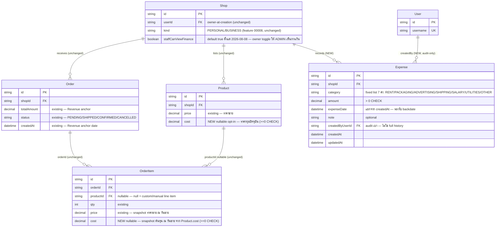

> **โมดูล:** M00016-ExpenseCostTracking
> **ประเภทเอกสาร:** DATABASE Design
> **เวอร์ชัน:** 1.0
> **วันที่จัดทำ:** 2026-07-08
> **สถานะ:** Draft — **schema เท่านั้น ยังไม่แก้ `prisma/schema.prisma` จริง ยังไม่รัน migration ใด ๆ**
> **เจ้าของเอกสาร:** SA/Database Agent (ดู [[Feature-Docs-Ownership]])

# DATABASE: Expense & Cost Tracking

---

> **อัปเดต 2026-08-02 (redesign — deployed, commits `69b235f4`/`3148bb42`/`a20d99ac`/`69a224ad`/`e0ec4926`/`56dcc657`):** **ไม่มีการเปลี่ยน schema/migration ใด ๆ ในรอบนี้** — `prevNetProfit` (ช่วงก่อนหน้า), `hasAnyExpense`, `expenses[]` ใน response ของ `/api/expenses/report`, และ `getSalesSeries(includeFinance)` (กำไรสุทธิไหลเข้าหน้ายอดขาย) ล้วนเป็น **query/compute เพิ่มเติมบน schema เดิมที่ §3 อธิบายไว้ครบแล้ว** ไม่มี column/index/model ใหม่ ดู SRS.md §10 (TFR-012..016) สำหรับรายละเอียด service-layer

## 1. Overview

โมดูล Expense & Cost Tracking (M00016) เป็น **additive migration ล้วน** — เพิ่ม nullable/default column บน 3 model เดิม (`Product`, `OrderItem`, `Shop`) + สร้าง model ใหม่ 1 ตัว (`Expense`) ไม่แตะ column/relation เดิมแม้แต่จุดเดียว (D-5/D-7 ของ PRD §10.3)

- **เอกสารต้นทาง:** [[PRD]] §3.1-3.7, §4.3 (สูตร P&L), §9.2/§10.3 Decisions D-5/D-7/D-9/D-10/D-11 + [[BRD]] §4.2 (ER Snippet), FR-EXP-01/02/03/06/07/08/09/10
- **Store:** PostgreSQL 16 host บน Supabase — **DB เดียวกันสำหรับ dev + prod** (ดู memory `project_shared_db_drift_no_migrate_dev`, `project_prisma_migration_env_targets`)
- **ORM:** Prisma (`prisma/schema.prisma`) — migration tool = **`prisma migrate deploy` + hand-written migration SQL เท่านั้น (ห้าม `prisma migrate dev`/`prisma db pull`** เพราะ shared DB มี unmanaged partial index อยู่แล้วจาก feature 00008 ที่ `db pull`/`migrate dev` อาจ DROP ทิ้งโดยไม่ตั้งใจ)
- **ไม่ใช้ RLS:** authorization (owner/admin+toggle/Business Package gate) อยู่ที่ `src/services/` ทั้งหมด — เอกสารนี้ออกแบบเฉพาะ schema/constraint/index ไม่ใช่ authorization logic (ดู SRS สำหรับ service-layer design)
- **🛑 สถานะงาน:** เอกสารนี้เป็น**ขั้นออกแบบก่อน implement** ตาม Hard Rule 11 — ยังไม่แก้ `prisma/schema.prisma` จริง ยังไม่รัน `prisma validate`/`migrate dev`/`migrate deploy` ใด ๆ ทั้งสิ้น รอ SRS/SDS/Controller ยืนยัน scope ก่อน

### สิ่งที่ต้องเปลี่ยนแปลง (สรุปภาพรวม)

| Model | การเปลี่ยนแปลง | ประเภท |
|-------|----------------|--------|
| `Product` | เพิ่ม `cost Decimal(12,2)?` — ราคาทุนปัจจุบัน, nullable/opt-in | Additive |
| `OrderItem` | เพิ่ม `cost Decimal(12,2)?` — snapshot ต้นทุน ณ วันขาย (pattern เดียวกับ `price`) + **เพิ่ม `@@index([orderId])`** (FK ที่ไม่เคยมี index เลยตั้งแต่ init migration — debt เดิมที่ feature นี้ต้องแก้เพื่อให้ COGS query ไม่ scan เต็มตาราง) | Additive |
| `Shop` | เพิ่ม `staffCanViewFinance Boolean @default(false)` — toggle owner เปิด/ปิดให้ ShopMember(ADMIN) เห็นการเงิน · **default เปลี่ยนเป็น `true` เมื่อ 2026-08-08** (migration `20260808220000`) | Additive |
| `Expense` (ใหม่) | model ใหม่เต็มรูป — ค่าใช้จ่ายดำเนินธุรกิจ 1 รายการต่อ 1 แถว ผูก `shopId` | New |
| `Order` | **ไม่มี column ใหม่** แต่เพิ่ม `@@index([shopId, status, createdAt])` — composite index ที่ยังไม่เคยมี รองรับทั้ง P&L Revenue query ของฟีเจอร์นี้ และ `dashboard.service.ts` เดิมที่ query pattern เดียวกันอยู่แล้วแต่ไม่มี index รองรับ (ดู §4.2) | Index-only |
| `User` | เพิ่ม back-relation `createdExpenses Expense[]` (Prisma-managed, ไม่มีคอลัมน์จริงฝั่งนี้) | Additive (relation only) |

### สิ่งที่ตรวจสอบแล้วว่าไม่ต้องสร้าง table ใหม่/ไม่ต้องแก้เพิ่ม

| ความต้องการ | Derivation |
|-------------|-----------|
| Gate ด้วย Business Package ACTIVE (FR-EXP-11) | Reuse `BusinessPackageSubscription`/`getSubscriptionStatus(ownerId)` เดิมจาก feature 00008 ตรง ๆ — ไม่มี field/table ใหม่ (D-4 ของ PRD) |
| Finance visibility ของ Admin (FR-EXP-10) | Reuse `ShopMember.role` เดิมจาก feature 00008 ร่วมกับ `Shop.staffCanViewFinance` ใหม่ — ไม่ต้องสร้าง permission table แยก |
| Fixed category 7 หมวด (§3.4 ของ PRD) | เก็บเป็น `String` บน `Expense.category` ไม่ใช้ Prisma `enum` จริง (ตรง convention `Shop.kind`/`ShopMember.role`/`Order.status`) — validate ที่ Valibot เท่านั้น ไม่มี DB CHECK ของ enum values (ดู §5) |
| VAT/discount ของ P&L | ใช้ `Order.totalAmount` ตรง ๆ (field เดิม, รวม VAT แล้ว) — ไม่มี field ใหม่ (D-6) |

---

## 2. ERD



---

## 3. Tables / Models

### 3.1 `Product` — field ใหม่ (`cost`)

| Column | Type | Null | Default | Key | เหตุผล |
|--------|------|------|---------|-----|--------|
| `cost` | `DECIMAL(12,2)` | YES | NULL | CHECK (nonneg, NOT VALID+VALIDATE) | ราคาทุนปัจจุบัน — nullable/opt-in ทั้งหมด (BR §3.1 ของ PRD) ไม่บังคับกรอก, สินค้าที่ไม่เคยตั้งขายได้ปกติทุกประการ (zero-regression) |

```prisma
model Product {
  id                String   @id @default(uuid())
  shopId            String
  name              String
  sku               String?
  description       String?  @db.Text
  shortDescription  String?  @db.VarChar(200)
  attributes        Json     @default("{}")
  price             Decimal  @db.Decimal(12, 2)
  images            Json     @default("[]")
  type              String   @default("PHYSICAL")
  fulfillmentMode   String   @default("SHIPPED")
  billingMode       String   @default("ONE_TIME")
  billingPeriod     String?
  billingPeriodDays Int?
  isActive          Boolean  @default(true)
  stockQty          Int?
  lowStockThreshold Int?
  pinnedAt          DateTime?

  // --- Expense & Cost Tracking (feature 00016, additive) ---
  // cost: ราคาทุนปัจจุบัน — nullable/opt-in (BR §3.1). ไม่บังคับกรอก, ไม่กระทบสินค้าเดิมที่ยังไม่ตั้ง
  // (zero-regression). Snapshot ลง OrderItem.cost ตอนสร้างออเดอร์ทุกครั้ง (§3.2 ด้านล่าง) — แก้ค่านี้
  // ทีหลังไม่มีผลย้อนหลังกับ OrderItem.cost ที่ snapshot ไปแล้ว (historical accuracy, D-5)
  // CHECK(cost IS NULL OR cost >= 0) enforce ด้วยมือใน migration SQL (NOT VALID + VALIDATE เพราะ
  // Product มี row จริงบน prod แล้ว — pattern เดียวกับ stockQty/lowStockThreshold feature 00003/00009)
  cost              Decimal? @db.Decimal(12, 2)

  createdAt         DateTime @default(now())
  updatedAt         DateTime @updatedAt

  shop            Shop            @relation(fields: [shopId], references: [id], onDelete: Cascade)
  orderItems      OrderItem[]
  tags            Tag[]
  stockMovements  StockMovement[]
  chatMessageRefs ChatMessage[]

  @@index([shopId, stockQty])
  @@index([shopId, pinnedAt])
}
```

### 3.2 `OrderItem` — field ใหม่ (`cost`) + index ใหม่ (`orderId`)

| Column | Type | Null | Default | Key | เหตุผล |
|--------|------|------|---------|-----|--------|
| `cost` | `DECIMAL(12,2)` | YES | NULL | CHECK (nonneg, NOT VALID+VALIDATE) | Snapshot ต้นทุนสินค้า ณ วินาทีที่สร้างออเดอร์ — pattern เดียวกับ `price` ที่ snapshot จาก `Product.price` อยู่แล้ว (FR-EXP-02) |

```prisma
model OrderItem {
  id            String  @id @default(uuid())
  orderId       String
  productId     String?
  name          String
  description   String?
  qty           Int
  price         Decimal @db.Decimal(12, 2)
  stockDeducted Int?

  // --- Expense & Cost Tracking (feature 00016, additive) ---
  // cost: snapshot ต้นทุนสินค้า ณ วันขาย จาก Product.cost — เดียวกับ pattern ของ price (FR-EXP-02-AC-01)
  // NULL เมื่อ: (a) Product.cost เป็น null ณ ขณะสร้างออเดอร์ (FR-EXP-02-AC-02), หรือ (b) custom/manual
  // line item ที่ productId เป็น null (FR-EXP-02-AC-03) — ไม่ error, ไม่ default เป็น 0 ในทั้งสองกรณี
  // แก้ Product.cost ทีหลังไม่มีผลย้อนหลังกับค่านี้เด็ดขาด (FR-EXP-02-AC-04, historical accuracy)
  // CHECK(cost IS NULL OR cost >= 0) enforce ด้วยมือใน migration SQL (NOT VALID + VALIDATE เพราะ
  // OrderItem มี row จริงบน prod แล้ว — pattern เดียวกับ stockDeducted feature 00003)
  cost          Decimal? @db.Decimal(12, 2)

  order   Order    @relation(fields: [orderId], references: [id], onDelete: Cascade)
  product Product? @relation(fields: [productId], references: [id], onDelete: SetNull)

  // NEW (feature 00016) — orderId ไม่เคยมี index เลยตั้งแต่ init migration (Postgres ไม่ auto-index
  // scalar FK เหมือน MySQL) ทำให้ทุก query "OrderItem WHERE orderId IN (...)" เป็น sequential scan
  // มาตลอด. COGS calculation (FR-EXP-06-AC-02) ต้อง join OrderItem ของทุก order ที่เข้าเงื่อนไข Revenue
  // ในช่วงเวลาที่เลือก — เป็น query pattern ใหม่ที่ hot กว่าที่เคยมี จึงต้องเพิ่ม index นี้พร้อมฟีเจอร์นี้
  // (ต่างจาก 00015 ที่ observation คล้ายกันบน Order.buyerUserId แล้วเลือก "ไม่ทำ" เพราะไม่ใช่ query pattern
  // ใหม่ของฟีเจอร์นั้น — ที่นี่ COGS คือ query ใหม่ที่ฟีเจอร์นี้สร้างขึ้นเองโดยตรง จึงต้องแก้ debt นี้ทันที)
  @@index([orderId])
}
```

### 3.3 `Shop` — field ใหม่ (`staffCanViewFinance`)

| Column | Type | Null | Default | Key | เหตุผล |
|--------|------|------|---------|-----|--------|
| `staffCanViewFinance` | `BOOLEAN` | NO | **`true`** (เดิม `false` — เปลี่ยน 2026-08-08 โดย migration `20260808220000`) | — | Toggle ระดับร้านที่ owner เปิด/ปิดให้ `ShopMember(role=ADMIN)` เห็นข้อมูล Expense/P&L (FR-EXP-10). เดิม default ปิดเสมอตาม BR §3.6 แต่ผลจริงคือ 12/12 ร้านไม่มีใครเปิดเพราะไม่รู้ว่ามีสวิตช์ → user สั่งเปิดเป็นค่าเริ่มต้น (BRD FR-EXP-10-AC-01b) **สวิตช์ยังอยู่ owner ปิดรายร้านได้** |

```prisma
model Shop {
  id            String   @id @default(uuid())
  userId        String
  shopName      String
  // ... (field เดิมทั้งหมดไม่เปลี่ยน — description, logo, category, categories, salesChannels, slug,
  //      address, lat/lng, businessType, kind, packageLockedAt/Reason, deletedAt/Reason, purgedAt,
  //      trustScore, pinSlots, chatResponse* — ดู prisma/schema.prisma จริงสำหรับรายการเต็ม) ...

  // --- Expense & Cost Tracking (feature 00016, additive) ---
  // staffCanViewFinance: toggle owner เปิด/ปิดให้ ShopMember(role=ADMIN) เห็นข้อมูล Expense/P&L ของร้านนี้
  // default false เสมอ (FR-EXP-10-AC-01, BR §3.6 — "ข้อมูลการเงินคือความลับทางธุรกิจระดับสูงสุด")
  // มีผลจริงเฉพาะ BUSINESS shop ในทางปฏิบัติ (PERSONAL shop ไม่มี ShopMember(ADMIN) อื่นอยู่แล้ว —
  // 1 user = owner คนเดียว) แต่ประกาศไว้ทุกแถวเพื่อความสม่ำเสมอของ schema (PRD §4.2)
  // 🛑 ไม่ใช่ authorization gate เอง — แค่ data flag; service layer ต้องเช็ค role+toggle+package
  // ครบทุกครั้ง (ดู SRS สำหรับ authorization logic เต็ม)
  staffCanViewFinance Boolean @default(true) // เดิม false — เปลี่ยน 2026-08-08 (ดูแถวในตาราง §3.3)

  createdAt     DateTime @default(now())
  updatedAt     DateTime @updatedAt

  user                 User                  @relation(fields: [userId], references: [id], onDelete: Cascade)
  products             Product[]
  orders               Order[]
  wallet               SellerWallet?
  topUpRequests        TopUpRequest[]
  auctions             Auction[]
  inventoryEntitlement InventoryEntitlement?
  stockMovements       StockMovement[]
  members              ShopMember[]
  invites              ShopInvite[]
  inviteLinks          ShopInviteLink[]
  conversations        Conversation[]
  verifications        VerificationRecord[]  @relation("ShopVerifications")
  badges               UserBadge[]
  trustScoreHistory    TrustScoreHistory[]
  expenses             Expense[] // NEW (feature 00016)

  @@index([categories], type: Gin, map: "Shop_categories_gin_idx")
  @@index([salesChannels], type: Gin, map: "Shop_salesChannels_gin_idx")
  @@index([userId, kind], map: "Shop_userId_kind_idx")
  @@index([kind, packageLockedAt], map: "Shop_kind_packageLockedAt_idx")
  @@index([kind, packageLockReason, packageLockedAt], map: "Shop_kind_lockReason_lockedAt_idx")
  @@index([deletedAt, purgedAt], map: "Shop_deletedAt_purgedAt_idx")
}
```

### 3.4 `Order` — ไม่มี column ใหม่, เพิ่ม index เดียว

`Order` **ไม่มีการเปลี่ยน column** — ฟีเจอร์นี้อ่าน `shopId`/`status`/`createdAt`/`totalAmount` ที่มีอยู่แล้วตรง ๆ (FR-EXP-06-AC-01) เพิ่มแค่ composite index ที่ยังไม่เคยมี (ดู §4.2 สำหรับ query-impact analysis เต็ม):

```prisma
model Order {
  // ... field เดิมทั้งหมดไม่เปลี่ยน (id, publicToken, shortCode, shopId, buyerUserId, buyerContact,
  //     type, totalAmount, status, fulfillmentMode, cancelInitiator, shippingAddress, createdAt,
  //     updatedAt, paymentMethod, salesChannel, internalNote, buyerName, customerId, discount,
  //     vatRate, vatAmount, slipFileId, accessUrl, auctionId — ดู prisma/schema.prisma จริง) ...

  @@index([slipFileId])
  @@index([customerId])
  // NEW (feature 00016) — P&L Revenue query (FR-EXP-06-AC-01): WHERE shopId=X AND status='CONFIRMED'
  // AND createdAt BETWEEN start,end. เป็น composite index ที่ "ควรมีอยู่แล้ว" ตั้งแต่ dashboard.service.ts
  // เดิม (query pattern เดียวกันเป๊ะ: shopId + status filter + createdAt range) แต่ไม่เคยถูกสร้าง —
  // ตรวจสอบแล้วจาก prisma/schema.prisma จริงว่า Order ไม่มี composite index ใดครอบคลุม (shopId,status,
  // createdAt) เลย มีแค่ @@index([slipFileId])/@@index([customerId]) — เพิ่มพร้อมฟีเจอร์นี้เพื่อรองรับทั้ง
  // Revenue query ใหม่ และปิด gap performance เดิมของ dashboard ไปในตัว (PRD §6.2 risk)
  @@index([shopId, status, createdAt])
}
```

### 3.5 `Expense` (ใหม่)

รายการค่าใช้จ่ายดำเนินธุรกิจ 1 แถวต่อ 1 รายการ ผูก `shopId` ตรง — ไม่มี state machine (แก้/ลบได้ทุกเวลา ตาม BR §3.3), ไม่มี audit trail ละเอียด (`createdByUserId` เป็น audit เบาเท่านั้น ไม่ใช่ full history — Out of Scope §5 ของ PRD)

| Column | Type | Null | Default | Key | หมายเหตุ |
|--------|------|------|---------|-----|---------|
| `id` | `TEXT` | NO | — | PK | `uuid()` — ตาม convention ของโปรเจกต์ (ทุก model ใช้ `@default(uuid())` ยกเว้น `ShopInviteLink` ที่ใช้ `cuid()` เป็นข้อยกเว้นเดียว — ยึด `uuid()` เป็น default เพราะเป็น convention หลักของ 20+ model ในสคีมา) |
| `shopId` | `TEXT` | NO | — | FK, INDEX (composite) | อ้าง `Shop.id`, `ON DELETE CASCADE` (มิเรอร์ `Product`/`ShopMember`/`ShopInvite` — data ผูกเต็มกับ shop ในทางปฏิบัติ `Shop` ไม่มีการ physical DELETE จริง เพราะใช้ soft-delete/tombstone จาก feature 00008 RD-11 อยู่แล้ว) |
| `category` | `TEXT` | NO | — | — | Fixed list 7 ค่า: `RENT`/`PACKAGING`/`ADVERTISING`/`SHIPPING`/`SALARY`/`UTILITIES`/`OTHER` — **String ตาม convention** (มิเรอร์ `Shop.kind`/`ShopMember.role`/`Order.status`) ไม่มี DB CHECK ของค่า enum — validate ที่ Valibot (app layer) เท่านั้น (ดู §5) |
| `amount` | `DECIMAL(12,2)` | NO | — | CHECK (`> 0`) | จำนวนเงิน — DB enforce ตรง (table ใหม่ ไม่มี row เก่า ไม่ต้อง NOT VALID+VALIDATE) |
| `expenseDate` | `TIMESTAMP(3)` | NO | — | INDEX (composite) | วันเกิดค่าใช้จ่าย — แยกจาก `createdAt` เพื่อรองรับ backdate (D-11) **ไม่มี DB default** — ถ้า caller ไม่ระบุ ระบบ default เป็นวันนี้ที่ **application layer** (timezone ไทย, FR-EXP-03-AC-04) ไม่ใช่ DB `DEFAULT CURRENT_TIMESTAMP` เพื่อเลี่ยงปัญหา timezone-mismatch |
| `note` | `TEXT` | YES | NULL | — | หมายเหตุ optional |
| `createdByUserId` | `TEXT` | NO | — | FK | ผู้บันทึกรายการ (owner หรือ admin ที่ toggle เปิด) — `ON DELETE RESTRICT` (default, ไม่ระบุ `onDelete` มิเรอร์ `ShopInviteLink.createdByUserId`) — audit เบา ไม่มี versioning/diff (Out of Scope §5) |
| `createdAt`/`updatedAt` | `TIMESTAMP(3)` | NO | — | — | ปกติตาม convention |

```prisma
// Expense: ค่าใช้จ่ายดำเนินธุรกิจที่ seller บันทึกเอง แยกหมวดตาม fixed list — feature 00016
// Period-level เท่านั้น (ไม่ allocate ลงรายออเดอร์, D-10/§4.4 ของ PRD) — ผูก shopId ตรง
// ไม่มี state machine (แก้/ลบได้ทุกเวลา, BR §3.3) ไม่มี audit trail ละเอียด (createdByUserId = audit เบา)
model Expense {
  id     String   @id @default(uuid())
  shopId String
  // category: fixed list 7 ค่า — "RENT" | "PACKAGING" | "ADVERTISING" | "SHIPPING" | "SALARY" |
  // "UTILITIES" | "OTHER". String ตาม convention project (ไม่ใช้ Prisma enum จริง — เลี่ยง ALTER TYPE
  // ทุกครั้งที่ปรับหมวดในอนาคต, PRD §3.4 เหตุผล) ไม่มี DB CHECK ของค่า — validate ที่ Valibot เท่านั้น
  // (มิเรอร์ Shop.kind/ShopMember.role/Order.status/TopUpRequest.status ที่ไม่มี CHECK เช่นกัน)
  category        String
  // amount: > 0 เสมอ (BR §3.3, FR-EXP-03-AC-02) — DB CHECK ตรง (table ใหม่ ไม่มี row เก่า)
  amount          Decimal  @db.Decimal(12, 2)
  // expenseDate: วันเกิดค่าใช้จ่าย — แยกจาก createdAt รองรับ backdate (D-11). ไม่มี DB default;
  // ถ้าไม่ระบุ service layer default เป็นวันนี้ (timezone ไทย) ก่อนเขียนลง DB (FR-EXP-03-AC-04)
  expenseDate     DateTime
  note            String?  @db.Text
  // createdByUserId: ผู้บันทึก (owner หรือ admin ที่ staffCanViewFinance=true) — audit เบา, ไม่มี
  // versioning/diff history (Out of Scope PRD §5) — onDelete ไม่ระบุ = Restrict (มิเรอร์ ShopInviteLink)
  createdByUserId String
  createdAt       DateTime @default(now())
  updatedAt       DateTime @updatedAt

  shop      Shop @relation(fields: [shopId], references: [id], onDelete: Cascade)
  createdBy User @relation("ExpenseCreatedBy", fields: [createdByUserId], references: [id])

  // P&L query หลัก (FR-EXP-08-AC-01): WHERE shopId=X AND expenseDate BETWEEN start,end
  // ครอบคลุมทั้ง list view ของหน้า /expenses (เรียง expenseDate) และ Total Expense sum
  @@index([shopId, expenseDate])
}
```

**Index ที่พิจารณาแล้วไม่เพิ่ม:** `(shopId, category)` composite — ไม่มี FR ใดใน PRD/BRD ปัจจุบันที่ต้อง filter/breakdown รายงานตาม category ใน MVP (FR-EXP-08 สรุปแค่ `Total Expense` ก้อนเดียว) เพิ่มทีหลังได้ถ้า UI category-breakdown ถูก confirm เป็น scope ในรอบหน้า — ไม่ over-index ล่วงหน้าโดยไม่มี query pattern จริงรองรับ

### 3.6 `User` — relation ใหม่

```prisma
model User {
  // ... field เดิมทั้งหมดไม่เปลี่ยน ...

  // --- Expense & Cost Tracking (feature 00016, additive) ---
  createdExpenses Expense[] @relation("ExpenseCreatedBy") // NEW — back-relation ของ Expense.createdByUserId (Prisma-managed, ไม่มีคอลัมน์จริงฝั่งนี้)
}
```

---

## 4. Indexes & Query Impact

### 4.1 สรุป Index ทั้งหมด

| Table | Columns | Type | สถานะ | Rationale (query pattern) |
|-------|---------|------|-------|----------------------------|
| `Product` | `cost` | — | ไม่มี index เดี่ยว | `cost` อ่านผ่าน scope `shopId` เดิมเสมอ (product list/form ต่อร้าน) ไม่มี query pattern ใหม่ที่ filter ด้วย `cost` โดยตรง |
| `OrderItem` | `(orderId)` | BTREE | **NEW** | COGS calculation (FR-EXP-06-AC-02): `OrderItem WHERE orderId IN (orders ที่เข้าเงื่อนไข Revenue)` — ปิด debt เดิมที่ FK นี้ไม่เคยมี index ตั้งแต่ init migration |
| `Order` | `(shopId, status, createdAt)` | BTREE composite | **NEW** | Revenue query (FR-EXP-06-AC-01): equality บน `shopId`+`status` แล้ว range บน `createdAt` — ตรง leading-column order ที่ query planner ใช้ได้เต็มประสิทธิภาพ; ครอบคลุม `dashboard.service.ts` เดิมไปด้วย (query pattern เดียวกัน) |
| `Expense` | `(shopId, expenseDate)` | BTREE composite | **NEW** | Total Expense query (FR-EXP-08-AC-01) + list view หน้า `/expenses` (เรียงตาม `expenseDate`) |
| `Shop` | `staffCanViewFinance` | — | ไม่ต้องมี index | Boolean ที่อ่านพร้อม row `Shop` เดียวที่ resolve จาก `shopId` อยู่แล้ว (ไม่มี query filter/list ด้วย field นี้) |

### 4.2 วิเคราะห์ query หลักของ P&L (ตาม PRD §4.3)

```
Revenue        = Σ Order.totalAmount   WHERE shopId=X AND status='CONFIRMED' AND createdAt ∈ [start,end]
COGS           = Σ (OrderItem.cost × OrderItem.qty)
                   WHERE OrderItem.orderId ∈ (orders ข้างต้น) AND OrderItem.cost IS NOT NULL
Total Expense  = Σ Expense.amount      WHERE shopId=X AND expenseDate ∈ [start,end]
```

| Query | Index ที่ใช้ | ก่อนฟีเจอร์นี้ | หลังฟีเจอร์นี้ |
|-------|-------------|-----------------|------------------|
| Revenue (`Order` filter) | `Order(shopId, status, createdAt)` | **ไม่มี index รองรับ** — ตรวจสอบจาก `prisma/schema.prisma` จริงแล้วว่า `Order` มีแค่ `@@index([slipFileId])`/`@@index([customerId])` เท่านั้น `dashboard.service.ts` เดิม (`where: { shopId, status: {not:'CANCELLED'}, createdAt: {...} }`) จึง sequential scan มาตลอดตั้งแต่ launch — เป็น debt เดิมของระบบ | เพิ่ม `@@index([shopId, status, createdAt])` — ปิด gap ทั้งของฟีเจอร์นี้และ dashboard เดิมพร้อมกัน |
| COGS (`OrderItem` join) | `OrderItem(orderId)` | **ไม่มี index เลย** ตั้งแต่ init migration — Postgres ไม่ auto-index scalar FK (ต่างจาก MySQL) | เพิ่ม `@@index([orderId])` — join ด้วย unique/indexed key ทั้งสองฝั่ง |
| Total Expense (`Expense` filter) | `Expense(shopId, expenseDate)` | table ใหม่ ไม่มีมาก่อน | สร้างพร้อม table ใหม่ ครอบคลุมตั้งแต่วันแรก |

**สรุปผลกระทบ:** ก่อนฟีเจอร์นี้ ไม่มี query pattern ใดของ P&L ที่มี index รองรับเลย (ทั้งสองฝั่ง `Order`/`OrderItem`) — เพิ่ม 2 index ใหม่ (`Order`, `OrderItem`) + 1 index ของ table ใหม่ (`Expense`) ปิด gap ครบทั้ง 3 จุดตามที่ PRD §6.2 flag ไว้ว่าเป็นความเสี่ยง technical risk อันดับต้น ("Query P&L สแกนทุก Order/OrderItem ของช่วงเวลายาวช้า")

**ไม่ได้เสนอเพิ่ม:** ไม่มี index ซ้ำซ้อนกับที่มีอยู่แล้ว (`Order.customerId`, `Order.slipFileId`, `Product.(shopId,stockQty)`, `Product.(shopId,pinnedAt)` ไม่เกี่ยวข้องกับ query pattern ของฟีเจอร์นี้เลย จึงไม่แตะ)

---

## 5. Data Integrity Notes — DB enforce แค่ไหน vs Application layer

| Rule | DB enforce | Application enforce | เหตุผลที่แบ่งแบบนี้ |
|------|-----------|----------------------|------------------------|
| `Product.cost ≥ 0` (ถ้ามีค่า) | ✅ `CHECK (cost IS NULL OR cost >= 0) NOT VALID` + `VALIDATE` | ✅ Valibot (backend) + Yup (frontend) — double-check ตาม convention คู่ของระบบ | ตัวเลขจำนวนเงินติดลบ = data corruption ชัดเจน ควรกันที่ DB เป็น last line of defense เหมือน `stockQty`/`SellerWallet.balance` |
| `OrderItem.cost ≥ 0` (ถ้ามีค่า) | ✅ `CHECK (cost IS NULL OR cost >= 0) NOT VALID` + `VALIDATE` | ไม่ต้อง validate ที่ form (snapshot อัตโนมัติจาก `Product.cost` ที่ผ่าน validate แล้วตอนสร้าง/แก้สินค้า) | Snapshot เป็น server-side copy ไม่ใช่ user input โดยตรง — DB CHECK พอเป็น safety net |
| `Expense.amount > 0` | ✅ `CHECK (amount > 0)` (table ใหม่ ไม่ต้อง NOT VALID) | ✅ Valibot + Yup | User input โดยตรง — ต้อง double-check ทั้งสองชั้นตาม convention |
| `Expense.category ∈ 7 ค่า fixed list` | ❌ ไม่มี DB CHECK | ✅ Valibot `picklist`/Yup `oneOf` เท่านั้น | ตรง convention เดิมของทั้งระบบ — **ไม่มี String enum field ตัวไหนในสคีมามี DB CHECK เลย** (`Shop.kind`, `ShopMember.role`, `Order.status`, `TopUpRequest.status` ฯลฯ ล้วน validate ที่ app layer) เหตุผลเดิม: หมวดอาจปรับ/เพิ่มในอนาคตโดยไม่ต้อง migration (D-11 confirm 7 หมวดพอสำหรับ MVP แต่ไม่ lock ที่ DB เผื่อ Phase 2) |
| `staffCanViewFinance` toggle → ใครเห็นข้อมูลจริง | ❌ ไม่มี DB constraint ใด ๆ | ✅ **ทั้งหมด**อยู่ที่ service layer (`src/services/`) — เช็ค `ShopMember.role` + `Shop.staffCanViewFinance` + `getSubscriptionStatus(ownerId)` ครบทุก request ก่อนคืนข้อมูล | field เป็นแค่ data flag — ไม่ใช่ authorization mechanism เอง (ไม่มี RLS ในระบบนี้ตาม hard rule) |
| Business Package ACTIVE gate (FR-EXP-11) | ❌ ไม่มี FK/constraint เชื่อม `Expense`↔`BusinessPackageSubscription` | ✅ Service layer เรียก `getSubscriptionStatus(ownerId)` ก่อนทุก CRUD/report call | Entitlement เป็นเรื่องของเวลา (ACTIVE/LOCKED เปลี่ยนได้) ไม่ใช่ referential integrity — data ที่เคยบันทึกไว้ต้องอยู่ครบแม้ entitlement หมด (FR-EXP-11-AC-03) |
| `OrderItem.cost` snapshot ไม่ย้อนหลัง | ✅ โดยธรรมชาติของ schema — ไม่มี trigger/FK ผูก `OrderItem.cost` กับ `Product.cost` แบบ live-read | ✅ Service layer: อ่าน `Product.cost` ครั้งเดียว ณ ขณะ `createOrder()` แล้ว copy ค่าเข้า `OrderItem.cost` (เหมือน `price`) — ไม่มี re-compute ทีหลัง | Historical accuracy (D-5) ต้องเป็น "ค่าคงที่หลัง insert" — ทำได้เพราะเป็น scalar column ไม่ใช่ computed/view |

### FK cascade rule — สรุปการตัดสินใจ

| Relation | `onDelete` | เหตุผล |
|----------|-----------|--------|
| `Expense.shopId → Shop.id` | `CASCADE` | มิเรอร์ `Product.shopId`/`ShopMember.shopId`/`ShopInvite.shopId` — ข้อมูลผูกเต็มกับ shop โดยธรรมชาติ (ไม่มี use-case ที่ `Expense` ควรอยู่รอดหลัง `Shop` ถูกลบจริง) **ในทางปฏิบัติแทบไม่มีผล** เพราะ `Shop` ใช้ soft-delete/tombstone (`deletedAt`/`purgedAt`) จาก feature 00008 — ไม่มี physical `DELETE FROM "Shop"` เกิดขึ้นจริงตาม RD-11 (purge = ตั้ง marker ไม่ใช่ DELETE) ยกเว้นกรณี dev/admin cleanup script ที่ไม่ใช่ flow ปกติ |
| `Expense.createdByUserId → User.id` | `RESTRICT` (default, ไม่ระบุ) | มิเรอร์ `ShopInviteLink.createdByUserId` — ไม่มี account-deletion feature ในระบบปัจจุบัน (risk ต่ำในทางปฏิบัติ) เลือก Restrict เพื่อกันไม่ให้ audit trail ของรายการเงินหายไปเงียบ ๆ ถ้าในอนาคตมี user-deletion feature เกิดขึ้น — ต้องจัดการ `Expense.createdByUserId` explicit ก่อน (ไม่ cascade ทิ้งข้อมูลการเงินโดยไม่ตั้งใจ) |

**Hard Rule compliance:** ไม่มี migration ใดใน scope นี้ที่ `DROP` table/column เดิม — ทุกการเปลี่ยนแปลงเป็น `ADD COLUMN` (nullable/default) หรือ `CREATE TABLE`/`CREATE INDEX` ใหม่ล้วน ตรง Hard Rule "ห้าม drop table/column เว้นแต่ Controller สั่งชัด"

---

## 6. Migration Plan

### 6.1 ลำดับการ Migrate

| ลำดับ | การเปลี่ยนแปลง | หมายเหตุ (dependency) |
|-------|----------------|------------------------|
| 1 | `Product` เพิ่ม `cost` + CHECK (NOT VALID+VALIDATE) | additive, nullable — ไม่ dependency |
| 2 | `OrderItem` เพิ่ม `cost` + CHECK (NOT VALID+VALIDATE) + `@@index([orderId])` | additive, nullable — ไม่ dependency |
| 3 | `Order` เพิ่ม `@@index([shopId, status, createdAt])` | index-only, ไม่มี column เปลี่ยน — ไม่ dependency |
| 4 | `Shop` เพิ่ม `staffCanViewFinance BOOLEAN NOT NULL DEFAULT false` | metadata-only (มี DEFAULT ครอบคลุมทุก row เดิม, Postgres 11+ ไม่ rewrite table) — ไม่ dependency |
| 5 | สร้าง `Expense` (ใหม่) + CHECK `amount > 0` + index + FK (`Shop`, `User`) | ต้องมี `Shop`/`User` อยู่แล้ว (มีอยู่แล้ว) |

**ไม่มี backfill step** — ทุก column ใหม่เป็น nullable (`cost` x2) หรือมี `DEFAULT` ที่ปลอดภัย (`staffCanViewFinance`) ไม่มี enum/field เดิมที่ต้อง rename/redesign (ต่างจากตัวอย่าง OrderStatus redesign ที่ระบุใน task — ฟีเจอร์นี้ไม่แตะ field เดิมเลยแม้แต่ column เดียว จึงไม่มี data migration ใด ๆ ที่ต้อง backfill ค่าเก่า)

### 6.2 Migration SQL (`add_expense_cost_tracking_schema`)

```sql
-- Migration: add_expense_cost_tracking_schema | Feature: M00016-ExpenseCostTracking | 2026-07-08
-- SAFETY: additive only — table ใหม่ 1 ตัว (Expense) + column ใหม่ nullable/DEFAULT บน
-- Product/OrderItem/Shop + index ใหม่บน Order/OrderItem — ไม่แตะ column/table เดิมแม้แต่จุดเดียว
-- Product/OrderItem มี row จริงบน prod (เหมือน feature 00003/00013) → cost ใช้ NOT VALID + VALIDATE CHECK
-- Shop.staffCanViewFinance NOT NULL DEFAULT false — metadata-only, ครอบร้านเดิมทุกแถวอัตโนมัติ (เหมือน pinSlots)

-- 1) Product.cost
ALTER TABLE "Product" ADD COLUMN "cost" DECIMAL(12,2);
ALTER TABLE "Product" ADD CONSTRAINT "Product_cost_nonneg"
    CHECK ("cost" IS NULL OR "cost" >= 0) NOT VALID;
ALTER TABLE "Product" VALIDATE CONSTRAINT "Product_cost_nonneg";

-- 2) OrderItem.cost + index ใหม่ (FK ไม่เคยมี index มาก่อนตั้งแต่ init migration — debt เดิมที่
--    ฟีเจอร์นี้ต้องปิดเพื่อให้ COGS query ไม่ sequential scan ทั้งตาราง)
ALTER TABLE "OrderItem" ADD COLUMN "cost" DECIMAL(12,2);
ALTER TABLE "OrderItem" ADD CONSTRAINT "OrderItem_cost_nonneg"
    CHECK ("cost" IS NULL OR "cost" >= 0) NOT VALID;
ALTER TABLE "OrderItem" VALIDATE CONSTRAINT "OrderItem_cost_nonneg";
CREATE INDEX "OrderItem_orderId_idx" ON "OrderItem"("orderId");

-- 3) Order — composite index สำหรับ P&L Revenue query (ยังไม่เคยมี — dashboard.service.ts เดิม
--    query pattern เดียวกันแต่ไม่มี index รองรับมาตั้งแต่ launch)
CREATE INDEX "Order_shopId_status_createdAt_idx" ON "Order"("shopId", "status", "createdAt");

-- 4) Shop.staffCanViewFinance
ALTER TABLE "Shop" ADD COLUMN "staffCanViewFinance" BOOLEAN NOT NULL DEFAULT false;

-- 5) Expense (ใหม่)
CREATE TABLE "Expense" (
    "id" TEXT NOT NULL,
    "shopId" TEXT NOT NULL,
    "category" TEXT NOT NULL,
    "amount" DECIMAL(12,2) NOT NULL,
    "expenseDate" TIMESTAMP(3) NOT NULL,
    "note" TEXT,
    "createdByUserId" TEXT NOT NULL,
    "createdAt" TIMESTAMP(3) NOT NULL DEFAULT CURRENT_TIMESTAMP,
    "updatedAt" TIMESTAMP(3) NOT NULL,

    CONSTRAINT "Expense_pkey" PRIMARY KEY ("id"),
    CONSTRAINT "Expense_amount_positive" CHECK ("amount" > 0)
);

CREATE INDEX "Expense_shopId_expenseDate_idx" ON "Expense"("shopId", "expenseDate");

ALTER TABLE "Expense" ADD CONSTRAINT "Expense_shopId_fkey"
    FOREIGN KEY ("shopId") REFERENCES "Shop"("id") ON DELETE CASCADE ON UPDATE CASCADE;
ALTER TABLE "Expense" ADD CONSTRAINT "Expense_createdByUserId_fkey"
    FOREIGN KEY ("createdByUserId") REFERENCES "User"("id") ON DELETE RESTRICT ON UPDATE CASCADE;
```

### 6.3 วิธี Apply (ยังไม่รัน — รอ SRS/SDS + Controller/user ยืนยัน)

```bash
npx prisma generate
npx prisma validate
# prod = dev Supabase แชร์กัน — ขอ user ยืนยันก่อนทุกครั้ง (.env.local = Supabase)
npx dotenv -e .env.local -- npx prisma migrate deploy
```

ดู memory `project_prisma_migration_env_targets` (.env.local = Supabase dev/prod แชร์; .env = Docker ไม่มี DIRECT_URL ใช้ migrate ไม่ได้), `project_shared_db_drift_no_migrate_dev` (ห้าม `migrate dev`/`db pull` เด็ดขาดเพราะ DB มี unmanaged partial index จาก feature 00008 อยู่แล้ว)

**🛑 งานออกแบบนี้ยังไม่ apply จริง / ยังไม่แก้ `prisma/schema.prisma` / ยังไม่รันคำสั่งใด ๆ ต่อ DB** — apply เมื่อ SRS/SDS ผ่าน review และ Controller/user ยืนยันในขั้น implement เท่านั้น (ตาม task scope: "เขียนเฉพาะ DATABASE.md — ห้ามแก้ schema จริงหรือรัน migration ในขั้นนี้")

### 6.4 Rollback

| Migration step | Rollback SQL | ผลกระทบ |
|-----------------|--------------|---------|
| `Product.cost` + CHECK | `ALTER TABLE "Product" DROP CONSTRAINT "Product_cost_nonneg"; ALTER TABLE "Product" DROP COLUMN "cost";` | ปลอดภัยถ้า rollback ก่อน seller ตั้งต้นทุนจริง; หลังจากนั้น = **เสียข้อมูลราคาทุนทั้งหมด** (data loss เหมือน feature 00003 `stockQty` rollback risk) |
| `OrderItem.cost` + CHECK + index | `ALTER TABLE "OrderItem" DROP CONSTRAINT "OrderItem_cost_nonneg"; ALTER TABLE "OrderItem" DROP COLUMN "cost"; DROP INDEX "OrderItem_orderId_idx";` | ปลอดภัยถ้า rollback ก่อนมีออเดอร์ที่ snapshot cost จริง; หลังจากนั้น = **เสีย snapshot ต้นทุนของทุกออเดอร์ที่มี cost แล้ว** (ไม่สามารถ re-derive ได้เพราะเป็น point-in-time value ที่ตั้งใจไม่ผูกกับ `Product.cost` ปัจจุบัน) — `DROP INDEX` เดี่ยวไม่มี data loss |
| `Order` composite index | `DROP INDEX "Order_shopId_status_createdAt_idx";` | ไม่มี data loss — กระทบ performance ของ Revenue query/dashboard เดิมกลับไปเป็น sequential scan เท่านั้น |
| `Shop.staffCanViewFinance` | `ALTER TABLE "Shop" DROP COLUMN "staffCanViewFinance";` | ปลอดภัยถ้า rollback ก่อน owner คนไหน toggle เป็น `true` จริง; หลังจากนั้น = เสียการตั้งค่าสิทธิ์ (กลับไป default ปิดทั้งหมดถ้าสร้างใหม่ — ไม่ critical เพราะ default เดิมคือปิดอยู่แล้ว, risk ต่ำกว่า field อื่น) |
| `Expense` table (ทั้งหมด) | `DROP TABLE "Expense";` | ปลอดภัยถ้า rollback ก่อนมี seller บันทึกรายการจริง; หลังจากนั้น = **เสียข้อมูลค่าใช้จ่ายทั้งหมดถาวร** — เป็น step ที่มี data-loss risk สูงสุดของฟีเจอร์นี้ (table ใหม่ทั้งตาราง ไม่มี partial-rollback ที่ไม่เสียข้อมูล) |

**คำแนะนำ rollback:** ทำได้ปลอดภัย **เฉพาะช่วงก่อน launch/ก่อนมี seller ใช้งานจริง** (เหมือนทุกฟีเจอร์ additive อื่นในสคีมานี้ — 00003/00008/00013) — หลังจากมีข้อมูลจริงแล้ว การ rollback = ยอมรับ data loss ของฟีเจอร์นี้โดยเฉพาะ (ไม่กระทบ `Product`/`Order`/`OrderItem` core data เดิมที่ไม่เกี่ยวกับฟีเจอร์นี้เลย เพราะเป็นแค่ column เสริม + table แยกต่างหาก)

### 6.5 ผลกระทบ (Impact)

- **Downtime:** ไม่มี — `ADD COLUMN` ที่มี DEFAULT/nullable = metadata-only ใน PG16 (`Shop.staffCanViewFinance` มี DEFAULT ก็ไม่ rewrite table); `CREATE TABLE`/`CREATE INDEX` บน table ใหม่ไม่กระทบใคร
- **`NOT VALID` + `VALIDATE CONSTRAINT` (Product/OrderItem):** `ADD CONSTRAINT ... NOT VALID` เร็ว/ไม่ล็อก (ไม่สแกน); `VALIDATE CONSTRAINT` แยกทีหลังใช้ `SHARE UPDATE EXCLUSIVE` lock (ไม่บล็อก concurrent write) — pattern เดียวกับ feature 00003/00013 ที่พิสูจน์แล้วปลอดภัยบน prod จริง
- **`CREATE INDEX` (ทั้งหมด — `OrderItem.orderId`, `Order.(shopId,status,createdAt)`, `Expense.(shopId,expenseDate)`):** เป็น `CREATE INDEX` แบบ plain (ไม่ `CONCURRENTLY`) ตาม pattern เดิมของโปรเจกต์ (00003/00008/00013) เพราะฐานข้อมูล prod ยังมีขนาดเล็ก (live ตั้งแต่ 2026-06-07) — ถ้า `Order`/`OrderItem` โตมากก่อนถึงตอน apply จริง ควรพิจารณา `CREATE INDEX CONCURRENTLY` แยก transaction (ไม่รวมใน `migrate deploy` เดียวกัน เพราะ Postgres ไม่อนุญาต `CONCURRENTLY` ใน transaction block)
- **Backward compatibility:** สมบูรณ์ 100% — query/service เดิมทั้งหมด (`product.service.ts`, `order.service.ts`, `dashboard.service.ts`) ไม่ต้องแก้ schema-side เลย เพราะไม่มี column เดิมถูกเปลี่ยน type/nullability/default
- **Data consistency:** ไม่มี cross-store sync (PostgreSQL/Supabase store เดียว) — `Expense`/`cost` เป็น additive write path ใหม่ล้วน ไม่กระทบ shape ของข้อมูลเดิม

---

## 7. Traceability

| Field/Model ที่ออกแบบ | PRD/BRD Requirement | สถานะ |
|--------------------------|----------------------|-------|
| `Product.cost` | D-5, FR-EXP-01 (§3.1 PRD) | Draft — **FROZEN CONTRACT** จนกว่า SRS จะขอเปลี่ยน |
| `OrderItem.cost` + `@@index([orderId])` | D-5, FR-EXP-02 (§3.2 PRD) | Draft — FROZEN CONTRACT |
| `Order.@@index([shopId,status,createdAt])` | FR-EXP-06-AC-01 (§4.3 PRD, §6.2 risk) | Draft |
| `Shop.staffCanViewFinance` | D-7, FR-EXP-10 (§3.6 PRD) | Draft — FROZEN CONTRACT |
| `Expense` (ทั้ง model) | D-3, D-4, D-10, D-11, FR-EXP-03..08 (§3.3-3.5 PRD, §4.2 BRD ER Snippet) | Draft — **FROZEN CONTRACT** ตรง BRD §4.2 literal (`Expense{id,shopId,category,amount,expenseDate,note,createdByUserId,createdAt,updatedAt}`) |
| `Expense.@@index([shopId,expenseDate])` | FR-EXP-08-AC-01 | Draft |
| FK cascade rules (§5) | Hard Rule "ห้าม drop ข้อมูลเว้นแต่สั่งชัด" | Draft |
| Data integrity split DB/App (§5) | BR §6.1/§6.4 ของ BRD | Draft |

---

## 8. Risks & Open Items

| # | หัวข้อ | สถานะ default ที่ใช้ในเอกสารนี้ | ทำไมต้อง confirm/ระวัง |
|---|--------|--------------------------------|-------------------|
| 1 | **`Order.@@index([shopId,status,createdAt])` เป็น index ใหม่ที่ไม่ได้ผูกกับฟีเจอร์นี้โดยตรง 100%** — ปิด debt เดิมของ `dashboard.service.ts` ไปด้วย | รวมไว้ใน migration เดียวกัน (ไม่แยก) | ถ้า Controller อยากแยก migration ของ "dashboard perf fix" ออกจาก "expense feature" เพื่อความชัดเจนของ commit history สามารถแยกได้ — technically independent จากกัน (ไม่มี dependency ระหว่าง 2 การเปลี่ยนแปลงนี้) |
| 2 | **`id` ของ `Expense` ใช้ `uuid()` ไม่ใช่ `cuid()`** ตามที่ task บรรยายไว้ตอนแรก | `@default(uuid())` | Deviate จาก wording ของ task โดยตั้งใจ — ยึด convention จริงของสคีมา (20+ model ใช้ `uuid()`, มีแค่ `ShopInviteLink` เดียวที่ใช้ `cuid()` เป็นข้อยกเว้น) ตาม instruction "ห้าม invent type/naming — อ้างอิงของจริงใน repo เสมอ" |
| 3 | **`Expense.category` ไม่มี DB CHECK ของ 7 ค่า fixed list** | ไม่มี CHECK, validate ที่ Valibot/Yup เท่านั้น | ตรง convention ทั้งระบบ (ไม่มี String-enum field ตัวไหนมี DB CHECK เลย) — ถ้า Controller ต้องการเพิ่มความเข้มงวดระดับ DB (กัน bug จาก direct SQL/script ที่ข้าม app layer) สามารถเพิ่ม `CHECK (category IN (...))` ภายหลังได้โดยไม่กระทบ query pattern ใด ๆ (additive constraint เพิ่มทีหลัง) |
| 4 | **`OrderItem.cost` snapshot ต้องเกิดใน transaction เดียวกับ `Order`/`OrderItem` create** | ระบุไว้ที่ระดับ design (§5 ของเอกสารนี้ + BRD §6.3) แต่ transaction wiring จริงเป็นงาน SDS/Developer | ถ้า snapshot เกิดนอก transaction ของการสร้าง order จะเสี่ยง partial-write (order สร้างสำเร็จแต่ cost snapshot ขาดหายบางรายการ) — DATABASE.md ไม่ล็อก transaction boundary (เป็น application concern) แต่ flag ไว้ให้ SDS ออกแบบชัดเจน |
| 5 | **`createdByUserId` ไม่มี index** | ไม่เพิ่ม — ไม่มี query pattern ใน MVP ที่ filter ด้วย field นี้ (list expense กรองด้วย `shopId`+`expenseDate` เท่านั้น) | ถ้า Phase 2 เพิ่ม audit trail/filter "ใครบันทึก" จะต้องพิจารณา index เพิ่มตอนนั้น |

---

## 8.5 ส่วนขยาย 2026-08-07 — **ไม่มี migration**

ส่วนขยาย D-EXT-1..3 (เปิดฟรี + กำไรรายออเดอร์ + ต้นทุนในรายการสินค้า + CSV `cost`) **ไม่แตะ schema เลยแม้แต่คอลัมน์เดียว** — ยืนยันด้วย `prisma/schema.prisma`:

| สิ่งที่ส่วนขยายต้องใช้ | มีอยู่แล้วจาก migration | บรรทัด |
|---|---|---|
| `Product.cost Decimal(12,2)?` + `CHECK(cost IS NULL OR cost >= 0)` | `20260708000000_add_expense_cost_tracking_schema` | `schema.prisma:592` |
| `OrderItem.cost Decimal(12,2)?` + CHECK เดียวกัน | migration เดียวกัน | `schema.prisma:823` |
| `Shop.staffCanViewFinance` | migration เดียวกัน | — |

งานทั้งหมดอยู่ที่ **service / route / UI** ล้วน:
- ถอด gate = ลบโค้ด TypeScript ไม่ใช่ลบ constraint (constraint ที่มีเป็นกฎ **ข้อมูล** — `cost >= 0` ยังต้องอยู่)
- กำไรรายออเดอร์ = คำนวณจากคอลัมน์เดิม ไม่เก็บผลลัพธ์ลงฐาน (ค่าที่ derive ได้ห้ามเก็บซ้ำ — จะเพี้ยนทันทีที่มีใครแก้ `OrderItem.cost` ผ่านทางอื่น)
- CSV `cost` = เขียนคอลัมน์เดิมผ่าน `updateMany` ที่มีอยู่แล้ว

🛑 **`safepay-database` ไม่ต้องออก migration ใด ๆ ในรอบนี้** — ถ้ามีใครเสนอ migration ให้ตรวจก่อนว่ากำลังจะเก็บค่าที่ derive ได้ลงฐานหรือเปล่า

---

## 9. สรุป (Summary)

**Migration ทั้งหมดเป็น additive-only — ปลอดภัยต่อ prod/dev DB ที่แชร์กัน:**

1. `Product.cost`, `OrderItem.cost` — nullable, opt-in ทั้งคู่ (zero-regression ตาม D-5) พร้อม CHECK `>= 0` แบบ `NOT VALID`+`VALIDATE` (pattern เดียวกับ `stockQty`/`lowStockThreshold` ของ feature 00003/00009 ที่พิสูจน์แล้วปลอดภัยบน prod)
2. `OrderItem` ได้ index ใหม่บน `orderId` (ปิด debt FK-ไม่มี-index เดิม) + `Order` ได้ composite index ใหม่ `(shopId, status, createdAt)` — ทั้งสองจุดปิด performance gap ที่ PRD §6.2 flag ไว้เป็นความเสี่ยงหลักของ P&L query
3. `Shop.staffCanViewFinance` — `NOT NULL DEFAULT false` metadata-only, ครอบร้านเดิมทุกแถวอัตโนมัติ ปลอดภัยตาม default-closed security posture (BR §3.6)
4. `Expense` — model ใหม่ทั้งตาราง พร้อม CHECK `amount > 0`, FK `shopId`(Cascade)/`createdByUserId`(Restrict), และ index `(shopId, expenseDate)` รองรับทั้ง list view และ P&L Total Expense query
5. **ไม่มี column เดิมถูกแตะแม้แต่จุดเดียว** — ไม่มี rename, ไม่มี type change, ไม่มี backfill ของข้อมูลเดิม (ต่างจากตัวอย่าง OrderStatus redesign ที่ต้องมี backfill step)

**สิ่งที่ยังไม่ทำ (ตาม task scope):** ไม่ได้แก้ `prisma/schema.prisma` จริง, ไม่ได้รัน `prisma validate`/`migrate dev`/`migrate deploy` ใด ๆ — งานนี้เป็นเอกสารออกแบบก่อน SRS/SDS review เท่านั้น (Hard Rule 11, Documentation-First)

**Sync กับ SRS/SDS (ต้องทำก่อน implement):**
- Confirm §8 ข้อ 1-5 ทั้งหมด โดยเฉพาะ transaction boundary ของ cost-snapshot (ข้อ 4) และว่าจะแยก migration ของ `Order` index ออกจาก `Expense` schema หรือไม่ (ข้อ 1)
- SRS ต้องออกแบบ authorization service (owner/admin+toggle/package-gate) ให้ครบตาม §5 ของเอกสารนี้ — DATABASE.md วาง field ให้พร้อมแล้ว แต่ enforcement 100% อยู่ที่ `src/services/`
- SDS ออกแบบ flow การ snapshot `OrderItem.cost` ให้อยู่ใน transaction เดียวกับ `createOrder()` เดิม (จุดเดียวกับที่ snapshot `price` อยู่แล้ว)
