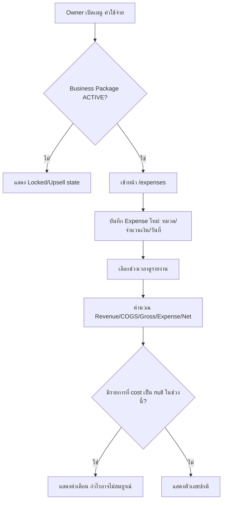

> **โมดูล:** M00016-ExpenseCostTracking
> **ประเภทเอกสาร:** Product Requirements Document (PRD)
> **เวอร์ชัน:** 1.0
> **วันที่จัดทำ:** 2026-07-08
> **สถานะ:** Draft
> **เจ้าของเอกสาร:** BA + PO + PM (ดู [[Feature-Docs-Ownership]])

# PRD: บันทึกค่าใช้จ่าย + ตั้งต้นทุนสินค้า (Expense & Cost Tracking)

---

## Executive Summary

วันนี้ Seller บน Deep เห็นแค่ "ยอดขาย" (Revenue) จาก order ที่ CONFIRMED — ไม่มีทางรู้ว่าขายแล้ว **กำไรจริง** เท่าไร เพราะระบบไม่มีที่เก็บต้นทุนสินค้า (COGS) และไม่มีที่บันทึกค่าใช้จ่ายดำเนินธุรกิจ (ค่าเช่า/ค่าบรรจุภัณฑ์/ค่าโฆษณา ฯลฯ) ฟีเจอร์นี้เติมช่องว่างนั้นด้วย 2 กลไกที่ทำงานร่วมกัน: (1) **ตั้งต้นทุนสินค้า** (`Product.cost`, optional) ที่ถูก **snapshot ลง `OrderItem.cost`** ตอนสร้าง order ทุกครั้ง (pattern เดียวกับ `OrderItem.price` เดิม) เพื่อให้ต้นทุนของออเดอร์เก่าไม่เปลี่ยนแปลงแม้ seller จะแก้ราคาทุนสินค้าทีหลัง และ (2) **บันทึกค่าใช้จ่าย** (Expense) แยกหมวดหมู่คงที่ (fixed list) ที่ผูกกับร้าน ทั้งสองกลไกไหลเข้าหน้าใหม่ `/expenses` (Paces, `(paces)/seller/**`) ที่แสดง **รายงานกำไรขาดทุนเต็มรูป (full P&L)** ตามช่วงเวลา: `Revenue − COGS = Gross Profit` และ `Gross Profit − Total Expense = Net Profit` โดยนับเฉพาะออเดอร์สถานะ `CONFIRMED` (สอดคล้อง pattern การนับ revenue ที่ dashboard เดิมใช้อยู่แล้ว)

ฟีเจอร์นี้เป็น **paid add-on ที่ไม่คิดเงินแยก** — ผูกเข้าเป็นสิทธิ์ของ **Business Package** (feature 00008) ที่มีอยู่แล้วในระบบ (ทุก tier ที่จ่ายเงิน: Growth/Pro/Business) reuse gating mechanism เดิม (`getSubscriptionStatus(ownerId)`) แทนการสร้าง billing ใหม่ ส่วนสิทธิ์เห็นข้อมูลการเงินภายในร้าน ผูกกับ owner เสมอ + owner เปิด/ปิดสิทธิ์ให้ `ShopMember(role=ADMIN)` (feature 00008/00012, live แล้ว) เห็นได้เองผ่าน toggle ระดับร้าน

---

## 1. Business Goals & KPIs

### 1.1 เป้าหมายทางธุรกิจ

| เป้าหมาย | รายละเอียด |
|----------|-----------|
| **ให้ Seller เห็นกำไรจริง ไม่ใช่แค่ยอดขาย** | ปิดช่องว่างที่ใหญ่ที่สุดของ Simple OMS เดิม — seller ตัดสินใจตั้งราคา/ลดต้นทุนได้จากข้อมูลจริง ไม่ใช่ความรู้สึก |
| **เพิ่มมูลค่า Business Package โดยไม่เพิ่ม billing ใหม่** | Bundle เป็นสิทธิ์ของ package ที่มีอยู่แล้ว (feature 00008) — เพิ่มเหตุผลให้ seller อัพเกรด/ไม่ downgrade โดยไม่ต้องสร้าง payment flow ใหม่ |
| **ต้นทุนที่แม่นยำตามเวลา (Historical Accuracy)** | ต้นทุนของออเดอร์เก่าต้องไม่เปลี่ยนเมื่อ seller แก้ราคาทุนสินค้าใหม่ — กำไรที่รายงานไปแล้วต้อง reproducible เสมอ |
| **Zero Regression บนสินค้า/ออเดอร์เดิม** | `Product.cost`/`OrderItem.cost` เป็น nullable, opt-in ทั้งหมด — สินค้าที่ไม่เคยตั้งต้นทุนต้องใช้งานได้เหมือนเดิมทุกประการ |

### 1.2 ตัวชี้วัดความสำเร็จ (KPIs)

| KPI | คำอธิบาย | เป้าหมาย |
|-----|----------|---------|
| **Cost Coverage Rate** | % ของ Product (active, ผ่าน CONFIRMED order อย่างน้อย 1 ครั้ง) ที่มี `cost` ไม่ null | ≥ 50% ภายใน 60 วันหลัง launch (baseline วัดหลัง launch เดือนแรก) |
| **Expense Logging Adoption** | % ของ shop ที่มีสิทธิ์เข้าถึง (Business Package ACTIVE) ที่บันทึก Expense อย่างน้อย 1 รายการภายใน 30 วัน | ≥ 30% |
| **P&L Report View Rate** | % ของ shop ที่มีสิทธิ์เข้าถึงที่เปิดหน้า `/expenses` อย่างน้อย 1 ครั้ง/สัปดาห์ | ติดตามเป็น baseline (ไม่ตั้งเป้าตายตัวรอบแรก) |
| **Business Package Retention** | อัตราการไม่ downgrade/cancel ของ owner ที่ใช้ Expense feature เทียบกับที่ไม่ใช้ | เพิ่มขึ้น (สัญญาณว่า perk มีผลต่อ retention) |

---

## 2. User Personas (กลุ่มผู้ใช้งาน)

### 2.1 Seller เจ้าของร้าน (Shop Owner) — Primary

**ข้อมูลพื้นฐาน:**
- Owner ของ Shop (PERSONAL หรือ BUSINESS) ที่ตนหรือ owner ระดับบน (กรณี Business shop) มี Business Package **ACTIVE** อยู่
- มีสินค้าและออเดอร์อยู่แล้วในระบบ (ผ่าน Simple OMS เดิม)

**เป้าหมาย:**
- รู้กำไรสุทธิของร้านตามช่วงเวลาที่เลือก (สัปดาห์/เดือน/กำหนดเอง) โดยไม่ต้องคำนวณเองใน Excel

**ความต้องการ:**
- ตั้งต้นทุนสินค้าแต่ละชิ้นได้ (optional — ไม่บังคับทุกชิ้น)
- บันทึกค่าใช้จ่ายดำเนินธุรกิจแยกหมวดได้เร็ว ไม่ต้องกรอกฟอร์มซับซ้อน
- เห็นรายงาน Revenue/COGS/Gross Profit/Expense/Net Profit รวมในหน้าเดียว ไม่ต้องคำนวณข้ามหน้า
- ควบคุมได้ว่าจะให้พนักงาน (admin) เห็นตัวเลขการเงินเหล่านี้หรือไม่

**จุดปวด (Pain Points):**
- ทุกวันนี้ต้องจดค่าใช้จ่าย/คำนวณกำไรแยกนอกระบบ (สมุด/Excel) — ข้อมูลไม่อยู่ที่เดียวกับยอดขาย
- กลัวว่าถ้าแก้ราคาทุนสินค้าใหม่ ตัวเลขกำไรของเดือนก่อน ๆ จะเปลี่ยนตามไปด้วย (ไม่ reliable)

### 2.2 พนักงานร้าน (ShopMember role=ADMIN) — Secondary

**ข้อมูลพื้นฐาน:**
- ถูก owner invite เข้ามาช่วยบริหาร Business shop (feature 00008/00012, live แล้ว)

**เป้าหมาย:**
- ถ้า owner อนุญาต อยากเห็นภาพรวมกำไร/ค่าใช้จ่ายเพื่อช่วยตัดสินใจงานประจำวัน (เช่น ตั้งราคาโปรโมชัน)

**ความต้องการ:**
- เข้าหน้า `/expenses` ได้เมื่อ owner เปิด toggle ให้เห็น — ถ้าไม่เปิด ต้องมองไม่เห็นเมนู/ข้อมูลนี้เลย ไม่ใช่แค่ disable ปุ่ม

**จุดปวด (Pain Points):**
- ถ้า default เปิดให้เห็นเอง จะกลายเป็นข้อมูลการเงินที่ owner ไม่ได้ตั้งใจแชร์ — ต้อง default ปิดเสมอ

### 2.3 Seller ที่ไม่มี Business Package (Free/Personal) — Boundary Persona

**ข้อมูลพื้นฐาน:**
- ส่วนใหญ่ของระบบวันนี้ — ไม่มี Business Package ACTIVE เลย

**เป้าหมาย:**
- ใช้งาน Simple OMS/Product เดิมได้ตามปกติ ไม่ถูกรบกวนจาก feature ที่ตัวเองยังไม่ได้จ่ายเงิน

**ความต้องการ:**
- เห็น entry point แบบ upsell เบา ๆ ไปหน้า `/expenses` (ล็อกอยู่) แต่ไม่ต้องเห็น field ต้นทุนแทรกเข้ามาในฟอร์มสินค้า/ออเดอร์เดิมโดยไม่จำเป็น (ต้อง confirm UX ว่าฟิลด์ cost ที่หน้า Product form แสดงเสมอหรือ gate ด้วย package — ดู §9.2 assumption)

**จุดปวด (Pain Points):**
- กลัว flow สร้างสินค้า/ออเดอร์เดิมช้าลงหรือซับซ้อนขึ้นเพราะ field ใหม่ที่ตัวเองใช้ไม่ได้

---

## 3. Business Requirements

### 3.1 ตั้งต้นทุนสินค้า (Product Cost)

**ความต้องการ:**
- Seller ตั้งราคาทุน (`cost`) ให้สินค้าแต่ละชิ้นได้ — เป็นฟิลด์ **optional** ไม่บังคับกรอก

**Business Rules:**
- `cost` ต้อง ≥ 0 ถ้ามีการกรอก
- สินค้าที่ไม่เคยตั้ง `cost` (null) ยังสร้าง/ขายได้ตามปกติทุกประการ — ไม่มีการบังคับให้ตั้งก่อนขาย
- แก้ไข `cost` ของสินค้าที่มีอยู่ **ไม่กระทบ** ต้นทุนของออเดอร์ที่เคยขายไปแล้ว (ดู §3.2 snapshot)

**เหตุผล:**
- Nullable + opt-in คือเงื่อนไข zero-regression กับสินค้าเดิมทั้งหมดในระบบที่ไม่เคยมี concept ต้นทุนมาก่อน

### 3.2 ต้นทุนล็อก ณ วันขาย (Cost Snapshot)

**ความต้องการ:**
- ทุกครั้งที่สร้างออเดอร์ ระบบต้องบันทึก "ต้นทุน ณ ขณะนั้น" ของแต่ละรายการสินค้าไว้ในตัวออเดอร์เอง ไม่ใช่ไปอ้างอิงต้นทุนปัจจุบันของสินค้า

**Business Rules:**
- Snapshot เกิดที่จุดสร้าง order เดียวกับที่ `OrderItem.price` ถูก snapshot อยู่แล้ว (pattern เดียวกัน)
- ถ้า `Product.cost` เป็น null ณ ขณะสร้างออเดอร์ → `OrderItem.cost` = null (ไม่มีค่าให้ snapshot — ไม่ใช่ error)
- รายการสินค้าที่ไม่ผูกกับ Product ใด ๆ (custom/manual line item, `OrderItem.productId` เป็น null) → `OrderItem.cost` เป็น null เสมอ (ไม่มีต้นทุนอ้างอิง)
- แก้ `Product.cost` ทีหลัง **ไม่มีผลย้อนหลัง** กับ `OrderItem.cost` ที่ snapshot ไปแล้ว

**เหตุผล:**
- P&L ของเดือนก่อนต้องคำนวณซ้ำได้ผลเดิมเสมอ (historical accuracy) — เหมือนเหตุผลที่ `OrderItem.price` ถูก snapshot แยกจาก `Product.price` มาตั้งแต่ต้น

### 3.3 บันทึกค่าใช้จ่าย (Expense Entry)

**ความต้องการ:**
- Seller บันทึก/ดู/แก้/ลบรายการค่าใช้จ่ายของร้านตนเองได้ที่หน้า `/expenses` — ระบุจำนวนเงิน, หมวดหมู่ (fixed list), วันที่เกิดค่าใช้จ่าย, หมายเหตุ (optional)

**Business Rules:**
- จำนวนเงิน (`amount`) ต้อง > 0
- หมวดหมู่ต้องเป็นค่าจาก fixed list เท่านั้น (ดู §3.4) — ไม่มีการเพิ่มหมวดเองในเวอร์ชันนี้
- Expense ทุกรายการผูกกับ `shopId` เดียว — seller เห็น/แก้/ลบได้เฉพาะของร้านตัวเองเท่านั้น (ดู §3.6 authorization)
- แก้ไข/ลบทำได้ทุกเวลา ไม่มีการล็อกรายการเก่า (ต่างจาก order ที่มี state machine)

**เหตุผล:**
- Fixed category ลดความซับซ้อนของ MVP (ไม่ต้องมี category management UI) และให้ report จัดกลุ่มได้ตรงกันทุกร้าน

### 3.4 หมวดหมู่ค่าใช้จ่าย (Fixed Category List)

**ความต้องการ:**
- ระบบกำหนดหมวดหมู่ตายตัว 7 หมวดให้ seller เลือกตอนบันทึก

**Business Rules:**

| ค่าที่เก็บใน DB | ป้ายภาษาไทย |
|---|---|
| `RENT` | ค่าเช่า |
| `PACKAGING` | ค่าบรรจุภัณฑ์ |
| `ADVERTISING` | ค่าโฆษณา |
| `SHIPPING` | ค่าขนส่ง |
| `SALARY` | เงินเดือน |
| `UTILITIES` | ค่าน้ำ-ค่าไฟ |
| `OTHER` | อื่นๆ |

- เก็บเป็น `String` enum-style (ตาม convention `Order.status`/`Shop.categories` เดิม — ไม่ใช้ Prisma `enum` จริง เพื่อเลี่ยง `ALTER TYPE` ทุกครั้งที่ปรับหมวด)

**เหตุผล:**
- ตรงกับ convention เดิมของระบบทั้งหมด (String-based state/category แทน Prisma enum) — เปลี่ยน/เพิ่มหมวดในอนาคตไม่ต้อง migration

### 3.5 รายงานกำไรขาดทุน (P&L Report)

**ความต้องการ:**
- หน้า `/expenses` แสดงรายงาน **Revenue, COGS, Gross Profit, Total Expense, Net Profit** ตามช่วงเวลาที่ seller เลือก (เช่น วันนี้/สัปดาห์นี้/เดือนนี้/กำหนดเอง)

**Business Rules:**
- **Revenue** = ผลรวม `Order.totalAmount` ของออเดอร์ที่ `status = CONFIRMED` และ `createdAt` อยู่ในช่วงที่เลือก (ใช้ `Order.createdAt` เป็น anchor — pattern เดียวกับ dashboard เดิมที่ group by `createdAt`)
- **COGS** = ผลรวม `OrderItem.cost × OrderItem.qty` ของทุกรายการใน order ที่เข้าเงื่อนไข Revenue ข้างต้น **เฉพาะรายการที่มี `cost` ไม่ null**
- **Gross Profit** = `Revenue − COGS`
- **Total Expense** = ผลรวม `Expense.amount` ของร้านนั้น ที่ `expenseDate` อยู่ในช่วงเวลาเดียวกัน
- **Net Profit** = `Gross Profit − Total Expense`
- ถ้ามี order ในช่วงที่เลือกที่มีอย่างน้อย 1 รายการสินค้าที่ `OrderItem.cost` เป็น null (ไม่เคยตั้งต้นทุน หรือเป็น custom line item) → รายงานต้องแสดง **คำเตือน "กำไรอาจไม่สมบูรณ์ (มีสินค้าที่ยังไม่ตั้งต้นทุน)"** กำกับตัวเลข Gross/Net Profit เสมอ ไม่ใช่แค่ error เงียบ ๆ

**เหตุผล:**
- แยก Gross/Net ชัดเจนตามหลักบัญชีพื้นฐาน — ให้ seller เห็นทั้ง "ต้นทุนสินค้า" และ "ค่าใช้จ่ายดำเนินงาน" แยกจากกัน ไม่ปนกันจนตีความผิด

### 3.6 สิทธิ์เห็นข้อมูลการเงิน (Finance Visibility)

**ความต้องการ:**
- เจ้าของร้าน (owner) เห็นข้อมูล Expense/P&L ของร้านตนเองเสมอ ไม่มีเงื่อนไข
- Owner ตั้งค่าเปิด/ปิดให้ `ShopMember(role=ADMIN)` ของร้านนั้นเห็นข้อมูลเดียวกันได้เอง ผ่าน toggle ระดับร้าน

**Business Rules:**
- Default = **ปิด** (`staffCanViewFinance = false`) เสมอตอนสร้างร้านใหม่ — ปลอดภัยไว้ก่อน owner ต้อง opt-in เอง
- Admin ที่ toggle ปิดอยู่ ต้อง **มองไม่เห็นเมนู/route `/expenses` เลย** ไม่ใช่แค่เห็นแต่กดไม่ได้ (ป้องกัน information disclosure ผ่าน UI)
- Toggle นี้ผูกกับ `Shop` (ต่อร้าน) ไม่ใช่ต่อ owner — ถ้า owner มีหลาย Business shop ต้องตั้งแยกร้านต่อร้าน
- ทุก query ของ Expense/P&L ต้อง scope ด้วย `shopId` เสมอ + ตรวจสิทธิ์ผู้เรียก (owner ของ shop นั้น หรือ admin ของ shop นั้นที่ toggle เปิด) ก่อนคืนข้อมูล — ห้าม cross-shop leak (ตาม memory `feedback_rsc_dal_authz`)

**เหตุผล:**
- ข้อมูลการเงินคือ PII/ความลับทางธุรกิจระดับสูงสุดของ seller — default ปิดคือทางเลือกปลอดภัยที่สุด ให้ owner เป็นคนตัดสินใจเปิดเอง ไม่ใช่ระบบตัดสินใจแทน

### 3.7 Gate การเข้าถึงด้วย Business Package (Paid Add-on, Bundled)

**ความต้องการ:**
- หน้า `/expenses` (ทั้งบันทึก/ดู/แก้/ลบ expense และดูรายงาน P&L) เข้าถึงได้เฉพาะร้านของ owner ที่มี **Business Package สถานะ ACTIVE** (tier ใดก็ได้ — Growth/Pro/Business) เท่านั้น — ไม่มีการคิดเงินแยกต่างหากสำหรับ feature นี้

**Business Rules:**
- Reuse entitlement เดิมของ feature 00008: `getSubscriptionStatus(ownerId)` (`src/services/business-package.service.ts`) — `status === 'ACTIVE'` = ปลดล็อก, ไม่มี row (`NOT_SUBSCRIBED`/FREE pseudo-state) หรือ `LOCKED_RENEWAL_FAILED` = ล็อก
- **การ resolve "ownerId" ของ shop ที่กำลังเข้าถึง** ต้อง confirm ที่ SRS: สำหรับ PERSONAL shop, `ownerId = Shop.userId`; สำหรับ BUSINESS shop ต้อง resolve ไปยัง `ShopMember(role=OWNER)` ของ shop นั้น (คนที่ถือ subscription จริง อาจไม่ใช่ผู้ใช้งานที่ login อยู่ถ้าเป็น admin) — mechanism ชัดเจนแล้วในโค้ด (`subscription-overview.service.ts` ใช้ pattern เดียวกันอยู่แล้ว) แต่ยัง**ไม่เคยถูกทดสอบกับ Expense feature โดยเฉพาะ**
- Shop ที่ owner ไม่มี Business Package ACTIVE (FREE หรือ LOCKED) → เห็น `/expenses` เป็น upsell/locked state เท่านั้น (ไม่ error 404 — แจ้งชัดว่าต้องมี package ก่อน) ไม่มีการเข้าถึงข้อมูลจริงใด ๆ

**เหตุผล:**
- ตรงกับ decision ที่ user ยืนยัน: ไม่สร้าง billing/wallet ใหม่ — ใช้ entitlement ของ feature 00008 ที่มีอยู่แล้วและพิสูจน์แล้วว่าใช้งานได้จริง (Inventory Add-on/Deep Stock Pro ใช้ pattern คล้ายกัน)

> **หมายเหตุสำคัญ (scope การ build):** ตามที่ user ยืนยัน — **build core (CRUD expense + cost snapshot + P&L calculation) ให้เสร็จและทดสอบได้ก่อน** โดยยังไม่ผูก paywall gate จริง (หรือ gate แบบ stub/always-true ระหว่าง dev) แล้วค่อยผูก FR-EXP-11 (gate จริง) เป็นงานถัดไปแยก — ลด risk ที่จะ debug ปนกันระหว่าง "logic ผิด" กับ "gate บล็อกไม่ให้เห็นผล"

### 3.8 กำไรจริงบนหน้ายอดขาย (Net Profit Surfaced on Sales Pages) — เพิ่ม 2026-08-02

**ความต้องการ:**
- Seller ที่มีสิทธิ์เข้าถึง (ผ่าน gate ของ §3.7 เดียวกัน) ต้องเห็น **กำไรสุทธิ** ไม่ใช่แค่ยอดขาย ในทุกจุดของแอปที่แสดงภาพรวมยอดขาย ไม่ใช่แค่หน้า `/expenses` — เพราะในทางปฏิบัติ owner เปิดหน้า "ยอดขาย"/แดชบอร์ดบ่อยกว่าหน้า `/expenses` มาก และเดิมหน้าเหล่านั้นแสดงแต่ยอดขาย (revenue) ที่ทำให้เข้าใจผิดว่าเป็นเงินที่ได้จริง

**ขอบเขต (3 surface):**
1. **`/sales`** (รายงานยอดขายเต็มรูป) — การ์ดสรุปขยายจาก 4 → 6 ใบ (เพิ่มค่าใช้จ่าย/กำไรสุทธิ), ตารางรายวันเพิ่ม 2 คอลัมน์ (ค่าใช้จ่าย/กำไรสุทธิ), กราฟเพิ่ม series ค่าใช้จ่าย
2. **การ์ด "ยอดขายและกำไร"** บน command center (มือถือ, หน้า dashboard) — hero ตัวเลขเปลี่ยนจาก "ยอดขาย" เป็น **กำไรสุทธิ**
3. **ชีตยอดขายเต็มจอ** (เปิดจากการ์ดข้อ 2) — เหมือนข้อ 2 แต่แสดงละเอียดเป็นรายวัน/รายเดือน

**Business Rules:**
- ทั้ง 3 surface ใช้สูตรกำไรสุทธิ**เดียวกัน**กับหน้า `/expenses` (§4.3): `Revenue − COGS − Expense` — ไม่ใช่สูตรลัด (เช่น `ยอดขายที่ยืนยันแล้ว − ค่าใช้จ่าย` โดยไม่หัก COGS) เพื่อไม่ให้ตัวเลขขัดกันข้าม surface
- Gate สิทธิ์เดียวกับ §3.7 ทุกจุด — seller ที่ไม่ผ่าน gate **ไม่เห็นคอลัมน์/การ์ด/series ที่เกี่ยวกับเงินเลย** (ไม่ใช่เห็นแต่เป็น ฿0 — การแสดง ฿0 จะสื่อผิดว่า "ไม่มีค่าใช้จ่าย" ทั้งที่จริงคือ "ไม่มีสิทธิ์ดู")
- Hero ของทั้ง 3 surface คือ**กำไรสุทธิ** ไม่ใช่ยอดขาย — ยอดขายลดชั้นเป็นข้อมูลรอง (บรรทัด/คอลัมน์ถัดไป) เพราะกำไรคือคำตอบที่ owner ต้องการจริง ๆ (feedback จากการใช้งานจริงบน prod 2026-08-02 ว่า hero เดิมเป็นยอดขายทำให้ owner เข้าใจผิดว่าคือเงินที่ได้)

**เหตุผล:** ปิดช่องว่างเดิมของ Executive Summary ("Seller เห็นแค่ยอดขาย ไม่รู้กำไรจริง") ให้ครบทุกจุดที่ seller มักดูภาพรวมร้าน ไม่ใช่แค่หน้า `/expenses` ที่เพิ่งสร้างใหม่และยังไม่ใช่พฤติกรรมเดิมของผู้ใช้

---

## 4. Business Rules & Constraints

### 4.1 กฎทางธุรกิจหลัก

| กฎ | คำอธิบาย |
|----|----------|
| **Revenue/COGS นับเฉพาะ CONFIRMED** | ออเดอร์สถานะ PENDING/SHIPPED/CANCELLED ไม่นับเข้ารายงาน P&L เลย |
| **VAT ตรงไปตรงมา** | กำไรคำนวณจาก `Order.totalAmount` (ยอดรวม VAT แล้ว) โดยตรง ไม่มีการแยก VAT ออกจากรายได้ในรายงานนี้ |
| **Cost Snapshot ไม่ย้อนหลัง** | แก้ `Product.cost` ทีหลังไม่กระทบ `OrderItem.cost` ของออเดอร์เก่าที่ snapshot ไปแล้ว |
| **Missing Cost = Exclude + Warning** | รายการที่ไม่มีต้นทุน ไม่ถูกคำนวณเป็น COGS (ไม่ใช่ถือว่า cost=0) แต่ต้องมีคำเตือนกำกับเสมอว่ากำไรอาจไม่สมบูรณ์ |
| **Expense = Period-Level ไม่หารลงออเดอร์** | ค่าใช้จ่ายดำเนินงาน (ค่า ads/ค่าเช่า/เงินเดือน ฯลฯ) หักที่ระดับ Net Profit ของช่วงเวลา **ไม่** allocate ลงรายออเดอร์ ตามหลักบัญชี OpEx มาตรฐาน. ตัวอย่าง: ค่า ads ฿500 วันที่ 8 ก.ค. ที่มี 11 ออเดอร์ → หัก ฿500 ก้อนเดียวจาก Net Profit ของวันนั้น ไม่ใช่ ฿45/ออเดอร์ (§4.4) |
| **Fixed Category เท่านั้น** | ไม่มี custom category ใน MVP — 7 หมวดตายตัว (§3.4) |
| **Owner-Only Default** | ข้อมูลการเงินเห็นเฉพาะ owner จนกว่า owner จะเปิด toggle ให้ admin เอง (default ปิด) |
| **Bundled Paid Add-on** | Gate ด้วย Business Package ACTIVE (tier ใดก็ได้) — ไม่มี billing แยกของ feature นี้เอง |

### 4.2 ข้อจำกัดทางธุรกิจ

| ข้อจำกัด | รายละเอียด |
|---------|-----------|
| **ไม่มี Refund/Adjustment ของ Expense ที่ผูก billing อื่น** | Expense เป็นการบันทึกข้อมูลอย่างเดียว ไม่เชื่อมกับ SellerWallet/WalletTransaction ใด ๆ |
| **ไม่มี multi-currency** | ทุกจำนวนเงินเป็นบาทไทย (Decimal 12,2) เหมือน field เงินอื่นในระบบ |
| **ไม่มี audit trail ละเอียดของการแก้ไข Expense** | MVP ไม่เก็บ history การแก้ไข/ลบ (ต่างจาก order ที่มี state machine + tracking) — ถ้าต้องการ audit log เป็น Phase 2 |
| **Toggle staffCanViewFinance ผูกกับ Business shop เท่านั้นในทางปฏิบัติ** | Personal shop ปกติไม่มี ShopMember(ADMIN) อื่นอยู่แล้ว (1 user = owner คนเดียว) — field มีผลจริงเฉพาะ Business shop แต่ประกาศไว้ที่ `Shop` ทุกแถวเพื่อความสม่ำเสมอของ schema |

### 4.3 สูตรคำนวณ P&L (สรุป)

```
Revenue        = Σ Order.totalAmount   WHERE shopId = X AND status = 'CONFIRMED' AND createdAt ∈ [start, end]
COGS           = Σ (OrderItem.cost × OrderItem.qty)
                   WHERE OrderItem.orderId ∈ (orders ข้างต้น) AND OrderItem.cost IS NOT NULL
Gross Profit   = Revenue − COGS
Total Expense  = Σ Expense.amount      WHERE shopId = X AND expenseDate ∈ [start, end]
Net Profit     = Gross Profit − Total Expense
```

### 4.4 กฎการคิดค่าใช้จ่าย (Expense Allocation) — Period-Level เท่านั้น

Expense ทุกหมวด (รวมค่า ads/โปรโมชัน) เป็น **operating expense ระดับช่วงเวลา** — หักที่ Net Profit ของช่วงเวลาทั้งก้อน **ไม่ถูก allocate (หาร) ลงรายออเดอร์** ต่างจาก COGS (ต้นทุนสินค้า) ที่ผูกรายออเดอร์ผ่าน snapshot

**เหตุผล:** ค่า ads โปรโมตทั้งวันไม่ได้เจาะจงว่าออเดอร์ไหนเกิดจาก ad ตัวไหน (บาง impression ไม่ปิดการขายเลย) — การหารเฉลี่ยลงออเดอร์จะทำให้ "กำไรต่อออเดอร์" เพี้ยนโดยไม่มีฐานความจริงรองรับ. **Per-order cost allocation (แบ่งค่าใช้จ่ายลงออเดอร์) = Out of Scope** (ดู §5) — ถ้าจำเป็นในอนาคตเป็น Phase 2 พร้อมนิยามกฎการหารที่ชัดเจน

| ตัวอย่าง (8 ก.ค.) | ค่า |
|---|---|
| Revenue (11 ออเดอร์) | 3,300 |
| − COGS (ต้นทุนสินค้ารายออเดอร์) | 1,650 |
| = Gross Profit | 1,650 |
| − ค่า ads FB (period-level, ก้อนเดียว) | 500 |
| = **Net Profit ของวัน** | **1,150** |

---

## 5. Out of Scope (นอกขอบเขต)

| หัวข้อ | คำอธิบาย |
|--------|----------|
| **Billing/paywall แยกของ Expense feature เอง** | Gate ด้วย Business Package ที่มีอยู่แล้วเท่านั้น (§3.7) — ไม่มี SellerWallet deduction ใหม่ |
| **Custom expense category** | MVP มีแค่ 7 หมวดตายตัว — เพิ่ม/แก้หมวดเองเป็น Phase 2 |
| **Audit trail/history ของการแก้ไข Expense** | ไม่เก็บ diff/versioning ใน MVP — Phase 2 |
| **แยก VAT ออกจากรายได้ในรายงาน (Revenue excl. VAT)** | MVP ใช้ `totalAmount` ตรง ๆ — Phase 2 ถ้าต้องการความละเอียดระดับบัญชี |
| **Recurring/scheduled expense (เช่น ค่าเช่ารายเดือนอัตโนมัติ)** | ต้องบันทึกมือทุกครั้งใน MVP — Phase 2 |
| **Export รายงาน (PDF/Excel)** | MVP แสดงบนหน้าเว็บเท่านั้น — Phase 2 |
| **Budget/เป้าหมายค่าใช้จ่ายและแจ้งเตือนเกินงบ** | ไม่มีใน MVP — Phase 2 |
| **RBAC granular กว่า Owner/Admin toggle เดียว** | ไม่มี role ย่อย (เช่น "เห็นแต่ COGS ไม่เห็น Expense") — Phase 2 ถ้าจำเป็น |
| **Per-Order Cost Allocation (หารค่าใช้จ่ายลงรายออเดอร์)** | Expense เป็น period-level เท่านั้น (§4.4) — การหารค่า ads/ค่าใช้จ่ายเฉลี่ยลงรายออเดอร์เพื่อดูกำไรต่อออเดอร์ = Phase 2 (ต้องนิยามกฎการหาร: เท่ากัน/ตามยอดขาย) |
| **Cross-shop P&L รวมยอด (สำหรับ owner ที่มีหลาย Business)** | MVP ดูทีละร้านเท่านั้น — Phase 2 (คล้าย pattern feature 00008 §5) |

---

## 6. Risks & Mitigation (ความเสี่ยงและแนวทางแก้ไข)

### 6.1 ความเสี่ยงทางธุรกิจ

| ความเสี่ยง | ผลกระทบ | ระดับความรุนแรง | แนวทางแก้ไข |
|-----------|---------|-----------------|-------------|
| **Seller ไม่ตั้งต้นทุนสินค้าเลย → รายงานไร้ความหมาย** | Cost Coverage ต่ำ, feature ดูไม่มีค่า | กลาง | คำเตือน "กำไรอาจไม่สมบูรณ์" แบบเห็นชัดทุกครั้งที่มี gap + ทำ empty-state ชวนตั้งต้นทุนตอนแรกเข้าหน้า (รายละเอียด UX รอ safepay-ux) |
| **Owner เข้าใจผิดว่า Net Profit = เงินสดในมือ** | ความเข้าใจผิดเชิงบัญชี (ไม่รวม VAT แยก, ไม่รวม tax) | ต่ำ | Label/tooltip อธิบายสูตรชัดเจนในหน้า report (ไม่ต้อง disclaimer ซับซ้อน) |
| **Toggle staffCanViewFinance เปิดผิดโดยไม่ตั้งใจ** | ข้อมูลการเงินรั่วถึง admin ที่ไม่ควรเห็น | กลาง | Default ปิดเสมอ + UI ต้องมี confirm step ก่อนเปิด toggle (รายละเอียด UX รอ safepay-ux) |

### 6.2 ความเสี่ยงทางเทคนิค

| ความเสี่ยง | ผลกระทบ | แนวทางแก้ไข |
|-----------|---------|-------------|
| **Resolve ownerId ผิดพลาดสำหรับ Business shop (§3.7)** | Gate ผิด — block เจ้าของจริง หรือปล่อยให้คนไม่มีสิทธิ์เข้าได้ | Reuse `getSubscriptionStatus` + logic resolve owner เดียวกับ `subscription-overview.service.ts` ที่พิสูจน์แล้ว, เขียน test ครอบคลุมทั้ง PERSONAL/BUSINESS shop context ก่อน sign-off |
| **Query P&L สแกนทุก Order/OrderItem ของช่วงเวลายาว (เช่น 1 ปี) ช้า** | Performance บนร้านที่มีออเดอร์เยอะ | Index ที่เหมาะสมบน `Order(shopId, status, createdAt)` (อาจมีอยู่แล้วบางส่วนจาก dashboard เดิม — ตรวจสอบใน DATABASE.md), พิจารณา pagination/cap ช่วงเวลาสูงสุดถ้าจำเป็น |
| **Migration Product.cost/OrderItem.cost บน production ที่มีข้อมูลจริงอยู่แล้ว** | Field ใหม่ nullable — ความเสี่ยงต่ำ แต่ยังต้องระวัง migration บน DB ที่แชร์กับ dev (ดู memory `project_shared_db_drift_no_migrate_dev`) | Additive migration เท่านั้น (nullable columns), ไม่แตะ column เดิม, ตาม convention migration ทั้งหมดของโปรเจกต์ |

---

## 7. Glossary (อภิธานศัพท์)

| คำศัพท์ | ความหมาย |
|---------|----------|
| **COGS (Cost of Goods Sold)** | ต้นทุนสินค้าที่ขายไปจริงในช่วงเวลาที่คำนวณ = Σ (ต้นทุนที่ snapshot ไว้ × จำนวน) |
| **Gross Profit** | กำไรขั้นต้น = Revenue − COGS (ก่อนหักค่าใช้จ่ายดำเนินงาน) |
| **Net Profit** | กำไรสุทธิ = Gross Profit − Total Expense |
| **Cost Snapshot** | การบันทึกต้นทุนสินค้า ณ ขณะสร้างออเดอร์ลงใน `OrderItem.cost` — ไม่เปลี่ยนตามการแก้ไข `Product.cost` ภายหลัง |
| **Expense** | รายการค่าใช้จ่ายดำเนินธุรกิจที่ seller บันทึกเอง แยกหมวดตาม fixed list |
| **Business Package** | Subscription 4 tier (Free/Growth/Pro/Business) จาก feature 00008 — Expense feature เป็นสิทธิ์ที่ bundle มากับทุก tier ที่จ่ายเงิน |
| **staffCanViewFinance** | Toggle ระดับ Shop ที่ owner เปิด/ปิดเพื่อให้ ShopMember(ADMIN) เห็นข้อมูล Expense/P&L ได้ |

---

## 8. Success Metrics (ตัวชี้วัดความสำเร็จ)

| ตัวชี้วัด | ค่าที่คาดหวัง | วิธีวัด |
|----------|---------------|--------|
| **Zero Regression บน Product/Order เดิม** | สินค้า/ออเดอร์ที่ไม่มี cost ทำงานเหมือนเดิมทุกประการ ไม่มี error | Regression test suite ครอบคลุม flow สร้างสินค้า/ออเดอร์เดิมก่อน sign-off |
| **Cost Snapshot Correctness** | แก้ `Product.cost` แล้ว `OrderItem.cost` ของออเดอร์เก่าไม่เปลี่ยน 100% ของเคสทดสอบ | Test scenario: สร้างออเดอร์ → แก้ cost สินค้า → re-query ออเดอร์เก่า |
| **P&L Formula Accuracy** | ตัวเลข Revenue/COGS/Gross/Expense/Net ตรงกับสูตร §4.3 100% ในทุกเคสทดสอบ (รวม edge case cost ขาด) | Unit test ต่อสูตรคำนวณ + fixture data ครอบคลุม missing-cost case |
| **Access Control Correctness** | Admin ที่ toggle ปิดมองไม่เห็น route/data เลย, ร้านที่ Business Package ไม่ ACTIVE เข้าไม่ได้ | Security/authorization test ต่อทุก combination (owner/admin × toggle on-off × package active/locked) |

---

## 9. Dependencies & Assumptions

### 9.1 สิ่งที่ต้องพึ่งพา (Dependencies)

| ระบบ/ส่วนประกอบ | ความสัมพันธ์ |
|-----------------|-------------|
| **Business Package (feature 00008, live)** | ให้ entitlement gate ผ่าน `getSubscriptionStatus(ownerId)` — reuse ตรง ๆ ไม่สร้าง billing ใหม่ |
| **ShopMember (feature 00008, live)** | ให้ role OWNER/ADMIN สำหรับตัดสิน finance visibility (§3.6) |
| **Shop Staff Invite Links (feature 00012, live)** | ช่องทางที่ admin เข้ามาเป็น ShopMember ตั้งแต่แรก — ไม่ต้องสร้างใหม่ |
| **Product/Order/OrderItem model เดิม** | เพิ่ม field แบบ additive (`Product.cost`, `OrderItem.cost`) — ไม่แตะ logic การสร้าง order เดิมนอกจากจุด snapshot |
| **Dashboard revenue-calc pattern (`dashboard.service.ts`)** | Reuse convention เดียวกัน (`Order.createdAt` เป็น anchor, `status='CONFIRMED'`) เพื่อให้ตัวเลข Revenue สอดคล้องกับที่ dashboard แสดงอยู่แล้ว |
| **Paces (`(paces)/seller/**`)** | หน้า `/expenses` ใหม่ต้อง copy จาก Paces primitive ตาม Hard Rule 1/7/8 (safepay-ux ออก Design Spec ก่อน) |

### 9.2 Decisions (ยืนยันแล้วโดย user — 2026-07-08 รอบ 2)

- ✅ **Entitlement gate นับทุก tier ที่จ่ายเงินเท่ากันหมด** — "แค่จ่ายก็ได้รับ" ไม่จำกัดเฉพาะ tier สูง (Growth/Pro/Business ปลดล็อกเท่ากัน; Free = ล็อก)
- ✅ **ช่วงเวลารายงาน P&L** = วันนี้/7 วัน/30 วัน/เดือนนี้/กำหนดเอง (custom range) — เพียงพอ
- ✅ **`expenseDate` แยกจาก `createdAt`** รองรับ backdate ค่าใช้จ่ายที่เกิดก่อนวันบันทึก
- ✅ **หมวดค่าใช้จ่าย 7 หมวด** (§3.4) เพียงพอสำหรับ MVP — ไม่เพิ่ม/ตัด
- ✅ **Field `Product.cost` แสดงในฟอร์มสินค้าเสมอ แต่ disabled + badge "อัปเกรดเป็น Business"** สำหรับ seller ที่ไม่มี Business Package ACTIVE — ปลดล็อกให้แก้ได้เมื่อ package ACTIVE (ดู FR-EXP-01 หมายเหตุ + Design Spec โดย safepay-ux)

**ยังเหลือ confirm ตอน SRS (technical detail — ไม่กระทบ scope):**
- **ownerId ของ Business shop resolve จาก `ShopMember(role=OWNER)`** — reuse pattern เดียวกับ `subscription-overview.service.ts` (ดู §3.7/§6.2 — technical, พิสูจน์ด้วย test)

---

## 10. Appendix

### 10.1 ตัวอย่าง User Journey — บันทึกค่าใช้จ่าย + ดูรายงานกำไร

**Scenario: Owner ที่มี Business Package ACTIVE เปิดหน้า /expenses ครั้งแรกของเดือน**

1. Owner login เข้า `seller.*` เปิดเมนู "ค่าใช้จ่าย" → ระบบตรวจ Business Package ACTIVE ผ่าน → เข้าหน้า `/expenses` ได้
2. Owner กด "บันทึกค่าใช้จ่าย" → เลือกหมวด "ค่าโฆษณา" → กรอกจำนวนเงิน 1,500 บาท → เลือกวันที่ → บันทึก
3. Owner เลื่อนดูรายงาน P&L เลือกช่วง "เดือนนี้" → เห็น Revenue ฿50,000 (จาก 20 ออเดอร์ CONFIRMED), COGS ฿28,000 (18 ออเดอร์มีต้นทุนครบ, 2 ออเดอร์ไม่มี → มีคำเตือน), Gross Profit ฿22,000, Total Expense ฿5,000 (รวมรายการที่เพิ่งบันทึก), Net Profit ฿17,000
4. Owner เห็นคำเตือน "กำไรอาจไม่สมบูรณ์" → กดลิงก์ไปตั้งต้นทุนสินค้าที่ยังไม่มี cost



### 10.2 ตัวอย่าง — Owner ตั้ง staffCanViewFinance ให้ Admin เห็นรายงาน

1. Owner เปิดหน้าตั้งค่าร้าน (Business shop) → เห็น toggle "ให้พนักงานเห็นข้อมูลการเงิน" (default ปิด)
2. Owner เปิด toggle → ระบบยืนยันอีกครั้ง (confirm step) → บันทึก `Shop.staffCanViewFinance = true`
3. Admin ของ Business shop นั้น login เข้ามา → เมนู "ค่าใช้จ่าย" ปรากฏขึ้น (เดิมไม่เคยเห็น) → เข้าดูรายงานได้ (read + write ตาม MVP membership-based access เดิมของ feature 00008)

### 10.3 Decisions (ยืนยันแล้วโดย Controller/User — 2026-07-08)

| # | เรื่อง | Decision (ยืนยันแล้ว) |
|---|------|----------------------|
| **D-1** | รูปแบบ P&L | Full profit calc — Revenue − COGS = Gross Profit; Gross Profit − Expense = Net Profit; นับเฉพาะ order CONFIRMED (§3.5) |
| **D-2** | ตำแหน่งหน้าจอ | หน้าใหม่แยก `/expenses` (`(paces)/seller/**`) ไม่ฝังใน `/sales` — รวมบันทึก/ดู/แก้/ลบ expense + รายงาน (Executive Summary) |
| **D-3** | หมวดหมู่ค่าใช้จ่าย | Fixed list 7 หมวด, String enum-style ตาม convention เดิม (§3.4) |
| **D-4** | โมเดล billing | รวมใน Business Package ที่มีอยู่แล้ว ไม่คิดเงินแยก ไม่แตะ SellerWallet เพิ่ม (§3.7) — gate ด้วย `getSubscriptionStatus` เดิม |
| **D-5** | ต้นทุนสินค้า | `Product.cost Decimal(12,2)?` nullable opt-in + `OrderItem.cost` snapshot ณ วันขาย ไม่ย้อนหลัง (§3.1, §3.2) |
| **D-6** | VAT | คำนวณจาก `Order.totalAmount` (รวม VAT) ตรงไปตรงมา ไม่แยก VAT ออก (§4.1) |
| **D-7** | สิทธิ์เห็นข้อมูลการเงิน | Owner เห็นเสมอ + toggle ระดับร้าน `staffCanViewFinance` (default false) ให้ ShopMember(ADMIN) เห็นได้เอง — ใช้ ShopMember ที่ live แล้วจาก feature 00008 (§3.6) |
| **D-8** | Business Package tier | ทุก tier ที่จ่ายเงินปลดล็อกเท่ากัน ("แค่จ่ายก็ได้รับ") — ไม่จำกัดเฉพาะ tier สูง (§9.2) |
| **D-9** | ช่อง cost ในฟอร์มสินค้า (ไม่มี package) | แสดงเสมอแต่ **disabled + badge "อัปเกรดเป็น Business"** — ไม่ซ่อน field, ปลดล็อกเมื่อ package ACTIVE (§9.2, FR-EXP-01) |
| **D-10** | การคิดค่าใช้จ่าย | Period-level เท่านั้น — ค่า ads/ค่าใช้จ่ายไม่หารลงรายออเดอร์ หักที่ Net Profit ของช่วงเวลา (§4.4). Per-order allocation = Out of Scope |
| **D-11** | ช่วงเวลา/backdate/หมวด | ช่วงเวลา 5 แบบเพียงพอ + `expenseDate` backdate ได้ + 7 หมวดพอสำหรับ MVP (§9.2) |
| **D-12** | กำไรบนหน้ายอดขาย (เพิ่ม 2026-08-02) | Net Profit ไหลเข้า 3 surface ของหน้ายอดขาย (`/sales`, การ์ด command center, ชีตเต็มจอ) ด้วยสูตรเดียวกับ `/expenses` เป๊ะ + gate สิทธิ์เดียวกัน (§3.8) — ไม่ใช่ scope เดิมตอนเขียน PRD รอบแรก แต่เป็นส่วนขยายของเป้าหมาย "เห็นกำไรจริง" เดียวกัน |

**เหลือ confirm ตอน SRS (technical เท่านั้น ไม่กระทบ scope):** resolve ownerId ของ Business shop ให้ครบทุกเคสทดสอบ (§3.7/§6.2)

**สถานะ implement (อัปเดต 2026-08-02):** Core (D-1..D-11) + ส่วนขยาย D-12 **deployed แล้ว** (branch `feature/expenses`, redesign commits `69b235f4`/`3148bb42`/`a20d99ac`/`69a224ad`/`e0ec4926`/`56dcc657`) — ดูรายละเอียดเชิงเทคนิคที่ SRS.md §10, UI ที่ `docs/superpowers/specs/2026-08-02-expenses-redesign-design-spec.md`

---

## ส่วนขยาย 2026-08-07 — เปิดฟรี + ต้นทุนรายออเดอร์/รายสินค้า

> เกิดจาก Scope Audit ที่ Controller สั่งตรวจ 00016 เทียบกับ request "พัฒนาระบบต้นทุนสินค้า" ของ user
> (2026-08-07) — พบว่าฟีเจอร์มีอยู่แล้วครบตาม PRD/BRD เดิม แต่ **ถูกล็อกหลัง Business Package
> จ่ายเงิน** ทำให้ร้านทั่วไปเข้าใจว่าไม่มีฟีเจอร์นี้ + พบ 3 จุดที่ยังไม่มีการมองเห็นผล (visibility gap)
> user เคาะมติ D-EXT-1..3 แล้ว (ล็อกแล้ว — ดู BRD §11 สำหรับ decision log เต็ม)

### Goal

ให้ทุกร้าน (ไม่ต้องจ่ายเงิน) เห็นต้นทุน/กำไรของธุรกิจตัวเองได้ครบ 3 จุดที่คนขายมองหาจริง: ตอนดูออเดอร์ทีละใบ, ตอนดูรายการสินค้าทั้งชุด, และตอนนำเข้าสินค้าจำนวนมากผ่าน CSV — ไม่ใช่แค่รายงานรวมที่หน้า `/expenses` เท่านั้น

### User Stories (ต่อ gap)

| ID | User Story | Priority | Acceptance Criteria |
|----|-----------|----------|---------------------|
| S-EXP-10 | ในฐานะ Seller ทุกร้าน (ไม่ต้องมี Business Package) ฉันต้องการตั้งต้นทุนสินค้าและดูรายงานกำไร-ขาดทุนได้ฟรี | Must | ช่อง "ราคาทุน" กรอกได้เสมอ ไม่มี badge/disabled; `/expenses` เข้าได้โดยไม่ต้องสมัครแพ็กเกจ |
| S-EXP-11 | ในฐานะ Seller ฉันต้องการเห็นกำไรของออเดอร์แต่ละใบตอนเปิดดูรายละเอียด ไม่ใช่แค่ยอดรวมทั้งเดือน | Must | หน้า order detail มีบรรทัด/การ์ดกำไรของใบนั้น พร้อมป้ายเตือนถ้าต้นทุนไม่ครบ |
| S-EXP-12 | ในฐานะ Seller ฉันต้องการเห็นต้นทุน/กำไรต่อชิ้นตอนไล่ดูรายการสินค้าทั้งร้าน โดยไม่ต้องเปิดฟอร์มแก้ไขทีละชิ้น | Should | ตาราง `/products` (เดสก์ท็อป) และการ์ด (มือถือ) มีคอลัมน์/บรรทัดต้นทุน+มาร์จิ้น% |
| S-EXP-13 | ในฐานะ Seller ที่มีสินค้าจำนวนมาก ฉันต้องการตั้งต้นทุนพร้อมกันหลายชิ้นผ่าน CSV แทนการกรอกทีละชิ้น | Should | CSV import (Inventory Add-on) มีคอลัมน์ `cost` เพิ่มจาก `stockQty` เดิม |

### Functional Requirements (ต่อจาก FR-EXP-01..12 เดิม)

**FR-EXP-13: ถอด Business Package gate ออกจากต้นทุนสินค้า+P&L ทั้งชุด**
ทุกร้าน (owner ที่ไม่มี Business Package, package LOCKED, หรือ ACTIVE ก็ตาม) เข้าถึง `Product.cost`/`/expenses`/รายงาน P&L/กำไรบน 3 surface หน้ายอดขาย (เดิม FR-EXP-12) ได้เหมือนกันหมด — **superseded FR-EXP-11 เดิมทั้งข้อ** (FR-EXP-11 คงไว้ในเอกสารเพื่อ audit trail แต่ไม่มีผลบังคับใช้อีกต่อไป) สิทธิ์ owner-vs-admin (`staffCanViewFinance` toggle) **ยังคงอยู่เหมือนเดิมทุกประการ** — สิ่งที่ถอดคือเงื่อนไข "ต้องจ่ายเงินก่อน" เท่านั้น ไม่ใช่ถอดเงื่อนไข "ต้องเป็น owner หรือ staff ที่ได้รับอนุญาต"

Priority: Must — acceptance: ดู BRD §11.3

**FR-EXP-14: กำไรรายออเดอร์ (Order-level Profit)**
หน้า order detail (`/orders/[token]`) แสดงกำไรของออเดอร์ใบนั้น (`Revenue ใบนี้ − COGS ใบนี้`) เฉพาะออเดอร์ที่นับเป็นยอดขายแล้ว (นิยามเดียวกับ `countsAsRevenue`/`revenueOrderWhere` ใน `src/lib/order-revenue.ts` ที่ dashboard/P&L ใช้อยู่) — ออเดอร์ที่ยังไม่นับยอดขายไม่แสดงตัวเลขกำไร แสดงป้าย "ยังไม่นับเป็นยอดขาย" แทน ผูก access gate เดียวกับ P&L report (`resolveExpenseAccess` = GRANTED) — ไม่ผูกกับ paywall (FR-EXP-13)

Priority: Must — acceptance: ดู BRD §11.3

**FR-EXP-15: ต้นทุน/มาร์จิ้นในรายการสินค้า**
หน้า `/products` ทั้งตารางเดสก์ท็อปและการ์ดมือถือ แสดง `Product.cost` (ถ้ามี) + มาร์จิ้น % (`(price−cost)/price`) ต่อสินค้า — ใช้ค่าเดียวกับที่ฟอร์มแก้ไขสินค้าใช้อยู่แล้ว ไม่มี access gate เพิ่มเติมเหนือสิทธิ์เข้าหน้า `/products` เดิม (เหตุผล: เป็น field เดียวกับที่ฟอร์มแก้ไขเปิดให้ทุก ShopMember เห็น/แก้ได้อยู่แล้วตาม D-EXT-2 — การเพิ่ม gate เฉพาะหน้ารายการจะสร้างความไม่สอดคล้องใหม่)

Priority: Should — acceptance: ดู BRD §11.3

**FR-EXP-16: ช่อง `cost` ใน CSV Bulk Import**
`POST /api/inventory/csv/import` รับคอลัมน์ `cost` เพิ่มจาก `stockQty` เดิม — แถวที่ cell ว่าง = ไม่แตะ `Product.cost` เดิม, แถวที่มีค่า (รวม `0`) = ตั้งค่าใหม่ ยังคงอยู่ใต้ gate เดิมของ Inventory Add-on PRO tier (`isProActive`) — **gate นี้ไม่เกี่ยวกับ Business Package และ FR-EXP-13 ไม่ถอด**

Priority: Should — acceptance: ดู BRD §11.3

### Non-Functional Requirements

- อ้าง NFR เดิมของ 00016 (SRS §6): correctness ของสูตร P&L ต้องคงเดิม 100% แม้ถอด gate
- **NFR-EXT-1 (ใหม่):** การถอด gate ต้องไม่เพิ่ม query ใหม่ที่กระทบ perf — `resolveExpenseAccess()` ที่ตัดการเรียก `getSubscriptionStatus()` ออกจะ**เร็วขึ้น** (query น้อยลง 1 ครั้งต่อ request) ไม่ใช่ช้าลง

### Out of Scope

| หัวข้อ | สถานะ |
|---|---|
| Allocate ค่าส่ง/ค่าใช้จ่าย (Expense) ลงรายออเดอร์ | **ยังไม่ทำ** — Expense ยังเป็น period-level ตาม D-10 เดิม ไม่เปลี่ยน |
| ต้นทุนของ `Room` (LODGING vertical) | **นอกขอบเขต** — `Room` เป็นคนละ model จาก `Product` ไม่มีคอลัมน์ `cost` และร้าน LODGING ไม่มีเมนู `/products` ให้เข้าถึงอยู่แล้ว (แยก vertical menu) ถ้าต้องการ = feature ใหม่ |
| แก้ KG-EXT-01 (`staffCanViewFinance` ไม่ครอบ `Product.cost`) | **Deferred ตาม D-EXT-2** — ดู BRD §11.2 |
| Export/รายงานแถว CSV ที่นำเข้า cost ไม่สำเร็จ | ใช้ response `results[]` เดิมของ endpoint (ตาม pattern `stockQty`) ไม่เพิ่ม UI ใหม่ |
| Refund/สื่อสารกับ subscriber เดิมของ Business Package เรื่องถอด perk | Out of Scope ทางวิศวกรรม — เป็นการตัดสินใจธุรกิจ/การตลาดที่ user รับทราบผลกระทบแล้ว (BRD §11.1) ไม่มี migration ทาง DB ที่ต้องทำ |

### Success Metrics (เพิ่มจากเดิม)

| Metric | เป้าหมาย |
|---|---|
| Cost Coverage Rate (เดิม) | เปลี่ยนฐานอ้างอิง — วัดทุกร้านแทนเฉพาะร้านที่มี Business Package (ตัวเลขที่สูงขึ้นมาจากกลุ่มตัวอย่างใหญ่ขึ้น ไม่ใช่ signal คุณภาพเดิม — ห้ามเทียบข้ามเส้นแบ่งวันเปิดฟรี) |
| **Order-Detail Profit View Rate (ใหม่)** | % ของ order detail page view ที่เห็นกำไรรายใบ (ไม่ใช่ป้าย "ยังไม่นับยอดขาย") — เก็บ baseline หลัง launch 30 วัน |
| **CSV Cost Import Adoption (ใหม่)** | % ของ CSV import request ที่มีอย่างน้อย 1 แถวส่ง `cost` มา — เก็บเป็น baseline |

---

## ส่วนขยาย 2026-08-08 — ระบุต้นทุนตอนเปิดบิล

> เกิดจากร้านจริง (ธนภัทร์ อะไหล่มอเตอร์ไซค์) ที่เปิดบิลจากแชทโดยพิมพ์ชื่ออะไหล่เอง —
> **ต้นทุนไม่เคยถูกบันทึกเลยสักรายการ (0 จาก 95)** ทั้งที่สินค้า 17 จาก 23 ตัวตั้งต้นทุนไว้แล้ว
> user เคาะมติ D-EXT-4/D-EXT-5 (ล็อกแล้ว — ดู BRD §12.1)

### Goal

ให้ผู้ขายกรอกต้นทุนได้ **ณ จุดที่เปิดบิล** ไม่ใช่ต้องไปตั้งที่หน้าสินค้าก่อน — ปิดช่องว่างที่ทำให้ร้านซึ่งขายผ่านแชทไม่มีข้อมูลต้นทุนเลย ทั้งที่เป็นกลุ่มผู้ใช้หลักของระบบ

### User Story

| ID | User Story | Priority |
|---|---|---|
| S-EXP-14 | ในฐานะผู้ขายที่เปิดบิลเร็ว ๆ จากแชท ฉันต้องการกรอกต้นทุนของแต่ละรายการได้ในหน้าเดียวกัน โดยไม่กรอกก็ยังบันทึกบิลได้ตามปกติ | Must |

### FR-EXP-17: ช่องต้นทุนรายบรรทัดในฟอร์มออเดอร์

`CreateOrderSchema.items[]` เพิ่ม `cost?: number (≥0)` — ฟอร์มสร้าง/แก้ไขออเดอร์แสดงช่อง "ราคาทุน" ต่อรายการ (optional) ทั้งกรณีเลือกจากแคตตาล็อกและพิมพ์ชื่อเอง (Quick-Create)

- ไม่กรอก = ไม่ส่ง key = พฤติกรรมเดิมทุกประการ (fallback `Product.cost` ตาม FR-EXP-02)
- กรอกค่า (รวม `0`) = ใช้เป็น `OrderItem.cost` ของบรรทัดนั้นเสมอ
- **write-back เข้า `Product.cost` เฉพาะตอนสินค้านั้นยังไม่มีต้นทุน** (D-EXT-5)
- **ห้ามบล็อกการบันทึกออเดอร์ด้วยเหตุใดที่เกี่ยวกับช่องนี้** — validation เดียวคือ `cost ≥ 0`

Priority: Must — acceptance: BRD §12.3

### Out of Scope

| หัวข้อ | สถานะ |
|---|---|
| Backfill ต้นทุนของออเดอร์เก่าเป็นชุด (95 ใบของร้านธนภัทร์) | **ไม่ทำ** — ดู BRD §12.5 · ออเดอร์ที่ยัง `PENDING` แก้ได้เองอยู่แล้วโดยเปิดแล้วบันทึกใหม่ |
| ต้นทุนของ `Room` (LODGING) | นอกขอบเขต — `Room` ไม่มีคอลัมน์ `cost` |
| แสดงกำไรเป็นจำนวนเงินระหว่างกรอกบิล | **ไม่ทำ** — ระหว่างกรอก ข้อมูลยังไม่ครบ ตัวเลขที่ได้เป็นเพดานบนที่หลอกได้ · แสดงเป็นตัวนับ "ตั้งต้นทุนแล้ว x/y รายการ" แทน · กำไรเต็มรูปอยู่ที่ order detail (FR-EXP-14) |

---

## ส่วนขยาย 2026-08-09 — นับค่าส่งจริงเป็นต้นทุนของคำสั่งซื้อ

### Goal

ให้ "กำไรขั้นต้น" ของคำสั่งซื้อที่เปิดพัสดุผ่าน iShip สะท้อนค่าส่งที่ขนส่งคิดจริง แทนที่จะเป็นตัวเลขที่ไม่เคยหักค่าส่งเลยตั้งแต่วันแรก — ปิดช่องว่างที่ `computeOrderProfit()` (`src/lib/order-profit.ts:37-51`) และ `sumOrders()` (`src/services/pnl.service.ts:41-51`) ไม่รู้จัก `OrderShipment` เลย ทั้งที่คอลัมน์ `OrderShipment.carrierPrice` (`prisma/schema.prisma:2040`) มีอยู่แล้วตั้งแต่ migration `20260726000000`

### ปัญหาที่แก้

ร้านที่ขายผ่าน iShip ทุกร้านเห็นกำไรขั้นต้นสูงกว่าความจริงเสมอ **ด้วยจำนวนเท่ากับค่าส่งที่จ่ายให้ขนส่งทั้งก้อน** — ไม่ใช่ error แต่เป็นตัวเลขที่ "ถูกตามสูตรเดิมทุกประการ" (สูตรเดิมไม่เคยอ้างว่าหักค่าส่ง) เข้าข่ายเดียวกับ critique P0 เมื่อ 2026-08-08 (HR16): ตัวเลขที่ถูกในตัวเอง แต่ผู้ใช้ตีความผิดเพราะไม่รู้ขอบเขต

🛑 **สถานะจริงของข้อมูลวันนี้ (ตรวจกับโค้ด+env จริงแล้ว):**
- `OrderShipment.carrierPrice` มี **จุดเขียนจุดเดียวทั้งรีโป** คือ `handleStatusWebhook()` (`src/services/iship.service.ts:1578`) และ **ไม่มีจุดอ่านเลยสักจุด** (ขัดกับคอมเมนต์ในสคีมาที่เขียนว่า "แสดงเฉย ๆ" — คอมเมนต์นั้นไม่จริง)
- **webhook ตายบน prod** — ตรวจ env production บน Vercel ครบทั้ง 33 ตัวแล้วไม่มี `ISHIP_WEBHOOK_SECRET` และ route ตอบ 404 ทุกคำขอเมื่อไม่ได้ตั้ง secret (`src/app/api/webhooks/iship/[secret]/route.ts:41-45`) ⇒ `carrierPrice` เป็น `null` ทุกใบมาตั้งแต่วันแรก
- **ราคาประเมินไม่เคยถูกบันทึกลงฐานเลย** — `estimateShippingPrice()`/`compareShippingPrices()` (`src/services/iship.service.ts:1836-1970`) เป็น helper ของหน้าจอล้วน และ `createShipment()` (`:748-836`) ไม่เคยเรียก check-price ก่อนสร้างพัสดุ ⇒ ของเก่าย้อนกู้ไม่ได้
- `cod_fee` (ค่าธรรมเนียมที่ขนส่งหักจากยอด COD) ประกาศไว้ที่ `src/lib/iship/client.ts:338` แต่ **ไม่เคยถูกเก็บหรือใช้ที่ไหนเลยทั้งรีโป**

### User Story

| ID | User Story | Priority |
|---|---|---|
| S-EXP-15 | ในฐานะเจ้าของร้านที่เปิดพัสดุผ่าน iShip ฉันต้องการเห็นกำไรขั้นต้นที่หักค่าส่งจริงแล้ว เพื่อไม่ต้องหักลบเองด้วยมือทุกใบ | Must |
| S-EXP-16 | ในฐานะเจ้าของร้าน ฉันต้องการรู้ว่าตัวเลขกำไรที่เห็นอยู่ "หักค่าส่งจริงแล้ว" หรือ "ยังไม่ทราบค่าส่งจริง" เพื่อไม่เข้าใจผิดว่ากำไรลดลงเพราะขายแย่ลง | Must |

### FR ระดับฟีเจอร์

#### FR-EXP-18: หักค่าส่งจริงออกจากกำไรขั้นต้น (เปลี่ยนนิยาม `GROSS_PROFIT_FORMULA`)

`computeOrderProfit()` รับค่าส่งจริงของพัสดุ active ของออเดอร์นั้นเพิ่ม แล้วหักออกจากผลลัพธ์ตรง ๆ — **ไม่สร้างบรรทัดที่สาม** (D-EXT-7)

`GROSS_PROFIT_FORMULA` เปลี่ยนจาก `ยอดที่ลูกค้าจ่าย − ต้นทุนสินค้า` เป็น `ยอดที่ลูกค้าจ่าย − ต้นทุนสินค้า − ค่าส่งจริง` — ตามมาด้วยภาระของ HR16: **ต้องอธิบายบนหน้าจอว่าความหมายเปลี่ยน ไม่ใช่แค่คอมเมนต์ในโค้ด** และทุก surface ที่พูดถึงกำไรต้องผ่าน `src/lib/order-profit-presentation.ts` (SSOT ของคำ/สี/ไอคอน)

สถานะที่ต้องแยกให้ขาด **3 แบบ** (ไม่ใช่ binary มี/ไม่มี):
1. ไม่มีพัสดุ iShip เลย (ส่งเองผ่าน `ShipmentTracking` หรือยังไม่ส่ง) → ไม่หักค่าส่ง พฤติกรรมเดิมทุกประการ ไม่มีธง
2. มีพัสดุ iShip แต่ยังไม่รู้ราคาจริง → **ไม่หัก** แต่ขึ้นธง "ยังไม่ทราบค่าส่งจริง" **แยกจาก `hasMissingCost` เดิม** (คนละสาเหตุ คนละข้อความ)
3. มีราคาจริงแล้ว → หักจริง ไม่มีธง

#### FR-EXP-19: เก็บราคาประเมินค่าส่งตอนสร้างพัสดุ

`createShipment()` เรียก `check-price` ด้วยพารามิเตอร์ชุดเดียวกับที่กำลังจะสร้างพัสดุจริง แล้ว persist ลงคอลัมน์ใหม่ `OrderShipment.estimatedPrice` **ก่อน** เรียก `create_order`

🛑 **check-price ล้มเหลวต้องไม่บล็อกการสร้างพัสดุ** — เป็นข้อมูลเสริม ไม่ใช่ด่าน

#### FR-EXP-20: ขยาย `syncShipmentStatuses()` ให้ดึงราคาจริงมาบันทึก (polling ไม่เปิด webhook)

✅ **Open Gate ปิดแล้ว 2026-08-09 — ยิง payload จริงจากบัญชี iShip ของร้านแล้ว** (ผลดิบเก็บที่ §Appendix ด้านล่าง)

🛑 **ราคาค่าส่งจริงอยู่ใน `query_orders` แล้ว ภายใต้ชื่อ `discount_price` — ชื่อฟิลด์หลอก มันไม่ใช่ "ส่วนลด" แต่คือ "ค่าส่งที่ถูกเรียกเก็บจริง"**

| ฟิลด์ | ความหมายจริง | มีใน `query_orders` | มีใน `get_order` |
|---|---|:---:|:---:|
| `discount_price` | **ค่าส่งที่ขนส่งคิดจริง** (number, บาท) | ✅ | ✅ |
| `actual_weight` | **น้ำหนักที่ชั่งจริง** (kg) — แยกจาก `weight` ที่ร้านแจ้ง | ✅ | ❌ (มีแต่ `weight`) |
| `cod_fee` | ค่าธรรมเนียมเก็บเงินปลายทาง — **เงินคนละก้อนกับค่าส่ง ไม่ทับซ้อน** | ✅ | ✅ |
| `return_fee` | ค่าตีกลับ | ❌ | ✅ |
| `price` / `total_price` | **ไม่มีทั้งสอง endpoint** — มีเฉพาะใน payload ของ webhook (ที่ตายอยู่) และใน response ของ `check-price` | ❌ | ❌ |

**วิธีพิสูจน์:** ยิง `check-price` ด้วย `actual_weight` + ขนาดจริงของแต่ละใบ แล้วเทียบกับ `discount_price` ของใบนั้น → **ตรงกัน 55 จาก 56 ใบ** ส่วนใบที่ 56 (`TH066536981258`, ShopeeExpress) `discount_price=38` ขณะที่ quote ที่ 4.13 กก. ได้ 41 — แต่ quote ที่ **4.0 กก. ได้ 38 พอดี** ⇒ iShip คิดเงินตามน้ำหนักที่บันทึกไว้ ณ เวลานั้น

🛑 **บทเรียนจากใบที่ 56: ห้ามคำนวณราคาย้อนด้วย `check-price` — ต้องเก็บค่าที่ iShip บันทึกไว้เท่านั้น** เพราะตารางราคา/น้ำหนักที่ใช้คิดเงินจริงเปลี่ยนได้ การ re-quote จะได้ "ราคาวันนี้" ไม่ใช่ "เงินที่ถูกหักไปจริง" — และมันจะผิดแบบเงียบ ๆ 1 ใบใน 56 ซึ่งไม่มีอะไรฟ้อง

**ผลที่ตามมา: ไม่ต้องเปิด webhook และไม่ต้องเพิ่มคำขอใหม่เลย** — `syncShipmentStatuses()` เรียก `query_orders` อยู่แล้วทุก 15 นาที เพียงประกาศ 2 ฟิลด์นี้ใน `IShipOrderRow` (`src/lib/iship/client.ts:318-341`) แล้วเขียนลงฐาน

#### FR-EXP-21: Backfill ราคาจริงของพัสดุที่เปิดไปแล้ว

Dry-run ก่อนเสมอ (D-EXT-9) — พิมพ์ตัวอย่างแถวจริงให้ตรวจก่อนเขียน (บทเรียน 2026-08-09: dry-run ของสคริปต์ backfill คือด่านเดียวที่จับได้ ขณะที่ `tsc`/build/เทสผ่านหมด)

#### FR-EXP-22: เก็บ `cod_fee` เป็นต้นทุนของคำสั่งซื้อด้วย

✅ **OQ-1 ปิดแล้ว — เป็นเงินคนละก้อน ไม่ทับซ้อนกับค่าส่ง** ยืนยันจากพัสดุจริง `TH720590UGDJ4A`: ค่าส่ง `discount_price=34` ส่วน `cod_fee=7.70` บนยอด COD 360 บาท (อีกใบ `cod_fee=23.11` บนยอด 720) — เป็นค่าธรรมเนียมเก็บเงินปลายทางที่ขนส่งหักจากยอดที่โอนคืนร้าน คิดเป็น % ของยอด COD ไม่ใช่ของค่าส่ง

จึงเป็น **Must** เท่ากับ FR-EXP-18: ร้านที่ขาย COD ถูกหักเงินก้อนนี้จริงทุกใบ และปัจจุบันไม่ปรากฏในกำไรที่ไหนเลย

### Success Metrics (เพิ่มจากเดิม)

| Metric | เป้าหมาย |
|---|---|
| Shipping Cost Coverage Rate | % ของพัสดุ `CREATED` (ไม่ dry-run) ที่มี `carrierPrice` ไม่ null หลัง backfill + 30 วัน |
| ความคลาดเคลื่อน ประเมิน vs จริง | ค่าเฉลี่ยของ \|`estimatedPrice` − `carrierPrice`\| ÷ `carrierPrice` — เก็บ baseline ไว้ตัดสินใน Phase 2 ว่าใช้ราคาประเมินชั่วคราวได้ไหม |

### Out of Scope

| หัวข้อ | เหตุผล |
|---|---|
| ค่าส่งของ `ShipmentTracking` (ส่งเองไม่ผ่าน iShip) | ไม่มีฟิลด์ราคาในโมเดลเลย (`prisma/schema.prisma:866-877`) — ช่องกรอกมือเป็นคำขอแยก |
| แยก "ค่าส่งที่เก็บจากลูกค้า" ออกจากยอดขาย | `Order` ไม่มีคอลัมน์นี้เลย (`prisma/schema.prisma:639-684`) ค่าส่งที่ร้านบวกจมอยู่ใน `totalAmount` แยกไม่ออก — คนละโจทย์กับ "รู้ต้นทุนค่าส่งที่จ่ายจริง" |
| ใช้ราคาประเมินแทนราคาจริงในกำไร | D-EXT-7 ล็อกว่าหักเฉพาะราคาจริง |
| เปิด `ISHIP_WEBHOOK_SECRET` บน prod | D-EXT-8 ล็อกว่าใช้ polling — เปิด webhook เป็นคนละงาน |
| `cod_fee` เป็นต้นทุน | รอ OQ-1 |

### Appendix — ข้อมูลจริงจาก prod + บัญชี iShip (2026-08-09)

**ฐาน prod** (`OrderShipment` ที่ `status='CREATED' AND isDryRun=false`):

| ตัวชี้วัด | ค่า |
|---|---|
| พัสดุ active ทั้งหมด | 140 (สร้างเดือน 2026-08 ทั้งหมด) |
| `carrierPrice` ไม่ null | **0** |
| `carrierStatus` ไม่ null | 140 |
| แยกตามที่มา | `CREATED` 85 · `LINKED` 55 |
| มียอด COD | 140 (ทุกใบ) · เคลียร์เงินแล้ว 55 |

⇒ `carrierStatus` เต็ม 140 ใบ (polling ทำงานปกติ) แต่ `carrierPrice` ว่าง 140 ใบ — ยืนยันว่าช่องทางเดียวที่เคยเขียนราคาคือ webhook ที่ไม่เคยทำงานเลย

**บัญชี iShip ของร้าน** (`query_orders` ช่วง 2026-08-01..08-09, 151 ใบที่ไม่ถูกยกเลิก):

| รายการ | ยอดรวม |
|---|---|
| ค่าส่งจริง (`discount_price`) | **4,473.00 บาท** |
| ค่าธรรมเนียม COD (`cod_fee`) | **1,766.38 บาท** |
| **รวมต้นทุนที่หายไปจากกำไร** | **6,239.38 บาท** |
| ยอด COD รวม (อ้างอิง) | 72,860.00 บาท |
| ใบที่ **ชั่งจริงหนักกว่าที่ร้านแจ้ง** | **92 / 151 ใบ** |

🛑 92 ใบจาก 151 ถูกคิดเงินมากกว่าที่ร้านคาดตอนสร้างพัสดุ — เป็นเหตุผลตรง ๆ ว่าทำไม "ราคาประเมิน" ใช้แทน "ราคาจริง" ในสูตรกำไรไม่ได้

### Open Questions

- ~~**OQ-1** `cod_fee` รวมค่าส่งไว้แล้วหรือแยกกัน~~ ✅ **ปิดแล้ว 2026-08-09 — แยกกัน** ดู FR-EXP-22
- **OQ-2** พัสดุ `source='LINKED'` ไม่มีทางมี `estimatedPrice` เลย (Deep ไม่เคยเรียก check-price ให้) — ข้อความ "ยังไม่ทราบค่าส่งจริง" ควรต่างจากใบที่เปิดผ่าน Deep ไหม
- **OQ-3** ระหว่างที่ราคาจริงยังไม่มา ควรแสดงราคาประเมินเป็นข้อมูลอ้างอิงคู่กับป้ายเตือนไหม หรือซ่อนจนกว่าจะมีค่าจริง
- **OQ-4** ออเดอร์ที่ปิดไปแล้วแต่ราคาจริงเพิ่งมาทีหลัง กำไรจะขยับย้อนหลัง — ต้องมี indicator บอกว่า "ตัวเลขนี้อาจเปลี่ยน" ไหม

---

## ขั้นถัดไป (Next Steps)

เอกสารนี้และ [[BRD]] คู่กันเป็น deliverable ของ mode **PRD/BRD** ตาม Hard Rule 11 (Documentation-First) — **ยังไม่ implement code ใด ๆ** จนกว่าเอกสารทั้งสองผ่าน user review ขั้นถัดไปตามลำดับ ownership ใน [[Feature-Docs-Ownership]]:

1. User review PRD + BRD นี้ → confirm/แก้ open items ใน §9.2
2. `safepay-planner` ร่าง **SRS** (data model เต็ม/state ของ query/NFR — ครอบคลุม resolve ownerId ของ Business shop ให้ชัด) → **SDS** (component/flow ของหน้า `/expenses`) → **API.md** (endpoint CRUD expense + report)
3. `safepay-database` ร่าง **DATABASE.md** (migration `Product.cost`/`OrderItem.cost`/`Expense` model/`Shop.staffCanViewFinance`, index สำหรับ P&L query, ERD เต็ม)
4. `safepay-ux` ออก Design Spec ของหน้า `/expenses` (Hard Rule 8, อิง Paces docs)
5. `safepay-qa` ร่าง Test Cases (`Tests/00001-...md`) trace กลับ Acceptance Criteria ใน BRD
6. Controller ตั้งทีม 5-gate ตาม `agent-team-workflow` เริ่ม implement เมื่อเอกสารครบ (Hard Rule 4)

---

**หมายเหตุ:**
เอกสารนี้เป็นการบันทึกความต้องการทางธุรกิจ (Business Requirements) โดยไม่มีรายละเอียดทางเทคนิค
สำหรับ Functional Requirements / User Story / Acceptance Criteria ดู [[BRD]] ของโมดูลนี้
สำหรับ technical specification ดู SRS ของโมดูลนี้ (ยังไม่จัดทำ — รอ user review เอกสารนี้ก่อน)
