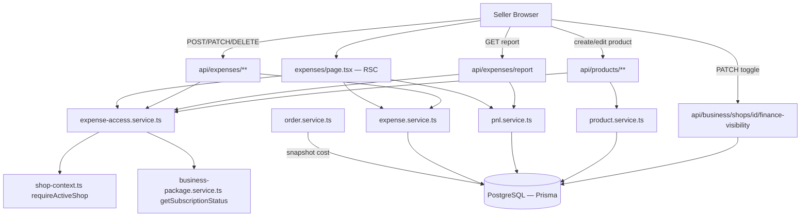
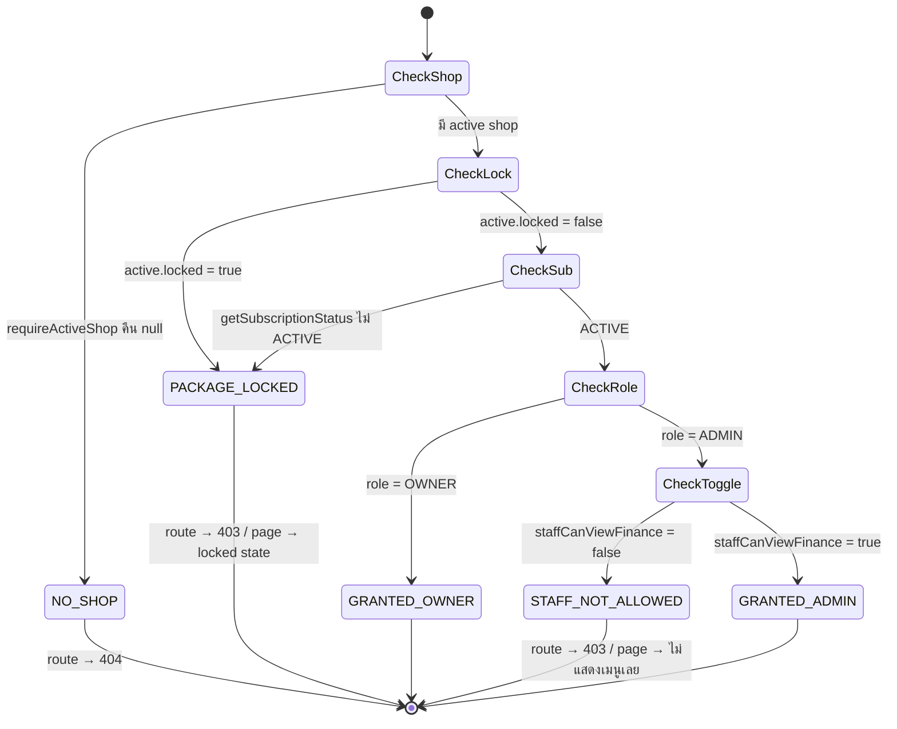
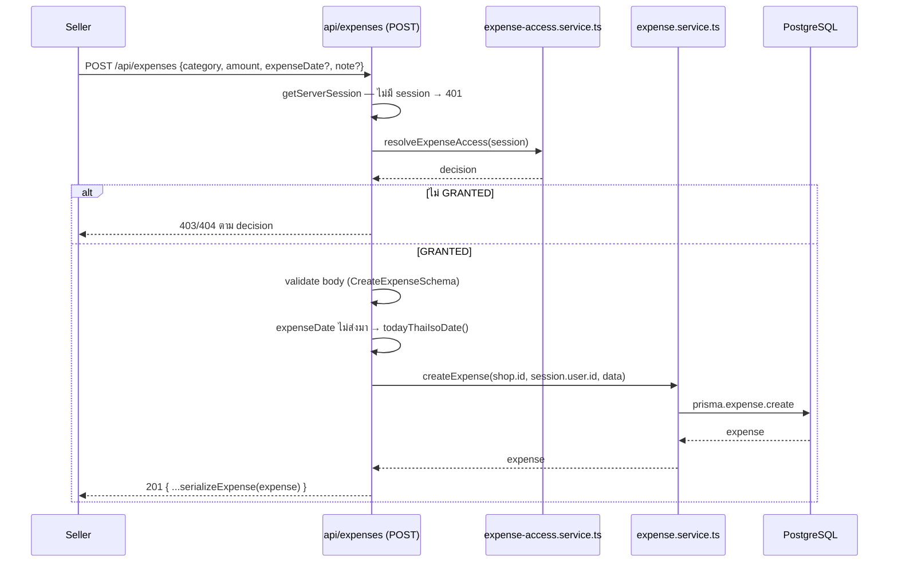
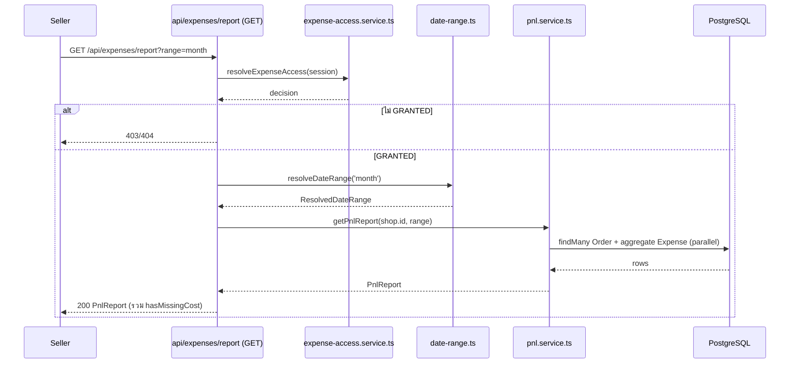
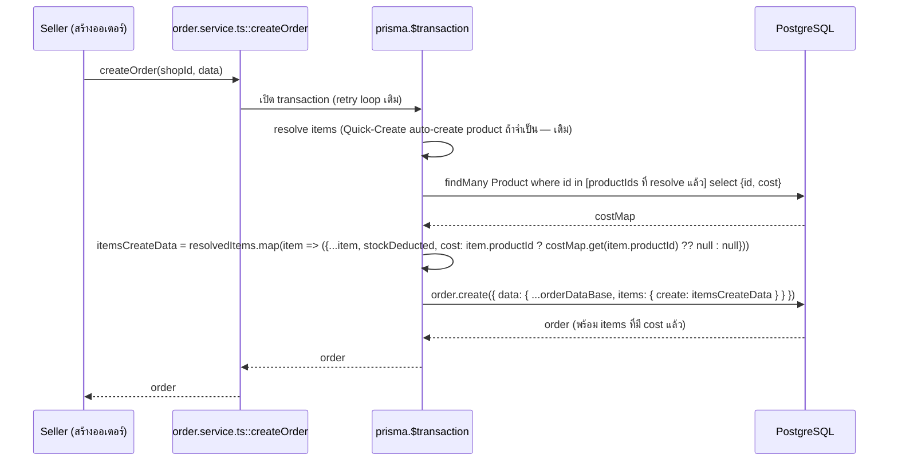
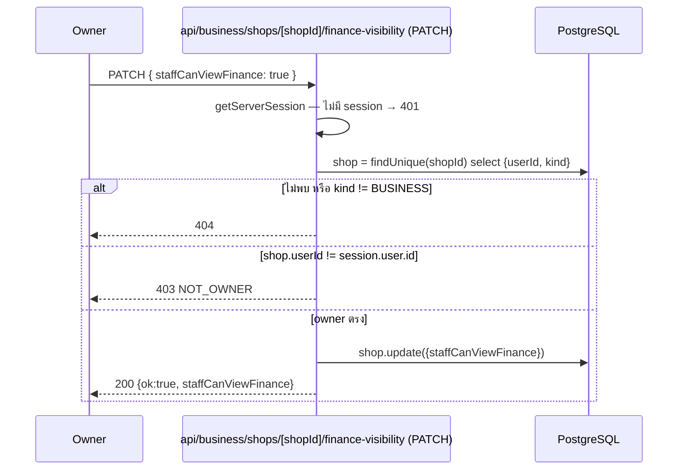
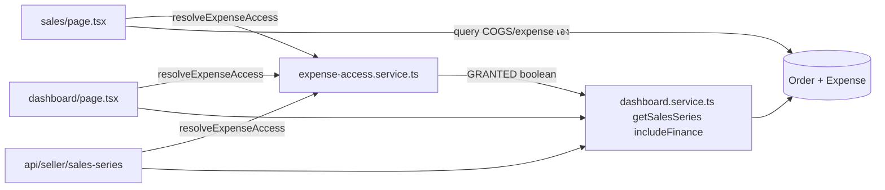

> **โมดูล:** M00016-ExpenseCostTracking
> **ประเภทเอกสาร:** System Design Spec (SDS)
> **เวอร์ชัน:** 1.0
> **วันที่จัดทำ:** 2026-07-08
> **สถานะ:** Draft
> **เจ้าของเอกสาร:** SA (ดู [[Feature-Docs-Ownership]])

# SDS: Expense & Cost Tracking (System Design Spec)

---

## 1. บทนำ & References

### 1.1 วัตถุประสงค์
เอกสารนี้ออกแบบ **การ implement จริง** ของ Expense & Cost Tracking ตาม [[SRS]] TFR-001…011: signature ของ function ใหม่/แก้ไข, sequence diagram ของทุก flow หลัก, และ **file-by-file change list** ที่ Controller ใช้ dispatch งานให้ `safepay-developer` ได้ทันที

### 1.2 ขอบเขตการออกแบบ
ในขอบเขต: `src/services/expense.service.ts` (ใหม่), `src/services/pnl.service.ts` (ใหม่), `src/services/expense-access.service.ts` (ใหม่), `src/lib/expense.ts` (ใหม่), `src/lib/date-range.ts` (ใหม่), `src/services/product.service.ts`, `src/services/order.service.ts`, `src/lib/validations.ts`, `src/app/api/expenses/**`, `src/app/api/business/shops/[shopId]/finance-visibility/route.ts`, `src/app/api/products/**`

นอกขอบเขต: pixel-level UI ของหน้า `/expenses` และฟอร์มสินค้าส่วน cost badge (ต้องผ่าน `safepay-ux` ก่อน — เอกสารนี้ระบุแค่ prop contract/data ที่ UI ต้องใช้)

### 1.3 เอกสารอ้างอิง

| เอกสาร | ความสัมพันธ์ |
|--------|-------------|
| [[SRS]] ของโมดูลนี้ | TFR-001…011 ที่ SDS นี้ realize |
| [[BRD]] ของโมดูลนี้ | FR-EXP-01…11 |
| `docs/20 - Features/00009 - Deep Stock Pro/SDS.md` (`inventory/page.tsx`) | pattern "fail-closed gate ก่อน query ข้อมูลจริง" ที่ฟีเจอร์นี้ copy มาใช้ตรง ๆ |
| `docs/conventions/paces-toast.md` | ถ้ามี toast แจ้งผล CRUD ที่ UI (safepay-ux กำหนด) ต้องผ่าน `pacesToast` เท่านั้น |

---

## 2. Architecture Overview

### 2.1 มุมมองสถาปัตยกรรม
Next.js 16 App Router — RSC สำหรับ `/expenses` page (gate + initial report), client component เฉพาะส่วน interactive (ฟอร์มบันทึก expense, date-range switcher, ตาราง edit/delete) Service layer แยกจาก API layer ตาม convention เดิม (`src/services/` ไม่ import จาก `src/app/api/`)



### 2.2 มุมมองการ Deploy
ไม่เปลี่ยน — Vercel serverless เดิม, Prisma connection pooling เดิม

---

## 3. Component Design

| Component | หน้าที่ (Responsibility) | Dependency |
|-----------|--------------------------|-----------|
| **`expense-access.service.ts`** (ใหม่) | `resolveExpenseAccess()` + `isCostEditAllowed()` — จุดตัดสินสิทธิ์เดียวของทั้งฟีเจอร์ | `shop-context.ts`, `business-package.service.ts` |
| **`expense.service.ts`** (ใหม่) | CRUD `Expense`, `serializeExpense()` | Prisma |
| **`pnl.service.ts`** (ใหม่) | `getPnlReport()` | Prisma, `date-range.ts` |
| **`date-range.ts`** (ใหม่) | `resolveDateRange()`, `todayThaiIsoDate()`, `parseIsoDateToUtcMidnight()` — pure functions | ไม่มี (pure module, เหมือน `format-date.ts`) |
| **`expense.ts`** (ใหม่) | Constants: `EXPENSE_CATEGORIES`, `EXPENSE_CATEGORY_LABEL_TH` | ไม่มี |
| **`expenses/page.tsx`** (ใหม่, RSC) | Discriminator (gate ผ่าน/ไม่ผ่าน) + orchestrate + render | `expense-access.service.ts`, `pnl.service.ts`, `expense.service.ts` |
| **`ExpenseForm.tsx`** (ใหม่, client) | ฟอร์มสร้าง/แก้ Expense (react-hook-form + Yup) — ผ่าน `safepay-ux` ก่อน | เรียก `POST/PATCH /api/expenses` |
| **`PnlReportCard.tsx`** (ใหม่, client island เล็ก) | date-range switcher + แสดงผล 5 ตัวเลข + missing-cost warning | เรียก `GET /api/expenses/report` เมื่อเปลี่ยนช่วง |
| **`FinanceVisibilityToggle.tsx`** (ใหม่, client) | toggle ที่หน้าตั้งค่าร้าน Business (owner เท่านั้น) | เรียก `PATCH /api/business/shops/[shopId]/finance-visibility` |
| **`product.service.ts`** (แก้ไข) | เพิ่ม `cost` เข้า input/output types | Prisma |
| **`order.service.ts`** (แก้ไข) | `createOrder()` เพิ่ม cost-lookup + snapshot | Prisma (tx เดิม) |

---

## 4. Data Flow

### 4.0 `date-range.ts` — Dual Boundary Design (สำคัญ, อ่านก่อนส่วนอื่น)

```ts
// src/lib/date-range.ts
const TZ_OFFSET_MS = 7 * 60 * 60 * 1000 // Asia/Bangkok, UTC+7 คงที่ (ไม่มี DST) — pattern เดียวกับ dashboard.service.ts

export type DateRangePreset = 'today' | '7d' | '30d' | 'month' | 'custom'

export interface ResolvedDateRange {
  /** สำหรับ query field timestamptz (Order.createdAt) — ต้อง shift เข้า Thai TZ ก่อน bucket */
  orderRange: { gte: Date; lt: Date }
  /** สำหรับ query field Expense.expenseDate (TIMESTAMP(3) ตาม DATABASE.md — ไม่ใช่ @db.Date)
   *  🛑 expenseDate ต้องถูก NORMALIZE เป็น UTC-midnight-of-calendar-date เสมอตอน WRITE
   *  (parseIsoDateToUtcMidnight) — ห้ามเก็บ time component. boundary นี้ใช้ dateOnlyUtc (UTC midnight
   *  ไม่ shift TZ) ให้ match กับค่าที่เขียน — ถ้า write เก็บ time จะ off-by-one ทันที */
  expenseRange: { gte: Date; lt: Date }
  /** สำหรับ echo กลับ response/label UI — "YYYY-MM-DD" */
  label: { start: string; end: string }
}

function thaiMidnightUtc(y: number, m0: number, d: number): Date {
  return new Date(Date.UTC(y, m0, d) - TZ_OFFSET_MS)
}
function dateOnlyUtc(y: number, m0: number, d: number): Date {
  return new Date(Date.UTC(y, m0, d))
}
function isoOf(y: number, m0: number, d: number): string {
  const dt = dateOnlyUtc(y, m0, d)
  return dt.toISOString().slice(0, 10)
}
export function parseIsoDateToUtcMidnight(iso: string): Date {
  const [y, m, d] = iso.split('-').map(Number)
  return dateOnlyUtc(y, m - 1, d)
}
export function todayThaiIsoDate(): string {
  const t = new Date(Date.now() + TZ_OFFSET_MS)
  return isoOf(t.getUTCFullYear(), t.getUTCMonth(), t.getUTCDate())
}

export function resolveDateRange(
  preset: DateRangePreset,
  customStart?: string,
  customEnd?: string,
): ResolvedDateRange {
  const thaiNow = new Date(Date.now() + TZ_OFFSET_MS)
  const y = thaiNow.getUTCFullYear(), m0 = thaiNow.getUTCMonth(), d = thaiNow.getUTCDate()

  let sy: number, sm0: number, sd: number, ey: number, em0: number, ed: number // ed = last day INCLUSIVE

  if (preset === 'today') { [sy, sm0, sd] = [y, m0, d]; [ey, em0, ed] = [y, m0, d] }
  else if (preset === '7d') { [sy, sm0, sd] = [y, m0, d - 6]; [ey, em0, ed] = [y, m0, d] }
  else if (preset === '30d') { [sy, sm0, sd] = [y, m0, d - 29]; [ey, em0, ed] = [y, m0, d] }
  else if (preset === 'month') { [sy, sm0, sd] = [y, m0, 1]; [ey, em0, ed] = [y, m0, d] }
  else {
    if (!customStart || !customEnd) throw new Error('CUSTOM_RANGE_REQUIRES_START_END')
    const s = customStart.split('-').map(Number); const e = customEnd.split('-').map(Number)
    ;[sy, sm0, sd] = [s[0], s[1] - 1, s[2]]; [ey, em0, ed] = [e[0], e[1] - 1, e[2]]
  }

  return {
    orderRange: { gte: thaiMidnightUtc(sy, sm0, sd), lt: thaiMidnightUtc(ey, em0, ed + 1) },
    expenseRange: { gte: dateOnlyUtc(sy, sm0, sd), lt: dateOnlyUtc(ey, em0, ed + 1) },
    label: { start: isoOf(sy, sm0, sd), end: isoOf(ey, em0, ed) },
  }
}
```

**หมายเหตุการออกแบบ:** `Date.UTC(y, m0, d ± N)` normalize เดือน/วันที่ overflow ให้อัตโนมัติ (เช่น `d - 6` ของวันที่ 3 ก.ค. → JS คำนวณเป็น 27 มิ.ย. ให้เอง) — เทคนิคเดียวกับ `daysInMonth`/`thaiMonthStartUtc` ใน `dashboard.service.ts` ที่พิสูจน์แล้วว่าใช้งานถูกต้อง ไม่ต้องเขียน calendar-math เอง

### 4.1 `resolveExpenseAccess()` — Signature และ Decision Table

```ts
// src/services/expense-access.service.ts
import { requireActiveShop, type ActiveShop } from '@/lib/shop-context'
import { getSubscriptionStatus } from '@/services/business-package.service'

export type ExpenseAccessDecision =
  | { kind: 'GRANTED'; shop: ActiveShop['shop']; role: 'OWNER' | 'ADMIN' }
  | { kind: 'NO_SHOP' }
  | { kind: 'PACKAGE_LOCKED' }
  | { kind: 'STAFF_NOT_ALLOWED' }

export async function resolveExpenseAccess(
  session: { user?: { id?: string | null; activeShopId?: string | null } | null } | null,
): Promise<ExpenseAccessDecision> {
  const active = await requireActiveShop(session)
  if (!active) return { kind: 'NO_SHOP' }

  // shop-level lock (quota/renewal-fail) — ต้องเช็คก่อน/คู่กับ subscription status เพราะ shop เดียว
  // อาจถูกล็อกด้วย QUOTA_EXCEEDED_ADMIN_COUNT ได้ทั้งที่ subscription ของ owner ยัง ACTIVE (SRS TFR-011)
  if (active.locked) return { kind: 'PACKAGE_LOCKED' }

  // ownerId ของทั้ง PERSONAL และ BUSINESS shop = Shop.userId เสมอ (SRS TFR-009 — grounded)
  const sub = await getSubscriptionStatus(active.shop.userId)
  if (!sub || sub.status !== 'ACTIVE') return { kind: 'PACKAGE_LOCKED' }

  if (active.role === 'OWNER') return { kind: 'GRANTED', shop: active.shop, role: 'OWNER' }

  if (!active.shop.staffCanViewFinance) return { kind: 'STAFF_NOT_ALLOWED' }
  return { kind: 'GRANTED', shop: active.shop, role: 'ADMIN' }
}

/** isCostEditAllowed — gate field Product.cost (FR-EXP-01-AC-05/D-9)
 *  ไม่เช็ค role/toggle เพราะ authz การแก้ product เป็นของ endpoint เดิมอยู่แล้ว (owner ของ product) —
 *  เช็คแค่ "package ของ owner ร้าน ACTIVE หรือไม่" */
export async function isCostEditAllowed(shop: { userId: string }): Promise<boolean> {
  const sub = await getSubscriptionStatus(shop.userId)
  return sub?.status === 'ACTIVE'
}
```

**State Diagram:**



### 4.2 `getPnlReport()` — Signature

```ts
// src/services/pnl.service.ts
import { prisma } from '@/lib/prisma'
import type { ResolvedDateRange } from '@/lib/date-range'

export interface PnlReport {
  range: { start: string; end: string }
  revenue: number
  cogs: number
  grossProfit: number
  totalExpense: number
  netProfit: number
  orderCount: number
  hasMissingCost: boolean
}

const round2 = (n: number) => Math.round((n + Number.EPSILON) * 100) / 100 // เหมือน order.service.ts::round2

export async function getPnlReport(shopId: string, range: ResolvedDateRange): Promise<PnlReport> {
  const [orders, expenseAgg] = await Promise.all([
    prisma.order.findMany({
      where: { shopId, status: 'CONFIRMED', createdAt: { gte: range.orderRange.gte, lt: range.orderRange.lt } },
      select: { totalAmount: true, items: { select: { cost: true, qty: true } } },
    }),
    prisma.expense.aggregate({
      where: { shopId, expenseDate: { gte: range.expenseRange.gte, lt: range.expenseRange.lt } },
      _sum: { amount: true },
    }),
  ])

  let revenue = 0, cogs = 0, hasMissingCost = false
  for (const o of orders) {
    revenue += Number(o.totalAmount)
    for (const item of o.items) {
      if (item.cost == null) { hasMissingCost = true; continue }
      cogs += Number(item.cost) * item.qty
    }
  }
  const grossProfit = round2(revenue - cogs)
  const totalExpense = Number(expenseAgg._sum.amount ?? 0)
  const netProfit = round2(grossProfit - totalExpense)

  return {
    range: range.label, revenue: round2(revenue), cogs: round2(cogs),
    grossProfit, totalExpense, netProfit, orderCount: orders.length, hasMissingCost,
  }
}
```

### 4.3 Flow: สร้าง Expense



### 4.4 Flow: ดูรายงาน P&L (เปลี่ยนช่วงเวลา)



### 4.5 Flow: Cost Snapshot ที่สร้างออเดอร์ (แก้ `order.service.ts::createOrder`)



**หมายเหตุการออกแบบ:** cost-lookup แทรกหลังขั้นตอน resolve items (รวม Quick-Create) แต่ **ก่อน** `order.create` — เพื่อให้ auto-created product (จาก manual line item) ที่ไม่มี `cost` ตั้งไว้ ได้ `null` จาก `costMap` โดยธรรมชาติ ไม่ต้องเขียน branch แยก (SRS TFR-002)

### 4.6 Flow: Toggle `staffCanViewFinance`



---

## 5. Integration Points

| จุดเชื่อม | ประเภท | Protocol/Contract | ความเสี่ยงเมื่อล่ม |
|-----------|--------|----------------------|---------------------|
| **`getSubscriptionStatus()` (feature 00008)** (reuse) | internal | function call ตรง | ถ้า return shape เปลี่ยน ต้อง sync `resolveExpenseAccess`/`isCostEditAllowed` |
| **`requireActiveShop()` (`shop-context.ts`)** (reuse) | internal | function call ตรง | ให้ `role`/`locked`/shop เต็มแถว — ถ้า shape เปลี่ยนต้องตาม |
| **`createOrder()` (`order.service.ts`)** (แก้ไข) | internal | เพิ่ม 1 query ภายใน tx เดิม | ต้องไม่กระทบ retry-loop/Quick-Create/stock-deduct เดิม — เพิ่มแบบ additive เท่านั้น |
| **`guardApi()` (`proxy.ts`)** (reuse, ไม่แก้) | internal | CSRF Origin-check + rate-limit อัตโนมัติสำหรับทุก mutation route (`POST/PATCH/DELETE`) ใหม่ที่ path ตรงกับ pattern เดิม | ไม่ต้องแก้ `proxy.ts` — endpoint ใหม่ทั้งหมดอยู่ใต้ `/api/**` ที่ guard ครอบอยู่แล้ว |

- **Timeout/Retry/Idempotency:** `createExpense`/`updateExpense`/`deleteExpense` ไม่ idempotent โดยธรรมชาติ (ไม่มี requirement ให้เป็น — ต่างจาก claim-OTP ของ feature 00015) `getPnlReport` เป็น pure-read, เรียกซ้ำได้ไม่จำกัดโดยไม่มีผลข้างเคียง
- **สัญญา API เต็ม:** ดู `API.md` ของโมดูลนี้

---

## 6. Technical Decisions

### TD-001: `ownerId = Shop.userId` ตรง ๆ — ไม่สร้าง helper resolve ผ่าน ShopMember
- **ตัดสินใจ:** `resolveExpenseAccess()` ใช้ `active.shop.userId` จาก `requireActiveShop()` ตรง ๆ เป็น ownerId
- **เหตุผล:** grounded จากโค้ดจริงทั้งระบบ (SRS TFR-009) — ทุก service ที่มีอยู่แล้ว (`subscription-overview`, `business-package`, `shop-member`) ใช้ pattern เดียวกันหมด สร้าง helper ใหม่จะเป็น logic คู่ขนานที่ไม่จำเป็น
- **ทางเลือกที่ตัดทิ้ง:** resolve ผ่าน `ShopMember.findFirst({ where: { shopId, role: 'OWNER' } })` ตามที่ PRD §3.7 ตั้งคำถามไว้ — ตัดทิ้งเพราะเพิ่ม query โดยไม่จำเป็น (ข้อมูลชุดเดียวกับ `Shop.userId` เสมอ ไม่มี ownership-transfer ใน MVP)
- **ผลกระทบ:** ลด 1 query ต่อ request เทียบกับแนวทางที่ตัดทิ้ง

### TD-002: Dual Date-Boundary + Write-Normalize `Expense.expenseDate`
- **ตัดสินใจ (reconciled กับ DATABASE.md — 2026-07-08 หลัง Unit 0):** `Expense.expenseDate` เก็บเป็น **`TIMESTAMP(3)`** (ไม่ใช่ `@db.Date` — DATABASE.md §5 SSOT เลือก TIMESTAMP(3) เพราะไม่ต้องการ DB default + คุม timezone ที่ app layer เอง). `date-range.ts` ยังคงคำนวณ boundary 2 ชุดแยกกัน (`orderRange` vs `expenseRange`) เหมือนเดิม **แต่มีเงื่อนไขบังคับเพิ่ม:** ทุกจุดที่ WRITE `expenseDate` ต้อง normalize เป็น **UTC-midnight-of-calendar-date** ผ่าน `parseIsoDateToUtcMidnight()` เสมอ — ห้ามเก็บ `new Date()` (มี time component)
- **เหตุผล:** `expenseDate` คือ "วันที่เกิดค่าใช้จ่ายตามที่ผู้ใช้เลือก" ไม่ใช่ event-time. เมื่อ write เก็บเป็น UTC-midnight เสมอ + query `expenseRange` ใช้ `dateOnlyUtc` (UTC midnight, ไม่ shift TZ) → ค่าที่เขียนกับ boundary ที่อ่าน match กันพอดี ไม่ off-by-one. (ต่างจาก `orderRange` ที่ต้อง shift Thai TZ เพราะ `Order.createdAt` เป็น event-time จริง)
- **ทางเลือกที่ตัดทิ้ง:** (ก) `@db.Date` — ตัดทิ้งเพราะ DATABASE.md เลือก TIMESTAMP(3) ด้วยเหตุผล no-DB-default; (ข) เก็บ `expenseDate` เป็น timestamp มี time จริง แล้ว shift TZ เหมือน createdAt — ตัดทิ้งเพราะจะ off-by-one เมื่อ user เลือกวันที่ (calendar) ไม่ใช่เวลาจริง
- **ผลกระทบ:** 🛑 **Unit 1 developer ต้อง:** (1) default expenseDate = `parseIsoDateToUtcMidnight(todayThaiIsoDate())` เมื่อ caller ไม่ส่ง (ไม่ใช่ `new Date()`); (2) แปลง `expenseDate` string ที่รับจาก API ผ่าน `parseIsoDateToUtcMidnight()` ก่อนเขียน DB เสมอ. QA ต้อง test edge case ข้ามเที่ยงคืน/ข้ามเดือน + ยืนยันไม่มี time component หลุดเข้า DB

### TD-003: Cost-Lookup เป็น Batch Query เดียวใน `createOrder`, ไม่ query ทีละ item
- **ตัดสินใจ:** `findMany({ where: { id: { in: productIds } } })` ครั้งเดียวหลัง resolve items เสร็จ แล้ว build `Map<productId, cost>`
- **เหตุผล:** คงมาตรฐาน performance เดิมของ `createOrder` (ออเดอร์ 1 ใบมักมีหลาย item — query แบบ N+1 จะช้าไม่จำเป็น)
- **ทางเลือกที่ตัดทิ้ง:** query cost ทีละ productId ระหว่าง loop resolve — ตัดทิ้งเพราะ N+1
- **ผลกระทบ:** เพิ่ม query เดียวต่อ transaction (ไม่กระทบ retry-loop pattern เดิม)

### TD-004: `expense.service.ts` เป็น "Dumb" Service — Ownership Check ที่ Route
- **ตัดสินใจ:** `updateExpense`/`deleteExpense` ไม่ตรวจ `shopId` เอง — route (`api/expenses/[id]/route.ts`) ต้อง fetch record ก่อนแล้วเทียบ `shopId` เอง ก่อนเรียก service
- **เหตุผล:** มิเรอร์ pattern ที่มีอยู่แล้วเป๊ะที่ `PATCH /api/products/[id]` (ownership check ที่ route, service เป็น operation ล้วน) — คงความสม่ำเสมอของ codebase ไม่ใช้ 2 pattern คู่ขนาน
- **ทางเลือกที่ตัดทิ้ง:** ให้ service รับ `shopId` เป็น param แล้วใส่ใน `where` ของ `update`/`delete` (`updateMany`/`deleteMany` scoped) — ตัดทิ้งเพราะ `products/[id]` เดิมไม่ได้ทำแบบนี้ (ทำตาม pattern ที่มีอยู่แล้ว ไม่ mix 2 style)
- **ผลกระทบ:** Developer ต้อง fetch-then-check-then-call ที่ route เสมอ (2 query ต่อ update/delete — ยอมรับได้ที่ scale นี้)

---

## 7. Traceability

| SRS Requirement (TFR/NFR) | SDS Element | สถานะ |
|---------------------------|-------------|-------|
| TFR-001 | §4 (product route gate), reuse `isCostEditAllowed` | Draft |
| TFR-002 | §4.5 Flow Cost Snapshot, TD-003 | Draft |
| TFR-003 | §4.3 Flow สร้าง Expense | Draft |
| TFR-004 | TD-004 | Draft |
| TFR-005 | `lib/expense.ts` (§3) | Draft |
| TFR-006/007/008 | §4.2 `getPnlReport`, §4.4 Flow รายงาน | Draft |
| TFR-009 | §4.1 `resolveExpenseAccess`, TD-001 | Draft |
| TFR-010 | §4.1, §4.6 Flow Toggle | Draft |
| TFR-011 | §4.1 state diagram (PACKAGE_LOCKED branch) | Draft |
| NFR-Performance | §5 (Integration Points — index dependency ไปยัง DATABASE.md) | Draft |
| NFR-Security (RSC gate) | §4.4 (query หลัง GRANTED เท่านั้น) | Draft |

---

## 8. File-by-File Change List (สำหรับ Controller dispatch)

**ไฟล์ใหม่:**
- `src/lib/expense.ts` — `EXPENSE_CATEGORIES`, `EXPENSE_CATEGORY_LABEL_TH`
- `src/lib/date-range.ts` — `resolveDateRange()`, `todayThaiIsoDate()`, `parseIsoDateToUtcMidnight()`
- `src/services/expense-access.service.ts` — `resolveExpenseAccess()`, `isCostEditAllowed()`
- `src/services/expense.service.ts` — `createExpense`/`updateExpense`/`deleteExpense`/`getExpenseById`/`listExpenses`/`serializeExpense`
- `src/services/pnl.service.ts` — `getPnlReport()`
- `src/app/api/expenses/route.ts` — POST + GET
- `src/app/api/expenses/[id]/route.ts` — PATCH + DELETE
- `src/app/api/expenses/report/route.ts` — GET
- `src/app/api/business/shops/[shopId]/finance-visibility/route.ts` — PATCH
- `src/app/(paces)/seller/(dashboard)/expenses/page.tsx` — RSC gate + orchestrate (**ต้องผ่าน `safepay-ux` ก่อนลง markup จริง** — dispatch แยกหลังมี Design Spec)
- `src/app/(paces)/seller/(dashboard)/expenses/components/*.tsx` — client components (ExpenseForm/PnlReportCard/ฯลฯ — รอ Design Spec เช่นกัน)

**ไฟล์แก้ไข:**
- `prisma/schema.prisma` — **dispatch `safepay-database` แยก** (DATABASE.md เป็น SSOT) เพิ่ม `Product.cost`, `OrderItem.cost`, `Shop.staffCanViewFinance`, model `Expense`, index `Order(shopId, status, createdAt)`
- `src/lib/validations.ts` — เพิ่ม `ExpenseCategorySchema`/`CreateExpenseSchema`/`UpdateExpenseSchema`/`PnlReportQuerySchema`; ขยาย `CreateProductSchema`/`UpdateProductSchema` เพิ่ม `cost`
- `src/services/product.service.ts` — `CreateProductInput`/`UpdateProductInput`/`SerializedProduct` เพิ่ม `cost`; `createProduct`/`updateProduct`/`serializeProduct` wire field
- `src/services/order.service.ts` — `createOrder()` เพิ่ม cost-lookup + snapshot (§4.5)
- `src/app/api/products/route.ts` — POST: gate `cost` ด้วย `isCostEditAllowed`
- `src/app/api/products/[id]/route.ts` — PATCH: gate `cost` ด้วย `isCostEditAllowed`

**Atomic-commit unit แนะนำ (สำหรับ Planner ต่อ):**
- **Unit 0 (prerequisite, แยก agent):** `safepay-database` ร่าง DATABASE.md + apply migration — ต้องเสร็จก่อน Unit 1-5 ทั้งหมด (ทุก unit ด้านล่างพึ่ง schema นี้)
- **Unit 1 (bundle):** `lib/expense.ts` + `lib/date-range.ts` + `lib/validations.ts` (Expense schemas) + `services/expense-access.service.ts` + `services/expense.service.ts` + `services/pnl.service.ts` + `api/expenses/route.ts` + `api/expenses/[id]/route.ts` + `api/expenses/report/route.ts` (ต้อง wire ครบพร้อมกัน tsc ถึงผ่าน — backend core ของ Expense CRUD + report)
- **Unit 2 (bundle):** `services/product.service.ts` + `lib/validations.ts` (Product schema ส่วน cost) + `api/products/route.ts` + `api/products/[id]/route.ts` (Product.cost wiring + gate — ขึ้นกับ `expense-access.service.ts` จาก Unit 1 สำหรับ `isCostEditAllowed`)
- **Unit 3 (เดี่ยว, ขึ้นกับ Unit 0 เท่านั้น ไม่ขึ้นกับ Unit 1/2):** `services/order.service.ts` (cost snapshot — อ่าน `Product.cost` ตรงจาก schema ไม่ต้องพึ่ง service อื่นในฟีเจอร์นี้)
- **Unit 4 (เดี่ยว, ขึ้นกับ Unit 0 เท่านั้น):** `api/business/shops/[shopId]/finance-visibility/route.ts` (owner-only toggle — ไม่ผ่าน `expense-access.service.ts`)
- **Unit 5 (UI, รอ safepay-ux Design Spec, ขึ้นกับ Unit 1+2):** `expenses/page.tsx` + client components + เมนู sidebar "ค่าใช้จ่าย" (ต้องซ่อนตาม TFR-010)

---

## 8.5 Extension — Redesign 2026-08-02 (deployed, ไม่มี schema เปลี่ยน)

รายละเอียด requirement เต็มอยู่ที่ SRS.md §10 (TFR-012..016) — สรุปเฉพาะมุม design/flow ที่ SDS ต้องเติมที่นี่:

- **`ExpenseWorkspace.tsx`** (client, ใหม่) กลายเป็นเจ้าของ state ทั้งหน้า `/expenses` แทน `PnlReportCard` เดิมที่ fetch เอง — ช่วงเวลา (`range`) ยกขึ้นมาที่นี่ตัวเดียว แล้ว fetch `GET /api/expenses/report` (ขยาย response แล้ว, TFR-015) ครั้งเดียวต่อการเปลี่ยนช่วง/mutate แจกจ่าย `report`+`expenses` ให้ `PnlReportCard`/`ExpenseBreakdownCard`/`ExpenseList` ทั้งหมด (แก้ root cause ของปัญหา "ตัวเลขขัดกันเอง" ที่ §6 Technical Decisions เดิมไม่ได้ระบุไว้เพราะยังไม่เกิด)
- **`ExpenseFormModal.tsx`** แทนที่ `ExpenseForm.tsx` เดิม (การ์ดแปะหน้าตลอดเวลา) — modal shell เดียว ปรับ CSS ตาม breakpoint (`sm:` 640px: < 640px = bottom sheet, ≥ 640px = กล่องกลางจอ) dual-mode create/edit ผ่าน prop เดียวกับที่ SDS เดิมออกแบบไว้ (`mode`/`editing`) — เปลี่ยนแค่ container ไม่เปลี่ยน field/validation
- **`getSalesSeries()` gate flow** (TFR-016) — `resolveExpenseAccess()` (§4.1 เดิม) ถูกเรียกเพิ่มที่ 2 จุดใหม่นอก `/expenses`: `dashboard/page.tsx` (RSC) และ `api/seller/sales-series/route.ts` — ทั้งคู่ resolve decision แล้วส่ง `boolean` (`kind === 'GRANTED'`) เข้า `getSalesSeries` เป็น param ที่ 4 (ไม่ใช่ query แล้วกรองทีหลัง — fail-closed ตั้งแต่ query). `sales/page.tsx` resolve gate เดียวกันแต่ไม่ผ่าน `getSalesSeries` (คำนวณ COGS/expense เองจาก query ที่มีอยู่แล้วในหน้านั้น)



**ไฟล์ใหม่เพิ่มจาก §8 เดิม:** `src/lib/format-money.ts` (`formatBaht`/`profitDisplay` — SSOT รูปแบบเงิน แก้ 3 นโยบายที่ขัดกันมาก่อน), `expenses/components/{ExpenseFormModal,ExpenseToolbar,ExpenseBreakdownCard,ExpenseCategoryFilterSheet,ExpenseWorkspace}.tsx` (แทนที่ `ExpenseForm.tsx` เดิมที่ถูกลบ)

---

## 9. สรุป (Summary)

SDS นี้ออกแบบ Expense & Cost Tracking ด้วย access-decision core (`resolveExpenseAccess`) แยกจาก calculation core (`getPnlReport`) และ date-boundary core (`resolveDateRange`) — ทั้ง 3 เป็น pure/testable ให้มากที่สุด ลดความเสี่ยง bug จากการปนกันระหว่าง auth logic กับ business calculation. Cost snapshot เพิ่มเข้า `createOrder()` แบบ additive เดียวกับที่ `price` เคยทำมา ไม่กระทบ retry-loop/Quick-Create/stock-deduct เดิม

**ลำดับการ build ที่แนะนำ:** Unit 0 (schema, prerequisite ของทุกอย่าง) → Unit 1 (Expense core) + Unit 3 (cost snapshot) + Unit 4 (toggle) ขนานกันได้ (independent) → Unit 2 (product cost, ขึ้นกับ Unit 1) → Unit 5 (UI, รอ safepay-ux + ขึ้นกับ Unit 1+2)

**Open Questions:**
- ค่า `range` preset label ที่แน่นอนสำหรับ UI (เสนอ: วันนี้/7 วัน/30 วัน/เดือนนี้/กำหนดเอง ตาม PRD D-11) — ส่งต่อ `safepay-ux`
- Index `Order(shopId, status, createdAt)` — ยืนยันกับ `safepay-database` ว่าจะเพิ่มพร้อม migration ของฟีเจอร์นี้หรือแยก
