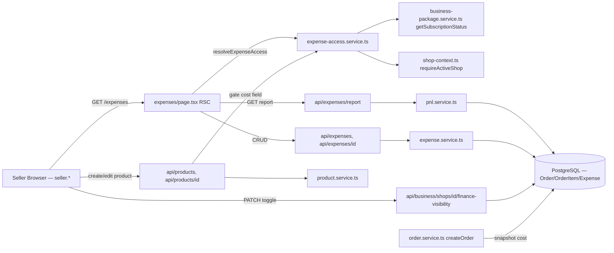
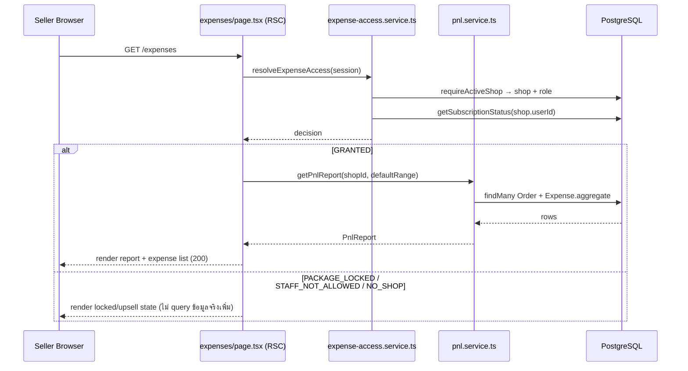
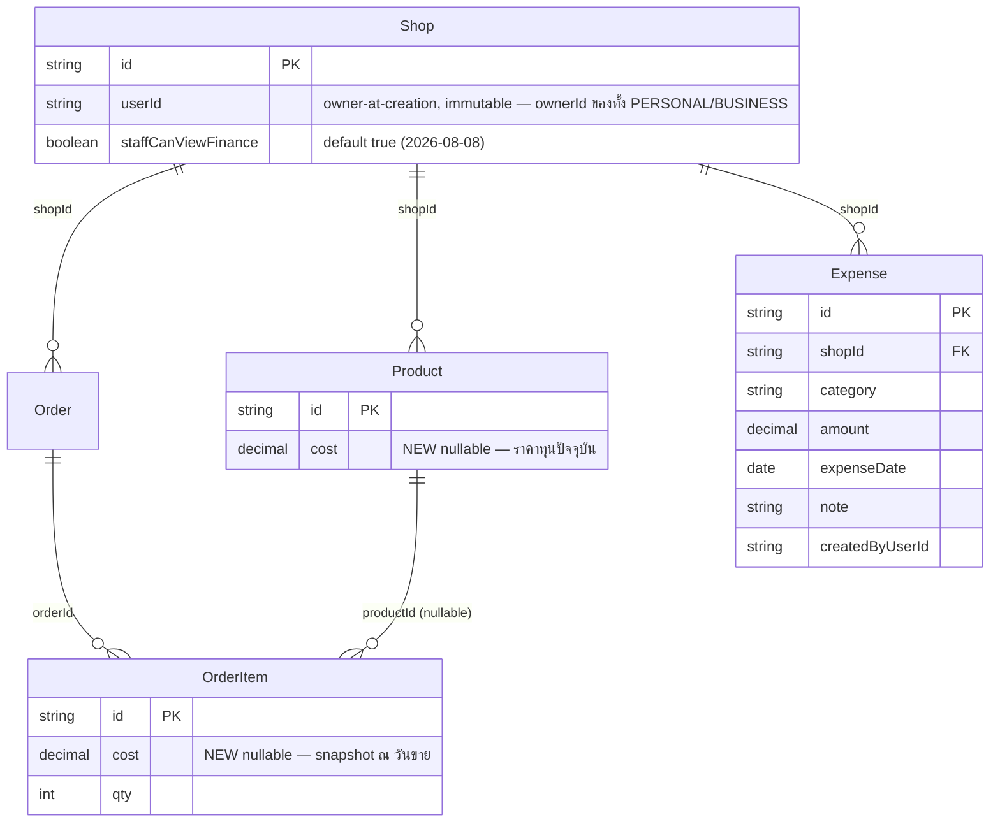

> **โมดูล:** M00016-ExpenseCostTracking
> **ประเภทเอกสาร:** Software Requirements Specification (SRS) — TECHNICAL
> **เวอร์ชัน:** 1.0
> **วันที่จัดทำ:** 2026-07-08
> **สถานะ:** Draft
> **เจ้าของเอกสาร:** SA (ดู [[Feature-Docs-Ownership]])

# SRS: Expense & Cost Tracking (Software Requirements Specification — Technical)

---

## 1. บทนำ (Introduction)

### 1.1 วัตถุประสงค์ของเอกสาร

เอกสารนี้แปลง Business Requirements ใน [[BRD]] (FR-EXP-01…11) ให้เป็นข้อกำหนดเชิงเทคนิคที่ implement ได้ตรง: data model เพิ่มเติม (`Product.cost`/`OrderItem.cost`/`Expense`/`Shop.staffCanViewFinance`), service layer design, สูตรคำนวณ P&L, **การ resolve "ownerId" ของ shop สำหรับ gate — ปิด open item เดียวที่ค้างจาก PRD §9.2/§3.7 ด้วยหลักฐานจากโค้ดจริง** (ดู TFR-009), validation 2 ชั้น (Valibot/Yup), enum/constant, และ NFR ผู้อ่านหลักคือ Developer (`safepay-developer`), QA (`safepay-qa`), Reviewer (`safepay-reviewer`), และ `safepay-database` (สำหรับ DATABASE.md ที่ต้องทำคู่ขนาน)

### 1.2 ขอบเขตเชิงระบบ (System Scope)

อยู่ในขอบเขต:
- Prisma schema เพิ่มเติม (additive เท่านั้น) — `Product.cost`, `OrderItem.cost`, `Shop.staffCanViewFinance`, model ใหม่ `Expense` (รายละเอียด DDL/migration เป็นความรับผิดชอบของ `safepay-database` ผ่าน DATABASE.md — เอกสารนี้ให้แค่ **target shape**)
- Service ใหม่: `src/services/expense.service.ts`, `src/services/pnl.service.ts`, `src/services/expense-access.service.ts`
- Lib ใหม่: `src/lib/expense.ts` (constants), `src/lib/date-range.ts` (ช่วงเวลารายงาน)
- Service ที่แก้ไข: `src/services/product.service.ts` (เพิ่ม field `cost`), `src/services/order.service.ts` (`createOrder` — snapshot `OrderItem.cost`)
- Validation ที่แก้ไข/เพิ่ม: `src/lib/validations.ts`
- API routes ใหม่: `src/app/api/expenses/route.ts`, `src/app/api/expenses/[id]/route.ts`, `src/app/api/expenses/report/route.ts`, `src/app/api/business/shops/[shopId]/finance-visibility/route.ts`
- API routes ที่แก้ไข: `src/app/api/products/route.ts`, `src/app/api/products/[id]/route.ts` (gate field `cost`)
- Route ใหม่ `src/app/(paces)/seller/(dashboard)/expenses/page.tsx` (**contract เท่านั้น** — pixel-level UI เป็นของ `safepay-ux`, Hard Rule 8)
- **(เพิ่ม 2026-08-02, ดู §10 Extension)** `src/lib/format-money.ts` (ใหม่ — SSOT รูปแบบเงินฝั่ง seller), `src/services/dashboard.service.ts::getSalesSeries` (แก้ — เพิ่ม `includeFinance`), `src/app/(paces)/seller/(dashboard)/sales/page.tsx` + `dashboard/page.tsx` (แก้ — gate ด้วย `resolveExpenseAccess`), `src/app/api/seller/sales-series/route.ts` (แก้ — cross-feature, ดู API.md §4.5b)

นอกขอบเขตเชิงระบบ (อ้างอิง PRD §5 / BRD §7):
- Billing/paywall แยกของ feature นี้เอง — ไม่มี
- Custom expense category, audit trail ของการแก้ไข Expense, export รายงาน, recurring expense, budget/แจ้งเตือนเกินงบ, per-order cost allocation, cross-shop P&L รวมยอด — Phase 2 ทั้งหมด
- Migration DDL ฉบับเต็ม + index จริง — เป็นของ DATABASE.md (`safepay-database`) เอกสารนี้ระบุแค่ field/type/index **ที่ต้องมี** (requirement)

### 1.3 เอกสารอ้างอิง (References)

| เอกสาร | ความสัมพันธ์ |
|--------|-------------|
| [[PRD]] ของโมดูลนี้ | เป้าหมายธุรกิจ/KPI/personas + Decisions D-1…D-11 (§10.3) ที่มาของทุก TFR |
| [[BRD]] ของโมดูลนี้ | FR-EXP-01…11, AC ทั้งหมด — ทุก TFR ในเอกสารนี้ trace กลับ |
| `docs/SRS.md` §Data Model | SSOT schema ระดับระบบเดิม (Prisma) — เอกสารนี้ **เพิ่ม** field/model แบบ additive เท่านั้น ไม่แก้ของเดิม |
| `docs/20 - Features/00008 - Business Account & Packages/{SRS,SDS,DATABASE}.md` | ที่มาของ `BusinessPackageSubscription`, `ShopMember`, `getSubscriptionStatus`, `requireActiveShop` ที่ฟีเจอร์นี้ reuse ตรง ๆ ทั้งหมด |
| `docs/20 - Features/00012 - Shop Staff Invite Links` | ที่มาของ ShopMember(ADMIN) ผ่าน invite link (context ของ persona §2.2 ใน PRD) |
| `docs/conventions/date-format.md` | UI แสดงวันที่ต้องผ่าน `formatDate`/`formatDateTH` เท่านั้น — คนละเรื่องกับ `src/lib/date-range.ts` ใหม่ (นั่นคือ date-math สำหรับ query ไม่ใช่ presentation) |

### 1.4 นิยามและตัวย่อ (Definitions & Acronyms)

| คำ/ตัวย่อ | ความหมาย |
|-----------|----------|
| **COGS** | Cost of Goods Sold — Σ (`OrderItem.cost` × `OrderItem.qty`) เฉพาะรายการที่ `cost` ไม่ null ของออเดอร์ CONFIRMED ในช่วงเวลา |
| **Cost Snapshot** | การคัดลอก `Product.cost` ลง `OrderItem.cost` ณ ขณะสร้างออเดอร์ (pattern เดียวกับ `OrderItem.price`) |
| **Access Gate (Expense)** | ขั้นตอนตัดสินสิทธิ์เข้าถึง Expense/P&L ที่ทำใน `resolveExpenseAccess()` (`expense-access.service.ts`) |
| **ownerId** | `Shop.userId` — เจ้าของร้านตัวจริงตอนสร้าง (immutable) ใช้เป็นคีย์ของ `getSubscriptionStatus()` เสมอ **ไม่ว่า shop จะเป็น PERSONAL หรือ BUSINESS** (ดู TFR-009 สำหรับหลักฐาน) |
| **Fixed Category** | หมวดค่าใช้จ่าย 7 ค่าคงที่ (RENT/PACKAGING/ADVERTISING/SHIPPING/SALARY/UTILITIES/OTHER) เก็บเป็น `String` (ไม่ใช่ Prisma `enum`) |
| **staffCanViewFinance** | `Shop.staffCanViewFinance: Boolean` (**default `true` ตั้งแต่ 2026-08-08** — เดิม `false`, ดู BRD FR-EXP-10-AC-01b) — toggle ระดับร้านที่ owner เปิด/ปิดให้ `ShopMember(role=ADMIN)` เห็นข้อมูลการเงิน |

---

## 2. ภาพรวมสถาปัตยกรรม (Architecture Overview)

### 2.1 บริบทระบบ (System Context)



### 2.2 องค์ประกอบหลัก (Components)

| Component | หน้าที่ | Submodule / Stack |
|-----------|---------|-------------------|
| **`expense-access.service.ts`** (ใหม่) | `resolveExpenseAccess()` — ตัดสินสิทธิ์ owner/admin+toggle/package-gate; `isCostEditAllowed()` — gate field `Product.cost` | `src/services/` |
| **`expense.service.ts`** (ใหม่) | CRUD `Expense` scoped ด้วย `shopId`, `serializeExpense()` | `src/services/` |
| **`pnl.service.ts`** (ใหม่) | `getPnlReport()` — คำนวณ Revenue/COGS/Gross/Expense/Net + missing-cost flag | `src/services/` |
| **`date-range.ts`** (ใหม่) | `resolveDateRange()` — แปลง preset/custom เป็นช่วง query 2 แบบ (timestamptz vs plain date) | `src/lib/` |
| **`expense.ts`** (ใหม่) | Constants: `EXPENSE_CATEGORIES`, `EXPENSE_CATEGORY_LABEL_TH` | `src/lib/` |
| **`product.service.ts`** (แก้ไข) | เพิ่ม `cost` เข้า `CreateProductInput`/`UpdateProductInput`/`SerializedProduct` | `src/services/` |
| **`order.service.ts`** (แก้ไข) | `createOrder()` — snapshot `Product.cost` → `OrderItem.cost` ในธุรกรรมเดียวกับ `price` | `src/services/` |
| **`business-package.service.ts`** (reuse, ไม่แก้) | `getSubscriptionStatus(ownerId)` | `src/services/` |
| **`shop-context.ts`** (reuse, ไม่แก้) | `requireActiveShop(session)` — คืน shop เต็ม + role (OWNER/ADMIN) + locked state | `src/lib/` |

### 2.3 มุมมองการ Deploy (Deployment View)

ไม่มีการเปลี่ยนแปลง — Vercel serverless (Next.js 16) เดิม, Postgres/Supabase เดิม (schema ต้องผ่าน migration แบบ additive — ดู §5.3 + DATABASE.md)

---

## 3. ข้อกำหนดเชิงฟังก์ชันเชิงเทคนิค (Technical Functional Requirements)

### TFR-001: `Product.cost` — Optional Cost Field + Edit Gate
- **Trace to:** FR-EXP-01
- **คำอธิบายเชิงเทคนิค:** เพิ่ม `cost: Decimal(12,2)?` ที่ `Product` (nullable, additive). `CreateProductInput`/`UpdateProductInput` (`product.service.ts`) เพิ่ม `cost?: number | null` (`undefined` = ไม่แตะ, `null` = ล้างค่า, ตัวเลข = ตั้งค่า — pattern เดียวกับ `lowStockThreshold`/`stockQty`). `SerializedProduct` เพิ่ม `cost: number | null`. **Gate การแก้ไข (AC-05):** ทุก route ที่รับ field `cost` (`POST /api/products`, `PATCH /api/products/[id]`) ต้องเรียก `isCostEditAllowed(shop)` ก่อนยอมรับค่า — ถ้าไม่ ACTIVE ต้อง reject ด้วย `403 COST_REQUIRES_BUSINESS_PACKAGE` (defense-in-depth ชั้น backend คู่กับ disabled field ฝั่ง UI ที่ safepay-ux ออกแบบ)
- **Precondition:** `shop` ที่ query มาต้องมี `userId` (สำหรับ `isCostEditAllowed`)
- **Postcondition:** สินค้าที่ไม่เคยตั้ง `cost` ทำงานเหมือนเดิมทุกประการ (zero-regression); สินค้าที่ตั้ง `cost` ไว้ก่อนแล้ว package lapse ภายหลัง — **ค่า `cost` เดิมไม่ถูกลบ** (แค่แก้ไม่ได้อีก จนกว่า package ACTIVE อีกครั้ง — เหตุผลเดียวกับ FR-EXP-11-AC-03 ที่ไม่ลบข้อมูล Expense เมื่อ lock)
- **Error/Edge cases:** `cost < 0` → validation reject (Valibot `minValue(0)`, ต่างจาก `price` ที่ `minValue(0.01)` เพราะ `cost` อนุญาต 0 ได้ — สินค้าแจกฟรี/ต้นทุนเป็นศูนย์เป็นไปได้จริง)

### TFR-002: `OrderItem.cost` — Snapshot ที่จุดสร้างออเดอร์
- **Trace to:** FR-EXP-02
- **คำอธิบายเชิงเทคนิค:** เพิ่ม `cost: Decimal(12,2)?` ที่ `OrderItem` (nullable, additive) ใน `createOrder()` (`order.service.ts`) — หลังจาก `resolvedItems` ถูก resolve ครบ (รวมกรณี Quick-Create auto-create product ใหม่จาก manual line item, บรรทัด ~148-172 ของโค้ดปัจจุบัน) ให้ query `Product.cost` ของทุก `productId` ที่ปรากฏใน `resolvedItems` ภายใน **transaction เดียวกัน** แล้ว map เข้า `itemsCreateData`: `cost: item.productId ? (costMap.get(item.productId) ?? null) : null`. Auto-created product จาก Quick-Create จะไม่มี `cost` ตั้งไว้ (ไม่ส่งผ่าน `tx.product.create`) → `costMap` ได้ `null` โดยธรรมชาติ ตรงกับ AC-02/AC-03 อยู่แล้วโดยไม่ต้อง branch พิเศษ
- **Precondition:** ต้องอยู่ใน `prisma.$transaction` เดียวกับที่สร้าง `Order`+`OrderItem` (retry-loop เดิมของ `createOrder` ครอบทั้งก้อนอยู่แล้ว — TD-001 ของ order.service.ts เดิม)
- **Postcondition:** แก้ `Product.cost` ทีหลังไม่กระทบ `OrderItem.cost` ที่ snapshot ไปแล้ว (immutable หลังสร้าง — ไม่มี code path ใดที่ update `OrderItem.cost` ของแถวที่มีอยู่แล้ว)
- **Error/Edge cases:** รายการที่ `productId` เป็น undefined (manual line item ที่ resolve ไม่ผ่าน Quick-Create — เช่น `name` ว่าง ตามโค้ดเดิมบรรทัด 151) → `cost: null` เสมอ

### TFR-003: สร้าง Expense
- **Trace to:** FR-EXP-03
- **คำอธิบายเชิงเทคนิค:** `createExpense(shopId, createdByUserId, data)` (`expense.service.ts`) — `data: { category: ExpenseCategory; amount: number; expenseDate: Date; note?: string | null }`. `POST /api/expenses` (route ใหม่): auth session required → `resolveExpenseAccess(session)` → ถ้าไม่ `GRANTED` → error ตาม decision (ดู TFR-009/010/011) → validate body ผ่าน `CreateExpenseSchema` → ถ้า `expenseDate` ไม่ถูกส่งมา ใช้ `todayThaiIsoDate()` (`date-range.ts`) แปลงเป็น `Date` ผ่าน `parseIsoDateToUtcMidnight()` → เรียก service
- **Precondition:** `resolveExpenseAccess` ต้อง `GRANTED`
- **Postcondition:** `Expense` ผูก `shopId` ของ active shop เสมอ (server-derived, ไม่รับจาก client body)
- **Error/Edge cases:** `amount ≤ 0` หรือ `category` ไม่อยู่ใน fixed list → `400` (Valibot reject ทั้งคู่)

### TFR-004: แก้ไข/ลบ Expense (Ownership Scoping)
- **Trace to:** FR-EXP-04
- **คำอธิบายเชิงเทคนิค:** `updateExpense(expenseId, data)`/`deleteExpense(expenseId)` (`expense.service.ts`) เป็น "dumb" service (ไม่ตรวจสิทธิ์เอง) — ownership check ทำที่ route (`PATCH`/`DELETE /api/expenses/[id]`) ตาม pattern เดียวกับ `PATCH /api/products/[id]`: `getExpenseById(id)` → ถ้าไม่พบ **หรือ** `expense.shopId !== active.shop.id` → คืน `404` เดียวกันทั้งคู่ (ไม่ leak ว่ามี record นี้จริงหรือไม่ — ตรง AC-03 "ไม่ leak")
- **Precondition:** `resolveExpenseAccess` ต้อง `GRANTED` ก่อนถึงขั้นตอน scope-check ของ record
- **Postcondition:** ลบเป็น hard-delete (ไม่มี soft-delete/audit ตาม BRD §7.1)
- **Error/Edge cases:** แก้ id ใน URL ตรง ๆ ไปเป็นของร้านอื่น (ที่ตนก็มีสิทธิ์เข้าถึงในฐานะ owner ของอีกร้าน) → ยัง 404 เพราะ scope เทียบกับ **active shop เดียว** เท่านั้น (ไม่ใช่ "ทุกร้านที่ user เป็นเจ้าของ") — ป้องกัน cross-shop edit ผ่าน shop switcher โดยไม่ได้ตั้งใจ

### TFR-005: Fixed Category (String Enum-Style)
- **Trace to:** FR-EXP-05
- **คำอธิบายเชิงเทคนิค:** `src/lib/expense.ts`:
  ```ts
  export const EXPENSE_CATEGORIES = [
    'RENT', 'PACKAGING', 'ADVERTISING', 'SHIPPING', 'SALARY', 'UTILITIES', 'OTHER',
  ] as const
  export type ExpenseCategory = typeof EXPENSE_CATEGORIES[number]
  export const EXPENSE_CATEGORY_LABEL_TH: Record<ExpenseCategory, string> = {
    RENT: 'ค่าเช่า', PACKAGING: 'ค่าบรรจุภัณฑ์', ADVERTISING: 'ค่าโฆษณา',
    SHIPPING: 'ค่าขนส่ง', SALARY: 'เงินเดือน', UTILITIES: 'ค่าน้ำ-ค่าไฟ', OTHER: 'อื่นๆ',
  }
  ```
  `Expense.category` เป็น `String` (ไม่ใช่ Prisma `enum`) ตาม convention `Order.status`/`Shop.kind` — validate ด้วย `v.picklist(EXPENSE_CATEGORIES)` ที่ backend และ Yup `oneOf(EXPENSE_CATEGORIES)` ที่ frontend เท่านั้น ไม่มี DB CHECK constraint (เพิ่ม/แก้หมวดในอนาคต = แก้ constant array ไม่ต้อง migration)
- **Precondition/Postcondition:** ไม่มีช่องทางใดใน API ที่รับ category นอก 7 ค่านี้
- **Error/Edge cases:** —

### TFR-006: คำนวณ Revenue + COGS
- **Trace to:** FR-EXP-06
- **คำอธิบายเชิงเทคนิค:** `getPnlReport(shopId, range)` (`pnl.service.ts`) — query `Order` เดียว (`findMany`) ที่ `shopId`, `status: 'CONFIRMED'`, `createdAt: { gte: range.orderRange.gte, lt: range.orderRange.lt }`, `select: { id, totalAmount, items: { select: { cost, qty } } }` (nested relation select — ใช้ implicit FK index ของ `OrderItem.orderId`) แล้ว reduce ใน JS (pattern เดียวกับ `dashboard.service.ts::getSalesSeries` — findMany ช่วงเวลาแล้ว aggregate ฝั่ง app ไม่ใช้ `groupBy`) `revenue = Σ Number(o.totalAmount)`; `cogs = Σ (Number(item.cost) × item.qty)` เฉพาะ `item.cost != null`; `grossProfit = round2(revenue - cogs)`
- **Precondition:** —
- **Postcondition:** ผลลัพธ์ deterministic — เรียกซ้ำด้วย state DB เดียวกันได้ผลเดิมเสมอ (ไม่มี side-effect)
- **Error/Edge cases:** ไม่มี order ใดเข้าเงื่อนไข → `revenue = cogs = grossProfit = 0`, `orderCount = 0` (ไม่ error — เหมือน `dashboard.service.ts` เดิม)

### TFR-007: Missing-Cost Warning Flag
- **Trace to:** FR-EXP-07
- **คำอธิบายเชิงเทคนิค:** ระหว่าง reduce ใน TFR-006 — ถ้าเจอ `item.cost == null` อย่างน้อย 1 รายการ (ของ order ที่นับเข้า Revenue) → set `hasMissingCost = true` แล้ว `continue` ข้ามรายการนั้นจาก `cogs` accumulator (ไม่ default เป็น 0 — ตรง AC-03 "exclude ไม่ใช่ถือเป็นศูนย์")
- **Precondition:** —
- **Postcondition:** `hasMissingCost: boolean` เป็นส่วนหนึ่งของ response `GET /api/expenses/report` เสมอ — UI (safepay-ux ออกแบบภายหลัง) render คำเตือนกำกับ Gross/Net Profit เมื่อ `true`
- **Error/Edge cases:** ทุกรายการมี `cost` ครบ → `hasMissingCost = false`

### TFR-008: Total Expense + Net Profit
- **Trace to:** FR-EXP-08
- **คำอธิบายเชิงเทคนิค:** `pnl.service.ts` query คู่ขนาน (`Promise.all`) กับ TFR-006: `prisma.expense.aggregate({ where: { shopId, expenseDate: { gte: range.expenseRange.gte, lt: range.expenseRange.lt } }, _sum: { amount: true } })` → `totalExpense = Number(agg._sum.amount ?? 0)`; `netProfit = round2(grossProfit - totalExpense)`. **สำคัญ:** `range.expenseRange` **ไม่ใช่** boundary เดียวกับ `range.orderRange` เพราะ `Expense.expenseDate` เป็น `@db.Date` (ปฏิทินล้วน ไม่มี timezone) ในขณะที่ `Order.createdAt` เป็น timestamptz ที่ต้อง shift เข้า Thai TZ ก่อน bucket (ดู §5.1 + `date-range.ts` design — SDS §4.0 อธิบายละเอียด)
- **Precondition:** —
- **Postcondition:** response มีตัวเลขทั้ง 5 ค่าคู่กันเสมอในทุก request ที่สำเร็จ (AC-04)
- **Error/Edge cases:** ไม่มี Expense record ในช่วง → `totalExpense = 0`, `netProfit = grossProfit` (ไม่ error, ตรง AC-03)

### TFR-009: Owner Access — Resolve ownerId (ปิด Open Item จาก PRD §3.7/§9.2)
- **Trace to:** FR-EXP-09
- **คำอธิบายเชิงเทคนิค (grounding จากโค้ดจริง — ไม่ใช่สมมติฐาน):** `Shop.userId` คือ "owner-at-creation (immutable)" (comment ใน `prisma/schema.prisma` บรรทัด 78) — field นี้ตั้งครั้งเดียวตอนสร้าง shop (`ensurePersonalShop`/`createBusinessShop`) และเป็น **ownerId เดียวกันไม่ว่า `kind` จะเป็น `PERSONAL` หรือ `BUSINESS`** ยืนยันจากทุกจุดในโค้ดจริงที่ query owner ของ BUSINESS shop:
  - `getSellerSubscriptionOverview()` (`subscription-overview.service.ts:99-107`) — `prisma.shop.findMany({ where: { userId, ... } })` และ `prisma.shop.count({ where: { userId, kind: 'BUSINESS', ... } })` — ใช้ `userId` ตรง ๆ ทั้ง 2 kind
  - `business-package.service.ts` (ทุกฟังก์ชัน: `subscribeBusinessPackage`/`lockAllBusinessShops`/`reconcileBusinessLocksAfterQuotaChange`) — `where: { userId: ownerId, kind: 'BUSINESS' }` เสมอ
  - `shop-member.service.ts` (`inviteShopMember`/`removeShopMember`/`cancelInvite`) — `shop.userId !== ownerId` = throw `NOT_OWNER` (ownership check ของ BUSINESS shop ใช้ `Shop.userId` ตรง ไม่เคย query ผ่าน `ShopMember(role='OWNER')`)
  - Comment ใน `prisma/schema.prisma` บรรทัด 557 ยืนยันเพิ่ม: "ทุก Shop (PERSONAL/BUSINESS) มี `ShopMember(role=OWNER)` เสมอ 1 แถว" — เป็น **mirror ของ `Shop.userId`** ไม่ใช่ source of truth คู่ขนาน (ไม่มี ownership-transfer ใน MVP ตาม feature 00008 §5 out-of-scope → 2 ค่านี้ไม่มีทางไม่ตรงกัน)

  **สรุป:** `ownerId = shop.userId` เป็นคำตอบที่ถูกต้องและ**ไม่ต้อง**ผ่าน `ShopMember(role=OWNER)` เพิ่มเติมตามที่ PRD §3.7 ตั้งคำถามไว้ — `resolveExpenseAccess()` (`expense-access.service.ts`) ใช้ `active.shop.userId` จาก `requireActiveShop(session)` ตรง ๆ (ซึ่งตัว `requireActiveShop` เองก็ verify `ShopMember` membership ของ **ผู้เรียก** อยู่แล้วสำหรับ BUSINESS shop — คนละหน้าที่กับการ resolve "ใครคือ owner ที่ถือ subscription")
- **Precondition:** `requireActiveShop(session)` คืนค่าไม่ null (มี active shop จริง)
- **Postcondition:** `role === 'OWNER'` → grant เต็มสิทธิ์ทันที ไม่ขึ้นกับ `staffCanViewFinance` (AC-01); ทุก query Expense/report กรองด้วย `shopId` ของ active shop เท่านั้น server-side (AC-02 — ไม่รับ shopId จาก client body ใด ๆ)
- **Error/Edge cases:** ไม่มี active shop (seller ใหม่ก่อน layout auto-create Personal) → `resolveExpenseAccess` คืน `{ kind: 'NO_SHOP' }` → route ตอบ `404`

### TFR-010: Toggle `staffCanViewFinance` + Admin Branch
- **Trace to:** FR-EXP-10
- **คำอธิบายเชิงเทคนิค:** เพิ่ม `Shop.staffCanViewFinance: Boolean @default(true)` (additive · เดิม `@default(false)` เปลี่ยนโดย migration `20260808220000` เมื่อ 2026-08-08) `PATCH /api/business/shops/[shopId]/finance-visibility` (route ใหม่, owner-only — mirror guard ของ `api/business/shops/[shopId]/onboarding/route.ts`: query shop ด้วย `shopId` param, เช็ค `shop.kind === 'BUSINESS'` + `shop.userId === session.user.id` มิฉะนั้น `403 NOT_OWNER`) รับ body `{ staffCanViewFinance: boolean }` → `prisma.shop.update`. ใน `resolveExpenseAccess()` — เมื่อ `active.role === 'ADMIN'` (คืนมาจาก `requireActiveShop` ที่ query `ShopMember.role` จริงอยู่แล้ว) ต้องเช็ค `active.shop.staffCanViewFinance === true` มิฉะนั้นคืน `{ kind: 'STAFF_NOT_ALLOWED' }`
- **Precondition:** เฉพาะ owner เท่านั้นที่เรียก toggle endpoint สำเร็จ (ไม่มี endpoint ให้ admin แก้ค่านี้เอง)
- **Postcondition:** Shop ใหม่ทุกแถว (`ensurePersonalShop`/`createBusinessShop`) ได้ `staffCanViewFinance` จาก column default โดยอัตโนมัติ ไม่ต้องแก้ 2 ฟังก์ชันนี้เลย — **ค่านั้นคือ `true` ตั้งแต่ 2026-08-08** (เดิม `false` ตาม AC-01 ซึ่งถูกแทนด้วย AC-01b)
- **Error/Edge cases:** `STAFF_NOT_ALLOWED` ต้อง map เป็น `403` ที่ route **และ** หน้า `/expenses` (RSC) ต้อง **ไม่ render เมนู/ลิงก์** ไปหน้านี้เลยเมื่อ resolve ได้ผลนี้ (AC-04 "มองไม่เห็นเมนู/route เลย" — เป็นความรับผิดชอบของ sidebar/menu config ที่ safepay-ux ต้องออกแบบให้เช็ค role+toggle ก่อน render item เมนู "ค่าใช้จ่าย" — noted เป็น open item ให้ safepay-ux ใน §10)

### TFR-011: Business Package ACTIVE Gate (+ Shop-Lock Defense-in-Depth)
- **Trace to:** FR-EXP-11
- **คำอธิบายเชิงเทคนิค:** `resolveExpenseAccess()` เรียก `getSubscriptionStatus(ownerId)` (reuse ตรง, ไม่แก้ `business-package.service.ts`) — `null` หรือ `status !== 'ACTIVE'` → `{ kind: 'PACKAGE_LOCKED' }`. **ส่วนขยาย (defense-in-depth เกิน PRD ระบุตรง ๆ แต่จำเป็นเพื่อความถูกต้อง):** เช็ค `active.locked` (จาก `requireActiveShop` — true เมื่อ shop นั้นถูก `packageLockedAt` ตั้งไว้ ไม่ว่าจะด้วยเหตุผลใดใน `SHOP_LOCK_REASON`) **ก่อน** เรียก `getSubscriptionStatus` เพราะกรณี `QUOTA_EXCEEDED_ADMIN_COUNT`/`QUOTA_EXCEEDED_BUSINESS_COUNT` ทำให้ shop เฉพาะแถวนั้นถูกล็อก **ทั้งที่ subscription ของ owner ยัง `ACTIVE`** อยู่ (เช่น owner downgrade tier แล้วมี business เกินโควตา) — shop ที่ถูกล็อกลักษณะนี้ต้องถือเป็น locked สำหรับ Expense feature ด้วยเช่นกัน (สอดคล้องกับหลักการเดิมของ feature 00008 ที่ locked shop = read-only ในทุก business feature ไม่ใช่แค่ subscription tier)
- **Build-order note (ไม่ใช่ acceptance ของ production, ตาม PRD หมายเหตุท้าย §3.7):** ระหว่าง implement core (`expense.service.ts`/`pnl.service.ts`/CRUD) อนุญาตให้ `resolveExpenseAccess()` ถูกเรียกแบบ stub (`GRANTED` เสมอ) ในจุดทดสอบชั่วคราวได้ — แต่ **routes ทุกตัวต้องผูก gate จริงก่อน sign-off** (ไม่ merge ไป production ด้วย stub)
- **Precondition:** —
- **Postcondition:** entitlement เปลี่ยนจาก ACTIVE → LOCKED ระหว่างที่มีข้อมูลอยู่แล้ว → ข้อมูล Expense/`Product.cost`/`OrderItem.cost` **ไม่ถูกลบ** (แค่เข้าถึงไม่ได้ผ่าน `/expenses`/API — AC-03)
- **Error/Edge cases:** `PACKAGE_LOCKED` ต้อง map เป็น `403` (ไม่ใช่ `404` เงียบ — ต้องแจ้งชัดว่าต้องมี Business Package ตาม AC-02) ทุก route ของ Expense/report/finance-visibility (ยกเว้น toggle endpoint เอง ที่ error code เป็น `NOT_OWNER` แยกต่างหากตาม TFR-010)

---

## 4. ข้อกำหนดส่วนต่อประสาน (Interface / API Specification)

สัญญาเต็มอยู่ใน `API.md` ของโมดูลนี้ — สรุปเฉพาะ endpoint:

### 4.1 API Endpoints (สรุป)

| Method | Path | คำอธิบาย | Auth |
|--------|------|----------|------|
| POST | `/api/expenses` | สร้าง Expense | Session — `resolveExpenseAccess` GRANTED |
| GET | `/api/expenses` | รายการ Expense (filter ช่วงเวลา optional) | Session — GRANTED |
| PATCH | `/api/expenses/{id}` | แก้ไข Expense | Session — GRANTED + scope shopId |
| DELETE | `/api/expenses/{id}` | ลบ Expense | Session — GRANTED + scope shopId |
| GET | `/api/expenses/report` | รายงาน P&L | Session — GRANTED |
| PATCH | `/api/business/shops/{shopId}/finance-visibility` | Toggle `staffCanViewFinance` | Session — owner-only |
| POST | `/api/products` | สร้างสินค้า (**แก้ไข** — เพิ่ม field `cost` + gate) | Session — `requireActiveShop` |
| PATCH | `/api/products/{id}` | แก้สินค้า (**แก้ไข** — เพิ่ม field `cost` + gate) | Session — owner ของ product |

### 4.2 Sequence ของ flow สำคัญ (ตัวอย่างหนึ่งเดียว — ที่เหลือดู SDS §4)



---

## 5. ข้อกำหนดด้านข้อมูล (Data Requirements)

### 5.1 Data Model / Entities (target shape — DATABASE.md คือ SSOT ของ DDL จริง)

| Entity | Field ใหม่ | ประเภท | อ่าน/เขียน |
|--------|-----------|--------|-----------|
| **Shop** | `staffCanViewFinance` | `Boolean @default(true)` (เดิม `false` — เปลี่ยน 2026-08-08) | อ่าน (access gate) + เขียน (toggle endpoint, owner-only) |
| **Product** | `cost` | `Decimal(12,2)?` | อ่าน (order snapshot, product form) + เขียน (product create/update, gate ด้วย `isCostEditAllowed`) |
| **OrderItem** | `cost` | `Decimal(12,2)?` | เขียนครั้งเดียวตอนสร้าง (`createOrder`), อ่านอย่างเดียวหลังจากนั้น (immutable) |
| **Expense** (ใหม่) | ทั้ง model | — | CRUD เต็มรูป scoped ด้วย `shopId` |

**`Expense` model (target shape):**
```prisma
model Expense {
  id              String   @id @default(uuid())
  shopId          String
  category        String   // fixed list: RENT/PACKAGING/ADVERTISING/SHIPPING/SALARY/UTILITIES/OTHER
  amount          Decimal  @db.Decimal(12, 2)
  expenseDate     DateTime // TIMESTAMP(3) ตาม DATABASE.md (ไม่ใช่ @db.Date) — 🛑 write ต้อง normalize เป็น UTC-midnight-of-calendar-date เสมอ (parseIsoDateToUtcMidnight), ห้ามเก็บ time component (ดู SDS TD-002)
  note            String?
  createdByUserId String   // plain field, relation + back-relation บน User ให้ safepay-database ตัดสินใจ (pattern StockMovement.actorUserId)
  createdAt       DateTime @default(now())
  updatedAt       DateTime @updatedAt

  shop Shop @relation(fields: [shopId], references: [id], onDelete: Cascade)

  @@index([shopId, expenseDate]) // hot path: list + P&L report ต่อร้าน
}
```

### 5.2 ความสัมพันธ์ (ERD)



### 5.3 Migration / Data Lifecycle

ทุก field เป็น **additive** ล้วน (`Decimal?`/`Boolean @default(false)`/model ใหม่) — ไม่แตะ column เดิมของ `Product`/`OrderItem`/`Shop` **🛑 ก่อน implement ต้อง dispatch `safepay-database` ร่าง DATABASE.md ก่อนเสมอ** (Hard Rule 11) ครอบคลุม:
- DDL จริงของ `Expense` model + migration script
- Index ที่ **ต้องเพิ่ม** สำหรับ performance ของ feature นี้: `Expense(shopId, expenseDate)` (ระบุไว้แล้วใน §5.1) **และ** `Order(shopId, status, createdAt)` — **ปัจจุบัน Order model ไม่มี composite index นี้เลย** (ยืนยันจากการอ่าน `prisma/schema.prisma` โดยตรง มีแค่ `@@index([slipFileId])`/`@@index([customerId])`) ทำให้ query ของ TFR-006 (และ `dashboard.service.ts::getSalesSeries` ที่มี pattern เดียวกันอยู่ก่อนแล้ว) ทำ full/partial scan บน shop ที่มี order เยอะ — **นี่คือ performance gap ที่มีอยู่ก่อนฟีเจอร์นี้แล้ว แต่ feature นี้ทำให้ severity สูงขึ้น** เพราะ query ถี่กว่า (ทุกครั้งที่ seller เปลี่ยนช่วงเวลาดูรายงาน)
- ยืนยันว่า `Customer`/`ShopMember`/`BusinessPackageSubscription` **ไม่ต้องแก้เลย** (reuse 100%)

---

## 6. ข้อกำหนดที่ไม่ใช่ฟังก์ชัน (Non-Functional Requirements)

| ด้าน | ข้อกำหนด | เป้าหมายที่วัดได้ |
|------|----------|-------------------|
| **Performance** | Query P&L report ของช่วง ≤ 1 ปี | ต้องมี index `Order(shopId, status, createdAt)` (ดู §5.3) — ไม่ full-scan table |
| **Performance** | Expense list/report query | index `Expense(shopId, expenseDate)` ครอบคลุมทั้ง filter + sort |
| **Correctness** | สูตร P&L (PRD §4.3) ตรง 100% รวม edge case cost-ขาด | Unit test (Vitest) ต่อ `pnl.service.ts` ด้วย fixture ที่มี/ไม่มี `OrderItem.cost` null ปนกัน — ไม่ mock DB สำหรับ pure-calc part ถ้าแยก reducer ออกมาได้ |
| **Correctness** | `date-range.ts` boundary (today/7d/30d/month/custom) | Unit test ตรง edge (ข้ามเดือน/ข้ามปี/custom range) — pure function ไม่ต้อง mock (pattern เดียวกับ `resolveOrderAccess` ของ feature 00015) |
| **Reliability** | Cost snapshot เป็นส่วนหนึ่งของ transaction เดียวกับสร้าง order | 0% ของกรณีที่ order สร้างสำเร็จแต่ cost snapshot ขาดบางส่วน (all-or-nothing) |
| **Security** | ทุก query Expense/cost/report กรอง `shopId` server-side | ไม่มี endpoint ใดรับ `shopId` จาก client body มาตัดสิน — ใช้ `active.shop.id` จาก `requireActiveShop` เท่านั้น |
| **Security** | ข้อมูลการเงินไม่หลุดเข้า RSC flight payload ก่อนตัดสินสิทธิ์ | `expenses/page.tsx` ต้อง query `Expense`/`getPnlReport` **หลัง** `resolveExpenseAccess()` เป็น `GRANTED` เท่านั้น (pattern เดียวกับ `inventory/page.tsx` เดิม — "ห้าม query ข้อมูลจริงก่อนเช็คสิทธิ์") |
| **Security** | `Product.cost` gate เขียนที่ backend ไม่ใช่แค่ UI disable | `403 COST_REQUIRES_BUSINESS_PACKAGE` เมื่อพยายามส่ง `cost` โดยไม่มี package ACTIVE ผ่าน API ตรง ๆ |
| **Maintainability** | `getPnlReport`/`resolveDateRange` เป็น pure/testable | logic คำนวณแยกจาก I/O ให้มากที่สุด (query แล้ว reduce แยก step ชัดเจน) |

---

## 7. ข้อจำกัดทางเทคนิคและการพึ่งพา (Technical Constraints & Dependencies)

### 7.1 ข้อจำกัดทางเทคนิค
- ห้าม introduce framework ใหม่ — Prisma/Valibot/Yup/RSC เดิมทั้งหมด
- ห้ามสร้าง billing/wallet ใหม่ — reuse `getSubscriptionStatus`/`BusinessPackageSubscription` 100%
- `Expense.category` เป็น `String` ไม่ใช่ Prisma `enum` (ตาม convention ทั้งระบบ — กัน `ALTER TYPE`)
- `date-range.ts` ต้องแยก boundary 2 ชุด (timestamptz vs plain date) — ห้ามใช้ boundary เดียวกันเผลอเรอ (จะทำให้ Expense ที่บันทึกดึกในวันนั้นตกช่วงผิดถ้าใช้ TZ-shift ทั้งที่ `expenseDate` ไม่มี time component)

### 7.2 การพึ่งพาภายนอก/ภายใน

| Dependency | ประเภท | ความเสี่ยง |
|------------|--------|------------|
| **`getSubscriptionStatus` (feature 00008)** | internal | ถ้า signature เปลี่ยนในอนาคต ฟีเจอร์นี้ต้อง sync |
| **`requireActiveShop`/`resolveActiveShopContext` (`shop-context.ts`)** | internal | ให้ role+locked state — ถ้า schema ของ return type เปลี่ยน ต้องตาม |
| **`createOrder()` (`order.service.ts`)** | internal | จุดแตะร่วมกับ feature อื่นจำนวนมาก (Inventory Add-on, Customer Directory) — ต้องแก้แบบ additive ไม่กระทบ logic เดิม (Quick-Create/stock-deduct/customer-link) |
| **`Order(shopId, status, createdAt)` index** | internal (DATABASE.md) | ไม่มีอยู่ตอนนี้ — ต้อง dispatch `safepay-database` ก่อน merge เพื่อไม่ให้ query ช้าบน shop ที่มี order เยอะ |

### 7.3 สมมติฐานทางเทคนิค (Assumptions)
- `Shop.userId` เป็น ownerId ที่ถูกต้องของทั้ง PERSONAL/BUSINESS shop เสมอ (grounded — §TFR-009) — ไม่มี ownership-transfer/co-ownership ใน MVP ดังนั้นไม่ต้องจัดการ multi-owner
- `requireActiveShop()` verify `ShopMember` membership ของผู้เรียกอยู่แล้วสำหรับ BUSINESS shop (ไม่ trust JWT เพียงอย่างเดียว) — `resolveExpenseAccess()` reuse ผลลัพธ์นี้ตรง ๆ ไม่ query ซ้ำ

---

## 8. ความเสี่ยงเชิงสถาปัตยกรรม (Architectural Risks)

| ความเสี่ยง | ผลกระทบ | แนวทางลด |
|-----------|---------|----------|
| **ไม่มี index `Order(shopId, status, createdAt)`** | Query P&L ช้าบนร้านที่มี order เยอะ (ทวีคูณจาก dashboard เดิมที่มี gap นี้อยู่ก่อนแล้ว) | ต้อง dispatch `safepay-database` เพิ่ม index ก่อน sign-off (§5.3/§7.2) |
| **Boundary 2 ชุดของ `date-range.ts` สับสน/ผิด** | Expense ตกช่วงผิดวัน (off-by-one จาก TZ) → ตัวเลข Net Profit ผิด | pure-function unit test ครอบทุก preset + custom range ก่อน sign-off (§6) |
| **`isCostEditAllowed` ถูกข้ามที่ endpoint ใดเผลอ** | seller ที่ไม่มี package แก้ `cost` ได้ผ่าน API ตรง ๆ (bypass UI disable) | Reviewer grep gate: ทุก route ที่รับ `cost` ใน body ต้องมี call `isCostEditAllowed` (คู่กับ `stockQty`/`lowStockThreshold` guard ที่มี pattern เดียวกันอยู่แล้วใน route เดิม) |
| **Cost snapshot เพิ่ม query ใน `createOrder` transaction** | latency เพิ่มเล็กน้อยต่อการสร้างออเดอร์ (query เพิ่ม 1 ครั้งดึง `Product.cost` ของทุก productId ที่เกี่ยวข้อง) | ใช้ `findMany({ where: { id: { in: productIds } } })` ครั้งเดียว (ไม่ query ทีละ item) |

---

## 9. Traceability Matrix

| BRD FR-ID | SRS TFR-ID | Component | สถานะ |
|-----------|------------|-----------|-------|
| FR-EXP-01 | TFR-001 | `product.service.ts`, `validations.ts`, `expense-access.service.ts::isCostEditAllowed` | Draft |
| FR-EXP-02 | TFR-002 | `order.service.ts::createOrder` | Draft |
| FR-EXP-03 | TFR-003 | `expense.service.ts::createExpense`, `api/expenses/route.ts` | Draft |
| FR-EXP-04 | TFR-004 | `expense.service.ts::updateExpense/deleteExpense`, `api/expenses/[id]/route.ts` | Draft |
| FR-EXP-05 | TFR-005 | `lib/expense.ts`, `validations.ts` | Draft |
| FR-EXP-06 | TFR-006 | `pnl.service.ts::getPnlReport` | Draft |
| FR-EXP-07 | TFR-007 | `pnl.service.ts::getPnlReport` (hasMissingCost) | Draft |
| FR-EXP-08 | TFR-008 | `pnl.service.ts::getPnlReport` (totalExpense/netProfit) | Draft |
| FR-EXP-09 | TFR-009 | `expense-access.service.ts::resolveExpenseAccess` | Draft |
| FR-EXP-10 | TFR-010 | `expense-access.service.ts`, `api/business/shops/[shopId]/finance-visibility/route.ts` | Draft |
| FR-EXP-11 | TFR-011 | `expense-access.service.ts::resolveExpenseAccess` | Draft |

---

## 10. Extension — Redesign 2026-08-02 (รายจ่ายไหลเข้าหน้ายอดขาย + prevNetProfit + list filter)

รอบนี้ **ไม่มี schema/migration ใหม่** (DATABASE.md ไม่เปลี่ยน — ดู DATABASE.md หัวข้อ Redesign note) เป็นการต่อยอด service/API/UI ที่มีอยู่แล้วล้วน ๆ. เอกสารต้นทาง UI: `docs/superpowers/specs/2026-08-02-expenses-redesign-design-spec.md` (ผ่าน `safepay-ux` + Impeccable critique/distill). Commits: `69b235f4` (ชั้นข้อมูล), `3148bb42` (`/expenses`), `a20d99ac` (`/sales`), `69a224ad` (การ์ด+ชีตยอดขาย dashboard), `e0ec4926`/`56dcc657` (แก้ตาม critique/distill)

### TFR-012: `ResolvedDateRange.prevRange` + `shiftIsoDate()`
- **Trace to:** UX decision ใน design spec §0.1 (ต้องมีฐานเทียบ %เปลี่ยนแปลงของกำไรสุทธิ ที่ P&L report เดิม (TFR-006/008) ไม่มี)
- **คำอธิบายเชิงเทคนิค:** `src/lib/date-range.ts::resolveDateRange()` เพิ่ม field `prevRange: { orderRange, expenseRange }` — ช่วง "ยาวเท่ากัน ต่อเนื่องกันทันทีก่อน `start`" คำนวณผ่าน `shiftBack()` (`span = lt - gte`; `prevRange.lt = range.gte`, `prevRange.gte = range.gte - span`) ยาวเท่าเดิมเสมอแม้ preset `'month'` ที่จำนวนวันไม่คงที่ — **ไม่ใช่** "เดือนก่อนหน้าเป๊ะ" (ตั้งใจ, เขียนกำกับไว้ใน comment ของไฟล์). เพิ่มฟังก์ชัน `shiftIsoDate(iso, days)` (เลื่อนวันที่รูปแบบ `YYYY-MM-DD` ไป N วัน คืนรูปแบบเดิม) — ใช้ที่ `ExpenseList.tsx::dayHeading()` เทียบ "เมื่อวาน" กับ `todayThaiIsoDate()`
- **Precondition/Postcondition:** `prevRange` คำนวณจาก `range` เดิมเสมอ (pure function, ไม่ query) — ไม่มี edge case เพิ่มเหนือ `resolveDateRange` เดิม
- **Error/Edge cases:** preset `'month'` วันที่ 1 → `prevRange` ยาว 1 วันเท่ากับช่วงปัจจุบัน (ไม่ใช่ทั้งเดือนก่อน) — ตาม design ไม่ใช่บั๊ก

### TFR-013: `PnlReport.prevNetProfit` — กำไรสุทธิช่วงก่อนหน้า
- **Trace to:** design spec §0.1/§4.1 (การ์ด P&L ต้องมี %เปลี่ยนแปลง)
- **คำอธิบายเชิงเทคนิค:** `pnl.service.ts::getPnlReport()` เพิ่ม query คู่ขนาน (`Promise.all` เดิมขยายจาก 2 เป็น 4 query) ดึง `prevOrders`/`prevExpenseAgg` ด้วย `range.prevRange.orderRange`/`range.prevRange.expenseRange` แล้วรวมด้วย `sumOrders()` reducer เดียวกับช่วงปัจจุบัน (แยกฟังก์ชันออกมาจาก inline loop เดิมเพื่อ reuse). `prevNetProfit = prevOrders.length === 0 && prevExpense === 0 ? null : round2(...)` — `null` หมายถึง "ไม่มีฐานให้เทียบ" (ไม่ใช่กำไร 0)
- **Precondition:** —
- **Postcondition:** `prevNetProfit` เป็นส่วนหนึ่งของ `PnlReport` เสมอทุก response ที่สำเร็จ (คู่กับ 6 field เดิม — TFR-008 เดิมมี 5 ตอนนี้เป็น 6)
- **Error/Edge cases:** ช่วงก่อนหน้ามี expense แต่ไม่มี order (หรือกลับกัน) → ยังคำนวณได้ปกติ (ไม่ null เพราะมีอย่างน้อย 1 ด้าน); ห้าม UI แสดง %เปลี่ยนแปลงเมื่อ `prevNetProfit <= 0` ด้วย (ทิศทางอ่านกลับหัวจากฐานติดลบ — เป็น UI concern ไม่ใช่ service)

### TFR-014: `hasAnyExpense(shopId)` — แยก empty-state 2 แบบ
- **Trace to:** design spec (empty state ต้องพูดคนละอย่างระหว่าง "ไม่เคยบันทึกเลย" กับ "ช่วงนี้ไม่มีรายการ")
- **คำอธิบายเชิงเทคนิค:** `expense.service.ts::hasAnyExpense(shopId)` — `findFirst({ where: { shopId } })` ไม่จำกัดช่วงเวลา คืน `boolean`. `expenses/page.tsx` query คู่กับ `getPnlReport`/`listExpenses` (`Promise.all` 3 ตัว) ส่งเป็น prop `hasAnyExpenseEver` เข้า `ExpenseWorkspace` → `ExpenseList` เลือกข้อความ empty-state: `true` = "ช่วงเวลานี้ยังไม่มีรายการ" (ชวนเปลี่ยนช่วง), `false` = "ยังไม่มีรายการค่าใช้จ่าย" (ชวนเริ่มบันทึก)
- **Precondition/Postcondition:** query เบา (`findFirst` + `select: { id: true }`, ไม่ count เต็ม)

### TFR-015: `GET /api/expenses/report` response ขยาย — `expenses[]` ผูกช่วงเดียวกับรายงาน
- **Trace to:** design spec §0.1 (bug เดิม: การ์ดแยกหมวด/รายการ คิดจากคนละฐานกับ P&L)
- **คำอธิบายเชิงเทคนิค:** route (`api/expenses/report/route.ts`) เปลี่ยนจากคืน `PnlReport` เฉย ๆ เป็น `{ ...report, expenses: expenses.map(serializeExpense) }` — `expenses` มาจาก `listExpenses(shop.id, { range: range.expenseRange })` เรียกขนานกับ `getPnlReport` **breaking change ของ response shape เดิม** (API.md §4.5 คือ SSOT ของ contract). `ExpenseWorkspace.tsx` (client) เก็บ `report`/`expenses` เป็น state เดียวกัน sync กันทุกครั้งที่ fetch ใหม่ (เปลี่ยนช่วง หรือหลัง mutate)
- **Precondition/Postcondition:** ทุก consumer เดิมของ endpoint นี้ (ถ้ามีนอกเหนือจาก `/expenses`) ต้อง tolerate field `expenses` เพิ่มมาใน response (additive field เพิ่ม ไม่ลบของเดิม — ปลอดภัยสำหรับ consumer ที่ ignore field ที่ไม่รู้จัก)

### TFR-016: `getSalesSeries()` ขยาย — `includeFinance` param + gate 3 surface ของหน้ายอดขาย
- **Trace to:** design spec §0.2/§0.3 (ขอบเขตใหม่ที่ไม่เคยอยู่ใน PRD/SRS เดิม — ดู PRD §3.8/BRD FR-EXP-12)
- **คำอธิบายเชิงเทคนิค:** `dashboard.service.ts::getSalesSeries(shopId, mode, period, includeFinance = false)` เพิ่มพารามิเตอร์ที่ 4 — `false` (default) = query/return เหมือนเดิมทุกประการ (zero-regression ของทุก caller เดิม). `true` = query เพิ่ม `items.select({ cost, qty })` ของ order (COGS) + `prisma.expense.findMany` ของช่วงเดียวกัน (boundary UTC ไม่ shift TZ ตรงกับ `Expense.expenseDate`, pattern เดียวกับ TFR-008/`date-range.ts`) แล้วคำนวณ `expenseValues[]`/`netProfitValues[]`/`totalExpense`/`netProfit` เพิ่มเข้า `SalesSeries` เป็น **optional field** — `undefined` ทั้งชุดเมื่อ `includeFinance=false` (fail-closed ตั้งแต่ชั้น query ไม่ใช่กรองทีหลังตอน render)
  **3 caller ที่ผูก gate แล้ว (resolveExpenseAccess → includeFinance):**
  1. `GET /api/seller/sales-series` (route) — เรียก `resolveExpenseAccess(session)` ก่อนแล้วส่ง `decision.kind === 'GRANTED'` เข้า `getSalesSeries` (ใช้โดย `SalesChartSheet.tsx` ชีตเต็มจอมือถือ)
  2. `dashboard/page.tsx` (RSC, command-center mobile) — resolve gate ก่อน `getSalesSeries(shop.id, 'daily', {...}, expenseGranted)` แล้วส่งผลเข้า `SalesChartCard.tsx` (การ์ด "ยอดขายและกำไร")
  3. `sales/page.tsx` (RSC, `/sales` desktop/full report) — **ไม่ได้เรียก `getSalesSeries`** (คำนวณ COGS/expense เองจาก `getOrdersByShop` + `listExpenses` แยก เพราะมีอยู่แล้ว) แต่ resolve gate เดียวกัน (`canSeeFinance = resolveExpenseAccess(...).kind === 'GRANTED'`) แล้ว conditional เหมือนกัน: `SummaryData.totalExpense/netProfit` เป็น `undefined` เมื่อไม่ผ่าน gate → `SalesChart.tsx`/`SalesTable.tsx` ไม่ render series/คอลัมน์การเงินเลย
- **Precondition:** caller ต้อง resolve `resolveExpenseAccess` เอง **ก่อน** เรียก (service ไม่ self-gate — เหมือน pattern `getPnlReport`/`listExpenses` เดิมที่ route/page เป็นผู้ตัดสินสิทธิ์)
- **Postcondition:** ไม่ผ่าน gate = response/props **ไม่มี field การเงินเลย** (ไม่ใช่ `0`) — ทุก UI consumer (`SalesChartCard`/`SalesChartSheet`/`SalesChart`/`SalesTable`) เช็ค `field != null` เพื่อตัดสินใจ render ไม่ใช่เช็ค falsy (กัน `0` ที่เป็นค่าจริงถูกซ่อนผิด)
- **Error/Edge cases:** shop ที่ไม่มี order/expense เลยในช่วง → field การเงินเป็น `0` ปกติ (ต่างจาก `undefined` ที่แปลว่า "ไม่มีสิทธิ์ดู" — สอง state นี้ต้องแยกกันชัดใน type, `number | undefined`)

### Traceability เพิ่ม (ส่วนขยาย)

| Requirement (ดู PRD §3.8/BRD FR-EXP-12) | SRS TFR-ID | Component | สถานะ |
|---|---|---|---|
| %เปลี่ยนแปลงกำไรสุทธิบนการ์ด P&L | TFR-012, TFR-013 | `date-range.ts`, `pnl.service.ts` | Implemented |
| Empty state 2 แบบของรายการค่าใช้จ่าย | TFR-014 | `expense.service.ts::hasAnyExpense` | Implemented |
| Response เดียวขับทั้งหน้า `/expenses` | TFR-015 | `api/expenses/report/route.ts` | Implemented |
| กำไรสุทธิไหลเข้า `/sales` + command-center + ชีตมือถือ | TFR-016 | `dashboard.service.ts::getSalesSeries`, `api/seller/sales-series`, `sales/page.tsx`, `dashboard/page.tsx` | Implemented |

---

## 11. Extension — ส่วนขยาย 2026-08-07 (เปิดฟรี + ต้นทุนรายออเดอร์/รายสินค้า)

> requirement ต้นทาง: PRD `## ส่วนขยาย 2026-08-07` (FR-EXP-13..16) + BRD `## 11.` (D-EXT-1..3, AC 17 ข้อ)
> **ไม่มี migration ในส่วนขยายนี้** — `Product.cost`/`OrderItem.cost` มีอยู่แล้วตั้งแต่ `20260708000000_add_expense_cost_tracking_schema` (ยืนยันกับ `prisma/schema.prisma:592` และ `:823`) งานทั้งหมดอยู่ที่ service/route/UI ล้วน

### 12.1 TFR-017 — ถอด Business Package gate (FR-EXP-13)

**เส้นแบ่งที่ห้ามข้าม** — งานนี้คือการ *ถอด guard* ซึ่งอันตรายกว่างานเพิ่มฟีเจอร์ เพราะถอดเกินไปหนึ่งบรรทัดคือ access control หายโดย `tsc`/build ยังเขียวหมด

| ถอด (billing concept) | ห้ามแตะ (access control) |
|---|---|
| `getSubscriptionStatus()` ที่ถูกเรียกจาก `resolveExpenseAccess()` | `active.role === 'OWNER'` → GRANTED |
| `active.locked` (มาจาก `Shop.packageLockedAt` ล้วน — `src/lib/shop-context.ts`) | `active.shop.staffCanViewFinance` → `STAFF_NOT_ALLOWED` |
| `isCostEditAllowed()` ทั้งฟังก์ชัน + call site ทั้ง 4 จุด | `requireActiveShop(session)` → `NO_SHOP` |
| variant `'PACKAGE_LOCKED'` ใน type `ExpenseAccessDecision` | `isProActive()` ของ Inventory Add-on (คนละ subscription) |
| — | `getSubscriptionStatus()` ที่ถูกเรียกจากฟีเจอร์อื่น (AI quota / multi-shop / หน้าจัดการแพ็กเกจ) |

**สถานะปลายทางของ `resolveExpenseAccess()`** — เหลือ 3 variant: `GRANTED` / `NO_SHOP` / `STAFF_NOT_ALLOWED`
การลบ variant ที่ 4 ออกจาก union ทำให้ TypeScript **บังคับ** ให้ทุก call site ที่ยัง branch บน `'PACKAGE_LOCKED'` พังตอนคอมไพล์ — ใช้ `tsc` เป็นตัวไล่จับ call site แทนการ grep ด้วยตา (นี่คือเหตุผลที่ต้องลบ variant จริง ไม่ใช่ปล่อยไว้แล้วไม่มีใครคืนค่านั้น)

**ผลข้างเคียงเชิงบวก (NFR-EXT-1):** `resolveExpenseAccess()` ยิง query น้อยลง 1 ครั้งต่อ request (ไม่ต้องอ่าน subscription อีก)

### 12.2 TFR-018 — กำไรรายออเดอร์ (FR-EXP-14)

**นิยาม (ต้อง implement ตามนี้เป๊ะ ห้ามคิดสูตรใหม่):**

```
profit(order) = Number(order.totalAmount) − Σ over items where cost != null ( Number(item.cost) × item.qty )
hasMissingCost(order) = items.some(i => i.cost == null)
```

- ใช้ `round2()` สูตรเดียวกับ `pnl.service.ts:33` (`Math.round((n + Number.EPSILON) * 100) / 100`) — ห้ามใช้ `toFixed`
- 🛑 **item ที่ `cost == null` ถูก "ข้าม" ไม่ใช่ "นับเป็น 0"** — พฤติกรรมเดียวกับ `sumOrders()` ใน `pnl.service.ts:46`. ผลคือ COGS ต่ำกว่าจริง → **กำไรที่ได้เป็นเพดานบน ไม่ใช่ค่าจริง** นี่คือเหตุผลที่ AC บังคับให้มีป้ายกำกับ (FR-EXP-14-AC-02) ไม่ใช่เรื่องความสวยงาม
- **ธงระดับใบต้องเป็นคนละ field กับ `PnlReport.hasMissingCost`** (อันนั้นเป็นธงของทั้งช่วงเวลา) — ตั้งชื่อ `orderHasMissingCost` เพื่อไม่ให้ใครหยิบผิดตัว

**เกณฑ์ "นับเป็นยอดขายแล้ว":** ใช้ `countsAsRevenue()` จาก `src/lib/order-revenue.ts:61` เท่านั้น — **ห้ามเขียน `status === 'CONFIRMED'` เองซ้ำ** (คอมเมนต์บนไฟล์นั้นเตือนไว้แล้วว่าถ้าเขียนซ้ำ วันหนึ่งกราฟยอดขายกับรายงานกำไรบนจอเดียวกันจะให้ตัวเลขคนละตัวโดยไม่มีอะไรฟ้อง)

🛑 **ข้อบังคับด้าน data fetching:** `countsAsRevenue()` ต้องการ `shipments: { status, isDryRun, carrierStatus }[]` แต่ **`getOrderForShop()` ปัจจุบันไม่ได้ include `shipments` เลย** (มีแต่ `shipmentTracking` ซึ่งเป็นเลขพัสดุที่ร้านกรอกเอง คนละตาราง) → ต้องเพิ่ม
```ts
shipments: { select: { status: true, isDryRun: true, carrierStatus: true } }
```
เข้า `include` ของ `getOrderForShop` — **select แคบเท่านี้เท่านั้น** (หน้านี้อยู่ใต้ client layout ทุก field ที่ include ถูก serialize เข้า flight payload เสมอ)
**ห้ามใช้ `shipmentPanel.shipment` ที่หน้าโหลดอยู่แล้วมาตัดสินแทน** — นั่นคือใบ active ใบเดียว ส่วน `revenueOrderWhere` พิจารณา `shipments.some(...)` ทั้งหมด สองอันจะแยกจากกันวันที่ออเดอร์มีพัสดุมากกว่าหนึ่งใบ

**Authorization:** คำนวณและส่งค่าออกจาก server ก็ต่อเมื่อ `resolveExpenseAccess(session).kind === 'GRANTED'` เท่านั้น
🛑 ไม่ใช่ "คำนวณแล้วซ่อนด้วย CSS" — staff ที่ไม่มีสิทธิ์ต้อง **ไม่ได้รับตัวเลขใน flight payload เลย** (`feedback_rsc_pii_neutralize_at_source`): prop ต้องเป็น `null`/absent ไม่ใช่ตัวเลขที่ component เลือกไม่ render

#### 12.2.1 TFR-018b — กำไรรายออเดอร์บน **หน้ารายการ** `/seller/orders` (ส่วนขยาย 2026-08-08)

> user สั่งระหว่างรอบ 00036: "ตรงยอดนี้มีการแสดงกำไร รายออเดอร์ โดยหักราคาขาย − ส่วนลด − ต้นทุน"
> `Order.totalAmount` หักส่วนลดแล้ว สูตรจึงเท่ากับ TFR-018 เป๊ะ — **ห้ามเขียนสูตรใหม่**
> ผ่าน 3 รอบการออกแบบ (คำเต็ม → ถอดคำที่ hedge → ไอคอน+ตัวเลข) รายละเอียดใน
> `docs/retro/2026-08-08-order-list-profit-and-a11y-retrospective.md`

**Component:** `orders/components/OrderProfitInline.tsx` — ใช้ร่วมทั้งตารางเดสก์ท็อป
(`OrdersTable` คอลัมน์ `total`) และการ์ดมือถือ (`OrderCard` footer)

**SSOT ของคำ/ไอคอน/โทนสี:** `src/lib/order-profit-presentation.ts` — สกัดออกมาจาก
`OrderProfitCard.tsx` ในรอบนี้ เพื่อให้หน้ารายการกับหน้า detail พูดคำเดียวกันสีเดียวกัน
🛑 ห้ามเขียน switch สถานะซ้ำที่ไหนอีก (bug class ที่โปรเจกต์นี้เจอซ้ำหลายรอบ)

**สิ่งที่แสดง (3 สถานะ):**

| กรณี | บนจอ | โทน |
|---|---|---|
| `amount > 0` | `↗ ฿150` | `text-success-ink` |
| `amount < 0` | `↘ -฿90` | `text-danger-ink` |
| `amount === 0` | `− ฿0` | `text-default-800` |

**สิ่งที่ไม่แสดง (return `null`):**

| กรณี | เหตุผล |
|---|---|
| `profit === undefined` | ไม่มีสิทธิ์เห็นการเงิน — server omit คีย์ทิ้งตั้งแต่ประกอบแถวแล้ว (ดู Authorization ของ TFR-018) |
| `profit === null` | ใบยังไม่นับเป็นยอดขาย (`countsAsRevenue` = false) — สถานะของใบมี badge บอกบนหัวการ์ด/แถวอยู่แล้ว |

🛑 **`hasMissingCost` ไม่ทำให้ซ่อน** — user เคาะ 2026-08-08 ว่า "โชว์เลขเหมือนกันหมด"
implement ผ่าน `presentOrderProfitCompact()` ที่บังคับ `hasMissingCost: false` แล้ว **delegate**
ไป `presentOrderProfit()` ตัวเต็ม (ไม่เขียน switch ใหม่)

🛑 **ห้าม gate ด้วย `p.tone`** — `presentOrderProfit()` คืน `tone: 'danger'` ให้ทั้ง
"ขาดทุนขั้นต้นอย่างน้อย" (ต้นทุนไม่ครบ) และ "ขาดทุนขั้นต้นจากใบนี้" (ต้นทุนครบ)
แยกสองอันนี้จาก tone ไม่ได้ ต้องอ่าน `profit.hasMissingCost` ดิบ ๆ

**ความเสี่ยงที่ user รับไปแล้ว (ต้องคงบันทึกไว้):** ใบที่ต้นทุนไม่ครบแล้วคำนวณได้ **บวก**
จะขึ้นเขียวเหมือนยืนยันแล้ว ทั้งที่ต้นทุนที่ยังไม่กรอกอาจทำให้พลิกเป็นขาดทุน —
ฝั่งลบไม่มีปัญหานี้ (ต่อให้ต้นทุนที่ขาดเป็น 0 ก็ยังขาดทุนอยู่ดี ทิศทางจริงแน่นอน)

**เครื่องหมายลบวางหน้า `฿`** (`-฿90`) — `formatBaht` ตัดเครื่องหมายทิ้งเสมอตามนโยบายใน
`format-money.ts` ที่ห้าม `฿-150` (ลบชนสัญลักษณ์เงิน) โดยยกหน้าที่บอกทิศทางให้ "คำ + สี"
แต่ surface นี้ **ไม่มีคำแล้ว** จึงต้องมีตัวบอกทิศทางที่ไม่พึ่งสี (คนตาบอดสีแยกเขียว/แดงไม่ออก)
รูป `-฿90` ไม่ขัดเหตุผลเดิมเพราะไม่มีอักขระติดกัน

**Hard Rule 16 — ป้ายบอกว่าเป็น "กำไรขั้นต้น" โผล่ครั้งเดียวต่อหน้า ไม่ใช่ต่อแถว:**
`profitColumnCaption(orderNoun)` → `"ยอด{noun} · กำไรขั้นต้น"`
- เดสก์ท็อป: หัวคอลัมน์ `total` ใน `OrdersTable`
- มือถือ: `<p>` เหนือกองการ์ดใน `OrdersList` (การ์ดไม่มีหัวตาราง) — ขึ้นเฉพาะเมื่อ
  `visible.some(o => o.profit !== undefined)` ไม่เอาป้ายอธิบายของสิ่งที่ตัวเองไม่เห็นไปแปะให้ทีมงาน

🛑 **ห้ามถอดออกทั้งสองที่พร้อมกัน** — นั่นคือจุดเดียวที่บอกผู้ใช้ว่าเลขนี้คนละตัวกับ
กำไรสุทธิที่ `/sales` (ผู้ขายที่บวกรายใบทั้งเดือนแล้วเทียบจะได้ไม่ตรงเสมอ)

**a11y:** `role="img"` + `aria-label` (คำเต็ม + สูตร) — **`<p>` เปล่าไม่รองรับ `aria-label`**
รายละเอียด → `docs/conventions/aria-name-requires-supporting-role.md`

**ยังไม่มี (หนี้ที่รู้ตัว):** หน้า `/orders` ไม่มีจุดชี้ทางไปตั้งต้นทุนเลย (มีแต่ badge ในการ์ด
หน้า detail ที่กดไป `/products?cost=missing` ได้) — ทางแก้ควรเป็นสัญญาณ **ระดับหน้า**
ครั้งเดียว ไม่ใช่ต่อแถวซ้ำทุกใบ

---

### 12.3 TFR-019 — มาร์จิ้นรายสินค้า (FR-EXP-15)

```
margin%(product) = cost == null || price <= 0  ?  null  :  round2((price − cost) / price × 100)
```
- `price <= 0` → `null` (กันหารศูนย์ และสินค้าราคา 0 ไม่มีมาร์จิ้นที่ให้ความหมายได้)
- `cost == null` → `null` → UI แสดง `"—"` **ห้ามแสดง `฿0`/`0%`** (FR-EXP-15-AC-02)
- `cost > price` → ค่าติดลบ ส่งออกไปตรง ๆ ไม่ clamp
- `Product.cost` เป็น `Decimal` → ต้อง `Number()` ที่ server ก่อนส่งข้ามเส้น RSC (`feedback_rsc_props_must_be_serializable`)

**คำบนหน้าจอตาม vertical:** ข้อความที่อ้างถึง *ตัวสิ่งของ* (คำเตือน missing-cost) ต้องใช้ `resolveProductVocab(shop.vertical).itemColLabel` จาก `src/lib/seller-menu.ts` แทน hardcode `"สินค้า"` — **แต่คำว่า "ต้นทุน"/"มาร์จิ้น" ไม่ผัน** (คำนามล้วน ไม่มีกริยา/ลักษณนามโดเมน — ต่างจาก `ORDER_VOCAB.createLabel` ที่ต้องผันทั้งประโยค)

### 12.4 TFR-020 — CSV import `cost` (FR-EXP-16)

`CsvImportRowSchema` (`src/lib/validations.ts:257`) ปัจจุบัน:
```ts
{ productId: uuid, stockQty: integer ≥ 0 }   // ทั้งสอง required
```
เพิ่มเป็น:
```ts
{ productId: uuid, stockQty: integer ≥ 0, cost: optional(number ≥ 0) }
```
- `cost` **absent** (cell ว่าง → client ไม่ใส่ key) = ไม่แตะ `Product.cost` เดิม
- `cost: 0` = ตั้งเป็นศูนย์จริง
- `cost < 0` = **400 ทั้งไฟล์** (request-level) ไม่ใช่ error รายแถว
  > **แก้จากร่างแรกตอน implement (2026-08-08):** ร่างแรกเขียนว่าให้เป็น error รายแถว แต่พอเปิดโค้ดจริงพบว่า `stockQty` ที่อยู่ใน schema เดียวกันใช้ `v.minValue(0)` ซึ่งทำให้ตัวเลขติดลบตกที่ Valibot → 400 ทั้ง body อยู่แล้ว ถ้าให้ `cost` เป็นรายแถวจะได้ **สองกฎในโมดัลเดียวกัน**: กรอกสต็อกติดลบ = ไฟล์ถูกปฏิเสธทั้งใบ แต่กรอกต้นทุนติดลบ = นำเข้าไป 499 แถวแล้วบอกทีหลังว่าแถวเดียวพลาด — อธิบายให้ผู้ใช้เข้าใจไม่ได้
  > เลือกให้เหมือน `stockQty` เพราะ (ก) ตัวเลขติดลบคือ **ไฟล์ผิด** ไม่ใช่เงื่อนไขทางธุรกิจ (ข) การปฏิเสธทั้งไฟล์ทำให้ร้านรู้แน่ว่า **ยังไม่มีอะไรถูกเขียนลงฐาน** ต่างจากการนำเข้าบางส่วนที่ต้องไปไล่ดูว่าแถวไหนเข้าแล้วบ้าง
  > `status:'ERROR'` รายแถวสงวนไว้ให้เงื่อนไขที่รู้ได้ตอนแตะ DB เท่านั้น (`PRODUCT_NOT_FOUND` / `PRODUCT_NOT_PHYSICAL` / `CONCURRENT_MODIFICATION`)
- **ไม่รองรับ "ล้างค่ากลับเป็น null" ผ่าน CSV** (ไม่มี use case ผ่านไฟล์นำเข้า และ cell ว่างถูกจองความหมายว่า "ไม่แตะ" ไปแล้ว)
- เขียน `Product.cost` ใน `tx` เดียวกับ `stockQty` — รวมเข้า `updateMany` ที่มีอยู่แล้ว (compare-and-swap บน `stockQty` เดิมยังทำงานเหมือนเดิม)
- `exportStockToCsv()` ต้องเพิ่มคอลัมน์ `cost` ใน header + แถว ไม่งั้น export→แก้→import จะล้างค่าที่ไม่ได้ตั้งใจล้าง (round-trip ต้องปิด)

🛑 **ข้อจำกัดที่สืบทอดมา ต้องบันทึกไว้ไม่ใช่แก้เงียบ ๆ:** ทางเข้า CSV นี้ครอบเฉพาะสินค้า **`type === 'PHYSICAL'` และ `isActive === true`** เท่านั้น (`exportStockToCsv` กรองไว้ที่ query, `importStockFromCsvRows` โยน `PRODUCT_NOT_PHYSICAL`) และยังต้องผ่าน `isProActive` + `requireOnlineSalesVertical` เหมือนเดิม → **สินค้า DIGITAL/SERVICE/SUBSCRIPTION ตั้งต้นทุนผ่าน CSV ไม่ได้** ต้องใช้ฟอร์มรายชิ้น. เป็นข้อจำกัดที่ยอมรับในรอบนี้ (การทำให้ `stockQty` เป็น optional เพื่อรองรับแถว cost-only เปลี่ยนสัญญาของ CSV ทั้งไฟล์ = งานคนละก้อน)

### 12.5 Authorization Matrix หลังส่วนขยาย

| Surface | Owner | Admin + `staffCanViewFinance=true` | Admin + toggle ปิด | ไม่มีแพ็กเกจ |
|---|---|---|---|---|
| `/expenses` (CRUD + P&L) | เห็น | เห็น | **locked "ยังไม่ได้รับสิทธิ์"** | **เห็น** (เปลี่ยนจากเดิมที่ถูกบล็อก) |
| กำไรบน 3 surface หน้ายอดขาย | เห็น | เห็น | ไม่เห็น | **เห็น** (เปลี่ยน) |
| **กำไรรายออเดอร์ (ใหม่)** | เห็น | เห็น | **ไม่เห็น + ไม่อยู่ใน payload** | เห็น |
| ช่อง "ราคาทุน" ในฟอร์มสินค้า | แก้ได้ | แก้ได้ | **แก้ได้** ⚠️ KG-EXT-01 | **แก้ได้** (เปลี่ยน) |
| **ต้นทุน/มาร์จิ้นในรายการสินค้า (ใหม่)** | เห็น | เห็น | **เห็น** ⚠️ ตามหลัง KG-EXT-01 โดยตั้งใจ | เห็น |
| CSV import/export `cost` | ต้อง `isProActive` + `ONLINE_SALES` | เดียวกัน | เดียวกัน | เดียวกัน (ไม่เกี่ยวกับ Business Package) |

⚠️ สองแถวที่ทำเครื่องหมายคือ **KG-EXT-01** (BRD §11.2) — เป็นความไม่สอดคล้องที่ *รู้ตัวและเลือกไว้ก่อน* ตาม D-EXT-2 ไม่ใช่ของหลุด. เหตุผลที่แถว "รายการสินค้า" ตามหลัง: ถ้าใส่ gate เฉพาะหน้ารายการทั้งที่ฟอร์มแก้ไขเปิดอยู่ จะได้ระบบที่ซ่อนตัวเลขในตารางแต่เปิดให้กดเข้าไปดูค่าเดียวกันได้ในสองคลิก = ความปลอดภัยหลอก ๆ ที่ทำให้คนเข้าใจผิดว่ากันแล้ว

### 12.6 Test scenario ที่ QA ต้องครอบ (trace กลับ AC)

| # | Scenario | AC |
|---|---|---|
| T1 | ร้านไม่มี subscription → ช่องราคาทุนกรอกได้ / `/expenses` เข้าได้ | 13-AC-01/02 |
| T2 | **AC เชิงลบ** — Admin ที่ `staffCanViewFinance=false` ต้องยัง locked อยู่ (กันถอด gate เกิน) | 13-AC-03 |
| T3 | เมนู sidebar ไม่มี badge "อัปเกรด" ในทุกสถานะ | 13-AC-04 |
| T4 | ออเดอร์ต้นทุนครบ → ตัวเลขกำไรถูกต้อง (คำนวณมือเทียบ) | 14-AC-01 |
| T5 | ออเดอร์มี item cost=null → มีป้ายกำกับ ไม่ใช่ตัวเลขเปล่า | 14-AC-02 |
| T6 | ออเดอร์ PENDING/CANCELLED → ป้าย "ยังไม่นับเป็นยอดขาย" | 14-AC-03 |
| T7 | **AC เชิงลบ** — staff ที่ toggle ปิด: ตรวจ **flight payload/HTML** ว่าไม่มีตัวเลขกำไรเลย (ไม่ใช่แค่ตาไม่เห็น) | 14-AC-04 |
| T8 | สินค้า cost > price → กำไร/มาร์จิ้นติดลบ tone danger | 14-AC-05, 15 |
| T9 | `cost=null` ในตาราง/การ์ด → "—" ไม่ใช่ `฿0`/`0%` | 15-AC-02 |
| T10 | ร้าน SERVICE_QUEUE → คำเตือนใช้คำว่า "บริการ" | 15-AC-04 |
| T11 | CSV: cell ว่าง / `0` / ติดลบ → ไม่แตะ / ตั้ง 0 / ERROR รายแถว | 16-AC-01/02/03 |
| T12 | CSV round-trip: export → import โดยไม่แก้ → `cost` ต้องไม่เปลี่ยน | 16 (round-trip) |

---

## 12. สรุป (Summary)

เอกสาร SRS นี้กำหนดข้อกำหนดเชิงเทคนิคของ **Expense & Cost Tracking** ครอบคลุม data model เพิ่มเติมแบบ additive ล้วน (`Product.cost`/`OrderItem.cost`/`Expense`/`Shop.staffCanViewFinance`), cost-snapshot logic ที่ `createOrder`, P&L calculation (`pnl.service.ts`) ด้วย dual date-boundary strategy, และที่สำคัญที่สุดคือ **ปิด open item เรื่อง ownerId resolution ของ BUSINESS shop** ด้วยหลักฐานโค้ดจริง (`Shop.userId` ใช้ได้ตรงทั้ง 2 kind ไม่ต้องผ่าน `ShopMember(role=OWNER)`)

**ขอบเขตที่ครอบคลุม:** 3 service ใหม่ + 2 lib ใหม่, 2 service เดิมที่แก้ (product/order), 4 API route ใหม่ + 2 route เดิมที่แก้, schema เพิ่ม 4 จุด (additive)

**อัปเดต 2026-08-02 (§10 Extension, deployed):** ไม่มี schema เพิ่ม — ต่อยอด service เดิมด้วย `prevRange`/`prevNetProfit` (%เปลี่ยนแปลงกำไร), `hasAnyExpense` (empty-state 2 แบบ), response `/api/expenses/report` ผูก `expenses[]` เข้าช่วงเดียวกับรายงาน, และ `getSalesSeries(includeFinance)` ที่ทำให้กำไรสุทธิไหลเข้า 3 surface ของหน้ายอดขาย (TFR-012..016)

**ประเด็นที่ต้องตัดสินใจเพิ่ม (Open Questions):**
- Index `Order(shopId, status, createdAt)` — เสนอให้เพิ่มพร้อมกันตอน migration ของฟีเจอร์นี้ (ยืนยันกับ `safepay-database`)
- UI/visual ของหน้า `/expenses` ทั้งหมด (form, report card, locked/upsell state, warning banner) — ต้องผ่าน `safepay-ux` gate ก่อน implement (Hard Rule 8) รวมถึง **เมนู sidebar "ค่าใช้จ่าย" ต้องซ่อนเมื่อ `resolveExpenseAccess` ไม่ใช่ `GRANTED`** (TFR-010 — ระบุ requirement ไว้แล้ว แต่ implementation ของเมนูเป็นของ safepay-ux/developer)
