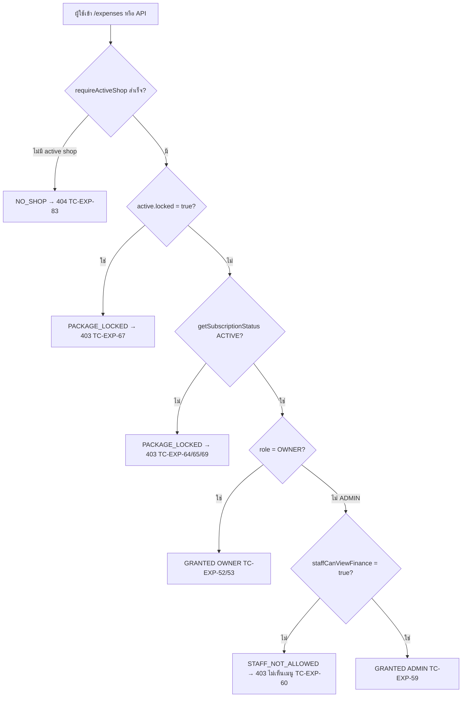
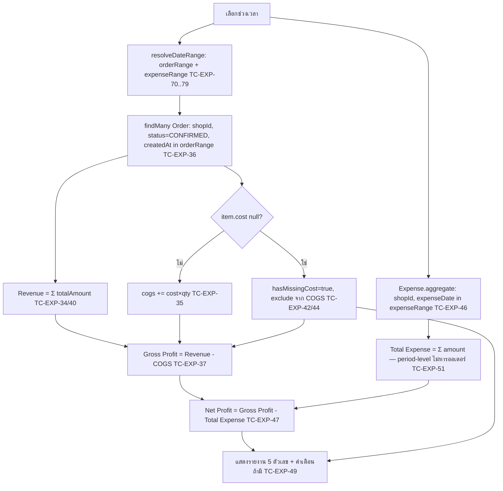
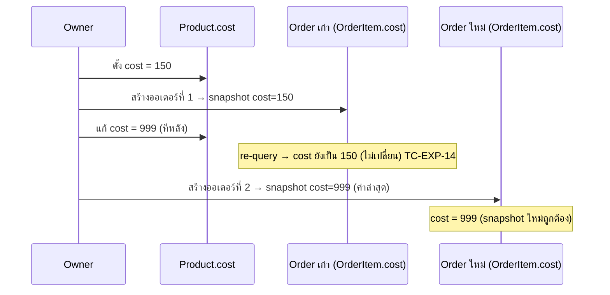

> **โมดูล:** M00016-ExpenseCostTracking
> **ประเภทเอกสาร:** Test Case (E2E + API/Service Integration + Unit)
> **เวอร์ชัน:** 1.0
> **วันที่จัดทำ:** 2026-07-08
> **สถานะ:** Draft
> **เจ้าของเอกสาร:** QA (ดู [[Feature-Docs-Ownership]])

# Test Case: Expense & Cost Tracking (E2E)

---

## 1. Overview

ชุดทดสอบนี้ครอบคลุม feature **Expense & Cost Tracking (M00016)** ทั้งหมด ประกอบด้วย:

1. `Product.cost` — ตั้ง/แก้ต้นทุนสินค้า + backend gate ด้วย Business Package (FR-EXP-01)
2. `OrderItem.cost` — snapshot ต้นทุน ณ วันขาย, historical accuracy เมื่อแก้ `Product.cost` ทีหลัง (FR-EXP-02)
3. Expense CRUD — สร้าง/แก้/ลบ ผูก `shopId`, ownership scoping ไม่ leak ข้ามร้าน (FR-EXP-03/04)
4. Fixed Category — 7 หมวดคงที่ (FR-EXP-05)
5. รายงาน P&L — Revenue/COGS/Gross Profit/Total Expense/Net Profit, missing-cost warning, period-level expense (D-10) (FR-EXP-06/07/08)
6. Access Control — owner เสมอ, admin toggle `staffCanViewFinance`, gate ด้วย Business Package ACTIVE (FR-EXP-09/10/11)
7. `date-range.ts` dual-boundary (timestamptz vs `@db.Date`) — edge case ข้ามเดือน/ข้ามปี/off-by-one (SDS TD-002)
8. Owner resolution ของ PERSONAL/BUSINESS shop (SRS TFR-009)
9. Cross-cutting: CSRF/auth/rate-limit บน endpoint ใหม่ + zero-regression ของ `createOrder()`/product routes เดิม
10. **Security fix — cross-shop `productId` injection (`ProductNotInShopError`)**: `createOrder()` ต้อง pre-validate ว่าทุก client `productId` เป็นของ active shop ของผู้เรียกเท่านั้น ก่อนใช้ snapshot cost/ตัดสต็อก ป้องกันต้นทุนคู่แข่งรั่วและตัดสต็อกคู่แข่ง (หมวด B-SEC)
11. **Redesign 2026-08-02 (deployed)** — response shape ใหม่ของ `/api/expenses/report` (`expenses[]`/`prevNetProfit`), `hasAnyExpense` (empty state 2 แบบ), กำไรสุทธิไหลเข้า 3 surface ของหน้ายอดขาย (`/sales`, การ์ด command center, ชีตมือถือ — FR-EXP-12), รูปแบบเงิน SSOT (`format-money.ts`), filter/search/pagination บนรายการค่าใช้จ่าย (หมวด P)

ประเภทการทดสอบ: **Unit** (Vitest — `pnl.service.ts` reducer, `date-range.ts` pure function, `lib/expense.ts` constants — ไม่ต้อง DB), **Service/API integration** (`page.request.*` หรือเรียก service ตรงผ่าน Vitest — ownership scoping, cost snapshot, P&L formula กับ DB จริง), **E2E Playwright** (UI flow: ฟอร์ม cost/expense, gate/locked state, toggle, missing-cost warning banner)

**เอกสารต้นทาง:** [[BRD]] ของโมดูลนี้ — ทุก test case trace กลับ FR-EXP-01..11 และ Acceptance Criteria (Given/When/Then) แบบ `[FR-EXP-XX-AC-YY]`; ส่วนเสริมจาก [[SRS]] (TFR-001..011), [[SDS]] (TD-001..004), [[PRD]] (Decisions D-1..D-11)

**ขอบเขตชุดทดสอบ (Scope):**

- **In-scope:** seller subdomain (`seller.deepth.local:4000`) หน้าใหม่ `/expenses` + ฟอร์มสินค้าที่แก้ (field `cost`), API integration (`page.request.*`), service-level integration (`pnl.service.ts`/`date-range.ts`/`expense-access.service.ts` เรียกตรงผ่าน Vitest สำหรับ pure-calc/boundary), DB persistence verify ผ่าน Prisma
- **Out-of-scope:** billing/paywall ของ Business Package เอง (feature 00008 มี test suite แยกอยู่แล้ว — ที่นี่ทดสอบแค่การ **reuse** `getSubscriptionStatus`), export รายงาน/custom category/audit trail/recurring expense/budget alert/per-order allocation/cross-shop P&L (ทั้งหมด Out of Scope ตาม BRD §7 — ไม่มี TC)

**สภาพแวดล้อม:**

- dev server รันที่ `http://seller.deepth.local:4000` (user รันเอง — `npm run dev -- -p 4000`)
- DB: Supabase dev (`.env.local`) — **ต้อง apply migration ของ feature นี้ก่อน** (`Product.cost`, `OrderItem.cost`, `Shop.staffCanViewFinance`, model `Expense`, index `Order(shopId,status,createdAt)` + `OrderItem(orderId)`) ดู [[DATABASE]] §5-6 — ปัจจุบันยัง **Draft, ยังไม่ apply**
- Playwright config: `playwright.config.ts` (baseURL `http://seller.deepth.local:4000`, workers 1, ไม่ auto-start server)
- Vitest: `npm run test` (`dotenv -e .env -- npx vitest`) สำหรับ unit/service-integration ที่ไม่ต้องใช้ browser
- Auth bypass: `e2e/helpers/auth.ts` — `createSeller('complete')` + `loginAs(context, seeded)` (PERSONAL shop, cookie inject) เป็น default; สำหรับ BUSINESS shop + ShopMember(ADMIN) ต้องใช้ helper ใหม่ (ดู §5)
- **หมายเหตุ TDD:** test case เหล่านี้เขียนก่อน implement feature (Documentation-First, Hard Rule 11) — รันได้หลัง developer สร้าง feature + migration ครบ ทุก test case = **Blocked** จนกว่า migration ของโมดูลนี้จะ apply (ดู §6 Dependencies)

---

## 2. Test Scenarios

### หมวด A — ตั้ง/แก้ต้นทุนสินค้า (FR-EXP-01)

---

#### TC-EXP-01: ตั้ง `Product.cost` ≥ 0 สำเร็จผ่านฟอร์มสินค้า

- **Linked to:** `[FR-EXP-01-AC-01]`
- **Precondition:** seed shop ที่ owner มี Business Package `status=ACTIVE`, product ที่ยังไม่เคยตั้ง `cost`
- **ประเภท:** E2E Playwright + DB verify
- **Steps:**
  1. `loginAs` → เปิดฟอร์มแก้ไขสินค้า → กรอกช่อง "ราคาทุน" = `150` → บันทึก
  2. Query DB `product.cost`
- **Expected Result:** บันทึกสำเร็จ (toast success); `product.cost = 150.00`

---

#### TC-EXP-02: ไม่กรอกช่อง "ราคาทุน" เลย → `Product.cost = null` สร้าง/แก้/ขายได้ปกติ

- **Linked to:** `[FR-EXP-01-AC-02]`
- **Precondition:** owner package ACTIVE
- **ประเภท:** API integration + DB verify
- **Steps:**
  1. `POST /api/products` โดยไม่ส่ง field `cost` เลย
  2. Query DB `product.cost`
- **Expected Result:** HTTP 201 สร้างสำเร็จ; `product.cost = null`; ไม่มี error ใด ๆ

---

#### TC-EXP-03: กรอกค่าติดลบในช่อง "ราคาทุน" → frontend ปฏิเสธ

- **Linked to:** `[FR-EXP-01-AC-03]`
- **Precondition:** owner package ACTIVE, เปิดฟอร์มสินค้า
- **ประเภท:** E2E Playwright
- **Steps:**
  1. กรอก `cost = -10` → พยายาม submit
- **Expected Result:** inline validation error แสดง ("ต้องไม่ต่ำกว่า 0"); ฟอร์มไม่ submit

---

#### TC-EXP-04: `cost < 0` ผ่าน API ตรง → backend ปฏิเสธ (defense-in-depth)

- **Linked to:** `[FR-EXP-01-AC-03]`
- **Precondition:** owner package ACTIVE
- **ประเภท:** API integration
- **Steps:**
  1. `POST /api/products` `{ ..., cost: -10 }`
- **Expected Result:** HTTP 400 (Valibot `minValue(0)` reject) — ไม่มี product ถูกสร้าง

---

#### TC-EXP-05: แก้ `Product.cost` ของสินค้าที่เคยขายไปหลายออเดอร์แล้ว → `OrderItem.cost` เก่าไม่เปลี่ยน

- **Linked to:** `[FR-EXP-01-AC-04]`
- **Precondition:** seed product `cost=150` ที่ถูกขายไปแล้ว 2 ออเดอร์ (`OrderItem.cost=150` snapshot ไว้ทั้งคู่)
- **ประเภท:** API integration + DB verify (ซ้ำเสริมกับ TC-EXP-14 มุม "จากฝั่งแก้ product")
- **Steps:**
  1. `PATCH /api/products/{id}` `{ cost: 200 }`
  2. Query DB `orderItem.cost` ของทั้ง 2 ออเดอร์เดิม
- **Expected Result:** `product.cost = 200`; `orderItem.cost` ของทั้ง 2 ออเดอร์เดิมยังเป็น `150` เป๊ะ (ไม่เปลี่ยนตาม)

---

#### TC-EXP-06: Owner **ไม่มี** Business Package ACTIVE → ช่อง "ราคาทุน" แสดงแต่ disabled + badge "อัปเกรดเป็น Business"

- **Linked to:** `[FR-EXP-01-AC-05]`
- **Precondition:** seed shop ที่ owner ไม่มี `BusinessPackageSubscription` (FREE)
- **ประเภท:** E2E Playwright
- **Steps:**
  1. `loginAs` → เปิดฟอร์มสร้าง/แก้ไขสินค้า
  2. ตรวจช่อง "ราคาทุน" — visible แต่ `disabled`, มี badge "อัปเกรดเป็น Business" ข้าง ๆ
  3. ตรวจว่า field อื่นกรอก/บันทึกสินค้าได้ปกติ (zero-regression)
- **Expected Result:** field ไม่ถูกซ่อน (แค่แก้ไม่ได้); บันทึกสินค้าสำเร็จโดยไม่มี `cost`

---

#### TC-EXP-07: Owner ไม่มี package ACTIVE ส่ง `cost` ผ่าน API ตรง → `403 COST_REQUIRES_BUSINESS_PACKAGE`

- **Linked to:** `[FR-EXP-01-AC-05]` (backend defense-in-depth, **critical** — bypass ผ่าน UI disable)
- **Precondition:** owner ไม่มี package ACTIVE
- **ประเภท:** API integration — **regression/security gate**
- **Steps:**
  1. `POST /api/products` `{ ..., cost: 50 }` (bypass UI, ยิงตรง)
  2. ทำซ้ำกับ `PATCH /api/products/{id}` `{ cost: 50 }`
- **Expected Result:** ทั้งสอง endpoint คืน HTTP 403 `{ error: "COST_REQUIRES_BUSINESS_PACKAGE" }`; ไม่มี `cost` ถูกตั้งค่า

---

#### TC-EXP-08: Owner ซื้อ package จน ACTIVE → ช่อง "ราคาทุน" ปลดล็อกให้กรอกได้ทันที

- **Linked to:** `[FR-EXP-01-AC-05]` (unlock transition)
- **Precondition:** seed owner FREE → เปลี่ยนเป็น ACTIVE (ผ่าน Prisma ตรง จำลอง subscribe สำเร็จ)
- **ประเภท:** E2E Playwright
- **Steps:**
  1. `loginAs` → เปิดฟอร์มสินค้า → ตรวจ field disabled (baseline)
  2. อัปเดต `BusinessPackageSubscription.status='ACTIVE'` ผ่าน Prisma → reload หน้า
  3. ตรวจ field อีกครั้ง
- **Expected Result:** field เปลี่ยนเป็น enabled กรอกได้; badge หายไป

---

#### TC-EXP-09: `cost = 0` ยอมรับได้ (ต่างจาก `price` ที่ต้อง `minValue(0.01)`)

- **Linked to:** SRS TFR-001 (edge case)
- **Precondition:** owner package ACTIVE
- **ประเภท:** API integration
- **Steps:**
  1. `POST /api/products` `{ ..., price: 100, cost: 0 }`
- **Expected Result:** HTTP 201; `product.cost = 0` (ไม่ reject เหมือน `price=0`)

---

#### TC-EXP-10: `PATCH /api/products/{id}` ไม่ส่ง field `cost` เลย (`undefined`) → ไม่แตะค่าเดิม

- **Linked to:** SRS TFR-001 (partial-update pattern เดียวกับ `stockQty`/`lowStockThreshold`)
- **Precondition:** product ที่มี `cost=150` อยู่แล้ว
- **ประเภท:** API integration + DB verify
- **Steps:**
  1. `PATCH /api/products/{id}` `{ name: "ชื่อใหม่" }` (ไม่มี key `cost` ใน body เลย)
  2. Query DB `product.cost`
- **Expected Result:** `product.name` เปลี่ยน; `product.cost` ยังคง `150` (ไม่ถูกล้างเป็น `null` โดยไม่ตั้งใจ)

---

### หมวด B — Snapshot ต้นทุนลง OrderItem (FR-EXP-02)

---

#### TC-EXP-11: สร้างออเดอร์จากสินค้าที่มี `cost` ไม่ null → `OrderItem.cost` snapshot ถูกต้อง

- **Linked to:** `[FR-EXP-02-AC-01]`
- **Precondition:** product `cost=150`, owner package ACTIVE (ไม่บังคับสำหรับ order creation แต่ทำให้ cost ถูกตั้งได้จริง)
- **ประเภท:** API integration + DB verify
- **Steps:**
  1. `POST /api/orders` `{ items: [{productId, qty:2, ...}], ... }`
  2. Query DB `orderItem.cost`
- **Expected Result:** order สร้างสำเร็จ; `orderItem.cost = 150` (เท่ากับ `product.cost` ณ ขณะสร้าง)

---

#### TC-EXP-12: สินค้าที่ `Product.cost = null` → `OrderItem.cost = null` ไม่ error ไม่ default 0

- **Linked to:** `[FR-EXP-02-AC-02]`
- **Precondition:** product ที่ไม่เคยตั้ง `cost`
- **ประเภท:** API integration + DB verify
- **Steps:**
  1. `POST /api/orders` ด้วยสินค้านี้
  2. Query DB `orderItem.cost`
- **Expected Result:** order สร้างสำเร็จปกติ; `orderItem.cost = null` (ไม่ใช่ `0`)

---

#### TC-EXP-13: Custom/manual line item (`productId = null`) → `OrderItem.cost = null` เสมอ

- **Linked to:** `[FR-EXP-02-AC-03]`
- **Precondition:** —
- **ประเภท:** API integration + DB verify
- **Steps:**
  1. `POST /api/orders` `{ items: [{ name: "รายการกำหนดเอง", qty:1, price:100 }] }` (ไม่มี `productId`)
  2. Query DB `orderItem.cost`
- **Expected Result:** `orderItem.cost = null` เสมอ ไม่ว่าจะมี `Product` ใดใน shop ที่ตั้ง `cost` ไว้หรือไม่

---

#### TC-EXP-14: แก้ `Product.cost` เป็นค่าใหม่ทีหลัง → re-query ออเดอร์เก่า `OrderItem.cost` ไม่เปลี่ยน (Historical Accuracy — **สำคัญที่สุด**)

- **Linked to:** `[FR-EXP-02-AC-04]`
- **Precondition:** product `cost=150` → สร้างออเดอร์ (`orderItem.cost=150` snapshot ไว้)
- **ประเภท:** API integration + DB verify — **regression gate สำคัญที่สุดของฟีเจอร์นี้**
- **Steps:**
  1. `PATCH /api/products/{id}` `{ cost: 999 }`
  2. Query DB `orderItem.cost` ของออเดอร์ที่สร้างไปก่อนหน้า
  3. สร้างออเดอร์ใหม่ (order ที่ 2) ด้วยสินค้าเดียวกัน → query `orderItem.cost` ของออเดอร์ใหม่
- **Expected Result:** `product.cost = 999`; **ออเดอร์เก่า** `orderItem.cost` ยังเป็น `150` เป๊ะ (ไม่เปลี่ยนตาม `Product.cost` ปัจจุบัน); **ออเดอร์ใหม่** `orderItem.cost = 999` (snapshot ค่าล่าสุด ณ ตอนสร้าง)

---

#### TC-EXP-15: Multi-item order ผสม cost มี/ไม่มี → แต่ละ item snapshot อิสระต่อกันถูกต้อง

- **Linked to:** FR-EXP-02 (composite)
- **Precondition:** product A `cost=100`, product B `cost=null`
- **ประเภท:** API integration + DB verify
- **Steps:**
  1. `POST /api/orders` `{ items: [{productA, qty:2}, {productB, qty:3}] }`
  2. Query DB `orderItem` ทั้ง 2 แถว
- **Expected Result:** `orderItem[A].cost = 100`; `orderItem[B].cost = null`

---

#### TC-EXP-16: Cost snapshot เป็นส่วนหนึ่งของ transaction เดียวกับสร้าง order (all-or-nothing)

- **Linked to:** BRD §6.3 (Reliability), SDS §4.5
- **Precondition:** จำลอง order creation ที่ต้อง fail กลางทาง (เช่น สินค้าใน order ไม่พบ/สต็อกไม่พอถ้ามี Inventory Add-on ผสม)
- **ประเภท:** Service integration (Vitest, เรียก `createOrder` ตรง)
- **Steps:**
  1. เรียก `createOrder()` ด้วย payload ที่ทำให้ transaction ต้อง rollback (เช่น item ที่ resolve ไม่ผ่าน)
  2. Query DB `orderItem` ที่ควรถูกสร้างจาก order นี้
- **Expected Result:** ไม่มี `Order`/`OrderItem` ใดถูกสร้างเลย (รวมถึงไม่มี `OrderItem.cost` หลงเหลือบางส่วน) — rollback ทั้งก้อน

---

#### TC-EXP-17: Quick-Create auto-created product (จาก manual line item) → `cost = null` โดยธรรมชาติ

- **Linked to:** SRS TFR-002 (edge case เฉพาะของ Quick-Create)
- **Precondition:** ส่ง item ที่ไม่มี `productId` แต่มี `name` ที่ทำให้ `createOrder` auto-create `Product` ใหม่ (Quick-Create pattern เดิม)
- **ประเภท:** API integration + DB verify
- **Steps:**
  1. `POST /api/orders` ด้วย manual line item ที่เข้าเงื่อนไข Quick-Create
  2. Query DB `product.cost` (แถวใหม่ที่ถูก auto-create) และ `orderItem.cost`
- **Expected Result:** `product.cost = null` (ไม่มีใครส่ง `cost` ให้ตอน auto-create); `orderItem.cost = null` (ได้จาก `costMap` โดยธรรมชาติ ไม่ต้องมี branch พิเศษ)

---

### หมวด B-SEC — Cross-Shop `productId` Injection (Security Fix, FR-EXP-02)

> **บริบท:** security review เจอ critical vuln ใน `createOrder()` — endpoint รับ client `productId` มาสร้าง `OrderItem` โดยไม่ verify ว่า `productId` นั้นเป็นของ **active shop ของผู้เรียกจริง**. ผลคือ attacker (มี active shop ของตัวเอง) ส่ง `productId` ของร้านคู่แข่งมาสร้างออเดอร์ในร้านตัวเอง จะได้ (1) **ต้นทุนลับของคู่แข่งรั่ว** เข้า cost snapshot/P&L ของ attacker (`OrderItem.cost` copy มาจาก `Product.cost` ของร้านเหยื่อ) และ (2) **ตัดสต็อกของคู่แข่งได้** (ถ้า `Product.type=PHYSICAL` มี stock tracking) แม้ว่าออเดอร์นั้นจะไม่ได้เป็นของร้านเหยื่อเลย. Developer แก้ด้วย **pre-validation**: ทุก `productId` ที่ client ส่งมาต้อง query ยืนยันว่า `product.shopId === activeShop.id` ก่อนใช้งานใด ๆ ใน `createOrder()` — ถ้าไม่ตรง reject ทั้งคำขอด้วย `ProductNotInShopError` (HTTP 400) **ก่อน**ที่ transaction สร้าง order/snapshot cost/ตัด stock ใด ๆ จะเริ่ม (fail-fast, all-or-nothing เหมือน TC-EXP-16)

---

#### TC-EXP-97: Cross-shop `productId` → ต้นทุนคู่แข่งรั่วเข้า cost snapshot ของ attacker (security — cost leak)

- **Linked to:** Security fix `ProductNotInShopError`, `[FR-EXP-02-AC-01]` (defense-in-depth ของ cost snapshot)
- **Precondition:** seed shop A (attacker, active shop ของผู้เรียก) และ shop B (เหยื่อ) — shop B มี Product X (`cost=150`, ราคาลับที่ไม่ควรให้ร้านอื่นเห็น)
- **ประเภท:** API integration + DB verify — **security gate สำคัญที่สุดของหมวดนี้**
- **Steps:**
  1. `loginAs` (attacker, active shop = A) → `POST /api/orders` `{ items: [{ productId: <X_id ของ shop B>, name: "x", qty: 1, price: 0.01 }], ... }`
  2. Query DB `order`/`orderItem` ที่อาจถูกสร้างขึ้นภายใต้ `shopId=A`
- **Expected Result:** HTTP **400** `{ error: "ProductNotInShopError" }` (ข้อความ "พบสินค้าที่ไม่ใช่ของร้านนี้" หรือเทียบเท่า); **ไม่มี** `Order`/`OrderItem` ใดถูกสร้างขึ้นเลยภายใต้ shop A; ต้นทุน ฿150 ของ Product X (shop B) **ไม่ปรากฏ**ที่ใดใน response หรือใน DB ของ shop A

---

#### TC-EXP-98: Cross-shop `productId` → ตัดสต็อกสินค้าคู่แข่งไม่ได้ (security — stock manipulation)

- **Linked to:** Security fix `ProductNotInShopError`
- **Precondition:** shop B มี Product Y (`type=PHYSICAL`, `stockQty=10`); shop A (attacker) active shop ของผู้เรียก
- **ประเภท:** API integration + DB verify — **security gate**
- **Steps:**
  1. `loginAs` (attacker, active shop = A) → `POST /api/orders` `{ items: [{ productId: <Y_id ของ shop B>, name: "y", qty: 3, price: 0.01 }], ... }`
  2. Query DB `product.stockQty` ของ Y (shop B)
  3. Query DB `StockMovement` ที่อ้างถึง `productId=Y` ว่ามีแถวใดถูกเขียนภายใต้บริบท shop A หรือไม่
- **Expected Result:** HTTP 400 (`ProductNotInShopError`); `product(Y).stockQty` ยังเป็น **10** เป๊ะ (ไม่ถูกตัด); **ไม่มี** `StockMovement` แถวใหม่ที่ชี้ไปยัง Y ถูกสร้างจากคำขอนี้เลย

---

#### TC-EXP-99: สั่งสินค้าด้วย `productId` ของร้านตัวเอง (ปกติ) → ยังสั่งสำเร็จ (regression guard — fix ไม่ false-reject ของถูก)

- **Linked to:** Security fix `ProductNotInShopError` (zero-regression), `[FR-EXP-02-AC-01]`
- **Precondition:** shop A มี Product Z ของตัวเอง (`cost=100`), owner package ACTIVE (ให้ cost ถูกตั้งค่าได้จริง)
- **ประเภท:** API integration + DB verify — **regression gate**
- **Steps:**
  1. `loginAs` (active shop = A) → `POST /api/orders` `{ items: [{ productId: <Z_id ของ shop A เอง>, qty: 2, price: 200 }], ... }`
  2. Query DB `order`/`orderItem`
- **Expected Result:** HTTP **201**; `order` ถูกสร้างสำเร็จภายใต้ `shopId=A`; `orderItem.cost = 100` (snapshot ถูกต้องตรงตาม `Product.cost` ของ shop A เอง) — พิสูจน์ว่า pre-validation ใหม่ไม่ทำให้ flow ปกติพัง

---

#### TC-EXP-100: Quick-Create custom line item (ไม่มี `productId`) ยังทำงานปกติหลัง fix (regression guard)

- **Linked to:** Security fix `ProductNotInShopError` (zero-regression กับ Quick-Create เดิม — TC-EXP-13/17), `[FR-EXP-02-AC-03]`
- **Precondition:** active shop = A
- **ประเภท:** API integration + DB verify — **regression gate**
- **Steps:**
  1. `loginAs` (active shop = A) → `POST /api/orders` `{ items: [{ name: "custom", qty: 1, price: 100 }], ... }` (ไม่มี `productId` เลย — ไม่ผ่าน pre-validation เพราะไม่มีอะไรให้ตรวจ)
  2. Query DB `product` (แถวใหม่ที่ auto-create) และ `orderItem.cost`
- **Expected Result:** HTTP 201; `Product` ใหม่ถูก auto-create ภายใต้ `shopId=A` (Quick-Create เดิมยังทำงาน — pre-validation ไม่ intercept รายการที่ไม่มี `productId`); `OrderItem.cost = null`

---

#### TC-EXP-101: Soft-deleted product ของร้านตัวเอง — ยังสั่งได้ตามปกติหลัง fix (verify ตอน implement)

- **Linked to:** Security fix `ProductNotInShopError` (edge — ห้าม false-reject ของที่ถูกต้องแค่เพราะสถานะ soft-delete)
- **Precondition:** shop A มี Product W ที่ถูก soft-delete ไว้ (ถ้า `Product` model มี soft-delete field เช่น `deletedAt`/`isActive=false` — **ต้อง verify ตอน implement ว่า `Product` model มี soft-delete จริงหรือไม่**; ถ้าไม่มีให้ mark TC นี้เป็น N/A พร้อมเหตุผลใน §7 ผลล่าสุด)
- **ประเภท:** API integration + DB verify
- **Steps:**
  1. `loginAs` (active shop = A) → `POST /api/orders` `{ items: [{ productId: <W_id soft-deleted ของ shop A เอง>, qty: 1, price: 50 }], ... }`
- **Expected Result:** ถ้า `Product` มี soft-delete: pre-validation เช็คเฉพาะ `shopId` ตรงหรือไม่ (**ไม่**เช็คสถานะ active/deleted) → order สร้างสำเร็จ HTTP 201 เหมือนเดิม (ไม่ false-reject สินค้าที่เป็นของร้านตัวเองจริง แค่ถูก soft-delete); ถ้า `Product` ไม่มี soft-delete ในระบบนี้ — TC นี้ N/A (ไม่มี state ให้ทดสอบ)

---

### หมวด C — บันทึกค่าใช้จ่ายใหม่ (FR-EXP-03)

---

#### TC-EXP-18: สร้าง Expense สำเร็จด้วยข้อมูลครบ

- **Linked to:** `[FR-EXP-03-AC-01]`
- **Precondition:** owner package ACTIVE
- **ประเภท:** E2E Playwright + DB verify
- **Steps:**
  1. `loginAs` → `/expenses` → กด "บันทึกค่าใช้จ่าย" → กรอก `amount=1500`, `category=ADVERTISING`, `expenseDate` วันนี้, `note="ค่า boost โพสต์ FB"` → บันทึก
  2. Query DB `expense`
- **Expected Result:** toast success; `Expense` record ถูกสร้าง `shopId` = active shop, ค่าตรงตามที่กรอกทุก field

---

#### TC-EXP-19: `amount ≤ 0` → frontend + backend ปฏิเสธ

- **Linked to:** `[FR-EXP-03-AC-02]`
- **Precondition:** owner package ACTIVE
- **ประเภท:** E2E Playwright + API integration
- **Steps:**
  1. (frontend) กรอก `amount=0` ในฟอร์ม → ตรวจ inline error, ไม่ submit
  2. (backend) `POST /api/expenses` `{ amount: 0, category: "RENT" }` ตรง ๆ
- **Expected Result:** frontend reject ก่อน submit; backend คืน HTTP 400 — ไม่มี `Expense` ถูกสร้าง

---

#### TC-EXP-20: `amount` ไม่ใช่ตัวเลข → backend ปฏิเสธ

- **Linked to:** `[FR-EXP-03-AC-02]`
- **Precondition:** owner package ACTIVE
- **ประเภท:** API integration
- **Steps:**
  1. `POST /api/expenses` `{ amount: "abc", category: "RENT" }`
- **Expected Result:** HTTP 400 (Valibot parse fail)

---

#### TC-EXP-21: `category` ไม่ตรงกับ fixed list → backend ปฏิเสธ

- **Linked to:** `[FR-EXP-03-AC-03]`
- **Precondition:** owner package ACTIVE
- **ประเภท:** API integration
- **Steps:**
  1. `POST /api/expenses` `{ amount: 100, category: "TRAVEL" }` (ไม่อยู่ใน 7 หมวด)
- **Expected Result:** HTTP 400

---

#### TC-EXP-22: ไม่ระบุ `expenseDate` → default เป็นวันที่ปัจจุบัน (Thai calendar date)

- **Linked to:** `[FR-EXP-03-AC-04]`
- **Precondition:** owner package ACTIVE
- **ประเภท:** API integration + DB verify
- **Steps:**
  1. `POST /api/expenses` `{ amount: 500, category: "OTHER" }` (ไม่ส่ง `expenseDate`)
  2. Query DB `expense.expenseDate`
- **Expected Result:** HTTP 201; `expense.expenseDate` = วันที่ปัจจุบันตาม Thai calendar (`todayThaiIsoDate()`) — ไม่ error

---

#### TC-EXP-23: Backdate `expenseDate` (วันที่ในอดีต) → สร้างสำเร็จ

- **Linked to:** PRD D-11 (backdate อนุญาต)
- **Precondition:** owner package ACTIVE
- **ประเภท:** API integration + DB verify
- **Steps:**
  1. `POST /api/expenses` `{ amount: 8000, category: "RENT", expenseDate: "2569-01-01" }`
- **Expected Result:** HTTP 201; `expense.expenseDate = 2026-01-01` (ตรง, ไม่ off-by-one)

---

#### TC-EXP-24: `note` เกิน 500 ตัวอักษร → backend ปฏิเสธ

- **Linked to:** API.md §4.1 (`v.maxLength(500)`)
- **Precondition:** owner package ACTIVE
- **ประเภท:** API integration
- **Steps:**
  1. `POST /api/expenses` `{ amount: 100, category: "OTHER", note: "x".repeat(501) }`
- **Expected Result:** HTTP 400

---

### หมวด D — แก้ไข/ลบค่าใช้จ่าย (FR-EXP-04)

---

#### TC-EXP-25: แก้ field ใดก็ได้ของ Expense ของร้านตัวเอง → อัปเดตสำเร็จ

- **Linked to:** `[FR-EXP-04-AC-01]`
- **Precondition:** seed expense ของ active shop
- **ประเภท:** E2E Playwright + DB verify
- **Steps:**
  1. `loginAs` → `/expenses` → แก้รายการ → เปลี่ยน `amount`/`category`/`expenseDate`/`note` → บันทึก
  2. Query DB
- **Expected Result:** อัปเดตสำเร็จ; validation เดียวกับ TC-EXP-19..21 ใช้ซ้ำ (ลอง `amount=0` ตอนแก้ → ต้อง reject เหมือนตอนสร้าง)

---

#### TC-EXP-26: ลบ Expense ของร้านตัวเอง + ยืนยัน → hard delete

- **Linked to:** `[FR-EXP-04-AC-02]`
- **Precondition:** seed expense ของ active shop
- **ประเภท:** E2E Playwright + DB verify
- **Steps:**
  1. `loginAs` → `/expenses` → กดลบ + ยืนยัน (SweetAlert)
  2. Query DB `expense.findUnique({ id })`
- **Expected Result:** response `{ deleted: true }`; record หายจาก DB จริง (hard delete, ไม่ใช่ soft-delete)

---

#### TC-EXP-27: แก้ Expense ของร้าน**อื่น**ผ่าน API ตรง (แก้ `id`) → 404 ไม่ leak

- **Linked to:** `[FR-EXP-04-AC-03]`
- **Precondition:** seed shop A (active) + shop B (ของ user อื่น) ที่มี expense อยู่
- **ประเภท:** API integration — **security gate สำคัญ**
- **Steps:**
  1. `loginAs` shop A → `PATCH /api/expenses/{expenseId ของ shop B}` `{ amount: 999 }`
  2. Query DB expense ของ shop B ว่าไม่เปลี่ยน
- **Expected Result:** HTTP 404 (ไม่ใช่ 403 — ไม่บอกว่ามี record นี้อยู่จริงหรือไม่); `expense` ของ shop B ไม่ถูกแก้

---

#### TC-EXP-28: ลบ Expense ของร้าน**อื่น**ผ่าน API ตรง → 404 ไม่ leak

- **Linked to:** `[FR-EXP-04-AC-03]`
- **Precondition:** เหมือน TC-EXP-27
- **ประเภท:** API integration
- **Steps:**
  1. `DELETE /api/expenses/{expenseId ของ shop B}`
- **Expected Result:** HTTP 404; expense ของ shop B ยังอยู่ครบใน DB

---

#### TC-EXP-29: Owner ที่มีหลายร้าน แก้ expense ของร้าน B ขณะ active shop = ร้าน A → 404 (cross-shop switcher isolation)

- **Linked to:** SRS TFR-004 (scope เทียบกับ **active shop เดียว** ไม่ใช่ "ทุกร้านที่ตนเป็นเจ้าของ")
- **Precondition:** user เดียวเป็น owner ของทั้งร้าน A และร้าน B, active shop ปัจจุบัน = A, มี expense อยู่ในร้าน B
- **ประเภท:** API integration
- **Steps:**
  1. `loginAs` (active shop = A) → `PATCH /api/expenses/{expenseId ของร้าน B}`
- **Expected Result:** HTTP 404 (แม้ตนจะเป็น owner ของร้าน B จริงก็ตาม — ต้อง switch active shop ก่อนถึงจะแก้ได้)

---

#### TC-EXP-30: แก้ Expense ด้วยค่าที่ invalid (`amount ≤ 0`) → reject เหมือนตอนสร้าง

- **Linked to:** `[FR-EXP-04-AC-01]` ("validation เดียวกับ FR-EXP-03 ใช้ซ้ำทุกครั้ง")
- **Precondition:** seed expense ของ active shop
- **ประเภท:** API integration
- **Steps:**
  1. `PATCH /api/expenses/{id}` `{ amount: -5 }`
- **Expected Result:** HTTP 400; record ไม่เปลี่ยน

---

### หมวด E — หมวดหมู่ค่าใช้จ่าย (Fixed Category) (FR-EXP-05)

---

#### TC-EXP-31: Dropdown เลือกหมวดแสดงครบ 7 หมวด

- **Linked to:** `[FR-EXP-05-AC-01]`
- **Precondition:** owner package ACTIVE
- **ประเภท:** E2E Playwright
- **Steps:**
  1. `loginAs` → `/expenses` → เปิดฟอร์มบันทึก → เปิด dropdown category
- **Expected Result:** เห็นครบ 7 ตัวเลือก (ค่าเช่า/ค่าบรรจุภัณฑ์-บรรจุภัณฑ์/ค่าโฆษณา/ค่าขนส่ง/เงินเดือน/ค่าน้ำ-ค่าไฟ/อื่นๆ) ไม่ขาด ไม่เกิน

---

#### TC-EXP-32: ส่ง `category` นอก 7 หมวดผ่าน API ตรง → ปฏิเสธ

- **Linked to:** `[FR-EXP-05-AC-02]`
- **Precondition:** owner package ACTIVE
- **ประเภท:** API integration
- **Steps:**
  1. `POST /api/expenses` `{ amount: 100, category: "MISC_CUSTOM" }`
- **Expected Result:** HTTP 400; ไม่มีช่องทางใดสร้าง category นอกเหนือ 7 ค่านี้ได้

---

#### TC-EXP-33: `EXPENSE_CATEGORIES` constant + `EXPENSE_CATEGORY_LABEL_TH` ครบ 7 คู่ ไม่มี key ขาด/เกิน

- **Linked to:** SRS TFR-005
- **Precondition:** —
- **ประเภท:** Unit (Vitest, `lib/expense.ts`) — ไม่ต้อง DB
- **Steps:**
  1. import `EXPENSE_CATEGORIES` และ `EXPENSE_CATEGORY_LABEL_TH` → ตรวจ `EXPENSE_CATEGORIES.length === 7` และทุก key มี label ภาษาไทยครบ
- **Expected Result:** ผ่านทั้งสอง assertion

---

### หมวด F — คำนวณ Revenue และ COGS (FR-EXP-06)

---

#### TC-EXP-34: Revenue = Σ `Order.totalAmount` ของออเดอร์ `CONFIRMED` ในช่วง

- **Linked to:** `[FR-EXP-06-AC-01]`
- **Precondition:** seed 3 order `CONFIRMED` `totalAmount` = 300, 500, 200 ในช่วงเวลาเดียวกัน + shop `shopId` ตรง
- **ประเภท:** Service integration (Vitest, เรียก `getPnlReport` ตรง) + DB verify
- **Steps:**
  1. `getPnlReport(shopId, range)` ที่ครอบคลุมทั้ง 3 order
- **Expected Result:** `revenue = 1000`

---

#### TC-EXP-35: COGS = Σ (`OrderItem.cost` × `qty`) เฉพาะรายการที่ `cost` ไม่ null

- **Linked to:** `[FR-EXP-06-AC-02]`
- **Precondition:** order เดียวกับ TC-EXP-34 มี item: cost=100×qty2, cost=null×qty1, cost=50×qty3
- **ประเภท:** Unit (`pnl.service.ts` reducer ด้วย fixture — ไม่ query DB จริงถ้าแยก reducer testable ได้, มิฉะนั้น Service integration)
- **Steps:**
  1. เรียก reducer/`getPnlReport` ด้วย fixture ข้างต้น
- **Expected Result:** `cogs = (100×2) + (50×3) = 350` (รายการ `cost=null` ถูก exclude ไม่ถูกนับเป็น 0)

---

#### TC-EXP-36: ออเดอร์ `PENDING`/`SHIPPED`/`CANCELLED` ไม่ถูกนับเข้า Revenue/COGS

- **Linked to:** `[FR-EXP-06-AC-03]`
- **Precondition:** seed 4 order ในช่วงเวลาเดียวกัน: 1 `CONFIRMED` (totalAmount=300), 1 `PENDING` (500), 1 `SHIPPED` (200), 1 `CANCELLED` (100)
- **ประเภท:** Service integration + DB verify — **negative case สำคัญ**
- **Steps:**
  1. `getPnlReport(shopId, range)`
- **Expected Result:** `revenue = 300` (เฉพาะ CONFIRMED); `orderCount = 1`

---

#### TC-EXP-37: Gross Profit = Revenue − COGS เสมอ ไม่มี rounding error สะสม (Decimal)

- **Linked to:** `[FR-EXP-06-AC-04]`
- **Precondition:** fixture ที่มีทศนิยม (เช่น `cost=33.33` × qty 3 หลายรายการ)
- **ประเภท:** Unit (`round2` helper + reducer)
- **Steps:**
  1. คำนวณด้วยชุดตัวเลขที่มักเกิด floating-point drift (เช่น `0.1 + 0.2` pattern) ผ่าน `getPnlReport`/reducer
- **Expected Result:** `grossProfit` ตรง `round2(revenue - cogs)` เป๊ะ 2 ตำแหน่งทศนิยม ไม่มี error สะสมจาก floating point (เช่นไม่ได้ `299.9999999`)

---

#### TC-EXP-38: ไม่มี order ใดเข้าเงื่อนไขในช่วงเวลา → `revenue=cogs=grossProfit=0`, `orderCount=0` ไม่ error

- **Linked to:** SRS TFR-006 (error/edge case)
- **Precondition:** shop ที่ไม่มี order CONFIRMED ในช่วงที่เลือก
- **ประเภท:** Service integration
- **Steps:**
  1. `getPnlReport(shopId, range)` ของช่วงที่ไม่มี order
- **Expected Result:** `{ revenue:0, cogs:0, grossProfit:0, orderCount:0, ... }` — ไม่ throw

---

#### TC-EXP-39: Scenario 1 เต็มรูปจาก BRD §5 (เสื้อยืด cost 150 ราคา 300 ขาย 2 ตัว CONFIRMED)

- **Linked to:** BRD §5 Scenario 1 (best case) — cross-check ตัวเลขจริงระหว่าง service กับ UI
- **Precondition:** seed product "เสื้อยืด" `price=300, cost=150` → สร้างออเดอร์ qty=2 → confirm order (`status=CONFIRMED`)
- **ประเภท:** E2E Playwright + API integration (ครบวงจร ไม่ mock)
- **Steps:**
  1. Owner ตั้ง `cost=150` → สร้างออเดอร์ 2 ตัว → confirm (จำลอง buyer ยืนยัน หรือ Prisma ตรงถ้าไม่มี flow buyer ใน scope)
  2. `loginAs` → `/expenses` → เลือกช่วงวันนี้
- **Expected Result:** `Revenue = 600`, `COGS = 300`, `Gross Profit = 300` — **ไม่มีคำเตือน** missing-cost แสดงบนหน้าจอ

---

#### TC-EXP-40: Revenue ใช้ `Order.totalAmount` ตรง ๆ (รวม VAT) — ไม่แยก/หัก VAT

- **Linked to:** BRD §8.1 (กฎการคำนวณ P&L — "ใช้ `Order.totalAmount` ตรง ๆ (รวม VAT) เป็นฐาน Revenue — ไม่แยก VAT")
- **Precondition:** seed order `CONFIRMED` ที่มี `vatRate`/`vatAmount`/`discount` ตั้งไว้ (Phase B fields) `totalAmount = 1070` (สมมติรวม VAT 7% แล้ว)
- **ประเภท:** Service integration + DB verify
- **Steps:**
  1. `getPnlReport(shopId, range)` ครอบคลุม order นี้
- **Expected Result:** `revenue = 1070` (เท่ากับ `totalAmount` ตรง ๆ); response ไม่มี field แยก VAT ออกจาก Revenue ใด ๆ (grep response shape ยืนยัน)

---

#### TC-EXP-41: Order หลายใบคนละวันในช่วงเดียวกัน (เช่น 7 วัน) รวมยอดถูกต้อง

- **Linked to:** FR-EXP-06 (aggregation across multiple orders)
- **Precondition:** seed 5 order `CONFIRMED` กระจายคนละวันภายใน 7 วันที่ผ่านมา
- **ประเภท:** Service integration
- **Steps:**
  1. `getPnlReport(shopId, resolveDateRange('7d'))`
- **Expected Result:** `revenue`/`cogs`/`orderCount` รวมครบทั้ง 5 order เป๊ะ

---

### หมวด G — เตือนเมื่อข้อมูลต้นทุนไม่ครบ (FR-EXP-07)

---

#### TC-EXP-42: มี `OrderItem.cost = null` อย่างน้อย 1 รายการในช่วง → `hasMissingCost=true` + แสดงคำเตือน

- **Linked to:** `[FR-EXP-07-AC-01]` — BRD §5 Scenario 2 (product A มี cost, B ไม่มี)
- **Precondition:** order `CONFIRMED` มี item A (`cost=100`) และ item B (`cost=null`)
- **ประเภท:** E2E Playwright + API integration
- **Steps:**
  1. `GET /api/expenses/report` ครอบคลุม order นี้
  2. `loginAs` → `/expenses` → ตรวจ UI
- **Expected Result:** `hasMissingCost = true`; UI แสดงคำเตือน "กำไรอาจไม่สมบูรณ์ (มีสินค้าที่ยังไม่ตั้งต้นทุน)" กำกับคู่กับ Gross/Net Profit

---

#### TC-EXP-43: ทุกรายการมี `cost` ครบ → ไม่มีคำเตือน

- **Linked to:** `[FR-EXP-07-AC-02]`
- **Precondition:** order ทั้งหมดในช่วงมี `OrderItem.cost` ไม่ null ทุกแถว
- **ประเภท:** API integration
- **Steps:**
  1. `GET /api/expenses/report`
- **Expected Result:** `hasMissingCost = false`

---

#### TC-EXP-44: รายการที่ `cost=null` ไม่ถูกนับเป็น 0 ใน COGS (exclude, ไม่ default) — verify ตัวเลขจริง

- **Linked to:** `[FR-EXP-07-AC-03]` — **critical**, ป้องกัน Gross Profit สูงเกินจริงอย่างเงียบ ๆ
- **Precondition:** item A `cost=100, qty=1`; item B `cost=null, qty=5` (ถ้า default 0 จะกลายเป็น COGS ต่ำกว่าความจริง ถ้าคิดผิดเป็น exclude ทั้ง item ก็ต้องยัง revenue เต็ม)
- **ประเภท:** Unit/Service integration + DB verify
- **Steps:**
  1. `getPnlReport` → เทียบ `cogs` ที่ได้กับค่าที่คำนวณมือ (`100×1 = 100`, ไม่รวม item B เลยไม่ว่าจะเป็น `0×5` หรือค่าใด)
- **Expected Result:** `cogs = 100` เป๊ะ (ไม่ใช่ `100 + 0 = 100` โดยบังเอิญที่ hide bug ไว้ — ต้องยืนยันด้วย unit test ที่ mock `cost=null` แล้วดูโค้ด `continue` ก่อน accumulate ตาม SRS TFR-007 ไม่ใช่ `Number(null) = 0` แบบบังเอิญ)

---

#### TC-EXP-45: `hasMissingCost` คำนวณเฉพาะ order ที่นับเข้า Revenue (CONFIRMED) เท่านั้น

- **Linked to:** FR-EXP-07 (edge — ไม่ scan order สถานะอื่น)
- **Precondition:** order `PENDING` ที่มี item `cost=null`, order `CONFIRMED` ที่ทุก item `cost` ครบ ในช่วงเดียวกัน
- **ประเภท:** Service integration
- **Steps:**
  1. `getPnlReport(shopId, range)`
- **Expected Result:** `hasMissingCost = false` (item `cost=null` ของ order `PENDING` ไม่ถูกนำมาพิจารณาเลย เพราะ order นั้นไม่เข้าเงื่อนไข Revenue ตั้งแต่ต้น)

---

### หมวด H — Net Profit รวม Expense (FR-EXP-08)

---

#### TC-EXP-46: Total Expense = Σ `Expense.amount` ของ `shopId` ตรง ที่ `expenseDate ∈ [start,end]`

- **Linked to:** `[FR-EXP-08-AC-01]`
- **Precondition:** seed 3 expense ในช่วง (amount 8000, 1500, 500) + 1 expense นอกช่วง (amount 2000)
- **ประเภท:** Service integration + DB verify
- **Steps:**
  1. `getPnlReport(shopId, range)` ครอบเฉพาะ 3 รายการแรก
- **Expected Result:** `totalExpense = 10000` (ไม่รวมรายการนอกช่วง)

---

#### TC-EXP-47: Net Profit = Gross Profit − Total Expense

- **Linked to:** `[FR-EXP-08-AC-02]`
- **Precondition:** fixture ที่มี `grossProfit=300`, `totalExpense=100`
- **ประเภท:** Unit
- **Steps:**
  1. คำนวณผ่าน `getPnlReport`
- **Expected Result:** `netProfit = 200`

---

#### TC-EXP-48: ไม่มี Expense record ใดในช่วง → `totalExpense=0`, `netProfit=grossProfit` ไม่ error

- **Linked to:** `[FR-EXP-08-AC-03]`
- **Precondition:** shop ที่ไม่เคยบันทึก expense เลย
- **ประเภท:** Service integration
- **Steps:**
  1. `getPnlReport(shopId, range)`
- **Expected Result:** `totalExpense = 0`; `netProfit === grossProfit`

---

#### TC-EXP-49: Response แสดงตัวเลขทั้ง 5 ค่าคู่กันเสมอ (Revenue/COGS/Gross/Expense/Net)

- **Linked to:** `[FR-EXP-08-AC-04]`
- **Precondition:** owner package ACTIVE
- **ประเภท:** API integration (schema shape check)
- **Steps:**
  1. `GET /api/expenses/report`
- **Expected Result:** response มี key ครบ `revenue`, `cogs`, `grossProfit`, `totalExpense`, `netProfit`, `orderCount`, `hasMissingCost`, `range` ทุกครั้งที่ HTTP 200

---

#### TC-EXP-50: Expense ที่ `expenseDate` อยู่นอกช่วงที่เลือก → ไม่ถูกนับเข้า Total Expense (negative boundary)

- **Linked to:** FR-EXP-08 (negative)
- **Precondition:** expense `expenseDate` = วันก่อนช่วงเริ่ม 1 วัน
- **ประเภท:** Service integration
- **Steps:**
  1. `getPnlReport(shopId, range)` ที่ `range.gte` มากกว่า `expenseDate` นี้
- **Expected Result:** `totalExpense` ไม่รวมรายการนี้

---

#### TC-EXP-51: **Expense เป็น period-level — ไม่หารลงรายออเดอร์ (D-10, สำคัญ)**

- **Linked to:** BRD §8.1 (D-10) — ค่าโฆษณา ฿500 วันที่มี 11 ออเดอร์ = หัก ฿500 ก้อนเดียว ไม่ใช่ ฿45.45/ออเดอร์
- **Precondition:** seed 1 expense `amount=500` (`ADVERTISING`) + 11 order `CONFIRMED` ในวันเดียวกัน
- **ประเภท:** Service integration + DB verify + code review
- **Steps:**
  1. `getPnlReport(shopId, range)` ครอบทั้งวันนั้น
  2. ตรวจ response ว่าไม่มี field ใดที่เป็นค่า allocation ต่อออเดอร์ (เช่น `expensePerOrder`)
  3. Grep source `pnl.service.ts` ยืนยันไม่มี logic หาร `totalExpense` ด้วย `orderCount` ที่ใดเลย
- **Expected Result:** `totalExpense = 500` (ก้อนเดียว ไม่ใช่ `500/11≈45.45`); ไม่มี field/endpoint ใดคืนค่า per-order allocation

---

### หมวด I — Owner เห็นข้อมูลการเงินเสมอ (FR-EXP-09)

---

#### TC-EXP-52: Owner PERSONAL shop + package ACTIVE → เข้า `/expenses` เต็มสิทธิ์เสมอ ไม่ขึ้นกับ `staffCanViewFinance`

- **Linked to:** `[FR-EXP-09-AC-01]`
- **Precondition:** seed PERSONAL shop, owner package ACTIVE, `staffCanViewFinance=false` (ค่า default — ต้องไม่กระทบ owner)
- **ประเภท:** E2E Playwright
- **Steps:**
  1. `loginAs` (`createSeller('complete')`) → `/expenses`
- **Expected Result:** เห็นหน้าเต็มสิทธิ์ (ไม่ใช่ locked state) แม้ `staffCanViewFinance=false`

---

#### TC-EXP-53: Owner BUSINESS shop (`ShopMember role=OWNER`) + package ACTIVE → เข้าเต็มสิทธิ์

- **Linked to:** `[FR-EXP-09-AC-01]` (ครอบ BUSINESS kind ด้วย — TFR-009)
- **Precondition:** seed BUSINESS shop, owner (`Shop.userId` = user นี้, มี `ShopMember(role=OWNER)` mirror row) package ACTIVE
- **ประเภท:** E2E Playwright
- **Steps:**
  1. `loginAs` (BUSINESS owner) → `/expenses`
- **Expected Result:** เข้าถึงเต็มสิทธิ์เหมือน PERSONAL owner

---

#### TC-EXP-54: ทุก query Expense/cost/report กรองด้วย `shopId` ของ active shop server-side เท่านั้น (ไม่รับจาก client)

- **Linked to:** `[FR-EXP-09-AC-02]`
- **Precondition:** owner active shop = A, มี shop B อีกร้าน (คนละ owner หรือ owner เดียวกันก็ได้)
- **ประเภท:** API integration — security gate
- **Steps:**
  1. `loginAs` (active shop A) → `GET /api/expenses/report?shopId={shop B id}` (พยายามยัด `shopId` แปลกใน query/body ถ้ามี route รับ)
- **Expected Result:** response ยังคงเป็นข้อมูลของ shop A เท่านั้น (query param `shopId` แปลกปลอมถูกเพิกเฉย — endpoint ไม่มี parameter นี้ในสัญญาตาม API.md อยู่แล้ว)

---

#### TC-EXP-55: Owner ที่มีหลายร้าน สลับ active shop → เห็น Expense ของร้านที่ active เท่านั้น (cross-shop isolation)

- **Linked to:** FR-EXP-09 (composite, cross-shop)
- **Precondition:** owner มี 2 ร้าน (A, B) แต่ละร้านมี expense ของตัวเอง
- **ประเภท:** E2E Playwright
- **Steps:**
  1. `loginAs` → สลับ active shop เป็น A → `/expenses` → บันทึก expense list ที่เห็น
  2. สลับ active shop เป็น B → `/expenses` → ตรวจ list
- **Expected Result:** list ของ A และ B ไม่ปนกัน — เห็นเฉพาะของร้านที่ active ขณะนั้น

---

### หมวด J — Toggle `staffCanViewFinance` (FR-EXP-10)

---

#### TC-EXP-56: Shop ใหม่ (PERSONAL หรือ BUSINESS) → `staffCanViewFinance=false` เสมอ

- **Linked to:** `[FR-EXP-10-AC-01]`
- **Precondition:** —
- **ประเภท:** Integration + DB verify
- **Steps:**
  1. สร้าง PERSONAL shop ใหม่ (ผ่าน `ensurePersonalShop`/signup flow) และ BUSINESS shop ใหม่ (ผ่าน `createBusinessShop`)
  2. Query DB `shop.staffCanViewFinance` ทั้งสอง
- **Expected Result:** ทั้งคู่เป็น `false` (column default — ไม่ต้องแก้โค้ดสองฟังก์ชันนี้เลย)

---

#### TC-EXP-57: Owner เปิด toggle "ให้พนักงานเห็นข้อมูลการเงิน" → `staffCanViewFinance=true`

- **Linked to:** `[FR-EXP-10-AC-02]`
- **Precondition:** BUSINESS shop, owner login
- **ประเภท:** E2E Playwright + API integration
- **Steps:**
  1. `loginAs` (owner) → เปิดหน้าตั้งค่าร้าน → เปิด toggle → ยืนยัน
  2. Query DB `shop.staffCanViewFinance`
- **Expected Result:** `PATCH .../finance-visibility` คืน `200 {ok:true, staffCanViewFinance:true}`; DB ตรงกัน

---

#### TC-EXP-58: Admin (ไม่ใช่ owner) เรียก toggle endpoint ตรง → `403 NOT_OWNER`

- **Linked to:** `[FR-EXP-10-AC-02]` ("เฉพาะ owner เท่านั้นที่แก้ค่านี้ได้")
- **Precondition:** BUSINESS shop มี `ShopMember(role=ADMIN)` อีก user
- **ประเภท:** API integration
- **Steps:**
  1. `loginAs` (ADMIN member) → `PATCH /api/business/shops/{shopId}/finance-visibility` `{ staffCanViewFinance: true }`
- **Expected Result:** HTTP 403 `{ error: "NOT_OWNER" }`; ค่าเดิมไม่เปลี่ยน

---

#### TC-EXP-59: Toggle เปิด → `ShopMember(ADMIN)` login เข้าเมนู `/expenses` ได้เท่ากับ owner

- **Linked to:** `[FR-EXP-10-AC-03]`
- **Precondition:** BUSINESS shop `staffCanViewFinance=true`, owner package ACTIVE, ADMIN member เปิดเมนู
- **ประเภท:** E2E Playwright
- **Steps:**
  1. `loginAs` (ADMIN member) → เปิดเมนู sidebar → เห็น "ค่าใช้จ่าย" → เข้า `/expenses`
- **Expected Result:** เข้าถึงได้ เห็น/บันทึก/แก้/ลบ expense และดูรายงาน P&L เท่ากับ owner

---

#### TC-EXP-60: Toggle ปิด (default) → `ShopMember(ADMIN)` ไม่เห็นเมนู + เข้า URL ตรง ๆ ถูกปฏิเสธ `403`

- **Linked to:** `[FR-EXP-10-AC-04]` — **critical**, ต้องเป็น 403 จริง ไม่ใช่แค่ UI ซ่อนปุ่ม
- **Precondition:** BUSINESS shop `staffCanViewFinance=false` (default), ADMIN member
- **ประเภท:** E2E Playwright + API integration — trace BRD §5 Scenario 3
- **Steps:**
  1. `loginAs` (ADMIN member) → เปิดเมนู sidebar → ตรวจไม่มีรายการ "ค่าใช้จ่าย"
  2. `page.goto('/expenses')` ตรง ๆ (bypass เมนู) → ตรวจ response/render
  3. `page.request.get('/api/expenses')` ตรง
- **Expected Result:** เมนูไม่แสดง; เข้า URL ตรง ๆ ได้ 403 (ไม่ leak ข้อมูลการเงินแม้แต่ error message); API คืน 403 เช่นกัน

---

#### TC-EXP-61: Owner ที่มีหลาย Business shop → toggle ตั้งแยกทีละร้าน (ไม่ใช่ global)

- **Linked to:** `[FR-EXP-10-AC-05]`
- **Precondition:** owner มี BUSINESS shop A และ B
- **ประเภท:** API integration + DB verify
- **Steps:**
  1. `PATCH .../shops/{A}/finance-visibility` `{ staffCanViewFinance: true }`
  2. Query DB `shop A.staffCanViewFinance` และ `shop B.staffCanViewFinance`
- **Expected Result:** `A=true`, `B` ยังคง `false` (ไม่ถูกแตะ)

---

#### TC-EXP-62: Toggle endpoint บน shop ที่ไม่ใช่ `BUSINESS` (PERSONAL) → `404`

- **Linked to:** API.md §4.6 error contract
- **Precondition:** PERSONAL shop ของ owner เดียวกัน
- **ประเภท:** API integration
- **Steps:**
  1. `PATCH /api/business/shops/{personalShopId}/finance-visibility` `{ staffCanViewFinance: true }`
- **Expected Result:** HTTP 404 (`kind !== 'BUSINESS'`)

---

### หมวด K — Gate ด้วย Business Package (FR-EXP-11)

---

#### TC-EXP-63: Owner package `ACTIVE` (tier ใดก็ได้) → เข้าถึงเต็มสิทธิ์ตาม role

- **Linked to:** `[FR-EXP-11-AC-01]`
- **Precondition:** seed `BusinessPackageSubscription` `status=ACTIVE`, `tier='GROWTH'` (ทำซ้ำ 1 tier พอ เพราะ logic ไม่แยกตาม tier)
- **ประเภท:** E2E Playwright
- **Steps:**
  1. `loginAs` → `/expenses`
- **Expected Result:** เข้าถึงได้เต็มสิทธิ์ ไม่ว่า tier ใด

---

#### TC-EXP-64: Owner ไม่มี `BusinessPackageSubscription` เลย (FREE) → locked/upsell state ไม่คืนข้อมูลจริง

- **Linked to:** `[FR-EXP-11-AC-02]` — BRD §5 Scenario 4
- **Precondition:** owner ไม่มี subscription row เลย
- **ประเภท:** E2E Playwright + network response verify
- **Steps:**
  1. `loginAs` → `/expenses`
  2. ตรวจ HTML/RSC flight payload ว่าไม่มี expense amount/category ใด ๆ หลุดออกมา
- **Expected Result:** แสดง locked/upsell state พร้อม prompt ซื้อ Business Package; ไม่มีข้อมูลจริงของร้าน (แม้เคยมี expense มาก่อนตอน package เคย ACTIVE — ดู TC-EXP-66)

---

#### TC-EXP-65: Owner `status=LOCKED_RENEWAL_FAILED` → locked state เหมือนกัน

- **Linked to:** `[FR-EXP-11-AC-02]`
- **Precondition:** `BusinessPackageSubscription.status='LOCKED_RENEWAL_FAILED'`
- **ประเภท:** E2E Playwright
- **Steps:**
  1. `loginAs` → `/expenses`
- **Expected Result:** locked state เดียวกับ TC-EXP-64

---

#### TC-EXP-66: Entitlement ACTIVE → LOCKED (renewal ล้มเหลว) → เข้าครั้งถัดไปถูกล็อกทันที ข้อมูลเดิมไม่ถูกลบ

- **Linked to:** `[FR-EXP-11-AC-03]` — **critical**, data-retention
- **Precondition:** owner package ACTIVE, มี expense + product.cost ที่บันทึกไว้แล้ว → เปลี่ยนเป็น `LOCKED_RENEWAL_FAILED`
- **ประเภท:** API integration + DB verify
- **Steps:**
  1. seed ข้อมูล expense/cost ขณะ ACTIVE
  2. เปลี่ยน `status='LOCKED_RENEWAL_FAILED'` (ผ่าน Prisma จำลอง renewal cron ของ feature 00008)
  3. `GET /api/expenses` → ตรวจ response
  4. Query DB ตรงว่า `Expense`/`Product.cost` ยังอยู่ครบ
- **Expected Result:** API คืน 403 (locked); **DB ยังมี record ครบทุกแถว** ไม่ถูกลบแม้แต่แถวเดียว

---

#### TC-EXP-67: Shop ถูกล็อกด้วย `packageLockedAt` (QUOTA_EXCEEDED) ทั้งที่ subscription owner ยัง `ACTIVE`

- **Linked to:** SDS §4.1/TFR-011 (defense-in-depth — `active.locked` check ก่อน `getSubscriptionStatus`)
- **Precondition:** owner subscription `status=ACTIVE` แต่ shop นี้ถูก `packageLockedAt` ตั้งไว้ (`packageLockReason='QUOTA_EXCEEDED_BUSINESS_COUNT'`)
- **ประเภท:** API integration
- **Steps:**
  1. `loginAs` → `GET /api/expenses`
- **Expected Result:** HTTP 403 (`PACKAGE_LOCKED`) แม้ `getSubscriptionStatus(ownerId)` จะคืน ACTIVE — ยืนยันว่า `resolveExpenseAccess` เช็ค `active.locked` ก่อน

---

#### TC-EXP-68: Bypass URL `/expenses` ตรง ๆ ขณะ locked → ไม่ leak ข้อมูลจริงใด ๆ ใน RSC/flight payload

- **Linked to:** NFR-Security (SRS §6) — pattern เดียวกับ `inventory/page.tsx` เดิม
- **Precondition:** owner locked (ไม่ว่าเหตุผลใด), มี expense/cost อยู่ใน DB
- **ประเภท:** E2E Playwright + payload grep
- **Steps:**
  1. `loginAs` → `page.goto('/expenses')` ตรง ๆ
  2. ตรวจ response HTML/flight data ว่าไม่มี amount/category/cost ใด ๆ ของร้านปรากฏ
- **Expected Result:** เห็นแค่ locked state; ไม่มี query ข้อมูลจริงเพิ่มเข้ามาใน payload เลย (grep เนื้อหาหน้าไม่พบตัวเลขค่าใช้จ่าย)

---

#### TC-EXP-69: `PACKAGE_LOCKED` map เป็น `403` ไม่ใช่ `404` เงียบ ๆ (error contract)

- **Linked to:** SRS TFR-011 (error/edge case)
- **Precondition:** owner locked
- **ประเภท:** API integration
- **Steps:**
  1. `GET /api/expenses`, `POST /api/expenses`, `GET /api/expenses/report` (ทั้ง 3 endpoint)
- **Expected Result:** ทั้ง 3 endpoint คืน `403` (ไม่ใช่ `404`) — ต้องแจ้งชัดว่าต้องมี Business Package ก่อน

---

### หมวด L — `date-range.ts` Dual-Boundary + Edge Case (SDS §4.0 / TD-002)

> หมวดนี้เป็น **pure unit test** ล้วน — ไม่ต้อง DB, ไม่ต้อง browser (ยกเว้นระบุเป็นอย่างอื่น)

---

#### TC-EXP-70: `resolveDateRange('today')` — orderRange/expenseRange/label ตรงวันนี้ตาม Thai TZ

- **Linked to:** SRS §6 NFR-Correctness (date-range boundary)
- **Precondition:** mock `Date.now()` เป็นเวลาที่ทราบแน่ชัด (เช่น 2026-07-08 10:00 UTC = 17:00 ไทย)
- **ประเภท:** Unit (Vitest)
- **Steps:**
  1. เรียก `resolveDateRange('today')`
- **Expected Result:** `label = { start: '2026-07-08', end: '2026-07-08' }`; `orderRange.gte` = เที่ยงคืนไทยของวันนั้น (UTC 2026-07-07T17:00:00Z), `orderRange.lt` = เที่ยงคืนไทยวันถัดไป; `expenseRange.gte/lt` = `2026-07-08`/`2026-07-09` (UTC date-only, ไม่ shift)

---

#### TC-EXP-71: `resolveDateRange('7d')` ครอบ 7 วันย้อนหลังรวมวันนี้

- **Linked to:** SRS §6
- **Precondition:** mock date คงที่
- **ประเภท:** Unit
- **Steps:**
  1. `resolveDateRange('7d')`
- **Expected Result:** `label.start` = วันนี้ − 6 วัน, `label.end` = วันนี้ (รวม 7 วันพอดี)

---

#### TC-EXP-72: `resolveDateRange('30d')` ครอบ 30 วัน

- **Linked to:** SRS §6
- **Precondition:** mock date คงที่
- **ประเภท:** Unit
- **Steps:**
  1. `resolveDateRange('30d')`
- **Expected Result:** `label.start` = วันนี้ − 29 วัน, `label.end` = วันนี้

---

#### TC-EXP-73: `resolveDateRange('month')` ตั้งแต่วันที่ 1 ถึงวันนี้ของเดือนปัจจุบัน

- **Linked to:** SRS §6
- **Precondition:** mock date กลางเดือน
- **ประเภท:** Unit
- **Steps:**
  1. `resolveDateRange('month')`
- **Expected Result:** `label.start` = `YYYY-MM-01`, `label.end` = วันนี้

---

#### TC-EXP-74: `resolveDateRange('7d')`/`('month')` ข้ามเดือน (edge — `Date.UTC` overflow normalize)

- **Linked to:** SDS §4.0 หมายเหตุการออกแบบ ("`Date.UTC` normalize เดือน/วันที่ overflow อัตโนมัติ")
- **Precondition:** mock date = วันที่ 3 ของเดือน (เช่น 2026-07-03) → `'7d'` ต้องย้อนไปถึงเดือนก่อนหน้า (27 มิ.ย.)
- **ประเภท:** Unit — **edge case สำคัญตามที่ task ระบุ**
- **Steps:**
  1. `resolveDateRange('7d')` ด้วย mock date นี้
- **Expected Result:** `label.start = '2026-06-27'` (ข้ามเดือนถูกต้อง ไม่ error/ไม่ negative day)

---

#### TC-EXP-75: `resolveDateRange('custom')` ข้ามปี (เช่น 2568-12-25 ถึง 2569-01-05)

- **Linked to:** SDS §4.0 — **edge case สำคัญตามที่ task ระบุ**
- **Precondition:** —
- **ประเภท:** Unit
- **Steps:**
  1. `resolveDateRange('custom', '2025-12-25', '2026-01-05')`
- **Expected Result:** `label = { start: '2025-12-25', end: '2026-01-05' }`; `orderRange`/`expenseRange` คำนวณข้ามปีถูกต้อง (ไม่ throw, ไม่ wrap ผิด)

---

#### TC-EXP-76: `resolveDateRange('custom')` ไม่ส่ง `start`/`end` → throw → route ตอบ `400`

- **Linked to:** SRS §4.5 error contract
- **Precondition:** —
- **ประเภท:** Unit + API integration
- **Steps:**
  1. เรียก `resolveDateRange('custom')` ตรง (ไม่ส่ง param) → คาดว่า throw `CUSTOM_RANGE_REQUIRES_START_END`
  2. `GET /api/expenses/report?range=custom` (ไม่ส่ง `start`/`end`)
- **Expected Result:** unit throw ตามที่ระบุ; API คืน HTTP 400

---

#### TC-EXP-77: Dual boundary correctness — `orderRange` (TZ-shift) vs `expenseRange` (plain date) ต่างกันถูกต้องสำหรับวันเดียวกัน (off-by-one regression guard — **สำคัญที่สุดของหมวดนี้**)

- **Linked to:** SDS TD-002 — เหตุผลหลักที่แยก 2 boundary
- **Precondition:** —
- **ประเภท:** Unit — **regression gate สำคัญที่สุด**
- **Steps:**
  1. `resolveDateRange('today')` ที่เวลาไทยใกล้เที่ยงคืน (เช่น mock 2026-07-08 23:30 ไทย = 2026-07-08 16:30 UTC)
  2. เทียบค่า raw `orderRange.gte`/`.lt` (ต้อง shift ตาม `TZ_OFFSET_MS`) กับ `expenseRange.gte`/`.lt` (ต้องเป็น UTC date-only ตรง `label` โดยไม่ shift)
- **Expected Result:** `orderRange.gte` = `2026-07-07T17:00:00.000Z` (เที่ยงคืนไทยของวันนี้ = 17:00 UTC เมื่อวาน); `expenseRange.gte` = `2026-07-08T00:00:00.000Z` (UTC เที่ยงคืนตรง ไม่ shift) — **ค่าทั้งสองต้องต่างกัน 7 ชั่วโมงเป๊ะ ตามที่ design ตั้งใจ ไม่ใช่ boundary เดียวกันโดยเผลอ**

---

#### TC-EXP-78: Expense ที่บันทึกเวลาดึกตาม wall-clock ไทย ไม่ตกไปวันถัดไป/ก่อนหน้าเพราะใช้ `@db.Date` ล้วน

- **Linked to:** SDS TD-002 rationale (regression scenario จริงที่การออกแบบตั้งใจป้องกัน)
- **Precondition:** seed `expense.expenseDate = '2026-07-08'` (ผู้ใช้เลือกวันที่ 8 ก.ค. ตรง ๆ ในฟอร์ม ไม่ว่าจะกดตอนกี่โมง)
- **ประเภท:** Integration + DB verify
- **Steps:**
  1. `getPnlReport(shopId, resolveDateRange('custom', '2026-07-08', '2026-07-08'))`
  2. `getPnlReport(shopId, resolveDateRange('custom', '2026-07-07', '2026-07-07'))`
- **Expected Result:** expense นี้ถูกนับใน query แรก (`totalExpense` รวมรายการนี้), **ไม่** ถูกนับในข้อสอง (ไม่หลุดไปวันก่อนหน้าจาก TZ-shift ที่ไม่ควรเกิดกับ field นี้)

---

#### TC-EXP-79: `label {start,end}` ที่คืนกลับ response ตรงกับ boundary ที่ใช้ query จริง (ไม่ shift ผิด)

- **Linked to:** SDS §4.0 (`ResolvedDateRange.label`)
- **Precondition:** —
- **ประเภท:** Unit
- **Steps:**
  1. `resolveDateRange('custom', '2026-02-01', '2026-02-28')`
- **Expected Result:** `label = { start: '2026-02-01', end: '2026-02-28' }` ตรงตามที่ส่งเข้าไปเป๊ะ (round-trip ไม่มี off-by-one)

---

### หมวด M — Owner Resolution PERSONAL/BUSINESS (SRS TFR-009)

---

#### TC-EXP-80: PERSONAL shop — `ownerId = Shop.userId` ตรง → gate resolve subscription ของ user นั้นถูกต้อง

- **Linked to:** SRS TFR-009
- **Precondition:** PERSONAL shop, `BusinessPackageSubscription.ownerId = shop.userId` = ACTIVE
- **ประเภท:** API integration
- **Steps:**
  1. `loginAs` (owner ของ PERSONAL shop นี้) → `GET /api/expenses`
- **Expected Result:** HTTP 200 (GRANTED) — resolve ownerId ถูกต้องโดยไม่ query `ShopMember`

---

#### TC-EXP-81: BUSINESS shop, ผู้เรียกเป็น owner (`ShopMember role=OWNER`) — resolve ownerId = `Shop.userId` (ไม่ผ่าน `ShopMember` lookup)

- **Linked to:** SRS TFR-009 — grounded evidence (`subscription-overview.service.ts`/`business-package.service.ts`/`shop-member.service.ts` ใช้ `Shop.userId` ตรงทุกจุด)
- **Precondition:** BUSINESS shop, owner login, `BusinessPackageSubscription.ownerId = shop.userId`
- **ประเภท:** API integration
- **Steps:**
  1. `loginAs` (owner ของ BUSINESS shop) → `GET /api/expenses`
- **Expected Result:** HTTP 200 (GRANTED) เหมือนกับ PERSONAL — ไม่มี code path ที่พึ่ง `ShopMember(role=OWNER)` แยกต่างหาก (ยืนยันจาก TC-EXP-53 ด้วย)

---

#### TC-EXP-82: BUSINESS shop, ผู้เรียกเป็น `ShopMember(ADMIN)` — role resolve ถูกต้อง (ไม่ grant OWNER สิทธิ์ผิดคน)

- **Linked to:** SRS TFR-009 (แยกความรับผิดชอบ ownerId vs role ของผู้เรียก)
- **Precondition:** BUSINESS shop, ADMIN member, `staffCanViewFinance=true`
- **ประเภท:** API integration
- **Steps:**
  1. `loginAs` (ADMIN member) → `GET /api/expenses`
  2. ตรวจ response ว่าถูกต้อง (200 ถ้า toggle เปิด)
- **Expected Result:** `resolveExpenseAccess` คืน `{ kind: 'GRANTED', role: 'ADMIN' }` (ไม่ใช่ `'OWNER'`) — role ใช้แยกจาก ownerId resolution ถูกต้อง

---

#### TC-EXP-83: ไม่มี active shop เลย (edge, seller ใหม่ก่อน layout auto-create Personal) → `NO_SHOP` → route `404`

- **Linked to:** SRS TFR-009 (error/edge case)
- **Precondition:** user ที่ยังไม่มี shop ใด ๆ (ก่อนที่ layout จะ auto-create Personal shop ให้)
- **ประเภท:** API integration
- **Steps:**
  1. `loginAs` (user ไม่มี shop) → `GET /api/expenses` ก่อนที่ auto-create shop จะทำงาน (จำลองโดย mock/skip auto-create ใน test)
- **Expected Result:** HTTP 404

---

### หมวด N — Cross-cutting: CSRF + Auth + Rate-limit บน Endpoint ใหม่

---

#### TC-EXP-84: `POST /api/expenses` ไม่มี Origin header → `403`

- **Linked to:** Cross-cutting NFR-2.2
- **ประเภท:** API integration
- **Steps:**
  1. `POST /api/expenses` ไม่ส่ง `Origin`
- **Expected Result:** HTTP 403

---

#### TC-EXP-85: `POST /api/expenses` ไม่มี session → `401`

- **Linked to:** Cross-cutting auth
- **ประเภท:** API integration
- **Steps:**
  1. `POST /api/expenses` พร้อม Origin แต่ไม่มี cookie
- **Expected Result:** HTTP 401 `{ error: "unauthorized" }`

---

#### TC-EXP-86: `PATCH /api/expenses/{id}` ไม่มี Origin → `403`

- **Linked to:** Cross-cutting NFR-2.2
- **ประเภท:** API integration
- **Steps:**
  1. `PATCH /api/expenses/{id}` ไม่ส่ง `Origin`
- **Expected Result:** HTTP 403

---

#### TC-EXP-87: `DELETE /api/expenses/{id}` ไม่มี Origin → `403`

- **Linked to:** Cross-cutting NFR-2.2
- **ประเภท:** API integration
- **Steps:**
  1. `DELETE /api/expenses/{id}` ไม่ส่ง `Origin`
- **Expected Result:** HTTP 403

---

#### TC-EXP-88: `PATCH /api/business/shops/{shopId}/finance-visibility` ไม่มี Origin → `403`

- **Linked to:** Cross-cutting NFR-2.2
- **ประเภท:** API integration
- **Steps:**
  1. `PATCH .../finance-visibility` ไม่ส่ง `Origin`
- **Expected Result:** HTTP 403

---

#### TC-EXP-89: Rate-limit เกิน 30/min (auth bucket) บน `/api/expenses` → `429`

- **Linked to:** API.md §2 rate-limit
- **ประเภท:** API integration
- **Steps:**
  1. ยิง `POST /api/expenses` ซ้ำเกิน 30 ครั้งใน 1 นาทีจาก session เดียวกัน
- **Expected Result:** ครั้งที่เกิน limit คืน HTTP 429 `{ error: "Rate limit exceeded" }`

---

#### TC-EXP-90: `GET /api/expenses/report` ไม่มี session → `401` (read-only endpoint ก็ต้อง auth)

- **Linked to:** Cross-cutting auth
- **ประเภท:** API integration
- **Steps:**
  1. `GET /api/expenses/report` ไม่มี cookie
- **Expected Result:** HTTP 401

---

### หมวด O — Zero-Regression / Backward Compatibility

---

#### TC-EXP-91: สินค้าที่ไม่เคยตั้ง `cost` (`Product.cost=null` เดิม) สร้าง/แก้/ขายได้ปกติทุกประการหลัง deploy

- **Linked to:** `[FR-EXP-01-AC-02]` (ซ้ำเสริมมุม regression), BRD §7.2
- **Precondition:** shop ที่มีสินค้าเดิมก่อน feature นี้ deploy (`cost` ไม่เคยมีใน schema)
- **ประเภท:** E2E Playwright (visual regression — เทียบ DOM/behavior ก่อน/หลัง)
- **Steps:**
  1. สร้าง/แก้/ขายสินค้าที่ไม่แตะ field `cost` เลย
- **Expected Result:** ทำงานเหมือนเดิมทุกประการ ไม่มี error ใหม่จาก field ที่เพิ่มเข้ามา

---

#### TC-EXP-92: `createOrder()` เดิมของ shop ที่ไม่มีสินค้ามี `cost` เลย ยังสร้างสำเร็จปกติ ไม่มี field ใหม่ทำให้ error

- **Linked to:** SDS §5 Integration Points (`createOrder` แก้แบบ additive)
- **Precondition:** shop ที่สินค้าไม่มี `cost` เลยสักตัว
- **ประเภท:** API integration + regression suite
- **Steps:**
  1. `POST /api/orders` ปกติ (ไม่เกี่ยวกับ cost เลย)
  2. รัน `npm run e2e` เต็มชุด (spec เดิมทั้งหมดก่อน feature นี้)
- **Expected Result:** order สร้างสำเร็จเหมือนเดิม; ทุก spec เดิม (`e2e/order-*.spec.ts` ฯลฯ) ยัง PASS 100%

---

#### TC-EXP-93: Order/Product ที่มีอยู่ก่อน migration → `cost=null`/`staffCanViewFinance=false` โดย backfill อัตโนมัติ (default), ทำงานปกติไม่กระทบ

- **Linked to:** DATABASE.md §7 (ไม่มี backfill step — ทุก column nullable/default ปลอดภัย)
- **Precondition:** DB ที่มี `Product`/`Order`/`Shop` แถวเก่าอยู่ก่อน apply migration
- **ประเภท:** DB verify (หลัง apply migration ใน dev/staging)
- **Steps:**
  1. Query DB แถวเก่าทุกตัว `product.cost`, `orderItem.cost`, `shop.staffCanViewFinance`
- **Expected Result:** `cost` ทุกแถวเก่าเป็น `null`; `staffCanViewFinance` ทุกแถวเก่าเป็น `false` — ไม่มี error จาก migration, ไม่มี data corruption

---

#### TC-EXP-94: `dashboard.service.ts::getSalesSeries` เดิม ไม่ได้รับผลกระทบจาก index ใหม่ `Order(shopId,status,createdAt)`

- **Linked to:** SRS §7.2/§8 (Order index เป็น debt เดิมที่ feature นี้ปิดไปด้วย)
- **Precondition:** —
- **ประเภท:** Code review + sanity regression
- **Steps:**
  1. รัน dashboard เดิม (`/dashboard`) หลัง apply migration ที่มี index ใหม่
  2. เปรียบเทียบตัวเลขที่แสดงกับก่อน apply migration (ควรเหมือนเดิมทุกประการ — index ไม่เปลี่ยนผลลัพธ์ query แค่เปลี่ยนความเร็ว)
- **Expected Result:** ตัวเลข dashboard เดิมไม่เปลี่ยน; ไม่มี error จาก index ใหม่

---

#### TC-EXP-95: Field `cost` ในฟอร์มสินค้าของ shop ที่ไม่มี package (FREE) ไม่ block การบันทึกสินค้าปกติ (regression มุม UI)

- **Linked to:** `[FR-EXP-01-AC-05]` (ซ้ำเสริมมุม regression กับ TC-EXP-06)
- **Precondition:** owner FREE
- **ประเภท:** E2E Playwright
- **Steps:**
  1. `loginAs` → สร้างสินค้าใหม่โดยไม่แตะช่อง "ราคาทุน" (disabled อยู่แล้ว) → กรอก field อื่นครบ → บันทึก
- **Expected Result:** บันทึกสำเร็จปกติ ไม่มี error ใด ๆ จาก field ที่ disabled

---

#### TC-EXP-96: Regression suite เต็ม — `npm run e2e` ทั้งชุดหลัง merge feature นี้ ทุก spec เดิมยัง PASS

- **Linked to:** BRD §7.2 (zero-regression ทั้งระบบ)
- **Precondition:** feature นี้ implement ครบ + migration apply แล้ว
- **ประเภท:** E2E Playwright (รันทุก spec ที่มีอยู่เดิมในโปรเจกต์ ไม่กรอง)
- **Steps:**
  1. รัน `npm run e2e` เต็มชุด (ไม่กรอง spec) หลัง feature นี้ deploy
- **Expected Result:** ทุก spec เดิม PASS 100% เหมือนก่อน feature นี้ merge (blocking gate ก่อนอนุมัติ merge)

---

### หมวด P — Redesign 2026-08-02: response shape ใหม่, กำไรไหลเข้าหน้ายอดขาย, prevNetProfit, empty state, รูปแบบเงิน

> เพิ่มหลัง redesign deploy จริง (commits `69b235f4`/`3148bb42`/`a20d99ac`/`69a224ad`/`e0ec4926`/`56dcc657`) — เอกสารต้นทาง: SRS.md §10 (TFR-012..016), BRD.md FR-EXP-12, `docs/superpowers/specs/2026-08-02-expenses-redesign-design-spec.md`

---

#### TC-EXP-102: `GET /api/expenses/report` คืน `expenses[]` ที่ scope ด้วยช่วงเดียวกับรายงาน

- **Linked to:** SRS TFR-015 (breaking change ของ response shape)
- **Precondition:** shop มี expense 5 รายการ — 3 รายการอยู่ในช่วง 7 วันล่าสุด, 2 รายการอยู่นอกช่วง
- **ประเภท:** API integration + DB verify
- **Steps:**
  1. `GET /api/expenses/report?range=7d`
  2. ตรวจ field `expenses` ใน response
- **Expected Result:** response มี field `expenses` เป็น array ยาว 3 (เฉพาะที่ `expenseDate` อยู่ในช่วง 7 วัน) แต่ละ item มี shape เดียวกับ `GET /api/expenses` (§4.2); field เดิมทั้งหมดของ `PnlReport` (revenue/cogs/grossProfit/totalExpense/netProfit/orderCount/hasMissingCost) ยังอยู่ครบไม่หาย

---

#### TC-EXP-103: `prevNetProfit = null` เมื่อช่วงก่อนหน้าไม่มีทั้งออเดอร์และค่าใช้จ่ายเลย

- **Linked to:** SRS TFR-013 (`[FR-EXP-08-AC-02]` ส่วนขยาย)
- **Precondition:** shop ใหม่ที่มี order/expense เฉพาะในช่วง 7 วันล่าสุด ไม่มีอะไรก่อนหน้านั้นเลย
- **ประเภท:** Service integration + DB verify
- **Steps:**
  1. `getPnlReport(shopId, resolveDateRange('7d'))`
- **Expected Result:** `prevNetProfit === null` (ไม่ใช่ `0`) — UI (การ์ด P&L) ต้องซ่อนตัวชี้วัด %เปลี่ยนแปลงเมื่อค่านี้เป็น `null`

---

#### TC-EXP-104: `prevNetProfit` คำนวณถูกต้องเมื่อช่วงก่อนหน้ามีข้อมูลจริง

- **Linked to:** SRS TFR-013
- **Precondition:** seed order `CONFIRMED` (`revenue=1000, cogs=400`) + expense (`amount=100`) ในช่วง "30 วันก่อน 30 วันล่าสุด" (prevRange ของ preset `30d`)
- **ประเภท:** Service integration + DB verify
- **Steps:**
  1. `getPnlReport(shopId, resolveDateRange('30d'))`
- **Expected Result:** `prevNetProfit = 500` (`1000 - 400 - 100`); ไม่ใช่ `null`

---

#### TC-EXP-105: `hasAnyExpense=false` → empty state "ยังไม่มีรายการค่าใช้จ่าย" (ชวนเริ่มบันทึก)

- **Linked to:** SRS TFR-014
- **Precondition:** shop ที่ไม่เคยบันทึก expense เลยแม้แต่รายการเดียว (ไม่จำกัดช่วงเวลา)
- **ประเภท:** E2E Playwright + API integration
- **Steps:**
  1. `hasAnyExpense(shopId)` ตรง → ต้องคืน `false`
  2. `loginAs` → `/expenses` → ตรวจข้อความ empty state
- **Expected Result:** `hasAnyExpense = false`; UI แสดง "ยังไม่มีรายการค่าใช้จ่าย" + ปุ่ม "บันทึกรายการแรก" (ไม่ใช่ "ช่วงเวลานี้ยังไม่มีรายการ")

---

#### TC-EXP-106: `hasAnyExpense=true` แต่ช่วงที่เลือกไม่มีรายการ → empty state "ช่วงเวลานี้ยังไม่มีรายการ" (ชวนเปลี่ยนช่วง)

- **Linked to:** SRS TFR-014
- **Precondition:** shop มี expense 1 รายการที่ `expenseDate` เก่ากว่า 30 วัน (นอกช่วง default)
- **ประเภท:** E2E Playwright
- **Steps:**
  1. `loginAs` → `/expenses` (default range `30d`) → ตรวจข้อความ empty state ของรายการ
- **Expected Result:** แสดง "ช่วงเวลานี้ยังไม่มีรายการ" + คำแนะนำ "ลองเลือกช่วงเวลาอื่น หรือบันทึกรายการของช่วงนี้เพิ่ม" (ไม่ใช่ข้อความของ TC-EXP-105)

---

#### TC-EXP-107: `/sales` — gate ผ่าน → เห็นการ์ดสรุป 6 ใบ + 2 คอลัมน์การเงิน + series ค่าใช้จ่ายในกราฟ

- **Linked to:** BRD `[FR-EXP-12-AC-01]`
- **Precondition:** owner package ACTIVE (`resolveExpenseAccess` = GRANTED), มี order + expense ในเดือนปัจจุบัน
- **ประเภท:** E2E Playwright + API integration
- **Steps:**
  1. `loginAs` → `/sales`
  2. นับจำนวนการ์ดสรุป, คอลัมน์ตาราง, series ในกราฟ
- **Expected Result:** การ์ดสรุป 6 ใบ (ยอดขายรวม/ออเดอร์ทั้งหมด/สำเร็จ/เฉลี่ยต่อออเดอร์/ค่าใช้จ่าย/กำไรสุทธิ); ตาราง `SalesTable` มีคอลัมน์ "ค่าใช้จ่าย"+"กำไรสุทธิ" ต่อท้าย; กราฟมี series "ค่าใช้จ่าย (฿)"

---

#### TC-EXP-108: `/sales` — gate ไม่ผ่าน → ไม่เห็นข้อมูลการเงินเลย (ไม่ใช่ ฿0)

- **Linked to:** BRD `[FR-EXP-12-AC-03]`
- **Precondition:** owner ไม่มี Business Package ACTIVE (`resolveExpenseAccess` = PACKAGE_LOCKED)
- **ประเภท:** E2E Playwright + API integration — **security/leak gate สำคัญ**
- **Steps:**
  1. `loginAs` → `/sales`
  2. ตรวจจำนวนการ์ดสรุป (ต้องเป็น 4), คอลัมน์ตาราง (ต้องไม่มี "ค่าใช้จ่าย"/"กำไรสุทธิ"), series กราฟ (ต้องไม่มี "ค่าใช้จ่าย (฿)")
  3. ตรวจ network response ของ page (RSC payload) ว่าไม่มีตัวเลข `totalExpense`/`netProfit` หลุดมาเลย (ไม่ใช่แค่ UI ไม่ render)
- **Expected Result:** การ์ดสรุปเหลือ 4 ใบ; ตาราง 5 คอลัมน์เดิม; กราฟไม่มี series ค่าใช้จ่าย; ไม่มีตัวเลขการเงินใด ๆ ใน payload

---

#### TC-EXP-109: Command-center card "ยอดขายและกำไร" — gate ผ่าน → hero = กำไรสุทธิ, gate ไม่ผ่าน → hero = ยอดขาย

- **Linked to:** BRD `[FR-EXP-12-AC-02]`/`[FR-EXP-12-AC-03]`
- **Precondition:** 2 เคส — owner GRANTED และ owner PACKAGE_LOCKED, ทั้งคู่มี order ในเดือนปัจจุบัน
- **ประเภท:** E2E Playwright (มือถือ viewport)
- **Steps:**
  1. `loginAs` (GRANTED) → เปิด `/dashboard` (มือถือ) → ตรวจตัวเลข hero ของการ์ด "ยอดขายและกำไร"
  2. ทำซ้ำด้วย owner ที่ PACKAGE_LOCKED
- **Expected Result:** GRANTED → hero = กำไรสุทธิ (สี success/danger ตาม `profitDisplay`) + บรรทัดรอง "ขายได้ ฿..."; PACKAGE_LOCKED → hero = ยอดขายรวม (พฤติกรรมเดิมก่อน redesign ทุกประการ)

---

#### TC-EXP-110: `GET /api/seller/sales-series` — gate ไม่ผ่าน → response ไม่มี field การเงินเลย

- **Linked to:** SRS TFR-016
- **Precondition:** owner PACKAGE_LOCKED
- **ประเภท:** API integration
- **Steps:**
  1. `GET /api/seller/sales-series?mode=daily&year=2026&month=8`
- **Expected Result:** HTTP 200; response ไม่มี key `expenseValues`/`netProfitValues`/`totalExpense`/`netProfit` เลย (ไม่ใช่มี key แต่เป็น `undefined`/`0` — ต้อง `!('totalExpense' in body)`)

---

#### TC-EXP-111: `profitDisplay()` แสดงกำไรติดลบเป็น "ขาดทุน ฿N" ไม่ใช่ "-฿N"

- **Linked to:** design spec (`format-money.ts` — ห้าม render เครื่องหมายลบชนสัญลักษณ์สกุลเงิน)
- **Precondition:** —
- **ประเภท:** Unit (Vitest, `format-money.ts`) — ไม่ต้อง DB
- **Steps:**
  1. `profitDisplay(-1500)`
- **Expected Result:** `{ positive: false, label: 'ขาดทุนสุทธิ', text: '฿1,500', toneClass: 'text-danger-ink' }` — `formatBaht` คืนค่าสัมบูรณ์เสมอ (ไม่มี `-` นำหน้า `฿`) และ `text` ไม่มีคำนำหน้า: ทิศทางสื่อผ่าน `label` + `toneClass` ทุก surface จึงต้อง render label ด้วย

---

#### TC-EXP-112: `formatBaht()` แสดงทศนิยมเฉพาะเมื่อมีสตางค์จริง (นโยบายเดียวทั้งระบบ, แก้ 3 นโยบายที่ขัดกัน)

- **Linked to:** `src/lib/format-money.ts` comment (ปัญหาเดิม: `/expenses`/`/sales`/การ์ดยอดขาย แสดงเงินก้อนเดียวกันไม่เหมือนกัน 3 แบบ)
- **Precondition:** —
- **ประเภท:** Unit (Vitest)
- **Steps:**
  1. `formatBaht(3680)`, `formatBaht(1123.7)`, `formatBaht(1123.70)`
- **Expected Result:** `formatBaht(3680) === '฿3,680'` (ไม่มี `.00`); `formatBaht(1123.7) === '฿1,123.70'` (ไม่ตัดศูนย์ท้ายจนอ่านเป็น `1,123.7`)

---

#### TC-EXP-113: รายการค่าใช้จ่าย — filter ตามหมวด + ค้นหาหมายเหตุ + โหลดเพิ่ม ทำงานถูกต้อง (ขอบเขตใหม่ที่ UX-Design-Spec เดิมเขียนว่า "จะไม่ทำ")

- **Linked to:** design spec §0 decision 6 / UX-Design-Spec.md decision ที่ถูกแทนที่ (`ExpenseList.tsx`)
- **Precondition:** shop มี expense ≥ 15 รายการ คละหมวด ในช่วงที่เลือก
- **ประเภท:** E2E Playwright
- **Steps:**
  1. `loginAs` → `/expenses` → เลือกชิปหมวด "ค่าโฆษณา" → ตรวจว่ารายการกรองเหลือเฉพาะหมวดนั้น + ตัวนับที่ชิปตรงกับจำนวนจริง
  2. ล้างตัวกรอง → พิมพ์คำค้นในช่องค้นหาหมายเหตุ → ตรวจว่ารายการกรองตรงกับคำค้น (ไม่สนตัวพิมพ์เล็กใหญ่)
  3. ล้างตัวกรอง+คำค้น → ตรวจว่าแสดง 10 รายการแรก + ปุ่ม "โหลดเพิ่ม" → กด → ตรวจว่าจำนวนที่แสดงเพิ่มขึ้นอีก 10 (หรือเท่าที่เหลือ)
- **Expected Result:** filter/search/pagination ทำงานถูกต้องทั้ง 3 กรณี; เปลี่ยน filter/search แล้ว "จำนวนที่แสดง" รีเซ็ตกลับเป็น 10 เสมอ (ไม่ค้างจากชุดก่อนหน้า)

---

## 3. Traceability Matrix

| FR/AC ใน [[BRD]] | Test Case | ครอบคลุมหรือไม่ |
|---|---|---|
| `[FR-EXP-01-AC-01]` ตั้ง cost ≥0 สำเร็จ | TC-EXP-01 | Yes |
| `[FR-EXP-01-AC-02]` ไม่กรอก = null ทำงานปกติ | TC-EXP-02, TC-EXP-91 | Yes |
| `[FR-EXP-01-AC-03]` cost ติดลบ reject | TC-EXP-03, TC-EXP-04 | Yes |
| `[FR-EXP-01-AC-04]` แก้ cost ไม่กระทบ OrderItem เก่า | TC-EXP-05 (+ TC-EXP-14) | Yes |
| `[FR-EXP-01-AC-05]` field disabled+badge เมื่อไม่มี package + backend gate + unlock | TC-EXP-06, TC-EXP-07, TC-EXP-08, TC-EXP-95 | Yes |
| Edge: cost=0 ยอมรับ, partial-update undefined | TC-EXP-09, TC-EXP-10 | Yes |
| `[FR-EXP-02-AC-01]` snapshot cost ไม่ null | TC-EXP-11 | Yes |
| `[FR-EXP-02-AC-02]` cost null ไม่ error ไม่ default 0 | TC-EXP-12 | Yes |
| `[FR-EXP-02-AC-03]` custom line item cost null เสมอ | TC-EXP-13 | Yes |
| `[FR-EXP-02-AC-04]` แก้ cost ทีหลังไม่กระทบออเดอร์เก่า (historical accuracy) | **TC-EXP-14** | Yes |
| FR-EXP-02 composite/edge | TC-EXP-15, TC-EXP-16, TC-EXP-17 | Yes |
| **Security fix `ProductNotInShopError`** — cross-shop `productId` ปฏิเสธ ก่อนกระทบ cost/stock | **TC-EXP-97, TC-EXP-98** | Yes |
| Security fix — zero-regression (ของถูกยังสั่งได้, Quick-Create ยังทำงาน, soft-delete ไม่ false-reject) | TC-EXP-99, TC-EXP-100, TC-EXP-101 | Yes |
| `[FR-EXP-03-AC-01]` สร้าง Expense สำเร็จ | TC-EXP-18 | Yes |
| `[FR-EXP-03-AC-02]` amount≤0/ไม่ใช่ตัวเลข reject | TC-EXP-19, TC-EXP-20 | Yes |
| `[FR-EXP-03-AC-03]` category นอก list reject | TC-EXP-21 | Yes |
| `[FR-EXP-03-AC-04]` ไม่ระบุวันที่ default วันนี้ | TC-EXP-22 | Yes |
| FR-EXP-03 edge (backdate, note length) | TC-EXP-23, TC-EXP-24 | Yes |
| `[FR-EXP-04-AC-01]` แก้ Expense สำเร็จ validation ซ้ำ | TC-EXP-25, TC-EXP-30 | Yes |
| `[FR-EXP-04-AC-02]` ลบ hard-delete | TC-EXP-26 | Yes |
| `[FR-EXP-04-AC-03]` แก้/ลบร้านอื่น 404 ไม่ leak | TC-EXP-27, TC-EXP-28, TC-EXP-29 | Yes |
| `[FR-EXP-05-AC-01]` 7 หมวดครบ | TC-EXP-31, TC-EXP-33 | Yes |
| `[FR-EXP-05-AC-02]` ไม่มีช่องทางสร้างหมวดนอกลิสต์ | TC-EXP-32 | Yes |
| `[FR-EXP-06-AC-01]` Revenue = Σ totalAmount CONFIRMED | TC-EXP-34, TC-EXP-39 | Yes |
| `[FR-EXP-06-AC-02]` COGS = Σ cost×qty เฉพาะไม่ null | TC-EXP-35 | Yes |
| `[FR-EXP-06-AC-03]` PENDING/SHIPPED/CANCELLED ไม่นับ | **TC-EXP-36** | Yes |
| `[FR-EXP-06-AC-04]` Gross Profit ไม่มี rounding error | TC-EXP-37 | Yes |
| FR-EXP-06 edge (ไม่มี order, VAT, multi-order) | TC-EXP-38, TC-EXP-40, TC-EXP-41 | Yes |
| `[FR-EXP-07-AC-01]` missing cost → คำเตือน | TC-EXP-42 | Yes |
| `[FR-EXP-07-AC-02]` cost ครบ → ไม่มีคำเตือน | TC-EXP-43 | Yes |
| `[FR-EXP-07-AC-03]` exclude ไม่ default 0 | **TC-EXP-44** | Yes |
| FR-EXP-07 edge (เฉพาะ order ที่นับ Revenue) | TC-EXP-45 | Yes |
| `[FR-EXP-08-AC-01]` Total Expense = Σ amount ในช่วง | TC-EXP-46, TC-EXP-50 | Yes |
| `[FR-EXP-08-AC-02]` Net Profit = Gross − Expense | TC-EXP-47 | Yes |
| `[FR-EXP-08-AC-03]` ไม่มี Expense → 0/เท่า Gross | TC-EXP-48 | Yes |
| `[FR-EXP-08-AC-04]` ตัวเลขครบ 5 ค่าคู่กันเสมอ | TC-EXP-49 | Yes |
| D-10 Expense period-level ไม่หารลงออเดอร์ | **TC-EXP-51** | Yes |
| `[FR-EXP-09-AC-01]` Owner เข้าเสมอ (PERSONAL+BUSINESS) | TC-EXP-52, TC-EXP-53 | Yes |
| `[FR-EXP-09-AC-02]` query กรอง shopId server-side | TC-EXP-54 | Yes |
| FR-EXP-09 cross-shop isolation | TC-EXP-55 | Yes |
| `[FR-EXP-10-AC-01]` Shop ใหม่ default false | TC-EXP-56 | Yes |
| `[FR-EXP-10-AC-02]` owner เปิด toggle / admin เรียกไม่ได้ | TC-EXP-57, TC-EXP-58 | Yes |
| `[FR-EXP-10-AC-03]` toggle เปิด → admin เห็นเท่า owner | TC-EXP-59 | Yes |
| `[FR-EXP-10-AC-04]` toggle ปิด → ไม่เห็นเมนู + 403 | **TC-EXP-60** | Yes |
| `[FR-EXP-10-AC-05]` toggle ต่อร้าน ไม่ global | TC-EXP-61 | Yes |
| Toggle endpoint บน PERSONAL shop → 404 | TC-EXP-62 | Yes |
| `[FR-EXP-11-AC-01]` package ACTIVE เข้าถึงเต็มสิทธิ์ | TC-EXP-63 | Yes |
| `[FR-EXP-11-AC-02]` ไม่มี/LOCKED package → locked ไม่คืนข้อมูล | TC-EXP-64, TC-EXP-65, TC-EXP-69 | Yes |
| `[FR-EXP-11-AC-03]` ACTIVE→LOCKED ข้อมูลไม่ถูกลบ | **TC-EXP-66** | Yes |
| FR-EXP-11 defense-in-depth (shop-lock) + no-leak bypass | TC-EXP-67, TC-EXP-68 | Yes |
| SRS TFR-009 Owner resolution PERSONAL/BUSINESS/ADMIN/NO_SHOP | TC-EXP-80, TC-EXP-81, TC-EXP-82, TC-EXP-83 | Yes |
| SDS TD-002 dual boundary + edge ข้ามเดือน/ข้ามปี/off-by-one | TC-EXP-70..79 (โดยเฉพาะ **TC-EXP-74, TC-EXP-75, TC-EXP-77, TC-EXP-78**) | Yes |
| Cross-cutting CSRF/401/429 endpoint ใหม่ | TC-EXP-84..90 | Yes |
| Zero-regression (product/order/dashboard เดิม) | TC-EXP-91..96 | Yes |
| `[FR-EXP-12-AC-01]` `/sales` การ์ด 6 ใบ+คอลัมน์+series (gate ผ่าน) | TC-EXP-107 | Yes |
| `[FR-EXP-12-AC-02]` command-center/ชีตมือถือ hero=กำไรสุทธิ | TC-EXP-109 | Yes |
| `[FR-EXP-12-AC-03]` gate ไม่ผ่าน → ไม่เห็นข้อมูลการเงินเลย (3 surface) | TC-EXP-108, TC-EXP-109, TC-EXP-110 | Yes |
| `[FR-EXP-12-AC-04]` สูตรกำไรสุทธิเดียวกันทุก surface | TC-EXP-107, TC-EXP-109 (cross-check ตัวเลขกับ TC-EXP-39/47) | Yes |
| SRS TFR-013/TFR-015 `prevNetProfit` + response shape `expenses[]` | TC-EXP-102, TC-EXP-103, TC-EXP-104 | Yes |
| SRS TFR-014 empty state 2 แบบ | TC-EXP-105, TC-EXP-106 | Yes |
| รูปแบบเงิน SSOT (`format-money.ts`) | TC-EXP-111, TC-EXP-112 | Yes |
| Filter/search/pagination รายการค่าใช้จ่าย (ขอบเขตใหม่) | TC-EXP-113 | Yes |

> ทุก AC ใน [[BRD]] (FR-EXP-01..11) ปรากฏในตารางนี้ครบ — ไม่มี AC ที่ไม่มี TC รองรับ (ยกเว้น `[FR-EXP-11-AC-04]` ซึ่ง BRD ระบุชัดว่าเป็น "Build-order note ไม่ใช่ acceptance ของ production" — ไม่ต้องมี TC โดยตรง แต่ TC-EXP-63..69 ทั้งหมดคือ regression gate ที่พิสูจน์ว่า stub ถูกถอดออกแล้วจริงก่อน sign-off)
>
> **เพิ่มเติม 2026-07-08 (security review):** TC-EXP-97..101 (หมวด B-SEC) เพิ่มหลัง security review เจอ critical vuln cross-shop `productId` ใน `createOrder()` — ไม่ใช่ gap ของ BRD/AC เดิม แต่เป็น defense-in-depth เพิ่มเติมที่จำเป็นเพื่อปิดช่องโหว่ cost/stock leak ข้ามร้าน (ดู fix `ProductNotInShopError`)
>
> **เพิ่มเติม 2026-08-02 (redesign, หมวด P):** FR-EXP-12 เป็น FR ใหม่ที่ไม่มีตอนเขียน BRD ฉบับแรก (เพิ่มพร้อม PRD §3.8) — ครอบทั้ง 4 AC ครบ; TC-EXP-102..106/111..113 ไม่ผูก AC ของ BRD โดยตรง (เป็น technical/UX regression ที่มาจาก SRS.md §10 และ design spec ใหม่)

---

## 4. Flow

### Flow หลัก: `resolveExpenseAccess()` Decision Tree + Test Case ที่ยืนยันแต่ละ branch

### Flow: คำนวณรายงาน P&L (Revenue → COGS → Gross → Expense → Net)

### Flow: Cost Snapshot Historical Accuracy (การพิสูจน์ TC-EXP-14 — สำคัญที่สุด)

---

## 5. Seed Strategy (Prisma)

feature นี้ต้อง seed สถานะที่ **ไม่มี UI flow ให้ตั้งค่าตรง ๆ** (เช่น `BusinessPackageSubscription` หลาย status, `Order` หลาย status ในช่วงเวลาที่กำหนดเอง, `ShopMember(ADMIN)` ของ BUSINESS shop, `Shop.staffCanViewFinance` ตรง ๆ) — ต้องเพิ่มไฟล์ helper ใหม่ `e2e/helpers/expense-seed.ts` (คู่กับ `e2e/helpers/auth.ts` เดิม ไม่แก้ของเดิม) ประกอบด้วยฟังก์ชัน:

- [ ] **`seedBusinessSubscription(userId, { status, tier? })`** — insert `BusinessPackageSubscription` ตรง (`status: 'ACTIVE' | 'LOCKED_RENEWAL_FAILED'`, `tier` default `'GROWTH'`, `activatedAt`/`currentPeriodStart`/`nextRenewalAt` default ปัจจุบัน+30วัน)
- [ ] **`seedBusinessShop(userId, { staffCanViewFinance?, packageLockedAt? })`** — สร้าง `Shop` `kind='BUSINESS'` + `ShopMember(role='OWNER')` mirror row ให้ userId เดียวกัน (ตาม invariant ของ feature 00008)
- [ ] **`seedShopMemberAdmin(shopId, userId)`** — สร้าง `User` ใหม่ + `ShopMember(role='ADMIN', shopId, userId)` (จำลอง staff ที่ owner invite เข้ามา — คืน `Seeded` ให้ใช้กับ `loginAs` ต่อได้เลย)
- [ ] **`seedProductWithCost(shopId, { name?, price, cost })`** — สร้าง `Product` พร้อม `cost` (รวม `null` สำหรับ untracked-cost)
- [ ] **`seedOrderConfirmed(shopId, { items, createdAt?, vatAmount?, discount? })`** — สร้าง `Order`(`status='CONFIRMED'`)+`OrderItem` ที่มี `cost` snapshot ตั้งไว้แล้วตรง ๆ (ไม่ต้องเดินผ่าน `/api/orders` จริงเมื่อทดสอบเฉพาะ P&L calculation — เร็วกว่า); รองรับ `createdAt` กำหนดเองเพื่อ seed ข้าม boundary วัน/เดือน/ปี
- [ ] **`seedOrderOtherStatus(shopId, { status, items, createdAt? })`** — เหมือนข้างต้นแต่ `status` เป็น `PENDING`/`SHIPPED`/`CANCELLED` (สำหรับ TC-EXP-36 negative case)
- [ ] **`seedExpense(shopId, createdByUserId, { category, amount, expenseDate, note? })`** — สร้าง `Expense` ตรง (ไม่ผ่านฟอร์ม — เร็วกว่าเมื่อ seed จำนวนมากสำหรับ P&L test)
- [ ] **`cleanupExpenseFixtures(shopId, userIds)`** — ลบ `Expense`/`OrderItem`(+`Order`)/`Product`/`ShopMember`/`BusinessPackageSubscription`/`Shop`/`User` ที่ seed ไว้ ใน `finally` เสมอ (ตาม pattern `cleanup(userId)` เดิม)

**test-account ที่ใช้:**

- `createSeller('complete')` (จาก `e2e/helpers/auth.ts` เดิม) — PERSONAL shop, ใช้เป็น baseline owner ส่วนใหญ่
- `seedBusinessShop` + `seedBusinessSubscription` (ใหม่) — สำหรับทุกเคสที่ต้องการ BUSINESS shop/toggle/ADMIN member
- ไม่ต้องใช้ test-phone/OTP bypass (`0000000009`/`123456`) — feature นี้ไม่มี OTP flow ของตัวเอง

---

## 6. Dependencies ก่อน Implement + รัน Test

| Dependency | ผลต่อ Test Case | สถานะ |
|---|---|---|
| Migration ของโมดูลนี้ apply (`Product.cost`, `OrderItem.cost`, `Shop.staffCanViewFinance`, model `Expense`, index `Order(shopId,status,createdAt)` + `OrderItem(orderId)`) | **ทุก test case ในเอกสารนี้** | Blocked ([[DATABASE]] ยัง Draft) |
| `expense-access.service.ts` (`resolveExpenseAccess`/`isCostEditAllowed`) | ทุก TC ที่เกี่ยวกับ access control (หมวด A/I/J/K/M) | Blocked |
| `expense.service.ts` + `api/expenses/**` | หมวด C/D | Blocked |
| `pnl.service.ts` + `api/expenses/report` | หมวด F/G/H | Blocked |
| `date-range.ts` | หมวด L (unit test เขียน/รันได้ทันทีที่ไฟล์นี้มีอยู่ — **ไม่ต้องรอ migration** เพราะเป็น pure function ไม่แตะ DB) | Blocked (รอไฟล์สร้าง) แต่ **ไม่ต้องรอ migration** |
| `order.service.ts::createOrder` แก้ (cost snapshot) | หมวด B | Blocked |
| `order.service.ts::createOrder` — pre-validation `ProductNotInShopError` (security fix cross-shop `productId`) | หมวด B-SEC (TC-EXP-97..101) | Blocked |
| `product.service.ts`/`api/products/**` แก้ (field `cost` + gate) | หมวด A | Blocked |
| `api/business/shops/[shopId]/finance-visibility/route.ts` | หมวด J | Blocked |
| `expenses/page.tsx` + client components (`ExpenseForm`/`PnlReportCard`/`FinanceVisibilityToggle`) — รอ `safepay-ux` Design Spec ก่อน (Hard Rule 8) | TC-EXP-01, 03, 06, 08, 18, 25, 26, 31, 39, 42, 52, 53, 55, 57, 59, 60, 64, 65, 68, 91, 95 (ทุก E2E Playwright) | Blocked (รอ Design Spec) |
| sidebar เมนู "ค่าใช้จ่าย" ต้องซ่อนตาม `resolveExpenseAccess` (TFR-010 — noted เป็น open item ให้ safepay-ux) | TC-EXP-60 | Blocked |
| `e2e/helpers/expense-seed.ts` (ใหม่ — ยังไม่มี) | ทุก TC ที่ seed subscription/shop-member/order-with-status/expense โดยตรง | ต้องสร้างก่อนรัน |
| `npm run e2e` ผ่าน baseline (spec เดิมก่อน feature นี้) | TC-EXP-92, TC-EXP-96 (regression gate) | ควรผ่านก่อน |

---

## 7. ผลล่าสุด

| Run | วันที่ | ผล (Pass/Fail/Blocked) | ผู้ทดสอบ (Tester) |
|-----|--------|--------------------------|---------------------|
| Pre-implement | 2026-07-08 | Blocked — feature ยังไม่ implement (DATABASE.md ยัง Draft, migration ยังไม่ apply) | shinobu22 |
| Security fix TC เพิ่ม (TC-EXP-97..101) | 2026-07-08 | Blocked — เพิ่ม test case ตาม security review (cross-shop `productId` → `ProductNotInShopError`); developer แก้ code แล้ว แต่ยังไม่ apply migration ของโมดูลนี้ ทั้ง 5 TC ใหม่จึงยัง Blocked เหมือนชุดเดิม รอ §6 Dependencies ครบ | shinobu22 |
| Redesign TC เพิ่ม (TC-EXP-102..113, หมวด P) | 2026-08-02 | Not Run — เพิ่ม test case ตาม redesign ที่ deploy จริงแล้ว (response shape/`prevNetProfit`/empty state/รายจ่ายไหลเข้าหน้ายอดขาย 3 surface/filter-search/รูปแบบเงิน) ยังไม่ได้รันจริง (doc sync งานนี้ทำโดย `safepay-docs` ไม่ใช่ QA run) | shinobu22 (docs sync) |

---

## 8. สรุป (Summary)

เอกสาร Test Case นี้กำหนด **113 test case** (TC-EXP-01..113) สำหรับ **Expense & Cost Tracking (M00016)** ครอบคลุมทุก FR-EXP-01..12 และ Acceptance Criteria ทุกข้อใน [[BRD]] ประกอบด้วย:

- **Redesign 2026-08-02 (หมวด P, TC-EXP-102..113):** response shape ใหม่ของ `/api/expenses/report` (`expenses[]`), `prevNetProfit` (null เมื่อไม่มีฐานเทียบ vs คำนวณได้จริง), empty state 2 แบบ (`hasAnyExpense`), กำไรสุทธิไหลเข้า `/sales`+command-center+ชีตมือถือ ทั้ง gate-ผ่านและ gate-ไม่ผ่าน (FR-EXP-12), รูปแบบเงิน SSOT (`format-money.ts` — ทศนิยมเฉพาะมีสตางค์, ห้าม `-฿`), filter/search/pagination บนรายการค่าใช้จ่าย (ขอบเขตใหม่ที่เอกสารออกแบบเดิมตั้งใจไม่ทำ)

- **Happy Path:** ตั้ง/แก้ cost, snapshot ตอนสร้างออเดอร์, CRUD expense, รายงาน P&L ครบ 5 ตัวเลข, owner/admin เข้าถึงตาม role+toggle
- **Negative/Edge:** cost ติดลบ, amount≤0, category นอกลิสต์, order สถานะอื่นไม่นับ, ไม่มี expense/cost ไม่ error, cross-shop 404 ไม่ leak, admin toggle ปิด 403+ไม่เห็นเมนู, package ไม่ ACTIVE ไม่คืนข้อมูล
- **Historical Accuracy (สำคัญที่สุด):** TC-EXP-14 แก้ `Product.cost` ทีหลังไม่กระทบ `OrderItem.cost` ของออเดอร์เก่า — พิสูจน์ทั้งจากมุม "แก้ product" (TC-EXP-05) และ "re-query order เก่า" (TC-EXP-14) พร้อม sequence diagram ประกอบ
- **P&L Correctness:** TC-EXP-36 (เฉพาะ CONFIRMED), TC-EXP-44 (exclude ไม่ default 0), TC-EXP-51 (D-10 period-level ไม่หารออเดอร์), TC-EXP-39 (scenario เลขจริงจาก BRD §5)
- **Date-Range Boundary (SDS TD-002):** TC-EXP-70..79 ครอบ today/7d/30d/month/custom รวม edge ข้ามเดือน (TC-EXP-74), ข้ามปี (TC-EXP-75), และ dual-boundary off-by-one regression guard (TC-EXP-77 — สำคัญที่สุดของหมวดนี้)
- **Owner Resolution (SRS TFR-009):** TC-EXP-80..83 ยืนยัน `Shop.userId` ใช้ได้ตรงทั้ง PERSONAL/BUSINESS ไม่ต้องผ่าน `ShopMember(role=OWNER)` เพิ่ม
- **Access Control:** TC-EXP-60 (toggle ปิด → 403 จริง ไม่ใช่แค่ UI ซ่อน — critical), TC-EXP-66 (entitlement LOCKED ข้อมูลไม่ถูกลบ — critical), TC-EXP-67 (shop-lock defense-in-depth)
- **Zero-Regression:** TC-EXP-91..96 พิสูจน์สินค้า/ออเดอร์ที่ไม่แตะ cost เลยทำงานเหมือนเดิม 100%, dashboard เดิมไม่กระทบจาก index ใหม่, regression suite เต็มผ่าน
- **Security Fix — Cross-Shop `productId` Injection (หมวด B-SEC, เพิ่ม 2026-07-08 หลัง security review):** TC-EXP-97 (ต้นทุนคู่แข่งรั่วเข้า cost snapshot — reject 400 `ProductNotInShopError` ก่อน order ถูกสร้าง), TC-EXP-98 (ตัดสต็อกคู่แข่งไม่ได้ — `stockQty` ไม่เปลี่ยน ไม่มี `StockMovement` หลุด), TC-EXP-99 (regression: `productId` ของร้านตัวเองยังสั่งได้ปกติ), TC-EXP-100 (regression: Quick-Create custom line ไม่มี `productId` ยังทำงาน), TC-EXP-101 (edge: soft-deleted product ของร้านตัวเองไม่ false-reject — verify ตอน implement ว่า `Product` มี soft-delete จริงหรือไม่)

**แยกประเภทชัดเจนตามความเหมาะสม:** Unit (Vitest — `date-range.ts` pure function 10 เคส, `pnl.service.ts` reducer ด้วย fixture, `lib/expense.ts` constants — ไม่ต้อง DB), Service/API integration (`page.request.*`/เรียก service ตรง — ownership scoping, formula กับ DB จริง, error contract), E2E Playwright (UI flow ทั้งหมด — ฟอร์ม, gate/locked state, toggle, missing-cost warning banner), Code review (grep gate สำหรับ D-10 no-allocation, cost-edit-gate ไม่ถูกข้าม)

ชุดทดสอบนี้เขียนก่อน implement (Documentation-First, Hard Rule 11) — รันได้ทันทีหลัง developer สร้าง feature + migration ครบตาม §6 Dependencies (ยกเว้นหมวด L ที่เป็น pure unit test เขียน/รันได้ทันทีที่ `date-range.ts` ถูกสร้าง โดยไม่ต้องรอ migration)

**Open Questions:**
- UI ที่แน่นอนของ badge "อัปเกรดเป็น Business" (ตำแหน่ง/ข้อความ/icon) และ locked/upsell state ของหน้า `/expenses` — รอ `safepay-ux` Design Spec (กระทบ TC-EXP-06, TC-EXP-64, TC-EXP-65, TC-EXP-68 ว่าต้อง assert element ไหนบ้าง)
- Sidebar เมนู "ค่าใช้จ่าย" ที่ต้องซ่อนตาม `resolveExpenseAccess` (TFR-010) — ยังไม่มี component เจ้าของ implement ชัดเจน (dev หรือ ux) กระทบ TC-EXP-60 ว่าต้อง assert selector ไหน
- `seedOrderConfirmed`/`seedExpense` แบบ insert ตรง (ไม่ผ่าน UI/API) เพียงพอสำหรับพิสูจน์ P&L formula หรือควรมี TC อย่างน้อย 1 เคสที่เดินผ่าน UI เต็ม end-to-end (มี TC-EXP-39 ครอบไว้แล้ว 1 เคส — ยืนยันว่าเพียงพอตอน implement จริง)
