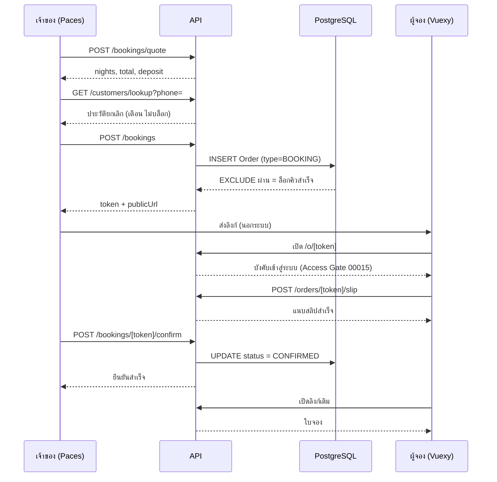
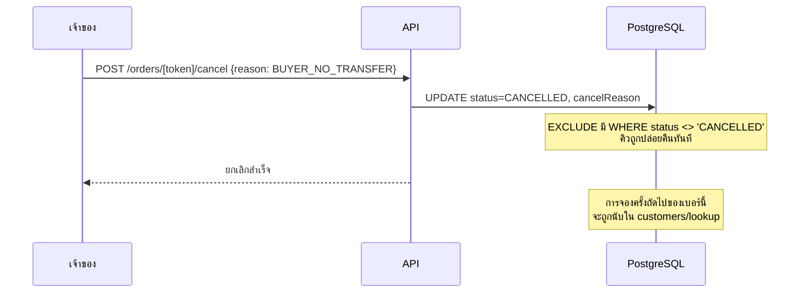

> **โมดูล:** 00017 — Lodging Vertical
> **ประเภทเอกสาร:** API Contract
> **เวอร์ชัน:** 0.1
> **วันที่จัดทำ:** 2026-07-22
> **สถานะ:** Implemented — deployed prod 2026-07-23 (migration M1+M2+M3 applied)

# API Contract: ประเภทกิจการบ้านพักตากอากาศ

---

## 1. Overview

API ของฟีเจอร์นี้แบ่งเป็น 2 ฝั่งชัดเจน:

| ฝั่ง | เส้นทาง | ผู้ใช้ | หมายเหตุ |
|------|---------|--------|----------|
| **เจ้าของ/ผู้ดูแลร้าน** | `/api/shops/current/**` | session ที่เป็นสมาชิกของร้านปัจจุบัน | เส้นทางใหม่ทั้งหมด — ตาม convention เดิมของ `invite-links` |
| **ผู้จอง** | `/api/orders/[token]/**` | session ที่เป็นเจ้าของการจอง | **ใช้ของเดิมซ้ำ ไม่สร้างใหม่** |

**หลักการสำคัญ: การจองคือออเดอร์** จึงไม่มี endpoint ฝั่งผู้จองใหม่เลย — การแนบสลิปและการยกเลิกใช้เส้นทางเดิมที่ผ่านการรีวิวความปลอดภัยมาแล้ว (feature 00015) ลดพื้นที่ผิวที่ต้องตรวจใหม่

**ค่าเงินทุกตัว** ส่งเป็น **string** ที่ผ่าน `.toFixed(2)` มาแล้ว ห้ามส่ง `Decimal` object ข้าม RSC/JSON boundary (จะ crash ตอน runtime แม้ type-check ผ่าน — ดู `/u/[username]/page.tsx` เป็นตัวอย่าง)

**วันที่** ส่งเป็น `YYYY-MM-DD` (วันล้วน ไม่มีเวลา ไม่มี timezone) เพราะการเข้าพักคิดเป็นวัน ไม่ใช่ช่วงเวลา — การส่ง ISO datetime เต็มจะทำให้เกิดปัญหาเลื่อนวันข้าม timezone

---

## 2. Authentication

| กลุ่ม | กติกา |
|-------|-------|
| `/api/shops/current/**` | ต้องมี session และเป็น `ShopMember` (`OWNER` หรือ `ADMIN`) ของร้านปัจจุบัน — ไม่ใช่ → `403` |
| `/api/orders/[token]/**` | ต้องมี session และ `session.user.id === order.buyerUserId` (ผู้จอง) หรือเป็นเจ้าของร้าน — ตาม Access Gate เดิมของ feature 00015 (BR-LODG-40) |
| ทุก mutation | ผ่าน `guardApi` เดิมใน `src/proxy.ts` (Origin-check + rate-limit) อัตโนมัติ ไม่ต้องทำเพิ่ม |

🛑 **ห้ามสร้างทางเข้าแบบไม่ต้องเข้าสู่ระบบสำหรับการจองโดยเด็ดขาด** (BR-LODG-40) — feature 00015 ปิดช่อง guest ไปแล้ว การเปิดใหม่เท่ากับย้อน security fix

🛑 **ทุก endpoint ที่คืนข้อมูลผู้ใช้เฉพาะราย** ต้องตั้ง `cache-control: private, no-store` + `export const dynamic = 'force-dynamic'` — มีบั๊กจริงมาแล้วที่ตัวกลางเครือข่ายมือถือ cache คำตอบของผู้ใช้คนหนึ่งไปให้อีกคน (ดู `feedback_auth_api_cache_control`)

---

## 3. Endpoint List

| # | Method | Path | คำอธิบาย | Phase | FR |
|---|--------|------|----------|-------|-----|
| 1 | `GET` | `/api/shops/current/rooms` | รายการห้องพักของร้าน | P1 | FR-LODG-04 |
| 2 | `POST` | `/api/shops/current/rooms` | สร้างห้องพัก | P1 | FR-LODG-04/05/06 |
| 3 | `GET` | `/api/shops/current/rooms/[roomId]` | รายละเอียดห้อง | P1 | FR-LODG-04 |
| 4 | `PATCH` | `/api/shops/current/rooms/[roomId]` | แก้ไขห้อง / ปิดการใช้งาน | P1 | FR-LODG-04 |
| 5 | `GET` | `/api/shops/current/rooms/availability` | ปฏิทินว่าง/ไม่ว่าง | P2 | FR-LODG-09 |
| 6 | `POST` | `/api/shops/current/bookings/quote` | คำนวณจำนวนคืน ยอดรวม และมัดจำ (ไม่บันทึก) | P2 | FR-LODG-08/13/14 |
| 7 | `POST` | `/api/shops/current/bookings` | สร้างการจอง | P2 | FR-LODG-08/10/11 |
| 8 | `PATCH` | `/api/shops/current/bookings/[token]` | แก้ยอดมัดจำ/ช่วงวัน (ก่อนแนบสลิป) | P2 | FR-LODG-14 |
| 9 | `POST` | `/api/shops/current/bookings/[token]/confirm` | เจ้าของยืนยันการจองหลังตรวจสลิป | P2 | FR-LODG-16 |
| 10 | `GET` | `/api/shops/current/customers/lookup` | ค้นลูกค้าด้วยเบอร์ + สรุปประวัติการยกเลิก | P2 | FR-LODG-22 |
| 11 | `GET` / `POST` | `/api/shops/current/housekeepers` | รายชื่อ / เพิ่มแม่บ้าน | P3 | FR-LODG-19 |
| 12 | `PATCH` | `/api/shops/current/housekeepers/[id]` | แก้ไข / ปิดการใช้งานแม่บ้าน | P3 | FR-LODG-19 |
| 13 | `PATCH` | `/api/shops/current/bookings/[token]/housekeeping` | มอบหมาย / อัปเดตสถานะงาน | P3 | FR-LODG-20/21 |

### 3.1 Endpoint เดิมที่ถูกใช้ซ้ำ / ถูกแก้พฤติกรรม

| Method | Path | การเปลี่ยนแปลง | FR |
|--------|------|----------------|-----|
| `POST` | `/api/orders/[token]/slip` | **ไม่แก้เลย** — ผู้จองแนบสลิปด้วยเส้นทางเดิม | FR-LODG-15 |
| `POST` | `/api/orders/[token]/cancel` | **แก้แบบ backward-compatible** — รับ body `{ reason }` เพิ่ม; บังคับเมื่อเป็นการจองที่เจ้าของกดยกเลิก | FR-LODG-12 |
| `POST` | `/api/orders/[token]/confirm` | 🛑 **เพิ่ม guard: ปฏิเสธเมื่อ `order.type === 'BOOKING'`** | FR-LODG-16 |

> 🛑 **ช่องโหว่ที่ต้องปิด:** `/api/orders/[token]/confirm` เดิมให้ **ผู้ซื้อ** เป็นคนกดยืนยัน (`session.user.id === order.buyerUserId`) ถ้าปล่อยไว้ ผู้จองจะกดยืนยันการจองของตัวเองได้โดยไม่ต้องโอนเงินเลย ซึ่งขัด FR-LODG-16 ที่กำหนดว่าเจ้าของเป็นผู้ยืนยันหลังตรวจสลิป — endpoint นี้ต้องปฏิเสธการจองเสมอ และให้ใช้ #9 แทน

---

## 4. Endpoint Detail

### 4.1 `POST /api/shops/current/rooms`

สร้างห้องพัก — เฉพาะร้าน `vertical = LODGING`

**Request**
```json
{
  "name": "พูลวิลล่า A",
  "description": "วิลล่า 3 ห้องนอน พร้อมสระส่วนตัว",
  "images": ["file_abc123", "file_def456"],
  "pricePerNight": "4500.00",
  "maxGuests": 8,
  "facilities": ["pool", "aircon", "parking", "kitchen"],
  "depositMode": "PERCENT",
  "depositValue": "30.00"
}
```

**Validation (Valibot, `src/lib/validations.ts`)**
| field | กฎ |
|-------|-----|
| `name` | required, 1–100 |
| `description` | optional, ≤ 1000 |
| `images` | array ของ fileId, ≤ **10** (BR-LODG-34) |
| `pricePerNight` | required, numeric string, **> 0** (BR-LODG-05) |
| `maxGuests` | optional, integer 1–50 |
| `facilities` | array ของ key ที่อยู่ในรายการมาตรฐาน |
| `depositMode` | `FIXED` \| `PERCENT` |
| `depositValue` | ≥ 0; ถ้า `PERCENT` ต้อง ≤ 100 (BR-LODG-15) |

**Response `201`**
```json
{ "id": "uuid", "name": "พูลวิลล่า A", "isActive": true }
```

**Errors:** `400 VALIDATION_ERROR` · `403 NOT_LODGING_SHOP` · `403 FORBIDDEN`

---

### 4.2 `PATCH /api/shops/current/rooms/[roomId]`

แก้ไขห้อง รวมถึงปิดการใช้งาน (`{ "isActive": false }`)

- ห้องที่ปิดการใช้งานยังถูกอ้างถึงจากการจองเดิมได้ (BR-LODG-07)
- **ไม่มี `DELETE`** — การลบห้องที่มีการจองถูกกันด้วย FK `ON DELETE RESTRICT` อยู่แล้ว และ BR-LODG-06 กำหนดให้ใช้การปิดการใช้งานแทน

**Errors:** `400 VALIDATION_ERROR` · `403 FORBIDDEN` · `404 ROOM_NOT_FOUND`

---

### 4.3 `GET /api/shops/current/rooms/availability`

ปฏิทินว่าง/ไม่ว่าง

**Query:** `from=YYYY-MM-DD` · `to=YYYY-MM-DD` (required, ช่วง ≤ 92 วัน) · `roomId` (optional — ไม่ระบุ = ทุกห้องที่เปิดใช้งาน)

**Response `200`**
```json
{
  "rooms": [
    {
      "roomId": "uuid",
      "name": "พูลวิลล่า A",
      "bookings": [
        {
          "token": "abc-123",
          "checkIn": "2026-09-05",
          "checkOut": "2026-09-08",
          "guestName": "สมชาย",
          "status": "PENDING"
        }
      ]
    }
  ]
}
```

**หมายเหตุการตีความช่วงวัน:** ผู้เรียกต้องเรนเดอร์ว่าวันที่ถูกกันคิวคือ `[checkIn, checkOut)` — **วันเช็คเอาท์ถือว่าว่าง** (BR-LODG-31) ตัวอย่างข้างบนกันวันที่ 5, 6, 7 เท่านั้น

**PII:** ต้องคืน **ชื่อผู้จองเท่านั้น ห้ามคืนเบอร์โทร** ในหน้าปฏิทิน (ลดพื้นที่รั่วโดยไม่จำเป็น — `feedback_rsc_pii_neutralize_at_source`)

---

### 4.4 `POST /api/shops/current/bookings/quote`

คำนวณให้ดูก่อนบันทึก — **ไม่เขียนฐานข้อมูล ไม่ล็อกคิว**

**Request**
```json
{ "roomId": "uuid", "checkIn": "2026-09-05", "checkOut": "2026-09-08" }
```

**Response `200`**
```json
{
  "nights": 3,
  "pricePerNight": "4500.00",
  "totalAmount": "13500.00",
  "depositMode": "PERCENT",
  "depositValue": "30.00",
  "depositAmount": "4050.00",
  "available": true
}
```

**สูตรที่ต้องตรงกันทั้งระบบ:**
```
nights        = checkOut - checkIn   (จำนวนวัน; ไม่นับวันเช็คเอาท์)
totalAmount   = pricePerNight * nights
depositAmount = depositMode = 'FIXED'   → depositValue
                depositMode = 'PERCENT' → ceil(totalAmount * depositValue / 100)   ← ปัดขึ้นบาทเต็ม (BR-LODG-35)
```

🛑 **สูตรนี้ต้องอยู่ที่เดียวใน service layer** และถูกเรียกทั้งจาก `quote` และ `create` — ห้ามคำนวณซ้ำที่ฝั่งหน้าเว็บ มิฉะนั้นยอดที่ผู้จองเห็นกับที่บันทึกจะไม่ตรงกัน

---

### 4.5 `POST /api/shops/current/bookings`

สร้างการจอง — **ล็อกคิวทันที** (BR-LODG-09)

**Request**
```json
{
  "roomId": "uuid",
  "checkIn": "2026-09-05",
  "checkOut": "2026-09-08",
  "guestName": "สมชาย ใจดี",
  "guestPhone": "0812345678",
  "depositAmount": "4050.00",
  "internalNote": "ขอเตียงเสริม 1 หลัง"
}
```

| field | กฎ |
|-------|-----|
| `roomId` | required, ต้องเป็นห้องของร้านนี้ และ `isActive = true` |
| `checkIn` / `checkOut` | required, `YYYY-MM-DD`, `checkOut > checkIn` (BR-LODG-12) |
| `guestName` | required, 1–100 |
| `guestPhone` | **required** — normalize ด้วย `src/lib/phone.ts`; จำเป็นเพราะต้องผูก `Customer` เพื่อเก็บสถิติ (D-09) |
| `depositAmount` | optional — ไม่ส่ง = ใช้ค่าที่คำนวณจากห้อง; ส่ง = ทับเฉพาะรายการนี้ (BR-LODG-14); ต้อง `0 ≤ depositAmount ≤ totalAmount` (BR-LODG-16) |

**Response `201`**
```json
{
  "token": "abc-123-def",
  "shortCode": "K7M2PQ4X",
  "nights": 3,
  "totalAmount": "13500.00",
  "depositAmount": "4050.00",
  "publicUrl": "https://deepthailand.app/o/abc-123-def"
}
```

**สิ่งที่ service ต้องทำในธุรกรรมเดียว:**
1. `findOrCreateCustomer(guestPhone)` — ใช้ของเดิมจาก feature 00014
2. สร้าง `Order` ด้วย `type = 'BOOKING'`, `status = 'PENDING'`, `roomId`, `checkIn`, `checkOut`, `totalAmount`, `depositAmount`, `buyerName`, `buyerContact`, `customerId`
3. สร้าง `OrderItem` 1 แถวเป็น snapshot ของห้อง (`name` = ชื่อห้อง + ช่วงวัน, `qty` = จำนวนคืน, `price` = ราคาต่อคืน) เพื่อให้หน้าออเดอร์เดิมและการสรุปยอดทำงานได้โดยไม่ต้องแก้
4. `genShortCode()` เดิม

**Errors**
| รหัส | HTTP | เมื่อไหร่ |
|------|------|----------|
| `VALIDATION_ERROR` | 400 | ข้อมูลไม่ผ่าน validation |
| `INVALID_DATE_RANGE` | 400 | `checkOut <= checkIn` |
| `DEPOSIT_EXCEEDS_TOTAL` | 400 | มัดจำ > ยอดรวม |
| `ROOM_INACTIVE` | 400 | ห้องถูกปิดการใช้งาน |
| **`ROOM_UNAVAILABLE`** | **409** | **ช่วงวันทับกับการจองที่ยังไม่ถูกยกเลิก** |
| `NOT_LODGING_SHOP` | 403 | ร้านไม่ใช่ประเภทบ้านพัก |
| `FORBIDDEN` | 403 | ไม่ใช่สมาชิกร้าน |

🛑 **`ROOM_UNAVAILABLE` ต้องมาจากการดัก error ของ EXCLUDE constraint ไม่ใช่จากการตรวจก่อนบันทึกเพียงอย่างเดียว** — Postgres คืน SQLSTATE `23P01 exclusion_violation` (Prisma ไม่ map เป็น `P2002`) service ต้องดักแล้วโยน `RoomUnavailableError` และ route ต้องมี catch ที่ map เป็น 409 มิฉะนั้นจะกลายเป็น 500 (บทเรียนจาก feature 00003 ที่ `OutOfStockError` ตกเป็น 500 เพราะ route ไม่ได้ครอบ — ดู `feedback_service_error_route_mapping`)

---

### 4.6 `PATCH /api/shops/current/bookings/[token]`

แก้ยอดมัดจำหรือช่วงวัน **ก่อนผู้จองแนบสลิป**

**Request:** `{ "depositAmount": "3000.00" }` หรือ `{ "checkIn": "...", "checkOut": "..." }`

| รหัส | HTTP | เมื่อไหร่ |
|------|------|----------|
| `DEPOSIT_LOCKED` | 409 | `order.slipFileId != null` — ผู้จองชำระตามยอดเดิมไปแล้ว (BR-LODG-18) |
| `ROOM_UNAVAILABLE` | 409 | ช่วงวันใหม่ไปทับการจองอื่น |
| `BOOKING_NOT_EDITABLE` | 409 | สถานะไม่ใช่ `PENDING` |

---

### 4.7 `POST /api/shops/current/bookings/[token]/confirm`

**เจ้าของ**ยืนยันการจองหลังตรวจสลิปแล้ว → `status = CONFIRMED` → ใบจองปรากฏ

**Request:** ไม่มี body

**สิ่งที่ต้องตรวจ:**
- session เป็นสมาชิกของร้านเจ้าของการจอง
- `order.type === 'BOOKING'`
- `assertTransition(order.status, 'CONFIRMED')` — ใช้ state machine เดิม
- ถ้า `depositAmount > 0` ต้องมี `slipFileId` แล้ว มิฉะนั้น `409 SLIP_REQUIRED`
- ถ้า `depositAmount = 0` ยืนยันได้ทันทีโดยไม่ต้องมีสลิป (BR-LODG-17)

**หลังยืนยันสำเร็จ:** เรียก recalc badge/Trust Score แบบ best-effort เหมือน `confirmOrder` เดิม (ห้ามให้ recalc ที่ล้มเหลวทำให้การยืนยันล้มตาม)

**Errors:** `403 FORBIDDEN` · `404 NOT_FOUND` · `409 SLIP_REQUIRED` · `409 INVALID_TRANSITION` · `400 NOT_A_BOOKING`

---

### 4.8 `POST /api/orders/[token]/cancel` (แก้ของเดิม)

**Request (ใหม่ — optional เพื่อความเข้ากันได้ย้อนหลัง)**
```json
{ "reason": "BUYER_NO_TRANSFER" }
```

**กติกา**
| ผู้กด | ประเภทออเดอร์ | `reason` | ผลต่อประวัติผู้จอง |
|-------|---------------|----------|---------------------|
| เจ้าของร้าน | `BOOKING` | **required** — 1 ใน 4 ค่า | นับเมื่อเป็น `BUYER_NO_TRANSFER` หรือ `BUYER_REQUESTED` (BR-LODG-37) |
| ผู้จอง | `BOOKING` | ละเว้น — ระบบตั้ง `BUYER_REQUESTED` ให้อัตโนมัติ | นับเสมอ |
| ใครก็ตาม | ไม่ใช่ `BOOKING` | ละเว้น | ไม่เกี่ยวข้อง — **พฤติกรรมเดิมทุกประการ** |

> `cancelInitiator` ยังคง derive จาก session เหมือนเดิม ห้ามรับจาก body (ป้องกันการปลอม) — กฎเดิมของ route นี้

**Errors:** `400 CANCEL_REASON_REQUIRED` · `400 INVALID_CANCEL_REASON` · `403 FORBIDDEN` · `400 INVALID_TRANSITION`

---

### 4.9 `GET /api/shops/current/customers/lookup`

**Query:** `phone=0812345678`

**Response `200`**
```json
{
  "found": true,
  "customerId": "uuid",
  "name": "สมชาย ใจดี",
  "cancellationSummary": {
    "total": 3,
    "byReason": { "BUYER_NO_TRANSFER": 2, "BUYER_REQUESTED": 1 }
  }
}
```

**ข้อบังคับด้านความเป็นส่วนตัว (BR-LODG-39):**
- คืนได้เฉพาะ **จำนวนครั้ง** เท่านั้น
- 🛑 **ห้ามคืน** `shopId`, ชื่อร้าน, วันที่, `publicToken`, หรือรายละเอียดการจองของร้านอื่นโดยเด็ดขาด
- `name` คืนได้เฉพาะที่มาจากออเดอร์ของ **ร้านตัวเอง** เท่านั้น — ถ้าลูกค้ารายนี้ไม่เคยสั่งกับร้านนี้ ให้คืน `name: null` (คงหลักความเป็นส่วนตัวของ feature 00014)
- คำเตือนนี้เป็นข้อมูลประกอบ **ห้ามใช้บล็อกการสร้างการจอง**

---

### 4.10 `PATCH /api/shops/current/bookings/[token]/housekeeping`

**Request:** `{ "housekeeperId": "uuid" }` หรือ `{ "status": "DONE" }` หรือ `{ "housekeeperId": null }` (ยกเลิกการมอบหมาย)

- มอบหมายให้การจองที่ `status = CANCELLED` ไม่ได้ → `409 BOOKING_CANCELLED`
- การเปลี่ยนสถานะงาน **ไม่กระทบ `Order.status` และไม่ trigger recalc Trust Score** (BR-LODG-26)

---

## 5. Error Code Table

### 5.1 หลักการเขียนข้อความ (Impeccable — "The Trusted Counter")

ข้อความทุกตัวยึด `.impeccable/design.json` + `DESIGN.md` โดยเฉพาะ don't 2 ข้อที่กระทบงานนี้โดยตรง: **อย่าเย็นชาแบบองค์กร/ธนาคาร** และ **อย่าใช้ copy ไฮป์**

| หลัก | ทำ | ไม่ทำ |
|------|-----|-------|
| **บอกทางออก ไม่ใช่แค่บอกว่าผิด** | "ห้องนี้มีการจองอยู่แล้ววันที่ 7 ก.ย. ลองเลือกวันอื่นหรือห้องอื่น" | "ไม่สามารถสร้างการจองได้" |
| **เลี่ยงรูปประโยคราชการ** | "ห้องนี้ปิดรับจองอยู่" | "ไม่สามารถดำเนินการได้" / "คุณไม่มีสิทธิ์" |
| **อธิบายเหตุ ไม่กล่าวหา** | "บัญชีนี้ไม่ได้อยู่ในทีมของร้าน" | "คุณไม่มีสิทธิ์ดำเนินการนี้" |
| **เป็นกลางกับบุคคลที่สาม** | "มีประวัติการจองที่ถูกยกเลิก 3 ครั้ง" | "ลูกค้ารายนี้เคยเบี้ยว 3 ครั้ง" |
| **sentence case เสมอ** | ภาษาไทยไม่มี case | ALL CAPS |
| **ไม่ไฮป์** | บอกสิ่งที่เกิดขึ้นตรง ๆ | "เยี่ยมมาก!" / "สุดยอด!" |

> เมื่อ validation ล้มเหลวที่ช่องใดช่องหนึ่ง **ให้แสดงข้อความราย field ที่ช่องนั้น** — `VALIDATION_ERROR` แบบรวมเป็นทางเลือกสุดท้ายเท่านั้น การโยนข้อความรวมทั้งที่รู้ว่าช่องไหนผิดคือการผลักภาระให้ผู้ใช้เดาเอง

### 5.2 ตาราง Error Code

| Code | HTTP | ความหมาย | ข้อความไทยที่แสดง |
|------|------|----------|-------------------|
| `VALIDATION_ERROR` | 400 | ข้อมูลไม่ถูกต้อง | ข้อมูลบางช่องยังไม่ถูกต้อง ลองตรวจอีกครั้ง |
| `INVALID_DATE_RANGE` | 400 | วันเช็คเอาท์ไม่หลังวันเข้าพัก | วันเช็คเอาท์ต้องอยู่หลังวันเข้าพักอย่างน้อย 1 คืน |
| `DEPOSIT_EXCEEDS_TOTAL` | 400 | มัดจำเกินยอดรวม | ยอดมัดจำมากกว่ายอดรวมของการจอง ลองลดยอดมัดจำลง |
| `ROOM_INACTIVE` | 400 | ห้องถูกปิดการใช้งาน | ห้องนี้ปิดรับจองอยู่ เปิดใช้งานห้องก่อนจึงจะสร้างการจองได้ |
| `NOT_A_BOOKING` | 400 | ออเดอร์นี้ไม่ใช่การจอง | รายการนี้ไม่ใช่การจอง |
| `CANCEL_REASON_REQUIRED` | 400 | ไม่ได้เลือกเหตุผล | เลือกเหตุผลก่อนยกเลิกการจอง |
| `INVALID_CANCEL_REASON` | 400 | เหตุผลไม่อยู่ในรายการ | เหตุผลที่เลือกไม่อยู่ในรายการ |
| `FORBIDDEN` | 403 | ไม่มีสิทธิ์ | บัญชีนี้ไม่ได้อยู่ในทีมของร้าน จึงจัดการรายการนี้ไม่ได้ |
| `NOT_LODGING_SHOP` | 403 | ร้านไม่ใช่ประเภทบ้านพัก | ธุรกิจนี้ตั้งไว้เป็นประเภทสินค้าและบริการ จึงยังไม่มีระบบห้องพัก |
| `BOOKING_CONFIRM_VIA_SHOP` | 403 | ผู้จองพยายามยืนยันเอง | เจ้าของที่พักจะยืนยันการจองให้หลังตรวจสลิปแล้ว |
| `ROOM_NOT_FOUND` | 404 | ไม่พบห้อง | ไม่พบห้องพักนี้ในร้าน |
| `NOT_FOUND` | 404 | ไม่พบรายการ | ไม่พบรายการนี้ |
| **`ROOM_UNAVAILABLE`** | **409** | ช่วงวันถูกจองแล้ว | ห้องนี้มีการจองอยู่แล้ววันที่ {ช่วงที่ชน} ลองเลือกวันอื่นหรือห้องอื่น |
| `DEPOSIT_LOCKED` | 409 | แก้มัดจำหลังแนบสลิป | ผู้จองโอนตามยอดเดิมไปแล้ว ถ้าต้องเปลี่ยนเงื่อนไข ให้ยกเลิกแล้วสร้างการจองใหม่ |
| `SLIP_REQUIRED` | 409 | ยืนยันโดยยังไม่มีสลิป | ยังไม่มีสลิปการโอน ตรวจยอดเงินในบัญชีก่อนยืนยัน |
| `BOOKING_NOT_EDITABLE` | 409 | สถานะไม่อนุญาตให้แก้ | การจองที่ยืนยันหรือยกเลิกแล้วแก้ไขไม่ได้ |
| `BOOKING_CANCELLED` | 409 | ดำเนินการกับการจองที่ยกเลิกแล้ว | การจองนี้ถูกยกเลิกไปแล้ว |
| `INVALID_TRANSITION` | 409 | เปลี่ยนสถานะไม่ถูกต้อง | รายการนี้อยู่ในสถานะที่ทำรายการนั้นไม่ได้แล้ว |

> `{ช่วงที่ชน}` — service ต้องส่งวันที่ที่ทับกลับมาด้วย เพื่อให้ผู้ใช้แก้ได้ทันทีโดยไม่ต้องไปเปิดปฏิทินหาเอง

> 🛑 ห้าม echo `err.message` ดิบกลับไปหาผู้เรียก — ใช้ตารางนี้ในการ map เท่านั้น (กฎเดิมของ route `confirm`)

---

## 6. Sequence



**เส้นทางล้มเหลว — ผู้จองไม่โอน**



---

## 7. Traceability

| FR | Endpoint |
|----|----------|
| FR-LODG-01/02/03 | ไม่ต้องมี endpoint ใหม่ — ใช้ `POST /api/business/shops` เดิม เพิ่ม field `vertical` |
| FR-LODG-04/05/06 | #1–#4 |
| FR-LODG-07 | ไม่มี endpoint — หน้าโปรไฟล์สาธารณะอ่านจาก server component โดยตรง |
| FR-LODG-08 | #6, #7 |
| FR-LODG-09 | #5 |
| FR-LODG-10/11 | #7 (EXCLUDE constraint) |
| FR-LODG-12 | `POST /api/orders/[token]/cancel` (แก้) |
| FR-LODG-13/14 | #1–#4, #6, #7, #8 |
| FR-LODG-15 | `POST /api/orders/[token]/slip` (เดิม) |
| FR-LODG-16 | #9 + guard บน `/confirm` เดิม |
| FR-LODG-17/18 | หน้า `/o/[token]` เดิม (ไม่มี endpoint ใหม่) |
| FR-LODG-19 | #11, #12 |
| FR-LODG-20/21 | #13 |
| FR-LODG-22 | #10 |

---

## 8. สรุป

Endpoint ใหม่มี **13 เส้นทาง อยู่ใต้ `/api/shops/current/**` ทั้งหมด** ส่วนฝั่งผู้จอง **ไม่มี endpoint ใหม่เลย** — ใช้ `/api/orders/[token]/slip` และ `/cancel` เดิมที่ผ่านการรีวิวความปลอดภัยของ feature 00015 มาแล้ว

จุดที่ต้องระวังที่สุด 3 ข้อ:
1. **ต้องเพิ่ม guard บน `/api/orders/[token]/confirm` ให้ปฏิเสธการจอง** มิฉะนั้นผู้จองยืนยันการจองตัวเองได้โดยไม่ต้องโอนเงิน
2. **`ROOM_UNAVAILABLE` ต้องมาจากการดัก SQLSTATE `23P01` ของ EXCLUDE constraint** ไม่ใช่การตรวจก่อนบันทึกอย่างเดียว และ route ต้องมี catch ที่ map เป็น 409 มิฉะนั้นตกเป็น 500
3. **`/customers/lookup` ต้องคืนแค่ตัวเลข** ห้ามรั่วข้อมูลร้านอื่นออกไป
