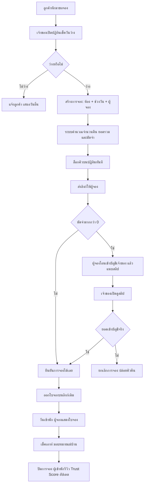
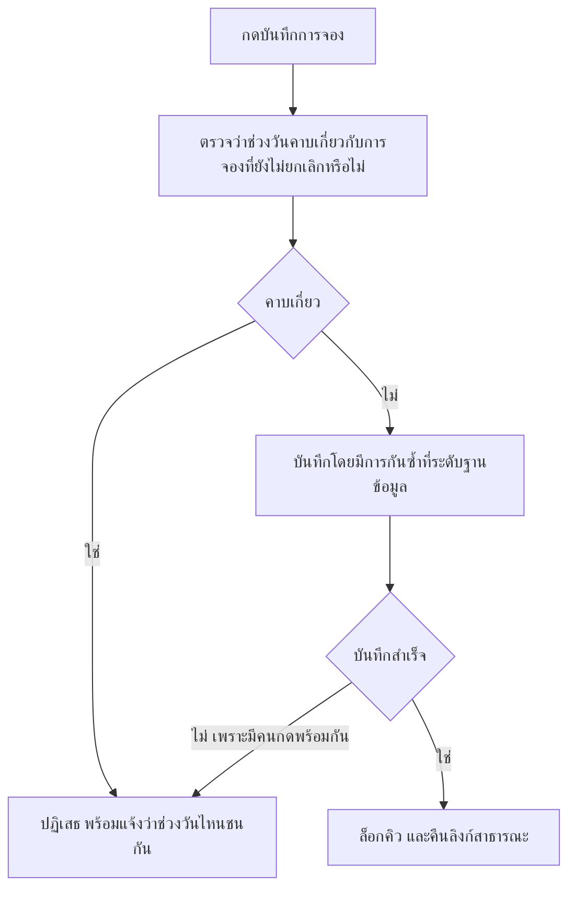

> **โมดูล:** 00017 — Lodging Vertical
> **ประเภทเอกสาร:** Business Requirements Document (BRD)
> **เวอร์ชัน:** 0.1
> **วันที่จัดทำ:** 2026-07-21
> **สถานะ:** Approved (requirement) — ข้อตัดสินใจค้างปิดครบแล้ว 2026-07-21 (ดู §2.7) พร้อมส่งต่อ SRS/SDS

# BRD: ประเภทกิจการบ้านพักตากอากาศ (Business Requirements Document)

---

## 1. บทนำ

### 1.1 วัตถุประสงค์ของเอกสาร

เอกสารนี้มีวัตถุประสงค์เพื่อ:
1. กำหนดความต้องการเชิงหน้าที่ (Functional Requirements) ของการเพิ่ม *ประเภทกิจการ* และความสามารถของธุรกิจบ้านพักตากอากาศ ให้อยู่ในรูปที่ทดสอบได้
2. กำหนดขอบเขต ข้อจำกัด และสิ่งที่ไม่ทำ ให้ชัดเจนก่อนเริ่มออกแบบทางเทคนิค
3. บันทึกกฎทางธุรกิจที่ระบบต้องบังคับ พร้อมเหตุผลกำกับ เพื่อไม่ให้ถูกตีความใหม่ระหว่างพัฒนา
4. รวบรวมคำถามที่ยังไม่ตัดสิน (Open Questions) ที่ต้องได้คำตอบก่อนเข้าขั้น SRS/SDS

### 1.2 ขอบเขตของระบบ

**Lodging Vertical** คือชุดความสามารถที่เปิดใช้เมื่อธุรกิจเลือกประเภทกิจการเป็น *บ้านพักตากอากาศ* ครอบคลุมการจัดการห้องพัก ปฏิทินคิวว่าง การรับจอง การเก็บมัดจำด้วยหลักฐานการโอน การออกใบจอง และการจัดคิวงานแม่บ้าน

**เข้าสู่ระบบ (Input):**
- ประเภทกิจการที่เจ้าของเลือกตอนสร้างธุรกิจ
- ข้อมูลห้องพัก: ชื่อ คำอธิบาย รูปภาพ ราคาต่อคืน จำนวนผู้เข้าพักสูงสุด สิ่งอำนวยความสะดวก มัดจำเริ่มต้น
- ข้อมูลการจอง: ห้อง ช่วงวันเข้าพัก ชื่อและเบอร์ผู้จอง ยอดมัดจำ
- สลิปการโอนเงินที่ผู้จองแนบ
- รายชื่อแม่บ้านและการมอบหมายงาน

**ออกจากระบบ (Output):**
- ปฏิทินสถานะว่าง/ไม่ว่างต่อห้อง
- ลิงก์การจองสาธารณะสำหรับผู้จอง
- ใบจองที่ยืนยันแล้ว
- รายการงานแม่บ้านพร้อมสถานะ
- การจองที่สำเร็จเข้าสู่ประวัติออเดอร์ รีวิว และ Trust Score เดิม

**ระบบที่เกี่ยวข้อง:**
- ระบบออเดอร์และลิงก์สาธารณะเดิม (การจองต่อยอดจากที่นี่)
- ความสามารถแนบสลิปของออเดอร์ที่มีอยู่แล้ว
- ระบบอัปโหลดไฟล์ (รูปห้อง สลิป)
- ระบบลูกค้ากลาง ผูกผู้จองด้วยเบอร์โทร
- ระบบรีวิวและ Trust Score
- ขั้นตอนสร้าง Business Profile (feature 00008)

### 1.3 กลุ่มผู้ใช้งาน

| กลุ่มผู้ใช้ | บทบาท | สิทธิ์การใช้งาน |
|-----------|--------|----------------|
| **เจ้าของบ้านพัก** | ตั้งค่าห้อง สร้างการจอง ตรวจสลิป ยืนยัน จัดคิวแม่บ้าน | เต็มสิทธิ์ในธุรกิจของตน |
| **ผู้ดูแลร้าน (ADMIN เดิม)** | ช่วยเจ้าของทำงานเดียวกัน | ตามสิทธิ์สมาชิกร้านเดิม ไม่มีการเพิ่มบทบาทใหม่ |
| **ผู้จอง / ผู้เข้าพัก** | เปิดลิงก์ ดูรายละเอียด แนบสลิป เปิดใบจอง ยกเลิกการจองของตน | **ต้องมีบัญชีและเข้าสู่ระบบ** เข้าถึงได้เฉพาะการจองที่ผูกกับบัญชีตนเอง |
| **แม่บ้าน** | ปฏิบัติงานทำความสะอาด | **ไม่มีสิทธิ์เข้าระบบ** เป็นเพียงข้อมูลรายชื่อ |
| **ผู้ขายสินค้าและบริการเดิม** | ใช้งานตามปกติ | ต้องไม่เห็นและไม่ถูกกระทบจากความสามารถชุดนี้ |

---

## 2. ความต้องการหลัก (Functional Requirements)

### 2.1 ประเภทกิจการ

#### FR-LODG-01: เลือกประเภทกิจการตอนสร้าง Business Profile

**User Story:**
> ในฐานะเจ้าของธุรกิจ ฉันต้องการเลือกได้ว่าธุรกิจที่กำลังสร้างเป็น *สินค้าและบริการ* หรือ *บ้านพักตากอากาศ* เพื่อให้ระบบเตรียมเมนูและการตั้งค่าที่ตรงกับงานของฉัน

**Acceptance Criteria:**
- [ ] หน้าสร้างธุรกิจมีช่องเลือก **"ประเภทกิจการ"** 2 ตัวเลือก: *สินค้าและบริการ*, *บ้านพักตากอากาศ*
- [ ] ค่าที่เลือกไว้ล่วงหน้าคือ *สินค้าและบริการ*
- [ ] แต่ละตัวเลือกมีคำอธิบายสั้นกำกับว่าจะได้ความสามารถอะไร
- [ ] ช่องเดิมที่ชื่อ *"ประเภทธุรกิจ"* (บุคคลธรรมดา/นิติบุคคล) ถูกเปลี่ยนป้ายเป็น **"ประเภทผู้ประกอบการ"** และยังทำงานเหมือนเดิมทุกประการ
- [ ] เมื่อบันทึกสำเร็จ ธุรกิจถูกสร้างพร้อมประเภทกิจการที่เลือก
- [ ] มีข้อความเตือนใต้ช่องเลือกว่า **เลือกแล้วเปลี่ยนภายหลังไม่ได้** ก่อนกดบันทึก (D-01)
- [ ] หน้าตั้งค่าธุรกิจไม่มีช่องให้แก้ประเภทกิจการ และการพยายามแก้ผ่านช่องทางอื่นต้องถูกปฏิเสธ

**Business Flow:**
1. เจ้าของเข้าหน้าสร้างธุรกิจใหม่
2. กรอกชื่อธุรกิจ เลือกประเภทผู้ประกอบการ และ **ประเภทกิจการ**
3. บันทึก → ระบบสร้างธุรกิจและพาไปขั้นตอนตั้งค่าเริ่มต้นที่ตรงกับประเภทที่เลือก

#### FR-LODG-02: เมนูและการตั้งค่าแยกตามประเภทกิจการ

**User Story:**
> ในฐานะเจ้าของบ้านพัก ฉันต้องการเห็นเฉพาะเมนูที่เกี่ยวกับที่พัก เพื่อไม่ต้องเดาว่าเมนูสินค้าเอาไว้ทำอะไร

**Acceptance Criteria:**
- [ ] ธุรกิจประเภท *บ้านพักตากอากาศ* เห็นเมนู: ห้องพัก, ปฏิทิน, การจอง, แม่บ้าน
- [ ] ธุรกิจประเภท *บ้านพักตากอากาศ* ไม่เห็นเมนูที่ใช้กับสินค้าโดยเฉพาะ (เช่น จัดการสินค้า, สต็อก, ปักหมุดสินค้า)
- [ ] ธุรกิจประเภท *สินค้าและบริการ* ไม่เห็นเมนูห้องพัก/ปฏิทิน/การจอง/แม่บ้าน แม้แต่รายการเดียว
- [ ] ความสามารถกลางยังใช้ได้ทั้งสองประเภท: โปรไฟล์สาธารณะ, ยืนยันตัวตน, Trust Score, แชต, รีวิว, กระเป๋าเงินร้าน
- [ ] การเข้าหน้าที่ไม่ตรงกับประเภทกิจการโดยพิมพ์ที่อยู่ตรง ๆ ต้องถูกปฏิเสธ ไม่ใช่แค่ซ่อนเมนู

#### FR-LODG-03: ธุรกิจเดิมทั้งหมดเป็นสินค้าและบริการโดยอัตโนมัติ

**User Story:**
> ในฐานะผู้ขายที่ใช้ระบบอยู่แล้ว ฉันต้องการให้ทุกอย่างทำงานเหมือนเดิม โดยไม่ต้องมาตั้งค่าอะไรใหม่

**Acceptance Criteria:**
- [ ] ธุรกิจทุกรายการที่มีอยู่ก่อนฟีเจอร์นี้มีประเภทกิจการเป็น *สินค้าและบริการ*
- [ ] ผู้ใช้เดิมไม่พบหน้าจอบังคับให้เลือกประเภทกิจการ
- [ ] หน้าจอ เมนู และพฤติกรรมของธุรกิจเดิมไม่เปลี่ยนแปลง

### 2.2 ห้องพักและสิ่งอำนวยความสะดวก

#### FR-LODG-04: จัดการห้องพัก

**User Story:**
> ในฐานะเจ้าของบ้านพัก ฉันต้องการสร้างและแก้ไขห้องที่เปิดให้จอง เพื่อให้ผู้จองเห็นว่ามีอะไรให้เลือกบ้าง

**Acceptance Criteria:**
- [ ] สร้างห้องได้โดยระบุอย่างน้อย: ชื่อห้อง, ราคาต่อคืน
- [ ] ระบุเพิ่มได้: คำอธิบาย, จำนวนผู้เข้าพักสูงสุด, สิ่งอำนวยความสะดวก, มัดจำเริ่มต้น
- [ ] แก้ไขข้อมูลห้องได้ทุกช่อง
- [ ] ปิดการใช้งานห้องได้ — ห้องที่ปิดจะไม่ปรากฏให้เลือกตอนสร้างการจองใหม่
- [ ] การจองเดิมของห้องที่ปิดการใช้งานยังเปิดดูได้ตามปกติ
- [ ] ห้ามลบห้องที่มีการจองผูกอยู่ ระบบต้องแจ้งให้ใช้การปิดการใช้งานแทน
- [ ] ราคาต่อคืนต้องมากกว่า 0

#### FR-LODG-05: รูปภาพห้องพัก

**User Story:**
> ในฐานะเจ้าของบ้านพัก ฉันต้องการใส่รูปห้องได้หลายรูป เพื่อลดการตอบแชตขอดูรูปซ้ำ ๆ

**Acceptance Criteria:**
- [ ] อัปโหลดรูปได้มากกว่า 1 รูปต่อห้อง
- [ ] เลือกรูปหลักที่ใช้แสดงเป็นรูปแรกได้
- [ ] ลบรูปออกได้
- [ ] จำกัดที่ **10 รูปต่อห้อง** (D-05) และขนาดไฟล์ตามข้อจำกัดของระบบอัปโหลดเดิม พร้อมข้อความแจ้งเมื่อเกิน
- [ ] รูปที่อัปโหลดแสดงผลได้จริงทั้งหน้าเจ้าของและหน้าสาธารณะ

#### FR-LODG-06: สิ่งอำนวยความสะดวก

**User Story:**
> ในฐานะผู้จอง ฉันต้องการเห็นว่าที่พักมีอะไรบ้าง เพื่อตัดสินใจได้โดยไม่ต้องถาม

**Acceptance Criteria:**
- [ ] เลือกสิ่งอำนวยความสะดวกจากรายการมาตรฐานที่ระบบเตรียมไว้ได้หลายรายการต่อห้อง
- [ ] รายการมาตรฐานครอบคลุมอย่างน้อย: สระว่ายน้ำ, เครื่องปรับอากาศ, ที่จอดรถ, ครัว, เครื่องซักผ้า, Wi-Fi, ทีวี, เครื่องทำน้ำอุ่น
- [ ] สิ่งอำนวยความสะดวกที่เลือกแสดงบนหน้ารายละเอียดห้องและหน้าสาธารณะ
- [ ] แสดงด้วยไอคอนจริงเท่านั้น ห้ามใช้อีโมจิ

#### FR-LODG-07: ห้องพักปรากฏบนโปรไฟล์สาธารณะของธุรกิจ

**User Story:**
> ในฐานะผู้สนใจ ฉันต้องการเห็นห้องพักและราคาบนโปรไฟล์ของที่พัก เพื่อประเมินก่อนทัก

**Acceptance Criteria:**
- [ ] โปรไฟล์สาธารณะของธุรกิจประเภทบ้านพักแสดงรายการห้องที่เปิดใช้งาน พร้อมรูปหลักและราคาต่อคืน
- [ ] โปรไฟล์ของธุรกิจประเภทสินค้ายังแสดงสินค้าเหมือนเดิม ไม่เปลี่ยนแปลง
- [ ] ห้องที่ปิดการใช้งานไม่ปรากฏบนหน้าสาธารณะ

### 2.3 การจองและปฏิทิน

#### FR-LODG-08: สร้างการจอง

**User Story:**
> ในฐานะเจ้าของบ้านพัก ฉันต้องการสร้างการจองจากที่ลูกค้าทักมา เพื่อล็อกคิวและส่งลิงก์ให้ลูกค้ายืนยัน

**Acceptance Criteria:**
- [ ] เลือกห้อง, วันเข้าพัก, วันเช็คเอาท์ แล้วกรอกชื่อและเบอร์ผู้จองได้
- [ ] ระบบคำนวณจำนวนคืนและยอดรวมให้อัตโนมัติจากราคาต่อคืน และแสดงให้เห็นก่อนบันทึก
- [ ] วันเช็คเอาท์ต้องอยู่หลังวันเข้าพักอย่างน้อย 1 คืน มิฉะนั้นบันทึกไม่ได้
- [ ] เมื่อบันทึกสำเร็จ ระบบสร้างลิงก์สาธารณะสำหรับการจองนั้น และคัดลอกลิงก์ได้ทันที
- [ ] ผู้จองถูกผูกเข้ากับข้อมูลลูกค้ากลางด้วยเบอร์โทรเหมือนออเดอร์ทั่วไป
- [ ] การจองปรากฏในประวัติออเดอร์ของธุรกิจ

**Example:**
```
ห้อง: พูลวิลล่า A (4,500 บาท/คืน)
เข้าพัก 5 ก.ย. 2569  เช็คเอาท์ 8 ก.ย. 2569
→ 3 คืน  ยอดรวม 13,500 บาท
→ มัดจำเริ่มต้นของห้อง 30% = 4,050 บาท
```

#### FR-LODG-09: ปฏิทินว่าง/ไม่ว่าง

**User Story:**
> ในฐานะเจ้าของบ้านพัก ฉันต้องการเห็นทันทีว่าห้องไหนว่างวันไหน เพื่อตอบลูกค้าได้เร็วโดยไม่เปิดสมุด

**Acceptance Criteria:**
- [ ] มีหน้าปฏิทินแสดงสถานะรายวันของแต่ละห้อง
- [ ] วันที่ถูกจองแสดงต่างจากวันว่างอย่างชัดเจน พร้อมชื่อผู้จอง
- [ ] เลือกดูเฉพาะห้องใดห้องหนึ่ง หรือดูรวมทุกห้องได้
- [ ] เปลี่ยนเดือนที่แสดงได้
- [ ] กดที่ช่วงที่ถูกจองแล้วเปิดดูรายละเอียดการจองนั้นได้
- [ ] ปฏิทินใช้งานได้จริงบนมือถือ

#### FR-LODG-10: ล็อกคิวทันทีที่สร้างการจอง

**User Story:**
> ในฐานะเจ้าของบ้านพัก ฉันต้องการให้คิวถูกกันไว้ตั้งแต่ตอนสร้างการจอง เพื่อไม่ให้รับจองซ้ำระหว่างรอลูกค้าโอน

**Acceptance Criteria:**
- [ ] ทันทีที่บันทึกการจอง ช่วงวันของห้องนั้นแสดงเป็นไม่ว่างบนปฏิทิน
- [ ] การล็อกไม่ผูกกับสถานะการชำระเงิน — ยังไม่โอนก็ล็อกแล้ว
- [ ] ไม่มีการปล่อยคิวคืนโดยอัตโนมัติเมื่อเวลาผ่านไป
- [ ] เมื่อเจ้าของยกเลิกการจอง ช่วงวันนั้นกลับมาว่างทันที

#### FR-LODG-11: ป้องกันการจองทับซ้อน

**User Story:**
> ในฐานะเจ้าของบ้านพัก ฉันต้องการให้ระบบกันไม่ให้จองห้องเดียวกันทับวันกัน เพื่อไม่ต้องขอโทษลูกค้าและคืนเงิน

**Acceptance Criteria:**
- [ ] สร้างการจองที่ช่วงวันคาบเกี่ยวกับการจองที่ยังไม่ถูกยกเลิกของห้องเดียวกันไม่ได้ ระบบต้องแจ้งเหตุผลชัดเจน
- [ ] การกดบันทึกพร้อมกันสองครั้งต้องสำเร็จเพียงรายการเดียวเท่านั้น
- [ ] การจองที่ถูกยกเลิกแล้วไม่ถือว่ากินคิว — จองทับช่วงนั้นใหม่ได้
- [ ] แก้ไขช่วงวันของการจองเดิมให้ไปทับการจองอื่นไม่ได้
- [ ] **วันเช็คเอาท์ไม่ถือว่าถูกกันคิว** — สร้างการจองใหม่ที่เช็คอินตรงกับวันเช็คเอาท์ของการจองก่อนหน้าได้ (D-02)

**Example:**
```
การจอง A: เข้าพัก 5 ก.ย.  เช็คเอาท์ 8 ก.ย.  → กันคิว 5, 6, 7 (ไม่กัน 8)
การจอง B: เข้าพัก 8 ก.ย.  เช็คเอาท์ 10 ก.ย. → สร้างได้ ไม่ถือว่าทับ
การจอง C: เข้าพัก 7 ก.ย.  เช็คเอาท์ 9 ก.ย.  → สร้างไม่ได้ ทับวันที่ 7
```

#### FR-LODG-12: ยกเลิกการจอง

**User Story:**
> ในฐานะเจ้าของบ้านพัก ฉันต้องการยกเลิกการจองที่ลูกค้าไม่โอน เพื่อปล่อยคิวให้คนอื่นจองได้

**Acceptance Criteria:**
- [ ] ยกเลิกการจองได้ โดย **ต้องเลือกเหตุผลจากรายการที่กำหนด** ทุกครั้ง (D-07)
- [ ] เหตุผลมี 4 ตัวเลือก แบ่งเป็น 2 กลุ่มชัดเจน:
  - **นับเป็นความผิดผู้จอง:** *ผู้จองไม่โอน*, *ผู้จองขอยกเลิก*
  - **ไม่นับเป็นความผิดผู้จอง:** *ห้องมีปัญหา / เหตุผลของร้าน*, *ตกลงกันได้*
- [ ] เหตุผลที่เลือกถูกบันทึกไว้กับการจองเพื่อตรวจย้อนหลังได้
- [ ] ต้องมีการยืนยันก่อนยกเลิกจริง (กล่องยืนยัน ไม่ใช่กดครั้งเดียวแล้วหาย)
- [ ] เมื่อยกเลิก ปฏิทินปล่อยคิวคืนทันที
- [ ] ลิงก์สาธารณะของการจองที่ถูกยกเลิกต้องแสดงสถานะยกเลิกชัดเจน และต้องไม่แสดงเป็นใบจองที่ใช้ได้
- [ ] เจ้าของเห็นรายการการจองที่ยังไม่ยืนยันได้ชัด เพื่อตัดสินใจว่าจะยกเลิกรายการไหน

#### FR-LODG-22: ประวัติการยกเลิกของผู้จอง และการเตือนเจ้าของ

**User Story:**
> ในฐานะเจ้าของบ้านพัก ฉันต้องการรู้ว่าเบอร์ที่กำลังจะจองนี้เคยจองแล้วไม่โอนมาก่อนหรือไม่ เพื่อตัดสินใจว่าจะรับจองเลย หรือขอให้โอนมัดจำก่อนล็อกคิว

**Acceptance Criteria:**
- [ ] เมื่อการจองถูกยกเลิกด้วยเหตุผลกลุ่ม "ความผิดผู้จอง" ระบบบันทึกเข้าประวัติของ **ลูกค้ากลางที่ผูกด้วยเบอร์โทร** (D-08)
- [ ] **ผู้จองกดยกเลิกการจองของตัวเองได้** (บัญชีตรงกับเจ้าของการจอง) และกรณีนี้นับเป็นความผิดผู้จองโดยอัตโนมัติ ไม่ต้องถามเหตุผล
- [ ] กรณีเจ้าของเป็นผู้กดยกเลิก ให้ใช้เหตุผลที่เจ้าของเลือกตาม FR-LODG-12 เป็นตัวตัดสินว่านับหรือไม่นับ
- [ ] เหตุผลกลุ่ม "ไม่นับ" ต้องไม่ถูกบันทึกเข้าประวัตินี้
- [ ] ตอนสร้างการจอง เมื่อกรอกเบอร์ที่มีประวัติยกเลิก ระบบแสดงคำเตือนให้เจ้าของเห็นก่อนบันทึก พร้อมจำนวนครั้งแยกตามเหตุผล
- [ ] คำเตือนเป็นข้อมูลประกอบการตัดสินใจเท่านั้น — **ไม่บล็อกการสร้างการจอง** เจ้าของยังกดสร้างต่อได้เสมอ
- [ ] คำเตือนแสดงเฉพาะ **จำนวนครั้งแบบรวม** ต้องไม่เปิดเผยว่าเป็นร้านไหน วันไหน หรือรายละเอียดการจองของร้านอื่น
- [ ] ผู้จองไม่เห็นตัวเลขนี้ และตัวเลขนี้ไม่ปรากฏบนหน้าสาธารณะหรือใบจอง
- [ ] ประวัตินี้ **ไม่มีผลต่อ Trust Score ของใครทั้งสิ้น** ทั้งผู้จองและเจ้าของ

**Example:**
```
สร้างการจอง — กรอกเบอร์ 08x-xxx-1234

  คำเตือน: เบอร์นี้เคยถูกยกเลิกการจอง 3 ครั้ง
           (ผู้จองไม่โอน 2 / ผู้จองขอยกเลิก 1)

  [ สร้างการจองต่อ ]   ← กดได้ปกติ ไม่ถูกบล็อก
```

### 2.4 มัดจำและการแนบสลิป

#### FR-LODG-13: ตั้งค่ามัดจำเริ่มต้นรายห้อง

**User Story:**
> ในฐานะเจ้าของบ้านพัก ฉันต้องการตั้งมัดจำแยกตามห้อง เพราะห้องราคาต่างกันควรเก็บมัดจำต่างกัน

**Acceptance Criteria:**
- [ ] แต่ละห้องตั้งมัดจำเริ่มต้นได้ โดยเลือกรูปแบบเป็น **จำนวนเงินบาท** หรือ **เปอร์เซ็นต์ของยอดรวม**
- [ ] เลือกได้อย่างใดอย่างหนึ่งต่อห้อง (ไม่ใช่ทั้งสองพร้อมกัน)
- [ ] แบบเปอร์เซ็นต์รับค่าระหว่าง 0–100
- [ ] แบบจำนวนเงินรับค่าตั้งแต่ 0 ขึ้นไป
- [ ] ตั้งเป็น 0 ได้ หมายถึงไม่เก็บมัดจำ
- [ ] แบบเปอร์เซ็นต์ที่คำนวณแล้วมีเศษสตางค์ ต้อง **ปัดขึ้นเป็นจำนวนเต็มบาท** (D-06) และยอดที่แสดงให้ผู้จองต้องเป็นยอดหลังปัดเสมอ

**Example:**
```
ห้อง 3,300 บาท/คืน  จอง 2 คืน = 6,600 บาท  มัดจำ 35%
6,600 x 35% = 2,310.00 → ไม่มีเศษ → มัดจำ 2,310 บาท

ห้อง 2,500 บาท/คืน  จอง 3 คืน = 7,500 บาท  มัดจำ 33%
7,500 x 33% = 2,475.00 → ไม่มีเศษ → มัดจำ 2,475 บาท

ห้อง 1,850 บาท/คืน  จอง 1 คืน = 1,850 บาท  มัดจำ 30%
1,850 x 30% = 555.00 → ไม่มีเศษ → มัดจำ 555 บาท

ห้อง 1,999 บาท/คืน  จอง 1 คืน = 1,999 บาท  มัดจำ 30%
1,999 x 30% = 599.70 → ปัดขึ้น → มัดจำ 600 บาท
```

#### FR-LODG-14: ปรับมัดจำเฉพาะรายการจอง

**User Story:**
> ในฐานะเจ้าของบ้านพัก ฉันต้องการปรับยอดมัดจำเป็นรายครั้งได้ เพราะบางเคสตกลงกับลูกค้าไว้ไม่เท่ากัน

**Acceptance Criteria:**
- [ ] ตอนสร้างการจอง ระบบเติมยอดมัดจำที่คำนวณจากค่าเริ่มต้นของห้องให้ก่อน
- [ ] เจ้าของแก้ยอดมัดจำของรายการนั้นได้ก่อนส่งลิงก์
- [ ] ยอดที่แก้ใช้กับรายการนั้นเท่านั้น ไม่กระทบค่าเริ่มต้นของห้องและการจองอื่น
- [ ] ยอดมัดจำต้องไม่เกินยอดรวมของการจอง
- [ ] ยอดมัดจำต้องไม่ติดลบ
- [ ] เมื่อผู้จองแนบสลิปแล้ว แก้ยอดมัดจำไม่ได้อีก ระบบต้องแจ้งเหตุผล

#### FR-LODG-15: ผู้จองเปิดลิงก์และแนบสลิป

**User Story:**
> ในฐานะผู้จอง ฉันต้องการเห็นยอดที่ต้องโอนและแนบสลิปได้จากมือถือ เพื่อให้เจ้าของยืนยันคิวให้ฉัน

**Acceptance Criteria:**
- [ ] เปิดลิงก์แล้วต้องเข้าสู่ระบบก่อนจึงเห็นรายละเอียด — ใช้ Access Gate เดิมของ feature 00015 ไม่สร้างกลไกใหม่ (D-09)
- [ ] หน้าลิงก์แสดง: ชื่อที่พัก, ห้อง, วันเข้าพัก-เช็คเอาท์, จำนวนคืน, ยอดรวม, **ยอดมัดจำที่ต้องโอน**, ยอดคงเหลือ
- [ ] แนบสลิปจากมือถือได้ และเห็นผลว่าแนบสำเร็จ
- [ ] แนบสลิปทับใหม่ได้ก่อนที่เจ้าของจะยืนยัน (กรณีแนบผิดรูป)
- [ ] เมื่อมัดจำเป็น 0 หน้าลิงก์ต้องไม่แสดงขั้นตอนแนบสลิป
- [ ] หน้านี้ใช้งานได้ดีบนมือถือเป็นหลัก

#### FR-LODG-16: เจ้าของตรวจสลิปและยืนยันการจอง

**User Story:**
> ในฐานะเจ้าของบ้านพัก ฉันต้องการดูสลิปแล้วกดยืนยัน เพื่อปิดดีลและออกใบจองให้ลูกค้า

**Acceptance Criteria:**
- [ ] เจ้าของรู้ได้ว่ามีการจองที่ผู้จองแนบสลิปเข้ามาแล้ว
- [ ] เปิดดูรูปสลิปขนาดเต็มได้
- [ ] กดยืนยันการจองได้ และต้องมีการยืนยันก่อนทำจริง
- [ ] หน้าตรวจสลิปมีข้อความเตือนให้ตรวจยอดเงินเข้าบัญชีจริงก่อนกดยืนยัน
- [ ] เมื่อยืนยันแล้ว สถานะการจองเปลี่ยนเป็นยืนยันแล้ว และผู้จองเห็นใบจองจากลิงก์เดิม
- [ ] ยืนยันการจองที่ถูกยกเลิกไปแล้วไม่ได้

### 2.5 ใบจอง

#### FR-LODG-17: ออกใบจองเมื่อยืนยันแล้ว

**User Story:**
> ในฐานะผู้เข้าพัก ฉันต้องการมีหลักฐานการจองที่เปิดดูได้ เพื่อแสดงตอนไปถึงที่พัก

**Acceptance Criteria:**
- [ ] ใบจองเข้าถึงได้จากลิงก์เดิมของการจอง โดยบัญชีที่เข้าสู่ระบบต้องเป็นเจ้าของการจองนั้น
- [ ] ใบจองแสดง: ชื่อที่พัก, ห้อง, วันเข้าพัก-เช็คเอาท์, จำนวนคืน, ชื่อผู้เข้าพัก, ยอดรวม, ยอดมัดจำที่ชำระแล้ว, ยอดคงเหลือ, สถานะยืนยันแล้ว, รหัสอ้างอิงการจอง
- [ ] ใบจองปรากฏเฉพาะการจองที่ยืนยันแล้วเท่านั้น
- [ ] วันที่ทั้งหมดแสดงในรูปแบบวันที่ไทยที่ระบบใช้อยู่
- [ ] ใบจองต้องไม่แสดงข้อมูลภายในของร้าน เช่น ชื่อและเบอร์แม่บ้าน หรือบันทึกภายใน

#### FR-LODG-18: สถานะการจองสะท้อนบนลิงก์เดียวกัน

**User Story:**
> ในฐานะผู้จอง ฉันต้องการให้ลิงก์เดียวบอกได้ทุกสถานะ เพื่อไม่ต้องเก็บหลายลิงก์

**Acceptance Criteria:**
- [ ] ลิงก์เดียวกันแสดงผลต่างกันตามสถานะ: รอชำระมัดจำ → รอเจ้าของยืนยัน → ใบจอง (ยืนยันแล้ว) → ยกเลิก
- [ ] แต่ละสถานะสื่อสารชัดว่าผู้จองต้องทำอะไรต่อ หรือไม่ต้องทำอะไรแล้ว
- [ ] สถานะยกเลิกต้องไม่ถูกเข้าใจผิดว่าเป็นใบจองที่ใช้ได้

### 2.6 งานแม่บ้าน

#### FR-LODG-19: รายชื่อแม่บ้าน

**User Story:**
> ในฐานะเจ้าของบ้านพัก ฉันต้องการเก็บรายชื่อแม่บ้านไว้ เพื่อไม่ต้องพิมพ์เบอร์ใหม่ทุกครั้ง

**Acceptance Criteria:**
- [ ] เพิ่ม/แก้ไข/ลบรายชื่อแม่บ้านได้ โดยระบุชื่อและเบอร์โทร
- [ ] รายชื่อผูกกับธุรกิจนั้น ๆ ไม่ปะปนข้ามธุรกิจ
- [ ] แม่บ้านไม่มีบัญชีผู้ใช้และเข้าสู่ระบบไม่ได้
- [ ] ชื่อและเบอร์แม่บ้านต้องไม่ปรากฏบนหน้าสาธารณะหรือใบจอง

#### FR-LODG-20: มอบหมายแม่บ้านให้การจอง

**User Story:**
> ในฐานะเจ้าของบ้านพัก ฉันต้องการระบุว่าใครไปทำความสะอาดรอบไหน เพื่อไม่ให้ตกหล่นหรือไปผิดหลัง

**Acceptance Criteria:**
- [ ] เลือกแม่บ้านจากรายชื่อมามอบหมายให้การจองแต่ละรายการได้
- [ ] เปลี่ยนตัวผู้รับมอบหมายได้
- [ ] ยกเลิกการมอบหมายได้
- [ ] มอบหมายให้การจองที่ถูกยกเลิกไม่ได้

#### FR-LODG-21: สถานะงานทำความสะอาด

**User Story:**
> ในฐานะเจ้าของบ้านพัก ฉันต้องการรู้ว่ารอบไหนทำความสะอาดแล้ว เพื่อมั่นใจก่อนรับผู้เข้าพักรายถัดไป

**Acceptance Criteria:**
- [ ] งานแต่ละรายการมีสถานะ 2 ค่า: รอทำ / เสร็จแล้ว
- [ ] เจ้าของเปลี่ยนสถานะเองได้
- [ ] มีหน้ารวมงานที่ค้างอยู่ เรียงตามวันเช็คเอาท์
- [ ] สถานะงานไม่มีผลต่อสถานะการจองและไม่กระทบ Trust Score

### 2.7 ข้อตัดสินใจที่ปิดแล้ว (Closed Decisions)

คำถามค้างทั้งหมดได้รับคำตอบจากเจ้าของผลิตภัณฑ์แล้วเมื่อ 2026-07-21 — **ถือเป็นข้อยุติ ห้ามตีความใหม่ระหว่างพัฒนา**

| รหัส | ประเด็น | ข้อตัดสินใจ | กฎที่บังคับ |
|------|---------|------------|------------|
| **D-01** | เปลี่ยนประเภทกิจการภายหลัง | **เปลี่ยนไม่ได้** — ตั้งครั้งเดียวตอนสร้างธุรกิจ (แนวเดียวกับเบอร์โทรที่เปลี่ยนไม่ได้) ถ้าต้องการประเภทอื่นให้สร้างธุรกิจใหม่ | BR-LODG-30 |
| **D-02** | วันเช็คเอาท์ถือว่าว่างหรือไม่ | **ว่าง — คนถัดไปเช็คอินวันเดียวกันได้** ช่วงวันคิดแบบรวมวันเข้าพัก ไม่รวมวันเช็คเอาท์ ตามมาตรฐานที่พักทั่วไป | BR-LODG-31 |
| **D-03** | ต้องมีสถานะ "เข้าพักแล้ว" หรือไม่ | **ไม่ต้องเพิ่มสถานะใหม่** — ใช้สถานะออเดอร์เดิม แล้วเทียบวันเข้าพักกับวันปัจจุบันเพื่อแสดงผลแทน | BR-LODG-32 |
| **D-04** | ฟรีหรือเสียเงิน | **ฟรีมากับทุกธุรกิจ** ในเวอร์ชันแรก ไม่มีการตรวจสิทธิ์แบบเสียเงิน — พิจารณาคิดค่าบริการเมื่อมีฐานผู้ใช้จริงแล้ว | BR-LODG-33 |
| **D-05** | จำนวนรูปสูงสุดต่อห้อง | **10 รูปต่อห้อง** ขนาดไฟล์ใช้ข้อจำกัดเดียวกับระบบอัปโหลดที่มีอยู่แล้ว | BR-LODG-34 |
| **D-06** | การปัดเศษมัดจำแบบเปอร์เซ็นต์ | **ปัดขึ้นเป็นจำนวนเต็มบาท** เพราะผู้ใช้โอนเป็นบาทเต็ม และการปัดขึ้นไม่ทำให้เจ้าของเสียเปรียบ | BR-LODG-35 |
| **D-07** | จะรู้ได้อย่างไรว่าการยกเลิกเป็นความผิดผู้จอง ในเมื่อผู้จองที่ไม่มีบัญชีกดยกเลิกเองไม่ได้ | **เจ้าของเลือกเหตุผลตอนกดยกเลิก** จาก 4 ตัวเลือก — นับเฉพาะ *ผู้จองไม่โอน* และ *ผู้จองขอยกเลิก* | BR-LODG-36, BR-LODG-37 |
| **D-08** | จะลงโทษผู้จองที่ยกเลิกอย่างไร | **บันทึกประวัติที่ลูกค้ากลางซึ่งผูกด้วยเบอร์โทร แล้วเตือนเจ้าของตอนสร้างการจอง** — ไม่แตะ Trust Score และไม่บล็อกการจอง | BR-LODG-38, BR-LODG-39 |
| **D-09** | ผู้จองต้องมีบัญชีหรือไม่ | **ต้องมีบัญชีและเข้าสู่ระบบเท่านั้นจึงจะเข้าถึงการจองได้** เพื่อให้เก็บสถิติได้ครบ — ใช้ **ระบบเข้าสู่ระบบเดิมและ Access Gate ของ feature 00015** ไม่สร้างกลไกใหม่ | BR-LODG-40 |

---

## 3. Acceptance Criteria สรุป

### 3.1 ประเภทกิจการ (P1)
- [ ] เลือกประเภทกิจการได้ 2 แบบตอนสร้างธุรกิจ และค่าเริ่มต้นคือสินค้าและบริการ
- [ ] ป้ายชื่อช่องเดิมเปลี่ยนเป็น "ประเภทผู้ประกอบการ" เรียบร้อยและทำงานเหมือนเดิม
- [ ] เมนูแยกตามประเภทถูกต้อง และปิดกั้นการเข้าหน้าที่ไม่ตรงประเภทด้วย
- [ ] ธุรกิจเดิมทั้งหมดเป็นสินค้าและบริการ ไม่มีพฤติกรรมใดเปลี่ยน

### 3.2 ห้องพัก (P1)
- [ ] สร้าง/แก้ไข/ปิดการใช้งานห้องได้ครบ และห้ามลบห้องที่มีการจอง
- [ ] อัปโหลดรูปหลายรูปและเลือกรูปหลักได้
- [ ] เลือกสิ่งอำนวยความสะดวกได้และแสดงด้วยไอคอนจริง
- [ ] ห้องที่เปิดใช้งานปรากฏบนโปรไฟล์สาธารณะ

### 3.3 การจองและปฏิทิน (P2)
- [ ] สร้างการจองพร้อมคำนวณจำนวนคืนและยอดรวมอัตโนมัติ
- [ ] ปฏิทินแสดงว่าง/ไม่ว่างถูกต้องและใช้ได้บนมือถือ
- [ ] คิวถูกล็อกทันทีที่สร้าง และปล่อยคืนเมื่อยกเลิก
- [ ] จองทับซ้อนไม่ได้ แม้กดพร้อมกัน
- [ ] ยกเลิกต้องเลือกเหตุผลทุกครั้ง และเหตุผลถูกบันทึกไว้
- [ ] ประวัติการยกเลิกบันทึกที่เบอร์โทร และเตือนเจ้าของตอนสร้างการจองโดยไม่บล็อก

### 3.4 มัดจำและสลิป (P2)
- [ ] ตั้งมัดจำเริ่มต้นรายห้องได้ทั้งแบบบาทและเปอร์เซ็นต์
- [ ] ปรับมัดจำรายการจองได้ และล็อกเมื่อแนบสลิปแล้ว
- [ ] ผู้จองเข้าสู่ระบบแล้วแนบสลิปได้ และการจองผูกกับบัญชีเสมอ
- [ ] เจ้าของดูสลิปและยืนยันการจองได้

### 3.5 ใบจอง (P2)
- [ ] ใบจองออกเมื่อยืนยันแล้ว และแสดงข้อมูลครบตามที่กำหนด
- [ ] ลิงก์เดียวสะท้อนทุกสถานะได้ถูกต้อง
- [ ] ใบจองไม่มีข้อมูลภายในของร้านหลุดออกไป

### 3.6 แม่บ้าน (P3)
- [ ] จัดการรายชื่อแม่บ้านได้ และข้อมูลไม่หลุดสู่หน้าสาธารณะ
- [ ] มอบหมายงานให้การจองและเปลี่ยนสถานะได้
- [ ] มีหน้ารวมงานค้างเรียงตามวันเช็คเอาท์

---

## 4. Business Flows (กระบวนการทำงาน)

### 4.1 Flow หลัก: ตั้งแต่รับจองถึงเช็คอิน



### 4.2 Flow ย่อย: การกันจองทับซ้อน



---

## 5. Use Case Scenarios (สถานการณ์การใช้งานจริง)

### Scenario 1: Best Case — จอง 3 คืน โอนมัดจำ ยืนยันครบ

1. ลูกค้าทักขอจองพูลวิลล่า A วันที่ 5–8 กันยายน
2. เจ้าของเปิดปฏิทิน เห็นว่าว่าง สร้างการจอง
3. ระบบคำนวณ 3 คืน = 13,500 บาท มัดจำ 30% = 4,050 บาท
4. ปฏิทินล็อก 5–8 กันยายนทันที เจ้าของคัดลอกลิงก์ส่งให้ลูกค้า
5. ลูกค้าเปิดลิงก์ เห็นยอด 4,050 บาท โอนแล้วแนบสลิป
6. เจ้าของเปิดสลิป ตรวจยอดในแอปธนาคารว่าเข้าจริง กดยืนยัน
7. ลิงก์เดิมกลายเป็นใบจอง แสดงชำระแล้ว 4,050 คงเหลือ 9,450
8. เจ้าของมอบหมายแม่บ้านให้เข้าทำความสะอาดหลังเช็คเอาท์ 8 กันยายน
9. หลังเข้าพักจบ ลูกค้ารีวิว คะแนนเข้าสู่ Trust Score ของธุรกิจ

**ผลลัพธ์ที่คาดหวัง:** การจองสำเร็จ ปฏิทินถูกต้อง ใบจองใช้ได้ ประวัติและรีวิวเข้าระบบเดิมครบ

### Scenario 2: ลูกค้าไม่โอน — เจ้าของยกเลิกเอง

1. เจ้าของสร้างการจองและส่งลิงก์ตามปกติ คิวถูกล็อก
2. ผ่านไป 3 วัน ลูกค้าไม่โอนและไม่ตอบ
3. เจ้าของเห็นรายการนี้ในกลุ่ม "ยังไม่ยืนยัน" จึงกดยกเลิก แล้วเลือกเหตุผล *ผู้จองไม่โอน*
4. ระบบถามยืนยันก่อนทำจริง เจ้าของยืนยัน
5. ปฏิทินปล่อยคิวคืนทันที ลิงก์เดิมแสดงสถานะยกเลิก
6. ระบบบันทึกเข้าประวัติของเบอร์ผู้จองรายนี้ว่าถูกยกเลิกด้วยเหตุ *ไม่โอน* 1 ครั้ง
7. เดือนถัดมา เบอร์เดิมทักมาจองอีก เจ้าของกรอกเบอร์แล้วเห็นคำเตือนว่าเคยยกเลิกมาก่อน จึงเลือกขอให้โอนมัดจำก่อนแล้วค่อยล็อกคิว

**ผลลัพธ์ที่คาดหวัง:** คิวกลับมาว่าง ไม่มีการปล่อยคิวอัตโนมัติเกิดขึ้นเองโดยที่เจ้าของไม่ได้สั่ง และเจ้าของมีข้อมูลประกอบการตัดสินใจในครั้งถัดไปโดยที่ระบบไม่ได้ตัดสินแทน

### Scenario 6: Edge Case — ร้านยกเลิกเอง ผู้จองต้องไม่ติดประวัติ

1. เจ้าของสร้างการจองและผู้จองโอนมัดจำเรียบร้อยแล้ว
2. เกิดน้ำท่วมห้องพัก เจ้าของจำเป็นต้องยกเลิก จึงเลือกเหตุผล *ห้องมีปัญหา / เหตุผลของร้าน*
3. เจ้าของคืนมัดจำให้ผู้จองนอกระบบ

**ผลลัพธ์ที่คาดหวัง:** ประวัติการยกเลิกของเบอร์ผู้จอง **ไม่เพิ่มขึ้น** เพราะไม่ใช่ความผิดของผู้จอง และ Trust Score ของเจ้าของก็ไม่ถูกหักเช่นกัน

### Scenario 3: Edge Case — จองทับพร้อมกันสองรายการ

1. เจ้าของและผู้ดูแลร้านเปิดหน้าสร้างการจองพร้อมกันคนละเครื่อง
2. ทั้งคู่เลือกพูลวิลล่า A วันที่ 5–8 กันยายน
3. ทั้งคู่กดบันทึกในเวลาไล่เลี่ยกัน

**ผลลัพธ์ที่คาดหวัง:** มีเพียงรายการเดียวที่บันทึกสำเร็จ อีกรายการได้รับข้อความแจ้งว่าช่วงวันนี้ถูกจองไปแล้ว และไม่มีข้อมูลจองซ้อนค้างในระบบ

### Scenario 4: Edge Case — ไม่เก็บมัดจำ

1. เจ้าของตั้งมัดจำของบ้านพักเล็กไว้เป็น 0
2. สร้างการจอง 1 คืน ยอดรวม 800 บาท มัดจำ 0
3. ส่งลิงก์ให้ลูกค้า

**ผลลัพธ์ที่คาดหวัง:** หน้าลิงก์ไม่แสดงขั้นตอนแนบสลิป และเจ้าของยืนยันการจองได้ทันทีโดยไม่ติดเงื่อนไขสลิป

### Scenario 5: Edge Case — แก้มัดจำหลังลูกค้าโอนแล้ว

1. ลูกค้าแนบสลิปมัดจำ 4,050 บาทแล้ว
2. เจ้าของพยายามแก้ยอดมัดจำเป็น 6,000 บาท

**ผลลัพธ์ที่คาดหวัง:** ระบบปฏิเสธ พร้อมแจ้งว่าแก้ไม่ได้เพราะผู้จองชำระตามยอดเดิมไปแล้ว — ถ้าต้องการเปลี่ยนเงื่อนไขต้องยกเลิกและสร้างใหม่

---

## 6. ความต้องการด้านคุณภาพ (Quality Requirements)

### 6.1 ความถูกต้องของข้อมูล
- จำนวนคืนและยอดรวมที่แสดงต้องตรงกับที่บันทึกจริงเสมอ
- ยอดมัดจำที่ผู้จองเห็นบนลิงก์ต้องตรงกับที่เจ้าของตั้งไว้เป๊ะ
- ปฏิทินต้องสะท้อนสถานะการจองล่าสุดเสมอ ไม่มีสถานะค้าง
- จำนวนเงินทั้งหมดต้องใช้ความละเอียดเดียวกับระบบออเดอร์เดิม เพื่อไม่ให้ยอดเพี้ยนเมื่อไหลเข้าประวัติและรายงาน

### 6.2 ความรวดเร็ว
- ปฏิทินหนึ่งเดือนของธุรกิจที่มีห้องระดับหลักสิบต้องแสดงผลได้ในเวลาที่ผู้ใช้ไม่รู้สึกว่าค้าง
- หน้าลิงก์ของผู้จองต้องเปิดได้เร็วบนมือถือและเครือข่ายมือถือทั่วไป

### 6.3 ความน่าเชื่อถือ
- การกันจองทับซ้อนต้องเชื่อถือได้แม้มีการกดพร้อมกัน
- การยกเลิกและการยืนยันต้องไม่ทำให้ข้อมูลอยู่ในสถานะกึ่งกลางที่ตีความไม่ได้

### 6.4 ความปลอดภัย
- ลิงก์การจองต้องเดาไม่ได้
- ผู้จองต้องเห็นเฉพาะข้อมูลการจองของตนเอง ไม่เห็นการจองอื่นหรือข้อมูลภายในร้าน
- ชื่อและเบอร์ของแม่บ้านและบันทึกภายในต้องไม่รั่วออกไปกับข้อมูลหน้าเว็บฝั่งผู้ใช้
- เฉพาะเจ้าของและผู้ดูแลของธุรกิจนั้นเท่านั้นที่จัดการห้อง การจอง และแม่บ้านได้

### 6.5 ความสะดวกในการใช้งาน (Usability)
- ทุกหน้าฝั่งเจ้าของต้องใช้งานได้จริงบนมือถือ เพราะเจ้าของบ้านพักทำงานนอกสถานที่
- ปุ่มและช่องกรอกต้องแตะได้สะดวกบนมือถือ
- ข้อความแจ้งเตือนต้องบอกสาเหตุและทางแก้ เช่น ระบุว่าชนกับการจองช่วงวันไหน
- ทุกจุดที่ต้องมีสัญลักษณ์ ให้ใช้ไอคอนจริง ห้ามใช้อีโมจิ
- การกระทำที่ย้อนกลับยาก (ยกเลิกการจอง ลบห้อง) ต้องมีกล่องยืนยันก่อนเสมอ

---

## 7. ข้อจำกัด (Constraints)

### 7.1 ข้อจำกัดทางธุรกิจ
- ไม่มีการตัดเงินผ่านระบบ ทุกการโอนเกิดนอกแพลตฟอร์ม
- ระบบไม่ตรวจสอบความถูกต้องของสลิป เจ้าของต้องตรวจยอดเข้าบัญชีเอง
- การคืนเงินเมื่อยกเลิกทำนอกระบบทั้งหมด
- ราคาต่อคืนเป็นค่าเดียวคงที่ ยังไม่รองรับราคาตามฤดูกาลหรือจำนวนผู้เข้าพัก
- ผู้จองยังสร้างการจองเองจากหน้าสาธารณะไม่ได้

### 7.2 ข้อจำกัดทางเทคนิค
- ฐานข้อมูลของ dev และ prod เป็นชุดเดียวกันและมีความต่างที่ไม่ได้อยู่ใน git — การเปลี่ยนโครงสร้างต้องเขียนไฟล์เองและใช้คำสั่งนำไปใช้เท่านั้น ห้ามใช้คำสั่งสร้างอัตโนมัติ และต้องขอผู้ใช้ยืนยันก่อนรันทุกครั้ง
- การเพิ่มชนิดออเดอร์ใหม่กระทบทุกจุดที่กรองหรือแสดงชนิดออเดอร์ ต้องตรวจให้ครบ ไม่ใช่เฉพาะหน้าที่เพิ่มใหม่
- หน้าฝั่งเจ้าของและฝั่งผู้จองใช้ชุดหน้าตาคนละระบบกัน ต้องยึดแหล่งที่มาให้ถูกฝั่งตามกฎของโครงการ

---

## 8. กฎทางธุรกิจ (Business Rules)

### 8.1 ประเภทกิจการ

| รหัส | กฎ | เหตุผล |
|------|-----|--------|
| **BR-LODG-01** | ทุกธุรกิจมีประเภทกิจการเสมอ ค่าเริ่มต้นคือสินค้าและบริการ | รับประกันว่าผู้ใช้เดิมไม่ถูกกระทบ และไม่มีธุรกิจที่ไม่มีประเภท |
| **BR-LODG-02** | 1 ธุรกิจมีได้ 1 ประเภทกิจการเท่านั้น | ป้องกันหน้าจอและกฎที่ขัดกันเองภายในธุรกิจเดียว |
| **BR-LODG-03** | ความสามารถของอีกประเภทต้องเข้าไม่ถึงเลย ไม่ใช่แค่ซ่อนเมนู | การซ่อนอย่างเดียวไม่ใช่การควบคุมสิทธิ์ |
| **BR-LODG-04** | "ประเภทกิจการ" กับ "ประเภทผู้ประกอบการ" เป็นคนละเรื่อง ห้ามใช้ข้อมูลร่วมกันหรือแทนกัน | ของเดิมใช้กับการยืนยันตัวตนระดับ 3 การนำมาใช้ปนกันจะทำให้การยืนยันตัวตนเพี้ยน |
| **BR-LODG-30** (D-01) | ประเภทกิจการ **เปลี่ยนไม่ได้หลังสร้างธุรกิจ** ถ้าต้องการประเภทอื่นให้สร้างธุรกิจใหม่ | การเปลี่ยนประเภทจะทำให้ห้องและการจองเดิมกลายเป็นข้อมูลกำพร้าที่ไม่มีหน้าจอรองรับ และต้องออกกฎรองรับทุกกรณีการย้ายซึ่งไม่คุ้มกับความถี่ที่เกิดจริง |
| **BR-LODG-33** (D-04) | ความสามารถชุดบ้านพักให้ใช้ฟรีกับทุกธุรกิจ ไม่มีการตรวจสิทธิ์แบบเสียเงินในเวอร์ชันนี้ | ต้องพิสูจน์ก่อนว่ามีผู้ใช้จริงและใช้ต่อเนื่อง การใส่ระบบคิดเงินตั้งแต่แรกเพิ่มงานและกีดกันการทดลองใช้ |

### 8.2 ห้องพัก

| รหัส | กฎ | เหตุผล |
|------|-----|--------|
| **BR-LODG-05** | ราคาต่อคืนต้องมากกว่า 0 | ห้องที่ราคาเป็น 0 ทำให้ยอดรวมและมัดจำคำนวณไม่มีความหมาย |
| **BR-LODG-06** | ห้ามลบห้องที่มีการจองผูกอยู่ ให้ปิดการใช้งานแทน | ปกป้องความถูกต้องของประวัติการจองและรีวิวย้อนหลัง |
| **BR-LODG-07** | ห้องที่ปิดการใช้งานสร้างการจองใหม่ไม่ได้ แต่การจองเดิมยังดูได้ | แยกเรื่อง "หยุดขาย" ออกจาก "ลบประวัติ" |
| **BR-LODG-34** (D-05) | รูปภาพต่อห้องได้สูงสุด **10 รูป** ขนาดไฟล์ใช้ข้อจำกัดเดียวกับระบบอัปโหลดเดิม | เพียงพอต่อการนำเสนอที่พักหนึ่งหลัง และคุมต้นทุนพื้นที่จัดเก็บกับเวลาโหลดหน้าสาธารณะบนมือถือ |

### 8.3 การจองและปฏิทิน

| รหัส | กฎ | เหตุผล |
|------|-----|--------|
| **BR-LODG-08** | การจองคือออเดอร์ชนิดหนึ่ง ไม่ใช่ข้อมูลคนละชุด | ได้ลิงก์สาธารณะ สลิป รีวิว Trust Score และประวัติมาใช้ซ้ำ ไม่ต้องสร้างระบบคู่ขนานที่จะแตกต่างกันไปเรื่อย ๆ |
| **BR-LODG-09** | คิวถูกล็อกทันทีที่สร้างการจอง ไม่ผูกกับการชำระเงิน | ตรงกับพฤติกรรมจริงที่เจ้าของกันคิวให้ลูกค้าก่อนแล้วค่อยตามเงิน |
| **BR-LODG-10** | ไม่มีการปล่อยคิวคืนอัตโนมัติ เจ้าของต้องกดยกเลิกเอง | เจ้าของเป็นผู้รู้บริบทว่าลูกค้ายังคุยอยู่หรือหายไปแล้ว ระบบตัดสินแทนไม่ได้ |
| **BR-LODG-11** | ห้องเดียวกันมีการจองที่ยังไม่ถูกยกเลิกทับช่วงวันเดียวกันไม่ได้ | เป็นเหตุผลหลักที่ผู้ใช้ต้องการระบบนี้ตั้งแต่แรก |
| **BR-LODG-12** | วันเช็คเอาท์ต้องอยู่หลังวันเข้าพักอย่างน้อย 1 คืน | หน่วยการขายคือคืน ไม่รองรับการใช้รายวันหรือรายชั่วโมง |
| **BR-LODG-13** | การจองที่ถูกยกเลิกไม่กินคิว | คิวที่ปล่อยแล้วต้องขายต่อได้ทันที |
| **BR-LODG-31** (D-02) | ช่วงวันที่ถูกกันคิว **รวมวันเข้าพัก แต่ไม่รวมวันเช็คเอาท์** — ผู้เข้าพักรายถัดไปเช็คอินวันเดียวกับที่รายก่อนเช็คเอาท์ได้ | เป็นมาตรฐานที่พักทั่วไป และทำให้ขายคิวได้เต็มประสิทธิภาพ การกันวันเช็คเอาท์ไว้ด้วยจะทำให้เสียคืนขายฟรีทุกรอบ |
| **BR-LODG-32** (D-03) | ไม่เพิ่มสถานะการจองใหม่ ใช้สถานะออเดอร์เดิมเท่านั้น การแสดงว่า "กำลังเข้าพัก" ให้คำนวณจากวันเข้าพัก-เช็คเอาท์เทียบวันปัจจุบัน | การเพิ่มค่าสถานะกระทบทุกจุดในระบบที่อ่านสถานะออเดอร์ ซึ่งเสี่ยงต่อผู้ใช้เดิมโดยไม่ได้เพิ่มความสามารถที่คำนวณเอาไม่ได้ |

### 8.4 มัดจำ

| รหัส | กฎ | เหตุผล |
|------|-----|--------|
| **BR-LODG-14** | ยอดมัดจำใช้ลำดับ: ค่าที่ตั้งเฉพาะการจอง → ค่าเริ่มต้นของห้อง | รองรับทั้งการตั้งครั้งเดียวใช้ยาว และการต่อรองรายเคส |
| **BR-LODG-15** | มัดจำตั้งได้แบบจำนวนเงินบาท หรือเปอร์เซ็นต์ของยอดรวม อย่างใดอย่างหนึ่ง | เปอร์เซ็นต์จำเป็นสำหรับการจองหลายคืน ที่ยอดคงที่จะน้อยเกินสัดส่วน |
| **BR-LODG-16** | ยอดมัดจำต้องอยู่ระหว่าง 0 ถึงยอดรวมของการจอง | มัดจำเกินยอดรวมไม่มีความหมายทางธุรกิจ |
| **BR-LODG-17** | มัดจำ 0 หมายถึงไม่เก็บมัดจำ และต้องข้ามขั้นตอนแนบสลิปทั้งหมด | ไม่บังคับให้ผู้จองแนบสลิปทั้งที่ไม่ต้องโอนอะไร |
| **BR-LODG-18** | เมื่อผู้จองแนบสลิปแล้ว ห้ามแก้ยอดมัดจำ | ป้องกันการเปลี่ยนเงื่อนไขย้อนหลังหลังผู้จองชำระไปแล้ว |
| **BR-LODG-19** | ระบบไม่รับ ไม่ถือ และไม่โอนเงินแทนผู้ใช้ | ไม่มีช่องทางตัดเงินจริง และไม่รับความเสี่ยงในฐานะตัวกลางการเงิน |
| **BR-LODG-20** | ระบบไม่รับประกันความถูกต้องของสลิป เจ้าของต้องตรวจยอดในบัญชีเอง | สลิปปลอมทำได้ง่าย การให้ระบบรับรองจะสร้างความคาดหวังผิด |
| **BR-LODG-35** (D-06) | มัดจำแบบเปอร์เซ็นต์ที่คำนวณแล้วมีเศษสตางค์ ให้ **ปัดขึ้นเป็นจำนวนเต็มบาท** | ผู้ใช้โอนเป็นบาทเต็ม ยอดที่มีเศษสตางค์ทำให้จำนวนที่โอนจริงไม่ตรงกับที่ระบบบันทึก และการปัดขึ้นไม่ทำให้เจ้าของเสียเปรียบ |

### 8.5 ใบจองและข้อมูลส่วนบุคคล

| รหัส | กฎ | เหตุผล |
|------|-----|--------|
| **BR-LODG-21** | ใบจองออกได้เฉพาะการจองที่ยืนยันแล้ว | ใบจองคือหลักฐานว่าตกลงกันเรียบร้อย ไม่ใช่ใบแจ้งความประสงค์ |
| **BR-LODG-22** | ลิงก์เดียวสะท้อนทุกสถานะ และสถานะยกเลิกต้องไม่ดูเหมือนใบจองที่ใช้ได้ | ป้องกันการนำใบจองที่ถูกยกเลิกไปแสดงหน้างาน |
| **BR-LODG-23** | ข้อมูลภายในของร้าน (ชื่อและเบอร์แม่บ้าน บันทึกภายใน) ต้องไม่หลุดไปยังฝั่งผู้จองในทุกรูปแบบ | เป็นข้อมูลส่วนบุคคลของบุคคลที่สาม และเป็นข้อมูลปฏิบัติการภายใน |

### 8.6 แม่บ้าน

| รหัส | กฎ | เหตุผล |
|------|-----|--------|
| **BR-LODG-24** | แม่บ้านไม่ใช่ผู้ใช้ในระบบ ไม่มีบัญชี และเข้าสู่ระบบไม่ได้ | เริ่มจากสิ่งที่แก้ปัญหาจริงโดยไม่ต้องรื้อระบบสิทธิ์สมาชิกร้านที่มีอยู่ |
| **BR-LODG-25** | เจ้าของเป็นผู้อัปเดตสถานะงานเอง | ไม่มีหน้าจอฝั่งแม่บ้าน จึงไม่มีใครอื่นอัปเดตได้ |
| **BR-LODG-26** | สถานะงานแม่บ้านไม่มีผลต่อสถานะการจองและ Trust Score | เป็นงานภายใน ไม่ใช่ข้อผูกพันกับผู้เข้าพัก |

### 8.7 ผลกระทบต่อระบบเดิม

| รหัส | กฎ | เหตุผล |
|------|-----|--------|
| **BR-LODG-27** | ธุรกิจประเภทสินค้าและบริการต้องทำงานเหมือนเดิมทุกประการ | เป็นผู้ใช้ที่มีอยู่จริงบนระบบใช้งานจริง ห้ามเสี่ยง |
| **BR-LODG-28** | การจองที่สำเร็จนับรวมในจำนวนออเดอร์ รีวิว และ Trust Score เหมือนออเดอร์ทั่วไป | ความน่าเชื่อถือคือจุดขายหลักของแพลตฟอร์ม ที่พักควรสะสมได้ด้วยกลไกเดียวกัน |
| **BR-LODG-36** (D-07) | การยกเลิกโดย**เจ้าของ**ต้องระบุเหตุผลจาก 4 ตัวเลือกที่กำหนดเสมอ และเหตุผลถูกบันทึกไว้กับการจอง — ส่วนการยกเลิกโดย**ผู้จองเอง** ระบบบันทึกผู้ยกเลิกจาก session อยู่แล้ว จึงนับเป็นความผิดผู้จองโดยอัตโนมัติ | เจ้าของกดยกเลิกได้ทั้งกรณีที่ผู้จองผิด (ไม่โอน) และกรณีที่ร้านผิดเอง (ห้องมีปัญหา) ถ้าไม่ถามเหตุผลจะแยกไม่ออกและผู้จองอาจติดประวัติทั้งที่ไม่ได้ทำอะไรผิด |
| **BR-LODG-37** (D-07) | นับเป็นความผิดผู้จองเฉพาะเหตุผล *ผู้จองไม่โอน* และ *ผู้จองขอยกเลิก* — *ห้องมีปัญหา/เหตุผลของร้าน* และ *ตกลงกันได้* ไม่นับ | การนับทุกการยกเลิกโดยไม่ถามเหตุผล จะทำให้ผู้จองที่ไม่ได้ผิด (ร้านยกเลิกเอง) ติดประวัติโดยไม่เป็นธรรม |
| **BR-LODG-38** (D-08) | ประวัติการยกเลิกบันทึกที่ **ลูกค้ากลางที่ผูกด้วยเบอร์โทร** ไม่ใช่ที่บัญชีผู้ใช้ | ผู้จองส่วนใหญ่ไม่มีบัญชี ถ้าผูกกับบัญชีจะเลี่ยงได้ทันทีด้วยการไม่ล็อกอิน และคนที่สมัครสมาชิกจะเสียเปรียบคนที่ไม่สมัคร |
| **BR-LODG-39** (D-08) | ประวัติการยกเลิก **ไม่มีผลต่อ Trust Score ของใครทั้งสิ้น** แสดงเป็นคำเตือนต่อเจ้าของเท่านั้น **ไม่บล็อกการสร้างการจอง** และแสดงเฉพาะจำนวนครั้งรวม ไม่เปิดเผยร้านหรือรายละเอียดการจองของร้านอื่น | Trust Score ทั้งระบบเป็นแบบมีแต่ขึ้น (บังคับด้วย `Math.max` ที่ `trust-score.service.ts`) การใส่บทลงโทษจะเปลี่ยนหลักการระดับแพลตฟอร์มและกระทบผู้ขายทุกคน — ส่วนการไม่บล็อกและไม่เปิดเผยร้าน รักษาหลักความเป็นส่วนตัวเดิมของลูกค้ากลาง (feature 00014) ที่ผู้ขายเห็นได้เฉพาะลูกค้าของร้านตัวเอง |
| **BR-LODG-40** (D-09) | ผู้จองต้องมีบัญชีและเข้าสู่ระบบก่อนเข้าถึงการจอง โดยใช้ Access Gate เดิมของ feature 00015 — ห้ามสร้างทางเข้าแบบไม่ต้องเข้าสู่ระบบขึ้นมาใหม่เฉพาะการจอง | เป็นกติกาที่แพลตฟอร์มบังคับอยู่แล้วสำหรับออเดอร์ทุกใบ และการจองคือออเดอร์ชนิดหนึ่ง การเปิดช่องยกเว้นจะเป็นการเปิดช่องโหว่ที่ feature 00015 ปิดไปแล้ว และทำให้เก็บสถิติผู้จองไม่ได้ตามเจตนาของฟีเจอร์นี้ |
| **BR-LODG-29** | การจองที่ถูกยกเลิก **นับรวมในอัตราการทำสำเร็จระดับแพลตฟอร์ม (หน้าผู้ดูแลระบบ) เหมือนออเดอร์ที่ถูกยกเลิก** แต่ **ไม่หัก Trust Score ของผู้ขาย และไม่แสดงบนโปรไฟล์สาธารณะ** | นับทั้งคู่เพื่อให้ผู้ดูแลระบบเห็นสุขภาพที่แท้จริงของแพลตฟอร์มว่ามีการจองตายระหว่างทางเท่าไร การยกเว้นเฉพาะการจองจะทำให้ตัวเลขนี้อ่านผิด — ขณะเดียวกัน Trust Score เดิมนับเฉพาะออเดอร์ที่สำเร็จอยู่แล้ว (มีแต่ขึ้น ไม่มีบทลงโทษ) และโปรไฟล์สาธารณะแสดงเฉพาะจำนวนออเดอร์สำเร็จ จึงไม่มีผลลบต่อผู้ขายรายคน |

---

## 9. อภิธานศัพท์ (Glossary)

| คำศัพท์ | ความหมาย |
|---------|----------|
| **ประเภทกิจการ** | ชนิดธุรกิจที่กำหนดชุดความสามารถ — สินค้าและบริการ หรือ บ้านพักตากอากาศ |
| **ประเภทผู้ประกอบการ** | ชื่อใหม่ของช่องเดิม บุคคลธรรมดา/นิติบุคคล ใช้กับการยืนยันตัวตนระดับ 3 |
| **ห้องพัก** | หน่วยที่เปิดให้จอง อาจเป็นห้องเดี่ยวหรือทั้งหลัง |
| **การจอง** | ออเดอร์ชนิดหนึ่งที่ผูกกับห้องพักและช่วงวันเข้าพัก |
| **มัดจำ** | เงินที่ผู้จองโอนล่วงหน้าเข้าบัญชีเจ้าของโดยตรงเพื่อยืนยันคิว |
| **ใบจอง** | หน้าหลักฐานการจองที่ยืนยันแล้ว เปิดจากลิงก์สาธารณะ |
| **ล็อกคิว** | การกันช่วงวันของห้องไม่ให้ถูกจองซ้ำ |
| **งานแม่บ้าน** | งานทำความสะอาดที่ผูกกับการจอง มีสถานะรอทำ/เสร็จแล้ว |

---

## 10. สรุป

ฟีเจอร์นี้เพิ่ม *ประเภทกิจการ* ให้ธุรกิจบน Deep เลือกได้ระหว่างสินค้าและบริการ กับบ้านพักตากอากาศ โดยฝั่งบ้านพักได้ห้องพัก ปฏิทิน การจอง มัดจำพร้อมหลักฐานการโอน ใบจอง และงานแม่บ้าน

หลักการออกแบบที่ยึดตลอดทั้งเอกสาร คือ **ใช้สิ่งที่ระบบมีอยู่แล้วซ้ำให้มากที่สุด** — การจองคือออเดอร์ชนิดหนึ่ง จึงได้ลิงก์สาธารณะ การแนบสลิป รีวิว Trust Score และประวัติมาโดยไม่ต้องสร้างใหม่ ส่วนที่สร้างใหม่จริงมีเพียงห้องพัก ปฏิทิน และงานแม่บ้าน ซึ่งทำให้ขอบเขตงานเล็กลงมากเมื่อเทียบกับการสร้างระบบจัดการที่พักเต็มรูปแบบ

ข้อตัดสินใจที่ค้างทั้ง 6 ข้อได้รับคำตอบครบแล้วเมื่อ 2026-07-21 (§2.7) — ที่มีผลต่อโครงสร้างข้อมูลมากที่สุดคือ D-01 (ประเภทกิจการเปลี่ยนไม่ได้), D-02 (วันเช็คเอาท์ไม่ถูกกันคิว) และ D-03 (ไม่เพิ่มสถานะการจองใหม่) ทั้งสามข้อเลือกทางที่กระทบระบบเดิมน้อยที่สุดโดยตั้งใจ เอกสารนี้จึงพร้อมส่งต่อขั้นตอนออกแบบทางเทคนิคได้

---

**หมายเหตุ:**
สำหรับภาพรวมทางธุรกิจและ persona ดู [[PRD]] ของโมดูลนี้
สำหรับ technical specification ดู [[SRS]] และ [[SDS]] ของโมดูลนี้ (ยังไม่จัดทำ — ขั้นตอนถัดไป)
