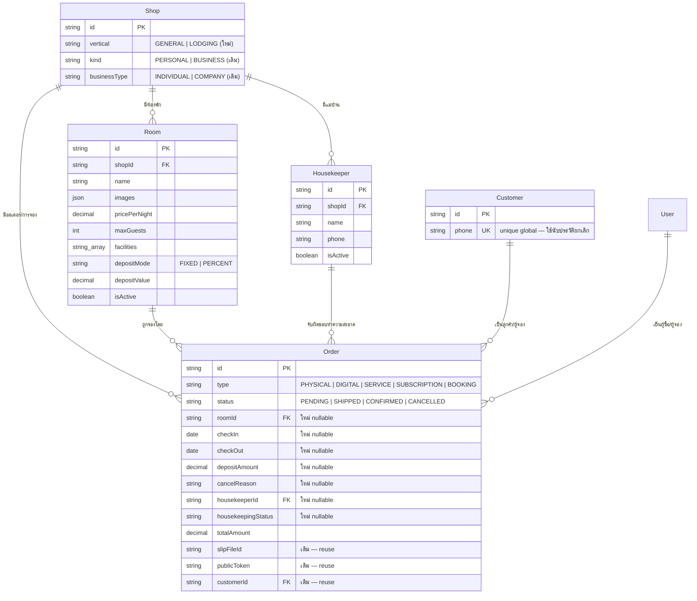

> **โมดูล:** 00017 — Lodging Vertical
> **ประเภทเอกสาร:** DATABASE Design
> **เวอร์ชัน:** 0.1
> **วันที่จัดทำ:** 2026-07-22
> **สถานะ:** Draft

# DATABASE: ประเภทกิจการบ้านพักตากอากาศ

---

## 1. Overview

การเปลี่ยนแปลงฐานข้อมูลของฟีเจอร์นี้แบ่งเป็น 3 กลุ่ม:

| กลุ่ม | การเปลี่ยนแปลง | Phase |
|-------|----------------|-------|
| **ประเภทกิจการ** | เพิ่มคอลัมน์ `Shop.vertical` (additive, มี default) | P1 |
| **ห้องพัก** | ตารางใหม่ `Room` | P1 |
| **การจอง** | เพิ่มคอลัมน์ additive nullable บน `Order` + EXCLUDE constraint กันจองทับ | P2 |
| **แม่บ้าน** | ตารางใหม่ `Housekeeper` + คอลัมน์ additive บน `Order` | P3 |

**หลักการที่ยึดตลอด:**
- **Additive เท่านั้น** — ไม่ลบ ไม่เปลี่ยนชนิด ไม่ rename คอลัมน์เดิม เพื่อรับประกัน zero-regression (BR-LODG-27)
- **ไม่สร้างตาราง Booking แยก** — การจองคือ `Order` ที่ `type = "BOOKING"` (BR-LODG-08) จึงได้ `publicToken`, `slipFileId`, `customerId`, `review`, Trust Score มาใช้ซ้ำทั้งหมด
- **ไม่เก็บตัวนับการยกเลิกแบบ denormalized** — คำนวณสดจาก `Order` ทุกครั้ง (ดู §3.5) เพื่อไม่ให้ตัวเลขเพี้ยนจาก counter drift
- ชนิดเงินใช้ `Decimal(12,2)` ให้ตรงกับ `Order.totalAmount` / `Product.price` เดิมทุกจุด
- สถานะและ enum-like ใช้ `String` ตาม convention โครงการ (มิเรอร์ `Order.status`, `Order.type`, `Shop.kind`) ไม่ใช้ Prisma enum

### 🛑 ข้อบังคับด้านกระบวนการ (อ่านก่อนลงมือ)

ฐานข้อมูล dev และ prod เป็น **ชุดเดียวกัน (Supabase)** และมี migration ที่ไม่ได้อยู่ใน git อยู่ก่อนแล้ว:

- **ห้าม `prisma migrate dev`** — จะพยายาม reset ฐานข้อมูลจริง
- **ห้าม `prisma db pull`** — จะไม่เห็น constraint ที่ Prisma DSL ประกาศไม่ได้ (EXCLUDE, partial index, CHECK) แล้วเขียนทับ schema ให้ "ตรงกับที่มองเห็น" ซึ่งจะทำให้ constraint หายไป
- ใช้ **hand-written `migration.sql` + `prisma migrate deploy -e .env.local`** เท่านั้น
- **ต้องขอผู้ใช้ยืนยันก่อนรันทุกครั้ง** เพราะแตะ prod โดยตรง

อ้างอิง: `docs/conventions/prisma-shared-db-drift.md`, feature 00008 DATABASE §4/§9-1

---

## 2. ERD



---

## 3. Tables

### 3.1 `Shop` — เพิ่มคอลัมน์ (PostgreSQL/Supabase)

| คอลัมน์ | ชนิด | Null | Default | คำอธิบาย |
|---------|------|------|---------|----------|
| `vertical` | `TEXT` | NOT NULL | `'GENERAL'` | ประเภทกิจการ: `GENERAL` (สินค้าและบริการ) / `LODGING` (บ้านพักตากอากาศ) |

**หมายเหตุสำคัญ:**
- Default `'GENERAL'` ทำให้ Shop เดิมทุกแถวกลายเป็นสินค้าและบริการทันทีโดยไม่ต้อง backfill (BR-LODG-01, BR-LODG-03)
- **ห้ามสับสนกับคอลัมน์ที่มีอยู่แล้ว 3 ตัว** — `businessType` (`INDIVIDUAL`/`COMPANY`, ใช้กับ verification ระดับ 3), `kind` (`PERSONAL`/`BUSINESS`, feature 00008), `category`/`categories` (หมวดสินค้า) ทั้งสามคนละความหมายกับ `vertical` ห้าม reuse ห้ามเขียนค่าข้ามกัน (BR-LODG-04)
- **immutable ที่ระดับแอป** (BR-LODG-30) — ไม่บังคับด้วย DB trigger เพราะโครงการไม่ใช้ trigger ที่อื่นเลย และ service layer เป็นทางเข้าทางเดียวอยู่แล้ว

```sql
ALTER TABLE "Shop" ADD COLUMN "vertical" TEXT NOT NULL DEFAULT 'GENERAL';
CREATE INDEX "Shop_vertical_idx" ON "Shop"("vertical");
```

> index รองรับ query "ธุรกิจบ้านพักทั้งหมด" (รายงาน/แอดมิน) และการกรองเมนูตามประเภท

### 3.2 `Room` — ตารางใหม่

| คอลัมน์ | ชนิด | Null | Default | คำอธิบาย |
|---------|------|------|---------|----------|
| `id` | `TEXT` | NOT NULL | — | PK, uuid |
| `shopId` | `TEXT` | NOT NULL | — | FK → `Shop.id`, `ON DELETE CASCADE` |
| `name` | `TEXT` | NOT NULL | — | ชื่อห้อง เช่น "พูลวิลล่า A" |
| `description` | `TEXT` | NULL | — | คำอธิบาย |
| `images` | `JSONB` | NOT NULL | `'[]'` | array ของ fileId เรียงตามลำดับแสดงผล — **ตัวแรกคือรูปหลัก** (มิเรอร์ `Product.images`) สูงสุด 10 (BR-LODG-34, บังคับที่ app layer) |
| `pricePerNight` | `DECIMAL(12,2)` | NOT NULL | — | ราคาต่อคืน ต้อง > 0 (BR-LODG-05) |
| `maxGuests` | `INTEGER` | NULL | — | จำนวนผู้เข้าพักสูงสุด |
| `facilities` | `TEXT[]` | NOT NULL | `'{}'` | key สิ่งอำนวยความสะดวก validate ที่ app layer (มิเรอร์ `Shop.categories`) |
| `depositMode` | `TEXT` | NOT NULL | `'FIXED'` | `FIXED` (จำนวนบาท) หรือ `PERCENT` (% ของยอดรวม) — BR-LODG-15 |
| `depositValue` | `DECIMAL(12,2)` | NOT NULL | `0` | ค่าตามโหมด; **`0` = ไม่เก็บมัดจำ** (BR-LODG-17) |
| `isActive` | `BOOLEAN` | NOT NULL | `true` | ปิดการใช้งาน = ไม่ให้จองใหม่ แต่การจองเดิมยังอยู่ (BR-LODG-07) |
| `createdAt` | `TIMESTAMP(3)` | NOT NULL | `CURRENT_TIMESTAMP` | |
| `updatedAt` | `TIMESTAMP(3)` | NOT NULL | — | |

**CHECK constraints:**
- `pricePerNight > 0`
- `depositMode IN ('FIXED','PERCENT')`
- `depositValue >= 0`
- `depositMode <> 'PERCENT' OR depositValue <= 100` — โหมดเปอร์เซ็นต์ห้ามเกิน 100

> ทำไมไม่แยกตาราง `RoomImage`: มิเรอร์ `Product.images` ที่เป็น `Json` อยู่แล้ว จำนวนรูปมีเพดาน 10 และไม่มี query ที่ต้อง join รูปเดี่ยว — การแยกตารางเพิ่มความซับซ้อนโดยไม่ได้อะไรกลับมา

> ทำไม `facilities` เป็น `TEXT[]` ไม่ใช่ตาราง lookup: รายการเป็นค่าคงที่ที่แอปกำหนด (เหมือน `SHOP_CATEGORY_LABELS`) ไม่ใช่ข้อมูลที่ผู้ใช้สร้าง จึงไม่ต้องมีตารางอ้างอิง

### 3.3 `Order` — เพิ่มคอลัมน์ (additive, nullable ทั้งหมด)

| คอลัมน์ | ชนิด | Null | คำอธิบาย |
|---------|------|------|----------|
| `roomId` | `TEXT` | NULL | FK → `Room.id`, `ON DELETE RESTRICT` — NULL สำหรับออเดอร์ที่ไม่ใช่การจอง |
| `checkIn` | `DATE` | NULL | วันเข้าพัก (รวมในช่วงที่กันคิว) |
| `checkOut` | `DATE` | NULL | วันเช็คเอาท์ (**ไม่รวม**ในช่วงที่กันคิว — BR-LODG-31) |
| `depositAmount` | `DECIMAL(12,2)` | NULL | ยอดมัดจำที่ต้องโอน — **snapshot ที่คำนวณเสร็จแล้ว** ไม่ใช่สูตร |
| `cancelReason` | `TEXT` | NULL | `BUYER_NO_TRANSFER` / `BUYER_REQUESTED` / `SHOP_ISSUE` / `MUTUAL` (BR-LODG-36) |
| `housekeeperId` | `TEXT` | NULL | FK → `Housekeeper.id`, `ON DELETE SET NULL` |
| `housekeepingStatus` | `TEXT` | NULL | `PENDING` / `DONE` — NULL = ยังไม่มอบหมาย (BR-LODG-26) |

**ค่าใหม่ของคอลัมน์เดิม:**
- `Order.type` เพิ่มค่า `"BOOKING"` (เดิมมี `PHYSICAL` / `DIGITAL` / `SERVICE` / `SUBSCRIPTION`) — เป็น `String` ไม่ใช่ enum จึงไม่ต้อง migrate ชนิด แต่ **ต้องตรวจทุกจุดในโค้ดที่กรองหรือ switch บน `type`** (ดู SRS §7.1 ความเสี่ยง)

**ทำไม `depositAmount` เก็บเป็นยอดที่คำนวณแล้ว ไม่เก็บ mode/value ซ้ำ:**
มัดจำต้องล็อกทันทีที่ผู้จองแนบสลิป (BR-LODG-18) และห้ามเปลี่ยนย้อนหลัง ถ้าเก็บเป็นสูตรอ้างอิง `Room.depositMode/depositValue` ยอดจะขยับเองเมื่อเจ้าของแก้ค่าเริ่มต้นของห้องภายหลัง ซึ่งผิดกฎ — เก็บเป็นยอดสุทธิ ณ เวลาสร้างจึงถูกต้องกว่าและตรวจย้อนหลังได้

**CHECK constraints:**
- `checkOut > checkIn` (เมื่อทั้งคู่ไม่ NULL) — BR-LODG-12
- `depositAmount IS NULL OR depositAmount >= 0` — BR-LODG-16 (ขอบบน `<= totalAmount` บังคับที่ service layer เพราะเทียบข้ามคอลัมน์ที่แก้ไขได้)
- `cancelReason IS NULL OR cancelReason IN ('BUYER_NO_TRANSFER','BUYER_REQUESTED','SHOP_ISSUE','MUTUAL')`
- `housekeepingStatus IS NULL OR housekeepingStatus IN ('PENDING','DONE')`
- ความสอดคล้องของการจอง: `type <> 'BOOKING' OR (roomId IS NOT NULL AND checkIn IS NOT NULL AND checkOut IS NOT NULL)`

> ⚠️ CHECK ทั้งหมดบน `Order` ต้องเพิ่มแบบ `NOT VALID` แล้วค่อย `VALIDATE CONSTRAINT` เพราะตารางมีข้อมูลจริงบน prod อยู่แล้ว (pattern เดียวกับ `Product.stockQty` ของ feature 00003 และ `Shop.pinSlots` ของ feature 00013)

### 3.4 `Housekeeper` — ตารางใหม่ (P3)

| คอลัมน์ | ชนิด | Null | Default | คำอธิบาย |
|---------|------|------|---------|----------|
| `id` | `TEXT` | NOT NULL | — | PK, uuid |
| `shopId` | `TEXT` | NOT NULL | — | FK → `Shop.id`, `ON DELETE CASCADE` |
| `name` | `TEXT` | NOT NULL | — | ชื่อแม่บ้าน |
| `phone` | `TEXT` | NOT NULL | — | เบอร์โทร normalize ด้วย `src/lib/phone.ts` |
| `isActive` | `BOOLEAN` | NOT NULL | `true` | |
| `createdAt` | `TIMESTAMP(3)` | NOT NULL | `CURRENT_TIMESTAMP` | |
| `updatedAt` | `TIMESTAMP(3)` | NOT NULL | — | |

**หมายเหตุ:**
- **ไม่มี `userId`** — แม่บ้านไม่ใช่ผู้ใช้ในระบบและเข้าสู่ระบบไม่ได้ (BR-LODG-24) การเพิ่ม FK ไป `User` จะเปิดช่องให้เข้าใจผิดว่าต่อไปจะให้ล็อกอินได้
- `phone` **ไม่ unique** — ไม่ใช่ตัวระบุตัวตนกลาง เป็นเพียงข้อมูลติดต่อภายในร้าน และคนละคนอาจใช้เบอร์เดียวกันได้ (เช่น เบอร์บ้าน)
- 🛑 `name` และ `phone` เป็นข้อมูลส่วนบุคคลของบุคคลที่สาม — **ห้ามส่งข้ามไปฝั่งผู้จองทุกกรณี** ต้องตัดออกที่ server boundary ก่อน serialize (BR-LODG-23; ดู `feedback_rsc_pii_neutralize_at_source`)

### 3.5 ประวัติการยกเลิกของผู้จอง — **ไม่มีตาราง/คอลัมน์ใหม่**

BR-LODG-38 ต้องการนับจำนวนครั้งที่เบอร์หนึ่ง ๆ ถูกยกเลิกด้วยความผิดของผู้จอง — **คำนวณสดจาก `Order` ที่มีอยู่แล้ว**:

```sql
SELECT "cancelReason", COUNT(*)
FROM "Order"
WHERE "customerId" = $1
  AND "status" = 'CANCELLED'
  AND "cancelReason" IN ('BUYER_NO_TRANSFER','BUYER_REQUESTED')
GROUP BY "cancelReason";
```

**ทำไมไม่เก็บ counter บน `Customer`:**
- counter แบบ denormalized ต้องอัปเดตทุกครั้งที่ยกเลิก/แก้เหตุผล และจะเพี้ยนถาวรถ้าพลาดแม้ครั้งเดียว — ตัวเลขนี้ถูกใช้ตัดสินใจทางธุรกิจ จึงต้องถูกเสมอ
- ปริมาณข้อมูลต่อ customer อยู่ระดับหลักหน่วยถึงหลักสิบ query สดเร็วพอและมี index รองรับอยู่แล้ว
- ต่างจาก `Shop.chatResponseRate` ที่ denormalize เพราะคำนวณหนักและอัปเดตด้วย cron รายวัน — เคสนี้เบากว่ามาก

**ขอบเขตข้อมูลที่คืน:** service ต้องคืนเฉพาะ **จำนวนครั้งแยกตามเหตุผล** ห้ามคืน `shopId`, วันที่, หรือ `publicToken` ของการจองร้านอื่น (BR-LODG-39) — เป็นการรักษาหลักความเป็นส่วนตัวของ Customer Directory (feature 00014) ที่ผู้ขายเห็นได้เฉพาะลูกค้าของร้านตัวเอง

---

## 4. Indexes & Constraints

### 4.1 Index

| ตาราง | Index | เหตุผล |
|-------|-------|--------|
| `Shop` | `("vertical")` | กรองธุรกิจตามประเภท (แอดมิน/รายงาน) |
| `Room` | `("shopId", "isActive")` | list ห้องของร้าน + กรองเฉพาะที่เปิดใช้งาน (หน้าโปรไฟล์สาธารณะ) |
| `Order` | `("roomId", "checkIn")` | สร้างปฏิทินของห้องในช่วงเดือน |
| `Order` | `("shopId", "type", "checkIn")` | หน้าปฏิทินรวมทุกห้องของร้าน + รายการการจองเรียงตามวันเข้าพัก |
| `Order` | `("customerId", "status")` | นับประวัติการยกเลิกต่อลูกค้า (§3.5) — เสริม `Order_customerId_idx` เดิม |
| `Order` | `("housekeeperId", "housekeepingStatus")` | หน้ารวมงานแม่บ้านที่ค้าง |
| `Housekeeper` | `("shopId", "isActive")` | list แม่บ้านของร้าน |

### 4.2 🛑 EXCLUDE constraint — หัวใจของการกันจองทับ

BR-LODG-11 ระบุว่าการกดพร้อมกันต้องสำเร็จรายการเดียว การตรวจก่อนบันทึกที่ระดับแอปเพียงอย่างเดียว **ไม่พอ** (มีช่องว่างระหว่างตรวจกับเขียน) จึงต้องบังคับที่ฐานข้อมูล:

```sql
CREATE EXTENSION IF NOT EXISTS btree_gist;

ALTER TABLE "Order" ADD CONSTRAINT "Order_room_no_overlap"
  EXCLUDE USING gist (
    "roomId" WITH =,
    daterange("checkIn", "checkOut", '[)') WITH &&
  )
  WHERE ("roomId" IS NOT NULL AND "status" <> 'CANCELLED');
```

**อ่าน constraint นี้ยังไง:**
- `'[)'` = ช่วงวันแบบ **รวมวันเข้าพัก ไม่รวมวันเช็คเอาท์** → ตรงกับ BR-LODG-31 พอดี: จอง 5–8 กันวันที่ 5,6,7 คนถัดไปเช็คอิน 8 ได้
- `WHERE status <> 'CANCELLED'` → การจองที่ยกเลิกแล้วไม่กินคิว (BR-LODG-13)
- `WHERE roomId IS NOT NULL` → ออเดอร์สินค้าปกติไม่ถูกแตะเลย (zero-regression, BR-LODG-27)
- ต้องมี extension `btree_gist` เพราะ `roomId WITH =` เป็นการเทียบแบบ equality บน gist index

**🛑 Prisma DSL ประกาศ EXCLUDE constraint ไม่ได้** — เป็น unmanaged SQL เหมือน partial unique index ของ feature 00008 (`Shop_userId_personal_key`) ต้องเขียนคำเตือนกำกับใน `schema.prisma` เหนือ model `Order` ว่า:
- constraint นี้มีอยู่จริงในฐานข้อมูลแม้ schema จะไม่แสดง
- **ห้าม `prisma db pull` เด็ดขาด** — introspection จะไม่เห็น แล้ว migration ถัดไปอาจ DROP ทิ้ง

**ผลต่อโค้ด:** เมื่อ constraint นี้ทำงาน Prisma จะโยน error ที่ **ไม่ใช่ P2002** (unique) แต่เป็น `P2010`/raw `23P01 exclusion_violation` — service ต้องดักรหัสนี้แล้วแปลงเป็น error ที่ route map เป็น 409 (ดู SRS §3 TFR-005 และบทเรียน `feedback_service_error_route_mapping`)

### 4.3 CHECK constraints (สรุป)

| ตาราง | Constraint | กฎ |
|-------|-----------|-----|
| `Room` | `Room_price_positive` | `pricePerNight > 0` |
| `Room` | `Room_deposit_mode` | `depositMode IN ('FIXED','PERCENT')` |
| `Room` | `Room_deposit_value` | `depositValue >= 0 AND (depositMode <> 'PERCENT' OR depositValue <= 100)` |
| `Order` | `Order_stay_range` | `checkIn IS NULL OR checkOut IS NULL OR checkOut > checkIn` |
| `Order` | `Order_deposit_nonneg` | `depositAmount IS NULL OR depositAmount >= 0` |
| `Order` | `Order_cancel_reason` | อยู่ใน 4 ค่าที่กำหนด หรือ NULL |
| `Order` | `Order_housekeeping_status` | `PENDING` / `DONE` หรือ NULL |
| `Order` | `Order_booking_fields` | `type <> 'BOOKING' OR (roomId IS NOT NULL AND checkIn IS NOT NULL AND checkOut IS NOT NULL)` |

---

## 5. Migration Plan

### 5.1 ลำดับการ Migrate

แยกเป็น 3 ไฟล์ตาม Phase เพื่อให้ deploy ทีละส่วนได้ และ rollback แคบ:

**M1 — `20260722000000_lodging_vertical_and_room` (P1)**
1. `ALTER TABLE "Shop" ADD COLUMN "vertical" TEXT NOT NULL DEFAULT 'GENERAL';`
2. `CREATE INDEX "Shop_vertical_idx"`
3. `CREATE TABLE "Room"` + PK + FK → Shop (CASCADE)
4. `CREATE INDEX "Room_shopId_isActive_idx"`
5. CHECK ของ `Room` — เพิ่มได้ทันทีแบบปกติ (ตารางใหม่ ไม่มีข้อมูล)

**M2 — `20260722000100_booking_fields_and_overlap` (P2)**
1. `ALTER TABLE "Order" ADD COLUMN` × 5 (`roomId`, `checkIn`, `checkOut`, `depositAmount`, `cancelReason`) — nullable ทั้งหมด ไม่ล็อกตารางนาน
2. FK `Order.roomId` → `Room.id` `ON DELETE RESTRICT`
3. index `Order_roomId_checkIn_idx`, `Order_shopId_type_checkIn_idx`, `Order_customerId_status_idx`
4. `CREATE EXTENSION IF NOT EXISTS btree_gist;`
5. EXCLUDE constraint `Order_room_no_overlap`
6. CHECK บน `Order` — **`NOT VALID` ก่อน แล้ว `VALIDATE CONSTRAINT` แยกคำสั่ง**

**M3 — `20260722000200_housekeeper` (P3)**
1. `CREATE TABLE "Housekeeper"` + FK → Shop (CASCADE)
2. `ALTER TABLE "Order" ADD COLUMN "housekeeperId", "housekeepingStatus"`
3. FK `Order.housekeeperId` → `Housekeeper.id` `ON DELETE SET NULL`
4. index `Housekeeper_shopId_isActive_idx`, `Order_housekeeperId_housekeepingStatus_idx`
5. CHECK `Order_housekeeping_status` (NOT VALID → VALIDATE)

### 5.2 Rollback

| Migration | Rollback | ความเสี่ยงข้อมูลหาย |
|-----------|----------|---------------------|
| M1 | `DROP TABLE "Room"`, `ALTER TABLE "Shop" DROP COLUMN "vertical"` | **สูง** — ข้อมูลห้องหายถาวร ใช้เฉพาะกรณีไม่มีร้าน LODGING จริง |
| M2 | `DROP CONSTRAINT "Order_room_no_overlap"`, drop คอลัมน์ที่เพิ่ม | **สูง** — ข้อมูลการจองหาย |
| M3 | `DROP TABLE "Housekeeper"`, drop 2 คอลัมน์ | กลาง |

> 🛑 เนื่องจาก dev = prod การ rollback คือการลบข้อมูลผู้ใช้จริง — **ต้องขออนุมัติผู้ใช้เป็นลายลักษณ์อักษรก่อนเสมอ** ทางที่ปลอดภัยกว่าคือปิดฟีเจอร์ที่ระดับแอป (ซ่อนเมนู) แล้วปล่อยคอลัมน์ทิ้งไว้

### 5.3 ผลกระทบ (Impact)

| ประเด็น | การประเมิน |
|---------|------------|
| **ข้อมูลเดิม** | ไม่ถูกแตะเลย — ทุกคอลัมน์ใหม่ nullable หรือมี default; `Shop.vertical` ได้ `'GENERAL'` อัตโนมัติ |
| **การล็อกตาราง** | `ADD COLUMN` แบบมี default บน Postgres 11+ ไม่ rewrite ตาราง; CHECK ใช้ `NOT VALID` จึงไม่สแกนตอน ALTER |
| **`Order` เป็นตารางใหญ่** | การสร้าง index และ EXCLUDE ควรพิจารณา `CONCURRENTLY` ถ้าปริมาณแถวสูง — ประเมินจำนวนแถวจริงก่อน deploy |
| **`prisma generate`** | ต้องรันหลังแก้ `schema.prisma` และ **restart dev server** มิฉะนั้น Prisma client เก่าจะทำให้ session/API พัง (บทเรียน seller auth 2026-06-16) |
| **Zero-regression** | ร้าน `GENERAL` ต้องไม่มีพฤติกรรมเปลี่ยน — EXCLUDE มี `WHERE roomId IS NOT NULL` จึงไม่แตะออเดอร์สินค้า |

---

## 6. Retention / ข้อควรระวัง

- **ไม่ลบข้อมูลการจองถาวร** — การยกเลิกคือเปลี่ยน `status` เป็น `CANCELLED` เท่านั้น ประวัติต้องอยู่ครบเพื่อใช้นับประวัติผู้จอง (§3.5) และตรวจย้อนหลัง
- **`Order.roomId` เป็น `ON DELETE RESTRICT`** — ลบห้องที่มีการจองไม่ได้ที่ระดับฐานข้อมูล สอดคล้องกับ BR-LODG-06 ที่ให้ใช้การปิดการใช้งานแทน
- **`Housekeeper` เป็น `ON DELETE SET NULL` บน `Order`** — ลบแม่บ้านออกจากรายชื่อได้ โดยการจองเดิมยังอยู่ครบ เพียงแต่ไม่มีผู้รับผิดชอบผูกไว้
- **PII** — `Housekeeper.name/phone` และ `Order.buyerContact` ต้องถูกตัด/ปิดบังที่ server boundary ก่อนส่งไปฝั่งผู้จอง ทั้งในหน้าและใน payload
- **ห้าม `prisma db pull` / `migrate dev` หลัง M2** — EXCLUDE constraint และ CHECK ทั้งหมดเป็น unmanaged SQL ที่ introspection มองไม่เห็น

---

## 7. Traceability

| กฎธุรกิจ | สิ่งที่บังคับในฐานข้อมูล |
|----------|--------------------------|
| BR-LODG-01, 03 | `Shop.vertical` default `'GENERAL'` |
| BR-LODG-04 | คอลัมน์แยกจาก `businessType`/`kind`/`category` (คำเตือนใน schema) |
| BR-LODG-05 | CHECK `Room_price_positive` |
| BR-LODG-06 | FK `Order.roomId` `ON DELETE RESTRICT` |
| BR-LODG-07 | `Room.isActive` |
| BR-LODG-08 | ไม่มีตาราง Booking — ใช้ `Order.type = 'BOOKING'` |
| BR-LODG-11 | **EXCLUDE constraint `Order_room_no_overlap`** |
| BR-LODG-12 | CHECK `Order_stay_range` |
| BR-LODG-13 | `WHERE status <> 'CANCELLED'` ใน EXCLUDE |
| BR-LODG-15, 16 | `Room.depositMode/depositValue` + CHECK; `Order.depositAmount` |
| BR-LODG-17 | `depositValue = 0` |
| BR-LODG-18 | `Order.depositAmount` เป็น snapshot ไม่ใช่สูตรอ้างอิง |
| BR-LODG-23 | `Housekeeper` ไม่มี relation ไปฝั่งผู้จอง + คำเตือน PII |
| BR-LODG-24 | `Housekeeper` ไม่มี `userId` |
| BR-LODG-26 | `Order.housekeepingStatus` แยกจาก `Order.status` |
| BR-LODG-29, 39 | ไม่มีคอลัมน์ที่หัก Trust Score — ประวัติคำนวณสด (§3.5) |
| BR-LODG-31 | `daterange(..., '[)')` |
| BR-LODG-34 | เพดาน 10 รูปบังคับที่ app layer (`images` เป็น Json) |
| BR-LODG-36, 37 | `Order.cancelReason` + CHECK 4 ค่า |
| BR-LODG-38 | คำนวณจาก `Order.customerId` + `cancelReason` |

---

## 8. สรุป

การเปลี่ยนแปลงฐานข้อมูลทั้งหมดเป็น **additive ล้วน** — 2 ตารางใหม่ (`Room`, `Housekeeper`), 1 คอลัมน์บน `Shop` ที่มี default, และ 7 คอลัมน์ nullable บน `Order` ไม่มีการลบหรือเปลี่ยนชนิดคอลัมน์เดิมแม้แต่จุดเดียว

จุดที่ต้องใส่ใจที่สุดคือ **EXCLUDE constraint** ซึ่งเป็นสิ่งเดียวที่รับประกันว่าจองทับกันไม่ได้จริงแม้กดพร้อมกัน — และเป็น unmanaged SQL ที่ Prisma มองไม่เห็น จึงต้องมีคำเตือนใน `schema.prisma` และห้าม `db pull` ตลอดไป

รองลงมาคือการตัดสินใจ **ไม่เก็บตัวนับการยกเลิกแบบ denormalized** ซึ่งแลกความเร็วเล็กน้อยกับความถูกต้องที่รับประกันได้ เหมาะกับข้อมูลที่ถูกใช้ตัดสินใจทางธุรกิจ
