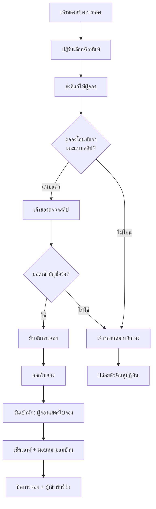

> **โมดูล:** 00017 — Lodging Vertical
> **ประเภทเอกสาร:** Product Requirements Document (PRD)
> **เวอร์ชัน:** 0.1
> **วันที่จัดทำ:** 2026-07-21
> **สถานะ:** Approved (requirement) — ข้อตัดสินใจค้างปิดครบแล้ว 2026-07-21 (ดู [[BRD]] §2.7)
> **เจ้าของเอกสาร:** BA + PO + PM (ดู [[Feature-Docs-Ownership]])

# PRD: ประเภทกิจการบ้านพักตากอากาศ (Lodging Vertical)

---

## Executive Summary

ทุกวันนี้ Deep รองรับธุรกิจแบบเดียว คือ **ขายสินค้า/บริการ (ecommerce)** — เจ้าของร้านสร้างสินค้า สร้างออเดอร์ ส่งลิงก์ให้ลูกค้า แล้วปิดการขาย แต่ผู้ประกอบการอีกกลุ่มที่ใช้ Deep คือ **เจ้าของบ้านพักตากอากาศ/พูลวิลล่า** ซึ่งมีวิธีทำงานต่างกันโดยสิ้นเชิง: สิ่งที่ขายคือ "ห้อง × ช่วงวันที่" ไม่ใช่ "ชิ้น", ต้องรู้ทันทีว่าวันไหนว่าง/ไม่ว่าง, ต้องเก็บมัดจำก่อนล็อกคิว, และต้องมีใบจองให้ผู้เข้าพักแสดงตอนเช็คอิน

ฟีเจอร์นี้เพิ่ม **"ประเภทกิจการ" (`Shop.vertical`)** ตอนสร้าง Business Profile ให้เลือกได้ 2 แบบ — *สินค้าและบริการ* (พฤติกรรมเดิมทั้งหมด) และ *บ้านพักตากอากาศ* (ปลดล็อกห้องพัก ปฏิทิน การจอง มัดจำ ใบจอง และงานแม่บ้าน) โดยออกแบบให้ **การจอง = ออเดอร์ชนิดหนึ่ง** (`Order.type = "BOOKING"`) เพื่อใช้โครงสร้างที่ระบบมีอยู่แล้วซ้ำให้มากที่สุด — ลิงก์สาธารณะ, การแนบสลิป, รีวิว, Trust Score และประวัติออเดอร์ ทำงานกับการจองได้ทันทีโดยไม่ต้องสร้างระบบคู่ขนาน

คุณค่าทางธุรกิจ: ขยายฐานผู้ใช้ Deep ไปยังกลุ่มที่พักซึ่งปัจจุบันจดคิวด้วยสมุด/Excel/แชต โดยยังคงจุดขายเดิมของแพลตฟอร์มไว้ครบ — ความน่าเชื่อถือของผู้ขายที่ตรวจสอบได้

---

## 1. Business Goals & KPIs

### 1.1 เป้าหมายทางธุรกิจ

| เป้าหมาย | รายละเอียด |
|----------|-----------|
| **ขยายไปกลุ่มที่พัก** | เปิดให้ธุรกิจบ้านพัก/พูลวิลล่าใช้ Deep ได้เต็มรูปแบบ ไม่ต้องดัดแปลงระบบสินค้ามาใช้ผิดวิธี |
| **ลดการจองซ้ำซ้อน (double-booking)** | ปฏิทินว่าง/ไม่ว่างเป็นแหล่งความจริงเดียว แทนสมุดจด/แชตหลายช่องทาง |
| **ทำให้มัดจำเป็นระบบ** | ยอดมัดจำ การแนบสลิป และการยืนยัน อยู่ในที่เดียวกับการจอง ตรวจย้อนหลังได้ |
| **ต่อยอด Trust Score เดิม** | การจองที่สำเร็จนับเป็นออเดอร์ → เจ้าของบ้านพักสะสมความน่าเชื่อถือด้วยกลไกเดียวกับผู้ขายทั่วไป |
| **ไม่กระทบผู้ใช้เดิม** | ร้านที่มีอยู่ทั้งหมดยังทำงานเหมือนเดิม 100% โดยไม่ต้องตั้งค่าอะไรเพิ่ม |

### 1.2 ตัวชี้วัดความสำเร็จ (KPIs)

| KPI | คำอธิบาย | เป้าหมาย |
|-----|----------|---------|
| **จำนวนธุรกิจ LODGING** | นับ `Shop` ที่ `vertical = LODGING` และมีห้องอย่างน้อย 1 ห้อง | มีผู้ใช้จริงใช้ต่อเนื่องหลังเปิดใช้งาน |
| **อัตราการจองที่ยืนยันสำเร็จ** | การจองสถานะยืนยันแล้ว ÷ การจองทั้งหมดที่สร้าง | ≥ 70% |
| **อัตราการแนบสลิป** | การจองที่ผู้จองแนบสลิปเอง ÷ การจองที่มีมัดจำ > 0 | ≥ 60% (ตัวชี้วัดว่าลิงก์ใช้งานได้จริง) |
| **การจองซ้ำซ้อน** | จำนวนเคสที่ห้องเดียวกันถูกจองทับช่วงวันเดียวกัน | 0 (ระบบต้องกันได้) |
| **Regression ร้านเดิม** | ร้าน `vertical = GENERAL` ที่พฤติกรรมเปลี่ยนไปจากเดิม | 0 |

### 1.3 ขอบเขตการส่งมอบตาม Phase

| Phase | ส่งมอบ | คุณค่าที่ผู้ใช้ได้เมื่อจบ Phase |
|-------|--------|-------------------------------|
| **P1 — ประเภทกิจการ + ห้องพัก** | `Shop.vertical`, ตัวเลือกตอนสร้าง Business, เมนู/หน้าตั้งค่าแยกตามประเภท, จัดการห้องพัก (ชื่อ รูปหลายรูป ราคาต่อคืน facilities มัดจำ default) | ตั้งค่าบ้านพักและห้องได้ครบ พร้อมโชว์บนโปรไฟล์ร้าน |
| **P2 — การจอง (คุณค่าหลัก)** | สร้างการจอง, ปฏิทินว่าง/ไม่ว่าง, ลิงก์สาธารณะให้ผู้จอง, มัดจำ, แนบสลิป, ยืนยัน, ใบจอง | ปิดวงจรการจองได้ครบตั้งแต่รับจองถึงเช็คอิน |
| **P3 — แม่บ้าน** | รายชื่อแม่บ้าน, มอบหมายงานต่อการจอง, สถานะงาน (รอทำ/เสร็จแล้ว) | จัดคิวทำความสะอาดต่อรอบเข้าพักได้ |

> P1 ไม่ส่งมอบคุณค่าแบบยืนได้ด้วยตัวเอง (ตั้งค่าห้องได้แต่ยังจองไม่ได้) — ถือเป็นงานปูพื้นที่ต้องต่อ P2 ทันที ไม่ควรปล่อย P1 ค้างไว้นาน

---

## 2. User Personas (กลุ่มผู้ใช้งาน)

### 2.1 เจ้าของบ้านพักตากอากาศ (ผู้ใช้หลัก)

**ข้อมูลพื้นฐาน:**
- เจ้าของบ้านพัก/พูลวิลล่า 1–10 หลัง ดูแลเอง หรือมีคนช่วยไม่กี่คน
- รับจองผ่าน Facebook / LINE / โทรศัพท์ เป็นหลัก
- ใช้งานผ่านมือถือเป็นส่วนใหญ่ (หน้าฝั่ง seller = Paces)

**เป้าหมาย:**
- รู้ทันทีว่าห้องไหนว่างวันไหน โดยไม่ต้องเปิดสมุด
- เก็บมัดจำได้จริงก่อนล็อกคิว
- ให้ผู้จองเห็นรายละเอียดและหลักฐานการจองเองโดยไม่ต้องตอบแชตซ้ำ

**ความต้องการ:**
- สร้างห้อง ใส่รูป ใส่สิ่งอำนวยความสะดวก ตั้งราคาต่อคืนและมัดจำ
- สร้างการจอง เลือกวันเข้า-ออก แล้วส่งลิงก์ให้ผู้จอง
- ปฏิทินที่ล็อกคิวทันทีเมื่อสร้างการจอง
- สั่งแม่บ้านไปทำความสะอาดตามรอบเช็คเอาท์

**จุดปวด (Pain Points):**
- จองซ้ำซ้อนเพราะจดหลายที่ ต้องขอโทษลูกค้าและคืนเงิน
- ตามสลิปมัดจำในแชตย้อนหลังไม่เจอ
- ตอบคำถามเดิมซ้ำ ๆ (ราคา ที่ตั้ง สิ่งอำนวยความสะดวก เวลาเช็คอิน)

### 2.2 ผู้จอง / ผู้เข้าพัก

**ข้อมูลพื้นฐาน:**
- คนทั่วไปที่ติดต่อเจ้าของผ่านโซเชียล — **ต้องมีบัญชี Deep และเข้าสู่ระบบก่อนจึงจะเข้าถึงการจองได้** (กติกาเดิมของแพลตฟอร์มจาก feature 00015)
- เปิดลิงก์บนมือถือ (หน้าฝั่งผู้ซื้อ = Vuexy)

**เป้าหมาย:**
- เห็นรายละเอียดการจองชัดเจนว่าจองห้องไหน วันไหน จ่ายเท่าไร
- โอนมัดจำแล้วรู้ว่าเจ้าของได้รับแล้วจริง
- มีหลักฐานยืนยันไว้แสดงตอนไปถึงที่พัก

**ความต้องการ:**
- เข้าสู่ระบบได้ง่ายด้วยเบอร์โทรที่พรีฟิลมาให้ ไม่ต้องพิมพ์ซ้ำ
- แนบสลิปได้ง่ายจากมือถือ
- ใบจองที่เปิดดูได้ตลอดจนถึงวันเข้าพัก

**จุดปวด (Pain Points):**
- ไม่มั่นใจว่าโอนไปแล้วเจ้าของเห็นหรือยัง
- ไม่แน่ใจว่าที่พักมีตัวตนจริงหรือโดนหลอก
- หาสลิป/ข้อความยืนยันในแชตไม่เจอตอนถึงหน้างาน

### 2.3 แม่บ้าน / ผู้ดูแลความสะอาด

**ข้อมูลพื้นฐาน:**
- ลูกจ้างรายวัน/รายรอบ **ไม่มีบัญชีในระบบ ไม่ต้องเข้าสู่ระบบ** (ดู [[BRD]] BR-LODG-24)
- รับงานผ่านการบอกปากเปล่า / SMS / แชต

**เป้าหมาย:**
- รู้ว่าต้องเข้าไปทำความสะอาดหลังไหน วันไหน

**ความต้องการ:**
- เจ้าของสื่อสารรอบงานให้ชัด ไม่ตกหล่น

**จุดปวด (Pain Points):**
- ไปผิดหลัง/ผิดวัน เพราะบอกกันปากเปล่า

### 2.4 ผู้ขายสินค้าและบริการเดิม (persona ที่ต้องไม่ถูกกระทบ)

**ข้อมูลพื้นฐาน:**
- ร้านค้าทั้งหมดที่ใช้งานอยู่บนระบบจริงวันนี้

**เป้าหมาย:**
- ทำงานเหมือนเดิมทุกประการ

**ความต้องการ:**
- ไม่ต้องตั้งค่าอะไรใหม่ ไม่ต้องเลือกอะไรเพิ่ม ไม่เห็นเมนูที่ไม่เกี่ยวข้อง

**จุดปวด (Pain Points):**
- ฟีเจอร์ใหม่ที่บังคับให้ต้องมาตั้งค่าใหม่ทั้งที่ไม่ได้ใช้

---

## 3. Business Requirements

### 3.1 เลือกประเภทกิจการตอนสร้าง Business Profile

**ความต้องการ:**
- ตอนสร้าง Business Profile ผู้ใช้เลือก **ประเภทกิจการ** ได้ 2 แบบ: *สินค้าและบริการ* หรือ *บ้านพักตากอากาศ*
- ประเภทที่เลือกกำหนดว่าเมนูและหน้าตั้งค่าของธุรกิจนั้นจะมีอะไรบ้าง
- ร้านทั้งหมดที่มีอยู่ก่อนฟีเจอร์นี้ถือเป็น *สินค้าและบริการ* โดยอัตโนมัติ

**Business Rules:**
- ค่าเริ่มต้นของทุกธุรกิจ = *สินค้าและบริการ* — ผู้ใช้เดิมไม่ต้องทำอะไรเลย
- 1 ธุรกิจ = 1 ประเภทกิจการ (เลือกได้แบบเดียว ไม่ใช่หลายแบบพร้อมกัน)
- ธุรกิจประเภท *สินค้าและบริการ* ต้องไม่เห็นเมนูห้องพัก/ปฏิทิน/การจอง/แม่บ้านเลย
- ธุรกิจประเภท *บ้านพักตากอากาศ* ยังคงใช้ความสามารถกลางของแพลตฟอร์มได้ครบ (โปรไฟล์สาธารณะ, ยืนยันตัวตน, Trust Score, แชต, รีวิว)

**เหตุผล:**
- ธุรกิจสองแบบนี้มีวิธีทำงานต่างกันจนใช้หน้าจอชุดเดียวกันไม่ได้ — บังคับให้เจ้าของบ้านพักใช้ระบบสินค้าคือต้นเหตุของการกรอกข้อมูลผิดวิธีและข้อมูลเพี้ยน
- การซ่อนเมนูที่ไม่เกี่ยวข้องลดความซับซ้อนให้ผู้ใช้ทั้งสองกลุ่มพร้อมกัน

> ⚠️ **ข้อควรระวังด้านการตั้งชื่อ:** หน้าสร้าง Business ปัจจุบันมีช่องชื่อ *"ประเภทธุรกิจ"* อยู่แล้ว (บุคคลธรรมดา / นิติบุคคล — ใช้กับการยืนยันตัวตนระดับ 3) ซึ่ง**คนละเรื่องกัน** ฟีเจอร์นี้จึงต้องตั้งชื่อให้แยกขาด: ของใหม่ = **"ประเภทกิจการ"**, ของเดิมเปลี่ยนป้ายเป็น **"ประเภทผู้ประกอบการ"** มิฉะนั้นผู้ใช้จะสับสนแน่นอน

### 3.2 ห้องพักและสิ่งอำนวยความสะดวก

**ความต้องการ:**
- เจ้าของสร้าง/แก้ไข/ปิดการใช้งาน "ห้องพัก" ได้ (ห้องพัก = หน่วยที่ให้จอง ซึ่งอาจเป็นห้องหรือทั้งหลัง)
- แต่ละห้องมี: ชื่อ, คำอธิบาย, รูปภาพหลายรูป, ราคาต่อคืน, จำนวนผู้เข้าพักสูงสุด, สิ่งอำนวยความสะดวก, ค่ามัดจำเริ่มต้น
- สิ่งอำนวยความสะดวกเลือกจากรายการมาตรฐานที่ระบบเตรียมไว้ (เช่น สระว่ายน้ำ เครื่องปรับอากาศ ที่จอดรถ ครัว เครื่องซักผ้า Wi-Fi)

**Business Rules:**
- ห้องที่ถูกปิดการใช้งานจะสร้างการจองใหม่ไม่ได้ แต่การจองเดิมที่มีอยู่ยังคงอยู่และยังดูได้
- ห้ามลบห้องที่มีการจองผูกอยู่ — ใช้การปิดการใช้งานแทน
- ราคาต่อคืนเป็นราคาเดียวคงที่ (ยังไม่มีราคาตามฤดูกาล/วันหยุด — อยู่นอกขอบเขต)

**เหตุผล:**
- รูปและสิ่งอำนวยความสะดวกคือข้อมูลที่ผู้จองถามซ้ำมากที่สุด การมีอยู่ในระบบช่วยลดงานตอบแชตของเจ้าของโดยตรง
- การห้ามลบห้องที่มีประวัติการจองปกป้องความถูกต้องของประวัติและรีวิวย้อนหลัง

### 3.3 การจองและปฏิทินว่าง/ไม่ว่าง

**ความต้องการ:**
- เจ้าของสร้างการจองได้เอง โดยระบุ: ห้อง, วันเข้าพัก, วันเช็คเอาท์, ชื่อ+เบอร์ผู้จอง, ยอดมัดจำ
- ระบบคำนวณจำนวนคืนและยอดรวมให้อัตโนมัติจากราคาต่อคืน
- มีปฏิทินแสดงสถานะว่าง/ไม่ว่างของแต่ละห้องแบบเห็นทันที
- ระบบต้องกันการจองทับช่วงวันเดียวกันของห้องเดียวกัน

**Business Rules:**
- **ล็อกคิวทันทีที่สร้างการจอง** — ไม่รอให้ผู้จองโอนหรือแนบสลิป (ดู [[BRD]] BR-LODG-09, BR-LODG-10)
- **ทุกการยกเลิกต้องเลือกเหตุผล** และเฉพาะเหตุผลที่เป็นความผิดผู้จอง (ไม่โอน / ขอยกเลิก) จึงบันทึกเข้าประวัติของเบอร์ผู้จอง
- ประวัติการยกเลิกแสดงเป็นคำเตือนต่อเจ้าของตอนสร้างการจองครั้งถัดไป **แต่ไม่บล็อกการจอง** และไม่มีผลต่อ Trust Score ของใคร
- ไม่มีการปล่อยคิวอัตโนมัติเมื่อเลยเวลา — ถ้าผู้จองไม่โอน เจ้าของเป็นผู้กดยกเลิกเอง
- วันเช็คเอาท์ต้องอยู่หลังวันเข้าพักเสมอ (อย่างน้อย 1 คืน)
- ผู้จองไม่สามารถสร้างการจองเองได้ในเวอร์ชันนี้ — เจ้าของเป็นผู้สร้างเสมอ

**เหตุผล:**
- เจ้าของเป็นผู้รับจองผ่านแชตอยู่แล้ว การให้เจ้าของเป็นคนสร้างตรงกับพฤติกรรมจริงและตัดปัญหาคิวถูกจองปลอมทิ้ง
- การล็อกทันทีโดยไม่มีตัวจับเวลาทำให้ไม่ต้องมีงานเบื้องหลังคอยปล่อยคิว ซึ่งลดความซับซ้อนและจุดที่จะพังลงมาก

### 3.4 มัดจำและการแนบสลิป

**ความต้องการ:**
- แต่ละห้องตั้งค่ามัดจำเริ่มต้นได้ โดยเลือกได้ว่าเป็น **จำนวนเงินบาท** หรือ **เปอร์เซ็นต์ของยอดรวม**
- ทุกการจองปรับยอดมัดจำเฉพาะรายการนั้นได้ (ทับค่าเริ่มต้นของห้อง)
- ผู้จองเปิดลิงก์ เห็นยอดมัดจำที่ต้องโอน แล้วแนบสลิปเข้ามาในระบบได้เอง
- เจ้าของเห็นสลิป ตรวจสอบ แล้วกดยืนยันการจอง

**Business Rules:**
- ลำดับความสำคัญของยอดมัดจำ: ค่าที่ตั้งเฉพาะการจองนั้น → ค่าเริ่มต้นของห้อง
- **ไม่มีการตัดเงินผ่านระบบ** — ผู้จองโอนเข้าบัญชีเจ้าของโดยตรง ระบบทำหน้าที่เก็บหลักฐานและสถานะเท่านั้น (ดู [[BRD]] BR-LODG-19)
- ยอดคงเหลือหลังหักมัดจำชำระตอนเข้าพัก อยู่นอกระบบ
- แก้ยอดมัดจำหลังผู้จองแนบสลิปแล้วไม่ได้ — ป้องกันการเปลี่ยนเงื่อนไขย้อนหลัง
- การคืนมัดจำเมื่อยกเลิกทำนอกระบบ ระบบบันทึกเพียงว่ายกเลิกและเหตุผล

**เหตุผล:**
- ระบบยังไม่มีช่องทางตัดเงินจริง การบังคับให้มีจะทำให้ฟีเจอร์นี้ออกไม่ได้ — การแนบสลิปตรงกับวิธีที่ผู้ใช้ทำอยู่แล้วทุกวัน และระบบมีความสามารถนี้อยู่แล้วจากฝั่งออเดอร์
- มัดจำแบบเปอร์เซ็นต์จำเป็นสำหรับการจองหลายคืน ที่มัดจำก้อนเดียวคงที่จะน้อยเกินไปเมื่อเทียบกับยอดรวม

### 3.5 ใบจอง (หลักฐานยืนยันการเข้าพัก)

**ความต้องการ:**
- เมื่อเจ้าของยืนยันการจองแล้ว ระบบออก "ใบจอง" ให้ผู้จองเปิดดูได้จากลิงก์เดิม
- ใบจองแสดง: ชื่อที่พัก, ห้อง, วันเข้าพัก-เช็คเอาท์, จำนวนคืน, ชื่อผู้เข้าพัก, ยอดรวม, ยอดมัดจำที่ชำระแล้ว, ยอดคงเหลือ, สถานะยืนยัน
- ผู้จองเปิดใบจองแสดงตอนไปถึงที่พักได้

**Business Rules:**
- ใบจองเข้าถึงได้ด้วยลิงก์เดิมของการจอง โดยผู้จองต้องเข้าสู่ระบบด้วยบัญชีที่เป็นเจ้าของการจองนั้น
- ใบจองปรากฏเฉพาะเมื่อการจองอยู่ในสถานะยืนยันแล้วเท่านั้น
- การจองที่ถูกยกเลิกต้องแสดงสถานะยกเลิกชัดเจน ไม่ใช่ใบจองที่ยังใช้ได้

**เหตุผล:**
- ลดข้อโต้แย้งหน้างานว่า "จองไว้จริงหรือเปล่า จ่ายมาเท่าไร"
- ใช้ลิงก์เดิมแทนการออกเอกสารแยก ทำให้ผู้จองมีที่เดียวต้องเก็บ

### 3.6 งานแม่บ้าน

**ความต้องการ:**
- เจ้าของบันทึกรายชื่อแม่บ้าน (ชื่อ + เบอร์โทร) เก็บไว้ในธุรกิจของตน
- มอบหมายแม่บ้านให้กับการจองแต่ละรายการได้
- อัปเดตสถานะงานได้ 2 สถานะ: รอทำ / เสร็จแล้ว

**Business Rules:**
- แม่บ้าน **ไม่ใช่ผู้ใช้ในระบบ ไม่มีบัญชี ไม่ต้องเข้าสู่ระบบ** (ดู [[BRD]] BR-LODG-24)
- เจ้าของเป็นผู้อัปเดตสถานะงานเอง — ไม่มีหน้าจอฝั่งแม่บ้าน
- การแจ้งงานให้แม่บ้านทำนอกระบบ (โทร/แชต/SMS)
- ชื่อและเบอร์แม่บ้านเป็นข้อมูลส่วนบุคคล ต้องไม่ปรากฏบนหน้าสาธารณะหรือใบจองของผู้จอง

**เหตุผล:**
- เริ่มจากสิ่งที่แก้ปัญหาจริง (เจ้าของลืมว่าสั่งใครไปหลังไหน) โดยไม่ต้องสร้างระบบสิทธิ์ผู้ใช้ใหม่ทั้งชุด ซึ่งเป็นงานใหญ่และกระทบระบบสมาชิกร้านที่มีอยู่
- ถ้ามีความต้องการให้แม่บ้านกดยืนยันเองจริง ค่อยยกระดับเป็นผู้ใช้ในระบบภายหลังได้โดยไม่ต้องรื้อของเดิม

---

## 4. Business Rules & Constraints

### 4.1 กฎทางธุรกิจหลัก

| กฎ | คำอธิบาย |
|----|----------|
| **ค่าเริ่มต้นคือสินค้าและบริการ** | ทุกธุรกิจที่มีอยู่และที่สร้างใหม่โดยไม่เลือกอะไร = สินค้าและบริการ ไม่มีผลกระทบย้อนหลัง |
| **การจองคือออเดอร์ชนิดหนึ่ง** | การจองใช้โครงสร้างออเดอร์เดิม จึงได้ลิงก์สาธารณะ สลิป รีวิว Trust Score และประวัติมาโดยอัตโนมัติ |
| **ล็อกคิวทันทีที่สร้าง** | คิวถูกจองตั้งแต่วินาทีที่เจ้าของสร้างรายการ ไม่ผูกกับการชำระเงิน |
| **ห้ามจองทับ** | ห้องเดียวกันมีการจองที่ยังไม่ถูกยกเลิกทับช่วงวันเดียวกันไม่ได้ |
| **มัดจำล็อกหลังแนบสลิป** | เมื่อผู้จองแนบสลิปแล้ว ยอดมัดจำแก้ไขไม่ได้อีก |
| **เงินไม่ผ่านระบบ** | Deep ไม่รับ ไม่ถือ ไม่โอนเงินแทนผู้ใช้ — เป็นผู้บันทึกหลักฐานและสถานะเท่านั้น |
| **แม่บ้านไม่ใช่ผู้ใช้ระบบ** | เป็นเพียงข้อมูลรายชื่อที่เจ้าของบันทึกไว้ ไม่มีสิทธิ์เข้าถึงใด ๆ |
| **ประวัติการยกเลิกผูกกับเบอร์ ไม่ใช่บัญชี** | ผู้จองส่วนใหญ่ไม่มีบัญชี — ผูกกับบัญชีจะเลี่ยงได้ด้วยการไม่ล็อกอิน |
| **คำเตือนไม่ตัดสินแทนเจ้าของ** | ระบบแสดงข้อมูลแล้วให้เจ้าของตัดสินใจเอง ไม่บล็อกการจองอัตโนมัติ |

### 4.2 ข้อจำกัดทางธุรกิจ

| ข้อจำกัด | รายละเอียด |
|---------|-----------|
| **ไม่มีการชำระเงินผ่านระบบ** | ไม่มีช่องทางตัดเงินจริงบนแพลตฟอร์มในเวอร์ชันนี้ ทุกการโอนเกิดนอกระบบ |
| **ไม่รับประกันการโอน** | ระบบไม่ตรวจสอบว่าสลิปเป็นของจริง — เจ้าของต้องตรวจสอบยอดในบัญชีตนเองก่อนกดยืนยัน |
| **ราคาคงที่** | ยังไม่รองรับราคาตามฤดูกาล วันหยุด หรือจำนวนผู้เข้าพัก |
| **ผู้จองสร้างการจองเองไม่ได้** | ยังไม่มีการจองด้วยตนเองจากฝั่งสาธารณะ |
| **ประเภทกิจการเปลี่ยนไม่ได้** | ตั้งครั้งเดียวตอนสร้างธุรกิจ ถ้าต้องการประเภทอื่นต้องสร้างธุรกิจใหม่ |
| **วันเช็คเอาท์ไม่ถูกกันคิว** | ผู้เข้าพักรายถัดไปเช็คอินวันเดียวกับที่รายก่อนเช็คเอาท์ได้ — ถ้าต้องเว้นวันทำความสะอาด เจ้าของต้องกันคิวเองด้วยการสร้างการจองปิดวัน |

### 4.3 ผลกระทบต่อความน่าเชื่อถือ (Trust Score)

เนื่องจากการจองถูกนับเป็นออเดอร์ จึงเข้าสู่กลไกความน่าเชื่อถือเดิมโดยตรง:

- **การจองที่ยืนยันสำเร็จ** นับรวมในจำนวนออเดอร์ที่ใช้คำนวณ Trust Score เหมือนออเดอร์ทั่วไป
- ผู้เข้าพักรีวิวได้ด้วยกลไกรีวิวเดิม และคะแนนเข้าค่าเฉลี่ยเดียวกัน
- **การจองที่ถูกยกเลิกไม่หักคะแนนของทั้งผู้ขายและผู้จอง** — ฝั่งผู้จองใช้ประวัติการยกเลิกที่ผูกกับเบอร์โทรเป็นคำเตือนต่อเจ้าของแทน (ดู [[BRD]] BR-LODG-38, BR-LODG-39)
- **การจองที่ถูกยกเลิกไม่หักคะแนนผู้ขาย** — สอดคล้องกับหลักการเดิมของแพลตฟอร์มที่ Trust Score มีแต่ขึ้น ไม่มีบทลงโทษ และหน้าโปรไฟล์สาธารณะแสดงเฉพาะจำนวนออเดอร์ที่สำเร็จ ไม่แสดงสัดส่วนการยกเลิก
- อัตราการทำสำเร็จที่นับการยกเลิกรวมด้วย เป็นตัวชี้วัดระดับแพลตฟอร์มบนหน้าผู้ดูแลระบบเท่านั้น ไม่ใช่ตัวเลขที่ผูกกับผู้ขายรายคนหรือแสดงต่อสาธารณะ

> ผลที่ตามมา: เจ้าของบ้านพักยกเลิกการจองที่ลูกค้าไม่โอนได้โดยไม่ต้องกลัวเสียคะแนน ซึ่งจำเป็นมากเพราะรูปแบบธุรกิจนี้เจ้าของเป็นผู้สร้างการจองล่วงหน้าให้ลูกค้าเสมอ การลงโทษการยกเลิกจะผลักให้เจ้าของเลี่ยงไม่บันทึกการจองในระบบ ซึ่งทำลายคุณค่าหลักของฟีเจอร์นี้ทั้งหมด

---

## 5. Out of Scope (นอกขอบเขต)

| หัวข้อ | คำอธิบาย |
|--------|----------|
| **ช่องทางชำระเงินจริง (payment gateway)** | ไม่มีการตัดบัตร/พร้อมเพย์อัตโนมัติ — ยืนยันแล้วว่าระบบยังไม่มีการเชื่อมต่อผู้ให้บริการรายใด |
| **ผู้จองจองเองจากหน้าสาธารณะ** | เวอร์ชันนี้เจ้าของเป็นผู้สร้างการจองเสมอ |
| **ราคาตามฤดูกาล/วันหยุด/จำนวนคน** | ราคาต่อคืนเป็นค่าเดียวคงที่ต่อห้อง |
| **การคืนเงินอัตโนมัติ** | การคืนมัดจำทำนอกระบบทั้งหมด |
| **หัก Trust Score ผู้จองที่ยกเลิก** | Trust Score ทั้งระบบเป็นแบบมีแต่ขึ้น ไม่มีบทลงโทษ — การเพิ่มบทลงโทษเปลี่ยนหลักการระดับแพลตฟอร์มและกระทบผู้ขายทุกคน ใช้ประวัติการยกเลิกที่ผูกกับเบอร์แทน |
| **บล็อกผู้จองที่มีประวัติยกเลิก** | ระบบเตือนเจ้าของเท่านั้น การบล็อกอัตโนมัติเสี่ยงตัดลูกค้าที่มีเหตุผลจริงและไม่มีช่องทางอุทธรณ์ |
| **หน้าจอสำหรับแม่บ้าน** | แม่บ้านไม่มีบัญชีและไม่มีหน้าจอของตนเอง |
| **เชื่อมต่อ OTA (Agoda/Booking/Airbnb)** | ไม่ซิงก์ปฏิทินกับแพลตฟอร์มภายนอก |
| **การจองรายชั่วโมง / เดย์ยูส** | หน่วยการจองคือคืนเท่านั้น |
| **ระบบสิทธิ์ผู้ใช้แบบละเอียด (RBAC)** | ไม่แตะระบบสมาชิกร้านเดิมที่มีเพียงเจ้าของและผู้ดูแล |
| **ใบเสร็จ/ใบกำกับภาษีของการจอง** | ใช้ใบจองเป็นหลักฐานเท่านั้น |

---

## 6. Risks & Mitigation (ความเสี่ยงและแนวทางแก้ไข)

### 6.1 ความเสี่ยงทางธุรกิจ

| ความเสี่ยง | ผลกระทบ | ระดับความรุนแรง | แนวทางแก้ไข |
|-----------|---------|-----------------|-------------|
| **สลิปปลอม** | เจ้าของยืนยันการจองทั้งที่ยังไม่ได้รับเงินจริง | สูง | สื่อสารชัดในหน้าตรวจสลิปว่าให้ตรวจยอดในบัญชีก่อนกดยืนยัน ระบบไม่รับประกันความถูกต้องของสลิป |
| **คิวถูกล็อกทิ้งไว้โดยไม่มีคนโอน** | ห้องว่างแต่ปฏิทินบอกไม่ว่าง เสียโอกาสขาย | กลาง | แสดงการจองที่ยังไม่ยืนยันเกิน N วันให้เจ้าของเห็นเด่นชัด เพื่อกดยกเลิกเอง (ไม่ยกเลิกอัตโนมัติตาม D-4) |
| **ตัวเลขอัตราการทำสำเร็จระดับแพลตฟอร์มดูแย่ลง** | หน้าผู้ดูแลระบบเห็นอัตราสำเร็จลดลงเมื่อมีการจองที่ลูกค้าไม่โอนเข้ามาปนในตัวหาร | ต่ำ | ยอมรับได้ — เป็นภาพจริงที่ผู้ดูแลควรเห็น ไม่ใช่ตัวเลขที่ผูกกับผู้ขายรายคน หากต้องการวิเคราะห์แยก ให้แยกดูตามชนิดออเดอร์ใน Phase ถัดไป |
| **ผู้ใช้สับสนระหว่าง "ประเภทกิจการ" กับ "ประเภทผู้ประกอบการ"** | เลือกผิด ตั้งค่าร้านผิดประเภท | กลาง | เปลี่ยนป้ายชื่อของเดิม + เขียนคำอธิบายใต้ช่องทั้งสอง + แสดงตัวอย่างประกอบ |
| **การบังคับเข้าสู่ระบบทำให้ผู้จองบางส่วนหลุด** | ผู้จองที่ไม่อยากสมัครสมาชิกจะกลับไปคุยจบในแชตแทน เจ้าของอาจไม่บันทึกการจองในระบบ | กลาง | เป็นกติกาเดิมของแพลตฟอร์มอยู่แล้ว (feature 00015) ไม่ใช่ข้อจำกัดใหม่ของฟีเจอร์นี้ — ลดแรงเสียดทานด้วยการพรีฟิลเบอร์โทรจากลิงก์ และเข้าสู่ระบบด้วยเบอร์+OTP ซึ่งเร็วกว่าการตั้งรหัสผ่าน ควรเฝ้าดูอัตราการเข้าถึงลิงก์สำเร็จหลังเปิดใช้ |

### 6.2 ความเสี่ยงทางเทคนิค

| ความเสี่ยง | ผลกระทบ | แนวทางแก้ไข |
|-----------|---------|-------------|
| **การจองทับกันจากการกดพร้อมกัน** | ห้องเดียวถูกจองซ้อน ข้อมูลเสียหาย | ต้องกันที่ระดับฐานข้อมูล ไม่ใช่แค่ตรวจก่อนบันทึก — รายละเอียดให้ SDS/DATABASE กำหนด |
| **ฐานข้อมูลใช้ร่วมกันระหว่าง dev และ prod** | คำสั่งย้ายโครงสร้างผิดพลาดกระทบผู้ใช้จริงทันที | ห้ามใช้คำสั่งสร้าง migration อัตโนมัติ ต้องเขียนไฟล์เองและใช้คำสั่งนำไปใช้เท่านั้น พร้อมขอผู้ใช้ยืนยันก่อนรัน |
| **ค่าที่เพิ่มในชนิดออเดอร์กระทบหน้าจอเดิม** | หน้ารายการออเดอร์/แดชบอร์ดฝั่งสินค้าแสดงการจองปนเข้ามา | ตรวจทุกจุดที่กรองชนิดออเดอร์ และแยกการแสดงผลตามประเภทกิจการให้ครบ |
| **ข้อมูลส่วนบุคคลรั่วผ่านหน้าที่ถูกส่งไปฝั่งผู้ใช้** | เบอร์ผู้จอง/แม่บ้านหลุดไปกับข้อมูลหน้าเว็บ | ปิดบังข้อมูลตั้งแต่ต้นทางก่อนส่งออกจากเซิร์ฟเวอร์ ตามแนวทางที่โครงการใช้อยู่แล้ว |

---

## 7. Glossary (อภิธานศัพท์)

| คำศัพท์ | ความหมาย |
|---------|----------|
| **ประเภทกิจการ** | ชนิดของธุรกิจที่กำหนดว่าจะได้เมนู/ความสามารถชุดไหน — *สินค้าและบริการ* หรือ *บ้านพักตากอากาศ* |
| **ประเภทผู้ประกอบการ** | ชื่อใหม่ของช่องเดิม (บุคคลธรรมดา/นิติบุคคล) ใช้กับการยืนยันตัวตนระดับ 3 — คนละเรื่องกับประเภทกิจการ |
| **ห้องพัก** | หน่วยที่เปิดให้จอง อาจเป็นห้องเดี่ยวหรือทั้งหลัง |
| **สิ่งอำนวยความสะดวก** | รายการบริการ/อุปกรณ์ในห้องพัก เช่น สระว่ายน้ำ ที่จอดรถ |
| **การจอง** | ออเดอร์ชนิดหนึ่งที่ผูกกับห้องพักและช่วงวันเข้าพัก |
| **มัดจำ** | เงินที่ผู้จองโอนล่วงหน้าเพื่อยืนยันการจอง โอนเข้าบัญชีเจ้าของโดยตรง |
| **ใบจอง** | หน้าหลักฐานการจองที่ยืนยันแล้ว เปิดจากลิงก์สาธารณะเพื่อแสดงตอนเช็คอิน |
| **ล็อกคิว** | การที่ช่วงวันของห้องถูกกันไว้ไม่ให้จองซ้ำ |

---

## 8. Success Metrics (ตัวชี้วัดความสำเร็จ)

| ตัวชี้วัด | ค่าที่คาดหวัง | วิธีวัด |
|----------|---------------|--------|
| **ธุรกิจบ้านพักที่ตั้งค่าครบ** | มีห้องอย่างน้อย 1 ห้องพร้อมรูปและราคา | นับธุรกิจประเภทบ้านพักที่มีห้องใช้งานอยู่ |
| **การจองที่ยืนยันสำเร็จ** | ≥ 70% ของการจองทั้งหมด | เทียบจำนวนการจองที่ยืนยันแล้วกับที่สร้างทั้งหมด |
| **ผู้จองแนบสลิปเอง** | ≥ 60% ของการจองที่มีมัดจำ | นับการจองที่มีสลิปแนบจากฝั่งผู้จอง |
| **การจองทับซ้อน** | 0 เคส | ตรวจหาการจองห้องเดียวกันที่ช่วงวันคาบเกี่ยวกัน |
| **ผลกระทบต่อร้านเดิม** | 0 เคส | ตรวจว่าร้านประเภทสินค้าไม่มีพฤติกรรมหรือหน้าจอเปลี่ยน |

---

## 9. Dependencies & Assumptions

### 9.1 สิ่งที่ต้องพึ่งพา (Dependencies)

| ระบบ/ส่วนประกอบ | ความสัมพันธ์ |
|-----------------|-------------|
| **ระบบออเดอร์เดิม** | การจองต่อยอดจากออเดอร์ — ได้ลิงก์สาธารณะ สถานะ และประวัติมาใช้ซ้ำ |
| **การแนบสลิปของออเดอร์** | ใช้ความสามารถแนบสลิปที่มีอยู่แล้วโดยตรง ไม่สร้างใหม่ |
| **ระบบอัปโหลดไฟล์** | ใช้เก็บรูปห้องพักและสลิป |
| **ระบบลูกค้ากลาง (Customer)** | ผู้จองถูกผูกเป็นลูกค้ากลางด้วยเบอร์โทรเหมือนออเดอร์ทั่วไป |
| **ระบบรีวิวและ Trust Score** | การจองที่สำเร็จเข้าสู่กลไกเดิม |
| **Business Profile (00008)** | จุดที่เพิ่มการเลือกประเภทกิจการอยู่ในขั้นตอนสร้างธุรกิจของฟีเจอร์นี้ |
| **Order Claim & Forced Login (00015)** | บังคับให้ผู้จองเข้าสู่ระบบก่อนเข้าถึงการจอง และการันตีว่าทุกการจองผูกกับผู้ใช้และลูกค้ากลางเสมอ — ฟีเจอร์นี้ใช้ Access Gate เดิมทั้งชุด ไม่สร้างกลไกใหม่ |

### 9.2 สมมติฐาน (Assumptions)

- ผู้จองมีเบอร์โทรศัพท์ไทยและยอมสมัคร/เข้าสู่ระบบ Deep เพื่อเข้าถึงการจอง (ใช้ระบบเข้าสู่ระบบเดิม ไม่สร้างกลไกใหม่)
- เจ้าของบ้านพักมีบัญชีธนาคารของตนเองและตรวจยอดเงินเข้าเองได้
- จำนวนห้องต่อธุรกิจอยู่ในระดับหลักหน่วยถึงหลักสิบ ไม่ใช่ระดับโรงแรมใหญ่
- ฐานข้อมูลของ dev และ prod เป็นชุดเดียวกันและมีความต่างที่ไม่ได้อยู่ใน git — การเปลี่ยนโครงสร้างต้องทำแบบเขียนไฟล์เองและขอยืนยันก่อนรันเสมอ
- ประเภทกิจการนี้ให้ใช้ฟรีมากับทุกธุรกิจ ยังไม่คิดค่าบริการเพิ่ม (ต่างจากส่วนเสริมสต็อกที่เป็นแบบเสียเงิน) — ตัดสินใจแล้ว ดู [[BRD]] D-04
- เจ้าของบ้านพักที่ต้องเว้นวันทำความสะอาดระหว่างรอบเข้าพัก จะกันคิวเองด้วยการสร้างการจองปิดวัน เนื่องจากระบบไม่กันวันเช็คเอาท์ให้อัตโนมัติ (D-02)

---

## 10. Appendix

### 10.1 ตัวอย่าง User Journey

**Scenario: รับจองพูลวิลล่า 3 คืน เก็บมัดจำ 30%**

1. เจ้าของสร้าง Business Profile ใหม่ เลือกประเภทกิจการ *บ้านพักตากอากาศ*
2. เพิ่มห้อง "พูลวิลล่า A" ราคา 4,500 บาท/คืน ใส่รูป 6 รูป เลือกสิ่งอำนวยความสะดวก (สระว่ายน้ำ ที่จอดรถ ครัว) ตั้งมัดจำเริ่มต้น 30%
3. ลูกค้าทักมาทาง LINE ขอจอง 5–8 กันยายน
4. เจ้าของเปิดปฏิทิน เห็นว่าว่าง จึงสร้างการจอง: ห้องพูลวิลล่า A, เข้าพัก 5 ก.ย., เช็คเอาท์ 8 ก.ย.
5. ระบบคำนวณ 3 คืน = 13,500 บาท และมัดจำ 30% = 4,050 บาท — เจ้าของยืนยันยอดตามนี้
6. ปฏิทินล็อกช่วง 5–8 ก.ย. ของห้องนี้ทันที
7. เจ้าของส่งลิงก์การจองให้ลูกค้าทาง LINE
8. ลูกค้าเปิดลิงก์ เห็นรายละเอียดและยอดมัดจำ 4,050 บาท จึงโอนเข้าบัญชีเจ้าของ แล้วแนบสลิปในหน้านั้น
9. เจ้าของได้รับแจ้ง เปิดดูสลิป ตรวจยอดในบัญชีตนเองว่าเข้าจริง แล้วกดยืนยันการจอง
10. ลิงก์เดิมเปลี่ยนเป็นใบจอง แสดงยอดชำระแล้ว 4,050 บาท คงเหลือ 9,450 บาท ชำระวันเข้าพัก
11. เจ้าของมอบหมายแม่บ้าน "ป้าแดง" ให้เข้าทำความสะอาดหลังเช็คเอาท์ 8 ก.ย.
12. วันเข้าพัก ลูกค้าเปิดใบจากลิงก์เดิมแสดงที่หน้าบ้านพัก
13. หลังเช็คเอาท์ เจ้าของอัปเดตสถานะงานแม่บ้านเป็นเสร็จแล้ว และปิดการจอง — ลูกค้ารีวิวได้ตามกลไกเดิม

### 10.2 ภาพรวมกระบวนการจอง

### 10.3 ตัวอย่างการคิดมัดจำ

| กรณี | ราคาต่อคืน | จำนวนคืน | ยอดรวม | ตั้งมัดจำ | มัดจำที่ต้องโอน |
|------|-----------|----------|--------|----------|----------------|
| ห้องสแตนดาร์ด | 1,500 | 2 | 3,000 | 500 บาท | 500 |
| พูลวิลล่า | 4,500 | 3 | 13,500 | 30% | 4,050 |
| พูลวิลล่า (ปรับเฉพาะรายการ) | 4,500 | 3 | 13,500 | 30% แต่เจ้าของแก้เป็น 2,000 บาท | 2,000 |
| บ้านพักเล็ก (ไม่เก็บมัดจำ) | 800 | 1 | 800 | 0 | ไม่ต้องโอน — ข้ามขั้นแนบสลิป |
| ห้องราคาลงท้ายเศษ (ปัดขึ้น) | 1,999 | 1 | 1,999 | 30% | 600 (จาก 599.70 ปัดขึ้นเป็นบาทเต็ม) |

---

**หมายเหตุ:**
เอกสารนี้เป็นการบันทึกความต้องการทางธุรกิจ (Business Requirements) โดยไม่มีรายละเอียดทางเทคนิค
สำหรับ Functional Requirements / User Story / Acceptance Criteria ดู [[BRD]] ของโมดูลนี้
สำหรับ technical specification ดู [[SRS]] ของโมดูลนี้
