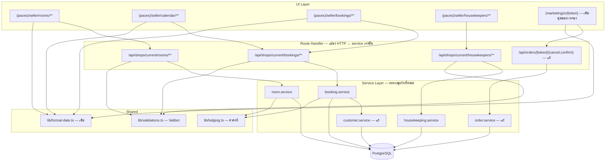
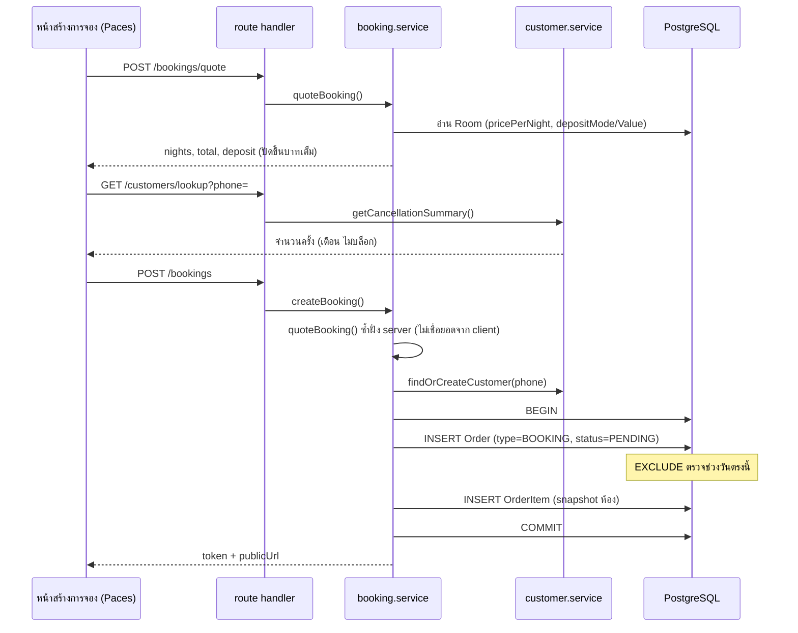
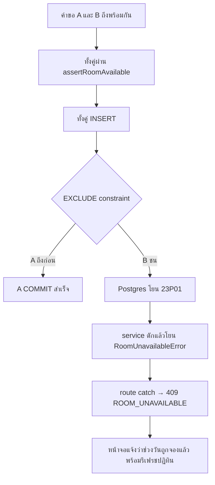

> **โมดูล:** 00017 — Lodging Vertical
> **ประเภทเอกสาร:** System Design Spec
> **เวอร์ชัน:** 0.1
> **วันที่จัดทำ:** 2026-07-22
> **สถานะ:** Draft

# SDS: ประเภทกิจการบ้านพักตากอากาศ

---

## 1. บทนำ & References

### 1.1 วัตถุประสงค์

ระบุการออกแบบระดับไฟล์และองค์ประกอบที่นักพัฒนานำไปลงมือได้ทันที — ไฟล์ไหนสร้างใหม่ ไฟล์ไหนแก้ ตรรกะอยู่ชั้นไหน หน้าจอ copy มาจากไฟล์ theme ไหน และการตัดสินใจทางเทคนิคใดถูกล็อกไว้แล้วพร้อมเหตุผล

### 1.2 ขอบเขตการออกแบบ

ครอบคลุม service layer, route handler, หน้าจอฝั่งเจ้าของ (Paces) และส่วนที่เพิ่มบนหน้าฝั่งผู้จอง (Vuexy) — **ไม่ครอบคลุม** สัญญา API (ดู [[API]]) และโครงสร้างตาราง (ดู [[DATABASE]])

### 1.3 เอกสารอ้างอิง

[[BRD]] (BR-LODG-01..40) · [[SRS]] (TFR-001..009) · [[API]] · [[DATABASE]] · `docs/system/ui-guideline/README.md` · `docs/system/ui-guideline/paces-component-reference.md` · `theme/paces/Docs/index.html`

---

## 2. Architecture Overview

### 2.1 มุมมองสถาปัตยกรรม

การออกแบบยึด layering เดิมของโครงการอย่างเคร่งครัด — **route ไม่มีตรรกะธุรกิจ, service ไม่รู้จัก HTTP**



### 2.2 มุมมองการ Deploy

ไม่มีการเปลี่ยนแปลงโครงสร้างการ deploy — ไม่มีบริการใหม่ ไม่มี cron ไม่มี env ใหม่ ไม่มี dependency ใหม่ (FullCalendar และ date-fns มีอยู่ใน `package.json` แล้ว)

---

## 3. Component Design

### 3.1 Service Layer

#### `src/services/room.service.ts` (ใหม่)

| ฟังก์ชัน | หน้าที่ | กฎที่บังคับ |
|---------|--------|------------|
| `listRooms(shopId, opts?)` | รายการห้อง กรอง `isActive` ได้ | — |
| `getRoom(shopId, roomId)` | รายละเอียด — **scope `shopId` ใน WHERE เสมอ** | ป้องกันข้ามร้าน (`feedback_rsc_dal_authz`) |
| `createRoom(shopId, data)` | สร้างห้อง | ตรวจ `vertical = LODGING`, รูป ≤ 10, ราคา > 0 |
| `updateRoom(shopId, roomId, data)` | แก้ไข / ปิดการใช้งาน | ห้ามแก้ `shopId` |
| `getPublicRooms(shopId)` | ห้องที่เปิดใช้งาน สำหรับโปรไฟล์สาธารณะ | คืนเฉพาะ field ที่แสดงต่อสาธารณะ |

🛑 **ทุกฟังก์ชันรับ `shopId` เป็นพารามิเตอร์แรกและใส่ใน `where` เสมอ** — ห้ามใช้รูปแบบ `findUnique(roomId)` แล้วค่อยเช็คความเป็นเจ้าของทีหลัง เพราะข้อมูลจะถูก serialize เข้า payload ไปแล้วก่อนถูกปฏิเสธ

#### `src/services/booking.service.ts` (ใหม่)

| ฟังก์ชัน | หน้าที่ |
|---------|--------|
| `quoteBooking(shopId, roomId, checkIn, checkOut)` | **แหล่งเดียวของสูตรคำนวณ** (TFR-002) — คืน nights/total/deposit |
| `createBooking(shopId, input)` | ธุรกรรมเดียว: `findOrCreateCustomer` → สร้าง `Order` + `OrderItem` → คืน token |
| `getAvailability(shopId, from, to, roomId?)` | ปฏิทิน — **query เดียว ห้าม N+1 ต่อห้อง** |
| `updateBooking(shopId, token, data)` | แก้มัดจำ/ช่วงวัน — ปฏิเสธถ้ามี `slipFileId` แล้ว |
| `confirmBooking(shopId, token)` | ยืนยันโดยเจ้าของ + recalc แบบ best-effort |
| `assertRoomAvailable(...)` | ตรวจก่อนบันทึกเพื่อ UX — **ไม่ใช่กลไกป้องกัน** |

**การจัดการ error ของ EXCLUDE constraint** (จุดที่พลาดง่ายที่สุด):

✅ **รูปร่าง error ยืนยันจากการทดลองจริงบนฐานข้อมูลแล้ว 2026-07-22** (spike รันใน transaction ที่ rollback + TEMP TABLE จึงไม่เหลือร่องรอยบน prod):

```jsonc
{
  "ctor": "PrismaClientKnownRequestError",
  "code": "P2010",                 // ← ไม่ใช่ P2002
  "meta": {
    "code": "23P01",               // ← SQLSTATE อยู่ตรงนี้
    "message": "ERROR: conflicting key value violates exclusion constraint \"Order_room_no_overlap\"\nDETAIL: Key (\"roomId\", daterange(...))=(room1, [2026-09-07,2026-09-09)) conflicts with existing key (...)=(room1, [2026-09-05,2026-09-08))."
  }
}
```

```ts
export class RoomUnavailableError extends Error {
  constructor(readonly conflict?: { from: string; to: string }) {
    super('ROOM_UNAVAILABLE'); this.name = 'RoomUnavailableError'
  }
}

/**
 * ต้องทนต่อรูปร่าง error หลายแบบ — รูปร่างข้างบนยืนยันจาก $executeRaw
 * แต่ model call (prisma.order.create) อาจถูกห่อเป็น PrismaClientUnknownRequestError
 * จึงเทียบทั้ง meta.code และข้อความ ไม่ผูกกับ class ใด class เดียว
 */
export function isExclusionViolation(err: unknown): boolean {
  const meta = (err as { meta?: { code?: string; message?: string } })?.meta
  if (meta?.code === '23P01') return true
  const text = `${meta?.message ?? ''} ${(err as Error)?.message ?? ''}`
  return /23P01|exclusion constraint/i.test(text)
}

/** ดึงช่วงวันที่ชนจาก DETAIL เพื่อบอกผู้ใช้ว่าติดวันไหน (API §5.2 {ช่วงที่ชน}) */
export function parseConflictRange(err: unknown) {
  const text = (err as { meta?: { message?: string } })?.meta?.message ?? ''
  const m = text.match(/conflicts with existing key[^[]*\[(\d{4}-\d{2}-\d{2}),(\d{4}-\d{2}-\d{2})\)/)
  return m ? { from: m[1], to: m[2] } : undefined
}
```

🛑 **และ route ต้องมี catch ที่ map `RoomUnavailableError` → 409** — service โยน error ใหม่โดยที่ route ไม่ได้ครอบ = ตกเป็น 500 (บทเรียนตรงจาก feature 00003)

#### 🛑 ข้อจำกัดสำคัญ: transaction ถูก poison หลัง constraint ยิง

**ค้นพบจาก spike รอบแรก** — เมื่อคำสั่งใดล้มกลาง transaction ของ Postgres **ทั้ง transaction จะใช้ต่อไม่ได้ทันที** ทุกคำสั่งถัดไปได้ `25P02 current transaction is aborted`

**ผลต่อการเขียนโค้ด:**

| รูปแบบ | ใช้ได้ไหม |
|--------|-----------|
| INSERT ชน → catch → โยน `RoomUnavailableError` ออกนอก transaction | ✅ ได้ — เป็นสิ่งที่ `createBooking` ทำอยู่แล้ว (ตั้งใจจะ abort อยู่แล้ว) |
| INSERT ชน → catch → **ลองห้องอื่น/วันอื่นต่อใน transaction เดิม** | ❌ **ไม่ได้** — transaction ตายไปแล้ว ต้องครอบด้วย `SAVEPOINT` + `ROLLBACK TO SAVEPOINT` |
| retry ทั้งก้อนหลัง 409 | ✅ ได้ ถ้าเริ่ม transaction ใหม่ทั้งหมด |

> เขียนไว้เพราะเป็นกับดักที่ผู้เขียนโค้ดคนถัดไปจะเจอแน่ถ้าพยายามใส่ logic "ลองอันถัดไป" ในธุรกรรมเดียว

#### `src/services/housekeeping.service.ts` (ใหม่)

`listHousekeepers` / `createHousekeeper` / `updateHousekeeper` / `assignHousekeeper(shopId, token, housekeeperId)` / `setHousekeepingStatus(shopId, token, status)`

- ทุกฟังก์ชัน scope ด้วย `shopId`
- `assignHousekeeper` ปฏิเสธเมื่อการจอง `CANCELLED`

#### `src/services/order.service.ts` (แก้ของเดิม)

```ts
// เดิม
export async function cancelOrder(publicToken: string, initiator: 'seller' | 'buyer')
// ใหม่ — พารามิเตอร์ที่ 3 optional เพื่อไม่ให้ผู้เรียกเดิมพัง
export async function cancelOrder(
  publicToken: string,
  initiator: 'seller' | 'buyer',
  reason?: CancelReason,
)
```

ตรรกะที่เพิ่ม (ทั้งหมดอยู่หลัง `assertTransition` เดิม):
- ถ้า `order.type === 'BOOKING'`:
  - `initiator === 'buyer'` → บังคับ `reason = 'BUYER_REQUESTED'`
  - `initiator === 'seller'` → `reason` ต้องมีและอยู่ใน 4 ค่า มิฉะนั้นโยน `CancelReasonRequiredError`
- ถ้าไม่ใช่การจอง → **ละเว้น `reason` และทำงานเหมือนเดิมทุกประการ** (zero-regression)

🛑 **ต้องตรวจด้วยการทดสอบว่า `restockFromCancelledOrder` ไม่ทำให้สต็อกเพี้ยนเมื่อยกเลิกการจอง** — `OrderItem` ของการจองมี `stockDeducted = NULL` จึงควรไม่มีผล แต่ต้องยืนยันด้วยเทสจริง ไม่ใช่สันนิษฐานจากการอ่านโค้ด (`feedback_verify_dont_assume`)

#### `src/services/customer.service.ts` (แก้ของเดิม)

เพิ่ม `getCancellationSummary(customerId)` — คำนวณสด (ดู [[DATABASE]] §3.5)

🛑 คืนเฉพาะจำนวนครั้งแยกตามเหตุผล ห้ามคืน `shopId`/วันที่/`publicToken` ของร้านอื่น

#### `src/lib/lodging.ts` (ใหม่)

```ts
export const SHOP_VERTICALS = { GENERAL: 'สินค้าและบริการ', LODGING: 'บ้านพักตากอากาศ' } as const
export const ROOM_FACILITIES = { pool: 'สระว่ายน้ำ', aircon: 'เครื่องปรับอากาศ', /* ... */ } as const
export const CANCEL_REASONS = {
  BUYER_NO_TRANSFER: { label: 'ผู้จองไม่โอน', countsAgainstGuest: true },
  BUYER_REQUESTED:   { label: 'ผู้จองขอยกเลิก', countsAgainstGuest: true },
  SHOP_ISSUE:        { label: 'ห้องมีปัญหา / เหตุผลของร้าน', countsAgainstGuest: false },
  MUTUAL:            { label: 'ตกลงกันได้', countsAgainstGuest: false },
} as const
export const MAX_ROOM_IMAGES = 10
```

> `countsAgainstGuest` เป็น flag เดียวที่ตัดสินว่านับประวัติหรือไม่ (BR-LODG-37) — ห้ามกระจายเงื่อนไขนี้ไปเขียนซ้ำที่อื่น

### 3.2 UI Layer — Theme Source Mapping (Hard Rule 1/3/8)

🛑 **ทุกหน้าต้องเริ่มจากการ copy ไฟล์ theme ที่ระบุ แล้วปรับเนื้อหา — ห้ามประกอบเอง** และ commit ต้องมีบรรทัด `Base:` ชี้ไฟล์ที่ copy มา

🛑 **ต้องผ่าน `safepay-ux` ออก Design Spec ก่อนลงมือทุกหน้า** (Hard Rule 8) — ตารางนี้เป็นแหล่งที่มา ไม่ใช่ตัวแทน Design Spec

#### ฝั่งเจ้าของ — Paces (`src/app/(paces)/seller/(dashboard)/**`)

| หน้า/องค์ประกอบ | Theme source |
|-----------------|--------------|
| รายการห้องพัก | `theme/paces/Admin/TS/src/app/(admin)/apps/ecommerce/customers/components/CustomerTable.tsx` (โครงตาราง + toolbar) |
| ฟอร์มสร้าง/แก้ห้อง | `theme/paces/Admin/TS/src/app/(admin)/apps/ecommerce/settings/page.tsx` (field group) — chase ผ่าน `src/app/(paces)/seller/(dashboard)/shop/components/ShopForm.tsx` ที่ใช้ pattern เดียวกันอยู่แล้ว |
| อัปโหลดรูปห้อง | `src/components/FileUploader.tsx` (ของโปรเจกต์เอง — ใช้อยู่แล้วใน verification/slip) |
| **ปฏิทินว่าง/ไม่ว่าง** | `theme/paces/Admin/TS/src/app/(admin)/apps/calendar/components/CalendarPage.tsx` — **FullCalendar `dayGridPlugin` มีใน `package.json` แล้ว ไม่ต้องเพิ่ม dependency** |
| ฟอร์มสร้างการจอง | chase ผ่าน `src/app/(paces)/seller/(dashboard)/orders/new/**` (POS form ที่มีอยู่) เพื่อความสม่ำเสมอกับการสร้างออเดอร์เดิม |
| การ์ดรายการจอง | chase ผ่าน `src/app/(paces)/seller/(dashboard)/orders/components/**` (การ์ดออเดอร์ v11) |
| หน้ารายละเอียดการจอง + ตรวจสลิป | chase ผ่าน `src/app/(paces)/seller/(dashboard)/orders/[token]/**` |
| รายชื่อแม่บ้าน | `theme/paces/Admin/TS/src/app/(admin)/apps/ecommerce/customers/components/CustomerTable.tsx` |
| dropdown กรอง | `src/components/safepay/FilterDropdown.tsx` — **ห้ามใช้ Preline `hs-dropdown` ดิบบนหน้าที่ re-render** (บั๊ก opacity ค้าง) |

**กฎ UI ที่ต้องเคารพในทุกหน้าฝั่ง Paces:**
- ประกอบจาก Paces primitive เท่านั้น (`.card` / `btn` / `badge` / `text-default-*` / `size-*`) — **ห้าม arbitrary value** เช่น `text-[14px]`, `bg-[rgba()]`, hardcode hex (Hard Rule 7)
- primary ของหลังบ้าน = **น้ำเงิน `bg-primary`** ไม่ใช่ม่วง `#7367F0` (นั่นของฝั่งผู้ซื้อ/Vuexy)
- toast ใช้ `pacesToast` เท่านั้น — **ห้าม `react-toastify` ใน `(paces)`** (Hard Rule 9)
- dialog ยืนยัน (ยกเลิกการจอง, ปิดการใช้งานห้อง) ใช้ **Sweet Alerts** ไม่ใช่ toast
- **ห้าม emoji** ทุกจุด ใช้ icon จริงจาก `@iconify/react` (tabler) — จุดที่ควรมี icon แต่ Design Spec ไม่ระบุตัว **ต้องถามผู้ใช้ก่อน ห้ามเดา** (Hard Rule 12)
- วันที่ใช้ `formatDate`/`formatDateTime` จาก `src/lib/format-date.ts` — ห้ามเรียก `toLocaleDateString` เอง
- ทุกหน้าต้องใช้ได้จริงบนมือถือ ปุ่มแตะได้ ≥ 44px

#### ข้อความและน้ำเสียง — Impeccable "The Trusted Counter"

🛑 **อ่าน `.impeccable/design.json` + `DESIGN.md` ก่อนเขียนข้อความทุกครั้ง** (ข้อกำหนดเดิมของโครงการ: งาน UI ทุกชิ้นยึด Impeccable) หลักที่กระทบฟีเจอร์นี้มากที่สุด:

| หลัก | ใช้กับอะไรในฟีเจอร์นี้ |
|------|------------------------|
| **อย่าเย็นชาแบบองค์กร/ธนาคาร** (don't ข้อ 2) | เลี่ยง "ไม่สามารถ...ได้" / "คุณไม่มีสิทธิ์" — เขียนว่าเกิดอะไรและทำอะไรต่อได้ |
| **อย่าใช้ copy ไฮป์** (don't ข้อ 3) | ยืนยันการจองสำเร็จให้บอกตรง ๆ ไม่ต้อง "เยี่ยมมาก!" |
| **Verified-Means-Green** | เขียว `#28C76F` ใช้กับ **ยืนยันแล้ว/สำเร็จ** เท่านั้น — 🛑 **การจองที่รอโอนต้องไม่เป็นสีเขียว** ใช้ warning/neutral |
| **Sentence case** | ปุ่มและ label ทุกตัว — ห้าม ALL CAPS |
| **One Voice (ม่วง ≤10%)** | ใช้กับฝั่งผู้จอง (Vuexy) เท่านั้น — ฝั่งเจ้าของเป็น Paces น้ำเงิน |
| **เป็นกลางกับบุคคลที่สาม** | คำเตือนประวัติการยกเลิกต้องเป็นข้อเท็จจริง ไม่ตัดสินผู้จอง |

**ตัวอย่างการใช้สีสถานะที่ต้องไม่พลาด:**

| สถานะการจอง | สี | เหตุผล |
|-------------|-----|--------|
| รอผู้จองโอน / รอตรวจสลิป | warning (เหลือง/ส้ม) | **ยังไม่ยืนยัน — ห้ามเขียว** |
| ยืนยันแล้ว (ใบจอง) | success เขียว `#28C76F` | ยืนยันแล้วจริง ตรงนิยาม Verified-Means-Green |
| ยกเลิก | error/neutral | — |

ข้อความ error ฉบับเต็มพร้อมหลักการเขียนอยู่ใน [[API]] §5.1–5.2 — **ห้ามเขียนข้อความใหม่นอกตารางนั้นโดยไม่อัปเดตเอกสาร**

#### ฝั่งผู้จอง — Vuexy (`src/app/(marketing)/o/[token]/**`)

หน้าเดิมถูก**ขยาย** ไม่ใช่สร้างใหม่ — เพิ่มมุมมองเฉพาะเมื่อ `order.type === 'BOOKING'`:

| ส่วน | การออกแบบ |
|------|-----------|
| การ์ดรายละเอียดการเข้าพัก | ห้อง, วันเข้าพัก-เช็คเอาท์, จำนวนคืน, ยอดรวม, **ยอดมัดจำที่ต้องโอน**, ยอดคงเหลือ |
| ส่วนแนบสลิป | ใช้ของเดิมใน `OrderDetailMobile.tsx` — **ซ่อนทั้งส่วนเมื่อ `depositAmount = 0`** (BR-LODG-17) |
| ใบจอง | แสดงเมื่อ `status = CONFIRMED` — รหัสอ้างอิง + สถานะยืนยันแล้ว |
| สถานะยกเลิก | ต้องเด่นชัดจนไม่มีทางเข้าใจผิดว่าเป็นใบจองที่ใช้ได้ (BR-LODG-22) |

🛑 **ข้อมูลที่ห้ามส่งข้ามมาฝั่งนี้เด็ดขาด:** `Housekeeper.name/phone`, `Order.internalNote`, ประวัติการยกเลิกของลูกค้า — ต้องตัดออกที่ server component ก่อน serialize ไม่ใช่แค่ไม่แสดงผล (`feedback_rsc_pii_neutralize_at_source`)

---

## 4. Data Flow

### 4.1 Flow หลัก: สร้างการจองจนถึงยืนยัน



🛑 **จุดสำคัญ:** `createBooking` ต้องเรียก `quoteBooking` ซ้ำที่ฝั่ง server — **ห้ามเชื่อยอด `totalAmount`/`depositAmount` ที่ client ส่งมา** ยกเว้น `depositAmount` ที่เจ้าของตั้งใจ override ซึ่งต้องผ่านการตรวจ `0 ≤ x ≤ totalAmount` ที่ server

### 4.2 Flow กรณีล้มเหลว: กดสร้างพร้อมกัน



> `assertRoomAvailable` ผ่านทั้งคู่เป็นเรื่องปกติและยอมรับได้ — มันมีไว้เพื่อแจ้งผู้ใช้เร็วในกรณีทั่วไป **ไม่ใช่กลไกป้องกัน** ตัวที่ป้องกันจริงคือ constraint

---

## 5. Integration Points

| จุดเชื่อม | รายละเอียด | ความเสี่ยง |
|-----------|-----------|-----------|
| `Order.type` | เพิ่มค่า `'BOOKING'` | 🛑 **สูงสุด** — ต้อง grep ทุกจุดที่อ่าน/กรอง `type` แล้วตัดสินใจอย่างชัดแจ้ง (ดู §6 TD-004) |
| `/api/orders/[token]/confirm` | เพิ่ม guard ปฏิเสธการจอง | ถ้าลืม = ผู้จองยืนยันเองได้โดยไม่ต้องโอน |
| `/api/orders/[token]/cancel` | เพิ่มพารามิเตอร์ `reason` | ต้องไม่กระทบผู้เรียกเดิม |
| `findOrCreateCustomer` | ใช้ซ้ำจาก feature 00014 | ต้อง normalize เบอร์ด้วย `lib/phone.ts` ก่อนเสมอ |
| Access Gate (feature 00015) | ใช้ซ้ำทั้งชุด | ห้ามสร้างทางเข้าแบบไม่ต้องเข้าสู่ระบบใหม่ |
| `restockFromCancelledOrder` | ถูกเรียกตอนยกเลิก | ต้องทดสอบว่าไม่กระทบสต็อกสินค้า |
| Trust Score / Badge recalc | เรียกหลังยืนยัน | best-effort — ห้ามให้ล้มแล้วทำให้การยืนยันล้มตาม |
| เมนู `_seller-menu.ts` | กรองตาม `vertical` | ต้องมีการตรวจสิทธิ์จริงคู่กัน ไม่ใช่ซ่อนอย่างเดียว |

---

## 6. Technical Decisions

### TD-001: การจองเป็น `Order` ไม่ใช่ตารางแยก

**ตัดสินใจ:** ใช้ `Order.type = 'BOOKING'` + คอลัมน์ nullable

**เหตุผล:** ได้ `publicToken`, `shortCode`, `slipFileId`, `customerId`, `review`, Trust Score, ประวัติออเดอร์ และ Access Gate ของ feature 00015 มาใช้ซ้ำทั้งหมด การสร้างตารางแยกต้องทำซ้ำทุกอย่างและจะค่อย ๆ เบี่ยงออกจากกันตามเวลา

**ต้นทุนที่ยอมรับ:** `Order` มีคอลัมน์ที่ใช้เฉพาะการจอง 7 ตัวซึ่งเป็น NULL สำหรับออเดอร์ทั่วไป และต้องกวาดทุกจุดที่อ่าน `type`

### TD-002: กันจองทับด้วย EXCLUDE constraint ไม่ใช่ตรรกะในแอป

**ตัดสินใจ:** `EXCLUDE USING gist (roomId WITH =, daterange(checkIn, checkOut, '[)') WITH &&) WHERE (roomId IS NOT NULL AND status <> 'CANCELLED')`

**ทางเลือกที่ไม่เลือก:**
- *ตรวจก่อนบันทึกอย่างเดียว* — มีช่องว่างระหว่างตรวจกับเขียน ผู้ใช้จริงกดพร้อมกันได้
- *ล็อกแถว `Room` ด้วย `SELECT ... FOR UPDATE`* — ใช้ได้แต่พึ่งพาวินัยของโค้ดทุกเส้นทางที่เขียน `Order` ถ้ามีเส้นทางใหม่ที่ลืมล็อกก็พังเงียบ

**เหตุผล:** constraint บังคับที่ฐานข้อมูลจึงป้องกันได้แม้มีเส้นทางเขียนใหม่ที่ยังไม่มีใครนึกถึง และ `'[)'` ให้พฤติกรรมวันเช็คเอาท์ตรงกับ BR-LODG-31 พอดีโดยไม่ต้องเขียนตรรกะเพิ่ม

**ต้นทุน:** เป็น unmanaged SQL → ห้าม `db pull` ตลอดไป + ต้องดัก `23P01` เอง + พึ่ง extension `btree_gist` (ต้องยืนยันว่าเปิดได้บน Supabase ก่อนเริ่ม P2)

### TD-003: `depositAmount` เก็บเป็นยอดสุทธิ ไม่ใช่สูตรอ้างอิง

**ตัดสินใจ:** เก็บยอดที่คำนวณเสร็จแล้วบน `Order`

**เหตุผล:** ถ้าอ้างอิง `Room.depositMode/Value` ยอดของการจองเก่าจะขยับเองเมื่อเจ้าของแก้ค่าเริ่มต้นของห้อง ซึ่งขัด BR-LODG-18 ที่ห้ามเปลี่ยนเงื่อนไขย้อนหลัง — และทำให้ตรวจย้อนหลังไม่ได้ว่าผู้จองถูกเรียกเก็บเท่าไร

### TD-004: การเพิ่มค่าใน `Order.type` ต้องกวาดด้วยมือ

**ตัดสินใจ:** ก่อนปิด P2 ต้อง grep และตัดสินใจอย่างชัดแจ้งทุกจุดที่อ่าน `order.type` หรือ list ออเดอร์

**เหตุผล:** `type` เป็น `String` ไม่ใช่ enum — ตัวตรวจชนิดข้อมูลจะไม่เตือนเลยเมื่อมีค่าใหม่ หน้าจอเดิมของฝั่งสินค้าอาจแสดงการจองปนเข้ามาโดยไม่มีใครรู้จนผู้ใช้ทัก

**วิธีตรวจ:** ต้องมองหา **"ไฟล์ที่ควรแก้แต่ยังไม่ได้แก้"** ไม่ใช่แค่ตรวจไฟล์ที่แก้ไปแล้ว — เป็นการตรวจเชิงลบ (`feedback_service_error_route_mapping`)

**รายการที่ต้องตรวจอย่างน้อย:** หน้ารายการออเดอร์ seller, แดชบอร์ด seller, แดชบอร์ดแอดมิน, สรุปยอดขาย, `order-display.ts`, badge service, `/api/app/*` (แอปผู้ซื้อ)

### TD-005: ไม่เก็บตัวนับการยกเลิกแบบ denormalized

**ตัดสินใจ:** คำนวณสดจาก `Order` ทุกครั้ง

**เหตุผล:** counter ที่พลาดแม้ครั้งเดียวจะเพี้ยนถาวร และตัวเลขนี้ถูกใช้ตัดสินใจทางธุรกิจจึงต้องถูกเสมอ ปริมาณข้อมูลต่อลูกค้าอยู่ระดับหลักสิบซึ่งเบามาก

**ต่างจาก** `Shop.chatResponseRate` ที่ denormalize เพราะคำนวณหนักและใช้ cron รายวัน — เคสนี้ไม่เข้าเงื่อนไขนั้น

### TD-006: ปฏิทินใช้ FullCalendar จาก Paces theme

**ตัดสินใจ:** copy จาก `apps/calendar/components/CalendarPage.tsx` ใช้ `dayGridPlugin`

**เหตุผล:** เป็นไฟล์ theme ที่มีอยู่ (Hard Rule 1) และ `@fullcalendar/*` อยู่ใน `package.json` แล้ว จึงไม่ต้องเพิ่ม dependency และได้หน้าตาที่กลืนกับหลังบ้านทันที

**ปรับจาก theme:** ตัด drag-drop และ external events ออก (การย้ายการจองด้วยการลากอยู่นอกขอบเขต), แสดงช่วงเป็น event แบบ `[checkIn, checkOut)`

---

## 7. Traceability

| BR / TFR | ออกแบบไว้ที่ |
|----------|--------------|
| BR-LODG-02/03 · TFR-001 | §3.1 ตรวจ vertical ทั้ง route และ page |
| BR-LODG-05/06/07/34 | §3.1 `room.service` |
| BR-LODG-08 · TD-001 | §6 TD-001 |
| BR-LODG-09/10/11/13/31 · TFR-004/005 | §6 TD-002, §4.2 |
| BR-LODG-12 | §3.1 `order.service`, §3.2 Sweet Alerts |
| BR-LODG-14/15/16/35 · TFR-002 | §3.1 `quoteBooking` |
| BR-LODG-17 | §3.2 ซ่อนส่วนแนบสลิปเมื่อมัดจำ 0 |
| BR-LODG-18 · TD-003 | §6 TD-003, `updateBooking` |
| BR-LODG-21/22 | §3.2 ฝั่งผู้จอง |
| BR-LODG-23/24/25/26 | §3.1 `housekeeping.service`, §3.2 ข้อห้าม PII |
| BR-LODG-27 · TD-004 | §6 TD-004 |
| BR-LODG-29/38/39 · TD-005 | §6 TD-005, §3.1 `customer.service` |
| BR-LODG-30 | §3.1 service แก้ข้อมูลร้านไม่รับ `vertical` |
| BR-LODG-36/37 | §3.1 `lib/lodging.ts` flag `countsAgainstGuest` |
| BR-LODG-40 · TFR-006 | §5 Access Gate + guard บน `/confirm` |

---

## 8. สรุป

การออกแบบเพิ่ม **3 service ใหม่, 1 lib ค่าคงที่, 13 route handler** และแก้ของเดิมเพียง **2 service กับ 2 route** — ขอบเขตแคบเพราะทุกอย่างที่ทำได้ด้วยของเดิมถูกใช้ซ้ำหมดแล้ว

การตัดสินใจที่มีผลยาวที่สุดคือ **TD-002 (EXCLUDE constraint)** ซึ่งย้ายการรับประกันความถูกต้องจากวินัยของโค้ดไปอยู่ที่ฐานข้อมูล แลกกับการที่ Prisma มองไม่เห็นและต้องดัก error เอง

จุดที่พลาดง่ายที่สุดและต้องมี test ครอบทั้งคู่คือ **TD-004 (ค่าใหม่ใน `Order.type` หลุดเข้าหน้าจอเดิม)** และ **guard บน `/confirm`** ซึ่งถ้าลืมจะกลายเป็นช่องให้ผู้จองยืนยันการจองของตัวเองโดยไม่ต้องโอนเงิน
