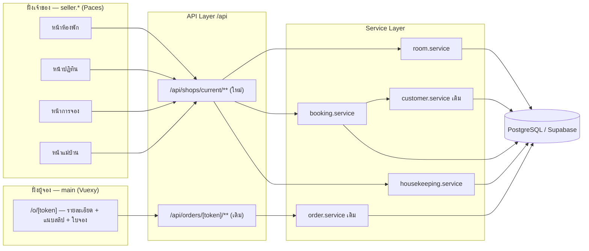

> **โมดูล:** 00017 — Lodging Vertical
> **ประเภทเอกสาร:** Software Requirements Specification (Technical)
> **เวอร์ชัน:** 0.1
> **วันที่จัดทำ:** 2026-07-22
> **สถานะ:** Implemented — deployed prod 2026-07-23 (migration M1+M2+M3 applied)

# SRS: ประเภทกิจการบ้านพักตากอากาศ (Technical)

---

## 1. บทนำ (Introduction)

### 1.1 วัตถุประสงค์ของเอกสาร

แปลงความต้องการทางธุรกิจใน [[BRD]] (FR-LODG-01..22, BR-LODG-01..40) ให้เป็นข้อกำหนดเชิงเทคนิคที่นักพัฒนานำไปสร้างได้โดยไม่ต้องตีความเอง พร้อมระบุข้อจำกัดของระบบเดิมที่ต้องเคารพ

### 1.2 ขอบเขตเชิงระบบ (System Scope)

**อยู่ในขอบเขต:**
- คอลัมน์ `Shop.vertical` + การแยกเมนู/สิทธิ์เข้าถึงตามประเภทกิจการ
- โดเมนใหม่: ห้องพัก (`Room`), การจอง (`Order` ที่ `type = 'BOOKING'`), แม่บ้าน (`Housekeeper`)
- การกันจองทับที่ระดับฐานข้อมูล
- การขยาย `/api/orders/[token]/cancel` ให้รับเหตุผล และ guard บน `/confirm`

**นอกขอบเขต:** ตามที่ระบุใน [[PRD]] §5 — ไม่มีช่องทางชำระเงินจริง, ไม่มีการจองด้วยตนเองจากหน้าสาธารณะ, ไม่แตะระบบสิทธิ์ผู้ใช้ (RBAC), ไม่เชื่อมต่อ OTA

### 1.3 เอกสารอ้างอิง (References)

| เอกสาร | ใช้อ้างอิงเรื่อง |
|--------|------------------|
| [[PRD]] / [[BRD]] | ความต้องการและกฎธุรกิจ (BR-LODG-01..40, D-01..D-09) |
| [[API]] | สัญญา endpoint ฉบับเต็ม — **เอกสารนี้ไม่ทำซ้ำ อ้างอิงเท่านั้น** |
| [[DATABASE]] | โครงสร้างตาราง, constraint, migration plan |
| `docs/SRS.md` | data model กลาง, state machine ของ Order, authorization matrix |
| feature 00015 | Access Gate บังคับเข้าสู่ระบบบน `/o/[token]` |
| feature 00014 | `Customer` (phone-unique global) และหลักความเป็นส่วนตัว |
| feature 00008 | Business Profile + precedent การใช้ unmanaged SQL constraint |
| `docs/conventions/prisma-shared-db-drift.md` | ข้อห้าม `migrate dev` / `db pull` |
| `docs/conventions/paces-toast.md`, `paces-charts-source.md`, `no-emoji-use-icons.md` | กฎ UI ฝั่ง seller |

### 1.4 นิยามและตัวย่อ

| คำ | ความหมายเชิงเทคนิค |
|----|---------------------|
| **vertical** | `Shop.vertical` — `'GENERAL'` \| `'LODGING'` |
| **การจอง** | แถวใน `Order` ที่ `type = 'BOOKING'` — ไม่ใช่ตารางแยก |
| **ช่วงกันคิว** | `daterange(checkIn, checkOut, '[)')` — รวมวันเข้าพัก ไม่รวมวันเช็คเอาท์ |
| **EXCLUDE constraint** | ข้อจำกัดระดับ Postgres ที่ห้ามสองแถวมีช่วงวันทับกันบนห้องเดียวกัน |
| **Access Gate** | ตรรกะบังคับเข้าสู่ระบบ + ผูก `buyerUserId` ของหน้า `/o/[token]` (feature 00015) |

---

## 2. ภาพรวมสถาปัตยกรรม (Architecture Overview)

### 2.1 บริบทระบบ (System Context)



### 2.2 องค์ประกอบหลัก (Components)

| องค์ประกอบ | ที่อยู่ | หน้าที่ | ใหม่/เดิม |
|-----------|--------|--------|-----------|
| `room.service` | `src/services/room.service.ts` | CRUD ห้องพัก, ตรวจ vertical, จำกัดจำนวนรูป | ใหม่ |
| `booking.service` | `src/services/booking.service.ts` | คำนวณยอด/มัดจำ, สร้างการจอง, ปฏิทิน, ยืนยัน, ดัก EXCLUDE | ใหม่ |
| `housekeeping.service` | `src/services/housekeeping.service.ts` | รายชื่อแม่บ้าน, มอบหมาย, สถานะงาน | ใหม่ |
| `order.service` | `src/services/order.service.ts` | `cancelOrder` — ขยายให้รับเหตุผล | **แก้ของเดิม** |
| `customer.service` | `src/services/customer.service.ts` | `findOrCreateCustomer` + สรุปประวัติการยกเลิก | **แก้ของเดิม** |
| `lib/lodging.ts` | `src/lib/lodging.ts` | ค่าคงที่ facilities, cancel reason, vertical | ใหม่ |
| `lib/validations.ts` | เดิม | Valibot schema ของ endpoint ใหม่ | **แก้ของเดิม** |

### 2.3 มุมมองการ Deploy

ไม่มีบริการใหม่ ไม่มี worker ใหม่ ไม่มี cron — ทุกอย่างอยู่ใน Next.js app เดิมบน Vercel และ Postgres เดิมบน Supabase

> **ผลจาก D-04 (ล็อกคิวทันที ไม่มี auto-expire):** ไม่ต้องมีงานเบื้องหลังคอยปล่อยคิว จึงไม่ต้องเพิ่ม cron และไม่ต้องตั้ง `CRON_SECRET` ใหม่ (ต่างจาก feature 00003 ที่ต้องมี)

---

## 3. ข้อกำหนดเชิงฟังก์ชันเชิงเทคนิค (TFR)

### TFR-001: การแยกความสามารถตามประเภทกิจการ

- `Shop.vertical` เป็น `String` default `'GENERAL'` (ดู [[DATABASE]] §3.1)
- ทุก endpoint ใต้ `/api/shops/current/{rooms,bookings,housekeepers}` ต้องตรวจ `shop.vertical === 'LODGING'` **ก่อน** ตรรกะอื่น → ไม่ผ่านคืน `403 NOT_LODGING_SHOP`
- เมนูฝั่ง seller (`_seller-menu.ts`) กรองรายการตาม `vertical` ของร้านที่ active
- 🛑 **การซ่อนเมนูไม่ใช่การควบคุมสิทธิ์** (BR-LODG-03) — ต้องมีการตรวจที่ทั้ง route handler และ page-level server component
- `vertical` เขียนได้ครั้งเดียวตอนสร้างธุรกิจ — service ที่แก้ข้อมูลร้านต้องไม่รับ field นี้เลย (BR-LODG-30)

**เกณฑ์ผ่าน:** ร้าน `GENERAL` เรียก endpoint ของบ้านพักได้ `403`; เข้าหน้า `/rooms` ตรง ๆ ถูกปฏิเสธ ไม่ใช่แค่ไม่เห็นเมนู

### TFR-002: สูตรคำนวณยอดและมัดจำ — แหล่งเดียว

```ts
// src/services/booking.service.ts — ห้ามมีสำเนาที่อื่น
nights        = differenceInCalendarDays(checkOut, checkIn)
totalAmount   = pricePerNight * nights
depositAmount = mode === 'FIXED'
                  ? value
                  : ceil(totalAmount * value / 100)   // ปัดขึ้นบาทเต็ม (BR-LODG-35)
```

- ทั้ง `POST /bookings/quote` และ `POST /bookings` เรียกฟังก์ชันเดียวกัน
- 🛑 **ห้ามคำนวณซ้ำที่ฝั่ง client** — ยอดที่ผู้จองเห็นต้องมาจาก server เสมอ มิฉะนั้นยอดที่แสดงกับที่บันทึกอาจต่างกัน
- ใช้ `Prisma.Decimal` ตลอดสายการคำนวณ ห้ามแปลงเป็น `number` ระหว่างทาง (ความคลาดเคลื่อนทศนิยม)
- แปลงเป็น string ด้วย `.toFixed(2)` **เฉพาะตอนส่งออก JSON/RSC boundary**

**เกณฑ์ผ่าน:** 1,999 × 1 คืน มัดจำ 30% → `600` (จาก 599.70) ทุกเส้นทางที่เรียก

### TFR-003: การบังคับ vertical บนการสร้าง Business

- `POST /api/business/shops` รับ field `vertical` เพิ่ม (optional, default `'GENERAL'`)
- Valibot schema เดิม `CreateBusinessShopSchema` ขยายด้วย `vertical: 'GENERAL' | 'LODGING'`
- ป้ายชื่อในหน้าจอ: ช่องใหม่ = **"ประเภทกิจการ"**, ช่อง `businessType` เดิมเปลี่ยนป้ายเป็น **"ประเภทผู้ประกอบการ"** (BR-LODG-04) — **เปลี่ยนเฉพาะข้อความ ห้ามเปลี่ยนชื่อ field หรือค่าที่ส่ง**

### TFR-004: การล็อกคิวและช่วงวัน

- ช่วงกันคิว = `[checkIn, checkOut)` — วันเช็คเอาท์ว่าง (BR-LODG-31)
- ล็อกทันทีที่สร้าง ไม่ผูกกับสถานะการชำระเงิน (BR-LODG-09)
- ไม่มีกลไกปล่อยคิวอัตโนมัติ (BR-LODG-10)
- `checkIn`/`checkOut` เก็บเป็น `DATE` (วันล้วน) — ห้ามใช้ `DateTime` เต็ม เพราะจะเกิดปัญหาเลื่อนวันข้าม timezone

### TFR-005: การกันจองทับ — ต้องบังคับที่ฐานข้อมูล

- ใช้ EXCLUDE constraint `Order_room_no_overlap` (ดู [[DATABASE]] §4.2)
- การตรวจก่อนบันทึกที่ระดับแอปทำได้เพื่อ **ประสบการณ์ผู้ใช้** (แจ้งเร็ว) แต่ **ไม่ใช่กลไกป้องกัน** — มีช่องว่างระหว่างตรวจกับเขียนเสมอ
- ✅ **ยืนยันจากการทดลองจริง 2026-07-22** (ดู [[DATABASE]] §4.2.1): Prisma โยน `PrismaClientKnownRequestError` ที่ `code = 'P2010'` และ **`meta.code = '23P01'`** — **ไม่ใช่ `P2002`** service ต้องตรวจ `meta.code` หรือข้อความ ไม่ใช่ `err.code === 'P2002'`
- `meta.message` มีช่วงวันที่ชนติดมาด้วย → ใช้บอกผู้ใช้ได้ว่าติดวันไหน
- 🛑 **transaction ถูก poison หลัง constraint ยิง** (`25P02`) — catch แล้วทำต่อในธุรกรรมเดิมไม่ได้ ต้องใช้ `SAVEPOINT` หรือเริ่มใหม่
- 🛑 **route ต้องมี catch ที่ map `RoomUnavailableError` → `409`** มิฉะนั้นจะตกเป็น 500 (บทเรียนตรงจาก feature 00003 ที่ `OutOfStockError` กลายเป็น 500 เพราะ route ไม่ได้ครอบ — `feedback_service_error_route_mapping`)

**เกณฑ์ผ่าน:** ยิงคำขอสร้างการจองช่วงวันเดียวกันพร้อมกัน 2 ชุด → สำเร็จ 1, ได้ `409` 1, ในฐานข้อมูลมีแถวเดียว

### TFR-006: การยืนยันการจอง — แยกจากการยืนยันของผู้ซื้อ

- 🛑 **`POST /api/orders/[token]/confirm` ต้องเพิ่ม guard ปฏิเสธเมื่อ `order.type === 'BOOKING'`** → `403 BOOKING_CONFIRM_VIA_SHOP`
- **เหตุผลเชิงความปลอดภัย:** route เดิมอนุญาตให้ `buyerUserId` เป็นผู้ยืนยัน ถ้าไม่กัน ผู้จองจะกดยืนยันการจองของตัวเองได้โดยไม่ต้องโอนเงิน ทำให้ `status` ไปถึง `CONFIRMED` และได้ใบจองฟรี
- การยืนยันการจองทำผ่าน `POST /api/shops/current/bookings/[token]/confirm` เท่านั้น (ผู้กด = สมาชิกร้าน)
- ถ้า `depositAmount > 0` ต้องมี `slipFileId` ก่อน → ไม่มีคืน `409 SLIP_REQUIRED`
- ใช้ `assertTransition` เดิม (`PENDING → CONFIRMED`) ไม่สร้าง state machine ใหม่ (BR-LODG-32)

### TFR-007: การยกเลิกและเหตุผล

- ขยาย `cancelOrder(publicToken, initiator, reason?)` — พารามิเตอร์ใหม่ optional เพื่อไม่ให้ผู้เรียกเดิมพัง
- กติกา (ดู [[API]] §4.8): เจ้าของยกเลิกการจอง → `reason` บังคับ; ผู้จองยกเลิกเอง → ระบบตั้ง `BUYER_REQUESTED`; ออเดอร์ที่ไม่ใช่การจอง → พฤติกรรมเดิมทุกประการ
- `cancelInitiator` ยัง derive จาก session เหมือนเดิม **ห้ามรับจาก body**
- 🛑 `restockFromCancelledOrder` ถูกเรียกใน `cancelOrder` เดิม — การจองไม่มีสินค้าจริง ต้องตรวจว่าเรียกกับ `OrderItem` ของการจองแล้วไม่ทำให้สต็อกเพี้ยน (`stockDeducted` จะเป็น `NULL` จึงควรไม่มีผล แต่**ต้องยืนยันด้วยการทดสอบ** ไม่ใช่สันนิษฐาน)

### TFR-008: ประวัติการยกเลิกของผู้จอง

- คำนวณสดจาก `Order` ไม่มี counter (ดู [[DATABASE]] §3.5)
- คืนเฉพาะจำนวนครั้งแยกตามเหตุผล — 🛑 ห้ามคืน `shopId`/วันที่/`publicToken` ของร้านอื่น (BR-LODG-39)
- `name` คืนได้เฉพาะเมื่อลูกค้ารายนี้เคยมีออเดอร์กับ **ร้านที่เรียก** เท่านั้น
- ผลลัพธ์ใช้แสดงคำเตือน **ห้ามใช้บล็อก** การสร้างการจอง

### TFR-009: ความสมบูรณ์ของข้อมูลการจอง

- ทุกการจองต้องมี `roomId`, `checkIn`, `checkOut`, `customerId` ครบ (บังคับด้วย CHECK + validation)
- `guestPhone` เป็น required เสมอ (ต่างจากออเดอร์ทั่วไปในอดีต) เพื่อให้ผูก `Customer` ได้ — สอดคล้องกับ feature 00015 ที่บังคับเบอร์ตอนสร้างออเดอร์อยู่แล้ว
- สร้าง `OrderItem` 1 แถวเป็น snapshot ของห้อง เพื่อให้หน้าสรุปยอดและหน้าออเดอร์เดิมทำงานได้โดยไม่ต้องแก้

---

## 4. ข้อกำหนดส่วนต่อประสาน (Interface Specification)

สัญญาฉบับเต็มอยู่ใน **[[API]]** — เอกสารนี้ไม่ทำซ้ำเพื่อไม่ให้เกิดความไม่ตรงกันระหว่างเอกสาร

**สรุป:** 13 endpoint ใหม่ใต้ `/api/shops/current/**`, 0 endpoint ใหม่ฝั่งผู้จอง, 2 endpoint เดิมถูกแก้ (`/orders/[token]/cancel` ขยาย, `/orders/[token]/confirm` เพิ่ม guard)

**Events / Messaging:** ไม่มี — ฟีเจอร์นี้ไม่ใช้ realtime broadcast, ไม่ใช้ queue, ไม่ใช้ webhook

---

## 5. ข้อกำหนดด้านข้อมูล (Data Requirements)

โครงสร้างฉบับเต็ม (ตาราง คอลัมน์ index constraint migration) อยู่ใน **[[DATABASE]]**

**สรุปสิ่งที่ต้องรู้ในระดับ SRS:**

| ประเด็น | ข้อกำหนด |
|---------|----------|
| ตารางใหม่ | `Room`, `Housekeeper` |
| คอลัมน์ใหม่ | `Shop.vertical` (มี default); `Order` เพิ่ม 7 คอลัมน์ nullable |
| ค่าใหม่ | `Order.type` เพิ่ม `'BOOKING'` |
| ชนิดเงิน | `Decimal(12,2)` ให้ตรงกับ `Order.totalAmount` เดิม |
| ชนิดวันที่ | `DATE` (วันล้วน) สำหรับ `checkIn`/`checkOut` |
| constraint สำคัญ | EXCLUDE `Order_room_no_overlap` — **unmanaged SQL** |
| Migration | 3 ไฟล์ hand-written แยกตาม Phase; `migrate deploy` เท่านั้น |

🛑 **ข้อห้ามที่ต้องเขียนกำกับใน `schema.prisma`:** หลัง migration M2 ห้าม `prisma db pull` และ `prisma migrate dev` ตลอดไป เพราะ introspection มองไม่เห็น EXCLUDE constraint แล้วอาจสร้าง migration ที่ DROP ทิ้ง (precedent เดียวกับ partial unique index ของ feature 00008)

---

## 6. ข้อกำหนดที่ไม่ใช่ฟังก์ชัน (NFR)

| ด้าน | ข้อกำหนด | วิธีวัด |
|------|----------|---------|
| **ความถูกต้อง** | ยอดที่ผู้จองเห็น = ยอดที่บันทึก 100% | เทียบ response ของ `quote` กับแถวใน DB |
| **ความถูกต้อง** | จองทับกันไม่ได้แม้กดพร้อมกัน | ทดสอบยิงพร้อมกัน — ต้องมีแถวเดียว |
| **ประสิทธิภาพ** | ปฏิทิน 1 เดือน ร้านที่มี ≤ 20 ห้อง ตอบภายในเวลาที่ผู้ใช้ไม่รู้สึกค้าง | query เดียวด้วย index `Order(shopId, type, checkIn)` ห้าม N+1 ต่อห้อง |
| **ประสิทธิภาพ** | `customers/lookup` ตอบเร็วพอใช้ระหว่างพิมพ์เบอร์ | index `Order(customerId, status)`; debounce ที่ client |
| **ความปลอดภัย** | ผู้จองเห็นเฉพาะการจองของตน | Access Gate เดิม (feature 00015) |
| **ความปลอดภัย** | ผู้จองยืนยันการจองเองไม่ได้ | guard TFR-006 |
| **ความปลอดภัย** | ข้อมูลแม่บ้านและบันทึกภายในไม่รั่วไปฝั่งผู้จอง | ตัดที่ server boundary ก่อน serialize |
| **ความปลอดภัย** | API ที่คืนข้อมูลเฉพาะราย ต้อง `private, no-store` | ตรวจ header จริง |
| **ความเข้ากันได้** | ร้าน `GENERAL` ไม่มีพฤติกรรมเปลี่ยน | regression ครบทุกหน้า seller เดิม |
| **การใช้งาน** | ทุกหน้าฝั่งเจ้าของใช้ได้จริงบนมือถือ ปุ่มแตะได้ ≥ 44px | ทดสอบด้วย Chrome DevTools MCP |

---

## 7. ข้อจำกัดทางเทคนิคและการพึ่งพา

### 7.1 ข้อจำกัดทางเทคนิค

| ข้อจำกัด | ผลต่อการออกแบบ |
|---------|-----------------|
| **dev = prod (Supabase ชุดเดียว)** | migration ต้อง hand-written + `migrate deploy` + ขอยืนยันก่อนรัน; rollback = ลบข้อมูลจริง |
| **Prisma ประกาศ EXCLUDE ไม่ได้** | ต้องเป็น unmanaged SQL + คำเตือนใน schema + ห้าม `db pull` |
| **Prisma ไม่ map `23P01`** | ต้องดัก error เองใน service (TFR-005) |
| **`Order.type` เป็น String ไม่ใช่ enum** | ไม่ต้อง migrate ชนิด แต่ compiler ช่วยไม่ได้ — ต้อง **grep ทุกจุดที่อ่าน/กรอง `type`** ด้วยมือ |
| **หน้า seller = Paces, ผู้จอง = Vuexy** | ต้อง copy จาก theme ให้ถูกฝั่ง (Hard Rule 1/8); ห้าม `react-toastify` ใน `(paces)` ใช้ `pacesToast`; dialog ยืนยันใช้ Sweet Alerts |
| **หน้า seller อยู่ใต้ client layout** | ข้อมูล server ทั้งก้อนถูก serialize ลง payload — ต้องปิดบัง PII ที่ต้นทาง |
| **ไม่มี payment gateway** | สถานะการชำระเงินอ้างอิงสลิปเท่านั้น ไม่มีการยืนยันอัตโนมัติ |

### 7.2 การพึ่งพา

| พึ่งพา | ใช้ทำอะไร |
|--------|-----------|
| feature 00015 (Access Gate) | บังคับเข้าสู่ระบบ + การันตี `buyerUserId`/`customerId` |
| feature 00014 (`Customer`) | ผูกผู้จองด้วยเบอร์ + ฐานของประวัติการยกเลิก |
| feature 00008 (Business Profile) | จุดที่เพิ่มการเลือกประเภทกิจการ |
| `/api/upload` + `lib/storage.ts` | รูปห้องพักและสลิป |
| `order.service` / `customer.service` | สร้างออเดอร์, state machine, ผูกลูกค้า |
| `lib/format-date.ts` | แสดงวันที่ไทย — **ห้ามใช้ `toLocaleDateString` เอง** |

### 7.3 สมมติฐานทางเทคนิค

- ~~Supabase เปิด extension `btree_gist` ได้~~ → **ยืนยันแล้ว 2026-07-22 ไม่ใช่สมมติฐานอีกต่อไป** (ดู §7.1)
- จำนวนห้องต่อร้านอยู่ระดับหลักหน่วยถึงหลักสิบ — ปฏิทินจึงดึงทั้งเดือนมาเรนเดอร์ได้โดยไม่ต้องแบ่งหน้า
- จำนวนการจองต่อลูกค้าหนึ่งรายอยู่ระดับหลักหน่วยถึงหลักสิบ — นับประวัติสดได้โดยไม่ต้อง denormalize

---

## 8. ความเสี่ยงเชิงสถาปัตยกรรม

| ความเสี่ยง | ผลกระทบ | แนวทาง |
|-----------|---------|--------|
| **`Order.type` ค่าใหม่หลุดเข้าหน้าจอเดิม** | หน้ารายการออเดอร์/แดชบอร์ด/รายงานฝั่งสินค้าแสดงการจองปนเข้ามา ผู้ใช้เดิมสับสน | grep ทุกจุดที่อ่าน `order.type` และทุก query ที่ list ออเดอร์ แล้วตัดสินใจอย่างชัดแจ้งว่าจะรวมหรือแยก — **ตรวจแบบ "ไฟล์ที่ควรแตะแต่ไม่ได้แตะ" ไม่ใช่แค่ไฟล์ที่แตะ** |
| ~~`btree_gist` ใช้ไม่ได้บน Supabase~~ | — | ✅ **ปิดแล้ว** — ตรวจจริงบนฐานข้อมูลเมื่อ 2026-07-22: มีให้ใช้ (`default_version 1.7`) บน PostgreSQL 17.6 เพียงแต่ยังไม่เปิด (`installed_version: null`) → `CREATE EXTENSION` ใน M2 ทำงานได้แน่ ไม่ต้องมีแผนสำรอง |
| **`23P01` ไม่ถูกดัก** | ผู้ใช้เห็น 500 แทนข้อความว่าห้องถูกจองแล้ว | ✅ รูปร่าง error ยืนยันแล้ว (`meta.code = '23P01'`) — ยังต้องทดสอบเป็น acceptance ไม่ใช่ optional |
| **เขียน logic "ลองห้องอื่น" ในธุรกรรมเดิม** | ได้ `25P02` ทุกคำสั่งถัดไป — พังแบบงง ๆ | ยืนยันแล้วว่าเกิดจริง; ต้องใช้ `SAVEPOINT` หรือเริ่มธุรกรรมใหม่ (เขียนกำกับใน [[SDS]] §3.1) |
| **`restockFromCancelledOrder` กับการจอง** | ยกเลิกการจองอาจไปแตะสต็อกสินค้าโดยไม่ตั้งใจ | ทดสอบยืนยัน ไม่สันนิษฐานจากการอ่านโค้ด |
| **Migration บนฐานข้อมูลที่ใช้ร่วมกับ prod** | ผิดพลาด = กระทบผู้ใช้จริงทันที | hand-written + `NOT VALID` + ขอยืนยันก่อนรัน + ไม่รวมหลาย Phase ในไฟล์เดียว |
| **PII รั่วผ่าน payload ของหน้า seller** | เบอร์ผู้จอง/แม่บ้านหลุด | ปิดบังที่ต้นทาง + ตรวจ payload จริงตอน QA |
| **ผู้จองยืนยันการจองเอง** | ได้ใบจองโดยไม่ต้องโอนเงิน | guard TFR-006 — ต้องมี test ครอบ |

---

## 9. Traceability Matrix

| FR (BRD) | TFR | Endpoint | ตาราง/Constraint |
|----------|-----|----------|------------------|
| FR-LODG-01/03 | TFR-003 | `POST /api/business/shops` (ขยาย) | `Shop.vertical` |
| FR-LODG-02 | TFR-001 | ทุก endpoint ของบ้านพัก | `Shop.vertical` + index |
| FR-LODG-04/05/06 | — | #1–#4 | `Room` + CHECK |
| FR-LODG-07 | — | (server component) | `Room(shopId,isActive)` |
| FR-LODG-08 | TFR-002, TFR-009 | #6, #7 | `Order.roomId/checkIn/checkOut` |
| FR-LODG-09 | — | #5 | `Order(shopId,type,checkIn)` |
| FR-LODG-10 | TFR-004 | #7 | EXCLUDE |
| FR-LODG-11 | TFR-005 | #7 | **EXCLUDE `Order_room_no_overlap`** |
| FR-LODG-12 | TFR-007 | `/orders/[token]/cancel` | `Order.cancelReason` + CHECK |
| FR-LODG-13/14 | TFR-002 | #1–#4, #6, #7, #8 | `Room.depositMode/Value`, `Order.depositAmount` |
| FR-LODG-15 | — | `/orders/[token]/slip` (เดิม) | `Order.slipFileId` |
| FR-LODG-16 | TFR-006 | #9 + guard | state machine เดิม |
| FR-LODG-17/18 | — | หน้า `/o/[token]` | — |
| FR-LODG-19/20/21 | — | #11–#13 | `Housekeeper`, `Order.housekeeping*` |
| FR-LODG-22 | TFR-008 | #10 | `Order(customerId,status)` |

---

## 10. สรุป

ข้อกำหนดทางเทคนิคของฟีเจอร์นี้ยืนอยู่บนหลักเดียว: **การจองคือออเดอร์** จึงไม่มีระบบคู่ขนาน ไม่มี state machine ใหม่ ไม่มี endpoint ฝั่งผู้จองใหม่ และไม่มีบริการเบื้องหลังใหม่

สิ่งที่เป็นของใหม่จริงมีเพียง 3 อย่าง: ตาราง `Room` และ `Housekeeper`, สูตรคำนวณมัดจำที่ต้องอยู่ที่เดียว, และ **EXCLUDE constraint ที่เป็นกลไกเดียวที่รับประกันว่าจองทับกันไม่ได้จริง**

ความเสี่ยงที่ต้องเฝ้ามากที่สุดคือ **การเพิ่มค่า `'BOOKING'` เข้าไปใน `Order.type`** เพราะเป็น `String` ที่ตัวตรวจชนิดข้อมูลช่วยไม่ได้ — ต้องกวาดด้วยมือทุกจุดที่อ่านค่านี้ และตรวจแบบมองหา "ที่ที่ควรแก้แต่ยังไม่ได้แก้" ไม่ใช่แค่ตรวจสิ่งที่แก้ไปแล้ว
