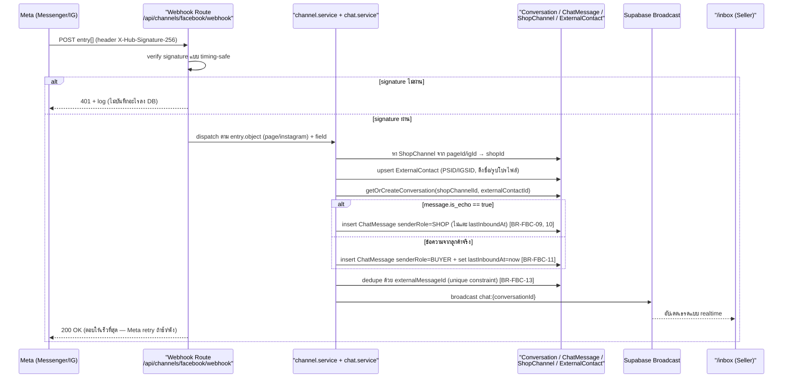
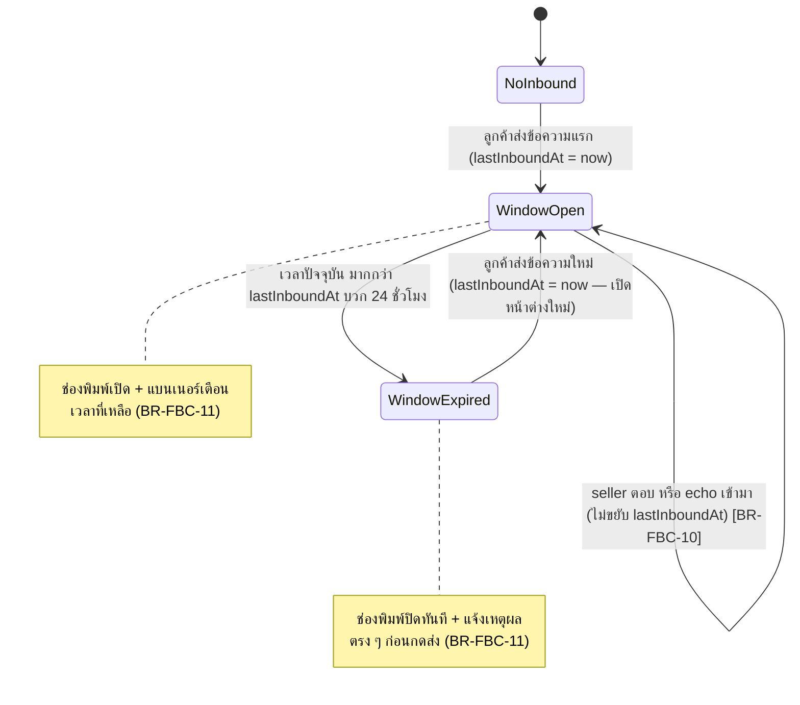
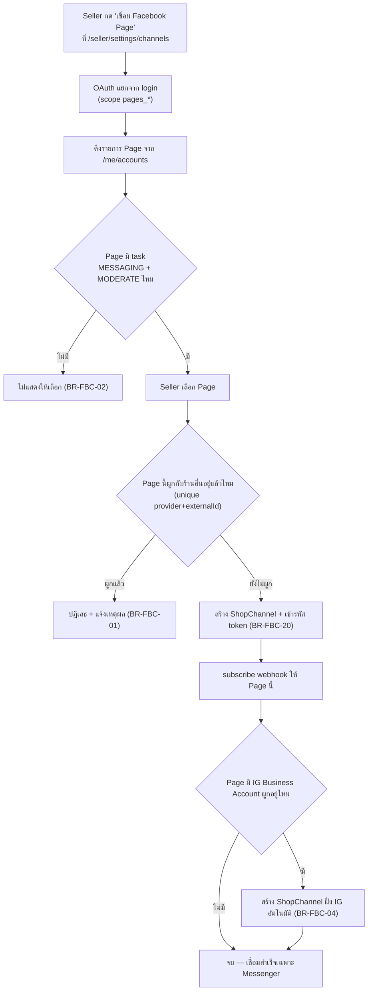
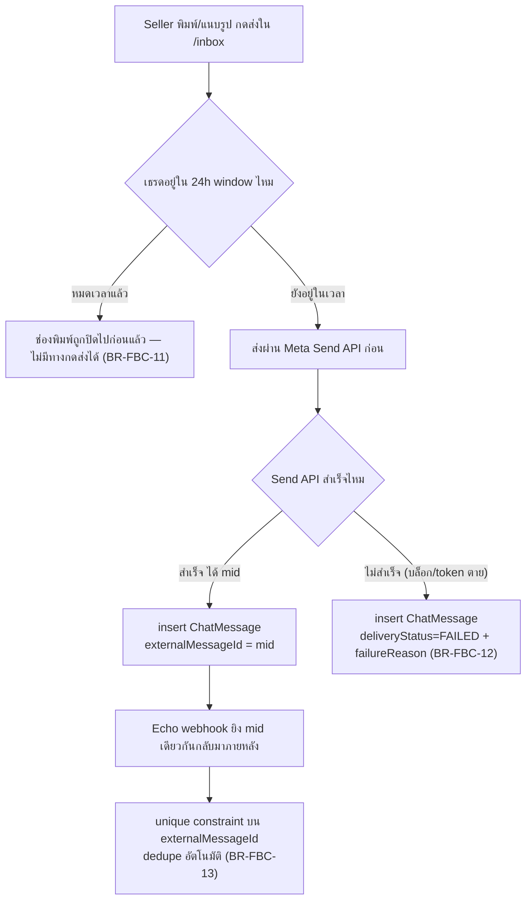
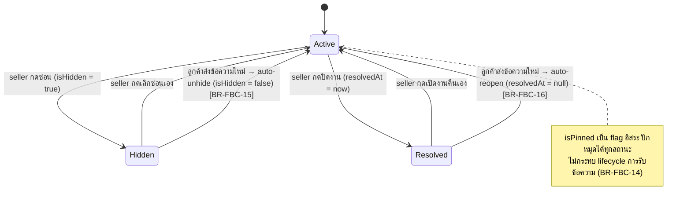

> **โมดูล:** M00018-FacebookChatIntegration
> **ประเภทเอกสาร:** Business Requirements Document (BRD) — NON-TECHNICAL
> **เวอร์ชัน:** 1.0
> **วันที่จัดทำ:** 2026-07-22
> **สถานะ:** Draft — อิง Design Spec ที่ยังไม่ผ่าน user review เต็ม (`docs/superpowers/specs/2026-07-22-facebook-chat-integration-design.md`) และ PRD v1.0 ที่ยังไม่ปิด §10.2 — รอ sign-off ก่อนส่งต่อ SRS/SDS/DATABASE/API/Tests (Hard Rule 11)
> **เจ้าของเอกสาร:** BA (ดู [[Feature-Docs-Ownership]])

# BRD: Facebook / Instagram Chat Integration (Business Requirements Document)

---

## 1. บทนำ

### 1.1 วัตถุประสงค์ของเอกสาร

เอกสารนี้มีวัตถุประสงค์เพื่อ:
1. กำหนด **กฎทางธุรกิจ** (Business Rules) ที่ควบคุมการรับ-ส่งข้อความระหว่างร้านค้ากับลูกค้าผ่าน Facebook Page (Messenger) และ Instagram DM ที่เข้ามาแสดงในระบบ Deep
2. บันทึก **Decision Log** — เหตุผลของการตัดสินใจสถาปัตยกรรม/ขอบเขตที่สำคัญที่ทำไปแล้วระหว่างออกแบบ เพื่อไม่ให้ทีมพัฒนาย้อนไปเปิดประเด็นที่ปิดแล้วซ้ำ
3. รวบรวม **Open Questions** ที่ยังต้องรอ user ตัดสินใจก่อนปิด BRD และเดินหน้าเข้า SRS
4. กำหนดเงื่อนไขการรับงาน (Acceptance Criteria ระดับกฎ) และ Use Case สำหรับทีม QA — โดยเฉพาะ ownership ของ Page/เธรด, ความถูกต้องของ 24-hour window, และการไม่รั่วไหลของโน้ตภายใน

> **หมายเหตุขอบเขตเอกสาร:** รายละเอียด Functional Requirement แบบ User Story + Acceptance Criteria (Given-When-Then) ระดับเต็มของแต่ละ `FR-FBC-xx` อยู่ใน [[PRD]] §3 แล้ว — เอกสารนี้**ไม่ทวนซ้ำ** เนื้อหานั้น แต่ทำหน้าที่เป็นชั้นกฎธุรกิจที่อยู่เบื้องหลัง FR แต่ละตัว พร้อมเหตุผลและกรณีขอบ (edge case) ที่ FR ระดับภาพรวมไม่ได้ลงรายละเอียด

### 1.2 ขอบเขตของระบบ

**Facebook / Instagram Chat Integration** คือระบบที่ต่อยอด `Conversation`/`ChatMessage` ของ feature `00011 - Deep Chat` ให้ "channel-aware" รองรับข้อความจากช่องทาง Facebook Messenger และ Instagram DM ควบคู่กับ Deep Chat เดิม โดยยึดฝั่ง **seller เท่านั้น** — buyer app ไม่มีการเปลี่ยนแปลงใด ๆ

**เข้าสู่ระบบ (Input):**
- Webhook event จาก Meta (ข้อความ TEXT/IMAGE, `is_echo`, ข้อมูล PSID/IGSID)
- คำสั่งเชื่อม/ถอด Facebook Page จากหน้า `/seller/settings/channels`
- ข้อความที่ seller พิมพ์/แนบรูปตอบกลับจาก `/inbox`
- คำสั่งปักหมุด/ซ่อน/ปิดงาน/แท็ก/บันทึกโน้ตภายในต่อเธรด
- คำสั่งสร้างออเดอร์จากเธรด (พร้อมเบอร์โทรลูกค้า)

**ออกจากระบบ (Output):**
- `ShopChannel` record ใหม่ (Page/IG ที่เชื่อมแล้ว), `ExternalContact` (ลูกค้าช่องทางนอก)
- `ChatMessage`/`Conversation` ที่ถูกบันทึกและ broadcast แบบ realtime เข้า `/inbox`
- ข้อความที่ถูกส่งออกจริงไปยัง Messenger/Instagram ผ่าน Send API
- `Customer` ที่ถูกผูกจาก `ExternalContact` เมื่อสร้างออเดอร์สำเร็จ
- แท็ก/โน้ตภายในที่ผูกกับเธรด/ลูกค้า (ไม่ออกไปนอกระบบ)

**ระบบที่เกี่ยวข้อง:** feature `00011 - Deep Chat` (`Conversation`/`ChatMessage`/`/inbox`/Supabase Broadcast), feature `00014 - Customer Directory` (`Customer.phone` required+unique), `/orders/new` (prefill สร้างออเดอร์), `lib/storage` (ดาวน์โหลด/อัปโหลดรูปจาก Meta), `src/proxy.ts` (`guardApi` — ต้องยกเว้น webhook route), Facebook App "Deep Chat & LIVE" (`1570859340799126`)

### 1.3 กลุ่มผู้ใช้งาน

| กลุ่มผู้ใช้ | บทบาท | สิทธิ์การใช้งาน |
|-----------|--------|----------------|
| **Seller (เจ้าของร้าน)** | เชื่อม/ถอด Page, ตอบข้อความ, สร้างออเดอร์จากเธรด, จัดระเบียบเธรด (ปักหมุด/ซ่อน/ปิดงาน/แท็ก/โน้ต) | เห็นเฉพาะ `ShopChannel`/เธรดที่ `shopId` เป็นของร้านตนเอง; เชื่อมได้เฉพาะ Page ที่ตนเองมีสิทธิ์ `MESSAGING`+`MODERATE` |
| **ลูกค้าที่ทักผ่าน Facebook/Instagram** | ผู้ส่ง-รับข้อความฝั่งนอกระบบ | ไม่มีบัญชี Deep, ไม่รู้ว่ากำลังคุยกับระบบใดอยู่เบื้องหลัง; กลายเป็น `Customer` จริงได้ก็ต่อเมื่อให้เบอร์ตอนสร้างออเดอร์ |
| **Buyer app user (Deep เดิม)** | ไม่เกี่ยวข้อง | เธรด Messenger/IG ไม่ปรากฏใน `/messages` ของ buyer app — ไม่มี behavior change |
| **Admin** | ไม่มีสิทธิ์เข้าถึงเนื้อหาบทสนทนา | นอกขอบเขต MVP (สืบทอดจาก Deep Chat) |

---

## 2. ความต้องการหลักเชิงธุรกิจ (อ้างอิง FR-FBC จาก PRD)

ตารางนี้จับคู่กลุ่มความต้องการ → `FR-FBC-xx` ที่มีรายละเอียดเต็มใน [[PRD]] §3 → รหัส Business Rule (`BR-FBC-xx`) ที่ควบคุมกลุ่มนั้นใน §8 ของเอกสารนี้ **ไม่มีการเขียน User Story/Acceptance Criteria ซ้ำที่นี่**

| กลุ่ม | FR-FBC (ดูรายละเอียดที่ PRD §3) | BR-FBC ที่เกี่ยวข้อง (ดู §8 เอกสารนี้) |
|---|---|---|
| รับข้อความเข้า (inbound TEXT/IMAGE/echo) | FR-FBC-01, 02, 03 | BR-FBC-06, 07, 09, 10, 13 |
| ตอบกลับ + 24-hour window | FR-FBC-04, 05, 06 | BR-FBC-09, 10, 11, 12 |
| สร้างออเดอร์ / ผูก Customer Directory | FR-FBC-07, 08 | BR-FBC-06 |
| เชื่อม/จัดการ Page + Instagram | FR-FBC-09, 10, 11 | BR-FBC-01, 02, 03, 04, 05 |
| Badge ช่องทาง + filter ใน `/inbox` | FR-FBC-12 | BR-FBC-08 |
| **ปักหมุด/ซ่อน/ปิดงานต่อเธรด** (S-7, spec §8.1) | *ยังไม่มีรหัส FR ใน PRD v1.0 — ดู OQ-FBC-04 §11* | BR-FBC-14, 15, 16 |
| **แท็ก/โน้ตภายใน/tab ออเดอร์ในแผงขวา** (S-8, spec §8.1) | *ยังไม่มีรหัส FR ใน PRD v1.0 — ดู OQ-FBC-04 §11* | BR-FBC-17, 18, 19 |
| PII / ความปลอดภัย token/webhook | (ครอบทุก FR ข้างต้น) | BR-FBC-20, 21, 22 |

> 🛑 **PRD sync gap ที่ต้อง flag ให้ Controller:** สอง (S-7/S-8) ที่ user เพิ่มเข้า MVP scope จาก reference 12Tees (spec §8.1, ตัดสินใจแล้ว) **ยังไม่มีรหัส `FR-FBC-13`/`FR-FBC-14` ใน PRD v1.0** — BRD ฉบับนี้เขียนกฎธุรกิจ (BR-FBC-14..19) รองรับไปก่อนตาม spec เพื่อไม่ให้ตกหล่น แต่ **PRD ต้องได้รับการอัปเดตให้มี FR ครอบสองกลุ่มนี้ก่อนเข้า SRS** ไม่เช่นนั้น traceability matrix (FR→BR→AC) จะขาดช่วง — รายละเอียดดู OQ-FBC-04 ที่ §11

---

## 3. Acceptance Criteria สรุป (ระดับกฎธุรกิจ)

### 3.1 การเชื่อมต่อ Page/Channel
- ✅ Page หนึ่งเชื่อมได้กับร้านเดียวเท่านั้นทั้งระบบ — พยายามเชื่อม Page ที่ร้านอื่นผูกไว้แล้วต้องถูกปฏิเสธพร้อมข้อความอธิบาย
- ✅ Page ที่ seller ไม่มีสิทธิ์ `MESSAGING`+`MODERATE` ต้องไม่ปรากฏในรายการให้เลือกเชื่อม
- ✅ Page ที่มี IG Business Account ผูกอยู่ → ระบบสร้าง `ShopChannel` ฝั่ง IG อัตโนมัติโดยไม่ขอ OAuth ซ้ำ
- ✅ Token ตาย (ถอนสิทธิ์/เปลี่ยนรหัส/ลบแอป) → สถานะเปลี่ยนเป็น `TOKEN_INVALID` และมี banner แจ้งให้เชื่อมใหม่

### 3.2 อัตลักษณ์ลูกค้าช่องทางนอก
- ✅ ลูกค้า FB/IG ไม่ปรากฏใน `User` table (ไม่มี ghost account)
- ✅ ลูกค้า FB/IG ไม่กลายเป็น `Customer` จนกว่าจะสร้างออเดอร์และได้เบอร์จริง
- ✅ PSID ของ Page A และ PSID เลขเดียวกันของ Page B ไม่ถูก dedupe เป็นคนเดียวกัน
- ✅ ลูกค้าคนเดียวกันที่ทักทั้ง Messenger และ IG เห็นเป็น 2 เธรดแยกกันจนกว่าจะผูกเข้า `Customer` เดียวกันผ่านการสร้างออเดอร์

### 3.3 ข้อความ Echo และ 24-hour Window
- ✅ ข้อความที่ seller ตอบจากแอป Messenger บนมือถือโดยตรง (`is_echo=true`) ปรากฏใน `/inbox` เป็นฝั่งร้าน (`senderRole=SHOP`)
- ✅ ข้อความ echo ไม่เปลี่ยนค่า `lastInboundAt` ของเธรด
- ✅ ช่องพิมพ์ปิดอัตโนมัติเมื่อเวลาปัจจุบันเกิน `lastInboundAt + 24h` และแสดงเหตุผลชัดเจนก่อนกดส่ง ไม่ใช่หลังกดส่งแล้ว error
- ✅ ลูกค้าส่งข้อความใหม่หลังหมด window → window เปิดใหม่ทันที (`lastInboundAt` รีเซ็ต)

### 3.4 ความน่าเชื่อถือของข้อความ
- ✅ Meta ส่ง webhook ซ้ำ (redelivery) ด้วย `mid` เดิม → ไม่เกิดแถว `ChatMessage` ซ้ำ
- ✅ ส่งข้อความไม่สำเร็จ (ลูกค้าบล็อกร้าน/token หมดอายุ/เหตุอื่น) → มี `deliveryStatus=FAILED` + `failureReason` ที่มองเห็นได้ในเธรด ไม่ใช่ error เงียบ

### 3.5 การจัดระเบียบเธรด + โน้ตภายใน
- ✅ ซ่อนเธรดแล้วเธรดยังรับข้อความใหม่จากลูกค้าได้ตามปกติ และกลับมาแสดงในรายการหลักอัตโนมัติเมื่อมีข้อความใหม่เข้ามา
- ✅ ปิดงานเธรดแล้วลูกค้าทักมาใหม่ → เธรดกลับมาเป็นสถานะเปิดอัตโนมัติ ไม่ตกหล่นจากสายตา seller
- ✅ โน้ตภายในและแท็กไม่ปรากฏฝั่งลูกค้าไม่ว่ากรณีใด — ตรวจสอบได้ว่าไม่มี code path ใดส่งโน้ตภายในผ่าน Send API

---

## 4. Business Flows (กระบวนการทำงาน)

### 4.1 Flow หลัก: Webhook ขาเข้า (verify → dispatch → บันทึก → broadcast)

### 4.2 สถานะของ 24-hour Messaging Window

### 4.3 Flow: เชื่อม Facebook Page (ownership guard)

### 4.4 Flow: ส่งข้อความออก + Idempotency

### 4.5 สถานะการจัดระเบียบเธรด (ปักหมุด/ซ่อน/ปิดงาน)

---

## 5. Use Case Scenarios (สถานการณ์การใช้งานจริง)

### Scenario 1: Best Case — ลูกค้าทัก Messenger ครั้งแรก แล้ว seller ตอบจาก Deep

**ผู้เกี่ยวข้อง:** ลูกค้า (Messenger), Seller

**เงื่อนไขเริ่มต้น:** Page ของร้านเชื่อมกับ Deep แล้ว (`ShopChannel status=ACTIVE`), ลูกค้าไม่เคยทักมาก่อน (ไม่มี `ExternalContact`)

**ขั้นตอน:**
1. ลูกค้าส่งข้อความ "มีสินค้าชิ้นนี้ไหมคะ" เข้า Page
2. Meta ยิง webhook เข้า `/api/channels/facebook/webhook`
3. ระบบสร้าง `ExternalContact` ใหม่ + `Conversation` ใหม่ + `lastInboundAt=now`
4. Seller เห็นข้อความใน `/inbox` พร้อม badge Messenger แบบ realtime
5. Seller พิมพ์ตอบ "มีค่ะ" กดส่ง

**ผลลัพธ์:** ข้อความออกจริงถึงลูกค้าในแอป Messenger, เธรดมี 2 ข้อความ (BUYER, SHOP) ครบถ้วน

### Scenario 2: Echo — Seller ตอบจากแอป Messenger บนมือถือโดยตรง

**ผู้เกี่ยวข้อง:** Seller

**เงื่อนไขเริ่มต้น:** มีเธรดอยู่แล้ว, seller ออกจากออฟฟิศ ไม่ได้เปิด Deep

**ขั้นตอน:**
1. Seller เปิดแอป Messenger บนมือถือ พิมพ์ตอบลูกค้าตรง ๆ
2. Meta ยิง webhook พร้อม `message.is_echo = true`
3. ระบบบันทึกข้อความนี้เป็น `senderRole=SHOP` แต่ไม่ขยับ `lastInboundAt`
4. Seller กลับมาเปิด Deep ภายหลัง

**ผลลัพธ์:** Seller เห็นข้อความที่ตัวเองตอบไปแล้วครบใน `/inbox` — ไม่ต้องเดาว่าตอบไปหรือยัง (BR-FBC-09, 10)

### Scenario 3: 24h Window หมดเวลา

**ผู้เกี่ยวข้อง:** Seller

**เงื่อนไขเริ่มต้น:** ลูกค้าส่งข้อความล่าสุดเมื่อ 25 ชั่วโมงที่แล้ว ไม่มีข้อความใหม่เข้ามา

**ขั้นตอน:**
1. Seller เปิดเธรดนี้ใน `/inbox`

**ผลลัพธ์:** ช่องพิมพ์ปิด พร้อมข้อความอธิบายเหตุผล ("เกิน 24 ชม. หลังข้อความล่าสุดของลูกค้า ส่งข้อความใหม่ไม่ได้") — seller ไม่มีทางกดส่งแล้วเจอ error ย้อนหลัง (BR-FBC-11)

### Scenario 4: Webhook Redelivery ซ้ำจาก Meta

**ผู้เกี่ยวข้อง:** ระบบ (ไม่มี user action)

**เงื่อนไขเริ่มต้น:** Deep ตอบ webhook ช้า (network glitch) ทำให้ Meta ส่ง event เดิมซ้ำ

**ขั้นตอน:**
1. Webhook เดิม (mid เดียวกัน) เข้ามาซ้ำ 2 ครั้ง

**ผลลัพธ์:** มี `ChatMessage` เพียง 1 แถวเท่านั้น (unique constraint บน `externalMessageId` กันซ้ำ) — ไม่มีข้อความซ้ำโผล่ใน `/inbox` (BR-FBC-13)

### Scenario 5: สร้างออเดอร์จากเธรด → ผูก Customer

**ผู้เกี่ยวข้อง:** Seller, ลูกค้า Messenger

**เงื่อนไขเริ่มต้น:** ลูกค้าคุยจนตกลงซื้อ ยังเป็นแค่ `ExternalContact` ไม่มีเบอร์

**ขั้นตอน:**
1. Seller กดสร้างออเดอร์จากเธรด → `/orders/new` เปิดพร้อม prefill
2. Seller กรอกเบอร์โทรลูกค้า (บังคับ)
3. ระบบสร้าง/ผูก `Customer` และเซ็ต `ExternalContact.customerId`

**ผลลัพธ์:** ครั้งถัดไปที่ PSID เดิมทักมา ระบบรู้จักลูกค้าคนนี้ทันทีโดยไม่ต้องขอเบอร์ซ้ำ (BR-FBC-06)

### Scenario 6: ลูกค้าคนเดิมทักทั้ง Messenger และ Instagram

**ผู้เกี่ยวข้อง:** ลูกค้า, Seller

**เงื่อนไขเริ่มต้น:** ลูกค้าเคยซื้อผ่าน Messenger (ผูก `Customer` แล้ว) แล้ววันนี้ทักมาใหม่ทาง IG DM ของร้านเดียวกัน

**ขั้นตอน:**
1. ข้อความ IG เข้ามา — PSID/IGSID ไม่มีตัวเชื่อมกันโดยตรง
2. ระบบสร้าง `ExternalContact` ใหม่แยกต่างหากสำหรับ IG (เธรดใหม่)

**ผลลัพธ์:** Seller เห็น 2 เธรดแยกกัน (Messenger เดิม + IG ใหม่) จนกว่าจะสร้างออเดอร์จากเธรด IG แล้วกรอกเบอร์เดียวกัน ระบบจึงจะรู้ว่าเป็นคนเดียวกันผ่าน `Customer` ร่วม (BR-FBC-08) — **ไม่ merge เธรดอัตโนมัติใน MVP**

### Scenario 7: Ownership Conflict — พยายามเชื่อม Page ที่ร้านอื่นผูกไว้แล้ว

**ผู้เกี่ยวข้อง:** Seller ร้าน B

**เงื่อนไขเริ่มต้น:** Page X ถูกร้าน A เชื่อมไว้แล้ว (`ShopChannel` active)

**ขั้นตอน:**
1. Seller ร้าน B (ซึ่งมีสิทธิ์ admin บน Page X เช่นกัน — เช่น เคยเป็นแอดมินร่วม) พยายามเชื่อม Page X เข้าร้าน B

**ผลลัพธ์:** ระบบปฏิเสธ พร้อมข้อความอธิบายว่า Page นี้ผูกกับร้านอื่นอยู่แล้ว — ป้องกันสองร้านแย่งรับข้อความจาก inbox เดียวกัน (BR-FBC-01)

### Scenario 8: ซ่อนเธรดแล้วลูกค้าทักกลับมา

**ผู้เกี่ยวข้อง:** Seller, ลูกค้า

**เงื่อนไขเริ่มต้น:** Seller กดซ่อนเธรดที่คุยจบไปแล้วเมื่อสัปดาห์ก่อน (`isHidden=true`)

**ขั้นตอน:**
1. ลูกค้าคนเดิมทักกลับมาใหม่ในเธรดที่ซ่อนอยู่

**ผลลัพธ์:** ข้อความยังถูกบันทึกตามปกติ (ไม่ตัดขาดการรับข้อความ) และเธรดกลับมาแสดงในรายการหลักอัตโนมัติ (`isHidden` รีเซ็ตเป็น false) — seller ไม่พลาดข้อความใหม่ (BR-FBC-15)

### Scenario 9: โน้ตภายในต้องไม่รั่วไหลไปหาลูกค้า (Security)

**ผู้เกี่ยวข้อง:** Seller

**เงื่อนไขเริ่มต้น:** Seller เขียนโน้ตภายใน "ลูกค้าคนนี้เคยเบี้ยวเงินมาก่อน" ผูกกับเธรด

**ขั้นตอน:**
1. Seller บันทึกโน้ต
2. Seller ตอบข้อความปกติในเธรดเดียวกันต่อ

**ผลลัพธ์:** โน้ตปรากฏเฉพาะในแผงขวาฝั่ง seller เท่านั้น ไม่มี code path ใดส่งเนื้อหาโน้ตผ่าน Send API ไปหาลูกค้า — ตรวจสอบได้ว่าโน้ต entity แยกจาก `ChatMessage` ที่ recipient ภายนอกเข้าถึง (BR-FBC-17)

---

## 6. ความต้องการด้านคุณภาพ (Quality Requirements)

### 6.1 ความถูกต้องของข้อมูล
- `ShopChannel` ต้องไม่มีคู่ (provider, externalId) ซ้ำกันในระบบเด็ดขาด (DB unique constraint — BR-FBC-01)
- `ExternalContact` ต้องไม่มีคู่ (shopChannelId, externalUserId) ซ้ำกัน (BR-FBC-07)
- `ChatMessage.externalMessageId` ต้อง unique ทั้งระบบเพื่อกัน redelivery ซ้ำ (BR-FBC-13)
- `lastInboundAt` ต้องอัปเดตเฉพาะเมื่อข้อความมาจากลูกค้าจริงเท่านั้น ไม่ใช่ echo (BR-FBC-10)

### 6.2 ความรวดเร็ว
- Webhook route ต้องตอบ `200` ให้เร็วที่สุด — งานหนัก (ดาวน์โหลดรูป, broadcast) ต้องไม่บล็อกการตอบกลับจนทำให้ Meta timeout แล้ว retry ซ้อน
- ข้อความ broadcast ต้องปรากฏฝั่ง seller ภายในเวลาที่รู้สึก "ทันที" เมื่อเปิด `/inbox` ค้างไว้ (เหมือน Deep Chat เดิม)

### 6.3 ความน่าเชื่อถือ
- Page token ตายกลางทาง (ถอนสิทธิ์/ลบแอป) ต้องไม่ทำให้ส่งข้อความ fail เงียบ — ต้องจับ error แล้วตั้ง `TOKEN_INVALID` (BR-FBC-05)
- ส่งข้อความไม่สำเร็จทุกกรณี (บล็อก/token ตาย/เหตุอื่น) ต้องมี `deliveryStatus`+`failureReason` ที่ seller เห็นได้ในเธรด (BR-FBC-12)
- Rate-limit เฉพาะทางของ webhook route (แทน `guardApi` ปกติ) ต้องทำงานสม่ำเสมอไม่ว่า traffic จะสูงแค่ไหน (in-memory per-instance เป็น known-gap เดียวกับระบบเดิม — Redis = Phase 2)

### 6.4 ความปลอดภัย
- Page access token ต้องเข้ารหัส AES-256-GCM ก่อนเก็บเสมอ ห้าม log ห้ามส่งกลับ client (BR-FBC-20)
- `X-Hub-Signature-256` timing-safe compare เป็น authentication เดียวของ webhook route — ต้อง validate ทุก payload ด้วย Valibot ไม่เชื่อ shape จาก Meta ตรง ๆ (BR-FBC-22)
- ชื่อ/PSID/avatar ลูกค้าต้อง neutralize-at-source ก่อน serialize เข้า RSC flight เนื่องจากหน้า seller อยู่ใต้ client layout (BR-FBC-21)
- โน้ตภายในและแท็กต้องไม่มี code path ใดส่งออกไปหาลูกค้า (BR-FBC-17, 18)
- ทุก query ต้อง filter `shopId` + เช็คสิทธิ์เจ้าของร้าน (สืบทอด owner-only pattern จาก Deep Chat)

### 6.5 ความสะดวกในการใช้งาน (Usability)
- แบนเนอร์เวลาที่เหลือของ 24h window ต้องเห็นชัดก่อนหมดเวลา ไม่ใช่แค่ตอนหมดแล้ว
- ข้อความ error ชัดเจนเมื่อ: หมด window, ส่งไม่สำเร็จ, พยายามเชื่อม Page ที่ผูกร้านอื่นแล้ว, Page ไม่มีสิทธิ์ `MESSAGING`+`MODERATE`
- ปักหมุด/ซ่อน/ปิดงาน ต้องเป็น action ที่ทำกลับได้ทันที (undo ง่าย) เพราะเป็น flag จัดระเบียบ ไม่ใช่การลบข้อมูล

---

## 7. ข้อจำกัด (Constraints)

### 7.1 ข้อจำกัดทางธุรกิจ
- ใช้งานได้เต็มรูปแบบกับร้านค้าคนนอกก็ต่อเมื่อผ่าน Meta App Review + Business Verification (Advanced Access) — Standard Access พอสำหรับ dev/QA เท่านั้น
- ไม่ใช้ message tag ใน MVP — จำกัดการตอบอยู่ในหน้าต่าง 24 ชม. เท่านั้น ไม่มีทางยืดเวลา
- Seller จะเจอหน้าขออนุญาต Facebook 2 รอบ (login App คนละตัวกับ chat App) — เป็นผลจาก incremental authorization ของ Meta ไม่ใช่ทางเลือกของทีม
- ไม่มี Facebook Live comment integration ใน phase นี้ (นอก scope — วางรอยต่อไว้เท่านั้น)
- ไม่มี broadcast/message template/chatbot อัตโนมัติ, ไม่มี WhatsApp

### 7.2 ข้อจำกัดทางเทคนิค
- Web-only ฝั่ง seller (`/inbox`, `/seller/settings/channels`) — ไม่มีผลกับ buyer mobile app
- Realtime พึ่ง Supabase broadcast-from-DB (per-instance, Vercel serverless known-gap เดียวกับระบบประมูล/Deep Chat)
- ห้าม `prisma migrate dev` — DB dev/prod เป็นตัวเดียวกันและมี drift อยู่แล้ว (ดู `docs/conventions/prisma-shared-db-drift.md`) ต้องเขียน SQL เองแล้ว `migrate deploy -e .env.local` หลังขอ user ยืนยัน
- `guardApi` ต้องยกเว้น webhook route จาก Origin-check (Meta ไม่ส่ง header `Origin`) แล้วใส่ rate-limit เฉพาะทางแทน
- ข้อความจำกัดที่ TEXT/IMAGE (1 รูป/ข้อความ) เท่านั้น — ไม่มีเสียง/วิดีโอ/ไฟล์แนบทั่วไป
- ต้องใช้ ngrok (public HTTPS) สำหรับ dev webhook — webhook subscription เดิมที่ชี้ ngrok ตายอยู่ต้องถูกปิด/เปลี่ยนก่อนเริ่มงาน (ความเสี่ยงข้อมูลลูกค้า)

---

## 8. กฎทางธุรกิจ (Business Rules)

### 8.1 การเชื่อมต่อ Page/Channel Ownership

- **BR-FBC-01 (1 Page = 1 ร้านทั้งระบบ):** `ShopChannel` unique ต่อ (`provider`, `externalId`) — Page หนึ่งผูกได้กับร้านเดียวเท่านั้นในทั้งระบบ Deep กันสองร้านแย่งกันรับข้อความจาก inbox เดียวกัน
- **BR-FBC-02 (สิทธิ์ Page task บังคับ):** ผู้ที่กดเชื่อม Page ต้องมีสิทธิ์ Page task `MESSAGING` และ `MODERATE` — Page ที่ seller ไม่มีสิทธิ์นี้จะไม่ปรากฏให้เลือกเชื่อม
- **BR-FBC-03 (OAuth แยกจาก login):** การเชื่อม Page เป็น OAuth คนละขั้นตอนกับการ login เข้า Deep — ห้ามยัด scope `pages_*` เข้า `FacebookProvider` ของ login เดิมเด็ดขาด
- **BR-FBC-04 (Instagram auto-link):** Page ที่เชื่อมมี Instagram Business Account ผูกอยู่แล้ว → ระบบสร้าง `ShopChannel` ฝั่ง IG อัตโนมัติด้วย page token เดียวกัน ไม่ต้อง OAuth ซ้ำ
- **BR-FBC-05 (Token ตาย → TOKEN_INVALID):** Page access token ที่ตายจากการถอนสิทธิ์/เปลี่ยนรหัสผ่าน/ลบแอป ต้องถูกจับ error แล้วตั้ง `status = TOKEN_INVALID` พร้อม banner "เชื่อมต่อใหม่" ในหน้า channels

### 8.2 อัตลักษณ์ลูกค้าช่องทางนอก (Identity)

- **BR-FBC-06 (ExternalContact ≠ User, ≠ Customer):** ลูกค้าที่ทักผ่าน Facebook/Instagram เป็น `ExternalContact` เท่านั้น — ไม่สร้าง `User` เงา และยังไม่ใช่ `Customer` ในระบบจนกว่าจะสร้างออเดอร์และได้เบอร์โทรจริง
- **BR-FBC-07 (PSID/IGSID เป็น page-scoped):** ห้าม dedup PSID/IGSID ข้ามเพจ — `ExternalContact` unique ต่อ (`shopChannelId`, `externalUserId`)
- **BR-FBC-08 (ไม่ merge Messenger กับ Instagram):** เธรด Messenger กับ Instagram ของคนเดียวกันไม่ merge อัตโนมัติใน MVP เพราะ PSID กับ IGSID ไม่มีตัวเชื่อมกันโดยตรง — รู้จักเป็นคนเดียวกันได้ก็ต่อเมื่อได้เบอร์แล้วผูกเข้า `Customer` เดียวกัน (ปิดแล้ว — spec §14 Q-3)

### 8.3 ข้อความ Echo และหน้าต่างเวลา 24 ชั่วโมง

- **BR-FBC-09 (Echo นับเป็นฝั่งร้าน):** ข้อความที่ seller ตอบจากแอป Messenger บนมือถือโดยตรง (`is_echo=true`) ต้องบันทึกเป็น `senderRole=SHOP` เข้าเธรดเดียวกัน — พฤติกรรมจริงของ seller ไทยส่วนใหญ่ยังตอบจากมือถือ ถ้าไม่ทำข้อนี้ระบบใช้งานจริงไม่ได้
- **BR-FBC-10 (Echo ไม่ขยับฐานเวลา):** ข้อความ echo ไม่ขยับ `lastInboundAt` — ฐานคำนวณ 24h window ขยับเฉพาะข้อความของลูกค้าเท่านั้น
- **BR-FBC-11 (24-hour Standard Messaging Window):** ร้านตอบลูกค้าได้เฉพาะภายใน 24 ชั่วโมงหลังข้อความล่าสุดของลูกค้าเท่านั้น เกินแล้วส่งไม่ออก — MVP ไม่ใช้ message tag เพราะการใช้ผิดวัตถุประสงค์คือเหตุให้ Meta ระงับแอปได้

### 8.4 ความน่าเชื่อถือของข้อความ

- **BR-FBC-12 (ห้าม fail เงียบ):** ส่งไม่สำเร็จ (ลูกค้าบล็อกร้าน, token ตาย, หรือเหตุอื่น) ต้องบันทึกและแสดงในเธรดเสมอ ห้ามปล่อยให้หายไปเงียบ ๆ
- **BR-FBC-13 (Idempotency กัน redelivery):** ข้อความซ้ำที่ Meta ส่งซ้ำ (webhook redelivery) ต้องไม่สร้างแถวซ้ำในเธรด — dedupe ผ่าน unique constraint บน `externalMessageId`

### 8.5 การจัดระเบียบเธรด — ปักหมุด/ซ่อน/ปิดงาน (S-7)

- **BR-FBC-14 (ปักหมุดเป็น flag อิสระ):** `isPinned` ไม่ผูกกับสถานะรับข้อความใด ๆ — ปักหมุดได้ทุกสถานะ (Active/Hidden/Resolved) โดยไม่กระทบการรับ-ส่งข้อความ
- **BR-FBC-15 (ซ่อน ≠ ตัดขาด, Assumption รอ confirm):** ซ่อนเธรด (`isHidden=true`) ไม่ตัดขาดการรับข้อความ — เธรดยังรับข้อความใหม่จากลูกค้าได้ตามปกติ เพียงแค่ไม่แสดงในรายการหลักของ `/inbox`; เมื่อมีข้อความใหม่จากลูกค้าเข้ามา ระบบต้อง **unhide อัตโนมัติ** (`isHidden` รีเซ็ตเป็น `false`) เพราะการซ่อนเป็นการจัดระเบียบสายตา ไม่ใช่การบล็อกการสื่อสาร — **นี่เป็นสมมติฐานที่ BA ตั้งไว้เอง เนื่องจาก design spec §8.1 ไม่ได้ระบุพฤติกรรมนี้ชัดเจน ต้องให้ user ยืนยันก่อนเข้า SRS (ดู OQ-FBC-03 §11)**
- **BR-FBC-16 (ปิดงาน ≠ ปิดกั้นลูกค้า, Assumption รอ confirm):** ปิดงาน (`resolvedAt` มีค่า) หมายถึง seller ปิด case การสนทนานั้นแล้ว (ปัญหาคลี่คลาย) ไม่ใช่การปิดกั้นไม่ให้ลูกค้าทักอีก; เมื่อลูกค้าทักเข้ามาใหม่ในเธรดที่ปิดงานอยู่ ระบบต้อง **reopen อัตโนมัติ** (`resolvedAt` รีเซ็ตเป็น `null`) เพื่อไม่ให้ seller พลาดข้อความใหม่ที่ถูกซ่อนอยู่หลังสถานะปิดงาน — **สมมติฐานเดียวกับ BR-FBC-15 ต้อง confirm ก่อนเข้า SRS (OQ-FBC-03 §11)**

### 8.6 แท็กและโน้ตภายใน (S-8)

- **BR-FBC-17 (โน้ตภายในห้ามรั่วไหลเด็ดขาด):** โน้ตภายใน (internal note) ต้องไม่ถูกส่งออกไปหาลูกค้าไม่ว่ากรณีใด — ห้ามผ่าน Send API, ห้ามปรากฏในฝั่งลูกค้า ต้องเก็บแยก entity/flag จาก `ChatMessage` ที่ recipient ภายนอกมองเห็นได้
- **BR-FBC-18 (แท็กเป็นข้อมูลภายในร้าน):** แท็กที่ผูกกับเธรด/ลูกค้าใช้จัดหมวดหมู่ภายในร้านเท่านั้น ไม่ส่งออกไปหาลูกค้าเช่นเดียวกับโน้ต
- **BR-FBC-19 (tab แผงขวาแสดงเฉพาะข้อมูลจริง):** tab "ออเดอร์" ในแผงขวาแสดงเฉพาะออเดอร์จริงที่ผูกกับ `Customer` ที่ link ไว้แล้วเท่านั้น (ไม่ mock ข้อมูล); tab "ใบเสนอราคา" **งดสร้างไว้ก่อน** จนกว่าจะปิด OQ-FBC-02 (§11) เพราะระบบยังไม่มีฟีเจอร์ใบเสนอราคาเลย

### 8.7 PII และความปลอดภัย

- **BR-FBC-20 (เข้ารหัส token เสมอ):** Page access token ต้องเข้ารหัส AES-256-GCM (key จาก env `CHANNEL_TOKEN_KEY`) ก่อนเก็บลง DB เสมอ ห้าม log ห้ามส่งกลับ client
- **BR-FBC-21 (Neutralize PII at source):** ชื่อ/PSID/avatar ของลูกค้าต้อง neutralize ที่ server boundary ก่อนถูก serialize เข้า RSC flight — หน้า seller อยู่ใต้ client layout ทำให้ Next.js serialize ข้อมูล server ทั้งหมดเข้า flight payload โดยไม่ตั้งใจ (บทเรียนเดิมของระบบ)
- **BR-FBC-22 (Signature = authentication เดียวของ webhook):** `X-Hub-Signature-256` timing-safe compare คือ authentication เดียวของ webhook route — route นี้ต้องยกเว้นจาก `guardApi` Origin-check ปกติ แต่ต้องมี rate-limit เฉพาะทางแทน และ validate ทุก payload ด้วย Valibot ไม่เชื่อ shape จาก Meta ตรง ๆ

---

## 9. อภิธานศัพท์ (Glossary)

| คำศัพท์ | ความหมาย |
|---------|----------|
| **PSID** | Page-Scoped ID — ID ของลูกค้าที่ผูกกับ Page หนึ่งเท่านั้น (ห้าม dedup ข้าม Page) |
| **IGSID** | Instagram-Scoped ID — เทียบเท่า PSID สำหรับ Instagram DM |
| **is_echo** | flag ที่ Meta ส่งกลับมาเมื่อข้อความถูกส่งจากฝั่ง Page เอง รวมถึงตอบจากแอป Messenger มือถือโดยตรง |
| **24-hour Standard Messaging Window** | กรอบเวลาที่ Meta อนุญาตให้ Page ตอบลูกค้าได้ นับจากข้อความล่าสุดของลูกค้า |
| **Message Tag** | permission พิเศษที่ Meta ให้ยืดหน้าต่างการตอบเกิน 24 ชม. สำหรับวัตถุประสงค์เฉพาะ (ไม่ใช้ใน MVP นี้) |
| **Advanced Access** | ระดับสิทธิ์ permission ที่ต้องผ่าน App Review — จำเป็นให้ Page ของร้านค้าคนนอกใช้งานได้จริง |
| **Standard Access** | ระดับสิทธิ์เริ่มต้น ใช้ได้เฉพาะ Page ที่คนใน App (admin/developer/tester) เป็นเจ้าของ |
| **Business Verification** | กระบวนการยืนยันนิติบุคคลระดับ Business Portfolio ของ Meta — เป็นเงื่อนไขคู่กับ App Review |
| **ShopChannel** | record ที่แทน Page/IG หนึ่งช่องทางที่ร้านเชื่อมไว้ (เก็บ token) |
| **ExternalContact** | ลูกค้าจากช่องทางนอกระบบ (FB/IG) ที่ยังไม่ผูกเข้า `Customer` |
| **Send API** | Graph API endpoint ของ Meta สำหรับส่งข้อความออกจาก Page ไปหาลูกค้า |
| **`isPinned`** | flag ปักหมุดเธรดให้อยู่บนสุดของรายการ — ไม่กระทบสถานะรับข้อความ |
| **`isHidden`** | flag ซ่อนเธรดจากรายการหลัก — ไม่ตัดขาดการรับข้อความ, unhide อัตโนมัติเมื่อมีข้อความใหม่ (BR-FBC-15) |
| **`resolvedAt`** | เวลาที่ seller ปิดงานเธรดนั้น — reopen อัตโนมัติเมื่อลูกค้าทักใหม่ (BR-FBC-16) |
| **Internal Note** | โน้ตภายในที่ผูกกับเธรด/ลูกค้า มองเห็นได้เฉพาะ seller ห้ามส่งออกไปหาลูกค้า (BR-FBC-17) |
| **Tag** | แท็กจัดหมวดหมู่เธรด/ลูกค้าเพื่อใช้งานภายในร้าน (BR-FBC-18) |

---

## 10. Decision Log

| # | เรื่อง | การตัดสินใจ | เหตุผล | อ้างอิง |
|---|------|-------------|--------|---------|
| **D-FBC-01** | Data model | ขยาย `Conversation`/`ChatMessage` เดิมให้ channel-aware แทนสร้าง model ใหม่แยก (`FbConversation`/`FbMessage`) | reuse pagination/unread/broadcast/scam-detector/response-metrics cron ได้ฟรีทั้งชุด; รองรับ IG DM บังคับให้ต้องออกแบบแบบ channel-agnostic อยู่แล้ว ซึ่งตรงกับแนวทางนี้พอดี ทางเลือกแยก model จะทำให้ราคาขึ้นเป็น 2 เท่า (ต้อง merge 2 source ใน inbox, duplicate logic ทุกจุด) | spec §5.1 |
| **D-FBC-02** | Facebook App | ใช้ **2 App แยก** — login คงอยู่ที่ `990205170388742`, chat ใช้ `1570859340799126` (env แยกชุด `FB_CHAT_APP_ID`/`FB_CHAT_APP_SECRET`) | ต้นทุนของการมี 2 app คือ App Review เพิ่มอีก 1 รอบเท่านั้น ไม่ใช่ Business Verification ซ้ำ (verify ระดับ Business Portfolio ใช้ร่วมกันได้); login live บน prod อยู่แล้วไม่ควรแตะ; ถ้า review ฝั่ง messaging ตก login ทั้งระบบไม่ล้มตาม; จำนวน consent dialog ที่ seller เจอ (2 รอบ) เท่ากันไม่ว่าจะ 1 หรือ 2 app เพราะ Meta บังคับ incremental authorization อยู่แล้ว | spec §4.3 |
| **D-FBC-03** | Customer/User modeling | ไม่สร้าง `User` เงาให้ลูกค้า FB/IG, ไม่สร้าง `Customer` ทันทีตอนทักเข้ามา | ป้องกัน `User` table เต็มไปด้วย ghost account ที่ logic ทุกตัว (trust score/badge/admin list/auth) ต้องมาไล่กันทีหลัง; `Customer.phone` เป็น required+unique ที่เป็นแกนของ cross-shop dedup ทั้งระบบ (feature 00014) — ทำให้ nullable เพื่อรองรับ FB จะพังกลไกนั้น | spec §6.1 |
| **D-FBC-04** | Facebook Live | นอก scope phase นี้ แต่วางรอยต่อไว้ 2 จุด: (1) webhook เป็น route เดียว + dispatcher แยกตาม `object`/`field` (2) `ShopChannel` ถือ Page+token อยู่แล้ว ใช้ต่อได้เลย — **ไม่สร้าง model คอมเมนต์ล่วงหน้า** (YAGNI) | คอมเมนต์บนวิดีโอเป็น public thread ไม่ใช่บทสนทนา 1:1 คนละ shape กับ `Conversation` — บังคับให้ใช้ model เดียวกันจะทำให้ทั้งสองฝั่งเพี้ยน | spec §9 |
| **D-FBC-05** | UI Layout | รับ IA/layout จาก reference 12Tees (โครง 3 คอลัมน์, filter ช่องทาง, ค้นหา, แผงขวา) แต่ skin/สี/component ใช้ Paces ปัจจุบัน (น้ำเงิน `#236dc9`) | ตรงตาม Hard Rule 6 — reference เป็นแอปอื่น เอา IA/layout ตาม ref แต่ skin/component ต้องเป็นธีมปัจจุบันเสมอ | spec §8.1, Hard Rule 6 |
| **D-FBC-06** | ขยาย MVP scope จาก reference | เพิ่มปักหมุด/ซ่อน/ปิดงาน (S-7) และแท็ก/โน้ตภายใน/tab ออเดอร์ (S-8) เข้า MVP; **ตัด** มอบหมายผู้ดูแล (assignee) + สถานะการขาย (sales pipeline) + ช่องทาง Gmail ออก | assignee ต้องผูกระบบพนักงาน (feature 00012) ที่ยังไม่รองรับบริบทนี้และ sales pipeline ยังไม่มีนิยามในระบบ; Gmail อยู่นอก scope ของ integration นี้โดยสิ้นเชิง | spec §8.1 Q-4 (ปิดแล้ว) |

---

## 11. Open Questions ที่ต้อง Confirm ก่อนเข้า SRS

| # | คำถาม | สถานะ | ผลกระทบถ้าไม่ปิด |
|---|------|--------|-------------------|
| **OQ-FBC-01** (= spec Q-2) | Page ที่ทีมใช้ QA คือ Page ไหน (ต้องมี admin/developer/tester ของ App `1570859340799126` เป็นเจ้าของ) | รอ user | บล็อกการ QA end-to-end ของ webhook/Send API จริง แม้ build เสร็จแล้ว (Standard Access ใช้ได้เฉพาะ Page ในสิทธิ์นี้เท่านั้น) |
| **OQ-FBC-02** (= spec Q-5) | tab "ใบเสนอราคา" ในแผงขวา — ระบบ Deep ยังไม่มีฟีเจอร์ใบเสนอราคาเลย (ไม่มี model/หน้าจอ/PDF) จะ **ตัด tab ออก** เหลือ ออเดอร์/แท็ก/Note หรือ **ทำฟีเจอร์ใบเสนอราคาแยกก่อน** แล้วค่อยต่อ tab นี้ทีหลัง | รอ user ตัดสิน | บล็อกเฉพาะ tab ใบเสนอราคา ไม่บล็อกส่วนอื่นของแผงขวา (BR-FBC-19 กันไว้แล้วว่าห้าม mock ข้อมูล) — ถ้าไม่ปิดก่อนเข้า SRS ต้อง default เป็น "ตัด tab ออก" ชั่วคราว |
| **OQ-FBC-03** (ใหม่ — จาก BRD นี้) | พฤติกรรม auto-unhide (BR-FBC-15) และ auto-reopen (BR-FBC-16) ของเธรดที่ซ่อน/ปิดงานอยู่แล้วลูกค้าทักมาใหม่ — เป็น **สมมติฐานที่ BA ตั้งเอง** เพราะ design spec §8.1 ไม่ได้ระบุพฤติกรรมนี้ชัดเจน | รอ user ยืนยัน (มี default เสนอไว้แล้วใน §8.5) | ถ้า user ไม่เห็นด้วยกับ default (เช่น ต้องการให้ seller กดเปิดเธรดคืนเองเสมอ ไม่ auto) ต้องแก้ BR-FBC-15/16 ก่อนเข้า SRS มิฉะนั้น dev จะ build ตาม default ที่ยังไม่ confirm |
| **OQ-FBC-04** (doc-sync gap — ใหม่ จาก BRD นี้) | PRD v1.0 ปัจจุบันยังไม่มี `FR-FBC-13`/`FR-FBC-14` ครอบ S-7 (ปักหมุด/ซ่อน/ปิดงาน) และ S-8 (แท็ก/โน้ตภายใน/tab ออเดอร์) ที่ถูกเพิ่มเข้า MVP scope ใน spec §8.1 — BRD ฉบับนี้เขียน `BR-FBC-14..19` ล่วงหน้าไปตาม spec แล้ว แต่ PRD ยังไม่ sync | รอ Controller อัปเดต PRD §3.1 ให้มี FR ครอบสองกลุ่มนี้ | ถ้าไม่ sync ก่อนเข้า SRS จะเกิดช่องว่างใน traceability matrix (FR→BR→AC) — SRS/SDS จะอ้าง FR ที่ไม่มีอยู่จริงใน PRD |

---

## 12. สรุป

เอกสาร BRD นี้กำหนดกฎทางธุรกิจของ **Facebook / Instagram Chat Integration** (feature `00018`) ครบทั้ง 22 กฎ (`BR-FBC-01` ถึง `BR-FBC-22`) ครอบคลุม 7 กลุ่ม: การเชื่อมต่อ Page/ownership, อัตลักษณ์ลูกค้าช่องทางนอก, ข้อความ echo และ 24-hour window, ความน่าเชื่อถือของข้อความ (idempotency/no-silent-fail), การจัดระเบียบเธรด (ปักหมุด/ซ่อน/ปิดงาน), แท็กและโน้ตภายใน, และ PII/ความปลอดภัย

**จุดเด่นของกฎที่วางไว้:**
- ป้องกัน conflict ระดับ ownership (1 Page = 1 ร้านทั้งระบบ) ตั้งแต่ต้นทาง
- แยก identity ของลูกค้าช่องทางนอกออกจาก `User`/`Customer` ของระบบ Deep อย่างชัดเจน ไม่ปนกันจนพังกลไก dedup ที่มีอยู่
- ปิดช่องโหว่ที่ "ถ้าไม่ทำระบบใช้งานจริงไม่ได้" (echo capture) และช่องโหว่ความปลอดภัย (โน้ตภายในรั่วไหล, token ไม่เข้ารหัส, webhook ปลอม)

**ผลลัพธ์ที่คาดหวัง:** ทีมพัฒนามีกฎธุรกิจที่ทดสอบได้ครบทุกข้อก่อนเข้า SRS/SDS โดยไม่มีการตีความเอาเองระหว่างทาง — และ Controller มีรายการ Open Questions (§11) ที่ชัดเจนพอจะไปขอ user ตัดสินใจได้ทันทีโดยไม่บล็อกงานส่วนที่เหลือ

---

**หมายเหตุ:**
สำหรับความต้องการทางธุรกิจระดับภาพรวม/personas/KPI ดู [[PRD]]
สำหรับ technical specification (architecture/API/data/NFR) ดู SRS/SDS/DATABASE/API (ยังไม่เริ่ม — รอ sign-off PRD/BRD ตาม Hard Rule 11 และรอปิด OQ-FBC-01..04 ข้างต้น)
