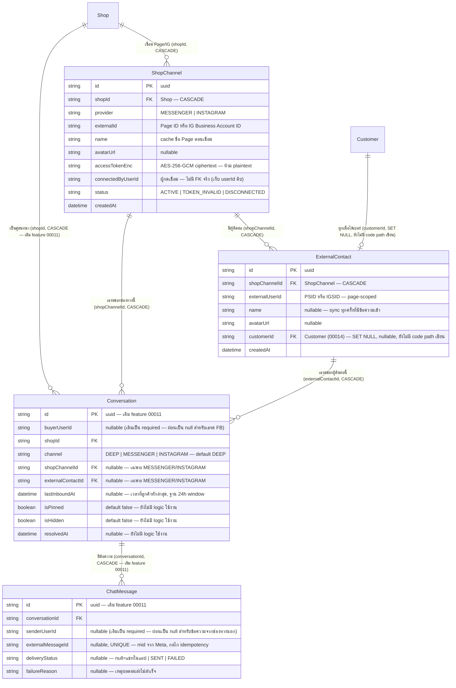

> **โมดูล:** M00018-FacebookChatIntegration
> **ประเภทเอกสาร:** DATABASE Design
> **เวอร์ชัน:** 1.0
> **วันที่จัดทำ:** 2026-07-22
> **สถานะ:** Draft — `prisma/schema.prisma` แก้แล้วและ `prisma/migrations/20260722000000_facebook_chat/migration.sql` เขียนแล้ว ตรงกันกับ schema 100%; เอกสารนี้เขียนตามไฟล์ที่มีอยู่จริงในโค้ด — **สถานะการ apply จริงบน Supabase (dev/prod แชร์กัน) ไม่ได้ยืนยันจากเอกสารนี้** ต้อง `SELECT * FROM "_prisma_migrations"` หรือเทียบคอลัมน์จริงก่อนเชื่อว่า apply แล้ว
> **เจ้าของเอกสาร:** SA/Database Agent (ดู [[Feature-Docs-Ownership]])

# DATABASE: Facebook Chat Integration

---

## 0. 🛑 ข้อควรระวังก่อนแตะ schema นี้

- **ห้าม `prisma migrate dev`** เด็ดขาด — DB dev = prod ตัวเดียวกัน (Supabase) และมี drift ที่ไม่ตรงกับ git อยู่แล้ว (ดู `docs/conventions/prisma-shared-db-drift.md`) คำสั่งนี้จะเสนอ `migrate reset` ที่ลบข้อมูลทั้ง DB
- **ห้าม `prisma db pull`** เด็ดขาด — เสี่ยง introspect ผิด/ทับ schema ที่เขียนมือ (memory `feedback_qa_agent_no_prisma_pull`)
- Apply ด้วย `prisma migrate deploy -e .env.local` เท่านั้น **หลังขอ user ยืนยันทุกครั้ง** (แตะ Supabase ที่ dev=prod แชร์กัน)
- หลัง migrate ต้อง **restart dev server** เสมอ — Prisma client เก่าไม่มี model ใหม่ → session/route พังด้วย error 500 ที่ debug ยาก

---

## 1. Overview

Facebook Chat Integration (M00018) ต่อยอด `Conversation`/`ChatMessage` เดิมของ [[../00011 - Deep Chat/DATABASE|Deep Chat (feature 00011)]] ให้ "channel-aware" — เพิ่ม 2 table ใหม่ (`ShopChannel`, `ExternalContact`) และเพิ่มคอลัมน์บน `Conversation`/`ChatMessage` เดิมแบบ additive ล้วน (ไม่ลบ ไม่เปลี่ยนชนิดข้อมูลเดิม ไม่ rename)

- **เอกสารออกแบบต้นทาง:** Design Spec `docs/superpowers/specs/2026-07-22-facebook-chat-integration-design.md` §6, [[BRD]] §8 (BR-FBC-01..22)
- **Store ที่เกี่ยวข้อง:** PostgreSQL 16 บน Supabase (DB เดียวสำหรับ dev + prod — ดู §0)
- **ORM:** Prisma (`prisma/schema.prisma`); migration = `prisma migrate deploy` + hand-written SQL (**ห้าม `migrate dev`**)
- **ไม่ใช้ RLS:** authorization อยู่ที่ `src/services/` เหมือนระบบทั้งหมด — ทุก query ต้อง scope ที่ WHERE clause (`shopId` เทียบ session เสมอ)

### สิ่งที่เปลี่ยนแปลง (สรุปภาพรวม)

| Model | การเปลี่ยนแปลง | ประเภท |
|-------|----------------|--------|
| `ShopChannel` (ใหม่) | table ใหม่ — Page/IG ที่ร้านเชื่อมไว้ (1 Shop : N channel), เก็บ token เข้ารหัส | New |
| `ExternalContact` (ใหม่) | table ใหม่ — ลูกค้าจากช่องทางนอก (PSID/IGSID), ไม่ใช่ `User` | New |
| `Conversation` (มีอยู่แล้ว, feature 00011) | `buyerUserId` → nullable; เพิ่ม `channel`, `shopChannelId`, `externalContactId`, `lastInboundAt`, `isPinned`, `isHidden`, `resolvedAt`; เพิ่ม unique + index ใหม่ | Additive + nullable-relax |
| `ChatMessage` (มีอยู่แล้ว, feature 00011) | `senderUserId` → nullable; เพิ่ม `externalMessageId` (unique), `deliveryStatus`, `failureReason` | Additive + nullable-relax |
| `Shop` (มีอยู่แล้ว) | เพิ่ม back-relation `channels ShopChannel[]` | Additive (relation only, ไม่มี DDL) |
| `Customer` (มีอยู่แล้ว, feature 00014) | เพิ่ม back-relation `externalContacts ExternalContact[]` | Additive (relation only, ไม่มี DDL) |

### สิ่งที่ตรวจสอบแล้วว่าไม่ต้องสร้าง table ใหม่เพิ่ม (ในรอบนี้)

| ความต้องการ | Derivation |
|-------------|-----------|
| แจ้งเตือน seller เมื่อมีข้อความ FB/IG เข้าใหม่ | reuse `Notification` เดิม 100% — `kind='chat_message'`, `refId=conversationId` เหมือน feature 00011 ทุกประการ ไม่มี column ใหม่ |
| ปักหมุด/ซ่อน/ปิดงานเธรด (S-7) | เพิ่มเป็น 3 คอลัมน์บน `Conversation` ที่มีอยู่แล้ว (`isPinned`/`isHidden`/`resolvedAt`) — **คอลัมน์มีจริงในรอบ migration นี้ แต่ไม่มี service/API ใดอ่าน-เขียนค่าเหล่านี้เลย** (ดู §8 Open Questions และ [[SRS]] §1.2) |
| แท็ก/โน้ตภายใน (S-8) | **ไม่มี table ใดรองรับ** — ไม่มี DDL ของฟีเจอร์นี้ในรอบ migration นี้เลย ต้องออกแบบ table ใหม่เมื่อ scope ปิด (OQ-FBC-02 ใน [[BRD]] §11) |

---

## 2. ERD



---

## 3. Tables

### 3.1 `ShopChannel` (PostgreSQL 16, Supabase — ใหม่)

Page/IG หนึ่งช่องทางที่ร้านเชื่อมไว้ (1 Shop : N channel) — เก็บ token ที่เข้ารหัสแล้วเสมอ

| Column | Type | Null | Default | Key | หมายเหตุ |
|--------|------|------|---------|-----|---------|
| `id` | `TEXT` | NO | `uuid()` (client-side, Prisma) | PK | |
| `shopId` | `TEXT` | NO | — | FK, INDEX(composite) | อ้าง `Shop.id`; `ON DELETE CASCADE` — ลบร้าน = ลบช่องทางที่ร้านนั้นเชื่อมไว้ |
| `provider` | `TEXT` | NO | — | UNIQUE(composite) | `"MESSENGER"` \| `"INSTAGRAM"` — String ตาม convention เดิมของระบบ (ไม่ใช้ enum จริง) |
| `externalId` | `TEXT` | NO | — | UNIQUE(composite) | Page ID (`provider=MESSENGER`) หรือ IG Business Account ID (`provider=INSTAGRAM`) |
| `name` | `TEXT` | NO | — | — | ชื่อ Page ณ เวลาเชื่อม (cache — ไม่ re-fetch จาก Graph API ทุกครั้งที่แสดงผล) |
| `avatarUrl` | `TEXT` | YES | NULL | — | ยังไม่มี code path เขียนค่านี้ (ไม่ได้ดึงมาตอน connect) |
| `accessTokenEnc` | `TEXT` | NO | — | — | page access token ผ่าน AES-256-GCM แล้ว (`src/lib/token-crypto.ts`) — **ห้าม plaintext ห้าม log ห้ามส่งกลับ client เด็ดขาด** |
| `connectedByUserId` | `TEXT` | NO | — | — | userId ของผู้กดเชื่อม — **ไม่มี FK ตรงไป `User`** (เก็บดิบเป็น audit reference เบา ไม่ cascade ตาม user) |
| `status` | `TEXT` | NO | `'ACTIVE'` | INDEX(composite) | `"ACTIVE"` \| `"TOKEN_INVALID"` \| `"DISCONNECTED"` — `TOKEN_INVALID` ตั้งอัตโนมัติเมื่อ Graph API คืน error code 190 (token ตาย); `DISCONNECTED` ยังไม่มี code path ใดตั้งค่านี้ (ไม่มี disconnect endpoint) |
| `createdAt` | `TIMESTAMP(3)` | NO | `CURRENT_TIMESTAMP` | — | |

**ทำไม `@@unique([provider, externalId])` ไม่ใช่ unique เดี่ยวบน `externalId`:** Page ID (Messenger) กับ IG Business Account ID (Instagram) อยู่คนละ ID space ของ Meta — ในทางทฤษฎีเลขซ้ำกันได้ (แม้โอกาสต่ำ) composite unique จึงถูก semantic กว่า และเป็น DB-level guard ตรงตาม BR-FBC-01 "1 Page ผูกได้ร้านเดียวทั้งระบบ" — พยายาม `INSERT` ซ้ำจะได้ `P2002` ที่ service ใช้แยกแยะ "Page ถูกร้านอื่นเชื่อมไปแล้ว" ออกจาก error อื่น

**ทำไม `connectedByUserId` ไม่มี FK จริง:** field นี้เป็น audit trail เบา (ใครกดเชื่อม) ไม่ใช่ ownership จริง (ownership ของช่องทางคือ `shopId`) — ถ้า user คนที่เชื่อมถูกลบ ไม่มีเหตุผลทางธุรกิจให้ลบ/orphan `ShopChannel` ตาม (ร้านยังใช้ช่องทางนั้นได้ต่อแม้คนที่เชื่อมจะลบบัญชีไปแล้ว)

### 3.2 `ExternalContact` (PostgreSQL 16, Supabase — ใหม่)

ลูกค้าจากช่องทางนอกระบบ (Facebook/Instagram) — ไม่ใช่ `User` ของ Deep, ยังไม่ใช่ `Customer` จนกว่าจะได้เบอร์

| Column | Type | Null | Default | Key | หมายเหตุ |
|--------|------|------|---------|-----|---------|
| `id` | `TEXT` | NO | `uuid()` (client-side, Prisma) | PK | |
| `shopChannelId` | `TEXT` | NO | — | FK, UNIQUE(composite) | อ้าง `ShopChannel.id`; `ON DELETE CASCADE` — ถอด/ลบช่องทาง = ลบผู้ติดต่อของช่องทางนั้น |
| `externalUserId` | `TEXT` | NO | — | UNIQUE(composite) | PSID (Messenger) หรือ IGSID (Instagram) — **page-scoped**, ห้าม dedup ข้าม Page เด็ดขาด (BR-FBC-07) |
| `name` | `TEXT` | YES | NULL | — | sync จาก Graph API (`getContactProfile`) ทุกครั้งที่มีข้อความเข้าใหม่ (ไม่ใช่แค่ตอนสร้างครั้งแรก) — ลูกค้าเปลี่ยนชื่อ/รูปโปรไฟล์แล้ว inbox ตามทัน |
| `avatarUrl` | `TEXT` | YES | NULL | — | เหมือน `name` |
| `customerId` | `TEXT` | YES | NULL | FK | อ้าง `Customer.id` (feature 00014); `ON DELETE SET NULL` — ลบ `Customer` ไม่ลบ `ExternalContact` (ประวัติเธรดยังอยู่ แค่ตัดการผูก) — **⚠️ schema พร้อมแล้ว แต่ยังไม่มี code path ใดเขียนค่านี้เลย** (รอ UI สร้างออเดอร์จากเธรด, FR-FBC-08) |
| `createdAt` | `TIMESTAMP(3)` | NO | `CURRENT_TIMESTAMP` | — | |

**ทำไม `@@unique([shopChannelId, externalUserId])` ไม่ใช่ unique เดี่ยวบน `externalUserId`:** ตรงตาม BR-FBC-07 "PSID เป็น page-scoped" — PSID เลขเดียวกันของ Page A กับ Page B เป็นคนละคนกัน (Meta ไม่รับประกัน uniqueness ข้าม Page) composite unique จึงเป็นตัวบังคับที่ DB level ว่าเราจะไม่มีวัน dedup ผิดคนข้ามเพจ

### 3.3 `Conversation` (มีอยู่แล้ว, feature 00011 — แก้เพิ่มแบบ additive)

ตารางเดิมของ Deep Chat — feature นี้ผ่อน `buyerUserId` เป็น nullable แล้วเพิ่ม 7 คอลัมน์ใหม่ ไม่มีคอลัมน์เดิมถูกลบ/เปลี่ยนชนิด

| Column | เปลี่ยนแปลง | Null | Default | Key | หมายเหตุ |
|--------|-------------|------|---------|-----|---------|
| `buyerUserId` | ผ่อนจาก `NOT NULL` → nullable | YES (เดิม NO) | — | (unique composite เดิมยังอยู่) | เธรด `channel != "DEEP"` ไม่มี `User` ฝั่งลูกค้า — เป็น `NULL` เสมอ |
| `channel` (ใหม่) | เพิ่มคอลัมน์ | NO | `'DEEP'` | — | `"DEEP"` (แชทในแอปเดิม) \| `"MESSENGER"` \| `"INSTAGRAM"` — default ทำให้ row เดิมทุกแถวได้ค่า `"DEEP"` อัตโนมัติโดยไม่ต้อง backfill script แยก |
| `shopChannelId` (ใหม่) | เพิ่มคอลัมน์ | YES | NULL | FK, UNIQUE(composite) | อ้าง `ShopChannel.id`; `ON DELETE CASCADE`; มีค่าเฉพาะเธรดช่องทางนอก |
| `externalContactId` (ใหม่) | เพิ่มคอลัมน์ | YES | NULL | FK, UNIQUE(composite) | อ้าง `ExternalContact.id`; `ON DELETE CASCADE`; มีค่าเฉพาะเธรดช่องทางนอก |
| `lastInboundAt` (ใหม่) | เพิ่มคอลัมน์ | YES | NULL | — | เวลาที่ "ลูกค้า" ส่งข้อความล่าสุด (ไม่ขยับเมื่อ echo/SHOP ตอบ) — ฐานคำนวณ 24h Messaging Window; ต่างจาก `lastMessageAt` เดิมที่ขยับได้ทั้ง 2 ฝั่ง |
| `isPinned` (ใหม่) | เพิ่มคอลัมน์ | NO | `false` | INDEX(composite) | S-7 — **มีคอลัมน์แต่ไม่มี service/API อ่าน-เขียนค่านี้เลยในรอบนี้** (ทุกแถวคงค่า `false` ถาวร) |
| `isHidden` (ใหม่) | เพิ่มคอลัมน์ | NO | `false` | INDEX(composite) | S-7 — เหมือน `isPinned` |
| `resolvedAt` (ใหม่) | เพิ่มคอลัมน์ | YES | NULL | — | S-7 — เหมือน `isPinned`, ยังไม่มี code path เขียนค่านี้ |

**ทำไม `@@unique([buyerUserId, shopId])` เดิมยังใช้ได้แม้ `buyerUserId` เป็น nullable:** PostgreSQL ไม่บังคับ unique กับค่า `NULL` (ตาม SQL standard — `NULL` ไม่เท่ากับ `NULL` เอง) เธรด FB ทุกแถวมี `buyerUserId = NULL` จึงไม่ชนกันเองแม้จะมีหลายแถว — ไม่ต้องแก้ constraint นี้เลย

**ทำไมเพิ่ม `@@unique([shopChannelId, externalContactId])` แยกอีกตัว (ไม่รวมกับตัวบน):** semantic คนละคู่ — "1 conversation ต่อคู่ (buyer, shop)" กับ "1 เธรดต่อคู่ (Page, PSID)" เป็นกฎที่ต่างเงื่อนไขกัน (เธรด DEEP ไม่มี `shopChannelId`/`externalContactId`, เธรด FB ไม่มี `buyerUserId`) รวม constraint เดียวจะครอบทั้งสองกรณีไม่ได้ ต้องแยก 2 unique index

### 3.4 `ChatMessage` (มีอยู่แล้ว, feature 00011 — แก้เพิ่มแบบ additive)

| Column | เปลี่ยนแปลง | Null | Default | Key | หมายเหตุ |
|--------|-------------|------|---------|-----|---------|
| `senderUserId` | ผ่อนจาก `NOT NULL` → nullable | YES (เดิม NO) | — | — | ข้อความจากลูกค้า FB/IG ไม่มี `User` ผู้ส่ง — เป็น `NULL`; ข้อความฝั่ง SHOP ยังมี `senderUserId` ปกติ (seller คนที่กดส่งจาก Deep) — **echo/is_echo=true ก็เป็น `NULL` เช่นกัน** (ไม่รู้ว่า seller คนไหนตอบจากมือถือ) |
| `externalMessageId` (ใหม่) | เพิ่มคอลัมน์ | YES | NULL | **UNIQUE** | `mid` จาก Meta — **กลไก idempotency ตัวเดียวที่ครอบทั้ง 2 กรณี**: (1) Meta ส่ง webhook ซ้ำ (redelivery) ด้วย `mid` เดิม (2) ข้อความที่เราส่งออกเอง (`sendOutboundMessage` เก็บ `mid` ไว้ตอน insert) แล้ว echo webhook ยิง `mid` เดียวกันกลับมาทีหลัง — ทั้งสองกรณีจะชน unique constraint นี้แล้วถูก service catch เป็น "มีอยู่แล้ว" (`DUPLICATE`) แทนที่จะสร้างแถวซ้ำ ไม่ต้องเขียน dedup logic แยกต่างหาก |
| `deliveryStatus` (ใหม่) | เพิ่มคอลัมน์ | YES | NULL | — | `NULL` = ข้อความในแอปเดิม (`channel="DEEP"`, ไม่เกี่ยวกับ field นี้เลย) \| `"SENT"` (ส่งออกสำเร็จผ่าน Graph API) \| `"FAILED"` (ส่งไม่สำเร็จ — ยังบันทึกแถวไว้ให้เห็นในเธรด ไม่ fail เงียบ) |
| `failureReason` (ใหม่) | เพิ่มคอลัมน์ | YES | NULL | — | ข้อความ error ดิบจาก `GraphApiError`/exception เมื่อ `deliveryStatus="FAILED"` |

**ทำไม `externalMessageId` เป็น `String? @unique` ไม่ใช่ `String @unique`:** ข้อความของเธรด `channel="DEEP"` (feature 00011 เดิม) ไม่มีแนวคิดเรื่อง `mid` เลย — ถ้าบังคับ `NOT NULL` จะต้องมีค่า placeholder ปลอมสำหรับทุกแถวเดิม (data pollution) `NULL` + unique (Postgres อนุญาตหลาย `NULL` ใน unique column) จึงตรงกับความจริงว่า "field นี้มีความหมายเฉพาะข้อความช่องทางนอกเท่านั้น"

---

## 4. Indexes

| Table | Columns | Type | Rationale (query pattern ที่รองรับ) |
|-------|---------|------|--------------------------------------|
| `ShopChannel` | `(provider, externalId)` | UNIQUE composite | BR-FBC-01 — 1 Page ผูกร้านเดียวทั้งระบบ; ยังเป็น index ที่ `getChannelByExternalId` ใช้ lookup ตรง (webhook ทุก event ต้อง query นี้) |
| `ShopChannel` | `(shopId, status)` | BTREE composite | `listChannels(shopId)`: `WHERE shopId=? AND status != 'DISCONNECTED'` (แม้ยังไม่มี route เรียก แต่ query pattern พร้อมรองรับ FR-FBC-11 ในอนาคต) |
| `ExternalContact` | `(shopChannelId, externalUserId)` | UNIQUE composite | BR-FBC-07 — PSID page-scoped; เป็น index ที่ `upsert` ทุกข้อความขาเข้าใช้ lookup (hot path — ทุก webhook event query นี้) |
| `Conversation` | `(shopChannelId, externalContactId)` | UNIQUE composite | "1 เธรดต่อคู่ (Page, PSID)" — get-or-create ทุกข้อความขาเข้าใช้ lookup นี้ก่อนสร้างเธรดใหม่ (กัน race แบบเดียวกับ `@@unique([buyerUserId, shopId])` เดิม) |
| `Conversation` | `(shopId, isHidden, isPinned, lastMessageAt DESC)` | BTREE composite | ออกแบบไว้ล่วงหน้าสำหรับ query หลักของหน้า `/inbox` ("ยังเปิดอยู่ + ไม่ซ่อน" เรียงหมุดขึ้นก่อน) — **ยังไม่มี query จริงใช้ index นี้ในโค้ดปัจจุบัน** (S-7 logic ยังไม่ implement) ใส่มาพร้อม migration เดียวกันเพื่อเลี่ยง `ALTER`/`CREATE INDEX` รอบสองบน DB ที่แชร์กับ prod |
| `ChatMessage` | `(externalMessageId)` | UNIQUE | BR-FBC-13 — idempotency (ดู §3.4) |

**หมายเหตุ:** ไม่มี index ใหม่บน `lastInboundAt` เดี่ยว ๆ — `getWindowState` อ่านค่านี้จากแถวที่ query ด้วย `conversationId` (PK lookup) อยู่แล้ว ไม่มี query pattern ที่ filter/sort ด้วย `lastInboundAt` โดยตรงในโค้ดปัจจุบัน

---

## 5. Migration Plan

### 5.1 ลำดับ (1 migration file, additive ล้วน — ไม่มี backfill script เพราะ default ครอบให้ทั้งหมด)

| ลำดับ | การเปลี่ยนแปลง | หมายเหตุ |
|-------|----------------|---------|
| 1 | `CREATE TABLE "ShopChannel"` + FK → `Shop` | table ใหม่ว่าง — ไม่กระทบใคร |
| 2 | `CREATE UNIQUE INDEX` `(provider, externalId)` + `CREATE INDEX` `(shopId, status)` บน `ShopChannel` | table ว่างตอนสร้าง index — ไม่มีความเสี่ยง unique violation |
| 3 | `CREATE TABLE "ExternalContact"` + FK → `ShopChannel` (CASCADE), → `Customer` (SET NULL) | table ใหม่ว่าง |
| 4 | `CREATE UNIQUE INDEX` `(shopChannelId, externalUserId)` บน `ExternalContact` | table ว่าง |
| 5 | `ALTER TABLE "Conversation" ALTER COLUMN "buyerUserId" DROP NOT NULL` | **table มี row จริง** (Deep Chat เดิม live อยู่แล้ว) — DROP NOT NULL ไม่ scan/ไม่ lock นาน (metadata-only change, ต่างจาก ADD NOT NULL ที่ต้อง full scan) |
| 6 | `ALTER TABLE "Conversation" ADD COLUMN "channel" TEXT NOT NULL DEFAULT 'DEEP'` | table มี row จริง — `ADD COLUMN ... NOT NULL DEFAULT` ใน Postgres ≥11 เป็น metadata-only (ไม่ rewrite table ทั้งก้อน) เพราะ default เป็นค่าคงที่ |
| 7 | `ALTER TABLE "Conversation" ADD COLUMN` `shopChannelId`/`externalContactId`/`lastInboundAt` (nullable, ไม่มี default) | nullable column ใหม่บน table ที่มี row จริง — metadata-only เช่นกัน |
| 8 | `ALTER TABLE "Conversation" ADD COLUMN` `isPinned`/`isHidden` (`NOT NULL DEFAULT false`), `resolvedAt` (nullable) | S-7 — ใส่รวมใน migration เดียวกันเพื่อเลี่ยง `ALTER` รอบสองบน DB ที่แชร์กับ prod (ต้นทุนความเสี่ยงของการแก้ schema ที่มี row จริงมากกว่าการเพิ่มคอลัมน์ที่ยังไม่ใช้) |
| 9 | `CREATE INDEX` `(shopId, isHidden, isPinned, lastMessageAt DESC)` บน `Conversation` | table มี row จริง — `CREATE INDEX` แบบ plain (ไม่ `CONCURRENTLY`) ล็อกตารางช่วงสร้าง แต่ `Conversation` ของระบบยังมีขนาดเล็ก (chat เพิ่งเปิดใช้จริงไม่นาน) ยอมรับได้ |
| 10 | `CREATE UNIQUE INDEX` `(shopChannelId, externalContactId)` บน `Conversation` | table มี row จริงแต่ทุกแถวเดิมมี `shopChannelId`/`externalContactId` เป็น `NULL` (คอลัมน์เพิ่งสร้างใน step 7) — Postgres ไม่บังคับ unique กับ `NULL` จึงไม่มีความเสี่ยง violation จากข้อมูลเก่า |
| 11 | `ALTER TABLE "Conversation" ADD CONSTRAINT ... FK` → `ShopChannel` (CASCADE), → `ExternalContact` (CASCADE) | FK จาก column ที่เป็น `NULL` ทุกแถวเดิม — Postgres ตรวจแค่ integrity ของค่าที่ไม่ใช่ `NULL` (ไม่มี) ปลอดภัย |
| 12 | `ALTER TABLE "ChatMessage" ALTER COLUMN "senderUserId" DROP NOT NULL` | เหมือน step 5 — metadata-only |
| 13 | `ALTER TABLE "ChatMessage" ADD COLUMN` `externalMessageId`/`deliveryStatus`/`failureReason` (nullable ทั้งหมด) | metadata-only |
| 14 | `CREATE UNIQUE INDEX` `(externalMessageId)` บน `ChatMessage` | ทุกแถวเดิมเป็น `NULL` — ไม่มีความเสี่ยง violation |

รวมเป็น 1 migration file: `prisma/migrations/20260722000000_facebook_chat/migration.sql`

### 5.2 Migration SQL

ดูไฟล์เต็ม `prisma/migrations/20260722000000_facebook_chat/migration.sql` (ตรงกับ `prisma/schema.prisma` 100%) — สรุปสาระสำคัญ (ตัดคอมเมนต์):

```sql
CREATE TABLE "ShopChannel" (
  "id" TEXT NOT NULL, "shopId" TEXT NOT NULL, "provider" TEXT NOT NULL,
  "externalId" TEXT NOT NULL, "name" TEXT NOT NULL, "avatarUrl" TEXT,
  "accessTokenEnc" TEXT NOT NULL, "connectedByUserId" TEXT NOT NULL,
  "status" TEXT NOT NULL DEFAULT 'ACTIVE',
  "createdAt" TIMESTAMP(3) NOT NULL DEFAULT CURRENT_TIMESTAMP,
  CONSTRAINT "ShopChannel_pkey" PRIMARY KEY ("id")
);
CREATE UNIQUE INDEX "ShopChannel_provider_externalId_key" ON "ShopChannel"("provider", "externalId");
CREATE INDEX "ShopChannel_shopId_status_idx" ON "ShopChannel"("shopId", "status");
ALTER TABLE "ShopChannel" ADD CONSTRAINT "ShopChannel_shopId_fkey"
  FOREIGN KEY ("shopId") REFERENCES "Shop"("id") ON DELETE CASCADE ON UPDATE CASCADE;

CREATE TABLE "ExternalContact" (
  "id" TEXT NOT NULL, "shopChannelId" TEXT NOT NULL, "externalUserId" TEXT NOT NULL,
  "name" TEXT, "avatarUrl" TEXT, "customerId" TEXT,
  "createdAt" TIMESTAMP(3) NOT NULL DEFAULT CURRENT_TIMESTAMP,
  CONSTRAINT "ExternalContact_pkey" PRIMARY KEY ("id")
);
CREATE UNIQUE INDEX "ExternalContact_shopChannelId_externalUserId_key"
  ON "ExternalContact"("shopChannelId", "externalUserId");
ALTER TABLE "ExternalContact" ADD CONSTRAINT "ExternalContact_shopChannelId_fkey"
  FOREIGN KEY ("shopChannelId") REFERENCES "ShopChannel"("id") ON DELETE CASCADE ON UPDATE CASCADE;
ALTER TABLE "ExternalContact" ADD CONSTRAINT "ExternalContact_customerId_fkey"
  FOREIGN KEY ("customerId") REFERENCES "Customer"("id") ON DELETE SET NULL ON UPDATE CASCADE;

ALTER TABLE "Conversation" ALTER COLUMN "buyerUserId" DROP NOT NULL;
ALTER TABLE "Conversation" ADD COLUMN "channel" TEXT NOT NULL DEFAULT 'DEEP';
ALTER TABLE "Conversation" ADD COLUMN "shopChannelId" TEXT;
ALTER TABLE "Conversation" ADD COLUMN "externalContactId" TEXT;
ALTER TABLE "Conversation" ADD COLUMN "lastInboundAt" TIMESTAMP(3);
ALTER TABLE "Conversation" ADD COLUMN "isPinned" BOOLEAN NOT NULL DEFAULT false;
ALTER TABLE "Conversation" ADD COLUMN "isHidden" BOOLEAN NOT NULL DEFAULT false;
ALTER TABLE "Conversation" ADD COLUMN "resolvedAt" TIMESTAMP(3);
CREATE INDEX "Conversation_shopId_isHidden_isPinned_lastMessageAt_idx"
  ON "Conversation"("shopId", "isHidden", "isPinned", "lastMessageAt" DESC);
CREATE UNIQUE INDEX "Conversation_shopChannelId_externalContactId_key"
  ON "Conversation"("shopChannelId", "externalContactId");
ALTER TABLE "Conversation" ADD CONSTRAINT "Conversation_shopChannelId_fkey"
  FOREIGN KEY ("shopChannelId") REFERENCES "ShopChannel"("id") ON DELETE CASCADE ON UPDATE CASCADE;
ALTER TABLE "Conversation" ADD CONSTRAINT "Conversation_externalContactId_fkey"
  FOREIGN KEY ("externalContactId") REFERENCES "ExternalContact"("id") ON DELETE CASCADE ON UPDATE CASCADE;

ALTER TABLE "ChatMessage" ALTER COLUMN "senderUserId" DROP NOT NULL;
ALTER TABLE "ChatMessage" ADD COLUMN "externalMessageId" TEXT;
ALTER TABLE "ChatMessage" ADD COLUMN "deliveryStatus" TEXT;
ALTER TABLE "ChatMessage" ADD COLUMN "failureReason" TEXT;
CREATE UNIQUE INDEX "ChatMessage_externalMessageId_key" ON "ChatMessage"("externalMessageId");
```

### 5.3 วิธี Apply

```bash
npx prisma generate
npx prisma validate
# 🛑 prod = dev Supabase แชร์กัน — ขอ user ยืนยันก่อนทุกครั้ง
npx dotenv -e .env.local -- npx prisma migrate deploy
npx prisma generate   # generate ใหม่หลัง apply
# แจ้ง user restart dev server (client เก่าไม่มี field ใหม่ → session/route 500)
```

**สถานะจริง ณ วันที่เขียนเอกสารนี้:** `prisma/schema.prisma` และ migration file sync กันแล้วในโค้ด (validate ผ่าน) — เอกสารนี้**ไม่ยืนยัน**ว่า `migrate deploy` ถูกรันจริงบน Supabase หรือยัง (ไม่มีเครื่องมือตรวจสอบ DB state จากงานเขียนเอกสาร) ตรวจสอบก่อนเริ่มงานถัดไปด้วย `SELECT * FROM "_prisma_migrations" WHERE migration_name LIKE '%facebook_chat%'` หรือ query คอลัมน์จริงของ `Conversation`

### 5.4 Rollback

| Migration step | Rollback | ผลกระทบ |
|-----------------|----------|---------|
| `CREATE TABLE "ExternalContact"` (+ FK, index) | `DROP TABLE "ExternalContact";` | ปลอดภัยก่อนมีข้อความ FB จริงเกิดขึ้น; หลัง launch = data loss จริง (ผู้ติดต่อ FB/IG ทั้งหมดหาย — ต้อง `DROP` ก่อน `ShopChannel` เสมอเพราะ FK) |
| `CREATE TABLE "ShopChannel"` (+ FK, unique, index) | `DROP TABLE "ShopChannel" CASCADE;` (cascade ลบ `ExternalContact`+`Conversation` ที่อ้างถึงด้วย) | หลัง launch = data loss ทั้งการเชื่อมต่อ + ประวัติเธรด FB ทั้งหมด |
| `ADD COLUMN` บน `Conversation`/`ChatMessage` (`channel`, `shopChannelId`, ฯลฯ) | `ALTER TABLE ... DROP COLUMN ...` (ทีละคอลัมน์) | เธรด `channel="DEEP"` เดิมไม่กระทบ (คอลัมน์ที่ลบเป็นของ feature นี้ล้วน); เธรด FB ที่มีอยู่แล้วจะข้อมูลหายถ้ามี |
| `ALTER COLUMN "buyerUserId"/"senderUserId" DROP NOT NULL` | **rollback ยาก** — ต้อง backfill ค่า placeholder ก่อนจะ `SET NOT NULL` กลับได้ (ถ้ามีแถว FB ที่ `buyerUserId=NULL` อยู่แล้วจะ `SET NOT NULL` ไม่ผ่านจนกว่าจะลบ/แก้แถวเหล่านั้นก่อน) | ต้องมีแผนเฉพาะถ้าจะ rollback หลัง launch จริง — ไม่ใช่ operation ที่ reverse ตรงไปตรงมา |
| Index ทั้งหมด | `DROP INDEX ...` | ไม่มี data loss กระทบ performance เท่านั้น |

**สรุป rollback:** ปลอดภัยสมบูรณ์เฉพาะก่อนมีข้อความ FB/IG จริงเกิดขึ้น — หลัง launch (มี `ShopChannel`/`ExternalContact`/เธรด FB จริง) rollback ต้อง export ข้อมูลก่อนเสมอ และ `DROP NOT NULL` ของ `buyerUserId`/`senderUserId` ไม่มีทาง revert ตรงไปตรงมาถ้ามีแถว FB ที่ `NULL` อยู่แล้ว

### 5.5 ผลกระทบ

- **Downtime:** ไม่มี — table ใหม่ 2 ตัวว่างตอนสร้าง; `ADD COLUMN ... DEFAULT` และ `DROP NOT NULL` บน `Conversation`/`ChatMessage` เป็น metadata-only operation ใน Postgres ≥11 (ไม่ rewrite/scan table ทั้งก้อน)
- **ตารางที่มี row จริง (`Conversation`, `ChatMessage`):** ต่างจาก `ShopChannel`/`ExternalContact` (ตารางใหม่ว่าง) — การ `ALTER` 2 ตารางนี้แตะข้อมูลจริงของ Deep Chat ที่ live อยู่ก่อนแล้ว ต้องระวังเป็นพิเศษเทียบกับ table ใหม่ (ดู §5.1 step 5-14 สำหรับเหตุผลที่แต่ละ step ปลอดภัย)
- **Backward compat:** เธรด `channel="DEEP"` เดิมได้ค่า `channel='DEEP'` อัตโนมัติจาก `DEFAULT` — ไม่ต้อง backfill script แยก, query เดิมของ feature 00011 (`chat.service.ts`) ทำงานเหมือนเดิมทุกประการ (ไม่มี query ใดถูกบังคับให้ join table ใหม่)
- **Growth risk:** `ShopChannel`/`ExternalContact` โตตามจำนวน Page ที่เชื่อม/ลูกค้าที่ทักเข้ามา — คาดว่าอัตราการเติบโตต่ำกว่า `ChatMessage` มาก (ไม่ต้องพิจารณา partition ในรอบนี้)

---

## 6. Retention / ข้อควรระวัง

- **Data Retention:** ไม่มี retention/archive job — เหมือนระบบ Deep Chat เดิม เก็บถาวรตราบเท่าที่ `Shop`/`Conversation` ที่เกี่ยวข้องไม่ถูกลบ (CASCADE)
- **PII / ข้อมูลอ่อนไหว:**
  - `ShopChannel.accessTokenEnc` — **secret ระดับสูงสุดของ feature นี้** เข้ารหัส AES-256-GCM เสมอ ห้าม log ห้ามส่งกลับ client ทุกกรณี (`shop-channel.service.ts` ใช้ Prisma `select` allow-list กันหลุดจาก `listChannels`)
  - `ExternalContact.name`/`avatarUrl`, `ChatMessage.body`/`imageUrl` — เนื้อหา/ตัวตนลูกค้าจริง เทียบเท่า `Order.buyerContact` ต้อง **neutralize-at-source** ก่อน serialize เข้า RSC flight เมื่อมี UI ในอนาคต (BR-FBC-21) — schema ไม่มี field-level encryption สำหรับข้อมูลกลุ่มนี้ (ตาม convention เดิมของระบบ)
- **Ownership scope ต้องอยู่ที่ WHERE clause เสมอ:** ทุก query `ShopChannel`/`ExternalContact`/`Conversation` (เธรด FB) ต้อง filter `shopId` เทียบ session ที่ service layer — ไม่มี RLS
- **Performance:** `ChatMessage` insert ของเธรด FB ยังอยู่ใน pattern เดียวกับ feature 00011 (update snapshot `Conversation` ใน transaction เดียวกันเสมอ) — `mirrorRemoteImage` (network call) ถูกจงใจแยกออกนอก transaction เพื่อไม่ถือ lock DB นาน (ดู [[SDS]] TD-004)
- **Consistency ข้าม store:** ไม่มี — ทุกอย่างอยู่ใน Postgres เดียว; token ที่เก็บใน DB (เข้ารหัสแล้ว) กับ token จริงฝั่ง Meta อาจ desync ได้ถ้า Meta revoke จากฝั่งเขา (ไม่มี webhook แจ้งเหตุการณ์นี้โดยตรง — ระบบรู้ก็ต่อเมื่อยิง Send API แล้วเจอ error code 190)

---

## 7. Traceability

| Table / Field | BRD | SDS | สถานะ |
|--------------|-----|-----|-------|
| `ShopChannel` (ทั้ง table) | BR-FBC-01/02/03/04/05/20 | Component `shop-channel.service.ts` | Implemented |
| `ExternalContact` (ทั้ง table) | BR-FBC-06/07/08 | Component `channel-chat.service.ts` | Implemented |
| `ExternalContact.customerId` | BR-FBC-06 (FR-FBC-08) | — | schema พร้อม, **ไม่มี code path เขียนค่า** |
| `Conversation.channel/shopChannelId/externalContactId/lastInboundAt` | BR-FBC-08/09/10/11/13 | Flow 4.1/4.2 | Implemented |
| `Conversation.isPinned/isHidden/resolvedAt` | BR-FBC-14/15/16 | — | schema พร้อม, **logic ยังไม่ implement** |
| `ChatMessage.externalMessageId/deliveryStatus/failureReason` | BR-FBC-12/13 | Flow 4.1/4.2, TD-003 | Implemented |

---

## 8. Open Questions

1. **`isPinned`/`isHidden`/`resolvedAt` มีคอลัมน์แต่ไม่มี logic ใช้งาน** — ต้องมี service function (toggle pin/hide/resolve) + API endpoint + auto-unhide/auto-reopen เมื่อลูกค้าทักใหม่ (ตาม BR-FBC-15/16) ก่อนถือว่า S-7 เสร็จสมบูรณ์ — รอ OQ-FBC-03 ใน [[BRD]] §11 (ยืนยัน default behavior auto-unhide/auto-reopen) ปิดก่อน
2. **แท็ก/โน้ตภายใน (S-8) ไม่มี table เลย** — ต้องออกแบบ schema ใหม่ (table `ConversationTag`/`ConversationNote` หรือเทียบเท่า) เมื่อ OQ-FBC-02 ปิด (ตัดสินใจเรื่อง tab ใบเสนอราคา)
3. **`ExternalContact.customerId` write path** — ต้องออกแบบตอนทำ UI สร้างออเดอร์จากเธรด (FR-FBC-07/08) ว่าจะ derive `Customer` จากเบอร์ที่กรอกอย่างไร (reuse logic เดียวกับ `Order.customerId` derive ของ feature 00014 หรือไม่)
4. **`ShopChannel.status='DISCONNECTED'`** — schema/service (`getChannelByExternalId` เช็คค่านี้แล้ว) พร้อมรองรับ แต่ไม่มีทางเข้าถึงจาก client — ต้องออกแบบ disconnect endpoint (soft — เปลี่ยน status ไม่ลบแถว เพื่อคง `@@unique([provider, externalId])` กันคนอื่นเชื่อม Page เดิมซ้ำจนกว่าจะแน่ใจ หรือ hard delete — ยังไม่ตัดสินใจ)

---

## 9. สรุป (Summary)

Migration ของ feature นี้เป็น **2 table ใหม่ทั้งหมด** (`ShopChannel`, `ExternalContact`) + **แก้ 2 table เดิมของ feature 00011 แบบ additive** (`Conversation` ผ่อน `buyerUserId` nullable + เพิ่ม 7 คอลัมน์, `ChatMessage` ผ่อน `senderUserId` nullable + เพิ่ม 3 คอลัมน์) — ไม่มี table ใดถูก drop/rename, ไม่มีคอลัมน์เดิมถูกลบ, ทุก `ALTER` บนตารางที่มี row จริงเป็น metadata-only operation (ปลอดภัยสำหรับ DB ที่ dev=prod แชร์กัน)

**กลไกสำคัญที่ schema นี้ enforce ที่ DB level:**
- 1 Page ผูกได้ร้านเดียวทั้งระบบ (`ShopChannel` unique `[provider, externalId]`)
- PSID/IGSID ห้าม dedup ข้าม Page (`ExternalContact` unique `[shopChannelId, externalUserId]`)
- 1 เธรดต่อคู่ (Page, PSID) (`Conversation` unique `[shopChannelId, externalContactId]`)
- Idempotency กัน webhook redelivery + echo ของข้อความที่ส่งเอง ด้วยกลไกเดียว (`ChatMessage.externalMessageId` unique)

**คอลัมน์ที่มีแล้วแต่ยังไม่มี logic ใช้งาน (ต้องระวังไม่ให้เข้าใจผิดว่า feature เสร็จสมบูรณ์):** `Conversation.isPinned`/`isHidden`/`resolvedAt` (S-7), `ExternalContact.customerId` (write path ยังไม่มี) — ดู §8 Open Questions

**Open Questions ที่ flag ให้แผนถัดไป:** S-7 logic (#1), S-8 schema ใหม่ทั้งหมด (#2), `customerId` write path (#3), disconnect endpoint (#4)
