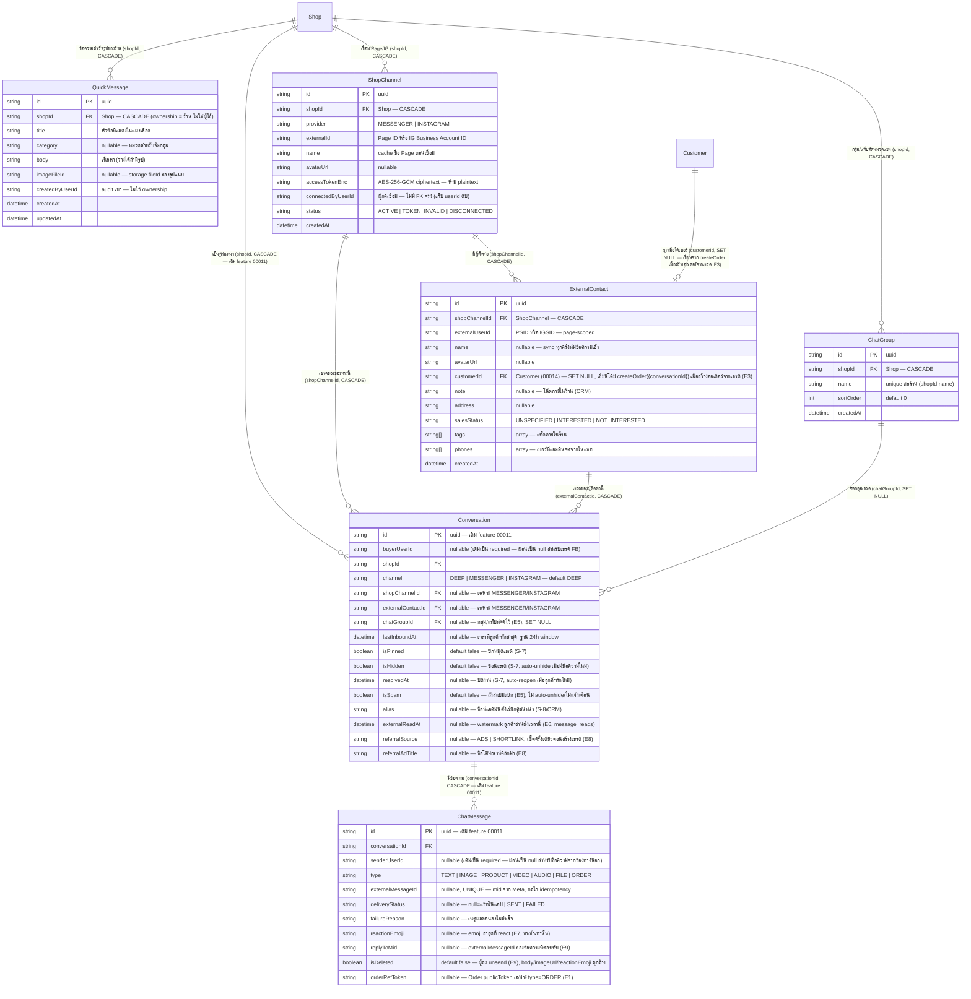

> **โมดูล:** M00018-FacebookChatIntegration
> **ประเภทเอกสาร:** DATABASE Design
> **เวอร์ชัน:** 1.2
> **วันที่จัดทำ:** 2026-07-22
> **สถานะ:** Draft — `prisma/schema.prisma` แก้แล้วและ migration files เขียนแล้ว ตรงกันกับ schema 100%; เอกสารนี้เขียนตามไฟล์ที่มีอยู่จริงในโค้ด — **สถานะการ apply จริงบน Supabase (dev/prod แชร์กัน) ไม่ได้ยืนยันจากเอกสารนี้** ต้อง `SELECT * FROM "_prisma_migrations"` หรือเทียบคอลัมน์จริงก่อนเชื่อว่า apply แล้ว
>
> **สถานะการ apply (2026-07-23):** migration ทั้ง 3 ไฟล์แรกของฟีเจอร์นี้ (`20260722000000_facebook_chat`,
> `20260723000100_quick_message`, `20260723000200_chat_crm`) apply บน Supabase แล้ว — พิสูจน์ทางอ้อมจาก
> ฟีเจอร์ที่ใช้ table/คอลัมน์เหล่านี้ทำงานได้จริงบน prod; ถ้าต้องการยืนยันตรง ๆ ให้เทียบกับ
> `SELECT migration_name FROM "_prisma_migrations"`
>
> 🔄 **v1.2 (2026-07-25) — doc-sync ตามของจริงบน prod (Phase 2/3 extensions):** เพิ่ม table `ChatGroup`
> (migration `20260723130000_chat_group`) + คอลัมน์ `Conversation.isSpam`/`externalReadAt`/`chatGroupId`/
> `referralSource`/`referralAdTitle` + คอลัมน์ `ChatMessage.reactionEmoji`/`replyToMid`/`isDeleted`/
> `orderRefToken` (migration `20260725100000_chat_reaction_referral`, `20260725110000_chat_reply_unsend`,
> `20260725000000_chat_order_card` — `orderRefToken` มีรายละเอียดเต็มที่ [[EXTENSIONS-2026-07-25]] E1)
> — รายละเอียด requirement/business rule เต็มของแต่ละส่วนอยู่ที่ [[EXTENSIONS-2026-07-25]] (E1, E5-E9)
> **โค้ดขึ้น prod ก่อนเอกสาร = หนี้ Hard Rule 11 ที่ back-fill ต่อเนื่องจาก v1.1**
>
> 🔄 **v1.1 (2026-07-23) — doc-sync ตามของจริงบน prod:** เพิ่ม FR-FBC-15/16/17 (ข้อความสำเร็จรูป, AI ช่วยร่างคำตอบ, เครื่องมือ composer + ไฟล์แนบวิดีโอ/เสียง/ไฟล์), BR-FBC-23..27, TFR-FBC-12..14, table `QuickMessage` + คอลัมน์ CRM, endpoint quick-messages/ai-suggest/crm และปรับสถานะรายการที่ implement ไปแล้ว (S-7/S-8/หน้า channels). **โค้ดขึ้น prod ก่อนเอกสาร = หนี้ Hard Rule 11 ที่ back-fill ในรอบนี้**
> **เจ้าของเอกสาร:** SA/Database Agent (ดู [[Feature-Docs-Ownership]])

# DATABASE: Facebook Chat Integration

---

## 0. 🛑 ข้อควรระวังก่อนแตะ schema นี้

- **ห้าม `prisma migrate dev`** เด็ดขาด — DB dev = prod ตัวเดียวกัน (Supabase) และมี drift ที่ไม่ตรงกับ git อยู่แล้ว (ดู `docs/conventions/prisma-shared-db-drift.md`) คำสั่งนี้จะเสนอ `migrate reset` ที่ลบข้อมูลทั้ง DB
- **ห้าม `prisma db pull`** เด็ดขาด — เสี่ยง introspect ผิด/ทับ schema ที่เขียนมือ (memory `feedback_qa_agent_no_prisma_pull`)
- Apply ด้วย `prisma migrate deploy -e .env.local` เท่านั้น **หลังขอ user ยืนยันทุกครั้ง** (แตะ Supabase ที่ dev=prod แชร์กัน)
- หลัง migrate ต้อง **restart dev server** เสมอ — Prisma client เก่าไม่มี model ใหม่ → session/route พังด้วย error 500 ที่ debug ยาก

---

## 1. Overview

Facebook Chat Integration (M00018) ต่อยอด `Conversation`/`ChatMessage` เดิมของ [[../00011 - Deep Chat/DATABASE|Deep Chat (feature 00011)]] ให้ "channel-aware" — เพิ่ม 2 table ใหม่ (`ShopChannel`, `ExternalContact`) และเพิ่มคอลัมน์บน `Conversation`/`ChatMessage` เดิมแบบ additive ล้วน (ไม่ลบ ไม่เปลี่ยนชนิดข้อมูลเดิม ไม่ rename)

- **เอกสารออกแบบต้นทาง:** Design Spec `docs/superpowers/specs/2026-07-22-facebook-chat-integration-design.md` §6, [[BRD]] §8 (BR-FBC-01..22)
- **Store ที่เกี่ยวข้อง:** PostgreSQL 16 บน Supabase (DB เดียวสำหรับ dev + prod — ดู §0)
- **ORM:** Prisma (`prisma/schema.prisma`); migration = `prisma migrate deploy` + hand-written SQL (**ห้าม `migrate dev`**)
- **ไม่ใช้ RLS:** authorization อยู่ที่ `src/services/` เหมือนระบบทั้งหมด — ทุก query ต้อง scope ที่ WHERE clause (`shopId` เทียบ session เสมอ)

### สิ่งที่เปลี่ยนแปลง (สรุปภาพรวม)

| Model | การเปลี่ยนแปลง | ประเภท |
|-------|----------------|--------|
| `ShopChannel` (ใหม่) | table ใหม่ — Page/IG ที่ร้านเชื่อมไว้ (1 Shop : N channel), เก็บ token เข้ารหัส | New |
| `ExternalContact` (ใหม่) | table ใหม่ — ลูกค้าจากช่องทางนอก (PSID/IGSID), ไม่ใช่ `User` | New |
| `Conversation` (มีอยู่แล้ว, feature 00011) | `buyerUserId` → nullable; เพิ่ม `channel`, `shopChannelId`, `externalContactId`, `lastInboundAt`, `isPinned`, `isHidden`, `resolvedAt`; เพิ่ม unique + index ใหม่ | Additive + nullable-relax |
| `ChatMessage` (มีอยู่แล้ว, feature 00011) | `senderUserId` → nullable; เพิ่ม `externalMessageId` (unique), `deliveryStatus`, `failureReason` | Additive + nullable-relax |
| `Shop` (มีอยู่แล้ว) | เพิ่ม back-relation `channels ShopChannel[]` | Additive (relation only, ไม่มี DDL) |
| `Customer` (มีอยู่แล้ว, feature 00014) | เพิ่ม back-relation `externalContacts ExternalContact[]` | Additive (relation only, ไม่มี DDL) |
| `QuickMessage` (ใหม่ 2026-07-23) | table ใหม่ — ข้อความสำเร็จรูประดับร้าน (FR-FBC-15) migration `20260723000100_quick_message` | New |
| `ExternalContact` (รอบสอง 2026-07-23) | เพิ่ม `note`, `address`, `salesStatus`, `tags[]`, `phones[]` (CRM ต่อผู้ติดต่อ, FR-FBC-14) migration `20260723000200_chat_crm` | Additive |
| `Conversation` (รอบสอง 2026-07-23) | เพิ่ม `alias` (ชื่อที่แอดมินตั้งเรียกคู่สนทนาในเธรดนี้) migration เดียวกัน | Additive |
| `ChatGroup` (ใหม่ 2026-07-23) | table ใหม่ — กลุ่ม/แท็บจัดหมวดแชทระดับร้าน migration `20260723130000_chat_group` (ดู [[EXTENSIONS-2026-07-25]] E5) | New |
| `Conversation` (รอบสาม 2026-07-23) | เพิ่ม `chatGroupId` (FK `ChatGroup`, SET NULL) migration `20260723130000_chat_group` เดียวกันกับ table ข้างบน | Additive |
| `Conversation` (รอบสี่ 2026-07-25) | เพิ่ม `referralSource`, `referralAdTitle` (context "ทักจากไหน") migration `20260725100000_chat_reaction_referral` (ดู [[EXTENSIONS-2026-07-25]] E8) | Additive |
| `Conversation` (รอบห้า 2026-07-26) | เพิ่ม `referralAdId`, `referralPhotoFileId` migration `20260726160000_chat_ad_referral_banner` — **และเปลี่ยนความหมายของ `referralSource`/`referralAdTitle` จาก "แรกเข้า" เป็น "ล่าสุด"** (ไม่ใช่การเปลี่ยน schema แต่เปลี่ยน write path: อัปเดตทุกครั้งที่รับ referral) ดู [[EXTENSIONS-2026-07-26]] E5 | Additive |
| `ConversationAdReferral` (ใหม่ 2026-07-26) | table ใหม่ — ประวัติที่มาจากโฆษณา 1 แถวต่อการคลิก 1 ครั้ง (FK `Conversation` CASCADE, index `[conversationId, receivedAt]`) migration `20260726160000_chat_ad_referral_banner`. **จำเป็นต้องเป็น table ไม่ใช่คอลัมน์** เพราะ Meta ไม่มี Graph API ให้อ่าน referral ย้อนหลัง — ค่าล่าสุดทับของเดิม = ประวัติหายถาวร | New |
| `ChatMessage` (รอบสาม 2026-07-25) | เพิ่ม `reactionEmoji` migration `20260725100000_chat_reaction_referral` (ดู [[EXTENSIONS-2026-07-25]] E7) | Additive |
| `ChatMessage` (รอบสี่ 2026-07-25) | เพิ่ม `replyToMid`, `isDeleted` (default false) migration `20260725110000_chat_reply_unsend` (ดู [[EXTENSIONS-2026-07-25]] E9) | Additive |
| `ChatMessage` (รอบห้า 2026-07-25) | เพิ่ม `orderRefToken` (การ์ดออเดอร์ในแชท) migration `20260725000000_chat_order_card` (ดู [[EXTENSIONS-2026-07-25]] E1) | Additive |
| `Conversation.isSpam` | คอลัมน์มีจริงใน `prisma/schema.prisma` (comment: "user สั่ง 2026-07-24") และใช้งานจริงใน `updateConversationState`/`listConversationsForShop` — **ไม่พบชื่อไฟล์ migration ที่เพิ่มคอลัมน์นี้ชัดเจนในรอบตรวจของเอกสารนี้** (ไม่อยู่ใน `20260722000000_facebook_chat`/`20260723000*`/`20260723130000_chat_group` ที่ตรวจแล้ว) — ต้องยืนยันเพิ่มก่อนเชื่อว่า apply ครบ | Additive (ยืนยันคอลัมน์แล้ว, migration ต้นทางยังไม่ยืนยัน) |
| `Conversation.externalReadAt` | เช่นเดียวกับ `isSpam` — คอลัมน์มีจริงและใช้งานจริงใน `ingestReadEvent` (`channel-chat.service.ts`, ดู [[EXTENSIONS-2026-07-25]] E6) แต่**ไม่พบชื่อไฟล์ migration ต้นทางในรอบตรวจนี้** | Additive (ยืนยันคอลัมน์แล้ว, migration ต้นทางยังไม่ยืนยัน) |

### สิ่งที่ตรวจสอบแล้วว่าไม่ต้องสร้าง table ใหม่เพิ่ม (ในรอบนี้)

| ความต้องการ | Derivation |
|-------------|-----------|
| แจ้งเตือน seller เมื่อมีข้อความ FB/IG เข้าใหม่ | reuse `Notification` เดิม 100% — `kind='chat_message'`, `refId=conversationId` เหมือน feature 00011 ทุกประการ ไม่มี column ใหม่ |
| ปักหมุด/ซ่อน/ปิดงานเธรด (S-7) | เพิ่มเป็น 3 คอลัมน์บน `Conversation` ที่มีอยู่แล้ว (`isPinned`/`isHidden`/`resolvedAt`) — **อัปเดต 2026-07-23: ใช้งานจริงแล้ว** ผ่าน `updateConversationState` + `PATCH /api/chat/conversations/[id]` |
| แท็ก/โน้ตภายใน (S-8) | **อัปเดต 2026-07-23: ไม่ต้องมี table ใหม่** — เก็บเป็นคอลัมน์บน `ExternalContact` (`note`/`address`/`salesStatus`/`tags[]`/`phones[]`) + `Conversation.alias` แทน (ดู §3.6) เพราะทุกฟิลด์เป็น 1:1 กับผู้ติดต่อ/เธรด ไม่มี query ที่ต้อง join/aggregate แท็กข้ามผู้ติดต่อใน MVP |

---

## 2. ERD



---

## 3. Tables

### 3.1 `ShopChannel` (PostgreSQL 16, Supabase — ใหม่)

Page/IG หนึ่งช่องทางที่ร้านเชื่อมไว้ (1 Shop : N channel) — เก็บ token ที่เข้ารหัสแล้วเสมอ

| Column | Type | Null | Default | Key | หมายเหตุ |
|--------|------|------|---------|-----|---------|
| `id` | `TEXT` | NO | `uuid()` (client-side, Prisma) | PK | |
| `shopId` | `TEXT` | NO | — | FK, INDEX(composite) | อ้าง `Shop.id`; `ON DELETE CASCADE` — ลบร้าน = ลบช่องทางที่ร้านนั้นเชื่อมไว้ |
| `provider` | `TEXT` | NO | — | UNIQUE(composite) | `"MESSENGER"` \| `"INSTAGRAM"` — String ตาม convention เดิมของระบบ (ไม่ใช้ enum จริง) |
| `externalId` | `TEXT` | NO | — | UNIQUE(composite) | Page ID (`provider=MESSENGER`) หรือ IG Business Account ID (`provider=INSTAGRAM`) |
| `name` | `TEXT` | NO | — | — | ชื่อ Page ณ เวลาเชื่อม (cache — ไม่ re-fetch จาก Graph API ทุกครั้งที่แสดงผล) |
| `avatarUrl` | `TEXT` | YES | NULL | — | ยังไม่มี code path เขียนค่านี้ (ไม่ได้ดึงมาตอน connect) |
| `accessTokenEnc` | `TEXT` | NO | — | — | page access token ผ่าน AES-256-GCM แล้ว (`src/lib/token-crypto.ts`) — **ห้าม plaintext ห้าม log ห้ามส่งกลับ client เด็ดขาด** |
| `connectedByUserId` | `TEXT` | NO | — | — | userId ของผู้กดเชื่อม — **ไม่มี FK ตรงไป `User`** (เก็บดิบเป็น audit reference เบา ไม่ cascade ตาม user) |
| `status` | `TEXT` | NO | `'ACTIVE'` | INDEX(composite) | `"ACTIVE"` \| `"TOKEN_INVALID"` \| `"DISCONNECTED"` — `TOKEN_INVALID` ตั้งอัตโนมัติเมื่อ Graph API คืน error code 190 (token ตาย); `DISCONNECTED` ตั้งผ่าน `DELETE /api/channels/[id]` (`disconnectChannel()`, soft — ไม่ลบแถว, ตั้งแต่ 2026-07-23 — แก้จาก v1.1 ที่ยังบันทึกว่า "ไม่มี code path") |
| `createdAt` | `TIMESTAMP(3)` | NO | `CURRENT_TIMESTAMP` | — | |

**ทำไม `@@unique([provider, externalId])` ไม่ใช่ unique เดี่ยวบน `externalId`:** Page ID (Messenger) กับ IG Business Account ID (Instagram) อยู่คนละ ID space ของ Meta — ในทางทฤษฎีเลขซ้ำกันได้ (แม้โอกาสต่ำ) composite unique จึงถูก semantic กว่า และเป็น DB-level guard ตรงตาม BR-FBC-01 "1 Page ผูกได้ร้านเดียวทั้งระบบ" — พยายาม `INSERT` ซ้ำจะได้ `P2002` ที่ service ใช้แยกแยะ "Page ถูกร้านอื่นเชื่อมไปแล้ว" ออกจาก error อื่น

**ทำไม `connectedByUserId` ไม่มี FK จริง:** field นี้เป็น audit trail เบา (ใครกดเชื่อม) ไม่ใช่ ownership จริง (ownership ของช่องทางคือ `shopId`) — ถ้า user คนที่เชื่อมถูกลบ ไม่มีเหตุผลทางธุรกิจให้ลบ/orphan `ShopChannel` ตาม (ร้านยังใช้ช่องทางนั้นได้ต่อแม้คนที่เชื่อมจะลบบัญชีไปแล้ว)

### 3.2 `ExternalContact` (PostgreSQL 16, Supabase — ใหม่)

ลูกค้าจากช่องทางนอกระบบ (Facebook/Instagram) — ไม่ใช่ `User` ของ Deep, ยังไม่ใช่ `Customer` จนกว่าจะได้เบอร์

| Column | Type | Null | Default | Key | หมายเหตุ |
|--------|------|------|---------|-----|---------|
| `id` | `TEXT` | NO | `uuid()` (client-side, Prisma) | PK | |
| `shopChannelId` | `TEXT` | NO | — | FK, UNIQUE(composite) | อ้าง `ShopChannel.id`; `ON DELETE CASCADE` — ถอด/ลบช่องทาง = ลบผู้ติดต่อของช่องทางนั้น |
| `externalUserId` | `TEXT` | NO | — | UNIQUE(composite) | PSID (Messenger) หรือ IGSID (Instagram) — **page-scoped**, ห้าม dedup ข้าม Page เด็ดขาด (BR-FBC-07) |
| `name` | `TEXT` | YES | NULL | — | sync จาก Graph API (`getContactProfile`) ทุกครั้งที่มีข้อความเข้าใหม่ (ไม่ใช่แค่ตอนสร้างครั้งแรก) — ลูกค้าเปลี่ยนชื่อ/รูปโปรไฟล์แล้ว inbox ตามทัน |
| `avatarUrl` | `TEXT` | YES | NULL | — | เหมือน `name` |
| `customerId` | `TEXT` | YES | NULL | FK | อ้าง `Customer.id` (feature 00014); `ON DELETE SET NULL` — ลบ `Customer` ไม่ลบ `ExternalContact` (ประวัติเธรดยังอยู่ แค่ตัดการผูก) — **เขียนแล้ว** ผ่าน `createOrder({conversationId})` เมื่อสร้างออเดอร์จากโมดัลในแชท (E3, [[EXTENSIONS-2026-07-25]]) — atomic ในทรานแซกชันเดียวกับ insert `Order`; ownership scope `{conversation.id, shopId}`; ผูกเฉพาะเมื่อ `customerId` เดิมยัง `null` (buyer login upgrade ไป full customer ก่อน = ชนะ ไม่ทับ) — แก้จาก v1.1 ที่ยังบันทึกว่า "ยังไม่มี code path" |
| `createdAt` | `TIMESTAMP(3)` | NO | `CURRENT_TIMESTAMP` | — | |

**ทำไม `@@unique([shopChannelId, externalUserId])` ไม่ใช่ unique เดี่ยวบน `externalUserId`:** ตรงตาม BR-FBC-07 "PSID เป็น page-scoped" — PSID เลขเดียวกันของ Page A กับ Page B เป็นคนละคนกัน (Meta ไม่รับประกัน uniqueness ข้าม Page) composite unique จึงเป็นตัวบังคับที่ DB level ว่าเราจะไม่มีวัน dedup ผิดคนข้ามเพจ

### 3.3 `Conversation` (มีอยู่แล้ว, feature 00011 — แก้เพิ่มแบบ additive)

ตารางเดิมของ Deep Chat — feature นี้ผ่อน `buyerUserId` เป็น nullable แล้วเพิ่ม 7 คอลัมน์ใหม่ ไม่มีคอลัมน์เดิมถูกลบ/เปลี่ยนชนิด

| Column | เปลี่ยนแปลง | Null | Default | Key | หมายเหตุ |
|--------|-------------|------|---------|-----|---------|
| `buyerUserId` | ผ่อนจาก `NOT NULL` → nullable | YES (เดิม NO) | — | (unique composite เดิมยังอยู่) | เธรด `channel != "DEEP"` ไม่มี `User` ฝั่งลูกค้า — เป็น `NULL` เสมอ |
| `channel` (ใหม่) | เพิ่มคอลัมน์ | NO | `'DEEP'` | — | `"DEEP"` (แชทในแอปเดิม) \| `"MESSENGER"` \| `"INSTAGRAM"` — default ทำให้ row เดิมทุกแถวได้ค่า `"DEEP"` อัตโนมัติโดยไม่ต้อง backfill script แยก |
| `shopChannelId` (ใหม่) | เพิ่มคอลัมน์ | YES | NULL | FK, UNIQUE(composite) | อ้าง `ShopChannel.id`; `ON DELETE CASCADE`; มีค่าเฉพาะเธรดช่องทางนอก |
| `externalContactId` (ใหม่) | เพิ่มคอลัมน์ | YES | NULL | FK, UNIQUE(composite) | อ้าง `ExternalContact.id`; `ON DELETE CASCADE`; มีค่าเฉพาะเธรดช่องทางนอก |
| `lastInboundAt` (ใหม่) | เพิ่มคอลัมน์ | YES | NULL | — | เวลาที่ "ลูกค้า" ส่งข้อความล่าสุด (ไม่ขยับเมื่อ echo/SHOP ตอบ) — ฐานคำนวณ 24h Messaging Window; ต่างจาก `lastMessageAt` เดิมที่ขยับได้ทั้ง 2 ฝั่ง |
| `isPinned` (ใหม่) | เพิ่มคอลัมน์ | NO | `false` | INDEX(composite) | S-7 — **ใช้งานจริงแล้ว (2026-07-23)**: `updateConversationState` + `PATCH /api/chat/conversations/[id]` (action `pin`/`unpin`) และ `listConversationsForShop` เรียงหมุดขึ้นก่อนด้วย composite keyset cursor |
| `isHidden` (ใหม่) | เพิ่มคอลัมน์ | NO | `false` | INDEX(composite) | S-7 — ใช้งานจริงแล้ว (action `hide`/`unhide`); auto-unhide เมื่อมีข้อความใหม่เข้ามา (BR-FBC-15) |
| `resolvedAt` (ใหม่) | เพิ่มคอลัมน์ | YES | NULL | — | S-7 — ใช้งานจริงแล้ว (action `resolve`/`reopen`); auto-reopen เมื่อลูกค้าทักใหม่ (BR-FBC-16) |
| `alias` (ใหม่ 2026-07-23) | เพิ่มคอลัมน์ | YES | NULL | — | FR-FBC-14 — ชื่อที่แอดมิน "ตั้งเรียก" คู่สนทนาในเธรดนี้ (ทับชื่อจาก Meta ในการแสดงผล); ใช้เป็นบริบทให้ AI ด้วย (BR-FBC-27) — migration `20260723000200_chat_crm` |
| `isSpam` (ใหม่) | เพิ่มคอลัมน์ | NO | `false` | — | ถังสแปมแยกจากรายการหลัก (E5, [[EXTENSIONS-2026-07-25]]) — `action=spam`/`unspam` ผ่าน `PATCH /api/chat/conversations/[id]`; เธรดสแปมไม่ auto-unhide/auto-reopen เมื่อลูกค้าทักใหม่ และไม่สร้าง `Notification` — migration ต้นทางยังไม่ยืนยันชื่อไฟล์ (ดูหมายเหตุด้านบน) |
| `externalReadAt` (ใหม่) | เพิ่มคอลัมน์ | YES | NULL | — | watermark "ลูกค้าฝั่งช่องทางนอกอ่านถึงเวลานี้" (Messenger `message_reads`, E6) — ข้อความฝั่ง `SHOP` ที่ `createdAt <= externalReadAt` ถือว่าอ่านแล้ว; เขียนจาก `ingestReadEvent` — migration ต้นทางยังไม่ยืนยันชื่อไฟล์ |
| `chatGroupId` (ใหม่ 2026-07-23) | เพิ่มคอลัมน์ | YES | NULL | FK, INDEX | อ้าง `ChatGroup.id`; `ON DELETE SET NULL` — กลุ่ม/แท็บที่ร้านจัดเธรดนี้ไว้ (E5); `null` = แท็บ "ทั้งหมด" — migration `20260723130000_chat_group` |
| `referralSource` (ใหม่ 2026-07-25) | เพิ่มคอลัมน์ | YES | NULL | — | `"ADS"` \| `"SHORTLINK"` — context "ทักมาจากไหน" เซ็ตครั้งเดียวตอนสร้างเธรดใหม่เท่านั้น (E8) — migration `20260725100000_chat_reaction_referral` |
| `referralAdTitle` (ใหม่ 2026-07-25) | เพิ่มคอลัมน์ | YES | NULL | — | `ads_context_data.ad_title` เฉพาะกรณีมาจากโฆษณา (E8) — migration เดียวกันกับ `referralSource` |

**ทำไม `@@unique([buyerUserId, shopId])` เดิมยังใช้ได้แม้ `buyerUserId` เป็น nullable:** PostgreSQL ไม่บังคับ unique กับค่า `NULL` (ตาม SQL standard — `NULL` ไม่เท่ากับ `NULL` เอง) เธรด FB ทุกแถวมี `buyerUserId = NULL` จึงไม่ชนกันเองแม้จะมีหลายแถว — ไม่ต้องแก้ constraint นี้เลย

**ทำไมเพิ่ม `@@unique([shopChannelId, externalContactId])` แยกอีกตัว (ไม่รวมกับตัวบน):** semantic คนละคู่ — "1 conversation ต่อคู่ (buyer, shop)" กับ "1 เธรดต่อคู่ (Page, PSID)" เป็นกฎที่ต่างเงื่อนไขกัน (เธรด DEEP ไม่มี `shopChannelId`/`externalContactId`, เธรด FB ไม่มี `buyerUserId`) รวม constraint เดียวจะครอบทั้งสองกรณีไม่ได้ ต้องแยก 2 unique index

### 3.4 `ChatMessage` (มีอยู่แล้ว, feature 00011 — แก้เพิ่มแบบ additive)

| Column | เปลี่ยนแปลง | Null | Default | Key | หมายเหตุ |
|--------|-------------|------|---------|-----|---------|
| `senderUserId` | ผ่อนจาก `NOT NULL` → nullable | YES (เดิม NO) | — | — | ข้อความจากลูกค้า FB/IG ไม่มี `User` ผู้ส่ง — เป็น `NULL`; ข้อความฝั่ง SHOP ยังมี `senderUserId` ปกติ (seller คนที่กดส่งจาก Deep) — **echo/is_echo=true ก็เป็น `NULL` เช่นกัน** (ไม่รู้ว่า seller คนไหนตอบจากมือถือ) |
| `externalMessageId` (ใหม่) | เพิ่มคอลัมน์ | YES | NULL | **UNIQUE** | `mid` จาก Meta — **กลไก idempotency ตัวเดียวที่ครอบทั้ง 2 กรณี**: (1) Meta ส่ง webhook ซ้ำ (redelivery) ด้วย `mid` เดิม (2) ข้อความที่เราส่งออกเอง (`sendOutboundMessage` เก็บ `mid` ไว้ตอน insert) แล้ว echo webhook ยิง `mid` เดียวกันกลับมาทีหลัง — ทั้งสองกรณีจะชน unique constraint นี้แล้วถูก service catch เป็น "มีอยู่แล้ว" (`DUPLICATE`) แทนที่จะสร้างแถวซ้ำ ไม่ต้องเขียน dedup logic แยกต่างหาก |
| `deliveryStatus` (ใหม่) | เพิ่มคอลัมน์ | YES | NULL | — | `NULL` = ข้อความในแอปเดิม (`channel="DEEP"`, ไม่เกี่ยวกับ field นี้เลย) \| `"SENT"` (ส่งออกสำเร็จผ่าน Graph API) \| `"FAILED"` (ส่งไม่สำเร็จ — ยังบันทึกแถวไว้ให้เห็นในเธรด ไม่ fail เงียบ) |
| `failureReason` (ใหม่) | เพิ่มคอลัมน์ | YES | NULL | — | ข้อความ error ดิบจาก `GraphApiError`/exception เมื่อ `deliveryStatus="FAILED"` |
| `reactionEmoji` (ใหม่ 2026-07-25) | เพิ่มคอลัมน์ | YES | NULL | — | emoji ล่าสุดที่ react บนข้อความนี้ (Messenger `message_reactions`, E7) — `null` = ไม่มี/unreact; unsend (`isDeleted=true`) ล้างค่านี้ด้วย — migration `20260725100000_chat_reaction_referral` |
| `replyToMid` (ใหม่ 2026-07-25) | เพิ่มคอลัมน์ | YES | NULL | — | `externalMessageId` ของข้อความที่ "ตอบทับ" (`message.reply_to.mid`, E9) — ไม่มี FK จริง (ข้อความต้นทางอาจถูกลบ/ยังไม่ถึง) UI ต้อง lookup เอง — migration `20260725110000_chat_reply_unsend` |
| `isDeleted` (ใหม่ 2026-07-25) | เพิ่มคอลัมน์ | NO | `false` | — | ผู้ส่ง unsend ข้อความ (`message.is_deleted`, E9) — soft delete: `body`/`imageUrl`/`reactionEmoji` ถูกล้างเป็น `null` แต่แถวยังอยู่ (รักษาลำดับ/จำนวนข้อความ) — migration เดียวกันกับ `replyToMid` |
| `orderRefToken` (ใหม่ 2026-07-25) | เพิ่มคอลัมน์ | YES | NULL | — | การ์ดออเดอร์ในแชท (เฉพาะ `type='ORDER'`, DEEP เท่านั้น) — เก็บ `Order.publicToken`, live-join enrich ตอน GET ไม่ FK จริง (ดู [[EXTENSIONS-2026-07-25]] E1 สำหรับรายละเอียดเต็ม) — migration `20260725000000_chat_order_card` |

**ค่าที่ `type` รับจริง (อัปเดต 2026-07-25):** คอลัมน์ `type` เป็น `String` ไม่ใช่ enum (convention เดิมของโปรเจกต์ — validate ที่ Valibot) comment ใน `prisma/schema.prisma` ยังเขียนไว้ตั้งแต่ feature 00011 ว่า `"TEXT" | "IMAGE" | "PRODUCT"` แต่ค่าใช้จริงตอนนี้เพิ่ม **`"VIDEO"` / `"AUDIO"` / `"FILE"`** จากไฟล์แนบขาเข้าของ Messenger/IG (FR-FBC-17, SRS TFR-FBC-14) และ **`"ORDER"`** จากการ์ดออเดอร์ในแชท DEEP (`SendChatMessageSchema` ใน `src/lib/validations.ts`, ดู [[EXTENSIONS-2026-07-25]] E1) — `ChatMessageType` เต็มชุดตาม `chat.service.ts`: `'TEXT' | 'IMAGE' | 'PRODUCT' | 'VIDEO' | 'AUDIO' | 'FILE' | 'ORDER'` — ไม่ต้อง migrate เพราะเป็น `String` แต่ **comment ใน schema ยังไม่ตรงกับความจริง = doc-debt ที่ควรตามเก็บ**

**ทำไม `externalMessageId` เป็น `String? @unique` ไม่ใช่ `String @unique`:** ข้อความของเธรด `channel="DEEP"` (feature 00011 เดิม) ไม่มีแนวคิดเรื่อง `mid` เลย — ถ้าบังคับ `NOT NULL` จะต้องมีค่า placeholder ปลอมสำหรับทุกแถวเดิม (data pollution) `NULL` + unique (Postgres อนุญาตหลาย `NULL` ใน unique column) จึงตรงกับความจริงว่า "field นี้มีความหมายเฉพาะข้อความช่องทางนอกเท่านั้น"

### 3.5 `QuickMessage` (PostgreSQL 16, Supabase — ใหม่ 2026-07-23)

ข้อความสำเร็จรูประดับร้าน (FR-FBC-15) — migration `20260723000100_quick_message`

| Column | Type | Null | Default | Key | หมายเหตุ |
|--------|------|------|---------|-----|---------|
| `id` | `TEXT` | NO | `uuid()` (Prisma) | PK | |
| `shopId` | `TEXT` | NO | — | FK, INDEX(composite) | อ้าง `Shop.id`; `ON DELETE CASCADE` — **ownership อยู่ที่ร้าน ไม่ใช่ผู้ใช้** (BR-FBC-23) |
| `title` | `TEXT` | NO | — | — | หัวข้อสั้นที่แสดงในแผงเลือก (1–80 ตัวอักษร, validate ที่ Valibot) |
| `category` | `TEXT` | YES | NULL | INDEX(composite) | หมวดสำหรับจัดกลุ่มในหน้าจัดการ (≤40) |
| `body` | `TEXT` | NO | — | — | เนื้อหาข้อความ (≤2000) — **ว่างได้ถ้ามี `imageFileId`** (BR-FBC-24) |
| `imageFileId` | `TEXT` | YES | NULL | — | รูปแนบ (storage fileId) — แสดงผลผ่าน `/api/files/{fileId}` เหมือนรูปในแชท ไม่ใช่ URL ภายนอก |
| `createdByUserId` | `TEXT` | NO | — | — | audit เบา ๆ ว่าใครสร้าง — **ไม่ใช่ ownership** (ownership = `shopId`) จึงไม่มี FK constraint ไป `User` |
| `createdAt` | `TIMESTAMP(3)` | NO | `CURRENT_TIMESTAMP` | — | |
| `updatedAt` | `TIMESTAMP(3)` | NO | (Prisma `@updatedAt`) | — | |

**ทำไมไม่มี unique บน `(shopId, title)`:** ร้านตั้งชื่อซ้ำได้โดยตั้งใจ (เช่น "ทักทาย" หลายเวอร์ชันคนละหมวด) — การบังคับ unique จะทำให้บันทึกไม่ผ่านโดยไม่มีเหตุผลทางธุรกิจรองรับ

### 3.6 CRM ต่อผู้ติดต่อ — คอลัมน์เพิ่มบน `ExternalContact` (ใหม่ 2026-07-23)

FR-FBC-14 (แท็ก/โน้ตภายใน) — migration `20260723000200_chat_crm`, additive ล้วน ทุกคอลัมน์มี default

| Column | Type | Null | Default | หมายเหตุ |
|--------|------|------|---------|---------|
| `note` | `TEXT` | YES | NULL | โน้ตภายในร้าน — **ห้ามส่งออกหาลูกค้าทุกกรณี** (BR-FBC-18); ใช้เป็นบริบทให้ AI ได้แต่ AI ต้องไม่อ้างถึงว่าเป็นโน้ต (BR-FBC-27) |
| `address` | `TEXT` | YES | NULL | ที่อยู่ที่แอดมินจดไว้ (ยังไม่ใช่ `Customer` เต็มรูป — ผูกเข้า Customer Directory เมื่อได้เบอร์จริงตาม FR-FBC-08) |
| `salesStatus` | `TEXT` | NO | `'UNSPECIFIED'` | `UNSPECIFIED` \| `INTERESTED` \| `NOT_INTERESTED` — สถานะการขายของผู้ติดต่อรายนี้ |
| `tags` | `TEXT[]` | NO | `ARRAY[]::TEXT[]` | แท็กภายในร้าน (array คอลัมน์เดียว ไม่ทำ table แยก — MVP ไม่มี query "หาแท็กที่ใช้บ่อย" ที่ต้องการ normalize) |
| `phones` | `TEXT[]` | NO | `ARRAY[]::TEXT[]` | เบอร์ที่แอดมินจดไว้จากในแชท (ยังไม่ผูก `Customer` — คนละเรื่องกับ `customerId`) |

### 3.7 `ChatGroup` (PostgreSQL 16, Supabase — ใหม่ 2026-07-23)

กลุ่ม/แท็บจัดหมวดแชทที่ร้านตั้งเอง (FR-GRP-01, ดู [[EXTENSIONS-2026-07-25]] E5) — migration `20260723130000_chat_group`

| Column | Type | Null | Default | Key | หมายเหตุ |
|--------|------|------|---------|-----|---------|
| `id` | `TEXT` | NO | `uuid()` (Prisma) | PK | |
| `shopId` | `TEXT` | NO | — | FK, INDEX(composite) | อ้าง `Shop.id`; `ON DELETE CASCADE` — ownership = ร้าน |
| `name` | `TEXT` | NO | — | UNIQUE(composite) | ชื่อกลุ่ม (≤40 ตัวอักษร, validate ที่ Valibot) — ห้ามซ้ำในร้านเดียวกัน |
| `sortOrder` | `INTEGER` | NO | `0` | INDEX(composite) | ลำดับแท็บ = ลำดับที่สร้าง (`count ตอนสร้าง` — ไม่มี UI reorder เอง) |
| `createdAt` | `TIMESTAMP(3)` | NO | `CURRENT_TIMESTAMP` | — | |

**ทำไม `@@unique([shopId, name])` ไม่ใช่ unique เดี่ยวบน `name`:** ชื่อกลุ่มซ้ำกันได้ข้ามร้าน (ร้าน A กับร้าน B ตั้งชื่อ "ทั่วไป" เหมือนกันได้ทั้งคู่) — unique ต้อง scope ต่อร้านเท่านั้น

**Cascade เมื่อลบกลุ่ม:** `Conversation.chatGroupId` เป็น `ON DELETE SET NULL` (ประกาศที่ FK ฝั่ง `Conversation`, ไม่ใช่ที่ตารางนี้) — ลบกลุ่มแล้วเธรดที่เคยอยู่กลุ่มนั้นกลับไปแท็บ "ทั้งหมด" อัตโนมัติ ไม่มี cleanup logic แยกที่ service layer

**เพดาน 30 กลุ่ม/ร้าน:** enforce ที่ service layer เท่านั้น (`chat-group.service.ts` เช็ค `count` ก่อน `create` — `GROUP_LIMIT_REACHED`) ไม่มี DB CHECK ข้ามแถวแบบนี้

---

## 4. Indexes

| Table | Columns | Type | Rationale (query pattern ที่รองรับ) |
|-------|---------|------|--------------------------------------|
| `ShopChannel` | `(provider, externalId)` | UNIQUE composite | BR-FBC-01 — 1 Page ผูกร้านเดียวทั้งระบบ; ยังเป็น index ที่ `getChannelByExternalId` ใช้ lookup ตรง (webhook ทุก event ต้อง query นี้) |
| `ShopChannel` | `(shopId, status)` | BTREE composite | `listChannels(shopId)`: `WHERE shopId=? AND status != 'DISCONNECTED'` (แม้ยังไม่มี route เรียก แต่ query pattern พร้อมรองรับ FR-FBC-11 ในอนาคต) |
| `ExternalContact` | `(shopChannelId, externalUserId)` | UNIQUE composite | BR-FBC-07 — PSID page-scoped; เป็น index ที่ `upsert` ทุกข้อความขาเข้าใช้ lookup (hot path — ทุก webhook event query นี้) |
| `Conversation` | `(shopChannelId, externalContactId)` | UNIQUE composite | "1 เธรดต่อคู่ (Page, PSID)" — get-or-create ทุกข้อความขาเข้าใช้ lookup นี้ก่อนสร้างเธรดใหม่ (กัน race แบบเดียวกับ `@@unique([buyerUserId, shopId])` เดิม) |
| `Conversation` | `(shopId, isHidden, isPinned, lastMessageAt DESC)` | BTREE composite | ครอบ query หลักของ `listConversationsForShop` (`/inbox`) — filter "ยังเปิดอยู่ + ไม่ซ่อน" เรียงหมุดขึ้นก่อน **ใช้งานจริงแล้ว** (S-7 logic implement ครบตั้งแต่ 2026-07-23 — แก้จาก v1.1 ที่ยังบันทึกว่า "logic ยังไม่ implement") |
| `Conversation` | `(chatGroupId)` | BTREE | กรองแท็บกลุ่ม (`listConversationsForShop({chatGroupId})`, E5) — migration `20260723130000_chat_group` |
| `ChatMessage` | `(externalMessageId)` | UNIQUE | BR-FBC-13 — idempotency (ดู §3.4) |
| `QuickMessage` | `(shopId, category, createdAt)` | BTREE composite | `listQuickMessages(shopId)`: filter ด้วย `shopId` แล้วเรียง `category asc, createdAt desc` — index เดียวครอบทั้ง filter และ sort ของ query เดียวที่ table นี้มี |
| `ChatGroup` | `(shopId, name)` | UNIQUE composite | ชื่อกลุ่มห้ามซ้ำในร้านเดียวกัน |
| `ChatGroup` | `(shopId, sortOrder)` | BTREE composite | `listChatGroups(shopId)`: filter + sort ในการเรียกเดียว |

**หมายเหตุ:** ไม่มี index ใหม่บน `lastInboundAt` เดี่ยว ๆ — `getWindowState` อ่านค่านี้จากแถวที่ query ด้วย `conversationId` (PK lookup) อยู่แล้ว ไม่มี query pattern ที่ filter/sort ด้วย `lastInboundAt` โดยตรงในโค้ดปัจจุบัน

---

## 5. Migration Plan

### 5.1 ลำดับ (1 migration file, additive ล้วน — ไม่มี backfill script เพราะ default ครอบให้ทั้งหมด)

| ลำดับ | การเปลี่ยนแปลง | หมายเหตุ |
|-------|----------------|---------|
| 1 | `CREATE TABLE "ShopChannel"` + FK → `Shop` | table ใหม่ว่าง — ไม่กระทบใคร |
| 2 | `CREATE UNIQUE INDEX` `(provider, externalId)` + `CREATE INDEX` `(shopId, status)` บน `ShopChannel` | table ว่างตอนสร้าง index — ไม่มีความเสี่ยง unique violation |
| 3 | `CREATE TABLE "ExternalContact"` + FK → `ShopChannel` (CASCADE), → `Customer` (SET NULL) | table ใหม่ว่าง |
| 4 | `CREATE UNIQUE INDEX` `(shopChannelId, externalUserId)` บน `ExternalContact` | table ว่าง |
| 5 | `ALTER TABLE "Conversation" ALTER COLUMN "buyerUserId" DROP NOT NULL` | **table มี row จริง** (Deep Chat เดิม live อยู่แล้ว) — DROP NOT NULL ไม่ scan/ไม่ lock นาน (metadata-only change, ต่างจาก ADD NOT NULL ที่ต้อง full scan) |
| 6 | `ALTER TABLE "Conversation" ADD COLUMN "channel" TEXT NOT NULL DEFAULT 'DEEP'` | table มี row จริง — `ADD COLUMN ... NOT NULL DEFAULT` ใน Postgres ≥11 เป็น metadata-only (ไม่ rewrite table ทั้งก้อน) เพราะ default เป็นค่าคงที่ |
| 7 | `ALTER TABLE "Conversation" ADD COLUMN` `shopChannelId`/`externalContactId`/`lastInboundAt` (nullable, ไม่มี default) | nullable column ใหม่บน table ที่มี row จริง — metadata-only เช่นกัน |
| 8 | `ALTER TABLE "Conversation" ADD COLUMN` `isPinned`/`isHidden` (`NOT NULL DEFAULT false`), `resolvedAt` (nullable) | S-7 — ใส่รวมใน migration เดียวกันเพื่อเลี่ยง `ALTER` รอบสองบน DB ที่แชร์กับ prod (ต้นทุนความเสี่ยงของการแก้ schema ที่มี row จริงมากกว่าการเพิ่มคอลัมน์ที่ยังไม่ใช้) |
| 9 | `CREATE INDEX` `(shopId, isHidden, isPinned, lastMessageAt DESC)` บน `Conversation` | table มี row จริง — `CREATE INDEX` แบบ plain (ไม่ `CONCURRENTLY`) ล็อกตารางช่วงสร้าง แต่ `Conversation` ของระบบยังมีขนาดเล็ก (chat เพิ่งเปิดใช้จริงไม่นาน) ยอมรับได้ |
| 10 | `CREATE UNIQUE INDEX` `(shopChannelId, externalContactId)` บน `Conversation` | table มี row จริงแต่ทุกแถวเดิมมี `shopChannelId`/`externalContactId` เป็น `NULL` (คอลัมน์เพิ่งสร้างใน step 7) — Postgres ไม่บังคับ unique กับ `NULL` จึงไม่มีความเสี่ยง violation จากข้อมูลเก่า |
| 11 | `ALTER TABLE "Conversation" ADD CONSTRAINT ... FK` → `ShopChannel` (CASCADE), → `ExternalContact` (CASCADE) | FK จาก column ที่เป็น `NULL` ทุกแถวเดิม — Postgres ตรวจแค่ integrity ของค่าที่ไม่ใช่ `NULL` (ไม่มี) ปลอดภัย |
| 12 | `ALTER TABLE "ChatMessage" ALTER COLUMN "senderUserId" DROP NOT NULL` | เหมือน step 5 — metadata-only |
| 13 | `ALTER TABLE "ChatMessage" ADD COLUMN` `externalMessageId`/`deliveryStatus`/`failureReason` (nullable ทั้งหมด) | metadata-only |
| 14 | `CREATE UNIQUE INDEX` `(externalMessageId)` บน `ChatMessage` | ทุกแถวเดิมเป็น `NULL` — ไม่มีความเสี่ยง violation |

รวมเป็น 1 migration file: `prisma/migrations/20260722000000_facebook_chat/migration.sql`

**migration เพิ่มเติมหลังจากนั้น (2026-07-23 — additive ล้วนทั้งคู่, apply บน prod แล้ว):**

| ลำดับ | ไฟล์ | การเปลี่ยนแปลง | ความเสี่ยง |
|-------|------|----------------|-----------|
| 15 | `20260722000200_shopchannel_active_partial_unique` | partial unique index บน `ShopChannel(provider, externalId)` เฉพาะแถวที่ยัง active — ให้ Page ที่ `DISCONNECTED` แล้วถูกเชื่อมใหม่ได้ (BR-FBC-01 ยังคงอยู่กับแถว active) | ต่ำ — index เพิ่ม ไม่แตะข้อมูล |
| 16 | `20260723000100_quick_message` | `CREATE TABLE "QuickMessage"` + index `(shopId, category, createdAt)` + FK → `Shop` (CASCADE) | ไม่มี — table ใหม่ว่าง |
| 17 | `20260723000200_chat_crm` | `ALTER TABLE "ExternalContact" ADD COLUMN` `note`/`address`/`salesStatus`/`tags`/`phones` + `ALTER TABLE "Conversation" ADD COLUMN "alias"` | ต่ำ — เพิ่มคอลัมน์ nullable หรือมี default คงที่ = metadata-only บน Postgres ≥11 |
| 18 | *(ไม่ยืนยันชื่อไฟล์)* | `Conversation.isSpam` (`BOOLEAN NOT NULL DEFAULT false`) + `externalReadAt` (`TIMESTAMP(3)` nullable) — คอลัมน์ยืนยันแล้วว่ามีจริงและใช้งานจริง (E5/E6) แต่ไม่พบไฟล์ migration ต้นทางในรอบตรวจของเอกสารนี้ | ต่ำ (ตามรูปแบบเดียวกับคอลัมน์อื่นในกลุ่มนี้) — **ต้องยืนยัน `SELECT * FROM "_prisma_migrations"` ก่อนเชื่อว่า schema.prisma ตรงกับ migration file ครบ** |
| 19 | `20260723130000_chat_group` | `CREATE TABLE "ChatGroup"` + unique `(shopId, name)` + index `(shopId, sortOrder)` + FK → `Shop` (CASCADE); `ALTER TABLE "Conversation" ADD COLUMN "chatGroupId"` + index + FK → `ChatGroup` (SET NULL) | ไม่มี — table ใหม่ว่าง + คอลัมน์ nullable |
| 20 | `20260725000000_chat_order_card` | `ALTER TABLE "ChatMessage" ADD COLUMN "orderRefToken"` (nullable) — รายละเอียดเต็มที่ [[EXTENSIONS-2026-07-25]] E1 | ต่ำ — คอลัมน์ nullable |
| 21 | `20260725100000_chat_reaction_referral` | `ALTER TABLE "ChatMessage" ADD COLUMN "reactionEmoji"` + `ALTER TABLE "Conversation" ADD COLUMN "referralSource"`/`"referralAdTitle"` (ทั้งหมด nullable) | ต่ำ — คอลัมน์ nullable ล้วน |
| 22 | `20260725110000_chat_reply_unsend` | `ALTER TABLE "ChatMessage" ADD COLUMN "replyToMid"` (nullable) + `"isDeleted"` (`BOOLEAN NOT NULL DEFAULT false`) | ต่ำ — metadata-only บน Postgres ≥11 |

> ไฟล์ 15-17, 19-22 เขียน SQL เองด้วยมือ (hand-written) ตามกฎ DB ที่ dev=prod แชร์กัน — **ห้าม `prisma migrate dev`**
> (จะ reset ฐานจริง) ใช้ `migrate deploy -e .env.local` หลังขอ user ยืนยันเท่านั้น ดู §0 และ
> `docs/conventions/prisma-shared-db-drift.md`. สถานะ apply จริงของ 19-22 บน Supabase **ไม่ได้ยืนยันโดยตรง
> จากรอบตรวจเอกสารนี้** (พิสูจน์ทางอ้อมจาก service/API ที่ใช้คอลัมน์เหล่านี้ยังทำงานอยู่ในโค้ด — ตรวจ
> `SELECT migration_name FROM "_prisma_migrations"` ก่อนเชื่อว่า apply ครบ 100%)

### 5.2 Migration SQL

ดูไฟล์เต็ม `prisma/migrations/20260722000000_facebook_chat/migration.sql` (ตรงกับ `prisma/schema.prisma` 100%) — สรุปสาระสำคัญ (ตัดคอมเมนต์):

```sql
CREATE TABLE "ShopChannel" (
  "id" TEXT NOT NULL, "shopId" TEXT NOT NULL, "provider" TEXT NOT NULL,
  "externalId" TEXT NOT NULL, "name" TEXT NOT NULL, "avatarUrl" TEXT,
  "accessTokenEnc" TEXT NOT NULL, "connectedByUserId" TEXT NOT NULL,
  "status" TEXT NOT NULL DEFAULT 'ACTIVE',
  "createdAt" TIMESTAMP(3) NOT NULL DEFAULT CURRENT_TIMESTAMP,
  CONSTRAINT "ShopChannel_pkey" PRIMARY KEY ("id")
);
CREATE UNIQUE INDEX "ShopChannel_provider_externalId_key" ON "ShopChannel"("provider", "externalId");
CREATE INDEX "ShopChannel_shopId_status_idx" ON "ShopChannel"("shopId", "status");
ALTER TABLE "ShopChannel" ADD CONSTRAINT "ShopChannel_shopId_fkey"
  FOREIGN KEY ("shopId") REFERENCES "Shop"("id") ON DELETE CASCADE ON UPDATE CASCADE;

CREATE TABLE "ExternalContact" (
  "id" TEXT NOT NULL, "shopChannelId" TEXT NOT NULL, "externalUserId" TEXT NOT NULL,
  "name" TEXT, "avatarUrl" TEXT, "customerId" TEXT,
  "createdAt" TIMESTAMP(3) NOT NULL DEFAULT CURRENT_TIMESTAMP,
  CONSTRAINT "ExternalContact_pkey" PRIMARY KEY ("id")
);
CREATE UNIQUE INDEX "ExternalContact_shopChannelId_externalUserId_key"
  ON "ExternalContact"("shopChannelId", "externalUserId");
ALTER TABLE "ExternalContact" ADD CONSTRAINT "ExternalContact_shopChannelId_fkey"
  FOREIGN KEY ("shopChannelId") REFERENCES "ShopChannel"("id") ON DELETE CASCADE ON UPDATE CASCADE;
ALTER TABLE "ExternalContact" ADD CONSTRAINT "ExternalContact_customerId_fkey"
  FOREIGN KEY ("customerId") REFERENCES "Customer"("id") ON DELETE SET NULL ON UPDATE CASCADE;

ALTER TABLE "Conversation" ALTER COLUMN "buyerUserId" DROP NOT NULL;
ALTER TABLE "Conversation" ADD COLUMN "channel" TEXT NOT NULL DEFAULT 'DEEP';
ALTER TABLE "Conversation" ADD COLUMN "shopChannelId" TEXT;
ALTER TABLE "Conversation" ADD COLUMN "externalContactId" TEXT;
ALTER TABLE "Conversation" ADD COLUMN "lastInboundAt" TIMESTAMP(3);
ALTER TABLE "Conversation" ADD COLUMN "isPinned" BOOLEAN NOT NULL DEFAULT false;
ALTER TABLE "Conversation" ADD COLUMN "isHidden" BOOLEAN NOT NULL DEFAULT false;
ALTER TABLE "Conversation" ADD COLUMN "resolvedAt" TIMESTAMP(3);
CREATE INDEX "Conversation_shopId_isHidden_isPinned_lastMessageAt_idx"
  ON "Conversation"("shopId", "isHidden", "isPinned", "lastMessageAt" DESC);
CREATE UNIQUE INDEX "Conversation_shopChannelId_externalContactId_key"
  ON "Conversation"("shopChannelId", "externalContactId");
ALTER TABLE "Conversation" ADD CONSTRAINT "Conversation_shopChannelId_fkey"
  FOREIGN KEY ("shopChannelId") REFERENCES "ShopChannel"("id") ON DELETE CASCADE ON UPDATE CASCADE;
ALTER TABLE "Conversation" ADD CONSTRAINT "Conversation_externalContactId_fkey"
  FOREIGN KEY ("externalContactId") REFERENCES "ExternalContact"("id") ON DELETE CASCADE ON UPDATE CASCADE;

ALTER TABLE "ChatMessage" ALTER COLUMN "senderUserId" DROP NOT NULL;
ALTER TABLE "ChatMessage" ADD COLUMN "externalMessageId" TEXT;
ALTER TABLE "ChatMessage" ADD COLUMN "deliveryStatus" TEXT;
ALTER TABLE "ChatMessage" ADD COLUMN "failureReason" TEXT;
CREATE UNIQUE INDEX "ChatMessage_externalMessageId_key" ON "ChatMessage"("externalMessageId");
```

### 5.3 วิธี Apply

```bash
npx prisma generate
npx prisma validate
# 🛑 prod = dev Supabase แชร์กัน — ขอ user ยืนยันก่อนทุกครั้ง
npx dotenv -e .env.local -- npx prisma migrate deploy
npx prisma generate   # generate ใหม่หลัง apply
# แจ้ง user restart dev server (client เก่าไม่มี field ใหม่ → session/route 500)
```

**สถานะจริง ณ วันที่เขียนเอกสารนี้:** `prisma/schema.prisma` และ migration file sync กันแล้วในโค้ด (validate ผ่าน) — เอกสารนี้**ไม่ยืนยัน**ว่า `migrate deploy` ถูกรันจริงบน Supabase หรือยัง (ไม่มีเครื่องมือตรวจสอบ DB state จากงานเขียนเอกสาร) ตรวจสอบก่อนเริ่มงานถัดไปด้วย `SELECT * FROM "_prisma_migrations" WHERE migration_name LIKE '%facebook_chat%'` หรือ query คอลัมน์จริงของ `Conversation`

### 5.4 Rollback

| Migration step | Rollback | ผลกระทบ |
|-----------------|----------|---------|
| `CREATE TABLE "ExternalContact"` (+ FK, index) | `DROP TABLE "ExternalContact";` | ปลอดภัยก่อนมีข้อความ FB จริงเกิดขึ้น; หลัง launch = data loss จริง (ผู้ติดต่อ FB/IG ทั้งหมดหาย — ต้อง `DROP` ก่อน `ShopChannel` เสมอเพราะ FK) |
| `CREATE TABLE "ShopChannel"` (+ FK, unique, index) | `DROP TABLE "ShopChannel" CASCADE;` (cascade ลบ `ExternalContact`+`Conversation` ที่อ้างถึงด้วย) | หลัง launch = data loss ทั้งการเชื่อมต่อ + ประวัติเธรด FB ทั้งหมด |
| `ADD COLUMN` บน `Conversation`/`ChatMessage` (`channel`, `shopChannelId`, ฯลฯ) | `ALTER TABLE ... DROP COLUMN ...` (ทีละคอลัมน์) | เธรด `channel="DEEP"` เดิมไม่กระทบ (คอลัมน์ที่ลบเป็นของ feature นี้ล้วน); เธรด FB ที่มีอยู่แล้วจะข้อมูลหายถ้ามี |
| `ALTER COLUMN "buyerUserId"/"senderUserId" DROP NOT NULL` | **rollback ยาก** — ต้อง backfill ค่า placeholder ก่อนจะ `SET NOT NULL` กลับได้ (ถ้ามีแถว FB ที่ `buyerUserId=NULL` อยู่แล้วจะ `SET NOT NULL` ไม่ผ่านจนกว่าจะลบ/แก้แถวเหล่านั้นก่อน) | ต้องมีแผนเฉพาะถ้าจะ rollback หลัง launch จริง — ไม่ใช่ operation ที่ reverse ตรงไปตรงมา |
| Index ทั้งหมด | `DROP INDEX ...` | ไม่มี data loss กระทบ performance เท่านั้น |

**สรุป rollback:** ปลอดภัยสมบูรณ์เฉพาะก่อนมีข้อความ FB/IG จริงเกิดขึ้น — หลัง launch (มี `ShopChannel`/`ExternalContact`/เธรด FB จริง) rollback ต้อง export ข้อมูลก่อนเสมอ และ `DROP NOT NULL` ของ `buyerUserId`/`senderUserId` ไม่มีทาง revert ตรงไปตรงมาถ้ามีแถว FB ที่ `NULL` อยู่แล้ว

### 5.5 ผลกระทบ

- **Downtime:** ไม่มี — table ใหม่ 2 ตัวว่างตอนสร้าง; `ADD COLUMN ... DEFAULT` และ `DROP NOT NULL` บน `Conversation`/`ChatMessage` เป็น metadata-only operation ใน Postgres ≥11 (ไม่ rewrite/scan table ทั้งก้อน)
- **ตารางที่มี row จริง (`Conversation`, `ChatMessage`):** ต่างจาก `ShopChannel`/`ExternalContact` (ตารางใหม่ว่าง) — การ `ALTER` 2 ตารางนี้แตะข้อมูลจริงของ Deep Chat ที่ live อยู่ก่อนแล้ว ต้องระวังเป็นพิเศษเทียบกับ table ใหม่ (ดู §5.1 step 5-14 สำหรับเหตุผลที่แต่ละ step ปลอดภัย)
- **Backward compat:** เธรด `channel="DEEP"` เดิมได้ค่า `channel='DEEP'` อัตโนมัติจาก `DEFAULT` — ไม่ต้อง backfill script แยก, query เดิมของ feature 00011 (`chat.service.ts`) ทำงานเหมือนเดิมทุกประการ (ไม่มี query ใดถูกบังคับให้ join table ใหม่)
- **Growth risk:** `ShopChannel`/`ExternalContact` โตตามจำนวน Page ที่เชื่อม/ลูกค้าที่ทักเข้ามา — คาดว่าอัตราการเติบโตต่ำกว่า `ChatMessage` มาก (ไม่ต้องพิจารณา partition ในรอบนี้)

---

## 6. Retention / ข้อควรระวัง

- **Data Retention:** ไม่มี retention/archive job — เหมือนระบบ Deep Chat เดิม เก็บถาวรตราบเท่าที่ `Shop`/`Conversation` ที่เกี่ยวข้องไม่ถูกลบ (CASCADE)
- **PII / ข้อมูลอ่อนไหว:**
  - `ShopChannel.accessTokenEnc` — **secret ระดับสูงสุดของ feature นี้** เข้ารหัส AES-256-GCM เสมอ ห้าม log ห้ามส่งกลับ client ทุกกรณี (`shop-channel.service.ts` ใช้ Prisma `select` allow-list กันหลุดจาก `listChannels`)
  - `ExternalContact.name`/`avatarUrl`, `ChatMessage.body`/`imageUrl` — เนื้อหา/ตัวตนลูกค้าจริง เทียบเท่า `Order.buyerContact` ต้อง **neutralize-at-source** ก่อน serialize เข้า RSC flight เมื่อมี UI ในอนาคต (BR-FBC-21) — schema ไม่มี field-level encryption สำหรับข้อมูลกลุ่มนี้ (ตาม convention เดิมของระบบ)
- **Ownership scope ต้องอยู่ที่ WHERE clause เสมอ:** ทุก query `ShopChannel`/`ExternalContact`/`Conversation` (เธรด FB) ต้อง filter `shopId` เทียบ session ที่ service layer — ไม่มี RLS
- **Performance:** `ChatMessage` insert ของเธรด FB ยังอยู่ใน pattern เดียวกับ feature 00011 (update snapshot `Conversation` ใน transaction เดียวกันเสมอ) — `mirrorRemoteImage` (network call) ถูกจงใจแยกออกนอก transaction เพื่อไม่ถือ lock DB นาน (ดู [[SDS]] TD-004)
- **Consistency ข้าม store:** ไม่มี — ทุกอย่างอยู่ใน Postgres เดียว; token ที่เก็บใน DB (เข้ารหัสแล้ว) กับ token จริงฝั่ง Meta อาจ desync ได้ถ้า Meta revoke จากฝั่งเขา (ไม่มี webhook แจ้งเหตุการณ์นี้โดยตรง — ระบบรู้ก็ต่อเมื่อยิง Send API แล้วเจอ error code 190)

---

## 7. Traceability

| Table / Field | BRD | SDS | สถานะ |
|--------------|-----|-----|-------|
| `ShopChannel` (ทั้ง table) | BR-FBC-01/02/03/04/05/20 | Component `shop-channel.service.ts` | Implemented |
| `ExternalContact` (ทั้ง table) | BR-FBC-06/07/08 | Component `channel-chat.service.ts` | Implemented |
| `ExternalContact.customerId` | BR-FBC-06 (FR-FBC-08) | — | schema พร้อม, **ไม่มี code path เขียนค่า** |
| `Conversation.channel/shopChannelId/externalContactId/lastInboundAt` | BR-FBC-08/09/10/11/13 | Flow 4.1/4.2 | Implemented |
| `Conversation.isPinned/isHidden/resolvedAt/isSpam` | BR-FBC-14/15/16, E5 | — | **Implemented** (2026-07-23/24 — `updateConversationState` + `PATCH /api/chat/conversations/[id]`) — แก้จาก v1.1 ที่ยังบันทึกว่า "logic ยังไม่ implement" |
| `Conversation.chatGroupId` + `ChatGroup` (ทั้ง table) | E5 (`docs/.../EXTENSIONS-2026-07-25.md`) | `chat-group.service.ts` | Implemented |
| `Conversation.externalReadAt` | E6 | `ingestReadEvent` | Implemented |
| `Conversation.referralSource/referralAdTitle` | E8 | `ingestInboundMessage` (create-only) | Implemented (บางส่วน — ดู known gap `messaging_referrals` subscribe field ที่ [[EXTENSIONS-2026-07-25]] E8.3) |
| `ChatMessage.reactionEmoji` | E7 | `ingestReactionEvent` | Implemented (ขาเข้าเท่านั้น) |
| `ChatMessage.replyToMid/isDeleted` | E9 | `ingestInboundMessage` (unsend branch) | Implemented (ขาเข้าเท่านั้น) |
| `ChatMessage.orderRefToken` | E1 | `sendMessage` (type=ORDER) | Implemented |
| `ChatMessage.externalMessageId/deliveryStatus/failureReason` | BR-FBC-12/13 | Flow 4.1/4.2, TD-003 | Implemented |

---

## 8. Open Questions

1. **`ExternalContact.customerId` write path** — ต้องออกแบบตอนทำ UI สร้างออเดอร์จากเธรด (FR-FBC-07/08) ว่าจะ derive `Customer` จากเบอร์ที่กรอกอย่างไร — **ปิดแล้วบางส่วน** ผ่าน E3 ([[EXTENSIONS-2026-07-25]]) — สร้างออเดอร์จากโมดัลในแชท (`conversationId` ใน `CreateOrderSchema`) ผูก `ExternalContact.customerId` atomically แล้ว; ยังไม่มี code path อื่นที่ผูกได้ (เช่น ผูกมือจาก UI แยก)
2. **`ShopChannel.status='DISCONNECTED'`** — schema/service (`getChannelByExternalId` เช็คค่านี้แล้ว) พร้อมรองรับ — **ปิดแล้ว** มี `DELETE /api/channels/[id]` (`disconnectChannel()`, soft — ตั้ง `status='DISCONNECTED'`) ตั้งแต่ 2026-07-23 (ดู [[API]])
3. **migration ต้นทางของ `Conversation.isSpam`/`externalReadAt` ไม่ยืนยัน** — คอลัมน์มีจริงในโค้ดและทำงานได้ แต่ไม่พบชื่อไฟล์ migration ในรอบตรวจของเอกสารนี้ (ดู §5.1 ลำดับ 18) — ควรตรวจ `_prisma_migrations` จริงเพื่อปิด gap เอกสารนี้ให้ครบ
4. **Reply/Unsend/Reaction ขาออก** — ร้านตอบทับ/ลบ/react ข้อความของตัวเองจาก Deep ยังไม่มี code path (inbound-only ทั้งชุด, E7/E9) — ดู [[EXTENSIONS-2026-07-25]] Carry

---

## 9. สรุป (Summary)

Migration ของ feature นี้เริ่มจาก **2 table ใหม่ทั้งหมด** (`ShopChannel`, `ExternalContact`) + **แก้ 2 table เดิมของ feature 00011 แบบ additive** (`Conversation` ผ่อน `buyerUserId` nullable + เพิ่มคอลัมน์, `ChatMessage` ผ่อน `senderUserId` nullable + เพิ่มคอลัมน์) แล้วขยายต่อเนื่อง (2026-07-23 → 25) ด้วย table ใหม่อีก 2 ตัว (`QuickMessage`, `ChatGroup`) และคอลัมน์เพิ่มอีกหลายรอบบน `Conversation`/`ChatMessage`/`ExternalContact` — ไม่มี table ใดถูก drop/rename, ไม่มีคอลัมน์เดิมถูกลบ, ทุก `ALTER` บนตารางที่มี row จริงเป็น metadata-only operation (ปลอดภัยสำหรับ DB ที่ dev=prod แชร์กัน)

**กลไกสำคัญที่ schema นี้ enforce ที่ DB level:**
- 1 Page ผูกได้ร้านเดียวทั้งระบบ (`ShopChannel` partial unique `[provider, externalId]` เฉพาะแถว active)
- PSID/IGSID ห้าม dedup ข้าม Page (`ExternalContact` unique `[shopChannelId, externalUserId]`)
- 1 เธรดต่อคู่ (Page, PSID) (`Conversation` unique `[shopChannelId, externalContactId]`)
- Idempotency กัน webhook redelivery + echo ของข้อความที่ส่งเอง ด้วยกลไกเดียว (`ChatMessage.externalMessageId` unique)
- ชื่อกลุ่มแชทห้ามซ้ำในร้านเดียวกัน (`ChatGroup` unique `[shopId, name]`)

**สถานะปัจจุบัน (2026-07-25):** ทุกคอลัมน์ที่ตารางนี้ระบุ (ยกเว้นที่ระบุชัดใน §8 Open Questions #4) มี
service+API รองรับครบแล้ว ไม่มีคอลัมน์ "ค้าง" แบบที่ v1.1 เคยบันทึกไว้ (S-7 ที่เคยว่า "logic ยังไม่ implement"
ถูกทำเสร็จตั้งแต่ 2026-07-23) — ดู [[EXTENSIONS-2026-07-25]] สำหรับ requirement/business rule เต็มของทุก
ส่วนที่เพิ่มหลัง v1.1
