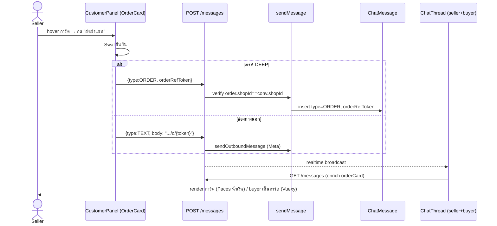

# 00018 — Extensions (2026-07-24 → 25)

> เอกสาร back-fill (doc-first debt) ของ extension ชุดที่พัฒนาต่อยอดจาก Facebook Chat Integration
> ในช่วง 2026-07-24 → 25 ตามคำสั่ง user "ลุยเลย" แล้วกลับมาทำเอกสารให้ครบ. รวม 9 extension:
>
> | # | Extension | สรุป |
> |---|---|---|
> | E1 | การ์ดออเดอร์/ใบเสนอราคาในแชท (`type=ORDER`) | ร้านส่งการ์ดออเดอร์เข้าแชท — DEEP=การ์ด, ช่องทางนอก=ลิงก์ |
> | E2 | รองรับไฟล์แนบทุกชนิด | GIF/สติกเกอร์/วิดีโอ/เสียง Opus/ไฟล์/ตำแหน่งที่ตั้ง/template/หลายรูป — เลิก placeholder "เปิดดูใน Messenger" |
> | E3 | ผูกออเดอร์จากแชทกับลูกค้าทันที | สร้างออเดอร์จากแชท → ผูก ExternalContact↔Customer atomically |
> | E4 | เช็คหน้าต่าง 24 ชม.จาก Meta | lazy check เวลาลูกค้าทักล่าสุดจริง เมื่อ webhook พลาด/เชื่อมเพจช้า |
> | E5 | กลุ่ม/แท็บจัดหมวดแชท + สแปม (S-7 ต่อยอด) | `ChatGroup` ระดับร้าน + ปักหมุด/ซ่อน/ปิดงาน/สแปม ครบ logic+API |
> | E6 | Read receipt ช่องทางนอก | `message_reads` → `Conversation.externalReadAt` (watermark) |
> | E7 | Reaction บนข้อความ | `message_reactions` → `ChatMessage.reactionEmoji` (react/unreact) |
> | E8 | Referral/context โฆษณา-ลิงก์ | `messaging_referrals`/`message.referral` → badge "ทักจากไหน" บนหัวเธรด |
> | E9 | Reply (ตอบทับ) + Unsend | `message.reply_to`/`message.is_deleted` → quote + "ข้อความถูกลบ" |
>
> ที่เกี่ยวกับ AI (ให้ AI อ่านรูป/ฟังเสียง) แยกไปที่ `00019 - AI Reply Assistant/EXTENSIONS-2026-07-25.md`

---

## E1 — การ์ดออเดอร์/ใบเสนอราคาในแชท (`type=ORDER`)

### E1.1 Requirement (PRD/SRS)

**Goal:** ให้ร้านส่ง "ข้อมูลออเดอร์" จากแท็บคำสั่งซื้อในแชทให้ลูกค้าได้ในคลิกเดียว โดยลูกค้าเห็นเป็น
การ์ดสรุป (ในระบบเรา) หรือลิงก์ (ช่องทางนอก) — ปิด gap ที่ผู้ขายต้องพิมพ์เลขออเดอร์/ลิงก์เอง

| FR | ข้อกำหนด | Acceptance |
|---|---|---|
| FR-ORD-01 | การ์ดออเดอร์ในแท็บคำสั่งซื้อ (แผงลูกค้าขวา) แสดงข้อมูลเบื้องต้น: ชื่อสินค้ารายการแรก, เลขออเดอร์ (8 ตัวแรกของ token), จำนวนรายการ, วันที่, ยอดสุทธิ, สถานะ | เปิดแท็บคำสั่งซื้อ → เห็นครบทุก field ต่อการ์ด |
| FR-ORD-02 | hover การ์ด (desktop) → ปุ่ม "ส่งเข้าแชท" โผล่ (มุมขวาบน) | hover → ปุ่มปรากฏ; โฟกัสด้วยคีย์บอร์ดก็ปรากฏ (a11y) |
| FR-ORD-03 | กดปุ่ม → ถามยืนยันก่อนส่ง (Sweet Alert) เพราะเป็น outward-facing (ข้อความไปถึงลูกค้าจริง) | กด → เห็น dialog "ส่งใบเสนอราคานี้เข้าแชท?"; ยกเลิกได้ |
| FR-ORD-04 | ยืนยันแล้ว: ถ้าเธรดเป็น **DEEP** (ลูกค้าในระบบเรา) → ส่งข้อความ `type=ORDER` ที่ render เป็น **การ์ด** ทั้งฝั่ง seller และ buyer | ส่ง → การ์ดโผล่ในเธรดทั้ง 2 ฝั่ง |
| FR-ORD-05 | ถ้าเธรดเป็น **ช่องทางนอก** (Messenger/IG) → ส่งเป็น **ข้อความลิงก์** `https://<buyer>/o/{token}` (Meta ไม่ render การ์ดในแอปเรา) | ส่ง → ลูกค้าได้ลิงก์เปิดหน้า order สาธารณะ |
| FR-ORD-06 | การ์ดในแชทมีปุ่ม "ดูรายละเอียด" → ลิงก์ `/o/{token}` (หน้า order สาธารณะ) | กด → เปิดหน้า order ในแท็บใหม่ |
| FR-ORD-07 | order ถูกลบจริง → การ์ด render empty state "ไม่พบออเดอร์นี้แล้ว" (ไม่ crash) | live-join ไม่พบ token → empty state |

**Out of scope (รอบนี้):** ใบเสนอราคา PDF จริง (ตอนนี้ลิงก์หน้า order แทน — user เลือก "ลิงก์ก่อน"),
เลขรันนิ่ง "qYYYY..." ของใบเสนอราคา (ใช้ 8 ตัวแรกของ publicToken แทน).

### E1.2 Business Rules

- **BR-ORD-01** การ์ด (`type=ORDER`) รองรับเฉพาะเธรด **DEEP** — ช่องทางนอกส่งเป็นลิงก์ TEXT เสมอ
  (Meta Send API ไม่ render custom card ในแอปเรา). UI ตัดสินตาม `conversation.channel`; backend
  guard ซ้ำ (route คืน 400 ถ้า `type=ORDER` มาบนช่องทางนอก)
- **BR-ORD-02** order ที่ส่งได้ต้องเป็นของ **ร้านเดียวกับเธรด** (กัน cross-shop) — verify ที่
  `sendMessage` (`Order.shopId === conversation.shopId`) ไม่ trust client
- **BR-ORD-03** การ์ด live-join ข้อมูลออเดอร์ตอน GET (ไม่ snapshot) — ยอด/สถานะ/จำนวนรายการ
  อัปเดตตามจริงเสมอ; order ลบ → การ์ด empty state

### E1.3 Data Model (DATABASE)

เพิ่มคอลัมน์เดียว (additive) ใน `ChatMessage`:

```prisma
model ChatMessage {
  // ...
  orderRefToken  String?  // เฉพาะ type='ORDER' — เก็บ Order.publicToken (live-join enrich ตอน GET)
                          // ไม่ FK: order ลบไม่ลบข้อความในเธรด (เหมือน productRefId ของ PRODUCT card)
}
```

- migration: `prisma/migrations/20260725000000_chat_order_card/migration.sql`
  (`ALTER TABLE "ChatMessage" ADD COLUMN IF NOT EXISTS "orderRefToken" TEXT;`)
- `ChatMessage.type` เพิ่มค่า `'ORDER'` (String ไม่ใช่ enum — ตาม convention เดิม; validate ที่ Valibot)
- **applied บน Supabase (dev/prod shared) แล้ว** ด้วย `migrate deploy`

### E1.4 API

**`POST /api/chat/conversations/{id}/messages`** — เพิ่ม `type=ORDER`

```jsonc
// body (DEEP)
{ "type": "ORDER", "orderRefToken": "<Order.publicToken (uuid)>" }
```
- `type=ORDER` ต้องมี `orderRefToken` (400 "กรุณาระบุออเดอร์" ถ้าไม่มี)
- ช่องทางนอก + `type=ORDER` → 400 "ช่องทางนี้ยังไม่รองรับการ์ด — ส่งเป็นลิงก์แทน"
- verify order-in-shop ที่ service → `ORDER_NOT_IN_SHOP` (map เป็น 400)
- ช่องทางนอกส่งลิงก์ = `type=TEXT` body มี `https://<buyer>/o/{token}` (ไม่ใช่ endpoint ใหม่)

**`GET /api/chat/conversations/{id}/messages`** — enrich `orderCard` (เหมือน `productCard`)

```jsonc
// item ที่ type=ORDER
{
  "type": "ORDER",
  "orderRefToken": "…",
  "orderCard": {            // null = order ถูกลบจริง
    "token": "…",
    "title": "เสื้อโปโล ABC",  // ชื่อสินค้ารายการแรก (fallback "คำสั่งซื้อ")
    "itemCount": 1,
    "totalAmount": "6420.00",
    "status": "PENDING"
  }
}
```
- batch fetch by token (กัน N+1); token ถูก verify ตอนส่งแล้วว่าเป็นของร้านในเธรด
- **endpoint เดียวใช้ทั้ง buyer และ seller** → การ์ดเดียวกันทั้ง 2 ฝั่ง

**`GET /api/chat/conversations/{id}/orders`** + SSR (`page.tsx`) — เพิ่ม `title`, `itemCount` ต่อ
ออเดอร์ (query `items { name }`) สำหรับข้อมูลเบื้องต้นบนการ์ด

### E1.5 Design (SDS)



- **style:** Paces primary (น้ำเงิน `#236dc9`) ไม่ใช่เขียวตาม ref (user สั่ง 2026-07-24 "ตาม theme token")
  — HR7 (Paces primitive) / feedback_paces_own_primary_not_violet
- seller render: `OrderCardBubble` ใน `ChatThread.tsx` (การ์ด self-contained ไม่มีกรอบ bubble ครอบ)
- buyer render: `OrderCardBubble` inline ใน `(buyer-app)/messages/[shopId]/ChatThread.tsx` (Vuexy, primary)
- dashboard widget: บรรทัดสรุป "ใบเสนอราคา: {title} · ฿{total}" (การ์ดเต็มอยู่หน้า inbox)

### E1.6 Test Cases

| TC | สถานการณ์ | คาดหวัง |
|---|---|---|
| TC-ORD-01 | DEEP: กดส่ง → ยืนยัน | การ์ดโผล่ทั้ง seller + buyer, ปุ่ม "ดูรายละเอียด" → /o/{token} |
| TC-ORD-02 | Messenger/IG: กดส่ง → ยืนยัน | ลูกค้าได้ข้อความลิงก์ /o/{token} (ไม่ใช่การ์ด) |
| TC-ORD-03 | ยกเลิกใน Swal | ไม่ส่งอะไร |
| TC-ORD-04 | ส่ง type=ORDER บนช่องทางนอก (ยิง API ตรง) | 400 "ยังไม่รองรับการ์ด" |
| TC-ORD-05 | ส่ง orderRefToken ของร้านอื่น | ORDER_NOT_IN_SHOP → 400 |
| TC-ORD-06 | order ถูกลบหลังส่งการ์ด | การ์ด render "ไม่พบออเดอร์นี้แล้ว" |

---

## E2 — รองรับไฟล์แนบทุกชนิด

### E2.1 Requirement

**Problem:** ไฟล์แนบจากลูกค้า (GIF/วิดีโอ/สติกเกอร์/ข้อความเสียง/ไฟล์) ขึ้น placeholder
"[… — เปิดดูใน Messenger]" ที่เปิดดูไม่ได้ → ลูกค้าไม่กล้าใช้ระบบ

| FR | ข้อกำหนด |
|---|---|
| FR-ATT-01 | mirror ไฟล์แนบทุก content-type ที่ Meta ส่งมา (ไม่ allow-list ชนิดอีกต่อไป) |
| FR-ATT-02 | เพดานขนาด mirror = 25MB (ลิมิตไฟล์แนบสูงสุดของ Messenger; เดิม 5MB ทำให้ส่วนใหญ่เกิน) |
| FR-ATT-03 | รองรับ attachment type ครบ: image/sticker→IMAGE, video/reel/ig_reel→VIDEO, audio→AUDIO, file→FILE, fallback/post/ig_post→ลิงก์ TEXT |
| FR-ATT-04 | ข้อความเสียง Messenger (Opus) เล่นได้ใน browser (map `audio/opus`→`.ogg`) |
| FR-ATT-05 | ไฟล์ที่เรนเดอร์ inline ไม่ได้ (docx/zip) → ดาวน์โหลดพร้อมชื่อ (Content-Disposition attachment) |

### E2.2 Business Rules / Security

- **BR-ATT-01** security คงเดิมครบ: SSRF host allow-list (เฉพาะ Meta CDN: fbcdn/cdninstagram/fbsbx/
  graph.facebook.com) + streaming size cap (นับ byte สดระหว่างอ่าน = กัน DoS จริง) + `nosniff`
- **BR-ATT-02** `saveFile(skipValidation)` — mirror ข้าม gate ชนิด/ขนาดของ seller upload (5MB) เพราะ
  ทำ validation เอง; **ไม่ผ่อน seller upload** (แยก path)
- **BR-ATT-03** SVG บังคับดาวน์โหลด (attachment) กัน stored-XSS จากการเปิดไฟล์ตรง

### E2.3 Data / Code

- `src/lib/attachment-mime.ts` (ใหม่) — SSOT ของ content-type↔ext + inline-able set (ใช้ทั้ง mirror
  และ `/api/files` serve)
- `channel-chat.service.ts`: `MIRROR_MAX_BYTES=25MB`, `contentTypeToExt()` generic fallback,
  `MEDIA_TYPE`/`LINK_TYPES` map ครอบ attachment type เต็มชุด
- `lib/storage`: `saveFile(file, { skipValidation })`
- webhook-types: `payload.title` (fallback/post ใช้ทำข้อความลิงก์)
- Diagnose จริงกับเพจ: voice = `mime_type audio/opus` served `audio/ogg` (magic `OggS`) → เล่นได้

### E2.4 Test Cases (unit — `channel-chat-image/ingest.test.ts`)

| TC | คาดหวัง |
|---|---|
| gif / text-html content-type | mirror สำเร็จ (generic ext + skipValidation) |
| ไฟล์ > 25MB | ยกเลิกกลางทาง คืน null |
| host นอก allow-list | ปฏิเสธ ไม่ยิง fetch (SSRF guard) |
| sticker | จัดเป็น IMAGE (ไม่ใช่ "ไฟล์แนบ") |
| fallback (แชร์ลิงก์) | TEXT พร้อม url+title |

### E2.5 อัปเดต 2026-07-25 — attachment type ครบชุด + template/location + หลายรูปในข้อความเดียว

**Problem:** attachment เดิม (E2.1-E2.4) mirror ได้แต่รูป/ไฟล์เดี่ยว — order/payment template (receipt/button/
generic), ตำแหน่งที่ตั้ง (location), story mention (IG), และข้อความที่แนบ**หลายรูปพร้อมกัน**ยังตกไป
placeholder ทั่วไป "[ไฟล์แนบ — เปิดดูใน Messenger]" ทั้งที่เนื้อหามากับ webhook payload อยู่แล้ว

| FR | ข้อกำหนด |
|---|---|
| FR-ATT-06 | `AttachmentPayloadSchema` (`webhook-types.ts`) parse field เพิ่ม: `template_type`, `text`, `order_number`, `summary{total_cost,...}`, `elements[]{title,...}`, `coordinates{lat,long}` — เดิม parse แค่ `url`/`title` แล้ว Valibot ตัดฟิลด์เกินทิ้ง |
| FR-ATT-07 | `composeStructuredText(attType, payload)` ประกอบ "ข้อความสรุป" จาก field ที่ parse มาแล้ว โดยไม่ต้องยิง Graph fetch: `location` → ลิงก์ Google Maps จากพิกัด; `template.receipt` → "สรุปคำสั่งซื้อ #… — ยอดรวม ฿…"; `template` (button) → ใช้ `payload.text` ตรง ๆ ถ้ามี; `template` (generic/carousel) → ชื่อรายการแรก + "และอีก N รายการ" |
| FR-ATT-08 | ลำดับการเลือกข้อความที่แสดง: **text จริงของลูกค้า > ลิงก์แชร์ (fallback/post/ig_post) > ข้อความสรุปที่ประกอบเอง (`composeStructuredText`) > ข้อความที่ render จาก Graph (`fetchMessageText`, เฉพาะกรณีที่ประกอบเองไม่ได้) > placeholder เฉพาะชนิด** — bug fix 2026-07-24/25: เดิม placeholder "[ไฟล์แนบ]" ทับข้อความจริงที่ parse ได้อยู่แล้ว |
| FR-ATT-09 | Messenger ส่ง**หลายรูปในข้อความเดียว** (`message.attachments[]` มากกว่า 1 ตัว) → mirror ทุกตัว, ตัวแรกแนบกับ `ChatMessage` หลัก (มี `body`), ตัวที่ 2 เป็นต้นไปสร้าง `ChatMessage` แยกต่อรูป (`body=null`, `externalMessageId = "{mid}#{i}"` กันชน unique constraint) — album UI ฝั่งหน้าจับกลุ่มเรียงติดกันเป็นอัลบั้มเอง; preview เธรดแสดง `"[N รูป]"` แทน `"[รูปภาพ]"` เดี่ยวเมื่อ N>1 |

**Business Rules:**
- **BR-ATT-04** placeholder เป็น **เฉพาะชนิด** ไม่ใช่ข้อความรวม (`FAILED_TEXT_BY_TYPE` map ต่อ `attType`) — วิดีโอ/เสียง/ไฟล์/ตำแหน่ง/ลิงก์/template มีข้อความอธิบายของตัวเอง ไม่ใช้ "[ไฟล์แนบ]" กว้าง ๆ ทุกกรณีเหมือนก่อนหน้า
- **BR-ATT-05** ข้อความที่ไม่มีทั้ง `text` และ attachment ที่แสดงได้เลย (เช่น event พิเศษที่ Meta ส่ง `message` มาแต่ไม่มีเนื้อหา) → `body`/`preview` เป็น placeholder คงที่ `"[ข้อความไม่รองรับ — เปิดดูใน Messenger]"` — กัน bubble ว่างเปล่า (บั๊กจริง prod 2026-07-23)
- diagnostic logging (ไม่ log ค่า PII — เฉพาะ `attType` + payload keys) สำหรับ attachment ที่ยังจับไม่ได้เลย (`story_reply`, IG commands, `product` template) — รอ diagnose payload จริงเพิ่มก่อน finalize schema (ดู Carry ท้ายไฟล์)

**Test Cases เพิ่ม:**

| TC | สถานการณ์ | คาดหวัง |
|---|---|---|
| TC-ATT-06 | ลูกค้าส่งตำแหน่งที่ตั้ง (`location`) | ข้อความ `[ตำแหน่งที่ตั้ง] เปิดใน Google Maps: https://maps.google.com/?q=…` |
| TC-ATT-07 | echo ระบบ order/payment (`template.receipt`) | ข้อความ "สรุปคำสั่งซื้อ #… — ยอดรวม ฿…" (ไม่ตกเป็น placeholder) |
| TC-ATT-08 | ลูกค้าส่ง 3 รูปพร้อมกัน | 3 `ChatMessage` (mid, mid#1, mid#2); preview เธรด = `[3 รูป]` |
| TC-ATT-09 | attachment ชนิดที่ยังไม่รู้จัก (ไม่ใช่ media/link/template) | placeholder ทั่วไป + log diagnostic (ไม่ throw) |

---

## E3 — ผูกออเดอร์จากแชทกับลูกค้าทันที

### E3.1 Requirement

**Problem:** สร้างออเดอร์จากแชท "บันทึกผ่าน" แต่แท็บคำสั่งซื้อ/แผงลูกค้าในแชทยังว่าง → ดูเหมือน
สร้างไม่สำเร็จ. เพราะ `createOrder` สร้าง walk-in Customer จากเบอร์ (order.customerId มี) แต่ไม่รู้
บริบทเธรด จึงไม่ผูก `ExternalContact.customerId`

| FR | ข้อกำหนด |
|---|---|
| FR-LNK-01 | สร้างออเดอร์จากโมดัลในแชท → ผูก `ExternalContact` ของเธรดเข้ากับ Customer (walk-in match จากเบอร์) ใน transaction เดียวกัน |
| FR-LNK-02 | ผูกเฉพาะเมื่อมี `conversationId` + ได้ `customerId` (มีเบอร์); POS (ไม่ส่ง conversationId) พฤติกรรมเดิม |
| FR-LNK-03 | scope ownership: `WHERE {conversation.id, shopId}` (กันผูกเธรดร้านอื่น); `updateMany` เฉพาะ `customerId=null` (buyer login upgrade ไป full customer ก่อน → login ชนะ ไม่ทับ) |

### E3.2 API / Code

- `CreateOrderSchema` + `createOrder(shopId, data)` เพิ่ม `conversationId?` (optional ทุกชั้น:
  schema/service/form/modal)
- link ใน transaction ของ `createOrder` หลัง insert order

---

## E4 — เช็คหน้าต่าง 24 ชม.จาก Meta (lazy)

### E4.1 Requirement

**Problem:** หน้าต่างตอบ 24 ชม.นับจาก `lastInboundAt` ที่เซ็ตจาก webhook เท่านั้น — ถ้าร้านเชื่อมเพจช้า
กว่าที่ลูกค้าทัก (ไม่เคยได้ webhook) หรือ webhook หลุด → `lastInboundAt=NULL`/เก่า ทั้งที่ลูกค้าเพิ่งทัก

| FR | ข้อกำหนด |
|---|---|
| FR-WIN-01 | เมื่อหน้าต่าง (จากค่าที่เก็บ) "ดูปิด" + เธรดช่องทางนอก + token ACTIVE → เรียก Meta Conversations API หาเวลา "ข้อความล่าสุดจากลูกค้าจริง" |
| FR-WIN-02 | เลือกข้อความล่าสุดที่ `from.id === PSID` (ของลูกค้า ไม่ใช่เพจ) — `updated_time` เพียว ๆ ใช้ไม่ได้ |
| FR-WIN-03 | ถ้า Meta ให้เวลาที่ใหม่กว่า → persist `lastInboundAt` (ครั้งถัดไปไม่ต้องเรียก Meta ซ้ำ) |
| FR-WIN-04 | แยก banner: `lastInboundAt=NULL` จริง (ลูกค้าไม่เคยทัก) vs "เกิน 24 ชม." (เคยทักแต่หมดเวลา) |

### E4.2 Code / Meta API

- `getLastInboundTime(psid, pageToken, provider)` — `GET /me/conversations?user_id={psid}&fields=messages{from,created_time}` (Messenger prod-tested; IG อาจ fatal 2207085 → catch คืน null)
- `syncInboundWindowFromMeta(conversationId)` — เรียกจาก `page.tsx` เมื่อ window ดูปิด
- scope ที่ต้องใช้: `pages_messaging` + `pages_read_engagement` (มีใน `CONNECT_SCOPES` แล้ว ไม่ต้องขอเพิ่ม)
- **tradeoff:** เพิ่ม Graph call 1 ครั้งตอนเปิดเธรดช่องทางนอกที่ปิดอยู่ (bounded)

---

## E5 — กลุ่ม/แท็บจัดหมวดแชท + สแปม (ต่อยอด S-7)

### E5.1 Requirement

**Goal:** S-7 เดิม (SRS v1.1) มีแค่ปักหมุด/ซ่อน/ปิดงานที่คอลัมน์มีแต่ "ไม่มี logic" — ผลตัดสิน user
2026-07-23/24 ขยายเป็นชุดเต็ม: กลุ่ม/แท็บที่ร้านตั้งเอง + ถังสแปมแยก **และ implement logic+API ครบแล้ว**
(ไม่ใช่แค่คอลัมน์ DB เหมือน SRS v1.1 เขียนไว้ — SRS.md/SDS.md เดิมมี debt ตรงนี้ ปรับในรอบนี้)

| FR | ข้อกำหนด |
|---|---|
| FR-GRP-01 | ร้านสร้างกลุ่ม/แท็บเองได้ไม่จำกัด (เพดาน 30 กลุ่ม/ร้าน) — ชื่อไม่ซ้ำในร้านเดียวกัน (`@@unique[shopId,name]`) |
| FR-GRP-02 | ย้ายเธรดเข้า/ออกกลุ่มทีละเธรด (`action=set-group` บน `PATCH /api/chat/conversations/[id]`) — `chatGroupId=null` = เอาออก (กลับแท็บ "ทั้งหมด") |
| FR-GRP-03 | ลบกลุ่ม → เธรดที่เคยอยู่กลุ่มนั้น `chatGroupId` กลับเป็น `null` อัตโนมัติ (FK `ON DELETE SET NULL`) ไม่ต้องมี cleanup logic แยก |
| FR-SPAM-01 | ทำเครื่องหมายเธรดเป็นสแปม (`action=spam`/`unspam`) — แยกถังจากรายการหลักสนิท (ตัวกรอง `spam=true`) |
| FR-SPAM-02 | เธรดสแปม: ลูกค้าทักมาใหม่**ไม่เด้งกลับ**รายการหลัก (ต่างจาก hide/resolve ที่ auto-unhide/auto-reopen) และ**ไม่ส่ง Notification** — Meta ส่ง webhook ระดับเพจ หยุดรายเธรดไม่ได้ ระบบยังรับ+เก็บข้อความปกติ แค่เงียบ |
| FR-UNREAD-01 | ตัวกรอง `readState=unread\|read` — เกณฑ์เดียวกับ badge ตัวเลขนับ unread (JOIN `ChatMessage` จริง ไม่ใช่แค่ `lastSenderRole` ระดับห้อง — บั๊ก 2026-07-24 ที่แก้แล้ว) |

### E5.2 Business Rules

- **BR-GRP-01** `set-group` ตรวจว่ากลุ่มเป็นของร้านเดียวกันก่อนย้าย (`GROUP_NOT_FOUND` ถ้าไม่ใช่ — กันย้ายเข้ากลุ่มร้านอื่น)
- **BR-SPAM-01** `action=spam` เคลียร์ `isPinned=false` พร้อมกัน (เธรดสแปมไม่ควรปักหมุดค้าง) — `updateMany` ครั้งเดียว
- **BR-SPAM-02** query "ดูสแปม" ไม่กรอง `isHidden` ซ้ำ (สแปมเป็นถังแยกอยู่แล้ว เห็นทุกเธรดในถังนั้นไม่ว่าจะเคย hidden หรือไม่)
- **BR-UNREAD-01** เกณฑ์ "ยังไม่อ่าน" = มีข้อความ `senderRole='BUYER'` ใหม่กว่า `Conversation.shopLastReadAt` (ห้องไม่เคยอ่าน = นับทั้งหมด) — ใช้ราก SSOT เดียวกันทั้ง badge ตัวเลขและตัวกรอง (ก่อนแก้บั๊ก 2026-07-24 สองจุดนี้เกณฑ์ไม่ตรงกัน)

### E5.3 Data Model

`ChatGroup` (table ใหม่) — migration `20260723130000_chat_group`:

```prisma
model ChatGroup {
  id        String   @id @default(uuid())
  shopId    String
  name      String
  sortOrder Int      @default(0)
  createdAt DateTime @default(now())

  shop          Shop           @relation(fields: [shopId], references: [id], onDelete: Cascade)
  conversations Conversation[]

  @@unique([shopId, name])
  @@index([shopId, sortOrder])
}
```

`Conversation` เพิ่ม (migration เดียวกัน + ตัวก่อนหน้า `20260722000200_shopchannel_active_partial_unique`
ไม่เกี่ยว): `chatGroupId String?` (FK `ChatGroup`, `ON DELETE SET NULL`), `isSpam Boolean @default(false)`
(migration แยกก่อนหน้า — apply พร้อมชุด S-7 เดิม), `externalReadAt DateTime?` (ดู E6)

### E5.4 API

| Method | Path | หมายเหตุ |
|---|---|---|
| `GET` | `/api/chat/groups` | list กลุ่มของร้าน active เรียง `sortOrder` |
| `POST` | `/api/chat/groups` | สร้างกลุ่ม `{name}` — `409` ชื่อซ้ำ, `400` เกิน 30 กลุ่ม/ชื่อว่าง/ยาวเกิน 40 |
| `PATCH` | `/api/chat/groups/{id}` | เปลี่ยนชื่อ `{name}` |
| `DELETE` | `/api/chat/groups/{id}` | ลบกลุ่ม (เธรดในกลุ่ม → `chatGroupId=null` อัตโนมัติ) |
| `PATCH` | `/api/chat/conversations/{id}` | `{action: 'pin'\|'unpin'\|'hide'\|'unhide'\|'resolve'\|'reopen'\|'spam'\|'unspam'\|'set-group', chatGroupId?}` — ownership atomic `updateMany({id, shopId})` |
| `GET` | `/api/chat/conversations` | เพิ่ม query: `chatGroupId` (กรองแท็บ), `readState` (`unread`\|`read`), `spam` (`true`=ดูเฉพาะสแปม) |

ทุก endpoint: seller session + `resolveActiveShopContext`; `Cache-Control: private, no-store` (per-user
authenticated data — บทเรียน `feedback_auth_api_cache_control`)

### E5.5 Test Cases

| TC | สถานการณ์ | คาดหวัง |
|---|---|---|
| TC-GRP-01 | สร้างกลุ่มชื่อซ้ำในร้านเดียวกัน | `409 GROUP_NAME_TAKEN` |
| TC-GRP-02 | ย้ายเธรดเข้ากลุ่มร้านอื่น | `404` (ownership guard) |
| TC-GRP-03 | ลบกลุ่มที่มีเธรดอยู่ | เธรดกลับแท็บ "ทั้งหมด" (`chatGroupId=null`) ไม่หายไปไหน |
| TC-SPAM-01 | ทำเครื่องหมายสแปม แล้วลูกค้าทักใหม่ | เธรดยังอยู่ถังสแปม ไม่เด้งกลับรายการหลัก ไม่มี Notification |
| TC-SPAM-02 | เธรดปักหมุดอยู่ → กด spam | `isPinned` ถูกล้างพร้อมกัน |
| TC-UNREAD-01 | ร้านตอบผ่าน Messenger ตรง (echo, ไม่ผ่าน Deep) แล้วลูกค้าทักใหม่ | badge unread + filter `readState=unread` เห็นตรงกัน (regression บั๊ก 2026-07-24) |

---

## E6 — Read Receipt ช่องทางนอก (`message_reads`)

### E6.1 Requirement

**Goal:** แสดงว่าลูกค้าอ่านข้อความของร้านถึงจุดไหนแล้ว (เหมือน DEEP เดิมที่มี `buyerLastReadAt`/
`shopLastReadAt` อยู่แล้ว) — ช่องทางนอกไม่มีแนวคิด "ห้อง" แบบเดียวกัน ต้องอาศัย watermark จาก Meta

| FR | ข้อกำหนด |
|---|---|
| FR-READ-01 | webhook event `message_reads` (`{sender, read: {watermark}}`) → `Conversation.externalReadAt = watermark` เฉพาะเมื่อใหม่กว่าค่าที่เก็บไว้ (กัน event มาสลับลำดับ) |
| FR-READ-02 | ข้อความฝั่งร้าน (`senderRole='SHOP'`) ที่ `createdAt <= externalReadAt` = ถือว่า "อ่านแล้ว" — คำนวณที่ UI (ไม่มีคอลัมน์ read ต่อข้อความ) |

### E6.2 Data / Code

- `Conversation.externalReadAt DateTime?` — migration ก่อนหน้าชุด S-7 (ไม่ใช่ของ 2026-07-25 แต่ระบุ
  ที่นี่เพราะ SRS/SDS เดิมไม่เคยพูดถึง)
- `ingestReadEvent({provider, pageExternalId, contactExternalId, watermark})` (`channel-chat.service.ts`)
  — resolve `ShopChannel` + `ExternalContact` แล้ว `updateMany` เฉพาะ `externalReadAt IS NULL OR < watermark`
- webhook route: `event.read` มา → เรียก `ingestReadEvent` แทน `ingestInboundMessage` (แยก branch ตาม
  field ที่มาก่อน `event.message`)
- Page ที่ไม่มีร้านเชื่อม/contact ไม่พบ → เงียบ (ไม่ throw, ตอบ 200 ปกติ)

---

## E7 — Reaction บนข้อความ (`message_reactions`)

### E7.1 Requirement

| FR | ข้อกำหนด |
|---|---|
| FR-REACT-01 | ลูกค้า react อีโมจิบนข้อความ (Messenger/IG) → `ChatMessage.reactionEmoji` = อีโมจิล่าสุด แสดงมุมล่างบับเบิลในเธรด |
| FR-REACT-02 | unreact (`action='unreact'`) → `reactionEmoji = null` |
| FR-REACT-03 | unsend ข้อความ (E9) ล้าง `reactionEmoji` ไปด้วย (ข้อความถูกลบไม่ควรมี reaction ค้าง) |

### E7.2 Data / Code

- `ChatMessage.reactionEmoji String?` — migration `20260725100000_chat_reaction_referral`
- `webhook-types.ts`: `ReactionSchema {reaction, emoji, action, mid}` — `emoji` = Unicode จริงที่ลูกค้ากด, `reaction` = semantic label ของ Meta (ไม่ใช้แสดงผล)
- `ingestReactionEvent({provider, pageExternalId, mid, action, emoji})` — `updateMany({externalMessageId: mid, conversation: {shopChannelId}})` scope กันข้ามร้าน; เก็บ emoji ตรง ๆ ไม่ normalize
- webhook route: `event.reaction` มา → เรียกฟังก์ชันนี้ (ก่อน branch ข้อความปกติ)

---

## E8 — Referral / context โฆษณา-ลิงก์ (`messaging_referrals`)

### E8.1 Requirement

**Goal:** แสดง badge บนหัวเธรดว่าลูกค้าทักมาจากไหน (โฆษณา/ลิงก์แชร์) — ช่วย seller ประเมินคุณภาพลูกค้า/
แคมเปญ ไม่ต้องเดา

| FR | ข้อกำหนด |
|---|---|
| FR-REF-01 | `referral` มาได้ 2 ทาง — top-level `event.referral` (`messaging_referrals` webhook field) หรือ `message.referral` (ผูกกับข้อความแรกของเธรด) — ทั้งคู่ schema เดียวกัน |
| FR-REF-02 | เก็บ context เฉพาะ**ตอนสร้างเธรดใหม่ครั้งแรกเท่านั้น** (`Conversation.referralSource`/`referralAdTitle`) — ไม่อัปเดตซ้ำภายหลัง (เป็น "context แรกเข้า" ไม่ใช่ log ทุกครั้ง) |
| FR-REF-03 | `referralSource` = `"ADS"` \| `"SHORTLINK"` (ค่าจาก Meta); `referralAdTitle` = `ads_context_data.ad_title` เฉพาะกรณีมาจากโฆษณา |

### E8.2 Data / Code

- `Conversation.referralSource String?` / `referralAdTitle String?` — migration `20260725100000_chat_reaction_referral`
- `webhook-types.ts`: `ReferralSchema {ref, source, type, ad_id, ads_context_data{ad_title}}`
- `ingestInboundMessage`: ตอน `create` เธรดใหม่ (ไม่ใช่ตอน `findUnique` เจอของเดิม) → `const referral = event.message?.referral ?? event.referral` แล้วเซ็ต 2 คอลัมน์ถ้ามี — ไม่มี code path ใดเขียนซ้ำหลังจากนั้น

### E8.3 Known Gap

- **Subscribe field `messaging_referrals`:** `MESSENGER_SUBSCRIBED_FIELDS` (`src/lib/facebook/constants.ts`)
  ที่ `SRS.md §8` ระบุไว้ (`['messages', 'messaging_postbacks', 'message_reactions']`) **ไม่มี**
  `messaging_referrals` — เพจที่เชื่อมไปแล้วก่อนรอบนี้ (subscribe fields เดิม) จะไม่ได้ event referral
  แบบ top-level (`event.referral`) จนกว่าจะ reconnect เพจใหม่ (subscribe fields ปัจจุบันของเพจนั้นถูก
  fix ค้างตอน subscribe ครั้งแรก) — **ยังทำงานได้บางส่วน** ผ่าน `message.referral` (มากับ event ข้อความ
  ปกติที่ subscribe ด้วย `messages` field อยู่แล้ว) แต่ referral ที่มาแบบ "pure referral" (ลูกค้าคลิก
  แต่ยังไม่พิมพ์อะไร) จะไม่ถูกจับสำหรับเพจเก่า

---

## E9 — Reply (ตอบทับข้อความ) + Unsend

### E9.1 Requirement

| FR | ข้อกำหนด |
|---|---|
| FR-REPLY-01 | ลูกค้า/ร้าน "ตอบทับ" ข้อความหนึ่ง (`message.reply_to.mid`) → เก็บ `ChatMessage.replyToMid` = mid ของข้อความต้นทาง — UI ดึงมาแสดงเป็น quote เหนือข้อความ |
| FR-UNSEND-01 | ผู้ส่ง unsend ข้อความ (`message.is_deleted=true`, `mid`=ข้อความที่ถูกลบ) → `ChatMessage.isDeleted=true` **บนข้อความเดิม** (ไม่สร้างแถวใหม่) + ล้าง `body`/`imageUrl`/`reactionEmoji` เป็น `null` — ไม่เก็บเนื้อหาที่ถูกลบไว้เลย |
| FR-UNSEND-02 | UI แสดง "ข้อความถูกลบ" แทนเนื้อหาเดิมสำหรับข้อความที่ `isDeleted=true` |

### E9.2 Business Rules

- **BR-REPLY-01** `replyToMid` เก็บแค่ `mid` ดิบ — ไม่ resolve เป็น `ChatMessage.id` ภายใน (ไม่มี FK จริง เพราะข้อความต้นทางอาจยังไม่ถึงหรือถูกลบไปแล้ว) UI ต้อง lookup เอง (`findFirst` ด้วย `externalMessageId`) ตอน render — ไม่พบ = แสดง "ข้อความต้นฉบับไม่พบ" แทน crash
- **BR-UNSEND-01** unsend scope ด้วย `conversation: {shopChannelId: channel.id}` กันข้ามร้าน (ข้อความ mid เดียวกันในเธรดร้านอื่นไม่ถูกกระทบ — ในทางทฤษฎีไม่ชนกันอยู่แล้วเพราะ `externalMessageId` unique ทั้งระบบ แต่ scope ไว้เป็น defense-in-depth)
- **BR-UNSEND-02** unsend ไม่ลบแถว `ChatMessage` ทิ้ง (soft — `isDeleted=true`) เพื่อรักษาลำดับ/จำนวนข้อความในเธรดให้ต่อเนื่อง เหมือนพฤติกรรมจริงของ Messenger/IG app

### E9.3 Data / Code

- `ChatMessage.replyToMid String?` / `isDeleted Boolean @default(false)` — migration `20260725110000_chat_reply_unsend`
- `webhook-types.ts` `MessageSchema` เพิ่ม `reply_to: {mid?}` / `is_deleted?: boolean`
- `ingestInboundMessage`: เช็ค `event.message.is_deleted` **ก่อน**ทุกอย่าง (ก่อนแม้แต่ resolve contact/profile) → `updateMany` แล้ว `return` ทันที ไม่ไหลต่อไป insert ข้อความใหม่; ข้อความปกติ (ไม่ใช่ unsend) แนบ `replyToMid: event.message?.reply_to?.mid ?? null` ตอน `create`
- ขาออก **ตอบทับ (reply/quote) — implement แล้วใน E10**; unsend ขาออกยังไม่ทำ (ดู Carry)

### E9.4 Test Cases

| TC | สถานการณ์ | คาดหวัง |
|---|---|---|
| TC-REPLY-01 | ลูกค้าตอบทับข้อความเก่า | `ChatMessage.replyToMid` = mid ข้อความเก่า |
| TC-UNSEND-01 | ลูกค้า unsend ข้อความที่เคยมีรูป+reaction | `body`/`imageUrl`/`reactionEmoji` เป็น `null`, `isDeleted=true`, แถวยังอยู่ (ไม่หาย) |
| TC-UNSEND-02 | unsend ข้อความที่ mid ไม่ตรงกับเธรดในร้านนี้ (defense) | ไม่มีแถวไหนถูกแก้ (`updateMany` scope ผิดร้าน = 0 rows) |

---

## E10 — Reply/Quote ขาออก (ร้านตอบทับข้อความ)

### E10.1 Requirement

| FR | ข้อกำหนด |
|---|---|
| FR-REPLY-OUT-01 | ร้านเลือก "ตอบกลับ" ข้อความหนึ่งในเธรด (ของลูกค้า หรือของร้านเอง) → composer แสดงแถบ quote เหนือช่องพิมพ์ + ส่งข้อความที่ผูกกับข้อความต้นทาง |
| FR-REPLY-OUT-02 | ช่องทางนอก (Messenger): ส่ง `reply_to: { mid }` ผ่าน Send API — ลูกค้าเห็น bubble ตอบทับใน Messenger จริง. IG best-effort (ไม่ยืนยัน parity) |
| FR-REPLY-OUT-03 | ตอบทับได้ทุกชนิดข้อความ (text/รูป/การ์ด); quote แสดงทันที (optimistic) บนบับเบิลที่ส่ง |

### E10.2 Business Rules

- **BR-REPLY-OUT-01** ผูก reply กับข้อความ "ใบแรก" ที่ส่งต่อครั้ง (เช่นแนบหลายรูป+ข้อความ → reply ติดที่รูปใบแรก) — ตอบทับหนึ่งครั้งต่อการกดส่ง
- **BR-REPLY-OUT-02** ช่องทางนอกใช้ `externalMessageId` (Meta mid) เป็นเป้า reply_to — ต้องมี mid จริงจึงจะ reply บน Meta ได้; DEEP (ในแอป) ไม่มี mid → เก็บ `replyToMid = ChatMessage.id` ภายในแทน แล้ว enrich match ทั้ง `externalMessageId` และ `id`
- **BR-REPLY-OUT-03** graceful degrade: ยิงพร้อม `reply_to` แล้ว Meta ปฏิเสธ (IG ไม่รองรับ / mid หมดอายุ) → retry ยิงซ้ำแบบไม่มี `reply_to` เพื่อให้ข้อความยังส่งออกได้ (quote ฝั่งเรายังแสดงอยู่)
- **BR-REPLY-OUT-04** ตอบทับข้อความ optimistic (ยังส่งไม่เสร็จ, id ยังไม่ใช่ uuid) หรือข้อความที่ถูกลบไม่ได้ — ปุ่ม reply ซ่อนไว้

### E10.3 Data / Code

- `graph.ts` `sendTextMessage`/`sendImageMessage` เพิ่ม param `replyToMid?` → แนบ `reply_to: { mid }` ใน body ของ `/me/messages`
- `channel-chat.service.ts` `sendOutboundMessage` เพิ่ม `replyToMid?` → ส่งผ่าน graph + เก็บ `ChatMessage.replyToMid`; catch เพิ่ม retry-ไม่มี-reply_to (BR-REPLY-OUT-03)
- `chat.service.ts` `sendMessage` (DEEP) เพิ่ม `replyToMid?` → เก็บ `id` ของข้อความต้นทาง
- `route POST` เพิ่ม `replyToMessageId` (uuid) → resolve เป็น mid (นอก) / id (DEEP) แล้วส่งต่อ; `route GET` enrich `replyTo` match `externalMessageId OR id` + label สื่อ (`[รูปภาพ]`/`[คำสั่งซื้อ]`/`[สินค้า]`)
- `validations.ts` `SendChatMessageSchema` เพิ่ม `replyToMessageId` (optional uuid)
- `useSellerChatThread.ts` state `replyingTo`/`setReplyingTo`; `handleSend` ผูก `replyToMessageId` กับ payload ใบแรก + optimistic quote
- `ChatThread.tsx` `ReplyMessageButton` (hover cluster เคียง copy) + แถบ preview quote เหนือ composer (ปุ่มยกเลิก)

### E10.4 Test Cases

| TC | สถานการณ์ | คาดหวัง |
|---|---|---|
| TC-REPLY-OUT-01 | ร้านตอบทับข้อความลูกค้า (Messenger) | ลูกค้าเห็น bubble ตอบทับใน Messenger; `ChatMessage.replyToMid` = mid ข้อความลูกค้า; quote แสดงในเธรด |
| TC-REPLY-OUT-02 | ตอบทับใน DEEP (ในแอป) | `replyToMid` = id ข้อความต้นทาง; enrich แสดง quote ถูกต้อง |
| TC-REPLY-OUT-03 | ตอบทับบน IG แล้ว Meta ปฏิเสธ reply_to | ข้อความยังส่งออก (retry ไม่มี reply_to); quote ฝั่งเรายังแสดง |

---

## Carry / หนี้ที่เหลือ

- **PDF ใบเสนอราคาจริง** — ตอนนี้ลิงก์หน้า `/o/{token}` แทน (user เลือกลิงก์ก่อน)
- **Browser QA** — ทุก extension verify ด้วย tsc + unit tests + diagnose Meta/DB จริง; ยังไม่ได้
  Chrome-DevTools E2E (worktree ไม่มี dev server) — user เทสบน prod
- **ข้อความเก่าที่ mirror ล้มไปแล้ว** (E2) ยังเป็น placeholder — mirror ย้อนหลังไม่ได้ (asset URL Meta
  หมดอายุ) เว้นทำ backfill re-mirror แยก
- **`messaging_referrals` subscribe field ขาด** (E8.3) — เพจที่เชื่อมก่อนรอบนี้ต้อง reconnect ถึงจะได้
  pure-referral event เต็มรูป
- **Reply ขาออก — ทำแล้ว (E10)**; **Unsend ขาออก** ยังไม่ได้ (ร้านลบข้อความของตัวเองจาก Deep ยังทำไม่ได้ —
  inbound-only เหมือน reaction ขาออกที่ยังไม่มี)
- **IG reply_to parity** — Messenger ยืนยันรองรับ `reply_to`; IG ยังไม่ยืนยันจาก docs → E10 ใช้ best-effort +
  graceful degrade (retry ไม่มี reply_to) — รอ verify เคสจริงบน prod
- **ไม่แสดงชื่อ staff ที่ส่งข้อความฝั่งร้าน** — ข้อความที่ Deep ส่งเอง (`sendOutboundMessage`) มี
  `senderUserId` จริง (รู้ว่า staff คนไหนกด) แต่ echo จากแอป Messenger/IG โดยตรง (`is_echo`) Meta ไม่บอกว่า
  พนักงานคนไหนพิมพ์ — `senderUserId=null` เสมอสำหรับ echo จึงแสดงได้แค่ "ร้าน" รวม ๆ ไม่ระบุตัวบุคคลได้
  ครบทุกเคส (ยังไม่มี UI ทำ mapping ส่วนที่ทำได้ด้วยซ้ำ)
- **Attachment ที่ยังไม่ยืนยัน payload จริง** — `story_reply`, IG-specific commands, `template_type=media`/`product`
  ยังอยู่ระหว่าง diagnose (log `attType` + payload keys ไว้ใน `console.warn('[fb-ingest] unhandled attachment')`
  แล้วรอเคสจริงจาก prod ก่อนเขียน handler เฉพาะ — ไม่เดา schema ล่วงหน้า)
