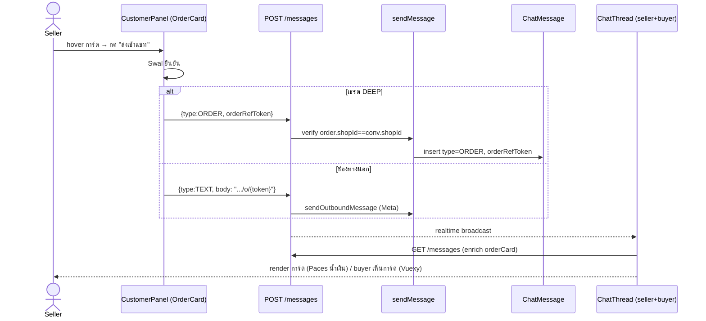

# 00018 — Extensions (2026-07-24 → 25)

> เอกสาร back-fill (doc-first debt) ของ extension ชุดที่พัฒนาต่อยอดจาก Facebook Chat Integration
> ในช่วง 2026-07-24 → 25 ตามคำสั่ง user "ลุยเลย" แล้วกลับมาทำเอกสารให้ครบ. รวม 4 extension:
>
> | # | Extension | สรุป |
> |---|---|---|
> | E1 | การ์ดออเดอร์/ใบเสนอราคาในแชท (`type=ORDER`) | ร้านส่งการ์ดออเดอร์เข้าแชท — DEEP=การ์ด, ช่องทางนอก=ลิงก์ |
> | E2 | รองรับไฟล์แนบทุกชนิด | GIF/สติกเกอร์/วิดีโอ/เสียง Opus/ไฟล์ — เลิก placeholder "เปิดดูใน Messenger" |
> | E3 | ผูกออเดอร์จากแชทกับลูกค้าทันที | สร้างออเดอร์จากแชท → ผูก ExternalContact↔Customer atomically |
> | E4 | เช็คหน้าต่าง 24 ชม.จาก Meta | lazy check เวลาลูกค้าทักล่าสุดจริง เมื่อ webhook พลาด/เชื่อมเพจช้า |
>
> ที่เกี่ยวกับ AI (ให้ AI อ่านรูป/ฟังเสียง) แยกไปที่ `00019 - AI Reply Assistant/EXTENSIONS-2026-07-25.md`

---

## E1 — การ์ดออเดอร์/ใบเสนอราคาในแชท (`type=ORDER`)

### E1.1 Requirement (PRD/SRS)

**Goal:** ให้ร้านส่ง "ข้อมูลออเดอร์" จากแท็บคำสั่งซื้อในแชทให้ลูกค้าได้ในคลิกเดียว โดยลูกค้าเห็นเป็น
การ์ดสรุป (ในระบบเรา) หรือลิงก์ (ช่องทางนอก) — ปิด gap ที่ผู้ขายต้องพิมพ์เลขออเดอร์/ลิงก์เอง

| FR | ข้อกำหนด | Acceptance |
|---|---|---|
| FR-ORD-01 | การ์ดออเดอร์ในแท็บคำสั่งซื้อ (แผงลูกค้าขวา) แสดงข้อมูลเบื้องต้น: ชื่อสินค้ารายการแรก, เลขออเดอร์ (8 ตัวแรกของ token), จำนวนรายการ, วันที่, ยอดสุทธิ, สถานะ | เปิดแท็บคำสั่งซื้อ → เห็นครบทุก field ต่อการ์ด |
| FR-ORD-02 | hover การ์ด (desktop) → ปุ่ม "ส่งเข้าแชท" โผล่ (มุมขวาบน) | hover → ปุ่มปรากฏ; โฟกัสด้วยคีย์บอร์ดก็ปรากฏ (a11y) |
| FR-ORD-03 | กดปุ่ม → ถามยืนยันก่อนส่ง (Sweet Alert) เพราะเป็น outward-facing (ข้อความไปถึงลูกค้าจริง) | กด → เห็น dialog "ส่งใบเสนอราคานี้เข้าแชท?"; ยกเลิกได้ |
| FR-ORD-04 | ยืนยันแล้ว: ถ้าเธรดเป็น **DEEP** (ลูกค้าในระบบเรา) → ส่งข้อความ `type=ORDER` ที่ render เป็น **การ์ด** ทั้งฝั่ง seller และ buyer | ส่ง → การ์ดโผล่ในเธรดทั้ง 2 ฝั่ง |
| FR-ORD-05 | ถ้าเธรดเป็น **ช่องทางนอก** (Messenger/IG) → ส่งเป็น **ข้อความลิงก์** `https://<buyer>/o/{token}` (Meta ไม่ render การ์ดในแอปเรา) | ส่ง → ลูกค้าได้ลิงก์เปิดหน้า order สาธารณะ |
| FR-ORD-06 | การ์ดในแชทมีปุ่ม "ดูรายละเอียด" → ลิงก์ `/o/{token}` (หน้า order สาธารณะ) | กด → เปิดหน้า order ในแท็บใหม่ |
| FR-ORD-07 | order ถูกลบจริง → การ์ด render empty state "ไม่พบออเดอร์นี้แล้ว" (ไม่ crash) | live-join ไม่พบ token → empty state |

**Out of scope (รอบนี้):** ใบเสนอราคา PDF จริง (ตอนนี้ลิงก์หน้า order แทน — user เลือก "ลิงก์ก่อน"),
เลขรันนิ่ง "qYYYY..." ของใบเสนอราคา (ใช้ 8 ตัวแรกของ publicToken แทน).

### E1.2 Business Rules

- **BR-ORD-01** การ์ด (`type=ORDER`) รองรับเฉพาะเธรด **DEEP** — ช่องทางนอกส่งเป็นลิงก์ TEXT เสมอ
  (Meta Send API ไม่ render custom card ในแอปเรา). UI ตัดสินตาม `conversation.channel`; backend
  guard ซ้ำ (route คืน 400 ถ้า `type=ORDER` มาบนช่องทางนอก)
- **BR-ORD-02** order ที่ส่งได้ต้องเป็นของ **ร้านเดียวกับเธรด** (กัน cross-shop) — verify ที่
  `sendMessage` (`Order.shopId === conversation.shopId`) ไม่ trust client
- **BR-ORD-03** การ์ด live-join ข้อมูลออเดอร์ตอน GET (ไม่ snapshot) — ยอด/สถานะ/จำนวนรายการ
  อัปเดตตามจริงเสมอ; order ลบ → การ์ด empty state

### E1.3 Data Model (DATABASE)

เพิ่มคอลัมน์เดียว (additive) ใน `ChatMessage`:

```prisma
model ChatMessage {
  // ...
  orderRefToken  String?  // เฉพาะ type='ORDER' — เก็บ Order.publicToken (live-join enrich ตอน GET)
                          // ไม่ FK: order ลบไม่ลบข้อความในเธรด (เหมือน productRefId ของ PRODUCT card)
}
```

- migration: `prisma/migrations/20260725000000_chat_order_card/migration.sql`
  (`ALTER TABLE "ChatMessage" ADD COLUMN IF NOT EXISTS "orderRefToken" TEXT;`)
- `ChatMessage.type` เพิ่มค่า `'ORDER'` (String ไม่ใช่ enum — ตาม convention เดิม; validate ที่ Valibot)
- **applied บน Supabase (dev/prod shared) แล้ว** ด้วย `migrate deploy`

### E1.4 API

**`POST /api/chat/conversations/{id}/messages`** — เพิ่ม `type=ORDER`

```jsonc
// body (DEEP)
{ "type": "ORDER", "orderRefToken": "<Order.publicToken (uuid)>" }
```
- `type=ORDER` ต้องมี `orderRefToken` (400 "กรุณาระบุออเดอร์" ถ้าไม่มี)
- ช่องทางนอก + `type=ORDER` → 400 "ช่องทางนี้ยังไม่รองรับการ์ด — ส่งเป็นลิงก์แทน"
- verify order-in-shop ที่ service → `ORDER_NOT_IN_SHOP` (map เป็น 400)
- ช่องทางนอกส่งลิงก์ = `type=TEXT` body มี `https://<buyer>/o/{token}` (ไม่ใช่ endpoint ใหม่)

**`GET /api/chat/conversations/{id}/messages`** — enrich `orderCard` (เหมือน `productCard`)

```jsonc
// item ที่ type=ORDER
{
  "type": "ORDER",
  "orderRefToken": "…",
  "orderCard": {            // null = order ถูกลบจริง
    "token": "…",
    "title": "เสื้อโปโล ABC",  // ชื่อสินค้ารายการแรก (fallback "คำสั่งซื้อ")
    "itemCount": 1,
    "totalAmount": "6420.00",
    "status": "PENDING"
  }
}
```
- batch fetch by token (กัน N+1); token ถูก verify ตอนส่งแล้วว่าเป็นของร้านในเธรด
- **endpoint เดียวใช้ทั้ง buyer และ seller** → การ์ดเดียวกันทั้ง 2 ฝั่ง

**`GET /api/chat/conversations/{id}/orders`** + SSR (`page.tsx`) — เพิ่ม `title`, `itemCount` ต่อ
ออเดอร์ (query `items { name }`) สำหรับข้อมูลเบื้องต้นบนการ์ด

### E1.5 Design (SDS)



- **style:** Paces primary (น้ำเงิน `#236dc9`) ไม่ใช่เขียวตาม ref (user สั่ง 2026-07-24 "ตาม theme token")
  — HR7 (Paces primitive) / feedback_paces_own_primary_not_violet
- seller render: `OrderCardBubble` ใน `ChatThread.tsx` (การ์ด self-contained ไม่มีกรอบ bubble ครอบ)
- buyer render: `OrderCardBubble` inline ใน `(buyer-app)/messages/[shopId]/ChatThread.tsx` (Vuexy, primary)
- dashboard widget: บรรทัดสรุป "ใบเสนอราคา: {title} · ฿{total}" (การ์ดเต็มอยู่หน้า inbox)

### E1.6 Test Cases

| TC | สถานการณ์ | คาดหวัง |
|---|---|---|
| TC-ORD-01 | DEEP: กดส่ง → ยืนยัน | การ์ดโผล่ทั้ง seller + buyer, ปุ่ม "ดูรายละเอียด" → /o/{token} |
| TC-ORD-02 | Messenger/IG: กดส่ง → ยืนยัน | ลูกค้าได้ข้อความลิงก์ /o/{token} (ไม่ใช่การ์ด) |
| TC-ORD-03 | ยกเลิกใน Swal | ไม่ส่งอะไร |
| TC-ORD-04 | ส่ง type=ORDER บนช่องทางนอก (ยิง API ตรง) | 400 "ยังไม่รองรับการ์ด" |
| TC-ORD-05 | ส่ง orderRefToken ของร้านอื่น | ORDER_NOT_IN_SHOP → 400 |
| TC-ORD-06 | order ถูกลบหลังส่งการ์ด | การ์ด render "ไม่พบออเดอร์นี้แล้ว" |

---

## E2 — รองรับไฟล์แนบทุกชนิด

### E2.1 Requirement

**Problem:** ไฟล์แนบจากลูกค้า (GIF/วิดีโอ/สติกเกอร์/ข้อความเสียง/ไฟล์) ขึ้น placeholder
"[… — เปิดดูใน Messenger]" ที่เปิดดูไม่ได้ → ลูกค้าไม่กล้าใช้ระบบ

| FR | ข้อกำหนด |
|---|---|
| FR-ATT-01 | mirror ไฟล์แนบทุก content-type ที่ Meta ส่งมา (ไม่ allow-list ชนิดอีกต่อไป) |
| FR-ATT-02 | เพดานขนาด mirror = 25MB (ลิมิตไฟล์แนบสูงสุดของ Messenger; เดิม 5MB ทำให้ส่วนใหญ่เกิน) |
| FR-ATT-03 | รองรับ attachment type ครบ: image/sticker→IMAGE, video/reel/ig_reel→VIDEO, audio→AUDIO, file→FILE, fallback/post/ig_post→ลิงก์ TEXT |
| FR-ATT-04 | ข้อความเสียง Messenger (Opus) เล่นได้ใน browser (map `audio/opus`→`.ogg`) |
| FR-ATT-05 | ไฟล์ที่เรนเดอร์ inline ไม่ได้ (docx/zip) → ดาวน์โหลดพร้อมชื่อ (Content-Disposition attachment) |

### E2.2 Business Rules / Security

- **BR-ATT-01** security คงเดิมครบ: SSRF host allow-list (เฉพาะ Meta CDN: fbcdn/cdninstagram/fbsbx/
  graph.facebook.com) + streaming size cap (นับ byte สดระหว่างอ่าน = กัน DoS จริง) + `nosniff`
- **BR-ATT-02** `saveFile(skipValidation)` — mirror ข้าม gate ชนิด/ขนาดของ seller upload (5MB) เพราะ
  ทำ validation เอง; **ไม่ผ่อน seller upload** (แยก path)
- **BR-ATT-03** SVG บังคับดาวน์โหลด (attachment) กัน stored-XSS จากการเปิดไฟล์ตรง

### E2.3 Data / Code

- `src/lib/attachment-mime.ts` (ใหม่) — SSOT ของ content-type↔ext + inline-able set (ใช้ทั้ง mirror
  และ `/api/files` serve)
- `channel-chat.service.ts`: `MIRROR_MAX_BYTES=25MB`, `contentTypeToExt()` generic fallback,
  `MEDIA_TYPE`/`LINK_TYPES` map ครอบ attachment type เต็มชุด
- `lib/storage`: `saveFile(file, { skipValidation })`
- webhook-types: `payload.title` (fallback/post ใช้ทำข้อความลิงก์)
- Diagnose จริงกับเพจ: voice = `mime_type audio/opus` served `audio/ogg` (magic `OggS`) → เล่นได้

### E2.4 Test Cases (unit — `channel-chat-image/ingest.test.ts`)

| TC | คาดหวัง |
|---|---|
| gif / text-html content-type | mirror สำเร็จ (generic ext + skipValidation) |
| ไฟล์ > 25MB | ยกเลิกกลางทาง คืน null |
| host นอก allow-list | ปฏิเสธ ไม่ยิง fetch (SSRF guard) |
| sticker | จัดเป็น IMAGE (ไม่ใช่ "ไฟล์แนบ") |
| fallback (แชร์ลิงก์) | TEXT พร้อม url+title |

---

## E3 — ผูกออเดอร์จากแชทกับลูกค้าทันที

### E3.1 Requirement

**Problem:** สร้างออเดอร์จากแชท "บันทึกผ่าน" แต่แท็บคำสั่งซื้อ/แผงลูกค้าในแชทยังว่าง → ดูเหมือน
สร้างไม่สำเร็จ. เพราะ `createOrder` สร้าง walk-in Customer จากเบอร์ (order.customerId มี) แต่ไม่รู้
บริบทเธรด จึงไม่ผูก `ExternalContact.customerId`

| FR | ข้อกำหนด |
|---|---|
| FR-LNK-01 | สร้างออเดอร์จากโมดัลในแชท → ผูก `ExternalContact` ของเธรดเข้ากับ Customer (walk-in match จากเบอร์) ใน transaction เดียวกัน |
| FR-LNK-02 | ผูกเฉพาะเมื่อมี `conversationId` + ได้ `customerId` (มีเบอร์); POS (ไม่ส่ง conversationId) พฤติกรรมเดิม |
| FR-LNK-03 | scope ownership: `WHERE {conversation.id, shopId}` (กันผูกเธรดร้านอื่น); `updateMany` เฉพาะ `customerId=null` (buyer login upgrade ไป full customer ก่อน → login ชนะ ไม่ทับ) |

### E3.2 API / Code

- `CreateOrderSchema` + `createOrder(shopId, data)` เพิ่ม `conversationId?` (optional ทุกชั้น:
  schema/service/form/modal)
- link ใน transaction ของ `createOrder` หลัง insert order

---

## E4 — เช็คหน้าต่าง 24 ชม.จาก Meta (lazy)

### E4.1 Requirement

**Problem:** หน้าต่างตอบ 24 ชม.นับจาก `lastInboundAt` ที่เซ็ตจาก webhook เท่านั้น — ถ้าร้านเชื่อมเพจช้า
กว่าที่ลูกค้าทัก (ไม่เคยได้ webhook) หรือ webhook หลุด → `lastInboundAt=NULL`/เก่า ทั้งที่ลูกค้าเพิ่งทัก

| FR | ข้อกำหนด |
|---|---|
| FR-WIN-01 | เมื่อหน้าต่าง (จากค่าที่เก็บ) "ดูปิด" + เธรดช่องทางนอก + token ACTIVE → เรียก Meta Conversations API หาเวลา "ข้อความล่าสุดจากลูกค้าจริง" |
| FR-WIN-02 | เลือกข้อความล่าสุดที่ `from.id === PSID` (ของลูกค้า ไม่ใช่เพจ) — `updated_time` เพียว ๆ ใช้ไม่ได้ |
| FR-WIN-03 | ถ้า Meta ให้เวลาที่ใหม่กว่า → persist `lastInboundAt` (ครั้งถัดไปไม่ต้องเรียก Meta ซ้ำ) |
| FR-WIN-04 | แยก banner: `lastInboundAt=NULL` จริง (ลูกค้าไม่เคยทัก) vs "เกิน 24 ชม." (เคยทักแต่หมดเวลา) |

### E4.2 Code / Meta API

- `getLastInboundTime(psid, pageToken, provider)` — `GET /me/conversations?user_id={psid}&fields=messages{from,created_time}` (Messenger prod-tested; IG อาจ fatal 2207085 → catch คืน null)
- `syncInboundWindowFromMeta(conversationId)` — เรียกจาก `page.tsx` เมื่อ window ดูปิด
- scope ที่ต้องใช้: `pages_messaging` + `pages_read_engagement` (มีใน `CONNECT_SCOPES` แล้ว ไม่ต้องขอเพิ่ม)
- **tradeoff:** เพิ่ม Graph call 1 ครั้งตอนเปิดเธรดช่องทางนอกที่ปิดอยู่ (bounded)

---

## Carry / หนี้ที่เหลือ

- **PDF ใบเสนอราคาจริง** — ตอนนี้ลิงก์หน้า `/o/{token}` แทน (user เลือกลิงก์ก่อน)
- **Browser QA** — ทุก extension verify ด้วย tsc + unit tests + diagnose Meta/DB จริง; ยังไม่ได้
  Chrome-DevTools E2E (worktree ไม่มี dev server) — user เทสบน prod
- **ข้อความเก่าที่ mirror ล้มไปแล้ว** (E2) ยังเป็น placeholder — mirror ย้อนหลังไม่ได้ (asset URL Meta
  หมดอายุ) เว้นทำ backfill re-mirror แยก
