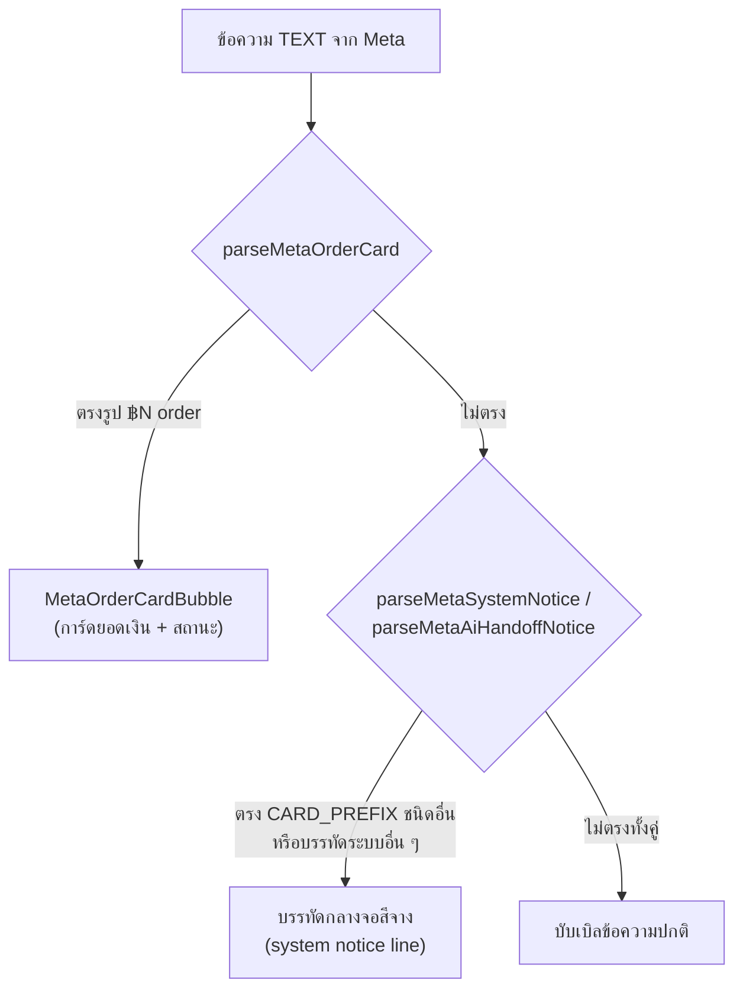

# 00018 — Extensions (2026-08-09) — การ์ดคำขอชำระเงินของ Meta ไม่เรนเดอร์

> | # | Extension | สรุป |
> |---|---|---|
> | E1 | การ์ด "คำขอชำระเงิน" ขึ้นเป็นข้อความดิบกลางเธรดแทนที่จะเป็นการ์ด | 2 บั๊กซ้อนกัน: regex เดิมรับแค่รูป `฿N order` ล้วน ๆ · `ChatThread` เรียก `parseMetaSystemNotice` ก่อนเสมอ ซึ่งจับคำนำหน้าเดียวกันได้ก่อน |
>
> **ไม่มี migration** — ไม่แตะ schema
>
> ไฟล์ที่แตะ: `src/lib/meta-order-card.ts` · `src/services/channel-chat.service.ts` ·
> `src/app/(paces)/seller/(chat)/inbox/[conversationId]/components/ChatThread.tsx`
> (+ เทสใหม่ `src/lib/__tests__/meta-order-card.test.ts`)

---

## E1 — การ์ดคำขอชำระเงินตกไปเป็นบรรทัดระบบ

### E1.1 อาการที่ user รายงาน

การ์ดคำขอชำระเงิน (feature เดิม, ขึ้นเป็น `MetaOrderCardBubble` — ไอคอน ฿ + ยอดเงินตัวใหญ่)
ขึ้นเป็นบรรทัดข้อความระบบกลางจอแทน:

```
[การ์ดจาก Facebook] ฿360.00 order — Waiting for payment
```

### E1.2 Root cause — 2 ชั้น

**ชั้นที่ 1 — regex เดิมแคบเกิน:** `parseMetaOrderCard` เดิมรับแค่รูปเดียว `"฿N order"` ทั้งบรรทัด
เป๊ะ ๆ (รูปที่มาจากเส้น webhook ดั้งเดิม ก่อนวันที่ 2026-08-07) แต่ตั้งแต่ `EXTENSIONS-2026-08-07.md`
§E3 ทำให้ทั้งเส้น webhook สดและเส้น backfill/Graph sync **เติมคำนำหน้า `CARD_PREFIX` + subtitle
สถานะเสมอ** ("`[การ์ดจาก Facebook] ฿360.00 order — Waiting for payment`") — regex เดิมไม่รู้จักรูป
ใหม่นี้เลย จึงคืน `null` ทุกครั้ง

**ชั้นที่ 2 — ลำดับการเช็คใน `ChatThread.tsx`:** แม้แก้ regex แล้ว การ์ดยอดเงินกับการ์ดคำนำหน้า
`CARD_PREFIX` ชนิดอื่น (โทร/ปุ่ม) **ใช้คำนำหน้าเดียวกัน** — `parseMetaSystemNotice` (ซึ่งจับ
`^\[การ์ดจาก Facebook\] ` ทุกชนิดเพื่อเอาไปแสดงเป็นบรรทัดระบบ ดู `EXTENSIONS-2026-08-07.md` §E2.2)
ถูกเรียก**ก่อน** `parseMetaOrderCard` เสมอ — ข้อความเดียวกันถูกทั้งสอง parser จับได้ (ยืนยันด้วยเทส
"ลำดับการตรวจ: การ์ดยอดเงิน vs บรรทัดระบบ" ใน `meta-order-card.test.ts`) แล้ว early-return ของ
`systemNotice` ชนะไปก่อนโค้ดจะไปถึงจุดเช็ค `metaOrder` ด้านล่าง

ทั้งสองชั้นต้องแก้พร้อมกัน — แก้แค่ชั้น 1 การ์ดยอดเงินก็ยัง parse ได้แต่โดน `systemNotice` แย่งไปก่อนอยู่ดี

### E1.3 การแก้ — สัญญาใหม่ของ `parseMetaOrderCard`

**สัญญาเปลี่ยน:** เดิมคืนแค่ `{ amount }` ตอนนี้คืน `{ amount, status: string | null }`

```ts
export interface MetaOrderCard {
  amount: string          // "฿400.00" — คงรูปเดิมที่ Meta ส่งมา ไม่ reformat
  status: string | null   // สถานะดิบภาษาอังกฤษของ Meta — null = ไม่รู้สถานะ (ข้อความเก่าก่อนมี subtitle)
}
```

regex ใหม่รับได้ **3 รูป** (ทั้งหมดมีอยู่จริงในฐาน/เทส):

| รูป | ตัวอย่าง | ที่มา |
|---|---|---|
| ไม่มีคำนำหน้า ไม่มีสถานะ | `฿400.00 order` | เส้น webhook เดิมก่อน 2026-08-07 |
| มีคำนำหน้า ไม่มีสถานะ | `[การ์ดจาก Facebook] ฿360.00 order` | รู้ยอด ไม่รู้สถานะ |
| มีคำนำหน้า + สถานะ | `[การ์ดจาก Facebook] ฿360.00 order — Waiting for payment` | รูปปัจจุบันของทั้ง webhook และ backfill/Graph sync (หลัง 2026-08-07) |

ยัง anchor เต็มบรรทัด (`^...$`) เหมือนเดิม (กันจับข้อความจริงของร้านที่บังเอิญมีคำว่า `order` ปน)
และตัด suffix `" และอีก N รายการ"` ของ carousel (`composeStructuredText` ต่อท้ายเวลามีการ์ดหลายใบ)
ออกจากสถานะก่อนคืนค่า — ยังไม่เคยเจอยอดเงินที่มาเป็น carousel จริงบน prod แต่กันไว้ล่วงหน้า

🛑 **คำนำหน้าผูกกับ `CARD_PREFIX` ใน `channel-chat.service.ts` — แก้คำนั้นต้องแก้ 3 ที่พร้อมกัน**
(`channel-chat.service.ts` · `meta-system-notice.ts` · `meta-order-card.ts`) เพราะ
`meta-order-card.ts` เป็น pure module ที่ import ข้ามไปหาไฟล์ที่มี server code ไม่ได้

### E1.4 การแก้ — ลำดับการเช็คใน `ChatThread.tsx`

การ์ดคำขอชำระเงินต้องชนะบรรทัดระบบเสมอ — สลับลำดับการเช็คโดยกันไว้ก่อน:

```ts
// รูปที่อยู่บน main จริงหลัง merge กับงาน carousel — ดู §E1.8
const hasGenericCards = !!m.cards && m.cards.length > 0        // จากคอมมิต 6aaaa2a6
const isMetaOrderCard = m.type === 'TEXT' && !!parseMetaOrderCard(m.body)
const systemNotice =
  m.type === 'TEXT' && !hasGenericCards && !isMetaOrderCard
    ? (parseMetaSystemNotice(m.body) ?? parseMetaAiHandoffNotice(m.body))
    : null
```

— `isMetaOrderCard` เช็คก่อนเสมอ ถ้าเป็นการ์ดยอดเงิน `systemNotice` จะไม่ถูกคำนวณเลย (ตกไปเรนเดอร์
เป็น `MetaOrderCardBubble` ที่จุดเช็ค `metaOrder` เดิมด้านล่าง — โค้ดจุดนั้นไม่ต้องแก้ เพราะเรียก
`parseMetaOrderCard` ตัวเดียวกันอยู่แล้ว)

— `hasGenericCards` เป็นของงาน carousel คนละคอมมิต แต่ **ต้องอยู่ในนิพจน์เดียวกัน** ทั้งคู่
(เหตุผลเต็มที่ §E1.8 — ตัดตัวใดตัวหนึ่งออก อีกฝั่งพังเงียบทันทีโดย `tsc`/เทสไม่ฟ้อง)

**การ์ดคำนำหน้าเดียวกันชนิดอื่น (โทร/ปุ่ม) ยังตกไปเป็นบรรทัดระบบตามเดิมทุกประการ** — เพราะ
`parseMetaOrderCard` แคบเฉพาะรูป "฿N order" เท่านั้น ไม่กว้างพอจะไปแย่งการ์ดชนิดอื่น (ยืนยันด้วยเทส
`'[การ์ดจาก Facebook] Video call — Call again'` และ `'[การ์ดจาก Facebook] โทรหา ร้านทดสอบ —
ส่งข้อความแล้ว'` → ทั้งคู่คืน `null` จาก `parseMetaOrderCard` แต่ `parseMetaSystemNotice` ยังจับได้)

**สรุปการแยกทางของข้อความที่ขึ้นต้นด้วย `CARD_PREFIX`:**



หมายเหตุ: `parseMetaAiHandoffNotice` (feature "เธรดที่ Meta AI ถือสิทธิ์คุมอยู่" — เพิ่ม 2026-08-08)
เป็นกลไกคนละชุดสตริงจาก `parseMetaSystemNotice` แต่คืนรูปร่าง `MetaSystemNotice` เดียวกัน จึง render
ผ่านช่อง `E` เดียวกันได้โดยไม่ต้องแก้ JSX เพิ่ม — ไม่เกี่ยวกับ `CARD_PREFIX`/carousel

### E1.5 สถานะดิบของ Meta — ห้ามแปล ห้ามจำแนกสี

- `status` เป็น **คำอังกฤษดิบของ Meta เก็บตรงตัว ห้ามแปลไทย** (user เคาะ 2026-08-09: ต้องตรงกับ
  Business Suite 100% การแปลเองเสี่ยงแปลผิดความหมาย)
- `MetaOrderCardBubble` ให้ทุกสถานะใช้ **โทน warning เหมือนกันหมด** (`badge bg-warning/15
  text-warning-ink`) — 🛑 **ห้ามจำแนกสีตามความหมายของคำ** เรายังไม่มีหลักฐานว่า Meta ใช้คำอะไรได้
  บ้างทั้งหมด ถ้าเดาว่าคำไหนแปลว่า "จ่ายแล้ว" แล้วให้เขียวไป จะกลายเป็นการยืนยันสิ่งที่เราไม่รู้จริง
  (Verified-Means-Green — เขียวสงวนไว้กับสิ่งที่ยืนยันแล้วเท่านั้น)
- `status = null` แปลว่า **"ไม่รู้สถานะ" ไม่ใช่ "ไม่มีสถานะ"** — ข้อความที่บันทึกไว้ก่อนมี subtitle
  (ก่อน 2026-08-07) ไม่มีสถานะให้แสดง แต่นั่นไม่ได้แปลว่าการ์ดใบนั้นไม่มีสถานะจริงบน Meta ห้ามเติมคำ
  แทนตอนเป็น `null` (`MetaOrderCardBubble` ไม่ render แถบสถานะเลยเมื่อ `status` เป็น `null`)

🛑 **ข้อเท็จจริงเดิมของไฟล์นี้เปลี่ยนไปแล้ว:** คอมเมนต์หัวไฟล์ `meta-order-card.ts` เคยเขียนไว้ว่า
**"ไม่มีข้อความสถานะการชำระเงินเลยสักรายการในฐาน — ห้ามเขียนสถานะเป็นข้อเท็จจริง"** (สำรวจ
2026-07-31) ตอนนี้ **ไม่จริงแล้ว** เพราะเส้น Graph sync/backfill (2026-08-07) เริ่มส่ง subtitle
สถานะมาด้วย — คอมเมนต์แก้ไขให้ตรงกับข้อเท็จจริงปัจจุบันแล้วในคอมมิตเดียวกัน (`949e22d5`)

### E1.6 preview ในรายการแชท — แก้ทั้ง 2 ทางเข้า

preview เดิมของการ์ดคำนำหน้า `CARD_PREFIX` ทุกชนิด (รวมการ์ดยอดเงิน) คือ `[ข้อความจากระบบ]`
เปลี่ยนเฉพาะการ์ดยอดเงินเป็น **`คำขอชำระเงิน {amount}`** — แถวที่สำคัญที่สุดในรายการแชท (ลูกค้าถูก
ขอให้จ่ายเงิน) ไม่ควรอ่านเหมือนข้อความอัตโนมัติทั่วไป

ต้องแก้ **ทั้ง 2 ทางเข้าที่คนละไฟล์เดียวกัน** (`channel-chat.service.ts`) เพราะ concept เดียวกันต้อง
อ่านเป็นคำเดียวกันไม่ว่าจะมาทางไหน:

| ทางเข้า | ฟังก์ชัน | เดิม | ใหม่ |
|---|---|---|---|
| webhook (ข้อความสด) | `singlePreview` (~L926) | `[ข้อความจากระบบ]` | `parseMetaOrderCard(displayText)` เช็คก่อนสาขา `hasDisplayText` → `` `คำขอชำระเงิน ${amount}` `` |
| backfill/Graph sync | `backfillPreview()` (~L376) | `[ข้อความจากระบบ]` | เช็ค `parseMetaOrderCard(c.body)` ก่อนสาขา `startsWith(CARD_PREFIX)` → `` `คำขอชำระเงิน ${amount}` `` |

ทั้งสองจุดต้องเช็คการ์ดยอดเงิน**ก่อน**เช็คว่าขึ้นต้นด้วย `CARD_PREFIX` เฉย ๆ — ไม่งั้นการ์ดยอดเงินจะ
ตกไปสาขา `[ข้อความจากระบบ]` เหมือนเดิมทั้งที่ตัวบับเบิลในเธรดแก้แล้ว (preview กับบับเบิลจะพูดกันคนละ
เรื่อง)

### E1.7 การพิสูจน์

- เทสใหม่ `src/lib/__tests__/meta-order-card.test.ts` (13 เคส) — ครอบทั้ง 3 รูปของ regex, การ์ดชนิด
  อื่นที่ใช้คำนำหน้าเดียวกันต้องไม่ถูกจับ, carousel suffix ไม่ไหลเข้าสถานะ, ค่าว่าง/null, และกลุ่ม
  "ลำดับการตรวจ: การ์ดยอดเงิน vs บรรทัดระบบ" ที่ตรึงไว้ว่าทั้งสอง parser จับข้อความเดียวกันได้จริง
  (ไม่ใช่เรื่องบังเอิญ) — เทสนี้จะแดงทันทีถ้าวันหนึ่งมีคนสลับลำดับการเช็คใน `ChatThread.tsx` กลับ
- `tsc` — ต้องรัน `prisma generate` ก่อน (client เก่ากว่า schema — ไม่เกี่ยวกับงานนี้)
- ยังไม่ได้ทำ: browser QA (user ตรวจเอง) — ยังไม่เคยเห็นการ์ดเรนเดอร์จริงบน prod หลังแก้

### E1.8 หมายเหตุ merge — guard เป็น 2 เงื่อนไข ไม่ใช่เงื่อนไขเดียว

คอมมิตนี้ (`949e22d5`) ชนกับงาน carousel/multi-card ของอีก session (`6aaaa2a6`) ที่ push ขึ้น
`main` ระหว่างทาง **ทั้งคู่แก้บรรทัดเดียวกันเป๊ะด้วยเหตุผลเดียวกัน** (การ์ดของ Meta ไม่ควรตกไป
เป็นบรรทัดระบบ) แต่คนละชนิดการ์ด:

| ฝั่ง | อาการที่แก้ | guard ที่เติม |
|---|---|---|
| `6aaaa2a6` (อีก session) | การ์ดสินค้า carousel ตกเป็นบรรทัดระบบ | `!hasGenericCards` |
| `949e22d5` (คอมมิตนี้) | การ์ดคำขอชำระเงินตกเป็นบรรทัดระบบ | `!isMetaOrderCard` |

**ผลลัพธ์บน `main` คือเงื่อนไขทั้งสองรวมกัน:**

```ts
const systemNotice =
  m.type === 'TEXT' && !hasGenericCards && !isMetaOrderCard
    ? (parseMetaSystemNotice(m.body) ?? parseMetaAiHandoffNotice(m.body))
    : null
```

🛑 **การเลือกข้างใดข้างหนึ่งตอน resolve conflict = อีกฝั่งพังเงียบทันที** และพังแบบที่ `tsc`/เทส
จับไม่ได้เลย เพราะทั้งสองทางคอมไพล์ผ่านและไม่มีเทสไหนครอบการ์ดทั้งสองชนิดพร้อมกัน

**ข้อควรระวังเวลาตรวจสอบไฟล์นี้:** branch `feat/chat-ad-referral-banner` ตามหลัง `main` อยู่
และ**ไม่มี**งาน carousel — การ grep ในเวิร์กทรีนั้นจะเห็น guard เงื่อนไขเดียวแล้วสรุปผิดว่า
`hasGenericCards` ไม่มีอยู่จริง (เกิดขึ้นมาแล้วตอนเขียนเอกสารฉบับนี้รอบแรก) **ต้องตรวจกับ
`git show origin/main:<path>` เสมอ ไม่ใช่ไฟล์ในเวิร์กทรี**
