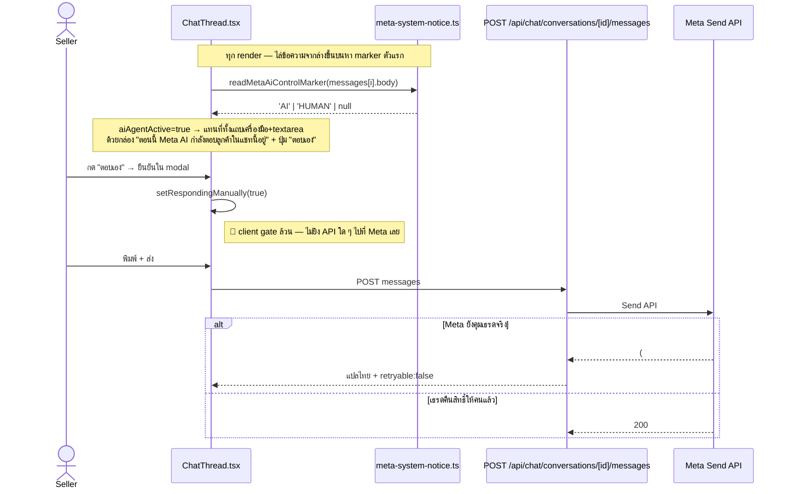

# 00018 EXT — ปุ่ม "ตอบเอง" (take over จาก Meta AI): ผลสืบสวน + ทางแก้ที่ถูกต้อง

> **วันที่:** 2026-08-16 · **สถานะ:** สืบสวนเสร็จ ยังไม่ลงมือแก้ · **ต้นเรื่อง:** ลูกค้า (ผู้ขาย) แจ้งบั๊ก
>
> เอกสารนี้เขียนจากการอ่านโค้ดจริง + สแกนฐาน prod (SELECT อย่างเดียว) + เอกสารทางการของ Meta + ตรวจ config
> ของ Meta App ผ่าน MCP `meta_developer_tools` — **ไม่มีข้อไหนเขียนจากความจำ** ทุกตัวเลขมีที่มา

---

## 1. คำร้องเรียนจากลูกค้า

1. *"ปุ่มตอบแทน AI มันไม่ทำงาน — กดแล้วก็ยังตอบไม่ได้ เพราะ AI ฝั่ง Meta ก็ยังคงทำงานอยู่"*
2. *"ลูกค้าไปกด Respond yourself จากฝั่ง Meta แล้ว แต่ใน Deep ก็ยังขึ้นว่าให้ตอบแทน (เหมือนมันไม่อัปเดตตาม)"*
3. *"อยากให้ปุ่มตอบเองทำงานได้ถูกต้องเหมือนปุ่ม Respond yourself ของ Meta"* (อ้างเธรด `23cb453e-ce1e-4b15-9fad-52902ec395d3`)

---

## 2. สิ่งที่โค้ดทำจริงวันนี้

| จุด | ไฟล์:บรรทัด |
|---|---|
| ตรวจว่าใครคุมเธรด (exact-match 5 สตริงอังกฤษ) | `src/lib/meta-system-notice.ts:138-178`, `:212-216` |
| คำนวณ `aiAgentActive` (ไล่ marker ล่าง→บน, เฉพาะ channel ≠ DEEP) | `ChatThread.tsx:1532-1539` |
| ปุ่ม "ตอบเอง" + modal ยืนยัน (ไม่ยิง API) | `ChatThread.tsx:1575-1582`, `:3517-3546` |
| แถบ "กำลังตอบเองแทน AI" + ลิงก์ Business Suite | `ChatThread.tsx:3827-3847` |
| จับ error `(#10)` แปลไทย | `src/lib/chat-send-failure.ts:116-140` |
| UI refresh: realtime + polling 6s + focus refetch | `useSellerChatThread.ts:527-585` |

**ข้อสรุปของส่วนนี้:** ปุ่ม "ตอบเอง" **ไม่เคยสั่งอะไร Meta เลย** เป็นแค่ local toggle ปลดล็อกกล่องพิมพ์ฝั่งเรา

---

## 3. หลักฐาน 3 ชั้น

### (ก) โค้ดของเรา
- `readMetaAiControlMarker()` ใช้ `n.en === body.trim()` — **exact string match ภาษาอังกฤษล้วน**
- ในไฟล์เดียวกัน `parseMetaSystemNotice()` (`:30-88`) ใช้ **regex ยึดท้ายประโยค** เพราะเรียนรู้แล้วว่าข้อความ Meta ไม่คงที่ — **สองฟังก์ชันเข้มงวดคนละระดับ ทั้งที่ปัญหาโครงเดียวกัน**
- คอมเมนต์ `:164-171` บันทึกเองว่า "รูปสั้น" เคยหลุดไม่ถูกจับบน prod 20 ใบ (08-08 → แก้ 08-15)
- ผลทดสอบ Graph API 2026-08-08: `take_thread_control` → `(#27)`, `pass/release_thread_control` → `(#100)`
- ตาราง `ChatHandoverEvent` ว่างเปล่า 100% ⇒ Meta ไม่ยิง `messaging_handovers` ให้เคส AI ของตัวเอง

### (ข) เอกสารทางการของ Meta
| ประเด็น | แหล่ง |
|---|---|
| *"The Take Thread Control API is blocked unless a default application is set"* ⇒ ตรงกับ `(#27)` ที่เราเจอ 100% | [Conversation Routing](https://developers.facebook.com/docs/messenger-platform/conversation-routing/) |
| *"Meta no longer supports Handover Protocol for Messenger and all the businesses are migrated to Conversation Routing"* | เดียวกัน |
| `is_owner` — *"filter and respond only to threads where is_owner is true"* | [Conversations API](https://developers.facebook.com/docs/messenger-platform/conversations/) |
| Conversation Routing APIs มี 7 ตัว **ไม่มีตัวไหนตั้ง default application ได้** — ตั้งผ่าน UI เท่านั้น | [Conversation Routing APIs](https://developers.facebook.com/docs/messenger-platform/instagram/features/conversation-routing/apis/) |
| doc **ไม่พูดถึง Meta AI agent เลยสักคำ** ว่าถ้าตั้ง default app แล้ว AI จะหยุดไหม | [messaging_handovers](https://developers.facebook.com/docs/messenger-platform/reference/webhook-events/messaging_handovers/) |

### (ค) config จริงของ Meta App (ผ่าน MCP `meta_developer_tools`, 2026-08-16)
App = **`1570859340799126` "Deep Chat & LIVE"** (ยืนยันว่าเป็นแอป prod จาก callback `seller.deepthailand.app`)

| เช็ค | ผล |
|---|---|
| webhook app-level (`devtools_webhook_list`) | topic `page` subscribe `standby` + `messaging_handovers` **ครบแล้ว** ✅ (instagram มี `standby` ด้วย) |
| `pages_messaging` | **REJECTED · access_level "none" · is_live false** (อยู่ใน submission ปัจจุบัน) |
| `pages_manage_metadata` / `pages_read_engagement` / `instagram_basic` / `instagram_manage_messages` / `Human Agent` | **REJECTED ทั้งหมด** |
| App Review (`devtools_app_review status`) | ใบ 2 `1717697219448670` = **PENDING** (ยื่น 2026-08-15) · ใบ 1 `1699582191260173` = **ไม่ผ่าน** (ปิด 2026-08-13) |

> ⇒ ตาราง `ChatHandoverEvent` ที่ว่างเปล่า **ไม่ได้เกิดจากลืม subscribe** — app-level ครบแล้ว
> (page-level `subscribed_apps` fields ยังไม่ได้ยืนยัน — งานค้าง)

---

## 4. ผลสแกนฐาน prod (2026-08-16, SELECT อย่างเดียว)

### 4.1 สตริง marker ที่มีอยู่จริง
5 สตริงที่โค้ดรู้จักมีครบและเข้ามาสม่ำเสมอ (`Your AI agent will respond.` 279 ใบ · `You took over this chat from your AI agent.` 192 ใบ · รูปอื่นรวม 38 ใบ)

**สตริงที่ไม่ match มีตัวเดียว** — `Your AI Agent transferred this chat to you because this contact went against our Community Standards.` (สังเกต **"Agent" ตัวใหญ่**) พบ 1 ครั้ง 2026-08-10

⇒ **สมมติฐาน "สตริงเพี้ยน/ภาษาไทย" ไม่ใช่สาเหตุหลัก** และสมมติฐาน "Valibot ตี event ตกทั้งก้อน" (`webhook-types.ts:117-118` `sender`/`recipient` เป็น required) **ตกไปด้วย** เพราะ marker เข้ามาครบ

### 4.2 การส่งที่ถูก Meta บล็อกด้วย `(#10)` — 37 ครั้ง / 21 เธรด (08-08 → 08-15 ยังเกิดอยู่)

| สถานะที่ Deep "คิดว่า" ตอนนั้น | จำนวน | แปลว่า |
|---|---|---|
| **ไม่มี marker เลย** | **27 (73%)** | Deep ไม่ขึ้นคำเตือนอะไร ผู้ขายพิมพ์ตามปกติ แล้วโดน Meta ปฏิเสธ |
| marker = **HUMAN** | 6 | Deep คิดว่าคนคุมแล้ว แต่ Meta ยังบล็อก — ห่างจาก marker 0 / 2 / 2 / 6 / 76 นาที และ **1,550 นาที (26 ชม.)** |
| marker = AI | 4 | ผู้ขายกด "ตอบเอง" แล้วส่งทั้งที่ AI ยังคุม |

### 4.3 เธรดที่ค้างสถานะ AI
**54 เธรด** มี marker ตัวล่าสุด = AI (48 เธรดค้างเกิน 1 วัน, เก่าสุด 08-08) และ **ไม่มีสักเธรดที่ส่งจาก Deep สำเร็จหลังจากนั้น**

---

## 5. Root cause

> **marker ของ Meta ไม่ใช่สัญญาณสถานะที่เชื่อได้** — Meta ส่งบ้างไม่ส่งบ้าง และส่งไม่ตรงความจริง
> เราเอาสัญญาณที่ควบคุมไม่ได้มาตัดสินว่าจะล็อกช่องพิมพ์หรือไม่ จึงพลาด **ทั้งสามทิศ**

| ทิศที่พลาด | ผล | หลักฐาน |
|---|---|---|
| ไม่มี marker → เราไม่ล็อก แต่ Meta บล็อก | ผู้ขายไม่รู้ตัวเลยว่าส่งไม่ผ่าน | 27/37 เคส |
| marker = HUMAN → เราปลดล็อก แต่ Meta ยังบล็อก | marker โกหก/ค้าง | 6 เคส สูงสุด 26 ชม. |
| marker = AI ค้าง → เราล็อกทั้งที่คนอาจคุมแล้ว | **= อาการที่ลูกค้าแจ้ง** | 54 เธรด |

**และต่อให้ตรวจสถานะแม่น ปุ่ม "ตอบเอง" ก็ยังไม่มีอำนาจสั่ง Meta อยู่ดี** เพราะไม่ยิง API ใด ๆ

---

## 6. ทางแก้ที่ถูกต้อง — Conversation Routing

Handover Protocol ถูกเลิกใช้แล้ว ทางที่ Meta รองรับตอนนี้คือ **Conversation Routing** ซึ่งให้ 2 สิ่งที่เราขาดพอดี:

| ได้อะไร | แก้ปัญหาข้อไหน |
|---|---|
| `POST /PAGE-ID/take_thread_control` ใช้ได้จริง | ปุ่ม "ตอบเอง" สั่งแย่งสิทธิ์ได้เหมือน Respond yourself |
| **`GET /PAGE-ID/conversations?fields=is_owner`** | **เลิกเดาสถานะจากสตริง** — ถามตรง ๆ ว่าเราเป็นเจ้าของเธรดไหม |
| `GET /PAGE-ID/thread_owner` | ตรวจว่าใครถือเธรดอยู่ |
| `pass/release/request/extend_thread_control` | ควบคุมครบวงจร |

### เงื่อนไขที่ต้องมี vs สถานะเรา

| ต้องมี | สถานะ |
|---|---|
| Meta Ad Account + Admin/MANAGE บนเพจ | ✅ |
| webhook `messages`, `messaging_handover`, `messaging_postbacks`, `messaging_referral`, `standby` | ✅ ครบ |
| ตั้ง **default application** ที่ Page Settings → Page Setup → Advanced Messaging / แท็บ Conversation Routing | ❌ **ยังไม่เคยตั้ง = สาเหตุตรง ๆ ของ `(#27)`** |
| `pages_messaging` + `pages_manage_metadata` + `pages_read_engagement` | ⚠️ **REJECTED ทั้ง 3 ตัว** อยู่ในใบ App Review PENDING |

### 🛑 ข้อจำกัดสำคัญ — ตั้ง default application ผ่าน API **ไม่ได้**
Conversation Routing มี 7 endpoint และ **ไม่มีตัวไหนตั้ง default app ได้** — ต้องให้ **เจ้าของเพจกดเองใน UI**

⇒ เป็น **manual step ต่อเพจที่ automate ไม่ได้** ต้องออกแบบ onboarding รองรับ:
- คู่มือ + ลิงก์ตรงไปหน้า setting ในหน้าเชื่อมเพจ
- ตัวตรวจว่าเพจตั้งหรือยัง (`GET /me?fields=messaging_feature_status` หรือลองยิง `take_thread_control` แล้วดู `#27`)
- ถ้ายังไม่ตั้ง → ปุ่ม "ตอบเอง" ต้องพาไปตั้งก่อน ไม่ใช่กดแล้วไม่เกิดอะไร

### หมายเหตุเพิ่ม
Meta ย้ายการตั้งค่า takeover มาอยู่ **ระดับแอปรายตัว** แล้ว ส่วนของเดิมที่ผูกกับ default app ถูก deprecate และ migrate ค่าไปหมด ⇒ ตอนทดสอบต้องดูทั้ง 2 ที่

---

## 7. แผนงานที่เสนอ

| ขั้น | งาน | ติดอะไร |
|---|---|---|
| **1** | ทดสอบบน**เพจทดสอบ**: เปิด Conversation Routing → ตั้ง Deep เป็น default app → วัด 3 อย่าง (AI ยังตอบไหม · `take_thread_control` คืน 200 ไหม · `is_owner` ตรงความจริงไหม) | รอ user ระบุเพจทดสอบ |
| **2** | ปุ่ม "ตอบเอง" ยิง `take_thread_control` จริง + เปลี่ยนตัวตัดสินสถานะจาก marker → `is_owner` + flow พาผู้ขายตั้ง Conversation Routing | ขึ้นกับผลขั้น 1 + App Review |
| **3 (ทำได้เลย)** | **fail-open**: เลิกล็อกช่องพิมพ์จาก marker ให้พิมพ์ได้เสมอ ใช้ `(#10)` เป็น ground truth (พร้อม CTA ไป Business Suite ใน error) + เก็บ marker ไว้เป็นป้ายบอกสถานะเฉย ๆ | — |
| **3b** | เพิ่มสตริง Community Standards + เปลี่ยน `===` เป็น case-insensitive/prefix | — |

**ทำไมขั้น 3 ต้องทำแม้จะมีขั้น 1-2:** ขั้น 1-2 ต้องรอทั้งผลทดสอบและ App Review ส่วน 37 เคสที่บล็อกผิดยังเกิดทุกวัน

---

## 8. Requirement gap (ต้อง backfill)

1. AC ของฟีเจอร์นี้ **ไม่เคย sync เข้า BRD/SRS ของ 00018** — grep `standby` ในทั้งสองไฟล์ = 0 ผลลัพธ์ อยู่แค่ใน EXTENSIONS (ขัด HR11 ในทางปฏิบัติ)
2. ไม่มี AC ระบุว่า "ปุ่มตอบเองสำเร็จ" แปลว่าอะไร และไม่มี requirement ให้ UI นำทางไปขั้นที่ 2
3. `EXTENSIONS-2026-08-08.md` ยังเขียนว่า "ยังไม่ยืนยันว่าส่งผ่านไหมตอน AI ถือห้อง" ทั้งที่โค้ดปิดไปแล้ว → doc ล้าหลังโค้ด
4. `TestCase.md` grep `standby` = 0 — ไม่มี test case ของ flow นี้เลย

---

## 9. คำถามค้าง

1. **มีเพจไหนให้ทดลองเปิด Conversation Routing ได้** (ห้ามเป็นเพจที่ขายจริง, ห้ามเป็น Code CooL เพราะรอ App Review)
2. ยอมรับ trade-off ของ fail-open ไหม (ผู้ขายอาจพิมพ์แข่งกับ AI ช่วงสั้น ๆ แลกกับการไม่ค้างผิดสถานะ)
3. page-level `subscribed_apps` fields ยังไม่ได้ยืนยัน — ต้องเช็คเพิ่ม

---

## 10. บทเรียนที่ควรจำ

> **สัญญาณที่มาจากข้อความของระบบภายนอก (ที่ไม่มี spec สาธารณะรองรับ) ห้ามเอามาตัดสินใจบล็อก UI**
> ต้องใช้ ground truth ที่ระบบนั้นตอบกลับเราตรง ๆ (error code / field สถานะ) แทน — ที่นี่คือ `(#10)` และ `is_owner`
>
> 5 สตริง marker ถูก query จาก prod ครั้งเดียวเมื่อ 2026-08-08 **ไม่ใช่รายการจาก spec** จึงไม่มีทางครบและไม่มีทางกันพลาดซ้ำได้
