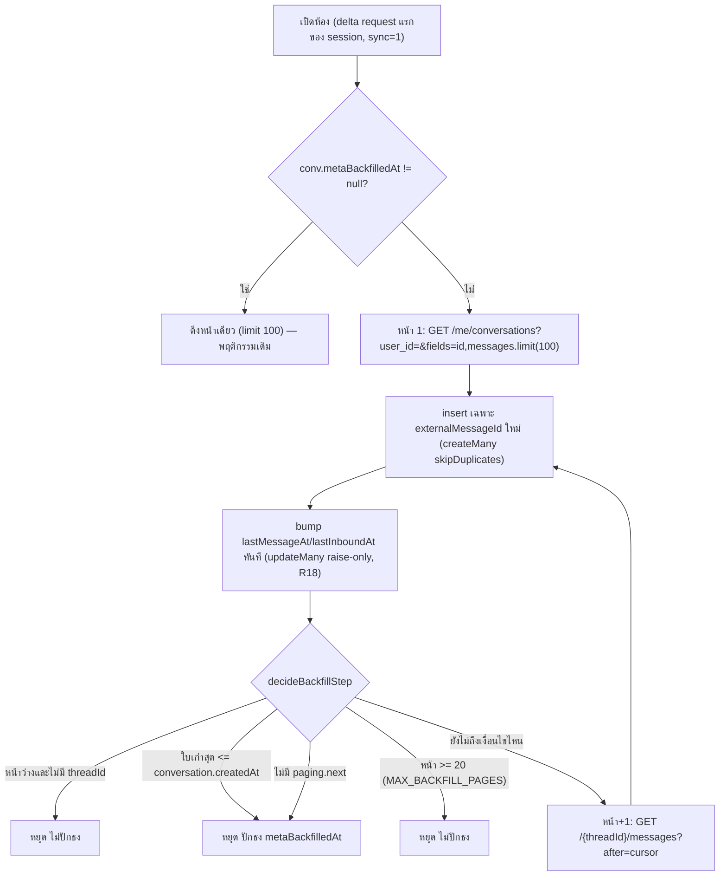
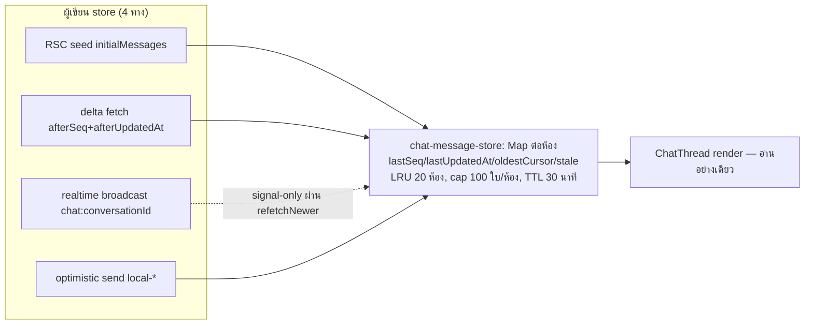

# 00018 ส่วนขยาย 2026-09-14 — ห้องแชทเปิดแล้วเห็นทันที ไม่โหลดซ้ำ ไม่เด้ง (delta + store ฝั่ง client)

> Design Spec เขียนก่อนเขียนโค้ดตาม Hard Rule 11: `docs/superpowers/specs/2026-09-14-chat-instant-render-and-delta-design.md`
> (มติ D-1..D-8) — เอกสารนี้บันทึก **สิ่งที่โค้ดทำจริง** ซึ่งต่างจาก spec ในหลายจุดเพราะ SDD ledger
> (`.superpowers/sdd/2026-09-14-chat-instant-render-and-delta/progress.md`, rulings R1–R27) ปรับระหว่าง
> implement — ยึดเอกสารนี้เป็นของจริง ไม่ใช่ spec ต้นฉบับ

## 1. ที่มา

ผู้ใช้รายงาน 3 อาการ (2026-09-14):

| อาการ | รากในโค้ด (ก่อนแก้) |
|---|---|
| เข้าห้องแล้วข้อความไม่ตรงกับที่เห็นในรายการ | `staleTimes.dynamic=30` (`next.config.ts`) + `InboxList` prefetch เต็ม ⇒ RSC payload เป็นภาพ ณ ตอน prefetch |
| กล่องแชท "เด้งตลอดเวลา" | `refetchNewer()` ยิงหน้าแรก 30 ใบทุก 6 วิ แล้ว `setMessages(ก้อนใหม่ทั้งชุด)` — ทั้ง array ถูกแทน |
| `X replied to an ad.` โผล่ทีหลัง | Meta ไม่ยิง webhook ให้ข้อความอัตโนมัติของตัวเอง — เห็นได้ก็ต่อเมื่อ `syncMissingMessagesFromMeta` ตอบกลับ |

พบเพิ่มระหว่างไล่: auto-loadOlder ยิงเองตอน mount ถ้าเธรดสั้น, backfill เดิมดึงแค่ 50 ใบหน้าเดียวแล้วทิ้ง `paging`, บับเบิลไม่มีเวลาระดับข้อความ (มีแต่ระดับกลุ่ม)

## 2. มติ D-1..D-8 (spec) + rulings ที่เปลี่ยนพฤติกรรมจริง

| # | มติ/ruling | สิ่งที่ทำจริง (ยืนยันกับโค้ด) | ทำไม |
|---|---|---|---|
| D-1 | ภาพแรกมาจาก cache ข้อความจริงฝั่ง client ไม่ใช่ `lastMessagePreview` | `useState(() => readThread(conversationId))` (`useSellerChatThread.ts:400`) | preview เป็นสตริงย่อ ไม่มี id/ชนิด/ไฟล์แนบ |
| D-2 | เพิ่ม `ChatMessage.updatedAt` + index สองแกน | ดู §3 | ทุกวันนี้การดึง 30 ใบทั้งก้อนทุก 6 วิ ทำหน้าที่ "เห็นค่าที่เปลี่ยน" อยู่โดยบังเอิญ |
| **R6** | แถวเก่าได้ `updatedAt` เป็น **`1970-01-01`** ไม่ใช่ `= createdAt` | `ADD COLUMN … DEFAULT '1970-01-01 00:00:00'` แล้ว `ALTER … SET DEFAULT CURRENT_TIMESTAMP` (migration SQL) — fast default ของ Postgres 11+ = เขียน metadata อย่างเดียว ไม่ rewrite/scan ตาราง (prod ~106,317 แถวตอนเขียน migration) | `ADD COLUMN` ถือ ACCESS EXCLUSIVE lock จนกว่า transaction จะ COMMIT — ถ้า `UPDATE` ทุกแถวในทรานแซกชันเดียวกัน (ซึ่ง Prisma บังคับ) ทุกการอ่าน/เขียน `ChatMessage` จะค้างทั้งระบบตลอดช่วงนั้น |
| — | ผลของ R6: ผู้อ่าน `updatedAt` **ต้องใช้ `max(createdAt, updatedAt)`** เสมอ ห้ามอ่านตรง ๆ | `watermarksOf()` (`chat-message-store.ts:108-118`): `const u = m.updatedAt && m.updatedAt > m.createdAt ? m.updatedAt : m.createdAt` | ไม่งั้นแถวเก่าทั้งหมดลาก watermark ย้อนไปปี 1970 → delta คิดว่าต้อง sync ทั้งเธรดใหม่ทุกรอบ poll |
| D-3 | backfill ครั้งแรกไล่จนสุดถึง `conversation.createdAt` แล้วปักธง | ดู §5 | จ่ายแพงครั้งเดียวต่อเธรด อยู่ใน `after()` ผู้ใช้ไม่รอ |
| D-4 | เข้าห้องแล้วจอเด้งล่างสุดเสมอ | `scrollToBottom()` ใน effect เปิดห้อง (ของเดิม ไม่เปลี่ยน) | ตรงกับเป้าหมาย "เห็นข้อความล่าสุด" |
| D-5 | ข้อความระบบของ Meta **นับรวม** ในโควตา 30 ใบ/หน้า | ไม่แตะ SQL — `type` ของแถวไม่มีคอลัมน์แยก "ข้อความระบบ" ยังจำแนกด้วย regex ตอน render (`meta-system-notice.ts`) | ฐานข้อมูลไม่รู้ว่าแถวไหนเป็นข้อความระบบ กรองใน SQL ไม่ได้ — ตั้งใจ ไม่ใช่ของค้าง |
| D-6 | รายการซ้ายใช้ patch รายแถว ไม่ `setItems` ก้อนใหม่ | `patchConversationRows()` (`src/lib/inbox-row-patch.ts`) เรียกจาก `refreshFirstPage` (`InboxList.tsx:972`) | ต้นเหตุ "กล่องแชทเด้งตลอดเวลา" |
| D-7 | badge "Meta AI" derive จาก marker ไม่เพิ่มคอลัมน์ | `attributeMetaAi()` (`meta-system-notice.ts:236-260`) | marker เป็นข้อความจริงในเธรดอยู่แล้ว |
| D-8 | delta merge แทรกตามเวลา ไม่ต่อท้าย | `mergeMessages()` sort ด้วย `compareMessages` ทุกครั้ง (`chat-message-merge.ts:57-80`) | ใบ backfill ได้ `seq` ใหม่แต่ `createdAt` เก่า ต่อท้ายจะไปโผล่ผิดที่ |
| **R7** (Critical, กลับข้อเสนอ reviewer) | `syncMissingMessagesFromMeta` **ไม่ได้ผูกกับ `after()` ของหน้า RSC** — ผูกกับพารามิเตอร์ `sync=1` ที่ hook ส่งเฉพาะครั้งแรกหลังเปิดห้อง | route: `if (!parsed.output.cursor && (!isDeltaRequest(parsed.output) \|\| parsed.output.sync === '1'))` (`route.ts:302`) · hook: `void refetchNewer({ sync: true })` ใน effect เปิดห้อง deps ว่าง (`useSellerChatThread.ts:925`) | หน้า RSC ถูก prefetch ทุกแถวที่มองเห็นในรายการแชท — ยิง Graph ทุกแถว prefetch รับไม่ไหว การเปิดห้องจริงกลายเป็น delta request ไปแล้ว (มี cache) ⇒ ถ้าไม่มี `sync=1` ข้อความที่ webhook ไม่ส่ง (Meta AI/standby/"replied to an ad.") จะไม่โผล่เลย |
| **R8** | watermark ของ store **ไม่ถอยหลังเด็ดขาด** = `max(watermark เดิม, watermarksOf(fetched))` — `fetched` คือแถวจาก delta/หน้าแรกเท่านั้น ไม่ใช่รายการบนจอ | `saveThreadView()` (`chat-message-store.ts:143-165`) — `loadOlder`/`cancelMessage` ไม่ส่ง `fetched` เข้ามาเปลี่ยน watermark | แถวจาก `loadOlder` มี `updatedAt` ของการแก้ล่าสุดที่ยังไม่เกี่ยวกับรอบนี้ ⇒ ลาก watermark ข้ามการแก้ของใบอื่นที่ยังไม่ได้ดึง |
| **R9** | ไม่มีกิ่ง "ร้านส่งเองก็เลื่อนตาม" — เลื่อนตามเฉพาะ `atBottom` | `shouldFollowNewMessages({ atBottom })` (`chat-thread-scroll.ts:19-24`) คืน `input.atBottom` ตรง ๆ | แถว SHOP ใหม่มาจากบอท/เพื่อนร่วมทีม/echo ของ Business Suite/Meta AI ด้วย ไม่ใช่แค่ตัวเอง — ตามทุกใบจะกระชากคนที่อ่านของเก่าลงมา (การกดส่งของตัวเองเลื่อนใน `handleSend` อยู่แล้ว) |
| **R10** | "ใบใหม่จริง" นิยามเดียว: ไม่อยู่ใน prev **และ** ใหม่กว่าใบล่าสุดที่ไม่ใช่ `local-*` บนจอ | `pickNewIncoming()` (`chat-thread-scroll.ts:62-74`) ใช้ทั้งตัวนับ/เสียง/การเลื่อนตาม | ใบที่ delta คืนกลับมาเพราะถูกแก้ (รีแอ็กชัน/ลบ) ไม่ใช่ "ใหม่" · ใบ backfill กลางเธรดก็ไม่ใช่ |
| **R11** | `refetchNewer` เป็น single-flight + รันตามหลังอีกหนึ่งรอบถ้ามีคำขอมาซ้อน | `flightRef`/`pendingRef` (`useSellerChatThread.ts:865-890`) | realtime ยิง broadcast 1 ครั้ง/แถว — อัลบั้ม 8 รูปเรียก 8 ครั้งติดกัน ปล่อยขนานจะนับ/ดังซ้ำ |
| **R12** | `userHasScrolled` ติดจาก **`wheel`/`touchmove`** เท่านั้น ไม่ใช่ `scroll` | `mark()` ผูกกับ `wheel`/`touchmove` (`useSellerChatThread.ts:1058-1075`) แยกจาก `onScroll` ที่ผูก `atBottomRef` (บรรทัด 679-702) | การ scroll ที่โปรแกรมสั่งเอง (`scrollToBottom`) ก็ยิง event `scroll` — ถ้าใช้ตัวนั้นตัดสิน "ผู้ใช้เลื่อนเอง" จะติดธงผิดจากการเลื่อนอัตโนมัติ; คีย์บอร์ด/ลากแถบเลื่อน/screen reader ไม่ยิง wheel/touchmove เลย (WCAG 2.1.1) — ครอบด้วยเงื่อนไข `!atBottomRef.current` ใน `onScroll` แทน |
| **R13/R16** | delta อาจมีช่องว่างบนจอ (`planDeltaApply(...).replace` — ดู R28) = ต้องโหลดหน้าแรกใหม่แทนที่จอ — **แต่ถ้าไม่ได้อยู่ล่างสุดให้เลื่อนออกไป** (ตั้งธง `staleForRef`) ไม่ทำทันที | `fetchNewerOnce()` บรรทัด 778-798 · แทนที่จริงเกิดตอนผู้ใช้ถึงล่างสุด (`onScroll` เรียก `reloadIfStaleRef.current()`) หรือกดปุ่ม "ข้อความใหม่" (`clearUnseen()`) | แทนที่ด้วย 30 ใบใหม่สุดทันทีจะลบ DOM ที่ผู้ใช้กำลังอ่านทิ้ง = จอเด้ง (ผิดเป้าหมายข้อ 3 ตรง ๆ) |
| **R28 + planDeltaApply** (final fix wave) | แทนที่จอด้วยหน้าแรก: watermark ตั้งจาก **หน้าแรก + แถว delta ที่ trigger** (`firstPageReplacement()`) · ใบที่ไม่เปลี่ยนคง object เดิม · เกณฑ์แทนที่ = delta เต็มเพดาน **และทุกแถวอยู่ในหน้าต่างของจอ** (ไม่เก่ากว่าใบเก่าสุดที่โหลดไว้) · แถวที่เก่ากว่าหน้าต่างไม่เข้าจอเมื่อยังมีของเก่าใน DB (loadOlder ดึงเอง) แต่ยังเข้า watermark | `chat-message-merge.ts` `firstPageReplacement` · `chat-thread-scroll.ts` `planDeltaApply` · hook `reloadFirstPage(triggeredBy, known?)` + `staleDeltaRef` | watermark จากหน้าแรกอย่างเดียว: แถว backfill (seq สูง · createdAt เก่า · updatedAt=ตอน insert) ไม่อยู่ในหน้าแรก ⇒ delta เต็มทุก poll ⇒ แทนที่จอซ้ำทุก 12 วิไม่จบ · และเกณฑ์ "คืนครบ take" อย่างเดียววนกลับได้ผ่านระยะเผื่อ R31 (แถว backfill ชุดเดียวกันถูกคืนซ้ำ ≥100) — server ตัดตาม createdAt desc แถวที่ไม่ได้มาจึงเก่ากว่าใบเก่าสุดที่ได้มาเสมอ |
| **R29** | เปิดห้องที่ merge cache+initial: id ที่มีทั้งสองชุดใช้สำเนาที่ `messageVersion` = max(createdAt, updatedAt) ใหม่กว่า เท่ากันใช้ cache | `resolveOpeningMessages()` + `messageVersion()` (`chat-message-merge.ts`) — `watermarksOf` ใช้ตัวเดียวกัน | กลับห้องเดิมภายใน 30 วิ router cache คืน RSC ก่อนรีแอ็กชัน/สถานะส่ง และ watermark ของ cache ข้ามการแก้นั้นไปแล้ว ⇒ ถ้า initial ชนะ ค่าเก่าค้างถาวร |
| **R31** | client ส่ง `afterUpdatedAt = watermark − 5 วินาที` (แกน seq ไม่ถอย) | `deltaAfterUpdatedAt()` (`chat-delta-query.ts`) | seq/updatedAt กำหนดตอนรันคำสั่งแต่มองเห็นตอน commit — `$transaction` commit สลับลำดับได้ + นาฬิกา app server เหลื่อม · แถวที่ถูกคืนซ้ำ idempotent (identity/ไม่นับ/ไม่ดัง) |
| **R33** | poll ที่ store ไม่มี watermark (ขอ `take=30`) แล้วหน้าแรกต่อกับจอไม่ติด (`nextCursor` ไม่ null และใบเก่าสุดของหน้าใหม่กว่าใบล่าสุดบนจอ) → ไปทางแทนที่ (ใช้หน้าที่ได้มาแล้ว) เคารพ R16 | `firstPageLeavesGap()` (`chat-thread-scroll.ts`) | merge แล้วได้ช่องว่างกลางเธรดที่ loadOlder ไม่มีวันเติม |
| **R34** | ถอด `ThreadCache.stale`/`markThreadStale` และการเรียกใน `InboxList` | — | state ที่ไม่มีใครอ่าน — เปิดห้องยิง delta reconcile เสมออยู่แล้ว |
| **R14/R15** | เปิดห้องที่มีทั้ง cache และ initial (จาก RSC): คาบเกี่ยวกัน → `mergeMessages` แล้ว **ไม่ส่ง `fetched`** (watermark คงของ cache) · ไม่คาบเกี่ยว (initial ใหม่กว่าทั้งชุด) → ใช้ initial อย่างเดียว + ตั้ง watermark ใหม่ | `resolveOpeningMessages()` (`chat-message-merge.ts:100-122`) + เรียกจาก effect เปิดห้อง (`useSellerChatThread.ts:907-922`) | initial (RSC) เก่าได้แค่ ~30 วิ (router cache) ส่วน cache เก่าได้ถึง 30 นาที — ถ้า cache ชนะเฉยๆ ข้อความล่าสุดที่รายการแชทเพิ่งโชว์จะหายจากห้องจนกว่า delta จะกลับมา |
| **R18** | backfill bump `lastMessageAt`/`lastInboundAt` **ทุกหน้า** ทันทีหลัง insert ด้วย `updateMany` ที่มี `lt`/`OR null` ใน `WHERE` (raise-only) — ไม่ใช่ครั้งเดียวหลังลูปตามแผนเดิม | `channel-chat.service.ts:420-442` | bump ครั้งเดียวหลังลูปพัง 3 ทาง: (1) race — ร้านตอบระหว่างไล่หลายสิบวินาที ค่าที่อ่านไว้ตอนต้นเก่ากว่าแล้ว (2) `after()` เพดาน `maxDuration=120` ตัดกลางทาง — insert ไปแล้วแต่ bump ไม่เคยรัน (3) throw ที่หน้า ≥2 — catch ข้าม bump ถาวร |
| **R19–R21, R25, R26** | เวลาเต็มใช้ `title` + `<span className="sr-only">` แทน `aria-label` บน `<div>` (ไม่มี role รองรับชื่อผู้เขียน) · ปุ่ม "ข้อความใหม่" มี `role="status"` แยกอยู่ **นอก** `<button>` · `tabIndex` ของกล่อง scroll ใส่ผ่าน `setAttribute`/ถอดตอน `blur` ไม่ใช่ JSX ค้าง (กัน iOS คีย์บอร์ดหุบตอนแตะเธรด) · แถวเวลาอัลบั้มรูปได้ `flex-wrap` เหมือนแถวข้อความเดี่ยว | `ChatThread.tsx:3903-3906, 3978, 3992-4021, 3123-3125` | ux gate (Hard Rule 8) + `docs/conventions/aria-name-requires-supporting-role.md` + `ios-fixed-overlay-visual-viewport` + `flex-header-truncation.md` |
| **R22/R23** | บรรทัดเวลาที่มองเห็น: วันนี้ → `formatTimeHM` เดิม, ไม่ใช่วันนี้ → `formatRelativeDayTime` ผ่าน `formatChatBubbleTime()` (ฟังก์ชันใหม่ SSOT เดียว) · `title` เวลาเต็มวางเฉพาะ element ที่ห่อ "เนื้อความตัวอักษร" ห้ามวางบนกล่องที่มีปุ่ม/ลิงก์/การ์ด/รูป | `format-date.ts:382-386` (`formatChatBubbleTime`), เรียกที่ `ChatThread.tsx:3125, 3905` | บับเบิลรูป/การ์ดไม่มี hover tooltip ที่มีความหมาย (มีแต่ปุ่ม/ลิงก์ข้างใน) |
| **R24** | ตัวนับปุ่ม "ข้อความใหม่" นับเฉพาะ `senderRole === 'BUYER'`, ไม่มีขั้นต่ำ 1 | `countUnseenIncrement()` (`chat-thread-scroll.ts:84-88`) | user ตัดสินหลัง critique — ข้อความทีม/บอท/Meta AI ไม่ใช่สิ่งที่ผู้ขายต้องรีบเลื่อนลงไปตอบ |
| **R27** | Task 8 (เอกสารนี้) ทำเฉพาะ doc — ไม่ rebase/verify/push ใน subagent | — | rebase+verify+push (HR17) เป็นของ Controller ตอน finishing และต้องแจ้ง user ก่อน push เพราะ migration รันบน prod ตอน build (HR15) |

## 3. Data model ที่เปลี่ยน (additive ล้วน)

| Model | Field/Index | ความหมาย |
|---|---|---|
| `ChatMessage` | `updatedAt DateTime @updatedAt @default(now())` | watermark แกนที่ 2 ของ delta — Prisma เขียนให้เองทุก `update`/`updateMany` (ไม่มีทางหลุด **ยกเว้น** raw SQL — ดู `chat-message-no-raw-write.test.ts` §7) 🛑 แถวที่มีอยู่ก่อน migration `20260914150000` มีค่า **`1970-01-01`** (fast default) ไม่ใช่ `= createdAt` — ผู้อ่านต้องใช้ `max(createdAt, updatedAt)` |
| `ChatMessage` | `@@index([conversationId, updatedAt])` (`ChatMessage_conversationId_updatedAt_idx`) | ให้ query แกน `updatedAt` ของ delta ไม่ full-scan ตารางที่ใหญ่ที่สุดในระบบ |
| `Conversation` | `metaBackfilledAt DateTime?` | `null` = ยังไม่เคยไล่ backfill ครบถึง `conversation.createdAt` (เปิดห้องครั้งถัดไปจะไล่ต่อ) · มีค่า = ไล่ครบแล้ว รอบถัดไปดึงหน้าเดียวพอ |

Migration 2 ไฟล์ (แยกกันโดยตั้งใจ — R30):

`prisma/migrations/20260914150000_chat_message_updated_at/migration.sql`:
```sql
ALTER TABLE "ChatMessage" ADD COLUMN "updatedAt" TIMESTAMP(3) NOT NULL DEFAULT '1970-01-01 00:00:00';
ALTER TABLE "ChatMessage" ALTER COLUMN "updatedAt" SET DEFAULT CURRENT_TIMESTAMP;
ALTER TABLE "Conversation" ADD COLUMN "metaBackfilledAt" TIMESTAMP(3);
```

`prisma/migrations/20260914150100_chat_message_updated_at_index/migration.sql`:
```sql
CREATE INDEX IF NOT EXISTS "ChatMessage_conversationId_updatedAt_idx" ON "ChatMessage"("conversationId", "updatedAt");
```
🛑 เจตนาแยก `ADD COLUMN` (constant default = fast default, ไม่ rewrite ตาราง) จาก `SET DEFAULT` (คนละคำสั่ง คนละ lock — คำสั่งที่สองแค่แก้ catalog ของคอลัมน์ที่มีอยู่แล้ว) — **ห้ามรวมเป็น `ADD COLUMN … DEFAULT CURRENT_TIMESTAMP` คำสั่งเดียว** เพราะ `CURRENT_TIMESTAMP` ไม่ใช่ค่าคงที่ ⇒ Postgres จะ rewrite ทั้งตาราง (ค้างเหมือน `UPDATE` ทุกแถว)

🛑 ทุกคำสั่งในไฟล์ migration เดียวกันรันในทรานแซกชันเดียว ⇒ ACCESS EXCLUSIVE ของ `ADD COLUMN` (บล็อก **ทั้งอ่านและเขียน**) ถูกถือจน COMMIT — ถ้า `CREATE INDEX` อยู่ไฟล์เดียวกัน lock นั้นจะค้างตลอดการสร้าง index บน ~106k แถว (บันทึกของ Task 1 ที่ว่า "ไม่บล็อกการอ่าน" ผิด) ⇒ ไฟล์แรกเหลือแต่คำสั่ง metadata (ได้ lock แล้วถือเสี้ยววินาที — ช่วงเสี่ยงเดียวคือรอคิว lock ต่อจากทรานแซกชันยาวที่ถือ `ChatMessage` อยู่ ระหว่างนั้นคำขอที่มาทีหลังต่อคิวด้วย = ค้างชั่วคราวแล้วคลายเองเมื่อทรานแซกชันนั้นจบ) · 🛑 **จงใจไม่ใส่ `lock_timeout`**: migration ที่ล้มเพราะหมดเวลาถูกบันทึกเป็น failed ใน `_prisma_migrations` แล้ว `migrate deploy` ครั้งถัดไปทุกครั้งหยุดด้วย **P3009** จนกว่าจะมีคนรัน `prisma migrate resolve --rolled-back` ชี้ prod ด้วยมือ — push ใหม่แก้ไม่ได้ และขัด HR15 · ไฟล์ที่สองถือแค่ `SHARE` lock: การอ่านไหลต่อ การเขียน ChatMessage รอจนสร้างเสร็จ · ไม่ใช้ `CONCURRENTLY` เพราะทำในทรานแซกชันที่ Prisma ห่อไม่ได้ · `IF NOT EXISTS` เพราะฐาน local สร้างไปแล้วจากไฟล์รุ่นก่อนแยก

## 4. API contract ที่เปลี่ยน

`GET /api/chat/conversations/[id]/messages` (`src/app/api/chat/conversations/[id]/messages/route.ts`)

พารามิเตอร์ใหม่ (`ChatMessagesQuerySchema`, `src/lib/validations.ts:940-950`):

| พารามิเตอร์ | validator | ความหมาย |
|---|---|---|
| `afterSeq` | `v.pipe(v.number(), v.integer(), v.minValue(0))` | คืนแถวที่ `seq > afterSeq` — `0` เป็นค่าที่ถูกต้อง (ห้องที่ยังไม่มีข้อความ) ต้องเช็คด้วย `!== undefined` ไม่ใช่ truthiness (`chat-delta-query.ts:10-11`) |
| `afterUpdatedAt` | `v.pipe(v.string(), v.isoTimestamp())` | คืนแถวที่ `updatedAt > afterUpdatedAt` |
| `sync` | `v.optional(v.literal('1'))` | R7 — ขอให้ backend ไล่เก็บข้อความที่ webhook ไม่ส่ง (`syncMissingMessagesFromMeta`) แม้คำขอเป็น delta |

กติกาโหมด delta (`isDeltaRequest()` = มี `afterSeq` **หรือ** `afterUpdatedAt` อย่างน้อยหนึ่งตัว):

- `WHERE` เป็น `OR` ของสองแกน (`buildDeltaWhere()`, `chat-delta-query.ts:20-27`) — ระบุพร้อมกันคือ "ใบใหม่ **หรือ** ใบเก่าที่เพิ่งแก้"
- **`nextCursor` เป็น `null` เสมอ** (`chat.service.ts:675, 683`) — delta ตอบคำถาม "ตั้งแต่ watermark นี้มีอะไรเปลี่ยนบ้าง" ไม่มีแนวคิดหน้าถัดไป ห้ามผู้เรียกเอาไปใช้ต่อเป็น cursor ของ `loadOlder`
- `take` ถูก cap ที่ `Math.min(take, 100)` เสมอในโหมด delta ไม่ว่า query ส่งมาเท่าไร (`chat.service.ts:681`) — ตรงกับ `MAX_MESSAGES_PER_THREAD`/`DELTA_TAKE` ฝั่ง client
- เรียง `[createdAt desc, seq desc]` (จะถูก client sort กลับเป็น asc ผ่าน `mergeMessages`)
- ไม่ระบุทั้งคู่ = พฤติกรรมเดิมทุกประการ (หน้าแรก 30 ใบ, pagination cursor-based) — ChatWidget (`ChatWidgetThreadPanel.tsx`) ใช้ hook เดียวกันแต่ไม่ผ่าน query พวกนี้เข้าไม่ถึงโค้ด delta เลย
- **response มี `asOf` เพิ่ม** (ทุกโหมด — delta และหน้าแรก/cursor; field เสริมล้วน แชทฝั่งผู้ซื้อ `ChatThread.tsx` อ่านแค่ `items`/`nextCursor` ไม่กระทบ): เวลาฝั่ง server (ISO) ที่จับ **ก่อน** query ข้อความ (`chat-thread-messages.service.ts` `getThreadMessagesPage`) — client ยก watermark แกน updatedAt เป็น `max(เดิม, watermarksOf(แถวที่ได้มา), asOf)` ผ่าน `nextWatermarks()` (`chat-message-store.ts`) เฉพาะ response ที่นำไปใช้จริง: delta ที่ merge (มี cache) และหน้าแรกที่แทนที่จอ (loadInitial / `reloadFirstPage` / RSC) · **ไม่ยก** ตอน loadOlder, ยกเลิกข้อความ, เลื่อนการแทนที่ไว้ (R16) และหน้าแรกของ R33 ที่ merge ต่อจอ (จออาจถือแถวเก่ากว่าหน้านั้นที่ถูกแก้ระหว่างนั้น) · client ยังส่ง `watermark − 5 วิ` (R31) ⇒ ห้องที่ไม่มีอะไรเขียนมาเกิน 5 วิ poll ได้ 0 แถว (เดิมไม่มี asOf: คืนแถวช่วง (T−5, T] ซ้ำทุก 12 วิตลอดไป) · 🛑 ห้ามย้ายไปจับหลัง query — แถวที่เขียนระหว่าง query จะหลุดถาวร
- `sync=1` **ไม่ trigger** เมื่อไม่มี cursor และไม่ใช่ delta (หน้าแรกธรรมดา — behavior เดิม syncs อยู่แล้วผ่าน `!isDeltaRequest`) และ trigger เมื่อเป็น delta **และ** `sync==='1'` เท่านั้น — poll ทุก 12 วิ (ของเดิม 6 วิ) ไม่ส่ง `sync` จึงไม่ยิง Graph ซ้ำ (route.ts:302)

## 5. backfill ที่มีขอบเขต (ตรง spec §5.6 ทุกจุด ยกเว้น R18)



- `decideBackfillStep()` (`src/lib/meta-backfill-bound.ts`) แยก `stop` (รอบนี้พอแค่นี้) กับ `markComplete` (เธรดนี้ครบแล้วตลอดไป) เป็นคนละคำถาม — ชนเพดาน 20 หน้าคือ `stop=true, markComplete=false`
- หน้าว่างที่ยัง**มี** `paging.next` ต้องไล่ต่อ (ตามเอกสาร Graph) — `page.threadId === null` (Graph ไม่คืนเธรดเลย) คือกรณีเดียวที่ `break` โดยไม่ปักธงและไม่ผ่าน `decideBackfillStep`
- 🛑 **ข้อจำกัดที่รู้ตัว: ไม่เก็บ cursor ข้ามรอบ** — ทุกรอบเริ่มหน้า 1 ใหม่ ⇒ เธรดที่มีข้อความตั้งแต่ `createdAt` เกิน ~2,000 ใบ (20×100) ไม่มีวันได้ธง และไล่ 20 หน้าเดิมซ้ำทุกครั้งที่เปิดห้อง (หลัง throttle 5 นาที)
- MESSENGER เท่านั้น (IG ตอบ error `2207085` ที่ `/me/conversations`, LINE ไม่มี endpoint เทียบเท่า) — ไม่ใช่ของรอบนี้ทำ เป็นข้อจำกัดเดิมของ `syncMissingMessagesFromMeta`
- หน้าแรกดึง **100** ใบ (เดิม 50 ใบ ผ่าน `fetchThreadMessages` ที่ยังใช้อยู่ที่อื่น — `fetchThreadMessagesPage` เป็นฟังก์ชันใหม่คนละตัว)

## 6. สถาปัตยกรรม store ฝั่ง client



- `MAX_MESSAGES_PER_THREAD=100`, `MAX_THREADS=20`, `THREAD_TTL_MS=30*60_000` (`chat-message-store.ts:20-22`)
- **ไม่ลง `localStorage`** — อยู่ใน module-level `Map` ของแท็บเท่านั้น (ข้อความลูกค้าเป็น PII) — ปิดแท็บแล้วหายพร้อมกัน
- LRU ใช้ `performance.now()` ไม่ใช่ `Date.now()` — เขียนหลายห้องในลูปเดียวกันมักได้ ms เดียวกันหมดถ้าใช้ `Date.now()` แล้ว eviction ไล่ผิดห้อง (คอมเมนต์ `ponytail:` ที่ `chat-message-store.ts:58-65`)
- `sameMessage()` (`chat-message-merge.ts:27-42`) เทียบ `body/imageUrl/reactionEmoji/isDeleted/edited/_status/_failReason/createdAt/seq` **และ `updatedAt`** — `updatedAt` เป็นสัญญาณครอบฟิลด์อื่นที่ไม่ได้ list (cards/productCard) ไม่มีมันเทียบไม่ครบ
- เทส `[blocker]` (พิสูจน์ด้วย mutation): `chat-message-merge.test.ts`, `chat-message-store.test.ts`, `chat-thread-scroll.test.ts`, `inbox-row-patch.test.ts`, `meta-backfill-bound.test.ts`, `chat-delta-query.test.ts`, `meta-ai-attribution.test.ts` (`attributeMetaAi`), `chat-messages-sync-not-blocking.test.ts`, `chat-message-no-raw-write.test.ts` (สแกนซอร์สกัน raw SQL เขียน `ChatMessage` — ยืนยันแล้ว 2026-09-14 ว่าไม่มีจุดไหนเลยทั้ง `src/`)

🛑 **กับดักเครื่องมือระหว่างเขียนด่านสุดท้าย:** ด่านรุ่นแรกของ `chat-message-no-raw-write.test.ts` ยิง `rg` ผ่าน `execSync` — `rg` เป็น shell function ของ Claude Code เท่านั้น ไม่ถูกส่งต่อเข้า child process ⇒ `execSync('rg …') || true` กลืน "command not found" เป็นสตริงว่างเปล่า ด่านเขียวเสมอไม่ว่าจะมี raw write หรือไม่ แก้ด้วย BSD `grep` (มีจริงที่ `/usr/bin/grep`) คัดไฟล์ต้องสงสัยก่อน แล้วให้ JS regex ตัดสินจากเนื้อไฟล์จริง

## 7. เคสขอบที่จัดการแล้ว (ตรง spec §6)

| เคส | พฤติกรรมจริง |
|---|---|
| เข้าห้องที่ไม่เคยเปิด (ไม่มี cache) | ใช้ `initial` จาก RSC, ยิง delta ทันทีตอน mount |
| cache มี 60 ใบ (เคย loadOlder) แล้วกลับเข้ามา | แสดงทั้ง 60 (ไม่ cap ที่จอ — cap 100 อยู่ที่ store เท่านั้น) จออยู่ล่างสุด delta เติมเฉพาะที่ขาด |
| แท็บเปิดค้างข้ามคืน | TTL 30 นาทีหมดอายุ → `readThread()` คืน `null` ถือว่าไม่มี cache |
| ข้อความ optimistic (`local-*`) | ไม่เข้า `saveThreadView` (กรองด้วย `isReal()`), รอดจากทุก merge จนกว่าจะถูกจับคู่ทิ้ง |
| delta คืนใบ `isDeleted=true` | แทนที่ตำแหน่งเดิมใน `byId` Map (ไม่ลบออกจาก array) |
| ผู้ใช้เลื่อนอ่านของเก่า + มีข้อความใหม่ | ไม่เลื่อนจอ (R9) — ขึ้นปุ่ม "ข้อความใหม่" (นับเฉพาะ BUYER, R24) |
| 2 แท็บเปิดห้องเดียวกัน | ต่างคนต่าง store ไม่ sync กัน — ยอมรับได้ (ทั้งคู่ reconcile จาก DB ชุดเดียวกัน) |
| `seq` ของใบ backfill ใหม่กว่าใบที่เห็นอยู่ | delta คว้าได้ → `mergeMessages` แทรกตามเวลา (D-8) |
| delta คืนครบเพดาน (100 ใบ) | ทุกแถวอยู่ในหน้าต่างของจอ → R13/R16 แทนที่ทันทีถ้า atBottom เลื่อนออกไปถ้าไม่ใช่ · ใบเก่าสุดที่ได้มาเก่ากว่าหน้าต่าง → merge เฉพาะแถวในหน้าต่าง (R28) |
| หลังไล่ backfill >100 ใบ | watermark ตอนแทนที่ครอบแถว delta (R28) · แถวที่คืนซ้ำเพราะระยะเผื่อ R31 อยู่นอกหน้าต่างของจอ → ไม่แทนที่ซ้ำ |
| เปิดห้องที่มีทั้ง cache และ RSC initial | R14/R15 — merge หรือใช้ initial อย่างเดียว แล้วแต่คาบเกี่ยว |

## 8. หนี้ที่ยังเปิดอยู่ / parked

| หนี้ | รายละเอียด | Ruling |
|---|---|---|
| CREATE INDEX ไม่ใช้ CONCURRENTLY | แยกไฟล์แล้ว (R30) ถือ SHARE lock บล็อกเฉพาะการเขียน ChatMessage ระหว่างสร้าง index ~106k แถว — การอ่านไหลต่อ | R30 (แทน Task 1 parked ที่อ้างผิดว่าไม่บล็อกการอ่าน) |
| ~~แถว backfill คืนซ้ำทุก poll~~ **ปิดแล้วด้วย `asOf` (2026-09-15)** | เดิม: watermark มาจากค่าในแถวอย่างเดียว ⇒ ห้องเงียบคืนแถวช่วง 5 วิสุดท้ายทุก 12 วิตลอด (backfill ≥100 ใบ = 100 แถว/poll) · ตอนนี้: แกน updatedAt ยกถึง `asOf` ของ response ที่นำไปใช้ ⇒ แถวชุดเดิมถูกคืนซ้ำได้อีกไม่เกินหนึ่งรอบ (ระยะเผื่อ R31) · แกน seq ไล่หมดใน ⌈N/100⌉ รอบเพราะ `lastSeq` ขยับทุกรอบที่ได้แถว | เทส `[blocker] nextWatermarks — asOf` (a)–(d) + R28 ใน `chat-message-store.test.ts` · ยังเหลือ: ระหว่าง defer (แถวถัดไป) ไม่ยก watermark โดยตั้งใจ |
| ไม่เก็บ cursor ข้ามรอบ backfill | เธรดที่มีข้อความเกิน ~2,000 ใบ ไม่มีวันได้ธง `metaBackfilledAt` — Graph 20 calls ทุกครั้งที่เปิดห้อง (หลัง throttle 5 นาที) | Task 6 parked — เก็บ cursor ต้องมีมติ spec ใหม่ (Meta แนะนำไม่ให้เก็บ cursor ข้าม request) |
| Race เสี้ยววินาที: reload สำเร็จแล้วผู้ใช้เลื่อนขึ้นก่อน poll ที่ค้างมาถึง | ปุ่ม "1 ใหม่" ปลอมหนึ่งครั้ง + reload เกินหนึ่งรอบ / นับ-beep ซ้ำได้หนึ่งครั้ง | Task 4 parked — ไม่เสียข้อมูล self-heal รอบถัดไป |
| ระหว่าง defer (staleFor ติดธง) ทุก poll ยังดึง+enrich 100 ใบทุก 12 วิ ไม่มีกำหนด | ถ้าผู้ใช้อยู่ด้านบนตลอด | deferred |
| การแก้ค่าของใบเก่ามาก (นอก 100 ใบล่าสุดในห้องที่เปลี่ยน >100) ไม่เข้า cache จนกว่าจะ `loadOlder` | | deferred |
| `flightRef`/`pendingRef` ไม่ผูก `conversationId` | ทั้งสอง caller (ChatThread/ChatWidgetThreadPanel) remount ต่อห้องอยู่แล้ว จึงไม่ชนกันในทางปฏิบัติ | deferred |
| **ยังไม่ยืนยันบน prod จริง**: `/{threadId}/messages?after=` คืนรายละเอียดครบ (from/message/attachments) | เครื่อง dev ถอดรหัส page token ไม่ได้ (`CHANNEL_TOKEN_KEY` redacted); ยืนยันรูปร่าง response กับเอกสาร Graph ทางการ + โค้ดเดิมแทน (R17) | ดู §9 |
| **การเรียงรายการ/unread ลอยขึ้นบน** | นอกขอบเขตรอบนี้ (user เคาะให้แยกรอบ) | spec §2 |
| **backfill ของ IG และ LINE** | ข้อจำกัดฝั่งแพลตฟอร์ม (IG error `2207085`, LINE ไม่มี endpoint) — ไม่ใช่ของรอบนี้ | spec §2 |

## 9. ต้องยืนยันบน prod หลัง deploy (ทำจากเครื่อง dev ไม่ได้)

1. `GET /{thread_id}/messages?after=<cursor>` (edge ของ Graph ที่ `fetchThreadMessagesPage` ใช้ต่อหน้า 2 เป็นต้นไป) คืนรายละเอียดข้อความครบ (`from`, `message`, `attachments`) ตรงตามที่ `toGraphThreadMessage()` คาดหวัง — ยืนยันได้เฉพาะรูปร่าง response จากเอกสาร Graph ทางการเท่านั้นตอนเขียนโค้ด (R17) ถ้ารูปร่างต่างไป backfill จะหยุดหลังหน้าแรก (degrade เป็นพฤติกรรมเดิม ไม่เสียข้อมูล)
2. เธรดเดิม (มีข้อความอยู่ก่อนรอบนี้) ได้ `metaBackfilledAt` เป็นค่าหลังเปิดครั้งแรก — ไม่ใช่ `null` ค้าง
3. เธรดที่ยาวเกิน ~2,000 ใบ (ถ้ามีบน prod) พฤติกรรมตรงตามที่ระบุไว้ใน §8 (ไล่ 20 หน้าเดิมซ้ำ ไม่ได้ธง) ไม่ throw/timeout
4. index ใหม่ไม่ทำให้ query อื่นที่ใช้ `ChatMessage` ช้าลงผิดปกติ (planner อาจเปลี่ยน query plan ของ index เดิม `[conversationId, createdAt]`)

## 10. Browser QA (user ตรวจเอง — จุดที่ static ตรวจไม่ได้)

- เปิดห้องซ้ำ 3 รอบ ดูว่ามีกระพริบไหม
- เลื่อนอ่านของเก่าอยู่ แล้วให้ข้อความใหม่เข้า → ต้องไม่เลื่อนจอ, ต้องขึ้นปุ่ม "ข้อความใหม่"
- กดลบข้อความจากมือถือฝั่งลูกค้า แล้วดูว่าจอร้านอัปเดตภายใน 12 วินาที (poll interval ใหม่)
- เปิดเธรดที่ไม่เคยเปิดมาก่อน แล้วดูว่า `X replied to an ad.` โผล่แบบไม่กระตุก (ไม่ใช่แทนที่ทั้งจอ)
- iOS: แตะกล่องข้อความใหม่ตอนคีย์บอร์ดเปิดอยู่ ต้องไม่ทำให้คีย์บอร์ดหุบ (R25)
- แถวเวลาของอัลบั้มรูปที่ 320px ต้องไม่ล้นขอบ (R26)
- วงแหวนโฟกัสหลังกดปุ่ม "ข้อความใหม่" ด้วยคีย์บอร์ด
- ป้าย "AI ของ Meta" ขึ้นจริงบนบับเบิลของ Meta AI (ต้องมีเธรด standby จริงถึงจะทดสอบได้)
- วันบนแถวเวลาเมื่อไม่ใช่วันนี้ (ข้อความเก่า) แสดง "เมื่อวาน"/"D ก.ค." ตาม `formatRelativeDayTime`
- แผงโหลด/สเกเลตันไม่ขึ้นเลยตอนเปิดห้องที่เคยเปิดแล้ว (D-1)

## 11. นอกขอบเขต (ตรงกับ spec)

- การเรียงรายการ / unread ลอยขึ้นบน
- ย้ายการจำแนก "ข้อความระบบ" ไปเก็บตอน ingest (ยังเป็น regex ตอน render)
- backfill ของ Instagram และ LINE
- ส่งข้อความ / อัปโหลด / AI / auto-reply
