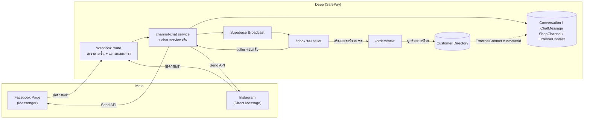

> **โมดูล:** M00018-FacebookChatIntegration
> **ประเภทเอกสาร:** Product Requirements Document (PRD)
> **เวอร์ชัน:** 1.1
> **วันที่จัดทำ:** 2026-07-22
> **สถานะ:** Draft — อิง Design Spec ที่ยังไม่ผ่าน user review (`docs/superpowers/specs/2026-07-22-facebook-chat-integration-design.md`) — รอ sign-off ก่อนส่งต่อ SRS/SDS/DATABASE/API/Tests (Hard Rule 11)
>
> 🔄 **v1.1 (2026-07-23) — doc-sync ตามของจริงบน prod:** เพิ่ม FR-FBC-15/16/17 (ข้อความสำเร็จรูป, AI ช่วยร่างคำตอบ, เครื่องมือ composer + ไฟล์แนบวิดีโอ/เสียง/ไฟล์), BR-FBC-23..27, TFR-FBC-12..14, table `QuickMessage` + คอลัมน์ CRM, endpoint quick-messages/ai-suggest/crm และปรับสถานะรายการที่ implement ไปแล้ว (S-7/S-8/หน้า channels). **โค้ดขึ้น prod ก่อนเอกสาร = หนี้ Hard Rule 11 ที่ back-fill ในรอบนี้**
> **เจ้าของเอกสาร:** BA + PO + PM (ดู [[Feature-Docs-Ownership]])

---

# PRD: Facebook Chat Integration (Messenger + Instagram DM)

---

## Executive Summary

Facebook Chat Integration คือฟีเจอร์ที่เชื่อม **Facebook Page (Messenger)** และ **Instagram DM** ของร้านค้าเข้ากับ `/inbox` ของ Deep โดยตรง ต่อยอดจากฟีเจอร์ `00011 - Deep Chat` (in-app chat ระหว่าง buyer↔seller ที่มีอยู่แล้ว) ให้กลายเป็น "inbox เดียว" ที่รวมทั้งข้อความจาก Deep เอง และข้อความจากช่องทาง Meta เข้าด้วยกัน seller ตอบลูกค้าที่ทักผ่าน Messenger/IG ได้จากหน้าเดียวโดยไม่ต้องสลับแอป และต่อยอดเป็นออเดอร์ในระบบได้ทันทีจากในเธรด

**ปัญหาที่แก้:** ลูกค้าส่วนใหญ่ของร้านค้าไทยทักผ่าน Messenger เป็นหลัก แต่ระบบ Deep เห็นเฉพาะแชทในแอปตัวเอง ทำให้ seller ต้องสลับหน้าจอไปมา ประวัติลูกค้าขาดตอน (ไม่รวมศูนย์) และตัวเลข response-time/response-rate ของ Deep ไม่สะท้อนความจริงของการให้บริการลูกค้า

MVP นี้ **ไม่ใช่การ build chat platform ใหม่** แต่เป็นการขยาย `Conversation`/`ChatMessage` ที่มีอยู่แล้วให้ "channel-aware" (รองรับ `DEEP` เดิม + `MESSENGER`/`INSTAGRAM` ใหม่) แล้วต่อเข้ากับ Meta ผ่าน webhook (ขาเข้า) และ Send API (ขาออก) มีข้อจำกัดสำคัญที่ต้องยอมรับตั้งแต่ต้น: ฟีเจอร์นี้ **ใช้งานได้เต็มรูปแบบกับร้านค้าคนนอกก็ต่อเมื่อผ่าน Meta App Review + Business Verification** (Advanced Access) ซึ่งใช้เวลา 1-4 สัปดาห์ — ทีมตัดสินใจ **build ให้เสร็จก่อน, QA ด้วย Page ของทีมเอง (Standard Access พอสำหรับ dev/QA), ยื่น App Review ขนานไปพร้อมกัน**

---

## 1. Business Goals & KPIs

### 1.1 เป้าหมายทางธุรกิจ

| เป้าหมาย | รายละเอียด |
|----------|-----------|
| **รวมศูนย์การสนทนากับลูกค้าไว้ที่ Deep** | seller ตอบลูกค้าที่ทักจาก Messenger/IG ได้จาก `/inbox` เดียวกับที่ตอบ Deep Chat เดิม ไม่ต้องสลับแอป |
| **ทำให้ response-time ของ Deep สะท้อนความจริง** | เมื่อรวมข้อความจากช่องทางหลักที่ลูกค้าไทยใช้จริง (Messenger) เข้ามา ตัวเลข response metric ในอนาคตจึงมีความหมายมากขึ้น |
| **ต่อยอดบทสนทนาเป็นออเดอร์ได้ทันที** | ลดขั้นตอนที่ seller ต้องพิมพ์ข้อมูลลูกค้า/สินค้าซ้ำเมื่อลูกค้าทัก Messenger แล้วอยากสั่งซื้อ — สร้างออเดอร์ prefill จากเธรดได้เลย |
| **ไม่เพิ่มความเสี่ยงข้อมูลลูกค้าจาก integration ที่ทำนอกระบบ** | ปิดช่องโหว่ webhook subscription ที่ตั้งไว้นอก repo (prototype เดิมชี้ ngrok ที่ตายแล้ว — ดู §6.2) และนำ integration เข้ามาอยู่ใต้มาตรฐานความปลอดภัยเดียวกับระบบหลัก |

### 1.2 ตัวชี้วัดความสำเร็จ (KPIs)

> เป้าหมายตัวเลขเป็นเป้าเบื้องต้น (proposed) ไม่มี baseline จริงเพราะฟีเจอร์ยังไม่เคย live ในระบบนี้มาก่อน — ปรับได้หลัง launch

| KPI | คำอธิบาย | เป้าหมาย (เสนอ) |
|-----|----------|---------|
| **Page/IG เชื่อมสำเร็จ** | จำนวน `ShopChannel` สถานะ `ACTIVE` | วัด trend หลัง launch |
| **% ข้อความ inbound ที่บันทึกสำเร็จ** | ข้อความที่ Meta ส่งเข้า webhook แล้วปรากฏใน `/inbox` ถูกต้อง (รวม dedup กรณี redeliver) | 100% ของข้อความที่ signature ผ่าน |
| **Echo Capture Rate** | % ของข้อความที่ seller ตอบจากแอป Messenger ตรง (`is_echo`) ที่ถูกบันทึกเป็นฝั่งร้านใน Deep ถูกต้อง | 100% |
| **% ตอบภายใน 24h window** | สัดส่วนข้อความที่ seller ตอบทันก่อนหน้าต่างส่งข้อความปิด | วัด baseline เดือนแรก |
| **Zero Regression บน Deep Chat เดิม** | เธรด `DEEP` (buyer↔seller ในแอป) ไม่มี behavior change ที่ไม่ตั้งใจหลังขยาย schema | Regression suite ผ่าน 100% |

---

## 2. User Personas (กลุ่มผู้ใช้งาน)

### 2.1 Seller เจ้าของร้าน (รวมศูนย์อินบ็อกซ์)

**ข้อมูลพื้นฐาน:** เจ้าของร้าน (`Shop.userId`) มี Facebook Page และ/หรือ Instagram Business Account ของร้านอยู่แล้ว ปัจจุบันตอบลูกค้าผ่านแอป Messenger/Instagram บนมือถือเป็นหลัก

**เป้าหมาย:** เห็นข้อความจากทุกช่องทาง (Deep, Messenger, IG) รวมในที่เดียว ตอบได้จากหน้าเดียว และแปลงบทสนทนาเป็นออเดอร์ได้ทันทีโดยไม่ต้องพิมพ์ข้อมูลลูกค้าซ้ำ

**ความต้องการ:** หน้าเชื่อม Page ที่ทำเองได้ไม่ต้องพึ่งทีม dev, เห็น badge ช่องทางชัดเจนว่าข้อความมาจากไหน, รู้ว่าเหลือเวลาตอบเท่าไรก่อนหน้าต่าง 24 ชม. จะปิด, สร้างออเดอร์จากเธรดได้ทันที

**จุดปวด (Pain Points):** ต้องคอยสลับเปิดแอป Messenger/Instagram/Deep พร้อมกันหลายแอป ประวัติลูกค้าไม่ต่อเนื่องข้ามแอป พิมพ์ข้อมูลลูกค้าซ้ำทุกครั้งที่จะสร้างออเดอร์จากแชท Messenger

**User Story:**
> ในฐานะ Seller เจ้าของร้าน ฉันต้องการเชื่อม Facebook Page/Instagram ของร้านเข้ากับ Deep แล้วตอบลูกค้าจาก `/inbox` เดียวกับที่ใช้อยู่แล้ว เพื่อไม่ต้องสลับแอปไปมาและสร้างออเดอร์ได้ทันทีเมื่อลูกค้าทักมาสั่งซื้อ

### 2.2 ลูกค้าที่ทักผ่าน Facebook/Instagram (ไม่ใช่ Deep User)

**ข้อมูลพื้นฐาน:** ผู้ใช้ Facebook/Instagram ทั่วไปที่ทักหา Page ของร้านโดยตรงผ่านแอป Messenger/Instagram — **ไม่มีบัญชี Deep** และไม่จำเป็นต้องสมัคร

**เป้าหมาย:** สอบถามสินค้า/สั่งซื้อผ่านช่องทางที่ตัวเองใช้อยู่แล้วตามปกติ โดยไม่รู้สึกว่าประสบการณ์เปลี่ยนไป

**ความต้องการ:** ได้รับคำตอบจากร้านตามปกติในแอป Messenger/Instagram ของตัวเอง (ไม่ต้องรู้ว่าเบื้องหลัง seller ตอบผ่าน Deep)

**จุดปวด:** ไม่มี pain point โดยตรงจากฝั่งนี้ — แต่ระบบต้องไม่ทำให้ประสบการณ์แย่ลง (เช่น ตอบช้าเพราะ seller ลืมเช็ค Deep, หรือส่งข้อความไม่ออกโดยไม่มีคำอธิบาย)

**User Story:**
> ในฐานะลูกค้าที่ทักร้านผ่าน Messenger ฉันต้องการได้รับคำตอบในแอปที่ฉันใช้อยู่ตามปกติ โดยไม่ต้องรู้หรือสนใจว่าร้านใช้ระบบอะไรตอบอยู่เบื้องหลัง

### 2.3 Seller ที่ตอบจากแอป Messenger บนมือถือโดยตรง (Echo Scenario)

**ข้อมูลพื้นฐาน:** seller คนเดียวกับ 2.1 แต่ในบางครั้งตอบลูกค้าจากแอป Messenger บนมือถือโดยตรง (ไม่ผ่าน Deep) เพราะสะดวกกว่าตอนอยู่นอกออฟฟิศ

**เป้าหมาย:** ไม่ว่าจะตอบจากช่องทางไหน (Deep หรือแอป Messenger ตรง) ประวัติการสนทนาต้องครบและตรงกันเสมอ

**ความต้องการ:** ข้อความที่ตอบจากแอป Messenger ตรงต้องปรากฏใน Deep ด้วย (ไม่ใช่แค่ข้อความที่ตอบผ่าน Deep เท่านั้น) — มิฉะนั้นประวัติที่เห็นใน `/inbox` จะไม่ตรงกับที่เกิดขึ้นจริง

**จุดปวด:** ถ้าระบบไม่จับข้อความ echo เหล่านี้ seller ที่กลับมาเปิด Deep จะเห็นบทสนทนาที่ "ขาดตอน" (ไม่เห็นว่าตัวเองเคยตอบอะไรไปแล้วจากมือถือ) — สเปกระบุชัดว่านี่คือจุดที่ **"ถ้าไม่ทำข้อนี้ระบบใช้งานจริงไม่ได้"** เพราะ seller ไทยส่วนใหญ่ยังตอบจากมือถือ

**User Story:**
> ในฐานะ Seller ที่บางครั้งตอบลูกค้าจากแอป Messenger บนมือถือโดยตรง ฉันต้องการให้ Deep บันทึกข้อความที่ฉันตอบไปแล้วด้วย เพื่อให้ประวัติการสนทนาใน `/inbox` ตรงกับความเป็นจริงเสมอ ไม่ว่าจะตอบผ่านช่องทางไหน

---

## 3. Business Requirements

### 3.1 ภาพรวม Functional Requirements (FR-FBC-01..12)

> ตารางนี้เป็น **overview ระดับ feature** — รายละเอียด User Story เต็ม/Acceptance Criteria แบบ Given-When-Then ของแต่ละ FR ดูที่ [[BRD]] §2 (รหัสเดียวกัน)

| FR | ชื่อ | ภาพรวม | Priority |
|----|------|--------|----------|
| **FR-FBC-01** | รับข้อความ TEXT เข้า `/inbox` | ข้อความ text จาก Messenger/IG เข้าระบบผ่าน webhook, ผูกเข้า Conversation/ExternalContact | Must |
| **FR-FBC-02** | รับข้อความ IMAGE เข้า `/inbox` | รูปภาพจาก Messenger/IG ถูกดาวน์โหลด+อัปโหลดเข้า storage ของ Deep เอง (URL ของ Meta หมดอายุ) | Must |
| **FR-FBC-03** | รองรับ `is_echo` | ข้อความที่ seller ตอบจากแอป Messenger ตรงต้องเข้า Deep เป็นฝั่งร้าน (`senderRole=SHOP`) | Must |
| **FR-FBC-04** | ตอบกลับออกไป Messenger/IG จริง | seller พิมพ์/แนบรูปใน Deep → ส่งออกจริงผ่าน Send API | Must |
| **FR-FBC-05** | 24-hour Messaging Window Guard | แสดงเวลาที่เหลือ + ปิดช่องพิมพ์เมื่อหมดเวลา ไม่ปล่อยให้กดส่งแล้วค่อย error | Must |
| **FR-FBC-06** | แสดงสถานะส่งข้อความไม่สำเร็จในเธรด | ลูกค้าบล็อก/token ตาย/เหตุอื่น → ต้องเห็นในเธรด ห้าม fail เงียบ | Must |
| **FR-FBC-07** | สร้างออเดอร์ / แนบสินค้าจากเธรด FB | prefill `/orders/new` จากเธรด บังคับกรอกเบอร์ | Must |
| **FR-FBC-08** | ผูกลูกค้า FB เข้า Customer Directory | เมื่อได้เบอร์จากการสร้างออเดอร์ → ผูก `ExternalContact.customerId` ครั้งเดียว | Must |
| **FR-FBC-09** | เชื่อม Facebook Page เข้าระบบ | OAuth แยกจาก login, เลือก Page ที่มีสิทธิ์ `MESSAGING`+`MODERATE`, subscribe webhook | Must |
| **FR-FBC-10** | ผูก Instagram DM อัตโนมัติ | ถ้า Page ที่เชื่อมมี IG Business Account ผูกอยู่ → สร้าง `ShopChannel` ฝั่ง IG อัตโนมัติด้วย page token เดียวกัน | Must |
| **FR-FBC-11** | จัดการ/ถอด Page ที่เชื่อมแล้ว | หน้า `/seller/settings/channels` — ดูสถานะ token, ถอดการเชื่อม (1 Shop : N Page) | Must |
| **FR-FBC-12** | Badge ช่องทาง + filter ใน `/inbox` | icon Messenger/IG, filter ตาม Page | Must |
| **FR-FBC-13** | จัดระเบียบเธรด — ปักหมุด / ซ่อน / ปิดงาน | `isPinned` / `isHidden` / `resolvedAt` ต่อเธรด; ซ่อนและปิดงานไม่ตัดขาดการรับข้อความ และกลับมาแสดงอัตโนมัติเมื่อลูกค้าทักใหม่ (S-7) | Must |
| **FR-FBC-14** | แท็ก + โน้ตภายใน + tab ออเดอร์ในแผงขวา | แท็กและโน้ตเป็นข้อมูลภายในร้าน ห้ามส่งออกไปหาลูกค้าเด็ดขาด; tab ออเดอร์แสดงเฉพาะออเดอร์จริงของ `Customer` ที่ผูกไว้ (S-8) | Must |
| **FR-FBC-15** | ข้อความสำเร็จรูป (canned reply) | ร้านเก็บชุดข้อความ/รูปที่ใช้บ่อยไว้ล่วงหน้า แล้วกดเติมลงช่องพิมพ์ได้ทันที — จัดการ (เพิ่ม/แก้/ลบ) ได้เองในหน้าแชท | Must |
| **FR-FBC-16** | AI ช่วยร่างคำตอบ | ระบบเสนอร่างคำตอบ 3 แบบจากบทสนทนาล่าสุด ให้แอดมิน "เลือก+แก้ก่อนส่ง" เสมอ — ไม่ส่งเองอัตโนมัติ | Should |
| **FR-FBC-17** | เครื่องมือ composer + ไฟล์แนบชนิดอื่น | เลือกอิโมจิจากในช่องพิมพ์; ไฟล์แนบจากลูกค้าชนิด วิดีโอ/เสียง/ไฟล์ ต้องเปิดดูได้ในระบบ ไม่ต้องเปิดแอป Messenger | Must |

> **FR-FBC-13/14 เพิ่มภายหลัง** จากผลตัดสิน Q-4 (design spec §8.1) เมื่อ user ส่ง layout
> reference มา — ไม่ได้อยู่ใน PRD ฉบับร่างแรก กฎธุรกิจที่ครอบสองข้อนี้คือ `BR-FBC-14`..`BR-FBC-19`
> ใน [[BRD]] §8.5–8.6
>
> **FR-FBC-15/16/17 เพิ่มภายหลังเช่นกัน (2026-07-23, back-fill หลัง implement)** — เกิดจาก user
> สั่งเพิ่มระหว่าง iterate หน้าแชทจริง (composer improvements #1–#3) แล้ว **โค้ดขึ้น prod ไปก่อน
> เอกสาร** ซึ่งเป็นหนี้ตาม Hard Rule 11 ไม่ใช่วิธีทำงานปกติ — เอกสารชุดนี้ (PRD/BRD/SRS/SDS/
> DATABASE/API/Tests) sync ตามของจริงในระบบ ณ 2026-07-23 ดูรายละเอียดที่ §3.7

### 3.2 รับข้อความเข้า (Inbound Messages)

**ความต้องการ:**
- ข้อความที่ลูกค้าส่งเข้า Page/IG ของร้านต้องปรากฏใน `/inbox` ของ Deep เหมือนเป็นเธรดเดียวกับ Deep Chat เดิม รองรับทั้งข้อความตัวอักษรและรูปภาพ (FR-FBC-01, FR-FBC-02)

**Business Rules:**
- ข้อความที่ seller ตอบจากแอป Messenger บนมือถือโดยตรง (`is_echo`) ต้องถูกบันทึกเป็นฝั่งร้านด้วย ไม่ใช่แค่ข้อความที่ตอบผ่าน Deep เท่านั้น (FR-FBC-03)
- ลูกค้าที่ทักเข้ามาทาง Facebook/Instagram ไม่ใช่ `User` ของ Deep — เป็น `ExternalContact` แยกต่างหาก จนกว่าจะได้เบอร์โทรจากการสร้างออเดอร์ (ดู §4.1)
- ข้อความซ้ำที่ Meta ส่งซ้ำ (webhook redelivery) ต้องไม่สร้างข้อความซ้ำในเธรด

**เหตุผล:** ลูกค้าไทยส่วนใหญ่ทักผ่าน Messenger เป็นช่องทางหลัก — ถ้าไม่รวมเข้ามาที่ `/inbox` เดียวกับ Deep Chat เดิม seller ยังต้องสลับแอปเหมือนเดิม การจับ `is_echo` เป็นเงื่อนไขที่ทำให้ฟีเจอร์ "ใช้งานได้จริง" เพราะพฤติกรรมจริงของ seller ไทยคือยังตอบจากมือถือบ่อยครั้ง

### 3.3 ตอบกลับข้อความ + หน้าต่างเวลา 24 ชั่วโมง

**ความต้องการ:**
- seller ตอบกลับจาก Deep แล้วข้อความต้องส่งออกไปถึง Messenger/IG จริง รองรับทั้งข้อความตัวอักษรและรูปภาพ (FR-FBC-04)
- ระบบต้องแสดงเวลาที่เหลือก่อนหน้าต่างส่งข้อความ (24 ชั่วโมงหลังลูกค้าส่งข้อความล่าสุด) จะปิด และปิดช่องพิมพ์ทันทีเมื่อหมดเวลา — ไม่ปล่อยให้ seller กดส่งแล้วเพิ่งรู้ว่าส่งไม่ออก (FR-FBC-05)
- ถ้าส่งไม่ออกด้วยเหตุอื่น (ลูกค้าบล็อกร้าน, token หมดอายุ) ต้องแสดงสถานะและเหตุผลในเธรดตรง ๆ ห้าม fail เงียบ (FR-FBC-06)

**Business Rules:**
- ร้านตอบลูกค้าได้เฉพาะภายใน 24 ชั่วโมงหลังข้อความล่าสุดของลูกค้าเท่านั้น (มาตรฐาน Meta) — เกินเวลาส่งไม่ออก
- MVP **ไม่ใช้ message tag** เพื่อยืดหน้าต่างเวลา — การใช้ message tag ผิดวัตถุประสงค์คือเหตุที่ Meta เคยระงับแอปมาแล้วในกรณีทั่วไป และ tag ที่มีให้เลือกไม่ครอบคลุมกรณีใช้งานทั่วไปของร้านค้า

**เหตุผล:** เป็นข้อจำกัดจาก Meta โดยตรง ไม่ใช่ทางเลือกของทีม — การไม่ใช้ message tag ใน MVP เป็นการเลือกความปลอดภัยของบัญชีแอปเหนือความสะดวก (ยืด window)

### 3.4 สร้างออเดอร์จากเธรด

**ความต้องการ:**
- seller เห็นบทสนทนากับลูกค้าจาก Messenger/IG แล้วต้องการสร้างออเดอร์ ต้องทำได้ทันทีจากในเธรดโดยไม่ต้องพิมพ์ข้อมูลซ้ำ (FR-FBC-07)
- เมื่อได้เบอร์โทรลูกค้าจากขั้นตอนสร้างออเดอร์ ต้องผูกลูกค้าคนนั้นเข้า Customer Directory ที่มีอยู่แล้ว เพื่อให้ครั้งถัดไปที่ลูกค้าคนเดิมทักมา ระบบรู้จักทันที (FR-FBC-08)

**Business Rules:**
- การสร้างออเดอร์จากเธรด FB **บังคับกรอกเบอร์โทรลูกค้าเสมอ** (เพราะ `Customer.phone` เป็น field บังคับและ unique ทั้งระบบตาม feature 00014)
- ลูกค้า FB จะกลายเป็น `Customer` จริงในระบบก็ต่อเมื่อสร้างออเดอร์และได้เบอร์แล้วเท่านั้น — ก่อนหน้านั้นเป็นแค่ `ExternalContact`
- การผูก `ExternalContact.customerId` ทำครั้งเดียว — ครั้งถัดไปที่ PSID/IGSID เดิมทักมา ระบบรู้จักลูกค้าคนนี้ทันทีโดยไม่ต้องขอเบอร์ซ้ำ

**เหตุผล:** ปิด pain point ที่ seller ต้องพิมพ์ข้อมูลลูกค้าซ้ำเมื่อจะสร้างออเดอร์จากแชท Messenger และทำให้ประวัติลูกค้าที่ทักผ่านหลายช่องทาง (FB, Deep, order link) รวมเป็นคนเดียวกันได้ผ่านกลไก Customer Directory ที่มีอยู่แล้ว โดยไม่ต้องแก้กฎ `Customer.phone` required+unique ที่เป็นแกนของระบบ dedup ข้ามร้าน

### 3.5 เชื่อม/จัดการ Facebook Page และ Instagram

**ความต้องการ:**
- seller ต้องเชื่อม Facebook Page ของร้านเข้ากับ Deep ได้ด้วยตัวเอง ผ่านหน้า `/seller/settings/channels` โดยไม่ต้องพึ่งทีม dev (FR-FBC-09)
- ถ้า Page ที่เชื่อมมี Instagram Business Account ผูกอยู่แล้ว ระบบต้องเชื่อม IG DM ให้อัตโนมัติโดยไม่ต้องให้ seller ทำ OAuth ซ้ำ (FR-FBC-10)
- seller ต้องเห็นสถานะ Page ที่เชื่อมอยู่ (ใช้งานได้/token หมดอายุ) และถอดการเชื่อมได้เมื่อต้องการ (FR-FBC-11)

**Business Rules:**
- 1 ร้าน (Shop) เชื่อมได้หลาย Page พร้อมกัน (1 Shop : N Page)
- 1 Page ผูกได้กับร้านเดียวเท่านั้น**ทั้งระบบ** — กันสองร้านแย่งกันรับข้อความจาก inbox เดียวกัน
- ผู้ที่กดเชื่อม Page ต้องมีสิทธิ์ Page task **`MESSAGING`** และ **`MODERATE`** — Page ที่ seller ไม่มีสิทธิ์นี้จะไม่ปรากฏให้เลือกเชื่อม
- การเชื่อม Page เป็น OAuth คนละขั้นตอนกับการ login เข้า Deep — ไม่ขอสิทธิ์จัดการเพจตั้งแต่ตอนสมัคร/login เพื่อไม่ให้ผู้ใช้ทั่วไปโดนขอสิทธิ์เกินความจำเป็น

**เหตุผล:** การแยก OAuth การเชื่อม Page ออกจาก login ทำให้คนที่แค่มาสมัครใช้งาน Deep ไม่ต้องเจอ consent dialog ขอสิทธิ์จัดการเพจที่ตัวเองยังไม่ได้ตั้งใจจะใช้ — และช่วยให้ App Review ผ่านง่ายขึ้นเพราะขอ scope ตรงตามที่ใช้จริงเท่านั้น (Meta ตรวจสอบเรื่องขอ scope เกินจำเป็นอย่างเข้มงวด)

### 3.6 การแสดงผลใน Inbox

**ความต้องการ:**
- `/inbox` ของ seller ต้องแยกแยะได้ว่าข้อความมาจากช่องทางไหน (Deep / Messenger / Instagram) และกรองดูเฉพาะ Page ใด Page หนึ่งได้ (FR-FBC-12)

**Business Rules:**
- ใช้ icon แยกตามช่องทาง (Messenger/Instagram) ไม่ใช้ emoji (Hard Rule 12)
- Filter ตาม Page ต้องแสดงเฉพาะ Page ที่ Shop ของ seller คนนั้นเป็นเจ้าของ

**เหตุผล:** seller ที่เชื่อมหลาย Page ต้องแยกแยะบริบทของลูกค้าแต่ละช่องทางได้ในสายตาแรก ไม่ปนกันจนสับสนว่าลูกค้าทักมาจากไหน

### 3.7 เครื่องมือช่วยตอบในช่องพิมพ์ (Composer Productivity)

> กลุ่มนี้ครอบ FR-FBC-15/16/17 — เกิดจากการใช้งานจริงว่า "รับข้อความเข้า/ตอบออกได้" ยังไม่พอ
> ร้านที่มีข้อความเข้าหลักสิบเธรดต่อวันต้องพิมพ์คำตอบเดิมซ้ำ ๆ ทั้งวัน

**ความต้องการ:**
- **ข้อความสำเร็จรูป (FR-FBC-15)** — ร้านเก็บข้อความ/รูปที่ใช้บ่อย (ทักทาย, วิธีสั่งซื้อ, รีวิวลูกค้าเก่า, เลขบัญชี) ไว้ล่วงหน้า แล้วกดเติมลงช่องพิมพ์ได้ทันที; เพิ่ม/แก้/ลบเองได้จากในหน้าแชทโดยไม่ต้องออกไปหน้าตั้งค่า
- **AI ช่วยร่างคำตอบ (FR-FBC-16)** — กดแล้วระบบอ่านบทสนทนาล่าสุดของเธรดนั้นแล้วเสนอ **ร่าง 3 แบบที่ต่างกันจริง** ให้แอดมินเลือก 1 อันไปแก้ต่อก่อนส่ง
- **เครื่องมือ composer อื่น (FR-FBC-17)** — เลือกอิโมจิได้จากในช่องพิมพ์ (ส่งได้ทุกช่องทางเพราะเป็น Unicode text ไม่ใช่รูป); ไฟล์แนบจากลูกค้าที่เป็น **วิดีโอ/เสียง/ไฟล์** ต้องเปิดดู/ฟัง/ดาวน์โหลดได้ในเธรดของ Deep เอง

**Business Rules:**
- ข้อความสำเร็จรูปเป็นของ **ร้าน** (ไม่ใช่ของผู้ใช้รายคน) — พนักงานทุกคนของร้านเห็นและใช้ชุดเดียวกัน ร้านอื่นไม่เห็น
- ข้อความสำเร็จรูป 1 รายการต้องมีอย่างน้อย "ข้อความ" หรือ "รูป" อย่างใดอย่างหนึ่ง (มีรูปอย่างเดียวได้)
- **AI ห้ามส่งเอง** — ผลลัพธ์ทุกครั้งต้องผ่านสายตาคนก่อนส่งเสมอ และ UI ต้องบอกชัดว่าเป็นข้อความที่ AI ร่าง (ตรวจทานก่อนส่ง)
- **AI ห้ามแต่งราคา/สต็อก/เงื่อนไขขึ้นเอง** — ถ้าไม่รู้ข้อมูลจริงให้ร่างเป็นการถามกลับ; ห้ามร่างข้อความขอ OTP/รหัสผ่าน/ข้อมูลบัตร
- บทสนทนาที่ส่งให้ AI ต้องอ่านจากฝั่งเซิร์ฟเวอร์ตามสิทธิ์ของร้านเท่านั้น — ห้ามให้ client ส่ง transcript เข้ามาเอง (กันปลอมบริบท/ยัด prompt)
- โน้ตภายใน/ชื่อที่แอดมินจดไว้ (FR-FBC-14) ใช้เป็นบริบทให้ AI ได้ แต่ AI ต้องไม่พูดถึงตรง ๆ ว่า "มีโน้ตเขียนว่า…" (ข้อมูลภายในร้าน)

> **ต่อยอดที่ feature 00019:** ฐานของ FR-FBC-16 ที่นี่คือ "AI เห็นแค่ชื่อร้าน + ประเภทกิจการ +
> ข้อความล่าสุด" ซึ่งทำให้ร่างมักออกมาเป็นการขอข้อมูลเพิ่ม — การเติมบริบทสินค้า/ราคา/นโยบายร้าน
> และ AI Prompt ที่ร้านเขียนเอง เป็นขอบเขตของ [[../00019 - AI Reply Assistant/PRD]]
> (รวมถึงกฎว่าข้อมูลติดต่อของลูกค้า เบอร์/อีเมล/ที่อยู่ ห้ามส่งเข้า AI)

**เหตุผล:** ลดเวลาตอบต่อเธรดซึ่งเป็นตัวชี้วัดหลักของฟีเจอร์นี้ (§1.2 % ตอบภายใน 24h window) — และเป็นสิ่งที่ inbox ของ Messenger เองมีอยู่แล้ว (canned reply) การย้ายมาตอบใน Deep จึงต้องไม่ทำให้ seller ทำงานช้าลงกว่าเดิม

---

## 4. Business Rules & Constraints

### 4.1 กฎทางธุรกิจหลัก

| กฎ | คำอธิบาย |
|----|----------|
| **1 Page = 1 ร้านทั้งระบบ** | `ShopChannel` unique ต่อ (provider, externalId) — Page หนึ่งผูกกับร้านเดียวได้เท่านั้นในทั้งระบบ Deep |
| **ลูกค้า FB ≠ User, ≠ Customer (จนกว่าจะได้เบอร์)** | ลูกค้าที่ทักผ่าน FB/IG เป็น `ExternalContact` — ไม่สร้าง `User` เงา และยังไม่ใช่ `Customer` ในระบบจนกว่าจะสร้างออเดอร์และได้เบอร์โทรจริง |
| **ข้อความ Echo ต้องนับเป็นฝั่งร้าน** | ข้อความที่ seller ตอบจากแอป Messenger โดยตรง (`is_echo`) ต้องบันทึกเป็น `senderRole=SHOP` เข้าเธรดเดียวกัน |
| **ไม่ merge เธรด Messenger กับ IG ของคนเดียวกัน (MVP)** | PSID (Messenger) กับ IGSID (Instagram) ของคนคนเดียวกันไม่มีตัวเชื่อมกันโดยตรง — ถือเป็นคนละเธรดจนกว่าจะได้เบอร์แล้วผูกเข้า `Customer` เดียวกัน |
| **24-hour Messaging Window** | ร้านตอบลูกค้าได้เฉพาะภายใน 24 ชม. หลังข้อความล่าสุดของลูกค้า — MVP ไม่ใช้ message tag ยืดเวลา |
| **Buyer app ไม่เปลี่ยนแปลง** | เธรด Messenger/IG ไม่ปรากฏฝั่ง buyer app (`/messages`) — ฟีเจอร์นี้เป็นมุมมองฝั่ง seller เท่านั้น |

### 4.2 ข้อจำกัดทางธุรกิจ

| ข้อจำกัด | รายละเอียด |
|---------|-----------|
| **Standard Access เท่านั้นในช่วงแรก** | ใช้งานได้เฉพาะ Page ที่ admin/developer/tester ของ Facebook App เป็นเจ้าของ — **ร้านค้าคนนอกใช้ไม่ได้จนกว่าจะผ่าน App Review + Business Verification** (Advanced Access) |
| **App Review ใช้เวลา 1-4 สัปดาห์** | ต้องมี screencast, privacy policy ที่เข้าถึงได้จริง, verify นิติบุคคลระดับ Business Portfolio |
| **ไม่มี message tag** | จำกัดการตอบอยู่ในหน้าต่าง 24 ชม. เท่านั้น ไม่มีทางยืดเวลาตอบใน MVP |
| **Web-only ฝั่ง seller** | ฟีเจอร์นี้อยู่บน `/inbox` (Paces, seller เว็บ) เท่านั้น — ไม่มีผลกับ mobile app buyer |
| **2 Facebook App แยกกัน** | App สำหรับ login (`990205170388742`) กับ App สำหรับ chat (`1570859340799126`) เป็นคนละแอป — seller จะเจอ consent dialog ของ Facebook 2 รอบ (login ครั้งหนึ่ง, เชื่อม Page อีกครั้งหนึ่ง) ดู §6.2 |

### 4.3 สถานะปัจจุบันของ Facebook App "Deep Chat & LIVE" (ตรวจจริง 2026-07-22)

> รายละเอียดตรวจสอบเต็มอยู่ที่ Design Spec §4 — สรุปสิ่งที่กระทบ requirement:

| รายการ | สถานะปัจจุบัน | ผลกระทบต่องาน |
|---|---|---|
| Webhook subscription | `active: true` ชี้ ngrok URL ที่ตายแล้ว (404) | **ความเสี่ยงข้อมูลลูกค้า** — ต้องปิด/เปลี่ยนก่อนเริ่มงาน (pre-work บังคับ ไม่ใช่แค่ nice-to-have) |
| `FACEBOOK_SECRET` ใน `.env.local` | ใช้ไม่ได้แล้ว (ถูก regenerate ไม่ได้อัปเดต) | FB login บน dev พังอยู่ตอนนี้ — ต้องแก้ก่อน QA ฝั่ง login ได้ |
| `privacy_policy_url` | ลิงก์ Google Drive | App Review จะตกถ้าไม่แก้เป็น URL สาธารณะจริง |
| `terms_of_service_url` | placeholder `https://www.facebook.com/` | App Review จะตกถ้าไม่แก้ |
| ชื่อแอปที่ผู้ใช้เห็น | "Deep Chat & LIVE" | ควรเปลี่ยนเป็นชื่อแบรนด์ "Deep" ก่อนยื่น review เพื่อความสม่ำเสมอของ consent dialog ทั้ง 2 แอป |
| Subscribed fields | มีแค่ `messages` | ยังขาด `messaging_postbacks`, `message_reactions`, และไม่มี `object=instagram` — ต้อง subscribe เพิ่มตอนพัฒนา |

รายการเหล่านี้เป็น **pre-work บังคับก่อนเริ่มเขียนโค้ด** (ข้อ 1-2) และ **งานฝั่ง Meta dashboard ที่ทำขนานได้แต่บล็อกการใช้งานจริง** (ข้อ 3-6) — ดู §9.1 Dependencies

---

## 5. Out of Scope (นอกขอบเขต)

สิ่งที่ระบบนี้ **ไม่รองรับ** ใน phase นี้:

| หัวข้อ | คำอธิบาย |
|--------|----------|
| **Facebook Live comment integration** | user ยืนยันว่าต้องการในอนาคต แต่ไม่ใช่ phase นี้ — ระบบวางรอยต่อไว้รองรับ (webhook dispatcher แยกตาม `object`/`field`, `ShopChannel` ถือ token พร้อมใช้) แต่**ไม่สร้าง model เผื่อ** (YAGNI) เพราะคอมเมนต์ (public thread บนวิดีโอ) คนละ shape กับบทสนทนา 1:1 |
| **Human Agent Tag (ยืด window เป็น 7 วัน)** | ต้องขอ feature เพิ่มใน App Review แยกต่างหาก — Phase 2 |
| **Private reply บนคอมเมนต์โพสต์** | Comment → private reply ไม่อยู่ใน MVP |
| **~~เสียง / วิดีโอ / ไฟล์แนบทั่วไป~~ → รองรับครบทั้งสองทางแล้ว (2026-08-02)** | **ขาเข้า** (FR-FBC-17, 2026-07-23): วิดีโอ/เสียง/ไฟล์ที่ลูกค้าส่งมาถูก mirror เข้า storage ของ Deep แล้วเปิดดู/ฟัง/ดาวน์โหลดได้ในเธรด · **ขาออก** (2026-08-02): ร้านแนบไฟล์ทุกชนิด ≤25MB ได้ทีละหลายไฟล์ ยกเว้นไฟล์รันได้/สคริปต์ (deny-list) — ชนิดที่ส่งได้จริงขึ้นกับข้อจำกัดของช่องทางปลายทาง (IG รับไฟล์เฉพาะ PDF) ดู [[EXTENSIONS-2026-08-02]] E1 |
| **Broadcast / message template / chatbot อัตโนมัติ** | ไม่มีการส่งข้อความหาลูกค้าหลายคนพร้อมกัน หรือระบบตอบอัตโนมัติใด ๆ — รวมถึง **AI ตอบเองโดยไม่มีคนกดส่ง** (FR-FBC-16 เป็นแค่ "ร่างให้เลือก" เท่านั้น ดู §3.7) |
| **WhatsApp** | ไม่อยู่ใน scope ของ integration นี้ |

---

## 6. Risks & Mitigation (ความเสี่ยงและแนวทางแก้ไข)

### 6.1 ความเสี่ยงทางธุรกิจ

| ความเสี่ยง | ผลกระทบ | ระดับความรุนแรง | แนวทางแก้ไข |
|-----------|---------|-----------------|-------------|
| App Review/Advanced Access ไม่ผ่าน หรือใช้เวลานานกว่าคาด | ร้านค้าคนนอก (นอก App role) ใช้ฟีเจอร์นี้ไม่ได้เลยแม้ build เสร็จ | สูง | ยอมรับความเสี่ยงตามที่ user ตัดสินใจแล้ว — build ให้เสร็จ, QA ด้วย Page ทีมเอง, ยื่น review ขนานไป; แก้ privacy/ToS/app name (§4.3) ก่อนยื่นเพื่อลดโอกาสตก |
| ลูกค้าไม่พอใจถ้าร้านตอบไม่ทันภายใน 24 ชม. | ประสบการณ์ลูกค้าแย่ลงเทียบกับตอบตรงในแอป Messenger เอง | กลาง | แบนเนอร์เตือนเวลาที่เหลือให้ seller เห็นชัดก่อนหมดเวลา (FR-FBC-05) |
| seller สับสนว่าทำไมต้องเจอหน้าขออนุญาต Facebook 2 รอบ | ความไม่มั่นใจ/อาจเลิกเชื่อมกลางทาง | ต่ำ-กลาง | สื่อสารในหน้า `/seller/settings/channels` ว่าเป็นขั้นตอนปกติ; วางแผนตั้งชื่อ/โลโก้/Business Portfolio ให้เป็นแบรนด์เดียวกันทั้ง 2 แอป (ไม่ใช่การลดจำนวน dialog เพราะ Facebook บังคับ incremental authorization) |

### 6.2 ความเสี่ยงทางเทคนิค

| ความเสี่ยง | ผลกระทบ | แนวทางแก้ไข |
|-----------|---------|-------------|
| **Webhook subscription เดิมชี้ ngrok ที่ตายแล้วแต่ยัง active** | โดเมน ngrok ฟรีถูกเวียนใช้ใหม่ได้ — ถ้ามี Page subscribe ค้าง ข้อความลูกค้าอาจถูกส่งไปหาใครก็ไม่รู้ที่จับโดเมนนั้นได้ (verify signature ไม่ผ่านแต่ payload ถึงมือแล้ว) | ปิด/เปลี่ยน callback URL ทิ้งก่อนเริ่มงาน (pre-work บังคับ — §4.3) |
| Webhook redelivery จาก Meta | ข้อความซ้ำในเธรดถ้าไม่มี idempotency | dedupe ผ่าน unique constraint บน `externalMessageId`; ลำดับส่งออก = ส่งผ่าน Send API ก่อน แล้วค่อยเขียน DB (ได้ `mid` มาใช้เป็น idempotency key ทันที) |
| Page access token ถูกถอนสิทธิ์/รหัสผ่านเปลี่ยน/ลบแอป | ส่งข้อความไม่ออกโดยไม่รู้ตัว | จับ error ตั้งสถานะ `TOKEN_INVALID` + แบนเนอร์ "เชื่อมต่อใหม่" ในหน้า channels |
| Signature verification ผิดพลาด/ถูกปลอม | ข้อมูลปลอมเข้าระบบผ่าน webhook | `X-Hub-Signature-256` timing-safe compare เป็น authentication เดียวของ route — validate ทุก payload ด้วย Valibot ไม่เชื่อ shape จาก Meta ตรง ๆ |
| PII ของบทสนทนา (ชื่อ/PSID/avatar ลูกค้า) รั่วผ่าน RSC flight | ข้อมูลส่วนตัวรั่วในหน้า seller ที่อยู่ใต้ client layout (บทเรียนเดิมจากหน้า order detail) | apply pattern neutralize-at-source เดียวกับที่แก้ปัญหา PII leak มาก่อนแล้ว |
| Shared DB drift (dev=prod Supabase เดียวกัน) | Migration ผิดพลาดกระทบข้อมูลจริง | ห้าม `prisma migrate dev` — เขียน SQL เอง + `migrate deploy -e .env.local` หลังขอ user ยืนยันเสมอ |
| **AI ร่างข้อความผิด/มั่วข้อมูล (hallucination)** แล้วแอดมินกดส่งโดยไม่อ่าน (FR-FBC-16) | ร้านสัญญาราคา/เงื่อนไขที่ไม่มีจริงกับลูกค้า | guardrail ใน system prompt (ห้ามแต่งราคา/เงื่อนไข ให้ถามกลับแทน) + บังคับให้คนเลือก/แก้ก่อนส่งเสมอ (ไม่มีปุ่มส่งอัตโนมัติ) + ข้อความกำกับใต้แผงว่า "AI สร้างคำแนะนำ — ตรวจทานก่อนส่งทุกครั้ง" |
| **ต้นทุน/โควตา Gemini API ถูกใช้จนหมดหรือถูกกดรัว** | ปุ่ม AI พังทั้งระบบ หรือค่าใช้จ่ายบานปลาย | rate-limit ต่อผู้ใช้แยกจาก global (15 ครั้ง/นาที) + ส่งเฉพาะข้อความล่าสุด 15 turn ไม่ส่งทั้งเธรด + ไม่มี key = คืน 503 พร้อมข้อความอ่านรู้เรื่อง ไม่ใช่ crash |
| **บทสนทนาลูกค้าถูกส่งออกไปยัง Google (Gemini)** | ข้อมูลลูกค้าออกนอกระบบ Deep | ส่งเฉพาะ transcript ล่าสุดที่จำเป็น (15 turn, ตัดรูป/การ์ดสินค้าเหลือ placeholder) — ไม่ส่งเบอร์/ที่อยู่จาก Customer Directory; key เป็น server-only (`GEMINI_API_KEY` ห้าม `NEXT_PUBLIC_`) |

---

## 7. Glossary (อภิธานศัพท์)

| คำศัพท์ | ความหมาย |
|---------|----------|
| **PSID** | Page-Scoped ID — ID ของลูกค้าที่ผูกกับ Page หนึ่งเท่านั้น (ห้าม dedup ข้าม Page) |
| **IGSID** | Instagram-Scoped ID — เทียบเท่า PSID สำหรับ Instagram DM |
| **is_echo** | flag ที่ Meta ส่งกลับมาเมื่อข้อความถูกส่งจากฝั่ง Page เอง (รวมถึงตอบจากแอป Messenger มือถือโดยตรง) |
| **24-hour Standard Messaging Window** | กรอบเวลาที่ Meta อนุญาตให้ Page ตอบลูกค้าได้ นับจากข้อความล่าสุดของลูกค้า |
| **Message Tag** | permission พิเศษที่ Meta ให้ยืดหน้าต่างการตอบเกิน 24 ชม. สำหรับวัตถุประสงค์เฉพาะ (ไม่ใช้ใน MVP นี้) |
| **Advanced Access** | ระดับสิทธิ์ permission ที่ต้องผ่าน App Review — จำเป็นให้ Page ของร้านค้าคนนอกใช้งานได้จริง |
| **Standard Access** | ระดับสิทธิ์เริ่มต้น ใช้ได้เฉพาะ Page ที่คนใน App (admin/developer/tester) เป็นเจ้าของ |
| **Business Verification** | กระบวนการยืนยันนิติบุคคลระดับ Business Portfolio ของ Meta — เป็นเงื่อนไขคู่กับ App Review |
| **ShopChannel** | record ที่แทน Page/IG หนึ่งช่องทางที่ร้านเชื่อมไว้ (เก็บ token) |
| **ExternalContact** | ลูกค้าจากช่องทางนอกระบบ (FB/IG) ที่ยังไม่ผูกเข้า `Customer` |
| **Send API** | Graph API endpoint ของ Meta สำหรับส่งข้อความออกจาก Page ไปหาลูกค้า |
| **ข้อความสำเร็จรูป (canned reply)** | ชุดข้อความ/รูปที่ร้านเก็บไว้ล่วงหน้าเพื่อกดเติมลงช่องพิมพ์ — เก็บที่ table `QuickMessage` ระดับร้าน (FR-FBC-15) |
| **AI ช่วยร่างคำตอบ** | ฟังก์ชันเสนอร่างคำตอบ 3 แบบจากบทสนทนาล่าสุด ขับด้วย Google Gemini ฝั่งเซิร์ฟเวอร์ — ร่างเท่านั้น ไม่ส่งเอง (FR-FBC-16) |

---

## 8. Success Metrics (ตัวชี้วัดความสำเร็จ)

เมื่อระบบทำงานได้ดี ควรมีผลลัพธ์ดังนี้:

| ตัวชี้วัด | ค่าที่คาดหวัง | วิธีวัด |
|----------|---------------|--------|
| **เชื่อม Page สำเร็จ end-to-end** | seller เชื่อม Page/IG จากหน้า `/seller/settings/channels` ได้จริง ไม่มี error | Playwright E2E |
| **ข้อความ inbound ไม่ตก/ไม่ซ้ำ** | ข้อความจากลูกค้าปรากฏใน `/inbox` ครบ ไม่มีข้อความซ้ำจาก redelivery | สคริปต์ยิง webhook ปลอมที่เซ็น signature จริง (ครอบ redelivery) |
| **Echo capture 100%** | ข้อความที่ seller ตอบจากแอป Messenger ตรงปรากฏใน Deep ทุกครั้ง | สคริปต์ยิง webhook `is_echo=true` |
| **24h window บังคับได้จริง** | ช่องพิมพ์ปิดอัตโนมัติเมื่อหมดเวลา ไม่มีข้อความหลุดส่งหลัง window ปิด | Playwright E2E |
| **สร้างออเดอร์จากเธรดสำเร็จ** | จากเธรด FB → สร้างออเดอร์ → ผูก Customer ได้ครบ | Playwright E2E |
| **Zero Regression บน Deep Chat เดิม** | เธรด `DEEP` (buyer↔seller) ทำงานเหมือนเดิมทุกประการหลังขยาย schema | Regression suite |

---

## 9. Dependencies & Assumptions

### 9.1 สิ่งที่ต้องพึ่งพา (Dependencies)

| ระบบ/ส่วนประกอบ | ความสัมพันธ์ |
|-----------------|-------------|
| **feature `00011 - Deep Chat`** | ฟีเจอร์นี้ขยาย `Conversation`/`ChatMessage` ของ Deep Chat ให้ channel-aware แทนที่จะสร้าง model แยก — reuse pagination/unread/inbox UI/response-metrics cron ทั้งชุด |
| **feature `00014 - Customer Directory`** | `Customer.phone` required+unique เป็นแกนของการผูกลูกค้า FB เข้า Customer เมื่อสร้างออเดอร์จากเธรด |
| **`/orders/new`** | จุดที่รับ prefill จากเธรด FB เพื่อสร้างออเดอร์ |
| **Facebook App "Deep Chat & LIVE" (`1570859340799126`)** | App ที่ใช้ทำ chat integration — แยกจาก App login (`990205170388742`) |
| **Meta Graph API / Send API / Webhook** | ช่องทางรับ-ส่งข้อความจริงกับ Messenger/Instagram |
| **`lib/storage`** | reuse สำหรับดาวน์โหลด+อัปโหลดรูปภาพจาก Meta เข้า storage ของ Deep เอง |
| **`guardApi`/`src/proxy.ts`** | ต้องยกเว้น webhook route จาก Origin-check + ใส่ rate-limit เฉพาะทางแทน (เหมือน `/api/auth/*`) |
| **ngrok (dev only)** | webhook ต้องเป็น public HTTPS ระหว่างพัฒนา/ทดสอบ |
| **pre-work ตาม §4.3 ข้อ 1-2** | ปิด/เปลี่ยน callback URL เดิม + แก้ `FACEBOOK_SECRET` ใน `.env.local` — ต้องทำก่อนเริ่มเขียนโค้ด |

### 9.2 สมมติฐาน (Assumptions)

- **QA ทำได้ด้วย Page ของทีมเอง** — Standard Access เพียงพอสำหรับ dev + QA ตราบใดที่ Page ที่ใช้ทดสอบมี admin/developer/tester ของ App `1570859340799126` เป็นเจ้าของ
- **ยื่น App Review ขนานกับการ build ได้** — ไม่ block การเขียนโค้ด แต่ block การใช้งานจริงของร้านค้าคนนอกจนกว่าจะผ่าน
- **Business Verification ทำที่ระดับ Business Portfolio** — แอปที่อยู่ portfolio เดียวกับ App login ใช้ผลร่วมกันได้ ไม่ต้อง verify นิติบุคคลซ้ำสำหรับ 2 แอป (ต้นทุนของการมี 2 แอปคือ App Review เพิ่มอีก 1 รอบเท่านั้น)
- **เธรด Messenger กับ IG ของคนเดียวกันไม่ merge ใน MVP** (spec §14 Q-3 — ปิดแล้ว) — PSID/IGSID ไม่มีตัวเชื่อมกันโดยตรง จะรู้จักเป็นคนเดียวกันได้ก็ต่อเมื่อได้เบอร์แล้วผูกเข้า `Customer` เดียวกันผ่านการสร้างออเดอร์
- **Page ที่ใช้ QA คือ Page ของทีมที่มี admin เป็น role ในแอป** (spec §14 Q-2 — ยังรอ user ยืนยันว่าเป็น Page ไหน) — ดู Open Questions ใน [[BRD]] §11

---

## 10. Appendix

### 10.1 ตัวอย่าง User Journey — Seller เชื่อม Page แล้วตอบลูกค้าครั้งแรก

**Scenario: เชื่อม Page → รับข้อความ → ตอบกลับ → สร้างออเดอร์**

1. Seller เข้า `/seller/settings/channels` กด "เชื่อม Facebook Page"
2. ระบบพาไปหน้า Facebook Login for Business ขอสิทธิ์ `pages_*`
3. Facebook แสดงรายการ Page ที่ Seller มีสิทธิ์ `MESSAGING`+`MODERATE`
4. Seller เลือก Page ที่ต้องการเชื่อม → ระบบ subscribe webhook ให้อัตโนมัติ
5. ถ้า Page นั้นมี IG Business Account ผูกอยู่ → ระบบเชื่อม IG ให้อัตโนมัติโดยไม่ต้อง OAuth ซ้ำ
6. ลูกค้าทักเข้า Page ผ่าน Messenger — ข้อความปรากฏใน `/inbox` ของ Deep พร้อม badge Messenger
7. Seller ตอบกลับจาก `/inbox` — ข้อความส่งออกไปถึงลูกค้าจริงในแอป Messenger
8. ลูกค้าบอกอยากสั่งซื้อ — Seller กดสร้างออเดอร์จากเธรด, กรอกเบอร์ลูกค้า → ระบบผูก `Customer` ให้อัตโนมัติ
9. ครั้งถัดไปที่ลูกค้าคนเดิมทักมา ระบบรู้จักในฐานะลูกค้าเดิมทันที (จาก `ExternalContact.customerId` ที่ผูกไว้แล้ว)

### 10.2 Diagram ภาพรวมสถาปัตยกรรม

**จุดที่ต้องอ่านจาก diagram นี้:**

1. **webhook เป็นทางเข้าทางเดียว** ของทั้ง Messenger และ Instagram — แยกช่องทางที่ตัว
   dispatcher ไม่ใช่แยก route ทำให้เพิ่มช่องทางใหม่ในอนาคตไม่ต้องรื้อของเดิม
2. **ข้อความไหลเข้า `Conversation`/`ChatMessage` ชุดเดียวกับแชทในแอป** — ไม่มีตารางแยก
   จึงได้ unread / ค้นหา / ตัวชี้วัดเวลาตอบกลับ ของเดิมมาใช้ทันที
3. **ลูกค้าจากช่องทางนอกเข้าสู่ Customer Directory ได้ทางเดียว** คือผ่านการสร้างออเดอร์ที่
   บังคับกรอกเบอร์ — ไม่มีทางลัดอื่น (`BR-FBC-06`)
4. **buyer app ไม่ได้อยู่ใน diagram นี้เลย** เพราะ feature นี้ไม่แตะฝั่งผู้ซื้อแม้แต่จุดเดียว
