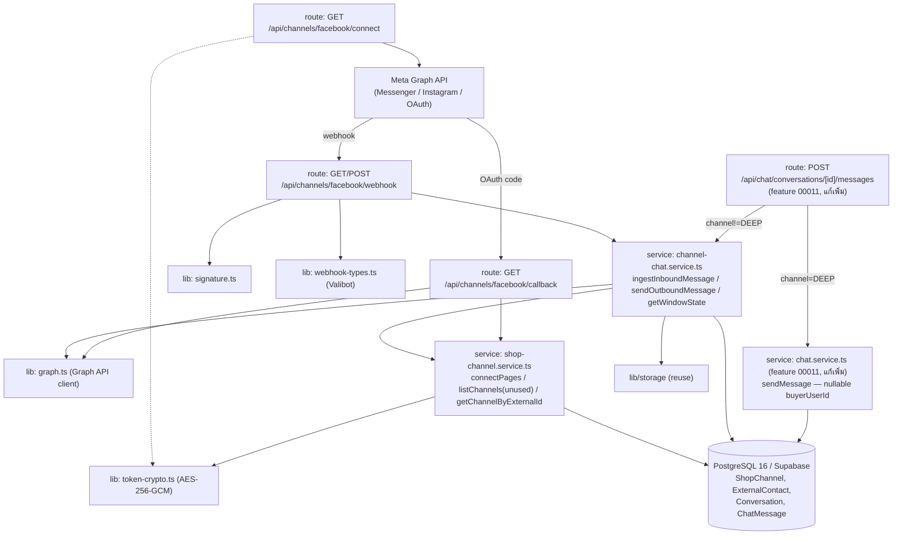
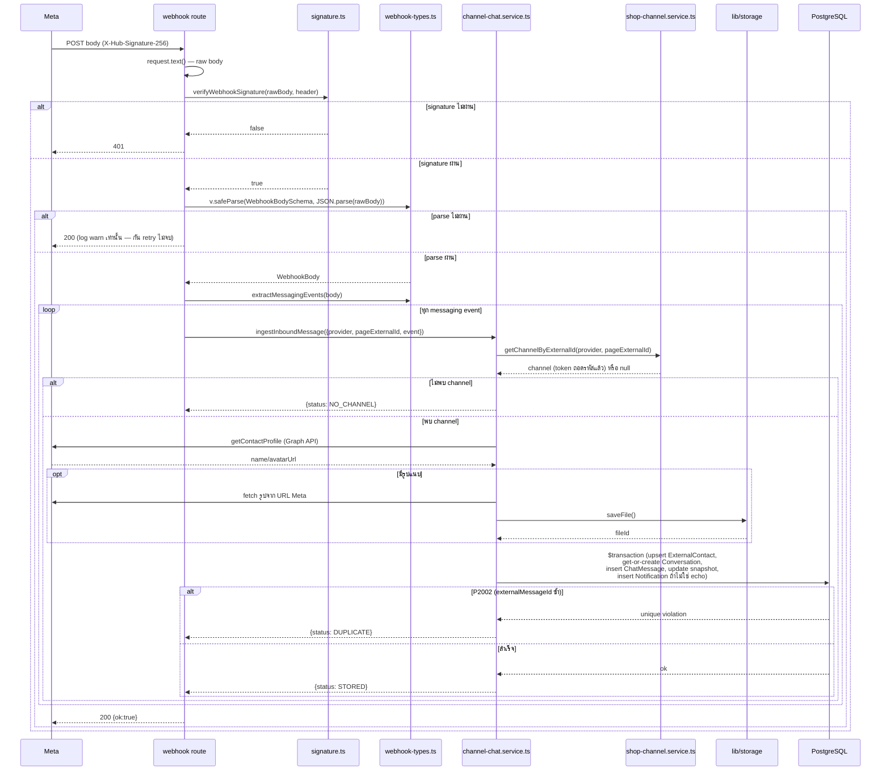
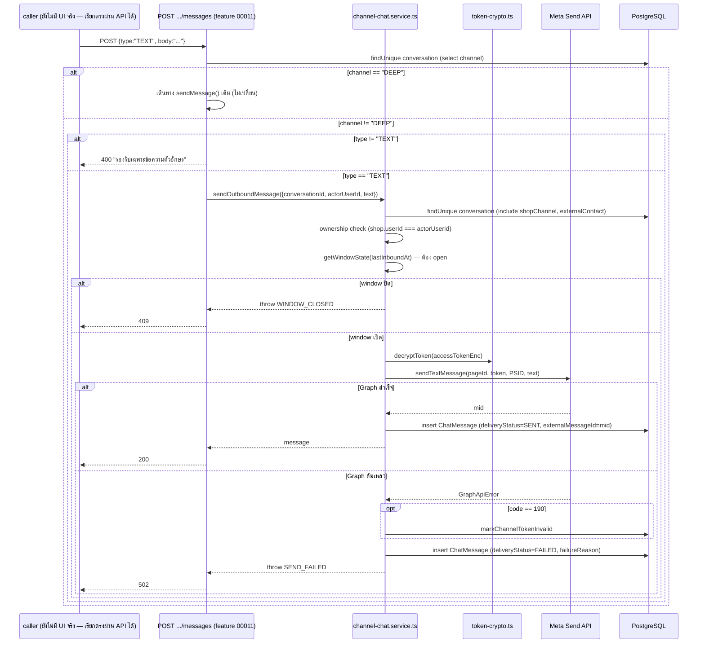

> **โมดูล:** M00018-FacebookChatIntegration
> **ประเภทเอกสาร:** System Design Spec (SDS)
> **เวอร์ชัน:** 1.1
> **วันที่จัดทำ:** 2026-07-22
> **สถานะ:** Draft — เขียนตามโค้ด backend ที่ implement แล้ว (SSOT = โค้ดจริง ไม่ใช่แผน) UI ยังไม่เริ่ม
>
> 🔄 **v1.1 (2026-07-23) — doc-sync ตามของจริงบน prod:** เพิ่ม FR-FBC-15/16/17 (ข้อความสำเร็จรูป, AI ช่วยร่างคำตอบ, เครื่องมือ composer + ไฟล์แนบวิดีโอ/เสียง/ไฟล์), BR-FBC-23..27, TFR-FBC-12..14, table `QuickMessage` + คอลัมน์ CRM, endpoint quick-messages/ai-suggest/crm และปรับสถานะรายการที่ implement ไปแล้ว (S-7/S-8/หน้า channels). **โค้ดขึ้น prod ก่อนเอกสาร = หนี้ Hard Rule 11 ที่ back-fill ในรอบนี้**
> **เจ้าของเอกสาร:** SA (ดู [[Feature-Docs-Ownership]])

# SDS: Facebook Chat Integration (System Design Spec)

---

## 1. บทนำ & References

### 1.1 วัตถุประสงค์

เอกสารนี้ออกแบบ "การ implement จริง" ของ backend pipeline ที่รับ-ส่งข้อความระหว่าง Deep กับ Facebook Messenger/Instagram DM — ต่อยอด `Conversation`/`ChatMessage` เดิมของ [[../00011 - Deep Chat/SDS|Deep Chat]] ให้ channel-aware แทนที่จะสร้างระบบแยก ผู้อ่านเป้าหมาย: DEV ที่จะต่อ UI ในแผนถัดไป, QA ที่ทดสอบ pipeline, Controller ที่วางแผน dispatch

### 1.2 ขอบเขตการออกแบบ

**อยู่ในขอบเขต:** webhook ingest, Graph API client, token encryption, OAuth connect, outbound send + 24h window guard, การต่อ route ส่งข้อความเดิมให้ dispatch ตาม channel, การยกเว้น CSRF ของ webhook route

**นอกขอบเขต (ไม่ได้ออกแบบในเอกสารนี้ เพราะยังไม่ implement):** ทุกหน้า UI, การจัดการ channel ผ่าน API (list/disconnect), การผูก Customer Directory, S-7/S-8 (โครง DB มีแต่ logic ไม่มี) — ดู [[SRS]] §1.2 สำหรับรายการเต็ม

### 1.3 เอกสารอ้างอิง

| เอกสาร | ความสัมพันธ์ |
|--------|-------------|
| [[SRS]] ของโมดูลนี้ | TFR-FBC-01..11 ที่ SDS นี้ realize |
| [[BRD]] ของโมดูลนี้ | BR-FBC-01..22 |
| [[PRD]] ของโมดูลนี้ | FR-FBC-01..14, Decision Log ระดับ business |
| [[DATABASE]] ของโมดูลนี้ | schema เต็ม (`ShopChannel`, `ExternalContact`, field เพิ่มบน `Conversation`/`ChatMessage`) |
| `docs/superpowers/specs/2026-07-22-facebook-chat-integration-design.md` | Decision D-FBC-01..06 (ทำไมเลือก A: ขยาย model เดิม, ทำไมใช้ 2 Facebook App แยก) |
| [[../00011 - Deep Chat/SDS]] | pattern เดิมของ chat.service.ts, ownership guard, rate-limit ที่ feature นี้สืบทอด |

---

## 2. Architecture Overview

### 2.1 มุมมองสถาปัตยกรรม

โปรเจกต์เป็น Next.js 16 App Router monolith (single stack — ไม่ polyglot) ทุก component รันบน runtime เดียวกัน (Vercel serverless, nodejs runtime สำหรับ `src/proxy.ts`) เชื่อมต่อ PostgreSQL 16 (Supabase) ตัวเดียวผ่าน Prisma ORM — เดินตาม layer เดิมของระบบ: `route handler → service → Prisma`, ไม่มี layer ใหม่ที่ผิดไปจาก convention

### 2.2 มุมมองการ Deploy

ไม่มี infra ใหม่ — deploy ร่วมกับแอปหลักบน Vercel (git auto-deploy `origin/main` → prod `deepthailand.app`) Webhook route ต้องเข้าถึงได้จาก internet สาธารณะเสมอ (Meta ยิง server-to-server) — dev ต้องใช้ ngrok ชี้ `http://seller.deepth.local:4000/api/channels/facebook/webhook` (หรือใช้ `scripts/fake-fb-webhook.ts` แทนเพื่อไม่ต้องพึ่ง ngrok/Meta จริงระหว่างพัฒนา)

---

## 3. Component Design

| Component | หน้าที่ (Responsibility) | Dependency |
|-----------|--------------------------|-----------|
| **`src/lib/facebook/signature.ts`** | verify `X-Hub-Signature-256` แบบ timing-safe — หน้าที่เดียว ไม่มี side effect | Node `crypto` |
| **`src/lib/facebook/webhook-types.ts`** | นิยาม Valibot schema ของ payload webhook + แบน `entry[].messaging[]` เป็น list เดียว | Valibot |
| **`src/lib/facebook/graph.ts`** | client บางของ Meta Graph API v21.0 — ไม่มี business logic (ไม่ตัดสินใจว่าจะทำอะไรกับผลลัพธ์) แค่เรียก+parse response/error | `fetch` (native) |
| **`src/lib/token-crypto.ts`** | encrypt/decrypt page token ด้วย AES-256-GCM — pure crypto utility ไม่รู้จัก `ShopChannel` เลย | Node `crypto`, env `CHANNEL_TOKEN_KEY` |
| **`src/services/shop-channel.service.ts`** | เจ้าของ lifecycle ของ `ShopChannel` (create/list/get-decrypted/mark-invalid) — จุดเดียวที่แตะ `accessTokenEnc` โดยตรง | Prisma, `token-crypto.ts`, `graph.ts` (subscribe) |
| **`src/services/channel-chat.service.ts`** | เจ้าของ business logic ของ "ข้อความช่องทางนอก" — ingest ขาเข้า, ส่งขาออก, คำนวณ window; **ไม่แตะ `accessTokenEnc` โดยตรง** (เรียกผ่าน `shop-channel.service.ts` เสมอ) | Prisma, `shop-channel.service.ts`, `graph.ts`, `lib/storage` |
| **`src/app/api/channels/facebook/{webhook,connect,callback}/route.ts`** | HTTP boundary — auth gate, parse request, เรียก service, map error → HTTP status | Next.js Route Handler, NextAuth session |
| **`src/app/api/chat/conversations/[id]/messages/route.ts`** (แก้เพิ่ม, feature 00011) | dispatch ตาม `conversation.channel` ก่อนเรียก service ที่ถูกต้อง | `chat.service.ts`, `channel-chat.service.ts` |
| **`src/proxy.ts`** (`guardApi`, แก้เพิ่ม) | ยกเว้น webhook path จาก Origin-check (ยัง apply rate-limit) | — |
| **`src/services/quick-message.service.ts`** (ใหม่ 2026-07-23) | CRUD ข้อความสำเร็จรูประดับร้าน — ทุก query/mutation scope ด้วย `shopId` ใน `WHERE` (atomic `updateMany`/`deleteMany`) ไม่มี logic อื่น | Prisma |
| **`src/lib/gemini.ts`** (ใหม่ 2026-07-23) | client ของ Google Gemini + system prompt/guardrail + บังคับ `responseSchema` เป็น JSON 3 ร่าง — **server-only** (อ่าน `GEMINI_API_KEY` จาก `process.env`) ไม่มี Prisma/ไม่รู้จัก Conversation | `fetch`, env `GEMINI_API_KEY`/`GEMINI_MODEL` |
| **`src/services/chat-crm.service.ts`** (ใหม่ 2026-07-23) | อ่าน/เขียน CRM ของผู้ติดต่อ (`alias` ที่ `Conversation`, `note`/`tags`/`phones`/`address`/`salesStatus` ที่ `ExternalContact`) scope ด้วย `{conversationId, shopId}` | Prisma |
| **`src/app/api/chat/quick-messages/{route,[id]/route}.ts`** (ใหม่) | HTTP boundary ของข้อความสำเร็จรูป — session + `resolveActiveShopContext` + Valibot แล้วเรียก service | `quick-message.service.ts`, `validations.ts` |
| **`src/app/api/chat/conversations/[id]/ai-suggest/route.ts`** (ใหม่) | HTTP boundary ของ AI — rate-limit ต่อ user, ownership เธรด, ประกอบ transcript จาก DB, map error ของ Gemini → HTTP | `gemini.ts`, `chat-crm.service.ts`, `api-rate-limit.ts`, Prisma |
| **`(chat)/inbox/[conversationId]/components/{QuickMessageBar,QuickMessageManager,AiSuggestPanel,EmojiPicker}.tsx`** (ใหม่) | UI ของเครื่องมือ composer — แผงเหนือช่องพิมพ์ (สำเร็จรูป/AI ใช้โครงเดียวกันและเปิดได้ทีละแผง), modal จัดการ, ตัวเลือกอิโมจิ | `ChatThread.tsx` (state `activePanel`), Paces primitive |

**เหตุผลแยก `shop-channel.service.ts` ออกจาก `channel-chat.service.ts` (ไม่รวมเป็นไฟล์เดียว):** แยกความรับผิดชอบตาม entity ที่เป็นเจ้าของ — `ShopChannel` (การเชื่อมต่อ/token) เป็นคนละ lifecycle จาก "ข้อความ" (เกิดขึ้นทุกครั้งที่มี event) `channel-chat.service.ts` เรียก `getChannelByExternalId`/`markChannelTokenInvalid` เป็น consumer ไม่ใช่เจ้าของ token — กันไม่ให้ logic ส่งข้อความไปแตะ `accessTokenEnc` ตรง ๆ โดยไม่ผ่านจุดถอดรหัสเดียว

---

## 4. Data Flow

### 4.1 Flow หลัก: Webhook ขาเข้า → บันทึก

### 4.2 Flow: ส่งข้อความออก (จาก route ส่งข้อความเดิม)

---

## 5. Integration Points

| จุดเชื่อม | ประเภท | Protocol / Contract | ความเสี่ยงเมื่อล่ม |
|-----------|--------|----------------------|---------------------|
| **Meta Graph API v21.0** | external, 3rd-party | REST/JSON, Bearer token ผ่าน header | webhook subscribe ล้มเหลว = ข้อความลูกค้าไม่เข้าเลย (ไม่ retry อัตโนมัติฝั่งเรา); Send API ล้มเหลว = ข้อความ SHOP ไม่ออก แต่ยัง insert `ChatMessage(FAILED)` ให้เห็นในเธรด |
| **Meta Webhook (inbound)** | external, 3rd-party (push) | HTTPS POST + HMAC-SHA256 signature | Meta retry ตาม policy ของตัวเองถ้าไม่ได้ `200` — route จึงพยายามตอบ `200` เกือบทุกกรณียกเว้น signature ไม่ผ่าน |
| **`lib/storage` (internal, reuse)** | internal | function call ตรง (`saveFile`) | `saveFile` ล้มเหลว → `mirrorRemoteImage` คืน `null` → ข้อความยังบันทึกแต่ไม่มีรูป (ไม่ block) |
| **`chat.service.ts` (internal, feature 00011)** | internal | ไม่มีการแก้ signature ของ `sendMessage`/`getMessages`/`listConversations*` — เธรด `channel='DEEP'` เดินทางเดิม 100% | ไม่มี — zero-regression ตาม design |

- **Timeout / Retry:** ไม่มี retry logic ฝั่งเราสำหรับเรียก Graph API (fail-fast, ให้ webhook redelivery ของ Meta หรือ error ที่เห็นในเธรดเป็นกลไกแก้แทน) — เดินตาม pattern เดิมของระบบที่ไม่มี retry queue
- **สัญญา API เต็ม:** ดู [[API]] ของโมดูลนี้

---

## 6. Technical Decisions

### TD-001: ขยาย `Conversation`/`ChatMessage` เดิมแทนสร้าง model ใหม่แยก

- **ตัดสินใจ:** เพิ่ม `channel`, `shopChannelId`, `externalContactId`, `lastInboundAt` บน `Conversation` และ `externalMessageId`, `deliveryStatus`, `failureReason` บน `ChatMessage` เดิมของ feature 00011 (ไม่สร้าง `FbConversation`/`FbMessage`)
- **เหตุผล:** reuse pagination/unread/inbox query/response-metrics cron ของ Deep Chat ได้ทั้งชุดโดยไม่ต้อง merge 2 source; IG DM บังคับให้ต้องออกแบบแบบ channel-agnostic อยู่แล้ว
- **ทางเลือกที่ตัดทิ้ง:** model แยก + merge ที่ service layer — ราคาแพงกว่า (ต้อง duplicate logic ทุกจุด, cursor pagination ข้าม source ยาก)
- **ผลกระทบ:** `buyerUserId`/`senderUserId` ต้องเป็น nullable (`String?`) — ทุกจุดที่เคย assume ว่ามีค่าเสมอต้องแก้ให้รับ `null` (ทำแล้วที่ `chat.service.ts` `sendMessage` ownership check + Notification branch)

### TD-002: token-crypto.ts เป็น pure module แยกจาก shop-channel.service.ts

- **ตัดสินใจ:** `encryptToken`/`decryptToken` ไม่รู้จัก Prisma/`ShopChannel` เลย — รับ/คืน `string` ตรง ๆ
- **เหตุผล:** ทดสอบ crypto logic ได้อิสระ (unit test ไม่ต้อง mock Prisma), เปิดทางให้ reuse encrypt/decrypt กับ token ประเภทอื่นในอนาคตถ้าจำเป็น (YAGNI-safe — ไม่ได้ over-design เพื่ออนาคตที่ยังไม่มีจริง แค่ไม่ผูกมันเข้ากับ 1 entity โดยไม่จำเป็น)
- **ทางเลือกที่ตัดทิ้ง:** เขียน encrypt/decrypt inline ใน `shop-channel.service.ts` — จะทำให้ทดสอบ crypto logic ต้อง mock Prisma โดยไม่จำเป็น
- **ผลกระทบ:** ต่ำ — ไฟล์เดียว ~30 บรรทัด ไม่เพิ่มความซับซ้อนของระบบ

### TD-003: ส่งออกก่อน insert DB เสมอ (ไม่ใช่ insert-then-send)

- **ตัดสินใจ:** `sendOutboundMessage` เรียก `sendTextMessage` (Graph API) **ก่อน** `chatMessage.create` เสมอ
- **เหตุผล:** ต้องการ `mid` จริงจาก Meta มาเป็น `externalMessageId` เพื่อให้ echo webhook ที่ยิง `mid` เดียวกันกลับมาภายหลัง unique constraint dedupe ให้อัตโนมัติ — ถ้า insert ก่อนส่ง จะไม่มี `mid` ให้ใส่ตอนสร้าง แล้วต้อง update record ทีหลัง (เพิ่มจุดพัง + race window)
- **ทางเลือกที่ตัดทิ้ง:** insert แถว `PENDING` ก่อนแล้วค่อย update หลังส่งสำเร็จ — เพิ่มความซับซ้อนของ state โดยไม่ได้ประโยชน์ที่ชัดเจนกว่า (ยังต้อง handle "ส่งไม่สำเร็จ" เหมือนกัน)
- **ผลกระทบ:** ถ้า process ตายระหว่างส่งสำเร็จแต่ก่อน insert DB (window แคบมาก) — ข้อความจะ "ส่งจริงไปหาลูกค้าแล้ว" แต่ไม่มี record ใน Deep จนกว่า echo webhook จะยิงกลับมาสร้างให้ (fallback ธรรมชาติจากการที่ Meta ส่ง echo กลับมาเสมอ — ยอมรับความเสี่ยงนี้เพราะ window แคบมากและมี self-healing path)

### TD-004: mirror รูปภาพก่อนเข้า `$transaction` เสมอ

- **ตัดสินใจ:** `mirrorRemoteImage(url)` (network call ไปดาวน์โหลดจาก CDN ของ Meta) ทำ**ก่อน**เปิด `prisma.$transaction`
- **เหตุผล:** transaction ถือ DB connection/lock ตลอดช่วงที่ทำงานอยู่ — network call ที่ควบคุมเวลาไม่ได้ (ขึ้นกับ Meta CDN) จะทำให้ transaction ค้างนานเกินจำเป็น เสี่ยง lock contention กับ query อื่นของระบบ
- **ทางเลือกที่ตัดทิ้ง:** ทำทุกอย่างใน transaction เดียว (รวม network call) — ง่ายกว่าแต่เสี่ยง performance
- **ผลกระทบ:** ถ้า `mirrorRemoteImage` fail คืน `null` ข้อความยังถูกบันทึก (ไม่ rollback ทั้งข้อความเพราะรูปพัง) — behavior ที่ตั้งใจ ไม่ใช่ side effect ที่ไม่คาดคิด

### TD-005: ไม่มี route จัดการ `ShopChannel` (list/disconnect) ในรอบนี้

- **ตัดสินใจ:** `listChannels`/`markChannelTokenInvalid` เป็น service function ที่เขียนไว้แล้ว (unit test ผ่าน) แต่**ไม่มี API route ใดเรียกใช้ในรอบนี้**
- **เหตุผล:** แผน implement แบ่งเป็น "backend pipeline" (รอบนี้) กับ "UI" (แผนถัดไป, ต้องผ่าน `safepay-ux` ตาม Hard Rule 8 ก่อน) — การมี route ให้เรียกโดยไม่มี UI ที่ปกป้อง/แสดงผลถูกต้องจะสร้าง surface ที่ทดสอบไม่ครบ
- **ทางเลือกที่ตัดทิ้ง:** ทำ API route ให้ครบตั้งแต่รอบนี้ — เกินขอบเขตที่วางแผนไว้ของ backend-only phase
- **ผลกระทบ:** FR-FBC-11 (จัดการ/ถอด Page ที่เชื่อมแล้ว) **ยังใช้งานไม่ได้เลยจนกว่าจะมี route + UI** — ต้อง flag ให้ Controller ก่อน sign-off ว่า pipeline พร้อมแต่ endpoint การจัดการยังไม่มี

---

## 7. Traceability

| SRS Requirement (TFR) | SDS Element | สถานะ |
|---------------------------|-------------------------------------------|-------|
| TFR-FBC-01/02 (signature + parse) | Flow 4.1, Component `signature.ts`/`webhook-types.ts` | Done |
| TFR-FBC-03/04/05 (ingest TEXT/IMAGE/echo) | Flow 4.1, Component `channel-chat.service.ts` | Done |
| TFR-FBC-06 (window calc) | TD-003 บริบท, Component `channel-chat.service.ts` | Done |
| TFR-FBC-07/08 (OAuth connect + connectPages) | Component `graph.ts`/`shop-channel.service.ts` | Done |
| TFR-FBC-09/10 (ส่งออก + dispatch) | Flow 4.2, TD-003 | Done (TEXT เท่านั้น) |
| TFR-FBC-11 (ยกเว้น CSRF) | Component `src/proxy.ts` | Done |
| TFR-FBC-12 (ข้อความสำเร็จรูป CRUD) | Component `quick-message.service.ts` + routes `/api/chat/quick-messages*`, UI `QuickMessageBar`/`QuickMessageManager` | Done (2026-07-23) |
| TFR-FBC-13 (AI ช่วยร่างคำตอบ) | Component `gemini.ts` + route `ai-suggest`, UI `AiSuggestPanel` | Done (2026-07-23) — ต่อยอดบริบทที่ feature 00019 |
| TFR-FBC-14 (ไฟล์แนบ วิดีโอ/เสียง/ไฟล์ ขาเข้า) | Component `channel-chat.service.ts` (map attachment type + mirror), UI `ChatThread.tsx` | Done (2026-07-23) — inbound-only |
| FR-FBC-11 (list/disconnect channel) | TD-005 | **Done หลังจากนั้น** — มีหน้า `/seller/settings/channels` (`page.tsx` + `ChannelsClient.tsx`), `GET /api/channels`, `/api/channels/[id]` และ `disconnectChannel()` (soft: ตั้ง `status='DISCONNECTED'` ไม่ลบแถว) แล้ว → **TD-005 ล้าสมัย** |

---

## 8. สรุป (Summary)

เอกสาร SDS นี้กำหนด **การออกแบบเชิงระบบ** ของ backend pipeline ที่ implement จริงของ Facebook/Instagram Chat Integration — เดินตาม convention เดิมของโปรเจกต์ทั้งหมด (route → service → Prisma, Valibot ที่ boundary ภายนอก, error string throw + map ที่ route) ไม่มี infra ใหม่หรือ layer แปลกใหม่เข้าระบบ

**ลำดับการ build ที่ทำไปแล้ว:** schema (Task 1) → กัน `sendMessage` พังกับ buyer null (Task 2) → token-crypto (Task 3) → signature (Task 4) → webhook payload schema (Task 5) → Graph API client (Task 6) → shop-channel service (Task 7) → ingest inbound (Task 8) → webhook route (Task 9) → outbound send + dispatch (Task 10) → OAuth connect/callback (Task 11) → CSRF exclusion (ผนวกในงานเดียวกัน) → mirror รูปภาพ (Task 12) → fake-webhook script (Task 13)

**Open Items สำหรับแผนถัดไป (ไม่ใช่ของเอกสารนี้) — สถานะอัปเดต 2026-07-23:**
- ~~หน้า `/seller/settings/channels` + route list/disconnect channel~~ → **Done** (ดู §7)
- ~~badge ช่องทาง + filter + แบนเนอร์ 24h ใน `/inbox`~~ → **Done** (T3/T4)
- ~~ส่งรูปภาพออกจาก Deep ไป Messenger/IG~~ → **Done** (ส่งผ่าน presigned URL แล้ว — ข้อจำกัดเหลือเฉพาะ `PRODUCT`/วิดีโอ/เสียง/ไฟล์ ที่ยังส่งออกไม่ได้)
- ~~S-7 (ปักหมุด/ซ่อน/ปิดงาน) และ S-8 (แท็ก/โน้ต/tab ออเดอร์)~~ → **Done** (S-7 ครบ; S-8 มี CRM `alias`/`note`/`tags`/`phones`/`salesStatus` + tab ออเดอร์)
- **ยังค้างจริง:** ปุ่มสร้างออเดอร์จากเธรด + เขียน `ExternalContact.customerId` (FR-FBC-07/08 — ยังไม่มี code path ใดเขียนค่านี้), ส่ง วิดีโอ/เสียง/ไฟล์ ออกจาก Deep, Messenger `profile_pic` (บล็อกโดย App Review)
- **test-debt:** `quick-message.service` / `gemini.ts` / route `ai-suggest` และ `quick-messages` ยังไม่มี unit test และยังไม่มี Playwright E2E ของหน้าแชท (ดู [[TestCase]] §3)
