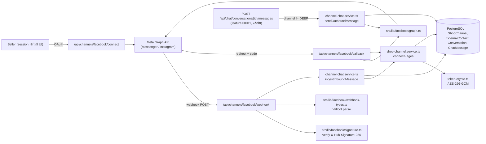
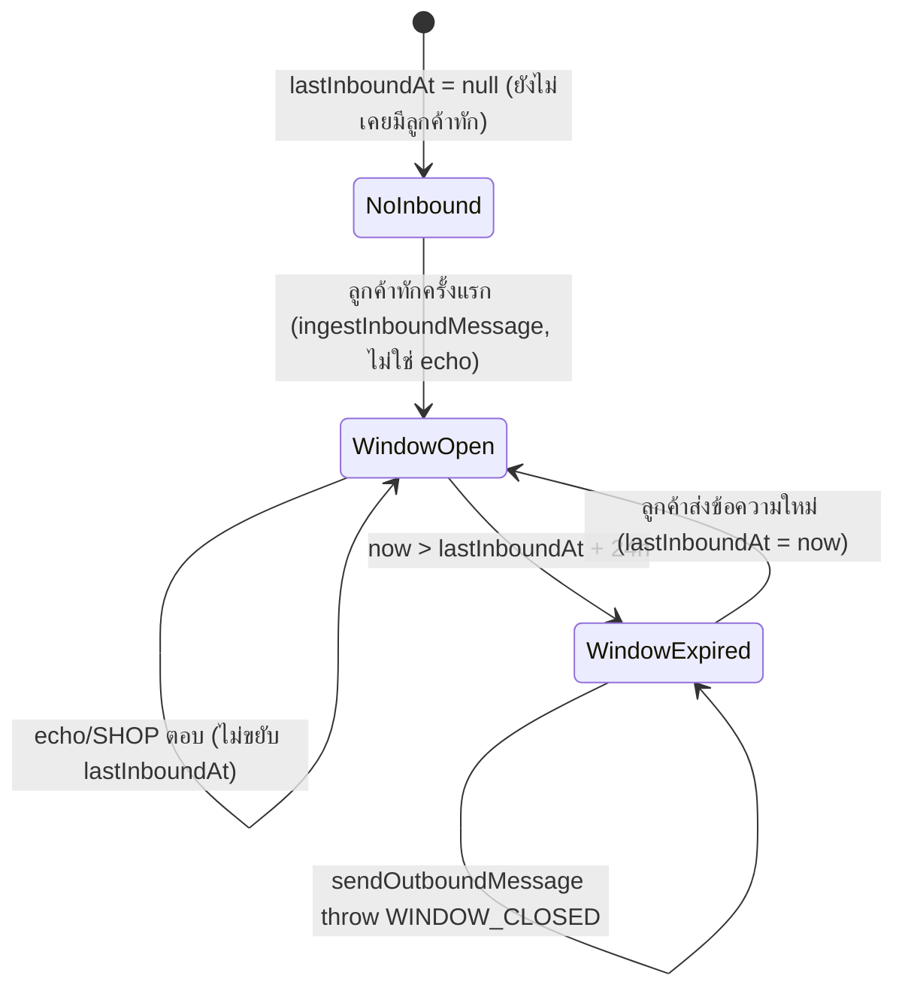
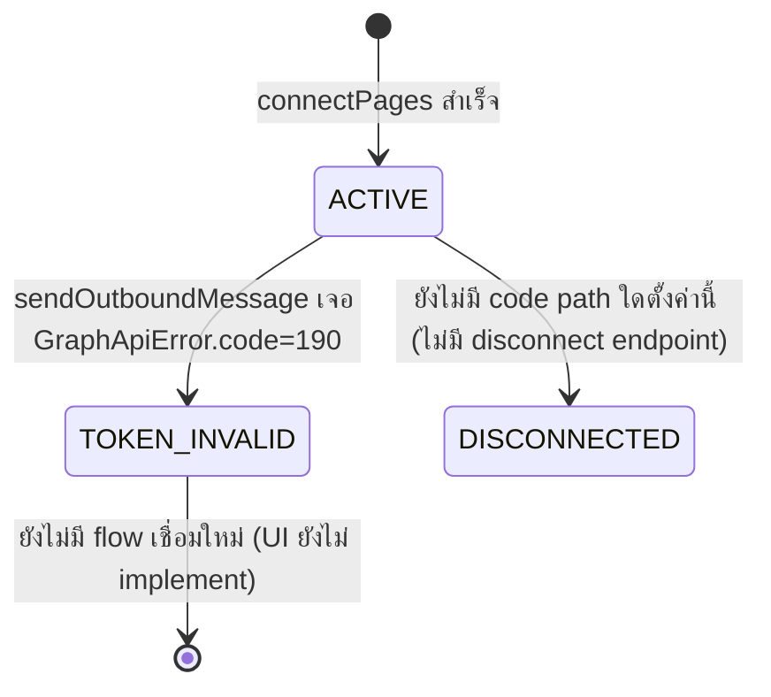

> **โมดูล:** M00018-FacebookChatIntegration
> **ประเภทเอกสาร:** Software Requirements Specification (SRS) — TECHNICAL
> **เวอร์ชัน:** 1.0
> **วันที่จัดทำ:** 2026-07-22
> **สถานะ:** Draft — เขียนย้อนหลังจากโค้ดที่ implement แล้ว (backend pipeline เท่านั้น) เอกสารนี้เป็น SSOT ของ "สิ่งที่มีจริงในโค้ด" ไม่ใช่แผนที่ยังไม่ทำ — ดู §1.2 สำหรับสิ่งที่ยังไม่ implement
> **เจ้าของเอกสาร:** SA (ดู [[Feature-Docs-Ownership]])

# SRS: Facebook Chat Integration (Software Requirements Specification — Technical)

---

## 1. บทนำ

### 1.1 วัตถุประสงค์ของเอกสาร

เอกสารนี้กำหนดข้อกำหนดเชิงเทคนิคของ **Facebook/Instagram Chat Integration (M00018)** เฉพาะส่วน **backend pipeline** ที่ implement จริงแล้ว: webhook ขาเข้าจาก Meta (verify signature → parse → dedupe → บันทึกลง `Conversation`/`ChatMessage` เดิมของ [[../00011 - Deep Chat/BRD|Deep Chat]]), การส่งข้อความขาออกผ่าน Graph API Send API พร้อมบังคับ 24-hour messaging window, และ OAuth เชื่อม Facebook Page แยกจาก login เดิม ผู้อ่านเป้าหมาย: DEV ที่จะต่อ UI, QA ที่ออกแบบ test case, Controller ที่วางแผน dispatch งานถัดไป

**หลักการออกแบบสำคัญ:** เอกสารนี้ trace กลับ FR-FBC-01/02/03/04/05/06/09/10 และ BR-FBC-01..13/20/22 ใน [[BRD]] — เฉพาะส่วนที่มีโค้ดรองรับจริงเท่านั้น FR/BR ที่เหลือ (UI, สร้างออเดอร์จากเธรด, ผูก Customer, S-7/S-8) ถูก mark ว่า **ยังไม่ implement** อย่างชัดเจนใน §1.2

### 1.2 ขอบเขตเชิงระบบ (System Scope)

**ในขอบเขต (implement แล้ว):**
- `prisma/schema.prisma` — model `ShopChannel`, `ExternalContact` (ใหม่) + field เพิ่มบน `Conversation`/`ChatMessage` เดิม (ดู [[DATABASE]])
- `src/lib/facebook/{constants,signature,graph,webhook-types}.ts` — ค่าคงที่, verify HMAC signature, Graph API client, Valibot schema ของ webhook payload
- `src/lib/token-crypto.ts` — เข้ารหัส/ถอดรหัส page access token (AES-256-GCM)
- `src/services/shop-channel.service.ts` — connect Page, list channels (ยังไม่มี route เรียก), ดึง token ที่ถอดรหัสแล้ว (server-only), mark token invalid
- `src/services/channel-chat.service.ts` — `ingestInboundMessage` (รับข้อความเข้า, mirror รูป, dedupe), `getWindowState` (คำนวณ 24h window), `sendOutboundMessage` (ส่งออกผ่าน Send API)
- `src/app/api/channels/facebook/{webhook,connect,callback}/route.ts` — webhook GET (handshake) + POST (รับ event), OAuth เริ่มต้น, OAuth callback
- `src/app/api/chat/conversations/[id]/messages/route.ts` (แก้เพิ่ม) — dispatch เธรดที่ `channel !== "DEEP"` ไปทาง `sendOutboundMessage` แทน `sendMessage` เดิม
- `src/proxy.ts` (แก้เพิ่ม) — ยกเว้น `/api/channels/facebook/webhook` จาก CSRF Origin-check (ยัง apply rate-limit ปกติ)

**นอกขอบเขตของเอกสารนี้ (ยังไม่ implement — ดู PRD/BRD สำหรับแผนเต็ม):**
- **UI ทั้งหมด** — ไม่มีหน้า `/seller/settings/channels` (เชื่อม/ถอด/ดูสถานะ Page), ไม่มี badge ช่องทาง/filter ตาม Page/แบนเนอร์ 24h ใน `/inbox`, ไม่มีปุ่มสร้างออเดอร์จากเธรด FB (FR-FBC-11, FR-FBC-12, FR-FBC-07 ฝั่ง UI)
- **API endpoint สำหรับจัดการช่องทาง** — `listChannels`/`markChannelTokenInvalid` เป็น service function ที่มีแล้ว แต่**ไม่มี API route ใดเรียกใช้** (ไม่มี `GET /api/channels/facebook`, ไม่มี disconnect endpoint) — FR-FBC-11 ยังไม่มีทางเข้าถึงจาก client เลย
- **ส่งรูปภาพออกจาก Deep ไป Messenger/IG** (FR-FBC-04 ฝั่งรูป) — เธรดช่องทางนอกรองรับเฉพาะ `type=TEXT`; ถ้าส่ง `type=IMAGE`/`PRODUCT` เข้าเธรดนอก route คืน 400 (ดู [[API]] §4.4)
- **ผูก `ExternalContact.customerId` กับ Customer Directory** (FR-FBC-08) — ไม่มี code path ใดเขียนค่านี้ (ต้องรอ UI สร้างออเดอร์จากเธรดก่อน)
- **filter ตาม Page ใน `/inbox`, channel query param** (FR-FBC-12) — `ChatConversationsQuerySchema` ไม่มี field กรอง channel/shopChannelId
- **S-7 ปักหมุด/ซ่อน/ปิดงาน (`isPinned`/`isHidden`/`resolvedAt`)** — คอลัมน์มีจริงใน DB (migration เดียวกัน) แต่**ไม่มี service function หรือ API ใดอ่าน/เขียนค่าเหล่านี้เลย** — ค่า default (`false`/`false`/`null`) คงที่ทุกแถวถาวรจนกว่าจะมีโค้ดต่อ
- **S-8 แท็ก/โน้ตภายใน/tab ออเดอร์ในแผงขวา** — ไม่มี model แท็ก/โน้ตใน schema เลย (ไม่มี DDL รองรับ)
- **Facebook Live** — นอก scope ทั้ง feature (PRD §5)

### 1.3 เอกสารอ้างอิง

| เอกสาร | ความสัมพันธ์ |
|--------|-------------|
| [[PRD]] ของโมดูลนี้ | Business goals, KPI, FR-FBC-01..14 |
| [[BRD]] ของโมดูลนี้ | BR-FBC-01..22, AC เต็ม, Scenario 1-9, Decision Log |
| [[DATABASE]] ของโมดูลนี้ | schema เต็ม — `ShopChannel`/`ExternalContact` และ field ใหม่บน `Conversation`/`ChatMessage` |
| [[../00011 - Deep Chat/DATABASE]] | `Conversation`/`ChatMessage` เดิมที่ feature นี้ต่อยอด (ไม่สร้าง table แยก) |
| [[../00011 - Deep Chat/SRS]] | pattern เดิมของ chat.service.ts, rate-limit, ownership guard |
| `docs/superpowers/specs/2026-07-22-facebook-chat-integration-design.md` | Decision D-FBC-01..06, สถานะ Facebook App จริง |
| `docs/superpowers/plans/2026-07-22-facebook-chat-backend.md` | ลำดับ task การ implement backend (Task 0-14), Self-Review §ท้ายไฟล์ (ช่องว่างที่รู้ตัว) |
| `src/proxy.ts` (`guardApi`) | CSRF Origin-check + rate-limit ที่ webhook route ถูกยกเว้นเฉพาะ Origin-check |

### 1.4 นิยามและตัวย่อ

| คำ/ตัวย่อ | ความหมาย |
|-----------|----------|
| **PSID / IGSID** | Page-Scoped ID / Instagram-Scoped ID — ตัวระบุลูกค้าที่ผูกกับ Page/IG หนึ่งเท่านั้น |
| **`ShopChannel`** | Page/IG หนึ่งช่องทางที่ร้านผูกไว้ — เก็บ `accessTokenEnc` (เข้ารหัสแล้ว) |
| **`ExternalContact`** | ลูกค้าจากช่องทางนอกระบบ (FB/IG) — ไม่ใช่ `User` ของ Deep |
| **`is_echo`** | flag จาก Meta บ่งว่าข้อความมาจากฝั่งเพจเอง (seller ตอบจากแอป Messenger ตรง หรือ echo ของข้อความที่เราส่งออก) |
| **24-hour Messaging Window** | กรอบเวลาที่ Meta อนุญาตให้ Page ตอบลูกค้าได้ นับจาก `lastInboundAt` (เวลาที่ลูกค้าส่งข้อความล่าสุด) |
| **`mid`** | message id ที่ Graph API คืนกลับหลังส่งสำเร็จ — ใช้เป็น `ChatMessage.externalMessageId` (idempotency key) |
| **channel-aware** | `Conversation`/`ChatMessage` เดิมของ Deep Chat ที่ขยายให้รองรับ `channel` ≠ `"DEEP"` ได้ (additive, ไม่แตะ table เดิม) |

---

## 2. ภาพรวมสถาปัตยกรรม

### 2.1 System Context



### 2.2 องค์ประกอบหลัก

| Component | หน้าที่ | สถานะ |
|-----------|---------|-------|
| `src/lib/facebook/signature.ts` | verify `X-Hub-Signature-256` แบบ timing-safe | ใหม่ — implement แล้ว |
| `src/lib/facebook/webhook-types.ts` | Valibot schema ของ webhook payload + `extractMessagingEvents` (แบน entry→messaging) | ใหม่ — implement แล้ว |
| `src/lib/facebook/graph.ts` | Graph API client: `exchangeCodeForToken`, `listManageablePages`, `subscribePageToApp`, `getContactProfile`, `sendTextMessage` | ใหม่ — implement แล้ว |
| `src/lib/token-crypto.ts` | `encryptToken`/`decryptToken` (AES-256-GCM) | ใหม่ — implement แล้ว |
| `shop-channel.service.ts` | `connectPages`, `listChannels` (ไม่มี route เรียก), `getChannelByExternalId`, `markChannelTokenInvalid` | ใหม่ — implement แล้ว (บางฟังก์ชันยังไม่มี consumer) |
| `channel-chat.service.ts` | `ingestInboundMessage`, `mirrorRemoteImage`, `getWindowState`, `sendOutboundMessage` | ใหม่ — implement แล้ว |
| `GET/POST /api/channels/facebook/webhook` | handshake + รับ event จริง | ใหม่ — implement แล้ว |
| `GET /api/channels/facebook/connect` | เริ่ม OAuth (redirect ไป Facebook) | ใหม่ — implement แล้ว |
| `GET /api/channels/facebook/callback` | รับ code → เชื่อม Page ทั้งหมดที่มีสิทธิ์ | ใหม่ — implement แล้ว |
| `POST /api/chat/conversations/[id]/messages` (feature 00011) | แก้เพิ่ม branch `channel !== "DEEP"` → เรียก `sendOutboundMessage` | แก้ไข |
| `src/proxy.ts` (`guardApi`) | เพิ่มเงื่อนไขยกเว้น webhook path จาก Origin-check | แก้ไข |
| หน้า `/seller/settings/channels`, badge/filter ใน `/inbox`, ปุ่มสร้างออเดอร์จากเธรด | UI ทั้งหมด | **ยังไม่ implement** |

---

## 3. ข้อกำหนดเชิงฟังก์ชันเชิงเทคนิค

### TFR-FBC-01: Verify webhook signature

- **Trace:** FR-FBC-01/02/03, BR-FBC-22
- **คำอธิบาย:** `verifyWebhookSignature(rawBody, header)` — คำนวณ `HMAC-SHA256(rawBody, FB_CHAT_APP_SECRET)` แล้วเทียบกับ header `X-Hub-Signature-256` (ตัด prefix `sha256=`) ด้วย `timingSafeEqual` เท่านั้น
- **Precondition:** route ต้องอ่าน body เป็น raw text (`request.text()`) ก่อน parse JSON — ถ้า parse แล้ว stringify ใหม่ลายเซ็นจะไม่ตรง (คำนวณจาก byte ดิบ)
- **Postcondition:** คืน `boolean` — ไม่ throw แม้ header ผิดรูปแบบหรือความยาวไม่เท่ากัน (เช็ค `received.length !== expected.length` ก่อนเรียก `timingSafeEqual` กัน throw)
- **Error/Edge:** ไม่มี `FB_CHAT_APP_SECRET`/header/prefix `sha256=` → คืน `false` ทันที; signature ไม่ผ่าน → route คืน `401` และ**ไม่บันทึกอะไรลง DB** (log `console.warn` เท่านั้น)

### TFR-FBC-02: Parse + dispatch webhook payload

- **Trace:** FR-FBC-01/02/03, BR-FBC-22
- **คำอธิบาย:** หลัง signature ผ่าน → `v.safeParse(WebhookBodySchema, JSON.parse(rawBody))` — shape ที่ parse ไม่ผ่าน (ไม่รู้จัก) **ยังคืน `200`** (กัน Meta retry ไม่จบ) แต่ log `console.warn` ไว้ ไม่ throw ให้ผู้ใช้เห็น
- **`extractMessagingEvents(body)`** แบน `entry[].messaging[]` เป็น array เดียว พร้อมพก `pageId` (=`entry.id`) และ `object` (`"page"`/`"instagram"`) ติดไปด้วยทุก event — กัน handler ต้องวนซ้อน 2 ชั้น
- **Dispatch:** `provider = parsed.output.object === 'instagram' ? 'INSTAGRAM' : 'MESSENGER'` แล้ววน `ingestInboundMessage` ทีละ event — **ข้อความเดียวพังไม่ทำให้ทั้ง batch fail** (try/catch ต่อ event, log error แล้วไปต่อ) กัน Meta retry ทั้ง batch ซ้ำ
- **Postcondition:** route คืน `200 {ok:true}` แทบทุกกรณี ยกเว้น signature ไม่ผ่าน (`401`)

### TFR-FBC-03: Ingest ข้อความ TEXT ขาเข้า

- **Trace:** FR-FBC-01, BR-FBC-06/07/09/10/13
- **คำอธิบาย:** `ingestInboundMessage({provider, pageExternalId, event})`:
  1. `event.message?.mid` ไม่มี → `{status: 'IGNORED'}` (event ที่ไม่ใช่ข้อความ เช่น delivery/read receipt)
  2. `getChannelByExternalId(provider, pageExternalId)` หา `ShopChannel` — ไม่พบ → `{status: 'NO_CHANNEL'}` (Page ที่ไม่มีร้านไหนเชื่อม — ยังคืน 200 เสมอที่ระดับ route)
  3. คำนวณ `isEcho`/`contactExternalId`/`senderRole` (ดู TFR-FBC-05)
  4. `getContactProfile(contactExternalId, channel.accessToken)` ดึงชื่อ/รูปโปรไฟล์ — ดึงไม่ได้ไม่ throw (คืน `{name:null, avatarUrl:null}`)
  5. `prisma.externalContact.upsert` (`@@unique([shopChannelId, externalUserId])`) — update ชื่อ/รูปทุกครั้งแม้แถวเดิมมีอยู่แล้ว
  6. ใน `$transaction`: หา/สร้าง `Conversation` (`@@unique([shopChannelId, externalContactId])`), insert `ChatMessage`, update snapshot บน `Conversation` (`lastMessageAt`/`lastMessagePreview`/`lastSenderRole` + `lastInboundAt` ถ้าไม่ใช่ echo), สร้าง `Notification` ให้ `shop.userId` เฉพาะเมื่อไม่ใช่ echo
- **Postcondition:** `{status: 'STORED', conversationId}`
- **Error/Edge:** `P2002` บน `externalMessageId` (unique) → catch แล้วคืน `{status: 'DUPLICATE'}` แทน throw — ครอบทั้ง Meta redelivery และ echo ของข้อความที่เราส่งเอง (mid เดียวกัน)

### TFR-FBC-04: Ingest ข้อความ IMAGE ขาเข้า + mirror รูป

- **Trace:** FR-FBC-02
- **คำอธิบาย:** `firstAttachment.type === 'image'` → เรียก `mirrorRemoteImage(url)` **ก่อน**เข้า `$transaction` (network call ในทรานแซกชันจะถือ DB lock นานเกินไป) — ดาวน์โหลดจาก URL ของ Meta (หมดอายุ), ตรวจ `content-type` ต้องอยู่ใน `{image/jpeg, image/png, image/webp, image/gif}`, ตรวจขนาด ≤ 5MB (ทั้งจาก header `content-length` และขนาดจริงหลังโหลด) แล้ว `saveFile()` เข้า storage ของ Deep เอง (reuse `lib/storage`)
- **Postcondition:** `ChatMessage.imageUrl = mirroredFileId` (fileId ของ storage — pattern เดียวกับ `Product.images`, **ไม่ใช่ URL เต็ม**)
- **Error/Edge:** โหลด/แปลงไม่ได้ (ไม่ok, content-type ไม่รู้จัก, เกินขนาด, network error) → `mirrorRemoteImage` คืน `null` — **ข้อความยังถูกบันทึกอยู่ดี** (`imageUrl: null`, `type: 'IMAGE'`) ห้ามทิ้งทั้งข้อความเพราะรูปพัง

### TFR-FBC-05: จับ `is_echo`

- **Trace:** FR-FBC-03, BR-FBC-09/10
- **คำอธิบาย:** `isEcho = event.message.is_echo === true` — ผู้ติดต่อ (`contactExternalId`) ต้องเป็น **ฝั่งตรงข้าม** เสมอ: `isEcho ? event.recipient.id : event.sender.id` (echo มา sender=เพจ, recipient=ลูกค้า — สลับกับข้อความปกติ) `senderRole = isEcho ? 'SHOP' : 'BUYER'`
- **Postcondition:** insert `ChatMessage.senderRole='SHOP'`, **ไม่อัปเดต `lastInboundAt`** (spread เงื่อนไข `...(isEcho ? {} : {lastInboundAt: occurredAt})`); **ไม่สร้าง `Notification`** (เงื่อนไข `if (!isEcho)`)
- **เหตุผล implement:** seller ไทยส่วนใหญ่ยังตอบจากแอป Messenger บนมือถือโดยตรง — ถ้าไม่จับ echo ประวัติใน `/inbox` จะขาดตอน (ตาม BRD Scenario 2)

### TFR-FBC-06: คำนวณ 24-hour Messaging Window

- **Trace:** FR-FBC-05, BR-FBC-11
- **คำอธิบาย:** `getWindowState(lastInboundAt, now=new Date())`:
  - `lastInboundAt === null` → `{open: false, expiresAt: null, msRemaining: 0}` (ยังไม่เคยมีลูกค้าทัก)
  - อื่น: `expiresAt = lastInboundAt + MESSAGING_WINDOW_MS` (= 24×60×60×1000 ms), `open = (expiresAt - now) > 0`, `msRemaining = max(0, expiresAt - now)`
- **Postcondition:** ฟังก์ชัน pure — ไม่แตะ DB ไม่มี side effect, เรียกซ้ำได้ปลอดภัย
- **ใช้ที่:** `sendOutboundMessage` เรียกก่อนยิง Graph API เสมอ (ดู TFR-FBC-08) — **ยังไม่มี UI ใดเรียกฟังก์ชันนี้เพื่อแสดงแบนเนอร์นับถอยหลัง** (FR-FBC-05 ฝั่ง UI ยังไม่ implement)

### TFR-FBC-07: เชื่อม Facebook Page (OAuth แยกจาก login)

- **Trace:** FR-FBC-09/10, BR-FBC-01/02/03/04
- **คำอธิบาย:**
  1. `GET /api/channels/facebook/connect` — ต้องมี session (401 ถ้าไม่มี) → สร้าง `state` สุ่ม 16 byte hex, เก็บใน cookie httpOnly ชื่อ `fb_channel_oauth_state` (path `/api/channels/facebook`, `sameSite: 'lax'`, `maxAge: 600`) → redirect (302) ไป Facebook OAuth dialog ด้วย `CONNECT_SCOPES` (`pages_show_list, pages_messaging, pages_manage_metadata, pages_read_engagement, business_management, instagram_basic, instagram_manage_messages`)
  2. `GET /api/channels/facebook/callback` — ตรวจ `state` cookie ตรงกับ query param (CSRF ของ OAuth เอง, แยกจาก `guardApi`), หา `shop = prisma.shop.findFirst({where:{userId}})` (ไม่พบ → redirect กลับพร้อม `status=no_shop`), `exchangeCodeForToken` → `listManageablePages` (กรองเฉพาะ Page ที่มี task `MESSAGING`+`MODERATE`) → ถ้าว่าง redirect `status=no_eligible_page` → `connectPages(shop.id, userId, pages)`
- **Postcondition:** redirect กลับ `/settings/channels?status=connected&connected=N&skipped=...` (path นี้เป็น**ของ UI ที่ยังไม่มีจริง** — ดู §1.2)
- **Error/Edge:** user กด "ยกเลิก" ที่ Facebook (`?error=`) → `status=cancelled`; state ไม่ตรง → `status=state_mismatch`; ไม่มี `code` → `status=no_code`; exception ใด ๆ ระหว่าง exchange/list/connect → catch แล้ว `status=error` (log เฉพาะ `message` **ห้าม log token**)

### TFR-FBC-08: เชื่อม Page เข้า DB (`connectPages`) + IG auto-link

- **Trace:** FR-FBC-09/10, BR-FBC-01/02/04/20
- **คำอธิบาย:** วนทุก `PageInfo` ที่ผ่านการกรองสิทธิ์แล้ว:
  1. `prisma.shopChannel.create({provider:'MESSENGER', externalId: page.id, accessTokenEnc: encryptToken(page.accessToken), ...})`
  2. ถ้า `page.instagramBusinessAccountId` มีค่า → สร้างอีกแถว `provider:'INSTAGRAM'`, `externalId: instagramBusinessAccountId`, **ใช้ page token เดียวกัน** (ไม่ต้อง OAuth ซ้ำ)
  3. `subscribePageToApp(page.id, page.accessToken)` **หลัง**สร้าง DB สำเร็จเท่านั้น (ลำดับสำคัญ — ถ้า subscribe ก่อนแล้ว DB พัง จะมี webhook ยิงเข้ามาหา channel ที่ยังไม่มีในระบบ)
- **Postcondition:** `{connected: number, skipped: string[]}` — `skipped` คือชื่อ Page ที่ `P2002` (unique `[provider, externalId]` ชน — Page ถูกร้านอื่นเชื่อมไปแล้ว)
- **Error/Edge:** `P2002` → catch แล้ว push เข้า `skipped`, **ไม่ throw** (BR-FBC-01: Page หนึ่งเชื่อมได้ร้านเดียวทั้งระบบ — ปฏิเสธแบบ soft ไม่ทำให้ทั้ง batch fail); error อื่นจาก Graph API (`subscribePageToApp` ล้มเหลว) → throw ต่อ (ไม่ catch)

### TFR-FBC-09: ส่งข้อความออกไป Messenger/IG (`sendOutboundMessage`)

- **Trace:** FR-FBC-04/05/06, BR-FBC-05/11/12
- **คำอธิบาย:**
  1. โหลด `Conversation` พร้อม `include: {shopChannel, externalContact}` — ไม่พบ → `CONVERSATION_NOT_FOUND`; `channel==='DEEP'` หรือไม่มี `shopChannel`/`externalContact` → `NOT_EXTERNAL_CHANNEL`
  2. ownership: `shop.userId !== actorUserId` → `FORBIDDEN`
  3. **window check ก่อนยิง Graph API เสมอ:** `!getWindowState(conversation.lastInboundAt).open` → throw `WINDOW_CLOSED` (กันเปลือง quota + กัน error ที่คาดเดาได้อยู่แล้ว) — **ไม่มีการยิง Graph API เลยถ้า window ปิด**
  4. `decryptToken(shopChannel.accessTokenEnc)` → `sendTextMessage(pageId, token, PSID, text)` → ได้ `mid`
  5. **ลำดับสำคัญ:** ส่งออกก่อน (`try/catch`) แล้วค่อย `chatMessage.create` เสมอ — ถ้า Graph ตอบ error, `mid = null`, `failureReason = e.message`, ถ้า `GraphApiError.code === 190` (token ตาย) → `markChannelTokenInvalid(shopChannel.id)`
  6. `chatMessage.create({senderRole:'SHOP', externalMessageId: mid || null, deliveryStatus: failureReason ? 'FAILED' : 'SENT', failureReason})` แล้วอัปเดต `Conversation` snapshot **แม้ส่งไม่สำเร็จ** (seller ต้องเห็นในเธรดว่าพยายามส่งแล้วพลาด)
- **Postcondition:** สำเร็จ → คืน `ChatMessage` ที่สร้าง; ล้มเหลว → **throw `SEND_FAILED: <reason>`** (แม้จะ insert ChatMessage ไปแล้วก็ตาม — caller/route ต้อง map เป็น error response ที่เหมาะสม ไม่ใช่ 200)
- **Idempotency:** `mid` ที่ได้จากขั้นตอน 4 = `externalMessageId` — เมื่อ echo webhook ยิง `mid` เดียวกันกลับมาผ่าน `ingestInboundMessage` ภายหลัง unique constraint จะ dedupe ให้อัตโนมัติ (`P2002` → `DUPLICATE`) ไม่ต้องเขียน logic แยก

### TFR-FBC-10: Dispatch ที่ route ส่งข้อความเดิม (feature 00011)

- **Trace:** FR-FBC-04, BR-FBC-11
- **คำอธิบาย:** `POST /api/chat/conversations/[id]/messages` เดิม (feature 00011) แก้เพิ่ม: ก่อนเรียก `sendMessage()` เดิม ให้ query `conversation.channel` ก่อน — ถ้า `channel !== 'DEEP'`:
  - `type !== 'TEXT'` → คืน `400` ทันที (ยังไม่รองรับ IMAGE/PRODUCT ออกช่องทางนอก)
  - `type === 'TEXT'` → เรียก `sendOutboundMessage` แทน `sendMessage`
  - `channel === 'DEEP'` (หรือ conversation ไม่พบ — ปล่อยให้ `sendMessage` เดิม throw `CONVERSATION_NOT_FOUND`) → เดินทาง `sendMessage` เดิมเหมือนก่อนมี feature นี้ (**zero-regression**)
- **Error mapping ใหม่ที่ route:** `WINDOW_CLOSED` → `409`, `NOT_EXTERNAL_CHANNEL` → `400`, `SEND_FAILED:*` (prefix match) → `502` — ดู [[API]] §5

### TFR-FBC-11: ยกเว้น webhook จาก CSRF Origin-check

- **Trace:** BR-FBC-22
- **คำอธิบาย:** `guardApi` (`src/proxy.ts`) เพิ่มเงื่อนไข `pathname !== '/api/channels/facebook/webhook'` เข้า allowlist ที่ข้าม Origin-check (เดิมมีแค่ `/api/auth/*`, `/api/app/*`, `/api/cron/*`) — เหตุผล: Meta ยิง server-to-server ไม่มี header `Origin` แบบ browser
- **Postcondition:** rate-limit ปกติ (per-IP) ยัง apply กับ path นี้เหมือนเดิม — **ยกเว้นเฉพาะ Origin-check เท่านั้น** ไม่ใช่ยกเว้นทั้ง guard
- **Authentication ทดแทน:** signature `X-Hub-Signature-256` (TFR-FBC-01) เป็น authentication เพียงอย่างเดียวของ route นี้

---

## 4. Interface / API Specification (สรุป — รายละเอียดเต็มดู [[API]])

| Method | Path | คำอธิบาย | Auth |
|--------|------|----------|------|
| `GET` | `/api/channels/facebook/webhook` | handshake ตอน subscribe webhook | ไม่มี session — `hub.verify_token` |
| `POST` | `/api/channels/facebook/webhook` | รับ event จาก Meta | ไม่มี session — `X-Hub-Signature-256` |
| `GET` | `/api/channels/facebook/connect` | เริ่ม OAuth เชื่อม Page | seller session |
| `GET` | `/api/channels/facebook/callback` | รับ code → เชื่อม Page | seller session + OAuth state cookie |
| `POST` | `/api/chat/conversations/[id]/messages` (แก้เพิ่ม) | ส่งข้อความ — dispatch ตาม `channel` | participant session (เดิม) |

---

## 5. State Machine

### 5.1 24-hour Messaging Window (`getWindowState`)



### 5.2 ShopChannel.status



หมายเหตุ: `getChannelByExternalId` เช็ค `status === 'DISCONNECTED'` แล้วคืน `null` — schema/service รองรับสถานะนี้แล้ว แต่**ไม่มีทางเข้าถึงจาก client** เพื่อ set ค่านี้ในปัจจุบัน

---

## 6. NFR (Non-Functional Requirements)

### 6.1 ความปลอดภัย

- Page access token เข้ารหัส **AES-256-GCM** ก่อนเก็บลง `ShopChannel.accessTokenEnc` เสมอ (`token-crypto.ts`) — คีย์จาก env `CHANNEL_TOKEN_KEY` (hex 64 ตัว = 32 byte) ห้าม log ห้ามส่งกลับ client (`shop-channel.service.ts` `listChannels` ใช้ Prisma `select` allow-list กัน field นี้หลุด)
- `X-Hub-Signature-256` timing-safe compare เป็น authentication เดียวของ webhook route — validate ทุก payload ด้วย Valibot (`WebhookBodySchema`) ก่อนใช้ ไม่เชื่อ shape จาก Meta ตรง ๆ
- OAuth state cookie (`fb_channel_oauth_state`) httpOnly, `sameSite: 'lax'`, `secure` เมื่อ prod, `maxAge` 600 วินาที — กัน CSRF ของ OAuth flow เอง (แยกจาก `guardApi`)
- Graph API client ส่ง token ผ่าน header `Authorization: Bearer` เสมอ **ไม่ใส่ query string** (URL มักถูก log ทั้งเส้นบน Vercel/error tracker)

### 6.2 ความน่าเชื่อถือของข้อความ

- Idempotency กันซ้ำ 2 ทาง (redelivery + echo ของข้อความที่ส่งเอง) รวมกลไกเดียว: unique constraint บน `ChatMessage.externalMessageId`
- ส่งไม่สำเร็จทุกกรณี (window ปิด, ลูกค้าบล็อก, token ตาย) ต้องบันทึก `deliveryStatus='FAILED'` + `failureReason` — **ยกเว้น `WINDOW_CLOSED`** ที่ throw ก่อนถึงขั้น insert `ChatMessage` เลย (ปฏิเสธตั้งแต่ต้นทาง ไม่มี record ค้าง)

### 6.3 Performance

- Webhook route ตอบ `200` ให้เร็วที่สุด — `mirrorRemoteImage` (network call) ทำ**ก่อน**เข้า `$transaction` เสมอ กัน DB lock ค้างนาน
- ข้อความเดียวใน batch พัง (`ingestInboundMessage` throw) ไม่ทำให้ webhook ทั้ง batch fail — try/catch ต่อ event

### 6.4 Known-gap ที่สืบทอดจากระบบเดิม

- Rate-limit เป็น in-memory per-instance (Vercel serverless) — Redis = Phase 2 (เหมือนระบบทั้งหมด ไม่ใช่ gap เฉพาะ feature นี้)

---

## 7. Data Model Reference

ดู [[DATABASE]] §3 สำหรับ schema เต็ม — สรุป field ใหม่ที่ SRS นี้อ้างถึง:
- `ShopChannel`: `id, shopId, provider, externalId, name, avatarUrl, accessTokenEnc, connectedByUserId, status, createdAt` — `@@unique([provider, externalId])`
- `ExternalContact`: `id, shopChannelId, externalUserId, name, avatarUrl, customerId, createdAt` — `@@unique([shopChannelId, externalUserId])`
- `Conversation` (เพิ่ม): `channel, shopChannelId, externalContactId, lastInboundAt, isPinned, isHidden, resolvedAt` — `@@unique([shopChannelId, externalContactId])`
- `ChatMessage` (เพิ่ม): `externalMessageId (unique), deliveryStatus, failureReason`

---

## 8. Enums / Constants

| ชื่อ | ค่าที่ยอมรับ | ที่มา |
|------|-------------|-------|
| `ShopChannel.provider` | `"MESSENGER"` \| `"INSTAGRAM"` | String column, ไม่มี enum จริง |
| `ShopChannel.status` | `"ACTIVE"` \| `"TOKEN_INVALID"` \| `"DISCONNECTED"` | String column, default `"ACTIVE"` — `DISCONNECTED` ยังไม่มี code path ตั้งค่า |
| `Conversation.channel` | `"DEEP"` \| `"MESSENGER"` \| `"INSTAGRAM"` | String column, default `"DEEP"` |
| `ChatMessage.deliveryStatus` | `null` \| `"SENT"` \| `"FAILED"` | String column, nullable |
| `MESSAGING_WINDOW_MS` | `24 * 60 * 60 * 1000` | `channel-chat.service.ts` |
| `GRAPH_VERSION` / `GRAPH_BASE` | `"v21.0"` / `https://graph.facebook.com/v21.0` | `src/lib/facebook/constants.ts` — ตรึงจุดเดียว |
| `MESSENGER_SUBSCRIBED_FIELDS` | `['messages', 'messaging_postbacks', 'message_reactions']` | `src/lib/facebook/constants.ts` |
| `CONNECT_SCOPES` | `pages_show_list, pages_messaging, pages_manage_metadata, pages_read_engagement, business_management, instagram_basic, instagram_manage_messages` | `src/lib/facebook/constants.ts` |
| `FB_CHAT_APP_ID` / `FB_CHAT_APP_SECRET` / `FB_WEBHOOK_VERIFY_TOKEN` / `CHANNEL_TOKEN_KEY` | env vars ใหม่ | ดู §12 PRD/BRD, `.env.example` |

---

## 9. Authorization Matrix

| Endpoint | Actor | เงื่อนไขผ่าน | เงื่อนไข block |
|----------|-------|-------------|----------------|
| `GET/POST /api/channels/facebook/webhook` | Meta (server-to-server) | ไม่มี session — `X-Hub-Signature-256` ผ่าน (POST) หรือ `hub.verify_token` ตรง (GET) | signature ไม่ผ่าน → 401; verify_token ไม่ตรง → 403 |
| `GET /api/channels/facebook/connect` | Seller (login) | มี session | ไม่มี session → 401; ไม่มี `FB_CHAT_APP_ID` → 500 |
| `GET /api/channels/facebook/callback` | Seller (login) | session + `state` cookie ตรงกับ query param + มี `Shop` (`findFirst({userId})`) | ไม่มี session → 401; state ไม่ตรง/ไม่มี shop/ไม่มี code → redirect กลับพร้อม `status` อธิบายเหตุ (ไม่ throw HTTP error code) |
| `POST /api/chat/conversations/[id]/messages` (เธรดช่องทางนอก) | Shop owner (`shop.userId === session.user.id`) | ownership ตรง + window เปิด + `type=TEXT` | ไม่ตรง owner → `FORBIDDEN` (mapped 403 ที่ route เดิม); window ปิด → `WINDOW_CLOSED` (409); `type≠TEXT` → 400 |
| ลูกค้า FB/IG (ผ่าน webhook) | ไม่มี session ใด ๆ — ไม่ใช่ actor ที่ authenticate กับ Deep | เข้าถึงได้เฉพาะผ่าน Meta เท่านั้น ไม่มี endpoint ให้เรียกตรง | — |

---

## 10. Validation Rules (Valibot)

```typescript
// src/lib/facebook/webhook-types.ts
export const WebhookBodySchema = v.object({
  object: v.string(), // "page" | "instagram"
  entry: v.array(v.object({
    id: v.string(),
    time: v.optional(v.number()),
    messaging: v.optional(v.array(v.object({
      sender: v.object({ id: v.string() }),
      recipient: v.object({ id: v.string() }),
      timestamp: v.optional(v.number()),
      message: v.optional(v.object({
        mid: v.string(),
        text: v.optional(v.string()),
        is_echo: v.optional(v.boolean()),
        attachments: v.optional(v.array(v.object({
          type: v.string(),
          payload: v.optional(v.object({ url: v.optional(v.string()) })),
        }))),
      })),
    }))),
  })),
})
```

ไม่มี schema ใหม่เพิ่มใน `src/lib/validations.ts` กลาง — payload ของ feature นี้อยู่แยกที่ `src/lib/facebook/webhook-types.ts` เพราะเป็น external contract ของ Meta ไม่ใช่ input จาก client ของ Deep เอง (`SendChatMessageSchema` เดิมจาก feature 00011 ยังใช้คุม body ของ `POST .../messages` เหมือนเดิม ไม่มีการแก้)

---

## 11. Traceability

| Requirement | BRD | Design Spec | SRS Section | สถานะ |
|-------------|-----|-------------|--------------|-------|
| รับ TEXT เข้า `/inbox` (backend) | FR-FBC-01, BR-FBC-06/07/09/10/13 | §5.2, §7.2 | TFR-FBC-01..03, 05, 06 | Implemented (backend) |
| รับ IMAGE เข้า `/inbox` (backend) | FR-FBC-02 | §7.2 | TFR-FBC-04 | Implemented (backend) |
| `is_echo` | FR-FBC-03, BR-FBC-09/10 | §7.2 | TFR-FBC-05 | Implemented |
| ตอบกลับออกไปจริง (TEXT) | FR-FBC-04, BR-FBC-11/12 | §7.3 | TFR-FBC-09/10 | Implemented (TEXT เท่านั้น) |
| ตอบกลับออกไปจริง (IMAGE) | FR-FBC-04 | §7.3 | TFR-FBC-10 (block 400) | **ยังไม่ implement** |
| 24h window guard (logic) | FR-FBC-05, BR-FBC-11 | §7.3 | TFR-FBC-06, TFR-FBC-09 | Implemented (logic); UI แบนเนอร์ยังไม่มี |
| แสดงสถานะส่งไม่สำเร็จ (data) | FR-FBC-06, BR-FBC-12 | §7.3 | TFR-FBC-09 | Implemented (data); UI แสดงผลยังไม่มี |
| สร้างออเดอร์จากเธรด | FR-FBC-07 | §8 | — | **ยังไม่ implement** |
| ผูก Customer Directory | FR-FBC-08, BR-FBC-06 | §3.4 | — | **ยังไม่ implement** |
| เชื่อม Facebook Page (OAuth) | FR-FBC-09, BR-FBC-01/02/03/20 | §7.1 | TFR-FBC-07, 08 | Implemented (backend, ไม่มี UI) |
| ผูก Instagram อัตโนมัติ | FR-FBC-10, BR-FBC-04 | §7.1 | TFR-FBC-08 | Implemented |
| จัดการ/ถอด Page ที่เชื่อมแล้ว | FR-FBC-11, BR-FBC-05 | §8 | — | **ยังไม่ implement (ไม่มี API route)** |
| Badge ช่องทาง + filter | FR-FBC-12 | §8 | — | **ยังไม่ implement** |
| ปักหมุด/ซ่อน/ปิดงาน (S-7) | BR-FBC-14/15/16 | §8.1 | — | คอลัมน์ DB มีแล้ว, **logic/API ยังไม่ implement** |
| แท็ก/โน้ต/tab ออเดอร์ (S-8) | BR-FBC-17/18/19 | §8.1 | — | **ยังไม่ implement (ไม่มี DDL)** |
| ยกเว้น webhook จาก CSRF | BR-FBC-22 | §7.2 | TFR-FBC-11 | Implemented |
| เข้ารหัส token | BR-FBC-20 | §10 | §6.1 | Implemented |

---

## 12. สรุป (Summary)

เอกสาร SRS นี้กำหนดข้อกำหนดเชิงเทคนิคของ **backend pipeline** ที่ implement จริงแล้วของ Facebook/Instagram Chat Integration: webhook ขาเข้า (verify signature → parse → dedupe → บันทึก, รวม `is_echo` และ mirror รูปภาพ), 24-hour window guard (logic คำนวณ), ส่งข้อความ TEXT ออกจริงผ่าน Send API พร้อม error handling ที่ไม่ fail เงียบ, และ OAuth เชื่อม Facebook Page แยกจาก login เดิมพร้อม auto-link Instagram

**ขอบเขตที่ครอบคลุม:** `src/lib/facebook/**`, `src/lib/token-crypto.ts`, `src/services/{shop-channel,channel-chat}.service.ts`, `src/app/api/channels/facebook/**`, ส่วนที่แก้ของ `src/services/chat.service.ts` และ `src/app/api/chat/conversations/[id]/messages/route.ts`, `src/proxy.ts`

**ประเด็นที่ยังไม่ implement (ห้ามถือว่ามีจริง จนกว่าจะมีแผนถัดไป):** UI ทั้งหมด (`/seller/settings/channels`, badge/filter/แบนเนอร์ใน `/inbox`), API สำหรับ list/disconnect channel, ส่งรูปภาพออก, สร้างออเดอร์จากเธรด + ผูก Customer, S-7 (ปักหมุด/ซ่อน/ปิดงาน — DB มีคอลัมน์แต่ไม่มี logic), S-8 (แท็ก/โน้ต — ไม่มี DDL เลย)
