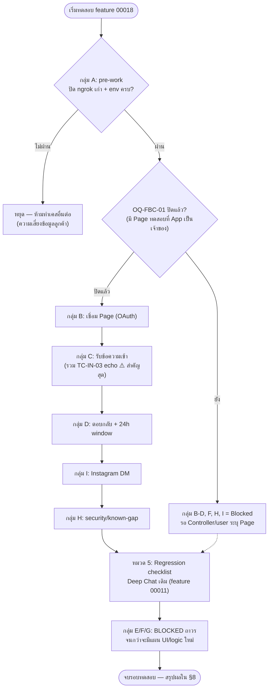

> **โมดูล:** M00018-FacebookChatIntegration
> **ประเภทเอกสาร:** Test Case
> **เวอร์ชัน:** 1.1
> **วันที่จัดทำ:** 2026-07-22
> **สถานะ:** Draft — **ยังไม่มีการรันชุดทดสอบ manual/E2E ใด ๆ ในเอกสารนี้** (dev server ไม่ได้รันระหว่างจัดทำเอกสาร) เอกสารนี้คือ**แผนการทดสอบ** ไม่ใช่รายงานผลทดสอบ
>
> 🔄 **v1.1 (2026-07-23) — doc-sync ตามของจริงบน prod:** เพิ่ม FR-FBC-15/16/17 (ข้อความสำเร็จรูป, AI ช่วยร่างคำตอบ, เครื่องมือ composer + ไฟล์แนบวิดีโอ/เสียง/ไฟล์), BR-FBC-23..27, TFR-FBC-12..14, table `QuickMessage` + คอลัมน์ CRM, endpoint quick-messages/ai-suggest/crm และปรับสถานะรายการที่ implement ไปแล้ว (S-7/S-8/หน้า channels). **โค้ดขึ้น prod ก่อนเอกสาร = หนี้ Hard Rule 11 ที่ back-fill ในรอบนี้**
> **เจ้าของเอกสาร:** QA (ดู [[Feature-Docs-Ownership]])

# Test Case: Facebook Chat Integration (Messenger + Instagram DM)

---

## 1. Overview

ชุดทดสอบนี้ครอบคลุม feature `00018 - Facebook Chat Integration` ตามสถานะที่ implement จริงใน [[SRS]] §1.2 — **backend pipeline เท่านั้น** (webhook ขาเข้า, ส่งข้อความขาออก TEXT, OAuth เชื่อม Page, 24h window logic, idempotency, encrypt token) **UI ทั้งหมดยังไม่ implement** (ไม่มีหน้า `/seller/settings/channels`, ไม่มี badge/filter/แบนเนอร์ 24h ใน `/inbox`, ไม่มีปุ่มสร้างออเดอร์จากเธรด)

**เอกสารต้นทาง:** [[PRD]] §3.1 (FR-FBC-01..14), [[BRD]] §8 (BR-FBC-01..22) — ทุก scenario ในเอกสารนี้ trace กลับรหัสเหล่านั้น

**ประเภทการทดสอบ:**
- **Unit test** — มีอยู่แล้วในโค้ด (Vitest) ครอบ pure function/service logic ส่วนใหญ่ของ backend pipeline — ดูตารางความครอบคลุมที่ §3 (ไม่เขียนซ้ำ เขียนแล้วอ้างอิงไฟล์)
- **Manual/E2E** — สิ่งที่ unit test พิสูจน์ไม่ได้ (round-trip ผ่าน Meta จริง, webhook subscription จริง, OAuth consent dialog จริง, การมองเห็นใน UI จริง) — §4 ของเอกสารนี้ **ยังไม่มีใครรัน**
- **Regression** — ยืนยันว่า Deep Chat เดิม (feature `00011`, buyer↔seller ในแอป) ไม่พังหลัง schema เปลี่ยนเป็น channel-aware — §5

**สภาพแวดล้อม:**
- Dev: `http://seller.deepth.local:4000` (seller subdomain — `/inbox`, `/seller/settings/channels` เมื่อมี UI), webhook route `POST /api/channels/facebook/webhook` ต้องเป็น public HTTPS (ngrok) เมื่อทดสอบกับ Meta จริง — ยิงตรงในเครื่องได้ผ่าน `scripts/fake-fb-webhook.ts` โดยไม่ต้องมี ngrok
- Facebook App: **"Deep Chat & LIVE" (`1570859340799126`)** — Standard Access เท่านั้น ใช้ได้เฉพาะ Page ที่ admin/developer/tester ของ App นี้เป็นเจ้าของ (ดู §2)
- env ที่ต้องตั้งก่อนทดสอบ: `FB_CHAT_APP_ID`, `FB_CHAT_APP_SECRET`, `FB_WEBHOOK_VERIFY_TOKEN`, `CHANNEL_TOKEN_KEY` (hex 64 ตัว = 32 byte) — ดู `.env.example`

**นอกขอบเขตของชุดทดสอบนี้ (บล็อกด้วย UI ที่ยังไม่มี — mark ชัดใน §4 ว่า "รอแผน UI"):**
- สร้างออเดอร์จากเธรด FB (FR-FBC-07), ผูก Customer Directory (FR-FBC-08)
- Badge ช่องทาง + filter ตาม Page ใน `/inbox` (FR-FBC-12)
- จัดการ/ถอด Page จากหน้าจอ (FR-FBC-11 ฝั่ง UI — service function `disconnectChannel`/`listChannels` มีแล้วแต่ไม่มี route/UI เรียก)
- ปักหมุด/ซ่อน/ปิดงานเธรด (FR-FBC-13, BR-FBC-14..16 — คอลัมน์ DB มีแล้ว ไม่มี logic/API)
- แท็ก/โน้ตภายใน/tab ออเดอร์ในแผงขวา (FR-FBC-14, BR-FBC-17..19 — ไม่มี model เลย)
- ส่งรูปภาพออกจาก Deep ไป Messenger/IG (FR-FBC-04 ฝั่งรูป — เธรดช่องทางนอกส่งได้เฉพาะ `type=TEXT`)

---

## 2. ข้อจำกัดของการทดสอบตอนนี้ (อ่านก่อนรันเคสใด ๆ ใน §4)

| ข้อจำกัด | รายละเอียด | ผลต่อการทดสอบ |
|---|---|---|
| **Standard Access เท่านั้น** | Facebook App `1570859340799126` ยังไม่ผ่าน App Review + Business Verification (Advanced Access) | ทดสอบ end-to-end กับ Meta จริงได้ **เฉพาะ Page ที่ admin/developer/tester ของ App นี้เป็นเจ้าของ** เท่านั้น — Page ของร้านค้าคนนอกใช้ไม่ได้เลยในตอนนี้ (ยืนยันแล้ว: ยังไม่มี Page ตอบ **OQ-FBC-01** ใน [[BRD]] §11 — Controller/user ต้องระบุ Page ที่จะใช้ QA ก่อนเริ่ม §4 กลุ่ม B เป็นต้นไป) |
| **ต้องมี ngrok (public HTTPS)** | Meta ต้องยิง webhook มาที่ URL public HTTPS จริง — dev server localhost อย่างเดียวรับ webhook จาก Meta จริงไม่ได้ | เคสที่ต้องพิสูจน์ "Meta ยิงจริง" (กลุ่ม C/D/F/H ใน §4) ต้องเปิด ngrok ชี้ `POST /api/channels/facebook/webhook` ก่อน แล้วอัปเดต callback URL ในหน้า Facebook App Dashboard ให้ตรง; เคสที่ยิง payload จำลอง (เซ็น signature จริงด้วย `scripts/fake-fb-webhook.ts`) ไม่ต้องพึ่ง ngrok — ยิงตรงเข้า dev server ได้ (ดูหมายเหตุใน TC ที่เกี่ยวข้อง) |
| **UI ยังไม่มี — บาง flow ทดสอบผ่าน URL/curl ตรง ๆ เท่านั้น** | `/seller/settings/channels` ไม่มีจริง — เชื่อม Page ทำได้โดย seller login แล้ว navigate ไป `GET /api/channels/facebook/connect` ตรง ๆ ทาง address bar เท่านั้น (ไม่มีปุ่มให้กด) | เคสในกลุ่ม B (§4) เป็นการทดสอบ "route ทำงานถูกต้อง" ไม่ใช่ "UX การเชื่อม Page" (ยังไม่มี UX ให้ทดสอบ) |
| **`/inbox` แสดงเธรด FB ได้แล้วบางส่วนโดยบังเอิญ** | `listConversationsForShop`/`ChatThread` ของ feature `00011` query แค่ `shopId` ไม่ได้ filter `channel` และ error handler เดิมโชว์ `data.error` จาก API response ผ่าน `pacesToast` อยู่แล้ว — ดังนั้นเธรด Messenger/IG **จะโผล่ใน `/inbox` list และเปิดคุยได้จริงแม้ไม่มี badge/filter** (คนละเรื่องกับ "UI ทำเสร็จแล้ว" — เห็นเป็นเธรดทั่วไปที่แยกไม่ออกว่าเป็น FB หรือ Deep เพราะไม่มี badge) และข้อความ error ตอนส่งไม่ผ่าน 24h window **จะโผล่เป็น toast จริง** (ข้อความจาก [[API]] §4.5) แม้ไม่มี banner เตือนล่วงหน้า | เคสกลุ่ม C/D/E ใน §4 ทดสอบผ่าน `/inbox` ที่มีอยู่แล้วได้จริง — ไม่ต้องรอ UI ใหม่ทั้งหมด เพียงแต่ผลที่เห็นจะไม่มี badge ช่องทาง/แบนเนอร์เวลาที่เหลือ (ตามที่ mark "รอแผน UI" เฉพาะจุด) |
| **หนี้ความปลอดภัย: รูปแชทเสิร์ฟแบบ public** | `src/app/api/files/[fileId]/route.ts` ไม่ gate `ChatMessage.imageUrl` — ใครมี fileId (เดา UUID ไม่ได้ แต่หลุดผ่าน history/แชร์ลิงก์ได้) เปิดดูรูปแชทได้โดยไม่ login (บันทึกไว้แล้วใน spec §10.1 เป็นหนี้ที่ยังไม่ปิด) | TC-IMG-03 (§4 กลุ่ม C) ต้องยืนยันพฤติกรรมนี้ตามที่เป็นจริง (ไม่ใช่ bug ใหม่ที่ QA รอบนี้ต้อง block — เป็น known-gap ที่สืบทอดจาก feature 00011 แต่ feature นี้ขยายผลกระทบ) |
| **ไม่มี unit test ของ `callback` route** | `src/app/api/channels/facebook/callback/route.ts` ไม่มี `route.test.ts` (มีแค่ `webhook/route.test.ts` และ `connect/route.test.ts`) | logic ทั้งหมดของ OAuth callback (state check, exchange token, `connectPages`, IG auto-link, redirect status ทุกแบบ) **พิสูจน์ได้ทาง manual/E2E เท่านั้นในตอนนี้** — ดูกลุ่ม B ใน §4 |

---

## 3. Unit Test Coverage Matrix

ตารางนี้จับคู่ `FR-FBC-xx`/`BR-FBC-xx` → ไฟล์ unit test ที่ครอบอยู่แล้ว (Vitest, รันได้ด้วย `npm run test` หรือ `npx vitest run <path>`) — **"ครอบแล้ว" หมายถึงมี assertion ตรงเงื่อนไขนั้นจริง ไม่ใช่แค่ไฟล์เดียวกันถูกอ้างถึง**

| FR-FBC / BR-FBC | เนื้อหา | ครอบแล้วโดย (unit test) | สถานะ |
|---|---|---|---|
| BR-FBC-22 (signature = auth เดียว) | verify `X-Hub-Signature-256` timing-safe | `src/lib/facebook/__tests__/signature.test.ts` (5 cases: ถูก/body ถูกแก้/ไม่มี header/ผิด prefix/ยาวไม่เท่ากัน) + `src/app/api/channels/facebook/webhook/route.test.ts` (`ลายเซ็นผิด → 401`) | ✅ ครอบแล้ว |
| BR-FBC-22 (validate ทุก payload ด้วย Valibot) | `WebhookBodySchema` | `src/lib/facebook/__tests__/webhook-types.test.ts` (parse ปกติ/ปฏิเสธไม่มี entry/รับ attachment รูป) + `extractMessagingEvents` (แบน entry, entry ไม่มี messaging) | ✅ ครอบแล้ว |
| FR-FBC-01 (รับ TEXT), FR-FBC-09/10 (dispatch ตาม provider) | `object=page`→MESSENGER, `object=instagram`→INSTAGRAM, GET handshake | `src/app/api/channels/facebook/webhook/route.test.ts` (GET handshake ×4 case, POST ลายเซ็นถูก→200+เรียก ingest, `object=instagram`→provider INSTAGRAM, payload parse ไม่ผ่าน→200 ไม่เรียก ingest) | ✅ ครอบแล้ว (route-level) |
| FR-FBC-01/02/03, BR-FBC-06/07/09/10/13 | `ingestInboundMessage` ครบ flow (STORED, lastInboundAt, echo, dedupe, NO_CHANNEL, IGNORED, ดึงโปรไฟล์, race condition) | `src/services/__tests__/channel-chat-ingest.test.ts` (16 cases รวม M-1/I-1/I-2/I-5/Minor-5) | ✅ ครอบแล้ว |
| FR-FBC-02, BR-FBC (mirror รูป/SSRF) | `mirrorRemoteImage` — โหลด/mirror รูปจาก Meta, allow-list host, SSRF guard, ขนาด/ชนิดไฟล์ | `src/services/__tests__/channel-chat-image.test.ts` (11 cases รวม SSRF ผ่าน internal address, evil-fbcdn.net suffix-match ปลอม, http ไม่ใช่ https, gif ถูกปฏิเสธ) | ✅ ครอบแล้ว |
| FR-FBC-03, BR-FBC-09/10 (`is_echo`) | sender/recipient สลับกัน, `senderRole=SHOP`, ไม่ขยับ `lastInboundAt` | `channel-chat-ingest.test.ts` (`is_echo → sender=PAGE/recipient=PSID ... (M-1)`) | ✅ ครอบแล้ว |
| FR-FBC-04/05/06, BR-FBC-05/11/12 | `sendOutboundMessage` — window check ก่อนยิง Graph, ownership, FAILED+failureReason, token invalid (code 190), race กับ echo webhook, transaction เดียว | `src/services/__tests__/channel-chat-outbound.test.ts` (12 cases รวม M-2/M-6/I-6) | ✅ ครอบแล้ว |
| FR-FBC-05, BR-FBC-11 | `getWindowState` — ไม่เคยมี inbound/เปิด/ปิดเกิน 24h | `channel-chat-ingest.test.ts` (`describe('getWindowState')` 3 cases) | ✅ ครอบแล้ว (logic ล้วน — **ไม่มี unit test ของ UI banner เพราะยังไม่มี UI**) |
| FR-FBC-04 (dispatch `channel != DEEP`) | เธรดช่องทางนอก `sendMessage` ไม่สร้าง Notification, กัน senderRole=BUYER ปลอมบนเธรดไม่มี buyer | `src/services/__tests__/chat-service-external.test.ts` (2 cases) | ✅ ครอบแล้ว |
| FR-FBC-09/10, BR-FBC-01/02/04/20 | `connectPages` — เข้ารหัส token, IG auto-link, ownership conflict (P2002 ร้านอื่น/ร้านเดียวกัน), subscribe fail ไม่บล็อก | `src/services/__tests__/shop-channel.service.test.ts` (12 cases) | ✅ ครอบแล้ว (service-level) |
| FR-FBC-11 (`disconnectChannel`) | ตั้ง `status=DISCONNECTED`, ownership guard | `shop-channel.service.test.ts` (`describe('disconnectChannel')` 2 cases) | ⚠️ **service ครอบแล้ว แต่ไม่มี API route เรียกใช้ — ไม่มีทางทดสอบ end-to-end ได้จนกว่าจะมี route/UI** |
| FR-FBC-11 (`listChannels` ไม่หลุด token) | `select` allow-list กัน `accessTokenEnc` หลุด | `shop-channel.service.test.ts` (`listChannels ไม่คืน accessTokenEnc ออกไปเด็ดขาด`) | ✅ ครอบแล้ว (service-level, ไม่มี route เรียก) |
| BR-FBC-20 (encrypt token) | AES-256-GCM round-trip, IV สุ่มทุกครั้ง, tamper→throw | `src/lib/__tests__/token-crypto.test.ts` (3 cases) | ✅ ครอบแล้ว |
| Graph API client (`graph.ts`) | `listManageablePages` กรอง task, `sendTextMessage`, `GraphApiError`, ไม่ใส่ token ใน query string, `exchangeCodeForToken` (long-lived fallback) | `src/lib/facebook/__tests__/graph.test.ts` (8 cases) | ✅ ครอบแล้ว |
| FR-FBC-09 (`connect` route) | login guard 401, redirect 302 พร้อม scope/state | `src/app/api/channels/facebook/connect/route.test.ts` (2 cases) | ✅ ครอบแล้ว |
| FR-FBC-09/10 (`callback` route) | state mismatch, no_shop, no_eligible_page, exchange/list/connect exception, redirect status ทุกแบบ | **ไม่มีไฟล์ test** | ❌ **ยังไม่ครอบ — ต้องพึ่ง manual/E2E (§4 กลุ่ม B)** |
| BR-FBC-13 (idempotency ที่ route-level) | webhook batch: infra error หยุดทันที vs logic error ไปต่อ event ถัดไป, Prisma P1xxx vs P2xxx | `src/app/api/channels/facebook/webhook/route.test.ts` (I-3 cases) | ✅ ครอบแล้ว |
| FR-FBC-07/08 (สร้างออเดอร์/ผูก Customer) | — | ไม่มี | ❌ **ยังไม่ implement เลย — ไม่มีอะไรให้ครอบ** |
| FR-FBC-12 (badge/filter) | — | ไม่มี | ❌ **ยังไม่ implement เลย** |
| FR-FBC-13, BR-FBC-14/15/16 (pin/hide/resolve) | `updateConversationState`, auto-unhide/reopen, pin-first cursor | ไม่มีไฟล์ test | ❌ **implement แล้ว (2026-07-23) แต่ยังไม่มี unit test — test-debt** |
| FR-FBC-14, BR-FBC-17/18/19 (tag/note) | `chat-crm.service.ts` + route `crm` | ไม่มีไฟล์ test | ❌ **implement แล้ว (2026-07-23) แต่ยังไม่มี unit test — test-debt** |
| **FR-FBC-15, BR-FBC-23/24** (ข้อความสำเร็จรูป) | scope `shopId` ทุก query, `updateMany/deleteMany` count=0 → NOT_FOUND, validation "ต้องมีข้อความหรือรูป" | ไม่มีไฟล์ test | ❌ **test-debt — เคสสำคัญคือ cross-shop (ร้าน B แก้ของร้าน A ต้องได้ 404)** |
| **FR-FBC-16, BR-FBC-25/26/27** (AI ช่วยร่าง) | ownership เธรด → 404, rate-limit → 429, ไม่มี key → 503, Gemini error → 502, transcript อ่านจาก DB ไม่รับจาก client | ไม่มีไฟล์ test | ❌ **test-debt — mock `fetch` ของ Gemini ได้ ไม่ต้องยิงจริง** |
| **FR-FBC-17** (ไฟล์แนบ วิดีโอ/เสียง/ไฟล์ ขาเข้า) | map `attachment.type` → `ChatMessage.type`, mirror เข้า storage | ไม่มีไฟล์ test (มีของ `mirrorRemoteImage` เดิมเท่านั้น) | ❌ **test-debt** |
| BR-FBC-21 (neutralize PII ที่ RSC) | — | ไม่มี (ต้องพิสูจน์ที่ระดับ page component เมื่อมี UI) | ❌ **ยังไม่มี UI ให้ทดสอบ — ดู TC-SEC-01 §4 กลุ่ม I สำหรับแผนเมื่อ UI มา** |
| ยกเว้น webhook จาก CSRF (BR-FBC-22 ส่วน `guardApi`) | `src/proxy.ts` เพิ่มเงื่อนไข path | ไม่มี unit test ตรง (ไม่มีไฟล์ test ของ `proxy.ts` เดิม) | ⚠️ **ยังไม่ครอบด้วย unit — พิสูจน์ทางอ้อมได้จาก TC-WH-* ที่ยิง webhook ตรงไม่ผ่าน browser (ไม่มี Origin header) แล้วไม่โดน 403 จาก Origin-check** |

**สรุป §3:** backend pipeline หลัก (signature verify → parse → dedupe → ingest → 24h window → send → encrypt token → connectPages) มี unit test ครอบละเอียดมาก (รวม ≈75 test cases ใน 11 ไฟล์) **ยกเว้น 2 จุดที่ยังไม่มี unit test เลย**: (1) `callback` route ทั้งเส้น (2) `guardApi`/`proxy.ts` ส่วนยกเว้น Origin-check — ทั้งสองต้องพิสูจน์ผ่าน manual/E2E ใน §4

> ⚠️ **test-debt ที่โตขึ้นหลัง 2026-07-23:** ทุกอย่างที่ทำหลังรอบ backend แรก (S-7 pin/hide/resolve,
> CRM, ข้อความสำเร็จรูป, AI ช่วยร่าง, ไฟล์แนบชนิดใหม่) **ขึ้น prod โดยไม่มี unit test และไม่มี
> Playwright E2E** — สวนกับกติกาโปรเจกต์ที่ให้ E2E เป็นของบังคับ ต้องตามเก็บเป็นงานแยก
> (ดูรายการเคสที่ควรมีในตารางข้างบน + §4 กลุ่ม J)

---

## 4. Test Scenarios (Manual / E2E)

> Precondition ร่วมของทุกกลุ่ม (นอกจากจะระบุอื่น): dev server รันที่ `http://seller.deepth.local:4000` (Controller ตรวจ `curl` 2xx/3xx ก่อนเริ่ม — QA ห้าม start เอง), env `FB_CHAT_APP_ID`/`FB_CHAT_APP_SECRET`/`FB_WEBHOOK_VERIFY_TOKEN`/`CHANNEL_TOKEN_KEY` ตั้งค่าแล้วใน `.env.local`, มี seller account ที่ login เข้า `seller.deepth.local:4000` ได้ และมี `Shop` ผูกกับ user นั้นแล้ว (onboarding เสร็จ)

### กลุ่ม A — Pre-work บังคับ (PRD §4.3, ต้องทำก่อนเริ่มกลุ่มอื่น)

#### TC-PRE-01: ยืนยันว่า webhook subscription เก่าที่ชี้ ngrok ตายถูกปิด/เปลี่ยนแล้ว
- **Linked to:** PRD §4.3 (ความเสี่ยงข้อมูลลูกค้า), §6.2
- **Precondition:** เข้าถึง Facebook App Dashboard ของ App `1570859340799126` ได้ (role admin/developer)
- **Steps:**
  1. เปิด Facebook App Dashboard → Messenger → Webhooks
  2. ดู Callback URL ที่ subscribe อยู่ปัจจุบัน
- **Expected Result:** Callback URL ไม่ใช่ ngrok URL เก่าที่ตายแล้ว (404) — ต้องเป็น URL ที่ควบคุมได้จริง (ngrok session ปัจจุบันของทีม หรือถูก unsubscribe ไปก่อน) **ถ้ายังชี้ ngrok เก่าที่ตาย ต้องหยุด — ห้ามทำเคสอื่นในกลุ่ม C/D/F/H ต่อจนกว่าจะแก้**

#### TC-PRE-02: ยืนยัน env vars ครบและถูกต้อง
- **Linked to:** SRS §8 Enums/Constants, §9 Authorization Matrix
- **Precondition:** เข้าถึง `.env.local` ได้
- **Steps:**
  1. ตรวจว่ามีค่า `FB_CHAT_APP_ID`, `FB_CHAT_APP_SECRET`, `FB_WEBHOOK_VERIFY_TOKEN`, `CHANNEL_TOKEN_KEY` ครบ ไม่ว่าง
  2. ตรวจว่า `CHANNEL_TOKEN_KEY` เป็น hex 64 ตัวอักษร (32 byte)
  3. ตรวจว่า `FB_CHAT_APP_SECRET` เป็นค่าปัจจุบัน (ไม่ใช่ secret เก่าที่ regenerate ไปแล้ว — ดู memory `project_facebook_chat_integration_resume`: "`FACEBOOK_SECRET` ใน `.env.local` เสีย")
- **Expected Result:** ทั้ง 4 ค่ามีครบ, `CHANNEL_TOKEN_KEY` มีความยาว 64 hex char, ทดสอบยิง Graph API ตัวอย่าง (เช่น `GET /api/channels/facebook/connect` แล้ว redirect สำเร็จ) ไม่ error 500 "ยังไม่ได้ตั้งค่า"

---

### กลุ่ม B — เชื่อม Facebook Page (OAuth) — FR-FBC-09/10/11, BR-FBC-01..05

> **บล็อกด้วย OQ-FBC-01:** ทุกเคสในกลุ่มนี้ต้องมี **Page ที่ admin/developer/tester ของ App `1570859340799126` เป็นเจ้าของ** (Standard Access) — Controller/user ต้องระบุ Page ทดสอบก่อนรันเคสกลุ่มนี้ ไม่มี Page ที่ใช้ได้ = **Blocked**, ไม่ใช่ Fail

#### TC-CONN-01: เชื่อม Facebook Page สำเร็จ (happy path)
- **Linked to:** FR-FBC-09, BR-FBC-01/02/20
- **Precondition:** seller login แล้ว (session cookie บน `seller.deepth.local:4000`); มี Page ทดสอบที่ยังไม่เคยเชื่อมกับร้านไหนในระบบ, seller เป็น admin ของ Page นั้นด้วยสิทธิ์ `MESSAGING`+`MODERATE`
- **Steps:**
  1. ในเบราว์เซอร์ที่ login เป็น seller อยู่ ไปที่ `http://seller.deepth.local:4000/api/channels/facebook/connect` ตรง ๆ ทาง address bar
  2. ระบบ redirect ไปหน้า Facebook OAuth dialog — ตรวจว่า scope ที่ขอมี `pages_show_list, pages_messaging, pages_manage_metadata, pages_read_engagement, business_management, instagram_basic, instagram_manage_messages`
  3. อนุมัติ + เลือก Page ทดสอบ
  4. Facebook redirect กลับมาที่ `GET /api/channels/facebook/callback`
- **Expected Result:** browser ลงเอยที่ `http://seller.deepth.local:4000/settings/channels?status=connected&connected=1&skipped=` (หน้า 404 เพราะยังไม่มี UI — **คาดหวังแค่ query string ถูกต้อง ไม่ใช่หน้าเพจสวยงาม**); ตรวจใน DB ว่ามีแถว `ShopChannel` ใหม่ `provider=MESSENGER`, `externalId=<pageId>`, `status=ACTIVE`, `accessTokenEnc` เป็น ciphertext (ไม่ใช่ plaintext token), `shopId` ตรงกับร้านของ seller ที่ login

#### TC-CONN-02: Page มี Instagram Business Account ผูกอยู่ → auto-link IG โดยไม่ต้อง OAuth ซ้ำ
- **Linked to:** FR-FBC-10, BR-FBC-04
- **Precondition:** Page ทดสอบมี IG Business Account ผูกอยู่แล้วจริงในการตั้งค่า Facebook
- **Steps:** ทำ TC-CONN-01 ซ้ำด้วย Page นี้
- **Expected Result:** query string คืนมาแสดง `connected=2` (ไม่ใช่ 1); ใน DB มี `ShopChannel` 2 แถวจาก transaction เดียว — แถวหนึ่ง `provider=MESSENGER` อีกแถว `provider=INSTAGRAM` (`externalId = <IG Business Account ID>`) ทั้งคู่ `accessTokenEnc` ถอดรหัสแล้วได้ page token **เดียวกัน**; ไม่มี dialog OAuth รอบสองสำหรับ IG

#### TC-CONN-03: พยายามเชื่อม Page ที่ร้านอื่นผูกไว้แล้ว (Ownership Conflict — BRD Scenario 7)
- **Linked to:** BR-FBC-01
- **Precondition:** Page X ถูกร้าน A เชื่อมไว้แล้ว (`ShopChannel status=ACTIVE`); มี seller ร้าน B ที่มีสิทธิ์ `MESSAGING`+`MODERATE` บน Page X เดียวกัน (เช่นเคยเป็นแอดมินร่วม)
- **Steps:** login เป็น seller ร้าน B → ทำ TC-CONN-01 ด้วย Page X
- **Expected Result:** callback ไม่ throw 500; query string คืน Page X ในพารามิเตอร์ `skipped=` (ชื่อ Page ถูกเข้ารหัส URL); `connected=0` (ถ้าไม่มี Page อื่นที่เชื่อมสำเร็จ); ตรวจ DB — **ไม่มีแถว `ShopChannel` ใหม่ที่ชี้ Page X ไปที่ร้าน B** แถวเดิมของร้าน A ยังคง `shopId` เดิมไม่เปลี่ยน

#### TC-CONN-04: seller ยกเลิกที่หน้า Facebook (กด "ไม่อนุญาต")
- **Linked to:** [[API]] §4.4 error table
- **Steps:** ทำ TC-CONN-01 ถึงขั้นตอน 2 แล้วกด "ยกเลิก"/"ไม่อนุญาต" แทนการอนุมัติ
- **Expected Result:** redirect กลับ `/settings/channels?status=cancelled` ไม่มี `ShopChannel` ใหม่ถูกสร้าง

#### TC-CONN-05: OAuth state ไม่ตรง (CSRF ป้องกัน)
- **Linked to:** BR-FBC-03 (OAuth แยกจาก login), SRS §6.1
- **Steps:** เริ่ม `GET /api/channels/facebook/connect` ให้ได้ cookie `fb_channel_oauth_state` มา → แก้ query param `state` ที่ callback URL เป็นค่าอื่นก่อนเรียก `GET /api/channels/facebook/callback` (เช่นแก้ผ่าน dev tools/curl)
- **Expected Result:** redirect `/settings/channels?status=state_mismatch`; ไม่มี `ShopChannel` ใหม่ถูกสร้างแม้จะมี `code` ที่ valid มาด้วย

#### TC-CONN-06: seller ไม่มี Shop (ยังไม่ onboarding เสร็จ)
- **Linked to:** SRS TFR-FBC-07
- **Precondition:** login เป็น user ที่ `needsOnboarding=true` (ไม่มี `Shop`) — ตามปกติ `proxy.ts` จะ force-redirect ไป `/onboarding` ก่อนอยู่แล้ว ต้อง bypass เพื่อยิงตรงเข้า callback (เช่นเรียก API ตรงด้วย session cookie ที่ inject เอง)
- **Steps:** เรียก `GET /api/channels/facebook/callback` ด้วย session ของ user ที่ไม่มี `Shop`
- **Expected Result:** redirect `/settings/channels?status=no_shop`

#### TC-CONN-07: Page ที่ไม่มีสิทธิ์ MESSAGING+MODERATE ไม่ปรากฏให้เลือก
- **Linked to:** BR-FBC-02
- **Precondition:** seller เป็นแค่ Analyst/Editor role บน Page ทดสอบอีกใบ (ไม่มี task MESSAGING/MODERATE)
- **Steps:** ทำ TC-CONN-01 โดยพยายามเลือก Page ที่สิทธิ์ไม่พอ
- **Expected Result:** Page นั้นไม่ปรากฏในรายการที่ Facebook OAuth dialog ให้เลือก (Facebook filter เองตาม scope ที่ขอ) หรือถ้าปรากฏแต่ระบบดึงมาแล้วกรองทิ้ง (`listManageablePages`) — query string คืน `status=no_eligible_page` ถ้าไม่มี Page อื่นผ่านเงื่อนไขเลย

#### TC-CONN-08: Token ตายกลางทาง → TOKEN_INVALID + banner
- **Linked to:** BR-FBC-05
- **Precondition:** มี `ShopChannel status=ACTIVE` ที่เชื่อมสำเร็จแล้ว
- **Steps:** ที่หน้า Facebook Business settings ถอดสิทธิ์แอป "Deep Chat & LIVE" ออกจาก Page นั้น (หรือ regenerate token) → ลองส่งข้อความออกจากเธรดของ Page นี้ผ่าน `/inbox` (ต้องมีเธรดที่ window ยังเปิดอยู่ — ดู TC-OUT-01 สำหรับสร้าง precondition)
- **Expected Result:** ส่งไม่สำเร็จ, DB `ShopChannel.status` เปลี่ยนเป็น `TOKEN_INVALID`, `ChatMessage` ที่พยายามส่งมี `deliveryStatus=FAILED` — **"banner เชื่อมต่อใหม่" ยังไม่มีจริงเพราะ UI channels page ยังไม่ implement → mark เป็น "รอแผน UI" เฉพาะส่วน banner เท่านั้น** (การเปลี่ยนสถานะใน DB ต้องเกิดจริง)

---

### กลุ่ม C — รับข้อความเข้า (Inbound) — FR-FBC-01/02/03, BR-FBC-06/07/09/10/13

> ยิงผ่าน `scripts/fake-fb-webhook.ts` ได้โดยไม่ต้องพึ่ง Meta จริง/ngrok (เซ็น signature จริงด้วย `FB_CHAT_APP_SECRET`) — ใช้พิสูจน์ pipeline ได้ครบยกเว้น TC-IN-06 ที่ต้อง Messenger จริง

#### TC-IN-01: ลูกค้าทัก Page ครั้งแรก (ข้อความ TEXT) → ปรากฏใน `/inbox` (BRD Scenario 1)
- **Linked to:** FR-FBC-01, BR-FBC-06/07
- **Precondition:** `ShopChannel status=ACTIVE` เชื่อมแล้ว (จาก TC-CONN-01); ไม่เคยมี `ExternalContact` ของ PSID ทดสอบมาก่อน; seller เปิด `/inbox` ค้างไว้ในเบราว์เซอร์อีกแท็บ
- **Steps:**
  1. รัน `npx dotenv -e .env.local -- npx tsx scripts/fake-fb-webhook.ts --page <pageId> --psid <psidใหม่> --text "มีสินค้าชิ้นนี้ไหมคะ"`
  2. สังเกตแท็บ `/inbox` ที่เปิดค้างไว้
- **Expected Result:** สคริปต์คืน `HTTP 200 {"ok":true}`; ภายในไม่กี่วินาที เธรดใหม่ปรากฏใน `/inbox` แบบ realtime (Supabase broadcast) พร้อมข้อความ "มีสินค้าชิ้นนี้ไหมคะ"; DB มี `ExternalContact` ใหม่ (`shopChannelId`, `externalUserId=psid`), `Conversation` ใหม่ (`channel=MESSENGER`, `lastInboundAt` = เวลาที่ยิง), `ChatMessage` (`senderRole=BUYER`) — **หมายเหตุที่ต้องบันทึกจริง (ไม่ mark ผ่านลอย ๆ): เธรดนี้จะไม่มี badge/ไอคอน Messenger เพราะ FR-FBC-12 ยังไม่ implement — ปรากฏเป็นเธรดทั่วไปที่แยกไม่ออกจาก Deep Chat ด้วยตา**

#### TC-IN-02: seller ตอบจาก `/inbox` → seller เห็นข้อความของตัวเอง + ลูกค้าเห็นจริงใน Messenger
- **Linked to:** FR-FBC-04, BRD Scenario 1
- **Precondition:** ต่อจาก TC-IN-01, window ยังเปิดอยู่ (< 24 ชม.)
- **Steps:**
  1. seller เปิดเธรดจาก TC-IN-01 ใน `/inbox`
  2. พิมพ์ "มีค่ะ" กดส่ง
  3. ถ้ามี Messenger จริงเปิดอยู่คู่กัน (บัญชีลูกค้าทดสอบ) ให้เช็คที่นั่นด้วย
- **Expected Result:** ข้อความปรากฏในเธรดฝั่ง seller ทันที (optimistic/realtime); DB มี `ChatMessage` ใหม่ `senderRole=SHOP`, `externalMessageId = mid` ที่ Graph API คืนมา, `deliveryStatus=SENT`; ถ้ามี Messenger จริงคู่กัน ข้อความต้องไปถึงจริงในแอปของลูกค้า — **นี่คือจุดพิสูจน์ FR-FBC-04 ระดับ end-to-end จริง ไม่ใช่แค่ DB สร้างแถว**

#### TC-IN-03: seller ตอบจากแอป Messenger บนมือถือโดยตรง (Echo — บั๊กที่เพิ่งแก้ BR-FBC-09) ⚠️ สำคัญที่สุด
- **Linked to:** FR-FBC-03, BR-FBC-09/10, BRD Scenario 2, PRD persona 2.3
- **Precondition:** มีเธรดที่ window เปิดอยู่ (ต่อจาก TC-IN-01); **ต้องมี Page จริงที่ทดสอบด้วยแอป Messenger บนมือถือจริง** — สคริปต์ยิงเอง (`--echo` flag) **พิสูจน์ได้แค่ pipeline logic ไม่พิสูจน์ subscription จริง** เพราะไม่ผ่าน webhook subscription ของ Meta จริง
- **Steps (มือถือจริง):**
  1. เปิดแอป Messenger บนมือถือของ Page ทดสอบ (ไม่ใช่ Deep)
  2. เปิดแชทกับบัญชีลูกค้าทดสอบเดียวกับ TC-IN-01
  3. พิมพ์ตอบ "ตอบจากมือถือค่ะ" ส่งตรงจากแอป Messenger (ไม่ผ่าน Deep เลย)
  4. กลับมาเปิด `/inbox` ของ Deep (แท็บที่ไม่เกี่ยวกับมือถือ)
- **Expected Result:** ข้อความ "ตอบจากมือถือค่ะ" ปรากฏในเธรดของ `/inbox` เป็นฝั่งร้าน (SHOP) — seller เห็นว่าตัวเองเคยตอบไปแล้ว; DB `ChatMessage.senderRole=SHOP`, **`Conversation.lastInboundAt` ต้องไม่ขยับ** (ยังเป็นเวลาข้อความล่าสุดของลูกค้า ไม่ใช่เวลาที่ echo เข้ามา) — เทียบค่า `lastInboundAt` ก่อน/หลังจาก echo นี้เข้ามาต้อง**เท่ากัน**
- **หมายเหตุ:** เคสนี้ **ต้องพิสูจน์กับ Page จริงเท่านั้น** — เป็นเหตุผลตรงที่ Controller ระบุไว้ในโจทย์ (บั๊ก `message_echoes` ที่เพิ่งแก้ไปในโค้ด แต่ยังไม่เคยพิสูจน์กับ subscription จริง)

#### TC-IN-04: รูปภาพจากลูกค้า → mirror เข้า storage และแสดงในเธรด (FR-FBC-02)
- **Linked to:** FR-FBC-02
- **Steps:**
  1. ส่งรูปภาพจากบัญชีลูกค้าทดสอบเข้า Page ทดสอบ (ผ่าน Messenger จริง หรือใช้สคริปต์ที่ปรับ payload ให้มี `attachments[].type=image` และ `payload.url` ชี้ URL รูปจริงของ Meta CDN — ต้องเป็น URL จริงเพราะ `mirrorRemoteImage` ทำ fetch จริง)
  2. เปิด `/inbox` ดูเธรด
- **Expected Result:** ข้อความปรากฏเป็น type `IMAGE`, `imageUrl` เป็น fileId ของ storage เอง (ไม่ใช่ URL ของ Meta) — รูปโหลดแสดงได้จริงในเธรด (ไม่ broken image); ตรวจว่าไฟล์ต้นทางถูกลบ/หมดอายุแล้วรูปในเธรดยัง**เปิดดูได้** (เพราะ mirror แล้ว)

#### TC-IN-05: ส่งรูปที่ mirror ไม่ผ่าน (โหลดพัง/เกิน 5MB/ชนิดไม่รองรับ) → ข้อความยังถูกบันทึก ไม่หายไปเงียบ ๆ
- **Linked to:** FR-FBC-02 edge case (SRS TFR-FBC-04)
- **Steps:** ส่งไฟล์แนบชนิดที่ handler parse ผ่านแต่ mirror ไม่ผ่าน (เช่น URL รูปที่หมดอายุไปแล้วจริง หรือไฟล์ >5MB)
- **Expected Result:** เธรดยังมีข้อความปรากฏ (ไม่หายไปทั้งข้อความ) — `imageUrl=null`, มี placeholder ข้อความที่สื่อความหมายว่ามีไฟล์แนบที่โหลดไม่สำเร็จ (ไม่ใช่ bubble ว่างเปล่า)

#### TC-IN-06: Webhook Redelivery — Meta ยิง event เดิมซ้ำ (BRD Scenario 4)
- **Linked to:** BR-FBC-13
- **Steps:**
  1. รัน `scripts/fake-fb-webhook.ts` พร้อม `--mid mid.fixed.test1`
  2. รันคำสั่งเดิมซ้ำอีกครั้ง (mid เดิม)
- **Expected Result:** ทั้งสองครั้งคืน `HTTP 200`; ตรวจ DB — มี `ChatMessage` ที่ `externalMessageId=mid.fixed.test1` **เพียง 1 แถวเท่านั้น**; เธรดใน `/inbox` ไม่มีข้อความซ้ำ

#### TC-IN-07: Page ที่ไม่มีร้านไหนเชื่อม → NO_CHANNEL (ไม่ throw, ไม่บันทึกอะไร)
- **Linked to:** SRS TFR-FBC-03
- **Steps:** รัน `fake-fb-webhook.ts` ด้วย `--page <pageId ที่ไม่เคยเชื่อมกับร้านไหน>`
- **Expected Result:** `HTTP 200`; ไม่มี `ExternalContact`/`Conversation`/`ChatMessage` ใหม่เกิดขึ้นเลย

#### TC-IN-08: Instagram DM ครั้งแรก (path เดียวกับ Messenger — FR-FBC-10, BRD Scenario 6)
- **Linked to:** FR-FBC-01/02/03 ผ่านช่องทาง IG
- **Precondition:** ทำ TC-CONN-02 แล้ว (มี `ShopChannel provider=INSTAGRAM`)
- **Steps:** รัน `npx dotenv -e .env.local -- npx tsx scripts/fake-fb-webhook.ts --page <igBusinessAccountId> --psid <igsidใหม่> --text "hi" --object instagram` (หรือส่งจริงจากบัญชี IG ทดสอบ)
- **Expected Result:** เธรดใหม่ปรากฏใน `/inbox`, DB `Conversation.channel=INSTAGRAM`; ทดสอบตอบกลับ (เหมือน TC-IN-02) ต้องส่งออกไปถึง IG DM จริงได้เช่นกัน

---

### กลุ่ม D — ตอบกลับ + 24-hour Window — FR-FBC-04/05/06, BR-FBC-05/11/12

#### TC-OUT-01: ตอบกลับสำเร็จภายใน window (happy path) — ดู TC-IN-02 (ซ้ำ ไม่แยกเคส)

#### TC-OUT-02: หมด window แล้ว seller พยายามตอบ (BRD Scenario 3)
- **Linked to:** FR-FBC-05/06, BR-FBC-11
- **Precondition:** เธรดที่ `lastInboundAt` เกิน 24 ชม.ที่แล้ว (สร้างด้วย TC-IN-01 แล้วรอเกิน 24 ชม. จริง หรือ seed ตรง DB ด้วย Prisma ให้ `lastInboundAt = now - 25h` — **ห้ามใช้ `prisma db pull`/`migrate` แก้ schema เด็ดขาด แก้ค่า field ผ่าน `prisma.conversation.update` ปกติทำได้**)
- **Steps:**
  1. seller เปิดเธรดนี้ใน `/inbox`
  2. พิมพ์ข้อความแล้วกดส่ง
- **Expected Result:** ช่องพิมพ์ **ไม่ได้ถูก disable ล่วงหน้า** (เพราะยังไม่มี banner/countdown UI — FR-FBC-05 ฝั่ง UI ยังไม่ implement) — seller กดส่งได้ตามปกติ แล้วได้รับ **toast error** ข้อความ "เกิน 24 ชั่วโมงนับจากข้อความล่าสุดของลูกค้า — ส่งข้อความไม่ได้จนกว่าลูกค้าจะทักมาใหม่" ([[API]] §4.5, HTTP 409); ตรวจ DB — **ไม่มี `ChatMessage` ใหม่ถูกสร้าง** (`WINDOW_CLOSED` throw ก่อนถึงขั้น insert); Network tab ต้องเห็น response 409 จริง ไม่ใช่ 500
- **บันทึกเป็นข้อเท็จจริง (ไม่ใช่บั๊ก แต่เป็น scope gap ที่ต้องรายงานแม่นยำ):** พฤติกรรมนี้คือ "ห้ามส่งได้จริง + error ชัดเจนหลังกด" (BR-FBC-12 ผ่าน) แต่ "ปิดช่องพิมพ์ก่อนกด + แบนเนอร์เตือนเวลาที่เหลือ" (FR-FBC-05 เต็มรูป) ยังไม่ทำ — QA ต้อง fail เฉพาะส่วนที่เกี่ยวกับ error-after-send ถ้า toast ไม่ขึ้นหรือข้อความผิด ไม่ fail เพราะช่องพิมพ์ไม่ปิดล่วงหน้า

#### TC-OUT-03: ลูกค้าส่งข้อความใหม่หลัง window หมด → window เปิดใหม่ทันที
- **Linked to:** BR-FBC-11 AC "ลูกค้าส่งข้อความใหม่หลังหมด window → window เปิดใหม่ทันที"
- **Precondition:** ต่อจาก TC-OUT-02 (window ปิดอยู่)
- **Steps:** ยิง `fake-fb-webhook.ts` เข้าเธรดเดิม (PSID เดิม) ข้อความใหม่ → ลอง TC-OUT-02 ซ้ำ (seller ตอบ)
- **Expected Result:** `lastInboundAt` อัปเดตเป็นเวลาปัจจุบัน; seller ตอบได้สำเร็จ (ไม่มี 409) ทันทีหลังลูกค้าทักกลับมา

#### TC-OUT-04: ส่งข้อความไม่สำเร็จเพราะลูกค้าบล็อกร้าน/token ตาย (ไม่ใช่ window)
- **Linked to:** FR-FBC-06, BR-FBC-12
- **Precondition:** เธรดที่ window เปิดอยู่ แต่ token เสียแล้ว (จาก TC-CONN-08) หรือลูกค้าทดสอบบล็อก Page จริง
- **Steps:** seller ตอบข้อความในเธรดนี้
- **Expected Result:** toast error ขึ้น "ส่งข้อความไปยังช่องทางภายนอกไม่สำเร็จ กรุณาลองใหม่" (HTTP 502); ตรวจ DB — มี `ChatMessage` ถูกสร้างจริง (ไม่ใช่หายไปเงียบ ๆ) ด้วย `deliveryStatus=FAILED`, `failureReason` ไม่ว่าง, `externalMessageId=null`; seller เปิดเธรดย้อนมาดูภายหลังต้อง**ยังเห็นว่าเคยพยายามส่งแล้วพลาด** (ไม่ใช่ข้อความหายไปจากประวัติ)

#### TC-OUT-05: ส่งชนิดข้อความที่ยังไม่รองรับ (IMAGE/PRODUCT) เข้าเธรดช่องทางนอก → 400 ทันที
- **Linked to:** SRS TFR-FBC-10, [[API]] §4.5
- **Precondition:** เธรดช่องทางนอก (channel ≠ DEEP) ที่ window เปิดอยู่
- **Steps:** แนบรูปหรือปุ่มสินค้าแล้วกดส่งในเธรดนี้ (UI เดิมของ feature 00011 เปิดให้แนบรูป/สินค้าได้ทุกเธรดเพราะไม่รู้จัก `channel`)
- **Expected Result:** toast error "ช่องทางนี้รองรับเฉพาะข้อความตัวอักษรในตอนนี้" (HTTP 400); ไม่มี `ChatMessage` ใหม่ถูกสร้าง — **นี่คือจุดที่ UI เดิมยังไม่รู้จักจำกัดชนิดข้อความตาม channel (ไม่ disable ปุ่มแนบไฟล์ล่วงหน้า) ต้องยืนยันว่า error กันไว้ได้จริงแม้ UI ไม่ช่วยกันตั้งแต่ต้นทาง**

---

### กลุ่ม E — สร้างออเดอร์จากเธรด + ผูก Customer Directory (รอแผน UI ทั้งหมด)

#### TC-ORD-01: สร้างออเดอร์จากเธรด FB — **BLOCKED (รอแผน UI)**
- **Linked to:** FR-FBC-07/08, BR-FBC-06
- **สถานะ:** ไม่มีปุ่ม/route ใดให้ทดสอบ (`/orders/new` ยังไม่รับ prefill จากเธรดช่องทางนอก, ไม่มี code path เขียน `ExternalContact.customerId`) — เมื่อมีแผน UI ให้เพิ่ม TC ใหม่ตาม flow จริงที่ implement (ไม่ predict ล่วงหน้าตอนนี้)

---

### กลุ่ม F — Badge ช่องทาง + filter ใน `/inbox` (รอแผน UI)

#### TC-BADGE-01: Badge/filter ตามช่องทาง — **BLOCKED (รอแผน UI)**
- **Linked to:** FR-FBC-12
- **สถานะ:** `ChatConversationsQuerySchema` ไม่มี field กรอง channel/shopChannelId เลย — ไม่มีอะไรให้ทดสอบตอนนี้ นอกจากยืนยันซ้ำว่า "เธรด FB ปรากฏแบบไม่มี badge" ตามที่บันทึกไว้แล้วใน TC-IN-01

---

### กลุ่ม G — ปักหมุด/ซ่อน/ปิดงาน + แท็ก/โน้ตภายใน (รอแผน UI)

#### TC-ORG-01: ปักหมุด/ซ่อน/ปิดงานเธรด — **BLOCKED (รอแผน UI + logic)**
- **Linked to:** FR-FBC-13, BR-FBC-14/15/16
- **สถานะ:** คอลัมน์ `isPinned`/`isHidden`/`resolvedAt` มีใน DB จริง (ตรวจได้ด้วย Prisma Studio หรือ query ตรง) แต่ไม่มี service function/API ใดอ่าน-เขียนค่าเหล่านี้เลย — ทดสอบได้แค่ระดับ schema (ค่า default `false/false/null` คงที่ทุกแถว) ไม่ใช่ระดับ feature

#### TC-ORG-02: แท็ก/โน้ตภายใน/tab ออเดอร์แผงขวา — **BLOCKED (ไม่มี DDL)**
- **Linked to:** FR-FBC-14, BR-FBC-17/18/19
- **สถานะ:** ไม่มี model ใน schema เลย ไม่มีอะไรให้ทดสอบ

---

### กลุ่ม H — ความปลอดภัย / PII / known-gap

#### TC-SEC-01: โน้ตภายในไม่รั่วไหลหาลูกค้า — **BLOCKED (ไม่มี feature ให้ทดสอบ — ดู TC-ORG-02)**

#### TC-SEC-02: signature ปลอม/ไม่มี header → webhook ปฏิเสธ (พิสูจน์ทาง manual เสริม unit)
- **Linked to:** BR-FBC-22
- **Steps:** ยิง `POST /api/channels/facebook/webhook` ด้วย `curl` ที่มี body เดียวกับ `fake-fb-webhook.ts` แต่ header `x-hub-signature-256` ผิด/ไม่ใส่เลย
- **Expected Result:** `HTTP 401`, ไม่มี `ExternalContact`/`ChatMessage` ใหม่เกิดขึ้นเลย (ยืนยันซ้ำระดับ integration ไม่ใช่แค่ unit)

#### TC-SEC-03: webhook route ไม่ติด CSRF Origin-check ของ `guardApi` แต่ยัง apply rate-limit
- **Linked to:** BR-FBC-22, SRS TFR-FBC-11
- **Steps:**
  1. ยิง `POST /api/channels/facebook/webhook` ด้วย `curl` ที่**ไม่มี** header `Origin` เลย (จำลอง server-to-server เหมือน Meta จริง) พร้อม signature ที่ถูกต้อง
  2. ยิงซ้ำเกิน rate-limit threshold ในเวลาสั้น ๆ (ดู threshold จริงใน `src/lib/api-rate-limit.ts`)
- **Expected Result:** ขั้นตอน 1 ไม่โดน 403 จาก Origin-check (ต่างจาก route อื่นที่ยัง apply CSRF ปกติ) — ผ่านไปถึงขั้น signature verify; ขั้นตอน 2 ต้องโดน rate-limit (429) เมื่อเกิน threshold — ยืนยันว่า "ยกเว้นเฉพาะ Origin-check ไม่ใช่ยกเว้นทั้ง guard"

#### TC-SEC-04: รูปแชทเสิร์ฟแบบ public — ยืนยันหนี้ที่มีอยู่ (ไม่ใช่ regression ใหม่ แต่ต้องรู้ผลกระทบจริง)
- **Linked to:** spec §10.1 (หนี้ที่บันทึกไว้แล้ว, ยังไม่ปิด)
- **Precondition:** มี `ChatMessage` ที่มีรูปจาก TC-IN-04 (`imageUrl` = fileId)
- **Steps:** logout จาก Deep ทั้งหมด (ไม่มี session ใด ๆ) → เปิด `GET /api/files/<fileId>` ตรงด้วย fileId ที่ได้จาก TC-IN-04
- **Expected Result (ตามที่เป็นจริงในโค้ดปัจจุบัน — ไม่ใช่ผลที่ต้องการ):** รูปเปิดดูได้แม้ไม่ login (ยืนยัน known-gap ที่บันทึกไว้ใน spec §10.1) — **QA ต้อง report เป็น "known-gap ยืนยันแล้ว" ไม่ใช่ PASS/FAIL ธรรมดา** และเตือน Controller ว่ายังไม่มี fix

---

### กลุ่ม I — Instagram DM path เต็มรูป (ครอบด้วย TC-IN-08 + TC-OUT ซ้ำผ่าน IG)

#### TC-IG-01: ตอบกลับ IG DM จริงจาก `/inbox` → ถึงลูกค้าจริงใน Instagram
- **Linked to:** FR-FBC-04 ผ่าน IG, BR-FBC-04
- **Precondition:** ต่อจาก TC-IN-08
- **Steps:** เหมือน TC-OUT-01 แต่ในเธรด IG
- **Expected Result:** เหมือน TC-OUT-01 — ข้อความถึงลูกค้าจริงในแอป Instagram, `Conversation.channel=INSTAGRAM` ตลอด ไม่มีการ merge กับเธรด Messenger ของคนเดียวกัน (BR-FBC-08 — ตรวจว่ายังเห็น 2 เธรดแยกกันใน `/inbox` แม้ลูกค้าเป็นคนเดียวกันจริง)

---

### กลุ่ม J — เครื่องมือช่วยตอบใน composer (FR-FBC-15/16/17 — เพิ่ม 2026-07-23)

> ทั้งกลุ่มนี้ยังไม่เคยรันเป็นทางการ (โค้ดขึ้น prod ก่อน) — ทดสอบบน prod ได้เพราะไม่มีผลข้างเคียงกับลูกค้า
> ยกเว้นเคสที่ต้อง "กดส่งจริง" ให้ใช้เธรดทดสอบของทีมเท่านั้น

#### TC-QM-01: สร้าง/แก้/ลบ ข้อความสำเร็จรูป
- **Linked to:** FR-FBC-15, BR-FBC-24
- **Steps:** เปิดเธรดใดก็ได้ → กดปุ่มสายฟ้าในแถวเครื่องมือ → "จัดการ" → สร้างรายการที่มีทั้งหัวข้อ+ข้อความ, รายการที่มีแต่รูป, รายการที่มีทั้งข้อความ+รูป → แก้ 1 รายการ → ลบ 1 รายการ
- **Expected Result:** ทุกกรณีบันทึกได้และแผงอัปเดตทันทีหลังปิด modal; รายการที่ "ไม่กรอกทั้งข้อความและรูป" ต้องบันทึกไม่ผ่านพร้อมข้อความ "ต้องมีข้อความหรือรูปอย่างน้อยหนึ่งอย่าง"

#### TC-QM-02: รูปที่แนบต้องเห็นเป็นรูปจริงในแผงเลือก
- **Linked to:** FR-FBC-15
- **Steps:** เปิดแผงข้อความสำเร็จรูปที่มีรายการซึ่งแนบรูปไว้
- **Expected Result:** เห็น thumbnail รูปจริงในแถวนั้น (ไม่ใช่แค่ไอคอนบอกว่ามีรูป) — คลิกแล้วรูปไปอยู่เป็นรูปที่รอส่งในช่องพิมพ์ พร้อมข้อความ (ถ้ามี)

#### TC-QM-03 (**สำคัญ — ความปลอดภัย**): ร้านอื่นแก้/ลบข้ามร้านไม่ได้
- **Linked to:** BR-FBC-23
- **Steps:** login ร้าน A จด `id` ของข้อความสำเร็จรูปจาก `GET /api/chat/quick-messages` → login ร้าน B (คนละร้าน) ยิง `PATCH` และ `DELETE /api/chat/quick-messages/{id ของร้าน A}` ตรง
- **Expected Result:** ทั้งสองคำขอได้ `404` และข้อมูลของร้าน A **ไม่เปลี่ยนแปลง** (ตรวจซ้ำด้วย `GET` ในร้าน A)

#### TC-AI-01: ขอร่างคำตอบแล้วได้ 3 แบบที่ต่างกัน
- **Linked to:** FR-FBC-16, BR-FBC-25
- **Precondition:** `GEMINI_API_KEY` ตั้งค่าแล้วใน env ของ environment ที่ทดสอบ; เธรดต้องมีข้อความอย่างน้อย 1 ข้อความ
- **Steps:** เปิดเธรด → กดปุ่มประกาย (AI ช่วยร่างคำตอบ)
- **Expected Result:** ได้ร่าง 3 อันที่เนื้อหาต่างกันจริง (ไม่ใช่ประโยคเดียวกันสลับคำ); คลิก 1 อัน → ข้อความไปอยู่ใน **ช่องพิมพ์** (แก้ได้) และ**ไม่ถูกส่งออกเอง**; มีข้อความกำกับว่าเป็นคำแนะนำจาก AI ให้ตรวจทานก่อนส่ง

#### TC-AI-02: เธรดของร้านอื่น
- **Linked to:** BR-FBC-27
- **Steps:** ยิง `POST /api/chat/conversations/{id ของเธรดร้านอื่น}/ai-suggest` ด้วย session ของร้านตัวเอง
- **Expected Result:** `404` — ไม่มีข้อมูลเธรดนั้นรั่วออกมาใน response ไม่ว่ารูปแบบใด

#### TC-AI-03: rate-limit และกรณีไม่ได้ตั้งค่า
- **Linked to:** PRD §6.2 (ต้นทุน/โควตา)
- **Steps:** (ก) กดปุ่ม AI ซ้ำ ๆ เกิน 15 ครั้งภายใน 1 นาที (ข) ถ้าทดสอบบน environment ที่ไม่มี `GEMINI_API_KEY` ให้กด 1 ครั้ง
- **Expected Result:** (ก) ครั้งที่เกินได้ `429` + ข้อความ "ใช้ AI ถี่เกินไป" ไม่ยิงต่อไปที่ Gemini (ข) เห็นข้อความว่าระบบ AI ยังไม่พร้อมใช้งาน (`503`) โดยหน้าไม่พังและปุ่มอื่นในช่องพิมพ์ยังใช้ได้

#### TC-AI-04: guardrail ห้ามแต่งราคา
- **Linked to:** BR-FBC-26
- **Steps:** ในเธรดทดสอบ ให้ลูกค้า (หรือ seed ข้อความ) ถามว่า "ตัวนี้ราคาเท่าไร" โดยที่บทสนทนาไม่เคยระบุราคามาก่อน → กดขอร่าง
- **Expected Result:** ร่างที่ได้ต้อง **ไม่มีตัวเลขราคาที่ระบบไม่รู้จริง** — ควรเป็นการถามกลับ/ขอข้อมูลเพิ่มอย่างสุภาพ (ถ้าพบว่า AI แต่งราคา = FAIL และต้องรายงานทันที เพราะเป็นความเสี่ยงทางธุรกิจตาม PRD §6.2)

#### TC-CM-01: แผงสองอันเปิดพร้อมกันไม่ได้
- **Linked to:** FR-FBC-15/16 (UX)
- **Steps:** กดปุ่มข้อความสำเร็จรูป → จากนั้นกดปุ่ม AI (โดยไม่ปิดแผงแรก) → สลับกลับ
- **Expected Result:** เปิดได้ทีละแผงเสมอ ไม่มีการกางซ้อนกัน และแผงที่เปิดอยู่ไม่บังพื้นที่อ่านข้อความจนใช้งานไม่ได้

#### TC-AT-01: ไฟล์แนบ วิดีโอ/เสียง/ไฟล์ จากลูกค้า
- **Linked to:** FR-FBC-17
- **Steps:** ส่งวิดีโอ, ไฟล์เสียง (voice clip) และไฟล์เอกสาร จากบัญชีลูกค้าทดสอบเข้ามาทาง Messenger
- **Expected Result:** ทั้ง 3 ชนิดปรากฏในเธรด Deep และเปิดเล่น/ดาวน์โหลดได้ในระบบเอง (ไม่ต้องเปิดแอป Messenger) — ตรวจ `ChatMessage.type` ใน DB เป็น `VIDEO`/`AUDIO`/`FILE` ตามลำดับ และไฟล์ถูก mirror เข้า storage ของ Deep (ไม่ใช่ลิงก์ตรงของ Meta ที่หมดอายุ)

---

## 5. Regression Checklist — Deep Chat เดิม (feature `00011`)

> **บังคับรันก่อน sign-off** ทุกครั้งที่แตะ schema/service ของ `Conversation`/`ChatMessage`/`chat.service.ts` — เป้าหมาย: buyer↔seller ในแอป (`channel="DEEP"`) ต้องทำงานเหมือนเดิมทุกประการ (PRD §1.2 KPI "Zero Regression")

- [ ] **REG-01** Buyer เปิด `/messages` (buyer app) เห็นเฉพาะเธรด `DEEP` ของตัวเอง — ไม่มีเธรด Messenger/IG ของร้านใดหลุดเข้ามา (BR-FBC ข้อ "Buyer app ไม่เปลี่ยนแปลง")
- [ ] **REG-02** Buyer ส่งข้อความ TEXT ในเธรด DEEP ปกติ → seller เห็น realtime เหมือนก่อนมี feature นี้
- [ ] **REG-03** Buyer แนบรูปในเธรด DEEP → อัปโหลดสำเร็จ แสดงในเธรดปกติ (ไม่ผ่าน `mirrorRemoteImage` — ต้องเป็น path อัปโหลดเดิมของ feature 00011 คนละ path กับ FB)
- [ ] **REG-04** ปุ่มแนบสินค้า (`type=PRODUCT`) ในเธรด DEEP ยังส่งได้ปกติ — ไม่โดน branch `channel !== "DEEP"` บล็อกเป็น 400 โดยผิดพลาด
- [ ] **REG-05** Unread count / notification ของเธรด DEEP นับถูกต้องเหมือนเดิม (ไม่ถูก logic ใหม่ของ `is_echo`/`lastInboundAt` แทรกแซง — เธรด DEEP ไม่มี field พวกนี้เกี่ยวข้องเลย)
- [ ] **REG-06** seller ตอบเธรด DEEP ยังผ่าน `sendMessage()` เดิม (ไม่ถูก route ไปทาง `sendOutboundMessage` โดยผิดพลาด) — ตรวจจาก log/behavior ว่าไม่มีการเรียก Graph API เมื่อ `channel="DEEP"`
- [ ] **REG-07** เธรด DEEP ที่มีอยู่ก่อน migration (schema เดิมไม่มี field ใหม่) ยังเปิดอ่าน/ตอบได้ปกติหลัง migration — ตรวจ field ใหม่ (`channel`, `shopChannelId`, `externalContactId`, `lastInboundAt`, `isPinned`, `isHidden`, `resolvedAt`) มีค่า default ที่ไม่ทำให้ query เดิมพัง (`channel` default `"DEEP"`, ตัวอื่น nullable/false)
- [ ] **REG-08** ปุ่มสร้างออเดอร์จากเธรด DEEP เดิม (ถ้ามีใน feature 00011) ยังทำงานปกติ ไม่ถูกงานใหม่ (FR-FBC-07 ยังไม่ implement) รบกวน
- [ ] **REG-09** Response-time/response-rate metric cron (ที่ reuse จาก feature 00011) ยังรันได้ปกติกับเธรด DEEP — ตรวจว่าไม่ throw จากการเจอเธรด `channel != "DEEP"` ที่มี `buyerUserId=null` ปะปนอยู่ในตาราง

---

## 6. Traceability Matrix

| FR-FBC / BR-FBC | ครอบคลุมโดย | ครอบคลุมหรือไม่ |
|---|---|---|
| FR-FBC-01 (รับ TEXT) | Unit: `channel-chat-ingest.test.ts`, `webhook/route.test.ts`; Manual: TC-IN-01, TC-IN-06, TC-IN-07 | ✅ Yes (backend) |
| FR-FBC-02 (รับ IMAGE) | Unit: `channel-chat-image.test.ts`; Manual: TC-IN-04, TC-IN-05 | ✅ Yes (backend) |
| FR-FBC-03 (`is_echo`) | Unit: `channel-chat-ingest.test.ts` (M-1); Manual: **TC-IN-03 (Page จริง — สำคัญที่สุด)** | ✅ Yes (logic); ⚠️ ยังไม่พิสูจน์กับ subscription จริง |
| FR-FBC-04 (ตอบกลับจริง) | Unit: `channel-chat-outbound.test.ts`, `chat-service-external.test.ts`; Manual: TC-IN-02, TC-IG-01 | ✅ Yes (TEXT เท่านั้น — IMAGE ยังไม่ implement) |
| FR-FBC-05 (24h window guard) | Unit: `getWindowState` cases; Manual: TC-OUT-02, TC-OUT-03 | ✅ Yes (logic); ❌ UI banner ยังไม่มี |
| FR-FBC-06 (แสดงสถานะส่งไม่สำเร็จ) | Unit: `channel-chat-outbound.test.ts`; Manual: TC-OUT-04 | ✅ Yes (data+toast); ❌ ไม่มี UI แสดงในเธรดแบบถาวร (แค่ toast ชั่วคราว) |
| FR-FBC-07 (สร้างออเดอร์จากเธรด) | — | ❌ **ยังไม่ implement — TC-ORD-01 Blocked** |
| FR-FBC-08 (ผูก Customer Directory) | — | ❌ **ยังไม่ implement — TC-ORD-01 Blocked** |
| FR-FBC-09 (เชื่อม Page/OAuth) | Unit: `shop-channel.service.test.ts`, `connect/route.test.ts`, `graph.test.ts`; Manual: TC-CONN-01, 03-07 | ✅ Yes (backend, ไม่มี unit ของ callback route) |
| FR-FBC-10 (IG auto-link) | Unit: `shop-channel.service.test.ts`; Manual: TC-CONN-02, TC-IN-08 | ✅ Yes |
| FR-FBC-11 (จัดการ/ถอด Page) | Unit: `disconnectChannel`/`listChannels` (service เท่านั้น); Manual: TC-CONN-08 (บางส่วน) | ⚠️ Service ครอบ, **ไม่มี route/UI ให้ทดสอบ end-to-end** |
| FR-FBC-12 (badge/filter) | — | ❌ **ยังไม่ implement — TC-BADGE-01 Blocked** |
| FR-FBC-13 (pin/hide/resolve) | — | ❌ **ยังไม่ implement — TC-ORG-01 Blocked (DB column เท่านั้น)** |
| FR-FBC-14 (tag/note/tab) | — | ❌ **ยังไม่ implement — TC-ORG-02 Blocked (ไม่มี DDL)** |
| BR-FBC-01 (1 Page = 1 ร้าน) | Unit: `shop-channel.service.test.ts`; Manual: TC-CONN-03 | ✅ Yes |
| BR-FBC-02 (สิทธิ์ Page task บังคับ) | Unit: `graph.test.ts`; Manual: TC-CONN-07 | ✅ Yes |
| BR-FBC-03 (OAuth แยกจาก login) | Manual: TC-CONN-05 (state CSRF) | ✅ Yes (manual only) |
| BR-FBC-04 (IG auto-link) | = FR-FBC-10 | ✅ Yes |
| BR-FBC-05 (Token ตาย → TOKEN_INVALID) | Unit: `channel-chat-outbound.test.ts` (code 190); Manual: TC-CONN-08 | ✅ Yes (data); ❌ banner UI ยังไม่มี |
| BR-FBC-06 (ExternalContact ≠ User/Customer) | Unit: `channel-chat-ingest.test.ts` (ไม่สร้าง User); Manual: ตรวจ DB ทุก TC-IN-* | ✅ Yes |
| BR-FBC-07 (PSID page-scoped) | Unit: `shop-channel.service.test.ts` (`@@unique[shopChannelId, externalUserId]`) | ✅ Yes |
| BR-FBC-08 (ไม่ merge Messenger/IG) | Manual: TC-IG-01 (ตรวจ 2 เธรดแยก) | ✅ Yes (manual only) |
| BR-FBC-09 (Echo = ฝั่งร้าน) | = FR-FBC-03 | ✅ Yes (logic); ⚠️ manual จริงยังไม่รัน |
| BR-FBC-10 (Echo ไม่ขยับฐานเวลา) | Unit: `channel-chat-ingest.test.ts` (M-1); Manual: TC-IN-03 | ✅ Yes |
| BR-FBC-11 (24h window) | = FR-FBC-05 | ✅ Yes (logic) |
| BR-FBC-12 (ห้าม fail เงียบ) | = FR-FBC-06 | ✅ Yes |
| BR-FBC-13 (idempotency) | Unit: `channel-chat-ingest.test.ts`, `webhook/route.test.ts` (I-3); Manual: TC-IN-06 | ✅ Yes |
| BR-FBC-14 (ปักหมุด independent) | — | ❌ Blocked (= FR-FBC-13) |
| BR-FBC-15 (auto-unhide) | — | ❌ Blocked (= FR-FBC-13) — **ยังเป็น OQ-FBC-03 ที่ user ยังไม่ยืนยันด้วย** |
| BR-FBC-16 (auto-reopen) | — | ❌ Blocked (= FR-FBC-13) — **OQ-FBC-03 เช่นกัน** |
| BR-FBC-17 (โน้ตห้ามรั่ว) | — | ❌ Blocked (= FR-FBC-14) |
| BR-FBC-18 (แท็กภายในร้าน) | — | ❌ Blocked (= FR-FBC-14) |
| BR-FBC-19 (tab แผงขวาไม่ mock) | — | ❌ Blocked (= FR-FBC-14) |
| BR-FBC-20 (encrypt token) | Unit: `token-crypto.test.ts`, `shop-channel.service.test.ts`; Manual: TC-CONN-01 (ตรวจ ciphertext) | ✅ Yes |
| BR-FBC-21 (neutralize PII ที่ RSC) | — | ❌ **ยังไม่มี UI ให้ทดสอบ — ต้องเพิ่ม TC เมื่อมีหน้า `/inbox` แสดงชื่อ/avatar ลูกค้า FB จริง (ปัจจุบัน `/inbox` เดิมของ feature 00011 อาจ neutralize อยู่แล้วบางส่วน ต้องตรวจซ้ำตอนมี UI ใหม่)** |
| BR-FBC-22 (signature = auth เดียว) | Unit: `signature.test.ts`, `webhook-types.test.ts`, `webhook/route.test.ts`; Manual: TC-SEC-02, TC-SEC-03 | ✅ Yes |

---

## 7. Flow

ภาพรวมลำดับการทดสอบ manual/E2E ทั้งหมด (§4) และจุดที่ต้อง block เมื่อ pre-condition ยังไม่พร้อม:

---

## 8. ผลล่าสุด

| Run | วันที่ | ผล (Pass/Fail/Blocked) | ผู้ทดสอบ (Tester) |
|-----|--------|--------------------------|---------------------|
| — | — | **ยังไม่มีการรันชุดทดสอบนี้** — dev server ไม่ได้รันระหว่างจัดทำเอกสาร (เอกสารนี้คือแผนทดสอบ ไม่ใช่รายงานผล) | — |

---

## 9. สรุป (Summary)

เอกสาร Test Case นี้กำหนดชุดทดสอบของ **Facebook / Instagram Chat Integration (feature `00018`)** ครอบทั้ง unit test ที่มีอยู่แล้ว (§3 — backend pipeline หลักครอบละเอียดมาก ยกเว้น `callback` route กับ `guardApi` exception ที่ยังไม่มี unit) และ manual/E2E test scenario ใหม่ 33 เคส (§4, กลุ่ม A-I) ที่พิสูจน์สิ่งที่ unit test พิสูจน์ไม่ได้ — โดยเฉพาะ **TC-IN-03** ที่ต้องพิสูจน์ echo capture กับ Page จริงผ่านแอป Messenger มือถือจริง (จุดที่ PRD ระบุว่า "ถ้าไม่ทำระบบใช้งานจริงไม่ได้")

**สถานะความครอบคลุมสรุปย่อ:**
- **ครอบแล้วด้วย unit test:** backend pipeline หลักเกือบทั้งหมด (webhook verify/parse/dedupe, ingest TEXT/IMAGE/echo, 24h window logic, send TEXT, encrypt token, connectPages/IG auto-link) — FR-FBC-01/02/03/04(TEXT)/05(logic)/06(data)/09/10, BR-FBC-01/02/04/05/06/07/09/10/11/12/13/20/22
- **ยังไม่มี unit test เลย ต้องพึ่ง manual/E2E เท่านั้น:** `callback` route ทั้งเส้น, `guardApi` Origin-check exception (TC-CONN-*, TC-SEC-03)
- **ยังไม่ implement เลย (ไม่มีอะไรให้เทส — Blocked ถาวรจนกว่าจะมีแผนถัดไป):** FR-FBC-07/08 (สร้างออเดอร์/ผูก Customer), FR-FBC-11 ฝั่ง route/UI (list/disconnect), FR-FBC-12 (badge/filter), FR-FBC-13 (pin/hide/resolve — DB column มีแล้ว), FR-FBC-14 (tag/note — ไม่มี DDL เลย), BR-FBC-14..19, BR-FBC-21 (ยังไม่มี UI ให้พิสูจน์ neutralize)
- **ยังไม่เคยรัน manual/E2E เคสไหนเลย** ในเอกสารนี้ — บล็อกด้วย 2 เงื่อนไข: (1) dev server ไม่ได้รันระหว่างจัดทำเอกสาร (2) **OQ-FBC-01 ยังไม่ปิด** — ยังไม่มี Page ทดสอบที่ยืนยันว่า admin/developer/tester ของ App `1570859340799126` เป็นเจ้าของ

**Open Questions (carry ต่อให้ Controller):**
- OQ-FBC-01 ([[BRD]] §11): ต้องได้ Page ทดสอบก่อนรันกลุ่ม B-D, F, H, I
- OQ-FBC-03 ([[BRD]] §11): auto-unhide/auto-reopen เป็นสมมติฐานของ BA ที่ยังไม่ confirm — ถ้า user ปฏิเสธ default นี้ ต้องแก้ BR-FBC-15/16 ก่อน ซึ่งจะเปลี่ยน TC-ORG-01 ที่ยังเขียนไม่ได้ตอนนี้อยู่แล้ว (Blocked)
- หนี้ความปลอดภัย "รูปแชทเสิร์ฟแบบ public" (spec §10.1, TC-SEC-04) — ยังไม่มี fix ในแผนงานที่มอบหมาย ต้อง flag ให้ Controller ตัดสินใจว่าจะปิดก่อน/หลัง launch จริง
