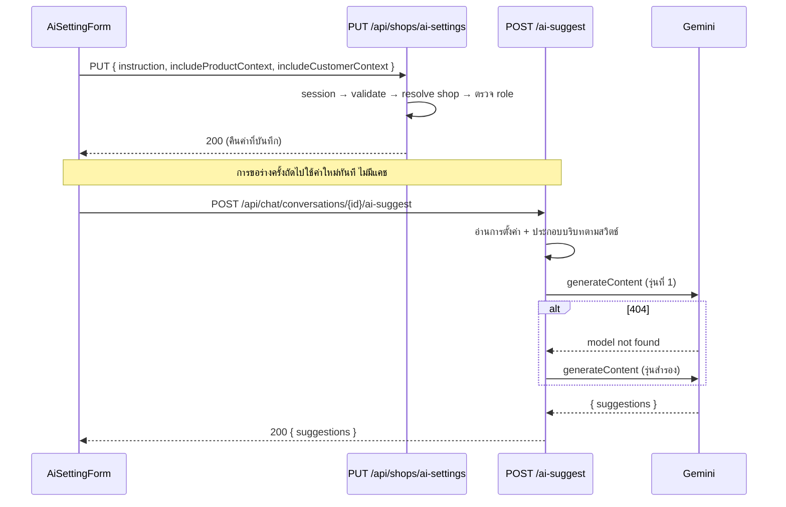

> **โมดูล:** M00019-AiReplyAssistant
> **ประเภทเอกสาร:** API Contract
> **เวอร์ชัน:** 1.0
> **วันที่จัดทำ:** 2026-07-23
> **สถานะ:** Draft — trace จาก [[SDS]] v1.0
> **เจ้าของเอกสาร:** SA (ดู [[Feature-Docs-Ownership]])

# API Contract: ผู้ช่วยร่างคำตอบ AI — บริบทร้าน

---

## 1. Overview

เอกสารนี้ระบุ contract ของ endpoint ที่เกี่ยวข้องกับฟีเจอร์ 00019 ทั้งหมด: endpoint ใหม่สำหรับการตั้งค่า AI ของร้าน และ endpoint เดิมของการขอร่างคำตอบที่ถูกขยายภายในโดยไม่เปลี่ยน contract ภายนอก

- Base URL (production): `https://seller.deepthailand.app`
- Base URL (development): `http://seller.deepth.local:4000` — ดูพอร์ตจริงจาก dev server ที่ผู้ใช้รัน
- รูปแบบข้อมูล: JSON ทั้ง request และ response
- ทุก endpoint ในเอกสารนี้เป็นข้อมูลรายผู้ใช้ ต้องประกาศ `export const dynamic = "force-dynamic"` และส่ง header `Cache-Control: private, no-store, max-age=0, must-revalidate`

---

## 2. Authentication

| รายการ | ค่า |
|--------|-----|
| กลไก | NextAuth.js session cookie (ตั้งโดยระบบ login เดิม) |
| Subdomain ที่ใช้ได้ | `seller.*` เท่านั้น (เป็นฟีเจอร์ฝั่งผู้ขาย) |
| การระบุร้าน | derive จาก session ผ่าน `resolveActiveShopContext` — **ห้ามรับ `shopId` จาก client** ในทุก endpoint |
| สิทธิ์อ่านการตั้งค่า | ผู้ที่เข้าถึงร้านได้ (`canAccessShop`) — OWNER / ADMIN / STAFF |
| สิทธิ์เขียนการตั้งค่า | OWNER และ ADMIN เท่านั้น |
| สิทธิ์ขอร่าง | ผู้ที่เข้าถึงเธรดของร้านที่ active ได้ |
| CSRF | ครอบด้วย Origin-check กลางของ `guardApi` ใน `src/proxy.ts` (mutation เท่านั้น) |

---

## 3. Endpoint List

| Method | Path | คำอธิบาย |
|--------|------|----------|
| GET | `/api/shops/ai-settings` | อ่านการตั้งค่า AI ของร้านที่ active |
| PUT | `/api/shops/ai-settings` | บันทึกการตั้งค่า AI ของร้านที่ active |
| POST | `/api/chat/conversations/{id}/ai-suggest` | ขอร่างคำตอบ 3 แบบ (มีอยู่แล้ว — contract ไม่เปลี่ยน) |

---

## 4. Endpoint Detail

### 4.1 `GET /api/shops/ai-settings`

อ่านการตั้งค่า AI ของร้านที่ session กำลังใช้งานอยู่ ถ้าร้านยังไม่เคยตั้งค่า จะคืนค่าเริ่มต้นโดยไม่สร้างแถวในฐานข้อมูล

**Request**

| ส่วน | ฟิลด์ | ชนิด | บังคับ | คำอธิบาย |
|------|-------|------|--------|----------|
| — | — | — | — | ไม่มี parameter — ร้านมาจาก session |

**Response 200**

| ฟิลด์ | ชนิด | คำอธิบาย |
|-------|------|----------|
| `instruction` | `string` | คำสั่งประจำร้าน ค่าว่างถ้ายังไม่เคยตั้ง |
| `includeProductContext` | `boolean` | ให้ AI เห็นข้อมูลสินค้าหรือไม่ (ค่าเริ่มต้น `true`) |
| `includeCustomerContext` | `boolean` | ให้ AI เห็นประวัติลูกค้าหรือไม่ (ค่าเริ่มต้น `true`) |
| `canEdit` | `boolean` | `true` เมื่อผู้เรียกเป็น OWNER/ADMIN — UI ใช้ตัดสินโหมดอ่านอย่างเดียว |
| `updatedAt` | `string \| null` | ISO timestamp ของการแก้ไขล่าสุด `null` ถ้ายังไม่เคยตั้ง |

```json
{
  "instruction": "ร้านขายอะไหล่มอเตอร์ไซค์แต่ง...",
  "includeProductContext": true,
  "includeCustomerContext": true,
  "canEdit": true,
  "updatedAt": "2026-07-23T09:15:00.000Z"
}
```

### 4.2 `PUT /api/shops/ai-settings`

**Request**

| ส่วน | ฟิลด์ | ชนิด | บังคับ | คำอธิบาย |
|------|-------|------|--------|----------|
| Body | `instruction` | `string` | yes | คำสั่งประจำร้าน ยาวไม่เกิน 2,000 ตัวอักษร ส่งค่าว่างเพื่อล้างได้ |
| Body | `includeProductContext` | `boolean` | yes | เปิด/ปิดบริบทสินค้า |
| Body | `includeCustomerContext` | `boolean` | yes | เปิด/ปิดบริบทลูกค้า |

```json
{
  "instruction": "ร้านขายอะไหล่มอเตอร์ไซค์แต่ง\nโทน: สุภาพ ลงท้ายครับ",
  "includeProductContext": true,
  "includeCustomerContext": false
}
```

**Response 200** — รูปแบบเดียวกับ §4.1 (คืนค่าที่บันทึกแล้ว เพื่อให้ client sync state ได้โดยไม่ต้องเรียก GET ซ้ำ)

**หมายเหตุ contract**
- ฟิลด์ทั้งสามเป็น full replace ไม่ใช่ partial patch — client ต้องส่งครบทุกครั้ง
- `instruction` ถูก trim ก่อนบันทึก
- `updatedByUserId` บันทึกจาก session ไม่รับจาก body

### 4.3 `POST /api/chat/conversations/{id}/ai-suggest`

Endpoint นี้มีอยู่แล้วจาก feature 00018 — ฟีเจอร์ 00019 **ไม่เปลี่ยน contract ภายนอก** เปลี่ยนเฉพาะเนื้อหาที่ระบบส่งเข้าไปยังผู้ให้บริการ AI ระบุไว้ที่นี่เพื่อความครบถ้วนของสัญญา

**Request**

| ส่วน | ฟิลด์ | ชนิด | บังคับ | คำอธิบาย |
|------|-------|------|--------|----------|
| Path Param | `id` | `string` (uuid) | yes | รหัสบทสนทนา ต้องเป็นของร้านที่ active |
| Body | — | — | no | ไม่มี body — บทสนทนาถูกอ่านฝั่ง server เสมอ (กันการยัด prompt จาก client) |

**Response 200**

| ฟิลด์ | ชนิด | คำอธิบาย |
|-------|------|----------|
| `suggestions` | `string[]` | ข้อความร่าง 1-3 รายการ เรียงตามที่ผู้ให้บริการเสนอ |

```json
{ "suggestions": ["ร่างที่ 1...", "ร่างที่ 2...", "ร่างที่ 3..."] }
```

**การเปลี่ยนแปลงภายในที่เกิดจากฟีเจอร์นี้ (ไม่กระทบ contract)**
- ข้อความชนิด `PRODUCT` ในบทสนทนาถูกแทนด้วยชื่อและราคาจริงก่อนส่งเข้า AI
- แนบบล็อกบริบทสินค้าและบริบทลูกค้าตามการตั้งค่าของร้าน
- แนบคำสั่งประจำร้านเป็นชั้นที่ 2 ของ system prompt

---

## 5. Error Code Table

| Error Code | HTTP Status | ความหมาย / เงื่อนไข |
|------------|-------------|---------------------|
| `unauthorized` | 401 | ไม่มี session — ใช้กับทุก endpoint ในเอกสารนี้ |
| `Invalid input` | 400 | payload ไม่ผ่าน Valibot เช่น `instruction` เกิน 2,000 ตัวอักษร หรือชนิดข้อมูลผิด |
| `ไม่มีสิทธิ์แก้ไขการตั้งค่านี้` | 403 | ผู้เรียกเป็น STAFF แต่เรียก PUT |
| `ไม่พบร้านที่กำลังใช้งาน` | 404 | `resolveActiveShopContext` คืน null (ร้านถูกลบ/หลุดสิทธิ์) |
| `รหัสบทสนทนาไม่ถูกต้อง` | 400 | `id` ไม่ใช่ uuid (เฉพาะ `ai-suggest`) |
| `ไม่พบบทสนทนานี้` | 404 | เธรดไม่มีอยู่ หรือไม่ใช่ของร้านที่ active (ไม่แยกสองกรณีเพื่อไม่ leak การมีอยู่) |
| `ใช้ AI ถี่เกินไป กรุณารอสักครู่` | 429 | เกิน 15 ครั้ง/นาที/ผู้ใช้ — มี header `Retry-After: 60` |
| `ยังไม่มีข้อความให้ AI ช่วยร่าง` | 400 | เธรดยังไม่มีข้อความที่เป็นข้อความจริง |
| `ระบบ AI ยังไม่พร้อมใช้งาน (ยังไม่ตั้งค่า)` | 503 | ไม่มี `GEMINI_API_KEY` ใน environment |
| `AI ไม่พร้อมใช้งานชั่วคราว ลองใหม่อีกครั้ง` | 502 | ผู้ให้บริการตอบผิดพลาดทุกรุ่นที่ลอง — มีฟิลด์ `detail` ระบุสถานะและรุ่นที่ลองไปแล้ว |
| `เกิดข้อผิดพลาด กรุณาลองใหม่อีกครั้ง` | 500 | ข้อผิดพลาดที่ไม่คาดคิด |

**หลักการของข้อความ error**
- ข้อความที่ผู้ใช้เห็นเป็นภาษาไทยและบอกสิ่งที่ทำต่อได้ ไม่ใช่รหัสดิบ
- ฟิลด์ `detail` ใช้เพื่อวินิจฉัยเท่านั้น ต้องไม่มี secret (กุญแจ API อยู่ใน query string ของการเรียกภายนอก ไม่อยู่ใน response body ของผู้ให้บริการ)

---

## 6. Sequence



---

## 7. Traceability

| Endpoint | SDS Component / Decision | BRD FR |
|----------|--------------------------|--------|
| `GET /api/shops/ai-settings` | `ai-setting.service.getAiSetting`, TD-002 | FR-001, FR-002, FR-003 |
| `PUT /api/shops/ai-settings` | `ai-setting.service.upsertAiSetting`, Flow 4.3 | FR-001, FR-002, FR-003 |
| `POST /api/chat/conversations/{id}/ai-suggest` | `ai-context.service`, `lib/gemini.ts`, TD-003..TD-007 | FR-004, FR-005, FR-006, FR-007, FR-009, FR-010 |

---

## 8. สรุป (Summary)

มี endpoint ใหม่เพียงคู่เดียว (`GET`/`PUT /api/shops/ai-settings`) และ endpoint เดิมของการขอร่างไม่เปลี่ยน contract ภายนอกเลย ทำให้ฝั่ง client ของแผง AI ไม่ต้องแก้เพื่อรองรับฟีเจอร์นี้ จุดที่ต้องระวังที่สุดคือ `shopId` ต้อง derive จาก session ทุก endpoint และสิทธิ์เขียนต้องตรวจฝั่งเซิร์ฟเวอร์เสมอ ไม่พึ่ง `canEdit` ที่ส่งไปให้ UI

schema ที่รองรับ contract นี้ดู [[DATABASE]] — ชุดทดสอบดู `Tests/00001-ai-shop-context.md`
