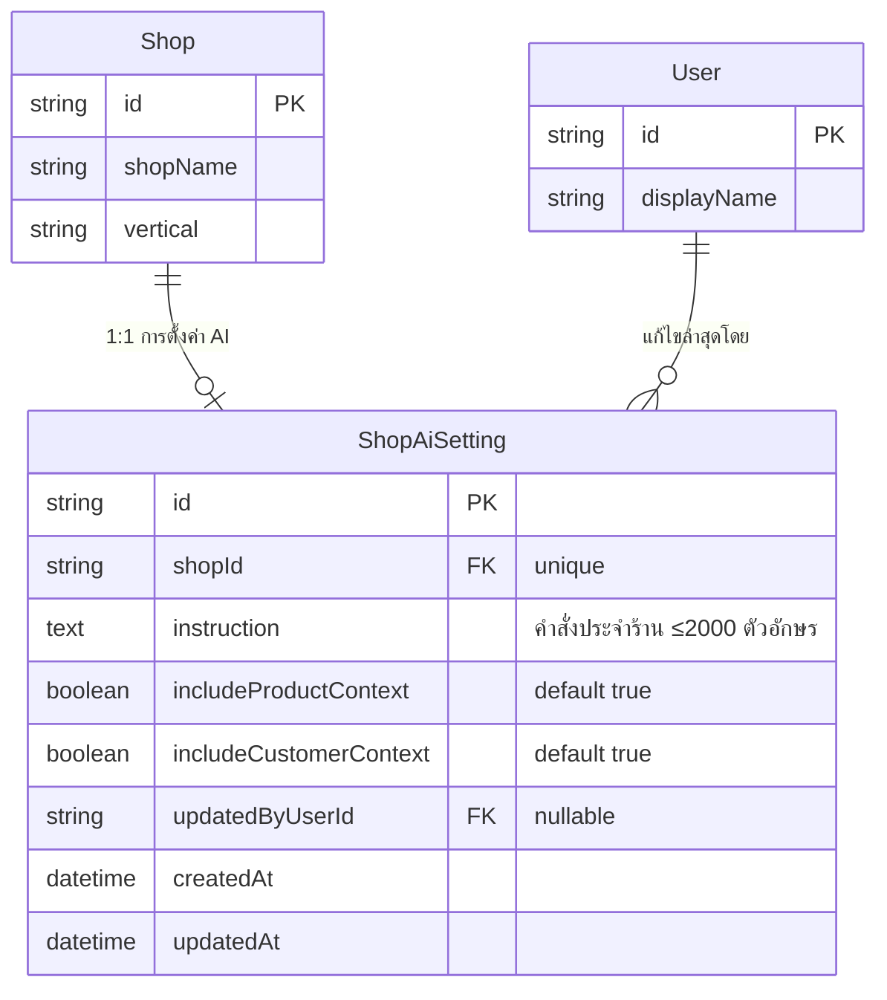
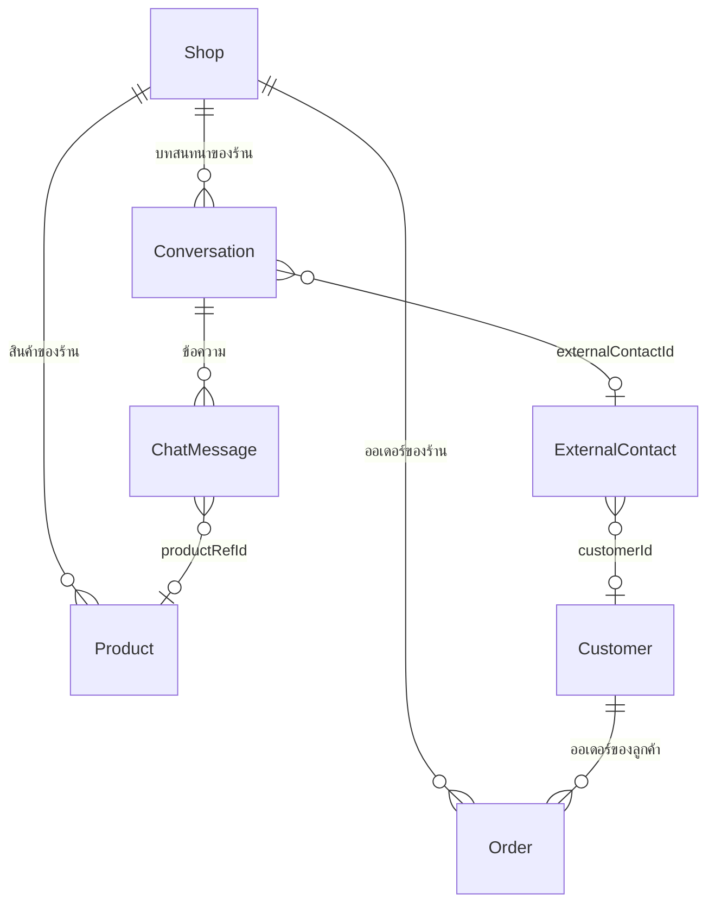

> **โมดูล:** M00019-AiReplyAssistant
> **ประเภทเอกสาร:** DATABASE Design
> **เวอร์ชัน:** 1.0
> **วันที่จัดทำ:** 2026-07-23
> **สถานะ:** Draft — trace จาก [[SDS]] v1.0
> **เจ้าของเอกสาร:** SA (ดู [[Feature-Docs-Ownership]])

# DATABASE: ผู้ช่วยร่างคำตอบ AI — บริบทร้าน

---

## 1. Overview

ฟีเจอร์นี้เพิ่มตารางใหม่เพียงตารางเดียวคือ `ShopAiSetting` ซึ่งเก็บการตั้งค่าผู้ช่วย AI ต่อร้าน ตารางอื่นทั้งหมด (`Product`, `Order`, `Customer`, `ExternalContact`, `Conversation`, `ChatMessage`) ถูกใช้แบบอ่านอย่างเดียว ไม่มีการเปลี่ยนโครงสร้าง

**ข้อควรระวังเฉพาะโปรเจกต์นี้:** ฐานข้อมูล development และ production เป็น instance เดียวกันบน Supabase และมี drift จาก migration ที่ไม่อยู่ใน git — **ห้ามใช้ `prisma migrate dev` เด็ดขาด** (จะ reset ฐานข้อมูลจริง) ต้องเขียนไฟล์ migration ด้วยมือแล้ว apply ด้วย `prisma migrate deploy -e .env.local` พร้อมขอยืนยันจากผู้ใช้ก่อนทุกครั้ง (ดู `docs/conventions/prisma-shared-db-drift.md`)

---

## 2. ERD



ตารางที่ถูกอ่านเพื่อประกอบบริบท (ไม่มีการแก้โครงสร้าง):



---

## 3. Tables

### 3.1 `ShopAiSetting` (PostgreSQL — Supabase)

| Column | Type | Null | Default | Key |
|--------|------|------|---------|-----|
| `id` | `text` (uuid) | no | `gen_random_uuid()` ผ่าน Prisma `@default(uuid())` | PK |
| `shopId` | `text` | no | — | FK → `Shop.id`, UNIQUE |
| `instruction` | `text` | yes | `NULL` | — |
| `includeProductContext` | `boolean` | no | `true` | — |
| `includeCustomerContext` | `boolean` | no | `true` | — |
| `updatedByUserId` | `text` | yes | `NULL` | FK → `User.id` |
| `createdAt` | `timestamp(3)` | no | `now()` | — |
| `updatedAt` | `timestamp(3)` | no | — (Prisma `@updatedAt`) | — |

**กฎระดับคอลัมน์**

- `shopId` UNIQUE บังคับความสัมพันธ์ 1:1 ที่ระดับฐานข้อมูล ไม่พึ่งวินัยของโค้ดอย่างเดียว
- `instruction` เป็น `text` (ไม่จำกัดความยาวที่ฐานข้อมูล) — เพดาน 2,000 ตัวอักษรบังคับที่ชั้น validation (Valibot) และตัดซ้ำอีกครั้งตอนประกอบ prompt เพื่อกันข้อมูลเก่าที่ยาวเกิน
- `updatedByUserId` เป็น nullable และใช้ `onDelete: SetNull` — การลบผู้ใช้ต้องไม่ลบการตั้งค่าของร้านทิ้ง
- ค่าเริ่มต้นของสวิตช์ทั้งสองเป็น `true` ตรงกับ BR-AI-04

**Prisma model ที่คาดหมาย**

```prisma
model ShopAiSetting {
  id                     String   @id @default(uuid())
  shopId                 String   @unique
  // คำสั่งประจำร้าน — เพดาน 2,000 ตัวอักษรบังคับที่ Valibot + ตัดซ้ำตอนประกอบ prompt
  instruction            String?
  includeProductContext  Boolean  @default(true)
  includeCustomerContext Boolean  @default(true)
  updatedByUserId        String?
  createdAt              DateTime @default(now())
  updatedAt              DateTime @updatedAt

  shop      Shop  @relation(fields: [shopId], references: [id], onDelete: Cascade)
  updatedBy User? @relation(fields: [updatedByUserId], references: [id], onDelete: SetNull)
}
```

---

## 4. Indexes

| Table | Columns | Type | Rationale (query pattern ที่รองรับ) |
|-------|---------|------|--------------------------------------|
| `ShopAiSetting` | `shopId` | UNIQUE | ทุกการอ่าน/เขียนเป็น lookup ด้วย `shopId` เดี่ยว ๆ (`findUnique` / `upsert`) — unique index ทำหน้าที่ทั้งบังคับ 1:1 และเป็น index ของ query หลัก |
| `Product` | `(shopId, isActive)` | ตรวจสอบว่ามีอยู่แล้วหรือไม่ ถ้าไม่มีให้เพิ่ม | รองรับการคัดสินค้าเปิดขายของร้านใน `buildProductContext` (TFR-004) |
| `Order` | `(shopId, customerId, createdAt)` | ตรวจสอบว่ามีอยู่แล้วหรือไม่ ถ้าไม่มีให้เพิ่ม | รองรับการดึงออเดอร์ล่าสุดของลูกค้ารายนั้นเฉพาะร้านนี้ (TFR-005) |

> หมายเหตุสำหรับผู้ลงมือ: ก่อนเพิ่ม index ใหม่ให้ตรวจ `schema.prisma` ปัจจุบันก่อน — ถ้ามี index ที่ครอบ query pattern เดียวกันอยู่แล้วห้ามเพิ่มซ้ำ เพราะ index ที่ไม่ได้ใช้มีต้นทุนตอนเขียนทุกครั้ง

---

## 5. Migration Plan

### 5.1 ลำดับการ Migrate

| ลำดับ | การเปลี่ยนแปลง | Submodule / Store | หมายเหตุ (dependency) |
|-------|----------------|-------------------|------------------------|
| 1 | `CREATE TABLE "ShopAiSetting"` + UNIQUE บน `shopId` + FK ไป `Shop` และ `User` | PostgreSQL (Supabase) | additive ล้วน ไม่มี dependency กับตารางอื่นนอกจาก FK; ไม่ล็อกตารางที่มีทราฟฟิก |
| 2 | (ถ้าจำเป็น) `CREATE INDEX` บน `Product(shopId, isActive)` และ `Order(shopId, customerId, createdAt)` | PostgreSQL | ทำเฉพาะเมื่อยังไม่มี — ใช้ `CREATE INDEX IF NOT EXISTS` และพิจารณา `CONCURRENTLY` ถ้าตารางใหญ่ |

**วิธี apply (บังคับ)**

1. เขียนไฟล์ `prisma/migrations/<timestamp>_shop_ai_setting/migration.sql` ด้วยมือ
2. อัปเดต `schema.prisma` ให้ตรงกับ SQL
3. `prisma generate` (ไม่ต้องต่อฐานข้อมูล)
4. ขอยืนยันจากผู้ใช้ก่อน apply เพราะฐานข้อมูลนี้คือ production
5. `prisma migrate deploy -e .env.local`
6. **restart dev server** หลัง migrate — Prisma client ที่ค้างอยู่จะทำให้ session พังตามบทเรียนเดิมของโปรเจกต์

### 5.2 Rollback

```sql
DROP TABLE IF EXISTS "ShopAiSetting";
```

- ปลอดภัย ไม่มีข้อมูลของระบบอื่นสูญหาย — ผลกระทบเดียวคือร้านที่เคยตั้งค่าไว้จะกลับไปใช้ค่าเริ่มต้น
- ถ้าเพิ่ม index ในขั้นที่ 2 ให้ `DROP INDEX IF EXISTS` ตามชื่อที่สร้าง
- โค้ดฝั่งแอปต้องทนต่อการที่ตารางหายได้ระดับหนึ่ง: `getAiSetting` ควรจับข้อผิดพลาดแล้วคืนค่าเริ่มต้น (สอดคล้อง TFR-009)

### 5.3 ผลกระทบ (Impact)

- **ข้อมูลเดิม:** ไม่ถูกแตะต้อง ไม่มี backfill
- **ประสิทธิภาพ:** เพิ่ม query 1 ครั้งต่อการขอร่างหนึ่งครั้ง (lookup ด้วย unique key) — ผลกระทบต่ำมาก
- **ขนาดข้อมูล:** สูงสุดประมาณ 2 KB ต่อร้าน โตตามจำนวนร้านแบบเชิงเส้น
- **downtime:** ไม่มี — เป็น DDL แบบสร้างตารางใหม่
- **ความเข้ากันได้ย้อนหลัง:** โค้ดเวอร์ชันเก่าที่ไม่รู้จักตารางนี้ยังทำงานได้ปกติ (ไม่มีใครอ่าน) ทำให้ deploy แบบ rolling ปลอดภัย

---

## 6. Retention / ข้อควรระวัง

- **ไม่เก็บบทสนทนาที่ส่งให้ AI ลงฐานข้อมูล** — prompt ถูกประกอบในหน่วยความจำแล้วส่งออกทันที ไม่มีการ log เนื้อหา เพื่อไม่ให้เกิดสำเนาบทสนทนาชุดที่สองที่ต้องดูแลตามกฎความเป็นส่วนตัว
- **ห้าม log ข้อความบริบทเต็ม** ในระบบ log — log ได้เฉพาะเมตาดาต้า เช่น ความยาวบริบท จำนวนสินค้าที่แนบ และรุ่นโมเดลที่ใช้
- `instruction` เป็นข้อความที่ร้านกรอกเอง ต้องถือเป็นข้อมูลที่ไม่น่าเชื่อถือเมื่อนำไปแสดงผลใน UI (escape ตามปกติของ React) และเมื่อประกอบ prompt ต้องห่อด้วยตัวคั่นที่ชัดเจน
- การลบร้าน (`Shop`) จะลบการตั้งค่าตามด้วย `onDelete: Cascade` — ตรงกับพฤติกรรมที่คาดหวังเพราะการตั้งค่าไม่มีความหมายเมื่อไม่มีร้าน
- ตาราง `ChatMessage` และ `Order` ที่ถูกอ่านเพื่อประกอบบริบท มีนโยบายเก็บรักษาของตัวเองอยู่แล้ว ฟีเจอร์นี้ไม่เปลี่ยนแปลง

---

## 7. Traceability

| Table / Collection | SDS Component / Decision | สถานะ |
|--------------------|--------------------------|-------|
| `ShopAiSetting` | TD-001 (แยกตาราง), TD-002 (lazy default), `ai-setting.service` | Draft |
| `Product` (อ่าน) | `ai-context.service.buildProductContext`, TFR-004 | Draft |
| `Order` + `Customer` + `ExternalContact` (อ่าน) | `ai-context.service.buildCustomerContext`, TD-004 (allow-list select) | Draft |
| `ChatMessage.productRefId` (อ่าน) | `ai-context.service` แปลงการ์ดสินค้า, TFR-003 | Draft |

---

## 8. สรุป (Summary)

การเปลี่ยนแปลงฐานข้อมูลของฟีเจอร์นี้มีเพียงตารางเดียวและเป็นแบบเพิ่มอย่างเดียว ทำให้ deploy และ rollback ตรงไปตรงมา ความเสี่ยงที่แท้จริงไม่ได้อยู่ที่ schema แต่อยู่ที่ **วิธี apply** — ฐานข้อมูลนี้เป็น production ที่ dev ใช้ร่วมกัน จึงต้องเขียน migration ด้วยมือ ใช้ `migrate deploy` เท่านั้น และขอยืนยันจากผู้ใช้ก่อนรันทุกครั้ง

contract ของ endpoint ที่ใช้ตารางนี้ดู [[API]] — การออกแบบ service ที่อ่าน/เขียนดู [[SDS]]
