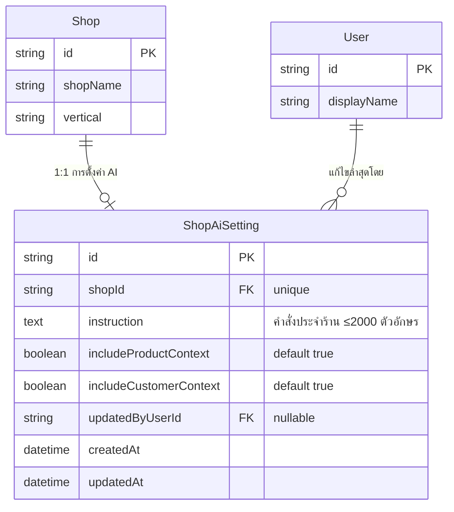
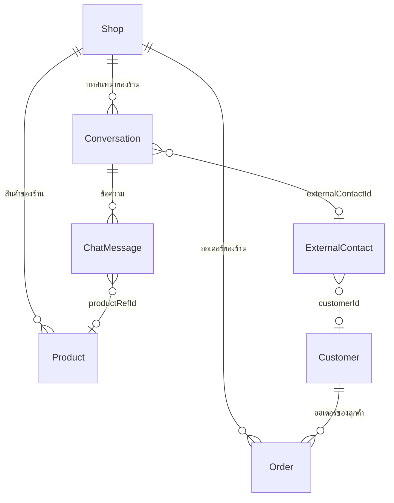

> **โมดูล:** M00019-AiReplyAssistant
> **ประเภทเอกสาร:** DATABASE Design
> **เวอร์ชัน:** 1.0
> **วันที่จัดทำ:** 2026-07-23
> **สถานะ:** Draft — trace จาก [[SDS]] v1.0
> **เจ้าของเอกสาร:** SA (ดู [[Feature-Docs-Ownership]])

# DATABASE: ผู้ช่วยร่างคำตอบ AI — บริบทร้าน

---

## 1. Overview

ฟีเจอร์นี้เพิ่มตารางใหม่ตารางแรกคือ `ShopAiSetting` ซึ่งเก็บการตั้งค่าผู้ช่วย AI ต่อร้าน (ส่วนขยาย Typhoon 2026-10-09 เพิ่มอีกตาราง `AiSuggestRun` — ดู §9) ตารางอื่นทั้งหมด (`Product`, `Order`, `Customer`, `ExternalContact`, `Conversation`, `ChatMessage`) ถูกใช้แบบอ่านอย่างเดียว ไม่มีการเปลี่ยนโครงสร้าง

**ข้อควรระวังเฉพาะโปรเจกต์นี้:** ฐานข้อมูล development และ production เป็น instance เดียวกันบน Supabase และมี drift จาก migration ที่ไม่อยู่ใน git — **ห้ามใช้ `prisma migrate dev` เด็ดขาด** (จะ reset ฐานข้อมูลจริง) ต้องเขียนไฟล์ migration ด้วยมือแล้ว apply ด้วย `prisma migrate deploy -e .env.local` พร้อมขอยืนยันจากผู้ใช้ก่อนทุกครั้ง (ดู `docs/conventions/prisma-shared-db-drift.md`)

---

## 2. ERD


```mermaid
erDiagram
    Shop ||--o| ShopAiSetting : "1:1 การตั้งค่า AI"
    User ||--o{ ShopAiSetting : "แก้ไขล่าสุดโดย"

    Shop {
        string id PK
        string shopName
        string vertical
    }

    ShopAiSetting {
        string id PK
        string shopId FK "unique"
        text instruction "คำสั่งประจำร้าน ≤2000 ตัวอักษร"
        boolean includeProductContext "default true"
        boolean includeCustomerContext "default true"
        string updatedByUserId FK "nullable"
        datetime createdAt
        datetime updatedAt
    }

    User {
        string id PK
        string displayName
    }
```

ตารางที่ถูกอ่านเพื่อประกอบบริบท (ไม่มีการแก้โครงสร้าง):


```mermaid
erDiagram
    Shop ||--o{ Product : "สินค้าของร้าน"
    Shop ||--o{ Order : "ออเดอร์ของร้าน"
    Shop ||--o{ Conversation : "บทสนทนาของร้าน"
    Conversation ||--o{ ChatMessage : "ข้อความ"
    ChatMessage }o--o| Product : "productRefId"
    Conversation }o--o| ExternalContact : "externalContactId"
    ExternalContact }o--o| Customer : "customerId"
    Customer ||--o{ Order : "ออเดอร์ของลูกค้า"
```

---

## 3. Tables

### 3.1 `ShopAiSetting` (PostgreSQL — Supabase)

| Column | Type | Null | Default | Key |
|--------|------|------|---------|-----|
| `id` | `text` (uuid) | no | `gen_random_uuid()` ผ่าน Prisma `@default(uuid())` | PK |
| `shopId` | `text` | no | — | FK → `Shop.id`, UNIQUE |
| `instruction` | `text` | yes | `NULL` | — |
| `includeProductContext` | `boolean` | no | `true` | — |
| `includeCustomerContext` | `boolean` | no | `true` | — |
| `updatedByUserId` | `text` | yes | `NULL` | FK → `User.id` |
| `createdAt` | `timestamp(3)` | no | `now()` | — |
| `updatedAt` | `timestamp(3)` | no | — (Prisma `@updatedAt`) | — |

**กฎระดับคอลัมน์**

- `shopId` UNIQUE บังคับความสัมพันธ์ 1:1 ที่ระดับฐานข้อมูล ไม่พึ่งวินัยของโค้ดอย่างเดียว
- `instruction` เป็น `text` (ไม่จำกัดความยาวที่ฐานข้อมูล) — เพดาน 2,000 ตัวอักษรบังคับที่ชั้น validation (Valibot) และตัดซ้ำอีกครั้งตอนประกอบ prompt เพื่อกันข้อมูลเก่าที่ยาวเกิน
- `updatedByUserId` เป็น nullable และใช้ `onDelete: SetNull` — การลบผู้ใช้ต้องไม่ลบการตั้งค่าของร้านทิ้ง
- ค่าเริ่มต้นของสวิตช์ทั้งสองเป็น `true` ตรงกับ BR-AI-04

**Prisma model ที่คาดหมาย**

```prisma
model ShopAiSetting {
  id                     String   @id @default(uuid())
  shopId                 String   @unique
  // คำสั่งประจำร้าน — เพดาน 2,000 ตัวอักษรบังคับที่ Valibot + ตัดซ้ำตอนประกอบ prompt
  instruction            String?
  includeProductContext  Boolean  @default(true)
  includeCustomerContext Boolean  @default(true)
  updatedByUserId        String?
  createdAt              DateTime @default(now())
  updatedAt              DateTime @updatedAt

  shop      Shop  @relation(fields: [shopId], references: [id], onDelete: Cascade)
  updatedBy User? @relation(fields: [updatedByUserId], references: [id], onDelete: SetNull)
}
```

---

## 4. Indexes

| Table | Columns | Type | Rationale (query pattern ที่รองรับ) |
|-------|---------|------|--------------------------------------|
| `ShopAiSetting` | `shopId` | UNIQUE | ทุกการอ่าน/เขียนเป็น lookup ด้วย `shopId` เดี่ยว ๆ (`findUnique` / `upsert`) — unique index ทำหน้าที่ทั้งบังคับ 1:1 และเป็น index ของ query หลัก |
| `Product` | `(shopId, isActive)` | ตรวจสอบว่ามีอยู่แล้วหรือไม่ ถ้าไม่มีให้เพิ่ม | รองรับการคัดสินค้าเปิดขายของร้านใน `buildProductContext` (TFR-004) |
| `Order` | `(shopId, customerId, createdAt)` | ตรวจสอบว่ามีอยู่แล้วหรือไม่ ถ้าไม่มีให้เพิ่ม | รองรับการดึงออเดอร์ล่าสุดของลูกค้ารายนั้นเฉพาะร้านนี้ (TFR-005) |

> หมายเหตุสำหรับผู้ลงมือ: ก่อนเพิ่ม index ใหม่ให้ตรวจ `schema.prisma` ปัจจุบันก่อน — ถ้ามี index ที่ครอบ query pattern เดียวกันอยู่แล้วห้ามเพิ่มซ้ำ เพราะ index ที่ไม่ได้ใช้มีต้นทุนตอนเขียนทุกครั้ง

---

## 5. Migration Plan

### 5.1 ลำดับการ Migrate

| ลำดับ | การเปลี่ยนแปลง | Submodule / Store | หมายเหตุ (dependency) |
|-------|----------------|-------------------|------------------------|
| 1 | `CREATE TABLE "ShopAiSetting"` + UNIQUE บน `shopId` + FK ไป `Shop` และ `User` | PostgreSQL (Supabase) | additive ล้วน ไม่มี dependency กับตารางอื่นนอกจาก FK; ไม่ล็อกตารางที่มีทราฟฟิก |
| 2 | (ถ้าจำเป็น) `CREATE INDEX` บน `Product(shopId, isActive)` และ `Order(shopId, customerId, createdAt)` | PostgreSQL | ทำเฉพาะเมื่อยังไม่มี — ใช้ `CREATE INDEX IF NOT EXISTS` และพิจารณา `CONCURRENTLY` ถ้าตารางใหญ่ |

**วิธี apply (บังคับ)**

1. เขียนไฟล์ `prisma/migrations/<timestamp>_shop_ai_setting/migration.sql` ด้วยมือ
2. อัปเดต `schema.prisma` ให้ตรงกับ SQL
3. `prisma generate` (ไม่ต้องต่อฐานข้อมูล)
4. ขอยืนยันจากผู้ใช้ก่อน apply เพราะฐานข้อมูลนี้คือ production
5. `prisma migrate deploy -e .env.local`
6. **restart dev server** หลัง migrate — Prisma client ที่ค้างอยู่จะทำให้ session พังตามบทเรียนเดิมของโปรเจกต์

### 5.2 Rollback

```sql
DROP TABLE IF EXISTS "ShopAiSetting";
```

- ปลอดภัย ไม่มีข้อมูลของระบบอื่นสูญหาย — ผลกระทบเดียวคือร้านที่เคยตั้งค่าไว้จะกลับไปใช้ค่าเริ่มต้น
- ถ้าเพิ่ม index ในขั้นที่ 2 ให้ `DROP INDEX IF EXISTS` ตามชื่อที่สร้าง
- โค้ดฝั่งแอปต้องทนต่อการที่ตารางหายได้ระดับหนึ่ง: `getAiSetting` ควรจับข้อผิดพลาดแล้วคืนค่าเริ่มต้น (สอดคล้อง TFR-009)

### 5.3 ผลกระทบ (Impact)

- **ข้อมูลเดิม:** ไม่ถูกแตะต้อง ไม่มี backfill
- **ประสิทธิภาพ:** เพิ่ม query 1 ครั้งต่อการขอร่างหนึ่งครั้ง (lookup ด้วย unique key) — ผลกระทบต่ำมาก
- **ขนาดข้อมูล:** สูงสุดประมาณ 2 KB ต่อร้าน โตตามจำนวนร้านแบบเชิงเส้น
- **downtime:** ไม่มี — เป็น DDL แบบสร้างตารางใหม่
- **ความเข้ากันได้ย้อนหลัง:** โค้ดเวอร์ชันเก่าที่ไม่รู้จักตารางนี้ยังทำงานได้ปกติ (ไม่มีใครอ่าน) ทำให้ deploy แบบ rolling ปลอดภัย

---

## 6. Retention / ข้อควรระวัง

- **ไม่เก็บบทสนทนาที่ส่งให้ AI ลงฐานข้อมูล** — prompt ถูกประกอบในหน่วยความจำแล้วส่งออกทันที ไม่มีการ log เนื้อหา เพื่อไม่ให้เกิดสำเนาบทสนทนาชุดที่สองที่ต้องดูแลตามกฎความเป็นส่วนตัว
  - **ข้อยกเว้น (extension chat-memory 2026-10-09):** เก็บ "ความจำของแชท" ได้ใน `ChatMemory` (§10) เป็นสรุปย่อหน้าเดียว ≤ 800 ตัวอักษร ที่ผ่านกฎ BR-MEM-03 (ห้ามมี PII) — ไม่ใช่ transcript และไม่ใช่ payload ที่ส่งไป AI · ยังห้ามเก็บ transcript/payload/ตารางป้ายเหมือนเดิม (BR-AIT-09)
- **ห้าม log ข้อความบริบทเต็ม** ในระบบ log — log ได้เฉพาะเมตาดาต้า เช่น ความยาวบริบท จำนวนสินค้าที่แนบ และรุ่นโมเดลที่ใช้
- `instruction` เป็นข้อความที่ร้านกรอกเอง ต้องถือเป็นข้อมูลที่ไม่น่าเชื่อถือเมื่อนำไปแสดงผลใน UI (escape ตามปกติของ React) และเมื่อประกอบ prompt ต้องห่อด้วยตัวคั่นที่ชัดเจน
- การลบร้าน (`Shop`) จะลบการตั้งค่าตามด้วย `onDelete: Cascade` — ตรงกับพฤติกรรมที่คาดหวังเพราะการตั้งค่าไม่มีความหมายเมื่อไม่มีร้าน
- ตาราง `ChatMessage` และ `Order` ที่ถูกอ่านเพื่อประกอบบริบท มีนโยบายเก็บรักษาของตัวเองอยู่แล้ว ฟีเจอร์นี้ไม่เปลี่ยนแปลง

---

## 7. Traceability

| Table / Collection | SDS Component / Decision | สถานะ |
|--------------------|--------------------------|-------|
| `ShopAiSetting` | TD-001 (แยกตาราง), TD-002 (lazy default), `ai-setting.service` | Draft |
| `Product` (อ่าน) | `ai-context.service.buildProductContext`, TFR-004 | Draft |
| `Order` + `Customer` + `ExternalContact` (อ่าน) | `ai-context.service.buildCustomerContext`, TD-004 (allow-list select) | Draft |
| `ChatMessage.productRefId` (อ่าน) | `ai-context.service` แปลงการ์ดสินค้า, TFR-003 | Draft |

---

## 8. สรุป (Summary)

การเปลี่ยนแปลงฐานข้อมูลของฟีเจอร์นี้มีเพียงตารางเดียวและเป็นแบบเพิ่มอย่างเดียว ทำให้ deploy และ rollback ตรงไปตรงมา ความเสี่ยงที่แท้จริงไม่ได้อยู่ที่ schema แต่อยู่ที่ **วิธี apply** — ฐานข้อมูลนี้เป็น production ที่ dev ใช้ร่วมกัน จึงต้องเขียน migration ด้วยมือ ใช้ `migrate deploy` เท่านั้น และขอยืนยันจากผู้ใช้ก่อนรันทุกครั้ง

contract ของ endpoint ที่ใช้ตารางนี้ดู [[API]] — การออกแบบ service ที่อ่าน/เขียนดู [[SDS]]

---

## 9. `AiSuggestRun` (extension Typhoon auto-suggest, 2026-10-09)

ตารางใหม่ 1 ตาราง แบบ additive ล้วน ไม่แตะตารางเดิม ไม่มี backfill · อ้างอิง `EXTENSIONS-2026-10-09-typhoon-auto-suggest.md` §9 + ภาคผนวก ก + Change Log (`firedAt`)
DDL จริงเป็นงานของ `safepay-database` (migration `<ts>_ai_suggest_run` = CREATE TABLE / CREATE INDEX / UNIQUE เท่านั้น — ห้ามมี ALTER/DROP) — เอกสารนี้คือสเปกที่ต้องตรงกับ `schema.prisma`

ทำ 3 หน้าที่ในตารางเดียว: (1) ผลล่าสุดของห้อง ให้เปิดห้องแล้วเห็นทันที (2) ตัวนับจังหวะ — ตัวนับ in-memory ใช้ข้าม instance บน serverless ไม่ได้ (3) สถิติ `outcome` ไว้ตัดสินใจย้ายออกจาก API ฟรี

```prisma
model AiSuggestRun {
  id               String   @id @default(uuid())
  shopId           String
  conversationId   String   // ไม่ใส่ FK ตามแบบ AiSuggestUsageEvent — log อยู่อิสระจากวงจรเธรด
  anchorMessageId  String   // ข้อความ BUYER ที่คำแนะนำนี้ตอบ
  attempt          Int      @default(1) // 1 = อัตโนมัติ · 2+ = กดขอใหม่
  trigger          String   // AUTO_NEW_MESSAGE | AUTO_OPEN | MANUAL
  status           String   // THINKING | READY | NONE
  outcome          String?  // OK | RATE_LIMITED | TIMEOUT | ERROR | UNRESOLVED_TOKEN | SKIPPED_NOT_BUYER | SKIPPED_BOT | SKIPPED_SPAM | SKIPPED_NOT_ALLOWED | SKIPPED_EMPTY (null ขณะ THINKING)
  suggestion       String?  // หลังคืนค่าจริงแล้ว — เก็บเพื่อแสดงผลเท่านั้น (BR-AIT-09)
  provider         String   // typhoon | gemini
  model            String?
  latencyMs        Int?
  inputTokens      Int?
  outputTokens     Int?
  firedAt          DateTime? // เวลาเริ่มยิงจริง (reserve-then-verify) — null = ยังไม่ได้สล็อต/ถูกล้างระหว่างรอคิว
  feedback         String?   // UP | DOWN (FR-AIT-20) — null = ยังไม่กด
  feedbackReason   String?   // WRONG_INFO | OFF_TOPIC | BAD_TONE | LENGTH — null ได้
  feedbackNote     String?   // ≤120 ตัวอักษร ผ่าน redactPii ก่อนบันทึก (BR-AIT-11)
  feedbackAt       DateTime?
  createdAt        DateTime @default(now())
  finishedAt       DateTime?

  @@unique([conversationId, anchorMessageId, attempt]) // claim แบบ idempotent (FR-AIT-13)
  @@index([createdAt])
  @@index([shopId, createdAt])
  @@index([conversationId, createdAt]) // GET ผลล่าสุดของห้อง
  @@index([firedAt])                   // pacing รวมทั้งระบบ
  @@index([shopId, firedAt])           // pacing ต่อร้าน
}
```

### Indexes

| Columns | Type | Query ที่รองรับ |
|---------|------|-----------------|
| `(conversationId, anchorMessageId, attempt)` | UNIQUE | claim (`createMany skipDuplicates`) + หา attempt สูงสุดของ anchor |
| `firedAt` | INDEX | นับจังหวะรวมทั้งระบบ (RPS/RPM) |
| `(shopId, firedAt)` | INDEX | นับจังหวะต่อร้าน (≤ RPM/2) |
| `(conversationId, createdAt)` | INDEX | `GET` ผลล่าสุดของห้อง |
| `createdAt`, `(shopId, createdAt)` | INDEX | สถิติ outcome ตามช่วงเวลา/ร้าน |

### ข้อควรระวัง

- **ไม่มีคอลัมน์เก็บ transcript/payload/ตารางป้าย** (BR-AIT-09) — ข้อความที่เก็บได้มีแค่ `suggestion` (หลังคืนค่าจริง) และ `feedbackNote` (หลัง `redactPii`) ซึ่งเป็นข้อยกเว้นของหลัก "ไม่เก็บบทสนทนาที่ส่งให้ AI" ใน §6 (ข้อยกเว้นอีกข้อคือ `ChatMemory` ใน §10) · แถว `trigger='MEMORY_UPDATE'` ไม่เก็บข้อความความจำ (`suggestion` เป็น null เสมอ)
- ไม่มี FK → ลบเธรดแล้วแถวค้าง (ตั้งใจ) · ค่า enum เป็น `String` ตาม convention ของโปรเจกต์ (sync รายการค่าไปที่ `docs/SRS.md`)
- **retention/ลบแถวเก่า ไม่อยู่ในรอบนี้** — เสนอเก็บ 30 วัน แต่การลบต้องขออนุมัติ user ก่อนเสมอ (OQ-8) ให้เป็นงานแยก
- **วิธี apply:** push `main` = `prisma migrate deploy` บน prod ในตัว (HR15) ก่อน migrate ต้องบอก user 3 ข้อ (prod ไม่ต้องสั่ง · local ต้อง apply เอง · migrate ล้ม = deploy ไม่ขึ้น) · local ใช้ `npm run db:local:migrate` ปักหมุด `localhost:5434` · **ห้าม** `migrate dev` / `db pull` / `migrate reset`
- Rollback: `DROP TABLE IF EXISTS "AiSuggestRun";` (เสียเฉพาะผลที่แคชและสถิติ ไม่กระทบตารางอื่น) — ต้องขออนุมัติก่อนรันเสมอ

---

## 10. `ChatMemory` + `ChatInterestedProduct` (extension chat-memory, 2026-10-09)

ตารางใหม่ 2 ตาราง additive ล้วน ไม่แตะตารางเดิม ไม่มี backfill · อ้างอิง `EXTENSIONS-2026-10-09-chat-memory.md` §9 · migration ตามแผน `20261009200000_chat_memory` (CREATE TABLE / INDEX / UNIQUE / FK เท่านั้น — ห้าม ALTER/DROP ตารางเดิม) · `schema.prisma` เพิ่มเฉพาะ back-relation ฝั่ง `Conversation`/`Product` (ไม่มีคอลัมน์ใหม่ในตารางเดิม) · สถานะ: สเปกก่อนเขียนโค้ด — DDL จริงเป็นงาน `safepay-database` ต้องตรงกับเอกสารนี้

```prisma
// ความจำของแชท — ย่อหน้าเดียวต่อห้อง ไม่ใช่ transcript (ข้อยกเว้นของ §6, BR-MEM-03)
// ห้ามเก็บที่ Customer (ตารางข้ามร้าน) — ใช้ร่วมใน cluster ด้วยการอ่านหา "แถวจริง" (BR-MEM-06)
model ChatMemory {
  id               String    @id @default(uuid())
  shopId           String
  conversationId   String    @unique
  text             String    @default("") @db.Text // ≤ 800 บังคับที่ Valibot + service
  source           String    @default("AI")        // AI | ADMIN — ผู้เขียนล่าสุด
  version          Int       @default(1)           // compare-and-set (FR-MEM-05/06)
  basedOnMessageId String?                         // ข้อความล่าสุดที่รวมอยู่แล้ว (ฐานรอบถัดไป)
  previousText     String?   @db.Text              // ข้อความก่อนหน้า 1 เวอร์ชัน (กู้คืน)
  updatedByUserId  String?                         // ผู้แก้ล่าสุดถ้า source=ADMIN
  aiUpdatedAt      DateTime?                       // ฐานของ cooldown 120 วิ (ร่วมกับแถว MEMORY_UPDATE ล่าสุด — P-3)
  createdAt        DateTime  @default(now())
  updatedAt        DateTime  @updatedAt

  conversation Conversation @relation(fields: [conversationId], references: [id], onDelete: Cascade)

  @@index([shopId, updatedAt])
}

// สินค้าที่แอดมินแปะไว้กับห้อง — เก็บ id + ชื่อ snapshot + ป้ายตัวเลือก; ไม่เก็บราคา/สต็อก (ดึงสดตอนใช้)
model ChatInterestedProduct {
  id              String   @id @default(uuid())
  shopId          String
  conversationId  String
  productId       String?  // SetNull เมื่อสินค้าถูกลบ → state DELETED
  productName     String   // snapshot ณ ตอนแปะ
  optionLabel     String   @default("") // "สี ครีม · ขนาด L" server ประกอบจาก Product.attributes ; '' = ไม่มีตัวเลือก
  createdByUserId String
  createdAt       DateTime @default(now())

  conversation Conversation @relation(fields: [conversationId], references: [id], onDelete: Cascade)
  product      Product?     @relation(fields: [productId], references: [id], onDelete: SetNull)

  @@unique([conversationId, productId, optionLabel]) // productId NULL ไม่ชนกัน (ยอมรับ)
  @@index([shopId, conversationId])
}
```

### Indexes

| Columns | Type | Query ที่รองรับ |
|---------|------|-----------------|
| `ChatMemory.conversationId` | UNIQUE | 1 แถวต่อห้อง · `createMany skipDuplicates` |
| `ChatMemory (shopId, updatedAt)` | INDEX | หาแถวจริงของ cluster (`updatedAt` ใหม่สุด) |
| `ChatInterestedProduct (conversationId, productId, optionLabel)` | UNIQUE | กันแปะซ้ำ → 409 |
| `ChatInterestedProduct (shopId, conversationId)` | INDEX | list ต่อห้อง/cluster |

### ค่าใหม่ของ `AiSuggestRun` (ไม่เปลี่ยนโครงตาราง §9)

- `trigger = 'MEMORY_UPDATE'` · `anchorMessageId = 'mem:<id ข้อความล่าสุดในฐาน>'` · `attempt = 1` · `provider = 'typhoon'` · `suggestion = null` เสมอ · `status`: OK → `READY`, อื่น ๆ → `NONE`
- `outcome` เพิ่ม: `SUPERSEDED`, `REJECTED_PII`, `REJECTED_FORMAT`, `REJECTED_SHRINK`, `SKIPPED_BASE_HAS_PII` (อีก 2 ค่า `SKIPPED_COOLDOWN`/`SKIPPED_FEW_MESSAGES` เป็นค่าคืนของฟังก์ชัน ไม่เขียนแถว — P-4) · ใช้ค่าเดิมร่วม: `OK`, `RATE_LIMITED`, `TIMEOUT`, `ERROR`
- ค่าคงที่แยกเป็น `MEMORY_UPDATE_TRIGGER` / `MEMORY_UPDATE_OUTCOMES` ใน `src/lib/ai-suggest-auto-types.ts` — **ห้ามเพิ่มเข้า** `AUTO_SUGGEST_TRIGGERS`/`AUTO_SUGGEST_OUTCOMES` (`AutoSuggestReason` derive จากมันและถูกส่งถึง client) · `getLatestAutoSuggest` กรองด้วย `anchorMessageId` ของข้อความล่าสุด จึงไม่ปนกับแถว `mem:`

### ข้อควรระวัง

- `ChatMemory.text` เป็นข้อมูลส่วนบุคคลที่ AI สรุปและเก็บถาวร (R-M2) · ลบห้อง = ลบความจำ (cascade) · แอดมินล้างข้อความได้ทันที · **retention/ตัวลบแถวเก่า ไม่อยู่ในรอบนี้** การลบต้องขออนุมัติ user ก่อน (OQ-M9) · ✕ ของสินค้าที่สนใจเป็นการลบโดยผู้ใช้สั่งเท่านั้น
- ไม่มีคอลัมน์ราคา/สต็อกใน `ChatInterestedProduct` (ตรวจ schema ได้)
- `previousText` อาจมีข้อความที่แอดมินพิมพ์ → ส่งเฉพาะ GET/PUT ที่ผ่านสิทธิ์ห้อง ห้าม log
- ทุก query ต้องมี `shopId` ใน WHERE · cluster ขยายด้วย `expandClusters` เท่านั้น
- **วิธี apply:** เหมือน §9 (HR15 แจ้ง 3 ข้อก่อน push `main` · local `npm run db:local:migrate` ปักหมุด `localhost:5434` · ห้าม `migrate dev`/`db pull`/`migrate reset`)
- Rollback: `DROP TABLE IF EXISTS "ChatInterestedProduct"; DROP TABLE IF EXISTS "ChatMemory";` (เสียความจำและสินค้าที่แปะ) — ต้องขออนุมัติก่อนรันเสมอ
