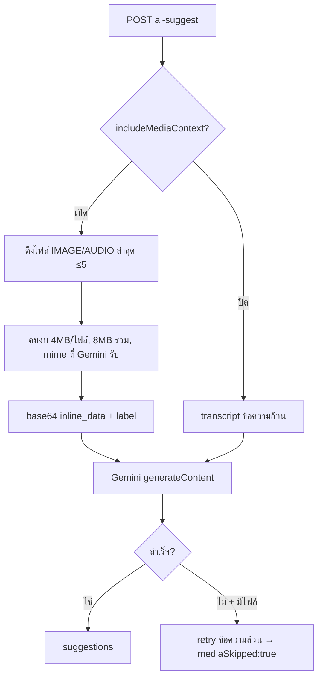

# 00019 — Extension: AI อ่านรูป + ถอดข้อความเสียง (2026-07-24)

> back-fill (doc-first debt) ของ extension ที่ให้ AI ช่วยร่างคำตอบ "เห็นรูปจริง + ถอดข้อความเสียง"
> แทนการเห็นแค่ placeholder `[ส่งรูปภาพ]`. ต่อยอดจาก AI Reply Assistant (Gemini).

---

## Requirement (PRD/SRS)

**Goal:** เวลาลูกค้าส่งรูป (สลิปโอนเงิน/ที่อยู่/รูปสินค้า) หรือข้อความเสียงเข้ามา AI ต้องอ่าน/ถอดเสียง
มาช่วยร่างคำตอบให้แอดมิน — เดิม AI เห็นแค่ `[ส่งรูปภาพ]` และ AUDIO ไม่ถูก handle เลย

| FR | ข้อกำหนด | Acceptance |
|---|---|---|
| FR-AIM-01 | ส่งไฟล์รูป/เสียงจริงในแชทเข้า Gemini แบบ inline (base64) เพื่อให้ AI ดู/ถอดเสียง | AI ร่างคำตอบอ้างเนื้อหาในรูป/เสียง |
| FR-AIM-02 | สวิตช์เปิด/ปิดต่อร้าน (`includeMediaContext`, default เปิด) ในหน้าตั้งค่า AI พร้อมคำเตือน PII | ปิด → AI เห็นแค่ "[ส่งรูป/เสียง]" (พฤติกรรมเดิม) |
| FR-AIM-03 | คุมงบ: ≤5 ไฟล์ล่าสุด, ไฟล์เดี่ยว ≤4MB, รวม ≤8MB (Gemini เพดาน inline 20MB), เฉพาะ mime ที่ Gemini รับ | เกินงบ → ข้ามไฟล์นั้น |
| FR-AIM-04 | fail-soft: ถ้า Gemini พลาดตอนมีไฟล์แนบ → retry แบบข้อความล้วน (คืน `mediaSkipped:true`) | ผู้ใช้ยังได้ร่างคำตอบ ไม่เห็น error เปล่า |
| FR-AIM-05 | prompt ห้าม AI อ่านเลขบัตร/OTP ที่เห็นในรูปออกมาในคำตอบ; ห้ามเดาสิ่งที่มองไม่ชัด | — |

## Business Rules / Privacy

- **BR-AIM-01** เปิดสวิตช์ = ไฟล์จากลูกค้าถูกส่งเข้า Gemini **ทั้งไฟล์** ซึ่งอาจมี PII (เบอร์/ที่อยู่ในรูป)
  — **ต่างจากบริบทข้อความ** ที่กรอง PII (เบอร์/อีเมล/ที่อยู่ในระบบ) ออกก่อน. จึงแยกเป็นสวิตช์ให้ร้าน
  ตัดสินใจ (user approve 2026-07-24; overrides กฎเดิม "ห้ามส่ง PII เข้า AI" เฉพาะไฟล์ที่ร้านเลือกเปิด)
- **BR-AIM-02** ส่งเฉพาะ mime ที่ Gemini รับ inline: image png/jpeg/webp/heic/heif; audio wav/mp3/aiff/
  aac/ogg/flac. ข้อความเสียง Messenger เป็น Opus-in-ogg → ส่งเป็น `audio/ogg` (ตรวจจริง: ถอดได้)

## Data Model (DATABASE)

```prisma
model ShopAiSetting {
  // ...
  includeMediaContext  Boolean @default(true)  // ส่งรูป/เสียงในแชทเข้า AI (user 2026-07-24)
}
```
- migration: `prisma/migrations/20260724100000_ai_setting_media_context/migration.sql` (additive, DEFAULT true)
- **applied บน Supabase (dev/prod shared) แล้ว**

## API

**`POST /api/chat/conversations/{id}/ai-suggest`** — เมื่อ `includeMediaContext=true`:
- ดึงไฟล์ IMAGE/AUDIO ล่าสุด (≤5, ≤4MB/ไฟล์, รวม ≤8MB) จาก storage → base64 → แนบเป็น inline media
- Gemini request: `contents[].parts` = transcript + คู่ (label + `inline_data{mime_type,data}`) ต่อไฟล์
- fail-soft: Gemini พลาด + มีไฟล์ → retry ข้อความล้วน → `{ suggestions, mediaSkipped: true }`

## Design (SDS)



- `lib/gemini.ts`: `SuggestMedia` type + `parts` แนบ inline media + `hasMedia` prompt + timeout
  15s→45s เฉพาะคำขอที่มีไฟล์
- `lib/attachment-mime.ts`: `EXT_TO_MIME` ใช้ resolve mime ของไฟล์ที่เก็บ

## Verify (จริง ไม่ใช่แค่ tsc)

- **รูป:** ส่งรูปในระบบเข้า Gemini → อ่านออก ("ล้อหน้ารถจักรยานยนต์ ขอบล้อซี่ลวดสีทอง ดรัมเบรก")
- **เสียง:** ดึง voice จริงจาก Meta (`audio/opus`, magic `OggS`) ส่ง `audio/ogg` → ถอดได้
  "สวัสดีครับ มีรุ่นไหนบ้างครับ" (docs Google ไม่ระบุ opus ในลิสต์ แต่ทดสอบผ่าน → มี fallback)

## Test Cases

| TC | คาดหวัง |
|---|---|
| TC-AIM-01 | สวิตช์เปิด + มีรูป | AI ร่างคำตอบอ้างเนื้อหาในรูป |
| TC-AIM-02 | สวิตช์เปิด + ข้อความเสียง | AI ถอดเสียงมาตอบ |
| TC-AIM-03 | สวิตช์ปิด | AI เห็นแค่ "[ส่งรูป/เสียง]" (พฤติกรรมเดิม) |
| TC-AIM-04 | ไฟล์เกินงบ/mime ไม่รองรับ | ข้ามไฟล์ ไม่พัง |
| TC-AIM-05 | Gemini ปฏิเสธไฟล์ | retry ข้อความล้วน → ได้ร่างคำตอบ + mediaSkipped:true |

## Carry

- ยังไม่ได้ browser QA (worktree ไม่มี dev server) — user เทสบน prod
- ยังไม่เขียน test case ลง `Tests/` เป็นไฟล์แยก (สรุปไว้ในนี้ก่อน)
