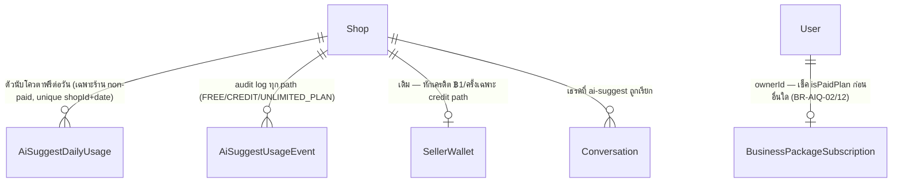
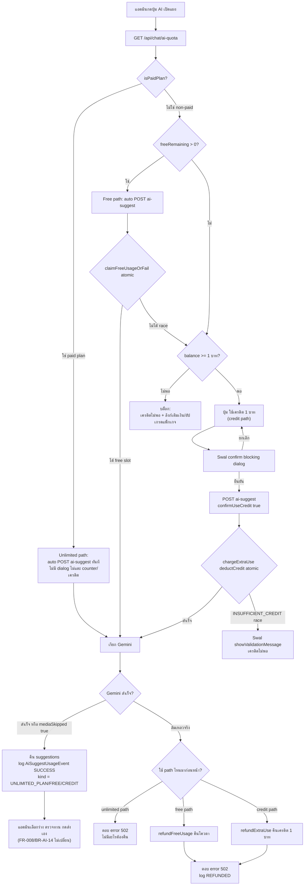

# 00019 — Extension: AI Suggestion Usage Limit & Credit (2026-07-29)

> ต่อยอด **AI Reply Assistant** (Gemini, feature 00019) — เพิ่มโควตาฟรีรายวัน + ทางเลือก "ซื้อเพิ่มด้วยเครดิต"
> เพื่อคุมต้นทุน Gemini API และเปิดช่องทาง upsell ให้ร้านที่ใช้งานหนักอัปเกรดเป็น paid plan.
> มติทั้งหมดถูกล็อกโดย user แล้ว (2026-07-29) — เอกสารนี้เป็นฉบับ final พร้อม implement ไม่ใช่ draft สำหรับถามต่อ.
>
> **หมายเหตุคำศัพท์ (สำคัญ — ป้องกันสับสน):** เอกสารนี้ใช้ 3 คำแยกกันตลอดทั้งไฟล์ ห้ามใช้ปนกัน —
> **"unlimited path"** (ร้าน paid plan — ไม่จำกัด ไม่แตะ counter/เครดิต), **"free path"** (ร้าน non-paid
> ที่ยังไม่ครบโควตาฟรี), **"credit path"** (ร้าน non-paid ที่ครบโควตาฟรีแล้วและเลือกจ่ายด้วยเครดิต).
> **"paid plan"** หมายถึงสถานะ subscription (`BusinessPackageSubscription.status === "ACTIVE"`) เท่านั้น
> — ไม่ใช่ชื่อเรียก credit path

---

## Requirement (PRD/SRS)

### Context / เหตุผล

AI Reply Assistant (`POST /api/chat/conversations/{id}/ai-suggest`) ปัจจุบันมีเพดานเดียวคือ **rate limit 15
ครั้ง/นาที/ผู้ใช้** (BR-AI-17, TFR-010 ใน [[SRS]]) — กันการกดรัวระยะสั้น แต่ไม่มีเพดาน **ต่อวัน** จึงไม่คุมต้นทุน
Gemini รวมของร้านที่แอดมินหลายคนใช้งานหนักทั้งวัน. ขณะเดียวกันโมเดลธุรกิจของ Deep คือ **Free core + ขายฟังก์ชัน
ช่วยเหลือแบบ à la carte** (`docs/PRD.md` §1.2/§6) — ฟีเจอร์นี้จึงเป็นทั้ง **cost control** (จำกัดการใช้ฟรี) และ
**upsell hook** สองชั้น: (1) ร้าน paid plan (Business Package, สมัครอยู่แล้วด้วยเหตุผลอื่น) ได้สิทธิ์ **AI ช่วย
ร่างคำตอบแบบไม่จำกัด** เป็นของแถมที่จับต้องได้ทันที (แรงจูงใจอัปเกรดที่ชัดเจนขึ้น), (2) ร้าน Free ที่ใช้เกิน
โควตาฟรีทุกวันเห็นทางเลือกทั้ง "จ่ายเป็นครั้ง ๆ ด้วยเครดิต" และ "อัปเกรดให้ไม่จำกัดไปเลย" — โดยไม่ปิดประตูให้ร้าน
Free ใช้งานเลย (10 ครั้ง/วันแรกยังฟรีเท่าเดิม).

### ความสัมพันธ์กับ FR/BR เดิมของ 00019

| อ้างอิงเดิม | เนื้อหา | ผลกระทบจาก extension นี้ |
|---|---|---|
| **FR-008** (BRD §2.3) "คนต้องเป็นผู้ตัดสินใจส่ง" | ร่างที่ AI เสนอต้องถูกวางในช่องพิมพ์เท่านั้น ห้ามส่งอัตโนมัติ | ไม่กระทบ — extension นี้เพิ่ม gate **ก่อน** เรียก Gemini เท่านั้น ไม่แตะพฤติกรรม "แอดมินเป็นคนกดส่งเอง" ที่ `AiSuggestPanel` ทำอยู่แล้ว |
| **BR-AI-14** (BRD §8.3) "ทุกข้อความต้องผ่านการกดส่งโดยคนเสมอ" | เหมือนบน | เหมือนบน — โควตา/เครดิตควบคุมแค่ "ขอร่างได้ไหม" ไม่เกี่ยวกับ "ส่งได้ไหม" |
| **BR-AI-16** (BRD §8.4) "ความล้มเหลวของบริบทส่วนใดส่วนหนึ่งต้องไม่ทำให้การขอร่างล้มเหลวทั้งหมด" (= TFR-009 fail-soft) | context builder (สินค้า/ลูกค้า) แยก try-catch คนละก้อน | **extension นี้ตั้งใจ "ไม่" ใช้หลัก fail-soft เดียวกันกับ quota-check gate** — ดู BR-AIQ-08 (fail-closed) ซึ่งเป็นข้อยกเว้นที่บันทึกไว้ชัดเจน เพราะ context ล้มเหลว = คุณภาพร่างลดลง (safe to degrade) แต่ quota/paid-plan-check ล้มเหลว = เสี่ยงปล่อยใช้ไม่จำกัดหรือเก็บเงินผิด (ห้าม degrade) |
| **BR-AI-17** (BRD §8.4) / TFR-010 (SRS §3) "จำกัด 15 ครั้ง/นาที/ผู้ใช้" | rate limit เดิม ยังคงอยู่ทุกประการ ไม่ถูกแทนที่ | เพดานใหม่ (รายวัน/ต่อร้าน) เป็นเงื่อนไข**เพิ่มเติม** ที่ทำงานคู่ขนาน — request ต้องผ่าน**ทั้งสอง**เงื่อนไข เสมอ **รวมถึงร้าน unlimited path ด้วย** (ดู BR-AIQ-11/12) — 15/นาที ไม่ได้ถูกยกเว้นให้ paid plan |

---

## FR (Functional Requirements) — FR-AIQ

| FR | ข้อกำหนด | Acceptance |
|---|---|---|
| FR-AIQ-01 | นับจำนวนครั้งที่ขอร่าง (`ai-suggest` สำเร็จ) ต่อ **ร้าน (Shop)** ต่อ **วันปฏิทินไทย** (Asia/Bangkok, เริ่มนับใหม่เที่ยงคืนเวลาไทย) — **เฉพาะร้านที่ไม่ใช่ paid plan** เท่านั้น ร้าน paid plan ไม่ถูกนับ/ไม่ถูกแตะตัวนับนี้เลย (ดู FR-AIQ-02) | ร้าน paid plan ใช้ 50 ครั้งในวันเดียว → ไม่มีแถว/ค่าใน `AiSuggestDailyUsage` ถูกสร้างหรือเปลี่ยนแปลงจาก request เหล่านั้นเลย |
| FR-AIQ-02 | ร้านที่ owner มี **paid plan** (`BusinessPackageSubscription.status === "ACTIVE"`, ทุก tier) ใช้ `ai-suggest` ได้ **ไม่จำกัดจำนวนครั้ง/วัน** — bypass ทั้งตัวนับโควตาและการหักเครดิตตั้งแต่ต้น **ไม่มี dialog ยืนยันใด ๆ ปรากฏเลย** (นี่คือสิทธิ์ที่จ่ายเงินไปแล้ว ต้องไม่ถูกขัดจังหวะ) | ร้าน paid plan กดขอร่างครั้งที่เท่าไรก็ได้ในวันเดียวกัน → สำเร็จทันทีทุกครั้งโดยไม่มี dialog, ไม่มีการหักเครดิต, ไม่มีการอ่าน/เขียน `AiSuggestDailyUsage` |
| FR-AIQ-03 | ร้านที่ **ไม่ใช่** paid plan ได้ **10 ครั้งแรกของวันฟรี** (ครั้งที่ 10 ยังฟรี) — ครั้งที่ 11 เป็นต้นไปของวันเดียวกัน: **ถ้ามีเครดิตในกระเป๋าเงิน ≥ ฿1** ต้องถามยืนยันก่อนหักเครดิต ฿1/ครั้ง (credit path); **ถ้าเครดิตไม่พอ** ให้บล็อกทันทีพร้อมทางเลือก "เติมเงิน" หรือ "อัปเกรดแพ็กเกจ (ใช้ไม่จำกัด)" | ร้าน Free ครั้งที่ 11 + มีเครดิต ≥ ฿1 → เห็น prompt ยืนยันหักเครดิต; ร้าน Free ครั้งที่ 11 + เครดิต < ฿1 → บล็อกทันที ไม่มี prompt ยืนยัน (จ่ายไม่ได้อยู่แล้ว) |
| FR-AIQ-04 | ก่อนหักเครดิตทุกครั้ง (เฉพาะ credit path ตาม FR-AIQ-03) ต้องได้รับ explicit confirm จากผู้ใช้ผ่าน blocking dialog — ห้ามหักเครดิตอัตโนมัติโดยผู้ใช้ไม่รู้ตัว | ไม่มี network call ที่หักเครดิตเกิดขึ้นก่อนผู้ใช้กดยืนยันใน dialog |
| FR-AIQ-05 | มี endpoint แยกให้ frontend เช็คสถานะโควตา/เครดิตล่วงหน้า **ก่อน** ตัดสินใจว่าจะเข้า unlimited path / free path / ถาม credit-confirm / บล็อก (`GET /api/chat/ai-quota`) | เปิดแผง AI แล้วเห็น state ที่ถูกต้องตามสถานะจริงโดยไม่ต้องลองยิง `ai-suggest` ก่อนแล้วค่อย error |
| FR-AIQ-06 | เมื่อการขอร่างล้มเหลวจริง (Gemini error ที่ retry แล้วยังพัง) ระบบต้องคืนสิทธิ์ที่ใช้ไป — คืนโควตาฟรี (free path) หรือคืนเครดิต ฿1 (credit path) ยกเว้นกรณี `mediaSkipped:true` ซึ่งถือว่าสำเร็จ. **unlimited path ไม่มีอะไรต้องคืน** เพราะไม่เคยถูกนับ/หักตั้งแต่ต้น | จำลอง Gemini ล้มเหลวทั้งสองรุ่นในเส้นทาง free/credit → ตัวนับ/ยอดเครดิตกลับเป็นค่าก่อนกดปุ่ม; จำลองเดียวกันในเส้นทาง unlimited (paid plan) → ไม่มีอะไรให้คืนเพราะไม่มีอะไรถูกใช้ไปตั้งแต่ต้น |
| FR-AIQ-07 | การตรวจ/หักโควตาและเครดิตต้องเป็น **atomic conditional update** กันการใช้เกินโควตาจาก concurrent request (เช่น พนักงาน 2 คนกดพร้อมกันตอนเหลือ 1 free slot) — ใช้กับ free path และ credit path เท่านั้น (unlimited path ไม่มี shared state ให้แข่ง) | ยิง 2 request พร้อมกัน (ร้าน non-paid, `count = 9`) → มีแค่ 1 คำขอได้ free slot ที่ 10 จริง อีกคำขอตกไปเส้นทางถัดไป |
| FR-AIQ-08 | ถ้า query ที่เกี่ยวกับ gate นี้ล้มเหลว (DB error/timeout) — **ทั้งการ resolve สถานะ paid plan และการ query ตัวนับโควตา** — ระบบต้อง **fail-closed**: ปฏิเสธการขอร่างครั้งนั้นพร้อม error message ทั่วไป **ห้าม default เป็น unlimited/ปล่อยผ่านฟรีเมื่อเช็คสถานะ paid plan ไม่ได้** | จำลอง DB error ตอน query `AiSuggestDailyUsage` **หรือ** ตอน query `BusinessPackageSubscription` → response เป็น error (ไม่ใช่ 200 ที่มี suggestions) ทั้งสองกรณี |
| FR-AIQ-09 | **หน้า `/settings/ai` — gate การตั้งค่าบริบท AI ตามแพ็กเกจ (user 2026-07-29):** ร้าน **non-paid** ต้องเห็นสวิตช์ทั้ง 3 (`includeProductContext` / `includeCustomerContext` / `includeMediaContext`) อยู่ในสถานะ **disabled** (กดไม่ได้) และมี **badge ท้ายหัวข้อของแต่ละสวิตช์** ที่กดแล้วพาไปหน้าอัปเกรดแพ็กเกจ (`/business`). ร้าน **paid plan** เห็นหน้านี้เหมือนเดิมทุกประการ (ไม่มี badge ไม่มี disabled). ช่อง **"คำสั่งประจำร้าน" (`instruction`) ไม่ถูก gate** — ร้าน non-paid ยังแก้ไข/บันทึกได้ตามปกติ | ร้าน non-paid เปิด `/settings/ai` → toggle ทั้ง 3 disabled + มี badge ลิงก์ `/business` ท้ายทุกหัวข้อ, textarea คำสั่งประจำร้านยังพิมพ์และกดบันทึกได้; ร้าน paid plan เปิดหน้าเดียวกัน → toggle ใช้ได้ปกติ ไม่มี badge |
| FR-AIQ-10 | **บังคับสิทธิ์จริงที่ backend ไม่ใช่แค่ UI (user ยืนยัน 2026-07-29 — "ตัดสิทธิ์จริง"):** ตอนประกอบ context ให้ Gemini ถ้าร้าน**ไม่ใช่** paid plan ให้ถือว่า `includeProductContext` / `includeCustomerContext` / `includeMediaContext` เป็น **`false` เสมอ** ไม่ว่าค่าใน `ShopAiSetting` จะเป็นอะไร (ค่าเดิมใน DB **ห้ามลบ/ห้ามเขียนทับ** — พออัปเกรดแล้วต้องกลับมาทำงานตามค่าที่เคยตั้งไว้ทันที). API `PUT /api/shops/ai-settings` ต้องปฏิเสธการเปลี่ยนค่า 3 ฟิลด์นี้จากร้าน non-paid ด้วย (กันยิงตรงข้าม UI) แต่ยังรับการแก้ `instruction` ตามปกติ | ร้าน non-paid ที่มี `includeProductContext = true` ใน DB → prompt ที่ส่งเข้า Gemini **ไม่มี**บล็อกสินค้า; อัปเกรดเป็น paid plan แล้วขอร่างใหม่ → บล็อกสินค้ากลับมาทันทีโดยไม่ต้องตั้งค่าใหม่ |

---

## Business Rules — BR-AIQ

| BR | กฎ |
|---|---|
| BR-AIQ-01 | ราคาซื้อเพิ่มเกินโควตาฟรี (credit path) = **฿1 ต่อ 1 ครั้ง** (เท่ากับราคา SMS Order Link เดิม) หักจาก `SellerWallet.balance` เดิมของร้านนั้นโดยตรง — **ไม่สร้าง credit pool ใหม่** |
| BR-AIQ-02 | นิยาม **paid plan** = `BusinessPackageSubscription.status === "ACTIVE"` ของ **owner ของร้าน** (`Shop.userId` → `BusinessPackageSubscription.ownerId`) — **ทุก tier นับเท่ากัน** (GROWTH/PRO/BUSINESS). `LOCKED_RENEWAL_FAILED` และ "ไม่มี row เลย" (NOT_SUBSCRIBED pseudo-state) = **ไม่นับเป็น paid**. **ไม่รวม** `InventoryEntitlement` (Deep Stock Pro), Pin Slot, add-on อื่นใดแม้จะ active. **ผลของสถานะ paid plan คือ `ai-suggest` ไม่จำกัด (unlimited path ตาม FR-AIQ-02) — ไม่ใช่แค่ "สิทธิ์ซื้อเครดิตเพิ่ม"** |
| BR-AIQ-03 | โควตาฟรี = **10 ครั้ง/วัน/ร้าน** เป็น **hardcode constant ในโค้ด** ของเฟสนี้ — ใช้เฉพาะร้านที่ **ไม่ใช่** paid plan เท่านั้น — ไม่มี admin config, ไม่มี per-shop override ในเฟสนี้ (ดู Deferred) |
| BR-AIQ-04 | นับที่ระดับ **Shop** ไม่ใช่ระดับ User — ทุก role (OWNER/ADMIN/STAFF) ที่เข้าถึงร้านเดียวกันใช้โควตาก้อนเดียวกันร่วมกัน (เฉพาะร้าน non-paid) |
| BR-AIQ-05 | "วัน" = calendar day ตามเขตเวลาไทย (Asia/Bangkok, UTC+7 คงที่) ผ่าน `todayThaiIsoDate()` (`src/lib/date-range.ts`, มีอยู่แล้วจาก feature 00016) — ไม่ใช่ UTC day หรือ rolling 24 ชั่วโมง |
| BR-AIQ-06 | ครั้งที่ 10 ของวันยังฟรี (เฉพาะร้าน non-paid) — เงื่อนไขเข้า credit path คือ "จำนวนที่ใช้ไปแล้ว `>= 10`" (เฉพาะครั้งที่ 11 เป็นต้นไปเท่านั้น) |
| BR-AIQ-07 | การขอร่างที่ล้มเหลวจริง (ไม่ใช่ `mediaSkipped:true`) ต้องคืนสิ่งที่ใช้ไป — คืนโควตาฟรี (free path, ลด count กลับ) หรือคืนเครดิต ฿1 (credit path) เท่านั้น — unlimited path ไม่มีสิ่งใดต้องคืน |
| BR-AIQ-08 | `mediaSkipped:true` (fail-soft ของ extension 2026-07-25) ถือเป็น **"สำเร็จ" เสมอ** — ไม่คืนโควตา/เครดิต แม้ AI จะไม่ได้ใช้ไฟล์แนบจริง เพราะผู้ใช้ยังได้ร่างคำตอบที่ใช้งานได้ (ใช้กับทั้ง 3 path) |
| BR-AIQ-09 | **Accepted risk (ไม่แก้ logic):** owner **downgrade/ยกเลิก subscription กลางวัน** (paid → non-paid) — เนื่องจากตอนเป็น paid plan ระบบไม่เคย increment `AiSuggestDailyUsage` เลย (unlimited path bypass ทั้งหมดตาม FR-AIQ-02) พอร้านกลายเป็น non-paid กลางวัน ตัวนับของวันนั้นจึงยังเป็น 0 (หรือค่าที่มีอยู่ก่อนสมัคร paid ถ้าเคยใช้ free path ไปบ้างก่อนอัปเกรด) → ร้านได้โควตาฟรี 10 ครั้งเต็มนับจากจุดนั้นเสมือนเพิ่งเริ่มวันใหม่ (เหตุผลที่ยอมรับ: ตัวนับผูกกับ "การใช้งานจริงของ non-paid path" เท่านั้นโดยออกแบบ ไม่มี snapshot ระหว่างวันให้ retroactive-pro-rate, ผลกระทบจำกัดแค่วันเดียวและเป็นทิศทางที่เอื้อผู้ใช้ ไม่ใช่รูรั่วต้นทุนขนาดใหญ่ — ไม่คุ้มความซับซ้อนของการทำ backfill counter ตอน downgrade) |
| BR-AIQ-10 | ครอบเฉพาะ endpoint `POST /api/chat/conversations/{id}/ai-suggest` เท่านั้น — ฟีเจอร์ AI อื่นในอนาคต (ถ้ามี) ไม่อยู่ในโควตานี้โดยอัตโนมัติ ต้องออกแบบแยก |
| BR-AIQ-11 | เพดาน **15 ครั้ง/นาที/ผู้ใช้** (BR-AI-17 เดิม, `checkApiRateLimit`) ยังมีผลอยู่และเป็น**อิสระ**จากโควตารายวันนี้ — ใช้กับ**ทุก path รวม unlimited path ด้วย** (paid plan ไม่ได้รับการยกเว้น rate limit ต่อนาที) |
| BR-AIQ-12 | **ลำดับการเช็คบังคับ:** rate-limit (15/นาที) → ownership เธรด → **เช็คสถานะ paid plan ก่อนเสมอ** → ถ้า paid plan (`true`) ข้ามไปเรียก Gemini ทันที (unlimited path, ไม่แตะโค้ดโควตา/เครดิตเลย) → ถ้าไม่ใช่ paid plan (`false`) ค่อยเข้าเงื่อนไข free/credit path ตาม FR-AIQ-03 — ลำดับนี้ป้องกันการเผลอรัน quota-check ก่อนเช็ค paid-plan (บั๊กที่พบใน draft รอบแรกของเอกสารนี้) |
| BR-AIQ-13 | **สิทธิ์ "บริบท AI" (สินค้า/ประวัติลูกค้า/รูป-เสียง) = ฟีเจอร์ของ paid plan เท่านั้น** (FR-AIQ-09/10) — ร้าน non-paid ยังใช้ AI ช่วยร่างได้ตามโควตา (FR-AIQ-03) แต่ AI จะเห็นเฉพาะข้อความในเธรด ไม่เห็นสินค้า/ประวัติออเดอร์/รูป-เสียง. บังคับที่ **ชั้นประกอบ context (server)** เป็นหลัก ส่วน disabled toggle บน UI เป็นแค่การสื่อสาร ไม่ใช่ security control (มิเรอร์หลักการเดียวกับ BR-AIQ-02/12). ช่อง `instruction` (คำสั่งประจำร้าน) **ไม่อยู่ใน gate นี้** — ทุกร้านใช้ได้ |
| BR-AIQ-14 | ค่าที่ผู้ใช้เคยตั้งไว้ใน `ShopAiSetting` (3 boolean) **ห้ามถูกเขียนทับเป็น false ตอน downgrade** — การ gate ทำที่ read-time เสมอ (`effective = isPaidPlan ? stored : false`) เพื่อให้อัปเกรดกลับมาแล้วได้ค่าเดิมทันทีโดยผู้ใช้ไม่ต้องตั้งใหม่ (หลักการเดียวกับที่ `BusinessPackageSubscription.activatedAt` ห้ามแตะตอน renew — สถานะสิทธิ์กับข้อมูลการตั้งค่าเป็นคนละแกน) |

---

## NFR

| ด้าน | ข้อกำหนด |
|---|---|
| **NFR-AIQ-Perf** | quota pre-check (`GET /api/chat/ai-quota`) และ gate ใน `POST /ai-suggest` ต้องเพิ่ม query ไม่เกิน 2-3 ครั้ง — **สำหรับร้าน paid plan เหลือแค่ 1 query** (resolve `BusinessPackageSubscription` ของ owner) เพราะไม่ต้องอ่าน `AiSuggestDailyUsage`/`SellerWallet` เลยเมื่อยืนยัน unlimited แล้ว — ไม่เพิ่มเวลารอเกิน 200ms p95 |
| **NFR-AIQ-Concurrency** | การ claim free slot และการหักเครดิต (free/credit path เท่านั้น) ต้องเป็น atomic conditional `updateMany` (ตาม pattern `deductCredit` เดิมใน `wallet.service.ts`) — ห้ามใช้ read-then-write 2 query แยก |
| **NFR-AIQ-Consistency** | Gate นี้ **fail-closed** ต่างจาก TFR-009 (context builder) ที่ fail-soft โดยตั้งใจ — ครอบคลุมทั้งการเช็ค paid-plan status และการเช็คตัวนับโควตา (บันทึกเป็น deliberate exception ตามตารางความสัมพันธ์ด้านบน) |
| **NFR-AIQ-Sec** | ทุก query ต้องมี `shopId` จาก `resolveActiveShopContext` เท่านั้น — ห้ามรับ `shopId` จาก client (สอดคล้อง NFR-Sec-01 เดิม). ห้าม client ส่ง flag ใด ๆ มาอ้างว่าตัวเองเป็น paid plan — server ต้อง resolve เองเสมอ |
| **NFR-AIQ-Cache** | `GET /api/chat/ai-quota` เป็นข้อมูลต่อร้าน (per-shop, per-request-time) — ต้อง `force-dynamic` + `Cache-Control: private, no-store, max-age=0, must-revalidate` (เหมือน `GET /api/shops/ai-settings`) |
| **NFR-AIQ-Obs** | log เมื่อ: เข้า unlimited path (kind=UNLIMITED_PLAN), บล็อกเพราะ QUOTA_EXCEEDED, บล็อกเพราะ INSUFFICIENT_CREDIT, และเมื่อคืนโควตา/เครดิตเพราะ Gemini fail (สำหรับ debug และ Deferred admin cost dashboard) |
| **NFR-AIQ-Cost** | เพดาน ฿1/ครั้งหลังโควตาฟรี (credit path) + โควตาฟรี 10/วัน/ร้าน (non-paid) คือกลไกคุมต้นทุน Gemini ของร้าน Free — ร้าน paid plan ตั้งใจ**ไม่จำกัด**เพราะราคา subscription (Business Package) คลุมความเสี่ยงต้นทุนไว้แล้วเป็นส่วนหนึ่งของมูลค่าที่ขาย |

---

## Acceptance Criteria (Given/When/Then)

**FR-AIQ-01 (นับต่อร้าน/วัน — เฉพาะ non-paid)**
- Given ร้าน A **ไม่ใช่** paid plan และใช้ `ai-suggest` สำเร็จไปแล้ว 3 ครั้งวันนี้ (เวลาไทย) โดยพนักงานคนละคนกัน
  When พนักงานคนที่ 4 ของร้าน A เดียวกันกดขอร่าง
  Then ตัวนับของร้าน A เพิ่มเป็น 4 (นับรวมทุกคนของร้านเดียวกัน ไม่แยกตาม user)

**FR-AIQ-02 (unlimited path — paid plan bypass ทั้งหมด)**
- Given owner ของร้าน B มี `BusinessPackageSubscription.status === "ACTIVE"` (tier ใดก็ได้) และร้าน B ใช้ `ai-suggest` ไปแล้ว 50 ครั้งวันนี้
  When กดขอร่างครั้งที่ 51
  Then สำเร็จทันที **ไม่มี dialog ใด ๆ**, **ไม่มีการหักเครดิต**, และ `AiSuggestDailyUsage` ของร้าน B **ไม่ถูกแตะเลย** (ไม่มีแถวหรือค่าคงเดิมจากก่อนสมัคร paid plan ถ้ามี)
- Given ร้าน B เป็น paid plan
  When เรียก `GET /api/chat/ai-quota`
  Then `isPaidPlan: true`, `canUseCredit: false` (ตามสูตร `!isPaidPlan && ...`), `usedToday`/`freeRemaining` เป็น `null` (ไม่ track)

**FR-AIQ-03 (free path → credit path สำหรับ non-paid)**
- Given ร้าน C ไม่ใช่ paid plan และใช้ไป 9 ครั้งวันนี้
  When ขอร่างครั้งที่ 10
  Then สำเร็จฟรี ไม่มี dialog, ตัวนับกลายเป็น 10
- Given ร้าน C ไม่ใช่ paid plan ใช้ครบ 10 ครั้งแล้ว และ `SellerWallet.balance ≥ ฿1`
  When เรียก `GET /api/chat/ai-quota`
  Then `canUseCredit: true` → UI แสดงปุ่มถามยืนยันก่อนหักเครดิต (ไม่ auto หัก)
- Given ร้าน C ไม่ใช่ paid plan ใช้ครบ 10 ครั้งแล้ว และ `balance < ฿1`
  When เรียก `GET /api/chat/ai-quota`
  Then `canUseCredit: false` → UI บล็อกทันทีพร้อมทางเลือกเติมเงิน/อัปเกรดแพ็กเกจ (ไม่มี dialog ยืนยันเพราะจ่ายไม่ได้อยู่แล้ว)

**FR-AIQ-04 (explicit confirm ก่อนหักเครดิต — credit path เท่านั้น)**
- Given ร้าน C ใช้ครบโควตาฟรี + ไม่ใช่ paid plan + `balance ≥ ฿1`
  When ผู้ใช้กดปุ่ม "ใช้เครดิต ฿1" แต่ยังไม่กด "ยืนยัน" ใน Sweet Alert dialog
  Then ไม่มี request ไป `ai-suggest` และไม่มีเครดิตถูกหัก
- Given ผู้ใช้กด "ยืนยัน" ใน dialog
  When client เรียก `POST .../ai-suggest` พร้อม `{ confirmUseCredit: true }`
  Then เครดิตถูกหัก ฿1 และได้ suggestions กลับมา

**FR-AIQ-05 (pre-check endpoint)**
- Given ร้าน C ยังไม่เคยใช้ `ai-suggest` วันนี้เลย และไม่ใช่ paid plan (ยังไม่มีแถว `AiSuggestDailyUsage` ของวันนี้)
  When เรียก `GET /api/chat/ai-quota`
  Then `usedToday: 0`, `freeRemaining: 10` โดยไม่มีการสร้างแถวในฐานข้อมูล (lazy — ยังไม่ commit การใช้งาน)

**FR-AIQ-06 (refund เมื่อล้มเหลวจริง — free/credit path เท่านั้น)**
- Given ร้าน C (non-paid) ใช้ free slot ไปแล้ว (count เพิ่มเป็น N) แต่ Gemini ตอบ error ทุกรุ่นในลำดับ fallback (ไม่มี `mediaSkipped` fallback ให้ลอง หรือ retry แล้วยังพัง)
  When request จบด้วย 502
  Then count ของ `AiSuggestDailyUsage` ถูกลดกลับเป็น N-1
- Given ร้าน C (non-paid) หักเครดิต ฿1 ไปแล้ว (credit path) แต่ Gemini ตอบ error ทุกรุ่น
  When request จบด้วย 502
  Then `SellerWallet.balance` ของร้าน C ถูกคืน ฿1
- Given ร้าน B (**paid plan**, unlimited path) เจอ Gemini error เดียวกัน
  When request จบด้วย 502
  Then **ไม่มีอะไรถูกคืน** เพราะไม่มีอะไรถูกใช้ไปตั้งแต่ต้น (ไม่มี count/เครดิตที่แตะเลย)
- Given เงื่อนไขเดียวกับ free/credit path ข้างบนแต่ retry แบบไม่มีไฟล์แนบสำเร็จ (`mediaSkipped: true`)
  When response เป็น 200
  Then **ไม่มี** การคืนโควตา/เครดิต — count/ยอดเครดิตคงค่าที่ถูกใช้ไปแล้ว

**FR-AIQ-07 (atomic concurrency — free/credit path เท่านั้น)**
- Given ร้าน C (non-paid) มี count = 9 (เหลือ free slot สุดท้าย 1 ที่)
  When 2 request มาถึงพร้อมกัน (จำลอง race)
  Then มีแค่ 1 request ที่ claim free slot ที่ 10 สำเร็จ (count = 10); request ที่สองตกไปเส้นทาง credit-path/บล็อก — **ห้าม** count กลายเป็น 11 หรือทั้งคู่ผ่านฟรี

**FR-AIQ-08 (fail-closed — ทั้ง paid-plan check และ quota check)**
- Given query `AiSuggestDailyUsage` ล้มเหลว (จำลอง DB error/timeout)
  When เรียก `POST .../ai-suggest`
  Then response เป็น error (ไม่ใช่ 200) — ไม่ fallback ไปปล่อยให้ขอร่างฟรีแบบไม่จำกัด
- Given query `BusinessPackageSubscription` (paid-plan check) ล้มเหลว (จำลอง DB error/timeout)
  When เรียก `POST .../ai-suggest`
  Then response เป็น error เช่นกัน — **ห้าม** default เป็น `isPaidPlan: true` (unlimited) เพียงเพราะเช็คไม่ได้

**FR-AIQ-09 (gate หน้า `/settings/ai`)**
- Given ร้าน C **ไม่ใช่** paid plan
  When เปิด `/settings/ai`
  Then สวิตช์ทั้ง 3 อยู่ในสถานะ disabled (กดไม่ติด), แต่ละหัวข้อมี badge ที่กดแล้วไป `/business`, และ textarea "คำสั่งประจำร้าน" **ยังพิมพ์และกดบันทึกได้ปกติ**
- Given ร้าน B เป็น paid plan
  When เปิด `/settings/ai`
  Then หน้าเหมือนเดิมทุกประการ — สวิตช์กดได้, **ไม่มี badge ปรากฏเลย**

**FR-AIQ-10 (บังคับสิทธิ์จริงที่ backend)**
- Given ร้าน C ไม่ใช่ paid plan และมีค่าใน DB `includeProductContext = true`, `includeCustomerContext = true`, `includeMediaContext = true` (ค่า default เดิม)
  When ขอร่างคำตอบ (free path)
  Then prompt ที่ส่งเข้า Gemini **ไม่มี**บล็อกสินค้า/ประวัติลูกค้า/ไฟล์แนบเลย — และค่าทั้ง 3 ใน `ShopAiSetting` **ยังเป็น `true` เหมือนเดิม** (ไม่ถูกเขียนทับ)
- Given ร้าน C (เดิมเป็น non-paid ตามข้างบน) สมัคร Business Package สำเร็จ
  When ขอร่างคำตอบครั้งถัดไป
  Then บริบทสินค้า/ประวัติ/รูปกลับมาทำงานทันทีตามค่าเดิมใน DB โดยผู้ใช้ไม่ต้องเข้าไปตั้งค่าใหม่ (BR-AIQ-14)
- Given ร้าน C ไม่ใช่ paid plan
  When ยิง `PUT /api/shops/ai-settings` ตรง (ข้าม UI) เพื่อเปลี่ยนค่า `includeProductContext`
  Then ถูกปฏิเสธ (ไม่บันทึกค่า 3 ฟิลด์นั้น) — แต่ถ้า payload มีเฉพาะ `instruction` ต้องบันทึกสำเร็จตามปกติ

---

## Edge Cases

| ID | สถานการณ์ | พฤติกรรมที่คาดหวัง |
|---|---|---|
| E1 | ร้าน non-paid ขอร่างครั้งที่ 10 พอดี | ยังฟรี (ไม่หักเงิน, free path), `freeRemaining` หลังจากนี้ = 0 |
| E2 | ร้าน non-paid ขอร่างครั้งที่ 11 และมีเครดิต `≥ ฿1` | **credit path** — ต้องถามยืนยันก่อนหักเครดิต ฿1 (`Swal` confirm) ไม่ auto หัก, ไม่ auto บล็อก |
| E3 | ร้าน non-paid ขอร่างครั้งที่ 11 และเครดิตไม่พอ (`balance < ฿1`) | บล็อกทันที พร้อมทางเลือก "เติมเงิน" หรือ "อัปเกรดแพ็กเกจ (ใช้ไม่จำกัด)" — ไม่มี dialog ยืนยันเพราะจ่ายไม่ได้อยู่แล้ว |
| E4 | Owner **downgrade/ยกเลิก subscription กลางวัน** (paid → non-paid) | **Accepted risk (BR-AIQ-09)** — เนื่องจาก unlimited path (paid) ไม่เคย increment counter เลย พอกลายเป็น non-paid กลางวัน counter ของวันนั้นยังเป็นค่าก่อนอัปเกรด (มักเป็น 0) → ร้านได้โควตาฟรี 10 ครั้งเต็มนับจากตอนนั้นเสมือนวันใหม่ — ไม่ต้องแก้ logic |
| E5 | พนักงาน 2 คนของร้าน non-paid กดพร้อมกันตอน count = 9 (free slot สุดท้าย) | conditional update กันไม่ให้ทั้งคู่ผ่านฟรี — คนหนึ่งได้ free, อีกคนตกไป credit-path/บล็อก (ดู FR-AIQ-07) |
| E6 | Gemini fail (502) **หลัง**หักเครดิตไปแล้วใน **credit path** (ร้าน non-paid) | คืนเครดิต ฿1 อัตโนมัติ (BR-AIQ-07) |
| E7 | Gemini fail-soft สำเร็จผ่าน retry แบบไม่มีไฟล์แนบ (`mediaSkipped:true`) ในทุก path | ถือว่าสำเร็จ — **ไม่คืน**อะไร (BR-AIQ-08) |
| E8 | ร้าน non-paid ยังไม่เคยมีแถว `AiSuggestDailyUsage` ของวันนี้เลย (ใช้ครั้งแรกของวัน) | lazy-create ผ่าน upsert ตอน claim จริงเท่านั้น (`GET ai-quota` แค่อ่าน ไม่สร้างแถว) — เท่ากับ count=0 |
| E9 | ข้ามวัน (เที่ยงคืนเวลาไทย) ระหว่างที่ผู้ใช้เปิดแผง AI ค้างไว้ (ร้าน non-paid) | กดขอร่างใหม่หลังข้ามวัน → คำนวณ `date` ของวันใหม่อัตโนมัติ นับใหม่จาก 0 โดยไม่ต้อง reset manual |
| E10 | query โควตา**หรือ**query paid-plan status เกิด DB error/timeout | fail-closed ทั้งคู่ — บล็อกคำขอพร้อม error message ทั่วไป ไม่ leak รายละเอียด DB, **ห้าม**ตีความเป็น unlimited (FR-AIQ-08) |
| E11 | Owner ของร้านไม่เคยมี `BusinessPackageSubscription` row เลย (never subscribed) | เท่ากับ NOT_SUBSCRIBED pseudo-state — ปฏิบัติเหมือน **ไม่ใช่ paid plan** → เข้า free path ปกติ (10 ครั้ง/วัน) |
| E12 | ร้าน non-paid, balance = ฿1 พอดี (หักแล้วเหลือ ฿0) | ครั้งนี้สำเร็จ (หลัง confirm); ครั้งถัดไปในวันเดียวกัน `canUseCredit:false` ทันที บล็อกจนกว่าจะเติมเงินหรืออัปเกรด |
| E13 | ร้าน **paid plan** ที่ `SellerWallet.balance = ฿0` (ไม่มีเครดิตเลย) | ยังใช้ `ai-suggest` ได้ **ไม่จำกัดปกติ** — unlimited path ไม่เกี่ยวข้องกับ wallet เลย ไม่ต้องมีเครดิตแม้แต่บาทเดียว |
| E14 | ร้าน non-paid ที่เคยเปิดสวิตช์บริบททั้ง 3 ไว้ก่อนฟีเจอร์นี้ launch (ทุกร้านเข้าข่ายเพราะ default = `true`) | **ความสามารถหายไปจริง** (AI ไม่เห็นสินค้า/ประวัติ/รูปอีกต่อไป) ตามมติ user "ตัดสิทธิ์จริง" — ค่าใน DB ไม่ถูกลบ, UI แสดง disabled + badge อัปเกรดเพื่อสื่อสารว่าทำไมหายไป. **ต้องแจ้ง user ก่อน deploy prod** ว่านี่เป็น behavior change ที่ผู้ใช้ปัจจุบันจะสังเกตเห็น (ดู Accepted Risks) |
| E15 | ร้าน paid plan ที่ปิดสวิตช์บางตัวเองโดยตั้งใจ (เช่นปิด `includeMediaContext` เพราะกลัว PII ในรูป) | เคารพค่าที่ตั้งไว้ตามปกติ — gate นี้ทำได้แค่ "บังคับปิดเมื่อ non-paid" ไม่เคยบังคับ**เปิด**ให้ใครทั้งสิ้น (`effective = isPaidPlan ? stored : false`) |
| E16 | ร้าน downgrade กลางคัน ระหว่างที่หน้า `/settings/ai` เปิดค้างอยู่ (state เก่าใน browser) | กดบันทึกแล้ว API ปฏิเสธค่า 3 ฟิลด์นั้น (FR-AIQ-10) — UI ต้องแสดง error ที่เข้าใจได้และ refresh สถานะ ไม่ใช่บันทึกเงียบ ๆ แล้วผู้ใช้เข้าใจผิดว่าตั้งค่าสำเร็จ |

---

## Data Model (เสนอ — DDL จริงเป็นงานของ `safepay-database`)

```prisma
// --- AI Suggestion Daily Usage Limit + Credit (feature 00019 ext, 2026-07-29) ---

// AiSuggestDailyUsage: ตัวนับโควตาฟรีต่อร้านต่อวัน (Asia/Bangkok calendar day)
// ⚠️ ใช้เฉพาะร้านที่ "ไม่ใช่" paid plan — ร้าน paid plan (unlimited path) ไม่มีแถวถูกอ่าน/เขียนเลย (BR-AIQ-02)
// date เป็น String "YYYY-MM-DD" (ผ่าน todayThaiIsoDate() — src/lib/date-range.ts, มีอยู่แล้ว)
// ไม่ใช่ DateTime — ตั้งใจให้ query ด้วย exact-match ตรงไปตรงมา ไม่ต้อง timezone-shift ซ้ำตอน query
model AiSuggestDailyUsage {
  id        String   @id @default(uuid())
  shopId    String
  date      String   // "YYYY-MM-DD" ตามเวลาไทย (BR-AIQ-05)
  count     Int      @default(0) // จำนวนครั้งที่ใช้ "โควตาฟรี" ไปแล้วของวันนี้ — cap ที่ 10 ในโค้ด (BR-AIQ-03)
  createdAt DateTime @default(now())
  updatedAt DateTime @updatedAt

  shop Shop @relation(fields: [shopId], references: [id], onDelete: Cascade)

  @@unique([shopId, date])
}

// AiSuggestUsageEvent: audit log ทุกครั้งที่ ai-suggest ผ่าน gate นี้สำเร็จ (ทั้ง 3 path)
// เก็บไว้เพื่อ debug + สนับสนุน admin cost dashboard ในอนาคต (Deferred เฟสนี้) — ไม่ผูก logic gate ใด ๆ
model AiSuggestUsageEvent {
  id             String   @id @default(uuid())
  shopId         String
  conversationId String
  // kind: "FREE" | "CREDIT" | "UNLIMITED_PLAN" — String ตาม convention project (เทียบ WalletTransaction.type)
  // FREE = free path (non-paid, ในโควตา 10), CREDIT = credit path (non-paid, หักเครดิต ฿1),
  // UNLIMITED_PLAN = unlimited path (paid plan, bypass ทั้งหมด)
  kind           String
  amountBaht     Int      @default(0) // 0 = FREE/UNLIMITED_PLAN, 1 = CREDIT (BR-AIQ-01)
  // status: "SUCCESS" | "REFUNDED" — REFUNDED ใช้ได้เฉพาะ kind FREE/CREDIT (unlimited path ไม่มี REFUNDED)
  status         String   @default("SUCCESS")
  createdAt      DateTime @default(now())

  shop Shop @relation(fields: [shopId], references: [id], onDelete: Cascade)

  @@index([shopId, createdAt])
}
```

**ค่าใหม่ที่ไม่มี DDL (แค่ string constant ใหม่ในโค้ด — ตาม pattern `WALLET_REASON_BUSINESS` ใน `src/lib/business-package.ts`):**

```ts
// เสนอ: src/lib/ai-suggest-limit.ts (ใหม่ — pure module, client-safe)
export const AI_SUGGEST_FREE_DAILY_LIMIT = 10       // BR-AIQ-03 (เฉพาะร้าน non-paid)
export const AI_SUGGEST_EXTRA_USE_PRICE_BAHT = 1     // BR-AIQ-01 (credit path)

export const WALLET_REASON_AI_SUGGEST = {
  AI_SUGGEST_EXTRA_USE: 'AI_SUGGEST_EXTRA_USE',
} as const
```

- ต้องเพิ่มค่านี้เข้า comment listing ของ `WalletTransaction.reason` ใน `prisma/schema.prisma` ต่อจาก `"PIN_SLOT"` — เป็น comment-only เพราะ `reason` เป็น `String?` อยู่แล้ว ไม่ต้องมี migration
- ⚠️ **gotcha ที่ต้องแก้ตอน implement (verify แล้วกับโค้ดจริง):** `deductCredit(shopId, amount, refId, description, reason, tx?)` มีพารามิเตอร์ `reason` แต่ `creditWallet(shopId, amount, refId, description, tx?)` (`src/services/wallet.service.ts:168`) **ไม่มี** พารามิเตอร์ `reason` — ตอนคืนเครดิต (BR-AIQ-07, credit path เท่านั้น) ต้องเพิ่มพารามิเตอร์ `reason` ให้ `creditWallet` ก่อน มิฉะนั้น ledger entry ของการคืนเครดิตจะมี `reason: NULL` แยกแยะไม่ได้จาก topup ปกติ (task ย่อยสำหรับ `safepay-planner`/dev ใน SDS)

**ERD**



---

## API Contract

### `POST /api/chat/conversations/{id}/ai-suggest` (ขยายเพิ่มจากเดิม — เปลี่ยน contract)

> ⚠️ ต่างจาก extension 2026-07-25 (ที่ยืนยันว่า "ไม่เปลี่ยน contract ภายนอก") — extension นี้ **เปลี่ยน contract จริง**: เพิ่ม request field, error code ใหม่, response field ใหม่

**ลำดับการเช็คภายใน (BR-AIQ-12 — สำคัญ):** auth → rate-limit 15/นาที (429, ไม่เปลี่ยน) → resolve active shop → ownership เธรด (404, ไม่เปลี่ยน) → **`isOwnerPaidPlan(shopId)`** → ถ้า `true`: ข้ามไปสร้าง context + เรียก Gemini ทันที (unlimited path) → ถ้า `false`: เช็ค free/credit path ตาม `confirmUseCredit`

**Request**

| ส่วน | ฟิลด์ | ชนิด | บังคับ | คำอธิบาย |
|---|---|---|---|---|
| Path Param | `id` | `string` (uuid) | yes | เหมือนเดิม |
| Body | `confirmUseCredit` | `boolean` | no (default `false`) | มีผล**เฉพาะร้าน non-paid ที่ครบโควตาฟรี**เท่านั้น — ต้องเป็น `true` เมื่อจะใช้ credit path (ครั้งที่ 11+) ส่งหลังผู้ใช้กดยืนยันใน Sweet Alert แล้วเท่านั้น (FR-AIQ-04). ร้าน paid plan ส่งมาหรือไม่ส่งก็ไม่มีผล (unlimited path เพิกเฉยฟิลด์นี้เสมอ) |

**Response 200 (ขยาย)**

```json
{ "suggestions": ["ร่างที่ 1...", "ร่างที่ 2...", "ร่างที่ 3..."],
  "usedCredit": false,
  "freeRemaining": 6 }
```

- `usedCredit: boolean` — `true` เฉพาะเมื่อ request นี้ผ่าน **credit path** (หักเครดิต ฿1) — `false` เสมอสำหรับ free path และ unlimited path
- `freeRemaining: number | null` — โควตาฟรีที่เหลือของวันนี้หลัง request นี้ (ร้าน non-paid); **`null`** ถ้า request นี้ผ่าน **unlimited path** (ไม่ track ตัวเลขนี้เลยสำหรับ paid plan)
- `mediaSkipped?: boolean` — คงเดิมจาก extension 2026-07-25

**Error ใหม่ (มีผลเฉพาะร้าน non-paid — ร้าน paid plan ไม่มีทางเจอ error เหล่านี้)**

| Error Code | HTTP | เงื่อนไข | Response body เพิ่มเติม |
|---|---|---|---|
| `QUOTA_EXCEEDED` | 402 | ร้าน **non-paid**, `count >= 10`, และ `confirmUseCredit !== true` | `{ canUseCredit: boolean, priceBaht: 1, freeRemaining: 0 }` — client ใช้ `canUseCredit` (`= balance >= priceBaht`) แยกว่าจะโชว์ prompt "ใช้เครดิต ฿1" (true) หรือบล็อกพร้อมทางเลือกเติมเงิน/อัปเกรด (false) |
| `INSUFFICIENT_CREDIT` | 402 | ร้าน **non-paid**, `confirmUseCredit === true` แต่หักเครดิตไม่สำเร็จ (`balance < 1` ตอน deduct จริง — รวมกรณี race) | `{ priceBaht: 1, balance: number }` |

> error code อื่นทั้งหมด (`unauthorized` 401, `ไม่พบร้านที่กำลังใช้งาน` 404, `รหัสบทสนทนาไม่ถูกต้อง` 400, `ไม่พบบทสนทนานี้` 404, `ใช้ AI ถี่เกินไป` 429, `ยังไม่มีข้อความให้ AI ช่วยร่าง` 400, `ระบบ AI ยังไม่พร้อมใช้งาน` 503, `AI ไม่พร้อมใช้งานชั่วคราว` 502, `เกิดข้อผิดพลาด` 500) **คงเดิมทุกประการ** ตาม [[API]] §5 เดิม — และมีผลกับ**ทุกร้านรวม paid plan ด้วย** (เช่น 429 rate-limit ยังกันร้าน paid plan ได้ตาม BR-AIQ-11)

### `GET /api/chat/ai-quota` (ใหม่)

| รายการ | ค่า |
|---|---|
| Auth | NextAuth session + `canAccessShop` (OWNER/ADMIN/STAFF อ่านได้ทั้งหมด — mirror `GET /api/shops/ai-settings`) |
| shopId | derive จาก `resolveActiveShopContext` เท่านั้น — ห้ามรับจาก client |
| Cache | `force-dynamic` + `Cache-Control: private, no-store, max-age=0, must-revalidate` |

**Response 200 — ร้าน paid plan (unlimited)**

```json
{
  "isPaidPlan": true,
  "freeLimit": 10,
  "usedToday": null,
  "freeRemaining": null,
  "canUseCredit": false,
  "priceBaht": 1,
  "balance": 42
}
```

**Response 200 — ร้าน non-paid**

```json
{
  "isPaidPlan": false,
  "freeLimit": 10,
  "usedToday": 7,
  "freeRemaining": 3,
  "canUseCredit": true,
  "priceBaht": 1,
  "balance": 42
}
```

| ฟิลด์ | ชนิด | คำอธิบาย |
|---|---|---|
| `isPaidPlan` | `boolean` | owner ของร้านมี `BusinessPackageSubscription.status === "ACTIVE"` (BR-AIQ-02) — `true` = unlimited path, UI แสดง badge "ใช้ได้ไม่จำกัด" |
| `freeLimit` | `number` | ค่าคงที่ 10 (BR-AIQ-03) |
| `usedToday` | `number \| null` | จำนวนที่ใช้ free quota ไปแล้ววันนี้ — **`null` เมื่อ `isPaidPlan:true`** (ไม่ track เพราะ unlimited path ไม่แตะตัวนับ) |
| `freeRemaining` | `number \| null` | `max(0, freeLimit - usedToday)` เมื่อ non-paid; **`null` เมื่อ `isPaidPlan:true`** |
| `canUseCredit` | `boolean` | **`= !isPaidPlan && balance >= priceBaht`** — เป็น `false` เสมอเมื่อ `isPaidPlan:true` (ร้าน paid plan ไม่ต้องใช้เครดิตอยู่แล้ว) |
| `priceBaht` | `number` | ค่าคงที่ 1 (BR-AIQ-01) |
| `balance` | `number` | `SellerWallet.balance` ปัจจุบันของร้าน (0 ถ้ายังไม่มี wallet) — ส่งกลับเสมอแม้ `isPaidPlan:true` เผื่อ UI อยากแสดงยอดกระเป๋าเงินเฉย ๆ (ไม่ใช้ตัดสินสิทธิ์การใช้งาน) |

- Error: `401 unauthorized`, `404 ไม่พบร้านที่กำลังใช้งาน` (เหมือน endpoint อื่นในกลุ่มนี้)

### Service functions ที่เสนอ (สำหรับ SDS/dev)

```ts
// เสนอ: src/services/ai-suggest-quota.service.ts
isOwnerPaidPlan(shopId): Promise<boolean>                // Shop.userId → BusinessPackageSubscription.findUnique({where:{ownerId}})
                                                         // เช็คตัวนี้ "ก่อนเสมอ" ตาม BR-AIQ-12 — ถ้า true ไม่ต้องเรียกฟังก์ชันด้านล่างเลย
getAiSuggestQuotaStatus(shopId): Promise<QuotaStatus>    // อ่านอย่างเดียว: เรียก isOwnerPaidPlan ก่อน — ถ้า paid คืน isPaidPlan:true ทันทีไม่ query ต่อ
claimFreeUsageOrFail(shopId): Promise<boolean>           // atomic conditional increment (FR-AIQ-07) — เรียกเฉพาะเมื่อ isOwnerPaidPlan=false
refundFreeUsage(shopId): Promise<void>                   // atomic decrement, guard count > 0 (FR-AIQ-06) — free path เท่านั้น
chargeExtraUse(shopId, refId): Promise<WalletTransaction> // wrap deductCredit(..., WALLET_REASON_AI_SUGGEST.AI_SUGGEST_EXTRA_USE) — credit path เท่านั้น
refundExtraUse(shopId, refId): Promise<void>             // wrap creditWallet (ต้องเพิ่ม reason param — ดู gotcha ด้านบน) — credit path เท่านั้น
logUsageEvent(shopId, conversationId, kind, ...): Promise<void> // เขียน AiSuggestUsageEvent kind = FREE | CREDIT | UNLIMITED_PLAN
```

---

## UI States

> **Sweet Alerts (`Swal`) เท่านั้นสำหรับ blocking confirm ก่อนหักเครดิต** (ตาม convention `docs/conventions/paces-toast.md` — toast ไม่ใช่ modal dialog) — Base pattern อ้างอิงจาก `src/app/(paces)/seller/(dashboard)/inventory/components/SubscribeButton.tsx` (`Swal.fire({ icon:'question', showCancelButton, showLoaderOnConfirm, preConfirm, allowOutsideClick: () => !Swal.isLoading() })`). **ห้าม** `window.confirm`/`alert`. หลังหักเครดิตสำเร็จใช้ `pacesToast.success(...)` (top-right, action-triggered) ยืนยันการหักเงิน — **ห้าม** `react-toastify`. **ห้าม emoji ทุกจุด** — ใช้ `@iconify/react` (tabler icon) เท่านั้น (Hard Rule 12). **ร้าน paid plan (unlimited path) ต้องไม่เห็น Swal/dialog ใด ๆ จากฟีเจอร์นี้เลย**

| State | เงื่อนไข | UI |
|---|---|---|
| Loading (ตรวจโควตา) | `AiSuggestPanel` mount → เรียก `GET /api/chat/ai-quota` ก่อน | skeleton เดิม (3 แถบ `animate-pulse`) — ไม่เปลี่ยนจากปัจจุบัน |
| **Unlimited path** (paid plan) | `isPaidPlan === true` | auto เรียก `POST .../ai-suggest` ทันที (เหมือนพฤติกรรมเดิมของ panel ทุกประการ) — เพิ่มเฉพาะ badge เล็ก ๆ ข้าง header แผง เช่น `<span class="badge bg-success/15 text-success">ใช้ได้ไม่จำกัด</span>` **ไม่โชว์ตัวนับ/ปุ่มเครดิตใด ๆ** |
| Free path (non-paid, ยังไม่ครบโควตา) | `isPaidPlan === false && freeRemaining > 0` | auto เรียก `POST .../ai-suggest` ทันที (พฤติกรรมเดิม — ไม่มี dialog คั่น); nice-to-have (ไม่บังคับ): แสดงข้อความเล็ก ๆ "เหลือฟรีวันนี้ {freeRemaining}/10" |
| ครบโควตา + non-paid + มีเครดิตพอ | `isPaidPlan === false && freeRemaining === 0 && canUseCredit === true` | inline state ในแผง: "ใช้ฟรีครบ 10 ครั้งของวันนี้แล้ว" + ปุ่ม `btn btn-sm bg-primary text-white` "ใช้เครดิต ฿1 เพื่อขอร่างเพิ่ม" — **ไม่ auto ยิง** POST |
| กดปุ่ม "ใช้เครดิต" (credit path) | ผู้ใช้คลิกปุ่มข้างบน | เปิด `Swal.fire({ icon:'question', title:'ใช้เครดิต ฿1 ขอร่างเพิ่ม?', text:'ยอดคงเหลือในกระเป๋าเงิน ฿{balance}', showCancelButton, confirmButtonText:'ใช้เครดิต ฿1', cancelButtonText:'ยกเลิก', showLoaderOnConfirm, preConfirm: () => POST .../ai-suggest {confirmUseCredit:true} })` |
| ยืนยันสำเร็จ (credit path) | preConfirm resolve 200 | ปิด dialog → แผงแสดง suggestions ปกติ + `pacesToast.success('หักเครดิต ฿1 แล้ว คงเหลือ ฿{balance}')` |
| ยืนยันแต่เครดิตไม่พอ (race) | preConfirm ได้ 402 `INSUFFICIENT_CREDIT` | `Swal.showValidationMessage('เครดิตไม่พอ กรุณาเติมเงิน')` (dialog ไม่ปิด) + ลิงก์ไปหน้า `/wallet` (เติมเงิน) |
| ครบโควตา + non-paid + เครดิตไม่พอ | `isPaidPlan === false && freeRemaining === 0 && canUseCredit === false` | inline state (ไม่มี dialog เลย): "เครดิตไม่พอ (คงเหลือ ฿{balance})" + ปุ่มลิงก์คู่: "เติมเงิน" → `/wallet` และ "อัปเกรดแพ็กเกจ ใช้ AI ไม่จำกัด" → `/business` |
| `GET ai-quota` เอง error | network/500 ตอน pre-check | inline error state เดิม (ไอคอน `alert-circle` + ปุ่ม "ลองใหม่") — **fail-closed**: ไม่ default ไปเรียก free/unlimited path เอง (BR-AIQ-08) |
| Suggestions/error/retry เดิม | ไม่เปลี่ยน | คงพฤติกรรมเดิมของ `AiSuggestPanel` ทุกประการ (skeleton, error+retry button, footer disclaimer "AI สร้างคำแนะนำ — ตรวจทานก่อนส่งทุกครั้ง") |

### หน้า `/settings/ai` (FR-AIQ-09)

> ไฟล์เป้าหมาย: `src/app/(paces)/seller/(dashboard)/settings/ai/AiSettingForm.tsx` (client) + `page.tsx` (server — ต้อง resolve `isPaidPlan` ที่ server แล้วส่งเป็น prop ลงมา ไม่ให้ client ยิงเช็คเอง)
> 🛑 **ต้องผ่าน `safepay-ux` ออก Design Spec ก่อนแตะโค้ด** (Hard Rule 8) — badge/disabled state ต้องประกอบจาก Paces primitive เท่านั้น (Hard Rule 7: `badge`/`bg-{semantic}/15`/`text-default-*` ห้าม arbitrary value) และ **ห้าม emoji** (Hard Rule 12) — จุดที่ควรมีไอคอนแต่ยังไม่ระบุตัว ต้องถาม user ก่อน

| State | เงื่อนไข | UI |
|---|---|---|
| Paid plan | `isPaidPlan === true` | หน้าเดิมทุกประการ — สวิตช์ทั้ง 3 กดได้, **ไม่มี badge**, ไม่มีข้อความ upsell |
| Non-paid — สวิตช์ | `isPaidPlan === false` | สวิตช์ทั้ง 3 (`includeProductContext`/`includeCustomerContext`/`includeMediaContext`) `disabled` + สื่อสภาพ non-interactive ให้ชัด (คุมด้วย Paces primitive; ค่าที่แสดงคือสถานะ **effective = ปิด** ไม่ใช่ค่า stored เพื่อไม่ให้ผู้ใช้เข้าใจผิดว่ายังทำงานอยู่) |
| Non-paid — badge ท้ายหัวข้อ | `isPaidPlan === false` และ **ไม่เคยสมัคร** (ไม่มี subscription row) | badge ท้าย heading **ของทั้ง 3 หัวข้อ**: **"อัพเกรดแพ็กเกจ"** — ลิงก์ไป `/business` |
| Non-paid — badge กรณีแพ็กเกจหมดอายุ | `isPaidPlan === false` และ `status === "LOCKED_RENEWAL_FAILED"` | badge: **"ต่ออายุแพ็กเกจ"** — ลิงก์ไป `/business` (ร้านกลุ่มนี้เคยจ่ายแล้ว การบอกให้ "อัพเกรด" ผิดข้อเท็จจริง) |
| Non-paid — banner เหนือกลุ่มสวิตช์ | `isPaidPlan === false` | banner อธิบายสถานะ (มิเรอร์ pattern `!canEdit` เดิมในไฟล์นี้ — `bg-info/15 text-info` + `Icon icon="info-circle"`) — ดู copy ด้านล่าง. **จำเป็น** เพราะ badge สั้น ๆ ตอบไม่ได้ว่า "ตอนนี้ AI เห็นอะไรอยู่" |
| Non-paid — คำสั่งประจำร้าน | `isPaidPlan === false` | **ไม่ถูก gate** — textarea + ปุ่มบันทึกทำงานปกติ ไม่มี badge (BR-AIQ-13) |
| Non-paid — บันทึกล้มเหลวเพราะสิทธิ์ (E16) | `PUT /api/shops/ai-settings` ปฏิเสธ | `pacesToast.error(...)` + refresh สถานะหน้า — ห้ามบันทึกเงียบแล้วทำเหมือนสำเร็จ |

### Copy ฉบับตรวจแล้ว (`/impeccable clarify`, 2026-07-29)

**ข้อความ badge:** `อัพเกรดแพ็กเกจ` (ไม่เคยสมัคร) / `ต่ออายุแพ็กเกจ` (LOCKED_RENEWAL_FAILED)

**Banner เหนือกลุ่มสวิตช์ (non-paid):**
> ตอนนี้ AI เห็นเฉพาะข้อความในแชทเท่านั้น — ให้ AI เห็นข้อมูลสินค้า ประวัติลูกค้า และรูป/เสียงที่ลูกค้าส่งมาได้เมื่อใช้แพ็กเกจธุรกิจ [ดูแพ็กเกจ]

**เหตุผลที่ไม่ใช้ "อัพเดทเป็น Pro Version" ตามที่เสนอไว้แต่แรก:**

1. **"อัพเดท" → "อัพเกรด"** — update (ทำให้เป็นเวอร์ชันใหม่) ≠ upgrade (เลื่อนขั้นแพ็กเกจ) สิ่งที่เกิดขึ้นจริงคืออย่างหลัง. **สะกดว่า "อัพเกรด" ไม่ใช่ "อัปเกรด"** — เป็นคำที่ระบบใช้อยู่แล้วทุกจุด (`UpgradeToProCard.tsx`: "อัพเกรดเป็น Deep Stock Pro", "เติมเครดิตก่อนอัพเกรด", "ไม่สามารถอัพเกรดได้ในขณะนี้") ความสม่ำเสมอของศัพท์ในผลิตภัณฑ์ชนะหลักการสะกดตามราชบัณฑิตฯ ในบริบทนี้
2. **ตัด "Pro Version" ทิ้ง — เป็นข้อความที่ผิดข้อเท็จจริงและทำให้เสียเงินเกินจำเป็น** — สิทธิ์นี้ปลดล็อกด้วย Business Package **ทุก tier** (BR-AIQ-02) โดย tier ต่ำสุดคือ **Growth ฿159** แต่ tier ที่ชื่อ **Pro ราคา ฿599** → ร้านที่อ่าน "อัพเดทเป็น Pro Version" จะเข้าใจว่าต้องจ่าย ฿599 ทั้งที่ ฿159 ก็ใช้ได้แล้ว. ซ้ำร้าย คำว่า "Pro" ในระบบนี้ชนกัน 2 ที่ — **Business Package tier "Pro" (฿599)** กับ **"Deep Stock Pro" (add-on คลังสินค้า ฿599 คนละตัว)** — ร้านที่ซื้อ Deep Stock Pro ไว้แล้วจะเข้าใจว่าตัวเองมี Pro แล้วทำไมยังใช้ไม่ได้
3. **badge ต้องอ่านรู้เรื่องเมื่ออยู่ลำพัง** — badge เป็น link text ที่ screen reader อ่านแยกจากหัวข้อ "อัพเกรดแพ็กเกจ" บอกได้ว่ากดแล้วเกิดอะไร ส่วน "Pro Version" เป็นคำนามลอย ๆ ไม่บอกการกระทำ

**หมายเหตุ implement (จาก clarify):**
- badge ซ้ำ 3 อันเป็นไปตามที่ user ระบุ — เก็บไว้ แต่ให้ badge **สั้น** และให้ banner เป็นที่อธิบายเหตุผลที่เดียว (พูดเรื่องเดียวกันซ้ำ 3 รอบใน UI เดียวคือ noise)
- สวิตช์ที่ `disabled` จะถูก screen reader ข้าม → ผูก banner เข้ากับกลุ่มสวิตช์ด้วย `aria-describedby` ไม่งั้นผู้ใช้ screen reader จะไม่รู้เลยว่าทำไมกดไม่ได้
- ห้ามใช้ `title=` เป็นที่อธิบายอย่างเดียว (แตะจอไม่เห็น tooltip)
- ⚠️ ไฟล์จริงใช้ **`PUT /api/shops/ai-settings`** ไม่ใช่ PATCH (verify แล้วที่ `AiSettingForm.tsx:56`) — FR-AIQ-10 ให้อ่านว่าเป็น PUT
- 🛑 **contract ของ PUT เปลี่ยนตอน implement (2026-07-29, จาก reviewer + security finding):** เดิม `ShopAiSettingSchema` บังคับ `includeProductContext`/`includeCustomerContext` เป็น **required** → พอ client ร้าน non-paid ส่งมาแค่ `{ instruction }` ตาม FR-AIQ-10 จะโดน **400 ตั้งแต่ชั้น Valibot ก่อนถึง gate** ทำให้ร้าน non-paid แก้ "คำสั่งประจำร้าน" ไม่ได้เลย (ขัด FR-AIQ-09/BR-AIQ-13 ที่บอกว่าช่องนี้ไม่ถูก gate)
  → แก้เป็น **3 ฟิลด์บริบท optional: ไม่ส่งมา = "ไม่เปลี่ยนค่าเดิม"** (`upsertAiSetting` เติมจากค่า stored) ไม่ใช่ full-replace อีกต่อไป. ผลพลอยได้: `includeMediaContext` เดิม default เป็น `true` เมื่อไม่ส่งมา ซึ่งอันตรายกว่า (client เก่าเขียนทับให้ "เปิด" ทั้งที่ร้านตั้งใจปิด = ไฟล์ลูกค้าเข้า AI ทั้งไฟล์) — ตอนนี้ fallback เป็นค่า stored แทน
  → เพิ่ม `AiSuggestRequestSchema` (Valibot) ให้ `confirmUseCredit` ด้วย ตาม convention backend — input ตัวนี้ทำให้เงินถูกหักจึงต้องเป็น boolean แท้ (`"true"`/object ถูก reject ไม่ใช่ตีเป็น truthy)
- ไฟล์นี้มี state `canEdit` อยู่แล้ว (OWNER/ADMIN = true, STAFF = false) → ร้าน non-paid ที่ผู้ใช้เป็น STAFF จะเจอ **2 เหตุผลพร้อมกัน** ที่กดไม่ได้ ต้องตัดสินว่าจะแสดง banner ไหน (ข้อเสนอ: แสดงของ `canEdit` ก่อน เพราะ STAFF อัพเกรดแพ็กเกจเองไม่ได้อยู่ดี)

---

## Accepted Risks

| ความเสี่ยง | เหตุผลที่ยอมรับ |
|---|---|
| E4 — downgrade กลางวันได้ free quota เต็ม 10 ของวันนั้น (นับใหม่จากศูนย์เพราะ unlimited path ไม่เคย touch counter) | ผลกระทบจำกัดแค่วันเดียวและเป็นทิศทางที่เอื้อผู้ใช้ (ไม่ใช่รูรั่วต้นทุนขนาดใหญ่), ไม่มี snapshot ระหว่างวันให้ retroactive-pro-rate อยู่แล้วโดยดีไซน์ (BR-AIQ-09) |
| Rate limit เดิม (`checkApiRateLimit`) เป็น in-memory ต่อ instance บน serverless (known-gap เดิมของ 00019/proxy) | ไม่ใช่ scope ของ extension นี้ — เพดานรายวันใหม่ (DB-backed, atomic) **ไม่มีปัญหานี้** เพราะ query ผ่าน DB จริงทุกครั้ง ไม่ใช่ in-memory |
| `creditWallet` ยังไม่มี `reason` param — ledger ของการคืนเครดิต (credit path เท่านั้น) จะ `reason: NULL` จนกว่าจะแก้ | ระบุเป็น task ย่อยชัดเจนใน SDS ก่อน implement ไม่ใช่ silent gap |
| **E14 — behavior change ที่ผู้ใช้ปัจจุบันสังเกตเห็นได้** (FR-AIQ-10): ทั้ง 3 สวิตช์ default `true` แปลว่า **ร้าน non-paid ทุกร้านตอนนี้ AI เห็นสินค้า/ประวัติ/รูปอยู่แล้ว** — วันที่ deploy ความสามารถนี้จะหายไปทันที | user ตัดสินชัดเจน (2026-07-29) ว่าต้องการ "ตัดสิทธิ์จริง" ไม่ใช่ disable แค่ UI — เพราะถ้า gate แค่หน้าจอ badge Pro จะไม่มีความหมาย (ยิง API ตรงก็ยังใช้ได้). **ต้องมีการสื่อสารกับร้านค้าก่อน/ตอน deploy** (ประกาศในแอปหรือช่องทางอื่น) — ยังไม่ได้ตัดสินว่าใช้ช่องทางไหน → เป็น task ค้างก่อน deploy prod ไม่ใช่ blocker ของการ implement |

## Deferred / Out-of-Scope

- Admin config โควตา (เปลี่ยนค่า 10/วัน ผ่านหน้า admin) — เฟสนี้ hardcode เท่านั้น (BR-AIQ-03)
- Per-shop override โควตา (เช่น ร้าน VIP ที่ไม่ใช่ paid plan ได้โควตาฟรีมากกว่า) — ไม่มีในเฟสนี้
- Admin cost dashboard (สรุปยอดใช้ AI/ค่าใช้จ่ายรวมทั้งแพลตฟอร์ม รวมต้นทุนของ unlimited path ที่ร้าน paid plan ใช้) — `AiSuggestUsageEvent` เก็บข้อมูลไว้รองรับ แต่ยังไม่มี UI/report เฟสนี้
- ครอบคลุม AI feature อื่นนอกจาก `ai-suggest` (เช่น ถ้าอนาคตมี AI ช่วยเขียนคำอธิบายสินค้า ฯลฯ) — ต้องออกแบบ gate แยก (BR-AIQ-10) รวมถึงต้องตัดสินใจแยกว่า unlimited path ของ paid plan จะครอบฟีเจอร์ใหม่นั้นด้วยหรือไม่
- การแจ้งเตือนล่วงหน้า (เช่น push/toast เตือนตอนเหลือ 2 ครั้งสุดท้ายฟรี สำหรับร้าน non-paid) — ไม่มีในเฟสนี้ เห็นได้จาก `GET ai-quota` เท่านั้นตอนเปิดแผง
- ขีดจำกัด "ไม่จำกัด" จริง ๆ ของ unlimited path (เช่น soft-cap กันร้าน paid plan ยิง Gemini ถี่ผิดปกติ/abuse) — เฟสนี้พึ่ง rate-limit 15/นาที เดิม (BR-AIQ-11) เท่านั้น ไม่มีเพดานรายวันเพิ่มสำหรับ paid plan

---

## Design (SDS) — Flow



---

## Checklist งานถัดไป (per Feature-Docs-Ownership)

| งาน | เจ้าของ (subagent) | ไฟล์ที่ต้องอัปเดต |
|---|---|---|
| เพิ่ม FR-AIQ/BR-AIQ เข้าโครงสร้างทางการของ BRD (ถ้าตัดสินใจ merge เข้าเอกสารหลักแทนคง extension แยกไฟล์) | `safepay-product` | `BRD.md` §2/§8 (เพิ่ม FR-011.., BR-AI-18..) |
| แตก TFR ทางเทคนิคเต็มรูป + sequence/architecture update — **ต้องระบุ BR-AIQ-12 (ลำดับเช็ค paid-plan ก่อน quota) ให้ชัดใน TFR** | `safepay-planner` (SA) | `SRS.md` §2 (Components ใหม่: `ai-suggest-quota.service.ts`), §3 (TFR ใหม่), §4 (endpoint list), §9 (Traceability Matrix) |
| Schema/migration จริง (`AiSuggestDailyUsage`, `AiSuggestUsageEvent`, comment update ของ `WalletTransaction.reason`) — เขียน migration ด้วยมือ, `migrate deploy -e .env.local`, ขอยืนยัน user ก่อน apply (DB dev/prod shared) | `safepay-database` | `DATABASE.md` §2-§5, `prisma/schema.prisma`, `prisma/migrations/<timestamp>_ai_suggest_usage_limit/migration.sql` |
| API contract ทางการ (แทนตารางร่างในเอกสารนี้) | `safepay-planner` (SA) | `API.md` §3-§7 (เพิ่ม `GET /api/chat/ai-quota`, ขยาย §4.3 + §5 error table) |
| Test cases (unit + E2E: **unlimited-path-bypass-everything**, free-path, quota-exceeded-with-credit-prompt, quota-exceeded-no-credit-block, insufficient-credit, refund-on-failure-free, refund-on-failure-credit, no-refund-unlimited-path, concurrent-claim-race, fail-closed-on-db-error, fail-closed-on-paid-plan-check-error, downgrade-mid-day-accepted-risk, **settings-ai-disabled-for-non-paid**, **settings-ai-badge-links-to-business**, **instruction-still-editable-when-non-paid**, **context-stripped-server-side-for-non-paid**, **stored-setting-preserved-after-downgrade-then-upgrade**, **patch-ai-settings-rejects-3-fields-when-non-paid**) | `safepay-qa` | `Tests/00002-ai-suggest-usage-limit.md` (ไฟล์ใหม่ — เลขต่อจาก `00001-ai-shop-context.md` ที่มีอยู่) |
| **Design Spec ของ UI ทุกชิ้นในเอกสารนี้ (mandatory gate ก่อน dev — Hard Rule 8)**: แผง `AiSuggestPanel` (inline state + Swal + unlimited badge) และหน้า `/settings/ai` (disabled toggle + badge อัปเกรด ท้าย 3 หัวข้อ) — อิง Paces docs + `paces-component-reference.md`, ห้าม arbitrary value (Hard Rule 7), ห้าม emoji (Hard Rule 12) | `safepay-ux` | — (read-only Design Spec) |
| Gate หน้า `/settings/ai` + บังคับสิทธิ์จริงที่ backend (FR-AIQ-09/10, BR-AIQ-13/14) — `effective = isPaidPlan ? stored : false` ที่ชั้นประกอบ context + ปฏิเสธ `PUT` 3 ฟิลด์จากร้าน non-paid | `safepay-developer` | `src/app/(paces)/seller/(dashboard)/settings/ai/page.tsx` (resolve `isPaidPlan` ที่ server ส่งเป็น prop), `.../settings/ai/AiSettingForm.tsx` (disabled + badge), `src/app/api/shops/ai-settings/route.ts` (แก้ — reject 3 ฟิลด์เมื่อ non-paid), `src/services/ai-setting.service.ts` + `src/app/api/chat/conversations/[id]/ai-suggest/route.ts` (แก้ — อ่านค่า effective ไม่ใช่ stored; **grep ยืนยันแล้วว่า 3 ฟิลด์นี้ถูกอ่านที่ `ai-setting.service.ts`, `ai-settings/route.ts`, `ai-suggest/route.ts`, `validations.ts`, และ 2 ไฟล์ของหน้า settings — ต้องไล่ครบทุกจุด ไม่ใช่แก้เฉพาะที่ UI**) |
| Implement service + route + UI (`AiSuggestPanel` เพิ่ม pre-check state + Swal confirm + unlimited badge) | `safepay-developer` | `src/services/ai-suggest-quota.service.ts` (ใหม่), `src/lib/ai-suggest-limit.ts` (ใหม่), `src/app/api/chat/ai-quota/route.ts` (ใหม่), `src/app/api/chat/conversations/[id]/ai-suggest/route.ts` (แก้ — **ต้อง `isOwnerPaidPlan` เป็นเช็คแรกสุดของ gate**), `src/app/(paces)/seller/(chat)/inbox/[conversationId]/components/AiSuggestPanel.tsx` (แก้), `src/services/wallet.service.ts` (เพิ่ม `reason` param ให้ `creditWallet`) |
| Reviewer grep gate ตามปกติ (Hard Rule 9/12): `rg "react-toastify" "src/app/(paces)/"`, emoji regex, ตรวจ `Swal` ใช้ตรง pattern, **และตรวจว่าไม่มี Swal/credit-charge call เกิดขึ้นในโค้ด path ของ `isPaidPlan===true`** | `safepay-reviewer` | — |
| Playwright E2E (mandatory ตาม memory `feedback_qa_playwright_e2e_mandatory`) — ต้องมี seed ทั้งร้าน paid plan และร้าน non-paid | `safepay-qa` | e2e spec ใหม่ + `e2e/helpers/auth.ts` |
