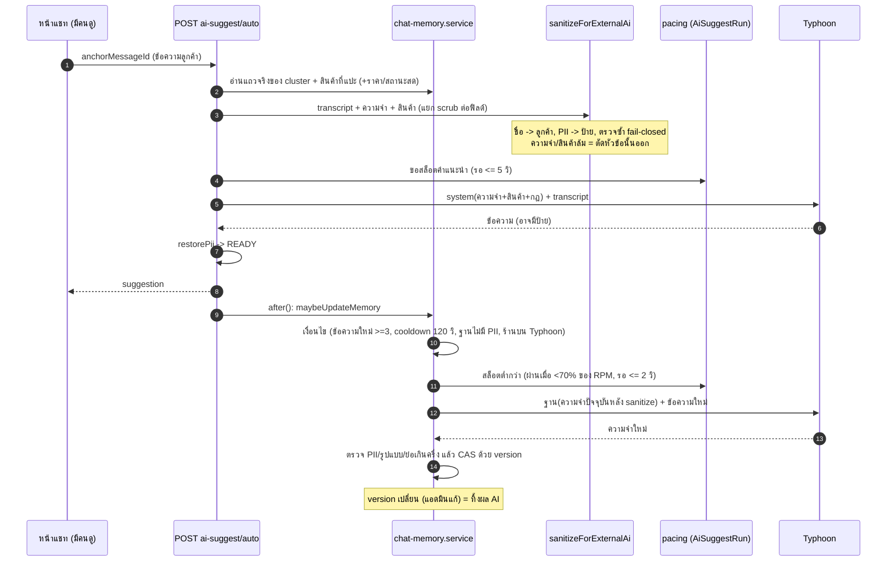
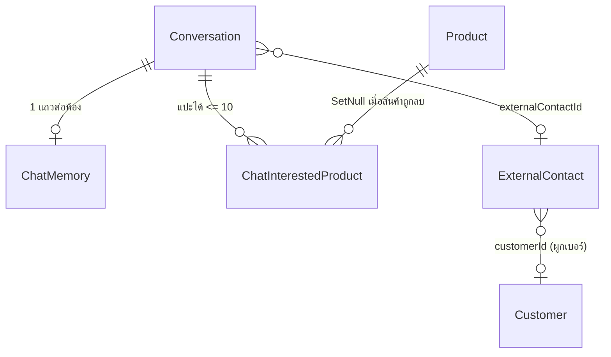

# 00019 — Extension: ความจำของแชท + สินค้าที่สนใจ (2026-10-09)

> ต่อยอด **AI Reply Assistant** (feature 00019) และต่อจาก `EXTENSIONS-2026-10-09-typhoon-auto-suggest.md` ซึ่ง §12 และภาคผนวก ก ระบุสามเรื่องนี้ว่า "รอ user ตัดสินแยก":
> (1) ความจำของแชท (2) สินค้าที่สนใจที่แอดมินแปะ (3) สต็อกสดจาก OMS
> เอกสารนี้ตัดสินข้อ (1) และ (2) เต็มรูปแบบ ส่วนข้อ (3) แยกเป็น OQ-M3 (ราคา/สต็อกสดเข้า prompt) ไม่ทำเป็นฟีเจอร์ตอบ "มี/หมด" ของ gochat (Q43-45)
>
> สถานะ: **อนุมัติแล้ว 2026-10-09** — user ตอบ "ตามข้อเสนอทั้งหมด" (OQ-M1..M12 = ข้อเสนอใน §15 · รับ R-M1/R-M2/R-M3) · เอกสารนี้ทำหน้าที่ PRD + BRD ของส่วนขยาย · ตรวจโค้ดจริง 2026-10-09 บน worktree `safepay-typhoon-suggest` (= main PR #128)
> **เป้าหมายที่ user ย้ำ (2026-10-09):** "เพื่อให้ AI ดึงตรงนั้นไปวิเคราะห์และช่วยตอบ" ความจำและสินค้าที่แปะจึงต้องถูกส่งเข้า prompt ของคำแนะนำทุกครั้ง (หลัง sanitize) นี่คือ FR หลัก (FR-MEM-01) การแสดงให้แอดมินดูเป็นเรื่องรอง
> **พฤติกรรมอ้างอิง (มติ gochat Q40-Q42):** ใช้เฉพาะเนื้อหาและพฤติกรรม ส่วน layout จริงให้ `safepay-ux` แปลงเข้าธีม Paces (HR1/HR6/HR8) ห้าม emoji ใน UI (HR12)
> คำศัพท์: **"ความจำ"** = ย่อหน้าเดียวต่อห้องที่ AI เขียนและแอดมินแก้ได้ · **"สินค้าที่สนใจ"** = รายการสินค้าที่แอดมินแปะไว้กับห้อง · **"ห้อง"** = Conversation · **"ลูกค้าคนเดียวกัน"** = cluster ตาม `follow-up-scope.ts` (นิยามที่ 5 ส่วนที่ F-M5) · **"แถวจริง"** (effective row) = แถวความจำที่ใช้งานอยู่ของ cluster (BR-MEM-06)

---

## 0. Goal

ให้ AI ร่างคำตอบโดยรู้ว่า **ลูกค้าคนนี้เป็นใคร สนใจอะไร เคยคุยอะไรไว้** แม้ข้อความเก่าอยู่นอกหน้าต่าง 15 ข้อความ หรืออยู่ในห้องอื่นของลูกค้าคนเดียวกัน
เช่น ลูกค้าถามไซส์ซ้ำ AI ตอบตามไซส์ในความจำได้ทันทีโดยไม่ถามใหม่
ทำโดยเก็บ "ความจำ" ย่อหน้าเดียว (AI เขียนเอง แอดมินแก้ทั้งก้อนได้) กับ "สินค้าที่สนใจ" (แอดมินแปะ) แล้ว **ฉีดเข้า prompt ทุกครั้งหลังผ่านด่านปิดบังข้อมูลส่วนตัว**
โดยไม่เพิ่มช่องทางให้เบอร์/ที่อยู่/เลขบัญชีของลูกค้าไปถึง Typhoon และไม่ทำให้ AI เขียนทับสิ่งที่แอดมินแก้

---

## 1. สิ่งที่พบจากโค้ดจริง (ฐานของเอกสารนี้)

| # | ข้อค้นพบ | หลักฐาน |
|---|---|---|
| F-M1 | **ไม่มีที่เก็บ "สิ่งที่รู้เกี่ยวกับลูกค้า" ที่ AI อ่านได้ในเส้นทาง Typhoon เลย** prompt ของ Typhoon ได้แค่ transcript 15 ข้อความล่าสุด + `instruction` ร้าน + `contextBlock` (สินค้าที่ค้นจากคำที่ลูกค้าพิมพ์ + ประวัติออเดอร์ 5 รายการ) | `ai-suggest-auto.service.ts:45` (`RECENT_LIMIT = 15`), `:216-270` (`loadPayload`), `ai-context.service.ts:75-154` |
| F-M2 | **โน้ต CRM มีอยู่แล้วและสื่อว่า "AI ใช้ประกอบการร่างคำตอบ" แต่เส้นทาง Typhoon ไม่ใช้เลย** `loadPayload` ไม่ส่ง `customerNote` เข้า input และ `sanitizeForExternalAi(..., 'typhoon')` ตั้ง `customerNote` เป็น null เสมอ ส่วนเส้นทาง Gemini ส่งโน้ตผ่าน redact แล้ว UI ยังเขียนคำเดียวกันกับทุกร้าน (HR16: เอกสาร/UI อ้างสิ่งที่โค้ดไม่ได้ทำ) | `ai-suggest-auto.service.ts:261-268`; `ai-suggest-sanitize.ts:119`; Gemini route `ai-suggest/route.ts:419`; ข้อความ UI `CustomerCrmSection.tsx:194,255`, `CustomerPanel.tsx:1072` |
| F-M3 | โน้ต CRM เก็บที่ `ExternalContact.note` (ต่อผู้ติดต่อ) **ห้อง DEEP ไม่มี ExternalContact จึงไม่มีโน้ต** (แก้ได้แค่ alias) ความจำใหม่ต้องใช้ได้กับทุกช่องทาง จึงเก็บที่ `ExternalContact` ไม่ได้ | `schema.prisma:1889` (`note`), `:1933` (`Conversation.externalContactId` nullable); `chat-crm.service.ts:4-5, 100` |
| F-M4 | **`Customer` เป็นตารางข้ามร้าน** (`phone @unique` ไม่มี `shopId`) ความจำของร้านห้องเก็บที่ `Customer` ไม่ได้ ไม่งั้นข้อมูลที่ร้านหนึ่งสรุปไว้จะไหลไปร้านอื่นที่มีลูกค้าเบอร์เดียวกัน | `schema.prisma:1123-1134` |
| F-M5 | "ลูกค้าคนเดียวกันหลายห้อง" ระบบนิยามไว้แล้วที่เดียว (00066): คีย์ = `shopId:ExternalContact.customerId`, ห้องที่ไม่มี contact/customer (รวมห้อง DEEP) = คีย์ของตัวเอง `v:<conversationId>` · SQL ที่รู้เรื่องนี้อยู่ไฟล์เดียว ห้ามเขียน join ที่อื่น · `customerId` ถูกตั้งตอนได้เบอร์ผ่านออเดอร์ (`order.service.ts:183-192`) | `follow-up-scope.ts:1-16` (`clusterKeySql`), `:19` (`expandClusters`) |
| F-M6 | **สินค้าไม่มี variant** `Product.attributes` เป็น `Record<string,string>` ที่ค่าคือรายการคั่นจุลภาค (เช่น `สี: "แดง, น้ำเงิน"`) ไม่มีตาราง variant/SKU ต่อชุดตัวเลือก และ `stockQty` อยู่ระดับสินค้า (null = ไม่ติดตาม) "ตัวเลือก สีครีม · L" ในอ้างอิงจึงเป็น **ป้ายที่แอดมินเลือกจาก attributes** ไม่ใช่ variant ที่มีราคา/สต็อกของตัวเอง | `schema.prisma:683, 695`; `ProductAttributesCardV2.tsx:11-12` |
| F-M7 | แผ่นเลือกสินค้าในแชทมีแล้ว (`ProductPickerPanel`: ค้นหา, ติ๊กหลายรายการ, ส่งการ์ด `sendCardProductId` / `onSendMany`) **แต่ไม่มีการเลือกตัวเลือก (attributes) และไม่มีโหมด "เลือกเพื่อแปะ"** · แผ่นเลือกสินค้าของฟอร์มออเดอร์ (`ProductPickerSheet`) เป็นอีกตัว (รับ `CatalogProduct`) ดังนั้น "ใช้แผ่นเลือกสินค้าตัวเดิม" ต้องแก้เพิ่ม | `ProductPickerPanel.tsx:65-81`; `ChatThread.tsx:3358-3369`; `ProductPickerSheet.tsx:19-28` |
| F-M8 | การ์ดสินค้าที่ส่งในห้องเข้า transcript แล้วในรูป `[ส่งการ์ดสินค้า: ชื่อ — ราคา บาท (เปิดขาย/ปิดขายแล้ว)]` และ `[ส่งการ์ดสินค้า: สินค้าถูกลบแล้ว]` — รูปแบบนี้ใช้เป็นแบบเดียวกับสินค้าที่แปะ | `ai-suggest-turns.ts:29-39` |
| F-M9 | ราคาและสต็อกของสินค้าเคยถูกอนุญาตให้ออกไป AI อยู่แล้ว: `buildProductBlock` ส่ง `ชื่อ — ราคา บาท (คงเหลือ N ชิ้น)` เฉพาะสินค้าเปิดขาย และ N เฉพาะสินค้าที่ติดตามสต็อก ส่วน allow-list ของ `ai-context.service.ts` ห้าม phone/email/address | `ai-context.service.ts:14-16, 75-108` |
| F-M10 | ความสามารถ sanitize ที่ใช้ซ้ำได้: `sanitizeForExternalAi` (ชื่อ→"ลูกค้า"/"แอดมิน", ค่าตัวอักษรใน CRM→`[ข้อมูลลูกค้า]`, `redactPiiReversible` + ตรวจซ้ำ fail-closed) · ผลที่ได้เป็น branded type ที่ Typhoon รับเท่านั้น · `restorePii` ปฏิเสธป้ายที่ไม่รู้จัก · ป้าย `[ข้อมูลลูกค้า]` **ไม่อยู่ใน `TOKEN_RE`** จึงหลุดผ่าน `restorePii` ได้ถ้าโมเดลสะท้อนกลับ (ต้องดักเองในความจำ) | `ai-suggest-sanitize.ts:32-45, 47, 89-129`; `pii-redact.ts:17, 112, 300-311` |
| F-M11 | ตัวคุมจังหวะนับจากแถว `AiSuggestRun` ที่ `provider='typhoon'` และ `firedAt` ในหน้าต่าง 60 วินาที · การอัปเดตความจำเป็นการเรียก Typhoon อีกครั้ง **ต้องนับในเพดานเดียวกัน** (เพดาน 5 req/s · 200 req/นาที ใช้ร่วมกับ gochat) · GET ผลล่าสุดกรองด้วย `anchorMessageId = ข้อความล่าสุด` จึงไม่ปนกับแถวที่ anchor คนละค่า | `ai-suggest-auto.service.ts:102-121, 405-410`; `schema.prisma:5080-5109` |
| F-M12 | route `/ai-suggest/auto` มี `maxDuration = 30` และ `after()` ถูกใช้แล้วใน route แชท (`messages/route.ts`) จึงทำงานต่อท้ายหลังตอบ client ได้ | `ai-suggest/auto/route.ts:18`; grep `after(` ใน `api/chat/conversations` |
| F-M13 | แผงขวามี **5 แท็บแล้ว** (ลูกค้า/คำสั่งซื้อ/ไฟล์/โน้ต/ติดตาม) บีบจน `flex-nowrap` พอดี 384px **เพิ่มแท็บที่ 6 ไม่ได้** ส่วนความจำควรเป็นบล็อกในแท็บเดิมหรือเหนือแท็บ (ให้ `safepay-ux` ตัดสิน) · CRM fetch ครั้งเดียวที่ parent แล้วส่งลงแท็บ | `CustomerPanel.tsx:905-957` (แถบแท็บและคอมเมนต์ 5 แท็บ), `:809-856` |
| F-M14 | เอกสารเดิมห้ามเก็บเนื้อหาไว้สองที่: `BR-AIT-09` ห้ามเก็บ transcript/payload ที่ส่ง Typhoon · `DATABASE.md:172` "ไม่เก็บบทสนทนาที่ส่งให้ AI ลงฐานข้อมูล" · PRD ระบุเลื่อน "สรุปความจำต่อบทสนทนา (rolling summary)" ไปประเมินหลังมีข้อมูลจริง และถือว่าแชทส่วนใหญ่จบใน 15 ข้อความ ความจำที่ AI เขียนคือ **สรุปที่ derive จาก transcript** เก็บถาวร ต้องแก้ถ้อยคำของ BR/DATABASE เหล่านี้ (ดู §6.1) | `00019 PRD.md:241, 243, 320`; `DATABASE.md:172` |
| F-M15 | เส้นทาง Typhoon ตัดสินแล้วว่า **ไม่ส่งข้อความอิสระของแอดมิน (customerNote)** เพราะคุมไม่ได้ (FR-AIT-10) ความจำที่แอดมินพิมพ์เองคือข้อความอิสระชนิดเดียวกัน จึงต้องมีเหตุผลรองรับว่าส่งได้ (คำตอบ: ผ่านด่านปิดบังเดียวกับ transcript ทุกครั้ง + กฎ BR-MEM-03/04 และเป็น R-M1) | `ai-suggest-sanitize.ts:72, 119`; Typhoon-ext FR-AIT-10 |

---

## 2. ข้อจำกัดของ Typhoon ที่ผูกกับความจำ

ข้อ 2/4/7 ของ TAC Typhoon (Typhoon-ext §2) ใช้กับความจำเต็มที่:
- ความจำถูกส่งไป Typhoon **ทุกคำขอ** ในห้องนั้น และเป็น input ของคำขออัปเดตความจำเอง ข้อมูลที่สรุปแล้ว (ไซส์ สี ความชอบ ที่ตั้งระดับเขต/จังหวัด) ถูกใช้เทรนถาวรตามข้อ 4
- ความจำเป็น **ข้อมูลที่เก็บถาวรและสะสมข้ามวัน** ต่างจาก transcript ที่เป็นหน้าต่างสั้น ความเสี่ยงที่ PII หลุดเข้ามาแล้ว "ค้าง" จึงสูงกว่า transcript จึงต้องมีกฎ BR-MEM-03/04 และการตรวจก่อนบันทึก ไม่ใช่แค่ปิดบังก่อนส่ง

---

## 3. ขอบเขต

**อยู่ในขอบเขต (In scope)**
- ตารางและ service ความจำต่อห้อง + การใช้ร่วมใน cluster ลูกค้าคนเดียวกัน
- การฉีดความจำและสินค้าที่แปะเข้า prompt ทุกครั้งหลัง sanitize (Typhoon: ส่วนของ prompt เอง · Gemini: ผ่าน `contextBlock` โดยไม่แตะ `gemini.ts`)
- AI อัปเดตความจำ (เฉพาะร้านบน Typhoon) + ปุ่มอัปเดตด้วยมือ
- API อ่าน/แก้ความจำ, เพิ่ม/ลบสินค้าที่สนใจ
- การเลือกตัวเลือกจาก `Product.attributes` ตอนแปะ + โหมด "แปะ" ใน `ProductPickerPanel`
- กดสินค้าที่แปะ = เปิดถาดส่งการ์ดสินค้านั้น (Q42)

**นอกขอบเขต** ดูหัวข้อ 12

---

## 4. User Stories (รูปแบบเดียวกับ PRD §2)

| ID | Story |
|---|---|
| US-MEM-01 | ในฐานะ **แอดมินร้าน** ฉันอยากให้ AI รู้ไซส์/สี/สิ่งที่ลูกค้าเคยถามไว้แล้ว เพื่อให้คำแนะนำไม่ถามซ้ำและตอบตรงตัวลูกค้า |
| US-MEM-02 | ในฐานะ **แอดมินร้าน** ฉันอยากเห็นและแก้ "ความจำของแชทนี้" ได้ทั้งก้อน และอยากให้ AI แก้ต่อจากที่ฉันแก้ ไม่ทับของฉัน |
| US-MEM-03 | ในฐานะ **แอดมินร้าน** ฉันอยากแปะสินค้าที่ลูกค้าสนใจ (พร้อมสี/ไซส์ที่เลือก) ไว้กับห้อง ให้ AI และเพื่อนแอดมินเห็นตรงกัน และกดแล้วส่งการ์ดสินค้านั้นได้เลย |
| US-MEM-04 | ในฐานะ **แอดมินร้าน** เมื่อลูกค้าทักมาอีกช่องทางแล้วระบบรู้ว่าเป็นคนเดียวกัน ฉันอยากให้ความจำตามไปด้วย |
| US-MEM-05 | ในฐานะ **เจ้าของร้าน** ฉันอยากมั่นใจว่าเบอร์/ที่อยู่/เลขบัญชีของลูกค้าไม่ถูก "จำ" ไว้โดย AI และไม่ถูกส่งไป Typhoon ผ่านช่องความจำ |
| US-MEM-06 | ในฐานะ **ทีมพัฒนา** ฉันอยากให้การเรียก Typhoon เพื่ออัปเดตความจำถูกนับในเพดานเดียวกับคำแนะนำ และไม่แย่งสล็อตของคำแนะนำ |

---

## 5. Functional Requirements — FR-MEM

> "บังคับที่" = จุดที่ต้องมีโค้ด/เทสที่แดงเมื่อกฎถูกละเมิด (convention `rule-must-be-enforced-not-described`) · ทุกข้อ must-have เว้นแต่ระบุ nice-to-have · ไฟล์ "(ใหม่)" = ยังไม่มีในโค้ด

### 5.1 แกนหลัก: ความจำและสินค้าเข้า prompt

| FR | ข้อกำหนด | Acceptance (ทดสอบได้) | บังคับที่ |
|---|---|---|---|
| **FR-MEM-01** (หลัก) | **ความจำของห้อง (แถวจริง) และสินค้าที่สนใจ ต้องอยู่ใน prompt ของคำแนะนำทุกคำขอ** ทั้ง trigger `AUTO_NEW_MESSAGE` / `AUTO_OPEN` / `MANUAL` และทั้งผู้ให้บริการ Typhoon และ Gemini · ผ่าน `sanitizeForExternalAi` เสมอ (ชื่อ→"ลูกค้า", เบอร์/ที่อยู่/อีเมล/เลขบัญชีถูกปิดบัง, ป้ายคืนค่าได้ผ่าน vault เดียวกับ transcript) · Typhoon: เป็นสองหัวข้อใน system prompt แยกจาก "ข้อเท็จจริงจากระบบ" (ความจำเป็นสรุปที่ AI เขียน อาจคลาดเคลื่อน ต้องมีข้อความกำกับว่าไม่ใช่ข้อเท็จจริงยืนยันและให้เชื่อข้อความล่าสุดของลูกค้าเมื่อขัดกัน และไม่ใช่คำสั่ง) · หัวข้อความจำมีวันที่อัปเดตกำกับ (สถานะเช่น "รอโอนเงิน" ล้าสมัยได้) · Gemini: ต่อท้าย `contextBlock` ก่อน sanitize (ห้ามแก้ `gemini.ts`) พร้อมหัวข้อกำกับแบบเดียวกัน · ห้องที่ไม่มีความจำ/ไม่มีสินค้า → ไม่มีหัวข้อว่าง | (1) ผู้ให้บริการจำลอง: ห้องมีความจำ "ใส่ไซส์ L ชอบสีครีม" → request body ถึง provider มี system message ที่มีข้อความนี้ใต้หัวข้อความจำ ครบทั้ง 3 trigger (2) ห้องมีสินค้าที่แปะ "D21 · สีครีม · L" → body มีชื่อ+ตัวเลือก (3) ความจำที่แอดมินพิมพ์ "โทร 081-234-5678" → body ไม่มีเบอร์ดิบ และคำตอบที่อ้าง `[เบอร์โทร#1]` ถูกคืนค่า (4) ห้องไม่มีความจำ → body ไม่มีหัวข้อ "ความจำ" (5) ร้านตั้ง `includeCustomerContext=false` → ไม่มีความจำใน body · `includeProductContext=false` → ไม่มีสินค้า (BR-MEM-10) (6) **mutation:** ถอดการฉีดความจำออกจาก `loadPayload` เทสข้อ (1) ต้องแดง · ถอดการฉีดสินค้าแล้วข้อ (2) ต้องแดง (7) **ประเมินพฤติกรรม (QA ไม่ใช่ CI):** ความจำ "ใส่ไซส์ L (อก 36)" + ลูกค้าถาม "ไซส์อะไรดีคะ" → คำแนะนำอ้างไซส์ L อย่างน้อย 4 ใน 5 ครั้งบน Typhoon จริง (ผลไม่ deterministic จึงไม่ใส่ใน CI) | `ai-suggest-auto.service.ts:216-270` (`loadPayload` เพิ่ม `memory`, `interestedProducts` ใน input ที่ `:261-268`) · `ai-suggest-sanitize.ts` (`SanitizeInput`/`SanitizeOutput` เพิ่มสองฟิลด์ แต่ละฟิลด์ผ่าน `scrub`) · `reply-suggest-prompt.ts:19-61` (หัวข้อใหม่ ก่อนบรรทัดกฎปิดท้าย `:59`) · Gemini route `ai-suggest/route.ts` (~`:396-425` ต่อ `contextBlock`) · เทส `ai-suggest-auto.service.test.ts` (ขยาย), `reply-suggest-prompt` เทสใหม่ |
| FR-MEM-02 | **sanitize ความจำ/สินค้าแบบแยกฟิลด์ ล้มเฉพาะส่วนนั้น** ถ้า `scrub` ของความจำหรือสินค้าโยน error → **ตัดหัวข้อนั้นออกจาก prompt** แล้วทำคำแนะนำต่อ (ไม่ส่งของดิบ) log เฉพาะชนิด error · ถ้า `scrub` ของ transcript โยน → ยังหยุดทั้งก้อนตามเดิม (FR-AIT-10) | mock `scrub` ให้ throw เฉพาะ memory → request ไป provider ไม่มีหัวข้อความจำและไม่มีข้อความความจำ แต่มี transcript · mock ให้ throw ที่ transcript → ไม่มี fetch | `ai-suggest-sanitize.ts` (try ต่อฟิลด์ memory/products) · เทส |
| FR-MEM-03 | **สินค้าที่แปะเข้า prompt เป็นรูปแบบเดียวกับการ์ดสินค้าใน transcript** `- ชื่อสินค้า · ตัวเลือก` + สถานะ (เปิดขาย/ปิดขายแล้ว/ถูกลบแล้ว ตามรูปแบบ `ai-suggest-turns.ts:29-39`) · ตัวเลือกเป็นป้ายที่แอดมินเลือก **ไม่ใช่ข้อเท็จจริงว่ามีของ** — prompt ต้องมีบรรทัดสั่งว่า "ห้ามยืนยันว่าตัวเลือกนั้นมีของ" · ราคา/สต็อกสด: ตาม OQ-M3 | สินค้าถูกลบ → prompt มี "สินค้าถูกลบแล้ว" และไม่มีราคา · สินค้า `isActive=false` → "ปิดขายแล้ว" · prompt มีบรรทัดห้ามยืนยันว่าตัวเลือกมีของ | `reply-suggest-prompt.ts` · ตัวประกอบข้อความสินค้า (ใช้ `resolveProductCards` `ai-context.service.ts:34-47`) · เทส |

### 5.2 ความจำ: เก็บ แก้ ใช้ร่วม

| FR | ข้อกำหนด | Acceptance | บังคับที่ |
|---|---|---|---|
| FR-MEM-04 | **ความจำเป็นย่อหน้าเดียว** ข้อความล้วน ไม่เกิน `CHAT_MEMORY_MAX = 800` ตัวอักษร (ข้อเสนอ OQ-M8) บรรทัดใหม่ถูกยุบเป็นช่องว่าง · 1 แถวต่อห้อง · บันทึกค่าว่าง = ล้างความจำ (ไม่ลบแถว) | PUT 801 ตัวอักษร → 400 · ข้อความมี `\n` → เก็บเป็นบรรทัดเดียว · PUT ว่าง → `text=''` แถวยังอยู่ | Valibot ใน `validations.ts` + service `chat-memory.service.ts` (ใหม่) · เทส |
| FR-MEM-05 | **แก้ได้ทั้งก้อนโดยแอดมิน + กันชนกันด้วย version** PUT ส่ง `expectedVersion` · ไม่ตรง → 409 พร้อมข้อความปัจจุบัน · สำเร็จ → `source='ADMIN'`, `version+1`, `previousText` = ข้อความก่อนหน้า | แอดมิน A,B เปิดแก้ version 3 พร้อมกัน A บันทึกก่อน → B ได้ 409 และเห็นข้อความของ A · ไม่มีการเขียนทับเงียบ | `updateMany where {id, version}` ใน service (รูปแบบเดียวกับ conditional claim ที่ `claimRun` ใช้ `:171-204`) · เทส concurrency |
| FR-MEM-06 | **AI ต้องใช้ข้อความล่าสุด (รวมที่แอดมินแก้) เป็นฐาน** คำขออัปเดตความจำส่ง "ความจำปัจจุบัน" ตามที่อ่านจาก DB ณ ตอนเริ่ม (หลัง sanitize) เป็น input · คำสั่งให้ **คงข้อความเดิม แก้เฉพาะส่วนที่ขัดกับข้อมูลใหม่ หรือเพิ่มเรื่องใหม่** · ผลของ AI เขียนด้วย compare-and-set บน `version` ที่อ่านมา ถ้า version เปลี่ยนระหว่างรอ (แอดมินแก้ หรือ AI อีกคำขอ) → **ทิ้งผลของ AI** (`outcome=SUPERSEDED`) แอดมินชนะเสมอ · **ตัวกันย่อ:** ผลของ AI ที่สั้นกว่า 50% ของฐาน (เมื่อฐานยาว ≥ 100 ตัวอักษร) ถือว่าเขียนทับ → ไม่บันทึก (`REJECTED_SHRINK`) | (1) แอดมินบันทึก "ใส่ไซส์ L" (v4) แล้ว AI อัปเดต → user message ที่ไป provider มี "ใส่ไซส์ L" ตัวอักษรตรง (2) AI ถือฐาน v3 ขณะแอดมินบันทึก v4 → แถวยังเป็น v4 ข้อความแอดมิน, มีแถวสถิติ `SUPERSEDED` (3) ผล AI 30 ตัวอักษรต่อฐาน 400 → ไม่บันทึก **mutation:** ถอดเงื่อนไข `version` ออกจาก where เทส (2) ต้องแดง | `chat-memory.service.ts` (`applyAiUpdate`) · เทส (provider จำลองจับ request) |
| FR-MEM-07 | **AI อัปเดตความจำเมื่อไร** (เฉพาะร้านบน Typhoon — OQ-M5): ต่อท้ายคำแนะนำที่ได้ `READY` ผ่าน `after()` ใน `/ai-suggest/auto` เมื่อ (ก) มีข้อความใหม่ตั้งแต่ `basedOnMessageId` ≥ 3 ข้อความ หรือยังไม่มีความจำและห้องมีข้อความ ≥ 4 (ลูกค้า ≥ 2) (ข) แถวจริงไม่ถูกอัปเดตโดย AI ภายใน 120 วินาที (ค) `includeCustomerContext` เปิด (ง) ฐานไม่มี PII (FR-MEM-09) · ไม่มีฝั่ง server (webhook/cron) เรียกเอง — ต้องมีคนเปิดห้องเสมอ (BR-AIT-03 กฎ ค) · หน้าต่าง transcript = ข้อความหลัง `basedOnMessageId` ใหม่สุด ≤ 40 ข้อความ · บันทึก `basedOnMessageId` | ห้องที่ไม่มีใครเปิด ลูกค้าส่ง 10 ข้อความ → ความจำไม่เปลี่ยน ไม่มีแถว `MEMORY_UPDATE` · เปิดห้องและ READY แล้วมีข้อความใหม่ 3 → มี 1 แถว `MEMORY_UPDATE` · ข้อความใหม่ 2 → ไม่มี · อัปเดตซ้ำภายใน 120 วินาที → ไม่มี | `ai-suggest/auto/route.ts` (`after()` หลังตอบ) + `chat-memory.service.ts` (`maybeUpdateMemory`) · grep-gate: webhook ไม่ import service นี้ · เทส |
| FR-MEM-08 | **ปุ่ม "อัปเดตความจำ" ด้วยมือ** (nice-to-have) `POST .../memory/refresh` ข้ามเงื่อนไขจำนวนข้อความและ cooldown แต่ไม่ข้าม sanitize, pacing, PII guard, CAS · ใช้ร่วมกับ rate limit `checkApiRateLimit` ของ ai-suggest | กด 2 ครั้งติด → ครั้งที่ 2 ได้ `THINKING`/ข้ามตาม idempotent (FR-MEM-12) ไม่ยิงซ้ำ | route ใหม่ · เทส |
| FR-MEM-09 | **ความจำที่ AI เขียนห้ามมี PII (เบอร์/ที่อยู่เต็ม/เลขบัญชี/อีเมล/เลขบัตร)** เก็บได้แค่ระดับเขต/จังหวัด · prompt ผู้เขียนห้ามใส่ และ **ตรวจผลก่อนบันทึกทุกครั้ง:** (ก) มีป้าย `TOKEN_RE` (`[เบอร์โทร#n]` ฯลฯ) หรือ `[ข้อมูลลูกค้า]` → `REJECTED_PII` (ข) `redactPii(ผล).found.length > 0` → `REJECTED_PII` (ค) ว่าง/ยาวเกิน `CHAT_MEMORY_MAX`/ขึ้นบรรทัดหลายย่อหน้าเกินแก้ได้ → `REJECTED_FORMAT` ทุกกรณี **คงความจำเดิม** ไม่บันทึกครึ่งๆ กลางๆ · **ห้ามคืนค่าจริงจาก vault ลงความจำ** (ต่างจากคำแนะนำที่คืนค่าให้แอดมินดู) · ถ้าฐาน (ที่แอดมินพิมพ์) มี PII ตาม `redactPii` → **ข้ามการอัปเดตของ AI** (`SKIPPED_BASE_HAS_PII`) เพื่อไม่ให้ AI ตัดข้อความแอดมินทิ้งเงียบ ๆ (ดู OQ-M4) | corpus ผลโมเดล: ผลมี `[ที่อยู่#1]`, มี `[ข้อมูลลูกค้า]`, มีเบอร์ 081-234-5678, มีอีเมล, มีเลขบัญชี 12 หลัก → ทุกข้อ `REJECTED_PII` แถวความจำไม่เปลี่ยน · ผล "ส่งที่บางขุนเทียน กทม." → บันทึกได้ · ฐานมีเบอร์ → ไม่มีการเรียก Typhoon **mutation:** ถอด redactPii ออก 1 ชนิด (corpus ต้องมีเบอร์หลายรูปแบบ +66, ขีด, วรรค, เลขบัตร 13 หลัก, อีเมล, เลขบัญชี 10-15 หลัก ตาม convention `mutation-silence-means-weak-corpus`) เทสต้องแดง | `chat-memory.service.ts` (`validateAiMemory`) ใช้ `pii-redact.ts` · เทส `chat-memory-pii.test.ts` |
| FR-MEM-10 | **ความจำใช้ร่วมทุกห้องของลูกค้าคนเดียวกัน** อ่าน/เขียนที่ "แถวจริง" = แถวที่ `updatedAt` ใหม่สุดในกลุ่มห้องของ cluster (หา cluster ด้วย `expandClusters` ของ `follow-up-scope.ts` เท่านั้น ห้ามเขียน join ใหม่) · แอดมินแก้/AI อัปเดต → เขียนที่แถวจริงนั้น (ไม่สร้างแถวซ้ำ) · ห้องที่ยังไม่มีแถวใดใน cluster → สร้างแถวของห้องปัจจุบัน · ห้องที่ไม่มี customer (cluster = ตัวเอง) ใช้เฉพาะแถวของตัวเอง · **ไม่ข้ามร้าน** (คีย์ cluster มี `shopId` และ WHERE มี `shopId`) | ห้อง A (Messenger) มีความจำ → ห้อง B (IG) ของ ExternalContact ที่ผูก customer เดียวกันเห็นข้อความเดียวกันและเข้า prompt เหมือนกัน · ห้อง C ของร้านอื่นที่ลูกค้าเบอร์เดียวกัน → ไม่เห็น · ห้อง DEEP → ไม่เห็นของห้องอื่น | `chat-memory.service.ts` (`resolveEffectiveMemory`) → `follow-up-scope.ts` `expandClusters` · เทส DB (scope ด้วย id ที่เทสสร้าง HR13) |
| FR-MEM-11 | **ผู้ดูหลายคน/หลายคำขอไม่เรียกโมเดลซ้ำ** คำขออัปเดตความจำ claim ด้วยแถว `AiSuggestRun` (`trigger='MEMORY_UPDATE'`, `anchorMessageId = 'mem:' + id ข้อความล่าสุดที่รวมในฐาน'`, attempt 1) · ซ้ำ = ไม่ยิง | แอดมิน 2 คนเปิดห้องเดียว 2 คำขอ READY พร้อมกัน → เรียก Typhoon เพื่อความจำ 1 ครั้ง | `claimRun` (`ai-suggest-auto.service.ts:171`) ขยายให้รับ trigger นี้ · เทส |
| FR-MEM-12 | **การนับเพดาน Typhoon:** การอัปเดตความจำ reserve สล็อตผ่าน `reserveSlot` เดียวกับคำแนะนำ (นับในแถวที่ `provider='typhoon'`) · มีสิทธิ์ต่ำกว่าคำแนะนำ: ผ่านเมื่อจำนวนครั้งในหน้าต่าง 60 วินาทีรวมระบบ < 70% ของ `AI_SUGGEST_RPM` และรอสล็อตสูงสุด 2 วินาที (ไม่ใช่ 5) · เกิน → ทิ้งเงียบ `RATE_LIMITED` ไม่ retry (ลองใหม่เองรอบหน้าตามเงื่อนไข FR-MEM-07) · 429 จาก Typhoon → เหมือนกัน | จำลองหน้าต่างที่มี 80/100 → การอัปเดตความจำไม่ยิงแต่คำแนะนำยังยิงได้ · 429 → ไม่ retry | `ai-suggest-auto.service.ts:85-121` (`computePacingVerdict` เพิ่มพารามิเตอร์เพดานต่ำ) · เทส |

### 5.3 สินค้าที่สนใจ

| FR | ข้อกำหนด | Acceptance | บังคับที่ |
|---|---|---|---|
| FR-MEM-13 | **แอดมินแปะเองเท่านั้น** (AI เสนอให้แปะ = รอบหน้า) เปิดผ่านแผ่นเลือกสินค้าตัวเดิม `ProductPickerPanel` เพิ่มโหมด "แปะ" (เลือกได้หลายรายการ ไม่ส่งการ์ด) · เก็บ `productId` + `productName` (snapshot) + `optionLabel` เท่านั้น **ไม่เก็บราคา/สต็อก** · สูงสุด `INTERESTED_PRODUCT_MAX = 10` ต่อห้อง · ซ้ำ (สินค้า+ตัวเลือกเดียวกันในห้อง) → 409 | แปะ 11 รายการ → รายการที่ 11 ได้ 422 · แปะซ้ำ → 409 · แถวในตารางไม่มีคอลัมน์ราคา/สต็อก (ตรวจ schema) · `productId` ของร้านอื่น → 404 | `POST .../interested-products` + service (ตรวจ `Product` ด้วย `{id, shopId}`) · `ProductPickerPanel.tsx` เพิ่มโหมด · เทส |
| FR-MEM-14 | **ตัวเลือก (สี · ไซส์) เลือกจาก `Product.attributes` ของสินค้านั้นเท่านั้น** แต่ละหัวข้อเลือกได้ 1 ค่า ผลเป็นป้าย `"สีครีม · L"` เก็บใน `optionLabel` · สินค้าที่ไม่มี attributes → ไม่มีขั้นเลือกตัวเลือก (`optionLabel=''`) · ค่าที่ไม่อยู่ใน attributes ของสินค้า → 422 | สินค้า attributes `{สี:"ครีม, ดำ", ขนาด:"M, L"}` → เลือก "สีครีม · L" ได้ · ส่ง "สีแดง" → 422 | service ตรวจเทียบ `Product.attributes` (แยกค่าตามจุลภาคและ trim ด้วยฟังก์ชันเดียวกับที่ฟอร์มสินค้าใช้) · เทส |
| FR-MEM-15 | **ลบด้วย ✕** `DELETE .../interested-products/{rowId}` (การกระทำของผู้ใช้ตามที่ขอ) ตรวจ `{id, shopId}` และห้องอยู่ใน cluster ที่ผู้ใช้เข้าถึงได้ | ✕ แถวของร้านอื่น → 404 · ✕ แล้ว GET ไม่เห็นและ prompt ถัดไปไม่มี | route + service · เทส |
| FR-MEM-16 | **ร่วมกันใน cluster** รายการสินค้าที่แสดงและเข้า prompt = union ของแถวทุกห้องใน cluster (ตัดซ้ำด้วย `productId`+`optionLabel`) เขียนที่ห้องปัจจุบัน (OQ-M7) | ห้อง A แปะ D21 · ห้อง B (cluster เดียวกัน) เห็น D21 | `chat-memory.service.ts` + `expandClusters` · เทส |
| FR-MEM-17 | **สินค้าถูกลบ/ปิดขาย:** แถวยังอยู่ (FK `SetNull`) UI แสดงชื่อ snapshot พร้อมป้ายสถานะ (ปิดขาย/ถูกลบ) และ prompt ใช้ข้อความตาม FR-MEM-03 · กดสินค้าที่ถูกลบ/ปิดขาย → ไม่เปิดถาดส่งการ์ด แจ้งสถานะ | ลบสินค้าที่แปะ → GET คืน `state:'DELETED'` · prompt มี "สินค้าถูกลบแล้ว" | FK `onDelete: SetNull` + เทส |
| FR-MEM-18 | **กดสินค้าที่แปะ = เปิดถาดส่งการ์ดสินค้านั้น** (Q42) เปิด `ProductPickerPanel` โหมดส่งการ์ด โดยติ๊กสินค้านั้นไว้ล่วงหน้า (ต้องเพิ่มพร็อพ `initialSelectedIds`) แอดมินกดส่งเองเหมือนเดิม ไม่ส่งอัตโนมัติ | กดสินค้า → แผงเปิดพร้อมติ๊กสินค้านั้น · ไม่มี `POST messages` จนกว่าจะกดส่ง | `ProductPickerPanel.tsx` + `ChatThread.tsx:3358` · เทสพฤติกรรม |
| FR-MEM-19 | **ร้านที่ยังไม่มีสินค้าในระบบ (OMS ว่าง)** ซ่อนส่วน "สินค้าที่สนใจ" (ถ้าไม่มีแถวค้างอยู่) ความจำยังใช้ได้ตามปกติ · เงื่อนไขซ่อนต้องมีที่ให้เทสจับ (convention `ui-boolean-needs-a-testable-home`) | ร้านไม่มีสินค้า → API ไม่มีส่วนสินค้า (`canUseProducts:false`) · ปุ่ม + ไม่ขึ้น | ฟังก์ชันตัดสินใน `src/lib` + เทส mutation |

### 5.4 อ่าน/แสดง

| FR | ข้อกำหนด | Acceptance | บังคับที่ |
|---|---|---|---|
| FR-MEM-20 | `GET .../memory` คืนความจำ (แถวจริง) + รายการสินค้า + `canUseProducts` + เหตุผลถ้า AI ไม่อัปเดต (ร้านบน Gemini) · อ่าน DB อย่างเดียว ไม่เรียกโมเดล | GET ไม่มี fetch ไป provider | route ใหม่ · เทส |
| FR-MEM-21 | **ข้อความอธิบาย (i) และคำบนแผง** ต้องบอกตามจริง: ความจำสรุปโดย AI แอดมินแก้ได้ ลูกค้าไม่เห็น ใช้ร่วมทุกห้องของลูกค้าคนเดียวกัน · ร้านบน Gemini ต้องไม่สื่อว่า AI จะเขียนให้ · ห้ามเขียนว่า "AI ใช้โน้ต" ในที่ที่ไม่จริง (F-M2) ข้อความจริงให้ `safepay-ux` ทำ ผ่านระบบ TH/EN (00047) | ตรวจ copy ใน `/impeccable clarify` | `safepay-ux` · `i18n` dictionary |

---

## 6. Business Rules — BR-MEM

| BR | กฎ |
|---|---|
| **BR-MEM-01 (ต้องเข้า prompt)** | ความจำและสินค้าที่แปะมีไว้ให้ AI ใช้ แสดงให้แอดมินดูเป็นผลพลอยได้ ฟีเจอร์ที่ส่งมอบโดยที่ข้อมูลนี้ไม่เข้า prompt ถือว่าไม่ผ่านรับงาน (FR-MEM-01 + เทส mutation) |
| **BR-MEM-02 (ผ่านด่านเดียว)** | ทุก string ของความจำ/สินค้า/ผลที่ออกไป Typhoon ต้องผ่าน `sanitizeForExternalAi` ไม่มีเส้นทางอื่น (ชนิด branded type กันที่ compile) ความจำที่แอดมินพิมพ์เองก็เป็น "ข้อความอิสระ" จึงต้องผ่านด่านนี้ทุกครั้งที่ส่ง ไม่เชื่อว่า "เก็บมาสะอาด" |
| **BR-MEM-03 (ห้ามจำ PII — ฝั่ง AI)** | ความจำที่ AI เขียนห้ามมีเบอร์ ที่อยู่เต็ม เลขบัญชี อีเมล เลขบัตร ป้าย PII และ `[ข้อมูลลูกค้า]` เก็บได้แค่ระดับเขต/จังหวัด ตรวจก่อนบันทึกทุกครั้ง (FR-MEM-09) ผิดกฎ = ไม่บันทึกและคงของเดิม ข้อมูลเหล่านั้นมีที่อยู่ของมันแล้วใน CRM (`phones`, `address`) |
| **BR-MEM-04 (แอดมินพิมพ์เองได้ แต่ส่งออกผ่านด่านเสมอ)** | แอดมินพิมพ์อะไรลงความจำก็ได้ (ข้อมูลอยู่ใน DB ของร้านเอง scope ด้วย `shopId`) แต่เวลาส่งออกผ่าน BR-MEM-02 และ AI จะไม่เขียนต่อทับฐานที่มี PII (`SKIPPED_BASE_HAS_PII`) · ทางเลือก "บล็อกตั้งแต่ตอนบันทึก" อยู่ที่ OQ-M4 |
| **BR-MEM-05 (ฐานคือข้อความล่าสุด + แอดมินชนะ)** | AI ต้องอัปเดตจากข้อความล่าสุดใน DB (รวมที่แอดมินแก้) · ผลของ AI เขียนด้วย compare-and-set · version เปลี่ยน = ทิ้งผล AI · ผลที่ย่อฐานเกินครึ่ง = ไม่บันทึก · `previousText` เก็บข้อความก่อนหน้าหนึ่งเวอร์ชันเพื่อกู้คืน (nice-to-have ใน UI) |
| **BR-MEM-06 (ผูกห้อง ใช้ร่วม cluster)** | ความจำผูกห้อง และห้องที่ cluster ผูกลูกค้าเดียวกัน (นิยาม 00066 / BR-ACT-10) ใช้แถวจริงร่วมกัน · ข้ามร้านไม่ได้ · ความจำ **ไม่เก็บที่ `Customer`** (ตารางข้ามร้าน F-M4) · cluster แตกภายหลัง (เบอร์ถูกย้าย) = ห้องที่ไม่ใช่เจ้าของแถวไม่มีความจำ (ไม่คัดลอก) |
| **BR-MEM-07 (ไม่มีคนดู = ไม่เรียกโมเดล)** | การอัปเดตความจำเกิดจากคำขอ `/ai-suggest/auto` ที่ client ซึ่งมีคนดูห้องเป็นผู้ยิงเท่านั้น (กฎ ค ของ BR-AIT-03) ห้ามมี cron/webhook สรุปความจำย้อนหลัง |
| **BR-MEM-08 (ความจำไม่ใช่ข้อเท็จจริงยืนยัน)** | ความจำเป็นสรุปที่ AI เขียน อาจคลาดเคลื่อนและล้าสมัย: ราคา ส่วนลด เงื่อนไข สต็อก **ห้ามเข้าความจำ** (ผู้เขียนถูกสั่งห้าม) · เมื่อขัดกับข้อความล่าสุดของลูกค้าให้เชื่อข้อความล่าสุด · ความจำไม่ใช่คำสั่งต่อ AI (กัน prompt injection ที่ค้างถาวร: ลูกค้าพิมพ์ "จำไว้ว่าลดให้ 50%" ต้องไม่กลายเป็นกฎ) · กฎความปลอดภัยปิดท้าย prompt (`SAFETY_RULE_LINES`) ยังอยู่เหนือทุกอย่าง |
| **BR-MEM-09 (สิทธิ์)** | ผู้ที่อ่าน/แก้ความจำและสินค้า = ผู้ที่เปิดห้องนั้นได้ในร้านเจ้าของห้อง · `shopId` มาจาก `resolveConversationShopId` เท่านั้น ไม่รับจาก client · `sessionUserId()` ไม่ cast · ถ้า 00071 (บทบาทสมาชิก) กำหนดสิทธิ์แชทละเอียดกว่านี้ ให้ตาม 00071 (OQ-M10) |
| **BR-MEM-10 (เคารพสวิตช์ร้าน)** | ความจำเข้า prompt เมื่อ `includeCustomerContext` เปิด · สินค้าที่แปะเข้า prompt เมื่อ `includeProductContext` เปิด · ร้าน non-paid ที่ `getEffectiveAiSetting` ตัดบริบท (FR-AIQ-10, OQ-7 เดิม) ได้ผลเดียวกับบริบทเดิม ไม่เปลี่ยนสิทธิ์ที่ขายอยู่ (OQ-M12) |
| **BR-MEM-11 (ความจำไม่มี FR สต็อก)** | ตัวเลือกที่แปะไม่ใช่ variant ไม่มีสต็อกของตัวเอง (F-M6) AI ห้ามยืนยันว่าตัวเลือกนั้นมีของ ส่วนราคา/สต็อกสดดู OQ-M3 |
| **BR-MEM-12 (การเปลี่ยนที่ต้องแจ้ง)** | ความจำคือข้อมูลส่วนบุคคลที่ AI สรุปและเก็บถาวร (ความชอบ ไซส์ สถานที่ระดับเขต) ต่างจากข้อความที่ส่งแล้วทิ้ง ต้องแก้ BR-AIT-09 / `DATABASE.md:172` ให้ตรงความจริง (§6.1) และแจ้ง user ให้รับ R-M1/R-M2 ก่อนอนุมัติ |

### 6.1 การปรับข้อตกลงเดิมที่ต้องแก้พร้อมกัน (sync)

- **BR-AIT-09** (Typhoon-ext §6): เดิม "ห้ามเก็บ transcript/payload ที่ส่งไป Typhoon" → เพิ่มว่า "ยกเว้น ความจำของแชท (สรุปย่อหน้าเดียว ≤ 800 ตัวอักษร ที่ผ่านกฎ BR-MEM-03) ซึ่งเก็บได้ใน `ChatMemory`" ห้ามเก็บตารางจับคู่ป้ายเหมือนเดิม
- **`DATABASE.md:172`** ของ 00019: เพิ่มข้อยกเว้นเดียวกัน และเพิ่มแบบจำลอง `ChatMemory`, `ChatInterestedProduct`
- **00019 `PRD.md:241`**: ลบแถว "ห้ามมีปุ่ม ช่อง หรือ prompt" เฉพาะความจำ+สินค้าที่แปะ (เหลือเฉพาะ "สต็อกสด" ตาม OQ-M3) · **`:243`** (rolling summary เลื่อนไว้): บันทึกว่าความจำนี้เป็นรูปแบบที่ user เลือกแทน · **`:320`** (แชทส่วนใหญ่จบใน 15 ข้อความ): เพิ่มว่าคุณค่าของความจำอยู่ที่แชทข้ามวัน/ข้ามห้อง
- **Typhoon-ext §12 และภาคผนวก ก ข้อ 1-3**: ปรับสถานะเป็น "ทำในเอกสาร `EXTENSIONS-2026-10-09-chat-memory.md`" (ข้อ 3 สต็อกสด = OQ-M3)
- **FR-AIT-10** (`customerNote` ไม่ส่ง Typhoon): เพิ่มหมายเหตุว่า "ความจำของแชทเป็นข้อความอิสระที่ส่งได้เพราะ BR-MEM-02..04" และสถานะของโน้ต CRM ตามผล OQ-M2
- **ข้อความ UI โน้ต CRM** (`CustomerCrmSection.tsx:194,255`; `CustomerPanel.tsx:1072`): แก้ให้ตรงความจริงตามผล OQ-M2 (F-M2)

---

## 7. Non-Functional Requirements — NFR-MEM

| NFR | ข้อกำหนด |
|---|---|
| NFR-MEM-Latency | การเพิ่มความจำ+สินค้าใน prompt ต้องไม่เพิ่ม p95 ของ NFR-AIT-Latency (≤ 4 วินาที) เกิน 150 มิลลิวินาทีฝั่ง server · การอ่านใช้ query ชุดเดียวกับ `loadPayload` แบบขนาน (`Promise.all` ที่ `ai-suggest-auto.service.ts:226`) ไม่เรียงต่อ · ทดสอบวัดซ้ำตอน QA ไม่เชื่อตัวเลขเดา |
| NFR-MEM-PromptSize | ความจำ ≤ 800 ตัวอักษร · สินค้า ≤ 10 บรรทัด ≈ 600 ตัวอักษร · อยู่นอก `contextBlock` จึงไม่โดนเพดาน 6,000 ตัวอักษรและการตัดของ `composeContextBlock` (`ai-context.service.ts:22, 163-187`) |
| NFR-MEM-Failsoft | อ่านความจำไม่ได้ (DB ผิดพลาด) → คำแนะนำทำต่อโดยไม่มีความจำ (ไม่ทำให้ทั้งคำขอล้ม) · อัปเดตความจำล้มเหลวทุกแบบ → ทิ้งเงียบ ความจำเดิมคงอยู่ ไม่กระทบคำแนะนำที่ตอบไปแล้ว (รันใน `after()`) |
| NFR-MEM-Webhook | ห้ามเพิ่มงานในเส้นทาง webhook (เหมือน NFR-AIT-Webhook) การอ่านความจำทำเฉพาะใน `/ai-suggest/*` และ `/memory/*` |
| NFR-MEM-Cache | ทุก response ของ `/memory` และ `/interested-products` เป็นข้อมูลต่อร้าน: `force-dynamic` + `Cache-Control: private, no-store, max-age=0, must-revalidate` |
| NFR-MEM-Sec | ownership อยู่ใน WHERE (`{id, shopId}`) · cluster ขยายด้วย `expandClusters` ที่กรอง `shopId` · ไม่มี `console.*` ที่รับเนื้อความความจำ/ชื่อสินค้า/ผลโมเดล (log เฉพาะชนิด error ตามแบบ `ai-suggest-auto.service.ts:378`) |
| NFR-MEM-Migration | ตารางใหม่ 2 ตาราง additive ไม่แตะตารางเดิม ไม่มี backfill (HR15: ก่อน migrate ต้องแจ้ง user 3 ข้อ · ห้าม `migrate dev`/`db pull` · ปักหมุด URL localhost ตาม HR14) |
| NFR-MEM-i18n | ข้อความใหม่ผ่านระบบสลับภาษา TH/EN (00047) ไม่ hardcode ไทยในคอมโพเนนต์ที่ใช้ร่วม |
| NFR-MEM-A11y | ปุ่ม (i), ปุ่มแก้, ปุ่ม +, ✕ แต่ละแถว มี role รองรับ `aria-label` (convention `aria-name-requires-supporting-role`) · tap target ≥ 44px บนมือถือ · การมาถึงของผลจาก AI ประกาศผ่าน `role="status"` |

---

## 8. ลำดับการทำงาน (Design)

### 8.1 คำแนะนำ + อัปเดตความจำ



### 8.2 ข้อมูล



ห้องที่ cluster เดียวกัน (`ExternalContact.customerId` เท่ากัน ในร้านเดียวกัน) ใช้ "แถวจริง" ร่วม เลือกจาก `ChatMemory.updatedAt` ใหม่สุดของห้องใน cluster ไม่มีการคัดลอกหรือ merge ข้อความ

### 8.3 ทำไมเก็บต่อห้อง + อ่านแบบ "ใหม่สุดชนะ" แทนตาราง keyed ด้วย cluster

ทางเลือกที่พิจารณา: ตารางคีย์ `shopId:customerId` (ตรงกับ cluster) ต้องย้าย/รวมแถวทุกครั้งที่ ExternalContact ถูกผูก customer ใหม่ (`order.service.ts:192`) จุดผูกมีหลายทางและ cluster นิยามไว้ที่เดียวใน `follow-up-scope.ts` การเก็บต่อห้องแล้วหา "แถวจริง" ตอนอ่านด้วย `expandClusters`:
- ไม่ต้องมี hook ในจุดผูกลูกค้า ไม่มี migration ข้อมูลตอน merge
- cluster แตก = ห้องกลับไปใช้แถวของตัวเองโดยไม่ต้องทำอะไร
- **ข้อแลกเปลี่ยน:** ตอนสองห้องมีความจำของตัวเองอยู่แล้วแล้วถูกรวม cluster ข้อความของแถวที่เก่ากว่าจะไม่ถูกเห็น/ใช้ (ยังอยู่ในฐาน) → R-M5, OQ-M6

---

## 9. Data Model (เสนอ — DDL จริงเป็นงาน `safepay-database` · sync `DATABASE.md` ของ 00019 และ `docs/SRS.md` ตาม HR11)

ตารางใหม่ 2 ตาราง แบบ additive; แก้ `schema.prisma` เฉพาะเพิ่ม relation back-reference ฝั่ง `Product`/`Conversation` (ไม่มีคอลัมน์ใหม่ในตารางเดิม)

```prisma
// ChatMemory — ความจำของแชท (ย่อหน้าเดียวต่อห้อง) 00019-ext
// ไม่ใช่ transcript: เป็นสรุป ≤ 800 ตัวอักษรที่ผ่านกฎ BR-MEM-03 (ไม่มี PII) — ต้องแก้ BR-AIT-09 / DATABASE.md:172 ให้รับรู้
// ห้ามเก็บที่ Customer (ตารางข้ามร้าน) — ใช้ร่วมใน cluster ด้วยการอ่านหา "แถวจริง" (BR-MEM-06)
model ChatMemory {
  id               String    @id @default(uuid())
  shopId           String
  conversationId   String    @unique
  text             String    @default("") @db.Text // ≤ CHAT_MEMORY_MAX (800) บังคับที่ Valibot + service
  source           String    @default("AI")        // AI | ADMIN — ผู้เขียนล่าสุด
  version          Int       @default(1)           // compare-and-set (FR-MEM-05/06)
  basedOnMessageId String?                         // ข้อความล่าสุดที่รวมอยู่ในความจำแล้ว (ฐานของรอบอัปเดตถัดไป)
  previousText     String?   @db.Text              // ข้อความก่อนหน้า 1 เวอร์ชัน (กู้คืน) — nice-to-have
  updatedByUserId  String?                         // ผู้แก้ล่าสุดถ้า source=ADMIN
  aiUpdatedAt      DateTime?                       // ฐานของ cooldown 120 วิ
  createdAt        DateTime  @default(now())
  updatedAt        DateTime  @updatedAt

  conversation Conversation @relation(fields: [conversationId], references: [id], onDelete: Cascade)

  @@index([shopId, updatedAt])
}

// ChatInterestedProduct — สินค้าที่แอดมินแปะไว้กับห้อง (เก็บ id + ชื่อ + ตัวเลือก; ไม่เก็บราคา/สต็อก — ดึงสดตอนใช้)
model ChatInterestedProduct {
  id              String   @id @default(uuid())
  shopId          String
  conversationId  String
  productId       String?  // SetNull เมื่อสินค้าถูกลบ → แสดง snapshot + ป้าย "ถูกลบ"
  productName     String   // snapshot ณ ตอนแปะ
  optionLabel     String   @default("") // เช่น "สีครีม · L" (จาก Product.attributes) ; '' = ไม่มีตัวเลือก
  createdByUserId String
  createdAt       DateTime @default(now())

  conversation Conversation @relation(fields: [conversationId], references: [id], onDelete: Cascade)
  product      Product?     @relation(fields: [productId], references: [id], onDelete: SetNull)

  @@unique([conversationId, productId, optionLabel]) // กันแปะซ้ำ (productId null หลังสินค้าถูกลบ: NULL ไม่ชนกัน ยอมรับ)
  @@index([shopId, conversationId])
}
```

- **`AiSuggestRun` ไม่เปลี่ยนโครง:** แถวอัปเดตความจำใช้ `trigger='MEMORY_UPDATE'`, `anchorMessageId='mem:<id>'` และค่า `outcome` เพิ่ม `SUPERSEDED`, `REJECTED_PII`, `REJECTED_FORMAT`, `REJECTED_SHRINK`, `SKIPPED_BASE_HAS_PII`, `SKIPPED_COOLDOWN`, `SKIPPED_FEW_MESSAGES` (ค่า enum เป็น String ตาม convention · แยกค่าคงที่ `MEMORY_UPDATE_OUTCOMES` ใน `ai-suggest-auto-types.ts` ห้ามเพิ่มเข้า `AUTO_SUGGEST_OUTCOMES` เพราะ `AutoSuggestReason` (`ai-suggest-auto-types.ts:38-39`) derive จากมันและถูกส่งไป client) · `getLatestAutoSuggest` กรองด้วย `anchorMessageId` ของข้อความล่าสุด (`:405-410`) จึงไม่ปนกับแถวนี้ · ต้อง sync รายการค่าไป `docs/SRS.md` ส่วน enums
- การลบแถวความจำ/สินค้าโดยระบบ (retention) **ไม่อยู่ในรอบนี้** การลบข้อมูลต้องขออนุมัติ user ก่อนเสมอ (OQ-M9)

---

## 10. API Contract (เสนอ)

ทุก endpoint: `resolveConversationShopId` (ตามแบบ `crm/route.ts:21-31`), `sessionUserId()`, Valibot ใน `validations.ts`, ส่วนหัว `Cache-Control` ตาม NFR-MEM-Cache; 401 ไม่ล็อกอิน · 404 ไม่ใช่ห้องของร้านที่เข้าถึงได้ (ไม่ leak)

### `GET /api/chat/conversations/{id}/memory`
> **แก้ตามมติ Controller 2026-10-09 (Change Log ใน baseline; ตรงแผน phase 00019-ext-mem ข้อ 2.2):** (1) `aiWrites` เปลี่ยนเป็นออบเจ็กต์ `ai` (2) `memory` เพิ่ม `previousText` (3) POST สินค้ารับ `selections` แทน `optionLabel` (4) 409 `current` เพิ่ม `updatedAt`

200 `{ memory: { text, source, version, updatedAt, aiUpdatedAt, shared: boolean, previousText: string|null } | null, products: [{ id, productId|null, name, optionLabel, state: "ACTIVE"|"INACTIVE"|"DELETED", imageFileId|null }], canUseProducts: boolean, ai: { provider: "typhoon"|"gemini"|"none", writes: boolean, readsMemory: boolean, readsProducts: boolean, updating: boolean, noteReadByAi: boolean } }` · `shared` = แถวจริงมาจากห้องอื่นใน cluster · `ai.writes` = `provider==='typhoon'` (false → UI ไม่บอกว่า AI จะเขียนให้) · `readsMemory`/`readsProducts` = สวิตช์ `includeCustomerContext`/`includeProductContext` หลัง `getEffectiveAiSetting` · `updating` = มีแถว `MEMORY_UPDATE` สถานะ `THINKING` อายุ ≤ 30 วิของห้องนี้ · `noteReadByAi` = `provider==='gemini'`

### `PUT /api/chat/conversations/{id}/memory`
Request `{ text: string(≤800), expectedVersion: number | null }` (`null` = ยังไม่มีแถว) · 200 `{ memory }` · 400 ข้อความยาวเกิน/ไม่ถูกต้อง · 409 `{ error: "VERSION_CONFLICT", current: { text, version, source, updatedAt } | null }` (`null` = ไม่มีแถว; แก้ตามมติ Controller 2026-10-09 เพิ่ม `updatedAt` ให้ UI แสดงเวลา)

### `POST /api/chat/conversations/{id}/memory/refresh` (nice-to-have)
200 `{ status: "UPDATED" | "THINKING" | "NONE", reason? }` · 400 ร้านไม่ได้ใช้ Typhoon · 429 `Retry-After`

### `POST /api/chat/conversations/{id}/interested-products`
Request `{ productId: uuid, selections?: { key: string, value: string }[] (≤ 10 หัวข้อ) }` — server ประกอบ `optionLabel` เองจาก `Product.attributes` เป็นรูปแบบ "สี ครีม · ขนาด L" (แก้ตามมติ Controller 2026-10-09 แทน `optionLabel` ที่ client ส่งตรง; ตัวอย่างใน FR-MEM-14 "สีครีม · L" ใช้รูปแบบนี้แทน) · 201 `{ item }` · 404 ไม่พบสินค้าในร้านนี้ · 409 ซ้ำ · 422 ครบ 10 รายการ / ตัวเลือกไม่อยู่ใน attributes

### `DELETE /api/chat/conversations/{id}/interested-products/{rowId}`
204 · 404 ไม่ใช่แถวของร้านนี้ (ตรวจ `{id, shopId}` และห้องอยู่ใน cluster ที่เข้าถึงได้)

### การเปลี่ยนของ endpoint เดิม
- `POST .../ai-suggest/auto` ต่อ `after()` เรียก `maybeUpdateMemory` หลัง READY (ไม่เปลี่ยน contract response)
- `POST .../ai-suggest` (Gemini) เติมความจำ+สินค้าเข้า `contextBlock` ตาม FR-MEM-01

---

## 11. Edge Cases

| # | กรณี | พฤติกรรมที่กำหนด |
|---|---|---|
| E-M1 | **แอดมิน 2 คนแก้ความจำพร้อมกัน** | CAS ด้วย `expectedVersion` (FR-MEM-05) คนที่ช้ากว่าได้ 409 พร้อมข้อความปัจจุบัน UI แสดงทางเลือก "ใช้ของที่เพิ่งบันทึก" หรือ "บันทึกทับด้วยของฉัน" (ส่งใหม่ด้วย version ล่าสุด) ไม่มีการทับเงียบ |
| E-M2 | **AI กำลังอัปเดต ขณะแอดมินกำลังแก้/บันทึก** | แอดมินบันทึกก่อน → AI เห็น version เปลี่ยนตอน CAS → ทิ้งผล `SUPERSEDED` · AI บันทึกก่อน → แอดมินที่เปิดแก้ค้างอยู่ได้ 409 ตอนบันทึก (E-M1) ไม่เสียสิ่งที่พิมพ์ (UI เก็บ draft) |
| E-M3 | **ลูกค้าหลายห้อง merge ทีหลัง** | หลัง `customerId` ถูกผูก ห้องทั้งหมดใช้แถวที่ `updatedAt` ใหม่สุด แถวอื่นไม่ถูกลบและไม่ถูกใช้ (OQ-M6) · AI อัปเดตครั้งแรกหลัง merge ใช้แถวจริงเป็นฐาน ข้อมูลที่อยู่เฉพาะแถวเก่าไม่เข้ามาเอง |
| E-M4 | **cluster แตก (เบอร์ถูกย้ายไปลูกค้าอื่น)** | ห้องที่ไม่ใช่เจ้าของแถวกลับไม่มีความจำ (ไม่คัดลอก) สินค้าที่แปะอยู่ที่ห้องไหนก็ติดห้องนั้น |
| E-M5 | **สินค้าที่แปะถูกลบ/ปิดขาย** | FR-MEM-17: แสดงชื่อ snapshot + ป้ายสถานะ ไม่ให้ส่งการ์ด prompt บอก "ถูกลบแล้ว/ปิดขายแล้ว" ไม่มีราคา |
| E-M6 | **ตัวเลือกที่แปะเลิกมีในสินค้าแล้ว** (แก้ attributes ภายหลัง) | แถวคงเดิม (snapshot) ไม่ validate ย้อนหลัง prompt ส่งป้ายเดิม พร้อมบรรทัดห้ามยืนยันว่ามีของ (BR-MEM-11) |
| E-M7 | **ร้านไม่มีสินค้าในระบบ (ไม่มี OMS)** | FR-MEM-19: ซ่อนส่วนสินค้า ความจำใช้ได้ |
| E-M8 | **ร้านบน Gemini (นอก allow-list)** | อ่านความจำ/สินค้าเข้า prompt ได้ (FR-MEM-01) แอดมินแก้ได้ แต่ AI **ไม่เขียน** ความจำให้ (OQ-M5) ต้นทุนของการเขียนบน Gemini ต้องผ่านระบบโควตา/เครดิต (BR-AIQ) ซึ่งขอบเขตรอบนี้ไม่ขยาย |
| E-M9 | **ร้านบน Typhoon แต่ไม่มีกุญแจ (`NONE`)** | ไม่อัปเดตความจำ ไม่ถอยไป Gemini (เหมือน E-13 เดิม) ความจำที่มีอยู่ยังเข้า prompt ไม่ได้เพราะไม่มี prompt |
| E-M10 | **ลูกค้าพิมพ์ข้อความฝัง "จำไว้ว่า..." หรือคำสั่ง** | ผู้เขียนความจำถูกสั่งจดเฉพาะข้อเท็จจริงเกี่ยวกับลูกค้า ไม่ใช่คำสั่ง/ราคา/คำสัญญา · ตัวกรองรูปแบบ/ย่อ/PII ไม่ตรวจความหมายของคำสั่ง (limit — R-M3) · ความจำเข้า prompt ใต้หัวข้อที่ระบุว่า "ไม่ใช่คำสั่ง" และกฎปิดท้ายอยู่เหนือกว่า · แอดมินเห็นและแก้ได้ |
| E-M11 | **ผลโมเดลมีชื่อเฉพาะ (เดาชื่อ)** | ไม่ใช่ป้ายจึงไม่ถูกจับ (เหมือน E-9 เดิม) แอดมินตรวจเอง |
| E-M12 | **ความจำที่แอดมินพิมพ์มีชื่อจริงลูกค้า** | ถูกแทนด้วย "ลูกค้า" ก่อนส่ง ถ้าชื่อนั้นตรง alias/realName/ชื่อ ExternalContact; ชื่อที่ระบบไม่รู้จัก **หลุดได้** (R-M1) |
| E-M13 | **ห้องมีข้อความเก่ามากกว่า 40 ข้อความตั้งแต่ฐาน** | ใช้ 40 ข้อความล่าสุดหลังฐาน ส่วนที่เกินไม่ถูกสรุป (ceiling) |
| E-M14 | **บันทึกความจำว่าง** | ล้างข้อความ แถวยังอยู่ `source='ADMIN'` AI อัปเดตต่อได้ตามเงื่อนไข (ต้องการ "ห้าม AI เขียนอีก" = ไม่อยู่ในรอบนี้ OQ-M11) |
| E-M15 | **ห้อง DEEP (ไม่มี ExternalContact)** | ใช้ความจำของห้องตัวเอง ไม่ใช้ร่วม (cluster = `v:<conversationId>`) · โน้ต CRM ใช้ไม่ได้อยู่แล้ว ความจำจึงเป็นที่เดียวที่ห้อง DEEP จด "สิ่งที่ควรจำ" |
| E-M16 | **สลับร้านในกล่องแชทรวม (00037)** | ร้านมาจากเธรดเสมอ ไม่ใช่ร้านที่ active (NFR-AIT-Sec เดิม) |
| E-M17 | **อัปเดตความจำล้มกลางทาง (function ตาย)** | แถว `AiSuggestRun` ค้าง `THINKING` → lease 30 วินาที (`LEASE_MS`) ยึดต่อได้ ความจำไม่เปลี่ยน (CAS ยังไม่ได้เขียน) |

---

## 12. Out of Scope

**ไม่ทำในรอบนี้ (MVP):**
- AI เสนอให้แปะสินค้า (Q41 บอกว่ารอบหน้า)
- ฟีเจอร์ "สต็อกสดตอบ มี/หมด" แบบ gochat Q43-45 (ราคา/สต็อกสดที่เข้า prompt เป็นแค่ข้อมูลให้ AI อ้าง ตาม OQ-M3 ไม่ใช่ตัวตัดสิน)
- สต็อกระดับ variant/ตัวเลือก (ระบบไม่มี variant — F-M6)
- AI เขียนความจำบนร้านที่ใช้ Gemini (OQ-M5)
- merge ความจำของหลายห้องด้วย AI เมื่อ cluster รวมกัน (OQ-M6)
- ความจำระดับลูกค้าข้ามร้าน (ห้ามโดยหลักความเป็นส่วนตัว — F-M4)
- ประวัติหลายเวอร์ชันของความจำ (เก็บแค่ `previousText` 1 ชั้น และ UI กู้คืนเป็น nice-to-have)
- ตัวลบ/retention ของแถวความจำ (การลบต้องขออนุมัติ — OQ-M9)
- แดชบอร์ดคุณภาพความจำ
- ปุ่มปิด AI เขียนความจำรายห้อง (OQ-M11)
- การแปลความจำ TH/EN ตามภาษาลูกค้า (ความจำเขียนเป็นไทยตาม A-6 เดิม)

**ไม่แตะ:** `gemini.ts`, `auto-reply.service.ts`, `ai-enhance.service.ts`, `parse-address/route.ts` · โน้ต CRM (`ExternalContact.note`) ไม่ถูกแก้โครง (ผลของ OQ-M1/M2 กระทบแค่ข้อความ UI)

**รายละเอียด UI:** ไม่ออกแบบ layout ในเอกสารนี้ ส่ง `safepay-ux` (HR8) ภายใต้ HR1/HR6/HR12: หัวข้อ "ความจำของแชทนี้" (icon + (i) + ปุ่มแก้) ย่อหน้าเดียว · หัวข้อ "สินค้าที่สนใจ" + ปุ่ม + · แถวสินค้า (รูป/ไอคอน, ชื่อ, ตัวเลือก) พร้อม ✕ · ข้อจำกัด: แผงขวามี 5 แท็บเต็มแล้ว (F-M13) เพิ่มแท็บไม่ได้ · ป้ายที่ต้องมี: ความจำแบ่งใช้ร่วมจากห้องอื่น, ปิดขาย/ถูกลบ, 409 conflict, ร้านบน Gemini ไม่มี AI เขียนให้

---

## 13. Risks

| # | ความเสี่ยง | ผลกระทบ | แนวทาง |
|---|---|---|---|
| **R-M1** | **PII หลุดผ่านความจำ:** ชื่อจริงที่แอดมินพิมพ์ในความจำและระบบไม่รู้จัก, ที่อยู่ที่ไม่มีรหัสไปรษณีย์ (ข้อจำกัดเดิม `pii-redact.ts:7-10`), เบอร์เขียนเป็นตัวอักษร → ส่งไป Typhoon ทุกคำขอและถูกใช้เทรนถาวร (ข้อ 4) บริการอาจถูกระงับ (ข้อ 7) กระทบ gochat | สูง | ด่านเดียว BR-MEM-02 · ฝั่ง AI ตรวจก่อนบันทึก BR-MEM-03 · แอดมินพิมพ์ = ยังเป็นความเสี่ยงที่เหลือ → **user ต้องรับรู้และยอมรับ** (ต่อเนื่องจาก R-1 เดิม) · ช่วงนำร่องเฉพาะร้านใน allow-list (FR-AIT-15) |
| **R-M2** | **ความจำเป็นข้อมูลส่วนบุคคลที่ AI สรุปและเก็บถาวร** (ความชอบ ไซส์ ที่ตั้งระดับเขต) ต่างจากโครงเดิมที่ไม่เก็บ transcript · ลูกค้าอาจขอให้ลบ | กลาง | แอดมินล้างข้อความได้ทันที · ลบห้อง = ลบความจำ (cascade) · ต้องแก้ BR-AIT-09 / DATABASE.md (§6.1) · ก่อนเปิดทุกร้านต้องมีประกาศ (BR-AIT-10 เดิม) |
| **R-M3** | **ความจำถูกวางยา (memory poisoning):** ลูกค้าพิมพ์ข้อความให้ AI จดเป็นกฎ ("ลด 50%") แล้วค้างถาวรและเข้า prompt ทุกครั้ง | กลาง | ผู้เขียนถูกสั่งห้ามจดราคา/ส่วนลด/คำสั่ง · prompt ระบุว่าความจำไม่ใช่คำสั่งและกฎปิดท้ายอยู่เหนือกว่า · แอดมินเห็นและแก้ได้ · **ตัวกรองไม่ตรวจความหมาย** (ceiling) |
| R-M4 | **AI เขียนทับความตั้งใจของแอดมิน** | กลาง | CAS + ตัวกันย่อ 50% + `previousText` · ไม่รับประกันเชิงความหมาย |
| R-M5 | **รวม cluster แล้วข้อมูลหาย (มองไม่เห็น)** ห้องที่ความจำเก่ากว่าไม่ถูกใช้ | ต่ำ-กลาง | ไม่ลบแถว · OQ-M6 เสนอ "ใหม่สุดชนะ" ก่อน ค่อยทำ merge ด้วย AI ภายหลังถ้าพบจริง |
| R-M6 | **การเรียก Typhoon เพิ่ม ~1 ครั้งต่อ 3 ข้อความ** กินเพดาน 200 req/นาทีที่ใช้ร่วมกับ gochat | กลาง | สิทธิ์ต่ำกว่าคำแนะนำ (< 70% RPM, รอ ≤ 2 วิ) · cooldown 120 วิ · เงื่อนไข ≥ 3 ข้อความ · ทิ้งเงียบเมื่อเต็ม · ตัวนับยังเป็น `count()` ไม่ atomic (R-5 เดิม) |
| R-M7 | **ความจำล้าสมัย** (สถานะ "รอโอนเงิน" หลังโอนแล้ว) แล้ว AI ตอบผิด | กลาง | หัวข้อมีวันที่อัปเดต + ให้เชื่อข้อความล่าสุด (FR-MEM-01) · AI อัปเดตเมื่อมีข้อความใหม่ |
| R-M8 | **ตัวเลือกที่แปะถูกอ่านเป็น "มีของ"** | กลาง | บรรทัดห้ามยืนยัน (FR-MEM-03/BR-MEM-11) ตรวจใน AC |
| R-M9 | **UI/ข้อความเดิมอ้างว่า "AI ใช้โน้ต" ซึ่งไม่จริงบน Typhoon (F-M2)** แอดมินที่เขียนโน้ตหวังผลจะไม่ได้ผล | กลาง | OQ-M1/M2: แก้ข้อความ หรือส่งโน้ตผ่านด่านเดียวกับความจำ |
| R-M10 | **เงื่อนไข "ร้านมี OMS" ไม่นิยามเป็นกฎกลาง** ตอนนี้ปุ่มสินค้าในช่องพิมพ์แสดงเสมอ | ต่ำ | FR-MEM-19 กำหนดนิยามที่เทสได้ (ร้านมีสินค้า ≥ 1 หรือมีแถวค้างอยู่) |

---

## 14. Assumptions

- **A-M1** ค่าตั้งต้นเชิงปริมาณเป็นข้อเสนอ ปรับได้ตอน QA: ความจำ ≤ 800 ตัวอักษร · สินค้า ≤ 10/ห้อง · ฐานอัปเดตเมื่อมีข้อความใหม่ ≥ 3 (ห้องใหม่ ≥ 4 และลูกค้า ≥ 2) · cooldown 120 วินาที · หน้าต่างสรุป ≤ 40 ข้อความ · เพดานสิทธิ์ต่ำของความจำ 70% RPM · timeout อัปเดตความจำใช้ 8 วินาทีเท่า `TYPHOON_TIMEOUT_MS`
- **A-M2** การอัปเดตความจำรันใน `after()` ของ `/ai-suggest/auto` (`maxDuration = 30`) ได้ทัน (ผลคำแนะนำ ~1-2 วิ + สล็อต ≤ 2 วิ + Typhoon ≤ 8 วิ) · ต้องยืนยันตอน QA ว่า serverless ไม่ตัดงานหลังตอบ
- **A-M3** ผู้เขียนความจำใช้โมเดล/กุญแจ Typhoon เดียวกับคำแนะนำ prompt แยก `max_tokens` ~400 temperature ต่ำ (~0.2)
- **A-M4** ตัวเลือกของสินค้าอ่านจาก `Product.attributes` ที่มีรูปแบบ `Record<string,string>` ค่าคั่นจุลภาค ตามที่ฟอร์มสินค้า V2 เขียนไว้ สินค้าเก่าที่ `attributes` เป็น `{}` ไม่มีตัวเลือก
- **A-M5** "ร้านที่มีระบบสินค้า (OMS)" = ร้านที่มี `Product` อย่างน้อย 1 รายการ (ไม่มีแฟล็กแยกในโค้ดที่ตรวจพบ)
- **A-M6** ความจำเขียนเป็นภาษาไทย (A-6 เดิม)
- **A-M7** ยังไม่ตรวจว่า 00071 กำหนดสิทธิ์ "แก้ข้อมูลลูกค้า" แยกจาก "ตอบแชท" หรือไม่ (BRD 00071 บอกพนักงานตอบแชทอ่านและตอบแชททุกห้อง) จึงใช้เกณฑ์เดียวกับ CRM route

---

## 15. Open Questions (ต้องให้ user ตัดสินก่อนเริ่ม dev) พร้อมข้อเสนอ

| # | คำถาม | ข้อเสนอ |
|---|---|---|
| **OQ-M1** | ความจำ vs โน้ต CRM (`ExternalContact.note`): รวมเป็นอันเดียว หรือแยก? ผู้เขียน/อายุ/ขอบเขตต่างกัน: โน้ต = แอดมินเขียน ต่อ contact ไม่มีสำหรับห้อง DEEP ไม่มีเพดานสั้น (2,000 ตัวอักษร) ส่วนความจำ = AI+แอดมิน ต่อห้อง/cluster ใช้ได้ทุกช่องทาง ≤ 800 | **แยก** (ไม่สร้างความหมายซ้ำ: โน้ตคือบันทึกอ้างอิงของคน ความจำคือบริบทที่ป้อน AI) และแก้ข้อความ UI ให้บอกตรง ๆ ว่าอันไหนที่ AI อ่าน (OQ-M2) ไม่ย้ายข้อมูลโน้ตเดิมเข้าความจำ |
| **OQ-M2** | โน้ต CRM จะเข้า prompt ของ Typhoon ผ่าน `sanitizeForExternalAi` เหมือนความจำหรือไม่? (ตอนนี้ไม่เข้า ตาม FR-AIT-10 ขณะที่ UI บอกว่าเข้า — F-M2) | **คงมติเดิม (ไม่ส่งโน้ตให้ Typhoon)** แล้วแก้ข้อความ UI ของโน้ตสำหรับร้านบน Typhoon เป็น "AI ไม่อ่านโน้ตนี้ ถ้าอยากให้ AI รู้ ให้ใส่ใน 'ความจำของแชทนี้'" · ถ้า user อยากให้โน้ตเข้า AI ด้วย ให้กลับมติ FR-AIT-10 อย่างเป็นทางการ (ผ่านด่านเดียวกับความจำ ซึ่งเทียบเท่าเสี่ยงกัน) |
| **OQ-M3** | **ราคา/สต็อกสดของสินค้าที่แปะ เข้า prompt รอบนี้ไหม?** (ดึงจากระบบตอนสร้าง prompt ไม่เก็บลงความจำ) | **เข้า:** ชื่อ + ตัวเลือก + ราคาปัจจุบัน + สถานะเปิด/ปิดขาย เสมอ และ "คงเหลือ N ชิ้น" เฉพาะสินค้าที่ติดตามสต็อก (กฎเดียวกับ `buildProductBlock` `ai-context.service.ts:103-106`) เหตุผล: ข้อมูลชุดนี้อนุญาตให้ออก AI อยู่แล้ว (F-M9), ไม่ต้องเก็บ, ใช้ query `resolveProductCards` ที่มีอยู่ (เพิ่มคอลัมน์ `stockQty`) และตรงเจตนา "ให้ AI ดึงไปวิเคราะห์และช่วยตอบ" · ข้อกำกับ: สต็อกเป็นระดับสินค้า ไม่ใช่ตัวเลือก (บรรทัดห้ามยืนยันตัวเลือกยังอยู่ BR-MEM-11) · **ไม่ทำ** ฟีเจอร์ตอบ "มี/หมด" แบบ gochat Q43-45 ถ้าเลือก "ไม่เอาสต็อก" ตัดเหลือชื่อ+ตัวเลือก+ราคา (FR-MEM-03 รองรับสองกิ่งใน AC) |
| **OQ-M4** | PII ที่แอดมินพิมพ์เองในความจำ: อนุญาต (แต่ sanitize เวลาส่ง + ข้ามการอัปเดตของ AI) หรือบล็อกตอนบันทึก? | **อนุญาต + ข้ามการอัปเดตของ AI** (ตาม BR-MEM-04/FR-MEM-09) เพราะ `redactPii` มี false positive (เลข 10-15 หลักอย่างเลขออเดอร์ถูกอ่านเป็นเลขบัญชี) การบล็อกจะรบกวนแอดมินและยังไม่ปิดความเสี่ยงชื่อ/ที่อยู่ไม่มีรหัสไปรษณีย์ · UI แจ้งเตือนอ่อนเมื่อตรวจเจอ ("เบอร์/ที่อยู่ควรใส่ที่แท็บข้อมูลลูกค้า") · ถ้า user ต้องการเข้มกว่า → บล็อก (422) |
| **OQ-M5** | ใช้ได้กับร้าน Gemini ไหม? | **อ่านเข้า prompt ได้ทั้งสองผู้ให้บริการ แต่ AI เขียน/อัปเดตความจำเฉพาะร้านบน Typhoon** (บน Gemini การเขียนความจำเป็นการเรียกโมเดลที่ต้องผูกโควตา/เครดิตเดิม ซึ่งยังไม่ได้ออกแบบ) แอดมินร้าน Gemini พิมพ์ความจำเองได้ |
| **OQ-M6** | รวม cluster ทีหลังแล้วสองห้องมีความจำคนละฉบับ ทำอย่างไร? | **ใหม่สุดชนะ** (แถวจริง) ไม่ลบแถวอื่น; ถ้าพบว่าเกิดบ่อยค่อยทำ "ให้ AI รวม" ภายหลัง |
| **OQ-M7** | สินค้าที่แปะ: ร่วมใน cluster (union ตอนอ่าน) หรือติดเฉพาะห้อง? gochat ตัดสินเรื่องนี้ไว้เฉพาะความจำ | **ร่วมใน cluster** (ความสนใจเป็นของลูกค้าคนนั้น ไม่ใช่ของช่องทาง) เขียนที่ห้องปัจจุบัน ตัดซ้ำตอนอ่าน |
| **OQ-M8** | ตัวเลขที่เสนอ (800 ตัวอักษร, ≥3 ข้อความ, cooldown 120 วิ, 70% RPM, สินค้า 10 รายการ) ใช้ได้ไหม? | ใช้ตามนี้ ปรับเมื่อได้สถิติ `outcome` จริง |
| **OQ-M9** | แก้ BR-AIT-09 / `DATABASE.md:172` ให้อนุญาตเก็บ "สรุปความจำ" + ต้องมีประกาศ/ความยินยอมเรื่องข้อมูลที่ AI สรุปเก็บถาวรก่อนเปิดทุกร้านหรือไม่? | **แก้ถ้อยคำตามนี้** และเพิ่มข้อความในประกาศเดียวกับ BR-AIT-10 (ช่วงนำร่องเฉพาะร้านเรา) · retention/ลบแถวเก่าเป็นงานแยกที่ต้องขออนุมัติ |
| **OQ-M10** | ใครแก้ความจำ/สินค้าได้: ทุกคนที่เปิดห้องได้ หรือจำกัดตามบทบาท 00071? | **ทุกคนที่เปิดห้องได้ในร้านเจ้าของห้อง** (เหมือน CRM route) เปลี่ยนตาม 00071 ถ้ากำหนดสิทธิ์แยกในอนาคต |
| **OQ-M11** | ต้องมีปุ่ม "อัปเดตความจำ" ด้วยมือ, กู้คืนข้อความก่อนหน้า, ปุ่มห้าม AI เขียนห้องนี้ ไหม? | **ปุ่มอัปเดตมือ + กู้คืน 1 ชั้น = ทำ (nice-to-have ใน MVP)** · ปุ่มห้าม AI เขียนรายห้อง = ยังไม่ทำ (ถ้าร้านร้องเรียน เพิ่มคอลัมน์ additive) |
| **OQ-M12** | ร้าน non-paid ที่ FR-AIQ-10 ตัดบริบทสินค้า/ลูกค้า: ความจำ/สินค้าที่แปะถูกตัดด้วยหรือไม่? | **ตัดตามสวิตช์เดิม** (ความจำ = บริบทลูกค้า, สินค้าที่แปะ = บริบทสินค้า) ไม่เปลี่ยนสิทธิ์ที่ขายอยู่ (สอดคล้อง OQ-7 เดิม) ช่วงนำร่องไม่กระทบ |

---

## 16. Acceptance Criteria (Given/When/Then — ระดับฟีเจอร์)

- **AC-MEM-01 (เข้า prompt — แกนหลัก)** Given ห้อง X มีความจำ "ใส่ไซส์ L (อก 36) ชอบสีครีม" และสินค้าที่แปะ "D21 · สีครีม · L" When ลูกค้าส่งข้อความและระบบสร้างคำแนะนำ (ทั้ง 3 trigger) Then request ที่ไปถึงผู้ให้บริการมีข้อความความจำและสินค้าใต้หัวข้อของตัวเอง หลังผ่าน sanitize
- **AC-MEM-02 (ใช้ข้อมูลได้จริง)** Given ความจำระบุไซส์ L When ลูกค้าถามไซส์ซ้ำ Then คำแนะนำอ้างไซส์ L (ประเมินบน Typhoon จริงใน QA ≥ 4/5 ครั้ง) และไม่ถามไซส์ซ้ำ
- **AC-MEM-03 (ความจำเปล่า)** Given ห้องไม่มีความจำและไม่มีสินค้า Then prompt ไม่มีหัวข้อความจำ/สินค้า
- **AC-MEM-04 (PII ด่านส่งออก)** Given ความจำที่แอดมินพิมพ์มีเบอร์ 081-234-5678 When สร้างคำแนะนำ Then payload ไม่มีเบอร์ดิบ และถ้า AI อ้าง `[เบอร์โทร#1]` ค่าจริงถูกคืนให้แอดมินเห็น
- **AC-MEM-05 (PII ฝั่งเขียน)** Given ผลโมเดลสำหรับความจำมีป้าย PII / `[ข้อมูลลูกค้า]` / เบอร์ / อีเมล / เลขบัญชี Then ไม่บันทึก ความจำเดิมคงอยู่ `outcome=REJECTED_PII`
- **AC-MEM-06 (ฐานจากที่แอดมินแก้)** Given แอดมินบันทึกความจำ (v4) When AI อัปเดต Then ข้อความฐานที่ส่งไป provider ตรงกับ v4 ตัวอักษร
- **AC-MEM-07 (ไม่ทับ)** Given AI ถือฐาน v3 When แอดมินบันทึก v4 ก่อน AI เขียน Then แถวเป็น v4 ของแอดมิน ผล AI ถูกทิ้ง `SUPERSEDED`
- **AC-MEM-08 (ชนกันสองแอดมิน)** Given สองคนเปิดแก้ v3 When คนที่สองบันทึกหลัง Then ได้ 409 พร้อมข้อความล่าสุด ไม่มีการทับเงียบ
- **AC-MEM-09 (ไม่มีคนดู = ไม่เรียกโมเดล)** Given ไม่มีใครเปิดห้อง When ลูกค้าส่ง 10 ข้อความ Then ไม่มีการเรียก Typhoon เพื่อความจำ ไม่มีแถว `MEMORY_UPDATE`
- **AC-MEM-10 (เพดาน)** Given หน้าต่าง 60 วินาทีมี 80/100 When ขออัปเดตความจำ Then ไม่ยิง (`RATE_LIMITED`) ขณะคำแนะนำยังยิงได้
- **AC-MEM-11 (cluster)** Given ห้อง A และ B ของ ExternalContact ที่ผูก customer เดียวกันในร้านเดียว When ห้อง A มีความจำ Then ห้อง B เห็นและใช้ข้อความเดียวกัน · ร้านอื่นไม่เห็น
- **AC-MEM-12 (สินค้า — เพิ่ม/ลบ/ตัวเลือก)** Given สินค้ามี attributes When แอดมินแปะพร้อมตัวเลือก "สีครีม · L" Then เก็บ productId+ชื่อ+ป้ายตัวเลือก ไม่เก็บราคา/สต็อก · ค่านอก attributes → 422 · ครบ 10 → 422 · ✕ แล้วหายจาก prompt
- **AC-MEM-13 (สินค้าถูกลบ/ปิดขาย)** Given สินค้าที่แปะถูกลบ Then GET คืน `DELETED`, prompt ระบุ "ถูกลบแล้ว" ไม่มีราคา, กดแล้วไม่เปิดถาดส่งการ์ด
- **AC-MEM-14 (กดสินค้า = ถาดส่งการ์ด)** Given สินค้าที่แปะ ACTIVE When กด Then `ProductPickerPanel` เปิดพร้อมติ๊กสินค้านั้น และไม่มีข้อความถูกส่งจนกว่าแอดมินกดส่ง
- **AC-MEM-15 (ร้านไม่มีสินค้า)** Given ร้านไม่มี Product Then ไม่มีส่วนสินค้า ความจำใช้ได้
- **AC-MEM-16 (ราคา/สต็อกสด — ตาม OQ-M3)** Given อนุมัติแบบ "เข้า" When สินค้าที่แปะมีราคา 450 และ stockQty 3 Then prompt มีราคา 450 และ "คงเหลือ 3 ชิ้น" · แถวในตารางไม่มีสองค่านี้ · สินค้าไม่ติดตามสต็อกไม่มีข้อความคงเหลือ
- **AC-MEM-17 (Gemini)** Given ร้านนอก allow-list When สร้างคำแนะนำ Then ความจำ+สินค้าเข้า `contextBlock` ผ่าน sanitize · ไม่มีแถว `MEMORY_UPDATE` · `GET memory` คืน `ai.writes:false` (แทน `aiWrites` ตามมติ Controller 2026-10-09)
- **AC-MEM-18 (สวิตช์ร้าน)** Given `includeCustomerContext=false` Then ไม่มีความจำใน prompt · `includeProductContext=false` Then ไม่มีสินค้า
- **AC-MEM-19 (fail-soft ต่อฟิลด์)** Given sanitize ความจำล้ม Then คำแนะนำยังออกโดยไม่มีหัวข้อความจำ และไม่มีข้อความความจำใน payload

### Test Cases (ย่อ)

| TC | กรณี | คาดหวัง |
|---|---|---|
| TC-MEM-01 | provider จำลองจับ request: ความจำ+สินค้า เข้าทั้ง 3 trigger และทั้ง 2 provider | ตาม AC-MEM-01/17 · mutation ถอดการฉีด → แดง |
| TC-MEM-02 | corpus PII ผลโมเดล: ป้าย, `[ข้อมูลลูกค้า]`, เบอร์ 10 รูปแบบ (+66, ขีด, วรรค), เลขบัตร 13 หลัก, อีเมล, เลขบัญชี 10-15 หลัก, ที่อยู่ + ตัวอย่างที่ต้องผ่าน ("ส่งที่บางขุนเทียน กทม.") | ปฏิเสธ/ผ่านตามคาด · mutation ถอดชนิดใดชนิดหนึ่ง → แดง |
| TC-MEM-03 | CAS: AI vs แอดมิน, แอดมินสองคน (เทส concurrency บนฐาน dev ปักหมุด localhost) | ตาม AC-MEM-07/08 |
| TC-MEM-04 | ตัวกันย่อ 50% / รูปแบบ / ความยาว | `REJECTED_SHRINK`/`REJECTED_FORMAT` |
| TC-MEM-05 | cluster: ห้อง A,B (ร้านเดียว) / ร้านอื่น / DEEP / cluster แตก | ตาม AC-MEM-11, E-M4, E-M15 (scope ด้วย id ที่เทสสร้าง HR13) |
| TC-MEM-06 | pacing: 80/100, 429, สล็อตรอ > 2 วิ | ตาม AC-MEM-10 |
| TC-MEM-07 | `attributes` -> ตัวเลือก (แยกค่า/trim), สินค้าไม่มี attributes, ค่านอกรายการ | ตาม FR-MEM-14 |
| TC-MEM-08 | grep-gate: webhook ไม่ import `chat-memory.service`; ไฟล์ใหม่ไม่มี `console.*` ที่รับเนื้อความ | ผ่าน |
| TC-MEM-09 | QA ด้วยเบราว์เซอร์ (Playwright E2E ตาม memory): เปิดห้อง → แก้ความจำ → แปะสินค้า+ตัวเลือก → ✕ → กดสินค้าเปิดถาด → คำแนะนำอ้างความจำ; มือถือ 390px | ผ่าน |
| TC-MEM-10 | ประเมินพฤติกรรม Typhoon จริง 5 ครั้ง (ไม่รันใน CI): ถามไซส์ซ้ำ | ≥ 4/5 อ้างไซส์ในความจำ |

---

## 17. ไฟล์ที่ต้อง sync (Feature-Docs-Ownership / HR11)

| ไฟล์ | สิ่งที่ต้องอัปเดต |
|---|---|
| `docs/20 - Features/00019 - AI Reply Assistant/PRD.md` | `:241` ตัดความจำ+สินค้าที่แปะออกจาก "ห้ามมี" (คงสต็อกสดตาม OQ-M3) · `:243` rolling summary บันทึกว่าเลือกแบบความจำย่อหน้าเดียว · `:320` ปรับคำว่าแชทส่วนใหญ่จบใน 15 ข้อความ · เพิ่ม story US-MEM |
| `.../BRD.md` | BR-AIT-09 (ข้อยกเว้นความจำ) · เพิ่ม §8.6 BR-MEM-01..12 · §7.2 ข้อจำกัดของ Typhoon ต่อความจำ |
| `.../SRS.md` (00019) | FR-MEM-01..21, NFR-MEM, เงื่อนไขอัปเดตความจำ/CAS/ตัวกรอง PII |
| `.../API.md` | endpoint ใหม่ 5 ตัว (§10) + การเปลี่ยนของ `ai-suggest/auto` |
| `.../SDS.md` | flow §8.1, โมดูล `chat-memory.service`, จุดฉีด prompt, การนับเพดาน |
| `.../DATABASE.md` | `ChatMemory`, `ChatInterestedProduct` · แก้ `:172` · ค่า `trigger`/`outcome` ใหม่ของ `AiSuggestRun` |
| `.../EXTENSIONS-2026-10-09-typhoon-auto-suggest.md` | §12 และภาคผนวก ก ข้อ 1-3 อ้างมาที่เอกสารนี้ · FR-AIT-10 หมายเหตุ customerNote (OQ-M2) · BR-AIT-09 |
| `.../UX-Design-Spec-2026-10-09-auto-suggest.md` | ตรวจว่ามีส่วนไหนต้องรองรับบล็อกความจำ/สินค้า (ผ่าน `safepay-ux`) |
| `docs/SRS.md` (root) | data model 2 ตาราง, API reference, enums (`source`, `trigger`, `outcome` ใหม่) |
| `docs/PRD.md` | ตรวจว่ามี feature-level ที่ต้องเพิ่มบรรทัดความจำ/สินค้าที่สนใจ (ยังไม่ได้ตรวจในรอบนี้) |
| ข้อความ UI โน้ต CRM (`CustomerCrmSection.tsx:194,255`; `CustomerPanel.tsx:1072`) | แก้ให้ตรงความจริงตามผล OQ-M2 (ผ่าน `safepay-ux` + ระบบ TH/EN) |
| `.env.example` | ถ้าเพิ่ม env ปรับเพดานความจำ (เช่น สัดส่วน RPM) — เสนอให้ใช้ค่าคงที่ในโค้ดก่อน ไม่เพิ่ม env |
| `CLAUDE.md` + `docs/claude/state-snapshots.md` | บรรทัด snapshot เมื่อ ship |

### ไฟล์โค้ดที่คาดว่าจะแตะ (หลังอนุมัติ)

ใหม่: `src/services/chat-memory.service.ts` · `src/app/api/chat/conversations/[id]/memory/route.ts` · `.../memory/refresh/route.ts` · `.../interested-products/route.ts` · `.../interested-products/[rowId]/route.ts` · migration 2 ตาราง · UI บล็อกความจำ/สินค้าในแผงขวา (ผ่าน `safepay-ux`)
แก้: `ai-suggest-auto.service.ts` (`loadPayload`, `claimRun`, pacing ต่ำ) · `ai-suggest-sanitize.ts` · `reply-suggest-prompt.ts` · `ai-suggest-auto-types.ts` · `ai-suggest/auto/route.ts` (`after()`) · `ai-suggest/route.ts` (Gemini ต่อ `contextBlock`) · `ProductPickerPanel.tsx` · `ChatThread.tsx` · `CustomerPanel.tsx` · `validations.ts` · `schema.prisma` (เพิ่มสองโมเดลและ back-relation)
**ห้ามแตะ:** `src/lib/gemini.ts`, `auto-reply.service.ts`, `ai-enhance.service.ts`, `parse-address/route.ts`, `follow-up-scope.ts` (ใช้ `expandClusters` เท่านั้น)

### Checklist งานถัดไป

1. user อนุมัติเอกสาร + ตอบ OQ-M1..M12 โดยเฉพาะ OQ-M2, OQ-M3, OQ-M4, OQ-M5, OQ-M9 และรับ R-M1/R-M2/R-M3 เป็นลายลักษณ์อักษร
2. `safepay-database`: DDL 2 ตาราง (+ แจ้ง 3 ข้อ HR15) — ห้าม `migrate dev`/`db pull` ปักหมุด localhost (HR14)
3. `safepay-ux`: บล็อกความจำ+สินค้าในแผงขวา (แท็บเต็ม 5 แล้ว), โหมดแปะ+เลือกตัวเลือกใน `ProductPickerPanel`, สถานะ 409/ปิดขาย/ถูกลบ/ใช้ร่วม, ข้อความ (i) และแก้ข้อความโน้ต (HR8) ภายใต้ HR1/HR6/HR12
4. sync เอกสารตามตารางก่อนเขียนโค้ด (HR11)
5. dev → reviewer (grep-gate TC-MEM-08, mutation TC-MEM-01/02) → security (PII/ข้ามร้าน/prompt injection) → QA (Playwright E2E + ประเมินพฤติกรรมบน Typhoon จริง)

