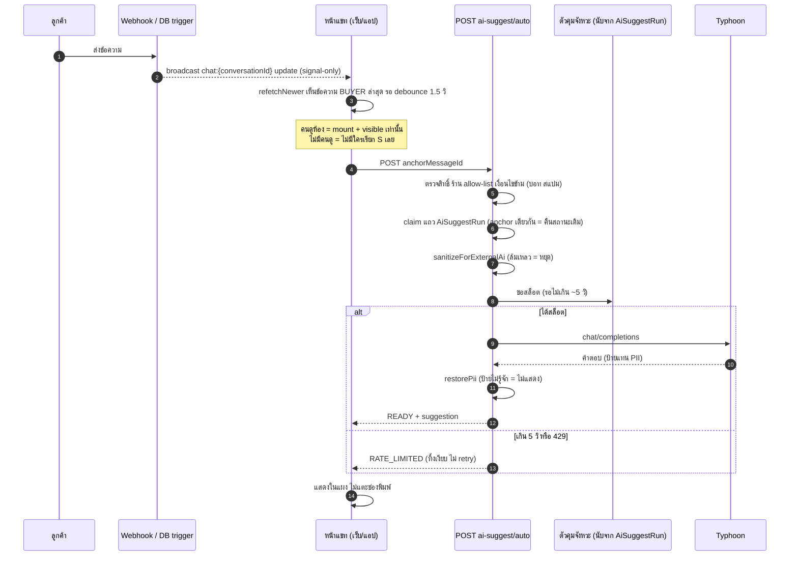
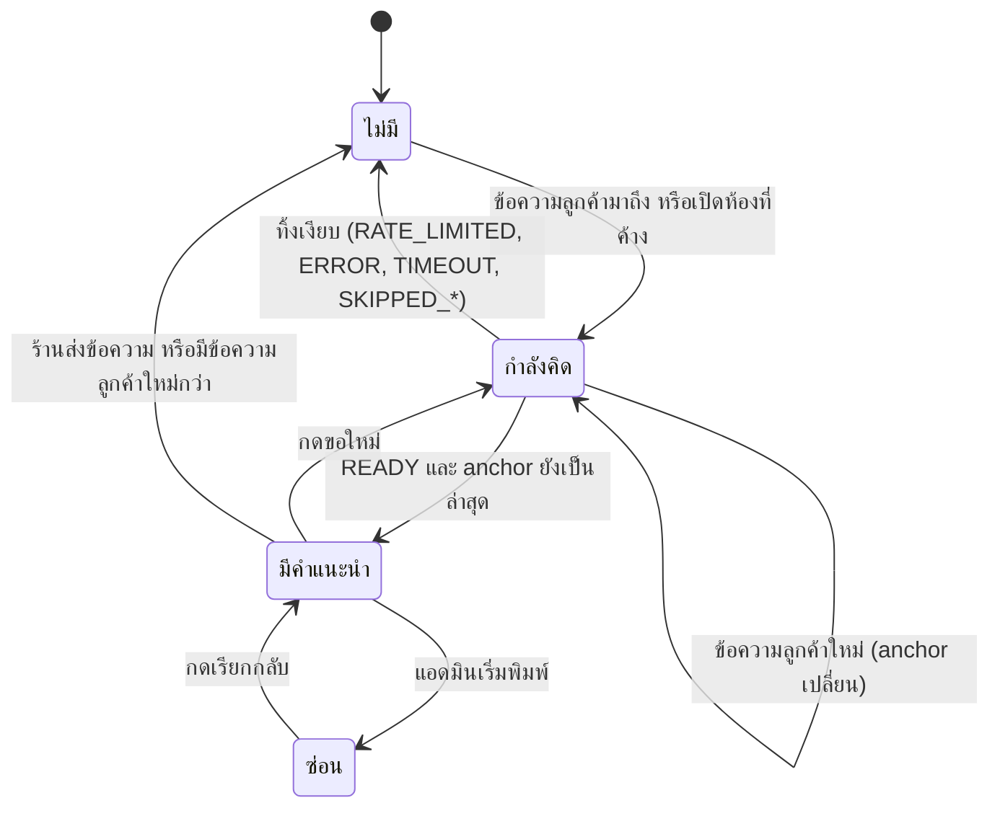

# 00019 — Extension: ย้ายผู้ให้บริการร่างคำตอบเป็น Typhoon + แสดงคำแนะนำอัตโนมัติเมื่อมีคนเปิดห้อง (2026-10-09)

> ต่อยอด **AI Reply Assistant** (feature 00019) ตามมติ user 2026-10-09 สองข้อ
> (1) เปลี่ยนผู้ให้บริการ AI ร่างคำตอบจาก Gemini เป็น **Typhoon** (opentyphoon.ai)
> (2) **แสดงคำแนะนำอัตโนมัติเมื่อแอดมินอยู่หน้าจอห้องนั้น** (ไม่ต้องกดขอ) แบบเดียวกับที่ gochat ทำ
>
> สถานะ: **อนุมัติแล้ว 2026-10-09** — user ตอบ "ตามข้อเสนอทั้งหมด" (OQ-1..11 = ข้อเสนอในตาราง §15 · OQ-12..14 ในภาคผนวก ก ใช้ข้อเสนอเป็นค่าตั้งต้น) · เอกสารนี้ทำหน้าที่ PRD + BRD ของส่วนขยาย
> คำศัพท์: **"คำแนะนำ"** = ข้อความร่างที่ AI เสนอ · **"ห้อง"** = Conversation · **"มีคนดูห้อง"** = หน้าแชทของห้องนั้นเปิดอยู่และมองเห็นได้ (นิยามเต็มที่ BR-AIT-03)
> **ขอบเขต:** เปลี่ยนเฉพาะ "AI ร่างคำตอบ" (`POST .../ai-suggest`) เท่านั้น ฟีเจอร์ที่ใช้ Gemini ตัวอื่นไม่ถูกแตะ (ดู Out of Scope)

---

## 0. Goal

เมื่อแอดมินเปิดห้องแชทอยู่ (เว็บหรือแอปมือถือ) แล้วข้อความล่าสุดเป็นของลูกค้า ระบบสร้าง **คำแนะนำ 1 ข้อ** ด้วย Typhoon ให้เห็นทันทีโดยไม่ต้องกดขอ
แอดมินกดเลือกเพื่อใส่ลงช่องพิมพ์แล้วตรวจก่อนส่งเองเสมอ (BR-AI-14 ไม่เปลี่ยน)
โดย **ไม่ส่งข้อมูลส่วนบุคคลออกไปให้ Typhoon** ตามเงื่อนไข API ของ Typhoon และเรียกโมเดลเฉพาะตอนมีคนดูห้องอยู่จริง

---

## 1. สิ่งที่พบจากโค้ดจริง (ตรวจ 2026-10-09 — ฐานของเอกสารนี้)

| # | ข้อค้นพบ | หลักฐาน |
|---|---|---|
| F-1 | **`ai-suggest` ไม่ได้กรอง PII เลย** ข้อความลูกค้าไปเป็น `turns` ดิบ ชื่อ/โน้ต CRM ไปดิบ ส่วนรูปส่ง inline ทั้งไฟล์ ขัดกับ BR-AI-09 และขัดกับที่ BR-AIM-01 เขียนไว้ (HR16: เอกสารอ้างข้อจำกัดที่โค้ดไม่ได้บังคับ) | `route.ts:272-289` (`text = m.body`), `:233` (`customerName`), `:362-363` (`customerNote`), `:322-354` (media); `grep pii-redact` ใน `src/` พบเฉพาะ `ai-enhance.service.ts:28`, `auto-reply.service.ts:19`, `pii-redact.ts`, เทสของมัน — ไม่มี `ai-suggest` |
| F-2 | `pii-redact.ts` จับเบอร์/อีเมล/เลขบัตร/เลขบัญชี/ที่อยู่ แล้ว **แทนด้วยป้ายคงที่ ไม่เก็บตารางจับคู่** จึงคืนค่าจริงกลับไม่ได้ และที่อยู่ตัดทั้งบรรทัดเฉพาะบรรทัดที่มีคำบอกตำแหน่ง + รหัสไปรษณีย์ 5 หลัก (ไม่ครอบ "อยู่หลังเซเว่นปากซอย 12") | `pii-redact.ts:24-30, 56-86`; ข้อจำกัดเขียนเองในหัวไฟล์ `:7-10` |
| F-3 | ปัจจุบันขอ **3 ข้อ** (prompt สั่ง 3 ทางเลือก, ตัดที่ 3) แผงแสดงเป็น 3 ปุ่ม | `gemini.ts:115`, `:168`, `:358`; `AiSuggestPanel.tsx:322-331` |
| F-4 | แผงเดิม **ยิง POST เองตอน mount** (หลังเช็คโควตา) แต่ตัวแผงถูก mount ก็ต่อเมื่อแอดมินกดปุ่ม AI เปิดเอง (`aiOpen`) จึงยังไม่ใช่ "อัตโนมัติเมื่ออยู่หน้าห้อง" | `AiSuggestPanel.tsx:129-130, 142-144`; `ChatThread.tsx:1423, 3222-3232, 3418-3420` |
| F-5 | แผงเดิมผูกกับระบบโควตา/เครดิต (ฟรี 10 ครั้ง/วัน, เกินหัก ฿1 ต้อง confirm) และมีชิปต้นทุน token/USD | `ai-suggest-limit.ts:6,9`; `route.ts:116-199`; `ai-suggest-quota.service.ts:103-134`; `AiSuggestPanel.tsx:227-228, 233-242` |
| F-6 | Realtime ของห้อง = Supabase Broadcast `chat:{conversationId}` event `update` (signal-only จาก trigger ใน DB เมื่อ insert `ChatMessage`) client รับแล้ว `refetchNewer()` + poll สำรองทุก 12 วิ **ไม่มีระบบ "ใครเปิดห้องไหน" ฝั่ง server** (presence มีเฉพาะประมูล `useAuctionPresence`) | `useSellerChatThread.ts:1000-1022, 1066-1077`; `prisma/migrations/20260703000400_chat_realtime_broadcast/migration.sql:19-52` |
| F-7 | แอปผู้ขายเปิดหน้าเว็บเดียวกัน แยกด้วย User-Agent `DeepSellerApp` (ไม่ใช่ UI ชุดแยก) หน้าแชทจึงรันโค้ด `ChatThread` ตัวเดียวกันทั้งเว็บและแอป | `src/lib/app-shell.ts:96, 106`; `seller/layout.tsx:20` (**สมมติฐาน A-3** ต้องยืนยันกับ repo `deep-seller-app`) |
| F-8 | ข้อความลูกค้าเข้าทาง webhook → `ingestInboundMessage` → งานหลังตอบ 200 ทำใน `after()` (push, ตอบอัตโนมัติ) webhook FB มี `maxDuration = 60` ห้ามเพิ่มงานหนักในเส้นทางหลัก | `facebook/webhook/route.ts:318, 375-378, 422-441, 463-473`, `:32` |
| F-9 | บอทตอบอัตโนมัติ (00023) ตัดสินเป็นรายข้อความ ข้ามเมื่อ `autoReplyEnabled === false`, `isSpam`, `handoffAt` มีค่า, หรือ `autoReplyPausedUntil` ยังไม่หมด ถ้า `NO_KEYWORD_MATCH` ห้องยังไม่ถูกล็อก | `auto-reply.service.ts:288, 296, 299, 302`; หมายเหตุ `:471-489` |
| F-10 | ตัวจำกัดอัตราที่มีอยู่ (`checkApiRateLimit`) เก็บใน `globalThis` ต่อ instance บน serverless **คุมเพดานรวมข้าม instance ไม่ได้** | `api-rate-limit.ts:6-7, 13-24` |
| F-11 | ผู้ให้บริการ Gemini ถูกใช้โดยฟีเจอร์อื่นด้วย (`generateText` ใน `ai-enhance`, `auto-reply`, `parse-address`) ต้องคง `gemini.ts` ไว้ทั้งไฟล์ | `gemini.ts:381` (`generateText`); `ai-enhance.service.ts:27`; `parse-address/route.ts` |
| F-12 | `.env.example` คอมเมนต์ `GEMINI_MODEL` บอก default `gemini-2.0-flash` แต่โค้ดจริง default เป็น `gemini-2.5-flash-lite` (เอกสารล้าสมัย) | `.env.example:84` vs `gemini.ts:25-27` |
| F-13 | บริบทลูกค้า (`buildCustomerBlock`) ใช้ allow-list ไม่มีเบอร์/อีเมล/ที่อยู่ จึงไม่ใช่ช่องรั่ว แต่ `instruction` (ที่เจ้าของร้านเขียนเอง) และ `contextBlock` ยังต้องผ่าน redaction เพราะอาจมีเบอร์ร้าน/เลขบัญชีรับโอน | `ai-context.service.ts:14, 141-142`; `gemini.ts:129-147` |

---

## 2. ข้อจำกัดทางกฎหมายของ Typhoon (ต้องปฏิบัติตาม — ไม่ใช่ตัวเลือก)

เงื่อนไข Typhoon API (https://opentyphoon.ai/tac):

| ข้อ | สาระ | ผลต่อเรา |
|---|---|---|
| 2 | ผู้ใช้รับรองว่า Input **ไม่มีข้อมูลส่วนบุคคล/ข้อมูลอ่อนไหว** | ต้องปิดบังก่อนส่ง **ทุกครั้ง** ไม่มีเส้นทางข้าม |
| 4 | ให้สิทธิ์ใช้ Input เทรนโมเดล **ถาวร** | สิ่งที่ส่งไปแล้วเรียกคืนไม่ได้ รวมถึงนโยบาย/ราคา/คำสั่งประจำร้านที่เป็นความลับทางธุรกิจ |
| 7 | ส่งข้อมูลส่วนบุคคลโดยไม่มีสิทธิ์ = **ระงับบริการ** | ความผิดพลาดครั้งเดียวอาจทำให้กุญแจถูกระงับ กระทบ gochat ที่ใช้กุญแจเดียวกันด้วย |
| — | ไม่มีแผนจ่ายเงิน (ใช้ API ฟรี) | เพดาน 5 req/s · 200 req/นาที รวมทั้งกุญแจ ใช้ร่วมกับ gochat |

**ข้อสรุปที่ผูกกับ requirement:** redaction เป็น **gate แบบ fail-closed** (ปิดบังไม่สำเร็จ = ไม่เรียก Typhoon) และการปิดบังเป็น **การลดความเสี่ยง ไม่ใช่การกำจัดความเสี่ยง** (R-1) ซึ่ง user ต้องรับรู้ก่อนอนุมัติ

---

## 3. ขอบเขต

**อยู่ในขอบเขต (In scope)**
- ตัวเรียก Typhoon + จุดสลับผู้ให้บริการจุดเดียวสำหรับ AI ร่างคำตอบ
- ชั้นปิดบังข้อมูลส่วนตัว (sanitize) ก่อนส่ง + คืนค่าจริงกลับหลังได้ผล
- การสร้างคำแนะนำอัตโนมัติเมื่อมีคนดูห้อง + เก็บผลให้เปิดห้องแล้วเห็นทันที
- ตัวคุมจังหวะ/คิว/ทิ้งเงียบ + บันทึกผลทุกครั้ง
- ปรับพฤติกรรม `AiSuggestPanel` (ไม่ออกแบบ layout ใหม่)
- ผลของการเปลี่ยนต่อโควตา/เครดิตเดิม

**นอกขอบเขต** ดูหัวข้อ 12

---

## 4. User Stories (รูปแบบเดียวกับ PRD §2)

| ID | Story |
|---|---|
| US-AIT-01 | ในฐานะ **แอดมินร้าน** ฉันอยากเห็นคำแนะนำคำตอบทันทีที่ลูกค้าส่งข้อความเข้ามาขณะที่ฉันเปิดห้องนั้นอยู่ เพื่อไม่ต้องกดขอและตอบได้เร็วขึ้น |
| US-AIT-02 | ในฐานะ **แอดมินร้าน** เมื่อฉันเปิดห้องที่ลูกค้าส่งข้อความค้างไว้ ฉันอยากเห็นคำแนะนำ (หรือสถานะ "AI กำลังคิด") ภายในไม่กี่วินาที |
| US-AIT-03 | ในฐานะ **แอดมินร้าน** ฉันอยากพิมพ์เองได้โดยคำแนะนำไม่มาเขียนทับสิ่งที่ฉันกำลังพิมพ์ |
| US-AIT-04 | ในฐานะ **เจ้าของร้าน** ฉันอยากมั่นใจว่าเบอร์/ที่อยู่/เลขบัญชีของลูกค้าไม่ถูกส่งไปให้ผู้ให้บริการ AI ภายนอก |
| US-AIT-05 | ในฐานะ **ทีมพัฒนา** ฉันอยากสลับผู้ให้บริการ/โมเดลได้ที่จุดเดียว และเห็นสถิติ `rate_limited` เพื่อตัดสินใจว่าเมื่อไรต้องย้ายออกจาก API ฟรี |
| US-AIT-06 | ในฐานะ **แอดมินร้านที่มีบอทตอบอยู่** ฉันไม่อยากให้ AI ร่างซ้อนกับคำตอบของบอทในข้อความเดียวกัน |

---

## 5. Functional Requirements — FR-AIT

> ไฟล์ "(ใหม่/เสนอ)" = ยังไม่มีในโค้ด · "บังคับที่" = จุดที่ต้องมีโค้ด/เทสที่แดงเมื่อกฎถูกละเมิด (convention `rule-must-be-enforced-not-described`)
> ทุกข้อเป็น **must-have** เว้นแต่ระบุ nice-to-have

| FR | ข้อกำหนด | Acceptance (ทดสอบได้) | บังคับที่ |
|---|---|---|---|
| FR-AIT-01 | **จุดสลับผู้ให้บริการจุดเดียว** `resolveSuggestProvider(shopId)` คืน `typhoon` หรือ `gemini` ตาม env + allow-list (FR-AIT-15) ทุกที่ที่ร่างคำตอบต้องเรียกผ่านฟังก์ชันเดียว ห้าม route import `typhoon.ts`/`gemini.ts` ตรงเพื่อร่างคำตอบ | เปลี่ยนค่า env แล้วรีสตาร์ท → ทุก request ไปผู้ให้บริการใหม่โดยไม่แก้โค้ด · `grep "generateReplySuggestions" src/app` พบเฉพาะการเรียกผ่านตัวสลับ | `src/lib/reply-suggest-provider.ts` (ใหม่) · แก้ `ai-suggest/route.ts:356-364, 387-395` ให้เรียกผ่านตัวสลับ · เทส `reply-suggest-provider.test.ts` |
| FR-AIT-02 | **ตัวเรียก Typhoon** `POST https://api.opentyphoon.ai/v1/chat/completions` (OpenAI-compatible) Bearer `TYPHOON_API_KEY` โมเดลจาก `TYPHOON_MODEL` (default `typhoon-v2.5-30b-a3b-instruct`) timeout แข็ง ไม่ retry คืนข้อความ 1 ข้อ ไม่ส่ง response format ที่ Typhoon ไม่รองรับ (parse เองแบบทนข้อความเปล่า/มีรั้ง) ไม่มีกุญแจ = `TyphoonNotConfiguredError` | mock fetch: ส่งถูก URL/header/body · 429 → throw `TyphoonRateLimitedError` โดยไม่ยิงซ้ำ · ตอบว่าง → `TyphoonApiError` · key หายไม่ยิง network | `src/lib/typhoon.ts` (ใหม่, `server-only`) · เทส `typhoon.test.ts` |
| FR-AIT-03 | **สร้างอัตโนมัติเมื่อลูกค้าส่งข้อความและมีคนดูห้อง** (กฎ ก) client ที่เปิดห้องอยู่ได้รับ realtime signal → รู้ว่าข้อความล่าสุดเป็น BUYER → รอ debounce → ขอคำแนะนำสำหรับ `anchorMessageId` = id ข้อความ BUYER ล่าสุด | ห้องเปิดอยู่ ลูกค้าส่งข้อความ → ภายใน 5 วิเห็นคำแนะนำ (หรือสถานะไม่มีผล) · ไม่มีการกดปุ่มใด ๆ | hook ใหม่ `useAutoSuggest` ใน `ChatThread.tsx` เกาะ `refetchNewer` ของ `useSellerChatThread.ts:1010-1013` · API ใหม่ `POST /api/chat/conversations/{id}/ai-suggest/auto` |
| FR-AIT-04 | **สร้างตอนเปิดห้อง** (กฎ ข) เมื่อ mount ห้องแล้วข้อความล่าสุดเป็น BUYER และยังไม่มีผลของ anchor นั้น → สร้างและแสดงสถานะ "AI กำลังคิด" ถ้ามีผลอยู่แล้ว → แสดงทันทีโดยไม่เรียกโมเดลซ้ำ | เปิดห้องที่ค้างข้อความลูกค้า ไม่มีผล → เห็นสถานะกำลังคิด แล้วเห็นคำแนะนำ · เปิดซ้ำอีกครั้งในนาทีเดียวกัน → เห็นทันที `AiSuggestRun` ไม่เพิ่มแถว | เส้นทางเดียวกับ FR-AIT-03 (idempotent ตาม FR-AIT-13) |
| FR-AIT-05 | **ไม่มีคนดู = ไม่เรียกโมเดล** (กฎ ค) การสร้างเกิดจาก client ที่ mount ห้อง + `document.visibilityState === 'visible'` เท่านั้น ห้ามมีโค้ดฝั่ง server (webhook/cron/trigger) เรียก Typhoon เอง | ปิดแท็บ/สลับไปแอปอื่นแล้วลูกค้าส่งข้อความ → ไม่มีแถว `AiSuggestRun` ใหม่ · ไม่มีการเรียกผู้ให้บริการจาก `facebook/webhook`, `line/webhook` | ไม่มีโค้ดเรียก provider นอก `ai-suggest/*` · เทส grep-gate: `webhook` ไม่ import `reply-suggest-provider` |
| FR-AIT-06 | **คำแนะนำ 1 ข้อ** ในโหมดอัตโนมัติและกด "ขอใหม่" (เดิม 3 ข้อ, F-3) | response มี `suggestion: string` เดียว · panel แสดง 1 รายการ | prompt ตัวเรียก Typhoon · แก้ `AiSuggestPanel.tsx:322-331` (ดู OQ-4) |
| FR-AIT-07 | **ไม่เขียนลงช่องพิมพ์เอง** คำแนะนำแสดงในแผงเท่านั้น ใส่ช่องพิมพ์เมื่อแอดมินกดเลือก · ถ้าแอดมินเริ่มพิมพ์ แผงซ่อน (มีทางเรียกกลับ) และคำแนะนำที่มาทีหลังไม่แทรกช่องพิมพ์ | พิมพ์ "abc" ในช่อง → คำแนะนำมาถึง → ช่องยังเป็น "abc" ตลอด · แผงซ่อน มีปุ่มเรียกกลับ | `ChatThread.tsx` (`setText` เรียกเฉพาะจาก `onPick`, ปัจจุบัน `:3226-3229`) · เทสพฤติกรรม hook |
| FR-AIT-08 | **ทิ้งผลที่เก่าแล้ว** ผลของ anchor ที่ไม่ใช่ข้อความ BUYER ล่าสุดของห้อง (มีข้อความใหม่/ร้านตอบไปแล้ว) ห้ามแสดง | ลูกค้าส่ง A → ระหว่างรอ ลูกค้าส่ง B → แสดงเฉพาะผลของ B · ร้านตอบก่อนผลมา → ไม่แสดงผลเก่า | เทียบ `anchorMessageId` กับข้อความล่าสุดทั้งฝั่ง server (ตอนอ่าน `GET`) และ client |
| FR-AIT-09 | **เงื่อนไขข้าม (ไม่เรียกโมเดล)** ข้ามเมื่อ: ข้อความล่าสุดไม่ใช่ BUYER · `isSpam` · ห้องอยู่ในมือบอท (งานตอบอัตโนมัติของ anchor ยัง PENDING/กำลังทำ, หรือเธรดเปิดบอทและ `handoffAt` ว่าง และบอทตอบ anchor นั้นแล้ว) · ไม่มีข้อความให้ตอบ (turns ว่าง) · ไม่ได้อยู่ใน allow-list · ไม่มีกุญแจ ทุกกรณีคืน `status` ที่ระบุเหตุผล (ไม่ใช่ error) | แต่ละเงื่อนไขมีเทสหนึ่งข้อ ยืนยัน `outcome` ที่บันทึก และ **ไม่มี** การเรียก fetch ไป Typhoon | `ai-suggest-auto.service.ts` (ใหม่) ตัดสินจากฟิลด์ที่ `auto-reply.service.ts:262-304` ใช้ (`isSpam`/`handoffAt`/`autoReplyEnabled`/`autoReplyPausedUntil`) |
| FR-AIT-10 | **ปิดบังข้อมูลส่วนตัวก่อนส่งทุกครั้ง (fail-closed)** ทุก string ที่จะออกไปหา Typhoon ผ่านฟังก์ชันเดียว `sanitizeForExternalAi` ได้แก่ turns, `instruction`, `contextBlock` ครอบ: เบอร์/อีเมล/เลขบัตร/เลขบัญชี/ที่อยู่ (ใช้ `pii-redact.ts`) + **ชื่อที่ระบบรู้** (alias, realName, ชื่อ ExternalContact/Customer) → "ลูกค้า" · ชื่อแอดมิน → "แอดมิน" · **ไม่ส่ง `customerNote` และ `customerName` ดิบ** · รูป/เสียง/ไฟล์ → `[รูป]`/`[ข้อความเสียง]`/`[ไฟล์]` (ไม่ส่งสื่อเลย) · ถ้า sanitize throw → ไม่เรียก Typhoon | (1) ข้อความ "โทร 081-234-5678 ส่งที่ ซ.5 ต.บางนา 10260" → payload ไม่มีตัวเลขนั้น/ที่อยู่ (2) ชื่อ alias "สมชาย" ในประโยค → "ลูกค้า" (3) mock `sanitize` ให้ throw → fetch ไม่ถูกเรียก (4) payload ที่ส่งจริงไม่มี `inline_data`/base64/URL ของสื่อ | `src/lib/ai-suggest-sanitize.ts` (ใหม่) · เทส `ai-suggest-sanitize.test.ts` + **mutation test**: ถอด `redactPii` ออก 1 ชนิด เทสต้องแดง (convention `mutation-silence-means-weak-corpus` — corpus ต้องมีเบอร์หลายรูปแบบ, +66, คั่นขีด/วรรค, เลขบัตร 13 หลัก, อีเมล, เลขบัญชี 10-15 หลัก) |
| FR-AIT-11 | **คืนค่าจริงกลับก่อนแสดง** ตัวปิดบังรอบนี้ต้องทำแบบมีตารางจับคู่ (ป้ายมีลำดับ เช่น `[เบอร์โทร#1]`) เก็บตารางในหน่วยความจำของ request เท่านั้น (ไม่เก็บ DB ไม่ log) เมื่อ AI ตอบมีป้าย → เติมค่าจริงจากตาราง · ถ้ามีป้ายที่หาค่าไม่เจอ → **ถือว่าไม่มีผล (ไม่แสดง)** เพื่อกันแอดมินส่งข้อความที่มีป้ายหลุดไปถึงลูกค้า | AI ตอบ "จัดส่งไป [ที่อยู่#1] ตามเบอร์ [เบอร์โทร#1] นะคะ" → แอดมินเห็นค่าจริง · AI ตอบป้ายที่ไม่มีในตาราง → `outcome=UNRESOLVED_TOKEN` ไม่มีคำแนะนำ | เพิ่ม `redactPiiReversible()` + `restorePii()` ใน `pii-redact.ts` แบบ **additive** (ห้ามเปลี่ยนพฤติกรรม `redactPii` เดิมที่ `ai-enhance.service.ts:385,422` และ `auto-reply.service.ts:1012` พึ่งอยู่ · เทส `pii-redact.test.ts` เดิมต้องผ่านไม่แก้) |
| FR-AIT-12 | **ตัวคุมจังหวะ** ก่อนยิง Typhoon ต้องผ่านทั้ง 3 เพดาน: (ก) รวมทั้งระบบ ≤ `AI_SUGGEST_RPS` (default 3 ครั้ง/วินาที) (ข) รวมทั้งระบบ ≤ `AI_SUGGEST_RPM` ต่อนาที (ค่าตั้งต้นรอ user ตัดสิน OQ-6) (ค) ต่อร้าน ≤ ครึ่งหนึ่งของ (ข) ถ้ายังไม่ผ่าน → รอสั้น ๆ แล้วลองใหม่ได้จนครบ **~5 วินาที** จากเวลาเริ่ม ถ้าเกิน หรือ Typhoon ตอบ 429 → **ทิ้งเงียบ ไม่ retry** บันทึก `outcome=RATE_LIMITED` | จำลอง 10 คำขอพร้อมกัน → ยิงจริงไม่เกิน 3 ในวินาทีเดียวกัน ที่เหลือรอหรือทิ้ง · ร้านเดียวส่ง 100 คำขอใน 1 นาที → ไม่เกินโควตาร้าน และร้านอื่นไม่โดนบล็อก · 429 → ไม่มี fetch ซ้ำ + แถว `RATE_LIMITED` | `ai-suggest-auto.service.ts` นับจากตาราง `AiSuggestRun` (F-10: ตัวนับ in-memory ใช้ไม่ได้ข้าม instance) · เทส concurrency |
| FR-AIT-13 | **เก็บผลต่อห้อง + idempotent** ผลเก็บใน `AiSuggestRun` (หัวข้อ 9) คีย์ (conversationId, anchorMessageId, attempt) ขอซ้ำ anchor เดียวกันขณะ `THINKING` หรือ `READY` → ไม่เรียกโมเดลซ้ำ คืนสถานะเดิม · `GET .../ai-suggest/auto` คืนผลล่าสุดของห้อง (ใช้ตอนเปิดห้องและตอนผู้ดูคนที่สองรอผล) · `THINKING` ค้างเกิน 30 วิ ถือว่าตาย ขอใหม่ได้ | แอดมิน 2 คนเปิดห้องเดียว ลูกค้าส่งข้อความ → `AiSuggestRun` เพิ่ม 1 แถว เรียกโมเดล 1 ครั้ง ทั้งสองคนเห็นผลเดียวกัน · ยิง 2 request พร้อมกัน → 1 ชนะ อีกอันได้ `THINKING` | unique index + claim แบบ conditional (รูปแบบเดียวกับ `claimFreeUsageOrFail` `ai-suggest-quota.service.ts:103-134`) · เทส |
| FR-AIT-14 | **การคิดเงิน/โควตา:** เส้นทาง Typhoon (อัตโนมัติและกด "ขอใหม่") **ไม่นับโควตาฟรี ไม่หักเครดิต ไม่ถามยืนยัน** (ต้นทุนต่อครั้ง = 0) ระบบโควตา/เครดิต/`AiSuggestUsageEvent` เดิม **คงโค้ดไว้ทั้งหมด** และใช้เมื่อผู้ให้บริการของร้านนั้นเป็น Gemini (ห้ามลบ) แผงไม่เรียก `GET /api/chat/ai-quota` และไม่แสดง "เหลือฟรีวันนี้" "ใช้ได้ไม่จำกัด" ชิปต้นทุน/token เมื่อใช้ Typhoon (ดู OQ-5) | ร้านใน allow-list ขอคำแนะนำ 20 ครั้ง → `AiSuggestDailyUsage` ไม่เปลี่ยน, `WalletTransaction` ไม่เพิ่ม · ร้านนอก allow-list ยังเจอ 402 `QUOTA_EXCEEDED` ที่ครั้งที่ 11 ตามเดิม | แยกสาขาใน `route.ts:129-199` ตามผู้ให้บริการ (จุดเดียว: `resolveSuggestProvider`) · เทสทั้งสองสาขา |
| FR-AIT-15 | **ช่วงนำร่อง (allow-list)** เปิด Typhoon เฉพาะร้านใน `TYPHOON_SUGGEST_SHOP_IDS` (คั่นด้วยจุลภาค, `*` = ทุกร้าน) ร้านนอกรายการใช้ Gemini แบบมือกด (พฤติกรรมเดิม 100%) ค่าเริ่มต้น = ว่าง = ไม่มีร้านไหนใช้ Typhoon (ปลอดภัยไว้ก่อน) — **รอ user ตัดสิน OQ-2** | ตั้งรายการ 1 ร้าน → ร้านนั้นใช้ Typhoon ร้านอื่นยัง Gemini · ว่าง → ทุกร้าน Gemini ตามเดิม | `resolveSuggestProvider` · `.env.example` |
| FR-AIT-16 | **ขอใหม่ด้วยมือ (↻)** ยังทำได้ ใช้เส้นทางเดียวกัน (sanitize → pacing → Typhoon) สร้างแถว `attempt+1` ของ anchor เดิม ยังอยู่ใต้ rate limit 15/นาที/ผู้ใช้เดิม (`route.ts:79`) | กด ↻ 2 ครั้ง → 2 แถว attempt ต่างกัน ไม่เกิน limit · ครั้งที่ 16 ใน 1 นาที → 429 | ใช้ `checkApiRateLimit` เดิม (เพดาน/ผู้ใช้ยังใช้ได้เพราะเป็น per-instance แบบ best-effort — ไม่ใช่ตัวคุมเพดาน Typhoon) |
| FR-AIT-17 | **บันทึกผลทุกครั้ง** ทุกคำขอที่ผ่านด่านเข้ามา บันทึก `outcome` ∈ `OK`, `RATE_LIMITED`, `TIMEOUT`, `ERROR`, `UNRESOLVED_TOKEN`, `SKIPPED_NOT_BUYER`, `SKIPPED_BOT`, `SKIPPED_SPAM`, `SKIPPED_NOT_ALLOWED`, `SKIPPED_EMPTY` + `latencyMs`, token เข้า/ออก, provider, model, trigger (`AUTO_NEW_MESSAGE` / `AUTO_OPEN` / `MANUAL`) **ห้ามบันทึกเนื้อหาข้อความ ลง log ใด ๆ** (เก็บเฉพาะ `suggestion` ที่คืนค่าจริงแล้วในแถวเดียวสำหรับแสดงผล — ดู BR-AIT-09) log บันทึกเฉพาะ `PiiKind` ที่เจอ (ตาม `pii-redact.ts:20-21`) | query `outcome` group by วัน → ตัดสินได้ว่า `RATE_LIMITED` กี่ % · grep log ไม่พบเนื้อความลูกค้า | ตาราง `AiSuggestRun` · เทส "ไม่มี console.* ที่รับ body/text" ในไฟล์ใหม่ทั้ง 3 |
| FR-AIT-18 | **ไม่ส่งสื่อเข้า Typhoon เลย** สวิตช์ `includeMediaContext` ไม่มีผลกับ Typhoon (ไม่มีรูป/เสียงออกไปแม้เปิด) หน้า `/settings/ai` ต้องสื่อให้ร้านเข้าใจว่าสวิตช์นี้ใช้กับผู้ให้บริการที่รองรับสื่อเท่านั้น (ข้อความจริงให้ `safepay-ux` ทำ) | ร้านใน allow-list เปิดสวิตช์สื่อ + ลูกค้าส่งรูป → payload ไป Typhoon มีแค่ `[รูป]` | `ai-suggest/route.ts:322-354` ข้ามบล็อก media เมื่อผู้ให้บริการ = Typhoon · เทส |

---

## 6. Business Rules — BR-AIT

| BR | กฎ |
|---|---|
| **BR-AIT-01 (ปิดบังข้อมูลส่วนตัว)** | ห้ามส่งข้อมูลส่วนบุคคล/อ่อนไหวของลูกค้า (เบอร์โทร อีเมล เลขบัตร เลขบัญชี ที่อยู่ ชื่อ) หรือไฟล์ภาพ/เสียง ไปให้ Typhoon ทุกกรณี ทุก string ที่ออกไปต้องผ่าน `sanitizeForExternalAi` และ **ถ้าปิดบังไม่สำเร็จ = ไม่เรียก** (fail-closed) ข้อยกเว้น BR-AI-09-EX (parse-address, Gemini) **ไม่ขยายมาครอบ Typhoon** |
| **BR-AIT-02 (เงื่อนไขของ Typhoon)** | ปฏิบัติตาม TAC ข้อ 2/4/7 (หัวข้อ 2) การปิดบังเป็นการลดความเสี่ยง ไม่ใช่ศูนย์ ชื่อที่ระบบไม่รู้จักซึ่งพิมพ์แทรกในประโยค ที่อยู่ที่ไม่มีรหัสไปรษณีย์ หรือเบอร์ที่เขียนเป็นตัวอักษร อาจหลุดได้ (R-1) |
| **BR-AIT-03 (เรียกเฉพาะมีคนดู)** | "มีคนดูห้อง" = หน้าแชทของห้องนั้น mount อยู่ และ `document.visibilityState === 'visible'` (ทั้งเว็บและแอปมือถือที่เปิดหน้าเดียวกัน) · (ก) มีคนดู + ลูกค้าส่งข้อความ → สร้างทันที · (ข) เปิดห้องที่ข้อความล่าสุดเป็นลูกค้าและยังไม่มีผลของ anchor นั้น → สร้างตอนเปิด แสดง "AI กำลังคิด" · (ค) ไม่มีคนดู → **ไม่เรียกโมเดลเลย** · ห้ามสร้างล่วงหน้า/สร้างย้อนหลังให้ห้องที่ไม่มีคนเปิด |
| **BR-AIT-04 (คุมจังหวะ)** | ฝั่งเราคุม ~3 ครั้ง/วินาที (เพดาน Typhoon แชท 5 req/s · 200 req/นาที รวมทั้งกุญแจ ซึ่งใช้ร่วมกับ gochat) · แบ่งต่อร้าน: ร้านเดียวใช้ไม่เกินครึ่งของเพดานต่อนาทีที่เรากำหนด · รอเกิน ~5 วิ หรือได้ 429 = ทิ้งเงียบ ไม่ retry (คำแนะนำที่มาช้าไม่มีประโยชน์) · บันทึก `RATE_LIMITED` เสมอ เพื่อตัดสินว่าเมื่อไรต้องย้ายออกจาก API ฟรี |
| **BR-AIT-05 (ทิ้งผลเก่า)** | คำแนะนำผูกกับ `anchorMessageId` เท่านั้น แสดงได้เมื่อ anchor = ข้อความ BUYER ล่าสุดของห้อง และข้อความล่าสุดของห้องยังเป็นของลูกค้า |
| **BR-AIT-06 (คนตัดสินใจส่ง)** | ไม่เปลี่ยน BR-AI-14 / FR-008: คำแนะนำไม่ถูกส่งเอง ไม่ถูกใส่ช่องพิมพ์เอง การทำงาน "อัตโนมัติ" ในเอกสารนี้หมายถึง **แสดง** ไม่ใช่ **ส่ง** (BRD §7.1 "ไม่มีการตอบอัตโนมัติ" ยังเป็นจริง ต้องเติมประโยคชี้แจง) |
| **BR-AIT-07 (จุดสลับจุดเดียว)** | การเลือกผู้ให้บริการ/โมเดลต้องอยู่ที่ `resolveSuggestProvider` + env เท่านั้น แผนอนาคต: ก่อนเปิดให้ร้านลูกค้าทั่วไป อาจย้ายไป Gemini แบบจ่ายเงิน ต้องทำได้โดยไม่แก้ route/แผง |
| **BR-AIT-08 (การคิดเงิน)** | ผู้ให้บริการที่ต้นทุนต่อครั้ง = 0 (Typhoon ฟรี) ไม่ผ่านระบบโควตา/เครดิต เมื่อสลับกลับไปผู้ให้บริการที่มีต้นทุน ระบบโควตาเดิม (BR-AIQ-01..14) กลับมามีผลทันทีโดยไม่ต้องแก้โค้ด · BR-AIQ-10 ("ครอบเฉพาะ endpoint ai-suggest") ยังจริง: เส้นทาง `/auto` ใหม่ถือเป็นส่วนหนึ่งของ ai-suggest |
| **BR-AIT-09 (การเก็บผล)** | เก็บ `suggestion` (หลังคืนค่าจริง) ได้เฉพาะในแถว `AiSuggestRun` เพื่อให้เปิดห้องแล้วเห็นทันที · ห้ามเก็บ transcript/payload ที่ส่งไป Typhoon · ห้ามเก็บตารางจับคู่ป้าย · ห้ามส่งเนื้อหาผ่านช่อง realtime (signal-only ตาม `chat_message_realtime_broadcast` migration บรรทัด 15) |
| **BR-AIT-10 (ช่วงนำร่อง)** | ช่วงนำร่องจำกัดเฉพาะร้านใน allow-list (FR-AIT-15) การเปิดให้ร้านลูกค้าทั่วไป ต้องผ่าน user อนุมัติแยกและต้องมีการแจ้ง/ขอความยินยอมเรื่องข้อ 4 ของ TAC (OQ-2) |

### 6.1 การปรับข้อตกลงเดิมที่ต้องแก้พร้อมกัน (sync)

- **BR-AI-09** (BRD §8.2, บรรทัด 465): เพิ่มประโยค "สำหรับผู้ให้บริการที่ห้าม PII ในเงื่อนไขการใช้งาน (Typhoon) ข้อความลูกค้าทุกชนิดต้องผ่านการปิดบังก่อนส่งตาม BR-AIT-01" และบันทึกว่า **เดิมโค้ดไม่ได้บังคับกับข้อความลูกค้า (F-1)**
- **BR-AI-09-EX** (BRD §8.2, บรรทัด 466-477): ไม่แก้เนื้อหา เพิ่มบรรทัดเดียวว่า "ข้อยกเว้นนี้ใช้กับ `parse-address` (Gemini) เท่านั้น ไม่ครอบคลุมเส้นทางร่างคำตอบของ Typhoon"
- **BR-AI-15** (BRD §8.4, บรรทัด 487): "ถอยไปรุ่นสำรอง" ใช้กับ Gemini เท่านั้น Typhoon **ไม่มีสายสำรอง** ล้มเหลวคือทิ้งเงียบ (BR-AIT-04)
- **BR-AIM-01** (`EXTENSIONS-2026-07-25.md`): แก้คำว่า "ต่างจากบริบทข้อความที่กรอง PII" ให้ตรงความจริง (F-1) และระบุว่าสวิตช์สื่อไม่มีผลกับ Typhoon
- **BRD §7.2** (บรรทัด 447): "พึ่งพาผู้ให้บริการ AI ภายนอก" เพิ่มชื่อ Typhoon และข้อจำกัดข้อ 2/4/7
- **EXTENSIONS-2026-07-29-usage-limit.md**: เพิ่มหมายเหตุชี้มาที่ BR-AIT-08 ว่าเส้นทาง Typhoon ไม่ผ่านโควตา

---

## 7. Non-Functional Requirements — NFR-AIT

| NFR | ข้อกำหนด |
|---|---|
| NFR-AIT-Latency | จากข้อความลูกค้าถึงผู้ดูเห็นคำแนะนำ **p95 ≤ 4 วินาที** (benchmark ของ gochat: Typhoon ตอบ ~0.9-1.2 วิ + debounce ~1.5 วิ + realtime/refetch) ต้องวัดซ้ำบนระบบเราตอน QA ไม่ใช่เชื่อตัวเลขของ gochat |
| NFR-AIT-Webhook | **ห้ามเพิ่มงานในเส้นทาง webhook** (FR-AIT-05) webhook ไม่เรียก Typhoon ไม่รอผลใด ๆ เวลาตอบ 200 ของ `facebook/webhook` และ `line/webhook` ต้องไม่เปลี่ยน |
| NFR-AIT-Failsoft | ล้มเหลวทุกแบบ (timeout, 429, ตอบเปล่า, ไม่มีกุญแจ, DB บันทึกไม่ได้) → แอดมินพิมพ์ตอบได้ตามปกติ ไม่มีหน้า error ที่ขัดการทำงาน ไม่ toast สีแดงถี่ ๆ (ทิ้งเงียบ) · **ต่างจาก** gate โควตาเดิมที่ fail-closed (NFR-AIQ-Consistency) เพราะเส้นทางนี้ไม่มีเงินเกี่ยว |
| NFR-AIT-Secrets | `TYPHOON_API_KEY` อ่านจาก `process.env` ฝั่ง server เท่านั้น (`server-only`) ไม่อยู่ใน error message หรือ log |
| NFR-AIT-Cache | ทุก response ของ `/ai-suggest/auto` เป็นข้อมูลต่อร้าน: `force-dynamic` + `Cache-Control: private, no-store, max-age=0, must-revalidate` (เหมือน `ai-suggest/route.ts:44`) |
| NFR-AIT-Sec | `shopId` ได้จากเธรดผ่าน `resolveConversationShopId` เท่านั้น (feature 00037, ตามแบบ `route.ts:92-99`) ห้ามรับจาก client · `sessionUserId()` ไม่ใช่ cast · ownership อยู่ใน WHERE `{id, shopId}` |
| NFR-AIT-Load | ผู้ดู 1 คนต่อห้องสร้างการเรียกได้ไม่เกิน 1 ครั้งต่อ anchor (ไม่นับกด ↻) ห้ามมี polling ที่ยิง Typhoon · poll ผลใช้ `GET` ซึ่งอ่าน DB อย่างเดียว ทุก ~1.5 วิ สูงสุด ~10 วิ เฉพาะตอน `THINKING` |
| NFR-AIT-i18n | ข้อความใหม่ใน UI ผ่านระบบสลับภาษา TH/EN (00047) ไม่ hardcode ไทยในคอมโพเนนต์ที่ใช้ร่วม |
| NFR-AIT-A11y | สถานะ "กำลังคิด" และการมาถึงของคำแนะนำประกาศด้วย live region (`role="status"`) · ปุ่มใหม่ทุกปุ่มมี role รองรับ `aria-label` (convention `aria-name-requires-supporting-role`) · tap target ตามที่ `AiSuggestPanel.tsx` ใช้อยู่ (`size-11 lg:size-7`) |

---

## 8. ลำดับการทำงาน (Design)

### 8.1 Flow อัตโนมัติ



### 8.2 สถานะของคำแนะนำ (ฝั่งแผง)



### 8.3 ทำไมเสนอให้ client เป็นผู้ยิง (D-1) แทนระบบ presence ฝั่ง server

gochat ใช้ native app ยิง POST viewing + ย้ำทุก 15 วิ + on=false ตอนออก และ server ประกาศออกแทนเมื่อสายขาด ซึ่งจำเป็นเพราะ **webhook ฝั่ง server ต้องรู้ว่ามีคนดู** ถึงจะสร้างให้
ของเรา **ไม่มี presence ฝั่ง server ของห้องแชท** (F-6) และหน้าแชทบนแอปคือหน้าเว็บเดียวกัน (F-7) การให้ client ที่เปิดห้องอยู่เป็นผู้ขอ:
- พฤติกรรมครบ (ก)(ข)(ค) ตามที่ตกลงกับ gochat โดยไม่ต้องมี presence store, heartbeat, หรือกลไก "สายขาด server ประกาศออก"
- ไม่แตะ webhook เลย (NFR-AIT-Webhook)
- แอปมือถือนับอัตโนมัติ (ผ่าน WebView) แทนที่จะต้องมี native protocol ใหม่

**ข้อแลกเปลี่ยน:** ต้องรอ client เห็นข้อความก่อน (+~1.5-2 วิ เทียบกับ server-trigger) · ถ้า client เป็น WebView ที่ระบบปฏิบัติการพักไว้ จะไม่สร้าง (ตรงกับกฎ ค) · ทางเลือกแบบ gochat เต็มรูปแบบเก็บเป็น OQ-1

---

## 9. Data Model (เสนอ — DDL จริงเป็นงานของ `safepay-database` · ต้อง sync `DATABASE.md` ของ 00019 และ `docs/SRS.md` ตาม HR11)

เป็น **ตารางใหม่ 1 ตาราง แบบ additive** ไม่แตะตารางเดิม ไม่มี backfill

```prisma
// AiSuggestRun — การขอคำแนะนำ 1 ครั้ง (ทั้งอัตโนมัติและกดเอง) ทำ 3 หน้าที่ในตารางเดียว:
//   (1) ผลล่าสุดของห้อง ให้เปิดห้องแล้วเห็นทันที (แถว attempt สูงสุดของ anchor ล่าสุด)
//   (2) ตัวนับจังหวะ — F-10: ตัวนับ in-memory ใช้ข้าม instance บน serverless ไม่ได้
//   (3) สถิติ outcome (rate_limited ฯลฯ) ไว้ตัดสินใจย้ายออกจาก API ฟรี
model AiSuggestRun {
  id               String   @id @default(uuid())
  shopId           String
  conversationId   String   // ไม่ใส่ FK ตามแบบ AiSuggestUsageEvent (schema.prisma ~2435) log ต้องอยู่อิสระจากวงจรเธรด
  anchorMessageId  String   // ข้อความ BUYER ที่คำแนะนำนี้ตอบ
  attempt          Int      @default(1) // 1 = อัตโนมัติ · 2+ = กดขอใหม่
  trigger          String   // AUTO_NEW_MESSAGE | AUTO_OPEN | MANUAL
  status           String   // THINKING | READY | NONE
  outcome          String?  // ดู FR-AIT-17 (null ขณะ THINKING)
  suggestion       String?  // หลังคืนค่าจริงแล้ว — เก็บเพื่อแสดงผลเท่านั้น (BR-AIT-09)
  provider         String   // typhoon | gemini
  model            String?
  latencyMs        Int?
  inputTokens      Int?
  outputTokens     Int?
  createdAt        DateTime @default(now())
  finishedAt       DateTime?

  @@unique([conversationId, anchorMessageId, attempt]) // claim แบบ idempotent (FR-AIT-13)
  @@index([createdAt])                  // นับจังหวะรวมทั้งระบบ
  @@index([shopId, createdAt])          // นับจังหวะต่อร้าน
  @@index([conversationId, createdAt])  // GET ผลล่าสุดของห้อง
}
```

- **ไม่มีคอลัมน์เก็บ transcript/payload/ตารางป้าย** (BR-AIT-09)
- การลบแถวเก่า (retention) **ไม่อยู่ในรอบนี้** — การลบต้องขออนุมัติ user ก่อนเสมอ เสนอให้เป็นงานแยก (OQ-8)
- **HR15:** push `main` = `prisma migrate deploy` บน prod ในตัว ก่อน migrate ต้องบอก user 3 ข้อ (prod ไม่ต้องสั่ง · local ต้อง apply เอง · migrate ล้ม = deploy ไม่ขึ้น) migration ต้อง additive ล้วน
- **ห้าม** `migrate dev` / `db pull` (memory: shared DB drift) ใช้ `migrate deploy` ปักหมุด URL localhost ตาม HR14

---

## 10. API Contract (เสนอ)

### `POST /api/chat/conversations/{id}/ai-suggest/auto` (ใหม่)

Request: `{ "anchorMessageId": "<uuid>", "manual": false }` (Valibot ใน `src/lib/validations.ts`; `manual: true` = กดขอใหม่ → attempt+1)

| สถานะ | Body | เมื่อ |
|---|---|---|
| 200 | `{ status: "READY", anchorMessageId, suggestion }` | ได้ผล (ใหม่หรือของเดิม) |
| 200 | `{ status: "THINKING", anchorMessageId }` | มีคำขอเดียวกันกำลังทำอยู่ (ผู้ดูคนอื่น) → client poll `GET` |
| 200 | `{ status: "NONE", reason }` | ทิ้งเงียบ/ข้าม · `reason` ∈ outcome ที่ไม่ใช่ OK (client ไม่แสดง error) |
| 400 | `{ error }` | body ไม่ถูกต้อง · anchor ไม่ใช่ของห้องนี้ |
| 401 / 404 | | ไม่ได้ล็อกอิน / ไม่ใช่ห้องของร้านที่เข้าถึงได้ (ไม่ leak) |
| 429 | `Retry-After` | เกิน 15/นาที/ผู้ใช้ (เฉพาะ `manual: true`) |

### `GET /api/chat/conversations/{id}/ai-suggest/auto` (ใหม่)
คืนแถวล่าสุดของห้อง `{ status, anchorMessageId, suggestion?, attempt }` หรือ `{ status: "NONE" }` · อ่าน DB อย่างเดียว ไม่เรียกโมเดล · ใช้ตอนเปิดห้องและตอนรอผล

### `POST .../ai-suggest` (เดิม) — คงไว้
ร้านนอก allow-list ยังใช้เส้นนี้ (Gemini + โควตา) ตามเดิมทุกประการ ร้านใน allow-list: แผงเรียกเส้นใหม่แทน เส้นเดิมยังทำงานได้ (กันแอปเวอร์ชันเก่า) และต้องผ่านตัวสลับ + sanitize เหมือนกัน

---

## 11. Edge Cases

| # | กรณี | พฤติกรรมที่กำหนด |
|---|---|---|
| E-1 | **แอดมินหลายคนเปิดห้องเดียวกัน** | แต่ละ client ขอ แต่ claim ตาม FR-AIT-13 ทำให้เรียกโมเดล 1 ครั้งต่อ anchor ที่เหลือได้ `THINKING` แล้ว poll `GET` ทุกคนเห็นผลเดียวกัน · คนหนึ่งกด ↻ → attempt ใหม่ ทุกคนที่ poll เห็นผลใหม่ |
| E-2 | **แอดมินกำลังพิมพ์ แล้วคำแนะนำมาทีหลัง** | ไม่แตะช่องพิมพ์ (FR-AIT-07) แผงอยู่ในสถานะซ่อน มีทางเรียกกลับ · ไม่แย่งโฟกัส ไม่เลื่อนหน้า |
| E-3 | **ข้อความลูกค้าเข้ารัว ๆ** | client debounce แบบ trailing (~1.5 วิ) ใช้ anchor ล่าสุดเท่านั้น · ผลของ anchor เก่าที่กำลังรอ → ไม่แสดง (BR-AIT-05) · ฝั่ง server ถ้ามี `THINKING` ของ anchor เก่า ปล่อยให้จบแล้วทิ้งผล ไม่ยกเลิก HTTP กลางทาง (ลดความซับซ้อน — ceiling: เปลืองสล็อต 1 ครั้งต่อข้อความที่ถูกแซง) |
| E-4 | **ห้องที่บอทตอบอยู่** | บอทมีข้อความ BUYER เป็นต้นเหตุเดียวกัน → ถ้างานบอทของ anchor ยังรอ/กำลังทำ ไม่ยิง Typhoon (`SKIPPED_BOT`) · บอทตอบแล้ว → ข้อความล่าสุดเป็น SHOP → ไม่เข้าเงื่อนไข (BR-AIT-05) · บอทไม่ match (`NO_KEYWORD_MATCH`, ห้องไม่ถูกล็อก — `auto-reply.service.ts:471-489`) หรือ `handoffAt` มีค่า → สร้างคำแนะนำให้คนตอบได้ · `autoReplyEnabled === false` → ถือว่าบอทไม่ดูแลห้องนี้ → สร้างได้ |
| E-5 | **โควตาหมด** | เส้นทาง Typhoon ไม่มีโควตา (FR-AIT-14) จึงไม่เกิดสถานะโควตาหมด · ถ้า **ร้านนอก allow-list** ยังใช้ Gemini: เส้นทางเดิม (402 `QUOTA_EXCEEDED`, credit-prompt/credit-block) ทำงานตามเดิม · ถ้า **เพดาน Typhoon ทั้งระบบเต็ม** → `RATE_LIMITED` ทิ้งเงียบ (ไม่แสดงเป็น "โควตาหมด" ให้ร้านสับสน) |
| E-6 | ข้อความล่าสุดเป็นรูป/เสียง/สติกเกอร์/ไฟล์ล้วน | sanitize เป็น `[รูป]` ฯลฯ ยังสร้างได้ (AI ร่างขอรายละเอียด/ตอบรับ) สมมติฐาน A-4 |
| E-7 | ข้อความลูกค้ามีเบอร์/ที่อยู่ | ป้ายแทนก่อนส่ง · AI ตอบโดยอ้างป้าย → คืนค่าจริง (FR-AIT-11) · ป้ายที่ไม่มีในตาราง → ไม่แสดง |
| E-8 | `instruction` ของร้านมีเบอร์/เลขบัญชีรับโอน | ถูกปิดบังด้วยเช่นกัน (F-13) และคืนค่าจริงเมื่อ AI อ้าง → ร้านยังได้ "โอนเข้าบัญชี ..." ครบ |
| E-9 | AI ตอบมีชื่อเฉพาะที่เราไม่ได้ส่ง (เดาชื่อเอง) | ไม่ใช่ป้าย ไม่ถูกจับ แสดงตามปกติ แอดมินตรวจก่อนส่ง (BR-AI-14) |
| E-10 | ห้ามีข้อความลูกค้าเก่ามาก (เช่น 3 วันก่อน) | ยังสร้างได้ตอนเปิดห้อง (กฎ ข) · ถ้าเกินหน้าต่างส่ง 24 ชม. ของ Meta แอดมินส่งไม่ได้อยู่แล้ว (ไม่เกี่ยวกับ AI) · ดู OQ-9 |
| E-11 | ห้องสแปม (`isSpam`) / ห้องที่ซ่อน | ข้าม (`SKIPPED_SPAM`) · ห้องซ่อนที่แอดมินเปิดดูเอง นับเป็นมีคนดู |
| E-12 | Typhoon ล่ม/ช้า/ตอบเปล่า/ตอบ JSON เพี้ยน | `ERROR`/`TIMEOUT` ทิ้งเงียบ ไม่ retry แอดมินพิมพ์ต่อได้ · แผงกลับเป็น "ไม่มี" (ไม่ค้างกำลังคิด) |
| E-13 | ไม่มี `TYPHOON_API_KEY` ใน environment นั้น (เช่น Vercel Preview) | `SKIPPED_NOT_ALLOWED`/`NOT_CONFIGURED` ไม่ error · ร้านในรายการแต่ไม่มีกุญแจ → ไม่ถอยไป Gemini เงียบ ๆ (จะทำให้ส่ง PII ผิดช่องทางที่ผ่านการตรวจ) ตอบ `NONE` |
| E-14 | ทิ้งแท็บค้างหลายชั่วโมง | ไม่มี polling ที่ยิงโมเดล · ข้อความใหม่เข้ามา → client ที่ `hidden` ไม่ขอ · กลับมา visible → ทำตามกฎ ข |
| E-15 | แอดมินสลับร้าน/โหมดรวมหลายร้าน | ร้านมาจากเธรด (NFR-AIT-Sec) ไม่ใช่ร้านที่ active · allow-list ตัดสินตามร้านของเธรด |
| E-16 | ลูกค้าพิมพ์ข้อความเลียนป้าย เช่น "[เบอร์โทร#1]" | ตารางจับคู่ผูกกับ request นั้น ป้ายที่ลูกค้าพิมพ์เองไม่มีค่าในตาราง → ถ้า AI สะท้อนกลับ = ป้ายไม่รู้จัก → ไม่แสดง (ปลอดภัย) |

---

## 12. Out of Scope

**ไม่แตะในรอบนี้ (คง Gemini ตามเดิม):**
- ChatBot ตอบอัตโนมัติ 00023 (`auto-reply.service.ts`) และ AI Enhance (`ai-enhance.service.ts`, `ai-enhance-billing.service.ts`)
- แยกที่อยู่ด้วย AI `POST /api/orders/parse-address` (ข้อยกเว้น BR-AI-09-EX)
- `generateText()` ใน `gemini.ts` และ `MODEL_CANDIDATES` — **ไม่ลบ ไม่แก้** `gemini.ts` (ยังเป็นเส้นทางของร้านนอก allow-list และของฟีเจอร์ข้างต้น)
- OCR ที่อยู่จากรูป (00072)

**ไม่ทำ (MVP):**
- ส่งสื่อ (รูป/เสียง) ให้ Typhoon — ไม่รองรับตามข้อจำกัดข้อ 2 (FR-AIT-18)
- ส่งคำแนะนำอัตโนมัติโดยไม่มีคนกด (ขัด BR-AI-14)
- สร้างคำแนะนำล่วงหน้าให้ห้องที่ไม่มีคนเปิด (ขัดกฎ ค)
- Presence ฝั่ง server แบบ gochat + trigger จาก webhook (OQ-1)
- ความจำของแชท (ย่อหน้าที่ AI เขียน/แอดมินแก้) · สินค้าที่สนใจที่แอดมินแปะ · ดึงสต็อกสดจาก OMS ให้ AI ตอบ มี/หมด — มติ gochat 2026-10-09 รอ user ตัดสินว่าทำเป็นรอบถัดไป
- ชิปต้นทุน token/USD และป้ายโควตาบนหัวแผงสำหรับเส้นทาง Typhoon (OQ-5)
- ตัวลบแถว `AiSuggestRun` เก่า (retention) · แดชบอร์ดสถิติ outcome (Phase 2)
- ระบบความยินยอม/ประกาศเงื่อนไขกับร้านลูกค้าทั่วไป — ต้องมีก่อนเปิดทุกร้าน (OQ-2) แต่ไม่ต้องทำในช่วงนำร่อง

**รายละเอียด UI:** ไม่ออกแบบ layout ใหม่ ใช้ `AiSuggestPanel` เดิม ปรับพฤติกรรม (mount อัตโนมัติ, 1 ข้อ, สถานะกำลังคิด, ซ่อนเมื่อพิมพ์, ปุ่มเรียกกลับ) · `safepay-ux` ตัดสินรายละเอียดทีหลัง (HR8) ตามกฎ copy-from-theme (HR1) mockup gochat ที่ `/tmp/ocr-bench-sp/mockup.html` อ้างอิง **เฉพาะพฤติกรรมและสถานะ** (กำลังคิด · มีคำแนะนำ · ซ่อนเมื่อพิมพ์ · ส่งต่อให้คน · โควตาหมด) ไม่ใช้ layout/สีของธีม gochat (HR6) ห้าม emoji ใน UI (HR12) ใช้ icon `sparkles` ที่แผงใช้อยู่

---

## 13. Risks

| # | ความเสี่ยง | ผลกระทบ | แนวทาง |
|---|---|---|---|
| **R-1** 🛑 | **ปิดบัง PII ไม่ครบ 100%** ชื่อที่ระบบไม่รู้จักพิมพ์แทรกในประโยค ที่อยู่ไม่มีรหัสไปรษณีย์ (`pii-redact.ts:7-10`) เบอร์เขียนเป็นคำ ชื่อใน `instruction` ที่เจ้าของร้านพิมพ์เอง | ข้อมูลส่วนบุคคลไปถึง Typhoon + ถูกใช้เทรนถาวร (ข้อ 4) + บริการอาจถูกระงับ (ข้อ 7) กระทบ gochat ที่ใช้กุญแจเดียวกัน | **user ต้องรับรู้และยอมรับก่อนอนุมัติ** · ลดความเสี่ยงด้วย: ช่วงนำร่องเฉพาะร้านของเราเอง (FR-AIT-15) · fail-closed · ไม่ส่งสื่อ · ไม่ส่งชื่อ/โน้ต CRM · corpus ทดสอบ + mutation · เปิดทุกร้านต้องผ่านการตัดสินใจแยก |
| R-2 | ความลับทางธุรกิจ (ราคา เงื่อนไข คำสั่งประจำร้าน) ถูกใช้เทรนถาวร | ร้านลูกค้าไม่รู้ตัว | ช่วงนำร่องจำกัดร้านเรา · ก่อนเปิดทุกร้านต้องมีประกาศ/ความยินยอม (BR-AIT-10) |
| R-3 | ข้อมูลที่เคยส่ง Gemini ดิบ (F-1) | ปัญหาเดิมก่อนเอกสารนี้ — BR-AI-09 ไม่ถูกบังคับกับข้อความลูกค้า | OQ-3 |
| R-4 | **API ฟรี ไม่มี SLA** รุ่นโมเดลอาจถูกเปลี่ยน/เลิก (Gemini เคยถูกปลดระวางจน prod ตายทั้งฟีเจอร์ 2026-07-23 — `gemini.ts:8-10`) | ฟีเจอร์เงียบ | ทิ้งเงียบ + แอดมินพิมพ์เองได้ (NFR-AIT-Failsoft) · จุดสลับจุดเดียว (BR-AIT-07) · เฝ้าสถิติ `ERROR` |
| R-5 | **เพดานรวม 200 req/นาที ใช้ร่วมกับ gochat** และตัวคุมจังหวะเรานับจาก DB ไม่ใช่ตัวนับกลาง → ไม่ atomic เป๊ะ อาจเกินเพดานเล็กน้อยตอน burst | 429 ของ Typhoon กระทบทั้งสองระบบ | ตั้งเพดานเราต่ำกว่าเพดานจริงมีส่วนเผื่อ (OQ-6) · 429 = ทิ้งเงียบไม่ retry · ceiling: นับด้วย `count()` แบบอ่านแล้วเขียน ไม่ใช่ atomic · ถ้า burst เกินจริงค่อยย้ายเป็นตัวนับกลาง (Redis/แถว counter) |
| R-6 | ลูกค้าที่เปิดสิทธิ์ใช้บริบทเต็ม (paid plan) ได้คำแนะนำดีกว่า non-paid (FR-AIQ-10 ตัดบริบทสินค้า/ลูกค้าของ non-paid) | ช่วงนำร่องเฉพาะร้านเราไม่กระทบ แต่เมื่อเปิดทั่วไปประสบการณ์ต่างกัน | OQ-7 |
| R-7 | พฤติกรรมเปลี่ยนจาก "กดเปิดแผง" เป็น "เห็นเอง" อาจรบกวนแอดมินที่ไม่ต้องการ | ไม่พอใจ | แผงปิดได้ (× ของแผงเดิม) · OQ-10 เรื่องสวิตช์ปิดต่อร้าน/ต่อผู้ใช้ |
| R-8 | `THINKING` ค้างถ้า function ตายกลางทาง | แผงหมุนค้าง | TTL 30 วิ (FR-AIT-13) · client หยุดรอที่ ~10 วิ แล้วกลับเป็น "ไม่มี" |
| R-9 | สมมติฐานว่าแอดมินดูห้องผ่าน WebView ที่ถือหน้าเว็บเดียวกันอาจไม่จริงสำหรับบางรุ่นของแอป | แอปไม่ได้คำแนะนำ | A-3: ยืนยันกับ repo `deep-seller-app` ก่อน dev |

---

## 14. Assumptions

- **A-1** ผลของ benchmark gochat (Typhoon ~0.9-1.2 วิ) ใช้เป็นเป้าเริ่มต้น ต้องวัดซ้ำบนระบบเรา
- **A-2** `TYPHOON_API_KEY` มีใน `.env.local` และ Vercel Production แล้ว (ตามที่ user แจ้ง — ผมยืนยัน `.env.local` มี 1 รายการ ส่วน Vercel Production ยังไม่ได้ตรวจ) **Vercel Preview/Development ไม่รับประกัน** → พฤติกรรมเมื่อไม่มีกุญแจกำหนดไว้ที่ E-13
- **A-3** แอปผู้ขาย (Android/iOS) เปิดหน้าแชทเว็บเดียวกันใน WebView (หลักฐาน: UA marker `app-shell.ts:96`) · ถ้าแอปมีหน้าแชท native แยก ต้องกลับมาทบทวน D-1 → OQ-1
- **A-4** ข้อความล่าสุดเป็นสื่อล้วนยังสร้างคำแนะนำได้ (ตัวบอกชนิดเป็น placeholder)
- **A-5** debounce ฝั่ง client ~1.5 วิ · timeout HTTP ของ Typhoon ~8 วิ (รอคิวไม่เกิน ~5 วิตามมติ) · poll ผล `GET` ทุก ~1.5 วิ สูงสุด ~10 วิ — ปรับได้ตอน QA
- **A-6** ภาษาตอบ = ไทยเป็นหลักตามเดิม (BRD §7.1)
- **A-7** prompt กฎความปลอดภัยเดิม (`gemini.ts:90-159`: ห้ามขอ OTP/รหัสผ่าน/บัตร ห้ามแต่งราคา ข้อความลูกค้าเป็นเนื้อหาไม่ใช่คำสั่ง) ใช้กับ Typhoon ครบ โดยแยกตัวประกอบ prompt ออกมาใช้ร่วมกัน ไม่คัดลอกสองชุด และเพิ่มคำสั่ง "ห้ามเดาชื่อ/เบอร์ ให้ใช้ป้ายตามที่เห็น"
- **A-8** เพดานที่ตั้ง `AI_SUGGEST_RPS=3` ตามมติ (เพดาน Typhoon 5 ลบส่วนเผื่อ)

---

## 15. Open Questions (ต้องให้ user ตัดสินก่อนเริ่ม dev) พร้อมข้อเสนอ

| # | คำถาม | ข้อเสนอ |
|---|---|---|
| **OQ-1** | ใช้วิธี "client เป็นผู้ขอ" (D-1, หัวข้อ 8.3) หรือสร้าง presence ฝั่ง server แบบ gochat แล้ว trigger จาก webhook? | **D-1** ครบ (ก)(ข)(ค) โดยไม่มี presence/heartbeat/แตะ webhook ส่วน D-2 พิจารณาเมื่อ A-3 ไม่จริง หรือเมื่อต้องการให้คำแนะนำพร้อมก่อนเปิดห้อง (ขัดกฎ ค อยู่แล้ว จึงไม่แนะนำ) |
| **OQ-2** | ช่วงนำร่อง safepay จำกัดเฉพาะร้านของเราเหมือน gochat หรือเปิดทุกร้านเลย? | **จำกัดเฉพาะร้านของเรา** ผ่าน `TYPHOON_SUGGEST_SHOP_IDS` ค่าเริ่มต้นว่าง เปิดทุกร้านต่อเมื่อ (1) user รับ R-1/R-2 เป็นลายลักษณ์อักษร (2) มีประกาศ/ความยินยอมเรื่องข้อ 4 ใน `/settings/ai` หรือเงื่อนไขการใช้งาน (3) เห็นสถิติ `RATE_LIMITED` ที่รับได้ |
| **OQ-3** | ใช้ `sanitizeForExternalAi` กับ **เส้นทาง Gemini เดิม** ด้วยหรือไม่? (ข้อความลูกค้ากับชื่อ/โน้ต CRM ปัจจุบันไปดิบ, F-1) | **ใช่ สำหรับข้อความ/ชื่อ/โน้ต** (ปิดช่องว่าง BR-AI-09 ในรอบเดียวกัน ต้นทุนต่ำเพราะฟังก์ชันเดียวกัน) ส่วนรูป/เสียงให้ยังเป็นไปตามสวิตช์ BR-AIM-01 เดิม ถ้า user ไม่เอา ต้องแก้ BR-AIM-01 ให้ตรงความจริงว่าข้อความไม่ถูกกรอง |
| **OQ-4** | คำแนะนำ 1 ข้อ (ตาม gochat/mockup) หรือคง 3 ข้อ? | **1 ข้อ** เร็วกว่า ถูกกว่า (token น้อย) แผงเรียบกว่า และตรงที่ user เคาะใน mockup ถ้าต้องการหลายทางเลือก ใช้ปุ่ม ↻ ขอข้ออื่น |
| **OQ-5** | ระบบโควตา/เครดิต ฿1/ชิปต้นทุน token-USD เมื่อต้นทุน = 0 | **ไม่คิด ไม่นับโควตา ไม่หักเครดิต และซ่อนป้าย "เหลือฟรี n/10", "ใช้ได้ไม่จำกัด", ชิป token/USD บนเส้นทาง Typhoon** · **คงโค้ดทั้งหมดไว้** สำหรับเส้นทาง Gemini (ไม่ลบ — รอ user อนุมัติถ้าจะลบ) · ผลธุรกิจ: จุดขายแพ็กเกจ "AI ไม่จำกัด" ที่ผูกกับ paid plan (BR-AIQ-02) จะหมดน้ำหนักบนเส้นทาง Typhoon จึงต้อง **ตัดสินว่าจะขายอะไรแทน** ถ้าเปิดทุกร้านในอนาคต |
| **OQ-6** | เพดานรวมต่อนาที (`AI_SUGGEST_RPM`) แบ่งกับ gochat อย่างไร? เพดาน 200 req/นาทีเป็นของกุญแจเดียว | เสนอ **เรา ≤ 100 ครั้ง/นาที, ต่อร้าน ≤ 50** (ครึ่งหนึ่ง) จนกว่าจะได้ตัวเลขจริงของ gochat · ต้องคุยกับ gochat ให้ตรงกัน |
| **OQ-7** | สิทธิ์บริบท (สินค้า/ลูกค้า) ของร้าน non-paid ที่ถูกตัดโดย FR-AIQ-10 ยังคงอยู่เมื่อใช้ Typhoon หรือไม่? | **คงไว้ตามเดิมในรอบนี้** (ไม่เปลี่ยนสิทธิ์ที่ขายอยู่โดยไม่ได้สั่ง) · ช่วงนำร่องเฉพาะร้านเราไม่กระทบ · ตัดสินใหม่ตอนเปิดทุกร้าน |
| **OQ-8** | การเก็บแถว `AiSuggestRun` นานเท่าไร และจะลบเมื่อไร (การลบต้องขอ user) | เสนอเก็บ 30 วัน · ลบเป็นงานแยกพร้อมขออนุมัติ (ไม่ทำในรอบนี้) |
| **OQ-9** | ห้องที่ข้อความลูกค้าค้างนานแล้ว (>24 ชม.) ควรสร้างตอนเปิดห้องหรือไม่? | **สร้างตามกฎ ข** (ไม่ตัดอายุ) ต้นทุน 0 และมีคนเปิดอยู่จริง · ถ้าอยากประหยัดสล็อต ค่อยกำหนดเพดานอายุภายหลัง |
| **OQ-10** | ต้องมีสวิตช์ปิดการแสดงอัตโนมัติ (ต่อร้านหรือต่อผู้ใช้) หรือไม่? | เสนอ **ยังไม่ทำ** ปุ่ม × ของแผงพอสำหรับช่วงนำร่อง · ถ้าร้านร้องเรียน ค่อยเพิ่ม `autoSuggest` ใน `ShopAiSetting` (additive) |
| **OQ-11** | บอทตอบอยู่ (E-4) ให้ AI ร่างหรือไม่ตอนที่บอท "ยังไม่ตอบแต่กำลังจะตอบ"? | ข้ามเฉพาะเมื่องานบอทของ anchor ยัง PENDING/กำลังทำ · ต้องยืนยันชื่อสถานะของงานบอทตอนเขียน SDS (ผมไม่ได้ระบุชื่อตาราง/สถานะ เพราะยังไม่ได้อ่านครบ) |

---

## 16. Acceptance Criteria (Given/When/Then — ระดับฟีเจอร์)

- **AC-AIT-01 (กฎ ก)** Given ร้านอยู่ใน allow-list และแอดมินเปิดห้อง X อยู่ (visible) When ลูกค้าส่งข้อความ Then ภายใน 5 วิแผงแสดง "กำลังคิด" แล้วแสดงคำแนะนำ 1 ข้อ และ `AiSuggestRun` มี 1 แถว `outcome=OK trigger=AUTO_NEW_MESSAGE`
- **AC-AIT-02 (กฎ ข)** Given ข้อความล่าสุดของห้อง X เป็นของลูกค้าและยังไม่มีผล When แอดมินเปิดห้อง X Then เห็น "กำลังคิด" แล้วเห็นคำแนะนำ · เปิดซ้ำ Then เห็นทันทีและไม่มีแถวใหม่
- **AC-AIT-03 (กฎ ค)** Given ไม่มีใครเปิดห้อง X (หรือแท็บ hidden) When ลูกค้าส่งข้อความ Then ไม่มีการเรียก Typhoon ไม่มีแถว `AiSuggestRun`
- **AC-AIT-04 (PII)** Given ข้อความลูกค้า "ส่งไป 12/3 ซ.5 ต.บางนา กทม 10260 โทร 081-234-5678 อีเมล a@b.co" When สร้างคำแนะนำ Then payload ที่ถึง Typhoon ไม่มีสตริงเหล่านั้น และคำแนะนำที่แสดงมีค่าจริงกลับมาถ้า AI อ้างป้าย
- **AC-AIT-05 (fail-closed)** Given ตัวปิดบัง throw When สร้างคำแนะนำ Then ไม่มี fetch ไป Typhoon
- **AC-AIT-06 (จังหวะ)** Given คำขอพร้อมกัน 20 รายการ When ประมวลผล Then ยิงจริงไม่เกิน 3 ต่อวินาที ที่รอเกิน ~5 วิถูกทิ้งเงียบ มี `RATE_LIMITED` ในตาราง
- **AC-AIT-07 (429)** Given Typhoon ตอบ 429 Then ไม่ retry · แผงไม่แสดง error · แถว `RATE_LIMITED`
- **AC-AIT-08 (ผลเก่า)** Given คำขอ anchor A กำลังรอ When ลูกค้าส่ง B Then ไม่แสดงผลของ A
- **AC-AIT-09 (ไม่แตะช่องพิมพ์)** Given แอดมินพิมพ์อยู่ When คำแนะนำมา Then ช่องพิมพ์ไม่เปลี่ยน
- **AC-AIT-10 (หลายแอดมิน)** Given 2 คนเปิดห้องเดียวกัน When ลูกค้าส่งข้อความ Then เรียกโมเดล 1 ครั้ง ทั้งสองเห็นผลเดียวกัน
- **AC-AIT-11 (การคิดเงิน)** Given ร้านใน allow-list ขอ 20 ครั้ง Then `AiSuggestDailyUsage`/กระเป๋าเงินไม่เปลี่ยน · Given ร้านนอก allow-list Then ยังเจอโควตา 10/วันตามเดิม
- **AC-AIT-12 (ไม่มีสื่อ)** Given ลูกค้าส่งรูป + สวิตช์สื่อเปิด Then payload ไป Typhoon มี `[รูป]` เท่านั้น
- **AC-AIT-13 (ป้ายหลุด)** Given AI ตอบมีป้ายที่ไม่อยู่ในตาราง Then ไม่แสดงคำแนะนำ `outcome=UNRESOLVED_TOKEN`
- **AC-AIT-14 (webhook)** Given ลูกค้าส่งข้อความผ่าน FB/IG/LINE Then เวลาตอบ 200 ของ webhook ไม่เปลี่ยน และ webhook ไม่เรียก provider

### Test Cases (ย่อ)

| TC | กรณี | คาดหวัง |
|---|---|---|
| TC-AIT-01 | sanitize corpus: เบอร์ 10 รูปแบบ (+66, ขีด, วรรค), เลขบัตร, อีเมล, เลขบัญชี, ที่อยู่เต็ม, ชื่อที่ระบบรู้ | ไม่หลงเหลือในผลลัพธ์ · mutation: ถอดชนิดใดชนิดหนึ่ง เทสต้องแดง |
| TC-AIT-02 | redact → restore round-trip | ได้ค่าเดิมครบ · ป้ายซ้ำ/หลายชนิดไม่สลับกัน |
| TC-AIT-03 | claim idempotent ด้วย request พร้อมกัน 2 ตัว | 1 ชนะ · 1 แถว |
| TC-AIT-04 | pacing: 3/วินาที, ต่อร้านไม่เกินครึ่ง, drop >5 วิ | ตามข้อ AC-AIT-06 |
| TC-AIT-05 | เงื่อนไขข้ามแต่ละข้อ (FR-AIT-09) | outcome ถูกต้อง · ไม่มี fetch |
| TC-AIT-06 | ตัวสลับผู้ให้บริการ: allow-list ว่าง/ระบุ/`*` | ตาม FR-AIT-15 |
| TC-AIT-07 | grep-gate: webhook ไม่ import provider; ไฟล์ใหม่ไม่มี `console.*` ที่รับเนื้อความ | ผ่าน |
| TC-AIT-08 | QA ด้วยเบราว์เซอร์ (Playwright E2E ตาม memory): เปิดห้อง → กำลังคิด → คำแนะนำ → พิมพ์ → แผงซ่อน → เรียกกลับ; มือถือ 390px | ผ่าน |

---

## 17. ไฟล์ที่ต้อง sync (Feature-Docs-Ownership / HR11)

| ไฟล์ | สิ่งที่ต้องอัปเดต |
|---|---|
| `docs/20 - Features/00019 - AI Reply Assistant/PRD.md` | §5 Out of Scope และ §6 Risks (ผู้ให้บริการ + R-1/R-2), §9 Dependencies (Typhoon), ประโยคชี้แจง "แสดงอัตโนมัติ ≠ ส่งอัตโนมัติ" |
| `.../BRD.md` | BR-AI-09 (บรรทัด 465) · BR-AI-09-EX (466-477) หมายเหตุขอบเขต · BR-AI-15 (487) · §7.1 (443) · §7.2 (447) · เพิ่ม §8.5 BR-AIT-01..10 |
| `.../SRS.md` (00019, มี Gemini 18 จุด) | FR-AIT, TFR ใหม่ (sanitize, pacing, claim), ผู้ให้บริการสลับได้ |
| `.../API.md` (7 จุด) | `POST/GET .../ai-suggest/auto`, ข้อความ 4xx/NONE |
| `.../SDS.md` (11 จุด) | flow หัวข้อ 8, โมดูลใหม่ทั้งหมด |
| `.../DATABASE.md` | `AiSuggestRun` + index + หมายเหตุ additive |
| `.../EXTENSIONS-2026-07-25.md` | BR-AIM-01 แก้ให้ตรงความจริง (F-1) + ระบุว่าไม่ใช้กับ Typhoon |
| `.../EXTENSIONS-2026-07-29-usage-limit.md` | หมายเหตุ BR-AIT-08 (เส้นทาง Typhoon ไม่ผ่านโควตา) |
| `docs/SRS.md` (root) | data model (`AiSuggestRun`), API reference, enums (`outcome`, `trigger`) — **ปัจจุบันไม่มีคำว่า `ai-suggest` เลย** ต้องเพิ่มทั้งก้อน |
| `.env.example` | เพิ่ม `TYPHOON_API_KEY`, `TYPHOON_MODEL`, `TYPHOON_SUGGEST_SHOP_IDS`, `AI_SUGGEST_RPS`, `AI_SUGGEST_RPM` · แก้คอมเมนต์ `GEMINI_MODEL` ที่ล้าสมัย (`:84`, F-12) |
| `docs/qa/ai-suggestion-usage-limit-qa-checklist.md` | เพิ่มเส้นทาง Typhoon (ไม่มีโควตา) |
| หน้า `/settings/ai` (ผ่าน `safepay-ux`) | คำอธิบายสวิตช์สื่อ (FR-AIT-18) และประกาศ/ความยินยอมเมื่อเปิดทุกร้าน |
| `CLAUDE.md` + `docs/claude/state-snapshots.md` | บรรทัด snapshot เมื่อ ship |
| Vercel env | ยืนยัน `TYPHOON_API_KEY` ของ Production + เพิ่มตัวแปรใหม่ (ไม่ใช่งานของโค้ด) |

### ไฟล์โค้ดที่คาดว่าจะแตะ (หลังอนุมัติ)

ใหม่: `src/lib/typhoon.ts` · `src/lib/reply-suggest-provider.ts` · `src/lib/ai-suggest-sanitize.ts` · `src/services/ai-suggest-auto.service.ts` · `src/app/api/chat/conversations/[id]/ai-suggest/auto/route.ts` · migration ตาราง `AiSuggestRun`
แก้: `src/lib/pii-redact.ts` (additive) · `src/app/api/chat/conversations/[id]/ai-suggest/route.ts` · `src/lib/validations.ts` · `AiSuggestPanel.tsx` · `ChatThread.tsx` · `prisma/schema.prisma`
**ห้ามแตะ:** `src/lib/gemini.ts`, `ai-enhance.service.ts`, `auto-reply.service.ts`, `parse-address/route.ts`

### Checklist งานถัดไป

1. user อนุมัติเอกสาร + ตอบ OQ-1..11 โดยเฉพาะ OQ-2, OQ-3, OQ-5, OQ-6 และรับ R-1 เป็นลายลักษณ์อักษร
2. ยืนยัน A-3 กับ repo `deep-seller-app`
3. `safepay-database`: DDL `AiSuggestRun` (+ แจ้ง 3 ข้อ HR15)
4. `safepay-ux`: สถานะแผงตามหัวข้อ 8.2 (HR8) ภายใต้ HR1/HR6/HR12
5. sync เอกสารตามตารางข้างต้นก่อนเขียนโค้ด (HR11)
6. dev → reviewer (grep-gate TC-AIT-07) → security (PII) → QA (Playwright E2E)


---

## ภาคผนวก ก — แก้เพิ่มหลังรับมติหน้าตาคำแนะนำ (มีผลทับหัวข้อที่อ้างถึง)

### แก้ที่ส่วนหัวของเอกสาร (ใต้บรรทัด "สถานะ")
เพิ่มบรรทัดนี้
> **พฤติกรรมอ้างอิง (มติ gochat 2026-10-09 ที่ user ต้องการให้ตาม):** ใช้เฉพาะพฤติกรรมและสถานะ ส่วน layout จริงให้ `safepay-ux` แปลงเข้าธีม Paces (HR1/HR6/HR8) ไม่คัดลอก layout/สีของธีม gochat

### §0 Goal
แก้ประโยคแรกเป็น "...สร้างคำแนะนำ **คำตอบเดียว (1-3 ประโยค)** ด้วย Typhoon..."

### §5 FR-AIT-06 (แทนที่ทั้งแถว)
| FR | ข้อกำหนด | Acceptance | บังคับที่ |
|---|---|---|---|
| FR-AIT-06 | **คำตอบเดียว ยาว 1-3 ประโยค** ทั้งโหมดอัตโนมัติและ "สร้างใหม่" (เดิม 3 ข้อ, F-3) prompt ของ Typhoon สั่งความยาวนี้ และฝั่ง server ตัดผลที่เกิน 3 ประโยคหรือยาวผิดปกติ (เพดานตัวอักษรกำหนดตอนเขียน SDS) ไม่ทิ้งทั้งก้อน | response มี `suggestion: string` เดียว · เทสป้อนคำตอบ 6 ประโยค → ได้ไม่เกิน 3 ประโยค | prompt ใน `typhoon.ts` · ตัวตัดใน `ai-suggest-auto.service.ts` · แก้ `AiSuggestPanel.tsx:322-331` (แทน 3 ปุ่ม) |

### §5 เพิ่ม FR ใหม่ต่อท้าย FR-AIT-18
| FR | ข้อกำหนด | Acceptance | บังคับที่ |
|---|---|---|---|
| FR-AIT-19 | **รูปแบบการแสดงผล (พฤติกรรมอ้างอิง):** แบบ Facebook Business Suite ไม่มีกรอบ/การ์ด · บรรทัดเล็กสีรอง "AI · คำตอบแนะนำ" + ข้อความคำแนะนำ · **กดข้อความ = ใส่ลงกล่องพิมพ์ (ไม่ส่งเอง)** · ปุ่มมีครบ 4 อย่างเท่านั้น คือ ถูกใจ, ไม่ถูกใจ, สร้างใหม่, ปิด · **ไม่มีปุ่มแก้** · **ไม่มีบรรทัดเตือนท้ายแผง** (ตัดบรรทัดที่ `AiSuggestPanel.tsx:336-338`) · ไม่มีชิป token/USD และป้ายโควตาบนหัวแผง (ตรงกับ FR-AIT-14) | เปิดแผงที่มีคำแนะนำ → นับปุ่มได้ 4 ไม่มีปุ่มแก้ ไม่มีบรรทัดท้ายแผง · กดข้อความ → ช่องพิมพ์ได้ข้อความนั้น และไม่มี request ส่งข้อความ | `AiSuggestPanel.tsx` (ปรับพฤติกรรม ไม่ออกแบบใหม่) · เทสพฤติกรรม |
| FR-AIT-20 | **ความเห็นต่อคำแนะนำ:** ถูกใจ = บันทึก `UP` · ไม่ถูกใจ = เปิดเมนูเหตุผล เลือกได้ 1 ใน 4 (`ข้อมูลไม่ถูก`, `ไม่ตรงกับที่ลูกค้าถาม`, `น้ำเสียงไม่เหมาะ`, `ยาวหรือสั้นเกินไป`) + ช่องพิมพ์สั้น (ไม่บังคับ ≤120 ตัวอักษร) · **กดไม่ถูกใจอย่างเดียวโดยไม่เลือก/ไม่กรอกต่อ ก็นับ `DOWN`** (ไม่บังคับกรอก) · เมนูไม่ปิดเมื่อเลือกเหตุผล · ความเห็นผูกกับแถว `AiSuggestRun` ที่แสดงอยู่ กดซ้ำเปลี่ยนค่าได้ | กดไม่ถูกใจแล้วปิดเมนู → แถวมี `feedback=DOWN` และ `feedbackReason` ว่าง · เลือกเหตุผล + พิมพ์ 120 ตัวอักษร → เก็บทั้งสอง · พิมพ์ 121 → ถูกปฏิเสธที่ Valibot · ร้านอื่น/เธรดอื่นส่งความเห็นของแถวนี้ → 404 | `PATCH /api/chat/conversations/{id}/ai-suggest/auto` (ใหม่) ตรวจ `{id, shopId}` ตาม NFR-AIT-Sec · Valibot ใน `validations.ts` · เทส |
| FR-AIT-21 | **สถานะ "ลูกค้าต้องการคุยกับแอดมิน" + เหตุผล** แสดงเป็น **กล่องกลางสายแชท ไม่ใช่แถบเหนือกล่องพิมพ์** ใช้ข้อมูลที่ safepay มีอยู่แล้ว คือ `Conversation.handoffAt` / `handoffReason` (ตั้งโดยตัวตอบอัตโนมัติ 00023 — `schema.prisma` ~1991-1992, `auto-reply.service.ts:310, 489, 568`) ไม่สร้างฟิลด์ใหม่ · หน้าแชทส่งค่าเหล่านี้ให้คอมโพเนนต์อื่นอยู่แล้ว (`ChatThread.tsx:2432-2433`) ให้ `safepay-ux` ตรวจก่อนว่าซ้ำกับที่แสดงอยู่หรือไม่ | ห้องที่ `handoffAt` มีค่า → กล่องกลางสายแสดงเหตุผลจาก `handoffReason` · ห้องที่ `handoffAt` ว่าง → ไม่แสดง | ตามที่ `safepay-ux` ตัดสิน (HR8) · **ยังไม่ยืนยันกับโค้ดว่ากล่องนี้มีอยู่แล้วหรือไม่** → OQ-13 |
| FR-AIT-22 | **สถานะ "AI ใช้ครบโควตา" + วันเริ่มใหม่** เป็นกล่องกลางสายแชทเช่นกัน ใน safepay ไม่มีโควตารายเดือน (ดู OQ-12) จึง **ยังไม่ระบุเป็น requirement** จนกว่า user ตัดสิน | — | — |

### §5 FR-AIT-07 (ต่อท้ายคอลัมน์ข้อกำหนด)
เพิ่มว่า "แผงซ่อนเมื่อแอดมินเริ่มพิมพ์ และมีปุ่มเรียกกลับขึ้นเฉพาะตอนแผงถูกซ่อน (พฤติกรรมอ้างอิงจาก gochat) · ปุ่ม 'ปิด' ของ FR-AIT-19 ปิดเฉพาะคำแนะนำของ anchor นี้ ข้อความลูกค้าใหม่จะเปิดแผงให้อีกครั้ง"

### §6 BR ใหม่ (เพิ่มต่อท้าย BR-AIT-10)
- **BR-AIT-11** ความเห็นต่อคำแนะนำ (FR-AIT-20) ไม่มีผลต่อการตอบหรือการคิดเงิน และไม่ส่งไปให้ Typhoon เหตุผลที่เป็นข้อความอิสระ (≤120 ตัวอักษร) เก็บใน DB ของเราเท่านั้น และ **ผ่านตัวกรอง PII เดิมก่อนบันทึก** กันแอดมินพิมพ์เบอร์/ที่อยู่ลงไปแล้วค้างในตารางสถิติ
- **BR-AIT-12** การเอาบรรทัดเตือน "ตรวจทานก่อนส่งทุกครั้ง" ออกจากแผง ไม่ทำให้ BR-AI-14 เปลี่ยน คือการส่งต้องผ่านการกดของคนเสมอ ซึ่งบังคับที่พฤติกรรม "กด = ใส่ช่องพิมพ์ ไม่ส่งเอง" (FR-AIT-07/19) ไม่ได้บังคับด้วยข้อความเตือน ให้ user รับทราบว่าเป็นการเปลี่ยนจากการออกแบบเดิมของ 00019

### §9 Data Model (เพิ่มในโมเดล `AiSuggestRun`)
```prisma
  feedback         String?   // UP | DOWN (FR-AIT-20) — null = ยังไม่กด
  feedbackReason   String?   // WRONG_INFO | OFF_TOPIC | BAD_TONE | LENGTH — null ได้
  feedbackNote     String?   // ≤120 ตัวอักษร ผ่านตัวกรอง PII ก่อนบันทึก (BR-AIT-11)
  feedbackAt       DateTime?
```
(ค่า enum เป็น String ตาม convention ของโปรเจกต์ ต้อง sync รายการค่าไปที่ `docs/SRS.md` ส่วน enums)

### §10 API Contract (เพิ่ม)
**`PATCH /api/chat/conversations/{id}/ai-suggest/auto`** body `{ anchorMessageId, attempt, feedback: "UP"|"DOWN", reason?: "WRONG_INFO"|"OFF_TOPIC"|"BAD_TONE"|"LENGTH", note?: string(≤120) }` · 200 `{ ok: true }` · 400 ค่าไม่ถูกต้อง · 404 ไม่ใช่แถวของเธรด/ร้านที่เข้าถึงได้ · ไม่เรียกโมเดล · `Cache-Control` ตาม NFR-AIT-Cache

### §12 Out of Scope (แก้ + เพิ่ม)
- **ลบ** บรรทัด "ปุ่ม ดี/ไม่ดี + เหตุผล ของ gochat ... Phase 2" และบรรทัด "ชิปต้นทุน token/USD และป้ายโควตา..." ให้เหลือเฉพาะส่วนหลัง (ย้ายปุ่มเข้า FR-AIT-20 แล้ว)
- **เพิ่มหัวข้อ "รอ user ตัดสินแยก (นอกขอบเขตรอบนี้)":**
  1. ความจำของแชท (ย่อหน้าที่ AI เขียน/แอดมินแก้)
  2. สินค้าที่สนใจที่แอดมินแปะ
  3. ดึงสต็อกสดจาก OMS ให้ AI ตอบว่ามี/หมด
  (ทั้งสามข้อเป็นของ gochat ที่ปรากฏใน mockup แต่ไม่อยู่ในรอบนี้ ห้ามใส่ทั้งปุ่ม ช่อง หรือ prompt)
- หมายเหตุใน §12 ส่วน "รายละเอียด UI": เพิ่มว่า "mockup gochat ยังมีป้าย 'รอแอดมิน' และตัวเลือกกรอง 'รอแอดมิน' ในรายการห้อง กับการ์ด 'โควตาเดือนนี้' หน้า /ai ซึ่งไม่อยู่ในมติรอบนี้"

### §11 Edge Cases (แก้ E-4 และเพิ่ม)
- **E-4 เพิ่มท้ายแถว:** "ห้องที่ `handoffAt` มีค่า ยังสร้างคำแนะนำให้คนตอบได้ และแสดงกล่องกลางสายตาม FR-AIT-21"
- **E-17** กด "ไม่ถูกใจ" แล้วคำแนะนำถูกแทนที่ด้วยข้อความลูกค้าใหม่ ความเห็นยังผูกกับแถวเดิม ไม่ย้ายไปแถวใหม่
- **E-18** กด "สร้างใหม่" หลังกด "ไม่ถูกใจ" ความเห็นเดิมคงอยู่ที่ attempt เดิม ผลใหม่เป็น attempt+1 เริ่มต้นไม่มีความเห็น

### §13 Risks (เพิ่ม)
- **R-10** การตัดบรรทัดเตือนท้ายแผงอาจทำให้แอดมินส่งคำแนะนำโดยไม่ตรวจ ความเสี่ยงสูงขึ้นเมื่อมีคนเผลอกดแล้วส่ง เนื่องจากคำแนะนำอาจมีค่าจริงที่คืนกลับจากป้าย (FR-AIT-11) แนวทาง: กด = ใส่ช่องพิมพ์เท่านั้น ไม่ส่งเอง · user ต้องรับรู้ (BR-AIT-12)
- **R-11** ข้อความอิสระของเหตุผลอาจมี PII ที่แอดมินพิมพ์เข้ามา (BR-AIT-11)

### §15 Open Questions (เพิ่ม)
| # | คำถาม | ข้อเสนอ |
|---|---|---|
| **OQ-12** | "AI ใช้ครบโควตาเดือนนี้แล้ว + วันเริ่มใหม่" ของ gochat ต้องการให้ safepay มีโควตารายเดือนหรือไม่? ปัจจุบัน safepay มีรายวัน 10 ครั้ง/ร้านเฉพาะเส้นทาง Gemini (`ai-suggest-limit.ts:6`, BR-AIQ-03) และเส้นทาง Typhoon ไม่มีโควตา (FR-AIT-14) **ไม่พบในเอกสาร/PRD ว่ามีโควตารายเดือน** | **ไม่เพิ่มโควตารายเดือน** (ไม่คิดโมเดลธุรกิจใหม่เอง) · ถ้าต้องการสถานะแบบนี้ ให้ใช้กล่องกลางสายแสดง "ใช้ครบโควตาวันนี้ · เริ่มใหม่พรุ่งนี้ 00:00" เฉพาะร้านบนเส้นทาง Gemini แทนสถานะ credit-block เดิม (ย้ายตำแหน่งเท่านั้น ไม่เปลี่ยนตรรกะ) · ต้องให้ user ตัดสินว่าจะย้ายหรือคงตำแหน่งเดิม |
| **OQ-13** | กล่อง "ลูกค้าต้องการคุยกับแอดมิน + เหตุผล" มีอยู่แล้วใน safepay หรือไม่? ผมเห็นเพียงว่า `ChatThread.tsx:2432-2433` ส่ง `handoffAt/handoffReason` ให้คอมโพเนนต์หนึ่ง แต่ไม่ได้เปิดดูว่าแสดงเป็นอะไร | `safepay-ux` ตรวจก่อน ถ้ามีอยู่แล้ว → FR-AIT-21 ตัดทิ้ง ถ้าไม่มี → ทำตามพฤติกรรมอ้างอิง |
| **OQ-14** | ตัวเลือกเหตุผลของ "ไม่ถูกใจ" ใช้ 4 ข้อตาม gochat ตรงตัว (ข้อมูลไม่ถูก · ไม่ตรงกับที่ลูกค้าถาม · น้ำเสียงไม่เหมาะ · ยาวหรือสั้นเกินไป) อ่านจาก mockup บรรทัด 216 | ใช้ตามนี้ · ความเห็นเหล่านี้ไม่มีผลย้อนกลับต่อ prompt ในรอบนี้ (เก็บเพื่อวัดคุณภาพ) |

### §16 Acceptance (เพิ่ม)
- **AC-AIT-15** Given มีคำแนะนำแสดงอยู่ When กด "ไม่ถูกใจ" แล้วปิดเมนูโดยไม่เลือกเหตุผล Then แถวมี `feedback=DOWN`, `feedbackReason=null`
- **AC-AIT-16** Given มีคำแนะนำ When ดูแผง Then มีปุ่ม ถูกใจ/ไม่ถูกใจ/สร้างใหม่/ปิด ครบ ไม่มีปุ่มแก้ และไม่มีบรรทัดเตือนท้ายแผง
- **TC-AIT-09** ความเห็น: ส่งค่า `reason` นอกรายการ 4 ค่า → 400 · `note` 121 ตัวอักษร → 400 · `note` มีเบอร์โทร → ถูกปิดบังก่อนบันทึก (mutation: ถอดตัวกรอง เทสต้องแดง)

### §17 ไฟล์ที่ต้อง sync (เพิ่ม)
- `docs/20 - Features/00019 - AI Reply Assistant/API.md`: เพิ่ม `PATCH .../ai-suggest/auto`
- `.../DATABASE.md` และ `docs/SRS.md`: เพิ่มฟิลด์ feedback 4 ตัวและรายการค่า enum
- `.../PRD.md`: ตัดข้อความที่เกี่ยวกับ "แสดงบรรทัดเตือนท้ายแผง" ถ้ามี (ผมยังไม่ได้ตรวจในไฟล์นี้)
- ไฟล์โค้ดที่เพิ่ม: handler `PATCH` ใน `ai-suggest/auto/route.ts` และ `AiSuggestPanel.tsx` (ปุ่ม 4 อย่างตาม FR-AIT-19)

### Checklist งานถัดไป
ข้อ 4 เปลี่ยนเป็น "`safepay-ux`: สถานะแผงตามหัวข้อ 8.2 + ปุ่ม 4 อย่าง + เมนูเหตุผลของ 'ไม่ถูกใจ' + ตรวจ FR-AIT-21 (OQ-13) โดยแปลงเข้าธีม Paces (HR1/HR6/HR8)"
