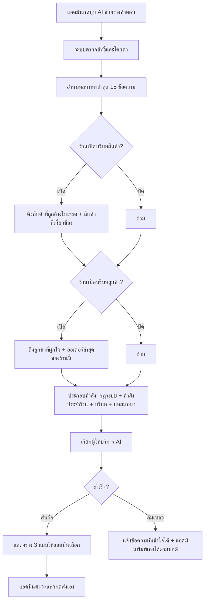

> **โมดูล:** M00019-AiReplyAssistant
> **ประเภทเอกสาร:** Product Requirements Document (PRD)
> **เวอร์ชัน:** 1.0
> **วันที่จัดทำ:** 2026-07-23
> **สถานะ:** Draft — รอ user review ก่อนเริ่ม implement (Hard Rule 11)
> **เจ้าของเอกสาร:** BA + PO + PM (ดู [[Feature-Docs-Ownership]])

# PRD: ผู้ช่วยร่างคำตอบ AI — บริบทร้านและคำสั่งเฉพาะร้าน

---

## Executive Summary

ฟีเจอร์ "AI ช่วยร่างคำตอบ" ที่ส่งขึ้น production ไปแล้วใน feature 00018 (composer improvement #3) ทำงานได้ แต่ **ไม่รู้จักร้านที่ตัวเองกำลังตอบแทน** — ระบบส่งเข้า Gemini เพียงชื่อร้าน ประเภทกิจการ และข้อความล่าสุด 15 ข้อความเท่านั้น ไม่มีข้อมูลสินค้า ราคา สต็อก ประวัติลูกค้า หรือ นโยบายร้าน. เมื่อ prompt สั่งไว้ถูกต้องแล้วว่า "ห้ามแต่งราคา/เงื่อนไขขึ้นเอง" ผลลัพธ์ที่ได้จึงวนอยู่กับประโยคประเภท "ขอข้อมูลเพิ่มเติมครับ" ซึ่งแอดมินพิมพ์เองเร็วกว่า — คุณค่าของฟีเจอร์จึงยังไม่เกิดจริง

ฟีเจอร์นี้แก้ที่ต้นเหตุด้วยการเติม "ความรู้เรื่องร้าน" เข้าไปในบริบทที่ AI เห็น 3 ชั้น: (1) **AI Prompt ของร้าน** ที่เจ้าของร้านเขียนเองเป็นภาษาคน (ขายอะไร โทนการตอบ นโยบายส่ง/รับประกัน คำที่ห้ามพูด) (2) **บริบทสินค้า** ทั้งสินค้าที่ถูกอ้างถึงในเธรดโดยตรงและรายการสินค้าที่เกี่ยวข้องกับสิ่งที่ลูกค้าถาม (3) **บริบทลูกค้า** จากข้อมูล Customer และประวัติออเดอร์ที่ผูกไว้แล้วในระบบ

ผู้ได้ประโยชน์คือแอดมินร้านที่ตอบแชทวันละหลายสิบเธรด — คำแนะนำที่อ้างอิงราคาและสินค้าจริงทำให้กด "ใช้ร่างนี้" แล้วส่งได้เลยแทนที่จะต้องพิมพ์ใหม่ทั้งหมด ผลทางธุรกิจคือเวลาตอบกลับลูกค้าสั้นลงและโอกาสปิดการขายสูงขึ้น

---

## 1. Business Goals & KPIs

### 1.1 เป้าหมายทางธุรกิจ

| เป้าหมาย | รายละเอียด |
|----------|-----------|
| **ทำให้คำแนะนำ AI ใช้ได้จริงโดยไม่ต้องแก้** | ร่างที่ AI เสนอต้องอ้างอิงสินค้า/ราคา/นโยบายจริงของร้าน จนแอดมินกดส่งได้ทันทีในเคสทั่วไป ไม่ใช่ได้แค่ประโยคขอข้อมูลเพิ่ม |
| **ลดเวลาตอบกลับลูกค้าครั้งแรก** | แชทที่ตอบเร็วมีโอกาสปิดการขายสูงกว่า — AI ที่รู้บริบทช่วยลดเวลาที่แอดมินต้องเปิดหาข้อมูลสินค้าจากหน้าอื่นก่อนตอบ |
| **ให้ร้านคุมน้ำเสียงและนโยบายของตัวเองได้** | ร้านแต่ละร้านมีวิธีพูดและเงื่อนไขต่างกัน ระบบต้องให้เจ้าของร้านกำหนดเองได้โดยไม่ต้องรอทีมพัฒนาแก้ prompt |
| **ไม่สร้างความเสี่ยงจากข้อมูลผิด** | การเพิ่มบริบทต้องไม่เปิดช่องให้ AI ตอบราคาที่ไม่มีอยู่จริง หรือหลุดข้อมูลส่วนตัวลูกค้าเกินความจำเป็น |

### 1.2 ตัวชี้วัดความสำเร็จ (KPIs)

| KPI | คำอธิบาย | เป้าหมาย |
|-----|----------|---------|
| **อัตราการนำร่างไปใช้ (Adoption)** | จำนวนครั้งที่กดเลือกร่าง หารด้วยจำนวนครั้งที่เปิดแผง AI | ≥ 40% ภายใน 30 วันหลังปล่อย |
| **อัตราส่งโดยไม่แก้ (Send-as-is)** | จำนวนข้อความที่ส่งออกโดยเนื้อหาตรงกับร่างที่เลือกแบบไม่แก้ไข หารด้วยจำนวนร่างที่ถูกเลือก | ≥ 50% |
| **อัตราร่างที่มีข้อมูลสินค้าจริง** | สัดส่วนคำขอที่ระบบแนบบริบทสินค้าเข้า prompt ได้ (ไม่ใช่ prompt เปล่า) เมื่อบทสนทนามีการอ้างถึงสินค้า | ≥ 80% |
| **ร้านที่ตั้งค่า AI Prompt** | จำนวนร้านที่กรอก AI Prompt ของตัวเอง หารด้วยจำนวนร้านที่ใช้ฟีเจอร์ AI | ≥ 30% ภายใน 60 วัน |
| **เวลาตอบกลับครั้งแรกเฉลี่ย** | ค่าเฉลี่ยเวลาระหว่างข้อความลูกค้ากับข้อความตอบแรกของร้าน (มีเก็บอยู่แล้วใน `chat-metrics.service`) | ลดลง ≥ 15% เทียบก่อนปล่อย |

---

## 2. User Personas (กลุ่มผู้ใช้งาน)

### 2.1 แอดมินร้าน (ผู้ตอบแชทประจำวัน)

**ข้อมูลพื้นฐาน:**
- พนักงานหรือเจ้าของร้านที่นั่งตอบแชทจาก Messenger / Instagram / Deep รวมกันในหน้า `/inbox`
- ตอบวันละ 20-100 เธรด ส่วนใหญ่เป็นคำถามซ้ำ ๆ (ราคา มีของไหม ส่งกี่วัน)
- ไม่ได้จำราคาสินค้าทุกตัว ต้องเปิดหน้าสินค้าดูก่อนตอบ

**เป้าหมาย:**
- ตอบลูกค้าให้เร็วและถูกต้อง โดยไม่ต้องสลับหน้าจอไปมา

**ความต้องการ:**
- ร่างคำตอบที่ระบุราคาและชื่อสินค้าจริงได้เลย
- ร่างที่พูดด้วยน้ำเสียงเดียวกับที่ร้านใช้ประจำ ไม่ต้องมานั่งแก้คำ

**จุดปวด (Pain Points):**
- AI ปัจจุบันตอบแต่ "ขอข้อมูลเพิ่มครับ" ซึ่งพิมพ์เองยังเร็วกว่า
- ต้องเปิดหน้าสินค้า/ออเดอร์อีกแท็บทุกครั้งที่ลูกค้าถามราคาหรือถามว่าของส่งถึงไหนแล้ว

### 2.2 เจ้าของร้าน (ผู้กำหนดนโยบายและน้ำเสียง)

**ข้อมูลพื้นฐาน:**
- เป็นคนกำหนดว่าร้านจะพูดกับลูกค้าอย่างไร มีนโยบายส่ง/เคลม/รับประกันแบบไหน
- อาจมีพนักงานหลายคนช่วยตอบ (feature 00012 Shop Staff)

**เป้าหมาย:**
- ให้ทุกคนที่ตอบแชทแทนร้าน พูดเหมือนกันและไม่ให้สัญญาที่ร้านทำไม่ได้

**ความต้องการ:**
- ที่ให้เขียน "คำสั่งประจำร้าน" เองเป็นภาษาคน แก้ได้ตลอดโดยไม่ต้องแจ้งทีมพัฒนา
- ควบคุมได้ว่าจะให้ AI เห็นข้อมูลสินค้า/ลูกค้าหรือไม่

**จุดปวด (Pain Points):**
- ทุกวันนี้ prompt ถูกฝังในโค้ด แก้ไม่ได้จากหน้าเว็บ
- พนักงานแต่ละคนตอบคนละโทน ทำให้ภาพลักษณ์ร้านไม่นิ่ง

### 2.3 ลูกค้าปลายทาง (ผู้รับข้อความ)

**ข้อมูลพื้นฐาน:**
- ทักเข้ามาทาง Messenger / Instagram / แชทในแอป Deep
- ไม่รู้และไม่ควรต้องรู้ว่าร้านใช้ AI ช่วยร่าง

**เป้าหมาย:**
- ได้คำตอบที่ตรงคำถาม เร็ว และถูกต้อง

**ความต้องการ:**
- ราคาและเงื่อนไขที่ได้รับต้องตรงกับที่ร้านขายจริง

**จุดปวด (Pain Points):**
- ถ้าได้ราคาผิดจาก AI แล้วร้านมาแก้ทีหลัง จะรู้สึกว่าโดนหลอก และเป็นความเสี่ยงเรื่องความน่าเชื่อถือซึ่งเป็นแกนหลักของแพลตฟอร์ม Deep

### 2.4 ผู้ดูแลระบบ (Admin ของแพลตฟอร์ม)

**ข้อมูลพื้นฐาน:**
- ดูแลต้นทุนการเรียก AI และความเสี่ยงด้านเนื้อหา

**เป้าหมาย:**
- ควบคุมต้นทุน token และป้องกันการนำ AI ไปใช้ผิดวัตถุประสงค์

**ความต้องการ:**
- เพดานความยาวบริบทที่ส่งเข้า AI และเพดานจำนวนครั้งต่อผู้ใช้

**จุดปวด (Pain Points):**
- ยิ่งเติมบริบทมาก ต้นทุนต่อครั้งยิ่งสูง ถ้าไม่มีเพดานจะบานปลายโดยไม่รู้ตัว

---

## 3. Business Requirements

### 3.1 AI Prompt ของร้าน (คำสั่งประจำร้าน)

**ความต้องการ:**
- ร้านต้องเขียน "คำสั่งประจำร้าน" ของตัวเองได้เป็นข้อความอิสระ เช่น ขายอะไร จุดเด่น นโยบายส่ง/รับประกัน โทนการพูด คำที่ห้ามใช้
- แก้ไขได้ตลอดเวลาจากหน้าตั้งค่าของร้าน มีผลกับคำแนะนำครั้งถัดไปทันที
- มีตัวอย่างและคำอธิบายกำกับ เพื่อให้ร้านที่ไม่เคยเขียน prompt เขียนเป็น

**Business Rules:**
- คำสั่งประจำร้านผูกกับ "ร้าน" ไม่ใช่ผู้ใช้ — พนักงานทุกคนที่ตอบแทนร้านเดียวกันได้ผลลัพธ์แนวเดียวกัน
- ความยาวจำกัดไม่เกิน 2,000 ตัวอักษร เพื่อคุมต้นทุน token และกันการยัดเนื้อหาเกินจำเป็น
- คำสั่งของร้าน **ห้ามลบล้างกฎความปลอดภัยของระบบ** — กฎห้ามแต่งราคา ห้ามขอ OTP/รหัสผ่าน ห้ามสัญญาสิ่งที่ยืนยันไม่ได้ ต้องมีผลเหนือคำสั่งของร้านเสมอ
- ร้านที่ยังไม่ตั้งค่า ต้องใช้งาน AI ได้ตามเดิม (ค่าเริ่มต้น = ไม่มีคำสั่งเพิ่ม)

**เหตุผล:**
- ความรู้เรื่องร้านอยู่ในหัวเจ้าของร้าน ไม่ได้อยู่ในฐานข้อมูล การเปิดช่องให้เขียนเองคือวิธีที่ถูกที่สุดและเร็วที่สุดที่จะทำให้ AI ตอบตรงจุดประสงค์

### 3.2 บริบทสินค้า

**ความต้องการ:**
- เมื่อบทสนทนามีการส่ง "การ์ดสินค้า" ระบบต้องบอก AI ว่าเป็นสินค้าตัวไหน ชื่ออะไร ราคาเท่าไร มีของหรือไม่ — แทนข้อความ `[ส่งการ์ดสินค้า]` แบบเดิมที่ไม่มีข้อมูล
- เมื่อลูกค้าถามถึงสินค้าโดยพิมพ์ชื่อ ระบบต้องแนบรายการสินค้าที่เกี่ยวข้องของร้านให้ AI เห็น
- ร้านต้องปิดการส่งข้อมูลสินค้าให้ AI ได้ ถ้าไม่ต้องการ

**Business Rules:**
- ส่งเฉพาะสินค้าที่ยังเปิดขายอยู่ (active) — สินค้าที่ปิดขายแล้วห้ามถูกเสนอราคา
- จำนวนสินค้าที่แนบต่อครั้งจำกัดไม่เกิน 20 รายการ เรียงตามความเกี่ยวข้องกับข้อความล่าสุดของลูกค้า
- ราคาที่ AI อ้างอิงได้ต้องมาจากบริบทที่ระบบแนบให้เท่านั้น — ถ้าไม่มีในบริบท ต้องกลับไปใช้กฎ "ห้ามแต่งตัวเลข"
- ข้อมูลสต็อกส่งให้เฉพาะร้านที่เปิดใช้ระบบสต็อก (feature 00003/00009) — ร้านที่ไม่ได้ใช้ต้องไม่เห็นตัวเลขสต็อกที่ไม่มีความหมาย

**เหตุผล:**
- คำถามที่ลูกค้าถามบ่อยที่สุดคือราคาและมีของไหม ถ้า AI ตอบสองข้อนี้ไม่ได้ ฟีเจอร์แทบไม่มีประโยชน์

### 3.3 บริบทลูกค้าและออเดอร์

**ความต้องการ:**
- ถ้าเธรดนี้ผูกกับลูกค้าในระบบแล้ว ระบบต้องบอก AI ว่าลูกค้ารายนี้เคยสั่งอะไร สถานะล่าสุดเป็นอย่างไร
- ร้านต้องปิดการส่งข้อมูลลูกค้าให้ AI ได้

**Business Rules:**
- ส่งได้เฉพาะออเดอร์ของร้านนั้นเท่านั้น — ห้ามข้ามร้าน แม้ลูกค้าคนเดียวกันจะเคยซื้อจากร้านอื่นในแพลตฟอร์ม
- จำกัดไม่เกิน 5 ออเดอร์ล่าสุด
- **ห้ามส่งเบอร์โทรเต็ม อีเมล หรือที่อยู่เต็มของลูกค้าเข้า AI** — ส่งได้เฉพาะชื่อเรียก สถานะออเดอร์ ยอดรวม และวันที่
  - **ข้อยกเว้นเดียว (ผู้ใช้อนุมัติ 2026-08-04): ปุ่ม "ใช้ AI ช่วยอ่าน" ในชีตกระจายที่อยู่** — ร้านกดเอง
    ต่อครั้ง เพื่อให้ AI แยกที่อยู่จากข้อความที่ลูกค้าพิมพ์มา ส่งเฉพาะข้อความก้อนนั้นโดยไม่มีบริบทอื่น
    เงื่อนไขครบชุดอยู่ที่ BRD ข้อ BR-AI-09-EX. เส้นทาง "ผู้ช่วยร่างคำตอบ" (feature นี้) ยังห้ามเด็ดขาด
    ตามเดิมทุกกรณี
- เธรดที่ยังไม่ผูกลูกค้า ต้องทำงานได้ตามปกติ (ไม่มีบริบทส่วนนี้)

**เหตุผล:**
- คำถามอันดับสองรองจากราคาคือ "ของที่สั่งไปถึงไหนแล้ว" ซึ่งข้อมูลมีอยู่ในระบบครบแล้ว แค่ยังไม่ได้ส่งให้ AI
- ข้อมูลติดต่อของลูกค้าเป็นข้อมูลส่วนบุคคลที่ไม่จำเป็นต่อการร่างคำตอบ จึงไม่ควรออกนอกระบบไปยังผู้ให้บริการ AI

### 3.4 การควบคุมของร้าน (ตั้งค่าและปิดใช้งาน)

**ความต้องการ:**
- หน้าตั้งค่าหนึ่งหน้าสำหรับ: คำสั่งประจำร้าน, สวิตช์เปิด/ปิดบริบทสินค้า, สวิตช์เปิด/ปิดบริบทลูกค้า
- แสดงตัวอย่างให้เห็นว่าเมื่อเปิด/ปิดแล้ว AI จะเห็นอะไรบ้าง

**Business Rules:**
- สิทธิ์แก้ไข: เจ้าของร้าน และผู้ดูแลร้าน (ADMIN) เท่านั้น — พนักงาน (STAFF) ดูได้แต่แก้ไม่ได้
- ค่าเริ่มต้นของร้านใหม่: บริบทสินค้า = เปิด, บริบทลูกค้า = เปิด, คำสั่งประจำร้าน = ว่าง

**เหตุผล:**
- ร้านบางประเภท (เช่น ที่พัก) อาจไม่มีสินค้าให้แนบ การบังคับเปิดจะเปลืองต้นทุนเปล่า

**สถานะการตั้งค่าที่ต้องรองรับ:**

| สถานะ | ชื่อภาษาไทย | คำอธิบาย | การใช้งาน |
|-------|------------|----------|----------|
| **NOT_CONFIGURED** | ยังไม่ตั้งค่า | ร้านไม่เคยเปิดหน้าตั้งค่า AI | ใช้ค่าเริ่มต้นทั้งหมด |
| **CONFIGURED** | ตั้งค่าแล้ว | ร้านบันทึกคำสั่ง/สวิตช์อย่างน้อยหนึ่งครั้ง | ใช้ค่าที่ร้านตั้ง |
| **CONTEXT_OFF** | ปิดบริบททั้งหมด | ร้านปิดทั้งบริบทสินค้าและลูกค้า | AI เห็นเฉพาะบทสนทนา + คำสั่งประจำร้าน |

---

## 4. Business Rules & Constraints

### 4.1 กฎทางธุรกิจหลัก

| กฎ | คำอธิบาย |
|----|----------|
| **AI ร่างเท่านั้น ไม่ส่งเอง** | ทุกข้อความต้องผ่านการกดเลือกและกดส่งโดยคนเสมอ ระบบห้ามส่งข้อความอัตโนมัติในเฟสนี้ |
| **กฎความปลอดภัยเหนือคำสั่งร้าน** | ข้อห้ามของระบบ (ห้ามแต่งราคา ห้ามขอ OTP/รหัสผ่าน/ข้อมูลบัตร ห้ามสัญญาที่ยืนยันไม่ได้) มีผลเหนือคำสั่งประจำร้านเสมอ |
| **ราคาต้องมีที่มา** | AI อ้างอิงราคาได้เฉพาะที่ปรากฏในบริบทที่ระบบแนบให้ ห้ามคำนวณส่วนลด/โปรโมชันเองถ้าร้านไม่ได้ระบุ |
| **ขอบเขตข้อมูลตามร้าน** | บริบททุกชิ้นต้องเป็นของร้านที่ active อยู่เท่านั้น ห้ามข้ามร้านแม้เป็นเจ้าของเดียวกัน |
| **ข้อมูลติดต่อลูกค้าไม่ออกนอกระบบ** | เบอร์โทร/อีเมล/ที่อยู่ ห้ามถูกส่งไปยังผู้ให้บริการ AI ในเส้นทางผู้ช่วยร่างคำตอบ ไม่ว่ากรณีใด (ข้อยกเว้นเดียวคือปุ่มกระจายที่อยู่ที่ร้านกดเอง — BR-AI-09-EX) |
| **ไม่เก็บบทสนทนาไว้ที่ผู้ให้บริการ AI** | ใช้การเรียกแบบไร้สถานะ (stateless) ทุกครั้ง ไม่สร้าง session/ไฟล์ฝากไว้ฝั่งผู้ให้บริการ |

### 4.2 ข้อจำกัดทางธุรกิจ

| ข้อจำกัด | รายละเอียด |
|---------|-----------|
| **ต้นทุนต่อการเรียก** | ยิ่งแนบบริบทมาก ต้นทุนต่อครั้งยิ่งสูง — ต้องมีเพดานความยาวบริบทรวมและจำนวนครั้งต่อผู้ใช้ต่อนาที |
| **พึ่งพาผู้ให้บริการภายนอก** | ผู้ให้บริการ AI ปลดระวางรุ่นโมเดลเป็นระยะ (เกิดจริง 2026-07-23 กับ `gemini-2.0-flash`) ระบบต้องทนต่อการเปลี่ยนรุ่น |
| **คุณภาพขึ้นกับข้อมูลที่ร้านกรอก** | ร้านที่ไม่ตั้งชื่อสินค้า/ราคาให้ถูกต้อง จะได้คำแนะนำที่ไม่ดีขึ้นเท่าที่ควร |
| **ภาษา** | รองรับภาษาไทยเป็นหลักในเฟสนี้ |

### 4.3 เงื่อนไขที่ระบบต้องยังทำงานได้ (Degraded Mode)

ระบบต้องไม่พังทั้งฟีเจอร์เมื่อเกิดกรณีต่อไปนี้ — ให้ลดระดับการทำงานลงแทน:

- ร้านยังไม่ตั้งค่า AI Prompt → ใช้ค่าเริ่มต้น
- ร้านไม่มีสินค้าเลย → ข้ามบริบทสินค้า ไม่ถือเป็นข้อผิดพลาด
- เธรดยังไม่ผูกลูกค้า → ข้ามบริบทลูกค้า
- ดึงข้อมูลบริบทไม่สำเร็จ (ฐานข้อมูลช้า/ล้ม) → ยังเรียก AI ต่อด้วยบริบทเท่าที่มี
- ผู้ให้บริการ AI ล่มหรือปลดระวางรุ่น → แจ้งผู้ใช้ด้วยข้อความที่เข้าใจได้ และแอดมินยังพิมพ์ตอบเองได้ตามปกติ

---

## 5. Out of Scope (นอกขอบเขต)

| หัวข้อ | คำอธิบาย |
|--------|----------|
| **ตอบอัตโนมัติ (Auto-reply)** | เฟสนี้ AI ร่างให้เท่านั้น คนต้องกดส่งเสมอ — การตอบอัตโนมัติมีความเสี่ยงด้านความน่าเชื่อถือสูงเกินกว่าจะปล่อยพร้อมกัน |
| **สรุปความจำต่อบทสนทนา (rolling summary)** | ปัจจุบันส่งข้อความล่าสุด 15 ข้อความซึ่งครอบคลุมแชทส่วนใหญ่แล้ว การทำสรุปสะสมมีต้นทุนประมวลผลทุกข้อความ แต่ได้ผลเฉพาะแชทยาว — เลื่อนไปประเมินหลังมีข้อมูลจริงว่ามีแชทเกิน 15 ข้อความสัดส่วนเท่าไร |
| **AI Prompt แยกรายเพจ** | เฟสนี้คำสั่งอยู่ระดับร้าน ร้านที่มีหลายเพจใช้ชุดเดียวกัน |
| **แปลภาษา / ตอบภาษาอื่น** | รองรับไทยเป็นหลัก |
| **วิเคราะห์รูปภาพที่ลูกค้าส่ง** | รูปถูกแทนด้วย placeholder ข้อความเหมือนเดิม |
| **แนะนำสินค้าเชิงรุก (upsell)** | ไม่อยู่ในเฟสนี้ |
| **คลังความรู้แบบไฟล์แนบ (RAG จากเอกสาร)** | เฟสนี้ใช้ข้อความคำสั่ง + ข้อมูลในฐานข้อมูลเท่านั้น |

---

## 6. Risks & Mitigation (ความเสี่ยงและแนวทางแก้ไข)

### 6.1 ความเสี่ยงทางธุรกิจ

| ความเสี่ยง | ผลกระทบ | ระดับความรุนแรง | แนวทางแก้ไข |
|-----------|---------|-----------------|-------------|
| **AI เสนอราคาผิด แล้วแอดมินกดส่งโดยไม่ตรวจ** | ลูกค้าได้ราคาผิด ร้านเสียเครดิต ขัดกับแกน "ความน่าเชื่อถือ" ของแพลตฟอร์ม | สูง | ราคามาจากฐานข้อมูลจริงเท่านั้น + คงข้อความเตือน "ตรวจทานก่อนส่งทุกครั้ง" + ไม่ส่งอัตโนมัติ |
| **ร้านเขียนคำสั่งให้ AI พูดเกินจริง** | ให้สัญญาที่ทำไม่ได้ | กลาง | กฎความปลอดภัยของระบบมีผลเหนือคำสั่งร้านเสมอ และระบุไว้ในหน้าตั้งค่าให้ร้านรับทราบ |
| **ต้นทุน AI บานปลาย** | ค่าใช้จ่ายต่อเดือนสูงเกินคาด | กลาง | เพดานความยาวบริบท + จำกัดจำนวนครั้งต่อผู้ใช้ + เลือกรุ่นโมเดลที่คุ้มค่า |
| **ร้านไม่ตั้งค่าเลย ฟีเจอร์จึงไม่ดีขึ้น** | KPI ไม่ขยับ | กลาง | บริบทสินค้า/ลูกค้าเปิดอัตโนมัติโดยไม่ต้องตั้งค่า — คำสั่งประจำร้านเป็นส่วนเสริม ไม่ใช่เงื่อนไขบังคับ |

### 6.2 ความเสี่ยงทางเทคนิค

| ความเสี่ยง | ผลกระทบ | แนวทางแก้ไข |
|-----------|---------|-------------|
| **ผู้ให้บริการปลดระวางรุ่นโมเดล** | ฟีเจอร์ตายทั้งยวง (เกิดจริงแล้ว 2026-07-23) | มีรายการรุ่นสำรองไล่ลองตามลำดับ + ตั้งค่ารุ่นผ่าน environment ได้ |
| **บริบทยาวเกินจนโมเดลตัดข้อความสำคัญทิ้ง** | คำแนะนำแย่ลงกว่าเดิม | จำกัดจำนวนสินค้า/ออเดอร์ และตัดความยาวคำสั่งร้าน |
| **Prompt injection จากข้อความลูกค้า** | ลูกค้าพิมพ์ข้อความสั่งให้ AI ทำอย่างอื่น | แยกคำสั่งระบบออกจากเนื้อหาบทสนทนาอย่างชัดเจน และย้ำกฎความปลอดภัยไว้ท้ายคำสั่งระบบ |
| **ดึงบริบทเพิ่มทำให้ตอบช้าลง** | ผู้ใช้รอนาน | ดึงข้อมูลบริบทแบบขนาน และตั้งเพดานเวลา — ถ้าเกินให้ส่ง prompt เท่าที่มี |

---

## 7. Glossary (อภิธานศัพท์)

| คำศัพท์ | ความหมาย |
|---------|----------|
| **AI Prompt ของร้าน** | ข้อความคำสั่งที่เจ้าของร้านเขียนเอง เพื่อบอก AI ว่าร้านขายอะไรและต้องพูดอย่างไร |
| **บริบท (Context)** | ข้อมูลที่ระบบรวบรวมแล้วส่งให้ AI พร้อมกับบทสนทนา เช่น รายการสินค้า ประวัติออเดอร์ |
| **ร่าง (Suggestion)** | ข้อความที่ AI เสนอให้แอดมินเลือก ยังไม่ถูกส่งถึงลูกค้า |
| **การ์ดสินค้า** | ข้อความชนิดพิเศษในแชทที่อ้างอิงสินค้าในระบบ (feature 00011 extension #1) |
| **เธรด (Conversation)** | ห้องสนทนาระหว่างร้านกับลูกค้าหนึ่งราย |
| **Degraded mode** | สภาวะที่ระบบทำงานต่อได้แต่ความสามารถลดลง เมื่อข้อมูลบางส่วนไม่พร้อม |

---

## 8. Success Metrics (ตัวชี้วัดความสำเร็จ)

| ตัวชี้วัด | ค่าที่คาดหวัง | วิธีวัด |
|----------|---------------|--------|
| **ร่างที่ถูกเลือกไปใช้** | ≥ 40% ของครั้งที่เปิดแผง AI | นับเหตุการณ์เปิดแผงเทียบกับเหตุการณ์กดเลือกร่าง |
| **ร่างที่อ้างอิงข้อมูลจริงได้** | ≥ 80% ของคำขอที่บทสนทนาพูดถึงสินค้า | ตรวจว่ามีบริบทสินค้าแนบไปใน prompt หรือไม่ |
| **เวลาตอบกลับครั้งแรก** | ลดลง ≥ 15% | เทียบค่าจาก `chat-metrics` ก่อน/หลังปล่อย |
| **ไม่มีเหตุการณ์ข้อมูลลูกค้าหลุด** | 0 ครั้ง | ตรวจสอบว่าไม่มีเบอร์/อีเมล/ที่อยู่ในเนื้อหาที่ส่งออก |
| **ฟีเจอร์ไม่ล่มเมื่อโมเดลถูกปลดระวาง** | 0 ครั้งที่ผู้ใช้เจอฟีเจอร์ตายสนิท | ตรวจ log ว่ามีการถอยไปใช้รุ่นสำรองสำเร็จ |

---

## 9. Dependencies & Assumptions

### 9.1 สิ่งที่ต้องพึ่งพา (Dependencies)

| ระบบ/ส่วนประกอบ | ความสัมพันธ์ |
|-----------------|-------------|
| **feature 00018 — Facebook Chat Integration** | เจ้าของแผง "AI ช่วยร่างคำตอบ" และ endpoint เดิมที่ฟีเจอร์นี้ต่อยอด |
| **feature 00011 — Deep Chat** | โครงสร้างบทสนทนา/ข้อความ และการ์ดสินค้าในแชท |
| **feature 00014 — Customer Directory** | แหล่งข้อมูลลูกค้าที่ผูกกับเธรด |
| **ระบบสินค้า (Product) และสต็อก (00003/00009)** | แหล่งข้อมูลชื่อ/ราคา/สถานะสินค้า |
| **feature 00012 — Shop Staff** | ใช้ตัดสินสิทธิ์ว่าใครแก้การตั้งค่าได้ |
| **ผู้ให้บริการ AI (Google Gemini)** | ผู้สร้างข้อความร่าง |

### 9.2 สมมติฐาน (Assumptions)

- ร้านกรอกชื่อและราคาสินค้าในระบบไว้ถูกต้องพอที่จะนำไปอ้างอิงกับลูกค้าได้
- แชทส่วนใหญ่จบภายใน 15 ข้อความ ทำให้ยังไม่จำเป็นต้องมีสรุปความจำสะสม
- แอดมินอ่านร่างก่อนกดส่งเสมอ (ระบบบังคับให้ต้องกดเลือกและกดส่งเอง)
- ต้นทุนต่อการเรียกอยู่ในระดับที่รับได้เมื่อจำกัดบริบทตามเพดานที่กำหนด

---

## 10. Appendix

### 10.1 ตัวอย่าง User Journey

**Scenario: ลูกค้าถามราคาสินค้าที่ร้านเพิ่งส่งการ์ดไปให้**

1. แอดมินส่งการ์ดสินค้า "โช้คหลังคู่ 335 มม. สีโครเมียม" ให้ลูกค้าในแชท Messenger
2. ลูกค้าตอบกลับว่า "อันนี้เท่าไหร่ครับ ส่งกี่วัน"
3. แอดมินกดปุ่ม AI ช่วยร่างคำตอบ
4. ระบบรวบรวมบริบท: คำสั่งประจำร้าน (ร้านระบุว่า "ส่งเคอรี่ทุกวัน 15:00 ส่งฟรีเมื่อซื้อครบ 1,000") + สินค้าที่ถูกอ้างถึงในเธรด (ชื่อ ราคา 360 บาท สถานะเปิดขาย) + ประวัติลูกค้า (ยังไม่ผูก จึงข้าม)
5. AI เสนอร่าง 3 แบบ โดยแบบแรกระบุราคา 360 บาทและรอบส่งจริง
6. แอดมินกดเลือกร่าง ตรวจข้อความ แล้วกดส่ง
7. ลูกค้าได้คำตอบครบในข้อความเดียว ไม่ต้องถามซ้ำ

**Scenario: ลูกค้าถามสถานะออเดอร์**

1. ลูกค้าที่เคยสั่งของและถูกผูกเป็น Customer ในระบบแล้ว ทักมาว่า "ของถึงไหนแล้วคะ"
2. แอดมินกดปุ่ม AI ช่วยร่างคำตอบ
3. ระบบแนบประวัติออเดอร์ล่าสุดของลูกค้ารายนี้เฉพาะของร้านนี้ (สถานะ SHIPPED ยอด 1,250 บาท วันที่สั่ง) โดยไม่แนบเบอร์โทรหรือที่อยู่
4. AI ร่างคำตอบที่ระบุสถานะจริงและวันที่จัดส่ง
5. แอดมินกดส่ง

**Scenario: ร้านที่พัก (LODGING) ปิดบริบทสินค้า**

1. เจ้าของบ้านพักเข้าหน้าตั้งค่า AI ปิดสวิตช์บริบทสินค้า (เพราะขายห้องพัก ไม่ใช่สินค้า) และเขียนคำสั่งประจำร้านว่า "เช็คอิน 14:00 เช็คเอาท์ 12:00 มัดจำ 50%"
2. เมื่อลูกค้าถามเรื่องเวลาเช็คอิน AI ร่างคำตอบจากคำสั่งประจำร้านได้ทันทีโดยไม่ต้องแนบรายการสินค้าที่ไม่มีอยู่จริง

### 10.2 ตัวอย่าง AI Prompt ของร้านที่ดี

```
ร้านขายอะไหล่มอเตอร์ไซค์แต่ง เน้นโช้ค เบาะ ท่อ
โทน: สุภาพ เป็นกันเอง ลงท้าย "ครับ" ทุกประโยค เรียกลูกค้าว่า "พี่"
การส่ง: เคอรี่ทุกวัน ตัดรอบ 15:00 ส่งฟรีเมื่อซื้อครบ 1,000 บาท
รับประกัน: สินค้ามีปัญหาจากการผลิต เปลี่ยนได้ภายใน 7 วัน
ห้าม: รับประกันความเร็ว/แรงม้าที่เพิ่มขึ้น, ให้ส่วนลดเกิน 5% โดยไม่ถามแอดมินก่อน
ถ้าลูกค้าถามรุ่นที่ไม่มีในรายการ ให้ขอรุ่นรถและปีก่อนเสมอ
```

### 10.3 Flow ภาพรวมของฟีเจอร์



---

**หมายเหตุ:**
เอกสารนี้เป็นการบันทึกความต้องการทางธุรกิจ (Business Requirements) โดยไม่มีรายละเอียดทางเทคนิค
สำหรับ Functional Requirements / User Story / Acceptance Criteria ดู [[BRD]] ของโมดูลนี้
สำหรับ technical specification ดู [[SRS]] ของโมดูลนี้
