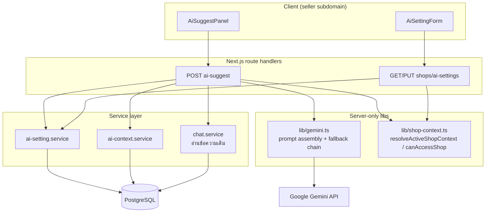
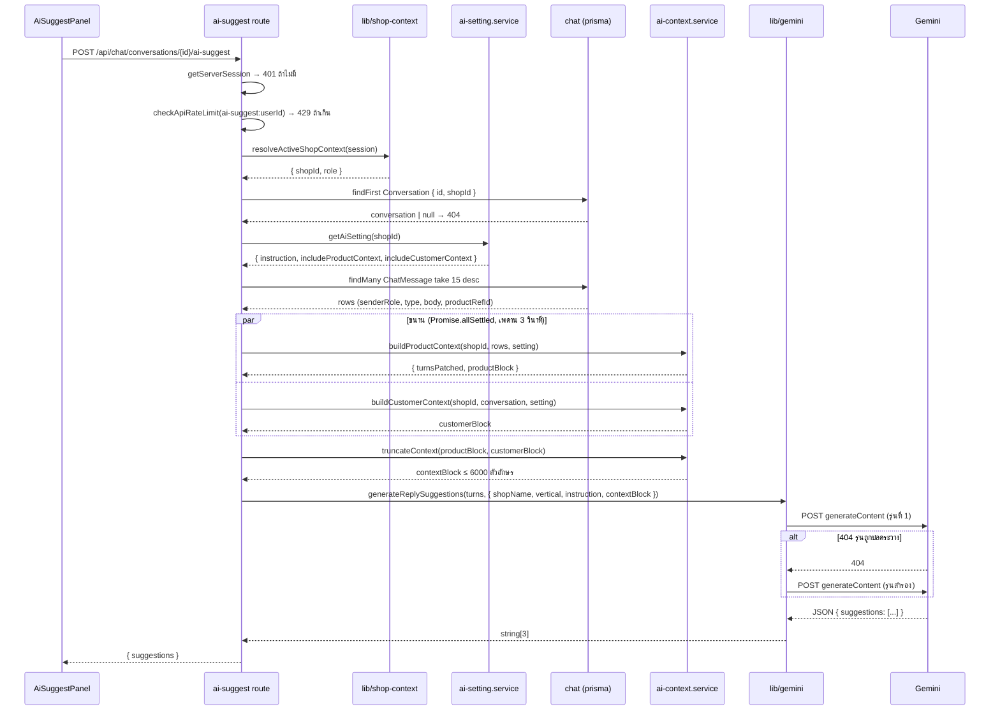
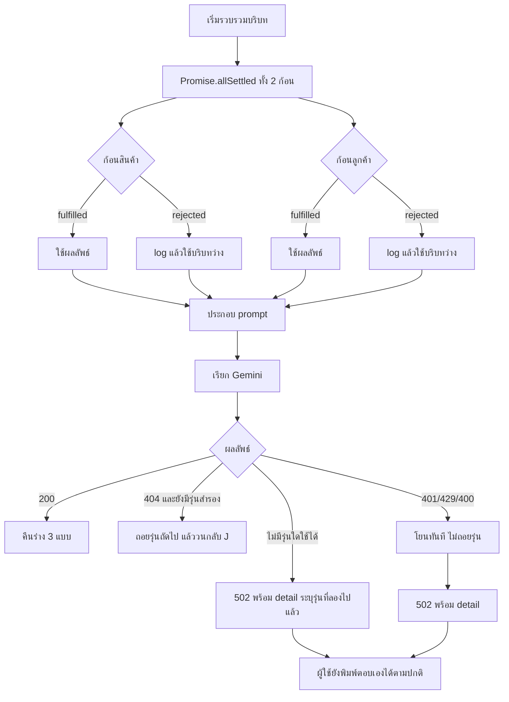
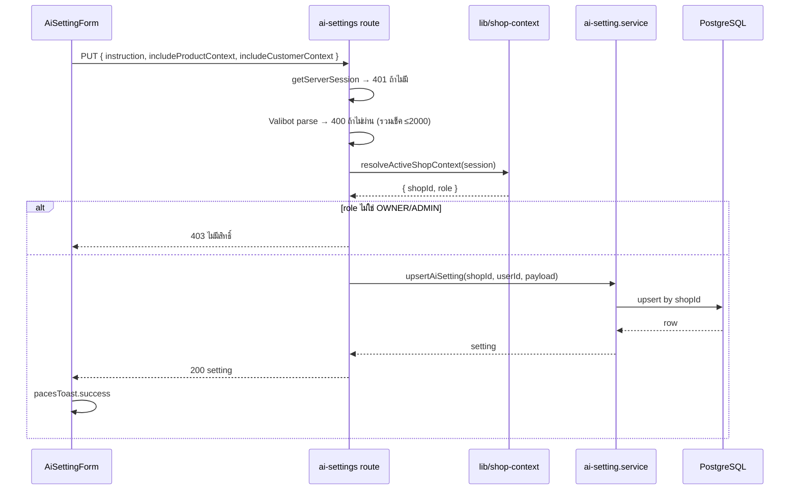

> **โมดูล:** M00019-AiReplyAssistant
> **ประเภทเอกสาร:** System Design Spec (SDS)
> **เวอร์ชัน:** 1.0
> **วันที่จัดทำ:** 2026-07-23
> **สถานะ:** Draft — trace จาก [[SRS]] v1.0
> **เจ้าของเอกสาร:** SA (ดู [[Feature-Docs-Ownership]])

# SDS: ผู้ช่วยร่างคำตอบ AI — บริบทร้าน (System Design Spec)

---

## 1. บทนำ & References

### 1.1 วัตถุประสงค์

อธิบายการออกแบบระดับ component และ data flow ของการเติมบริบทร้านเข้าสู่ผู้ช่วยร่างคำตอบ AI พร้อมบันทึกการตัดสินใจเชิงเทคนิคและเหตุผล เพื่อให้ทีมพัฒนาลงมือได้โดยไม่ต้องตัดสินใจสถาปัตยกรรมเองระหว่างทาง

### 1.2 ขอบเขตการออกแบบ

ครอบคลุมชั้น service ชั้น route และการประกอบ prompt ทั้งหมดที่ระบุใน [[SRS]] §2-§5 ไม่ครอบคลุมรายละเอียด visual ของหน้าตั้งค่า (เป็นงานของ Design Spec ฝั่ง UX ตาม Hard Rule 8)

### 1.3 เอกสารอ้างอิง

| เอกสาร | ความสัมพันธ์ |
|--------|-------------|
| [[SRS]] | TFR-001..TFR-010 และ NFR ที่การออกแบบนี้ต้องรองรับ |
| [[BRD]] | AC ที่ใช้ตรวจรับผลลัพธ์ |
| [[API]] | contract ระดับ endpoint ที่แตกจากเอกสารนี้ |
| [[DATABASE]] | schema/migration ที่แตกจากเอกสารนี้ |
| `docs/conventions/prisma-shared-db-drift.md` | ข้อบังคับ migration บน DB ที่แชร์ dev/prod |
| `docs/conventions/paces-toast.md` | ข้อบังคับ toast ในหน้า seller |

---

## 2. Architecture Overview

### 2.1 มุมมองสถาปัตยกรรม

### 2.2 มุมมองการ Deploy

ไม่มีองค์ประกอบใหม่ระดับ infrastructure — ทุกอย่างรันบน Vercel Functions และ PostgreSQL เดิม สิ่งที่ต้องเตรียมก่อน deploy มีเพียง migration ของตารางใหม่ และการมี `GEMINI_API_KEY` ใน environment (มีอยู่แล้วใน production)

---

## 3. Component Design

| Component | หน้าที่ (Responsibility) | Dependency (Submodule / Stack / Store) |
|-----------|--------------------------|----------------------------------------|
| `ai-setting.service.ts` | `getAiSetting(shopId)` คืนค่าที่บันทึกไว้หรือค่าเริ่มต้น; `upsertAiSetting(shopId, userId, payload)` บันทึกแบบ upsert; ไม่ตรวจสิทธิ์เอง (route เป็นผู้ตรวจตาม pattern เดิมของโปรเจกต์) | Prisma, `ShopAiSetting` |
| `ai-context.service.ts` | `buildProductContext()` แปลงการ์ดสินค้าในเธรดและคัดสินค้าที่เกี่ยวข้อง; `buildCustomerContext()` ดึงลูกค้าและออเดอร์ตาม allow-list; `truncateContext()` บังคับเพดานความยาว | Prisma, Product/Order/Customer/ExternalContact |
| `lib/gemini.ts` (ขยาย) | ประกอบ system prompt เป็นชั้น (กฎระบบ → คำสั่งร้าน → บริบท → บทสนทนา → ย้ำกฎ), เรียก Gemini, fallback chain, parse ผลลัพธ์ | `server-only`, fetch |
| `api/chat/conversations/[id]/ai-suggest/route.ts` (ขยาย) | orchestrate: auth → rate limit → resolve shop → ownership เธรด → อ่าน setting → อ่านข้อความ → สร้างบริบทแบบขนาน → เรียก gemini → คืนผล | ทุก service ข้างต้น |
| `api/shops/ai-settings/route.ts` (ใหม่) | GET/PUT พร้อมตรวจสิทธิ์ตาม role และ validate ด้วย Valibot | `ai-setting.service`, `lib/validations.ts` |
| `settings/ai/page.tsx` (ใหม่) | RSC shell อ่านค่าเริ่มต้นและ role แล้วส่งให้ client form | `resolveActiveShopContext`, `ai-setting.service` |
| `AiSettingForm.tsx` (ใหม่) | client form: textarea นับตัวอักษร + สวิตช์ 2 ตัว + ปุ่มบันทึก + โหมดอ่านอย่างเดียว | Paces primitive, `pacesToast` |

**หลักการแบ่งความรับผิดชอบที่ต้องคงไว้:**

- ชั้น route เป็นผู้ตัดสิน "ใครทำอะไรได้" — service ไม่รับ role มาตัดสินเอง (สอดคล้อง pattern ของโปรเจกต์)
- `shopId` ถูก resolve ที่ route จาก session เท่านั้น แล้วส่งลงเป็น argument — service ไม่แตะ session
- context builder คืน "ข้อความพร้อมใช้" ไม่ใช่ object ดิบ เพื่อให้จุดที่ตัดสินใจว่าอะไรจะออกไปสู่ผู้ให้บริการภายนอกรวมอยู่ที่ไฟล์เดียว ตรวจง่าย (สำคัญต่อ NFR-Sec-02)

---

## 4. Data Flow

### 4.1 Flow หลัก: ขอร่างพร้อมบริบท

### 4.2 Flow กรณีล้มเหลว / ชดเชย

### 4.3 Flow: บันทึกการตั้งค่า

---

## 5. Integration Points

| จุดเชื่อม | ประเภท | Protocol / Contract | ความเสี่ยงเมื่อล่ม |
|-----------|--------|---------------------|---------------------|
| Google Gemini `generateContent` | external / 3rd-party | HTTPS REST + JSON schema response | ปุ่ม AI ใช้ไม่ได้ชั่วคราว — แชทและการพิมพ์ตอบเองยังปกติ |
| `resolveActiveShopContext` | internal | function call | ถ้าคืน null → 404 ทั้งการตั้งค่าและการขอร่าง |
| Product / Order / Customer (Prisma) | internal | Prisma query | บริบทว่าง แต่ยังขอร่างได้ (degraded) |
| `checkApiRateLimit` | internal | in-memory counter | เพดานไม่ครอบทั้งระบบบน serverless (known-gap ที่รับไว้แล้ว) |
| `pacesToast` | internal (UI) | client API | ไม่มีผลต่อ backend |

---

## 6. Technical Decisions

### TD-001: แยกตาราง `ShopAiSetting` แทนการเพิ่มคอลัมน์ใน `Shop`

- **ตัดสินใจ:** สร้างตารางใหม่ความสัมพันธ์ 1:1 กับ `Shop`
- **เหตุผล:** ตาราง `Shop` กว้างมากอยู่แล้วและถูกอ่านแทบทุก request (session, layout, proxy) การเพิ่มคอลัมน์ข้อความยาว 2,000 ตัวอักษรจะติดไปกับ query ที่ไม่ได้ต้องการใช้ ทำให้เปลืองแบนด์วิดท์โดยเปล่าประโยชน์ อีกทั้งการตั้งค่านี้ถูกอ่านเฉพาะตอนขอร่างและตอนเปิดหน้าตั้งค่าเท่านั้น
- **ทางเลือกที่ไม่เลือก:** เพิ่ม 3 คอลัมน์ใน `Shop` — ง่ายกว่าแต่แลกด้วยต้นทุนการอ่านที่กระจายไปทุกหน้า
- trace: TFR-001

### TD-002: lazy default แทนการ backfill

- **ตัดสินใจ:** ร้านที่ยังไม่มีแถวใน `ShopAiSetting` ให้ service คืนค่าเริ่มต้นจากค่าคงที่ในโค้ด ไม่สร้างแถวล่วงหน้า
- **เหตุผล:** DB dev/prod ใช้ร่วมกันและมี drift การ backfill ทุกร้านเป็นการเขียนข้อมูลจำนวนมากโดยไม่จำเป็น ค่าเริ่มต้นในโค้ดให้ผลเหมือนกันและย้อนกลับง่ายกว่า
- trace: TFR-001, [[DATABASE]] §5

### TD-003: context builder คืน "ข้อความ" ไม่ใช่ object

- **ตัดสินใจ:** `buildProductContext`/`buildCustomerContext` คืน string ที่ประกอบเสร็จแล้ว
- **เหตุผล:** ทำให้ "ข้อมูลอะไรออกไปสู่ผู้ให้บริการภายนอกบ้าง" ถูกตัดสินที่ไฟล์เดียว ตรวจสอบด้วยการอ่านโค้ดหรือ grep ได้ทันที ซึ่งเป็นข้อกำหนดด้านความเป็นส่วนตัวที่มีความสำคัญสูง (NFR-Sec-02) ถ้าคืน object ดิบแล้วให้ชั้นอื่น serialize จะเสี่ยงที่ฟิลด์ใหม่หลุดออกไปโดยไม่มีใครสังเกต
- **ทางเลือกที่ไม่เลือก:** คืน typed object แล้ว format ที่ `lib/gemini.ts` — ยืดหยุ่นกว่าแต่จุดตรวจกระจายสองที่
- trace: TFR-003, TFR-004, TFR-005, NFR-Sec-02

### TD-004: allow-list ฟิลด์ระดับ Prisma `select` ไม่ใช่การลบทีหลัง

- **ตัดสินใจ:** query ของบริบทลูกค้าต้องระบุ `select` เฉพาะฟิลด์ที่อนุญาต ห้าม query มาทั้งแถวแล้วค่อยตัดฟิลด์ออกในโค้ด
- **เหตุผล:** บทเรียนเดิมของโปรเจกต์เรื่อง PII หลุดผ่าน RSC flight — การ "ตัดตอนแสดงผล" ไม่ปลอดภัยพอ ต้องไม่ดึงมาตั้งแต่แรก
- trace: TFR-005, NFR-Sec-02

### TD-005: ถอยรุ่นโมเดลเฉพาะ HTTP 404

- **ตัดสินใจ:** fallback chain ทำงานเฉพาะเมื่อได้ 404 เท่านั้น
- **เหตุผล:** 401 (key ผิด) 429 (โควตาหมด) 400 (payload ผิด) ถอยไปรุ่นอื่นก็ได้ผลเดิม การไล่ยิงซ้ำจะกลบสาเหตุจริงและเปลืองเวลาผู้ใช้
- trace: TFR-008

### TD-006: ตัดบริบทสินค้าก่อนบริบทลูกค้าเมื่อเกินเพดาน

- **ตัดสินใจ:** เมื่อความยาวรวมเกิน 6,000 ตัวอักษร ให้ตัดรายการสินค้าจากท้ายลงก่อน ห้ามตัดบล็อกลูกค้าทิ้ง
- **เหตุผล:** บริบทลูกค้ามีขนาดเล็กและตายตัว (≤5 ออเดอร์) แต่มีคุณค่าสูงต่อคำถามยอดฮิต "ของถึงไหนแล้ว" ขณะที่รายการสินค้าท้าย ๆ มีความเกี่ยวข้องต่ำกว่าอยู่แล้วเพราะเรียงตามความเกี่ยวข้อง
- trace: TFR-007

### TD-007: ประกอบ prompt เป็นชั้นและย้ำกฎปิดท้าย

- **ตัดสินใจ:** ใส่กฎความปลอดภัยทั้งต้นและท้ายของ system prompt และกำกับบทสนทนาว่าเป็น "เนื้อหา"
- **เหตุผล:** ลดโอกาสสำเร็จของ prompt injection จากข้อความลูกค้า ซึ่งเป็นข้อความที่ระบบควบคุมไม่ได้เลย
- trace: TFR-006, FR-007

---

## 7. Traceability

| SRS Requirement (TFR/NFR) | SDS Element (component / decision / flow) | สถานะ |
|---------------------------|-------------------------------------------|-------|
| TFR-001 | TD-001, TD-002, `ai-setting.service` | Draft |
| TFR-002 | Flow 4.3, `api/shops/ai-settings` | Draft |
| TFR-003 | TD-003, `ai-context.service.buildProductContext` | Draft |
| TFR-004 | `ai-context.service.buildProductContext` | Draft |
| TFR-005 | TD-004, `ai-context.service.buildCustomerContext` | Draft |
| TFR-006 | TD-007, `lib/gemini.ts` | Draft |
| TFR-007 | TD-006, `ai-context.service.truncateContext` | Draft |
| TFR-008 | TD-005, `lib/gemini.ts` | Partially done |
| TFR-009 | Flow 4.2 | Draft |
| TFR-010 | `ai-suggest` route (เดิม) | Done |
| NFR-Sec-01 | ทุก query ใน `ai-context.service` มี `shopId` ใน WHERE | Draft |
| NFR-Sec-02 | TD-003, TD-004 | Draft |
| NFR-Perf-03 | batch query ใน `buildProductContext` | Draft |
| NFR-Rel-01 | Flow 4.2 | Draft |

---

## 8. สรุป (Summary)

การออกแบบวางจุดตัดสินใจด้านความปลอดภัยไว้ที่ไฟล์เดียว (`ai-context.service.ts`) เพื่อให้ตรวจสอบได้ว่าอะไรออกไปสู่ผู้ให้บริการภายนอกบ้าง และแยกการตั้งค่าออกเป็นตารางของตัวเองเพื่อไม่ให้กระทบ query ที่ร้อนที่สุดของระบบ ทุกเส้นทางความล้มเหลวถูกออกแบบให้ลดระดับการทำงานลงแทนการล้มทั้ง request

รายละเอียด contract ระดับ endpoint ดู [[API]] — schema และแผน migration ดู [[DATABASE]] — ชุดทดสอบดู `Tests/00001-ai-shop-context.md`
