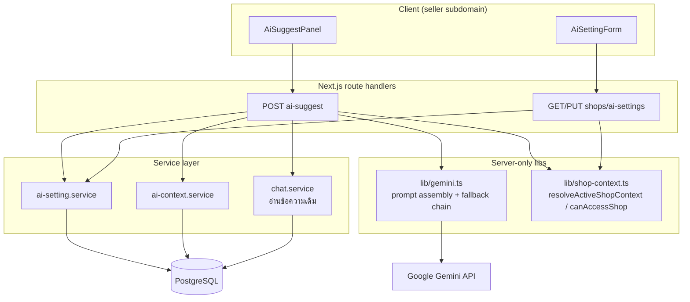
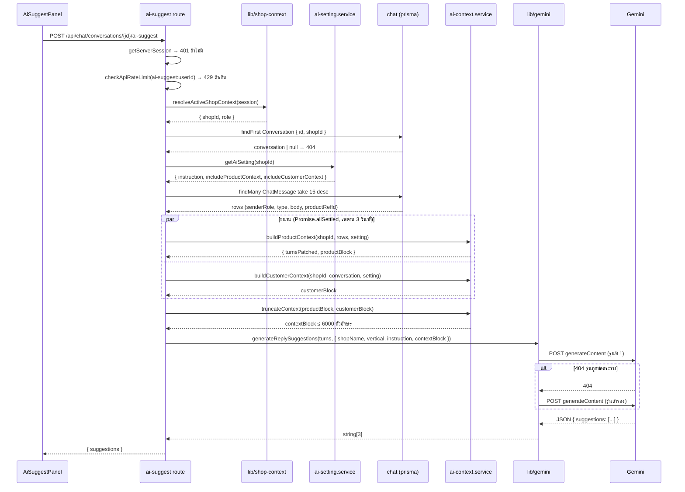
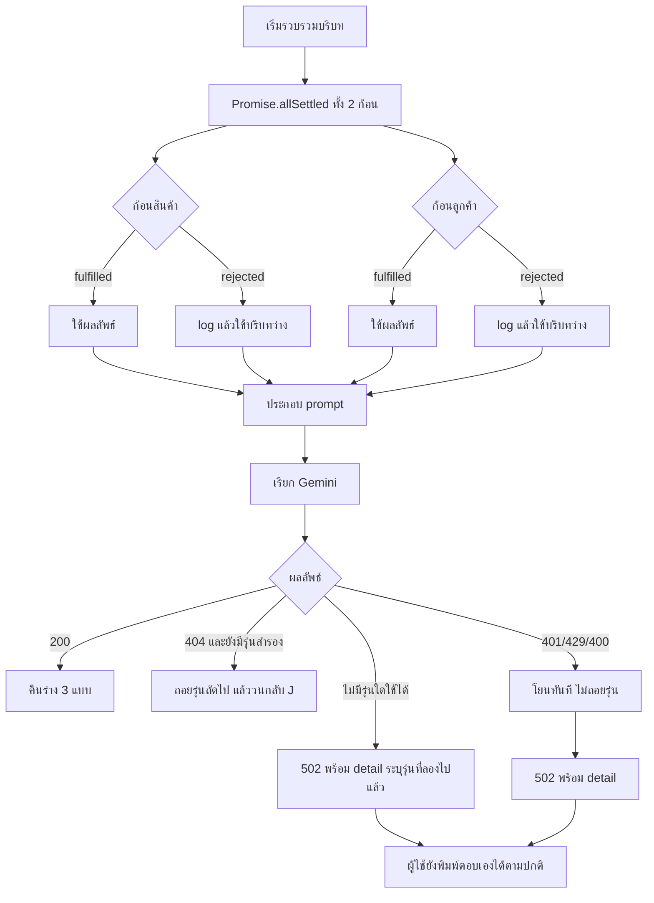
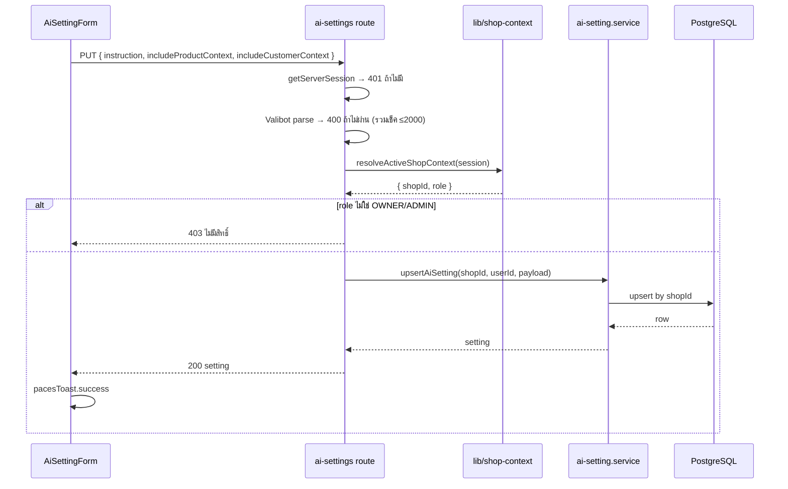
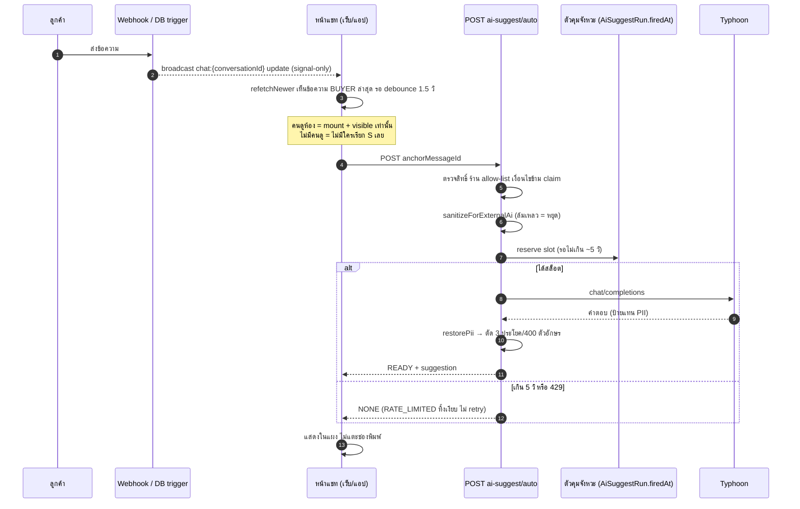

> **โมดูล:** M00019-AiReplyAssistant
> **ประเภทเอกสาร:** System Design Spec (SDS)
> **เวอร์ชัน:** 1.0
> **วันที่จัดทำ:** 2026-07-23
> **สถานะ:** Draft — trace จาก [[SRS]] v1.0
> **เจ้าของเอกสาร:** SA (ดู [[Feature-Docs-Ownership]])

# SDS: ผู้ช่วยร่างคำตอบ AI — บริบทร้าน (System Design Spec)

---

## 1. บทนำ & References

### 1.1 วัตถุประสงค์

อธิบายการออกแบบระดับ component และ data flow ของการเติมบริบทร้านเข้าสู่ผู้ช่วยร่างคำตอบ AI พร้อมบันทึกการตัดสินใจเชิงเทคนิคและเหตุผล เพื่อให้ทีมพัฒนาลงมือได้โดยไม่ต้องตัดสินใจสถาปัตยกรรมเองระหว่างทาง

### 1.2 ขอบเขตการออกแบบ

ครอบคลุมชั้น service ชั้น route และการประกอบ prompt ทั้งหมดที่ระบุใน [[SRS]] §2-§5 ไม่ครอบคลุมรายละเอียด visual ของหน้าตั้งค่า (เป็นงานของ Design Spec ฝั่ง UX ตาม Hard Rule 8)

### 1.3 เอกสารอ้างอิง

| เอกสาร | ความสัมพันธ์ |
|--------|-------------|
| [[SRS]] | TFR-001..TFR-010 และ NFR ที่การออกแบบนี้ต้องรองรับ |
| [[BRD]] | AC ที่ใช้ตรวจรับผลลัพธ์ |
| [[API]] | contract ระดับ endpoint ที่แตกจากเอกสารนี้ |
| [[DATABASE]] | schema/migration ที่แตกจากเอกสารนี้ |
| `docs/conventions/prisma-shared-db-drift.md` | ข้อบังคับ migration บน DB ที่แชร์ dev/prod |
| `docs/conventions/paces-toast.md` | ข้อบังคับ toast ในหน้า seller |

---

## 2. Architecture Overview

### 2.1 มุมมองสถาปัตยกรรม

```mermaid
flowchart TD
    subgraph Client["Client (seller subdomain)"]
        P[AiSuggestPanel]
        F[AiSettingForm]
    end

    subgraph Routes["Next.js route handlers"]
        R1[POST ai-suggest]
        R2[GET/PUT shops/ai-settings]
    end

    subgraph Services["Service layer"]
        S1[ai-setting.service]
        S2[ai-context.service]
        S3[chat.service<br/>อ่านข้อความเดิม]
    end

    subgraph Libs["Server-only libs"]
        L1[lib/gemini.ts<br/>prompt assembly + fallback chain]
        L2[lib/shop-context.ts<br/>resolveActiveShopContext / canAccessShop]
    end

    DB[(PostgreSQL)]
    G[Google Gemini API]

    P --> R1
    F --> R2
    R1 --> L2
    R2 --> L2
    R1 --> S1
    R1 --> S2
    R1 --> S3
    R2 --> S1
    S1 --> DB
    S2 --> DB
    S3 --> DB
    R1 --> L1
    L1 --> G
```

### 2.2 มุมมองการ Deploy

ไม่มีองค์ประกอบใหม่ระดับ infrastructure — ทุกอย่างรันบน Vercel Functions และ PostgreSQL เดิม สิ่งที่ต้องเตรียมก่อน deploy มีเพียง migration ของตารางใหม่ และการมี `GEMINI_API_KEY` ใน environment (มีอยู่แล้วใน production)

---

## 3. Component Design

| Component | หน้าที่ (Responsibility) | Dependency (Submodule / Stack / Store) |
|-----------|--------------------------|----------------------------------------|
| `ai-setting.service.ts` | `getAiSetting(shopId)` คืนค่าที่บันทึกไว้หรือค่าเริ่มต้น; `upsertAiSetting(shopId, userId, payload)` บันทึกแบบ upsert; ไม่ตรวจสิทธิ์เอง (route เป็นผู้ตรวจตาม pattern เดิมของโปรเจกต์) | Prisma, `ShopAiSetting` |
| `ai-context.service.ts` | `buildProductContext()` แปลงการ์ดสินค้าในเธรดและคัดสินค้าที่เกี่ยวข้อง; `buildCustomerContext()` ดึงลูกค้าและออเดอร์ตาม allow-list; `truncateContext()` บังคับเพดานความยาว | Prisma, Product/Order/Customer/ExternalContact |
| `lib/gemini.ts` (ขยาย) | ประกอบ system prompt เป็นชั้น (กฎระบบ → คำสั่งร้าน → บริบท → บทสนทนา → ย้ำกฎ), เรียก Gemini, fallback chain, parse ผลลัพธ์ | `server-only`, fetch |
| `api/chat/conversations/[id]/ai-suggest/route.ts` (ขยาย) | orchestrate: auth → rate limit → resolve shop → ownership เธรด → อ่าน setting → อ่านข้อความ → สร้างบริบทแบบขนาน → เรียก gemini → คืนผล | ทุก service ข้างต้น |
| `api/shops/ai-settings/route.ts` (ใหม่) | GET/PUT พร้อมตรวจสิทธิ์ตาม role และ validate ด้วย Valibot | `ai-setting.service`, `lib/validations.ts` |
| `settings/ai/page.tsx` (ใหม่) | RSC shell อ่านค่าเริ่มต้นและ role แล้วส่งให้ client form | `resolveActiveShopContext`, `ai-setting.service` |
| `AiSettingForm.tsx` (ใหม่) | client form: textarea นับตัวอักษร + สวิตช์ 2 ตัว + ปุ่มบันทึก + โหมดอ่านอย่างเดียว | Paces primitive, `pacesToast` |

**หลักการแบ่งความรับผิดชอบที่ต้องคงไว้:**

- ชั้น route เป็นผู้ตัดสิน "ใครทำอะไรได้" — service ไม่รับ role มาตัดสินเอง (สอดคล้อง pattern ของโปรเจกต์)
- `shopId` ถูก resolve ที่ route จาก session เท่านั้น แล้วส่งลงเป็น argument — service ไม่แตะ session
- context builder คืน "ข้อความพร้อมใช้" ไม่ใช่ object ดิบ เพื่อให้จุดที่ตัดสินใจว่าอะไรจะออกไปสู่ผู้ให้บริการภายนอกรวมอยู่ที่ไฟล์เดียว ตรวจง่าย (สำคัญต่อ NFR-Sec-02)

---

## 4. Data Flow

### 4.1 Flow หลัก: ขอร่างพร้อมบริบท

```mermaid
sequenceDiagram
    participant U as AiSuggestPanel
    participant R as ai-suggest route
    participant SC as lib/shop-context
    participant AS as ai-setting.service
    participant CH as chat (prisma)
    participant AC as ai-context.service
    participant GM as lib/gemini
    participant G as Gemini

    U->>R: POST /api/chat/conversations/{id}/ai-suggest
    R->>R: getServerSession → 401 ถ้าไม่มี
    R->>R: checkApiRateLimit(ai-suggest:userId) → 429 ถ้าเกิน
    R->>SC: resolveActiveShopContext(session)
    SC-->>R: { shopId, role }
    R->>CH: findFirst Conversation { id, shopId }
    CH-->>R: conversation | null → 404
    R->>AS: getAiSetting(shopId)
    AS-->>R: { instruction, includeProductContext, includeCustomerContext }
    R->>CH: findMany ChatMessage take 15 desc
    CH-->>R: rows (senderRole, type, body, productRefId)
    par ขนาน (Promise.allSettled, เพดาน 3 วินาที)
        R->>AC: buildProductContext(shopId, rows, setting)
        AC-->>R: { turnsPatched, productBlock }
    and
        R->>AC: buildCustomerContext(shopId, conversation, setting)
        AC-->>R: customerBlock
    end
    R->>AC: truncateContext(productBlock, customerBlock)
    AC-->>R: contextBlock ≤ 6000 ตัวอักษร
    R->>GM: generateReplySuggestions(turns, { shopName, vertical, instruction, contextBlock })
    GM->>G: POST generateContent (รุ่นที่ 1)
    alt 404 รุ่นถูกปลดระวาง
        G-->>GM: 404
        GM->>G: POST generateContent (รุ่นสำรอง)
    end
    G-->>GM: JSON { suggestions: [...] }
    GM-->>R: string[3]
    R-->>U: { suggestions }
```

### 4.2 Flow กรณีล้มเหลว / ชดเชย

```mermaid
flowchart TD
    A[เริ่มรวบรวมบริบท] --> B[Promise.allSettled ทั้ง 2 ก้อน]
    B --> C{ก้อนสินค้า}
    C -- fulfilled --> D[ใช้ผลลัพธ์]
    C -- rejected --> E[log แล้วใช้บริบทว่าง]
    B --> F{ก้อนลูกค้า}
    F -- fulfilled --> G[ใช้ผลลัพธ์]
    F -- rejected --> H[log แล้วใช้บริบทว่าง]
    D --> I[ประกอบ prompt]
    E --> I
    G --> I
    H --> I
    I --> J[เรียก Gemini]
    J --> K{ผลลัพธ์}
    K -- 200 --> L[คืนร่าง 3 แบบ]
    K -- 404 และยังมีรุ่นสำรอง --> M[ถอยรุ่นถัดไป แล้ววนกลับ J]
    K -- 401/429/400 --> N[โยนทันที ไม่ถอยรุ่น]
    K -- ไม่มีรุ่นใดใช้ได้ --> O[502 พร้อม detail ระบุรุ่นที่ลองไปแล้ว]
    N --> P[502 พร้อม detail]
    O --> Q[ผู้ใช้ยังพิมพ์ตอบเองได้ตามปกติ]
    P --> Q
```

### 4.3 Flow: บันทึกการตั้งค่า

```mermaid
sequenceDiagram
    participant F as AiSettingForm
    participant R as ai-settings route
    participant SC as lib/shop-context
    participant AS as ai-setting.service
    participant D as PostgreSQL

    F->>R: PUT { instruction, includeProductContext, includeCustomerContext }
    R->>R: getServerSession → 401 ถ้าไม่มี
    R->>R: Valibot parse → 400 ถ้าไม่ผ่าน (รวมเช็ค ≤2000)
    R->>SC: resolveActiveShopContext(session)
    SC-->>R: { shopId, role }
    alt role ไม่ใช่ OWNER/ADMIN
        R-->>F: 403 ไม่มีสิทธิ์
    else
        R->>AS: upsertAiSetting(shopId, userId, payload)
        AS->>D: upsert by shopId
        D-->>AS: row
        AS-->>R: setting
        R-->>F: 200 setting
        F->>F: pacesToast.success
    end
```

---

## 5. Integration Points

| จุดเชื่อม | ประเภท | Protocol / Contract | ความเสี่ยงเมื่อล่ม |
|-----------|--------|---------------------|---------------------|
| Google Gemini `generateContent` | external / 3rd-party | HTTPS REST + JSON schema response | ปุ่ม AI ใช้ไม่ได้ชั่วคราว — แชทและการพิมพ์ตอบเองยังปกติ |
| `resolveActiveShopContext` | internal | function call | ถ้าคืน null → 404 ทั้งการตั้งค่าและการขอร่าง |
| Product / Order / Customer (Prisma) | internal | Prisma query | บริบทว่าง แต่ยังขอร่างได้ (degraded) |
| `checkApiRateLimit` | internal | in-memory counter | เพดานไม่ครอบทั้งระบบบน serverless (known-gap ที่รับไว้แล้ว) |
| `pacesToast` | internal (UI) | client API | ไม่มีผลต่อ backend |

---

## 6. Technical Decisions

### TD-001: แยกตาราง `ShopAiSetting` แทนการเพิ่มคอลัมน์ใน `Shop`

- **ตัดสินใจ:** สร้างตารางใหม่ความสัมพันธ์ 1:1 กับ `Shop`
- **เหตุผล:** ตาราง `Shop` กว้างมากอยู่แล้วและถูกอ่านแทบทุก request (session, layout, proxy) การเพิ่มคอลัมน์ข้อความยาว 2,000 ตัวอักษรจะติดไปกับ query ที่ไม่ได้ต้องการใช้ ทำให้เปลืองแบนด์วิดท์โดยเปล่าประโยชน์ อีกทั้งการตั้งค่านี้ถูกอ่านเฉพาะตอนขอร่างและตอนเปิดหน้าตั้งค่าเท่านั้น
- **ทางเลือกที่ไม่เลือก:** เพิ่ม 3 คอลัมน์ใน `Shop` — ง่ายกว่าแต่แลกด้วยต้นทุนการอ่านที่กระจายไปทุกหน้า
- trace: TFR-001

### TD-002: lazy default แทนการ backfill

- **ตัดสินใจ:** ร้านที่ยังไม่มีแถวใน `ShopAiSetting` ให้ service คืนค่าเริ่มต้นจากค่าคงที่ในโค้ด ไม่สร้างแถวล่วงหน้า
- **เหตุผล:** DB dev/prod ใช้ร่วมกันและมี drift การ backfill ทุกร้านเป็นการเขียนข้อมูลจำนวนมากโดยไม่จำเป็น ค่าเริ่มต้นในโค้ดให้ผลเหมือนกันและย้อนกลับง่ายกว่า
- trace: TFR-001, [[DATABASE]] §5

### TD-003: context builder คืน "ข้อความ" ไม่ใช่ object

- **ตัดสินใจ:** `buildProductContext`/`buildCustomerContext` คืน string ที่ประกอบเสร็จแล้ว
- **เหตุผล:** ทำให้ "ข้อมูลอะไรออกไปสู่ผู้ให้บริการภายนอกบ้าง" ถูกตัดสินที่ไฟล์เดียว ตรวจสอบด้วยการอ่านโค้ดหรือ grep ได้ทันที ซึ่งเป็นข้อกำหนดด้านความเป็นส่วนตัวที่มีความสำคัญสูง (NFR-Sec-02) ถ้าคืน object ดิบแล้วให้ชั้นอื่น serialize จะเสี่ยงที่ฟิลด์ใหม่หลุดออกไปโดยไม่มีใครสังเกต
- **ทางเลือกที่ไม่เลือก:** คืน typed object แล้ว format ที่ `lib/gemini.ts` — ยืดหยุ่นกว่าแต่จุดตรวจกระจายสองที่
- trace: TFR-003, TFR-004, TFR-005, NFR-Sec-02

### TD-004: allow-list ฟิลด์ระดับ Prisma `select` ไม่ใช่การลบทีหลัง

- **ตัดสินใจ:** query ของบริบทลูกค้าต้องระบุ `select` เฉพาะฟิลด์ที่อนุญาต ห้าม query มาทั้งแถวแล้วค่อยตัดฟิลด์ออกในโค้ด
- **เหตุผล:** บทเรียนเดิมของโปรเจกต์เรื่อง PII หลุดผ่าน RSC flight — การ "ตัดตอนแสดงผล" ไม่ปลอดภัยพอ ต้องไม่ดึงมาตั้งแต่แรก
- trace: TFR-005, NFR-Sec-02

### TD-005: ถอยรุ่นโมเดลเฉพาะ HTTP 404

- **ตัดสินใจ:** fallback chain ทำงานเฉพาะเมื่อได้ 404 เท่านั้น
- **เหตุผล:** 401 (key ผิด) 429 (โควตาหมด) 400 (payload ผิด) ถอยไปรุ่นอื่นก็ได้ผลเดิม การไล่ยิงซ้ำจะกลบสาเหตุจริงและเปลืองเวลาผู้ใช้
- trace: TFR-008

### TD-006: ตัดบริบทสินค้าก่อนบริบทลูกค้าเมื่อเกินเพดาน

- **ตัดสินใจ:** เมื่อความยาวรวมเกิน 6,000 ตัวอักษร ให้ตัดรายการสินค้าจากท้ายลงก่อน ห้ามตัดบล็อกลูกค้าทิ้ง
- **เหตุผล:** บริบทลูกค้ามีขนาดเล็กและตายตัว (≤5 ออเดอร์) แต่มีคุณค่าสูงต่อคำถามยอดฮิต "ของถึงไหนแล้ว" ขณะที่รายการสินค้าท้าย ๆ มีความเกี่ยวข้องต่ำกว่าอยู่แล้วเพราะเรียงตามความเกี่ยวข้อง
- trace: TFR-007

### TD-007: ประกอบ prompt เป็นชั้นและย้ำกฎปิดท้าย

- **ตัดสินใจ:** ใส่กฎความปลอดภัยทั้งต้นและท้ายของ system prompt และกำกับบทสนทนาว่าเป็น "เนื้อหา"
- **เหตุผล:** ลดโอกาสสำเร็จของ prompt injection จากข้อความลูกค้า ซึ่งเป็นข้อความที่ระบบควบคุมไม่ได้เลย
- trace: TFR-006, FR-007

---

## 7. Traceability

| SRS Requirement (TFR/NFR) | SDS Element (component / decision / flow) | สถานะ |
|---------------------------|-------------------------------------------|-------|
| TFR-001 | TD-001, TD-002, `ai-setting.service` | Draft |
| TFR-002 | Flow 4.3, `api/shops/ai-settings` | Draft |
| TFR-003 | TD-003, `ai-context.service.buildProductContext` | Draft |
| TFR-004 | `ai-context.service.buildProductContext` | Draft |
| TFR-005 | TD-004, `ai-context.service.buildCustomerContext` | Draft |
| TFR-006 | TD-007, `lib/gemini.ts` | Draft |
| TFR-007 | TD-006, `ai-context.service.truncateContext` | Draft |
| TFR-008 | TD-005, `lib/gemini.ts` | Partially done |
| TFR-009 | Flow 4.2 | Draft |
| TFR-010 | `ai-suggest` route (เดิม) | Done |
| NFR-Sec-01 | ทุก query ใน `ai-context.service` มี `shopId` ใน WHERE | Draft |
| NFR-Sec-02 | TD-003, TD-004 | Draft |
| NFR-Perf-03 | batch query ใน `buildProductContext` | Draft |
| NFR-Rel-01 | Flow 4.2 | Draft |

---

## 8. สรุป (Summary)

การออกแบบวางจุดตัดสินใจด้านความปลอดภัยไว้ที่ไฟล์เดียว (`ai-context.service.ts`) เพื่อให้ตรวจสอบได้ว่าอะไรออกไปสู่ผู้ให้บริการภายนอกบ้าง และแยกการตั้งค่าออกเป็นตารางของตัวเองเพื่อไม่ให้กระทบ query ที่ร้อนที่สุดของระบบ ทุกเส้นทางความล้มเหลวถูกออกแบบให้ลดระดับการทำงานลงแทนการล้มทั้ง request

รายละเอียด contract ระดับ endpoint ดู [[API]] — schema และแผน migration ดู [[DATABASE]] — ชุดทดสอบดู `Tests/00001-ai-shop-context.md`

---

## 9. Typhoon auto-suggest (extension 2026-10-09)

อ้างอิง: `EXTENSIONS-2026-10-09-typhoon-auto-suggest.md` (FR-AIT-01..20, BR-AIT-01..12) · FR-AIT-21 ตัดแล้ว (S-18 = N/A)

### 9.1 โมดูลใหม่

| ไฟล์ | หน้าที่ |
|------|---------|
| `src/lib/typhoon.ts` (`server-only`) | เรียก `POST https://api.opentyphoon.ai/v1/chat/completions` (Bearer `TYPHOON_API_KEY`, โมเดลจาก `TYPHOON_MODEL`, timeout 8 วินาที, ไม่ retry) ผลคือข้อความเดียว ไม่ใช้ response format ที่ Typhoon ไม่รองรับ · error: `TyphoonNotConfiguredError`, `TyphoonRateLimitedError` (429), `TyphoonApiError` (kind: `TIMEOUT`/`NETWORK`/`HTTP`/`EMPTY`) |
| `src/lib/reply-suggest-prompt.ts` | prompt ของ Typhoon: กฎความปลอดภัยชุดเดียวกับ `gemini.ts` (ห้ามขอ OTP/รหัสผ่าน/บัตร, ห้ามแต่งราคา, ข้อความลูกค้าเป็นเนื้อหาไม่ใช่คำสั่ง) + ตอบ 1-3 ประโยค + ห้ามเดาชื่อ/เบอร์ ให้ใช้ป้ายตามที่เห็น · **แยกไฟล์ ไม่แก้ `gemini.ts`** มีเทสกันลอก drift (อ่านซอร์ส `gemini.ts` แล้วยืนยันกฎปิดท้ายยังอยู่ในค่าคงที่ของเรา) |
| `src/lib/reply-suggest-provider.ts` | `resolveSuggestProvider(shopId)` → `typhoon` / `gemini` / `none` ตาม `TYPHOON_SUGGEST_SHOP_IDS` (ว่าง = ไม่มีร้านใด, รายการ id คั่นจุลภาค, `*` = ทุกร้าน) · ร้านอยู่ในรายการแต่ไม่มีกุญแจ = `none` (ไม่ถอยไป Gemini) · `draftReplySuggestions` เป็นทางเรียกผู้ให้บริการทางเดียว (Typhoon ไม่อ่าน media เด็ดขาด) |
| `src/lib/ai-suggest-sanitize.ts` | `sanitizeForExternalAi` ครอบ turns, `instruction`, `contextBlock`, `shopName`: `redactPiiReversible` + ชื่อลูกค้าที่ระบบรู้ → "ลูกค้า" + ชื่อแอดมิน → "แอดมิน" + ไม่ส่ง `customerName`/`customerNote` ดิบ (Typhoon) · throw `SanitizeError` = ห้ามเรียกผู้ให้บริการ (fail-closed) |
| `src/lib/ai-suggest-turns.ts` | ประกอบ turns จากแถวแชท (ย้ายมาจาก `ai-suggest/route.ts`) · โหมด `externalSafe` แทนสื่อด้วย `[รูป]`/`[ข้อความเสียง]`/`[ไฟล์]` |
| `src/lib/pii-redact.ts` (เพิ่ม) | `createPiiVault`, `redactPiiReversible`, `restorePii`: ป้ายมีลำดับ เช่น `[เบอร์โทร#1]` · ตารางจับคู่อยู่ในหน่วยความจำของ request เท่านั้น ไม่เก็บ DB ไม่ log · ป้ายที่หาค่าไม่เจอ = ไม่แสดงผล (`UNRESOLVED_TOKEN`) · `redactPii` เดิมไม่เปลี่ยน |
| `src/lib/ai-suggest-auto-types.ts` | type/ค่าคงที่ของ contract (pure, client import ได้) |
| `src/services/ai-suggest-auto.service.ts` | claim, เงื่อนไขข้าม, pacing, เรียก provider, ตัดความยาว, บันทึกผล, ความเห็น |
| `src/app/api/chat/conversations/[id]/ai-suggest/auto/route.ts` | POST / GET / PATCH |
| ฝั่ง client: `useAutoSuggest.ts` + `auto-suggest-machine.ts` (pure) | ตัดสินใจขอ/แสดง/ทิ้งผล (client เป็นผู้ขอ ไม่ใช่ webhook) |
| ฝั่ง client: **`AiSuggestInline.tsx` (ไฟล์ใหม่)** | แสดงคำแนะนำโหมด Typhoon (1 ข้อ, ปุ่ม 4 อย่าง, สถานะกำลังคิด) · `AiSuggestPanel.tsx` **ไม่ถูกแก้** ร้าน Gemini คงพฤติกรรมเดิม 100% · `aiSuggestMode` ส่งจาก `page.tsx` (RSC) |

### 9.2 Flow

```mermaid
sequenceDiagram
    autonumber
    participant C as ลูกค้า
    participant W as Webhook / DB trigger
    participant A as หน้าแชท (เว็บ/แอป)
    participant S as POST ai-suggest/auto
    participant P as ตัวคุมจังหวะ (AiSuggestRun.firedAt)
    participant T as Typhoon

    C->>W: ส่งข้อความ
    W-->>A: broadcast chat:{conversationId} update (signal-only)
    A->>A: refetchNewer เห็นข้อความ BUYER ล่าสุด รอ debounce 1.5 วิ
    Note over A: คนดูห้อง = mount + visible เท่านั้น<br/>ไม่มีคนดู = ไม่มีใครเรียก S เลย
    A->>S: POST anchorMessageId
    S->>S: ตรวจสิทธิ์ ร้าน allow-list เงื่อนไขข้าม claim
    S->>S: sanitizeForExternalAi (ล้มเหลว = หยุด)
    S->>P: reserve slot (รอไม่เกิน ~5 วิ)
    alt ได้สล็อต
        S->>T: chat/completions
        T-->>S: คำตอบ (ป้ายแทน PII)
        S->>S: restorePii → ตัด 3 ประโยค/400 ตัวอักษร
        S-->>A: READY + suggestion
    else เกิน 5 วิ หรือ 429
        S-->>A: NONE (RATE_LIMITED ทิ้งเงียบ ไม่ retry)
    end
    A->>A: แสดงในแผง ไม่แตะช่องพิมพ์
```

ลำดับฝั่ง server: ตรวจสิทธิ์/ร้านจากเธรด → ตรวจ anchor เป็นของห้อง → เงื่อนไขข้าม → claim → sanitize → ขอ slot → Typhoon → `restorePii` → ตัด 3 ประโยค/400 ตัวอักษร → ตรวจซ้ำว่า anchor ยังเป็นข้อความล่าสุด → บันทึกผล
บริบทที่โหลด: `getConversationCrm`, 15 ข้อความล่าสุด (ไม่รวม `AUTO_ORDER_RESULT_TYPE`), `getEffectiveAiSetting(stored, isOwnerPaidPlan)` — error ของ `isOwnerPaidPlan` ถือเป็น non-paid ไม่ fail ทั้งคำขอ (เส้นทางนี้ไม่มีเงินเกี่ยว ต่างจาก gate โควตาที่ fail-closed)

### 9.3 Claim แบบ idempotent

- unique (`conversationId`, `anchorMessageId`, `attempt`)
- `createMany({ skipDuplicates: true })` เพื่อไม่ให้เกิด ERROR ใน log Postgres (convention `insert-then-catch-logs-every-error`)
- ชน: READY → คืนผลเดิม · THINKING อายุ ≤ 30 วินาที → คืน THINKING · THINKING อายุ > 30 วินาที → ยึดด้วย `updateMany` เงื่อนไข `status='THINKING' AND createdAt < now-30s` · NONE → คืน NONE
- manual (กด ↻): `attempt` = attempt สูงสุดของ anchor + 1

### 9.4 เงื่อนไขข้าม (ไม่เรียกโมเดล)

| เงื่อนไข | outcome |
|----------|---------|
| anchor ไม่ใช่ข้อความ BUYER / ไม่ใช่ข้อความล่าสุดของห้อง | `SKIPPED_NOT_BUYER` (reason `STALE_ANCHOR` ถ้าเป็นกรณีหลัง) |
| `Conversation.isSpam` | `SKIPPED_SPAM` |
| `AutoReplyJob` ของ `chatMessageId` = anchor สถานะ `PENDING` หรือ `PROCESSING` และ `updatedAt` ภายใน 5 นาที (const ใหม่ในไฟล์เรา ไม่แก้ `auto-reply.service.ts`) | `SKIPPED_BOT` |
| turns ว่าง | `SKIPPED_EMPTY` |
| ร้านไม่อยู่ใน allow-list หรือไม่มี `TYPHOON_API_KEY` | `SKIPPED_NOT_ALLOWED` |

งานบอทสถานะ `DONE`/`SKIPPED`/`FAILED`, `handoffAt` มีค่า, `autoReplyEnabled=false` **ไม่ใช่** เหตุข้าม · ช่องว่างที่รู้ตัว: `enqueue` ของบอททำใน `after()` job อาจยังไม่มีตอน client ขอ — ถ้าบอทตอบก่อน anchor ไม่ใช่ข้อความล่าสุดและผลถูกทิ้งตาม BR-AIT-05 (เสียแค่ 1 สล็อต)

### 9.5 Pacing (นับจาก `AiSuggestRun.firedAt`)

- เพดานรวม `AI_SUGGEST_RPS` (3) ต่อวินาที, รวม `AI_SUGGEST_RPM` (100) ต่อนาที, ต่อร้าน ≤ ครึ่งของ RPM (50)
- reserve-then-verify: เขียน `firedAt=now` → นับอันดับของตัวเองในหน้าต่าง (เรียง `firedAt`, `id`) → เกินเพดานให้ล้าง `firedAt` แล้วรอ 250 ms ลองใหม่ จนครบ 5 วินาที → ทิ้ง (`RATE_LIMITED`)
- Typhoon 429 → ไม่ retry (`RATE_LIMITED`)
- ข้อจำกัดที่ยอมรับ (R-5): clock skew ข้าม instance อาจเกินเพดานเล็กน้อย · ตัวนับกลางเป็นงานถัดไป

### 9.6 การตัดผล

ไม่เกิน 3 ประโยค (แบ่งที่ `.` `!` `?` `…` ตามด้วยช่องว่าง, ขึ้นบรรทัดใหม่, หรือช่องว่างตั้งแต่ 2 ตัว) และไม่เกิน 400 ตัวอักษร (ตัดที่ช่องว่างสุดท้ายก่อนเพดาน) ไม่ทิ้งทั้งก้อน · ceiling: ข้อความไทยที่ไม่มีช่องว่างเลยอาจถูกตัดกลางคำ (prompt คุมความยาวเป็นด่านแรก)

### 9.7 การบันทึก

`AiSuggestRun`: `outcome`, `trigger`, `provider`, `model`, `latencyMs`, `inputTokens`, `outputTokens`, `firedAt`, `suggestion` (หลัง restore, เพื่อแสดงผลเท่านั้น) · ห้ามมี transcript/payload/ตารางป้าย · ไม่มี `console.*` ที่รับเนื้อความ

### 9.8 ทางเดิม `POST /ai-suggest`

- ร้านนอก allow-list: Gemini + โควตา + เครดิต เหมือนเดิม แต่ผ่าน `sanitizeForExternalAi` (ข้อความ ชื่อ โน้ต) และ `restorePii` ก่อนส่งกลับ (ปิดช่องว่าง BR-AI-09)
- ร้านใน allow-list: ส่งต่อ `requestAutoSuggest` (`manual=true`, anchor = ข้อความล่าสุดของห้อง) ตอบ `{ suggestions: [ข้อความเดียว] }` ไม่นับโควตา ไม่หักเครดิต ไม่เขียน `AiSuggestUsageEvent` — ไม่เรียก provider เองเพื่อไม่ข้าม pacing/claim/logging
- ข้อความล่าสุดไม่ใช่ลูกค้า → 400

### 9.9 Error mapping

| error | จุด catch | `/auto` | `/ai-suggest` (เดิม สาขา Typhoon) |
|-------|-----------|---------|-----------------------------------|
| `TyphoonNotConfiguredError` | service | 200 NONE (`NOT_CONFIGURED`) | 503 |
| `TyphoonRateLimitedError` | service | 200 NONE (`RATE_LIMITED`) | 429 + `Retry-After: 5` |
| `TyphoonApiError` | service | 200 NONE (`TIMEOUT`/`ERROR`) | 502 |
| `SanitizeError` | service และ catch ใน route เดิม | 200 NONE (`ERROR`) | 500 (สาขา Gemini: คืนสิทธิ์โควตาก่อน) |
| ข้อผิดพลาด DB อื่น | route catch-all | 200 NONE (`ERROR`) | 500 |

### 9.10 ตัวแปรสภาพแวดล้อม

`TYPHOON_API_KEY`, `TYPHOON_MODEL` (default `typhoon-v2.5-30b-a3b-instruct`), `TYPHOON_SUGGEST_SHOP_IDS`, `AI_SUGGEST_RPS` (3), `AI_SUGGEST_RPM` (100)

### 9.11 การทดสอบ

TC-AIT-01..09 map เป็นไฟล์เทส: `typhoon.test`, `reply-suggest-provider.test`, `ai-suggest-sanitize.test` (+ mutation), `pii-redact-reversible.test`, `ai-suggest-auto.service.test`, `ai-suggest-auto.service.db.test` (claim/pacing บน Postgres `localhost:5434` เท่านั้น), `auto/route.test`, `ai-suggest/route.test`, `auto-suggest-machine.test`; ส่วนที่เหลือครอบด้วย Playwright E2E (TC-AIT-08)
