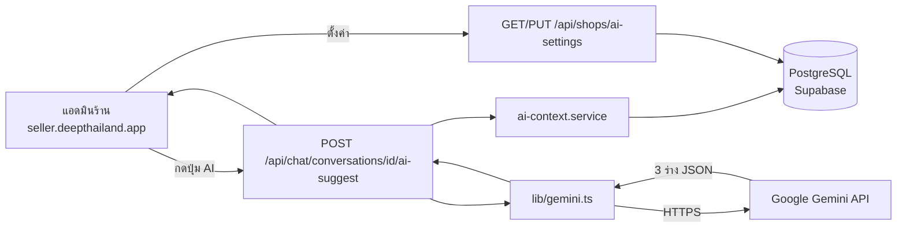
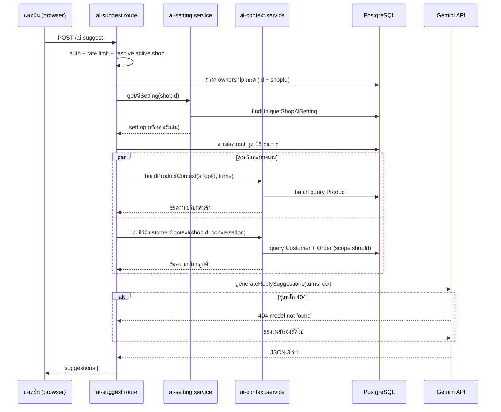
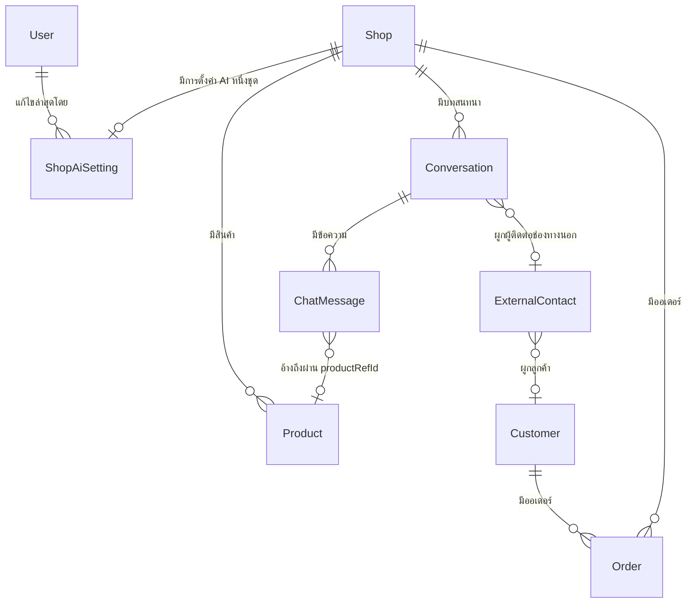

> **โมดูล:** M00019-AiReplyAssistant
> **ประเภทเอกสาร:** Software Requirements Specification (SRS) - TECHNICAL
> **เวอร์ชัน:** 1.0
> **วันที่จัดทำ:** 2026-07-23
> **สถานะ:** Draft — trace จาก [[BRD]] v1.0 (รอ user review)
> **เจ้าของเอกสาร:** SA (ดู [[Feature-Docs-Ownership]])

# SRS: ผู้ช่วยร่างคำตอบ AI — บริบทร้าน (Software Requirements Specification — Technical)

---

## 1. บทนำ (Introduction)

### 1.1 วัตถุประสงค์ของเอกสาร

กำหนดสเปกเชิงเทคนิคของการเติมบริบทร้าน (คำสั่งประจำร้าน สินค้า ลูกค้า) เข้าสู่ pipeline ของ `POST /api/chat/conversations/{id}/ai-suggest` ที่มีอยู่แล้ว รวมถึง schema ใหม่ API ใหม่ ข้อกำหนดที่ไม่ใช่ฟังก์ชัน และเงื่อนไขความปลอดภัย เพื่อให้ทีมพัฒนาสร้างได้ตรงตาม [[BRD]] โดยไม่ต้องตีความเอง

### 1.2 ขอบเขตเชิงระบบ (System Scope)

**อยู่ในขอบเขต:**
- ตารางใหม่สำหรับเก็บการตั้งค่า AI ต่อร้าน
- service layer ใหม่สำหรับประกอบบริบท (context builder)
- ส่วนขยายของ `src/lib/gemini.ts` ให้รับบริบทเพิ่มและประกอบ system prompt เป็นชั้น
- endpoint ใหม่สำหรับอ่าน/บันทึกการตั้งค่า AI ของร้าน
- หน้าตั้งค่าใน seller subdomain
- การปรับ `ai-suggest` route ให้เรียก context builder

**นอกขอบเขต:**
- การตอบอัตโนมัติ, rolling summary, prompt รายเพจ, RAG จากไฟล์แนบ, การวิเคราะห์รูป (ดู [[PRD]] §5)
- การเปลี่ยนผู้ให้บริการ AI

### 1.3 เอกสารอ้างอิง (References)

| เอกสาร | ความสัมพันธ์ |
|--------|-------------|
| [[PRD]] | เป้าหมายธุรกิจ KPI personas ที่ SRS นี้ต้องรองรับ |
| [[BRD]] | FR-001..FR-010 และ BR-AI-01..BR-AI-17 ที่ TFR ในเอกสารนี้ trace กลับ |
| [[SDS]] | การออกแบบ component และ data flow ที่แตกจาก SRS นี้ |
| [[API]] | contract ระดับ endpoint ที่แตกจาก §4 |
| [[DATABASE]] | schema/migration ที่แตกจาก §5 |
| `docs/SRS.md` (ระบบ) | data model และ authorization matrix ระดับระบบ |
| `docs/20 - Features/00018 - Facebook Chat Integration/*` | ฟีเจอร์เจ้าของ endpoint `ai-suggest` เดิม |
| `docs/20 - Features/00014 - Customer Directory/*` | ที่มาของ Customer ที่ผูกกับเธรด |
| `docs/conventions/prisma-shared-db-drift.md` | ข้อบังคับเรื่อง migration บน DB ที่ dev/prod ใช้ร่วมกัน |

### 1.4 นิยามและตัวย่อ (Definitions & Acronyms)

| คำ/ตัวย่อ | ความหมาย |
|-----------|----------|
| **Context builder** | ส่วนที่รวบรวมข้อมูลจากฐานข้อมูลแล้วแปลงเป็นข้อความสำหรับใส่ใน prompt |
| **System prompt** | คำสั่งชั้นบนสุดที่กำหนดบทบาทและกฎของ AI |
| **Shop instruction** | คำสั่งประจำร้านที่ร้านเขียนเอง (ฟิลด์ `instruction`) |
| **Fallback chain** | ลำดับรุ่นโมเดลที่ระบบไล่ลองเมื่อรุ่นก่อนหน้าไม่พร้อมใช้งาน |
| **Active shop** | ร้านที่ session กำลังใช้งานอยู่ (resolve ผ่าน `resolveActiveShopContext`) |

---

## 2. ภาพรวมสถาปัตยกรรม (Architecture Overview)

### 2.1 บริบทระบบ (System Context)

### 2.2 องค์ประกอบหลัก (Components)

| Component | หน้าที่ | Submodule / Stack |
|-----------|---------|-------------------|
| `ShopAiSetting` (model) | เก็บคำสั่งประจำร้านและสวิตช์บริบท 1 แถวต่อร้าน | Prisma / PostgreSQL |
| `src/services/ai-setting.service.ts` | อ่าน/บันทึกการตั้งค่า พร้อมค่าเริ่มต้นเมื่อยังไม่มีแถว | Service layer |
| `src/services/ai-context.service.ts` | ประกอบบริบทสินค้า/ลูกค้า/การ์ดสินค้าในเธรด เป็นข้อความพร้อมใส่ prompt | Service layer |
| `src/lib/gemini.ts` | ประกอบ system prompt เป็นชั้น เรียก Gemini พร้อม fallback chain | Server-only lib |
| `src/app/api/chat/conversations/[id]/ai-suggest/route.ts` | orchestrate: auth → rate limit → context → gemini | Next.js route handler |
| `src/app/api/shops/ai-settings/route.ts` | GET/PUT การตั้งค่า AI ของร้านที่ active | Next.js route handler |
| `src/app/(paces)/seller/(dashboard)/settings/ai/page.tsx` | หน้าตั้งค่า (Paces) | RSC + client form |
| `src/lib/validations.ts` | Valibot schema ของ payload การตั้งค่า | Validation |

### 2.3 มุมมองการ Deploy (Deployment View)

- ทำงานบน Vercel Functions (Node.js runtime) เดียวกับระบบเดิม ไม่มีบริการใหม่
- ฐานข้อมูล PostgreSQL บน Supabase เดิม (dev/prod ใช้ instance เดียวกัน — migration ต้องเป็น `migrate deploy` เท่านั้น ตาม `docs/conventions/prisma-shared-db-drift.md`)
- ตัวแปรสภาพแวดล้อมที่เกี่ยวข้อง: `GEMINI_API_KEY` (บังคับ), `GEMINI_MODEL` (ไม่บังคับ — ถ้าตั้งจะปิด fallback chain และใช้รุ่นเดียว)
- ไม่มี background job ใหม่

---

## 3. ข้อกำหนดเชิงฟังก์ชันเชิงเทคนิค (Technical Functional Requirements)

### TFR-001: เก็บการตั้งค่า AI ต่อร้าน

- ต้องมีตาราง `ShopAiSetting` ความสัมพันธ์ 1:1 กับ `Shop` โดย `shopId` เป็น unique
- ฟิลด์: `instruction` (ข้อความ ยาวสูงสุด 2,000 ตัวอักษร บังคับที่ชั้น validation), `includeProductContext` (boolean, default true), `includeCustomerContext` (boolean, default true), `updatedByUserId`, `createdAt`, `updatedAt`
- ร้านที่ยังไม่มีแถว ต้องอ่านค่าได้เป็นค่าเริ่มต้นโดยไม่ต้องสร้างแถวล่วงหน้า (lazy default)
- การบันทึกใช้ upsert ด้วย `shopId` เป็น key
- trace: FR-001, FR-002, BR-AI-01, BR-AI-03, BR-AI-04

### TFR-002: สิทธิ์การเข้าถึงการตั้งค่า

- อ่าน: ผู้ใช้ต้องเข้าถึงร้านได้ (`canAccessShop`) — ครอบทั้ง OWNER, ADMIN, STAFF
- เขียน: ต้องเป็น OWNER หรือ ADMIN เท่านั้น — ตรวจฝั่งเซิร์ฟเวอร์เสมอ ห้ามเชื่อ role ที่ส่งมาจาก client
- shopId ต้อง derive จาก `resolveActiveShopContext` เท่านั้น ห้ามรับ `shopId` จาก request body/query
- trace: FR-003, BR-AI-02

### TFR-003: แปลงการ์ดสินค้าในบทสนทนาเป็นข้อความที่มีข้อมูลจริง

- เมื่ออ่านข้อความ 15 รายการล่าสุด ให้เก็บ `productRefId` ของข้อความชนิด `PRODUCT` ทั้งหมด
- ดึงสินค้าด้วย batch query ครั้งเดียว (ห้าม N+1) โดย scope `shopId` ของร้านที่ active
- แทน placeholder `[ส่งการ์ดสินค้า]` ด้วยรูปแบบ `[ส่งการ์ดสินค้า: {ชื่อ} — {ราคา} บาท ({สถานะ})]`
- สินค้าที่หาไม่พบ (ถูกลบ) ให้ใช้ `[ส่งการ์ดสินค้า: สินค้าถูกลบแล้ว]` และห้าม throw
- ถ้า `includeProductContext = false` ให้คงข้อความ placeholder เดิมทุกประการ
- trace: FR-004, BR-AI-06, BR-AI-10

### TFR-004: คัดสินค้าที่เกี่ยวข้องกับข้อความล่าสุดของลูกค้า

- สร้างคำค้นจากข้อความ `BUYER` ล่าสุดไม่เกิน 3 ข้อความ
- ค้นสินค้าของร้านที่ active ด้วยการจับคู่ชื่อแบบไม่สนตัวพิมพ์ (`contains`, `mode: insensitive`)
- เงื่อนไขบังคับใน WHERE: `shopId` ของร้านที่ active และสถานะเปิดขายเท่านั้น
- จำกัด 20 รายการ (`take: 20`) เรียงตามความเกี่ยวข้องแล้วตามชื่อ
- ถ้าไม่พบสินค้าที่จับคู่ได้ ให้ fallback เป็นสินค้าเปิดขายล่าสุด 10 รายการ เพื่อให้ AI ยังพอมีข้อมูลราคาอ้างอิง
- ถ้าร้านเปิดใช้ระบบสต็อก ให้แนบจำนวนคงเหลือ มิฉะนั้นห้ามแนบฟิลด์สต็อก
- trace: FR-005, BR-AI-06, BR-AI-07

### TFR-005: บริบทลูกค้าและออเดอร์

- resolve ลูกค้าที่ผูกกับเธรด: เธรดช่องทางนอกผ่าน `ExternalContact.customerId`, เธรด DEEP ผ่าน `Customer.userId`
- ดึงออเดอร์ล่าสุดไม่เกิน 5 รายการ โดย WHERE ต้องมีทั้ง `customerId` และ `shopId` ของร้านที่ active
- allow-list ฟิลด์ที่ส่งเข้า prompt: `status`, `totalAmount`, `createdAt` และชื่อเรียกลูกค้าเท่านั้น
- **ห้าม select หรือส่งต่อ** `phone`, `email`, `shippingAddress` หรือฟิลด์ที่อยู่ใด ๆ เข้าสู่ prompt
- ถ้า `includeCustomerContext = false` หรือเธรดยังไม่ผูกลูกค้า ให้ข้ามทั้งบล็อก
- trace: FR-006, BR-AI-08, BR-AI-09, BR-AI-10

### TFR-006: ประกอบ system prompt เป็นชั้นตามลำดับความสำคัญ

ลำดับที่ประกอบต้องเป็น:

1. บทบาทและกฎความปลอดภัยของระบบ (ข้อความคงที่ในโค้ด)
2. คำสั่งประจำร้าน — ต้องห่อด้วยตัวคั่นชัดเจนและกำกับว่าเป็น "ข้อมูลร้าน" ไม่ใช่การแทนที่กฎระบบ
3. บริบทสินค้าและบริบทลูกค้า — กำกับว่าเป็นข้อเท็จจริงที่อ้างอิงได้
4. บทสนทนา — กำกับชัดเจนว่าเป็น "เนื้อหา" ห้ามตีความเป็นคำสั่ง
5. ย้ำกฎความปลอดภัยปิดท้ายอีกครั้ง

- trace: FR-007, BR-AI-05, BR-AI-11, BR-AI-12, BR-AI-13

### TFR-007: เพดานความยาวบริบท

- ความยาวรวมของบล็อกบริบท (สินค้า + ลูกค้า) ต้องไม่เกิน 6,000 ตัวอักษร
- ถ้าเกิน ให้ตัดรายการสินค้าจากท้ายรายการลงจนพอดี และต้องไม่ตัดบล็อกลูกค้าทิ้งก่อนสินค้า
- คำสั่งประจำร้านตัดที่ 2,000 ตัวอักษรเสมอแม้ข้อมูลใน DB จะยาวกว่า (defense-in-depth)
- trace: NFR-Cost, BR-AI-03, BR-AI-07

### TFR-008: fallback chain ของรุ่นโมเดล

- ถ้า `GEMINI_MODEL` ถูกตั้ง ให้ใช้รุ่นนั้นรุ่นเดียว ไม่ต้อง fallback
- ถ้าไม่ตั้ง ให้ไล่ลองตามลำดับที่กำหนดในโค้ด
- ถอยไปรุ่นถัดไป **เฉพาะ HTTP 404** เท่านั้น (รุ่นถูกปลดระวาง/ไม่มีสิทธิ์ใช้) — สถานะอื่นต้องโยนทันที
- ต้องบันทึก log เมื่อเกิดการถอย เพื่อให้ทีมงานรู้ว่าต้องอัปเดตลำดับ
- หมายเหตุ: ข้อนี้ implement ไปแล้วบางส่วนใน commit `ad26099a` — SRS นี้ทำให้เป็นข้อกำหนดถาวร
- trace: FR-009, BR-AI-15

### TFR-009: ความทนทานของการรวบรวมบริบท

- การดึงบริบทแต่ละก้อน (การตั้งค่า / สินค้า / ลูกค้า) ต้องอยู่ใน try-catch แยกกัน
- ความล้มเหลวของก้อนใดก้อนหนึ่งให้ log แล้วดำเนินต่อด้วยบริบทเท่าที่มี ห้ามทำให้ทั้ง request ล้มเหลว
- ดึงบริบทที่ไม่ขึ้นต่อกันแบบขนาน (`Promise.allSettled`)
- เพดานเวลาการรวบรวมบริบทรวม 3 วินาที — เกินให้ใช้เท่าที่ได้มาแล้ว
- trace: FR-010, BR-AI-16

### TFR-010: การจำกัดอัตราการเรียก

- คงเพดานเดิม 15 ครั้งต่อผู้ใช้ต่อนาทีของ `ai-suggest`
- endpoint การตั้งค่าใช้เพดานกลางของระบบตาม `guardApi` เดิม ไม่ต้องเพิ่มเฉพาะทาง
- trace: BR-AI-17

---

## 4. ข้อกำหนดส่วนต่อประสาน (Interface / API Specification)

### 4.1 API Endpoints

| Method | Path | คำอธิบาย | Auth |
|--------|------|----------|------|
| GET | `/api/shops/ai-settings` | อ่านการตั้งค่า AI ของร้านที่ active (คืนค่าเริ่มต้นถ้ายังไม่เคยตั้ง) | NextAuth session + `canAccessShop` |
| PUT | `/api/shops/ai-settings` | บันทึกการตั้งค่า AI ของร้านที่ active | NextAuth session + role OWNER/ADMIN |
| POST | `/api/chat/conversations/{id}/ai-suggest` | ขอร่าง 3 แบบ (มีอยู่แล้ว — ขยายให้แนบบริบท) | NextAuth session + ownership เธรด |

### 4.2 รายละเอียดต่อ Endpoint

#### GET `/api/shops/ai-settings`

- Request: ไม่มี body/param — shop derive จาก session
- Response 200:
  - `instruction`: string (ค่าว่างถ้ายังไม่ตั้ง)
  - `includeProductContext`: boolean
  - `includeCustomerContext`: boolean
  - `canEdit`: boolean (true เมื่อ role เป็น OWNER/ADMIN — ให้ UI ใช้ตัดสินโหมดอ่านอย่างเดียว)
  - `updatedAt`: string | null
- Response 401 เมื่อไม่มี session, 404 เมื่อ resolve ร้านที่ active ไม่ได้
- Cache: `private, no-store` และ `force-dynamic` (ข้อมูลต่อผู้ใช้ ห้าม shared cache)

#### PUT `/api/shops/ai-settings`

- Request body: `instruction` (string, ≤2000), `includeProductContext` (boolean), `includeCustomerContext` (boolean)
- ตรวจด้วย Valibot ที่ `src/lib/validations.ts`
- Response 200 คืนค่าที่บันทึกแล้ว (รูปแบบเดียวกับ GET)
- Response 400 เมื่อ payload ไม่ผ่าน validation, 403 เมื่อ role ไม่ใช่ OWNER/ADMIN, 404 เมื่อ resolve ร้านไม่ได้

#### POST `/api/chat/conversations/{id}/ai-suggest` (ขยายจากเดิม)

- Request/Response contract ภายนอกไม่เปลี่ยน (ยังคืน `suggestions: string[]`)
- เปลี่ยนเฉพาะเนื้อหาที่ส่งเข้า Gemini
- เพิ่มการอ่าน `ShopAiSetting` และเรียก context builder
- Error contract เดิมคงไว้ทุกประการ (503 ยังไม่ตั้งค่า key, 502 ผู้ให้บริการล้มเหลว, 429 เกินโควตา)

### 4.3 Events / Messaging

ไม่มี event/queue ใหม่ในฟีเจอร์นี้

### 4.4 Sequence ของ flow สำคัญ

---

## 5. ข้อกำหนดด้านข้อมูล (Data Requirements)

### 5.1 Data Model / Entities

| Entity | คำอธิบาย | Owner store |
|--------|----------|-------------|
| `ShopAiSetting` | การตั้งค่า AI ต่อร้าน (ใหม่) | PostgreSQL (Supabase) |
| `Shop` | เจ้าของการตั้งค่า (มีอยู่แล้ว) | PostgreSQL |
| `Product` | แหล่งชื่อ/ราคา/สถานะสินค้า (อ่านอย่างเดียว) | PostgreSQL |
| `Conversation`, `ChatMessage` | บทสนทนาและการ์ดสินค้า (อ่านอย่างเดียว) | PostgreSQL |
| `Customer`, `ExternalContact`, `Order` | บริบทลูกค้าและออเดอร์ (อ่านอย่างเดียว) | PostgreSQL |

### 5.2 ความสัมพันธ์ (ERD)

### 5.3 Migration / Data Lifecycle

- migration เดียว: `CREATE TABLE "ShopAiSetting"` เป็นการเปลี่ยนแปลงแบบเพิ่มอย่างเดียว (additive) ไม่แตะตารางเดิม
- **ห้ามใช้ `prisma migrate dev`** — DB dev/prod ใช้ร่วมกันและมี drift อยู่ (ดู `docs/conventions/prisma-shared-db-drift.md`) ให้เขียนไฟล์ migration เองแล้ว apply ด้วย `prisma migrate deploy`
- ไม่มี backfill — ร้านที่ยังไม่มีแถวใช้ค่าเริ่มต้นจากโค้ด
- ลบร้าน → ลบการตั้งค่าตาม (`onDelete: Cascade`)
- ไม่มีการเก็บ log บทสนทนาที่ส่งให้ AI ในฐานข้อมูล (ดู NFR ความเป็นส่วนตัว)

---

## 6. ข้อกำหนดที่ไม่ใช่ฟังก์ชัน (Non-Functional Requirements)

| ด้าน | ข้อกำหนด | เป้าหมายที่วัดได้ |
|------|----------|-------------------|
| **NFR-Perf-01 ประสิทธิภาพ** | การรวบรวมบริบทต้องไม่เพิ่มเวลารอเกิน 1 วินาที | p95 ของเวลารวบรวมบริบท ≤ 1,000 ms |
| **NFR-Perf-02 เพดานเวลา** | เวลารวมตั้งแต่รับ request ถึงคืนผล | ≤ 15 วินาที (timeout ของ Gemini เดิม) |
| **NFR-Perf-03 คิวรี** | ห้าม N+1 — ดึงสินค้า/ออเดอร์ด้วย batch query | จำนวน query ต่อ request คงที่ ไม่ขึ้นกับจำนวนข้อความ |
| **NFR-Sec-01 ขอบเขตข้อมูล** | ทุก query ต้องมี `shopId` ของร้านที่ active ใน WHERE | ตรวจได้จาก code review ทุก query |
| **NFR-Sec-02 ความเป็นส่วนตัว** | ห้ามส่ง phone/email/address ไปยังผู้ให้บริการ AI | grep ยืนยันว่าไม่มีการ select ฟิลด์เหล่านี้ในเส้นทาง AI |
| **NFR-Sec-03 ความลับ** | `GEMINI_API_KEY` อ่านฝั่ง server เท่านั้น (`import 'server-only'`) | ไม่ปรากฏใน client bundle |
| **NFR-Sec-04 สิทธิ์** | ตรวจ role ฝั่ง server ทุกครั้งสำหรับการเขียน | ทดสอบด้วยการเรียก API ตรงในบทบาท STAFF |
| **NFR-Cost-01 ต้นทุน** | เพดานความยาวบริบท 6,000 ตัวอักษร และคำสั่งร้าน 2,000 ตัวอักษร | วัดความยาว payload ก่อนส่ง |
| **NFR-Rel-01 ความทนทาน** | บริบทล้มเหลวบางส่วนต้องไม่ทำให้ request ล้มเหลว | ทดสอบด้วยการจำลอง query ล้ม |
| **NFR-Rel-02 การเปลี่ยนรุ่น** | รองรับการปลดระวางรุ่นโมเดลโดยไม่ต้อง deploy ใหม่ทันที | มี fallback chain + ตั้งรุ่นผ่าน env |
| **NFR-Obs-01 การสังเกตการณ์** | บันทึก log เมื่อถอยรุ่นโมเดล และเมื่อบริบทถูกตัดเพราะเกินเพดาน | มี log entry ที่ค้นหาได้ |
| **NFR-Cache-01 แคช** | endpoint การตั้งค่าเป็นข้อมูลต่อผู้ใช้ ห้าม shared cache | header `private, no-store` |

---

## 7. ข้อจำกัดทางเทคนิคและการพึ่งพา (Technical Constraints & Dependencies)

### 7.1 ข้อจำกัดทางเทคนิค

- Next.js 16 App Router — route handler ต้องประกาศ `export const dynamic = "force-dynamic"` สำหรับข้อมูลต่อผู้ใช้
- ฐานข้อมูล dev/prod ใช้ instance เดียวกัน → migration ต้องเป็น additive และ apply ด้วย `migrate deploy` พร้อมขอยืนยันจากผู้ใช้ก่อน
- หน้า UI อยู่ใน route group `(paces)` → ต้องประกอบจาก Paces primitive และ toast ต้องใช้ `pacesToast` (Hard Rule 7/9)
- `src/lib/gemini.ts` ประกาศ `import 'server-only'` — ห้าม import จาก client component

### 7.2 การพึ่งพาภายนอก/ภายใน

| Dependency | ประเภท | ความเสี่ยง |
|------------|--------|-----------|
| Google Gemini API | external | ปลดระวางรุ่นโมเดล / โควตา / ความหน่วง |
| `resolveActiveShopContext` | internal | ถ้า resolve ผิดจะทำให้ข้อมูลข้ามร้าน — ต้อง re-verify membership เสมอ |
| `canAccessShop` | internal | ฐานของสิทธิ์อ่าน |
| Product / Order / Customer services | internal | โครงสร้างฟิลด์เปลี่ยนจะกระทบ context builder |
| `checkApiRateLimit` | internal | in-memory ต่อ instance — บน serverless ไม่ใช่เพดานรวมทั้งระบบ (known-gap เดิมของโปรเจกต์) |

### 7.3 สมมติฐานทางเทคนิค (Assumptions)

- จำนวนสินค้าต่อร้านอยู่ในระดับที่ค้นด้วย `contains` ได้โดยไม่ต้องมี full-text index ในเฟสนี้
- ข้อความ 15 รายการล่าสุดเพียงพอต่อการเข้าใจบริบทของแชทส่วนใหญ่
- `Order.status` และ `Product.price` เป็นแหล่งความจริงที่ถูกต้องอยู่แล้ว

---

## 8. ความเสี่ยงเชิงสถาปัตยกรรม (Architectural Risks)

| ความเสี่ยง | ผลกระทบ | แนวทางลด |
|-----------|---------|----------|
| ค้นสินค้าด้วย `contains` ช้าเมื่อร้านมีสินค้าหลักหมื่น | เวลารอเพิ่ม | จำกัด `take` และมี index บน `(shopId, isActive)`; ถ้าไม่พอค่อยพิจารณา full-text ในเฟสถัดไป |
| บริบทยาวทำให้โมเดลตัดข้อมูลสำคัญ | คุณภาพร่างแย่ลง | เพดานความยาว + จัดลำดับให้ข้อมูลสำคัญอยู่ต้น |
| Prompt injection จากข้อความลูกค้า | AI เปลี่ยนพฤติกรรม | แยกชั้น prompt ชัดเจน + ย้ำกฎปิดท้าย + ทดสอบเคสโจมตีใน Tests |
| Rate limit แบบ in-memory ไม่ครอบทั้งระบบบน serverless | ผู้ใช้เลี่ยงเพดานได้เมื่อกระจายหลาย instance | รับความเสี่ยงในเฟสนี้ (สอดคล้องกับ known-gap เดิมของโปรเจกต์) และบันทึกไว้เพื่อย้ายไป Redis ภายหลัง |
| ผู้ให้บริการเปลี่ยนรูปแบบ response | parse ไม่ได้ | ตรวจรูปแบบผลลัพธ์และคืน error ที่ระบุสาเหตุได้ |

---

## 9. Traceability Matrix

| BRD FR-ID | SRS TFR-ID | Component | สถานะ |
|-----------|-----------|-----------|-------|
| FR-001 | TFR-001, TFR-006 | `ShopAiSetting`, `ai-setting.service`, `lib/gemini.ts` | Draft |
| FR-002 | TFR-001, TFR-003, TFR-004, TFR-005 | `ai-setting.service`, `ai-context.service` | Draft |
| FR-003 | TFR-002 | `api/shops/ai-settings` | Draft |
| FR-004 | TFR-003 | `ai-context.service` | Draft |
| FR-005 | TFR-004 | `ai-context.service` | Draft |
| FR-006 | TFR-005 | `ai-context.service` | Draft |
| FR-007 | TFR-006 | `lib/gemini.ts` | Draft |
| FR-008 | — (คงพฤติกรรมเดิมของ UI) | `AiSuggestPanel` | Done (00018) |
| FR-009 | TFR-008 | `lib/gemini.ts` | Partially done (`ad26099a`) |
| FR-010 | TFR-009 | `ai-suggest` route | Draft |
| BR-AI-17 | TFR-010 | `checkApiRateLimit` | Done (00018) |

---

## 10. สรุป (Summary)

ฟีเจอร์นี้เพิ่มตารางเดียว (`ShopAiSetting`) service สองตัว (`ai-setting`, `ai-context`) endpoint สองตัว และหน้าตั้งค่าหนึ่งหน้า โดยไม่เปลี่ยน contract ภายนอกของ `ai-suggest` เดิม ความเสี่ยงหลักอยู่ที่ขอบเขตข้อมูล (ต้อง scope `shopId` ทุก query) และความเป็นส่วนตัว (ห้ามส่งข้อมูลติดต่อลูกค้าออกนอกระบบ) ซึ่งถูกกำหนดเป็น NFR-Sec-01 และ NFR-Sec-02 พร้อมวิธีตรวจที่ทำได้จริงในขั้นตอน review

สำหรับการออกแบบ component และ data flow ดู [[SDS]] — contract ระดับ endpoint ดู [[API]] — schema และ migration ดู [[DATABASE]]
