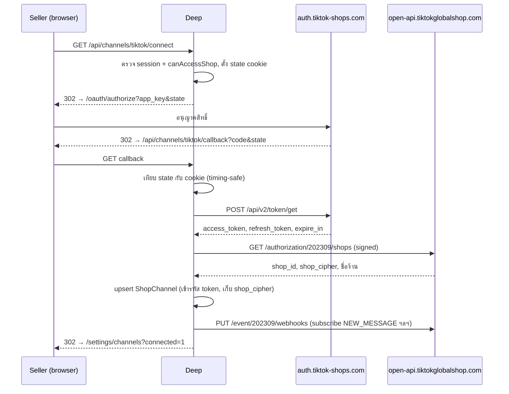
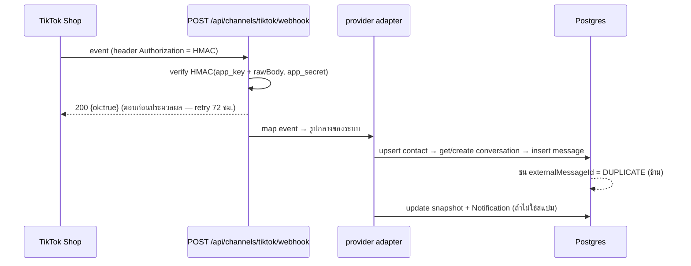

> **โมดูล:** M00020-TikTokChatIntegration
> **ประเภทเอกสาร:** API Contract
> **เวอร์ชัน:** 1.0
> **วันที่จัดทำ:** 2026-07-25
> **สถานะ:** Draft — **ยังไม่มี route ใดถูก implement** (Phase 3)
> **เจ้าของเอกสาร:** SA/Planner (ดู [[Feature-Docs-Ownership]])
>
> ⚠️ เอกสารนี้เขียนโดย Controller ไม่ใช่ `safepay-planner` — subagent ล้มไป 2 ครั้งในเซสชันนี้

# API Contract: TikTok Chat Integration

---

## 0. 🛑 ที่มาของข้อมูล และสิ่งที่ยังไม่ยืนยัน

หน้าเอกสารของ TikTok Shop (`partner.tiktokshop.com/docv2/**`) เป็น **JS-rendered** — HTTP client
ธรรมดา (WebFetch/curl) ดึงได้แต่ title ว่าง **แต่อ่านผ่าน browser ได้ปกติ** (Chrome DevTools MCP
รัน JavaScript ให้ และไม่ต้อง login)

> 🔄 **v1.1 (2026-07-25) — แก้ที่มาของข้อมูล:** ฉบับแรกสกัดจาก SDK ชุมชน
> [`EcomPHP/tiktokshop-php`](https://github.com/EcomPHP/tiktokshop-php) เพราะเข้าใจผิดว่าเอกสาร
> อ่านไม่ได้เลย — SDK ให้ข้อมูล**ไม่ครบและมีจุดที่ทำให้เข้าใจผิด** ตอนนี้ทุกข้อยืนยันกับเอกสาร
> ทางการแล้ว (ดูตารางล่าง) สิ่งที่ SDK ไม่บอกและเกือบทำให้ implement ผิด:
> `content` ต้องเป็น **JSON serialized string** ไม่ใช่ object · IMAGE ต้องมี **width/height** ·
> มี event **`SELLER_DEAUTHORIZATION`** และ **`UPCOMING_AUTHORIZATION_EXPIRATION`** ที่ Meta ไม่มี

**หน้าที่อ่านแล้ว (ยืนยันด้วยเอกสารทางการ):**

| หน้า | URL | ให้อะไร |
|---|---|---|
| Send Message | `/docv2/page/send-message-202309` | **ปิด OQ-TTC-02** — `type` enum ครบ, shape ของ `content` ทุกแบบ, error code, envelope |
| Sign your API request | `/docv2/page/sign-your-api-request` | สูตรลายเซ็น + code sample Go/Java — **ตรงกับที่ implement ไว้** |
| Common parameters | `/docv2/page/678e3a4278f4c20311b8b57e` | param บังคับ + **timestamp window** `[now-5min, now+30s]` (error `36009004`) |
| Webhooks overview | `/docv2/page/tts-webhooks-overview` | event_type ครบทุก topic + คำเตือนห้าม branch ด้วย numeric `type` |

**ยังไม่ยืนยัน (อ่านต่อได้จาก browser — ไม่ต้องรอ TikTok ตอบ):**

| # | เรื่อง | อ่านได้จาก |
|---|---|---|
| OQ-TTC-11 | sandbox ใช้ host แยกหรือ production host + sandbox shop | Developer tools / Seller Center development shops |
| OQ-TTC-12 | error code ตัวไหน = "token/สิทธิ์ตาย" (สำหรับ allow-list) | `/docv2/page/common-errors` |
| OQ-TTC-13 | payload จริงของ `NEW_MESSAGE` (ชื่อ field) | topic page ของ NEW_MESSAGE |
| OQ-TTC-14 | อายุจริงของ access token / authorization | Get Access Token page — **และต้องอ่านจาก response จริง ไม่ hardcode** |

**สูตรลายเซ็น webhook (OQ-TTC-03) ยังมาจาก SDK** — เอกสารทางการที่อ่านแล้วยังไม่ครอบข้อนี้
ต้อง verify ด้วย payload จริงก่อนเชื่อ (`feedback_spike_must_match_production_path`)

---

## 1. Overview

API ชุดนี้แบ่งเป็น 3 กลุ่ม:

1. **endpoint ใหม่ที่ `/api/channels/tiktok/**`** — OAuth เชื่อมร้าน + webhook รับข้อความ
2. **cron ใหม่** `/api/cron/refresh-channel-tokens` — ต่ออายุ token (ไม่มีใน 00018 เพราะ Facebook token ไม่หมดอายุ)
3. **endpoint เดิมที่ไม่ต้องแก้เลย** — `POST /api/chat/conversations/[id]/messages`, `GET /api/channels`, `DELETE /api/channels/[id]`

**ข้อ 3 คือผลลัพธ์ของ Phase 2:** `sendOutboundMessage` เรียกผ่าน `ChannelProvider` registry แล้ว
(`src/lib/channel-providers/`) เพิ่ม provider `TIKTOK_SHOP` = route ส่งข้อความรองรับ TikTok ทันที
**โดยไม่ต้องแก้ route** — และหน้าตั้งค่าช่องทาง/ถอดช่องทางก็ provider-agnostic อยู่แล้ว

**Provider:** Next.js 16 App Router Route Handlers (nodejs runtime)
**ผู้บริโภค:** TikTok Shop (webhook, server-to-server), seller session (connect/callback), Vercel Cron
**Base URL:** `https://deepthailand.app` (webhook อยู่ domain หลัก ไม่ใช่ `seller.*` เหมือน 00018)
**ต้นทาง:** [[BRD]] §2, schema → [[DATABASE]]

---

## 2. Authentication

### 2.1 endpoint ของเรา

| Endpoint | วิธี Auth | หมายเหตุ |
|---|---|---|
| `GET /api/channels/tiktok/connect` | NextAuth session (seller) | ไม่มี session → `401`; ต้องผ่าน `canAccessShop` (BR-TTC-29 — เจ้าของ **หรือ** พนักงาน) |
| `GET /api/channels/tiktok/callback` | NextAuth session + OAuth `state` cookie (`tiktok_channel_oauth_state`, httpOnly, SameSite=Lax) เทียบกับ query `state` | ป้องกัน CSRF ของ OAuth flow เอง — pattern เดียวกับ `fb_channel_oauth_state` ของ 00018 |
| `POST /api/channels/tiktok/webhook` | **ไม่มี session** — HMAC-SHA256 ใน header `Authorization` (ดู §2.2) | ต้องยกเว้นจาก CSRF Origin-check ของ `guardApi` (`src/proxy.ts`) เพราะ TikTok ไม่ส่ง `Origin` — **ยังต้อง apply rate-limit** |
| `GET /api/cron/refresh-channel-tokens` | `CRON_SECRET` (pattern เดียวกับ `/api/cron/chat-response-metrics`) | ⚠️ `CRON_SECRET` ยังเป็น carry item ที่ยังไม่ตั้งใน Vercel prod (หนี้จาก feature 00003) — ต้องตั้งก่อน deploy |
| `POST /api/chat/conversations/[id]/messages` | เหมือนเดิม (00011/00018) | **ไม่แก้** |

### 2.2 🛑 การ verify ลายเซ็น webhook — ต่างจาก Meta อย่างมีนัยสำคัญ

| | Meta (00018) | **TikTok Shop (00020)** |
|---|---|---|
| Header | `X-Hub-Signature-256` | **`Authorization`** |
| รูปแบบค่า | `sha256=<hex>` (มี prefix) | **hex เปล่า ไม่มี scheme prefix** |
| String ที่เซ็น | raw body | **`app_key + rawBody`** (app_key นำหน้า) |
| Key | `FB_CHAT_APP_SECRET` | `TIKTOK_SHOP_APP_SECRET` |
| อัลกอริทึม | HMAC-SHA256 | HMAC-SHA256 |
| การเทียบ | timing-safe | timing-safe (`crypto.timingSafeEqual`) |

```ts
// สูตรที่ต้อง implement (แปลจาก EcomPHP/tiktokshop-php src/Webhook.php)
const stringToBeSigned = process.env.TIKTOK_SHOP_APP_KEY + rawBody
const expected = crypto.createHmac('sha256', process.env.TIKTOK_SHOP_APP_SECRET!)
  .update(stringToBeSigned).digest('hex')
// เทียบกับ header 'authorization' แบบ timing-safe (ความยาวต้องเท่ากันก่อนเทียบ)
```

**⚠️ ความเสี่ยงที่ต้องตรวจก่อน implement:** TikTok ใช้ header **`Authorization`** ซึ่งปกติสงวนไว้สำหรับ
scheme มาตรฐาน (`Bearer ...`) — ต้องยืนยันว่า `src/proxy.ts` / Vercel / middleware ใดไม่ strip
หรือตีความ header นี้ก่อนถึง route (ถ้ามีอะไร normalize ค่านี้ ลายเซ็นจะพังทั้งหมด) **ต้องทดสอบด้วย
request จริงที่ผ่าน proxy จริง ไม่ใช่ unit test เพียว ๆ**

### 2.3 การ sign request ที่ **เรายิงออก** ไป TikTok

ทุก request ไป `open-api.tiktokglobalshop.com` ต้องมี:

| ส่วน | ค่า |
|---|---|
| Header `x-tts-access-token` | access token ที่ถอดรหัสจาก `ShopChannel.accessTokenEnc` |
| Query `app_key` | `TIKTOK_SHOP_APP_KEY` |
| Query `shop_cipher` | จาก `ShopChannel.externalMeta.shop_cipher` |
| Query `timestamp` | unix seconds |
| Query `sign` | HMAC-SHA256 — ดูสูตรล่าง |

**สูตร `sign`** (จาก `src/Client.php`): เอา query param ทุกตัว **ยกเว้น** `sign`, `access_token`,
`x-tts-access-token` → เรียงตามชื่อ key แบบ alphabetical → ต่อเป็น `{key}{value}` เรียงกัน →
prepend **request path** → (ถ้าไม่ใช่ GET และไม่ใช่ multipart) append **request body** →
ประกบหน้า-หลังด้วย `app_secret` → `HMAC-SHA256(str, app_secret)` เป็น hex

```
sign = HMAC_SHA256( app_secret + path + concat(sorted k+v) + body + app_secret , app_secret )
```

---

## 3. Endpoint List

### 3.1 endpoint ของเรา

| Method | Path | คำอธิบาย | Auth | สถานะ |
|---|---|---|---|---|
| `GET` | `/api/channels/tiktok/connect` | เริ่ม OAuth — redirect ไป authorize URL ของ TikTok | seller session | **ใหม่ ยังไม่ทำ** |
| `GET` | `/api/channels/tiktok/callback` | รับ `code` → แลก token → ดึงร้าน → สร้าง `ShopChannel` | session + state cookie | **ใหม่ ยังไม่ทำ** |
| `POST` | `/api/channels/tiktok/webhook` | รับ event `NEW_MESSAGE` / `NEW_CONVERSATION` | HMAC ใน `Authorization` | **ใหม่ ยังไม่ทำ** |
| `GET` | `/api/cron/refresh-channel-tokens` | ต่ออายุ token ที่ใกล้หมด (ทุก provider ที่มี `tokenExpiresAt`) | `CRON_SECRET` | **ใหม่ ยังไม่ทำ** |

### 3.2 endpoint เดิมที่ใช้ได้ทันที — ไม่ต้องแก้ (ผลของ Phase 2)

| Method | Path | ทำไมไม่ต้องแก้ |
|---|---|---|
| `POST` | `/api/chat/conversations/[id]/messages` | `sendOutboundMessage` เรียกผ่าน `getChannelProvider(conversation.channel)` แล้ว — เพิ่ม provider = รองรับทันที |
| `GET` | `/api/channels` | คืน `ShopChannel` ของร้านโดยไม่ผูก provider (⚠️ ตรวจว่า `select` allow-list **ไม่หลุด** `refreshTokenEnc`/`externalMeta`) |
| `DELETE` | `/api/channels/[id]` | `disconnectChannel()` เป็น soft-disconnect ที่ provider-agnostic |
| `GET`/`PATCH` | `/api/chat/conversations/[id]/crm`, `/api/chat/quick-messages*`, `.../ai-suggest` | ไม่ผูก provider เลย (FR-TTC-11) |

### 3.3 ยังไม่มี route (gap ที่ documented ชัดเจน — ห้ามถือว่ามีจริง)

| ควรมี | FR | เหตุผลที่ยังไม่มี |
|---|---|---|
| ปุ่ม/route "เชื่อมใหม่" เมื่อ `status='TOKEN_INVALID'` | FR-TTC-08 | **gap ของ 00018 ที่พบจริงในการ QA 2026-07-25** — แบนเนอร์ในแชทชี้ไป `/settings/channels` แต่หน้านั้นไม่มีปุ่มกู้คืน ร้านกู้เองไม่ได้ ต้องแก้ก่อนเปิด TikTok ให้ร้านใช้จริง |
| ส่งข้อความเชิงรุก (เปิดเธรดใหม่) | FR-TTC-14 | ต้องมี `POST conversations` ของ TikTok + UI เลือกลูกค้า |
| หน้าต่างเวลา/โควตาของทาง B | FR-TTC-15 | Conditional — รอผลอนุมัติ Business Messaging |

---

## 4. Endpoint Detail

### 4.1 `GET /api/channels/tiktok/connect` (ใหม่)

เริ่ม OAuth เชื่อมร้าน TikTok Shop Trace: [[BRD]] FR-TTC-01 / BR-TTC-04

**Request:** ไม่มี query param — อ่าน NextAuth session + active shop

**พฤติกรรม**

1. ตรวจ session + `canAccessShop(shopId, userId)` — ไม่ผ่าน → `401`/`403`
2. สร้าง `state` แบบสุ่ม (32 bytes hex) → set cookie `tiktok_channel_oauth_state` (httpOnly, SameSite=Lax, อายุ 10 นาที) — **ต้องผูก shopId ไว้ใน cookie ด้วย** กันกรณีผู้ใช้สลับร้านกลางทาง แล้วช่องทางไปโผล่ผิดร้าน
3. `302` ไป `https://auth.tiktok-shops.com/oauth/authorize?app_key={TIKTOK_SHOP_APP_KEY}&state={state}`

**Response:** `302` Location = authorize URL ของ TikTok

| Status | เงื่อนไข |
|---|---|
| 401 | ไม่มี session |
| 403 | ไม่มีสิทธิ์ในร้านนั้น |
| 500 | env `TIKTOK_SHOP_APP_KEY` ไม่ได้ตั้ง (fail-closed — ห้าม redirect ไปด้วย app_key ว่าง) |

---

### 4.2 `GET /api/channels/tiktok/callback` (ใหม่)

รับ auth code → แลก token → ดึงร้านที่ authorize → สร้าง/อัปเดต `ShopChannel`
Trace: FR-TTC-01 / BR-TTC-01, BR-TTC-02, BR-TTC-05

**Request**

| ส่วน | ฟิลด์ | ชนิด | บังคับ | คำอธิบาย |
|---|---|---|---|---|
| Query | `code` | `string` | yes | auth code จาก TikTok (ชื่อ param ต้อง verify — SDK เรียกว่า `auth_code` ตอนส่งเข้า token endpoint) |
| Query | `state` | `string` | yes | ต้องตรงกับ cookie `tiktok_channel_oauth_state` |
| Cookie | `tiktok_channel_oauth_state` | `string` | yes | httpOnly — ไม่ตรง/หมดอายุ → `403` |

**พฤติกรรม**

1. เทียบ `state` กับ cookie แบบ timing-safe → ไม่ตรง → `403` (ไม่บอกรายละเอียด)
2. แลก token: `POST https://auth.tiktok-shops.com/api/v2/token/get` พร้อม `app_key`, `app_secret`, `auth_code`, `grant_type=authorized_code` → ได้ `access_token`, `refresh_token`, และอายุ (**ต้องอ่านค่าอายุจาก response จริง ไม่ hardcode**)
3. ดึงร้านที่ authorize: `GET /authorization/202309/shops` (signed, ใช้ access token ที่ได้) → ได้ `shop_id`, `shop_cipher`, ชื่อร้าน
4. ต่อร้าน 1 แถว: upsert `ShopChannel` — `provider='TIKTOK_SHOP'`, `externalId=shop_id`, `name=ชื่อร้าน`, `accessTokenEnc`/`refreshTokenEnc` (เข้ารหัส), `tokenExpiresAt`, `externalMeta={shop_cipher}`, `status='ACTIVE'`
5. สมัคร webhook ให้อัตโนมัติ: `PUT webhooks` ต่อ event ที่ต้องการ (§6) — ล้มเหลวต้อง **ไม่** ทำให้การเชื่อมล้ม แต่ต้องรายงานให้ผู้ใช้เห็น (pattern เดียวกับ `subscribeFailed` ของ 00018)
6. ลบ cookie state → `302` กลับ `/settings/channels`

**Response:** `302` ไป `/seller/settings/channels` (query flag บอกผล เช่น `?connected=1` / `?subscribe_failed=1`)

| Status | เงื่อนไข | หมายเหตุ |
|---|---|---|
| 403 | `state` ไม่ตรง/หมดอายุ | CSRF guard ของ OAuth |
| 409 | ร้าน TikTok นั้นถูกร้าน Deep อื่นเชื่อม active อยู่ (`P2002` บน partial unique) | ต้องขึ้นข้อความอธิบาย **ไม่ใช่ error ดิบ** (BR-TTC-01, AC ของ FR-TTC-01) |
| 502 | token exchange หรือ `/shops` ล้มเหลว | เก็บ log ที่ไม่มี secret |

**🛑 ห้าม log ค่า `code`, `access_token`, `refresh_token`, `app_secret` ทุกกรณี** (BR-TTC-05)

---

### 4.3 `POST /api/channels/tiktok/webhook` (ใหม่)

รับ event จาก TikTok Shop Trace: FR-TTC-02/03 / BR-TTC-12..18

**Request**

| ส่วน | ฟิลด์ | ชนิด | บังคับ | คำอธิบาย |
|---|---|---|---|---|
| Header | `Authorization` | `string` | yes | hex HMAC-SHA256 ของ `app_key + rawBody` (ดู §2.2) |
| Body | `type` | `number \| string` | yes | ชนิด event — ต้อง map กับ `NEW_MESSAGE` / `NEW_CONVERSATION` / `NEW_MESSAGE_LISTENER` (**รูปแบบค่าจริงยังไม่ยืนยัน** — SDK รับ `event_type` เป็น string ตอนสมัคร แต่ payload ขาเข้าอาจเป็นตัวเลข) |
| Body | `shop_id` | `string` | yes | ใช้ lookup `ShopChannel` ด้วย `(provider='TIKTOK_SHOP', externalId=shop_id)` |
| Body | `data` | `object` | yes | เนื้อ event — `conversation_id`, `message_id`, `content`, `sender` (**shape ยังไม่ยืนยัน**) |

**Valibot:** ต้องมี schema ของตัวเอง (`src/lib/tiktok/webhook-types.ts`) — **ห้ามเชื่อ shape จาก TikTok ตรง ๆ** (BR-TTC-14 เทียบ `WebhookBodySchema` ของ 00018)

**Response — Success (200)**

```json
{ "ok": true }
```

คืน `200` เสมอเมื่อลายเซ็นผ่าน — แม้ payload parse ไม่ผ่าน หรือผลเป็น `NO_CHANNEL`/`DUPLICATE`/`IGNORED`
**เจตนา:** TikTok retry ได้นานถึง **72 ชั่วโมง** แบบ exponential backoff (นานกว่า Meta) ถ้าตอบ non-2xx
จะถูกยิงซ้ำทั้งกองยาว ๆ (BR-TTC-13)

**ลำดับที่ต้องทำ:** verify ลายเซ็น → **ตอบ 200 ทันที** → ประมวลผลต่อ (ไม่ถือ request ค้างจนเกิน timeout)

| Status | เงื่อนไข | body |
|---|---|---|
| 401 | `Authorization` ไม่ผ่าน verify | `{ "error": "invalid signature" }` |

**Side-effects (ต่อ 1 event ที่สำเร็จ):** เหมือน 00018 ทั้งชุด — upsert `ExternalContact`, get-or-create `Conversation`, insert `ChatMessage`, update snapshot (`lastMessageAt`/`lastMessagePreview`/`lastSenderRole`/`lastInboundAt`), auto-unhide/auto-reopen (ยกเว้นเธรดสแปม), insert `Notification` — ใน `$transaction` เดียวต่อ event

**Idempotency:** unique บน `ChatMessage.externalMessageId` (เก็บ `message_id` ของ TikTok) → `P2002` = `DUPLICATE` ไม่สร้างแถวซ้ำ (BR-TTC-12)

---

### 4.4 `GET /api/cron/refresh-channel-tokens` (ใหม่)

ต่ออายุ token ก่อนหมด Trace: FR-TTC-09 / BR-TTC-26..28

**Request**

| ส่วน | ฟิลด์ | บังคับ | คำอธิบาย |
|---|---|---|---|
| Header | `authorization: Bearer {CRON_SECRET}` | yes | pattern เดียวกับ cron เดิมของโปรเจกต์ |

**พฤติกรรม**

1. query `ShopChannel` `WHERE status='ACTIVE' AND tokenExpiresAt IS NOT NULL AND tokenExpiresAt < now() + INTERVAL` (ใช้ index `(status, tokenExpiresAt)`)
2. ต่อแถว: `POST https://auth.tiktok-shops.com/api/v2/token/refresh` (`app_key`, `app_secret`, `refresh_token`, `grant_type=refresh_token`)
3. สำเร็จ → อัปเดต `accessTokenEnc`, `refreshTokenEnc`, `tokenExpiresAt` (เข้ารหัสใหม่ทุกครั้ง)
4. ล้มเหลว → `status='TOKEN_INVALID'` + สร้าง `Notification` แจ้งร้านให้เชื่อมใหม่ (BR-TTC-27 — **ไม่ใช่แค่เปลี่ยนป้ายในหน้าที่ร้านอาจไม่เปิด**)
5. ต่อแถวหนึ่งพังต้องไม่ทำให้แถวอื่นไม่ถูกประมวลผล

**Response (200)**

```json
{ "checked": 12, "refreshed": 3, "failed": 0 }
```

**Schedule:** เพิ่มใน `vercel.json` → `crons` — ความถี่ต้องกำหนดจากอายุ token จริง (OQ) ไม่เดา

---

## 5. Error Code Table

| Code | ที่มา | ความหมาย | การจัดการ |
|---|---|---|---|
| `401 invalid signature` | webhook ของเรา | ลายเซ็นไม่ผ่าน | ปฏิเสธ **ห้ามบันทึกลง DB** (BR-TTC-14) |
| `403` | callback | `state` ไม่ตรง | CSRF guard — ไม่บอกรายละเอียด |
| `409` | callback | ร้าน TikTok ถูกร้านอื่นเชื่อม active | ข้อความอธิบายให้ผู้ใช้เข้าใจ (BR-TTC-01) |
| `502` | callback / send | ต้นทางล้มเหลว | log ที่ไม่มี secret |
| `(#100) Upload attachment failure` | Send API ของ TikTok/Meta | ต้นทางดึงรูปไปไม่ได้ | บันทึกข้อความเป็น `FAILED` + `failureReason` **ห้ามล้มเหลวเงียบ** (BR-TTC-23) — **ห้าม** mark channel invalid (เป็นปัญหาของไฟล์ ไม่ใช่ของ token) |
| error สิทธิ์/token | Send API | การเชื่อมต่อใช้ไม่ได้แล้ว | `provider.isTokenDeadError()` → `status='TOKEN_INVALID'` + แจ้งร้าน (BR-TTC-24) |
| `WINDOW_CLOSED` | service | เลยหน้าต่างเวลา | ทาง A **ไม่มี** หน้าต่างเวลา → ไม่ควรเกิดกับ `TIKTOK_SHOP` (BR-TTC-20) |
| `CHANNEL_NOT_ACTIVE` | service | ช่องทางถูกถอด/token ตาย | UI ปิดช่องพิมพ์ + ปุ่มเชื่อมใหม่ (ดู §3.3 gap) |

**บทเรียนจริงจาก QA 2026-07-25:** ต้องแยก 2 เคสนี้ให้ชัดในโค้ด — `(#100)` (ส่งรูปไม่ได้) **ต้องไม่**
ทำให้ทั้งช่องทางตาย ส่วน error เรื่องสิทธิ์/token **ต้อง** mark invalid ของเดิมใน 00018 แยกถูกอยู่แล้ว
(`isTokenDeadError` เช็ค code เจาะจง ไม่เหมารวมทุก error) — provider ของ TikTok ต้องรักษาคุณสมบัตินี้

---

## 6. External API ที่เราเรียก (ฝั่ง TikTok)

| กลุ่ม | Method | URL / Path | ใช้ทำอะไร |
|---|---|---|---|
| Auth | `GET` (redirect) | `https://auth.tiktok-shops.com/oauth/authorize?app_key=&state=` | พาผู้ใช้ไปอนุญาตสิทธิ์ |
| Auth | `POST` | `https://auth.tiktok-shops.com/api/v2/token/get` | แลก `auth_code` → token (`grant_type=authorized_code`) |
| Auth | `POST` | `https://auth.tiktok-shops.com/api/v2/token/refresh` | ต่ออายุ (`grant_type=refresh_token`) |
| Shop | `GET` | `/authorization/202309/shops` | ได้ `shop_id` + **`shop_cipher`** |
| Chat | `GET` | `/customer_service/202309/conversations` | list เธรด |
| Chat | `POST` | `/customer_service/202309/conversations` | เปิดเธรดใหม่ (`buyer_user_id`) — FR-TTC-14 |
| Chat | `GET` | `/customer_service/202309/conversations/{id}/messages` | ดึงข้อความ |
| Chat | `POST` | `/customer_service/202309/conversations/{id}/messages` | **ส่งข้อความ** — ดู §6.1 (ยืนยันจากเอกสารแล้ว) |
| Chat | `POST` | `/customer_service/202309/conversations/{id}/messages/read` | mark read — FR-TTC-13 |
| Chat | `POST` | `/customer_service/202309/images/upload` | อัปโหลดรูปก่อนส่ง — **ต่างจาก Meta ที่ส่ง URL ให้ไปดึงเอง** |
| Webhook | `GET`/`PUT`/`DELETE` | `/event/202309/webhooks` | จัดการ subscription (`event_type` + `webhook_url`) |

**Host:** `https://open-api.tiktokglobalshop.com` (ทุก path ที่ไม่ใช่ auth)
**Webhook event ที่ต้อง subscribe:** `NEW_MESSAGE` (ข้อความใหม่), `NEW_CONVERSATION` (agent เข้า/ออก), `NEW_MESSAGE_LISTENER` (creator ทักร้าน)

### 6.1 `POST conversations/{id}/messages` — spec เต็ม (ยืนยันจากเอกสารทางการ)

**Required scope:** `seller.customer_service`
**Headers:** `content-type: application/json` + `x-tts-access-token`
**Query (บังคับทั้งหมด):** `app_key`, `sign`, `timestamp`, `shop_cipher`

**Body:** `{ "type": <enum>, "content": <JSON serialized string> }`

🛑 **`content` เป็น string ที่ JSON.stringify มาแล้ว ไม่ใช่ object** — ตัวอย่างทางการ:

```
-d '{ "type": "TEXT", "content": "{\"content\": \"test\"}" }'
```

| `type` | `content` (ชั้นใน) | หมายเหตุ |
|---|---|---|
| `TEXT` | `{"content":"..."}` | **สูงสุด 2000 ตัวอักษร** ห้ามคำที่ผิดนโยบาย TikTok |
| `IMAGE` | `{"url":"...","width":N,"height":N}` | `url` ต้องได้จาก `images/upload` — **ต้องรู้ขนาดรูป** |
| `VIDEO` | `{"vid":"..."}` | |
| `PRODUCT_CARD` | `{"product_id":"..."}` | ตรงกับการ์ดสินค้าที่ Deep มีอยู่แล้ว |
| `ORDER_CARD` | `{"order_id":"..."}` | ตรงกับการ์ดออเดอร์ที่ Deep มีอยู่แล้ว |
| `LOGISTICS_CARD` | `{"order_id":"...","package_id":"..."}` | `package_id` optional |
| `RETURN_REFUND_CARD` | `{"order_id":"...","sku_id":"..."}` | ต้องผ่านเงื่อนไข after-sale |
| `COUPON_CARD` | `{"coupon_id":"..."}` | คูปองต้องเข้าเงื่อนไข 4 ข้อ |

**Response:** `{ "code": 0, "message": "Success", "request_id": "...", "data": { "message_id": "..." } }`
→ `data.message_id` ใช้เป็น `ChatMessage.externalMessageId` (กลไก idempotency)

**Error code ของ endpoint นี้:**

| Code | ความหมาย | ต้องทำอะไร |
|---|---|---|
| `45101001` / `36009003` | internal error | retry ได้ — บันทึก FAILED ถ้ายังไม่สำเร็จ |
| `45101002` | invalid params (เช่น RETURN_REFUND_CARD ไม่เข้าเงื่อนไข) | FAILED — **ห้าม** mark channel invalid |
| `45101003` | record not found | FAILED |
| `45101004` | **โควตาเต็ม 10,000 request/วัน** | FAILED + ข้อความบอกร้านว่าโควตาวันนี้เต็ม — **ห้าม** mark channel invalid |
| `45101006` | ข้อความมีเนื้อหาที่ผิดนโยบาย | FAILED + บอกร้านให้แก้ข้อความ |
| `45102007` | ไม่มีสิทธิ์เข้าถึงเธรดนี้ | FAILED — เป็นเรื่องเธรด **ไม่ใช่** token |
| `36009004` | invalid timestamp (นอกช่วง `[now-5min, now+30s]`) | สงสัยนาฬิกา instance ก่อนสงสัยสูตรลายเซ็น |

**⚠️ การส่งรูปต่างจาก Meta อย่างมีนัยสำคัญ:** Meta รับ **URL** แล้วไปดึงรูปเอง (เราส่ง presigned URL
อายุ 1 ชม.) แต่ TikTok ต้อง **อัปโหลดไบต์ขึ้นไปก่อน** ผ่าน `images/upload` แล้วส่ง `url` ที่ได้
**พร้อม `width`/`height`** — `ChannelProvider.sendImage(target, imageFileId, caption?)` ที่ Phase 2
ออกแบบไว้ให้ provider ตัดสินเองว่าจะแปลง fileId เป็นอะไร **จึงรองรับ 2 ขั้นตอนนี้ได้โดยไม่ต้องแก้
interface** แต่ provider ต้องอ่านขนาดรูปจากไฟล์เอง (ดู [[SDS]] TD-003)

### 6.2 Webhook event ที่ต้อง subscribe

| event_type | ทำไมต้อง subscribe |
|---|---|
| `NEW_MESSAGE` | ข้อความใหม่ในเธรด — หัวใจของ FR-TTC-02/03 |
| `NEW_CONVERSATION` | agent เข้า/ออกเธรด |
| `NEW_MESSAGE_LISTENER` | creator ทักร้าน |
| **`SELLER_DEAUTHORIZATION`** | ร้านถอนสิทธิ์ — เอกสารบอกให้ใช้ event นี้ "stop API calls and clean up local connection state" **Meta ไม่มี event แบบนี้** |
| **`UPCOMING_AUTHORIZATION_EXPIRATION`** | สิทธิ์จะหมดอายุ — ส่ง **ล่วงหน้า 30 วัน** แล้วทุกวัน 00:00 จนกว่าจะ reauthorize |

🛑 **payload มี field `type` เป็นตัวเลข แต่เอกสารสั่งห้าม branch ด้วยตัวเลขนั้น** ("does not publish a
complete numeric type mapping for every topic") — ให้ยึด `event_type` ที่ subscribe ไว้ + shape ของ
payload (ดู [[SDS]] TD-005)

เอกสารเตือนด้วยว่า *"Do not rely on webhooks as the only source of truth"* — ควรมี reconcile ด้วย
การ poll `GET conversations` เป็นระยะในอนาคต (ยังไม่อยู่ใน scope รอบนี้)

---

## 7. Sequence

### 7.1 เชื่อมร้าน (OAuth)



### 7.2 ข้อความเข้า



---

## 8. Traceability

| Endpoint | FR | BR | สถานะ |
|---|---|---|---|
| `GET /api/channels/tiktok/connect` | FR-TTC-01 | BR-TTC-04, BR-TTC-29 | ยังไม่ทำ |
| `GET /api/channels/tiktok/callback` | FR-TTC-01 | BR-TTC-01/02/05 | ยังไม่ทำ |
| `POST /api/channels/tiktok/webhook` | FR-TTC-02, FR-TTC-03 | BR-TTC-12..18 | ยังไม่ทำ (บล็อกโดย OQ-TTC-02 สำหรับ shape ของ `data`) |
| `GET /api/cron/refresh-channel-tokens` | FR-TTC-09 | BR-TTC-26..28 | ยังไม่ทำ |
| `POST /api/chat/.../messages` (reuse) | FR-TTC-04, FR-TTC-05 | BR-TTC-19..24 | **ไม่ต้องแก้** — Phase 2 เสร็จแล้ว |
| `GET /api/channels`, `DELETE /api/channels/[id]` (reuse) | FR-TTC-08 | BR-TTC-06 | ไม่ต้องแก้ (ตรวจ select allow-list) |
| — (ยังไม่มี) | FR-TTC-08 เชื่อมใหม่ | — | gap ของ 00018 ที่พบใน QA 2026-07-25 |

---

## 9. สรุป

**endpoint ใหม่มีแค่ 4 ตัว** (connect / callback / webhook / cron) เพราะเส้นทางส่งข้อความ,
หน้าตั้งค่าช่องทาง, ถอดช่องทาง และเครื่องมือช่วยตอบทั้งชุด **reuse ได้ทันที** จากผลของ Phase 2
(provider abstraction) และ feature 00018

**3 จุดที่ต่างจาก Meta และต้องระวังเป็นพิเศษ:**

1. **ลายเซ็น webhook อยู่ใน header `Authorization`** และเซ็น `app_key + body` (ไม่ใช่ body เปล่า) — ต้องยืนยันว่าไม่มี proxy/middleware ไป normalize header นี้
2. **ทุก request ที่ยิงออกต้อง sign** (`sign` query param) + แนบ `shop_cipher` — ต่างจาก Meta ที่แค่แนบ token
3. **ส่งรูปต้องอัปโหลดไบต์ขึ้นไปก่อน** (`images/upload`) ไม่ใช่ส่ง URL ให้ไปดึงเอง

**ยังบล็อกอยู่:** OQ-TTC-02 (`type`/`content` ของการส่งข้อความ) และ shape ของ `data` ใน webhook payload
— ต้องได้จาก Partner Center ก่อนเขียน route จริง
