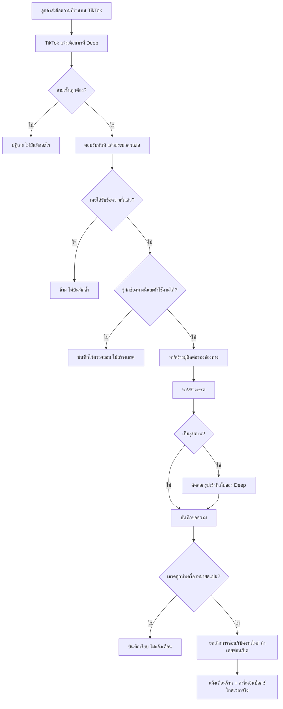
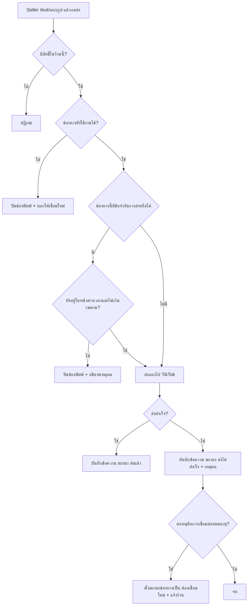
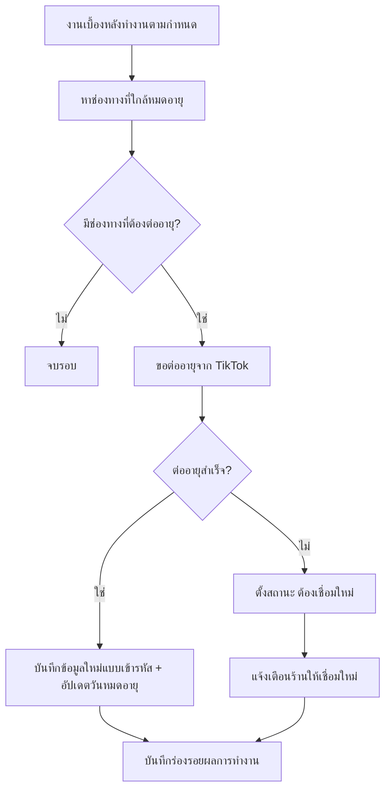

> **โมดูล:** M00020-TikTokChatIntegration
> **ประเภทเอกสาร:** Business Requirements Document (BRD) - NON-TECHNICAL
> **เวอร์ชัน:** 1.0
> **วันที่จัดทำ:** 2026-07-25
> **สถานะ:** Draft — **ยังไม่ผ่าน user review** ห้าม implement ก่อนผ่าน gate นี้ (Hard Rule 11)
> **เจ้าของเอกสาร:** BA (ดู [[Feature-Docs-Ownership]])
>
> ⚠️ ข้อที่ยังไม่ยืนยันจากเอกสารทางการของ TikTok ปรากฏเป็น **Open Question ใน §11** หรือ Assumption ใน [[PRD]] §9.2 — ไม่เขียนปนเป็นข้อเท็จจริง

---

# BRD: การเชื่อมข้อความ TikTok เข้าอินบ็อกซ์ Deep (Business Requirements Document)

---

## 1. บทนำ

### 1.1 วัตถุประสงค์ของเอกสาร

เอกสารนี้มีวัตถุประสงค์เพื่อ:

1. อธิบายความต้องการของการนำข้อความจาก TikTok เข้ามาอยู่ในอินบ็อกซ์เดียวของ Deep ที่ร้านใช้ตอบ Messenger/Instagram/แชทในแอปอยู่แล้ว
2. กำหนดขอบเขตให้ชัดว่า **ใครใช้ได้ ใครใช้ไม่ได้** — เพราะ TikTok เปิดช่องทางข้อความให้เฉพาะบางประเภทบัญชี ไม่ได้เปิดให้ทุกคน
3. อธิบายกฎทางธุรกิจที่ **ต่างกันตามช่องทาง** (การทักลูกค้าก่อน, หน้าต่างเวลาตอบ, ชนิดข้อความ) ซึ่งเป็นจุดที่ต่างจากฟีเจอร์ Messenger เดิมมากที่สุด
4. สร้างความเข้าใจร่วมกันว่าเหตุใดงานนี้ต้องมี "งานปรับโครงสร้างภายใน" ก่อนเพิ่มช่องทางใหม่ และเหตุใดความเสี่ยงหลักอยู่ที่ช่องทางเดิมที่ใช้งานจริงอยู่แล้ว ไม่ใช่ช่องทางใหม่

### 1.2 ขอบเขตของระบบ

**การเชื่อมข้อความ TikTok** คือส่วนขยายของอินบ็อกซ์ร้านค้า ที่ทำให้ข้อความซึ่งลูกค้าส่งมาที่ร้านบน TikTok เข้ามาปรากฏและตอบกลับได้จากหน้า `/inbox` ของ Deep โดยไม่ต้องเปิดแอป TikTok Seller Center แยก

**เข้าสู่ระบบ (Input):**
- ข้อความและรูปภาพที่ลูกค้าส่งมาที่ร้านบน TikTok
- การอนุญาตสิทธิ์จากร้านค้า (เพื่อให้ Deep อ่าน/ส่งข้อความแทนร้านได้)
- เหตุการณ์แจ้งเตือนจาก TikTok เมื่อมีข้อความใหม่หรือมีการเปลี่ยนแปลงในเธรด

**ออกจากระบบ (Output):**
- เธรดสนทนาในอินบ็อกซ์ของร้าน พร้อมป้ายบอกช่องทาง
- ข้อความและรูปที่ร้านตอบกลับ ส่งถึงลูกค้าในแอป TikTok จริง
- การแจ้งเตือนร้านเมื่อมีข้อความใหม่ และเมื่อการเชื่อมต่อมีปัญหา
- สถานะการอ่านที่ส่งกลับไปให้ฝั่ง TikTok
- ลูกค้าที่ถูกผูกเข้าทะเบียนลูกค้า (Customer Directory) เมื่อได้เบอร์โทร

**ระบบที่เกี่ยวข้อง:**
- แชทในแอป (feature 00011) — โครงเธรด/ข้อความที่ใช้ร่วมกัน
- การเชื่อม Messenger/Instagram (feature 00018) — โครงช่องทาง/ผู้ติดต่อภายนอก/เครื่องมือช่วยตอบ
- AI ช่วยร่างคำตอบ (feature 00019) — รวมกฎห้ามส่งข้อมูลติดต่อลูกค้าเข้า AI
- ทะเบียนลูกค้า (feature 00014) — จุดรวมประวัติลูกค้าข้ามช่องทาง
- สิทธิ์พนักงานร้าน (feature 00012) — คนที่ตอบแชทได้ไม่ใช่เจ้าของร้านเท่านั้น

### 1.3 กลุ่มผู้ใช้งาน

| กลุ่มผู้ใช้ | บทบาท | สิทธิ์การใช้งาน |
|-----------|--------|----------------|
| **เจ้าของร้าน (Seller)** | เชื่อม/ถอดช่องทาง TikTok, ตอบแชท, จัดการข้อความสำเร็จรูป | เต็มสิทธิ์ในร้านของตนเอง |
| **พนักงานร้าน (ShopMember)** | ตอบแชท, ใช้เครื่องมือช่วยตอบ, จัดระเบียบเธรด | ตอบแชทได้เท่าเจ้าของร้าน; การเชื่อม/ถอดช่องทางเป็นสิทธิ์ที่ต้องยืนยันใน §11 OQ-TTC-05 |
| **ลูกค้าบน TikTok** | ส่งข้อความมาที่ร้าน | ไม่มีบัญชี Deep และไม่ต้องมี — ไม่เห็นระบบ Deep เลย |
| **ผู้ดูแลระบบ (Admin)** | ไม่มีบทบาทใหม่ในฟีเจอร์นี้ | — |

---

## 2. ความต้องการหลัก (Functional Requirements)

### 2.1 การเชื่อมและดูแลช่องทาง

#### FR-TTC-01: เชื่อมร้าน TikTok Shop เข้าระบบ

**User Story:**
> ในฐานะเจ้าของร้านที่ขายบน TikTok Shop ฉันต้องการเชื่อมร้าน TikTok ของฉันเข้ากับ Deep ได้ด้วยตัวเองจากหน้าตั้งค่าช่องทาง เพื่อเริ่มรับข้อความลูกค้าเข้าอินบ็อกซ์เดียวโดยไม่ต้องรอทีมพัฒนา

**Acceptance Criteria:**
- [ ] หน้า `/seller/settings/channels` มีรายการช่องทาง TikTok Shop แสดงร่วมกับช่องทางเดิม (Facebook/Instagram)
- [ ] กดเชื่อมแล้วระบบพาไปหน้าอนุญาตสิทธิ์ของ TikTok และกลับมาที่หน้าเดิมเมื่อเสร็จ
- [ ] เชื่อมสำเร็จแล้วรายการแสดง **ชื่อร้าน TikTok** และสถานะ "ใช้งานได้"
- [ ] ระบบสมัครรับการแจ้งเตือนข้อความใหม่ให้อัตโนมัติ — ร้านไม่ต้องตั้งค่าเพิ่มเอง
- [ ] ข้อมูลการเชื่อมต่อถูกเก็บแบบเข้ารหัส และไม่ปรากฏในข้อมูลที่ส่งไปหน้าจอหรือใน log
- [ ] ถ้าร้าน TikTok นั้นถูกร้าน Deep อื่นเชื่อมไว้อยู่แล้ว ต้องขึ้นข้อความอธิบายชัดเจน ไม่ใช่ error ทางเทคนิค
- [ ] เชื่อมช่องทาง TikTok พร้อมกับ Facebook/Instagram ที่มีอยู่แล้วได้ ไม่ต้องถอดของเดิม

**Business Flow:**
1. Seller เข้าหน้าตั้งค่าช่องทาง กดเชื่อม TikTok Shop
2. ระบบพาไปหน้าอนุญาตสิทธิ์ของ TikTok
3. Seller อนุญาต → TikTok ส่งกลับมาที่ Deep
4. ระบบบันทึกการเชื่อมต่อ (เข้ารหัส) + สมัครรับการแจ้งเตือนข้อความ
5. หน้าตั้งค่าแสดงช่องทางใหม่พร้อมสถานะ "ใช้งานได้"

#### FR-TTC-08: จัดการและถอดช่องทาง TikTok

**User Story:**
> ในฐานะเจ้าของร้าน ฉันต้องการเห็นว่าช่องทาง TikTok ที่เชื่อมไว้ยังใช้งานได้อยู่หรือไม่ และถอดได้เมื่อต้องการ เพื่อไม่ให้ข้อความลูกค้าค้างอยู่ในช่องทางที่เสียแล้วโดยที่ฉันไม่รู้

**Acceptance Criteria:**
- [ ] รายการช่องทางแสดงสถานะได้อย่างน้อย 2 แบบ: "ใช้งานได้" และ "ต้องเชื่อมใหม่"
- [ ] เมื่อสถานะเป็น "ต้องเชื่อมใหม่" ต้องมีปุ่มเชื่อมใหม่และคำอธิบายว่าเกิดอะไรขึ้น (ไม่ใช่แค่ป้ายสีแดง)
- [ ] ถอดช่องทางได้ และต้องมีขั้นยืนยันก่อน (ไม่ถอดทันทีจากการกดครั้งเดียว)
- [ ] ถอดแล้วเธรดและประวัติข้อความที่เคยได้รับ **ยังอยู่** ไม่ถูกลบ
- [ ] ถอดแล้วร้าน Deep อื่นสามารถเชื่อมร้าน TikTok เดิมได้ (ไม่ถูกล็อกตลอดกาล)
- [ ] ถอดแล้วต้องส่งข้อความออกไม่ได้อีก และช่องพิมพ์ในเธรดของช่องทางนั้นถูกปิดพร้อมคำอธิบาย

#### FR-TTC-09: ต่ออายุการเชื่อมต่ออัตโนมัติ

**User Story:**
> ในฐานะเจ้าของร้าน ฉันต้องการให้การเชื่อมต่อกับ TikTok ต่ออายุเองโดยที่ฉันไม่ต้องทำอะไร เพื่อไม่ให้ช่องทางตายเงียบแล้วฉันมารู้ตอนที่ตอบลูกค้าไปแล้วข้อความไม่ถึง

**Acceptance Criteria:**
- [ ] ระบบต่ออายุการเชื่อมต่อ **ก่อน** หมดอายุ โดยไม่ต้องมีคนกด
- [ ] ช่องทางยังใช้งานต่อเนื่องได้เกินอายุรอบแรกของการเชื่อมต่อ พิสูจน์ได้จากการทดสอบข้ามรอบเวลาจริง
- [ ] ต่ออายุไม่สำเร็จ → สถานะเปลี่ยนเป็น "ต้องเชื่อมใหม่" **และ** ร้านได้รับการแจ้งเตือน (ไม่ใช่แค่เปลี่ยนป้ายในหน้าที่ร้านอาจไม่เปิด)
- [ ] การต่ออายุที่ไม่สำเร็จต้องไม่ทำให้ข้อความที่รับเข้ามาแล้วหายไป
- [ ] มีร่องรอยให้ตรวจได้ว่าการต่ออายุทำงานเมื่อไรและผลเป็นอย่างไร

> **ทำไม FR นี้ถึงเป็น Must ทั้งที่ไม่มีใน Messenger:** การเชื่อมต่อกับ Facebook ไม่หมดอายุเอง แต่ของ TikTok หมด — ถ้าไม่มีข้อนี้ ช่องทางจะตายเองภายในไม่กี่วันโดยที่ร้านไม่รู้ ซึ่งสร้างความเสียหายมากกว่าการไม่มีฟีเจอร์นี้เลย เพราะร้านจะเข้าใจว่าตอบลูกค้าไปแล้ว

### 2.2 การรับข้อความเข้า

#### FR-TTC-02: รับข้อความตัวอักษรเข้าอินบ็อกซ์

**User Story:**
> ในฐานะเจ้าของร้าน ฉันต้องการเห็นข้อความที่ลูกค้าส่งมาทาง TikTok ในอินบ็อกซ์เดียวกับช่องทางอื่น เพื่อไม่ต้องเฝ้าแอป TikTok Seller Center แยกอีกจอ

**Acceptance Criteria:**
- [ ] ข้อความจากลูกค้าปรากฏในอินบ็อกซ์ภายในเวลาไม่เกินระดับวินาที (ใกล้เวลาจริง ไม่ใช่รอ refresh)
- [ ] เธรดถูกจับคู่กับผู้ติดต่อของช่องทางนั้นถูกต้อง — ลูกค้าคนเดิมทักซ้ำต้องเข้าเธรดเดิม ไม่สร้างเธรดใหม่
- [ ] แสดงชื่อและรูปโปรไฟล์ของลูกค้าตามที่ TikTok ให้มา และอัปเดตตามเมื่อลูกค้าเปลี่ยน
- [ ] ข้อความเดียวกันที่ระบบได้รับซ้ำ **ไม่สร้างข้อความซ้ำในเธรด**
- [ ] เธรดที่ถูกซ่อนไว้กลับมาแสดงอัตโนมัติเมื่อลูกค้าทักใหม่ (เหมือนพฤติกรรมช่องทางเดิม)
- [ ] เธรดที่ปิดงานแล้วกลับมาเปิดอัตโนมัติเมื่อลูกค้าทักใหม่
- [ ] เธรดที่ทำเครื่องหมายว่าสแปม **ไม่** กลับมาเด้งและไม่มีเสียงแจ้งเตือน แต่ยังรับและเก็บข้อความไว้

**Example:**
```
ลูกค้า A ทักร้าน 3 ครั้งใน 1 นาที → เธรดเดียว มี 3 ข้อความ เรียงตามเวลา
ระบบได้รับข้อความที่ 2 ซ้ำอีกครั้งในวันรุ่งขึ้น → เธรดยังมี 3 ข้อความ (ไม่กลายเป็น 4)
```

#### FR-TTC-03: รับรูปภาพเข้าอินบ็อกซ์

**User Story:**
> ในฐานะเจ้าของร้าน ฉันต้องการเห็นรูปที่ลูกค้าส่งมา (เช่น สลิปโอนเงิน รูปสินค้าที่อยากได้) ในเธรดของ Deep และเปิดดูย้อนหลังได้เสมอ

**Acceptance Criteria:**
- [ ] รูปที่ลูกค้าส่งมาปรากฏในเธรดและกดขยายดูได้
- [ ] รูปถูกคัดลอกมาเก็บในระบบของ Deep เอง — เปิดดูได้แม้เวลาผ่านไปนานจนลิงก์ต้นทางหมดอายุ
- [ ] คัดลอกรูปไม่สำเร็จต้องไม่ทำให้ข้อความนั้นหายไปทั้งข้อความ — ต้องเห็นในเธรดว่ามีรูปที่โหลดไม่ได้
- [ ] ชนิดไฟล์และขนาดที่ระบบเก็บไม่ได้ต้องถูกจัดการอย่างชัดเจน ไม่ล้มเหลวแบบเงียบ

> **บทเรียนที่ต้องระวังซ้ำ:** ในช่องทาง Messenger เคยเกิดกรณีที่ระบบเก็บไฟล์ปฏิเสธชนิดไฟล์บางประเภททำให้สื่อจากลูกค้าหายเงียบ ๆ — ต้องทดสอบด้วยไฟล์จริงจาก TikTok ไม่ถือว่าแก้ครั้งเดียวจบ

#### FR-TTC-13: ทำเครื่องหมายว่าอ่านแล้วกลับไปที่ TikTok

**User Story:**
> ในฐานะเจ้าของร้าน ฉันต้องการให้ฝั่ง TikTok รู้ว่าฉันอ่านข้อความแล้วเมื่อฉันเปิดอ่านใน Deep เพื่อไม่ให้ร้านดูเหมือนเพิกเฉยต่อลูกค้า

**Acceptance Criteria:**
- [ ] เปิดอ่านเธรดใน Deep แล้วสถานะอ่านที่ฝั่ง TikTok เปลี่ยนตาม
- [ ] การส่งสถานะอ่านล้มเหลวต้องไม่ทำให้การเปิดอ่านเธรดใน Deep พังหรือค้าง
- [ ] ไม่ส่งสถานะอ่านซ้ำ ๆ ทุกครั้งที่ผู้ใช้เลื่อนดูเธรดเดิมโดยไม่มีข้อความใหม่

### 2.3 การตอบข้อความออก

#### FR-TTC-04: ตอบข้อความตัวอักษรออกไป TikTok

**User Story:**
> ในฐานะเจ้าของร้าน ฉันต้องการพิมพ์ตอบลูกค้าจาก Deep แล้วข้อความไปถึงลูกค้าในแอป TikTok จริง เพื่อไม่ต้องสลับไปตอบในแอป TikTok

**Acceptance Criteria:**
- [ ] ข้อความที่ส่งจาก Deep ปรากฏในแอป TikTok ของลูกค้า
- [ ] ข้อความที่ส่งแล้วปรากฏในเธรดฝั่ง Deep ทันทีในฐานะข้อความของร้าน
- [ ] ส่งข้อความยาวเกินที่ช่องทางรองรับต้องถูกเตือน **ก่อน** กดส่ง ไม่ใช่ให้กดแล้วค่อย error
- [ ] พนักงานร้าน (ไม่ใช่เจ้าของร้าน) ตอบได้เหมือนกัน
- [ ] คนที่ไม่มีสิทธิ์ในร้านนั้นตอบไม่ได้ และไม่เห็นเธรดตั้งแต่แรก

#### FR-TTC-05: ส่งรูปออกไป TikTok

**User Story:**
> ในฐานะเจ้าของร้าน ฉันต้องการส่งรูป (เช่น รูปสินค้า ตารางไซซ์ เลขบัญชี) ให้ลูกค้าจาก Deep ได้

**Acceptance Criteria:**
- [ ] แนบรูปแล้วส่งได้ และรูปปรากฏในแอป TikTok ของลูกค้า
- [ ] รูปที่ส่งแล้วปรากฏในเธรดฝั่ง Deep ด้วย
- [ ] รูปที่ชนิดไฟล์หรือขนาดเกินข้อจำกัดของช่องทางต้องถูกปฏิเสธพร้อมบอกเหตุผลที่อ่านรู้เรื่อง **ก่อน** ส่ง
- [ ] ส่งรูปจากข้อความสำเร็จรูปที่มีรูปแนบได้เหมือนกัน

#### FR-TTC-06: แสดงสถานะส่งไม่สำเร็จในเธรด

**User Story:**
> ในฐานะเจ้าของร้าน ฉันต้องการรู้ทันทีว่าข้อความที่ฉันส่งไปไม่ถึงลูกค้า เพื่อหาทางติดต่ออีกทางได้ ไม่ใช่เข้าใจว่าตอบแล้วทั้งที่ลูกค้าไม่เคยได้รับ

**Acceptance Criteria:**
- [ ] ส่งไม่สำเร็จ → ข้อความยังปรากฏในเธรดพร้อมสถานะ "ส่งไม่สำเร็จ" ที่มองเห็นชัด
- [ ] แสดงเหตุผลที่อ่านรู้เรื่องเป็นภาษาไทย ไม่ใช่รหัส error ดิบจาก TikTok
- [ ] **ห้ามล้มเหลวแบบเงียบ** — ไม่มีกรณีใดที่ข้อความหายไปโดยไม่มีร่องรอยในเธรด
- [ ] ถ้าสาเหตุคือการเชื่อมต่อหมดอายุ ต้องเปลี่ยนสถานะช่องทางเป็น "ต้องเชื่อมใหม่" ด้วย ไม่ใช่แค่แจ้งที่ข้อความ

#### FR-TTC-14: ร้านเริ่มบทสนทนากับลูกค้าก่อนได้ (เฉพาะช่องทาง TikTok Shop)

**User Story:**
> ในฐานะเจ้าของร้านบน TikTok Shop ฉันต้องการทักลูกค้าก่อนได้ (เช่น แจ้งของหมด แจ้งเลขพัสดุ) โดยที่ลูกค้าไม่ต้องทักมาก่อน

**Acceptance Criteria:**
- [ ] เปิดเธรดใหม่กับลูกค้า TikTok Shop ได้จาก Deep และข้อความแรกถึงลูกค้าจริง
- [ ] ความสามารถนี้ **ไม่** ปรากฏในช่องทางที่ต้นทางห้ามทักก่อน (ต้องไม่โชว์ปุ่มที่กดแล้วต้อง error)
- [ ] เธรดที่ร้านเปิดเองปรากฏในอินบ็อกซ์เหมือนเธรดปกติ

#### FR-TTC-15: หน้าต่างเวลาตอบและจำนวนข้อความจำกัด (เฉพาะช่องทาง Business Messaging) — **Conditional**

**User Story:**
> ในฐานะเจ้าของร้านที่ตอบลูกค้าผ่านช่องทางที่มีข้อจำกัดเวลา ฉันต้องการเห็นว่าเหลือเวลาเท่าไรและส่งได้อีกกี่ข้อความ เพื่อไม่ให้พิมพ์ยาวแล้วเพิ่งรู้ว่าส่งไม่ได้

**Acceptance Criteria:**
- [ ] แสดงเวลาที่เหลือของหน้าต่างการตอบในเธรดนั้น
- [ ] แสดงจำนวนข้อความที่ยังส่งได้ก่อนถึงเพดาน
- [ ] หมดเวลาหรือเต็มเพดาน → ช่องพิมพ์ถูกปิดพร้อมคำอธิบาย ไม่ใช่ปล่อยให้กดส่งแล้ว error
- [ ] ลูกค้าส่งข้อความใหม่ → เวลาและจำนวนที่ส่งได้กลับมาเต็มโดยอัตโนมัติ
- [ ] เธรดของช่องทางที่ไม่มีข้อจำกัดนี้ **ต้องไม่แสดง** ตัวนับหรือคำเตือนใด ๆ

> **Conditional:** ทำเฉพาะเมื่อได้รับอนุมัติสิทธิ์ **และ** ยืนยันว่าใช้ได้ในไทย (OQ-TTC-01) — ไม่นับรวมใน Definition of Done รอบนี้

### 2.4 การแสดงผลและเครื่องมือช่วยตอบ

#### FR-TTC-07: ป้ายช่องทางและตัวกรองในอินบ็อกซ์

**User Story:**
> ในฐานะเจ้าของร้านที่เชื่อมหลายช่องทาง ฉันต้องการรู้ในสายตาแรกว่าเธรดนี้มาจาก TikTok หรือ Messenger และกรองดูเฉพาะช่องทางได้

**Acceptance Criteria:**
- [ ] ทุกเธรดแสดงป้ายบอกช่องทางชัดเจน ใช้ **icon จริง** ไม่ใช้ emoji
- [ ] กรองดูเฉพาะเธรดของช่องทาง TikTok ได้
- [ ] ตัวกรองแสดงเฉพาะช่องทางที่ร้านนั้นเชื่อมไว้จริง ไม่แสดงช่องทางของร้านอื่น
- [ ] เธรดจากทุกช่องทางเรียงรวมกันตามเวลาข้อความล่าสุดได้ (ไม่บังคับให้แยกดูทีละช่องทาง)

> **หมายเหตุการออกแบบ:** ตัว icon ที่จะใช้แทนช่องทาง TikTok ยังไม่ระบุ — ต้องให้ user เลือกก่อน implement ห้ามเดา (OQ-TTC-04)

#### FR-TTC-10: แจ้งเตือนข้อความใหม่จาก TikTok

**User Story:**
> ในฐานะเจ้าของร้าน ฉันต้องการได้รับแจ้งเตือนเมื่อลูกค้า TikTok ทักมา เหมือนที่ได้รับจากช่องทางอื่น เพื่อตอบทันเกณฑ์เวลาของ TikTok

**Acceptance Criteria:**
- [ ] มีข้อความใหม่ → เกิดการแจ้งเตือนแบบเดียวกับช่องทางเดิม (ไม่สร้างกลไกใหม่)
- [ ] มีเสียงแจ้งเตือนในหน้าอินบ็อกซ์เหมือนช่องทางเดิม
- [ ] เธรดที่ทำเครื่องหมายสแปมไม่แจ้งเตือนและไม่มีเสียง
- [ ] การแจ้งเตือนพาไปที่เธรดที่ถูกต้องเมื่อกด

#### FR-TTC-11: เครื่องมือช่วยตอบเดิมใช้กับเธรด TikTok ได้

**User Story:**
> ในฐานะเจ้าของร้าน ฉันต้องการใช้ข้อความสำเร็จรูป AI ช่วยร่าง โน้ตลูกค้า และกลุ่มแท็บ ที่ทำไว้ใช้กับ Messenger อยู่แล้ว กับเธรด TikTok ได้ทันที เพื่อไม่ต้องทำของซ้ำสองชุด

**Acceptance Criteria:**
- [ ] ข้อความสำเร็จรูปชุดเดียวกันเลือกใช้ได้ในเธรด TikTok
- [ ] AI ช่วยร่างคำตอบทำงานกับเธรด TikTok และยังต้องให้คนเลือก/แก้ก่อนส่งเสมอ
- [ ] **ไม่มีข้อมูลติดต่อลูกค้า (เบอร์/อีเมล/ที่อยู่) ถูกส่งเข้าระบบ AI** — ตรวจสอบได้จริง
- [ ] โน้ตภายใน แท็ก ชื่อเรียกลูกค้า ใช้กับผู้ติดต่อ TikTok ได้
- [ ] กลุ่มแท็บ ปักหมุด ซ่อน ปิดงาน ทำเครื่องหมายสแปม ใช้กับเธรด TikTok ได้
- [ ] โน้ตภายในและชื่อเรียกที่ตั้งไว้ **ไม่เคย** ถูกส่งออกไปหาลูกค้า

#### FR-TTC-12: ผูกลูกค้า TikTok เข้าทะเบียนลูกค้า

**User Story:**
> ในฐานะเจ้าของร้าน ฉันต้องการให้ลูกค้าที่ทักมาทาง TikTok กลายเป็นลูกค้าในทะเบียนเมื่อฉันได้เบอร์แล้ว เพื่อให้ประวัติของลูกค้าคนเดียวกันที่ทักหลายช่องทางรวมเป็นคนเดียว

**Acceptance Criteria:**
- [ ] สร้างออเดอร์จากเธรด TikTok แล้วกรอกเบอร์ → ผู้ติดต่อถูกผูกเข้าลูกค้าในทะเบียน
- [ ] ครั้งถัดไปที่ลูกค้าคนเดิมทักมา ระบบแสดงว่าเป็นลูกค้าเดิมโดยไม่ต้องถามเบอร์ซ้ำ
- [ ] ถ้าเบอร์นั้นมีลูกค้าอยู่แล้วในทะเบียน (เคยทักมาทาง Messenger หรือเคยสั่งผ่านลิงก์) ต้องผูกเข้าลูกค้าคนเดิม ไม่สร้างซ้ำ
- [ ] ผู้ติดต่อ TikTok ที่ยังไม่ได้เบอร์ **ไม่** ถูกนับเป็นลูกค้าในทะเบียน

---

## 3. Acceptance Criteria สรุป

### 3.1 การเชื่อมช่องทาง

**เมื่อระบบทำงานถูกต้อง:**
- ✅ ร้านเชื่อม TikTok Shop ได้เองจากหน้าตั้งค่า ไม่ต้องพึ่งทีมพัฒนา
- ✅ ข้อมูลการเชื่อมต่อถูกเข้ารหัสและไม่รั่วไปหน้าจอหรือ log
- ✅ ร้าน TikTok หนึ่งผูกกับร้าน Deep ได้ร้านเดียวในขณะใดขณะหนึ่ง และย้ายได้หลังถอด
- ✅ การเชื่อมต่อต่ออายุเองก่อนหมด — ช่องทางไม่ตายเงียบ
- ✅ ต่ออายุไม่ได้ → ร้านได้รับแจ้งเตือนให้เชื่อมใหม่ ไม่ใช่รอให้สังเกตเอง

### 3.2 การรับ-ส่งข้อความ

**เมื่อระบบทำงานถูกต้อง:**
- ✅ ข้อความและรูปจากลูกค้าเข้าอินบ็อกซ์ครบ ใกล้เวลาจริง
- ✅ ข้อความที่ได้รับซ้ำไม่สร้างข้อความซ้ำในเธรด แม้ต้นทางจะยิงซ้ำนานหลายวัน
- ✅ ข้อความและรูปที่ร้านตอบถึงลูกค้าในแอป TikTok จริง
- ✅ ทุกกรณีที่ส่งไม่สำเร็จมีสถานะและเหตุผลในเธรด — ไม่มีการล้มเหลวแบบเงียบ
- ✅ รูปเปิดดูย้อนหลังได้เสมอเพราะเก็บในระบบเราเอง

### 3.3 กฎที่ต่างกันตามช่องทาง

**เมื่อระบบทำงานถูกต้อง:**
- ✅ เธรด TikTok Shop ไม่แสดงคำเตือนเรื่องหน้าต่างเวลา (เพราะไม่มีข้อจำกัดนั้น)
- ✅ เธรดของช่องทางที่มีข้อจำกัดแสดงเวลาที่เหลือและจำนวนข้อความที่ส่งได้ถูกต้อง
- ✅ ปุ่มเริ่มบทสนทนาก่อนปรากฏเฉพาะช่องทางที่อนุญาต
- ✅ ไม่มีกรณีที่ระบบปล่อยให้กดส่งในสภาพที่รู้อยู่แล้วว่าส่งไม่ได้

### 3.4 เครื่องมือช่วยตอบและความปลอดภัยข้อมูล

**เมื่อระบบทำงานถูกต้อง:**
- ✅ ข้อความสำเร็จรูป AI ช่วยร่าง โน้ต แท็ก กลุ่มแท็บ ใช้กับเธรด TikTok ได้ทั้งหมด
- ✅ ไม่มีเบอร์โทร อีเมล หรือที่อยู่ของลูกค้าถูกส่งเข้าระบบ AI
- ✅ AI ไม่ส่งข้อความเองทุกกรณี — มีคนเลือกและตรวจก่อนส่งเสมอ
- ✅ โน้ตภายในและชื่อเรียกลูกค้าไม่เคยถูกส่งออกไปหาลูกค้า
- ✅ พนักงานร้านตอบแชทได้ ไม่ติดอยู่ที่เจ้าของร้านคนเดียว

### 3.5 ไม่กระทบช่องทางเดิม

**เมื่อระบบทำงานถูกต้อง:**
- ✅ แชทในแอป Messenger และ Instagram ทำงานเหมือนเดิมทุกประการ
- ✅ หน้าต่างเวลา 24 ชั่วโมงของ Messenger ยังบังคับใช้ถูกต้อง
- ✅ ข้อความที่ร้านตอบจากแอป Messenger บนมือถือยังเข้า Deep ครบ
- ✅ ชุดทดสอบเดิมผ่านทั้งหมดโดยไม่ต้องแก้เงื่อนไขการทดสอบ

---

## 4. Business Flows (กระบวนการทำงาน)

### 4.1 Flow หลัก: ข้อความจากลูกค้าเข้าอินบ็อกซ์



### 4.2 Flow: ร้านตอบข้อความออก



### 4.3 Flow: ต่ออายุการเชื่อมต่ออัตโนมัติ



---

## 5. Use Case Scenarios (สถานการณ์การใช้งานจริง)

### Scenario 1: Best Case — เชื่อมแล้วตอบลูกค้าทันเกณฑ์

**ผู้เกี่ยวข้อง:** เจ้าของร้านที่ขายบน TikTok Shop

**เงื่อนไขเริ่มต้น:**
- ร้านใช้ Deep อยู่แล้ว เชื่อม Facebook Page ไว้แล้ว
- ร้านมีข้อความสำเร็จรูปที่ทำไว้ใช้กับ Messenger อยู่แล้ว

**ขั้นตอน:**
1. เข้าหน้าตั้งค่าช่องทาง กดเชื่อมร้าน TikTok Shop และอนุญาตสิทธิ์
2. ช่องทางแสดงสถานะ "ใช้งานได้"
3. ลูกค้าทักถามราคาสินค้าทาง TikTok — เกิดเสียงแจ้งเตือนและเธรดขึ้นบนสุดของอินบ็อกซ์พร้อมป้าย TikTok
4. เจ้าของร้านเปิดเธรด (สถานะอ่านส่งกลับไปที่ TikTok) เลือกข้อความสำเร็จรูป "วิธีสั่งซื้อ" แก้เล็กน้อยแล้วส่ง
5. ลูกค้าได้รับข้อความในแอป TikTok และตอบว่าจะสั่ง
6. เจ้าของร้านสร้างออเดอร์จากเธรด กรอกเบอร์ลูกค้า

**ผลลัพธ์:**
- ตอบลูกค้าภายในไม่กี่นาที (ต่ำกว่าเกณฑ์ 12 ชั่วโมงของ TikTok มาก)
- ลูกค้าถูกผูกเข้าทะเบียนลูกค้า — ครั้งถัดไประบบรู้จักทันที

### Scenario 2: การเชื่อมต่อหมดอายุแต่ระบบต่อให้เอง

**ผู้เกี่ยวข้อง:** เจ้าของร้าน (ไม่ต้องทำอะไร)

**เงื่อนไขเริ่มต้น:**
- ร้านเชื่อมช่องทาง TikTok ไว้นานกว่าอายุของการเชื่อมต่อรอบแรก

**ขั้นตอน:**
1. งานเบื้องหลังตรวจพบว่าการเชื่อมต่อใกล้หมดอายุ
2. ระบบขอต่ออายุกับ TikTok และสำเร็จ
3. บันทึกข้อมูลใหม่แบบเข้ารหัสและอัปเดตวันหมดอายุ

**ผลลัพธ์:**
- ร้านตอบลูกค้าได้ต่อเนื่องโดยไม่รู้ว่าเกิดอะไรขึ้นเบื้องหลัง
- ไม่มีข้อความใดส่งไม่ออกในช่วงรอยต่อ

### Scenario 3: Worst Case — ต่ออายุไม่ได้เพราะร้านถอนสิทธิ์เอง

**ผู้เกี่ยวข้อง:** เจ้าของร้าน

**เงื่อนไขเริ่มต้น:**
- ร้านเข้าไปถอนสิทธิ์ Deep จากฝั่ง TikTok เอง (หรือเปลี่ยนรหัสผ่าน)

**ขั้นตอน:**
1. งานเบื้องหลังขอต่ออายุแล้วถูกปฏิเสธ
2. ระบบตั้งสถานะช่องทางเป็น "ต้องเชื่อมใหม่" และแจ้งเตือนร้าน
3. ร้านเปิดเธรด TikTok พบว่าช่องพิมพ์ถูกปิดพร้อมคำอธิบายและปุ่มเชื่อมใหม่
4. ร้านกดเชื่อมใหม่และอนุญาตสิทธิ์อีกครั้ง

**ผลลัพธ์:**
- เธรดและประวัติข้อความทั้งหมดยังอยู่ครบ ไม่ถูกลบ
- ร้านไม่เคยเข้าใจผิดว่าตอบลูกค้าไปแล้วทั้งที่ส่งไม่ออก

### Scenario 4: ลูกค้าคนเดียวทักทั้ง Messenger และ TikTok

**ผู้เกี่ยวข้อง:** เจ้าของร้าน, ลูกค้าหนึ่งคน

**เงื่อนไขเริ่มต้น:**
- ร้านเชื่อมทั้ง Facebook Page และ TikTok Shop
- ลูกค้าเคยสั่งของผ่าน Messenger และร้านมีเบอร์ในทะเบียนแล้ว

**ขั้นตอน:**
1. ลูกค้าคนเดิมทักเข้ามาทาง TikTok
2. ระบบสร้างผู้ติดต่อใหม่ในช่องทาง TikTok (เป็นคนละรายการกับผู้ติดต่อฝั่ง Messenger)
3. ร้านคุยแล้วสร้างออเดอร์ กรอกเบอร์เดิมของลูกค้า
4. ระบบผูกผู้ติดต่อ TikTok เข้ากับลูกค้าคนเดิมในทะเบียน (ไม่สร้างลูกค้าซ้ำ)

**ผลลัพธ์:**
- ในทะเบียนลูกค้ายังเป็นคนเดียว มีประวัติออเดอร์ต่อเนื่อง
- ในอินบ็อกซ์ยังเป็นสองเธรด (ตามข้อจำกัดที่ยอมรับไว้ — ดู BR-TTC-08)

### Scenario 5: ระบบได้รับข้อความซ้ำจากการยิงซ้ำของ TikTok

**ผู้เกี่ยวข้อง:** ระบบ (ไม่มีคนเกี่ยวข้อง)

**เงื่อนไขเริ่มต้น:**
- ระบบเคยรับและบันทึกข้อความหนึ่งไปแล้วเมื่อวานนี้

**ขั้นตอน:**
1. TikTok ยิงเหตุการณ์เดิมมาอีกครั้ง (เพราะเคยไม่ได้รับการตอบรับที่สมบูรณ์)
2. ระบบตรวจพบว่าข้อความนี้มีอยู่แล้ว
3. ระบบตอบรับสำเร็จแต่ไม่บันทึกอะไรเพิ่ม

**ผลลัพธ์:**
- เธรดไม่มีข้อความซ้ำ
- ไม่มีการแจ้งเตือนหลอกไปหาร้านซ้ำสอง

---

## 6. ความต้องการด้านคุณภาพ (Quality Requirements)

### 6.1 ความถูกต้องของข้อมูล
- ข้อความในเธรดต้องเรียงตามเวลาจริงที่เกิดขึ้น และไม่มีข้อความซ้ำแม้ต้นทางจะยิงซ้ำหลายวัน
- ชื่อและรูปโปรไฟล์ลูกค้าต้องอัปเดตตามต้นทางเมื่อมีข้อความใหม่ ไม่ค้างค่าเดิมตลอดกาล
- สถานะการส่ง (ส่งแล้ว/ส่งไม่สำเร็จ) ต้องสะท้อนผลจริง ไม่แสดง "ส่งแล้ว" ในกรณีที่ยังไม่ยืนยันจากต้นทาง

### 6.2 ความรวดเร็ว
- ข้อความจากลูกค้าต้องปรากฏในอินบ็อกซ์ในระดับวินาที ไม่ต้องรอผู้ใช้กด refresh
- การตอบรับการแจ้งเตือนจากต้นทางต้องเร็วพอที่ต้นทางจะไม่ถือว่าล้มเหลวและยิงซ้ำ
- การเปิดอ่านเธรดต้องไม่ค้างรอผลการส่งสถานะอ่านกลับไปต้นทาง

### 6.3 ความน่าเชื่อถือ
- ช่องทางต้องไม่ตายเงียบ — ทุกกรณีที่ใช้งานต่อไม่ได้ต้องมีสถานะที่ร้านเห็นและได้รับแจ้ง
- การคัดลอกรูปไม่สำเร็จต้องไม่ทำให้ข้อความหายทั้งข้อความ
- ความล้มเหลวของงานเบื้องหลังต้องไม่ทำให้ข้อความที่รับเข้ามาแล้วสูญหาย

### 6.4 ความปลอดภัย
- ข้อมูลการเชื่อมต่อของร้านต้องเข้ารหัสเมื่อเก็บ ห้ามส่งกลับไปหน้าจอ ห้ามบันทึกลง log
- ช่องทางรับข้อความจากภายนอกต้องตรวจสอบความถูกต้องของลายเซ็นทุกครั้ง — นี่คือกลไกยืนยันตัวตนเดียวของช่องทางนั้น
- รูปแบบข้อมูลที่รับจากภายนอกต้องถูกตรวจสอบเอง ไม่เชื่อว่าต้นทางส่งมาถูกเสมอ
- ข้อมูลตัวตนของลูกค้าต้องไม่รั่วผ่านข้อมูลที่ส่งไปแสดงผลบนหน้าจอ
- ข้อมูลติดต่อลูกค้าต้องไม่ถูกส่งออกไปยังบริการ AI ภายนอก

### 6.5 ความสะดวกในการใช้งาน (Usability)
- ร้านที่ตอบ Messenger อยู่แล้วต้องใช้เธรด TikTok ได้ทันทีโดยไม่ต้องเรียนรู้ใหม่
- ข้อความแจ้งความผิดพลาดทุกจุดต้องเป็นภาษาไทยที่บอกว่าต้องทำอะไรต่อ ไม่ใช่รหัสข้อผิดพลาดดิบ
- ระบบต้องไม่แสดงปุ่มหรือช่องพิมพ์ที่กดแล้วรู้อยู่แล้วว่าจะไม่สำเร็จ
- หน้าตั้งค่าช่องทางต้องบอกให้ชัดว่ารองรับข้อความจากช่องทางไหน เพื่อไม่ให้ร้านเข้าใจผิดว่าครอบ DM ของบัญชี TikTok ทั่วไป

---

## 7. ข้อจำกัด (Constraints)

### 7.1 ข้อจำกัดทางธุรกิจ
- ต้องได้รับอนุมัติสิทธิ์การใช้ API จาก TikTok ก่อนใช้งานจริง — **ยังไม่รู้ผล ณ วันที่เขียนเอกสารนี้**
- ช่องทาง TikTok Shop ใช้ได้เฉพาะร้านที่ขายบน TikTok Shop — ร้านที่ขายผ่าน LIVE หรือโปรไฟล์อย่างเดียวใช้ไม่ได้ในรอบนี้
- ช่องทาง Business Messaging ยังเป็น Beta และไม่ยืนยันว่าเปิดให้ไทย จึงเป็นส่วนขยายแบบมีเงื่อนไข
- TikTok ไม่เปิดช่องทางข้อความสำหรับบัญชีทั่วไป — ไม่มีทางทำได้อย่างถูกต้อง
- ห้ามใช้บริการตัวกลางที่ไม่ใช่ API ทางการ ถึงแม้จะทำได้ในทางเทคนิค

### 7.2 ข้อจำกัดทางเทคนิค
- ส่งออกได้เฉพาะข้อความและรูปภาพ ไม่มีวิดีโอ/เสียง/ไฟล์
- ไม่ดึงประวัติแชทย้อนหลังตอนเชื่อมช่องทางครั้งแรก — เริ่มเก็บจากข้อความใหม่เป็นต้นไป
- อยู่บนหน้าเว็บฝั่ง seller เท่านั้น ไม่มีผลกับแอปฝั่งผู้ซื้อ
- เธรดของลูกค้าคนเดียวกันข้ามช่องทางไม่รวมกันอัตโนมัติ
- เอกสารทางการของ TikTok เป็นหน้าที่ต้องรัน JavaScript — รายละเอียดบางส่วนต้องให้คนเปิดอ่านแล้วคัดมาให้ (ดู §11)
- ฐานข้อมูลของ dev และ production เป็นชุดเดียวกัน — การแก้โครงฐานข้อมูลต้องเป็นแบบไม่กระทบข้อมูลเดิมเท่านั้น และต้องขอยืนยันก่อนทุกครั้ง

---

## 8. กฎทางธุรกิจ (Business Rules)

### 8.1 กฎการเชื่อมช่องทาง

| รหัส | กฎ |
|------|-----|
| **BR-TTC-01** | ร้าน TikTok Shop หนึ่งร้านผูกกับร้าน Deep ได้ **เพียงร้านเดียวในขณะใดขณะหนึ่ง** — กันสองร้านแย่งรับข้อความจากกล่องเดียวกัน |
| **BR-TTC-02** | เมื่อถอดช่องทางแล้ว ร้าน Deep อื่นสามารถเชื่อมร้าน TikTok เดิมได้ — การถอดไม่ล็อกร้าน TikTok นั้นไว้ตลอดกาล |
| **BR-TTC-03** | ร้าน Deep หนึ่งร้านเชื่อมได้หลายช่องทางพร้อมกัน (Messenger + Instagram + TikTok อยู่ร่วมกันได้) |
| **BR-TTC-04** | การเชื่อมช่องทางเป็นขั้นตอนแยกจากการเข้าสู่ระบบ Deep — ไม่ขอสิทธิ์ TikTok ตอนสมัครหรือเข้าสู่ระบบ |
| **BR-TTC-05** | ข้อมูลการเชื่อมต่อของร้าน (รวมข้อมูลที่ใช้ต่ออายุ) ต้องเก็บแบบเข้ารหัสเสมอ ห้ามส่งกลับหน้าจอ ห้ามบันทึกลง log |
| **BR-TTC-06** | ถอดช่องทางแล้ว **ห้ามลบ** เธรดและประวัติข้อความที่เคยได้รับ — ประวัติการค้าเป็นข้อมูลของร้าน ไม่ใช่ของช่องทาง |

### 8.2 กฎเกี่ยวกับผู้ติดต่อและลูกค้า

| รหัส | กฎ |
|------|-----|
| **BR-TTC-07** | ลูกค้าที่ทักมาทาง TikTok **ไม่ใช่** ผู้ใช้ของ Deep และยังไม่ใช่ลูกค้าในทะเบียน — เป็นเพียงผู้ติดต่อของช่องทางจนกว่าจะได้เบอร์โทร |
| **BR-TTC-08** | ผู้ติดต่อผูกกับช่องทาง ไม่ผูกกับทั้งระบบ — บัญชี TikTok เดียวกันที่ทักร้าน A และร้าน B ถือเป็นผู้ติดต่อคนละราย **ห้ามรวมข้ามร้านเด็ดขาด** |
| **BR-TTC-09** | ผู้ติดต่อกลายเป็นลูกค้าในทะเบียนได้ทางเดียวคือผ่านการสร้างออเดอร์ที่บังคับกรอกเบอร์โทร — ไม่มีทางลัดอื่น |
| **BR-TTC-10** | ถ้าเบอร์ที่กรอกตรงกับลูกค้าที่มีอยู่แล้วในทะเบียน ต้องผูกเข้าลูกค้าคนเดิม ห้ามสร้างลูกค้าซ้ำ |
| **BR-TTC-11** | เธรดของลูกค้าคนเดียวกันจากต่างช่องทางไม่รวมเป็นเธรดเดียว — รวมได้เฉพาะที่ระดับลูกค้าในทะเบียนเท่านั้น |

### 8.3 กฎการรับข้อความเข้า

| รหัส | กฎ |
|------|-----|
| **BR-TTC-12** | ข้อความเดียวกันที่ระบบได้รับซ้ำ **ห้ามสร้างข้อความซ้ำในเธรด** — ต้นทางยิงซ้ำได้นานถึง 72 ชั่วโมง ซึ่งนานกว่าช่องทาง Meta ทำให้กฎนี้สำคัญกว่าเดิม |
| **BR-TTC-13** | การรับข้อความต้องตอบรับต้นทางให้เร็วก่อนประมวลผลจนเสร็จ — ตอบช้าทำให้ต้นทางเข้าใจว่าล้มเหลวแล้วยิงซ้ำ |
| **BR-TTC-14** | ข้อความที่ลายเซ็นไม่ถูกต้องต้องถูกปฏิเสธและ **ห้ามบันทึกลงฐานข้อมูล** ไม่ว่าเนื้อหาจะดูสมเหตุสมผลเพียงใด |
| **BR-TTC-15** | ข้อความที่มาจากช่องทางที่ระบบไม่รู้จักหรือถอดไปแล้ว ต้องไม่สร้างเธรดใหม่ — บันทึกไว้ตรวจสอบเท่านั้น |
| **BR-TTC-16** | รูปภาพจากลูกค้าต้องถูกคัดลอกมาเก็บในระบบของ Deep เอง ไม่พึ่งลิงก์ของต้นทางที่หมดอายุ |
| **BR-TTC-17** | คัดลอกรูปไม่สำเร็จต้องยังบันทึกข้อความนั้นไว้ — ห้ามทิ้งข้อความทั้งข้อความเพราะรูปโหลดไม่ได้ |
| **BR-TTC-18** | เธรดที่ซ่อนไว้กลับมาแสดงเมื่อลูกค้าทักใหม่ และเธรดที่ปิดงานแล้วกลับมาเปิดใหม่ — แต่เธรดที่ทำเครื่องหมายสแปม **ไม่** กลับมาเด้งและไม่แจ้งเตือน (ยังรับและเก็บข้อความไว้) |

### 8.4 กฎการส่งข้อความออก (แยกตามช่องทาง)

| รหัส | กฎ |
|------|-----|
| **BR-TTC-19** | **กฎการส่งขึ้นกับช่องทาง ไม่ใช่กฎเดียวทั้งระบบ** — ระบบต้องบังคับใช้กฎของช่องทางที่กำลังตอบอยู่ และ UI ต้องสื่อสารกฎของช่องทางนั้นให้ถูกต้อง |
| **BR-TTC-20** | ช่องทาง TikTok Shop: **ไม่มีหน้าต่างเวลาตอบแบบ Meta** (ไม่มีเพดาน 24/48 ชม.) — ห้ามบังคับกฎหน้าต่างเวลาของช่องทางอื่นมาใช้ **แต่มีกฎของตัวเอง 2 ชุด ดู BR-TTC-20a/20b** |
| **BR-TTC-20a** | **เธรดปิดอัตโนมัติ** (ยืนยันจากเอกสาร Customer Service API overview): ลูกค้าไม่ตอบ → ปิดใน **6 ชั่วโมง**; ร้านไม่ตอบ → ปิดใน **7 วัน** (auto-closed for non-response) — UI ต้องสื่อสารให้ร้านรู้ ไม่ใช่ปล่อยให้เธรดหายไปเงียบ ๆ |
| **BR-TTC-20b** | ร้าน **เริ่มบทสนทนาก่อนได้แบบมีเงื่อนไข** — ต้องเข้าข้อใดข้อหนึ่ง: (1) เคยคุยกับร้านนี้ภายใน **30 วัน** (2) ลูกค้าสั่งของกับร้านนี้ภายใน **60 วัน** (3) ลูกค้ามีประวัติคืนของ/คืนเงินกับร้านนี้ → ระบบต้อง **ไม่แสดงปุ่มทักก่อน** เมื่อไม่เข้าเงื่อนไข (BR-TTC-22 ห้ามให้กดในสภาพที่รู้อยู่แล้วว่าไม่สำเร็จ) |
| **BR-TTC-20c** | ผู้ส่งข้อความในเธรด TikTok มี **5 บทบาท**: `BUYER` `CUSTOMER_SERVICE` `SHOP` `SYSTEM` `ROBOT` — ระบบเรามี `senderRole` แค่ `BUYER`/`SHOP` จึงต้อง map: `BUYER` → `BUYER`; ที่เหลือทั้งหมด → `SHOP`. **ผลที่ต้องยอมรับ:** ข้อความที่ chatbot/auto-reply ของ TikTok ตอบเอง (`ROBOT`/`SYSTEM`) จะปรากฏเป็นข้อความฝั่งร้านในอินบ็อกซ์ Deep ทั้งที่ร้านไม่ได้พิมพ์เอง |
| **BR-TTC-20d** | ตัวระบุลูกค้าที่เก็บใน `ExternalContact.externalUserId` ต้องเป็น **`buyer_user_id`** ไม่ใช่ `im_user_id` — เอกสารระบุว่า `im_user_id` เป็น ID ภายในของระบบแชทและ **ใช้ query ออเดอร์ไม่ได้** ส่วน `buyer_user_id` เป็นตัวเดียวกับใน Order API ซึ่งจำเป็นต่อการผูกลูกค้าเข้าทะเบียน (FR-TTC-12) |
| **BR-TTC-21** | ช่องทาง Business Messaging: ร้าน **ห้ามเริ่มบทสนทนาก่อน**, ตอบได้ภายใน **48 ชั่วโมง** นับจากข้อความล่าสุดของลูกค้า, และส่งติดกันได้ไม่เกิน **10 ข้อความ** — โควตาและเวลารีเซ็ตเมื่อลูกค้าส่งข้อความใหม่ |
| **BR-TTC-22** | ต้องตรวจกฎของช่องทาง **ก่อน** ส่งออก — ห้ามปล่อยให้ผู้ใช้กดส่งในสภาพที่ระบบรู้อยู่แล้วว่าจะไม่สำเร็จ |
| **BR-TTC-23** | ส่งไม่สำเร็จต้อง **บันทึกข้อความไว้ในเธรดพร้อมสถานะและเหตุผล** — ห้ามล้มเหลวแบบเงียบทุกกรณี |
| **BR-TTC-24** | เมื่อความล้มเหลวเกิดจากการเชื่อมต่อหมดอายุ ต้องตั้งสถานะช่องทางเป็น "ต้องเชื่อมใหม่" และแจ้งร้าน ไม่ใช่แจ้งเฉพาะที่ข้อความนั้น |
| **BR-TTC-25** | ไม่มีการส่งข้อความหาลูกค้าหลายคนพร้อมกัน และไม่มีระบบตอบอัตโนมัติที่ส่งเองโดยไม่มีคนกด |

### 8.5 กฎการต่ออายุการเชื่อมต่อ

| รหัส | กฎ |
|------|-----|
| **BR-TTC-26** | ระบบต้องต่ออายุการเชื่อมต่อ **ก่อน** หมดอายุโดยไม่ต้องมีคนกด — ไม่รอให้ส่งข้อความไม่ออกก่อนแล้วค่อยรู้ |
| **BR-TTC-27** | ต่ออายุไม่สำเร็จ ต้องตั้งสถานะ "ต้องเชื่อมใหม่" **และแจ้งเตือนร้าน** — ไม่ใช่เปลี่ยนป้ายในหน้าที่ร้านอาจไม่เปิดดูเป็นวัน |
| **BR-TTC-28** | ความล้มเหลวของการต่ออายุต้องไม่ทำให้ข้อความที่รับเข้ามาแล้วสูญหาย |

### 8.6 กฎด้านสิทธิ์และข้อมูลอ่อนไหว

| รหัส | กฎ |
|------|-----|
| **BR-TTC-29** | สิทธิ์ตอบแชทคือ **เจ้าของร้าน หรือ พนักงานที่มีสิทธิ์เข้าถึงร้านนั้น** ไม่ใช่เจ้าของร้านเท่านั้น — เคยเกิดบั๊กจริงบน production จากการตรวจเฉพาะเจ้าของร้าน ห้ามผิดซ้ำ |
| **BR-TTC-30** | ทุกการอ่าน/เขียนข้อมูลเธรดต้องจำกัดขอบเขตด้วยร้านที่ผู้ใช้มีสิทธิ์ — ไม่มีกรณีที่ร้านหนึ่งเห็นเธรดของร้านอื่น |
| **BR-TTC-31** | **ห้ามส่งข้อมูลติดต่อของลูกค้า (เบอร์โทร อีเมล ที่อยู่) เข้าระบบ AI** — สืบทอดกฎที่อนุมัติไว้ใน feature 00019 โดยไม่มีข้อยกเว้นให้ช่องทางใหม่ |
| **BR-TTC-32** | โน้ตภายในร้านและชื่อที่แอดมินตั้งเรียกลูกค้า **ห้ามส่งออกไปหาลูกค้าทุกกรณี**; ใช้เป็นบริบทให้ AI ได้แต่ AI ต้องไม่พูดถึงตรง ๆ ว่ามีโน้ตเขียนไว้ |
| **BR-TTC-33** | AI **ห้ามส่งข้อความเอง** — ทุกร่างต้องผ่านการเลือกและตรวจของคนก่อนส่งเสมอ |
| **BR-TTC-34** | ข้อมูลตัวตนลูกค้าต้องถูกตัดทอนที่ต้นทางก่อนส่งไปแสดงผล ไม่ใช่แค่ซ่อนตอนแสดงผล |

### 8.7 กฎการไม่กระทบช่องทางเดิม

| รหัส | กฎ |
|------|-----|
| **BR-TTC-35** | งานปรับโครงสร้างภายในเพื่อรองรับหลายช่องทาง **ห้ามเปลี่ยนพฤติกรรมของช่องทางเดิมแม้จุดเดียว** — รวมถึงหน้าต่าง 24 ชั่วโมงของ Meta, การจับข้อความที่ร้านตอบจากแอปมือถือ, และการตั้งสถานะเมื่อการเชื่อมต่อเสีย |
| **BR-TTC-36** | ต้องผ่านการทดสอบย้อนกลับของช่องทางเดิม (แชทในแอป + Messenger + Instagram) **ก่อน** เริ่มงานส่วน TikTok ไม่ใช่ทดสอบรวมทีเดียวตอนท้าย |
| **BR-TTC-37** | ชุดทดสอบเดิมต้องผ่านโดย **ไม่แก้เงื่อนไขการทดสอบ** — การแก้เงื่อนไขให้ผ่านถือว่าเปลี่ยนพฤติกรรม |
| **BR-TTC-38** | ห้ามใช้ emoji แทน icon ในทุกจุดของหน้าจอที่ฟีเจอร์นี้แตะ — ต้องใช้ icon จริง; จุดที่ควรมี icon แต่ยังไม่ระบุว่าตัวไหน ต้องถามผู้ใช้ก่อน ห้ามเดา |

### 8.8 Traceability: กฎทางธุรกิจ ↔ ความต้องการ

| BR | FR ที่บังคับใช้กฎนี้ | ตรวจสอบที่ AC |
|----|---------------------|---------------|
| BR-TTC-01, BR-TTC-02 | FR-TTC-01, FR-TTC-08 | ร้าน TikTok ที่ถูกร้านอื่นเชื่อมไว้แล้วขึ้นข้อความอธิบาย; ถอดแล้วร้านอื่นเชื่อมได้ |
| BR-TTC-03 | FR-TTC-01 | เชื่อม TikTok พร้อม Facebook/Instagram ได้โดยไม่ต้องถอดของเดิม |
| BR-TTC-04 | FR-TTC-01 | การเชื่อมช่องทางเป็นขั้นตอนแยกจากการเข้าสู่ระบบ |
| BR-TTC-05 | FR-TTC-01, FR-TTC-09 | ข้อมูลการเชื่อมต่อเข้ารหัส ไม่ปรากฏในหน้าจอ/log |
| BR-TTC-06 | FR-TTC-08 | ถอดแล้วเธรดและประวัติยังอยู่ |
| BR-TTC-07, BR-TTC-09 | FR-TTC-12 | ผู้ติดต่อที่ยังไม่ได้เบอร์ไม่ถูกนับเป็นลูกค้าในทะเบียน |
| BR-TTC-08, BR-TTC-11 | FR-TTC-02, FR-TTC-12 | ลูกค้าคนเดิมทักซ้ำเข้าเธรดเดิม; เธรดข้ามช่องทางไม่รวมกัน |
| BR-TTC-10 | FR-TTC-12 | เบอร์ที่มีลูกค้าอยู่แล้วต้องผูกเข้าคนเดิม ไม่สร้างซ้ำ |
| BR-TTC-12, BR-TTC-13 | FR-TTC-02 | ข้อความที่ได้รับซ้ำไม่สร้างข้อความซ้ำ (Scenario 5) |
| BR-TTC-14, BR-TTC-15 | FR-TTC-02 | ลายเซ็นไม่ผ่าน = ไม่บันทึก; ช่องทางที่ไม่รู้จัก = ไม่สร้างเธรด |
| BR-TTC-16, BR-TTC-17 | FR-TTC-03 | รูปเปิดดูย้อนหลังได้; คัดลอกรูปไม่สำเร็จไม่ทำข้อความหาย |
| BR-TTC-18 | FR-TTC-02, FR-TTC-10, FR-TTC-11 | ซ่อน/ปิดงานกลับมาเอง; สแปมไม่เด้งไม่มีเสียง |
| BR-TTC-19, BR-TTC-20 | FR-TTC-14, FR-TTC-15 | เธรด TikTok Shop ไม่แสดงคำเตือนหน้าต่างเวลา; ปุ่มทักก่อนโชว์เฉพาะช่องทางที่อนุญาต |
| BR-TTC-21 | FR-TTC-15 | แสดงเวลาที่เหลือ + จำนวนข้อความที่ส่งได้; รีเซ็ตเมื่อลูกค้าตอบ |
| BR-TTC-22 | FR-TTC-04, FR-TTC-05, FR-TTC-15 | เตือนก่อนกดส่งเสมอ ไม่ให้กดแล้วค่อย error |
| BR-TTC-23, BR-TTC-24 | FR-TTC-06 | ส่งไม่สำเร็จมีสถานะ+เหตุผลในเธรด และตั้งสถานะช่องทางเมื่อการเชื่อมต่อหมดอายุ |
| BR-TTC-25 | — (ข้อห้ามระดับ scope, ดู [[PRD]] §5) | ไม่มี broadcast/ตอบอัตโนมัติในระบบ |
| BR-TTC-26, BR-TTC-27, BR-TTC-28 | FR-TTC-09 | ต่ออายุก่อนหมด; ต่อไม่ได้ = แจ้งเตือน; ข้อความที่รับแล้วไม่หาย |
| BR-TTC-29, BR-TTC-30 | FR-TTC-04, FR-TTC-11 | พนักงานร้านตอบได้; คนนอกร้านไม่เห็นเธรด |
| BR-TTC-31, BR-TTC-32, BR-TTC-33 | FR-TTC-11 | ไม่มีเบอร์/อีเมล/ที่อยู่เข้า AI; โน้ตไม่หลุดออกหาลูกค้า; AI ไม่ส่งเอง |
| BR-TTC-34 | FR-TTC-02, FR-TTC-11 | ข้อมูลตัวตนลูกค้าถูกตัดที่ต้นทางก่อนส่งไปแสดงผล |
| BR-TTC-35, BR-TTC-36, BR-TTC-37 | — (ครอบทุก FR — เงื่อนไขก่อนเริ่มงาน) | §3.5 ชุดทดสอบเดิมผ่านโดยไม่แก้เงื่อนไข + regression ช่องทางเดิม |
| BR-TTC-38 | FR-TTC-07 | ใช้ icon จริงไม่ใช้ emoji; icon ที่ยังไม่ระบุต้องถามก่อน (OQ-TTC-04) |

---

## 9. อภิธานศัพท์ (Glossary)

| คำศัพท์ | ความหมาย |
|---------|----------|
| **TikTok Shop** | ระบบร้านค้าของ TikTok ที่ร้านขายสินค้าและมีกล่องข้อความลูกค้าใน Seller Center |
| **ช่องทาง TikTok Shop (ทาง A)** | การเชื่อมกล่องข้อความลูกค้าของร้านบน TikTok Shop — ไม่มีหน้าต่างเวลา ทักลูกค้าก่อนได้ |
| **ช่องทาง Business Messaging (ทาง B)** | การเชื่อม DM ของบัญชี TikTok Business — สถานะ Beta มีหน้าต่าง 48 ชั่วโมง ห้ามทักก่อน |
| **เกณฑ์ตอบ 12 ชั่วโมง** | ตัวชี้วัดสุขภาพร้านของ TikTok Shop ที่กระทบการมองเห็นของร้าน (เข้มขึ้นเป็นต่ำกว่า 1 ชั่วโมงช่วง LIVE) |
| **หน้าต่างเวลาตอบ** | ช่วงเวลาที่ต้นทางอนุญาตให้ร้านส่งข้อความหาลูกค้า นับจากข้อความล่าสุดของลูกค้า |
| **ช่องทาง (channel)** | หนึ่งการเชื่อมต่อระหว่างร้าน Deep กับกล่องข้อความภายนอกหนึ่งกล่อง |
| **ผู้ติดต่อภายนอก** | ลูกค้าจากช่องทางนอกที่ยังไม่ผูกเข้าทะเบียนลูกค้าของ Deep |
| **ทะเบียนลูกค้า (Customer Directory)** | ระบบลูกค้ากลางของ Deep ที่ใช้เบอร์โทรเป็นตัวระบุตัวตนไม่ซ้ำ (feature 00014) |
| **ข้อความสำเร็จรูป** | ชุดข้อความ/รูปที่ร้านเก็บไว้ล่วงหน้าเพื่อกดเติมลงช่องพิมพ์ (feature 00018) |
| **การยิงซ้ำ (redelivery)** | กรณีที่ต้นทางส่งเหตุการณ์เดิมมาอีกครั้งเพราะไม่ได้รับการตอบรับที่สมบูรณ์ — TikTok ทำได้นานถึง 72 ชั่วโมง |
| **ล้มเหลวแบบเงียบ (silent failure)** | กรณีที่ระบบทำงานไม่สำเร็จแต่ผู้ใช้ไม่เห็นร่องรอยเลย — สิ่งที่เอกสารนี้ห้ามในทุกจุด |

---

## 10. สรุป

เอกสาร BRD นี้อธิบายความต้องการของ **การเชื่อมข้อความ TikTok เข้าอินบ็อกซ์ Deep** แบบไม่ใช่เทคนิค

**จุดเด่นของระบบ:**
- ร้านตอบลูกค้า TikTok ได้จากอินบ็อกซ์เดียวกับ Messenger/Instagram/แชทในแอป ไม่ต้องเฝ้าหลายจอ
- ช่วยร้านตอบทันเกณฑ์ 12 ชั่วโมงของ TikTok Shop ซึ่งกระทบคะแนนร้านโดยตรง
- เครื่องมือช่วยตอบที่ร้านทำไว้แล้ว (ข้อความสำเร็จรูป, AI ช่วยร่าง, โน้ต/แท็ก, กลุ่มแท็บ) ใช้กับช่องทางใหม่ได้ทันทีโดยไม่ต้องทำซ้ำ
- ช่องทางไม่ตายเงียบ เพราะมีการต่ออายุการเชื่อมต่ออัตโนมัติและการแจ้งเตือนเมื่อต่อไม่ได้

**ผลลัพธ์ที่คาดหวัง:**
- สัดส่วนเธรด TikTok ที่ตอบภายใน 12 ชั่วโมงสูงกว่าเกณฑ์ของ TikTok Shop
- ไม่มีข้อความซ้ำในเธรดแม้ต้นทางยิงซ้ำ และไม่มีการล้มเหลวแบบเงียบในทุกเส้นทาง
- ไม่มีช่องทางใดตายเพราะการเชื่อมต่อหมดอายุโดยที่ร้านไม่รู้ตัว
- ช่องทางเดิมที่ใช้งานจริงอยู่แล้วไม่มีพฤติกรรมเปลี่ยนแปลงแม้จุดเดียว

---

## 11. Open Questions

รายการที่ **ต้องได้คำตอบก่อนเข้าขั้นถัดไป** — จัดลำดับตามผลกระทบ

| รหัส | คำถาม | ต้องการจาก | บล็อกอะไร |
|------|-------|-----------|-----------|
| **OQ-TTC-01** | ผลอนุมัติสิทธิ์จาก TikTok เป็นอย่างไร — ทาง A ผ่านไหม ทาง B ผ่านไหม และ **ทาง B เปิดให้ไทยหรือไม่** | user (กำลังยื่น) | ขอบเขตทั้ง feature; ถ้าไม่ผ่านทั้งสองทาง = หยุด |
| **OQ-TTC-02** | รูปแบบข้อมูลของคำสั่งส่งข้อความในช่องทาง TikTok Shop รับค่าอะไรได้บ้าง | user (เปิด Partner Center อ่านแล้วส่งมา) | เขียนสเปกเชิงเทคนิค (SRS/SDS) |
| **OQ-TTC-03** | วิธีตรวจสอบความถูกต้องของลายเซ็นในช่องทางรับข้อความของ TikTok Shop | user (เปิด Partner Center) | **ห้ามเขียน route รับข้อความก่อนได้ข้อนี้** — เป็นกลไกความปลอดภัยเดียวของ route |
| **OQ-TTC-04** | ใช้ icon ตัวไหนแทนช่องทาง TikTok ในอินบ็อกซ์และหน้าตั้งค่า | user | UI (ห้ามเดา icon ตาม BR-TTC-38) |
| **OQ-TTC-05** | พนักงานร้าน (ShopMember) ควรมีสิทธิ์ **เชื่อม/ถอด** ช่องทางด้วยหรือให้เฉพาะเจ้าของร้าน | user | สิทธิ์ในหน้าตั้งค่าช่องทาง |
| **OQ-TTC-06** | ร้านใน Deep มีสัดส่วนที่ขายบน TikTok Shop มากพอที่จะคุ้มกับการทำทาง A ก่อนหรือไม่ | user | การจัดลำดับความสำคัญ (ถ้าน้อยมากอาจต้องรอทาง B) |
| **OQ-TTC-07** | TikTok ส่งเหตุการณ์กลับมาให้หรือไม่ เมื่อร้านตอบลูกค้าจากแอป TikTok Seller Center โดยตรง (เทียบ `is_echo` ของ Messenger) | user (Partner Center) หรือทดลองจริง | ความครบถ้วนของประวัติเธรด — ถ้าไม่มี ต้องยอมรับว่าประวัติอาจขาดตอนและแจ้งร้านให้ทราบ |
| **OQ-TTC-08** | ร้าน TikTok Shop ที่จะใช้ทดสอบคือร้านไหน และมีสภาพแวดล้อมทดสอบ (sandbox) ให้ใช้หรือไม่ | user | การทดสอบแบบ end-to-end |
| **OQ-TTC-09** | ฟีเจอร์นี้เก็บเงินเป็นส่วนเสริมแบบมีค่าใช้จ่าย (เหมือน Deep Stock Pro) หรือรวมในแพ็กเกจเดิม | user | โครงสร้างสิทธิ์การใช้งาน (ถ้าคิดเงิน ต้องมีระบบตรวจสิทธิ์เพิ่ม) |
| **OQ-TTC-10** | ข้อจำกัดอัตราการเรียก API ของช่องทาง TikTok Shop เป็นเท่าไร | user (Partner Center) | ตัดสินว่าจะดึงประวัติย้อนหลังได้หรือไม่ในอนาคต |

---

**หมายเหตุ:**
สำหรับความต้องการทางธุรกิจระดับภาพรวม/personas/KPI ดู [[PRD]] ของโมดูลนี้
สำหรับ technical specification (architecture/API/data/NFR) ดู [[SRS]] และ [[SDS]] ของโมดูลนี้ — **ยังไม่เขียน** รอปิด OQ-TTC-02/03 ก่อน (Hard Rule 11 ลำดับ P1-4 ในแผน)
