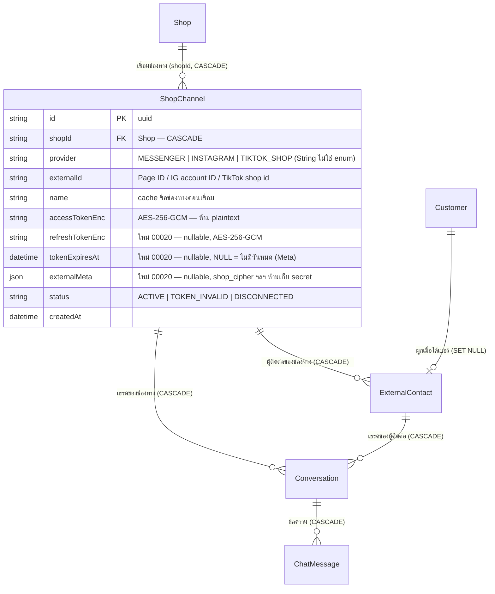

> **โมดูล:** M00020-TikTokChatIntegration
> **ประเภทเอกสาร:** DATABASE Design
> **เวอร์ชัน:** 1.0
> **วันที่จัดทำ:** 2026-07-25
> **สถานะ:** Draft — `prisma/schema.prisma` แก้แล้ว + `prisma/migrations/20260725100000_channel_token_lifecycle/migration.sql` เขียนแล้ว (ตรงกัน, `prisma validate` ผ่าน)
> **🛑 ยังไม่ `migrate deploy`** — ต้องขอ user ยืนยันก่อนเพราะแตะฐานเดียวกับ production
> **เจ้าของเอกสาร:** SA/Database Agent (ดู [[Feature-Docs-Ownership]])
>
> ⚠️ เอกสารนี้เขียนโดย Controller ไม่ใช่ `safepay-database` — subagent ล้มไป 2 ครั้งในเซสชันนี้ (idle ไม่ส่งงาน) จึงทำเองแล้วบันทึกไว้ตรงนี้ตามความจริง

# DATABASE: TikTok Chat Integration

---

## 0. 🛑 ข้อควรระวังก่อนแตะ schema นี้

- **ห้าม `prisma migrate dev`** เด็ดขาด — DB dev = prod ตัวเดียวกัน (Supabase) และมี drift ที่ไม่ตรงกับ git อยู่แล้ว คำสั่งนี้จะเสนอ `migrate reset` ที่ลบข้อมูลทั้ง DB
- **ห้าม `prisma db pull`** เด็ดขาด — เสี่ยง introspect ผิด/ทับ schema ที่เขียนมือ (มี unmanaged SQL จาก feature 00017 อยู่ในฐานด้วย)
- **ห้าม `prisma format`** ในโปรเจกต์นี้ — จะ reflow ทั้งไฟล์ (วัดจริง: 95+/73− ทั้งที่แก้แค่ 3 คอลัมน์) กลบ diff จริงจนรีวิวไม่ได้ ให้จัด alignment ด้วยมือให้ตรงบล็อกเดิมแทน
- Apply ด้วย `prisma migrate deploy -e .env.local` เท่านั้น **หลังขอ user ยืนยันทุกครั้ง**
- หลัง migrate ต้อง **restart dev server** เสมอ — Prisma client เก่าไม่มี field ใหม่ → route พังด้วย error 500 ที่ debug ยาก

---

## 1. Overview

feature นี้ **ไม่สร้าง table ใหม่เลย** และ **ไม่แตะตารางข้อความ** — ต่อยอดโครง channel-aware ของ [[../00018 - Facebook Chat Integration/DATABASE|feature 00018]] ทั้งชุด แล้วเพิ่มเฉพาะสิ่งที่ TikTok ต้องมีแต่ Facebook ไม่ต้องมี คือ **การต่ออายุ token**

- **Store:** PostgreSQL 16 บน Supabase (ฐานเดียวสำหรับ dev + prod — ดู §0)
- **ORM:** Prisma; migration = hand-written SQL + `migrate deploy`
- **ไม่ใช้ RLS:** authorization อยู่ที่ `src/services/` — ทุก query scope `shopId` เทียบ session ที่ WHERE clause

### 1.1 สิ่งที่ reuse ได้ 100% (ไม่แตะเลย)

**เหตุผลที่ไม่ต้องเพิ่ม table:** `ShopChannel.provider` และ `Conversation.channel` เป็น `String` **ไม่ใช่ Prisma enum** (ตาม convention เดิมของโปรเจกต์ที่ validate ค่าที่ Valibot ไม่ใช่ที่ DB) → เพิ่มค่า `"TIKTOK_SHOP"` ได้โดย **ไม่มี DDL**

| Model / field | ใช้ต่อได้เพราะ |
|---|---|
| `ShopChannel` (table) | provider-agnostic อยู่แล้ว — 1 Shop : N channel, เก็บ token เข้ารหัส, มี status lifecycle |
| `ShopChannel` partial unique `(provider, externalId)` เฉพาะแถว active | บังคับ BR-TTC-01 "1 ร้าน TikTok ผูกร้าน Deep เดียวในขณะใดขณะหนึ่ง" + BR-TTC-02 "ถอดแล้วย้ายได้" ได้ฟรีทั้งคู่ |
| `ExternalContact` + unique `(shopChannelId, externalUserId)` | บังคับ BR-TTC-08 "ผู้ติดต่อ scope ต่อช่องทาง ห้าม dedup ข้ามร้าน" ได้ฟรี |
| `ExternalContact.customerId` → `Customer` | FR-TTC-12 ผูกลูกค้าเข้าทะเบียนเมื่อได้เบอร์ |
| `Conversation.channel` / `shopChannelId` / `externalContactId` | เธรดของช่องทางนอก |
| `Conversation.lastInboundAt` | ฐานคำนวณหน้าต่างเวลา — ใช้กับกฎ 48 ชม. ของทาง B ได้ตรง ๆ |
| `ChatMessage.externalMessageId @unique` | **กลไก idempotency** — TikTok retry ได้นานถึง 72 ชม. (นานกว่า Meta) ยิ่งจำเป็น (BR-TTC-12) |
| `ChatMessage.deliveryStatus` / `failureReason` | BR-TTC-23 ห้ามล้มเหลวแบบเงียบ |
| `Conversation.isPinned/isHidden/isSpam/resolvedAt/alias/chatGroupId` | inbox state ทั้งชุด (BR-TTC-18) |
| `QuickMessage`, คอลัมน์ CRM บน `ExternalContact` | FR-TTC-11 เครื่องมือช่วยตอบ |
| `Notification` (`kind='chat_message'`) | FR-TTC-10 แจ้งเตือน |

### 1.2 สิ่งที่เปลี่ยน (ทั้งหมดที่ feature นี้ทำกับ DB)

| Model | การเปลี่ยนแปลง | ประเภท |
|---|---|---|
| `ShopChannel` | เพิ่ม `refreshTokenEnc`, `tokenExpiresAt`, `externalMeta` + index `(status, tokenExpiresAt)` | Additive (nullable ทั้งหมด) |

**จบแค่นี้** — ไม่มี table ใหม่, ไม่มีคอลัมน์ถูกลบ/rename/เปลี่ยนชนิด, ไม่มี backfill

---

## 2. ERD (ส่วนที่เกี่ยวข้อง)



---

## 3. คอลัมน์ที่เพิ่ม

### 3.1 `ShopChannel` (มีอยู่แล้ว, feature 00018 — เพิ่มแบบ additive)

| Column | Type | Null | Default | Key | หมายเหตุ |
|---|---|---|---|---|---|
| `refreshTokenEnc` | `TEXT` | YES | NULL | — | refresh token ผ่าน AES-256-GCM (`src/lib/token-crypto.ts`) เหมือน `accessTokenEnc` — **ห้าม plaintext ห้าม log ห้ามส่งกลับ client** (BR-TTC-05). ช่องทาง Meta เป็น `NULL` เพราะ page token ไม่ต้องต่ออายุ |
| `tokenExpiresAt` | `TIMESTAMP(3)` | YES | NULL | INDEX(composite) | เวลาที่ access token หมดอายุ — cron ใช้หาแถวที่ต้องต่อ **ก่อน** หมด ไม่ต้องรอ error จากการยิงจริง (BR-TTC-26). `NULL` = ช่องทางที่ token ไม่มีวันหมด (Meta) → cron ข้าม |
| `externalMeta` | `JSONB` | YES | NULL | — | ค่าเฉพาะ provider ที่ต้องแนบทุก request — TikTok Shop ใช้ `shop_cipher` ต่อร้าน (ได้จาก `GET /authorization/202309/shops` ตอนเชื่อม) |

**ทำไม `externalMeta` เป็น JSONB ไม่ใช่คอลัมน์แยกต่อ provider:** ค่าที่แต่ละช่องทางต้องแนบไม่เหมือนกันเลยและยังไม่รู้ครบ (TikTok = `shop_cipher`; ช่องทางอนาคตอาจเป็น region/advertiser id) ถ้าเพิ่มคอลัมน์ทีละ provider จะต้อง `ALTER` ตารางที่แชร์กับ prod ทุกครั้งที่เพิ่มช่องทาง — ต้นทุนความเสี่ยงสูงกว่าประโยชน์ของ typed column ที่ query ไม่เคยใช้เป็นเงื่อนไข

**🛑 ห้ามเก็บ secret ใน `externalMeta`:** JSONB ไม่ได้เข้ารหัส — secret ทุกตัวต้องไปที่ `accessTokenEnc`/`refreshTokenEnc` เท่านั้น `shop_cipher` **ไม่ใช่ secret** (เป็น identifier ที่ใช้ระบุร้านในคำขอ ต้องมี token คู่กันจึงเรียก API ได้) จึงเก็บใน JSONB ได้

**ทำไมไม่ทำเป็น table `ChannelToken` แยก:** ความสัมพันธ์เป็น 1:1 กับ `ShopChannel` เป๊ะ ไม่มี query ที่ต้องการ token โดยไม่ต้องการแถว channel และไม่มีประวัติ token ที่ต้องเก็บย้อนหลัง — แยก table จะได้แค่ JOIN เพิ่มในเส้นทางที่ร้อนที่สุด (ทุกข้อความขาออก)

---

## 4. Indexes

| Table | Columns | Type | Rationale |
|---|---|---|---|
| `ShopChannel` | `(status, tokenExpiresAt)` | BTREE composite | **ใหม่** — cron ต่ออายุ token: `WHERE status='ACTIVE' AND tokenExpiresAt < now() + threshold` เป็น query **ทั้งระบบ ไม่ scope ต่อร้าน** จึงใช้ index เดิม `(shopId, status)` ไม่ได้เลย (ไม่มี `shopId` ในเงื่อนไข → seq scan) |
| `ShopChannel` | `(provider, externalId)` partial เฉพาะแถว active | UNIQUE (เดิม) | BR-TTC-01/02 — ไม่ต้องแก้ ใช้กับ `TIKTOK_SHOP` ได้ทันที |
| `ShopChannel` | `(shopId, status)` | BTREE (เดิม) | `listChannels(shopId)` ในหน้าตั้งค่าช่องทาง |
| `ExternalContact` | `(shopChannelId, externalUserId)` | UNIQUE (เดิม) | BR-TTC-08 — hot path ของทุกข้อความขาเข้า |
| `ChatMessage` | `(externalMessageId)` | UNIQUE (เดิม) | BR-TTC-12 idempotency (TikTok retry 72 ชม.) |

**ไม่เพิ่ม index บน `refreshTokenEnc`/`externalMeta`** — อ่านจากแถวที่ query ด้วย PK/`shopChannelId` อยู่แล้ว ไม่มี query ที่ filter ด้วยสองคอลัมน์นี้

---

## 5. Migration Plan

### 5.1 ลำดับ — 1 ไฟล์, additive ล้วน, ไม่มี backfill

ไฟล์: `prisma/migrations/20260725100000_channel_token_lifecycle/migration.sql`

| ลำดับ | คำสั่ง | ความเสี่ยง |
|---|---|---|
| 1 | `ALTER TABLE "ShopChannel" ADD COLUMN "refreshTokenEnc" TEXT` | ต่ำ — nullable ไม่มี default = **metadata-only** บน Postgres ≥ 11 (ไม่ rewrite/scan ตาราง) |
| 2 | `ALTER TABLE "ShopChannel" ADD COLUMN "tokenExpiresAt" TIMESTAMP(3)` | ต่ำ — เหมือนข้อ 1 |
| 3 | `ALTER TABLE "ShopChannel" ADD COLUMN "externalMeta" JSONB` | ต่ำ — เหมือนข้อ 1 |
| 4 | `CREATE INDEX "ShopChannel_status_tokenExpiresAt_idx" ON "ShopChannel"("status","tokenExpiresAt")` | ต่ำ — ตารางมีหลักสิบแถว, `CREATE INDEX` แบบ plain ล็อกช่วงสั้นมาก ไม่ต้อง `CONCURRENTLY` |

### 5.2 Migration SQL

```sql
ALTER TABLE "ShopChannel" ADD COLUMN "refreshTokenEnc" TEXT;
ALTER TABLE "ShopChannel" ADD COLUMN "tokenExpiresAt" TIMESTAMP(3);
ALTER TABLE "ShopChannel" ADD COLUMN "externalMeta" JSONB;
CREATE INDEX "ShopChannel_status_tokenExpiresAt_idx" ON "ShopChannel"("status", "tokenExpiresAt");
```

### 5.3 วิธี Apply

```bash
npx dotenv -e .env.local -- npx prisma validate   # ผ่านแล้ว ณ 2026-07-25
# 🛑 DB dev = prod แชร์กัน — ขอ user ยืนยันก่อนบรรทัดถัดไปทุกครั้ง
npx dotenv -e .env.local -- npx prisma migrate deploy
npx prisma generate
# แจ้ง user restart dev server (client เก่าไม่มี field ใหม่ → route 500)
```

**สถานะจริง ณ วันที่เขียน:** schema + migration file ตรงกัน `prisma validate` ผ่าน `prisma generate` รันแล้ว — **`migrate deploy` ยังไม่รัน** ตรวจก่อนเริ่มงานถัดไปด้วย `SELECT migration_name FROM "_prisma_migrations" WHERE migration_name LIKE '%channel_token_lifecycle%'`

### 5.4 Rollback

| ขั้น | Rollback | ผลกระทบ |
|---|---|---|
| `CREATE INDEX` | `DROP INDEX "ShopChannel_status_tokenExpiresAt_idx";` | ไม่มี data loss — cron ช้าลงเท่านั้น |
| `ADD COLUMN` ทั้ง 3 | `ALTER TABLE "ShopChannel" DROP COLUMN ...` (ทีละคอลัมน์) | ปลอดภัยก่อนมีช่องทาง TikTok จริง; **หลังมีช่องทางจริง = ข้อมูลต่ออายุ token หายถาวร** → ช่องทาง TikTok ทุกช่องต้องเชื่อมใหม่ (ช่องทาง Meta ไม่กระทบเพราะ 3 คอลัมน์นี้เป็น `NULL` อยู่แล้ว) |

**rollback ปลอดภัยสมบูรณ์** ตราบใดที่ยังไม่มีแถว `provider='TIKTOK_SHOP'` — ต่างจาก migration ของ 00018 ที่ `DROP NOT NULL` ย้อนกลับตรง ๆ ไม่ได้

### 5.5 ผลกระทบ

- **Downtime:** ไม่มี — 3 คอลัมน์ nullable + index บนตารางเล็ก
- **Backward compat:** ช่องทาง Meta ที่ live อยู่ได้ `NULL` ทั้ง 3 คอลัมน์ → โค้ดเดิมทำงานเหมือนเดิมทุกประการ ไม่มี query ใดถูกบังคับให้อ่านคอลัมน์ใหม่ **ไม่ต้อง backfill**
- **Growth risk:** ไม่มี — `ShopChannel` โตตามจำนวนช่องทางที่ร้านเชื่อม (หลักสิบ–ร้อย) ไม่ใช่ตามจำนวนข้อความ
- **ตารางที่มี row จริง:** `ShopChannel` มีแถว production อยู่ (Messenger/Instagram ของร้านจริง) — แต่ทุกคำสั่งเป็น metadata-only ไม่แตะข้อมูลเดิม

---

## 6. Retention / ข้อควรระวัง

- **Data Retention:** ไม่มี retention job — เหมือน 00018 เก็บถาวรตราบเท่าที่ `Shop`/`ShopChannel` ไม่ถูกลบ (CASCADE)
- **PII / ข้อมูลอ่อนไหว:**
  - `accessTokenEnc` / `refreshTokenEnc` — **secret ระดับสูงสุดของ feature นี้** เข้ารหัสเสมอ; `shop-channel.service.ts` ใช้ Prisma `select` allow-list กันหลุดจาก `listChannels` — **ต้องตรวจว่า allow-list ไม่มี `refreshTokenEnc`/`externalMeta` หลุดออกไป** เมื่อแก้ service ใน Phase 3
  - `ExternalContact.name`/`avatarUrl`, `ChatMessage.body`/`imageUrl` — ตัวตน/เนื้อหาลูกค้าจริง ต้อง neutralize-at-source ก่อน serialize เข้า RSC flight (BR-TTC-34)
  - **ห้ามส่งเบอร์/อีเมล/ที่อยู่เข้า AI** (BR-TTC-31, สืบทอดจาก 00019) — คอลัมน์ที่เกี่ยวคือ `ExternalContact.phones`/`address` และ `Customer.phone`
- **Ownership scope ที่ WHERE clause เสมอ:** ไม่มี RLS — ทุก query `ShopChannel` ต้อง filter `shopId` เทียบสิทธิ์ (BR-TTC-30) และสิทธิ์คือ `canAccessShop` = เจ้าของ **หรือ** พนักงาน (BR-TTC-29)
- **Consistency ข้าม store:** token ใน DB กับสถานะจริงฝั่ง TikTok desync ได้ — ไม่มี webhook แจ้ง "token ถูก revoke" ระบบรู้ก็ตอนยิงแล้ว error (เหมือน Meta) จึงต้องมี `tokenExpiresAt` + cron เชิงรุก ไม่รอเชิงรับ
- **บทเรียนจริงจาก session 2026-07-25:** ระหว่าง QA พบว่าการเชื่อมเพจเดียวกันเข้าอีกร้านทำให้ token ของแถวเดิมใช้ไม่ได้ → ระบบ mark `TOKEN_INVALID` (ถูกต้อง) แต่ **หน้า `/settings/channels` ไม่มีปุ่มเชื่อมใหม่** ร้านจึงกู้เองไม่ได้ — เป็น gap ของ 00018 ที่ควรแก้ก่อนเปิด TikTok ให้ร้านใช้จริง (ไม่งั้นจะเจอปัญหาเดียวกันแต่กับ TikTok)

---

## 7. Traceability

| คอลัมน์ / Index | FR | BR | สถานะ |
|---|---|---|---|
| `refreshTokenEnc` | FR-TTC-09 | BR-TTC-05, BR-TTC-26 | schema + migration พร้อม, **ยังไม่ apply**, ยังไม่มี code path เขียน |
| `tokenExpiresAt` | FR-TTC-09 | BR-TTC-26, BR-TTC-27 | เหมือนข้างบน |
| `externalMeta` (`shop_cipher`) | FR-TTC-01 | BR-TTC-05 | เหมือนข้างบน |
| index `(status, tokenExpiresAt)` | FR-TTC-09 | BR-TTC-26 | เหมือนข้างบน |
| `provider='TIKTOK_SHOP'` (ค่าใหม่ ไม่ใช่ DDL) | FR-TTC-01 | BR-TTC-01, BR-TTC-03 | ไม่ต้อง migrate |
| reuse `ChatMessage.externalMessageId` | FR-TTC-02 | BR-TTC-12 | ใช้ได้ทันที |

---

## 8. Open Questions

1. **`externalMeta` ต้องเก็บอะไรอีกนอกจาก `shop_cipher`** — ขึ้นกับว่า sandbox ใช้ host แยกหรือไม่ (ถ้าแยก อาจต้องเก็บ `env: "sandbox" | "production"` ต่อช่องทาง เพื่อให้ร้านทดสอบและร้านจริงอยู่ระบบเดียวกันได้) — รอคำตอบ OQ-TTC-11
2. **อายุจริงของ access/refresh token ของ TikTok Shop** — ยังไม่ยืนยันจากเอกสารทางการ (ที่ค้นได้คือ Business Messaging ~24 ชม./~30 วัน ซึ่งเป็นทาง B คนละ API) ตัวเลขนี้กำหนดความถี่ของ cron → ต้องอ่านค่า `access_token_expire_in` ที่ token endpoint คืนมาจริงแล้วเก็บ ไม่ hardcode
3. **ต้องเก็บ `seller_name`/`region` ของร้าน TikTok ไหม** — `ShopChannel.name` มีอยู่แล้ว (cache ชื่อช่องทาง) น่าจะพอ ตัดสินตอนเห็น response จริงของ `GET /authorization/202309/shops`

---

## 9. สรุป

migration ของ feature นี้เป็น **การเพิ่ม 3 คอลัมน์ nullable + 1 index บนตารางเดียว** (`ShopChannel`) — เล็กที่สุดเท่าที่จะเป็นไปได้ เพราะโครง channel-aware ของ 00018 ออกแบบเผื่อหลายช่องทางไว้แล้ว และ `provider`/`channel` เป็น `String` ไม่ใช่ enum จึงรับค่า `TIKTOK_SHOP` ได้โดยไม่ต้อง DDL

**สิ่งเดียวที่ TikTok ต้องมีแต่ Facebook ไม่ต้องมี:** การต่ออายุ token — ซึ่งเป็นที่มาของทั้ง 3 คอลัมน์และ index ใหม่ ถ้าไม่ทำข้อนี้ ช่องทางจะตายเองเงียบ ๆ ภายในไม่กี่วันแล้วร้านจะเข้าใจว่าตอบลูกค้าไปแล้ว (เสียหายกว่าไม่มีฟีเจอร์เลย)

**ยังไม่ apply** — รอ user ยืนยัน แล้ว restart dev server ทันทีหลัง apply
