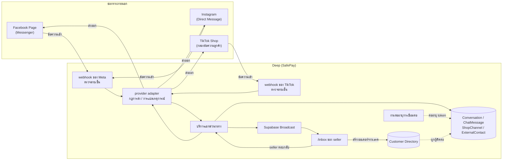

> **โมดูล:** M00020-TikTokChatIntegration
> **ประเภทเอกสาร:** Product Requirements Document (PRD)
> **เวอร์ชัน:** 1.0
> **วันที่จัดทำ:** 2026-07-25
> **สถานะ:** Draft — **ยังไม่ผ่าน user review** ห้าม implement ก่อนผ่าน gate นี้ (Hard Rule 11)
> **เจ้าของเอกสาร:** BA + PO + PM (ดู [[Feature-Docs-Ownership]])
>
> ⚠️ **เอกสารนี้เขียนขณะยังไม่รู้ผล Phase 0** — user กำลังยื่นขอ access จาก TikTok อยู่ (2026-07-25)
> ขอบเขตจริงของ feature จะถูกยืนยันที่ **Gate 0** ในแผน `docs/superpowers/plans/2026-07-25-tiktok-chat-integration-plan.md`
> ทุกข้อที่ยังไม่ยืนยันจากเอกสาร TikTok ปรากฏเป็น Assumption (§9.2) หรือ Open Question ใน [[BRD]] §11 — **ไม่เขียนเป็นข้อเท็จจริง**

---

# PRD: TikTok Chat Integration (TikTok Shop Customer Service + Business Messaging)

---

## Executive Summary

TikTok Chat Integration คือฟีเจอร์ที่เชื่อมข้อความจาก **TikTok** เข้ากับ `/inbox` ของ Deep โดยตรง ต่อยอดจาก `00011 - Deep Chat` (แชทในแอป) และ `00018 - Facebook Chat Integration` (Messenger/Instagram) ให้ inbox เดียวของ seller ครอบช่องทางที่ลูกค้าไทยใช้จริงเพิ่มอีกหนึ่งช่องทาง — seller ตอบลูกค้าที่ทักจาก TikTok ได้จากหน้าเดียวโดยไม่ต้องสลับแอป และใช้เครื่องมือช่วยตอบที่มีอยู่แล้ว (ข้อความสำเร็จรูป, AI ช่วยร่าง, โน้ต/แท็กลูกค้า, กลุ่มแท็บ) ได้ทันทีกับเธรด TikTok

**ปัญหาที่แก้:** TikTok Shop บังคับให้ร้านตอบลูกค้าภายใน **12 ชั่วโมง** เป็น store-health metric (และต่ำกว่า 1 ชั่วโมงในช่วง LIVE) ร้านที่ขายหลายช่องทางจึงต้องเฝ้าแอป TikTok Seller Center แยกอีกหนึ่งจอ ตอบช้าแล้วคะแนนร้านตกโดยที่ Deep มองไม่เห็นและช่วยอะไรไม่ได้เลย

**สิ่งที่ต่างจาก 00018 อย่างมีนัยสำคัญ (และเป็นเหตุผลที่ feature นี้ไม่ใช่ "แค่เพิ่ม provider"):**

1. **TikTok ไม่มี DM API สำหรับบัญชีทั่วไป** — มีเฉพาะ 2 ทางที่ต่างกันคนละเรื่อง (ดู §3.1) ทางหนึ่งจำกัดที่ร้านซึ่งขายบน TikTok Shop อีกทางเป็น Beta ที่ยังไม่ยืนยันว่าเปิดให้ไทย
2. **Token มีอายุสั้นและต้อง refresh เอง** — ต่างจาก Facebook page token ที่เป็น long-lived ระบบต้องมีงานเบื้องหลังต่ออายุ token ไม่ให้ช่องทางตายกลางดึก
3. **กฎการส่งข้อความไม่เหมือนกันระหว่างสองทาง** — ทาง TikTok Shop ร้านทักลูกค้าก่อนได้และไม่มีหน้าต่างเวลา แต่ทาง Business Messaging ห้ามทักก่อนและมีหน้าต่าง 48 ชั่วโมงจำกัด 10 ข้อความติด

MVP นี้ **ไม่สร้างหน้าแชทใหม่และไม่สร้างตารางข้อความใหม่** — ขยาย `Conversation`/`ChatMessage` ที่ channel-aware อยู่แล้วจาก 00018 ให้รับค่าช่องทางใหม่ (`provider`/`channel` เป็น `String` ไม่ใช่ enum จึงไม่ต้องแก้โครงตาราง) และแทรก TikTok เข้าเป็น "ช่องทางที่สาม" หลังชั้น provider adapter ที่ต้องแยกออกมาก่อน (ดู §6.2 ความเสี่ยง R-1)

---

## 1. Business Goals & KPIs

### 1.1 เป้าหมายทางธุรกิจ

| เป้าหมาย | รายละเอียด |
|----------|-----------|
| **ช่วยร้านรักษาคะแนน store-health ของ TikTok Shop** | เกณฑ์ตอบภายใน 12 ชม. เป็นตัวเลขที่กระทบการมองเห็นของร้านบน TikTok โดยตรง — Deep ต้องทำให้ร้านตอบทันง่ายขึ้น ไม่ใช่แค่เก็บข้อความมาไว้ |
| **inbox เดียวครอบทุกช่องทางที่ลูกค้าไทยใช้** | ต่อจาก Deep Chat + Messenger + Instagram ให้ TikTok เป็นช่องทางที่สาม seller ไม่ต้องเฝ้าหลายจอ |
| **ให้เครื่องมือช่วยตอบที่มีอยู่แล้วครอบช่องทางใหม่ทันที** | ข้อความสำเร็จรูป (00018) + AI ช่วยร่าง (00019) + โน้ต/แท็ก/กลุ่มแท็บ ต้องใช้กับเธรด TikTok ได้เลยโดยไม่ต้องสร้างของใหม่ |
| **วางรอยต่อให้ช่องทางถัดไปเสียบง่ายขึ้น** | การแยก provider adapter ในรอบนี้ทำให้ LINE (หรือช่องทางอื่น) ในอนาคตไม่ต้องรื้อ `channel-chat.service` อีก |
| **ไม่ทำให้ช่องทางที่ใช้งานจริงอยู่แล้วพัง** | Messenger/Instagram live บน prod อยู่แล้ว — งาน refactor ที่จำเป็นต้องไม่มี regression |

### 1.2 ตัวชี้วัดความสำเร็จ (KPIs)

> ไม่มี baseline จริงเพราะยังไม่เคย live — เป้าตัวเลขเป็น proposed ปรับได้หลัง launch

| KPI | คำอธิบาย | เป้าหมาย (เสนอ) |
|-----|----------|---------|
| **ร้านเชื่อมช่องทาง TikTok สำเร็จ** | จำนวน `ShopChannel` ของ provider TikTok สถานะ `ACTIVE` | วัด trend หลัง launch |
| **% ข้อความ inbound ที่บันทึกสำเร็จ** | ข้อความจาก webhook ที่ signature ผ่าน แล้วปรากฏใน `/inbox` ถูกต้อง (รวมกรณี TikTok ยิงซ้ำ) | 100% |
| **อัตราข้อความซ้ำในเธรด** | TikTok retry ได้ถึง 72 ชม. — ข้อความเดิมต้องไม่ถูกบันทึกซ้ำ | 0% |
| **% เธรด TikTok ที่ตอบภายใน 12 ชม.** | ผูกตรงกับเกณฑ์ store-health ของ TikTok Shop | วัด baseline เดือนแรก แล้วตั้งเป้า |
| **ช่องทางตายจาก token หมดอายุ** | จำนวนครั้งที่ `ShopChannel` กลายเป็น `TOKEN_INVALID` เพราะ refresh ไม่ทัน (ไม่ใช่เพราะร้านถอนสิทธิ์เอง) | 0 ครั้ง |
| **Zero Regression บนช่องทางเดิม** | Deep Chat + Messenger + Instagram ไม่มี behavior change ที่ไม่ตั้งใจหลังแยก provider adapter | Regression suite ผ่าน 100% |

---

## 2. User Personas (กลุ่มผู้ใช้งาน)

### 2.1 Seller ที่มีร้านบน TikTok Shop (persona หลักของ feature นี้)

**ข้อมูลพื้นฐาน:** ร้านค้าไทยที่ขายบน TikTok Shop อยู่แล้ว (มี Seller Center) และใช้ Deep เป็นระบบจัดการออเดอร์/ลูกค้าอยู่แล้ว ปัจจุบันตอบข้อความลูกค้า TikTok ผ่านแอป TikTok Seller Center แยกจาก Deep

**เป้าหมาย:** ตอบลูกค้า TikTok ให้ทันเกณฑ์ 12 ชั่วโมงโดยไม่ต้องเฝ้าอีกหนึ่งแอป และใช้ข้อความสำเร็จรูป/AI ช่วยร่างชุดเดียวกับที่ใช้ตอบ Messenger อยู่แล้ว

**ความต้องการ:** เชื่อมร้าน TikTok Shop ได้เองไม่ต้องพึ่งทีม dev, เห็นชัดว่าข้อความมาจาก TikTok, ได้แจ้งเตือนเมื่อมีข้อความใหม่, รู้ทันทีถ้าการเชื่อมต่อมีปัญหา (ไม่ใช่มารู้ตอนที่ตอบลูกค้าไปแล้วไม่ถึง)

**จุดปวด (Pain Points):** ต้องเปิด TikTok Seller Center แยก / คะแนนร้านตกเพราะตอบเกิน 12 ชม. โดยไม่รู้ตัว / พิมพ์คำตอบเดิมซ้ำเพราะข้อความสำเร็จรูปที่ทำไว้ใน Deep ใช้กับ TikTok ไม่ได้ / ประวัติลูกค้าคนเดียวกันที่ทักทั้ง Messenger และ TikTok แยกกันอยู่คนละที่

**User Story:**
> ในฐานะ Seller ที่ขายบน TikTok Shop ฉันต้องการเชื่อมร้าน TikTok เข้ากับ Deep แล้วตอบลูกค้าจาก `/inbox` เดียวกับที่ตอบ Messenger อยู่แล้ว เพื่อตอบทันเกณฑ์ 12 ชั่วโมงของ TikTok โดยไม่ต้องเฝ้าหลายแอป

### 2.2 ลูกค้าที่ทักร้านผ่าน TikTok (ไม่ใช่ Deep User)

**ข้อมูลพื้นฐาน:** ผู้ใช้ TikTok ทั่วไปที่ทักหาร้านผ่านแอป TikTok — **ไม่มีบัญชี Deep** และไม่จำเป็นต้องสมัคร

**เป้าหมาย:** สอบถามสินค้า/สั่งซื้อ/ติดตามพัสดุผ่านช่องทางที่ตัวเองใช้อยู่ โดยไม่รู้สึกว่าประสบการณ์เปลี่ยน

**ความต้องการ:** ได้รับคำตอบในแอป TikTok ของตัวเองตามปกติ (ไม่ต้องรู้ว่าเบื้องหลังร้านตอบผ่าน Deep)

**จุดปวด:** ไม่มี pain point โดยตรงจากฝั่งนี้ — แต่ระบบต้องไม่ทำให้แย่ลง เช่น ข้อความที่ร้านตอบไม่ถึงเพราะ token ตายโดยไม่มีใครรู้ หรือร้านตอบช้าลงเพราะระบบใหม่ใช้ยากกว่าเดิม

**User Story:**
> ในฐานะลูกค้าที่ทักร้านผ่าน TikTok ฉันต้องการได้รับคำตอบในแอปที่ฉันใช้อยู่ตามปกติ โดยไม่ต้องรู้ว่าร้านใช้ระบบอะไรตอบอยู่เบื้องหลัง

### 2.3 พนักงานร้าน (ShopMember) ที่ช่วยตอบแชท

**ข้อมูลพื้นฐาน:** พนักงานที่ถูกเชิญเข้าร้านผ่าน invite link (feature `00012 - Shop Staff Invite Links`) — ไม่ใช่เจ้าของร้าน แต่มีหน้าที่ตอบแชท

**เป้าหมาย:** ตอบเธรด TikTok ของร้านได้เหมือนตอบเธรด Messenger

**ความต้องการ:** สิทธิ์ตอบแชทต้องครอบช่องทาง TikTok ด้วย ไม่ใช่เฉพาะเจ้าของร้าน

**จุดปวด:** เคยเกิดบั๊กจริงบน prod แล้วในฟีเจอร์ 00018 ที่ตรวจสิทธิ์เฉพาะ "เจ้าของร้าน" ทำให้ admin ของร้านแบบ BUSINESS ตอบแชทร้านตัวเองไม่ได้ — feature นี้ต้องไม่ทำผิดซ้ำ

**User Story:**
> ในฐานะพนักงานร้านที่ได้รับสิทธิ์ดูแลแชท ฉันต้องการตอบเธรด TikTok ของร้านได้เหมือนช่องทางอื่น เพื่อไม่ให้การตอบลูกค้าติดอยู่ที่เจ้าของร้านคนเดียว

---

## 3. Business Requirements

### 3.1 ทางเลือกทางเทคนิคที่กำหนดขอบเขตธุรกิจ (อ่านก่อน FR ทั้งหมด)

TikTok มี messaging API ที่ใช้ได้จริง 2 ตัว **คนละกลุ่มลูกค้ากัน** และ **ไม่มี** API สำหรับ DM ของบัญชีทั่วไป
ความต่างนี้ไม่ใช่รายละเอียดเชิงเทคนิค — มันกำหนดว่า **ใครใช้ฟีเจอร์นี้ได้** และ **ร้านทักลูกค้าก่อนได้หรือไม่**

| | **ทาง A — TikTok Shop Customer Service API** | **ทาง B — Business Messaging API (Beta)** |
|---|---|---|
| กลุ่มลูกค้า | ร้านที่ขายบน TikTok Shop | ร้านที่มี TikTok Business Account |
| ไทยรองรับ | **ใช่** | **ไม่ยืนยัน** (ไทยไม่อยู่ในลิสต์ห้าม แต่ไม่มีเอกสารยืนยันตรง) |
| ร้านทักลูกค้าก่อน | **ได้** | **ไม่ได้** — ลูกค้าต้องทักมาก่อน |
| หน้าต่างเวลาตอบ | ไม่มี | **48 ชม. + ส่งติดได้ ≤10 ข้อความ** reset เมื่อลูกค้าตอบ |
| ชนิดข้อความ | ข้อความ + รูป | ข้อความ (≤6,000 ตัวอักษร) + รูป JPG/PNG ≤3MB; **ไม่มีวิดีโอ/เสียง** |

**ผลตัดสินเชิงขอบเขต:** **ทาง A เป็น scope หลักของ feature 00020** — ทาง B เป็นส่วนขยายแบบ **มีเงื่อนไข** (ทำเมื่อได้รับอนุมัติ **และ** ยืนยันว่าเปิดให้ไทย) FR ที่เป็นของทาง B จึงมี Priority = **Conditional** และต้องไม่ถูกนับเป็นส่วนหนึ่งของ Definition of Done ในรอบนี้

**เหตุผล:** ทาง A ยืนยันได้ว่าใช้ในไทยได้จริง ไม่มีหน้าต่างเวลามาบีบ UX ร้านทักลูกค้าก่อนได้ และแก้ pain ที่วัดผลได้ตรง (เกณฑ์ 12 ชม.) — ส่วนทาง B ยังมีความไม่แน่นอน 2 ชั้น (อนุมัติ + region) ที่ไม่ควรเอาไปผูกกับกำหนดส่งงาน

### 3.2 ภาพรวม Functional Requirements (FR-TTC-01..15)

> ตารางนี้เป็น **overview ระดับ feature** — User Story เต็ม + Acceptance Criteria แบบตรวจวัดได้ของแต่ละ FR ดูที่ [[BRD]] §2 (รหัสเดียวกัน)

| FR | ชื่อ | ภาพรวม | Priority |
|----|------|--------|----------|
| **FR-TTC-01** | เชื่อมร้าน TikTok Shop เข้าระบบ | seller ทำเองได้จาก `/seller/settings/channels` — authorize แล้วระบบเก็บข้อมูลการเชื่อมต่อ (เข้ารหัส) + สมัครรับ webhook ให้อัตโนมัติ | Must |
| **FR-TTC-02** | รับข้อความตัวอักษรเข้า `/inbox` | ข้อความจากลูกค้า TikTok เข้าเธรดใน inbox เดิม ผูกกับผู้ติดต่อของช่องทางนั้น | Must |
| **FR-TTC-03** | รับรูปภาพเข้า `/inbox` | รูปจากลูกค้าถูกคัดลอกเข้า storage ของ Deep เอง (ไม่พึ่ง URL ของ TikTok ที่หมดอายุ) | Must |
| **FR-TTC-04** | ตอบข้อความตัวอักษรออกไป TikTok จริง | seller พิมพ์ใน Deep → ส่งถึงลูกค้าในแอป TikTok จริง | Must |
| **FR-TTC-05** | ส่งรูปออกไป TikTok | แนบรูปใน Deep แล้วส่งออกได้ (ขั้นตอนอัปโหลดต่างจาก Messenger) | Must |
| **FR-TTC-06** | แสดงสถานะส่งไม่สำเร็จในเธรด | ส่งไม่ออก (การเชื่อมต่อหมดอายุ/ลูกค้าปิดรับ/เหตุอื่น) ต้องเห็นในเธรดพร้อมเหตุผล **ห้าม fail เงียบ** | Must |
| **FR-TTC-07** | ป้ายช่องทาง + ตัวกรองใน `/inbox` | แยกแยะได้ว่าเธรดมาจาก TikTok และกรองดูเฉพาะช่องทางได้ (ใช้ icon จริง ไม่ใช้ emoji) | Must |
| **FR-TTC-08** | จัดการ/ถอดช่องทาง TikTok | เห็นสถานะการเชื่อมต่อ (ใช้งานได้/ต้องเชื่อมใหม่) และถอดได้เอง | Must |
| **FR-TTC-09** | ต่ออายุการเชื่อมต่ออัตโนมัติ | ระบบต่ออายุก่อนหมด ไม่ปล่อยให้ช่องทางตายเงียบ; ถ้าต่อไม่ได้ต้องแจ้งร้านให้เชื่อมใหม่ | Must |
| **FR-TTC-10** | แจ้งเตือนข้อความใหม่จาก TikTok | ใช้ระบบแจ้งเตือน + เสียงเตือนเดิมของ inbox ไม่แยกกลไกใหม่ | Must |
| **FR-TTC-11** | เครื่องมือช่วยตอบเดิมใช้กับเธรด TikTok ได้ | ข้อความสำเร็จรูป, AI ช่วยร่าง, โน้ต/แท็ก/ชื่อเรียก, กลุ่มแท็บ, ปักหมุด/ซ่อน/ปิดงาน/สแปม ทำงานกับเธรด TikTok เหมือนช่องทางอื่น | Must |
| **FR-TTC-12** | ผูกลูกค้า TikTok เข้า Customer Directory | เมื่อได้เบอร์โทรจากการสร้างออเดอร์ → ผูกผู้ติดต่อเข้า `Customer` เพื่อรวมประวัติข้ามช่องทาง | Should |
| **FR-TTC-13** | ทำเครื่องหมายว่าอ่านแล้วกลับไปที่ TikTok | เมื่อ seller เปิดอ่านเธรดใน Deep ให้สถานะอ่านที่ฝั่ง TikTok ตรงกัน ไม่ให้ร้านดูเหมือนไม่ตอบ | Should |
| **FR-TTC-14** | ร้านเริ่มบทสนทนากับลูกค้าก่อนได้ (เฉพาะทาง A) | เปิดเธรดใหม่หาลูกค้า TikTok Shop ได้โดยลูกค้าไม่ต้องทักมาก่อน | Should |
| **FR-TTC-15** | หน้าต่างเวลาตอบ 48 ชม. + จำกัด 10 ข้อความ (เฉพาะทาง B) | แสดงเวลาที่เหลือ + จำนวนข้อความที่ส่งได้อีก และปิดช่องพิมพ์เมื่อหมดสิทธิ์ ไม่ปล่อยให้กดส่งแล้วค่อย error | **Conditional** |

### 3.3 เชื่อมและดูแลช่องทาง TikTok

**ความต้องการ:**
- seller เชื่อมร้าน TikTok Shop เข้ากับ Deep ได้ด้วยตัวเองจาก `/seller/settings/channels` โดยไม่ต้องพึ่งทีม dev (FR-TTC-01)
- seller เห็นสถานะช่องทาง (ใช้งานได้ / ต้องเชื่อมใหม่) และถอดการเชื่อมต่อได้เมื่อต้องการ (FR-TTC-08)
- ระบบต่ออายุการเชื่อมต่อให้อัตโนมัติก่อนหมดอายุ (FR-TTC-09)

**Business Rules:**
- 1 ร้าน TikTok Shop ผูกได้กับร้าน Deep **เดียวเท่านั้น** ในขณะใดขณะหนึ่ง — กันสองร้านแย่งกันรับข้อความจากกล่องเดียวกัน (เดินตามกติกาเดิมของ 00018 ที่ผ่อนให้ย้ายได้หลังถอด)
- 1 ร้าน Deep เชื่อมได้หลายช่องทางพร้อมกัน (Messenger + Instagram + TikTok อยู่ร่วมกันได้)
- การเชื่อมช่องทางเป็นขั้นตอนแยกจากการ login เข้า Deep — ไม่ขอสิทธิ์ TikTok ตอนสมัคร/login
- ข้อมูลการเชื่อมต่อ (token และค่าที่ใช้เรียก API แทนร้าน) ต้องเก็บแบบเข้ารหัสเสมอ ห้ามส่งกลับ client ห้ามบันทึกลง log

**เหตุผล:** ต่ออายุอัตโนมัติ (FR-TTC-09) เป็นข้อที่ **ไม่มีใน 00018** เพราะ Facebook page token เป็น long-lived ส่วน TikTok ไม่ใช่ — ถ้าไม่ทำข้อนี้ ช่องทางจะตายเองภายในไม่กี่วันแล้วร้านจะรู้ก็ตอนที่ตอบลูกค้าไปแล้วไม่ถึง ซึ่งเสียหายกว่าการเชื่อมไม่ได้ตั้งแต่แรก

### 3.4 รับข้อความเข้า

**ความต้องการ:**
- ข้อความที่ลูกค้าส่งมาที่ร้านบน TikTok ต้องปรากฏใน `/inbox` ของ Deep เป็นเธรดเดียวกันกับช่องทางอื่น รองรับทั้งตัวอักษรและรูปภาพ (FR-TTC-02, FR-TTC-03)
- ลูกค้า TikTok **ไม่ใช่** `User` ของ Deep — เป็นผู้ติดต่อของช่องทางนั้น จนกว่าจะได้เบอร์โทร (FR-TTC-12)

**Business Rules:**
- ข้อความที่ระบบได้รับซ้ำต้องไม่สร้างข้อความซ้ำในเธรด — **TikTok ยิงซ้ำได้นานถึง 72 ชั่วโมง** ซึ่งนานกว่าที่ Meta ทำ ทำให้กลไกกันซ้ำสำคัญกว่าเดิม
- ถ้าร้านตอบลูกค้าจากแอป TikTok Seller Center โดยตรง ข้อความนั้นควรปรากฏใน Deep ด้วยเพื่อให้ประวัติไม่ขาดตอน — **ยังไม่ยืนยันว่า TikTok ส่งเหตุการณ์นี้มาให้หรือไม่** (ดู OQ ใน [[BRD]] §11) ต่างจาก Messenger ที่มี `is_echo` ชัดเจน
- ผู้ติดต่อ TikTok ของร้าน A กับร้าน B ถือเป็นคนละคนแม้จะเป็นบัญชี TikTok เดียวกัน — ห้ามรวมข้อมูลข้ามร้าน

**เหตุผล:** ข้อความเข้าเป็นหัวใจของ value prop (ตอบทัน 12 ชม.) และการกันข้อความซ้ำเป็นเรื่องที่ผู้ใช้เห็นทันทีถ้าพลาด — เธรดที่มีข้อความลูกค้าซ้ำ 3 รอบทำให้ร้านอ่านผิดและตอบผิด

### 3.5 ตอบข้อความออก

**ความต้องการ:**
- seller ตอบจาก Deep แล้วข้อความต้องถึงลูกค้าในแอป TikTok จริง ทั้งตัวอักษรและรูป (FR-TTC-04, FR-TTC-05)
- ส่งไม่สำเร็จต้องแสดงในเธรดพร้อมเหตุผลที่อ่านรู้เรื่อง (FR-TTC-06)
- ทาง A: ร้านเริ่มบทสนทนาก่อนได้ (FR-TTC-14) — ทาง B: ห้ามเริ่มก่อน และมีหน้าต่าง 48 ชม. จำกัด 10 ข้อความ (FR-TTC-15)

**Business Rules:**
- **กฎการส่งขึ้นกับช่องทาง ไม่ใช่กฎเดียวทั้งระบบ** — UI ต้องบอกกฎของช่องทางที่กำลังตอบอยู่ให้ถูกต้อง (เธรด TikTok Shop ไม่ควรขึ้นข้อความเตือนเรื่องหน้าต่างเวลาเพราะไม่มี)
- สิทธิ์การตอบแชทคือ "เจ้าของร้าน **หรือ** พนักงานที่มีสิทธิ์เข้าถึงร้าน" ไม่ใช่เจ้าของร้านเท่านั้น
- ไม่มีการส่งข้อความหาลูกค้าหลายคนพร้อมกัน (broadcast) และไม่มีระบบตอบอัตโนมัติที่ส่งเองโดยไม่มีคนกด

**เหตุผล:** ระบบที่บังคับกฎของช่องทางหนึ่งกับอีกช่องทางหนึ่งจะทำให้ร้านเสียโอกาส (เช่น ห้ามทักก่อนทั้งที่ TikTok Shop อนุญาต) หรือเจอ error ที่ทำนายไม่ได้ (เช่น ปล่อยส่งข้อความที่ 11 ในช่องทางที่จำกัด 10) — การเช็คกฎก่อนยิงจึงต้องแยกตามช่องทางตั้งแต่ระดับ requirement

### 3.6 เครื่องมือช่วยตอบและการจัดระเบียบเธรดต้องครอบช่องทางใหม่

**ความต้องการ:**
- ข้อความสำเร็จรูป (00018), AI ช่วยร่างคำตอบ (00019), โน้ต/แท็ก/ชื่อเรียกลูกค้า, กลุ่มแท็บ, ปักหมุด/ซ่อน/ปิดงาน/สแปม — ต้องใช้กับเธรด TikTok ได้ทันทีเหมือนช่องทางอื่น (FR-TTC-11)

**Business Rules:**
- **ห้ามส่งข้อมูลติดต่อของลูกค้า (เบอร์โทร/อีเมล/ที่อยู่) เข้าระบบ AI** — สืบทอดกฎที่ user อนุมัติไว้แล้วใน feature 00019 โดยไม่มีข้อยกเว้นให้ช่องทางใหม่
- โน้ตภายในร้านและชื่อที่แอดมินตั้งเรียกลูกค้าเป็นข้อมูลภายใน **ห้ามส่งออกไปหาลูกค้าทุกกรณี** และ AI ต้องไม่พูดถึงตรง ๆ ว่ามีโน้ตเขียนไว้
- AI **ห้ามส่งเอง** — ทุกร่างต้องผ่านสายตาคนก่อนส่งเสมอ
- ข้อความสำเร็จรูปเป็นของร้าน (พนักงานทุกคนใช้ชุดเดียวกัน) ไม่ได้แยกตามช่องทาง

**เหตุผล:** ถ้าเครื่องมือเหล่านี้ไม่ครอบช่องทางใหม่ seller จะรู้สึกว่า TikTok เป็น "ช่องทางชั้นสอง" ในระบบ แล้วกลับไปตอบใน TikTok Seller Center ตามเดิม ซึ่งทำให้เป้าหมายหลักของ feature (§1.1) ไม่เกิดเลยแม้ข้อความจะเข้ามาครบ

### 3.7 ไม่ทำให้ช่องทางเดิมพัง (ข้อกำหนดที่มาจากสภาพโค้ดจริง)

**ความต้องการ:**
- Deep Chat, Messenger และ Instagram ที่ใช้งานจริงบน production อยู่แล้ว ต้องทำงานเหมือนเดิมทุกประการหลังเพิ่มช่องทาง TikTok

**Business Rules:**
- งานปรับโครงสร้างภายในเพื่อรองรับหลายช่องทาง (แยกชั้น provider) ต้อง **ไม่เปลี่ยนพฤติกรรมของช่องทางเดิมแม้จุดเดียว** — รวมถึงหน้าต่าง 24 ชม. ของ Meta, การจับข้อความที่ร้านตอบจากแอปมือถือ, และการตั้งสถานะเมื่อการเชื่อมต่อหมดอายุ
- ต้องผ่านการทดสอบย้อนกลับ (regression) ของช่องทางเดิมก่อนเริ่มงานส่วน TikTok ไม่ใช่ทดสอบรวมทีเดียวตอนท้าย

**เหตุผล:** เหตุผลนี้มาจากการตรวจโค้ดจริง — บริการที่จัดการแชทช่องทางนอก (`channel-chat.service.ts`, 683 บรรทัด) ผูกกับ Meta แบบตรง ๆ อยู่หลายจุด (ค่าคงที่หน้าต่าง 24 ชม., การเรียกฟังก์ชันส่งข้อความของ Meta, การตีความรหัส error ของ Meta) การเสียบ TikTok ทับลงไปโดยไม่แยกชั้นก่อนจะกระจายเงื่อนไข "ถ้าเป็นช่องทางนี้…" ทั่วไฟล์ และความเสียหายจะไปโผล่ที่ Messenger ซึ่งร้านใช้จริงอยู่แล้ว ไม่ใช่ที่ TikTok ที่ยังไม่มีใครใช้

---

## 4. Business Rules & Constraints

### 4.1 กฎทางธุรกิจหลัก

| กฎ | คำอธิบาย |
|----|----------|
| **1 ร้าน TikTok = 1 ร้าน Deep (ในขณะใดขณะหนึ่ง)** | กันสองร้าน Deep แย่งรับข้อความจากกล่องเดียวกัน; ถอดแล้วย้ายไปผูกร้านอื่นได้ |
| **ลูกค้า TikTok ≠ User, ≠ Customer (จนกว่าจะได้เบอร์)** | เป็นผู้ติดต่อของช่องทาง ไม่สร้างบัญชีเงา และยังไม่เป็นลูกค้าในระบบจนกว่าจะได้เบอร์จากการสร้างออเดอร์ |
| **ผู้ติดต่อไม่รวมข้ามร้าน** | บัญชี TikTok เดียวกันที่ทักร้าน A และร้าน B ถือเป็นผู้ติดต่อคนละราย — รวมได้เฉพาะผ่าน `Customer` เมื่อได้เบอร์ |
| **ข้อความซ้ำต้องไม่เข้าเธรดซ้ำ** | TikTok ยิงซ้ำได้นานถึง 72 ชม. — กันซ้ำด้วยรหัสข้อความจากต้นทาง |
| **กฎการส่งขึ้นกับช่องทาง** | ทาง A ไม่มีหน้าต่างเวลาและทักก่อนได้; ทาง B มีหน้าต่าง 48 ชม. จำกัด 10 ข้อความ และห้ามทักก่อน |
| **สิทธิ์ตอบแชท = เจ้าของร้าน หรือ พนักงานของร้าน** | ไม่ใช่เจ้าของร้านเท่านั้น (บทเรียนบั๊กจริงบน prod จาก 00018) |
| **ห้ามส่งข้อมูลติดต่อลูกค้าเข้า AI** | เบอร์/อีเมล/ที่อยู่ ห้ามส่งเข้าระบบ AI — สืบทอดกฎที่อนุมัติไว้ใน 00019 |
| **Buyer app ไม่เปลี่ยนแปลง** | เธรด TikTok ไม่ปรากฏฝั่งผู้ซื้อ — feature นี้เป็นมุมมองฝั่ง seller เท่านั้น |
| **ไม่ใช้ตัวกลางที่ไม่ใช่ API ทางการ** | ห้ามใช้บริการภายนอกที่อ้างว่าดึง DM จากบัญชี TikTok ทั่วไปได้ — ผิดเงื่อนไขการใช้งานและเสี่ยงบัญชีลูกค้าถูกระงับ |

### 4.2 ข้อจำกัดทางธุรกิจ

| ข้อจำกัด | รายละเอียด |
|---------|-----------|
| **ต้องได้รับอนุมัติจาก TikTok ก่อนใช้งานจริง** | ต้องสมัคร app และขอสิทธิ์ใช้ API — ใช้เวลาไม่แน่นอน (หลายวันถึงหลายสัปดาห์) และ **ยังไม่รู้ผล ณ วันที่เขียนเอกสารนี้** |
| **ทาง A ใช้ได้เฉพาะร้านที่ขายบน TikTok Shop** | ร้านที่ขายผ่าน LIVE หรือโปรไฟล์อย่างเดียวโดยไม่มี TikTok Shop **ใช้ฟีเจอร์นี้ไม่ได้** ในรอบนี้ |
| **ทาง B ยังเป็น Beta และไม่ยืนยันว่าเปิดให้ไทย** | จึงเป็น Conditional ไม่ผูกกับกำหนดส่งงาน |
| **ไม่มี DM API สำหรับบัญชี TikTok ทั่วไป** | ข้อจำกัดจากตัว TikTok เอง (เหตุผลด้านความเป็นส่วนตัว) ไม่ใช่ทางเลือกของทีม |
| **ส่งออกได้เฉพาะข้อความและรูป** | ไม่มีการส่งวิดีโอ/เสียง/ไฟล์ออกในรอบนี้ |
| **Web-only ฝั่ง seller** | อยู่บน `/inbox` (Paces, seller เว็บ) เท่านั้น |
| **เอกสาร API ของ TikTok อ่านอัตโนมัติไม่ได้** | หน้าเอกสารของ TikTok เป็นหน้าที่ต้องรัน JavaScript — รายละเอียดบางอย่างต้องให้คนเปิดอ่านและคัดมาให้ (ดู §9.1) |

### 4.3 สถานะการเตรียมการฝั่ง TikTok (ณ 2026-07-25)

| รายการ | สถานะ | ผลกระทบต่องาน | Open Question |
|---|---|---|---|
| TikTok Shop Partner app | **user กำลังสมัคร** | ต้องได้ credential ก่อนทดสอบจริง — ไม่บล็อกการเขียนเอกสาร/ปรับโครงสร้างภายใน | OQ-TTC-01 |
| ขอสิทธิ์ Business Messaging | **user กำลังยื่น** | ผลลัพธ์ตัดสินว่า FR-TTC-15 (Conditional) จะทำหรือไม่ | OQ-TTC-01 |
| รูปแบบข้อมูลของคำสั่งส่งข้อความ | **ยังไม่ยืนยัน** | ต้องได้ก่อนเขียน SRS/SDS — ดู §9.1 | OQ-TTC-02 |
| วิธีตรวจสอบความถูกต้องของ webhook | **ยังไม่ยืนยัน** | **เป็นกลไกความปลอดภัยเดียวของ route รับข้อความ** — ห้ามเริ่มเขียน route ก่อนได้ข้อนี้ | OQ-TTC-03 |
| ร้าน TikTok Shop สำหรับทดสอบ | **ยังไม่ยืนยัน** | ต้องมีก่อนทำ QA แบบ end-to-end | OQ-TTC-08 |
| ข้อจำกัดอัตราการเรียก API ของทาง A | **ยังไม่ยืนยัน** | กระทบการออกแบบการดึงข้อมูลย้อนหลัง (ถ้ามี) | OQ-TTC-10 |
| TikTok ส่งเหตุการณ์เมื่อร้านตอบจากแอป Seller Center เองหรือไม่ | **ยังไม่ยืนยัน** | ถ้าไม่มี ประวัติเธรดอาจขาดตอนเมื่อร้านตอบนอก Deep — ต้องแจ้งร้านให้ทราบ | OQ-TTC-07 |

> Open Question ทั้งหมด (OQ-TTC-01..10) รวมอยู่ที่ [[BRD]] §11 ซึ่งเป็นที่เดียวที่ติดตามสถานะการปิดคำถาม

---

## 5. Out of Scope (นอกขอบเขต)

| หัวข้อ | คำอธิบาย |
|--------|----------|
| **TikTok LIVE chat / คอมเมนต์** | ยังไม่พบว่ามี API ทางการสำหรับเรื่องนี้ — ไม่อยู่ใน scope และ **ไม่สร้างโครงข้อมูลเผื่อไว้** (คอมเมนต์บน LIVE เป็นบทสนทนาสาธารณะ คนละรูปแบบกับแชท 1:1) |
| **DM ของบัญชี TikTok ทั่วไป (ไม่ใช่ Business/Shop)** | TikTok ไม่เปิด API ให้ — ไม่มีทางทำอย่างถูกต้อง |
| **บริการตัวกลางที่ไม่ใช่ API ทางการ** | ปฏิเสธโดยหลักการ ไม่ใช่เพราะทำไม่ได้ — เสี่ยงบัญชีลูกค้าถูกระงับและผิดเงื่อนไขการใช้งาน |
| **ส่งวิดีโอ/เสียง/ไฟล์ออกไป TikTok** | รอบนี้ส่งออกได้เฉพาะข้อความและรูป |
| **ระบบตอบอัตโนมัติ / chatbot / broadcast** | รวมถึง AI ที่ส่งเองโดยไม่มีคนกด — AI ในระบบนี้เป็นแค่ตัวช่วยร่าง |
| **ดึงประวัติแชทย้อนหลังทั้งหมดตอนเชื่อมช่องทางครั้งแรก** | รอบนี้เริ่มเก็บจากข้อความใหม่เป็นต้นไป (ถ้าจะทำต้องพิจารณาข้อจำกัดอัตราการเรียก API ซึ่งยังไม่ยืนยัน) |
| **เธรด TikTok ในฝั่ง buyer app** | ไม่แตะฝั่งผู้ซื้อเลย |
| **การรวมเธรดของคนเดียวกันข้ามช่องทางอัตโนมัติ** | ลูกค้าที่ทักทั้ง Messenger และ TikTok ยังเป็นสองเธรด — รวมได้เฉพาะผ่าน `Customer` เมื่อได้เบอร์ (เหมือนกติกา Messenger/Instagram ใน 00018) |

---

## 6. Risks & Mitigation (ความเสี่ยงและแนวทางแก้ไข)

### 6.1 ความเสี่ยงทางธุรกิจ

| ความเสี่ยง | ผลกระทบ | ระดับ | แนวทางแก้ไข |
|-----------|---------|-------|-------------|
| **TikTok ไม่อนุมัติ app หรือใช้เวลานานกว่าคาด** | build เสร็จแต่ไม่มีร้านไหนใช้ได้ | สูง | ทำ Phase 0 (ขอ access) เป็น **gate ก่อนลงทุนเขียนเอกสารชุดใหญ่** — ถ้าทั้งสองทางไม่ผ่านให้หยุด ไม่ใช่ build ไปก่อน |
| **ทาง B ไม่เปิดให้ไทย** | ร้านที่ไม่มี TikTok Shop ใช้ไม่ได้เลย | กลาง-สูง | ตั้ง scope หลักไว้ที่ทาง A ตั้งแต่ต้น (§3.1) ทาง B เป็น Conditional ไม่ผูกกำหนดส่ง |
| **ฐานลูกค้าที่ใช้ได้จริงเล็กกว่าที่คิด** | ลงแรงมากแต่ผู้ใช้น้อย ถ้าร้านใน Deep ส่วนใหญ่ไม่มี TikTok Shop | กลาง | ยกเป็น Open Question ให้ user ประเมินสัดส่วนร้านที่มี TikTok Shop ก่อนเริ่ม Phase 2 ([[BRD]] §11) |
| **ร้านเข้าใจผิดว่าเชื่อมแล้วจะได้ DM จากบัญชี TikTok ทั่วไปด้วย** | ความคาดหวังไม่ตรง เกิดการร้องเรียน | กลาง | หน้าเชื่อมช่องทางต้องบอกชัดว่ารองรับข้อความจากช่องทางไหน ไม่ใช้คำกว้างว่า "เชื่อม TikTok" ลอย ๆ |
| **ร้านเชื่อมแล้วช่องทางตายเงียบเพราะการเชื่อมต่อหมดอายุ** | ร้านตอบลูกค้าไปแล้วไม่ถึง คะแนน store-health ตกโดยไม่รู้ตัว — **แย่กว่าไม่เชื่อมตั้งแต่แรก** | สูง | FR-TTC-09 ต่ออายุอัตโนมัติ + แจ้งเตือนให้เชื่อมใหม่เมื่อต่อไม่ได้ (ไม่ใช่รอให้ร้านสังเกตเอง) |

### 6.2 ความเสี่ยงทางเทคนิค

| ความเสี่ยง | ผลกระทบ | แนวทางแก้ไข |
|-----------|---------|-------------|
| **R-1: ปรับโครงสร้างชั้น provider แล้วทำ Messenger บน prod พัง** | **ความเสี่ยงสูงสุดของ feature นี้** — ช่องทางที่ร้านใช้จริงอยู่แล้วเสียหาย เพื่อช่องทางที่ยังไม่มีใครใช้ | แยกเป็น phase ของตัวเองก่อนแตะ TikTok, ห้ามเปลี่ยนพฤติกรรมเดิม, เทสเดิมต้องผ่านโดยไม่แก้เงื่อนไขการทดสอบ, **บังคับ regression ของ Messenger/Instagram จริงก่อนไปต่อ** |
| **รายละเอียดที่ยังไม่ยืนยันทำให้เขียนสเปกผิด** | เขียน SRS/SDS ตามที่เดา แล้วโค้ดใช้จริงไม่ได้ | ห้ามเข้าขั้นเขียน SRS/SDS ก่อนปิดรายการใน §4.3 (โดยเฉพาะวิธีตรวจสอบ webhook) — สืบทอดบทเรียนว่าการทดลองต้องตรงกับเส้นทางที่ใช้จริง ไม่ใช่ทางที่สะดวกทดลอง |
| **การเชื่อมต่อหมดอายุกลางดึกโดยไม่มีใครต่อ** | ช่องทางตายเงียบ (ดู §6.1) | งานเบื้องหลังต่ออายุตามกำหนด + สถานะที่ร้านเห็นในหน้าจัดการช่องทาง |
| **ข้อความซ้ำจากการยิงซ้ำนาน 72 ชม.** | เธรดมีข้อความลูกค้าซ้ำ ทำให้ร้านอ่านผิด/ตอบผิด | กันซ้ำที่ระดับฐานข้อมูลด้วยรหัสข้อความจากต้นทาง (กลไกเดิมที่ใช้กับ Meta อยู่แล้ว) + ตอบรับ webhook ให้เร็วก่อนประมวลผล |
| **รูป/ไฟล์จากลูกค้าถูกปฏิเสธตอนคัดลอกเข้าระบบ** | รูปหายกลายเป็นช่องว่างในเธรด | มีบทเรียนตรงกันจากช่องทาง Messenger แล้ว (ข้อจำกัดชนิดไฟล์/ขนาดของที่เก็บไฟล์) — ต้องทดสอบซ้ำกับไฟล์จริงจาก TikTok ไม่ถือว่าแก้ครั้งเดียวจบ |
| **ข้อมูลส่วนตัวของลูกค้ารั่วผ่านการส่งข้อมูลไปหน้าจอ** | ชื่อ/ตัวตนลูกค้ารั่วในหน้า seller | ใช้แนวทางเดิมที่แก้ปัญหานี้มาแล้ว — ตัดข้อมูลอ่อนไหวที่ต้นทางก่อนส่งไปหน้าจอ ไม่ใช่แค่ซ่อนตอนแสดงผล |
| **การแก้ฐานข้อมูลกระทบข้อมูลจริง** | dev และ prod ใช้ฐานข้อมูลเดียวกัน | เพิ่มคอลัมน์แบบไม่กระทบข้อมูลเดิมเท่านั้น + ใช้คำสั่ง deploy (ห้ามคำสั่งที่ล้างฐานข้อมูล) + ขอ user ยืนยันก่อนทุกครั้ง |
| **ความปลอดภัยของ route รับข้อความ** | ข้อมูลปลอมเข้าระบบได้ถ้าไม่ตรวจลายเซ็น | การตรวจลายเซ็นเป็น authentication เดียวของ route นี้ — ห้ามเขียน route ก่อนรู้วิธีตรวจที่ถูกต้อง และต้องตรวจรูปแบบข้อมูลที่รับเข้าเองไม่เชื่อต้นทาง |

---

## 7. Glossary (อภิธานศัพท์)

| คำศัพท์ | ความหมาย |
|---------|----------|
| **TikTok Shop** | ระบบร้านค้าของ TikTok ที่ร้านขายสินค้าและมีกล่องข้อความลูกค้าใน Seller Center |
| **TikTok Shop Customer Service API** | ชุด API ฝั่ง TikTok Shop สำหรับอ่าน/ส่งข้อความในกล่องข้อความลูกค้าของร้าน — "ทาง A" ในเอกสารนี้ |
| **TikTok Business Messaging API** | ชุด API ให้ TikTok Business Account รับ-ส่ง DM กับผู้ใช้ TikTok — "ทาง B" สถานะ Beta |
| **TikTok Business Account** | ประเภทบัญชี TikTok สำหรับธุรกิจ (ต่างจากบัญชีส่วนตัว) — เงื่อนไขของทาง B |
| **store-health metric** | ตัวชี้วัดสุขภาพร้านของ TikTok Shop ที่กระทบการมองเห็นของร้าน — รวมเกณฑ์ตอบข้อความภายใน 12 ชม. |
| **หน้าต่างเวลาตอบ (messaging window)** | ช่วงเวลาที่ระบบต้นทางอนุญาตให้ร้านส่งข้อความหาลูกค้าได้ นับจากข้อความล่าสุดของลูกค้า (Meta 24 ชม. / TikTok ทาง B 48 ชม. / TikTok ทาง A ไม่มี) |
| **ช่องทาง (channel)** | หนึ่งการเชื่อมต่อระหว่างร้าน Deep กับกล่องข้อความภายนอกหนึ่งกล่อง (Facebook Page, Instagram, ร้าน TikTok Shop) |
| **ผู้ติดต่อภายนอก (external contact)** | ลูกค้าจากช่องทางนอกที่ยังไม่ผูกเข้า `Customer` ของ Deep |
| **provider adapter** | ชั้นโค้ดที่ห่อความต่างของแต่ละช่องทาง (วิธีส่ง, กฎหน้าต่างเวลา, การแปลเหตุการณ์เข้า) ให้บริการแชทส่วนกลางไม่ต้องรู้ว่าคุยกับใคร |
| **ข้อความสำเร็จรูป** | ชุดข้อความ/รูปที่ร้านเก็บไว้ล่วงหน้าเพื่อกดเติมลงช่องพิมพ์ (จาก feature 00018) |

---

## 8. Success Metrics (ตัวชี้วัดความสำเร็จ)

| ตัวชี้วัด | ค่าที่คาดหวัง | วิธีวัด |
|----------|---------------|--------|
| **เชื่อมช่องทาง TikTok สำเร็จ end-to-end** | seller เชื่อมจาก `/seller/settings/channels` ได้จริงไม่มี error | Playwright E2E |
| **ข้อความเข้าไม่ตก ไม่ซ้ำ** | ข้อความจากลูกค้าปรากฏครบใน `/inbox` และการยิงซ้ำไม่สร้างข้อความซ้ำ | สคริปต์ยิง webhook ที่เซ็นลายเซ็นถูกต้อง (ครอบกรณียิงซ้ำ) |
| **ตอบออกถึงลูกค้าจริง** | ข้อความ + รูปที่ส่งจาก Deep ปรากฏในแอป TikTok ของลูกค้า | ทดสอบด้วยมือกับร้านทดสอบ (ต้องมีร้านตาม §4.3) |
| **ส่งไม่สำเร็จไม่เงียบ** | ทุกกรณีที่ส่งไม่ออกมีสถานะ + เหตุผลในเธรด | Playwright E2E + ทดสอบกรณี token ตาย |
| **ต่ออายุการเชื่อมต่ออัตโนมัติได้จริง** | ช่องทางยังใช้งานได้ต่อเนื่องเกินอายุ token รอบแรกโดยไม่ต้องให้ร้านทำอะไร | ทดสอบข้ามรอบเวลาจริง + ตรวจ log งานเบื้องหลัง |
| **เครื่องมือช่วยตอบใช้กับเธรด TikTok ได้** | ข้อความสำเร็จรูป/AI ช่วยร่าง/โน้ต/กลุ่มแท็บ ทำงานเหมือนช่องทางอื่น | Playwright E2E |
| **Zero Regression บนช่องทางเดิม** | Deep Chat + Messenger + Instagram ทำงานเหมือนเดิมทุกประการ | Regression suite (บังคับก่อนเริ่มงาน TikTok) |

---

## 9. Dependencies & Assumptions

### 9.1 สิ่งที่ต้องพึ่งพา (Dependencies)

| ระบบ/ส่วนประกอบ | ความสัมพันธ์ |
|-----------------|-------------|
| **feature `00011 - Deep Chat`** | โครง `Conversation`/`ChatMessage` ที่ทุกช่องทางใช้ร่วมกัน — reuse pagination/unread/inbox UI |
| **feature `00018 - Facebook Chat Integration`** | โครง channel-aware ทั้งชุด (ช่องทาง, ผู้ติดต่อภายนอก, กลไกกันข้อความซ้ำ, สถานะการส่ง, กลุ่มแท็บ, โน้ต/แท็ก, ข้อความสำเร็จรูป) — feature นี้ต่อยอด **ไม่สร้างใหม่** |
| **feature `00019 - AI Reply Assistant`** | AI ช่วยร่าง + **กฎห้ามส่งข้อมูลติดต่อลูกค้าเข้า AI** ที่ต้องบังคับใช้กับช่องทางใหม่ด้วย |
| **feature `00014 - Customer Directory`** | `Customer.phone` required+unique เป็นแกนการผูกลูกค้าข้ามช่องทาง (FR-TTC-12) |
| **feature `00012 - Shop Staff Invite Links`** | สิทธิ์พนักงานร้านต้องครอบการตอบแชท TikTok ด้วย (persona 2.3) |
| **TikTok Shop Partner app + สิทธิ์ Customer Service API** | **ยังไม่ได้รับอนุมัติ** — user กำลังดำเนินการ |
| **สิทธิ์ Business Messaging API** | สำหรับ FR-TTC-15 (Conditional) — ยังไม่รู้ผล |
| **ที่เก็บไฟล์ของระบบ (storage)** | คัดลอกรูปจาก TikTok เข้ามาเก็บเอง (ระวังข้อจำกัดชนิดไฟล์/ขนาด — มีบทเรียนจากช่องทาง Messenger) |
| **งานเบื้องหลังตามกำหนดเวลา (cron)** | ต่ออายุการเชื่อมต่อ (FR-TTC-09) — ต้องมีค่า secret ของงาน cron ตั้งไว้ในระบบ production |
| **ชั้นป้องกัน API ของระบบ (`guardApi`)** | route รับข้อความจาก TikTok เป็น request จากภายนอกที่ไม่มี Origin — ต้องได้รับการยกเว้นแบบเดียวกับ route รับข้อความของ Meta |
| **ข้อมูลจาก user ที่ระบบดึงเองไม่ได้** | เอกสาร TikTok เป็นหน้าที่ต้องรัน JavaScript — **รูปแบบข้อมูลของคำสั่งส่งข้อความ** และ **วิธีตรวจสอบลายเซ็น webhook** ต้องให้ user เปิดอ่านแล้วส่งมาให้ |

### 9.2 สมมติฐาน (Assumptions)

- **ทาง A ใช้ได้ในไทย** — TikTok Shop เปิดให้บริการในไทยอยู่แล้ว และไม่พบข้อจำกัดด้าน region สำหรับ Customer Service API (**ยังไม่ยืนยันเป็นลายลักษณ์อักษรจากเอกสารทางการ** เพราะหน้าเอกสารอ่านอัตโนมัติไม่ได้)
- **ทาง B น่าจะใช้ได้ในไทย** — ไทยไม่ปรากฏในลิสต์ภูมิภาคที่ห้ามใช้ทั้งการรับ-ส่งข้อความและการส่งรูป แต่ **ไม่มีเอกสารยืนยันตรง** จึงถือเป็นสมมติฐาน ไม่ใช่ข้อเท็จจริง
- **โครงสร้างข้อมูลเดิมรองรับช่องทางใหม่ได้โดยไม่ต้องรื้อ** — ชนิดข้อมูลของช่องทางในฐานข้อมูลเป็นข้อความอิสระ (ไม่ใช่ชุดค่าที่ตรึงไว้) จึงเพิ่มค่าใหม่ได้ **ตรวจจาก schema จริงแล้ว**
- **ต้องเพิ่มคอลัมน์เก็บข้อมูลการต่ออายุการเชื่อมต่อ** — โครงเดิมออกแบบไว้สำหรับ token ที่ไม่หมดอายุ (Facebook) จึงไม่มีที่เก็บข้อมูลสำหรับต่ออายุ **ตรวจจาก schema จริงแล้ว** เป็นการเพิ่มแบบไม่กระทบข้อมูลเดิม
- **ยื่นขอ access ขนานกับการเขียนเอกสารได้** — งานเอกสารและงานปรับโครงสร้างภายในไม่ต้องรอ credential แต่ **การทดสอบจริงและการ launch ต้องรอ**
- **ร้านทดสอบใช้ร้าน TikTok Shop ของทีมเอง** — ยังไม่ยืนยันว่าเป็นร้านไหน (ดู Open Question)
- **ไม่ดึงประวัติแชทย้อนหลังตอนเชื่อมครั้งแรก** — เริ่มเก็บจากข้อความใหม่เป็นต้นไป เพื่อไม่ต้องพึ่งข้อจำกัดอัตราการเรียก API ที่ยังไม่ยืนยัน

---

## 10. Appendix

### 10.1 ตัวอย่าง User Journey — Seller เชื่อมร้าน TikTok แล้วตอบลูกค้าครั้งแรก

**Scenario: เชื่อมช่องทาง → รับข้อความ → ตอบกลับด้วยข้อความสำเร็จรูป → สร้างออเดอร์**

1. Seller เข้า `/seller/settings/channels` เห็นการ์ด "TikTok Shop" ข้าง Facebook/Instagram ที่เชื่อมไว้แล้ว
2. กด "เชื่อมร้าน TikTok Shop" → ระบบพาไปหน้าอนุญาตสิทธิ์ของ TikTok
3. Seller อนุญาต → ระบบเก็บข้อมูลการเชื่อมต่อแบบเข้ารหัส และสมัครรับข้อความให้อัตโนมัติ
4. การ์ดแสดงสถานะ "ใช้งานได้" พร้อมชื่อร้าน TikTok
5. ลูกค้าทักเข้ามาที่ร้านบน TikTok — ข้อความปรากฏใน `/inbox` พร้อมป้ายช่องทาง TikTok และมีเสียงแจ้งเตือน
6. Seller เปิดเธรด → สถานะอ่านแล้วส่งกลับไปที่ TikTok ด้วย (ร้านไม่ดูเหมือนเพิกเฉย)
7. Seller กดเลือกข้อความสำเร็จรูป "วิธีสั่งซื้อ" ที่ทำไว้ใช้กับ Messenger อยู่แล้ว → แก้เล็กน้อย → ส่ง
8. ข้อความถึงลูกค้าในแอป TikTok จริง
9. ลูกค้าตกลงสั่งซื้อ → Seller สร้างออเดอร์จากเธรด กรอกเบอร์ → ระบบผูกเข้า Customer Directory
10. ครั้งถัดไปที่ลูกค้าคนเดิมทักมา ระบบรู้จักในฐานะลูกค้าเดิมทันที

### 10.2 Diagram ภาพรวมสถาปัตยกรรม

**จุดที่ต้องอ่านจาก diagram นี้:**

1. **`provider adapter` เป็นของใหม่ที่ต้องแทรกเข้ามา** — ปัจจุบันบริการแชทส่วนกลางคุยกับ Meta ตรง ๆ การเพิ่ม TikTok ต้องผ่านชั้นนี้ ไม่ใช่ต่อสายตรงเส้นที่สอง
2. **ยังใช้ตารางข้อความชุดเดียวกับทุกช่องทาง** — จึงได้ unread / ค้นหา / กลุ่มแท็บ / ตัวชี้วัดเวลาตอบ ของเดิมมาใช้ทันที
3. **`งานต่ออายุการเชื่อมต่อ` เป็นกล่องที่ไม่มีใน 00018 เลย** — เป็นความต่างเชิงโครงสร้างที่มาจากอายุ token ของ TikTok ไม่ใช่ของแถม
4. **webhook แยก route ตามต้นทาง** เพราะวิธีตรวจลายเซ็นต่างกัน แต่ไหลเข้า adapter ชั้นเดียวกัน
5. **buyer app ไม่อยู่ใน diagram นี้เลย** เพราะ feature นี้ไม่แตะฝั่งผู้ซื้อแม้แต่จุดเดียว
